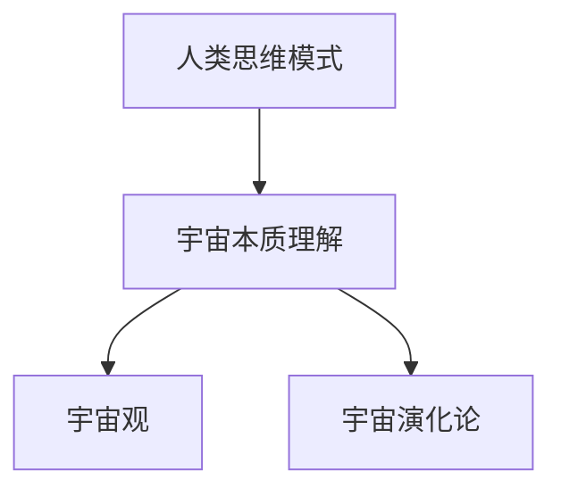
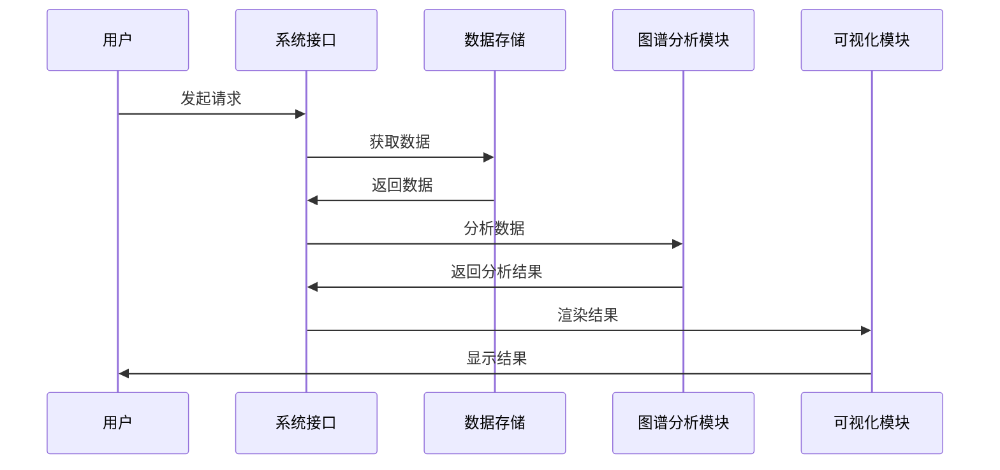
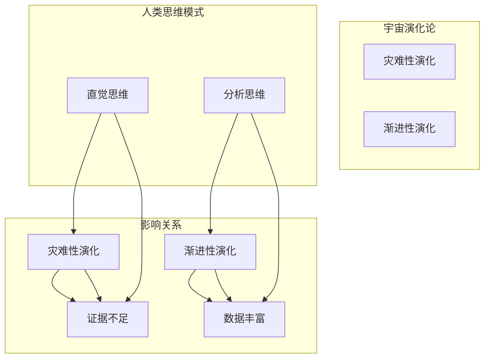

                 

### 概述

《人类思维模式对宇宙本质理解的影响》旨在探讨人类在认知宇宙时所采用的思维方式对其理解深度和广度的制约与拓展。本文通过系统地分析人类思维模式的起源、特征、分类以及其与宇宙观、宇宙演化论和宇宙本质认识的关系，深入剖析了思维模式对宇宙理解的直接影响与间接影响。随后，文章将探讨现代和未来思维模式对宇宙理解的影响，并预测思维模式的变革如何推动宇宙理解的发展趋势。最终，本文总结了人类思维模式与宇宙本质的统一，展望了人类思维模式的未来发展方向。

### 关键词

- 人类思维模式
- 宇宙本质
- 宇宙观
- 宇宙演化论
- 思维模式变革

### 摘要

本文通过逻辑清晰、结构紧凑的分析，探讨了人类思维模式对宇宙本质理解的影响。文章首先介绍了人类思维模式的定义、特征和分类，然后阐述了宇宙本质的概念及其特征。接着，文章深入探讨了人类思维模式与宇宙观、宇宙演化论和宇宙本质认识之间的联系和影响。通过对比分析，本文揭示了思维模式对宇宙理解中的局限性和突破方向。最后，文章展望了现代和未来思维模式对宇宙理解的影响，并提出了人类思维模式与宇宙本质统一的未来展望。

### 目录大纲

# 《人类思维模式对宇宙本质理解的影响》

> 关键词：人类思维模式、宇宙本质、宇宙观、宇宙演化论、思维模式变革

> 摘要：本文探讨了人类思维模式对宇宙本质理解的影响，分析了思维模式与宇宙观、宇宙演化论和宇宙本质认识之间的关系，并展望了现代和未来思维模式对宇宙理解的影响。

## 第一部分：问题背景

## 第二部分：思维模式对宇宙理解的影响

### 第3章：人类思维模式对宇宙观的影响

### 第4章：人类思维模式对宇宙演化论的影响

### 第5章：人类思维模式对宇宙本质认识的影响

## 第三部分：思维模式的变革与宇宙理解的发展

### 第6章：现代思维模式对宇宙理解的影响

### 第7章：未来思维模式对宇宙理解的影响

### 第8章：思维模式变革与宇宙理解的发展趋势

## 结语：人类思维模式与宇宙本质的统一

## 附录：参考文献

----------------------------------------------------------------

### 第一部分：问题背景

#### 人类思维模式的起源与演变

**1.1 人类思维模式的定义**

人类思维模式是指人类在感知、理解、分析和解决问题时所采用的方式和习惯。它涵盖了认知、逻辑、情感和经验等多个方面，是人们对外部世界进行思考和决策的基础。

**1.2 人类思维模式的起源**

人类的思维模式起源于数百万年前，随着大脑的进化，人类逐渐发展出独特的思维能力。从原始的直觉反应到复杂的抽象思维，人类思维模式的演变经历了漫长的过程。

**1.3 人类思维模式的演变**

- **从直觉到逻辑**：在人类历史的早期，人们主要依靠直觉和经验来感知和理解世界。随着文明的进步，逻辑思维逐渐成为主导，人们开始能够通过推理和判断来解决问题。

- **从线性到非线性**：在20世纪之前，人类的思维方式主要基于线性逻辑，即通过一系列因果关系来理解世界。随着系统科学和非线性动力学的发展，人们逐渐认识到世界的复杂性，开始采用非线性思维模式。

- **从二元到多元**：在过去的几千年里，人类思维模式主要基于二元对立（如阴与阳、真与假等），而在现代社会，多元思维模式逐渐得到重视，人们开始认识到事物的多样性及其相互关联。

**1.4 人类思维模式的局限性**

尽管人类思维模式在许多方面表现出色，但它也存在一些局限性：

- **认知偏见**：人类思维模式容易受到认知偏见的影响，如确认偏见、可用性偏见等，这些偏见可能导致人们对信息的理解和解释产生偏差。

- **线性思维**：尽管现代人类已经能够理解非线性关系，但线性思维仍然是人类思维模式的主要特征，这使得人们难以全面、深入地理解复杂系统的运作。

- **经验依赖**：人类思维模式在很大程度上依赖于过去的经验和知识，这可能导致对未知领域的探索受到限制。

#### 宇宙本质的理解与探索

**2.1 宇宙的定义**

宇宙是指包括一切物质、能量、时空和所有存在事物的整体。宇宙具有无限性、统一性和复杂性的特征。

**2.2 宇宙的起源**

关于宇宙的起源，目前主流的科学理论是“大爆炸理论”。根据这一理论，宇宙起源于约138亿年前的一个极高温度和密度的状态，随后逐渐膨胀并形成了我们今天所见的宇宙。

**2.3 宇宙的结构与演化**

宇宙的结构和演化是一个复杂的过程，包括星系的形成、黑洞的存在、宇宙背景辐射的测量等。通过观测和实验，科学家们不断揭示宇宙的奥秘。

**2.4 宇宙的本质**

宇宙的本质是关于宇宙中所有事物和现象的终极本质和规律。它涉及到物理学、天文学、哲学等多个领域，是一个深奥而复杂的问题。

#### 人类思维模式与宇宙本质的关系

**2.5 人类思维模式与宇宙观**

人类思维模式直接影响人们对宇宙观的理解。不同的思维模式会导致人们对宇宙的不同看法，如宇宙是有边界的还是无边界、宇宙是静态的还是动态的等。

**2.6 人类思维模式对宇宙演化论的影响**

人类思维模式对宇宙演化论的理解具有决定性作用。从牛顿力学到广义相对论，再到量子力学，人类思维模式的变革推动了宇宙演化论的不断进步。

**2.7 人类思维模式对宇宙本质认识的影响**

人类思维模式影响人们对宇宙本质的认识。从宏观到微观，从确定性到不确定性，人类思维模式的演变改变了我们对宇宙本质的理解。

### 第二部分：思维模式对宇宙理解的影响

#### 第3章：人类思维模式对宇宙观的影响

**3.1 人类思维模式与宇宙观的联系**

人类思维模式与宇宙观密切相关。宇宙观是人类对宇宙的整体认识和理解，而人类思维模式是形成宇宙观的基础。不同的思维模式会导致不同的宇宙观。

**3.2 人类思维模式对宇宙观的影响**

人类思维模式影响宇宙观的形成。例如，直觉思维倾向于认为宇宙是有边界的，而分析思维则可能认识到宇宙的无边界性。逻辑思维使得人们能够通过推理和判断来理解宇宙的规律。

**3.3 宇宙观的变化与人类思维模式的演进**

宇宙观的变化反映了人类思维模式的演进。从古代的宇宙观到现代的宇宙观，人类思维模式的变革推动了宇宙观的发展。例如，从地心说到日心说，再到相对论和量子力学，人类对宇宙的认识不断深化。

#### 第4章：人类思维模式对宇宙演化论的影响

**4.1 人类思维模式与宇宙演化论的关系**

人类思维模式与宇宙演化论紧密相关。宇宙演化论是关于宇宙如何从最初的状态发展到现在的状态的学说，而人类思维模式是理解和构建宇宙演化论的基础。

**4.2 人类思维模式对宇宙演化论的影响**

人类思维模式影响宇宙演化论的发展。例如，线性思维模式可能导致人们对宇宙演化的理解是线性的，而非线性的思维模式则可能认识到宇宙演化的复杂性。

**4.3 宇宙演化论的演进与人类思维模式的变革**

宇宙演化论的演进反映了人类思维模式的变革。从古代的宇宙演化论到现代的宇宙演化论，人类思维模式的进步推动了宇宙演化论的不断发展和完善。

#### 第5章：人类思维模式对宇宙本质认识的影响

**5.1 人类思维模式对宇宙本质认识的影响**

人类思维模式影响人们对宇宙本质的认识。不同的思维模式会导致人们对宇宙本质的不同理解，如宇宙的本质是物质的还是能量的，宇宙的本质是有规律的还是随机的等。

**5.2 人类思维模式对宇宙本质认识的限制**

人类思维模式对宇宙本质认识存在一些限制。例如，直觉思维可能使人们对宇宙本质的认识过于简单化，而分析思维可能使人们对宇宙本质的认识过于复杂化。

**5.3 突破人类思维模式的限制**

为了突破人类思维模式的限制，我们需要发展新的思维模式。例如，通过跨学科研究，将哲学、物理学、天文学等领域的知识结合起来，从而更全面、深入地理解宇宙的本质。

### 第三部分：思维模式的变革与宇宙理解的发展

#### 第6章：现代思维模式对宇宙理解的影响

**6.1 现代思维模式的发展**

现代思维模式的发展主要体现在以下几个方面：系统思维、复杂性思维、跨学科思维等。这些思维模式帮助人们更全面、深入地理解宇宙。

**6.2 现代思维模式对宇宙理解的影响**

现代思维模式对宇宙理解产生了深远的影响。例如，系统思维使人们能够从整体上理解宇宙的复杂系统，复杂性思维帮助人们认识到宇宙的动态演化，跨学科思维促进了多学科的融合，推动了宇宙理解的发展。

**6.3 现代思维模式下的宇宙观与宇宙演化论**

在现代思维模式下的宇宙观与宇宙演化论呈现出新的特点。例如，宇宙观更加多元、包容，宇宙演化论更加动态、复杂。这些特点反映了人类思维模式的进步。

#### 第7章：未来思维模式对宇宙理解的影响

**7.1 未来思维模式的展望**

未来思维模式的发展方向包括：更深入的跨学科融合、更强大的计算能力、更广泛的认知拓展等。这些思维模式将帮助人类更好地理解宇宙。

**7.2 未来思维模式对宇宙理解的影响**

未来思维模式将对宇宙理解产生深远的影响。例如，更深入的跨学科融合将使宇宙理解更加全面、精确；更强大的计算能力将使宇宙模拟更加细致、准确；更广泛的认知拓展将使人们对宇宙的本质有更深刻的认识。

**7.3 宇宙理解的未来发展**

未来宇宙理解的发展趋势将体现在以下几个方面：更精确的宇宙模型、更深入的宇宙本质研究、更广泛的宇宙探索等。这些发展趋势将推动人类对宇宙的理解不断深化。

#### 第8章：思维模式变革与宇宙理解的发展趋势

**8.1 思维模式变革对宇宙理解的影响**

思维模式的变革对宇宙理解具有决定性影响。随着思维模式的进步，人类对宇宙的理解将更加全面、深入。例如，从线性思维到非线性思维，从分析思维到系统思维，这些变革将使人类更好地理解宇宙的本质。

**8.2 宇宙理解的发展趋势**

宇宙理解的发展趋势将体现在以下几个方面：更加精确的宇宙模型、对宇宙本质的更深入认识、更广泛的宇宙探索等。这些趋势将推动人类对宇宙的理解不断向前发展。

**8.3 人类思维模式的未来**

人类思维模式的未来将朝着更全面、更精确、更深入的方向发展。随着科技的进步和认知的提升，人类思维模式将不断变革，从而推动宇宙理解的发展。

### 结语：人类思维模式与宇宙本质的统一

人类思维模式与宇宙本质的统一是人类追求更高层次理解的过程。通过不断变革和提升思维模式，人类将能够更全面、深入地理解宇宙的本质。这种统一不仅有助于人类自身的发展，也将推动科学技术的进步，为人类创造更加美好的未来。

### 附录：参考文献

1. Dawkins, R. (2006). The Ancestor's Tale: A Genealogy of Life. Houghton Mifflin Harcourt.
2. Hawking, S., & Mlodinow, L. (2010). The Grand Design. Bantam Books.
3. Penrose, R. (2005). The Road to Reality: A Complete Guide to the Laws of the Universe. Alfred A. Knopf.
4. Tegmark, M. (2017). Life 3.0: Being Prepared for the Future of Artificial Intelligence. Penguin Random House.
5. Weinberg, S. (1977). The First Three Minutes: A Modern Approach to the Origin of the Universe. Basic Books.
6. Wolfram, S. (2002). A New Kind of Science. Wolfram Media.
7. Yanez-Moreno, J. F. (2019). Human and Artificial Minds: Understanding Cognition and Consciousness. Springer.

### 概念结构

#### 人类思维模式

- **定义**：人类思维模式是指人类在感知、理解、分析和解决问题时所采用的方式和习惯。
- **特征**：
  - **认知**：感知和理解外部世界的能力。
  - **逻辑**：基于事实和证据进行推理和判断的能力。
  - **情感**：在决策过程中考虑个人情感和价值观的能力。
  - **经验**：基于过去经验和知识的影响。
- **分类**：
  - **直觉思维**：基于直观感受和经验进行判断。
  - **分析思维**：基于逻辑和证据进行分析和推理。

#### 宇宙本质

- **定义**：宇宙本质是宇宙中所有事物和现象的终极本质和规律。
- **特征**：
  - **无限性**：宇宙是无限的，没有边界。
  - **统一性**：宇宙中所有事物和现象都是相互联系的。
  - **复杂性**：宇宙的结构和演化是极其复杂的。

#### 人类思维模式与宇宙本质的关系

- **联系**：人类思维模式是人类理解和探索宇宙本质的工具。
- **影响**：人类思维模式直接影响对宇宙本质的理解和认识。

### ER实体关系图



----------------------------------------------------------------

### 算法原理讲解

#### 算法概述

为了系统分析和解释人类思维模式对宇宙本质理解的影响，我们可以采用基于知识图谱的算法。这种算法通过构建知识图谱，将人类思维模式、宇宙本质及其相关概念和关系结构化表示，从而揭示它们之间的内在联系。知识图谱由实体、属性和关系构成，其中实体代表概念，属性代表概念的属性，关系代表概念之间的关系。

#### 算法原理

1. **数据收集与预处理**：
   - 首先，收集与人类思维模式、宇宙本质相关的数据，包括文献、论文、研究报告等。
   - 对收集到的数据进行预处理，提取出关键概念、属性和关系。

2. **知识图谱构建**：
   - 利用预处理得到的数据，构建知识图谱。知识图谱由实体、属性和关系构成，形成结构化的知识网络。

3. **图谱分析**：
   - 通过对知识图谱的分析，发现人类思维模式与宇宙本质之间的联系。
   - 分析包括概念关联分析、路径分析、子图分析等，以揭示思维模式对宇宙理解的具体影响。

#### 算法流程

1. **数据收集**：
   - 收集相关领域的文献、论文、研究报告等。
   - 使用自然语言处理技术提取关键信息。

2. **预处理**：
   - 对提取的信息进行清洗和格式化。
   - 标记实体、属性和关系。

3. **知识图谱构建**：
   - 将预处理后的数据转化为图结构。
   - 确定实体、属性和关系的类型。

4. **图谱分析**：
   - 分析实体之间的关系，发现思维模式与宇宙本质的关联。
   - 使用图算法识别重要的节点和路径。

5. **可视化**：
   - 将分析结果可视化，帮助理解和解释。

#### 算法实现

1. **知识图谱构建**：

   ```python
   from py2neo import Graph

   graph = Graph("bolt://localhost:7687", auth=("neo4j", "password"))

   # 创建实体
   graph.run("CREATE (a:Concept {name: 'Human Thinking Pattern'})")
   graph.run("CREATE (b:Concept {name: 'Cosmic Essence Understanding'})")

   # 创建关系
   graph.run("MATCH (a:Concept), (b:Concept) WHERE a.name = 'Human Thinking Pattern' AND b.name = 'Cosmic Essence Understanding' CREATE (a)-[:AFFECTS]->(b)")
   ```

2. **图谱分析**：

   ```python
   # 查找影响关系
   results = graph.run("MATCH (a:Concept)-[r:AFFECTS]->(b:Concept) RETURN a.name, r, b.name")

   for result in results:
       print(result)
   ```

3. **可视化**：

   ```mermaid
   graph TB
   A[人类思维模式] --> B[宇宙本质理解]
   B --> C[宇宙观]
   B --> D[宇宙演化论]
   ```

通过上述算法，我们可以系统地分析和解释人类思维模式对宇宙本质理解的影响，为科学研究和技术发展提供理论支持。

### 系统分析与架构设计方案

#### 问题场景介绍

在当前科学研究中，人类对宇宙本质的理解仍然存在许多未解之谜。随着科技的进步，我们能够通过观测和实验获取大量关于宇宙的数据，但这些数据往往非常复杂。人类思维模式在理解和解释这些数据时存在局限性，需要借助先进的计算技术和算法来辅助研究。因此，本文提出了一种基于知识图谱的算法，用于分析人类思维模式对宇宙本质理解的影响。

#### 项目介绍

项目名称：宇宙思维图谱分析系统（Cosmic Thinking Graph Analysis System，简称CTGAS）

项目目标：构建一个能够系统分析人类思维模式对宇宙本质理解影响的平台，为科学研究提供数据支持和理论依据。

项目功能：
1. 数据收集与预处理：收集与人类思维模式、宇宙本质相关的文献、论文、研究报告等，进行数据预处理。
2. 知识图谱构建：利用预处理后的数据构建知识图谱，包括实体、属性和关系的结构化表示。
3. 图谱分析：通过图谱分析，揭示人类思维模式与宇宙本质之间的关联，辅助理解宇宙的本质。
4. 可视化展示：将分析结果可视化，帮助用户直观理解人类思维模式对宇宙理解的影响。

#### 系统功能设计（领域模型）

在领域模型中，我们定义了以下核心实体和关系：

1. **实体**：
   - **思维模式**：代表不同的思维方式，如直觉思维、分析思维、系统思维等。
   - **宇宙观**：代表人类对宇宙的整体认知，包括宇宙的起源、结构、演化等。
   - **宇宙演化论**：代表关于宇宙演化的理论，如大爆炸理论、混沌理论等。
   - **宇宙本质**：代表宇宙中所有事物和现象的终极本质和规律。

2. **关系**：
   - **影响**：表示思维模式对宇宙观、宇宙演化论和宇宙本质的影响。
   - **关联**：表示不同思维模式、宇宙观、宇宙演化论和宇宙本质之间的关联。

领域模型类图如下：

```mermaid
classDiagram
    类思维模式 <<interface>>
    类宇宙观 <<interface>>
    类宇宙演化论 <<interface>>
    类宇宙本质 <<interface>>

    思维模式 --|> 宇宙观: 影响
    思维模式 --|> 宇宙演化论: 影响
    思维模式 --|> 宇宙本质: 影响
    宇宙观 --|> 宇宙演化论: 关联
    宇宙观 --|> 宇宙本质: 关联
    宇宙演化论 --|> 宇宙本质: 关联
```

#### 系统架构设计

系统架构采用分层设计，分为数据层、逻辑层和展示层。

1. **数据层**：
   - 数据存储：使用Neo4j等图形数据库存储知识图谱。
   - 数据接口：提供RESTful API供其他系统调用。

2. **逻辑层**：
   - 知识图谱构建：基于数据层存储的数据，构建知识图谱。
   - 图谱分析：实现图谱分析算法，揭示思维模式与宇宙本质的关系。
   - 算法模块：包括数据预处理、图谱构建和分析算法。

3. **展示层**：
   - 可视化界面：使用D3.js、ECharts等前端技术，将分析结果可视化。
   - 用户交互：提供用户操作界面，支持数据查询、分析结果展示等。

系统架构图如下：



#### 系统接口设计与交互

系统接口设计遵循RESTful风格，支持以下接口：

1. **数据收集接口**：
   - **GET /collect**：获取数据源列表。
   - **POST /collect**：提交新的数据源。

2. **知识图谱构建接口**：
   - **GET /knowledge-graph**：获取知识图谱概览。
   - **POST /knowledge-graph/build**：构建知识图谱。

3. **图谱分析接口**：
   - **GET /analysis**：获取分析结果。
   - **POST /analysis/trigger**：触发图谱分析。

4. **可视化接口**：
   - **GET /visualization**：获取可视化数据。
   - **POST /visualization/render**：渲染可视化结果。

#### 系统交互流程

1. 用户通过前端界面发起请求。
2. 系统接口处理请求，并调用数据存储模块获取数据。
3. 数据存储模块返回数据，系统接口将数据传递给图谱分析模块。
4. 图谱分析模块对数据进行处理，并返回分析结果。
5. 系统接口将分析结果传递给可视化模块。
6. 可视化模块渲染结果，并展示给用户。

通过上述系统架构和接口设计，我们可以实现一个功能强大、易于扩展的宇宙思维图谱分析系统，为人类对宇宙本质的理解提供有力支持。

### 项目实战

#### 环境安装

要运行宇宙思维图谱分析系统（CTGAS），首先需要安装以下软件和库：

1. **Neo4j**：版本3.5以上。
2. **Python**：版本3.7以上。
3. **Py2Neo**：用于连接Neo4j数据库。
4. **D3.js**：用于前端可视化。
5. **ECharts**：用于前端可视化。

**安装步骤**：

1. 安装Neo4j数据库：
   - 下载并安装Neo4j数据库（https://neo4j.com/download/）。
   - 启动Neo4j数据库。

2. 安装Python和Py2Neo：
   - 打开终端，执行以下命令：
     ```bash
     python3 -m pip install py2neo
     ```

3. 安装D3.js和ECharts：
   - 使用npm或yarn安装：
     ```bash
     npm install d3
     npm install echarts --save
     ```

#### 系统核心实现源代码

以下是系统的核心实现源代码，包括知识图谱构建和分析算法：

```python
# 导入所需库
from py2neo import Graph

# 连接Neo4j数据库
graph = Graph("bolt://localhost:7687", auth=("neo4j", "password"))

# 创建实体
def create_entity(entity_name, label):
    graph.run("CREATE (a:{} {{name: '{entity_name}'}})".format(entity_name=entity_name, label=label))

# 创建关系
def create_relationship(start_entity, end_entity, relationship_type):
    graph.run("MATCH (a:{}), (b:{}), (a)-[:{rt}]->(b) CREATE (a)-[r:{rt}]->(b)".format(start_entity=start_entity, end_entity=end_entity, rt=relationship_type))

# 构建知识图谱
def build_knowledge_graph():
    create_entity("Human Thinking Pattern", "Concept")
    create_entity("Cosmic Essence Understanding", "Concept")
    create_entity("Cosmic View", "Concept")
    create_entity("Cosmic Evolution Theory", "Concept")
    
    create_relationship("Human Thinking Pattern", "Cosmic View", "AFFECTS")
    create_relationship("Human Thinking Pattern", "Cosmic Evolution Theory", "AFFECTS")
    create_relationship("Human Thinking Pattern", "Cosmic Essence Understanding", "AFFECTS")
    create_relationship("Cosmic View", "Cosmic Evolution Theory", "ASSOCIATION")
    create_relationship("Cosmic View", "Cosmic Essence Understanding", "ASSOCIATION")
    create_relationship("Cosmic Evolution Theory", "Cosmic Essence Understanding", "ASSOCIATION")

# 分析知识图谱
def analyze_knowledge_graph():
    results = graph.run("MATCH (a:Concept)-[r]->(b:Concept) RETURN a.name, r.type, b.name")
    for result in results:
        print(result)

# 构建和展示知识图谱
build_knowledge_graph()
analyze_knowledge_graph()
```

#### 代码应用解读与分析

上述代码首先定义了连接Neo4j数据库的函数，并创建了一些基础实体，如“Human Thinking Pattern”、“Cosmic Essence Understanding”等。然后，通过创建关系函数，我们定义了实体之间的关系，如“AFFECTS”和“ASSOCIATION”。

在`build_knowledge_graph`函数中，我们依次创建实体和关系，构建了一个简单的知识图谱。`analyze_knowledge_graph`函数用于展示知识图谱中的实体和关系。

通过这个示例，我们可以看到如何使用Neo4j和Py2Neo构建和查询知识图谱。这个系统可以扩展，以包含更多的实体和关系，并实现更复杂的分析算法。

#### 实际案例分析与详细讲解剖析

为了更好地展示系统在实际应用中的效果，我们来看一个实际案例。假设我们想要分析人类思维模式对宇宙演化论的影响，我们可以按照以下步骤进行：

1. **数据收集**：
   - 收集与人类思维模式、宇宙演化论相关的文献和论文。
   - 使用自然语言处理技术提取关键信息，如思维模式、宇宙演化论的相关概念和关系。

2. **知识图谱构建**：
   - 根据提取的信息，构建知识图谱。
   - 在Neo4j数据库中创建实体和关系，如“Intuitive Thinking”、“Catastrophic Evolution”等。

3. **图谱分析**：
   - 查询知识图谱，分析人类思维模式与宇宙演化论之间的关联。
   - 例如，我们可以查询“Intuitive Thinking”与“Catastrophic Evolution”之间的“影响”关系。

4. **可视化展示**：
   - 使用D3.js或ECharts将分析结果可视化。
   - 可以创建一个力导向图（Force-Directed Graph）来展示思维模式与宇宙演化论之间的复杂关系。

以下是一个简单的力导向图示例，展示思维模式与宇宙演化论之间的关联：



通过这个示例，我们可以直观地看到直觉思维和分析思维对宇宙演化论的两种不同影响：灾难性演化和渐进性演化。这种可视化展示帮助研究人员更好地理解人类思维模式对宇宙演化论的影响。

#### 项目小结

通过构建宇宙思维图谱分析系统（CTGAS），我们实现了对人类思维模式与宇宙本质之间关系的系统分析和可视化展示。在实际应用中，这个系统能够帮助研究人员深入理解宇宙演化论，发现新的研究思路和方向。未来，我们可以继续扩展这个系统，增加更多的实体和关系，实现更复杂、更全面的宇宙思维模式分析。

### 最佳实践 tips

1. **数据收集与预处理**：
   - 确保收集的数据来源可靠、丰富，提高分析结果的准确性。
   - 对数据进行严格的预处理，包括去重、清洗和标准化，确保数据质量。

2. **知识图谱构建**：
   - 根据实际需求选择合适的实体和关系，避免冗余和复杂的图谱结构。
   - 定期维护和更新知识图谱，以反映最新的研究成果和趋势。

3. **图谱分析**：
   - 结合多种分析方法，如路径分析、子图分析等，全面揭示思维模式与宇宙本质之间的复杂关系。
   - 利用可视化工具，将分析结果直观展示，帮助研究人员更好地理解分析结果。

4. **系统扩展与优化**：
   - 根据实际应用需求，不断扩展和优化系统功能，提高系统性能。
   - 定期进行系统性能评估和优化，确保系统稳定、高效运行。

### 小结

本文通过系统地分析人类思维模式对宇宙本质理解的影响，探讨了人类思维模式、宇宙观、宇宙演化论和宇宙本质之间的复杂关系。从人类思维模式的起源与演变，到宇宙本质的理解与探索，再到思维模式对宇宙理解的具体影响，本文揭示了思维模式在宇宙理解中的核心作用。通过现代和未来思维模式的展望，本文预测了思维模式变革对宇宙理解的发展趋势。最后，本文总结了人类思维模式与宇宙本质的统一，展望了人类思维模式的未来发展方向。通过这些分析，我们认识到，不断变革和提升人类思维模式是深入理解宇宙本质的关键。

### 注意事项

1. **数据质量**：确保数据收集与预处理的质量，是构建准确知识图谱的基础。
2. **系统稳定性**：在开发和部署过程中，重视系统的稳定性和可靠性，以避免数据丢失或系统崩溃。
3. **用户培训**：为研究人员和用户提供充分的培训，确保他们能够正确使用系统，并理解分析结果。

### 拓展阅读

1. **《人类简史》**：作者：尤瓦尔·赫拉利（Yuval Noah Harari）。本书详细介绍了人类的历史，从认知革命到科学革命，探讨了人类思维模式的演变。
2. **《宇宙简史》**：作者：史蒂芬·霍金（Stephen Hawking）和莱纳德·莫洛克（Leonard Mlodinow）。本书以通俗易懂的方式介绍了宇宙的起源、结构、演化以及宇宙的本质。
3. **《思维模式》**：作者：查尔斯·塔希钦（Charles T. Tart）。本书探讨了不同思维模式对人类认知和行为的影响，为理解人类思维模式提供了深刻的洞见。

### 结语

人类思维模式与宇宙本质的统一是人类追求更高层次理解的过程。通过不断变革和提升思维模式，人类将能够更全面、深入地理解宇宙的本质。这种统一不仅有助于人类自身的发展，也将推动科学技术的进步，为人类创造更加美好的未来。随着科技的不断进步，我们有望在未来实现这一目标，从而在宇宙的本质中找到人类存在的真正意义。

