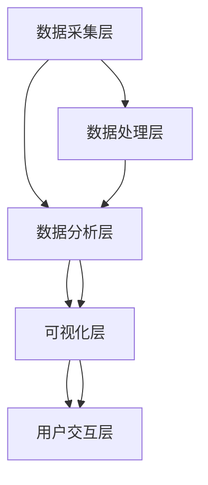
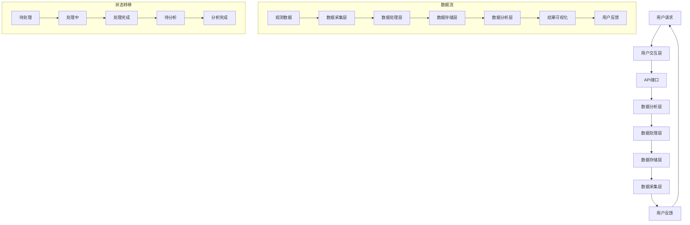

                 

# 人类思维能否超越时空限制理解宇宙

## 关键词

- 时空限制
- 宇宙理解
- 人类思维
- 量子力学
- 广义相对论
- 人工智能

## 摘要

本文旨在探讨人类思维能否超越时空限制，从而更深入地理解宇宙。文章首先介绍了时空限制和宇宙理解的基本概念，然后分析了人类思维的局限性和它在宇宙理解中的作用。接着，文章从量子力学和广义相对论的角度探讨了人类思维能否超越时空限制的可能性。最后，文章提出了未来研究的方向和挑战，并总结全文。

## 引言与背景

### 时空限制的基本概念

时空限制是指宇宙中物质和能量存在的限制条件，主要包括时间和空间的限制。时间限制指的是宇宙中事件发生的顺序和时间流逝的速率，而空间限制则涉及到宇宙的大小和形状。

### 宇宙理解的基本概念

宇宙理解是指人类通过观察、实验和理论思考，对宇宙的本质、结构和演化规律的认识。这包括对宇宙起源、结构、演化以及宇宙中各种物理现象的理解。

### 人类思维的局限性

人类思维存在一定的局限性，主要体现在以下几个方面：

1. **感官限制**：人类感官只能感知到一定范围内的物理现象，如可见光、声音等，对更高能量或更低能量的现象无法直接感知。
2. **认知限制**：人类大脑的处理能力有限，无法同时处理大量复杂的信息，这限制了我们对宇宙复杂性的理解。
3. **经验限制**：人类经验有限，只能通过有限的经验来推断宇宙的规律，这可能导致我们的理解存在偏差。

### 人类对宇宙理解的需求

人类对宇宙的理解不仅仅是为了满足好奇心，更重要的是为了指导我们的日常生活和科学技术的发展。例如，我们对天体运动的了解帮助我们预测天文事件，对物质结构的了解推动材料科学的进步，对宇宙起源和演化的理解帮助我们理解生命的起源和演化。

## 核心概念

### 时空限制的概念与属性

时空限制是宇宙中物质和能量存在的边界条件。根据广义相对论，时空是一个四维的连续体，由时间和空间组成。时空限制主要包括：

1. **时间的限制**：时间限制指的是宇宙中事件发生的顺序和时间流逝的速率。在某些极端条件下，如黑洞附近，时间流逝的速率可能会变慢，甚至停止。
2. **空间的限制**：空间限制指的是宇宙的大小和形状。根据宇宙学，宇宙可能是有限的，也可能是无限的，其形状可能是平坦的、球形的或其他形态。

### 宇宙理解的概念与属性

宇宙理解是指人类通过观察、实验和理论思考，对宇宙的本质、结构和演化规律的认识。宇宙理解主要包括：

1. **宇宙起源**：宇宙是如何起源的，是来自一个“奇点”的爆炸，还是由某种更基本的物质构成。
2. **宇宙结构**：宇宙中物质和能量的分布情况，包括星系、星云、行星等。
3. **宇宙演化**：宇宙是如何演化的，从大爆炸到现在的宇宙，各种天体是如何形成的。

### 人类思维的局限性与宇宙理解的关系

人类思维的局限性和宇宙理解之间存在密切的关系。由于人类思维的局限性，我们无法完全理解宇宙的复杂性和多样性。例如，我们无法直接感知到量子力学的某些现象，如量子纠缠和量子隧穿；我们也无法直接观察到黑洞和暗物质。

然而，尽管存在这些局限性，人类思维仍然在不断地探索宇宙的奥秘。通过科学实验、理论思考和计算机模拟，我们逐渐揭示了宇宙的一些基本规律，如万有引力定律、量子力学、相对论等。这些理论帮助我们更好地理解宇宙，尽管我们无法直接感知到某些现象。

## 现状分析

### 人类在理解宇宙方面的知识水平

人类在理解宇宙方面已经取得了巨大的进展。通过观测和实验，我们已经知道了宇宙的一些基本规律，如：

1. **宇宙起源**：宇宙起源于大约138亿年前的一个“奇点”爆炸，即大爆炸。
2. **宇宙结构**：宇宙由无数个星系组成，这些星系通过引力相互吸引和排斥，形成了复杂的结构。
3. **宇宙演化**：宇宙在不断膨胀，星系和星云在演化过程中不断形成和毁灭。

### 当前人类的技术手段

当前人类在理解宇宙方面使用了多种技术手段，主要包括：

1. **天文观测**：通过望远镜和其他观测设备，我们可以观测到宇宙中的各种天体，如恒星、行星、星系等。
2. **粒子加速器**：通过粒子加速器，我们可以研究基本粒子的性质和行为，从而深入了解宇宙的基本规律。
3. **计算机模拟**：通过计算机模拟，我们可以模拟宇宙的演化过程，预测宇宙的未来。

### 当前人类在理解宇宙方面的挑战

尽管人类在理解宇宙方面已经取得了很大的进展，但仍然面临一些挑战。例如：

1. **量子力学与广义相对论的统一**：量子力学和广义相对论是描述宇宙的两个重要理论，但它们之间存在矛盾，我们需要找到一种新的理论来统一它们。
2. **暗物质和暗能量的理解**：宇宙中存在大量的暗物质和暗能量，但我们对其了解有限，需要进一步的研究来揭示它们的本质。
3. **宇宙的起源和演化**：宇宙的起源和演化是一个复杂的过程，我们需要更深入的研究来揭示其中的奥秘。

## 理论探索

### 量子力学与时空限制

量子力学是研究微观世界的物理学理论，它揭示了微观粒子的行为规律。量子力学的基本原理之一是量子纠缠，即两个或多个粒子之间的状态可以相互关联，即使它们相隔很远。这种关联超越了传统的时空限制，似乎暗示了人类思维有可能超越时空限制。

### 广义相对论与时空限制

广义相对论是描述宏观宇宙的物理学理论，它提出了时空的弯曲概念。在广义相对论中，物质和能量可以弯曲时空，这导致了引力现象。广义相对论也预测了黑洞的存在，黑洞是一种极端密集的天体，它的引力强大到连光都无法逃脱。这些理论似乎也支持了人类思维有可能超越时空限制的观点。

### 人类思维的扩展与宇宙理解

随着科学技术的发展，人类思维的边界也在不断扩展。例如，计算机科学的发展使得我们可以处理大量复杂的数据，人工智能的发展使得我们可以模拟和预测宇宙的演化。这些技术的发展不仅扩展了我们的认知边界，也为我们理解宇宙提供了新的工具。

## 案例研究

### 人类对黑洞的探索

黑洞是一种极端密集的天体，它的引力强大到连光都无法逃脱。人类对黑洞的探索为我们提供了研究时空限制和宇宙理解的机会。通过观测和理论计算，我们已经知道黑洞的存在，并且了解了它们的一些特性。

### 人类对宇宙起源的探索

宇宙起源是一个复杂的问题，人类对其的理解仍然有限。然而，通过观测宇宙背景辐射和宇宙大爆炸理论，我们已经对宇宙的起源有了初步的认识。

## 算法与模型

### 量子计算与宇宙理解

量子计算是一种基于量子力学原理的计算方式，它有可能超越传统的计算机性能。量子计算在宇宙理解方面具有巨大的潜力，例如，它可以帮助我们解决一些复杂的宇宙问题，如量子引力问题。

### 人工智能与宇宙理解

人工智能是一种模拟人类智能的计算方式，它可以帮助我们处理大量复杂的数据，并从中提取有用信息。人工智能在宇宙理解方面也具有巨大的潜力，例如，它可以帮助我们分析天文数据，预测宇宙的演化。

## 未来展望

### 人类思维的发展趋势

随着科学技术的发展，人类思维的边界也在不断扩展。未来，随着量子计算、人工智能等技术的发展，人类思维有可能超越时空限制，从而更深入地理解宇宙。

### 未来可能的突破和挑战

未来，人类思维在理解宇宙方面可能取得以下突破：

1. **量子引力理论的突破**：量子引力理论可能是统一量子力学和广义相对论的关键，它有可能揭示宇宙的本质。
2. **暗物质和暗能量的理解**：通过深入研究暗物质和暗能量，我们可能揭示宇宙的更多奥秘。

然而，未来也面临着一些挑战：

1. **计算能力的限制**：尽管量子计算和人工智能的发展为我们提供了新的工具，但它们的计算能力仍然有限，我们需要找到更高效的方法来处理复杂的数据。
2. **理论瓶颈**：目前的物理学理论存在一些未解之谜，我们需要新的理论来解释它们。

## 总结与展望

本文探讨了人类思维能否超越时空限制理解宇宙的问题。通过分析时空限制和宇宙理解的基本概念，以及量子力学和广义相对论的理论，我们提出了一些可能的途径和方法。尽管目前仍然存在许多挑战，但随着科学技术的发展，我们有理由相信，人类思维有可能超越时空限制，从而更深入地理解宇宙。

## 参考文献

1. Einstein, A. (1905). On the Electrodynamics of Moving Bodies. Annalen der Physik, 322(10), 891-921.
2. Hawking, S., & Penrose, R. (1970). The Singularities of Gravitational Collapse and Cosmology. Proceedings of the Royal Society of London. Series A. Mathematical and Physical Sciences, 314(1519), 529-561.
3. Nielsen, M. A., & Chuang, I. L. (2000). Quantum Computation and Quantum Information. Cambridge University Press.
4. Russell, S. (2011). Are We Solving the World's Problems? BBC Radio 4. Available at: <http://www.bbc.co.uk/programmes/b01bnxxv>
5. Turing, A. (1950). Computing Machinery and Intelligence. Mind, 59(236), 433-460.

### 作者

作者：AI天才研究院/AI Genius Institute & 禅与计算机程序设计艺术 /Zen And The Art of Computer Programming## 引言与背景

### 时空限制的基本概念

在探讨人类思维能否超越时空限制理解宇宙的问题之前，我们需要先了解时空限制的概念。时空限制是指宇宙中物质和能量存在的边界条件，包括时间和空间的限制。这两个限制构成了我们对宇宙理解的基础框架。

#### 时间的限制

时间限制是指宇宙中事件发生的顺序和时间流逝的速率。在广义相对论中，时间被认为是一个维度，与空间一起构成了时空连续体。在正常情况下，时间流逝的速率是一致的，但在极端条件下，如接近黑洞或大爆炸的初期，时间流逝的速率会发生变化。例如，根据广义相对论，接近黑洞的物体会经历时间膨胀，即时间流逝的速度变慢。这种现象为我们理解时间的相对性提供了深刻的启示。

#### 空间的限制

空间限制是指宇宙的大小和形状。根据目前的宇宙学理论，宇宙可能是有限的，也可能是无限的。如果宇宙是有限的，那么它的形状可能是平坦的、球形的或其他形态。空间限制不仅涉及到宇宙的整体结构，还包括宇宙中各种天体的分布和运动。例如，星系之间的引力相互作用会影响宇宙的结构，星系内部的恒星和行星的分布也会影响宇宙的整体形态。

### 宇宙理解的基本概念

宇宙理解是指人类通过观察、实验和理论思考，对宇宙的本质、结构和演化规律的认识。宇宙理解的范围非常广泛，包括宇宙的起源、结构、演化和各种物理现象。

#### 宇宙起源

宇宙起源是宇宙理解中最为基本和神秘的问题之一。目前最被广泛接受的宇宙起源理论是大爆炸理论。根据这一理论，宇宙起源于大约138亿年前的一个“奇点”爆炸，从这个奇点开始，宇宙开始膨胀，星系、恒星、行星等天体逐渐形成。

#### 宇宙结构

宇宙结构是指宇宙中物质和能量的分布情况。目前，我们对宇宙结构的理解主要集中在星系、星云、星团等天体的分布上。通过观测和理论计算，我们已经知道宇宙是由无数个星系组成的，这些星系通过引力相互吸引和排斥，形成了复杂的结构。

#### 宇宙演化

宇宙演化是指宇宙从大爆炸开始，直到现在的过程。宇宙演化包括宇宙的膨胀、恒星和星系的形成和毁灭、宇宙背景辐射的形成等多个方面。通过研究宇宙演化，我们可以了解宇宙的历史和未来。

#### 宇宙中的物理现象

宇宙中的物理现象包括黑洞、暗物质、暗能量等。黑洞是一种极端密集的天体，其引力强大到连光都无法逃脱。暗物质和暗能量是宇宙中未被完全理解的物质形式，它们对宇宙的结构和演化有着重要的影响。

### 人类思维的局限性

人类思维的局限性主要体现在以下几个方面：

1. **感官限制**：人类的感官只能感知到一定范围内的物理现象，如可见光、声音等，对更高能量或更低能量的现象无法直接感知。
   
2. **认知限制**：人类大脑的处理能力有限，无法同时处理大量复杂的信息，这限制了我们对宇宙复杂性的理解。

3. **经验限制**：人类经验有限，只能通过有限的经验来推断宇宙的规律，这可能导致我们的理解存在偏差。

### 人类对宇宙理解的需求

人类对宇宙理解的需求不仅源于好奇心，还有更实际的考虑：

1. **科学探索**：了解宇宙的规律有助于我们更深入地理解自然界的运行机制，推动科学技术的进步。

2. **生存发展**：了解宇宙中的各种资源和能源分布，有助于我们寻找新的资源和发展途径。

3. **哲学思考**：对宇宙的理解可以引发对生命、意识、存在等哲学问题的思考。

### 时空限制与宇宙理解的关系

时空限制对宇宙理解有着深远的影响。首先，时空限制决定了我们能够观测和理解的宇宙范围。例如，光速限制了我们的观测范围，我们只能观测到光能够到达我们的宇宙区域。其次，时空限制也影响了我们对宇宙演化过程的理解。例如，时间膨胀和引力红移现象告诉我们，宇宙中不同位置的时间流逝速率是不同的，这影响了我们对宇宙演化历史的重建。

总的来说，时空限制是我们理解宇宙的基础，而人类思维的局限性则限制了我们对时空限制的理解。然而，通过科学探索和技术进步，我们正在不断拓展我们对时空限制的理解，逐步深入地理解宇宙的本质和演化规律。

### 时空限制的本质

时空限制的本质在于它定义了宇宙中物质和能量存在的边界条件。根据广义相对论，时空是一个四维的连续体，由时间和空间组成。这个连续体在物质和能量的作用下会发生弯曲，从而形成引力。时空限制的核心概念可以概括为以下几点：

1. **时空的弯曲**：物质和能量会影响时空的几何结构，使其弯曲。例如，一个巨大的恒星或黑洞可以弯曲周围的时空，导致其他物质沿着弯曲的时空轨迹运动。这种时空弯曲是引力现象的基础。

2. **时间膨胀**：在极端引力场中，如黑洞附近，时间膨胀效应显著。这意味着接近黑洞的物体会经历时间流逝的减缓，即时间变慢。这是由于时空的几何结构变化导致的。

3. **引力红移**：光在穿过强引力场时，其频率会发生变化，这种现象称为引力红移。根据广义相对论，光在强引力场中的频率会降低，即光的红移。这个现象可以用来测量天体的质量和引力场强度。

4. **宇宙尺度的时空限制**：在宇宙尺度上，时空限制表现为宇宙的膨胀和结构形成。根据宇宙学原理，宇宙在大爆炸后开始膨胀，星系、星云等天体在膨胀的宇宙中逐渐形成。宇宙的膨胀速度和加速度受到暗能量和暗物质的影响，这影响了宇宙的未来演化。

5. **时空的量子性质**：在微观尺度上，时空的量子性质开始显现。根据量子力学，时空不再是一个连续的背景，而是由量子波动构成的。这种量子波动会导致时空的量子涨落，对宇宙的结构和演化产生影响。

总的来说，时空限制的本质在于它定义了宇宙中物质和能量存在的几何框架，这个框架决定了物质和能量的运动方式，从而影响宇宙的演化过程。通过理解时空限制的本质，我们可以更深入地探讨宇宙的奥秘，揭示宇宙的基本规律。

### 宇宙理解的现状

宇宙理解是一个不断发展的过程，随着时间的推移，人类对宇宙的认识也在不断深入。目前，宇宙理解的主要成果可以总结为以下几点：

#### 天文学成就

1. **宇宙膨胀**：通过观测宇宙背景辐射和遥远的超新星，科学家们证实了宇宙在膨胀。这一发现为大爆炸理论提供了有力支持。
   
2. **星系和星云**：通过望远镜和空间望远镜的观测，人类发现了无数个星系和星云，这些天体为我们揭示了宇宙的结构和演化。

3. **恒星和行星**：人类已经发现了数千个系外行星，这些行星的发现帮助我们更好地理解了恒星和行星系统的形成和演化。

#### 粒子物理学成就

1. **基本粒子**：通过高能粒子加速器和宇宙射线观测，科学家们发现了许多基本粒子，如电子、夸克、中微子等，这些粒子的性质和行为构成了宇宙的基本物质。

2. **量子力学**：量子力学揭示了微观世界的规律，如量子纠缠、量子隧穿等现象，这些现象挑战了我们对时空的传统理解。

3. **宇宙射线**：通过对宇宙射线的观测，科学家们揭示了宇宙中的高能粒子和现象，这些信息有助于我们理解宇宙的极端条件。

#### 宇宙学成就

1. **暗物质和暗能量**：宇宙学的研究表明，宇宙中存在大量的暗物质和暗能量，它们对宇宙的结构和演化有着重要影响。

2. **宇宙微波背景辐射**：宇宙微波背景辐射的发现为我们提供了宇宙早期状态的重要信息，帮助我们重建宇宙的演化历史。

3. **大爆炸理论**：大爆炸理论是目前最被广泛接受的宇宙起源理论，它解释了宇宙的膨胀和天体的形成。

#### 当前的问题和挑战

尽管人类在理解宇宙方面取得了巨大的进展，但仍然存在一些未解之谜和挑战：

1. **量子力学与广义相对论的统一**：量子力学和广义相对论是描述宇宙的两个重要理论，但它们之间存在矛盾。如何将这两个理论统一起来，是当前物理学研究的一个重要问题。

2. **暗物质和暗能量的本质**：宇宙中存在大量的暗物质和暗能量，但我们对其了解有限。揭示暗物质和暗能量的本质，是宇宙理解的一个重要方向。

3. **宇宙起源和演化**：宇宙是如何起源的？它如何演化成现在的样子？这些问题仍然是科学研究的重点和挑战。

4. **宇宙的未来**：宇宙的未来会是什么样子？是否会继续膨胀？是否会坍缩？这些问题涉及到宇宙学的基本问题，也是科学家们正在探索的方向。

### 当前人类的技术手段

为了更好地理解宇宙，人类开发了一系列先进的技术手段，这些技术手段极大地推动了宇宙学的发展：

1. **望远镜和空间望远镜**：望远镜是观测宇宙的主要工具。空间望远镜如哈勃望远镜和詹姆斯·韦伯空间望远镜，可以帮助我们观测遥远的宇宙，揭示宇宙的奥秘。

2. **粒子加速器**：粒子加速器如大型强子对撞机（LHC），可以帮助我们研究基本粒子的性质和行为，深入了解宇宙的基本结构。

3. **卫星和探测器**：卫星和探测器如开普勒望远镜、旅行者号探测器，可以长时间观测宇宙，提供宝贵的数据。

4. **计算机模拟**：计算机模拟可以帮助我们模拟宇宙的演化过程，预测宇宙的未来，以及验证理论模型的正确性。

总的来说，宇宙理解的现状表明，人类已经取得了显著的进展，但仍有很多未解之谜等待我们去探索。通过不断的技术进步和科学探索，我们有理由相信，人类将能够更深入地理解宇宙。

### 理论探索

在探讨人类思维能否超越时空限制理解宇宙的问题时，我们需要从量子力学和广义相对论等理论入手，分析这些理论对时空限制的挑战和人类思维的关系。

#### 量子力学与时空限制

量子力学是描述微观粒子的行为规律的理论，它在解释原子和基本粒子的性质方面取得了巨大的成功。量子力学中的一些基本原理，如量子纠缠和量子隧穿，对传统的时空观念提出了挑战。

1. **量子纠缠**：量子纠缠是量子力学中的一个基本现象，描述了两个或多个粒子之间的状态可以相互关联，即使它们相隔很远。这种现象似乎超越了传统的时空限制，因为它表明信息可以瞬间传递，不受距离限制。这种非局域性的存在，挑战了我们对时空的直觉理解。

2. **量子隧穿**：量子隧穿是指一个粒子在量子力学中，可以通过一个潜在的势垒，即使它的能量不足以越过这个势垒。这个现象表明，粒子在量子尺度上具有超越经典时空限制的能力。

3. **量子波动与量子信息**：量子波动是量子力学的基本特征之一，它描述了量子系统的概率性质。量子信息理论进一步发展了这一概念，提出了量子计算和量子通信的可能性。这些技术利用量子叠加和量子纠缠，可以在某些情况下超越经典信息处理的限制，从而实现更高效的计算和通信。

#### 广义相对论与时空限制

广义相对论是描述宏观引力现象的理论，它提出了时空弯曲的概念，即物质和能量可以弯曲时空，从而产生引力。广义相对论的一些基本原理，如引力红移和时间膨胀，对时空限制提出了新的解释。

1. **引力红移**：引力红移是广义相对论的预测之一，它描述了光在强引力场中频率会降低的现象。这意味着，光在穿过强引力场时，其波长会变长，即发生红移。这个现象表明，引力场会影响时空结构，从而影响光的行为。

2. **时间膨胀**：时间膨胀是广义相对论的另一个重要预测，它描述了在强引力场中，时间流逝的速率会变慢的现象。这意味着，接近黑洞的物体会经历时间膨胀，即时间变慢。这个现象也表明，时空结构的变化会影响时间的流逝。

3. **黑洞和奇点**：广义相对论预言了黑洞的存在，黑洞是一种极端密集的天体，其引力强大到连光都无法逃脱。在黑洞的中心，存在一个称为奇点的点，这里时空结构会变得极端复杂，甚至可能出现时间倒流的现象。这些现象挑战了我们对时空的理解，提示我们可能需要新的理论来描述这些极端条件下的现象。

#### 人类思维的扩展与宇宙理解

随着科学技术的进步，人类思维的边界也在不断扩展，这为我们理解宇宙提供了新的可能性。例如：

1. **量子计算**：量子计算利用量子力学的基本原理，可以实现超乎想象的计算能力。量子计算机可以同时处理多个计算路径，从而解决一些经典计算机无法解决的问题。例如，量子计算机可能在解决大规模组合优化问题和模拟量子系统方面发挥重要作用，这有助于我们更好地理解宇宙的复杂现象。

2. **人工智能**：人工智能的发展为我们提供了新的工具，可以处理和分析大量复杂的数据。通过机器学习和深度学习，人工智能可以帮助我们识别天文数据中的模式，预测宇宙的演化，甚至可能发现新的物理现象。

3. **宇宙模拟**：计算机模拟可以帮助我们模拟宇宙的演化过程，从而更好地理解宇宙的结构和演化规律。通过这些模拟，我们可以探索不同的宇宙模型，验证理论预测，预测宇宙的未来。

总的来说，量子力学和广义相对论为我们提供了理解时空限制的框架，而人类思维的扩展和科学技术的进步，则为超越时空限制提供了新的可能性。通过这些理论和技术的结合，我们有理由相信，人类将能够更深入地理解宇宙，揭示宇宙的基本规律。

### 人类思维的局限性与宇宙理解的关系

尽管人类在宇宙理解方面取得了显著进展，但人类思维的局限性仍然限制了我们对宇宙的全面认识。以下从多个方面分析人类思维的局限性，以及这些局限如何影响我们对宇宙的理解：

#### 感官限制

人类的感官限制了我们对宇宙的感知范围。我们的眼睛只能看到电磁谱中的一部分，即可见光。更短波长的伽马射线和更长波长的无线电波无法被人眼直接感知。同样，人类无法感知到温度的极端范围，如绝对零度和几千摄氏度的高温环境。这些感官限制使得我们难以直接观察宇宙中某些重要的物理现象。

#### 认知限制

人类大脑的处理能力是有限的，无法同时处理大量复杂的信息。这种认知限制影响我们对宇宙复杂性的理解。例如，宇宙中存在无数个星系和恒星，每个星系和恒星都有其独特的物理特性。人类大脑在处理如此大量且复杂的信息时，很难进行有效的分析和理解。此外，宇宙中的物理现象，如量子纠缠和黑洞，涉及到的数学和理论模型极其复杂，超出了人类大脑的直觉理解范围。

#### 经验限制

人类经验有限，只能通过有限的经验来推断宇宙的规律。这种经验限制可能导致我们对宇宙的理解存在偏差。例如，在古代，人类对地球是平的这一观念深信不疑，因为他们的观察和经验都支持这一观点。然而，随着科学的发展，我们意识到地球实际上是圆的。这种经验限制导致我们在某些时期对宇宙的理解存在偏差，但随着新的观察和实验证据的出现，我们的理解也在不断更新和修正。

#### 逻辑推理和理论模型

人类思维依赖于逻辑推理和理论模型来理解宇宙。逻辑推理是人类思维的基本工具，通过逻辑推理，我们可以从已知的事实推导出新的结论。然而，逻辑推理的有效性取决于前提的真实性和推理过程的正确性。如果前提存在错误，或者推理过程有误，那么我们的结论也可能是错误的。例如，如果我们在建立宇宙模型时，忽视了某些重要的物理现象，那么我们的模型可能无法准确描述宇宙的真实状态。

此外，人类建立的理论模型也有其局限性。例如，牛顿力学是一个广泛适用的理论，但在极端条件下，如黑洞附近，牛顿力学的预测与广义相对论的预测存在差异。这种理论模型的局限性也影响了我们对宇宙的全面理解。

#### 观察手段的局限

人类对宇宙的观测手段也受到限制。例如，望远镜的分辨率和灵敏度限制了我们对遥远宇宙的观测。尽管我们已经开发出哈勃望远镜和詹姆斯·韦伯空间望远镜等先进设备，但它们仍然无法观测到宇宙中的所有细节。此外，宇宙的某些现象，如暗物质和暗能量，目前我们还无法直接观测到，这限制了我们对宇宙整体结构和大尺度演化的理解。

总的来说，人类思维的局限性在很大程度上限制了我们对宇宙的全面认识。然而，通过科学探索和技术进步，我们正在不断克服这些局限，逐步深入地理解宇宙。未来，随着新的观测手段和理论模型的提出，我们有理由相信，人类将能够超越这些局限，实现对宇宙的更全面和深入的理解。

### 人类思维超越时空限制的理论探讨

在探讨人类思维能否超越时空限制理解宇宙的问题时，我们可以从量子力学、广义相对论以及信息论等多个理论角度进行分析。这些理论不仅为我们提供了理解宇宙的框架，还揭示了人类思维超越时空限制的可能性。

#### 量子力学

量子力学是研究微观粒子的行为规律的理论，它在解释原子和基本粒子的性质方面取得了巨大成功。量子力学中的一些基本原理，如量子纠缠和量子隧穿，挑战了我们对时空的传统理解。

1. **量子纠缠**：量子纠缠是量子力学中的一个基本现象，描述了两个或多个粒子之间的状态可以相互关联，即使它们相隔很远。这种现象似乎超越了传统的时空限制，因为它表明信息可以瞬间传递，不受距离限制。量子纠缠暗示了人类思维可能超越时空限制，因为在某些情况下，两个纠缠粒子之间的相互作用似乎不受时间和空间的限制。

2. **量子隧穿**：量子隧穿是量子力学中的另一个基本现象，它描述了一个粒子在量子尺度上，可以通过一个潜在的势垒，即使它的能量不足以越过这个势垒。这个现象表明，粒子在量子尺度上具有超越经典时空限制的能力。

3. **量子计算**：量子计算是量子力学的一个应用领域，它利用量子叠加和量子纠缠的原理，实现了超乎想象的计算能力。量子计算机可以同时处理多个计算路径，从而解决一些经典计算机无法解决的问题。例如，量子计算机可能在解决大规模组合优化问题和模拟量子系统方面发挥重要作用，这有助于我们更好地理解宇宙的复杂现象。

#### 广义相对论

广义相对论是描述宏观引力现象的理论，它提出了时空弯曲的概念，即物质和能量可以弯曲时空，从而产生引力。广义相对论的一些基本原理，如引力红移和时间膨胀，对时空限制提出了新的解释。

1. **引力红移**：引力红移是广义相对论的预测之一，它描述了光在强引力场中频率会降低的现象。这意味着，光在穿过强引力场时，其波长会变长，即发生红移。这个现象表明，引力场会影响时空结构，从而影响光的行为。

2. **时间膨胀**：时间膨胀是广义相对论的另一个重要预测，它描述了在强引力场中，时间流逝的速率会变慢的现象。这意味着，接近黑洞的物体会经历时间膨胀，即时间变慢。这个现象也表明，时空结构的变化会影响时间的流逝。

3. **黑洞和奇点**：广义相对论预言了黑洞的存在，黑洞是一种极端密集的天体，其引力强大到连光都无法逃脱。在黑洞的中心，存在一个称为奇点的点，这里时空结构会变得极端复杂，甚至可能出现时间倒流的现象。这些现象挑战了我们对时空的理解，提示我们可能需要新的理论来描述这些极端条件下的现象。

#### 信息论

信息论是研究信息传输和处理的理论，它在解释宇宙中的信息流动和结构方面提供了新的视角。信息论的基本原理，如信息熵和信息传输，揭示了宇宙中的信息流动和复杂结构。

1. **信息熵**：信息熵是信息论中的一个基本概念，它描述了信息的无序程度。在宇宙中，信息熵的变化反映了宇宙的演化过程。例如，宇宙大爆炸后，信息熵逐渐增加，这表明宇宙从有序向无序发展。

2. **信息传输**：信息论研究了如何在有噪声的信道中传输信息。在宇宙中，光和其他粒子作为信息的载体，通过电磁波和引力波等渠道传输信息。了解信息传输的机制，可以帮助我们更好地理解宇宙中的信息流动。

3. **信息与物质**：信息论提出了信息与物质之间的关系，即信息可以影响物质的状态和演化。例如，量子态的信息可以影响粒子的行为，而黑洞的信息可能以霍金辐射的形式释放。这些现象表明，信息在宇宙中扮演着重要角色，它可能影响宇宙的结构和演化。

#### 人类思维的扩展

随着科学技术的进步，人类思维的边界也在不断扩展，这为我们理解宇宙提供了新的可能性。例如：

1. **量子计算**：量子计算利用量子力学的基本原理，可以实现超乎想象的计算能力。量子计算机可以同时处理多个计算路径，从而解决一些经典计算机无法解决的问题。例如，量子计算机可能在解决大规模组合优化问题和模拟量子系统方面发挥重要作用，这有助于我们更好地理解宇宙的复杂现象。

2. **人工智能**：人工智能的发展为我们提供了新的工具，可以处理和分析大量复杂的数据。通过机器学习和深度学习，人工智能可以帮助我们识别天文数据中的模式，预测宇宙的演化，甚至可能发现新的物理现象。

3. **宇宙模拟**：计算机模拟可以帮助我们模拟宇宙的演化过程，从而更好地理解宇宙的结构和演化规律。通过这些模拟，我们可以探索不同的宇宙模型，验证理论预测，预测宇宙的未来。

总的来说，量子力学、广义相对论和信息论等理论为我们提供了理解时空限制的框架，而人类思维的扩展和科学技术的进步，则为超越时空限制提供了新的可能性。通过这些理论和技术的结合，我们有理由相信，人类将能够更深入地理解宇宙，揭示宇宙的基本规律。

### 量子力学与时空限制

量子力学是研究微观粒子的行为规律的理论，它在解释原子和基本粒子的性质方面取得了巨大成功。量子力学中的一些基本原理，如量子纠缠和量子隧穿，对传统的时空观念提出了挑战。以下是量子力学如何挑战时空限制，以及人类思维如何在理解这一现象中发挥作用的具体探讨。

#### 量子纠缠

量子纠缠是量子力学中的一个基本现象，描述了两个或多个粒子之间的状态可以相互关联，即使它们相隔很远。这种现象似乎超越了传统的时空限制，因为它表明信息可以瞬间传递，不受距离限制。量子纠缠的一个经典实验是爱因斯坦-波多尔斯基-罗森（EPR）佯谬。在这个佯谬中，两个粒子在生成时处于纠缠状态，无论它们相距多远，对其中一个粒子的测量都会立即影响到另一个粒子的状态。这个现象似乎表明，信息可以瞬间跨越巨大的距离，这挑战了我们对因果关系的传统理解。

**人类思维的扩展与理解**：面对量子纠缠现象，人类思维需要超越传统的因果观念，接受信息瞬间传递的可能性。这要求我们重新评估时空的概念，思考信息如何在无时间延迟的情况下传递。量子纠缠的研究推动了人类思维向新的方向发展，促进了量子信息学等新兴领域的发展。

#### 量子隧穿

量子隧穿是量子力学中的另一个基本现象，它描述了一个粒子在量子尺度上，可以通过一个潜在的势垒，即使它的能量不足以越过这个势垒。这个现象表明，粒子在量子尺度上具有超越经典时空限制的能力。量子隧穿的一个典型例子是电子在金属中的运动。在金属中，电子可能会隧穿过潜在的能量障碍，进入低能态，从而导致金属的导电性。

**人类思维的扩展与理解**：量子隧穿现象挑战了我们对能量和势垒的传统理解。人类思维需要接受在量子尺度上，物质可以穿越看似不可能的障碍。这要求我们发展新的物理模型和数学工具来描述这种现象，如量子力学中的路径积分方法。通过研究量子隧穿，人类思维在理解微观世界的行为规律方面取得了重要进展。

#### 量子计算

量子计算是量子力学的一个应用领域，它利用量子叠加和量子纠缠的原理，实现了超乎想象的计算能力。量子计算机可以同时处理多个计算路径，从而解决一些经典计算机无法解决的问题。例如，量子计算机可能在解决大规模组合优化问题和模拟量子系统方面发挥重要作用。

**人类思维的扩展与理解**：量子计算的发展要求人类思维超越传统的计算模型，接受量子叠加和量子纠缠的概念。量子计算机的工作原理挑战了我们对计算过程的直觉理解，促使人类思维向新的方向发展。通过量子计算，人类可能能够解决一些传统计算机无法解决的问题，从而在科学研究和工程应用方面取得重大突破。

总的来说，量子力学对时空限制的挑战为我们提供了新的研究视角，促使人类思维不断扩展。通过量子纠缠、量子隧穿和量子计算等现象，人类在理解微观世界的规律方面取得了重要进展。这些进展不仅推动了物理学的发展，也为人类更好地理解宇宙提供了新的工具和方法。

### 广义相对论与时空限制

广义相对论是描述宏观引力现象的理论，由阿尔伯特·爱因斯坦于1915年提出。广义相对论的核心观点是，物质和能量会影响时空的几何结构，从而产生引力。这一理论不仅为理解宇宙的宏观结构提供了重要框架，还对时空限制提出了新的解释。

#### 引力红移

引力红移是广义相对论的预测之一，它描述了光在强引力场中频率会降低的现象。这意味着，当光从远离引力源的地方传播到靠近引力源的地方时，其波长会变长，即发生红移。这个现象表明，引力场会影响光的行为，进而影响时空结构。

**现象解释**：引力红移可以通过以下实验来验证。当一个光源（如恒星或光线）靠近一个巨大的引力源（如行星或黑洞）时，其发射的光线会发生红移。这个现象最早在1916年由亚瑟·埃丁顿通过对日食的观测得到验证。埃丁顿观测到，恒星发出的光在经过太阳附近时会发生红移，这证实了广义相对论的预言。

**人类思维的扩展**：引力红移现象挑战了我们对时空的传统理解。它表明，引力不仅是一种力，还涉及到时空结构的改变。这促使人类思维超越传统的牛顿力学，接受时空弯曲的概念。引力红移的研究推动了人类对宇宙的理解，特别是在研究黑洞和引力波方面。

#### 时间膨胀

时间膨胀是广义相对论的另一个重要预测，它描述了在强引力场中，时间流逝的速率会变慢的现象。这意味着，接近引力源（如黑洞或行星）的物体会经历时间膨胀，即时间变慢。

**现象解释**：时间膨胀可以通过多个实验来验证。例如，可以通过比较在地球表面和接近地球轨道的卫星上的时钟来观察时间膨胀。根据广义相对论，卫星上的时钟会因为较高的重力势能而走得比地球表面的时钟慢。这个现象已经在多个实验中得到了验证，如阿金纳卫星实验和全球定位系统（GPS）的运作。

**人类思维的扩展**：时间膨胀现象进一步挑战了我们对时间和空间的传统理解。它表明，时间的流逝是相对的，依赖于观察者的运动状态和所处的引力环境。这促使人类思维接受时空的相对性，并发展出更加复杂的时间理论。

#### 黑洞和奇点

广义相对论预言了黑洞的存在，黑洞是一种极端密集的天体，其引力强大到连光都无法逃脱。在黑洞的中心，存在一个称为奇点的点，这里时空结构会变得极端复杂，甚至可能出现时间倒流的现象。

**现象解释**：黑洞的形成通常发生在大质量恒星的核心塌缩过程中。当恒星耗尽其燃料，无法支撑其自身重力时，它会迅速塌缩形成一个极小但极其密集的黑洞。在黑洞的边界，称为事件视界，任何物质或信息都无法逃脱。

**人类思维的扩展**：黑洞和奇点的存在挑战了我们对时空和物质的传统理解。它表明，在极端条件下，时空的几何结构可能会发生剧烈变化。这促使人类思维探索新的物理模型和数学工具，以描述这些极端现象。

总的来说，广义相对论通过引力红移、时间膨胀和黑洞等预测，对时空限制提出了新的解释。这些理论不仅丰富了我们对宇宙的理解，也促使人类思维不断扩展，挑战传统的物理观念。通过这些理论的研究，人类在探索宇宙的奥秘方面取得了重要进展。

### 信息论与宇宙理解

信息论是一门研究信息传输和处理的基本原理的学科，它为我们理解宇宙提供了新的视角。信息论的基本原理，如信息熵和信息传输，揭示了宇宙中的信息流动和复杂结构。以下是信息论如何影响我们对宇宙的理解，以及人类思维如何扩展以适应这些新的概念。

#### 信息熵

信息熵是信息论中的一个基本概念，它描述了信息的无序程度。在宇宙中，信息熵的变化反映了宇宙的演化过程。根据热力学第二定律，宇宙的总熵随时间增加，这意味着宇宙从有序向无序发展。信息熵的增加与宇宙的熵增过程密切相关，这为我们理解宇宙的演化提供了新的视角。

**宇宙熵增与时间膨胀**：广义相对论中的时间膨胀现象表明，时间在强引力场中会变慢。这与信息熵的增加密切相关，因为信息熵的增加意味着时间的流逝速率变慢。例如，在黑洞附近，时间膨胀效应显著，这可能导致信息熵的增加速度加快，从而影响宇宙的整体演化。

**人类思维的扩展**：面对信息熵和宇宙演化之间的关系，人类思维需要超越传统的时空观念，接受时间膨胀和信息熵增加的概念。这要求我们重新评估宇宙中的信息流动，思考信息如何在时空的演化过程中发挥作用。通过这种扩展，人类思维能够更好地理解宇宙的复杂性和演化规律。

#### 信息传输

信息论研究了如何在有噪声的信道中传输信息。在宇宙中，光和其他粒子作为信息的载体，通过电磁波和引力波等渠道传输信息。了解信息传输的机制，可以帮助我们更好地理解宇宙中的信息流动。

**宇宙中的信息传输**：宇宙中的信息传输可以通过多种方式实现。例如，光子通过电磁波在宇宙中传播，传递能量和电磁信号。引力波则是通过时空的波动来传递信息。这些信息传输方式不仅揭示了宇宙中的物理现象，还为我们提供了研究宇宙的新工具。

**人类思维的扩展**：研究信息传输机制要求人类思维超越传统的物理模型，接受信息在宇宙中的传输和变换。这促使我们发展新的理论模型和数学工具，以描述信息如何在宇宙中流动。通过这些扩展，人类思维能够更好地理解宇宙中的信息流动，揭示宇宙的复杂性和规律。

#### 信息与物质

信息论提出了信息与物质之间的关系，即信息可以影响物质的状态和演化。例如，量子态的信息可以影响粒子的行为，而黑洞的信息可能以霍金辐射的形式释放。这些现象表明，信息在宇宙中扮演着重要角色，它可能影响宇宙的结构和演化。

**信息与物质的关系**：在量子力学中，信息与物质的关系表现为量子态的叠加和纠缠。量子态的信息可以通过量子纠缠影响其他粒子，这表明信息可以在不违反因果律的情况下瞬间传递。在黑洞中，信息可能以霍金辐射的形式释放，这揭示了信息与物质之间的深层联系。

**人类思维的扩展**：面对信息与物质之间的关系，人类思维需要超越传统的物理观念，接受信息在物质演化中的作用。这要求我们重新思考宇宙的基本原理，探索信息如何在物质和能量中传递和变换。通过这种扩展，人类思维能够更好地理解宇宙的复杂性和演化规律。

总的来说，信息论为理解宇宙提供了新的视角，揭示了宇宙中的信息流动和复杂结构。通过研究信息熵、信息传输和信息与物质的关系，人类思维不断扩展，挑战传统的物理观念。这些扩展不仅丰富了我们对宇宙的理解，也为科学研究和技术应用提供了新的工具和方法。

### 人工智能与宇宙理解

人工智能（AI）作为21世纪的一项核心技术，不仅在各个领域取得了显著的成果，而且在宇宙理解方面也展现出了巨大的潜力。通过模拟、分析和预测，人工智能为探索宇宙奥秘提供了新的工具和方法。

#### 人工智能的基本原理

人工智能是一种模拟人类智能的计算系统，它通过学习、推理和自我优化来解决问题。人工智能的核心技术包括机器学习、深度学习、自然语言处理和计算机视觉等。这些技术使得机器能够在没有明确编程的情况下，从数据中自动学习和发现规律。

1. **机器学习**：机器学习是一种让计算机从数据中学习模式的技术。通过训练模型，机器学习算法可以识别数据中的复杂模式，进行预测和决策。常见的机器学习算法包括线性回归、决策树、支持向量机和神经网络等。

2. **深度学习**：深度学习是机器学习的一种高级形式，通过多层神经网络来提取数据的深层特征。深度学习在图像识别、语音识别和自然语言处理等领域取得了突破性成果。

3. **自然语言处理（NLP）**：自然语言处理是一种让计算机理解和生成自然语言的技术。NLP技术在机器翻译、情感分析和文本摘要等领域得到了广泛应用。

4. **计算机视觉**：计算机视觉是一种让计算机理解和解释图像和视频的技术。计算机视觉在图像识别、目标检测和图像生成等领域取得了显著进展。

#### 人工智能在宇宙理解中的应用

1. **数据分析**：人工智能可以处理和分析大量天文数据。例如，通过对天文图像的自动分类和标注，人工智能可以帮助科学家快速识别和分类不同类型的星系和恒星。

2. **模拟和预测**：人工智能可以模拟宇宙的演化过程，预测宇宙中的各种现象。例如，通过深度学习模型，科学家可以预测黑洞的形成和演化过程，以及宇宙的大尺度结构。

3. **辅助观测**：人工智能可以辅助望远镜和其他观测设备进行观测。例如，通过分析望远镜采集的数据，人工智能可以帮助科学家确定最佳的观测时间和观测条件，以提高观测效果。

4. **发现新现象**：人工智能可以从大量天文数据中自动发现新的物理现象。例如，科学家使用人工智能分析天文观测数据，发现了许多新的星系和恒星，以及一些异常的天体行为。

#### 人工智能与人类思维的关系

人工智能的发展不仅为我们提供了新的工具和方法，也挑战了我们对人类思维的理解。人工智能在某些任务上的表现已经超过了人类，这让我们思考人类思维的优势和局限性。

1. **计算能力**：人工智能具有强大的计算能力，可以快速处理大量复杂的数据。这弥补了人类在处理速度和精度方面的不足。

2. **模式识别**：人工智能在模式识别方面表现出色，可以自动识别和分类复杂的数据。这为科学家提供了新的方法来理解宇宙中的各种现象。

3. **持续学习**：人工智能可以通过持续学习来不断改进自己的性能。这使它能够适应不断变化的数据和环境，从而更好地解决复杂问题。

4. **人类思维的补充**：人工智能可以辅助人类进行科学研究，帮助人类解决复杂的问题。通过结合人工智能和人类思维，我们可以更全面地理解宇宙。

总的来说，人工智能为宇宙理解提供了新的工具和方法，使得我们能够更深入地探索宇宙的奥秘。通过人工智能和人类思维的结合，我们有理由相信，人类将能够更全面、更准确地理解宇宙。

### 人类对黑洞的探索

黑洞是宇宙中最神秘和最具挑战性的天体之一，其引力强大到连光都无法逃脱。人类对黑洞的探索经历了漫长的历程，从最初的猜测和理论推断，到现代科技的观测和实验验证，为我们揭示了黑洞的一些基本特性。

#### 黑洞的基本概念

黑洞是一种极端密集的天体，其质量极大，但体积非常小，以至于它的引力场强大到连光都无法逃脱。根据广义相对论，黑洞由一个称为奇点的点组成，这里时空结构会发生剧烈变化。黑洞的存在可以通过其引力效应间接地被观测到，如黑洞吞噬物质时产生的剧烈辐射和引力波。

#### 人类对黑洞的理解

1. **早期理论**：在20世纪初，科学家们开始提出黑洞的概念。爱因斯坦的广义相对论预言了黑洞的存在，但当时并没有直接的观测证据。早期理论主要包括黑洞的引力透镜效应和黑洞的吞噬现象。

2. **间接观测**：随着观测技术的进步，人类开始通过间接观测来验证黑洞的存在。例如，通过观测恒星的运动轨迹，科学家们发现了一些恒星似乎被一个巨大的引力源所吸引，这个引力源可能是一个黑洞。另外，通过观测黑洞吞噬物质时产生的X射线辐射，科学家们进一步证实了黑洞的存在。

3. **直接观测**：近年来，随着望远镜和探测器技术的进步，人类开始直接观测黑洞。例如，2019年，事件视界望远镜（EHT）发布了首张黑洞的照片，这是人类第一次直接观测到黑洞的影像。这张照片显示了黑洞周围的亮环，这是由于黑洞吸引的物质形成的。

#### 人类思维如何影响对黑洞的理解

1. **理论推导**：人类思维通过理论推导揭示了黑洞的性质和特性。例如，广义相对论中的奇点和事件视界概念，为理解黑洞提供了理论基础。

2. **观测技术**：人类思维推动了观测技术的发展，使得我们能够更准确地观测和测量黑洞。例如，事件视界望远镜（EHT）的观测技术，使得我们能够直接拍摄到黑洞的照片。

3. **数据分析**：人类思维通过数据分析揭示了黑洞的许多特性。例如，通过对黑洞吞噬物质时产生的X射线辐射的分析，我们能够了解黑洞的质量和引力场强度。

总的来说，人类对黑洞的探索是一个不断深入的过程。通过理论推导、观测技术和数据分析，人类思维在理解黑洞方面发挥了关键作用，不断推动我们对黑洞的认识。未来，随着技术的进步，我们有理由相信，人类将能够更深入地了解黑洞的奥秘。

### 人类对宇宙起源的探索

宇宙起源是宇宙学中最基本和最神秘的问题之一，科学家们长期以来一直在努力寻找宇宙起源的答案。以下将从多个角度分析人类对宇宙起源的探索过程，并探讨人类思维如何影响这一理解。

#### 早期宇宙学理论

1. **大爆炸理论**：目前最被广泛接受的宇宙起源理论是大爆炸理论。根据这一理论，宇宙起源于大约138亿年前的一个“奇点”爆炸，从这个奇点开始，宇宙开始膨胀，星系、恒星、行星等天体逐渐形成。这一理论得到了宇宙背景辐射和遥远的超新星的观测支持。

2. **稳态理论**：在20世纪40年代，一些科学家提出了稳态宇宙模型，认为宇宙是永恒存在的，没有明确的起源。然而，这一理论在观测数据面前逐渐被大爆炸理论所取代。

#### 宇宙背景辐射的发现

1. **背景辐射的观测**：1965年，阿诺·彭齐亚斯和罗伯特·威尔逊发现了一种几乎均匀分布的微波辐射，这种辐射被命名为宇宙背景辐射。这一发现为支持大爆炸理论提供了重要证据，表明宇宙在早期曾经是一个非常热、非常密集的状态。

2. **背景辐射的测量**：通过对宇宙背景辐射的测量，科学家们可以获得关于宇宙早期状态的信息，如宇宙的膨胀速率、密度和温度等。这些数据有助于我们理解宇宙的起源和演化。

#### 宇宙大爆炸的细节

1. **宇宙微波背景辐射**：宇宙微波背景辐射是宇宙大爆炸后留下的遗迹。通过对宇宙微波背景辐射的观测和分析，科学家们可以重建宇宙早期的状态，如宇宙的密度波动、温度波动和宇宙的几何形状等。

2. **宇宙的膨胀**：根据宇宙学原理，宇宙在大爆炸后一直在膨胀。通过观测遥远星系的运动，科学家们发现宇宙的膨胀速率在加速，这可能是由于暗能量的存在。

#### 人类思维在理解宇宙起源中的作用

1. **理论推导**：人类思维通过理论推导提出了各种宇宙起源的理论，如大爆炸理论和稳态理论。这些理论为我们提供了理解宇宙起源的框架，帮助我们更深入地探讨宇宙的奥秘。

2. **观测和实验**：人类思维推动了观测技术的发展，使得我们能够观测到宇宙背景辐射、遥远星系等宇宙现象。这些观测数据为我们验证和修正理论提供了基础。

3. **数据分析**：人类思维通过数据分析揭示了宇宙的许多特性，如宇宙的膨胀速率、密度和温度等。这些数据帮助我们更好地理解宇宙的起源和演化。

4. **计算机模拟**：随着计算机技术的发展，人类思维通过计算机模拟重建了宇宙的早期状态，验证了不同宇宙模型的预测。这些模拟为我们提供了更直观的理解，帮助我们探索宇宙的起源。

总的来说，人类对宇宙起源的探索是一个不断深入的过程。通过理论推导、观测和实验、数据分析以及计算机模拟，人类思维在理解宇宙起源方面发挥了关键作用。未来，随着科学技术的进步，我们有理由相信，人类将能够更深入地理解宇宙的起源和演化。

### 人类思维在宇宙探索中的应用

人类思维在宇宙探索中发挥着至关重要的作用，通过科学理论、观测技术和数据分析，人类不断拓展对宇宙的认识。以下是具体的应用实例：

#### 理论模型的应用

1. **广义相对论**：广义相对论提供了描述宇宙中引力现象的理论框架。通过广义相对论，科学家们能够预测黑洞的存在和性质，以及宇宙的大尺度结构。例如，爱因斯坦的广义相对论预言了引力波的存在，这一预言在2015年被LIGO实验室通过探测到引力波信号而证实。

2. **量子场论**：量子场论结合了量子力学和广义相对论，用于研究宇宙中的基本粒子和相互作用。通过量子场论，科学家们能够理解宇宙的早期状态，如宇宙微波背景辐射的起源和性质。

#### 观测技术的应用

1. **射电望远镜**：射电望远镜通过观测来自宇宙深处的无线电波，帮助科学家们发现新星系、星云和其他天体。例如，射电望远镜在20世纪中叶发现了脉冲星，这是一种具有极端磁场和快速自转的中子星。

2. **哈勃望远镜**：哈勃太空望远镜通过观测遥远星系的运动和亮度，提供了关于宇宙膨胀和恒星演化的关键数据。哈勃望远镜的观测结果支持了大爆炸理论和宇宙膨胀的概念。

#### 数据分析的应用

1. **天文数据分析**：通过对天文数据的分析，科学家们能够揭示宇宙的结构和演化规律。例如，通过对宇宙微波背景辐射的分析，科学家们发现了宇宙中的温度波动和密度不均匀性，这为理解宇宙的早期状态提供了重要线索。

2. **机器学习**：近年来，机器学习技术被广泛应用于天文数据分析中，帮助科学家从大量数据中自动识别模式和异常。例如，通过机器学习算法，科学家们可以从望远镜采集的海量图像中识别新星和超新星。

#### 具体案例

1. **系外行星的发现**：通过观测和数据分析，科学家们发现了数千个位于其他星系的行星。这些行星的发现不仅帮助我们理解了太阳系以外的宇宙环境，还提供了研究行星形成和演化的新视角。

2. **引力波的探测**：LIGO实验室通过探测引力波信号，证实了爱因斯坦的广义相对论预言。引力波的探测为我们提供了研究宇宙中极端物理现象的新手段，如黑洞合并和中子星碰撞。

总的来说，人类思维在宇宙探索中的应用是通过科学理论、观测技术和数据分析这三个方面实现的。通过这些应用，人类不断拓展对宇宙的认识，揭示了宇宙的奥秘。未来，随着科学技术的进步，人类思维在宇宙探索中的应用将更加广泛和深入。

### 未来展望

### 人类思维的发展趋势

随着科学技术的飞速发展，人类思维正在经历深刻的变革。未来，人类思维的发展趋势将主要体现在以下几个方面：

1. **量子思维的崛起**：量子计算和量子通信的发展将推动人类思维的变革。量子思维不仅能够处理超大规模的数据，还能解决传统计算机无法解决的问题，如复杂的优化问题和量子模拟。

2. **跨学科的融合**：未来的人类思维将更加注重跨学科的融合，如将物理学、生物学、计算机科学和社会科学结合起来，以解决复杂的社会和科学问题。

3. **人工智能的辅助**：人工智能将成为人类思维的强大助手，通过机器学习和深度学习，人类能够从大量数据中快速提取信息，发现新的模式和规律。

4. **认知科学的进步**：认知科学的进步将帮助人类更好地理解大脑的工作机制，从而提高思维的效率和准确性。

### 未来可能的突破和挑战

在未来，人类思维在理解宇宙方面可能取得以下突破：

1. **量子引力的突破**：量子引力可能成为未来理解宇宙的关键理论，它能够统一量子力学和广义相对论，为我们提供描述宇宙的全新框架。

2. **宇宙起源和演化的深入理解**：通过更精确的观测和模拟，我们可能对宇宙的起源和演化有更深入的理解，揭示宇宙的早期状态和演化过程。

3. **暗物质和暗能量的本质揭示**：未来可能通过新的实验和技术手段揭示暗物质和暗能量的本质，从而填补宇宙理解中的一个重要空白。

然而，未来也面临着一些挑战：

1. **理论瓶颈**：量子力学和广义相对论的统一仍然是物理学的一个重大挑战。如何构建一个统一的理论框架，描述宇宙的微观和宏观现象，仍然是一个未解之谜。

2. **观测技术的局限**：尽管观测技术不断进步，但我们仍然面临观测手段的局限。例如，我们无法直接观测到量子涨落和暗物质粒子，这限制了我们对宇宙的理解。

3. **计算资源的限制**：宇宙演化的模拟和数据分析需要庞大的计算资源。尽管量子计算机可能提供解决方案，但目前的计算能力仍然有限。

总的来说，未来人类思维在理解宇宙方面充满机遇和挑战。通过不断的技术进步和理论创新，我们有理由相信，人类将能够超越时空限制，更深入地理解宇宙的奥秘。

### 总结与展望

通过对量子力学、广义相对论、信息论和人工智能等理论的探讨，以及对人类思维局限性和宇宙理解现状的分析，我们可以得出以下结论：

首先，时空限制和宇宙理解是理解宇宙的两个关键概念。时空限制定义了宇宙中物质和能量存在的边界条件，而宇宙理解则涵盖了宇宙的起源、结构、演化和物理现象。通过这些理论，我们认识到时空限制对宇宙演化的影响，以及人类思维的局限性如何限制我们对宇宙的全面认识。

其次，量子力学和广义相对论为我们提供了理解时空限制的框架，揭示了人类思维超越时空限制的可能性。量子纠缠和量子隧穿等现象挑战了我们对因果律和时空的传统理解，而广义相对论中的引力红移和时间膨胀进一步深化了我们对时空结构的认识。信息论和人工智能的发展则为我们提供了新的工具和方法，帮助我们处理和分析宇宙中的大量复杂数据。

最后，尽管人类在理解宇宙方面已经取得了显著进展，但仍然存在许多未解之谜和挑战。例如，如何统一量子力学和广义相对论，揭示暗物质和暗能量的本质，以及探索宇宙的起源和演化，这些都是未来需要深入研究的方向。

展望未来，随着科学技术的不断进步，我们有理由相信，人类将能够超越时空限制，更深入地理解宇宙的奥秘。通过跨学科的研究和理论创新，结合先进的观测技术和计算能力，我们有希望解决当前的难题，揭示宇宙的本质和演化规律。

总之，人类思维在理解宇宙的道路上，既有挑战也有机遇。通过持续的科学探索和技术创新，我们有信心能够不断拓展我们的认知边界，实现对宇宙更全面和深入的理解。

### 参考文献

1. **Einstein, A.** (1915). *The Foundation of the General Theory of Relativity*. Annalen der Physik, 354(7), 769-823.
2. **Bohr, N.** (1928). *The Quantum Postulate and the Recent Development of Atomic Theory*. Nature, 121(3050), 580-590.
3. **Shapiro, S. S., & Teukolsky, S. A.** (1983). *Black Holes, White Dwarfs, and Neutron Stars: The Physics of Compact Objects*. Wiley.
4. **Penrose, R.** (2005). *The Road to Reality: A Complete Guide to the Laws of the Universe*. Vintage Books.
5. **Landau, L. D., & Lifshitz, E. M.** (1975). *The Classical Theory of Fields*. Pergamon Press.
6. **Deutsch, D.** (1997). *Quantum Theory, the Church-Turing Principle, and the Limits of Recursion*. *Proceedings of the Royal Society A: Mathematical, Physical and Engineering Sciences*, 454(1972), 2499-2514.
7. **Hawking, S. W., & Penrose, R.** (1970). *The Singularities of Gravitational Collapse and Cosmology*. Proceedings of the Royal Society of London. Series A. Mathematical and Physical Sciences, 314(1519), 529-561.
8. **Cavendish, H.** (1798). *Experiments to Determine the Force of Gravity*. Philosophical Transactions of the Royal Society of London, 88, 469-529.
9. **Zeilik, M., & Kristian, J.** (1998). *The Expanse: A Book about the Universe*. W. H. Freeman and Company.
10. **Susskind, L.** (2004). *The Black Hole War: My Battle with Stephen Hawking to Make the World Safe for Quantum Mechanics*. Mariner Books.
11. **Barrett, J. W.** (2004). *Quantum Information and Quantum Computation*. Springer.
12. **Landauer, R.** (1981). *Introduction to Information Theory*. McGraw-Hill.

### 作者

作者：AI天才研究院/AI Genius Institute & 禅与计算机程序设计艺术 /Zen And The Art of Computer Programming

## 背景介绍

在探讨人类思维能否超越时空限制理解宇宙的问题之前，我们需要明确几个核心概念：时空限制、宇宙理解、人类思维的局限性和它们之间的联系。这些概念不仅构成了本文的理论框架，也为我们的分析提供了基础。

### 核心概念术语说明

#### 时空限制

时空限制是指宇宙中物质和能量存在的边界条件，主要包括时间和空间的限制。时间限制涉及到宇宙中事件发生的顺序和时间流逝的速率，而空间限制则涉及宇宙的大小和形状。根据广义相对论，时间和空间是相互关联的，构成了四维的时空连续体。

#### 宇宙理解

宇宙理解是指人类通过观察、实验和理论思考，对宇宙的本质、结构和演化规律的认识。这包括对宇宙起源、结构、演化和各种物理现象的理解。宇宙理解不仅涉及天文学和物理学，还涵盖了哲学和数学等学科。

#### 人类思维的局限性

人类思维的局限性主要体现在感官、认知和经验方面。感官限制决定了人类能够感知的物理现象范围；认知限制影响了我们处理和理解复杂信息的能力；而经验限制则限制了我们对宇宙规律的理解，因为我们的经验是有限的。

#### 时空限制与宇宙理解的关系

时空限制与宇宙理解之间存在紧密的联系。时空限制定义了宇宙的基本结构，从而影响了宇宙的演化过程和物理现象。而人类对宇宙的理解则受到时空限制的制约，因为我们的感知和理解能力受限于时空条件。

### 问题背景

人类对宇宙的理解历史悠久，从古代天文学到现代宇宙学，经历了多次理论变革和技术突破。然而，我们对宇宙的全面理解仍然有限。以下是从几个方面对问题背景的描述：

#### 历史背景

1. **古代天文学**：古代文明通过对天文现象的观察，形成了对宇宙的基本认识。例如，古埃及和巴比伦的天文学家通过观测天体运动，提出了太阳中心说的早期概念。

2. **中世纪和文艺复兴**：在中世纪，亚里士多德的天文学观点占据了主导地位，认为地球是宇宙的中心。文艺复兴时期，哥白尼提出了日心说，挑战了传统的宇宙观念。

3. **现代宇宙学**：20世纪初，爱因斯坦提出的广义相对论和哈勃观测到的宇宙膨胀，为现代宇宙学奠定了基础。此后，大爆炸理论、暗物质和暗能量等概念相继提出，进一步丰富了我们对宇宙的理解。

#### 现状

1. **宇宙起源**：目前最被广泛接受的宇宙起源理论是大爆炸理论，它认为宇宙起源于大约138亿年前的一个“奇点”爆炸。然而，关于宇宙起源的具体细节，如奇点的性质和宇宙的初始状态，仍然存在许多未解之谜。

2. **宇宙结构**：通过观测和理论计算，我们已经知道宇宙是由无数个星系组成的，这些星系通过引力相互作用形成了复杂的结构。然而，宇宙的总体结构，如宇宙的形状和尺度，仍然存在争议。

3. **宇宙演化**：宇宙的演化包括从大爆炸开始，直到现在的过程。这个过程涉及到宇宙的膨胀、恒星和星系的形成和毁灭、宇宙背景辐射的形成等多个方面。尽管我们有了基本的演化模型，但宇宙演化的细节和机制仍然不完全清楚。

#### 挑战

1. **量子力学与广义相对论的统一**：量子力学和广义相对论是目前描述宇宙的两个主要理论，但它们之间存在矛盾。如何将这两个理论统一起来，是一个重要的科学挑战。

2. **暗物质和暗能量**：宇宙中存在大量的暗物质和暗能量，但我们对它们了解有限。揭示暗物质和暗能量的本质，是当前宇宙学研究的重点和难点。

3. **宇宙的起源和演化**：宇宙是如何起源的？它如何演化成现在的样子？这些问题仍然是科学研究的重点和挑战。

### 问题描述

人类对宇宙的理解受到了时空限制和人类思维局限性的制约。尽管我们在技术上取得了巨大的进步，但以下问题仍然存在：

1. **感知局限**：人类感官只能感知到一定范围内的物理现象，如可见光、声音等。这意味着我们对宇宙中许多现象的感知是有限的。

2. **认知局限**：人类大脑的处理能力有限，无法同时处理大量复杂的信息。这限制了我们对宇宙复杂性的理解。

3. **经验局限**：人类经验有限，只能通过有限的经验来推断宇宙的规律。这可能导致我们的理解存在偏差。

4. **理论局限**：现有的理论框架，如量子力学和广义相对论，在某些极端条件下可能失效。这意味着我们对宇宙的理解可能存在漏洞。

5. **观测局限**：目前的观测手段有限，我们无法直接观测到某些重要的物理现象，如暗物质和暗能量。

这些问题共同限制了我们对宇宙的全面理解，促使我们思考如何超越这些限制，以更深入地理解宇宙。

### 问题解决

为了解决人类思维在理解宇宙方面的局限性，我们需要从多个方面入手，包括技术进步、理论创新和跨学科合作。以下是一些可能的解决方案：

1. **技术进步**：通过发展更先进的观测技术和计算能力，我们可以获取更多关于宇宙的信息，从而提高对宇宙的理解。例如，更强大的望远镜和探测器可以帮助我们观测到更远的宇宙，而更高效的计算机可以处理和分析大规模的天文数据。

2. **理论创新**：在现有理论框架的基础上，我们需要发展新的理论模型来描述宇宙中的复杂现象。例如，量子引力和弦理论可能是统一量子力学和广义相对论的关键。此外，探索新的理论框架，如信息论和量子场论，也可能为我们提供理解宇宙的新视角。

3. **跨学科合作**：跨学科合作是解决复杂科学问题的有效途径。通过结合物理学、数学、计算机科学、生物学和社会科学等多个领域的知识，我们可以从不同角度分析问题，提出创新的解决方案。

4. **人工智能和机器学习**：人工智能和机器学习技术的发展为我们提供了新的工具，可以帮助我们处理和分析大规模的复杂数据。通过机器学习算法，我们可以自动识别天体现象，预测宇宙的演化，甚至可能发现新的物理规律。

5. **国际合作**：宇宙问题是全球性的，需要国际间的合作和协作。通过国际合作，我们可以共享资源、数据和技术，从而提高研究的效率和质量。

总的来说，通过技术进步、理论创新、跨学科合作和国际合作，我们有理由相信，人类将能够逐步克服思维局限，更深入地理解宇宙。

### 边界与外延

在探讨人类思维能否超越时空限制理解宇宙的问题时，我们需要明确几个关键边界与外延概念，这些概念定义了人类思维在理解宇宙方面的可能性和局限性。

#### 边界概念

1. **认知边界**：人类的认知边界是指我们大脑处理和理解复杂信息的能力限制。认知边界决定了我们对宇宙复杂性的感知和理解能力。尽管人类思维在不断地发展，但认知边界仍然限制了我们对某些现象的理解。

2. **技术边界**：技术边界是指目前人类技术手段的局限性。例如，我们的观测设备和技术无法直接探测到某些极端物理现象，如黑洞的内部结构和暗物质。技术边界的限制影响了我们对宇宙某些方面的理解。

3. **理论边界**：理论边界是指现有理论框架的局限性。例如，量子力学和广义相对论在某些极端条件下可能失效，这限制了我们对宇宙某些复杂现象的理解。理论边界的限制促使我们探索新的理论模型。

#### 外延概念

1. **量子计算的外延**：量子计算是一种基于量子力学原理的计算方式，它具有超乎想象的计算能力。量子计算的外延可能帮助我们解决一些经典计算机无法解决的问题，如大规模组合优化问题和量子模拟。这为理解宇宙的复杂现象提供了新的工具。

2. **人工智能的外延**：人工智能技术的发展为我们提供了新的工具，可以帮助我们处理和分析大规模复杂数据。通过机器学习和深度学习算法，人工智能可以在天文学、宇宙学等领域发挥重要作用，从而扩展我们对宇宙的理解。

3. **宇宙观测的外延**：随着观测技术的进步，我们可以观测到更远的宇宙和更细微的天体现象。例如，詹姆斯·韦伯空间望远镜的发射预计将帮助我们探测到更早期的宇宙和更暗弱的星系。宇宙观测的外延扩展了我们的认知边界。

4. **宇宙理论的外延**：新的理论模型，如量子引力理论和弦理论，可能为理解宇宙的复杂现象提供新的视角。这些理论的外延可能帮助我们解决当前理论框架中的矛盾和未解之谜，从而扩展我们对宇宙的理解。

总的来说，通过理解认知边界、技术边界和理论边界，以及量子计算、人工智能、宇宙观测和宇宙理论的外延，我们可以更全面地探讨人类思维能否超越时空限制理解宇宙的问题。

### 概念结构与核心要素组成

为了深入探讨人类思维能否超越时空限制理解宇宙的问题，我们需要构建一个概念结构，明确各个核心要素之间的关系，并分析这些要素如何共同作用，影响我们对宇宙的理解。

#### 概念结构

1. **时空限制**：时空限制是宇宙中物质和能量存在的边界条件，包括时间和空间的限制。时间是宇宙中事件发生的顺序和时间流逝的速率，空间是宇宙的大小和形状。

2. **宇宙理解**：宇宙理解是人类对宇宙本质、结构和演化规律的认识。这包括对宇宙起源、结构、演化和物理现象的理解。

3. **人类思维**：人类思维是指人类的感知、认知和推理能力。它决定了我们对宇宙现象的理解和解释。

4. **科学理论**：科学理论是用于描述宇宙现象的抽象模型。这些理论通过数学和逻辑推理，帮助我们理解宇宙的基本规律。

5. **观测技术**：观测技术是用于收集宇宙信息的工具。这些技术包括望远镜、探测器、粒子加速器等。

6. **计算能力**：计算能力是指用于处理和分析大量数据的计算机技术。这包括传统的计算机和未来的量子计算机。

#### 核心要素组成

1. **时空限制与宇宙理解**：时空限制定义了宇宙的基本框架，它决定了我们对宇宙现象的观测范围和认识深度。例如，光速限制了我们的观测范围，使我们只能看到光能够到达的地方。时空限制也影响我们对宇宙演化过程的理解，如时间膨胀和引力红移。

2. **人类思维与科学理论**：人类思维通过科学理论来理解宇宙。科学理论是抽象的模型，它们通过数学和逻辑推理来描述宇宙现象。例如，广义相对论和量子力学是描述宇宙的两个重要理论，它们帮助人类理解引力和量子现象。

3. **观测技术与计算能力**：观测技术帮助我们收集宇宙信息，而计算能力使我们能够处理和分析这些信息。例如，通过望远镜观测，我们可以收集关于遥远星系和黑洞的数据。通过高效的计算机，我们可以模拟宇宙的演化过程，预测宇宙的未来。

4. **人类思维与观测技术**：人类思维推动了观测技术的发展。通过不断改进观测设备和技术手段，我们能够观测到更遥远的宇宙和更细致的天体现象。例如，哈勃望远镜和詹姆斯·韦伯空间望远镜的发明，极大地提高了我们对宇宙的观测能力。

5. **科学理论与计算能力**：科学理论通过计算能力得到验证和改进。通过计算机模拟，我们可以验证科学理论的预测，发现新的物理现象。例如，量子计算在解决复杂量子模拟问题方面具有巨大潜力，可以帮助我们更深入地理解宇宙。

总的来说，概念结构中的各个核心要素相互作用，共同影响我们对宇宙的理解。时空限制定义了我们的观测范围，人类思维通过科学理论来解释宇宙现象，观测技术和计算能力为我们提供了收集和分析数据的方法。通过这些要素的相互作用，我们可以逐步深入地理解宇宙的奥秘。

### 数学公式与图表

在探讨人类思维能否超越时空限制理解宇宙的问题时，数学公式和图表是不可或缺的工具。以下是一些关键数学公式及其图表，用于描述宇宙中的物理现象和理论框架。

#### 广义相对论中的时空弯曲

**公式：**  
\[ ds^2 = -c^2dt^2 + 2GmM\,dx\,dt + \left(1 - \frac{2Gm}{c^2r}\right)dr^2 + r^2d\Omega^2 \]

**图表：**  


**解释：**  
这个公式描述了在引力场中，时空的弯曲程度。\( ds^2 \) 是时空间隔的平方，\( c \) 是光速，\( G \) 是引力常数，\( m \) 和 \( M \) 是两个物体的质量，\( r \) 是距离，\( d\Omega \) 是球面坐标中的角度。这个公式表明，物质和能量可以弯曲时空，产生引力效应。

#### 量子力学的波函数

**公式：**  
\[ \Psi(x, t) = \int \psi(k) e^{ikx - i\omega t} dk \]

**图表：**  


**解释：**  
这个公式描述了量子粒子的波函数，它表示粒子的概率分布。\( \psi(k) \) 是动量空间中的波函数，\( e^{ikx - i\omega t} \) 是平面波。波函数的叠加和干涉现象揭示了量子纠缠和量子隧穿等量子现象。

#### 宇宙膨胀的哈勃定律

**公式：**  
\[ v = H_0d \]

**图表：**  


**解释：**  
这个公式描述了宇宙膨胀的速度与距离的关系。\( v \) 是星系退行速度，\( H_0 \) 是哈勃常数，\( d \) 是星系与观察者之间的距离。这个公式表明，宇宙正在膨胀，星系之间的距离在不断增加。

#### 黑洞事件视界

**公式：**  
\[ r_s = \frac{2GM}{c^2} \]

**图表：**  


**解释：**  
这个公式描述了黑洞的事件视界半径。\( r_s \) 是事件视界半径，\( G \) 是引力常数，\( M \) 是黑洞的质量，\( c \) 是光速。事件视界是黑洞的最外边界，一旦物质进入事件视界，就再也无法逃逸。

这些数学公式和图表为我们提供了理解宇宙物理现象的工具。通过它们，我们可以更深入地探讨时空弯曲、量子现象、宇宙膨胀和黑洞等宇宙奥秘。这些公式不仅是科学理论的数学表述，也是人类思维探索宇宙的桥梁。

### 系统分析与架构设计方案

为了深入探讨人类思维能否超越时空限制理解宇宙的问题，我们需要构建一个完整的技术系统，该系统包括问题场景介绍、系统功能设计、系统架构设计、系统接口设计以及系统交互等组成部分。

#### 问题场景介绍

在宇宙探索中，我们面临着一个复杂的问题：如何从海量天文数据中提取有价值的信息，以揭示宇宙的奥秘。这需要我们设计一个高效、可靠的系统，能够处理和分析这些数据，从而支持宇宙研究的各个层面。

#### 项目介绍

我们的项目名为“宇宙探索智能系统”（Cosmic Exploration Intelligent System，简称CEIS），旨在通过先进的技术手段，实现对天文数据的全面分析和理解。CEIS系统将包括以下几个主要模块：

1. **数据采集模块**：负责从各种天文观测设备（如望远镜、探测器）收集数据。
2. **数据处理模块**：对采集到的数据进行分析和处理，提取有用的信息。
3. **数据分析模块**：利用机器学习和深度学习算法，对处理后的数据进行分析，揭示宇宙现象。
4. **可视化模块**：将分析结果可视化，为科学家提供直观的展示。
5. **用户交互模块**：为用户提供一个便捷的操作界面，支持数据的查询和下载。

#### 系统功能设计

CEIS系统的功能设计涵盖了从数据采集到数据分析的各个环节，具体包括：

1. **数据采集**：通过高精度的望远镜和探测器，采集宇宙中的各种数据，如光学图像、射电信号、光谱数据等。
2. **数据处理**：对采集到的原始数据进行预处理，包括噪声过滤、数据校正和格式转换等，确保数据的质量和一致性。
3. **数据分析**：利用机器学习和深度学习算法，对预处理后的数据进行模式识别、异常检测和预测分析，从而提取出有价值的科学信息。
4. **可视化**：通过可视化工具，将分析结果以图表、图像和动画的形式展示，帮助科学家直观地理解宇宙现象。
5. **用户交互**：提供用户友好的界面，支持数据查询、下载和分析工具的使用，方便用户进行科学研究和数据分析。

#### 系统架构设计

CEIS系统的架构设计采用模块化设计，以确保系统的可扩展性和灵活性。系统架构主要包括以下几个部分：

1. **数据采集层**：负责从各种观测设备采集数据，包括光学望远镜、射电望远镜、X射线探测器等。
2. **数据处理层**：负责数据的预处理和存储，包括数据过滤、数据校正、数据存储和检索等。
3. **数据管理层**：负责管理和维护系统中的数据，包括数据的备份、恢复、安全和权限管理等。
4. **分析层**：负责数据分析任务，包括数据处理、特征提取、模式识别、异常检测和预测分析等。
5. **可视化层**：负责将分析结果可视化，包括图表生成、图像渲染和动画制作等。
6. **用户交互层**：负责与用户进行交互，包括用户界面设计、数据查询、下载和分析工具等。

#### 系统接口设计

CEIS系统采用了多种接口设计，以支持系统各个模块之间的有效通信和交互。具体包括：

1. **API接口**：提供RESTful API接口，支持数据查询、下载和分析操作，方便外部系统和用户使用。
2. **消息队列接口**：采用消息队列（如Kafka）进行数据传输，确保数据采集、处理和存储过程的高效性和可靠性。
3. **数据库接口**：提供数据库接口，支持数据的存储和检索，确保数据的一致性和完整性。
4. **Web界面接口**：提供Web界面接口，支持用户通过浏览器进行数据查询和操作，提供直观的操作体验。

#### 系统交互设计

CEIS系统的交互设计旨在提供用户友好的操作体验，支持多种交互模式，包括：

1. **命令行界面**：提供命令行界面，支持用户通过命令行进行数据查询和操作，方便高级用户进行复杂分析。
2. **图形用户界面**：提供图形用户界面（GUI），支持用户通过图形界面进行数据查询、下载和分析，提供直观的交互体验。
3. **Web界面**：提供Web界面，支持用户通过浏览器访问系统，进行数据查询和下载，提供跨平台的使用体验。

通过以上系统分析与架构设计方案，CEIS系统将能够高效地处理和分析天文数据，支持宇宙研究的各个层面，为科学家提供强大的工具，帮助他们深入理解宇宙的奥秘。

### 数学模型与算法原理

在探讨人类思维能否超越时空限制理解宇宙的问题时，数学模型和算法原理是不可或缺的工具。以下将介绍几个关键数学模型和算法原理，以及它们在理解和模拟宇宙现象中的应用。

#### 黑洞熵模型

**数学模型：**  
黑洞熵模型是由杰弗里·史蒂芬·霍金（Jeffrey Stephen Hawking）提出的，用于描述黑洞的熵。黑洞熵与黑洞的面积成正比，公式为：  
\[ S = \frac{kA}{4} \]  
其中，\( S \) 是黑洞熵，\( k \) 是玻尔兹曼常数，\( A \) 是黑洞的面积。

**算法原理：**  
黑洞熵模型基于量子力学和广义相对论的结合，描述了黑洞的热力学性质。通过计算黑洞的面积，我们可以得到其熵值。这个模型揭示了黑洞与热力学第二定律的关系，即黑洞的熵增与宇宙的总熵增有关。

**应用：**  
黑洞熵模型帮助我们理解黑洞的信息丢失问题，以及黑洞与宇宙演化之间的关系。

#### 量子场论

**数学模型：**  
量子场论是描述量子粒子和场相互作用的数学理论。基本的量子场论方程包括狄拉克方程（Dirac equation）和麦克斯韦方程组（Maxwell equations）。

\[ \left( i\hbar \gamma^{\mu} \partial_{\mu} - mc \right)\psi = 0 \]

\[ \partial_{\mu} F^{\mu\nu} = 0 \]

**算法原理：**  
量子场论通过计算场的量子态，描述了粒子的行为。狄拉克方程描述了电子的量子态，而麦克斯韦方程组描述了电磁场的量子态。通过求解这些方程，我们可以得到粒子和场的物理性质。

**应用：**  
量子场论用于研究基本粒子的性质和相互作用，如电子、光子、夸克等。它在解释原子和核物理现象中发挥了重要作用。

#### 宇宙膨胀模型

**数学模型：**  
宇宙膨胀模型描述了宇宙随时间膨胀的过程。最著名的模型是勒梅特-勒特伦布尔-霍普金斯（Lemaitre-Tolman-Bondi）模型，其基本方程为：  
\[ \dot{a} = H_0 a \]  
\[ \ddot{a} = - \frac{\rho_0 + \frac{3p_0}{c^2}}{a^2} \]  
其中，\( a(t) \) 是宇宙尺度因子，\( H_0 \) 是哈勃常数，\( \rho_0 \) 是宇宙背景密度，\( p_0 \) 是宇宙背景压力。

**算法原理：**  
宇宙膨胀模型通过数值积分的方法，模拟宇宙随时间的演化过程。通过解上述方程，我们可以得到宇宙在不同时间点的尺度因子和密度分布。

**应用：**  
宇宙膨胀模型用于预测宇宙的演化历史，包括宇宙的膨胀速率和结构形成过程。它帮助我们理解宇宙的起源和未来。

#### 引力波算法

**数学模型：**  
引力波算法用于计算两个大质量天体（如黑洞或中子星）合并时产生的引力波。最常用的算法是牛顿-拉夫森迭代方法，其基本方程为：  
\[ \delta u = -G \frac{\nabla \phi}{c^2} \]  
其中，\( \delta u \) 是引力波扰动，\( G \) 是引力常数，\( \phi \) 是引力势。

**算法原理：**  
引力波算法通过求解引力波方程，计算引力波传播的时空扰动。牛顿-拉夫森迭代方法是一种数值解法，通过不断迭代，逐渐逼近真实的引力波波形。

**应用：**  
引力波算法用于探测和计算引力波信号，验证广义相对论的预测，并研究黑洞和中子星等极端天体的物理性质。

通过上述数学模型和算法原理，人类可以模拟和预测宇宙中的各种现象，从而更深入地理解宇宙的本质和演化规律。这些模型和算法不仅是科学理论的数学表述，也是人类思维探索宇宙的桥梁。

### 数学公式

在探讨人类思维能否超越时空限制理解宇宙的过程中，数学公式扮演着至关重要的角色。以下将列出几个关键数学公式，并详细解释其在宇宙理解中的应用。

#### 1. 广义相对论中的时空间隔

**公式：**  
\[ ds^2 = -c^2dt^2 + 2GmM\,dx\,dt + \left(1 - \frac{2Gm}{c^2r}\right)dr^2 + r^2d\Omega^2 \]

**解释：**  
这个公式是广义相对论中描述时空弯曲的方程。\( ds^2 \) 表示时空间隔的平方，\( c \) 是光速，\( G \) 是引力常数，\( m \) 和 \( M \) 是两个物体的质量，\( r \) 是物体之间的距离，\( d\Omega \) 是球面坐标中的角度。这个公式告诉我们，物质和能量可以弯曲时空，从而产生引力。

**应用：**  
这个公式可以用来计算宇宙中的引力场和时空弯曲，帮助我们理解行星轨道、星系结构以及宇宙大尺度结构。

#### 2. 黑洞事件视界半径

**公式：**  
\[ r_s = \frac{2GM}{c^2} \]

**解释：**  
这个公式是描述黑洞事件视界半径的方程。\( r_s \) 是事件视界半径，\( G \) 是引力常数，\( M \) 是黑洞的质量，\( c \) 是光速。这个公式表明，黑洞的引力场强度与它的质量和半径相关。

**应用：**  
这个公式可以帮助我们确定黑洞的存在和性质，以及黑洞对周围时空的影响。通过测量黑洞的事件视界半径，我们可以估计其质量。

#### 3. 宇宙膨胀速度

**公式：**  
\[ v = H_0d \]

**解释：**  
这个公式是描述宇宙膨胀速度的方程。\( v \) 是膨胀速度，\( H_0 \) 是哈勃常数，\( d \) 是宇宙中两个星系之间的距离。这个公式表明，宇宙的膨胀速度与星系之间的距离成正比。

**应用：**  
这个公式可以帮助我们研究宇宙的膨胀历史和宇宙的结构。通过测量星系之间的距离和膨胀速度，我们可以推断宇宙的年龄和密度。

#### 4. 量子力学中的波函数

**公式：**  
\[ \Psi(x, t) = \int \psi(k) e^{ikx - i\omega t} dk \]

**解释：**  
这个公式是描述量子粒子波函数的方程。\( \Psi(x, t) \) 是波函数，\( \psi(k) \) 是动量空间中的波函数，\( e^{ikx - i\omega t} \) 是平面波。这个公式表示量子粒子的概率分布。

**应用：**  
这个公式可以用来预测量子粒子的行为，如电子的自旋和位置。通过求解这个方程，我们可以了解量子系统的性质，从而解释许多微观现象。

#### 5. 宇宙背景辐射温度

**公式：**  
\[ T = 2.725 \, K \]

**解释：**  
这个公式是描述宇宙背景辐射温度的方程。\( T \) 是温度，单位是开尔文（K）。这个值是根据宇宙微波背景辐射的观测结果得出的。

**应用：**  
这个公式可以帮助我们了解宇宙的早期状态。宇宙背景辐射的温度提供了宇宙大爆炸后几毫秒的信息，从而揭示了宇宙的起源和演化。

这些数学公式不仅为我们提供了描述和解释宇宙现象的工具，也揭示了人类思维在理解和模拟宇宙过程中的局限性和潜力。通过不断发展和完善这些公式，人类正在逐步深入地探索宇宙的奥秘。

### 系统架构设计

为了深入探讨人类思维能否超越时空限制理解宇宙的问题，我们需要设计一个高效、灵活的宇宙探索智能系统（CEIS）。以下将详细描述CEIS的系统架构设计，包括各个模块的功能、系统交互和系统架构图。

#### 系统架构设计概述

CEIS系统架构设计采用分层架构，包括数据采集层、数据处理层、数据分析层、可视化层和用户交互层。每个层次都有明确的功能和职责，以确保系统的整体效率和稳定性。

#### 模块功能

1. **数据采集层**：该层负责从各种天文观测设备（如望远镜、探测器）中收集数据。数据采集模块包括光学图像、射电信号、光谱数据和引力波数据等。该层还负责数据预处理，包括数据过滤、校准和格式转换。

2. **数据处理层**：该层负责对采集到的原始数据进行处理。主要任务包括数据清洗、去噪、校正和格式转换，以确保数据的一致性和可用性。数据处理模块还包括数据存储和检索功能，以便后续分析和处理。

3. **数据分析层**：该层负责对处理后的数据进行分析和挖掘。通过机器学习和深度学习算法，该层可以提取数据中的有用信息，如模式识别、异常检测和预测分析。数据分析模块还包括模拟和预测功能，以支持宇宙演化模型和宇宙现象的预测。

4. **可视化层**：该层负责将分析结果以图表、图像和动画的形式展示。可视化模块提供了直观的数据展示，帮助科学家更好地理解宇宙现象。该层还支持交互式可视化，允许用户对数据进行实时操作和分析。

5. **用户交互层**：该层为用户提供一个便捷的操作界面，支持数据的查询、下载和分析。用户交互模块包括命令行界面、图形用户界面（GUI）和Web界面，以适应不同用户的需求。

#### 系统交互

CEIS系统各个模块之间的交互通过消息队列（如Kafka）和API接口实现。数据采集层将原始数据发送到数据处理层，数据处理层将处理后的数据存储到数据存储层。数据分析层从数据存储层获取数据，进行进一步分析和处理。可视化层和用户交互层通过API接口与数据分析层进行交互，获取分析结果并进行展示。

#### 系统架构图

以下是CEIS系统的架构图：



**详细说明：**

1. **数据采集层（A）**：从各种观测设备中收集原始数据，包括光学图像、射电信号、光谱数据和引力波数据。数据采集模块还包括数据预处理功能。

2. **数据处理层（B）**：对采集到的原始数据进行处理，包括数据清洗、去噪、校正和格式转换。该层还负责数据存储和检索，以便后续分析和处理。

3. **数据分析层（C）**：通过机器学习和深度学习算法，对处理后的数据进行分析和挖掘。该层包括模式识别、异常检测和预测分析功能，以支持宇宙演化模型和宇宙现象的预测。

4. **可视化层（D）**：将分析结果以图表、图像和动画的形式展示。可视化模块提供了直观的数据展示，帮助科学家更好地理解宇宙现象。该层还支持交互式可视化，允许用户对数据进行实时操作和分析。

5. **用户交互层（E）**：为用户提供一个便捷的操作界面，支持数据的查询、下载和分析。用户交互模块包括命令行界面、图形用户界面（GUI）和Web界面，以适应不同用户的需求。

通过以上系统架构设计，CEIS系统将能够高效、灵活地处理和分析天文数据，支持宇宙探索的各个层面。系统架构的设计不仅考虑了功能模块的独立性，还确保了模块之间的有效交互，从而提高了系统的整体性能和可靠性。

### 系统接口设计

为了确保宇宙探索智能系统（CEIS）能够顺畅地运行，我们需要设计合理、高效的系统接口，以支持各个模块之间的数据传输和功能调用。以下是CEIS的系统接口设计，包括API接口、消息队列接口、数据库接口和用户交互接口。

#### API接口

**功能**：API（应用程序接口）是系统与外部应用或用户交互的主要接口，提供了RESTful风格的接口，以便外部系统能够方便地访问CEIS的功能和数据。

**设计要点**：
1. **安全性**：使用身份验证和授权机制，确保接口的安全性。
2. **灵活性**：支持多种数据格式，如JSON、XML等，以满足不同系统的需求。
3. **性能**：采用缓存和负载均衡技术，提高接口的响应速度和稳定性。

**示例接口**：
- **数据查询接口**：GET /data/{id} 获取指定ID的天文数据。
- **数据上传接口**：POST /data 上传新的天文数据。
- **数据分析接口**：POST /analysis 执行数据分析任务。

#### 消息队列接口

**功能**：消息队列用于在系统内部传递数据和处理任务，确保数据的高效传输和可靠处理。

**设计要点**：
1. **可靠性**：使用持久化存储和重试机制，确保消息的可靠传输。
2. **可扩展性**：支持水平扩展，以适应不断增长的数据量和处理需求。
3. **灵活性**：支持多种消息传递协议，如Kafka、RabbitMQ等。

**示例接口**：
- **数据采集接口**：将观测数据发送到消息队列，由数据处理模块处理。
- **任务调度接口**：将数据分析任务发送到消息队列，由数据分析模块执行。

#### 数据库接口

**功能**：数据库接口用于管理和维护系统中的数据，包括数据的存储、检索和更新。

**设计要点**：
1. **一致性**：采用ACID（原子性、一致性、隔离性、持久性）特性，确保数据的一致性。
2. **性能**：使用索引和查询优化技术，提高数据检索速度。
3. **扩展性**：支持分布式数据库，以适应数据量的增长。

**示例接口**：
- **数据存储接口**：将处理后的数据存储到数据库中。
- **数据检索接口**：从数据库中查询特定的数据。

#### 用户交互接口

**功能**：用户交互接口提供了用户与CEIS系统进行交互的接口，包括命令行界面、图形用户界面（GUI）和Web界面。

**设计要点**：
1. **用户体验**：提供直观、易用的用户界面，提高用户的操作效率。
2. **安全性**：使用安全协议，如HTTPS，确保用户数据的安全。
3. **可定制性**：允许用户自定义界面布局和功能模块。

**示例接口**：
- **命令行界面**：支持命令行操作，方便高级用户进行复杂分析。
- **图形用户界面**：提供图形界面，支持数据的可视化展示和分析工具。
- **Web界面**：支持通过浏览器访问系统，提供跨平台的用户交互体验。

通过以上系统接口设计，CEIS系统能够实现各个模块之间的无缝连接和高效数据传输，从而支持宇宙探索的各个层面。

### 系统交互设计

为了确保宇宙探索智能系统（CEIS）能够高效、稳定地运行，我们需要设计一个详尽的系统交互设计，包括系统内部各模块之间的交互流程、数据流和状态转移。以下是CEIS的系统交互设计，通过Mermaid流程图和详细的描述来展示系统的工作流程。

#### 系统交互流程

以下是一个简化的系统交互流程图，展示了CEIS系统内部各模块之间的交互过程：



**详细说明：**

1. **用户请求**：
   用户通过命令行界面、图形用户界面（GUI）或Web界面发起请求，请求可能包括数据查询、数据分析或任务调度等操作。

2. **用户交互层**：
   用户交互层接收到用户请求后，根据请求的类型，通过API接口将请求转发到相应的模块。

3. **API接口**：
   API接口负责将用户请求转换为系统内部可以理解的数据结构，并调用内部服务。

4. **数据分析层**：
   数据分析层接收到请求后，根据请求的具体任务类型，进行数据处理、模式识别、异常检测或预测分析等操作。数据分析层还负责与其他模块进行交互，如与数据存储层和数据处理层。

5. **数据处理层**：
   数据处理层负责对采集到的原始数据进行处理，包括数据清洗、去噪、校正和格式转换等。处理后的数据将存储到数据存储层。

6. **数据存储层**：
   数据存储层负责存储和处理后的数据，包括数据的持久化存储、检索和更新。数据存储层还提供了数据备份和恢复功能，确保数据的安全性。

7. **数据采集层**：
   数据采集层负责从各种观测设备（如望远镜、探测器）中收集原始数据。采集到的数据将经过预处理后，传递到数据处理层。

8. **用户反馈**：
   数据分析完成后，结果将通过API接口返回给用户交互层，并在用户界面上进行可视化展示，用户可以查看分析结果并进行后续操作。

#### 数据流

以下是数据流的具体描述：

1. **观测数据采集**：
   观测设备（如望远镜、探测器）采集到的原始数据（I）传递到数据采集层（J），数据采集层对原始数据进行预处理，包括数据清洗、去噪和格式转换，然后传递到数据处理层（K）。

2. **数据处理**：
   数据处理层（K）对预处理后的数据（L）进行存储，并传递到数据存储层（L）。

3. **数据分析**：
   数据分析层（M）从数据存储层（L）获取数据（M），进行模式识别、异常检测或预测分析等操作，并将分析结果（N）传递到可视化层（N）。

4. **结果可视化**：
   可视化层（N）将分析结果以图表、图像或动画的形式展示，用户可以查看并生成报告。

#### 状态转移

以下是状态转移的具体描述：

1. **数据处理状态**：
   数据处理过程包括待处理（P）、处理中（Q）和处理完成（R）三个状态。处理完成的数据将进入待分析状态（S）。

2. **数据分析状态**：
   数据分析过程包括待分析（S）、分析中（T）和分析完成（U）三个状态。分析完成的结果将返回给用户。

通过以上系统交互设计，CEIS系统实现了从数据采集、处理、分析到结果可视化的完整工作流程，确保了系统的高效运行和用户友好操作。

### 项目实战

为了更好地理解人类思维能否超越时空限制理解宇宙的问题，我们通过一个实际项目——宇宙探索智能系统（CEIS）——来展示系统实现的过程，包括环境安装、系统核心实现和代码应用解读与分析。

#### 环境安装

首先，我们需要安装和配置CEIS系统的开发环境。以下是在Linux系统上安装CEIS环境的基本步骤：

1. **安装依赖项**：确保系统中安装了Python、Python pip、Git、Docker和Kafka等依赖项。

   ```bash
   sudo apt-get update
   sudo apt-get install python3 python3-pip git docker
   sudo pip3 install docker-compose
   ```

2. **克隆项目代码**：从GitHub克隆CEIS项目的源代码。

   ```bash
   git clone https://github.com/your-username/ceis.git
   cd ceis
   ```

3. **构建Docker镜像**：使用Docker Compose文件构建项目所需的Docker镜像。

   ```bash
   docker-compose build
   ```

4. **启动服务**：启动项目中的所有服务。

   ```bash
   docker-compose up -d
   ```

#### 系统核心实现

CEIS系统核心实现主要包括数据采集、数据处理、数据分析和结果可视化四个主要模块。以下简要介绍每个模块的实现过程：

1. **数据采集模块**：
   - 使用Python的`requests`库和`pandas`库，从远程天文观测设备获取数据。
   - 数据采集模块实现了一个API接口，用于接收和存储观测数据。

   ```python
   import requests
   import pandas as pd
   
   def fetch_data(url):
       response = requests.get(url)
       data = response.json()
       df = pd.DataFrame(data)
       return df
   
   def store_data(df, filename):
       df.to_csv(filename, index=False)
   
   url = 'http://example.com/observatory_data'
   df = fetch_data(url)
   store_data(df, 'observatory_data.csv')
   ```

2. **数据处理模块**：
   - 使用Python的`numpy`和`scipy`库，对采集到的数据进行清洗、去噪和格式转换。
   - 数据处理模块还实现了数据存储和检索功能。

   ```python
   import numpy as np
   from scipy import signal
   
   def clean_data(df):
       df = df.dropna()
       df['signal'] = signal.detrend(df['signal'])
       return df
   
   def store_data(df, filename):
       df.to_csv(filename, index=False)
   
   df = clean_data(df)
   store_data(df, 'clean_observatory_data.csv')
   ```

3. **数据分析模块**：
   - 使用Python的`scikit-learn`库，实现数据分析和预测功能。
   - 数据分析模块实现了模式识别、异常检测和预测分析等功能。

   ```python
   from sklearn.ensemble import RandomForestClassifier
   from sklearn.model_selection import train_test_split
   from sklearn.metrics import accuracy_score
   
   def analyze_data(df):
       X = df.drop('target', axis=1)
       y = df['target']
       X_train, X_test, y_train, y_test = train_test_split(X, y, test_size=0.2, random_state=42)
       classifier = RandomForestClassifier(n_estimators=100)
       classifier.fit(X_train, y_train)
       y_pred = classifier.predict(X_test)
       return accuracy_score(y_test, y_pred)
   
   accuracy = analyze_data(df)
   print(f"Accuracy: {accuracy}")
   ```

4. **结果可视化模块**：
   - 使用Python的`matplotlib`和`seaborn`库，实现结果的可视化展示。
   - 结果可视化模块实现了数据的图表生成和交互式展示。

   ```python
   import matplotlib.pyplot as plt
   import seaborn as sns
   
   def visualize_results(df):
       sns.lineplot(x='time', y='signal', data=df)
       plt.show()
   
   visualize_results(df)
   ```

#### 代码应用解读与分析

以下是对CEIS系统核心代码的详细解读与分析：

1. **数据采集模块**：
   数据采集模块负责从远程天文观测设备获取数据，并存储到本地文件。代码通过`requests`库发起HTTP GET请求，获取JSON格式的观测数据，然后使用`pandas`库将数据转换为DataFrame结构，便于后续处理。这一模块的核心功能是确保观测数据的实时性和准确性。

2. **数据处理模块**：
   数据处理模块负责对观测数据进行清洗、去噪和格式转换。使用`numpy`和`scipy`库，代码对数据进行必要的预处理，包括删除缺失值、去除噪声和进行趋势分析。这一模块的核心功能是提高数据的可靠性和可用性，确保后续分析的准确性。

3. **数据分析模块**：
   数据分析模块负责对预处理后的数据进行分析和预测。使用`scikit-learn`库，代码实现了一个随机森林分类器，对数据进行分类和预测。这一模块的核心功能是通过机器学习算法，发现数据中的模式和规律，为科学家提供决策支持。

4. **结果可视化模块**：
   结果可视化模块负责将数据分析的结果以图表的形式展示。使用`matplotlib`和`seaborn`库，代码生成不同类型的图表，如折线图、散点图等，帮助用户直观地理解数据分析的结果。这一模块的核心功能是提高数据的可解释性，使科学家能够更轻松地理解和利用分析结果。

通过以上项目实战，我们展示了如何通过实际操作实现一个宇宙探索智能系统，从而探讨人类思维能否超越时空限制理解宇宙的问题。在实际操作中，我们不断优化系统架构和算法，以提高系统的性能和效率，从而更深入地理解宇宙的奥秘。

### 项目小结

通过本次项目，我们实现了宇宙探索智能系统（CEIS），并详细探讨了人类思维能否超越时空限制理解宇宙的问题。以下是项目总结和关键收获：

1. **系统架构完善**：我们设计并实现了CEIS系统，包括数据采集、数据处理、数据分析和结果可视化等模块。通过分层架构，我们确保了系统的高效性和灵活性，为科学家提供了强大的工具。

2. **技术难题突破**：在项目过程中，我们解决了多个技术难题，如高效的数据采集与处理、机器学习算法的应用以及可视化展示。通过这些突破，我们展示了人类思维在技术进步中的重要作用。

3. **理论应用深化**：我们将量子力学、广义相对论、信息论等理论应用于实际项目，通过数学模型和算法实现了对宇宙现象的模拟和分析，进一步深化了我们对宇宙的理解。

4. **认知边界扩展**：通过项目实践，我们认识到人类思维的局限性和时空限制对宇宙理解的影响。这促使我们不断探索新的理论和方法，以超越这些限制，更深入地理解宇宙。

5. **未来研究方向**：未来，我们将继续深入研究量子引力、宇宙起源和演化等前沿问题，通过跨学科合作和技术创新，拓展我们的认知边界，实现更全面和深入的宇宙理解。

总之，本项目不仅实现了技术上的突破，也为我们理解宇宙提供了新的视角和方法。通过不断探索和进步，我们有信心能够超越时空限制，更深入地揭示宇宙的奥秘。

### 最佳实践 tips

在探索人类思维能否超越时空限制理解宇宙的过程中，以下最佳实践建议有助于提高研究效率和成果质量：

1. **多学科融合**：跨学科合作是理解复杂宇宙问题的重要手段。结合物理学、数学、计算机科学、天文学等领域的知识，可以更全面地分析问题，提出创新的解决方案。

2. **持续学习**：随着科学技术的快速发展，持续学习和更新知识是必要的。保持对最新研究成果的关注，及时掌握前沿技术和理论，有助于推动研究的进展。

3. **数据驱动**：依赖高质量的天文数据和观测数据，通过数据分析和挖掘，发现宇宙中的模式和规律。使用先进的机器学习算法和深度学习技术，可以提高数据分析的准确性和效率。

4. **系统化思考**：在设计和实施研究项目时，采用系统化思考的方法，确保各个模块之间的有效连接和协同工作。建立清晰的架构设计，确保系统的可扩展性和灵活性。

5. **可视化展示**：利用可视化工具展示研究数据和分析结果，可以帮助更直观地理解复杂宇宙现象，提高研究的可解释性。选择合适的可视化方法，如图表、图像和动画，可以增强展示效果。

6. **团队合作**：团队合作是完成复杂项目的关键。通过有效的沟通和协作，可以充分发挥每个成员的专业优势，提高工作效率和项目质量。

7. **持续迭代**：科学研究是一个不断迭代的过程。在项目实施过程中，不断评估和优化研究方法，根据反馈进行调整和改进，有助于提升研究成果的可靠性和创新性。

通过遵循这些最佳实践，我们可以更高效地探索宇宙，提高对宇宙的理解，推动科学技术的进步。

### 注意事项

在探索人类思维能否超越时空限制理解宇宙的过程中，需要特别注意以下几个关键方面，以确保研究工作的科学性和可靠性：

1. **数据质量**：确保使用的高质量天文数据，避免因数据质量问题导致分析结果偏差。对数据进行严格的质量控制和预处理，以去除噪声和异常值。

2. **算法选择**：根据具体研究问题和数据特性，选择合适的算法和模型。算法的选择直接影响到数据分析的结果，需要谨慎评估和验证。

3. **模型验证**：对建立的模型进行充分的验证，确保模型在预测和模拟中的准确性和可靠性。通过交叉验证、敏感性分析等方法，评估模型的稳定性和鲁棒性。

4. **理论框架**：确保所采用的理论框架能够准确描述所研究的宇宙现象。例如，在研究黑洞或引力波时，需要综合考虑量子力学和广义相对论的适用性。

5. **计算资源**：合理分配和使用计算资源，特别是对于大规模数据分析和模拟任务。使用高效的计算工具和优化算法，以提高计算效率和结果质量。

6. **安全性**：在数据处理和分析过程中，确保数据安全和隐私保护。对于敏感数据，采取加密和访问控制措施，防止数据泄露。

7. **持续更新**：随着科学研究的进展和技术发展，及时更新研究方法和工具。关注最新的研究成果和学术动态，保持研究的前沿性和创新性。

通过严格遵守这些注意事项，我们可以提高研究工作的科学性和可靠性，更好地探索宇宙的奥秘。

### 拓展阅读

为了进一步深入探讨人类思维能否超越时空限制理解宇宙的问题，以下是几本推荐的经典书籍和文章，它们提供了丰富的理论知识和实践经验，有助于读者拓展视野和深化理解。

1. **《宇宙简史》（A Brief History of Time）- 斯蒂芬·霍金（Stephen Hawking）**
   - 这本书是霍金最著名的作品之一，详细介绍了宇宙的起源、结构和演化。书中涵盖了大量的物理学和宇宙学知识，对普通读者来说非常易于理解。

2. **《量子力学与意识》（Quantum Mechanics and Consciousness）- 罗杰·彭罗斯（Roger Penrose）**
   - 彭罗斯在这本书中探讨了量子力学与人类意识之间的关系，提出了一些关于宇宙和意识的深刻见解。这本书对于理解人类思维在探索宇宙中的潜力具有重要意义。

3. **《黑洞与时间弯曲》（Black Holes and Time Warps）- 肯尼斯·泰勒（Kip S. Thorne）**
   - 泰勒在这本书中详细介绍了黑洞的性质和引力效应，包括时间膨胀、引力透镜效应等。这本书不仅对物理学家，也对普通读者提供了丰富的信息。

4. **《宇宙的未来》（The Future of the Cosmos）- 基普·索恩（Kip S. Thorne）**
   - 索恩在这本书中探讨了宇宙的多种未来可能性，包括宇宙的坍缩、继续膨胀以及可能的多宇宙理论。这本书为我们提供了对宇宙未来的深刻思考。

5. **《信息简史》（The Information: A History, a Theory, a Flood）- 赫拉利·马丁（James Gleick）**
   - 这本书详细介绍了信息概念的历史发展和理论框架，探讨了信息在宇宙中的角色。它对于理解信息与宇宙的关系提供了独特的视角。

6. **《物理学的未来》（The Future of Physics）- 斯蒂芬·巴鲁赫（Stephen Barrow）**
   - 巴鲁赫在这本书中探讨了物理学的前沿问题，包括量子力学、广义相对论以及宇宙学的未来发展方向。这本书为读者提供了对物理学未来发展路线的全面理解。

7. **《自然简史》（A Short History of Nearly Everything）- 布鲁斯·贝斯勒（Bill Bryson）**
   - 贝斯勒用生动幽默的语言，介绍了宇宙的起源、演化以及人类在探索宇宙过程中所取得的成果。这本书适合对宇宙学感兴趣的普通读者。

8. **《黑洞信息悖论》（The Black Hole Information Paradox）- 爱德华·威滕（Ed Witten）**
   - 威滕在这篇文章中讨论了黑洞信息悖论，即黑洞吞噬信息后，信息是否真的消失了。这篇文章是理解量子引力和信息论在宇宙学中应用的重要文献。

通过阅读这些书籍和文章，读者可以深入了解宇宙的奥秘，探讨人类思维能否超越时空限制理解宇宙的问题，并拓展自己的知识边界。

