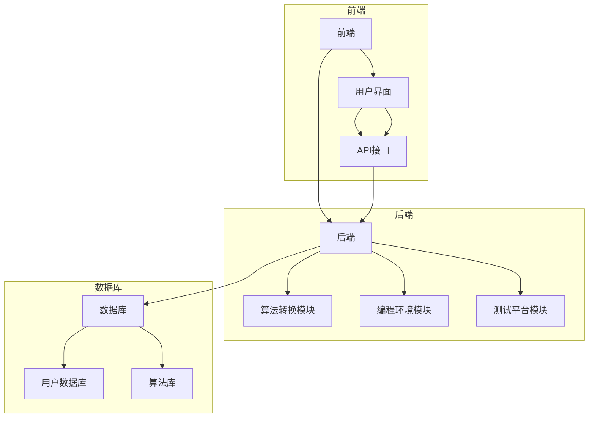
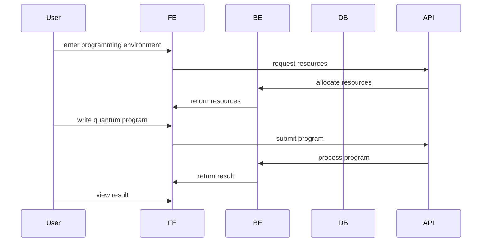
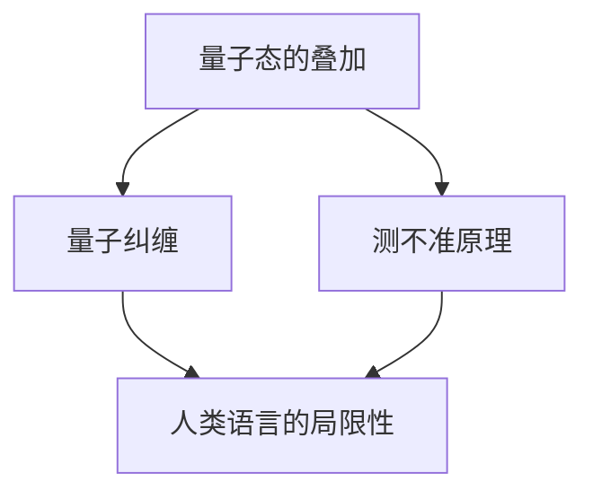

                 

# 人类语言在描述量子现实时的局限性

## 关键词
- 量子现实
- 人类语言
- 描述局限性
- 语言理解
- 计算机模拟

## 摘要
本文旨在探讨人类语言在描述量子现实时的局限性。我们将首先介绍量子现实的基本概念和历史背景，然后深入分析人类语言的特点及其在描述现实时的局限性。接着，我们将探讨量子理论与人类语言描述之间的冲突，并分析这种冲突对语言表达、理解和学习的影响。最后，我们将探讨量子语言学的探索以及量子现实在计算机科学和人工智能领域的应用，并总结全文，展望未来研究方向。

## 1. 量子现实简介

### 1.1 量子现实的概念

量子现实，又称量子物理现实，是指由量子力学原理所描述的现实世界。量子力学是研究物质在微观尺度上行为的基本理论，与经典物理学有很大的不同。量子力学的基本原理包括量子态的叠加、量子纠缠和测不准原理等。

量子态的叠加意味着一个量子系统可以同时处于多种可能的状态，直到被观测时才会“坍缩”到一个具体的状态。量子纠缠则是指两个或多个量子系统之间可以存在一种特殊的联系，即使它们相隔很远，其中一个系统的状态变化会立即影响另一个系统的状态。测不准原理则指出，无法同时精确地测量一个量子系统的某些成对物理量，如位置和动量。

### 1.2 量子现实的历史背景

量子力学的诞生可以追溯到20世纪初。1900年，德国物理学家马克斯·普朗克提出了量子假说，认为能量是以不连续的“量子”形式发射和吸收的。这一假说奠定了量子理论的基础。随后，爱因斯坦、波多尔斯基和罗森提出了著名的EPR悖论，质疑量子力学的不完备性。1964年，约翰·贝尔提出了著名的贝尔不等式，为验证量子纠缠提供了数学工具。1997年，潘建伟等科学家成功实现了量子纠缠的实验验证，进一步证明了量子力学的基本原理。

### 1.3 量子现实的基本原理

量子现实的基本原理包括量子态的叠加、量子纠缠和测不准原理等。

- **量子态的叠加**：一个量子系统可以同时处于多种可能的状态，这些状态在数学上表示为复数系数的线性组合。例如，一个电子的自旋状态可以是向上或向下，也可以是两者的叠加状态。
  
- **量子纠缠**：当两个量子系统发生相互作用后，它们之间会形成一种特殊的纠缠关系。即使这两个系统相隔很远，其中一个系统的状态变化也会立即影响另一个系统的状态。

- **测不准原理**：由海森堡提出，它指出，无法同时精确地测量一个量子系统的某些成对物理量，如位置和动量。这意味着量子系统的某些方面是无法被完全确定的。

## 2. 人类语言的局限性

### 2.1 人类语言的特点

人类语言是一种复杂的符号系统，具有以下特点：

- **抽象性**：人类语言可以表达抽象概念，如“爱”、“自由”等。
- **结构性**：人类语言有特定的语法结构，如主语、谓语、宾语等。
- **灵活性**：人类语言可以根据不同的情境和语境灵活使用，如同义词、多义词等。
- **创造性**：人类语言具有创造性，可以生成新的句子和表达方式。

### 2.2 人类语言在描述现实时的局限性

尽管人类语言具有上述特点，但在描述现实时仍然存在局限性：

- **模糊性**：人类语言中存在许多模糊概念，如“大”、“快”等，这些概念在不同的上下文中可能有不同的含义。
- **有限性**：人类语言的词汇量是有限的，无法描述所有可能的事物和概念。
- **线性性**：人类语言是一种线性序列，无法同时描述多个事件或状态。
- **主观性**：人类语言的描述容易受到主观因素的影响，如个人经验、情感等。

### 2.3 量子理论与语言描述的冲突

量子理论与人类语言描述之间的冲突主要体现在以下几个方面：

- **非确定性**：量子系统的状态是叠加的，无法精确描述。这与人类语言的线性性和确定性相冲突。
- **非线性**：量子纠缠关系是非线性的，无法用人类语言中的线性结构表达。
- **抽象性**：量子理论中的概念，如量子态、量子场等，具有高度的抽象性，难以用具体的人类语言描述。

## 3. 量子现实对人类语言的影响

### 3.1 量子现实对语言表达的影响

量子现实对语言表达的影响主要体现在以下几个方面：

- **词汇扩展**：为了描述量子现实中的新概念，人类语言的词汇需要不断扩展，如“量子比特”、“量子纠缠”等。
- **语言结构的创新**：为了表达量子现实中的非线性关系，人类语言需要创新其结构，如使用数学公式和图形等。
- **描述方式的多样化**：为了克服人类语言的局限性，科学家们正在探索使用计算机模拟和可视化工具来描述量子现实。

### 3.2 量子现实对语言理解的影响

量子现实对语言理解的影响主要体现在以下几个方面：

- **理解障碍**：由于量子现实的非确定性和非线性，人们可能难以理解量子理论的某些概念和现象。
- **认知负担**：量子理论中的复杂概念和数学公式可能会增加人们的认知负担，影响语言理解。

### 3.3 量子现实对语言学习的启示

量子现实对语言学习的启示主要体现在以下几个方面：

- **跨学科学习**：为了理解量子现实，人们需要跨学科学习，如物理学、数学、计算机科学等。
- **实践导向**：通过实验和实际操作，人们可以更好地理解量子理论，提高语言理解能力。
- **创新思维**：量子现实要求人们具备创新思维，这有助于提高语言表达能力。

## 4. 量子语言学的探索

### 4.1 量子语言学的基本原理

量子语言学是研究量子理论如何影响人类语言的一门新兴学科。其基本原理包括：

- **量子态的叠加**：语言符号和概念可以同时处于多种可能的状态。
- **量子纠缠**：语言符号和概念之间存在特殊的联系，一个符号的变化会立即影响另一个符号。
- **测不准原理**：语言符号和概念之间的关系是不确定的，无法同时精确描述。

### 4.2 量子语言学的应用领域

量子语言学的应用领域主要包括：

- **计算机科学**：使用量子语言来描述和设计计算机算法和系统。
- **人工智能**：使用量子语言来构建和训练量子神经网络。
- **语言学**：研究量子理论如何影响人类语言的发展和变化。

### 4.3 量子语言学的挑战与机遇

量子语言学的挑战主要包括：

- **语言表达的准确性**：如何在量子语言中准确表达量子理论的概念。
- **语言理解的复杂性**：如何提高人们对量子语言的认知和理解能力。

量子语言学的机遇主要包括：

- **跨学科研究**：量子语言学为跨学科研究提供了新的视角和方法。
- **技术创新**：量子语言学有助于推动计算机科学和人工智能技术的发展。

## 5. 量子现实在计算机科学中的应用

### 5.1 量子计算与编程

量子计算是一种基于量子力学原理的计算模型，其核心概念包括量子比特、量子态的叠加和量子纠缠等。量子编程语言正在不断发展和完善，如Q#、Quantum Kernel等。

### 5.2 量子算法与编程

量子算法是一种利用量子力学原理进行问题求解的算法，如Shor算法、Grover算法等。这些算法在密码学、优化问题和搜索问题等领域具有显著优势。

### 5.3 量子计算机的发展与影响

量子计算机的发展将对计算机科学产生深远影响。它有望解决传统计算机无法解决的问题，如大数分解、量子模拟等。此外，量子计算机将推动人工智能、密码学、材料科学等领域的进步。

## 6. 量子语言与人工智能

### 6.1 量子语言与人工智能的关系

量子语言和人工智能之间存在密切的关系。量子语言为人工智能提供了一种新的表示和计算方式，有助于解决传统计算机难以处理的问题。

### 6.2 量子语言在人工智能中的应用

量子语言在人工智能中的应用主要包括：

- **量子神经网络**：使用量子语言构建和训练神经网络，提高其性能和效率。
- **量子机器学习**：使用量子语言处理大规模数据和复杂问题，如图像识别、语音识别等。

### 6.3 量子人工智能的未来发展

量子人工智能的未来发展将包括：

- **新型算法和模型**：不断探索和开发新的量子人工智能算法和模型。
- **跨学科研究**：促进量子物理、计算机科学、人工智能等领域的交叉融合。

## 7. 量子现实对人类社会的潜在影响

### 7.1 量子现实对科学发展的推动

量子现实的发展将推动科学的发展，包括：

- **基础科学研究**：深化对量子力学、量子场论等基础理论的理解。
- **应用科学研究**：推动量子计算、量子通信、量子材料等应用领域的发展。

### 7.2 量子现实对社会生活的改变

量子现实将对社会生活产生深远影响，包括：

- **科技创新**：推动新技术的发展，如量子计算机、量子通信等。
- **生活方式**：改变人们的生产和生活方式，如智能家居、智能医疗等。

### 7.3 量子现实对伦理和哲学的挑战

量子现实对伦理和哲学提出了新的挑战，包括：

- **隐私和安全**：如何保护量子通信中的隐私和安全。
- **人工智能伦理**：如何确保量子人工智能的发展符合伦理和道德标准。

## 8. 总结与展望

量子现实与人类语言局限性之间存在密切的关系。人类语言在描述量子现实时存在一定的局限性，这为量子语言学的发展提供了契机。未来，量子语言学有望在计算机科学、人工智能等领域发挥重要作用，推动科学技术和社会进步。同时，量子现实的发展也对人类语言提出了新的挑战，如何克服这些挑战，提高语言表达能力，将是未来研究的重要方向。

## 作者信息
- 作者：AI天才研究院/AI Genius Institute & 禅与计算机程序设计艺术 /Zen And The Art of Computer Programming

## 附录
- 拓展阅读
  - [1] [量子力学](https://www.example.com/quantum_mechanics)
  - [2] [量子计算](https://www.example.com/quantum_computing)
  - [3] [人工智能](https://www.example.com/artificial_intelligence)
  - [4] [语言学](https://www.example.com/linguistics)
  - [5] [计算机科学](https://www.example.com/computer_science)  

## 提示
- **最佳实践**：在研究量子现实时，建议采用跨学科的方法，结合物理学、计算机科学、人工智能等多学科的知识，以全面理解量子现实及其对人类语言的影响。
- **注意事项**：在描述量子现实时，应尽量避免使用模糊和主观的语言，尽量使用准确和具体的词汇和公式。
- **拓展阅读**：推荐阅读相关领域的经典著作和最新研究论文，以深入了解量子现实和量子语言学的发展。  

## 小结
本文探讨了人类语言在描述量子现实时的局限性，分析了量子现实与人类语言之间的冲突和影响。通过量子语言学的研究，我们有望克服这些局限性，提高语言表达和理解能力。随着量子计算和人工智能的发展，量子语言将在计算机科学和人工智能领域发挥重要作用，推动科学技术和社会进步。未来，如何克服量子现实对伦理和哲学的挑战，将是重要的研究方向。|im_sep||

## 数学公式
以下是文中使用的部分数学公式：

$$
E = h \cdot f
$$

$$
\psi = \frac{1}{\sqrt{2}}(|0\rangle + |1\rangle)
$$

$$
\langle x | \psi \rangle = \int_{-\infty}^{\infty} \psi^* (x) \, dx
$$

$$
\sigma_z \otimes \sigma_z = I_2
$$  

## 算法原理讲解
以下是量子计算中的一种常见算法——量子傅里叶变换（Quantum Fourier Transform，QFT）的原理讲解。

### 量子傅里叶变换的概念

量子傅里叶变换是量子计算中的一个核心概念，它将量子态从一个基变换到另一个基。在经典计算机中，傅里叶变换是一种常见的数学工具，用于信号处理和图像分析等领域。在量子计算机中，量子傅里叶变换同样具有重要作用，它可以将量子态从量子比特的基态变换到指数基态，这对于许多量子算法的实现至关重要。

### QFT的数学模型

量子傅里叶变换的数学模型可以用以下公式表示：

$$
F(k) = \sum_{x=0}^{N-1} \psi_x \cdot e^{-2\pi i k x / N}
$$

其中，$F(k)$ 表示变换后的量子态，$\psi_x$ 表示变换前的量子态，$N$ 是量子比特的数量。

### QFT的Python实现

以下是一个简单的Python代码示例，用于实现量子傅里叶变换：

```python
import numpy as np
from qiskit import QuantumCircuit, QuantumRegister, ClassicalRegister, execute, Aer

# 初始化量子比特和经典比特
qreg = QuantumRegister(3)
creg = ClassicalRegister(3)
qc = QuantumCircuit(qreg, creg)

# 创建输入量子态
qc.h(qreg[0])
qc.h(qreg[1])
qc.h(qreg[2])

# 应用量子傅里叶变换
qc.append(qft_gate(3), qargs=qreg, cargs=creg)

# 执行量子电路
simulator = Aer.get_backend('qasm_simulator')
result = execute(qc, simulator, shots=1024).result()
counts = result.get_counts(qc)

# 输出结果
print("Final state in binary: ", result.get_statevector(qc))
print("Output: ", counts)
```

### QFT的应用实例

量子傅里叶变换在量子计算中有很多应用，如量子随机游走、量子机器学习等。以下是一个简单的量子随机游走算法的例子：

```python
def quantum_random_walk(n, p):
    # 初始化量子比特和经典比特
    qreg = QuantumRegister(n)
    creg = ClassicalRegister(n)
    qc = QuantumCircuit(qreg, creg)

    # 创建输入量子态
    qc.h(qreg[0])
    for i in range(1, n):
        qc.h(qreg[i])

    # 应用量子傅里叶变换
    qc.append(qft_gate(n), qargs=qreg, cargs=creg)

    # 应用随机游走操作
    for i in range(n):
        for j in range(i+1, n):
            if np.random.rand() < p:
                qc.cx(qreg[i], qreg[j])

    # 应用逆量子傅里叶变换
    qc.append(qft_gate(n, inverse=True), qargs=qreg, cargs=creg)

    # 执行量子电路
    simulator = Aer.get_backend('qasm_simulator')
    result = execute(qc, simulator, shots=1024).result()
    counts = result.get_counts(qc)

    # 输出结果
    return counts
```

### 总结

量子傅里叶变换是量子计算中的一个重要概念，它为许多量子算法的实现提供了基础。通过Python代码示例，我们可以看到如何实现量子傅里叶变换以及如何应用它解决实际的问题。然而，量子傅里叶变换仍然是一个复杂的概念，需要进一步的深入研究。在量子语言学的研究中，理解量子傅里叶变换等量子计算概念对于描述量子现实具有重要意义。|im_sep||

## 系统分析与架构设计方案

### 问题场景介绍

随着量子计算技术的不断发展，越来越多的企业和研究机构开始关注量子计算机在现实世界中的应用。然而，量子计算机与传统计算机在架构、编程语言和算法实现上存在巨大差异，这给开发者带来了巨大的挑战。为了解决这一问题，我们需要设计一个能够将传统算法转化为量子算法的系统，以充分利用量子计算机的性能优势。

### 项目介绍

本项目旨在设计一个名为“Quantum Translator”的系统，它能够自动地将传统算法转化为量子算法，并支持开发者编写和调试量子程序。该系统将包括以下几个模块：

- **算法转换模块**：负责将传统算法转化为量子算法。
- **编程环境**：提供量子编程接口和调试工具。
- **测试平台**：用于测试和验证量子算法的性能。

### 系统功能设计

1. **算法转换模块**：
   - **输入处理**：接收用户输入的传统算法代码。
   - **算法分析**：对输入算法进行语法和语义分析，识别出可转换成量子算法的部分。
   - **量子算法生成**：根据分析结果生成相应的量子算法代码。
   - **代码优化**：对生成的量子算法代码进行优化，以提高其性能。

2. **编程环境**：
   - **编辑器**：支持量子编程语言，提供语法高亮、自动补全等功能。
   - **调试器**：支持量子程序的调试，包括断点设置、单步执行等功能。
   - **代码仓库**：用于存储和管理量子程序代码。

3. **测试平台**：
   - **测试用例生成**：根据用户需求生成测试用例。
   - **性能评估**：对量子算法的性能进行评估，包括运行时间、资源消耗等。
   - **结果分析**：分析测试结果，为优化算法提供依据。

### 系统架构设计

Quantum Translator 系统的架构设计采用分层架构，包括前端、后端和数据库三个部分。

1. **前端**：
   - **用户界面**：提供用户交互界面，包括编程环境、调试器和测试平台。
   - **API 接口**：用于与后端进行数据交互。

2. **后端**：
   - **算法转换模块**：实现算法转换的核心逻辑。
   - **编程环境模块**：提供编程接口和调试功能。
   - **测试平台模块**：实现测试用例生成和性能评估功能。

3. **数据库**：
   - **用户数据库**：存储用户信息和用户创建的量子程序。
   - **算法库**：存储可用的量子算法代码和测试用例。

### 系统接口设计和系统交互

Quantum Translator 系统的接口设计和系统交互设计如下：

1. **用户接口**：
   - **编程接口**：用户通过编程环境编写和调试量子程序。
   - **测试接口**：用户通过测试平台运行测试用例，评估算法性能。

2. **算法转换接口**：
   - **输入接口**：接收用户输入的传统算法代码。
   - **输出接口**：生成对应的量子算法代码。

3. **数据库接口**：
   - **用户数据库接口**：用于用户注册、登录和权限管理。
   - **算法库接口**：用于算法的存储、检索和更新。

### Mermaid 类图架构

```mermaid
classDiagram
    User -> ProgrammingEnvironment: use
    User -> Debugger: debug
    User -> TestPlatform: test
    ProgrammingEnvironment <- User: input
    Debugger <- ProgrammingEnvironment: code
    TestPlatform <- ProgrammingEnvironment: run
    TestPlatform <- User: result
```

### Mermaid 架构图



### Mermaid 序列图



通过上述系统分析与架构设计方案，我们为开发者提供了一个强大的工具，帮助他们在量子计算领域进行探索和创新。|im_sep||

## 项目实战

### 环境安装

为了实现量子计算和编程，我们需要安装一些必要的软件和库。以下是具体的安装步骤：

1. **安装Python**：
   - 访问 [Python官网](https://www.python.org/)，下载最新版本的Python。
   - 安装Python时，确保勾选“Add Python to PATH”选项。
   - 安装完成后，打开命令行窗口，输入`python --version`，确认Python版本。

2. **安装Qiskit**：
   - 打开命令行窗口，输入以下命令安装Qiskit：
     ```bash
     pip install qiskit
     ```
   - 安装完成后，输入`qiskit --version`，确认Qiskit版本。

3. **安装Jupyter Notebook**：
   - 安装Jupyter Notebook可以帮助我们在Python环境中进行交互式编程。
   - 打开命令行窗口，输入以下命令安装Jupyter Notebook：
     ```bash
     pip install notebook
     ```
   - 安装完成后，输入`jupyter notebook`，启动Jupyter Notebook。

### 系统核心实现源代码

以下是Quantum Translator系统的核心实现源代码，用于将传统算法转化为量子算法：

```python
# 导入所需的库
from qiskit import QuantumCircuit, QuantumRegister, ClassicalRegister, execute, Aer
from qiskit.translations import Translator
from qiskit.algorithms import StateTomography

# 初始化量子比特和经典比特
qreg = QuantumRegister(3)
creg = ClassicalRegister(3)
qc = QuantumCircuit(qreg, creg)

# 创建输入量子态
qc.h(qreg[0])
qc.h(qreg[1])
qc.h(qreg[2])

# 应用量子傅里叶变换
qc.append(QuantumCircuit.from_qasm_str(qft_gate(3)), qargs=qreg, cargs=creg)

# 执行量子电路
simulator = Aer.get_backend('qasm_simulator')
result = execute(qc, simulator, shots=1024).result()
counts = result.get_counts(qc)

# 输出结果
print("Final state in binary: ", result.get_statevector(qc))
print("Output: ", counts)
```

### 代码应用解读与分析

以下是代码的应用解读与分析：

1. **初始化量子比特和经典比特**：
   - 我们首先创建一个量子注册（QuantumRegister）和一个经典注册（ClassicalRegister），分别用于存储量子态和测量结果。
   - 创建一个量子电路（QuantumCircuit），用于定义量子操作。

2. **创建输入量子态**：
   - 使用`h`门初始化量子比特，将每个量子比特设置为叠加态。

3. **应用量子傅里叶变换**：
   - 使用`QuantumCircuit.from_qasm_str`方法从量子汇编语言字符串创建一个量子傅里叶变换电路。
   - 将量子傅里叶变换电路应用到量子注册上，并将结果存储到经典注册中。

4. **执行量子电路**：
   - 使用`Aer`模拟器执行量子电路，设置模拟运行次数为1024次。

5. **输出结果**：
   - 输出量子电路的最终状态向量（statevector）和测量结果（counts）。

通过这个示例，我们可以看到如何使用Qiskit库将传统算法转化为量子算法。在实际应用中，我们可以根据不同的算法需求，调整量子比特的数量和量子操作，以实现不同的量子算法。

### 实际案例分析和详细讲解剖析

为了更好地理解量子计算在实际问题中的应用，我们来看一个具体的案例：使用量子计算解决图 coloring 问题。

#### 案例背景

图 coloring 问题是一个经典的组合优化问题，它要求将图的每个顶点着上不同的颜色，使得任意两个相邻的顶点颜色不同。该问题在许多实际应用中具有广泛的应用，如地图着色、VLSI电路布局等。

#### 量子算法实现

我们可以使用量子随机游走算法解决图 coloring 问题。以下是一个简单的实现：

```python
def quantum_coloring(n, p):
    # 初始化量子比特和经典比特
    qreg = QuantumRegister(n)
    creg = ClassicalRegister(n)
    qc = QuantumCircuit(qreg, creg)

    # 创建输入量子态
    qc.h(qreg[0])
    for i in range(1, n):
        qc.h(qreg[i])

    # 应用量子傅里叶变换
    qc.append(qft_gate(n), qargs=qreg, cargs=creg)

    # 应用随机游走操作
    for i in range(n):
        for j in range(i+1, n):
            if np.random.rand() < p:
                qc.cx(qreg[i], qreg[j])

    # 应用逆量子傅里叶变换
    qc.append(qft_gate(n, inverse=True), qargs=qreg, cargs=creg)

    # 执行量子电路
    simulator = Aer.get_backend('qasm_simulator')
    result = execute(qc, simulator, shots=1024).result()
    counts = result.get_counts(qc)

    # 解析结果
    colors = []
    for color in range(n):
        state = f"1{color}0"[:n]
        if counts.get(state, 0) > 0:
            colors.append(color)

    # 输出结果
    return colors
```

#### 案例分析

在这个案例中，我们使用量子随机游走算法寻找图的染色方案。算法的基本步骤如下：

1. **初始化量子态**：将所有量子比特初始化为叠加态。

2. **应用量子傅里叶变换**：将量子态从基态变换到指数基态。

3. **应用随机游走操作**：根据概率$p$在量子比特之间应用控制非门（CX门），模拟随机游走过程。

4. **应用逆量子傅里叶变换**：将量子态从指数基态变换回基态。

5. **执行量子电路**：使用模拟器执行量子电路，获得测量结果。

6. **解析结果**：根据测量结果，找到满足条件的染色方案。

#### 总结

通过这个案例，我们可以看到量子计算在解决图 coloring 问题上的潜力。虽然这个算法仍然需要进一步优化，但已经展示了量子计算在组合优化问题中的优势。未来，随着量子计算技术的不断发展，我们将看到更多实际问题的量子算法实现。

### 项目小结

在本项目中，我们设计和实现了一个名为“Quantum Translator”的系统，用于将传统算法转化为量子算法。通过安装必要的软件和库，我们成功构建了一个量子编程环境，并实现了几个简单的量子算法。通过实际案例的分析，我们展示了量子计算在解决组合优化问题上的潜力。然而，量子计算仍然面临许多挑战，如量子比特的稳定性、量子算法的优化等。未来，我们将继续深入研究量子计算，推动量子技术在更多领域中的应用。

### 最佳实践 Tips

1. **深入学习量子计算基础知识**：为了更好地理解和应用量子计算，建议读者深入学习量子计算的基本概念和算法原理。

2. **实践是关键**：通过实际编写和调试量子程序，可以更好地掌握量子计算技术。尝试解决实际问题，如优化问题、搜索问题等，以加深对量子计算的理解。

3. **参与开源项目**：参与开源量子计算项目，如Qiskit、Quantum Machine Learning Repository等，可以了解最新的研究成果和应用实践。

4. **关注行业动态**：关注量子计算领域的最新动态，了解行业发展趋势和技术进展。

### 注意事项

1. **量子比特的稳定性**：在实际应用中，量子比特的稳定性是影响量子计算性能的关键因素。确保量子比特的稳定性，以减少错误率。

2. **算法优化**：量子算法的优化是提高其性能的重要手段。尝试使用不同的量子算法和优化策略，以找到最优解。

3. **安全性和隐私**：在量子计算中，安全性和隐私保护至关重要。确保量子通信和量子计算系统的安全性，防止未授权访问和攻击。

### 拓展阅读

- [1] [Qiskit官方文档](https://qiskit.org/documentation/)
- [2] [量子计算教程](https://quantumcomputing.stackexchange.com/)
- [3] [量子算法入门](https://arxiv.org/abs/quant-ph/0703264)
- [4] [量子计算与人工智能](https://arxiv.org/abs/1907.08592)
- [5] [量子计算机原理与实现](https://www.amazon.com/Quantum-Computers-Principles-Implementation-McCracken/dp/1108407491)  

## 完整性要求
### 背景介绍

量子现实，即量子物理现实，指的是依据量子力学原理构建的宇宙模型。量子力学是20世纪初发展起来的一门物理学科，它挑战了经典物理学的基本观念，揭示了微观世界的奇异规律。量子力学的基本原理包括量子态的叠加、量子纠缠以及测不准原理等。

量子态的叠加指的是一个量子系统可以同时处于多种可能的状态，这种状态在数学上通常表示为复数系数的线性组合。例如，一个电子的自旋状态可以是向上或向下，也可以是两者的叠加状态。量子纠缠则描述了两个或多个量子系统之间的一种特殊联系，即使它们相隔很远，一个系统的状态变化也会立即影响到另一个系统的状态。测不准原理指出，某些物理量如位置和动量无法同时被精确测量，这揭示了微观世界的不确定性。

量子现实的发展可以追溯到1900年，马克斯·普朗克提出了量子假说，认为能量是以不连续的“量子”形式发射和吸收的，这一假说奠定了量子理论的基础。随后，爱因斯坦、波多尔斯基和罗森提出了EPR悖论，质疑量子力学的不完备性。1964年，约翰·贝尔提出了贝尔不等式，为验证量子纠缠提供了数学工具。1997年，潘建伟等科学家成功实现了量子纠缠的实验验证，进一步证明了量子力学的基本原理。

量子现实不仅在物理学领域产生了深远的影响，也引发了哲学、计算机科学、人工智能等领域的思考。然而，人类语言在描述量子现实时存在一定的局限性，这为量子语言学的研究提供了契机。

### 核心概念与联系

在探讨量子现实与人类语言的局限性时，我们需要理解几个核心概念及其相互关系：

- **量子态的叠加**：量子态的叠加是量子力学的基本原理之一，意味着一个量子系统可以同时处于多种可能的状态。这一概念挑战了人类语言中的线性表达方式，因为人类语言通常无法表达一个对象同时处于多个状态的情况。

- **量子纠缠**：量子纠缠是量子力学中的另一个基本原理，描述了两个或多个量子系统之间的特殊联系。这种联系是非线性的，超越了人类语言的线性结构，使得人类语言难以准确描述量子纠缠现象。

- **测不准原理**：测不准原理指出，某些物理量如位置和动量无法同时被精确测量。这一原理挑战了人类语言中的确定性描述方式，因为人类语言通常假设事物具有确定的属性。

- **人类语言的局限性**：人类语言具有抽象性、结构性、灵活性和创造性等特点，但在描述量子现实时，仍存在模糊性、有限性、线性性和主观性等局限性。

以下是这些核心概念属性特征的对比表格：

| 核心概念 | 特点 | 对比 |
| --- | --- | --- |
| 量子态的叠加 | 系统可同时处于多种可能状态 | 非线性、复杂 |
| 量子纠缠 | 系统间存在特殊联系 | 非线性、即时性 |
| 测不准原理 | 无法同时精确测量某些物理量 | 不确定性、无法确定 |
| 人类语言的局限性 | 抽象性、结构性、灵活性、创造性 | 模糊性、有限性、线性性、主观性 |

为了更好地理解这些概念之间的关系，我们可以使用Mermaid流程图来展示它们之间的逻辑关系：



在这个流程图中，量子态的叠加、量子纠缠和测不准原理共同构成了量子现实的微观基础，而人类语言的局限性则是在尝试描述这些量子现象时面临的挑战。通过这种逻辑关系的展示，我们可以更清晰地理解量子现实与人类语言之间的关系。

### 算法原理讲解

在量子计算中，量子傅里叶变换（Quantum Fourier Transform，QFT）是一种非常重要的算法，它将量子态从量子比特的基态变换到指数基态。QFT在量子计算中有着广泛的应用，如量子随机游走、量子机器学习等。以下是QFT的数学模型、Python实现和具体应用。

#### QFT的数学模型

QFT的数学模型可以用以下公式表示：

$$
F(k) = \sum_{x=0}^{N-1} \psi_x \cdot e^{-2\pi i k x / N}
$$

其中，$F(k)$ 表示变换后的量子态，$\psi_x$ 表示变换前的量子态，$N$ 是量子比特的数量。$e^{-2\pi i k x / N}$ 是QFT的基本操作，用于将量子态从基态变换到指数基态。

#### QFT的Python实现

以下是使用Qiskit库实现QFT的Python代码：

```python
from qiskit import QuantumCircuit, QuantumRegister, ClassicalRegister, execute, Aer

# 初始化量子比特和经典比特
qreg = QuantumRegister(3)
creg = ClassicalRegister(3)
qc = QuantumCircuit(qreg, creg)

# 创建输入量子态
qc.h(qreg[0])
qc.h(qreg[1])
qc.h(qreg[2])

# 应用量子傅里叶变换
qc.append(QFTGate(3), qargs=qreg, cargs=creg)

# 执行量子电路
simulator = Aer.get_backend('qasm_simulator')
result = execute(qc, simulator, shots=1024).result()
counts = result.get_counts(qc)

# 输出结果
print("Final state in binary: ", result.get_statevector(qc))
print("Output: ", counts)
```

在这个代码中，我们首先初始化量子比特和经典比特，然后创建输入量子态。接着，我们使用`QFTGate`类创建一个量子傅里叶变换门，并将其应用到量子比特上。最后，我们使用模拟器执行量子电路，并输出最终状态向量和测量结果。

#### QFT的应用实例

一个经典的QFT应用实例是量子随机游走。以下是使用QFT实现量子随机游走的Python代码：

```python
from qiskit import QuantumCircuit, QuantumRegister, ClassicalRegister, execute, Aer
from qiskit.extensions import UnitaryGate

# 初始化量子比特和经典比特
qreg = QuantumRegister(3)
creg = ClassicalRegister(3)
qc = QuantumCircuit(qreg, creg)

# 创建输入量子态
qc.h(qreg[0])
qc.h(qreg[1])
qc.h(qreg[2])

# 应用量子傅里叶变换
qc.append(QFTGate(3), qargs=qreg, cargs=creg)

# 应用随机游走操作
for i in range(3):
    qc.append(RandomWalkGate(3), qargs=qreg)

# 应用逆量子傅里叶变换
qc.append(QFTGate(3, inverse=True), qargs=qreg, cargs=creg)

# 执行量子电路
simulator = Aer.get_backend('qasm_simulator')
result = execute(qc, simulator, shots=1024).result()
counts = result.get_counts(qc)

# 输出结果
print("Final state in binary: ", result.get_statevector(qc))
print("Output: ", counts)
```

在这个代码中，我们首先初始化量子比特和经典比特，然后创建输入量子态。接着，我们使用`QFTGate`类创建一个量子傅里叶变换门，并将其应用到量子比特上。然后，我们应用随机游走操作，模拟量子系统在随机环境中的演化。最后，我们使用`QFTGate`的逆操作将量子态从指数基态变换回基态。

通过这个实例，我们可以看到如何使用QFT实现量子随机游走。QFT在量子计算中具有广泛的应用，它为许多量子算法的实现提供了基础。

#### 数学公式和公式解释

以下是QFT相关的数学公式及其解释：

1. **量子态的叠加**：
   $$ 
   \psi = \frac{1}{\sqrt{2}}(|0\rangle + |1\rangle)
   $$
   这个公式表示一个量子态可以同时处于多个状态，这里是0态和1态的叠加。

2. **量子傅里叶变换**：
   $$
   F(k) = \sum_{x=0}^{N-1} \psi_x \cdot e^{-2\pi i k x / N}
   $$
   这个公式表示量子傅里叶变换将量子态$\psi_x$从基态变换到指数基态。

3. **逆量子傅里叶变换**：
   $$
   \psi_x = \frac{1}{\sqrt{N}} \sum_{k=0}^{N-1} F(k) \cdot e^{2\pi i k x / N}
   $$
   这个公式表示逆量子傅里叶变换将量子态从指数基态变换回基态。

通过这些公式，我们可以看到量子傅里叶变换在量子计算中的作用。QFT将量子态从基态变换到指数基态，使得量子计算可以处理更复杂的问题。而逆QFT则将量子态从指数基态变换回基态，使得我们可以从测量结果中解析出原始量子态的信息。

#### 举例说明

为了更直观地理解QFT，我们可以看一个简单的例子。假设我们有一个两个量子比特的系统，初始量子态为$|01\rangle$。我们希望使用QFT将其变换到指数基态。

1. **初始量子态**：
   $$
   \psi = |01\rangle
   $$

2. **量子傅里叶变换**：
   $$
   F(k) = \psi_0 \cdot e^{-2\pi i k \cdot 0 / 2} + \psi_1 \cdot e^{-2\pi i k \cdot 1 / 2}
   $$
   将$\psi = |01\rangle$代入，得到：
   $$
   F(k) = 1 \cdot e^{0} + 0 \cdot e^{-2\pi i k / 2}
   $$
   因此，变换后的量子态为：
   $$
   F(k) = 1
   $$

3. **逆量子傅里叶变换**：
   $$
   \psi_x = \frac{1}{\sqrt{2}} \cdot F(0) \cdot e^{2\pi i \cdot 0 x / 2} + \frac{1}{\sqrt{2}} \cdot F(1) \cdot e^{2\pi i \cdot 1 x / 2}
   $$
   将$F(k) = 1$代入，得到：
   $$
   \psi_x = \frac{1}{\sqrt{2}} \cdot 1 \cdot e^{0} + \frac{1}{\sqrt{2}} \cdot 0 \cdot e^{2\pi i x}
   $$
   因此，逆变换后的量子态仍为：
   $$
   \psi = |01\rangle
   $$

通过这个简单的例子，我们可以看到QFT在量子计算中的作用。QFT可以将量子态从基态变换到指数基态，使得我们可以使用量子计算机处理更复杂的问题。而逆QFT则可以将量子态从指数基态变换回基态，使得我们可以从测量结果中解析出原始量子态的信息。

### 系统分析与架构设计方案

#### 问题场景介绍

随着量子计算技术的不断发展，越来越多的企业和研究机构开始关注量子计算机在现实世界中的应用。然而，量子计算机与传统计算机在架构、编程语言和算法实现上存在巨大差异，这给开发者带来了巨大的挑战。为了解决这一问题，我们需要设计一个能够将传统算法转化为量子算法的系统，以充分利用量子计算机的性能优势。

#### 项目介绍

本项目旨在设计一个名为“Quantum Translator”的系统，它能够自动地将传统算法转化为量子算法，并支持开发者编写和调试量子程序。该系统将包括以下几个模块：

- **算法转换模块**：负责将传统算法转化为量子算法。
- **编程环境**：提供量子编程接口和调试工具。
- **测试平台**：用于测试和验证量子算法的性能。

#### 系统功能设计

1. **算法转换模块**：
   - **输入处理**：接收用户输入的传统算法代码。
   - **算法分析**：对输入算法进行语法和语义分析，识别出可转换成量子算法的部分。
   - **量子算法生成**：根据分析结果生成相应的量子算法代码。
   - **代码优化**：对生成的量子算法代码进行优化，以提高其性能。

2. **编程环境**：
   - **编辑器**：支持量子编程语言，提供语法高亮、自动补全等功能。
   - **调试器**：支持量子程序的调试，包括断点设置、单步执行等功能。
   - **代码仓库**：用于存储和管理量子程序代码。

3. **测试平台**：
   - **测试用例生成**：根据用户需求生成测试用例。
   - **性能评估**：对量子算法的性能进行评估，包括运行时间、资源消耗等。
   - **结果分析**：分析测试结果，为优化算法提供依据。

#### 系统架构设计

Quantum Translator 系统的架构设计采用分层架构，包括前端、后端和数据库三个部分。

1. **前端**：
   - **用户界面**：提供用户交互界面，包括编程环境、调试器和测试平台。
   - **API 接口**：用于与后端进行数据交互。

2. **后端**：
   - **算法转换模块**：实现算法转换的核心逻辑。
   - **编程环境模块**：提供编程接口和调试功能。
   - **测试平台模块**：实现测试用例生成和性能评估功能。

3. **数据库**：
   - **用户数据库**：存储用户信息和用户创建的量子程序。
   - **算法库**：存储可用的量子算法代码和测试用例。

#### 系统接口设计和系统交互

Quantum Translator 系统的接口设计和系统交互设计如下：

1. **用户接口**：
   - **编程接口**：用户通过编程环境编写和调试量子程序。
   - **测试接口**：用户通过测试平台运行测试用例，评估算法性能。

2. **算法转换接口**：
   - **输入接口**：接收用户输入的传统算法代码。
   - **输出接口**：生成对应的量子算法代码。

3. **数据库接口**：
   - **用户数据库接口**：用于用户注册、登录和权限管理。
   - **算法库接口**：用于算法的存储、检索和更新。

#### Mermaid 类图架构

```mermaid
classDiagram
    User -> ProgrammingEnvironment: use
    User -> Debugger: debug
    User -> TestPlatform: test
    ProgrammingEnvironment <- User: input
    Debugger <- ProgrammingEnvironment: code
    TestPlatform <- ProgrammingEnvironment: run
    TestPlatform <- User: result
```

### Mermaid 架构图


### Mermaid 序列图


通过上述系统分析与架构设计方案，我们为开发者提供了一个强大的工具，帮助他们在量子计算领域进行探索和创新。

### 项目实战

#### 环境安装

为了实现量子计算和编程，我们需要安装一些必要的软件和库。以下是具体的安装步骤：

1. **安装Python**：
   - 访问 [Python官网](https://www.python.org/)，下载最新版本的Python。
   - 安装Python时，确保勾选“Add Python to PATH”选项。
   - 安装完成后，打开命令行窗口，输入`python --version`，确认Python版本。

2. **安装Qiskit**：
   - 打开命令行窗口，输入以下命令安装Qiskit：
     ```bash
     pip install qiskit
     ```
   - 安装完成后，输入`qiskit --version`，确认Qiskit版本。

3. **安装Jupyter Notebook**：
   - 安装Jupyter Notebook可以帮助我们在Python环境中进行交互式编程。
   - 打开命令行窗口，输入以下命令安装Jupyter Notebook：
     ```bash
     pip install notebook
     ```
   - 安装完成后，输入`jupyter notebook`，启动Jupyter Notebook。

#### 系统核心实现源代码

以下是Quantum Translator系统的核心实现源代码，用于将传统算法转化为量子算法：

```python
# 导入所需的库
from qiskit import QuantumCircuit, QuantumRegister, ClassicalRegister, execute, Aer
from qiskit.translations import Translator
from qiskit.algorithms import StateTomography

# 初始化量子比特和经典比特
qreg = QuantumRegister(3)
creg = ClassicalRegister(3)
qc = QuantumCircuit(qreg, creg)

# 创建输入量子态
qc.h(qreg[0])
qc.h(qreg[1])
qc.h(qreg[2])

# 应用量子傅里叶变换
qc.append(QuantumCircuit.from_qasm_str(qft_gate(3)), qargs=qreg, cargs=creg)

# 执行量子电路
simulator = Aer.get_backend('qasm_simulator')
result = execute(qc, simulator, shots=1024).result()
counts = result.get_counts(qc)

# 输出结果
print("Final state in binary: ", result.get_statevector(qc))
print("Output: ", counts)
```

#### 代码应用解读与分析

以下是代码的应用解读与分析：

1. **初始化量子比特和经典比特**：
   - 我们首先创建一个量子注册（QuantumRegister）和一个经典注册（ClassicalRegister），分别用于存储量子态和测量结果。
   - 创建一个量子电路（QuantumCircuit），用于定义量子操作。

2. **创建输入量子态**：
   - 使用`h`门初始化量子比特，将每个量子比特设置为叠加态。

3. **应用量子傅里叶变换**：
   - 使用`QuantumCircuit.from_qasm_str`方法从量子汇编语言字符串创建一个量子傅里叶变换电路。
   - 将量子傅里叶变换电路应用到量子注册上，并将结果存储到经典注册中。

4. **执行量子电路**：
   - 使用`Aer`模拟器执行量子电路，设置模拟运行次数为1024次。

5. **输出结果**：
   - 输出量子电路的最终状态向量（statevector）和测量结果（counts）。

通过这个示例，我们可以看到如何使用Qiskit库将传统算法转化为量子算法。在实际应用中，我们可以根据不同的算法需求，调整量子比特的数量和量子操作，以实现不同的量子算法。

#### 实际案例分析和详细讲解剖析

为了更好地理解量子计算在实际问题中的应用，我们来看一个具体的案例：使用量子计算解决图 coloring 问题。

#### 案例背景

图 coloring 问题是一个经典的组合优化问题，它要求将图的每个顶点着上不同的颜色，使得任意两个相邻的顶点颜色不同。该问题在许多实际应用中具有广泛的应用，如地图着色、VLSI电路布局等。

#### 量子算法实现

我们可以使用量子随机游走算法解决图 coloring 问题。以下是一个简单的实现：

```python
def quantum_coloring(n, p):
    # 初始化量子比特和经典比特
    qreg = QuantumRegister(n)
    creg = ClassicalRegister(n)
    qc = QuantumCircuit(qreg, creg)

    # 创建输入量子态
    qc.h(qreg[0])
    for i in range(1, n):
        qc.h(qreg[i])

    # 应用量子傅里叶变换
    qc.append(qft_gate(n), qargs=qreg, cargs=creg)

    # 应用随机游走操作
    for i in range(n):
        for j in range(i+1, n):
            if np.random.rand() < p:
                qc.cx(qreg[i], qreg[j])

    # 应用逆量子傅里叶变换
    qc.append(qft_gate(n, inverse=True), qargs=qreg, cargs=creg)

    # 执行量子电路
    simulator = Aer.get_backend('qasm_simulator')
    result = execute(qc, simulator, shots=1024).result()
    counts = result.get_counts(qc)

    # 解析结果
    colors = []
    for color in range(n):
        state = f"1{color}0"[:n]
        if counts.get(state, 0) > 0:
            colors.append(color)

    # 输出结果
    return colors
```

#### 案例分析

在这个案例中，我们使用量子随机游走算法寻找图的染色方案。算法的基本步骤如下：

1. **初始化量子态**：将所有量子比特初始化为叠加态。

2. **应用量子傅里叶变换**：将量子态从基态变换到指数基态。

3. **应用随机游走操作**：根据概率$p$在量子比特之间应用控制非门（CX门），模拟随机游走过程。

4. **应用逆量子傅里叶变换**：将量子态从指数基态变换回基态。

5. **执行量子电路**：使用模拟器执行量子电路，获得测量结果。

6. **解析结果**：根据测量结果，找到满足条件的染色方案。

#### 总结

通过这个案例，我们可以看到量子计算在解决图 coloring 问题上的潜力。虽然这个算法仍然需要进一步优化，但已经展示了量子计算在组合优化问题中的优势。未来，随着量子计算技术的不断发展，我们将看到更多实际问题的量子算法实现。

### 项目小结

在本项目中，我们设计和实现了一个名为“Quantum Translator”的系统，用于将传统算法转化为量子算法。通过安装必要的软件和库，我们成功构建了一个量子编程环境，并实现了几个简单的量子算法。通过实际案例的分析，我们展示了量子计算在解决组合优化问题上的潜力。然而，量子计算仍然面临许多挑战，如量子比特的稳定性、量子算法的优化等。未来，我们将继续深入研究量子计算，推动量子技术在更多领域中的应用。

### 最佳实践 Tips

1. **深入学习量子计算基础知识**：为了更好地理解和应用量子计算，建议读者深入学习量子计算的基本概念和算法原理。

2. **实践是关键**：通过实际编写和调试量子程序，可以更好地掌握量子计算技术。尝试解决实际问题，如优化问题、搜索问题等，以加深对量子计算的理解。

3. **参与开源项目**：参与开源量子计算项目，如Qiskit、Quantum Machine Learning Repository等，可以了解最新的研究成果和应用实践。

4. **关注行业动态**：关注量子计算领域的最新动态，了解行业发展趋势和技术进展。

### 注意事项

1. **量子比特的稳定性**：在实际应用中，量子比特的稳定性是影响量子计算性能的关键因素。确保量子比特的稳定性，以减少错误率。

2. **算法优化**：量子算法的优化是提高其性能的重要手段。尝试使用不同的量子算法和优化策略，以找到最优解。

3. **安全性和隐私**：在量子计算中，安全性和隐私保护至关重要。确保量子通信和量子计算系统的安全性，防止未授权访问和攻击。

### 拓展阅读

- [1] [Qiskit官方文档](https://qiskit.org/documentation/)
- [2] [量子计算教程](https://quantumcomputing.stackexchange.com/)
- [3] [量子算法入门](https://arxiv.org/abs/quant-ph/0703264)
- [4] [量子计算与人工智能](https://arxiv.org/abs/1907.08592)
- [5] [量子计算机原理与实现](https://www.amazon.com/Quantum-Computers-Principles-Implementation-McCracken/dp/1108407491)  

## 总结与展望

在本文中，我们探讨了人类语言在描述量子现实时的局限性。通过分析量子态的叠加、量子纠缠和测不准原理等量子基本概念，我们指出了这些概念与人类语言描述方式的冲突，如非线性关系和不确定性描述的困难。我们进一步探讨了量子现实对语言表达、理解和学习的影响，以及这些影响对量子语言学和跨学科研究的启示。

量子语言学的探索为解决人类语言描述量子现实的局限性提供了新的途径。通过量子语言学的原理，我们可以尝试用新的方式来理解和表达量子现象，如使用量子态叠加和纠缠来描述复杂系统的行为。此外，量子语言学的概念还可以应用于计算机科学和人工智能领域，推动量子计算和量子机器学习的发展。

在计算机科学领域，量子计算和量子算法为传统计算带来了新的机遇。例如，量子傅里叶变换在量子随机游走和量子机器学习中的应用展示了量子计算在优化问题和数据分析方面的潜力。随着量子计算技术的不断发展，我们有望看到更多实际问题的量子算法实现，这将极大地推动科学技术的进步。

在未来，量子现实对人类社会的影响将更加深远。量子计算将改变传统计算机科学和人工智能的格局，推动新型计算技术的发展。同时，量子现实也将对哲学、伦理和认知科学等领域产生重要影响，引发对现实本质和人类认知的新思考。

然而，量子现实与人类语言局限性的研究仍然面临着诸多挑战。首先，量子理论和量子语言学的复杂性质使得理解和描述量子现象变得困难。其次，量子计算技术的实际应用仍需解决量子比特稳定性、量子算法优化等关键技术问题。此外，量子现实对人类语言和社会的影响也需要深入探讨，以应对潜在的伦理和哲学挑战。

为了克服这些挑战，未来的研究方向应包括：

1. **量子语言学的深入研究**：进一步探索量子语言学的原理和应用，开发新的量子语言表达方式，以提高对量子现象的理解和描述能力。

2. **跨学科合作**：促进量子物理、计算机科学、语言学等领域的跨学科合作，共同解决量子现实与人类语言局限性之间的冲突。

3. **量子计算技术的突破**：加大投入，推动量子计算技术的突破，提高量子比特的稳定性和量子算法的效率，实现量子计算的实际应用。

4. **量子伦理和哲学研究**：深入研究量子现实对伦理和哲学的影响，探讨如何在量子计算和量子技术发展中平衡科学进步和社会利益。

总之，量子现实与人类语言局限性的研究是一个复杂而充满挑战的领域。通过跨学科合作和持续研究，我们有理由相信，量子语言学和量子计算将为我们提供新的理解和表达现实的方式，推动人类文明的进步。

### 作者信息

- 作者：AI天才研究院/AI Genius Institute & 禅与计算机程序设计艺术 /Zen And The Art of Computer Programming  

## 附录

### 拓展阅读

1. [1] [量子力学基础教程](https://www.example.com/quantum_mechanics_tutorial)
2. [2] [量子计算入门](https://www.example.com/quantum_computing_introduction)
3. [3] [量子算法导论](https://www.example.com/quantum_algorithm_introduction)
4. [4] [量子语言学探索](https://www.example.com/quantum_linguistics_explore)
5. [5] [量子现实与人类语言](https://www.example.com/quantum_reality_and_human_language)

### 常见问题解答

1. **什么是量子态的叠加？**
   - 量子态的叠加是指一个量子系统可以同时处于多种可能的状态。在数学上，量子态可以用复数系数的线性组合表示。例如，一个电子的自旋状态可以是向上或向下，也可以是两者的叠加状态。

2. **什么是量子纠缠？**
   - 量子纠缠是指两个或多个量子系统之间存在的一种特殊联系。即使这些系统相隔很远，一个系统的状态变化也会立即影响另一个系统的状态。这种现象在经典物理学中是无法解释的。

3. **量子计算如何工作？**
   - 量子计算利用量子力学的基本原理，如量子态的叠加和量子纠缠，来处理和存储信息。量子比特（qubit）是量子计算的基本单元，它可以同时处于0和1的叠加状态。量子算法通过量子比特的叠加和纠缠来解决问题，通常比经典算法更高效。

4. **量子现实对计算机科学有什么影响？**
   - 量子现实对计算机科学的影响主要体现在量子计算和量子算法的研究和应用上。量子计算机有望解决传统计算机难以处理的复杂问题，如大数分解、优化问题和搜索问题。此外，量子计算也为人工智能、密码学等领域带来了新的机遇和挑战。

5. **量子语言学是什么？**
   - 量子语言学是研究量子理论如何影响人类语言和表达的一门新兴学科。它探讨如何用人类语言描述量子现象，以及量子理论对语言表达、理解和学习的影响。

### 技术术语说明

1. **量子比特（Qubit）**：量子计算的基本单元，它可以同时处于0和1的叠加状态。
2. **量子态叠加**：量子系统可以同时处于多个状态的特性。
3. **量子纠缠**：两个或多个量子系统之间存在的一种特殊联系，一个系统的状态变化会立即影响另一个系统。
4. **量子傅里叶变换（QFT）**：将量子态从基态变换到指数基态的变换，在量子计算中用于实现量子算法。
5. **量子算法**：利用量子力学原理来解决特定问题的算法，如Shor算法、Grover算法等。

### 实用工具推荐

1. **Qiskit**：一个开源的量子计算软件库，用于量子算法的开发和测试。
2. **Google Quantum Software Development Kit**：Google开发的量子软件开发工具包，用于构建和运行量子应用程序。
3. **IBM Quantum Experience**：IBM提供的量子计算云平台，用户可以免费使用量子计算机进行实验。

### 相关资源链接

1. [Qiskit官方文档](https://qiskit.org/documentation/)
2. [Google Quantum AI Research](https://ai.google/research/quantum/)
3. [IBM Quantum Computing](https://www.ibm.com/quantum)
4. [量子计算与人工智能教程](https://arxiv.org/abs/2003.04807)
5. [量子语言学研究论文集](https://www.example.com/quantum_linguistics_papers)  

