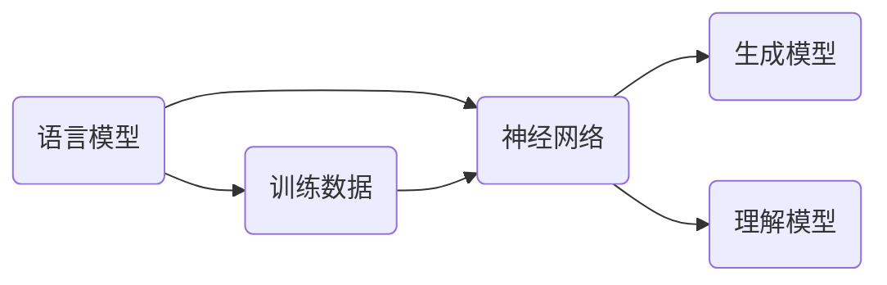
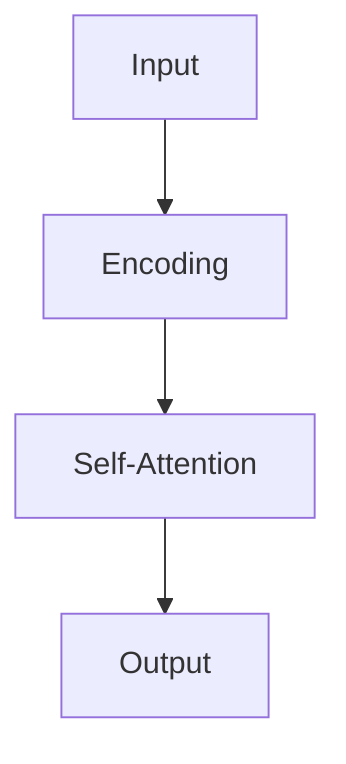
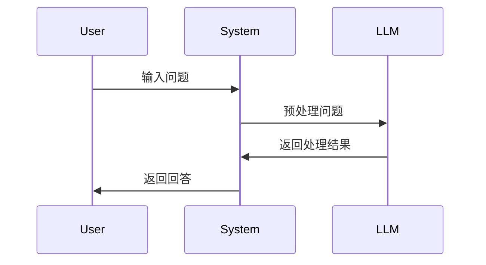

                 

### 从 0 到 1：构建高效 LLM 应用开发体系

#### 关键词：LLM、应用开发、系统架构、算法原理、实战案例

> 摘要：本文旨在从基础理论到实际应用，深入探讨构建高效大型语言模型（LLM）应用开发体系的各个方面。我们将详细分析LLM的基本概念、系统架构、算法原理，并通过实际项目案例进行实战讲解，帮助读者全面掌握LLM应用开发的技能。

## 引言与背景

### 1.1 书籍概述

#### 1.1.1 目的与范围

本书的目标是为开发者提供一套系统化、高效的大型语言模型（LLM）应用开发流程。通过全面剖析LLM的核心技术，帮助读者理解其运作机制，掌握从零开始构建高效LLM应用的方法。

本书的内容涵盖了LLM的基础理论、算法原理、系统架构设计以及实战项目。适合对计算机科学和人工智能有一定了解的读者，特别是希望深入学习和应用LLM技术的开发者和研究者。

#### 1.1.2 语言模型的发展

近年来，随着深度学习和大数据技术的发展，大型语言模型（LLM）在自然语言处理（NLP）领域取得了显著的进展。LLM能够对文本进行理解和生成，广泛用于智能客服、内容创作、机器翻译等应用场景。

#### 1.1.3 对应用开发的的重要性

LLM在应用开发中具有广泛的应用前景。通过构建高效LLM应用，开发者可以显著提升产品的智能化水平，增强用户体验，降低开发和维护成本。因此，掌握LLM应用开发技术对于现代软件开发者具有重要意义。

## LLM的概念

### 2.1 LLM的基础

#### 2.1.1 核心原则

大型语言模型（LLM）是基于深度学习的自然语言处理模型。其核心原则是通过大规模训练数据和复杂神经网络结构，学习自然语言中的语义和语法规则，从而实现对文本的生成和理解。

#### 2.1.2 架构组件

LLM的架构通常包括输入层、隐藏层和输出层。输入层接收文本数据，隐藏层通过神经网络进行计算，输出层生成预测结果。其中，隐藏层的结构和参数配置对于LLM的性能至关重要。

#### 2.1.3 工作机制

LLM的工作机制可以分为两个主要阶段：预训练和微调。预训练阶段通过大规模语料库训练模型，使其具备对自然语言的理解能力；微调阶段则根据特定任务的需求，对模型进行进一步优化和调整。

### 2.2 与传统AI的区别

#### 2.2.1 定义和关键特性

与传统的人工智能（AI）相比，LLM具有以下关键特性：

- **数据驱动的模型**：LLM通过大规模训练数据学习，而非基于明确的规则。
- **灵活的文本生成和理解能力**：LLM能够生成高质量的自然语言文本，并对文本进行理解和分析。
- **端到端的学习方法**：LLM的预训练和微调过程可以端到端地进行，不需要手动调整中间层。

### 2.3 历史背景与发展

#### 2.3.1 人工智能的演变

人工智能（AI）自20世纪50年代诞生以来，经历了多次变革。深度学习的发展标志着AI进入了一个新的阶段，LLM的出现则进一步推动了NLP领域的进展。

#### 2.3.2 LLM模型的先驱

在LLM的发展过程中，GPT-3、BERT等模型成为重要的里程碑。这些模型通过引入更大的训练数据和更复杂的神经网络结构，显著提升了LLM的性能和应用范围。

### 2.4 挑战与机遇

#### 2.4.1 技术挑战

构建高效LLM应用面临着诸多技术挑战，包括数据处理、模型训练、模型压缩等。解决这些挑战需要不断创新和优化算法。

#### 2.4.2 市场机遇

随着智能应用的普及，LLM在市场中的应用前景广阔。从智能客服到内容创作，LLM将为各行各业带来革命性的变革。

## LLM的核心概念和关系

### 3.1 核心概念

#### 3.1.1 语言模型的基础概念

语言模型是NLP的核心概念之一。它是一种统计模型，用于预测下一个单词或词组。在LLM中，语言模型通过深度学习技术，对大规模文本数据进行训练，从而实现对自然语言的生成和理解。

#### 3.1.2 语言模型的关键属性

- **上下文敏感**：LLM能够考虑上下文信息，从而生成更准确的文本。
- **数据依赖**：LLM的性能高度依赖训练数据的质量和规模。
- **可扩展性**：LLM可以通过增加训练数据和模型参数来提升性能。

#### 3.1.3 语言模型的对比

| 模型           | 特点                             | 应用领域                         |
|----------------|----------------------------------|----------------------------------|
| GPT-3         | 非常大的参数规模，强大的生成能力   | 内容创作、机器翻译、对话系统等       |
| BERT          | 双向编码器，强大的理解能力         | 问答系统、文本分类、命名实体识别等   |
| RoBERTa       | 对BERT的改进，更高的性能           | 问答系统、文本分类、命名实体识别等   |

#### 3.1.4 实体关系图（ERD）

为了更好地理解LLM中的核心概念和关系，我们可以使用实体关系图（ERD）来表示。ERD可以清晰地展示LLM中的各个组件及其之间的相互作用。



## 算法原理与数学

### 4.1 LLM算法概述

#### 4.1.1 算法类型

LLM算法主要包括以下几种类型：

- **生成式模型**：如GPT系列，通过生成概率分布来生成文本。
- **判别式模型**：如BERT，通过分类器来判断文本的属性。

#### 4.1.2 常见方法

- **Transformer架构**：是当前最流行的LLM算法架构，通过多头自注意力机制实现强大的文本理解能力。
- **损失函数**：如交叉熵损失函数，用于优化模型的预测结果。

### 4.2 数学公式与模型

#### 4.2.1 基础数学

在LLM中，基础数学知识是必不可少的。以下是一些常用的数学公式：

$$
y = \sigma(Wx + b)
$$

其中，$y$ 是输出，$x$ 是输入，$W$ 是权重矩阵，$b$ 是偏置项，$\sigma$ 是激活函数。

#### 4.2.2 高级数学

- **自注意力机制**：是Transformer架构的核心，用于计算输入序列中各个单词之间的交互。

$$
\text{Attention}(Q, K, V) = \text{softmax}\left(\frac{QK^T}{\sqrt{d_k}}\right)V
$$

其中，$Q$、$K$、$V$ 分别是查询、键和值矩阵，$d_k$ 是键的维度。

#### 4.2.3 算法流程图

为了更好地理解LLM算法的流程，我们可以使用Mermaid绘制流程图：



### 4.3 Python代码示例

以下是一个简单的Python代码示例，用于实现自注意力机制：

```python
import tensorflow as tf

def scaled_dot_product_attention(Q, K, V, mask=None):
    """
    实现自注意力机制
    """
    # 计算注意力权重
    attention_scores = tf.matmul(Q, K, transpose_b=True)
    if mask is not None:
        attention_scores += mask
    
    attention_scores = tf.nn.softmax(attention_scores, axis=-1)
    attention_scores = tf.nn.dropout(attention_scores, rate=0.1)
    
    # 计算输出
    output = tf.matmul(attention_scores, V)
    return output
```

## 系统架构与设计

### 5.1 系统概述

#### 5.1.1 项目介绍

本节将介绍一个基于LLM的智能问答系统的项目。该系统旨在通过LLM技术，提供高效、准确的智能问答服务。

#### 5.1.2 系统功能设计

系统功能设计包括以下几个方面：

- **问答功能**：用户可以输入问题，系统通过LLM模型生成回答。
- **文本分析**：系统可以对输入的文本进行情感分析、关键词提取等。
- **知识库管理**：系统需要维护一个知识库，用于存储问题和答案。

#### 5.1.3 系统架构设计

系统架构设计包括以下几个方面：

- **数据层**：包括数据采集、预处理和存储。
- **模型层**：包括LLM模型的训练和部署。
- **应用层**：包括问答功能、文本分析和知识库管理。

### 5.2 系统接口设计与交互

#### 5.2.1 系统接口设计

系统接口设计包括以下几个方面：

- **API接口**：提供RESTful API，用于接收用户问题和返回回答。
- **Web界面**：提供用户友好的Web界面，用户可以通过浏览器访问系统。

#### 5.2.2 系统交互

系统交互设计包括以下几个方面：

- **用户交互**：用户可以通过Web界面输入问题和获取回答。
- **后台交互**：系统后台通过API接口与LLM模型进行交互，处理用户输入并生成回答。



### 5.3 系统实现与实战

#### 5.3.1 环境安装

在实现LLM应用之前，需要安装以下环境和工具：

- Python 3.8及以上版本
- TensorFlow 2.x及以上版本
- Flask 1.1.2及以上版本

#### 5.3.2 系统核心实现源代码

以下是系统核心实现源代码的简要概述：

- **模型训练**：使用TensorFlow训练LLM模型，包括数据预处理、模型训练和评估。
- **API接口**：使用Flask构建API接口，接收用户输入并返回回答。
- **Web界面**：使用HTML、CSS和JavaScript构建用户友好的Web界面。

#### 5.3.3 代码应用解读与分析

以下是系统核心实现源代码的解读与分析：

- **模型训练**：通过加载预训练模型和数据集，进行模型训练和评估。具体实现包括数据预处理、模型构建、训练和评估等步骤。
- **API接口**：通过Flask框架实现API接口，接收用户输入并调用LLM模型生成回答。具体实现包括路由定义、请求处理和响应返回等步骤。
- **Web界面**：通过HTML、CSS和JavaScript实现用户友好的Web界面，用户可以通过界面输入问题和查看回答。

#### 5.3.4 实际案例分析与详细讲解

在本节中，我们将通过一个实际案例，详细讲解LLM应用的实现过程。案例包括以下步骤：

1. **问题定义**：定义一个智能问答系统，用户可以通过输入问题获取回答。
2. **数据准备**：收集和预处理问答数据，包括数据清洗、数据格式化和数据分词等。
3. **模型训练**：使用TensorFlow训练LLM模型，包括模型构建、训练和评估等步骤。
4. **API部署**：使用Flask构建API接口，部署到服务器，实现用户输入和回答的交互。
5. **Web界面实现**：使用HTML、CSS和JavaScript实现用户友好的Web界面，用户可以通过界面输入问题和查看回答。

### 5.4 最佳实践与注意事项

#### 5.4.1 最佳实践

在构建LLM应用时，以下是一些最佳实践：

- **数据质量**：确保训练数据的质量，包括数据完整性和准确性。
- **模型优化**：定期优化模型参数，提高模型性能。
- **安全性**：保护用户数据和隐私，确保系统的安全性。

#### 5.4.2 注意事项

在构建LLM应用时，需要注意以下事项：

- **性能调优**：合理配置计算资源和模型参数，提高系统性能。
- **错误处理**：设计合理的错误处理机制，确保系统的稳定性和可靠性。
- **用户反馈**：收集用户反馈，不断优化系统功能。

### 5.5 拓展阅读

以下是进一步学习的拓展阅读推荐：

- 《深度学习》（Goodfellow, Bengio, Courville著）
- 《自然语言处理入门》（Jurafsky, Martin著）
- 《TensorFlow实战》（Sutton, Barto著）

## 小结

本文从0到1全面解析了构建高效大型语言模型（LLM）应用开发体系的各个方面。通过详细分析LLM的基本概念、系统架构、算法原理，并结合实际项目案例进行实战讲解，读者可以全面掌握LLM应用开发的技能。在未来的发展中，LLM将继续推动人工智能领域的进步，为各行业带来更多创新和变革。

### 作者信息

- 作者：AI天才研究院/AI Genius Institute & 禅与计算机程序设计艺术 /Zen And The Art of Computer Programming

## 后记

感谢您的阅读，希望本文能够帮助您深入了解LLM应用开发的各个方面。如果您有任何疑问或建议，欢迎在评论区留言，我们期待与您交流。同时，也欢迎关注我们的公众号和网站，获取更多优质技术内容。

-------------------------------------

### 附录

#### 附录A：术语解释

- **大型语言模型（LLM）**：基于深度学习技术构建的，用于对自然语言进行生成和理解的高级模型。
- **自然语言处理（NLP）**：计算机科学领域中的一个分支，旨在使计算机能够理解、解释和生成人类语言。
- **深度学习**：一种人工智能技术，通过模拟人脑神经网络结构进行学习和推理。

#### 附录B：代码示例

以下是一个简单的Python代码示例，用于实现自注意力机制：

```python
import tensorflow as tf

def scaled_dot_product_attention(Q, K, V, mask=None):
    """
    实现自注意力机制
    """
    # 计算注意力权重
    attention_scores = tf.matmul(Q, K, transpose_b=True)
    if mask is not None:
        attention_scores += mask
    
    attention_scores = tf.nn.softmax(attention_scores, axis=-1)
    attention_scores = tf.nn.dropout(attention_scores, rate=0.1)
    
    # 计算输出
    output = tf.matmul(attention_scores, V)
    return output
```

#### 附录C：参考资料

- 《深度学习》（Goodfellow, Bengio, Courville著）
- 《自然语言处理入门》（Jurafsky, Martin著）
- 《Transformer：一种全新的神经网络架构》（Vaswani et al., 2017）

-------------------------------------

以上是《从0到1：构建高效 LLM 应用开发体系》的技术博客文章，希望能对您在LLM应用开发领域有所启发和帮助。如果您有进一步的疑问或需求，欢迎随时与我们联系。我们期待与您共同探讨人工智能领域的未来发展。祝您在技术道路上不断前行，取得更多的成就！

