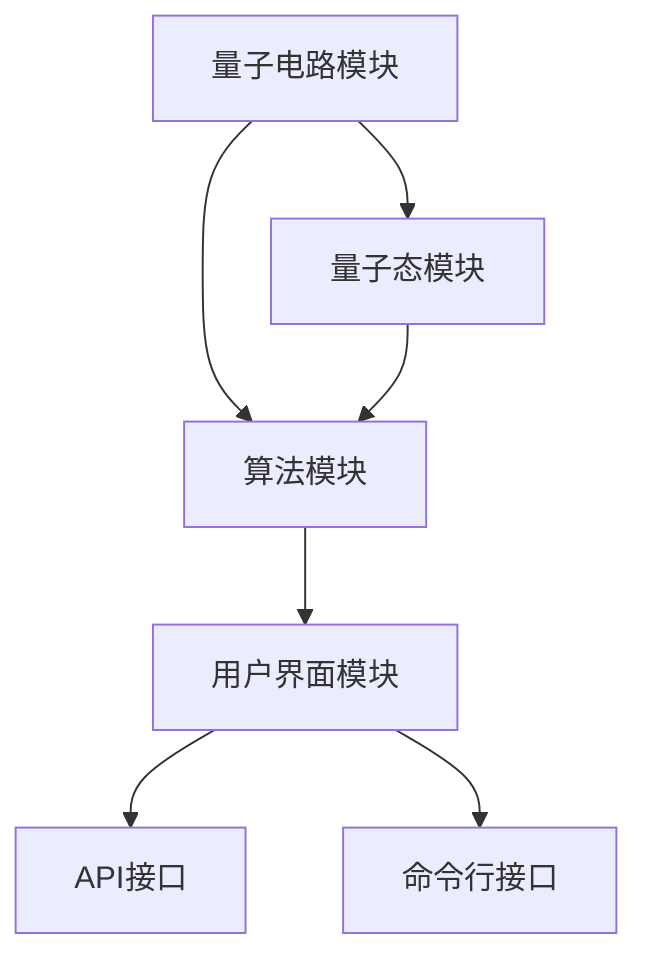

                 


### 引言：从图灵机到量子计算的重要性

**关键词：图灵机、量子计算、计算能力、模拟世界、未来科技**

**摘要：**
本文从计算机科学的发展历程出发，探讨从图灵机到量子计算的演变过程，分析这两者对计算能力拓展和世界可模拟性边界的影响。通过逻辑清晰的分析和通俗易懂的讲解，本文旨在揭示量子计算在计算科学领域的革命性潜力。

---

**引言：从图灵机到量子计算的重要性**

计算机科学作为一门研究计算及其应用的科学，其发展历程中涌现出了许多重要的理论和概念。图灵机作为计算机科学的基石，为我们提供了计算的理论模型。而量子计算，作为一种全新的计算范式，正逐渐拓展我们对计算能力的理解。本文将沿着从图灵机到量子计算的发展轨迹，逐步探讨计算能力与模拟世界边界的拓展。

### 1.1 计算机科学的发展历程

**1.1.1 图灵机的提出**

图灵机由英国数学家艾伦·图灵（Alan Turing）在1936年提出，它是一个抽象的计算模型，用来模拟任何机械计算过程。图灵机的核心部件包括一个无限长的纸带和一个读取和写入装置，以及一个控制器。控制器根据预设的规则，在纸带上进行读写操作，从而实现计算。

**1.1.2 图灵机的意义**

图灵机的提出具有里程碑意义。首先，它为计算机科学提供了理论基础，定义了计算机能做什么以及不能做什么。其次，图灵机模型为后来的计算机设计提供了指导，使得计算机硬件和软件的发展有了明确的方向。图灵机的概念至今仍是计算机科学的核心。

**1.1.3 量子计算的兴起**

量子计算是基于量子力学原理的新型计算范式，它利用量子位（qubit）的叠加态和纠缠态来实现计算。量子计算机的潜力在于其处理速度远超传统计算机，尤其是在解决某些特定问题时，如大整数分解、量子模拟等。

### 1.2 从图灵机到量子计算的意义

**1.2.1 计算能力的提升**

从图灵机到量子计算，计算能力的提升是显而易见的。量子计算机利用量子叠加和纠缠原理，能够在同一时间处理大量数据，这使得某些复杂问题的解决时间从数百年缩短到几天、甚至几分钟。

**1.2.2 模拟世界的边界**

随着计算能力的提升，计算机在模拟世界中的能力也在不断拓展。从前，计算机只能模拟简单的物理过程，而现在，量子计算机有望模拟更为复杂的量子系统，为科学研究提供新的工具。

**1.2.3 未来科技的发展**

量子计算的发展不仅对科学研究有着深远的影响，它还在密码学、材料科学、生物信息学等多个领域具有潜在的应用。未来，量子计算有望成为推动科技进步的重要力量。

---

通过以上分析，我们可以看到从图灵机到量子计算的发展过程，不仅是计算能力的提升，更是对计算本质的深入探索。接下来，本文将深入探讨图灵机和量子计算的基本原理，为理解这两者的革命性潜力奠定基础。

---

### 图灵机

**图灵机**，由艾伦·图灵于1936年提出，是一种抽象的计算模型，用来模拟任何机械计算过程。它由一个无限长的纸带、一个读取和写入装置以及一个控制器组成。图灵机的核心部件包括：

1. **无限长的纸带**：纸带是一条可以无限延伸的磁带，上面可以标记符号。纸带上的每一个位置都有一个读写头可以访问。
2. **读取和写入装置**：读写头可以在纸带上读取当前位置的符号，并在该位置写入新的符号。
3. **控制器**：控制器根据预设的规则，指导读写头在纸带上进行读写操作。这些规则由一组状态转换表定义。

图灵机的运作过程可以分为以下几个步骤：

1. **初始化**：图灵机开始时处于一个特定的初始状态，读写头位于纸带的一个特定位置。
2. **读取符号**：读写头读取当前位置的符号。
3. **状态转换**：根据读取到的符号和当前状态，控制器决定下一步的操作，即移动读写头或写入新符号，以及切换到新的状态。
4. **移动读写头**：读写头根据控制器的指示，在纸带上向左或向右移动一个位置。
5. **写入符号**：如果控制器指示写入新符号，读写头会在当前位置写入新的符号。
6. **重复步骤2-5**：重复上述步骤，直到达到停机状态。

图灵机的停机状态是指它不再执行任何操作的状态。在图灵机模型中，停机状态是计算过程结束的标志。

**图灵机的分类与改进**

图灵机可以分为以下几种类型：

1. **确定型图灵机**：这种图灵机在任意情况下都有确定的操作，即它的每一个状态和符号组合都有唯一的状态转换规则。
2. **非确定型图灵机**：这种图灵机在遇到某些符号组合时，可以有多个可选的操作，即存在多个可能的状态转换规则。

在实际应用中，非确定型图灵机更接近现实中的计算过程，因为现实中的计算机在遇到某些问题时可能会选择不同的解决方案。因此，现代计算机科学中，通常使用非确定型图灵机作为计算模型。

为了提高图灵机的效率和实用性，科学家们对图灵机进行了多种改进。其中，最为著名的改进是图灵机的多带扩展。多带图灵机拥有多个纸带，每个纸带可以独立操作，这使得图灵机能够同时处理多个数据流，从而提高了计算效率。

总之，图灵机作为计算机科学的基石，为我们提供了一个强大且灵活的计算模型。它不仅为后来的计算机设计和软件开发提供了理论基础，还在人工智能、算法分析等领域有着广泛的应用。

---

### 计算机的基本原理

**3.1 逻辑门与组合逻辑**

逻辑门是计算机中处理二进制数据的基本组件，它根据输入信号产生相应的输出信号。常见的逻辑门包括与门（AND gate）、或门（OR gate）、非门（NOT gate）、异或门（XOR gate）等。逻辑门的工作原理如下：

- 与门（AND gate）：当所有输入信号都为高电平时，输出信号才为高电平。
- 或门（OR gate）：当至少一个输入信号为高电平时，输出信号为高电平。
- 非门（NOT gate）：将输入信号取反，输入高电平输出低电平，输入低电平输出高电平。
- 异或门（XOR gate）：当输入信号不同时，输出高电平；当输入信号相同时，输出低电平。

组合逻辑是基于逻辑门构建的电路，它根据输入信号产生输出信号，而不需要记忆功能。组合逻辑电路可以用来实现各种逻辑函数，例如全加器、编码器、译码器等。

**3.2 电路与计算机硬件**

计算机硬件是指计算机中的物理组件，包括处理器（CPU）、内存（RAM）、存储设备（硬盘、固态硬盘）、输入输出设备（键盘、鼠标、显示器等）等。这些硬件组件通过电路连接，协同工作，实现计算机的基本功能。

- 处理器（CPU）：计算机的大脑，负责执行指令和计算。
- 内存（RAM）：临时存储程序和数据，提供快速访问。
- 存储设备（硬盘、固态硬盘）：长期存储数据和文件。
- 输入输出设备：与用户交互，接收输入和显示输出。

电路是计算机硬件的基础，它通过导线和电子元件连接各个硬件组件，实现数据传输和控制。常见的电路包括总线（用于数据传输）、时钟（用于同步操作）等。

**3.3 计算机体系结构**

计算机体系结构是指计算机的硬件设计和组织方式。冯·诺依曼体系结构是最为经典的一种计算机体系结构，它包括以下核心组成部分：

- 中央处理器（CPU）：负责执行指令和计算。
- 内存：存储程序和数据。
- 输入设备：接收用户输入。
- 输出设备：显示计算结果。

冯·诺依曼体系结构的特点是将程序和数据存储在同一个内存中，由CPU依次执行。现代计算机在冯·诺依曼体系结构的基础上，发展出了多种改进和变种，例如哈佛体系结构（将程序和数据存储在不同的内存中）等。

**3.4 计算机存储原理**

计算机存储原理涉及到如何存储和访问数据。常见的存储设备包括：

- 内存（RAM）：快速随机访问存储器，用于临时存储数据和程序。
- 硬盘（HDD）：机械硬盘，用于长期存储大量数据。
- 固态硬盘（SSD）：固态电子存储器，具有更快的访问速度和更高的可靠性。

计算机存储管理技术包括：

- 页面置换算法：用于管理内存页面，优化内存使用。
- 缓存：用于提高数据访问速度，减少访问延迟。

总之，计算机的基本原理涉及到逻辑门、电路、计算机硬件、计算机体系结构和计算机存储原理等多个方面。这些原理共同构成了计算机的运行基础，为计算机科学的发展提供了坚实的支撑。

---

### 量子计算

**量子计算**，作为一种基于量子力学原理的新型计算范式，正在重新定义我们对计算能力的理解。与经典计算相比，量子计算利用量子位（qubit）的叠加态和纠缠态来实现计算，具有极高的并行计算能力和计算速度。

**4.1 量子位与量子叠加原理**

量子位（qubit）是量子计算的基本单元，类似于经典计算中的比特（bit）。然而，与比特只能处于0或1两种状态不同，qubit可以同时处于0和1的叠加状态。这一特性称为量子叠加原理。

量子叠加态可以用以下数学表达式表示：
\[ \psi = c_0|0\rangle + c_1|1\rangle \]
其中，|0\rangle 和 |1\rangle 分别表示量子位的基础态，c_0 和 c_1 是复数系数，表示叠加态的概率幅。量子叠加态的叠加性质使得一个量子系统可以同时表示多个经典状态，从而大大提高了计算能力。

**4.2 量子计算的基本操作**

量子计算的基本操作包括量子门和量子线路。量子门是量子计算的核心组件，类似于经典计算中的逻辑门。量子门通过线性变换操作量子位，实现量子状态的变换。常见的量子门包括：

- 保罗门（Pauli Gate）：作用在量子位上的基本旋转操作。
- 控制非门（CNOT Gate）：实现两个量子位之间的交换操作。
- Hadamard门（H Gate）：将量子位从基础态变换为叠加态。

量子线路是量子门的序列，用于实现特定的量子算法。量子线路通过一系列量子门操作，将初始量子态逐步演化为目标量子态。

**4.3 量子算法与量子计算机的性能**

量子算法是一类基于量子计算原理的算法，它利用量子位的叠加态和纠缠态，实现传统算法无法实现或计算速度极快的任务。著名的量子算法包括：

- Shor算法：用于大整数分解，能够在多项式时间内完成传统算法需要指数时间才能解决的问题。
- Grover算法：用于搜索未排序数据库，具有平方级别的加速效果。

量子计算机的性能评估通常使用量子体积（Quantum Volume）作为指标。量子体积是量子计算机在处理特定问题时的性能度量，它综合考虑了量子比特的数量、量子门的精度和错误率等因素。

总的来说，量子计算作为一种全新的计算范式，具有极高的计算能力和并行性。随着量子计算机技术的发展，量子算法的应用领域将不断扩展，为科学研究、密码学、材料科学等领域带来革命性的变革。

---

### 计算机模型的发展

计算机模型的发展历程见证了计算理论和技术不断进步的过程。从最初的图灵机，到现代的量子计算机，各种计算机模型的出现，不仅拓展了我们对计算能力的理解，也为计算机科学的发展奠定了基础。

**5.1 其他计算机模型简介**

在图灵机的基础上，科学家们提出了多种计算机模型，以更好地模拟实际计算过程。以下是一些重要的计算机模型：

- **多带图灵机**：图灵机的一个扩展，拥有多个纸带，能够同时处理多个数据流。
- **概率图灵机**：引入随机性元素，模拟现实中的计算过程。
- **量子图灵机**：结合量子计算和图灵机的特点，模拟量子计算过程。
- **神经网络**：一种基于生物神经网络的计算模型，用于人工智能和机器学习领域。

**5.2 图灵完备性与计算复杂性**

图灵完备性是指一个计算模型能够模拟任何其他计算模型的能力。如果一个计算模型能够解决图灵机所能解决的问题，那么它被称为图灵完备的。

计算复杂性理论研究的是计算问题的难易程度。它通过分类计算问题，将问题分为多项式时间可解、NP难、NP完全等不同类别，为算法设计和分析提供了理论依据。

- **多项式时间可解问题**：在多项式时间内可以解决的计算问题，如线性方程组的求解。
- **NP难问题**：在多项式时间内验证解的正确性，但求解可能需要指数时间。
- **NP完全问题**：既是NP难问题，也是所有NP问题中最难的问题。

图灵完备性和计算复杂性理论为我们提供了一个理解和分析计算问题的框架，有助于我们更好地理解计算的本质。

总之，计算机模型的发展不仅丰富了计算理论，也为实际应用提供了有力的工具。随着科技的进步，我们将不断探索新的计算机模型，以应对未来计算挑战。

---

### 计算机模拟世界的边界

**6.1 模拟现实的计算极限**

计算机模拟现实的过程中，计算极限是一个不可忽视的问题。计算机模拟面临的主要挑战包括：

1. **计算能力限制**：计算机的算力和存储容量有限，无法处理无限复杂度的系统。
2. **精度问题**：数值计算中的舍入误差可能导致模拟结果偏离真实值。
3. **时间限制**：复杂系统的演化过程可能需要极长的时间，计算机模拟无法在合理时间内完成。

为了克服这些挑战，科学家们采用多种策略，如分布式计算、量子计算等，以提高计算机模拟的能力。

**6.2 计算机模拟与科学实验**

计算机模拟在科学实验中扮演着重要角色。它能够模拟物理、化学、生物等领域的复杂系统，为实验设计提供指导。计算机模拟与科学实验的结合，使得科学家能够在不受实验条件限制的情况下，探索系统的行为和规律。

**6.3 计算机模拟的未来方向**

未来，计算机模拟将在多个方面取得突破：

1. **量子模拟**：量子计算的发展将使计算机模拟能够处理更为复杂的量子系统，为量子科学研究提供新的工具。
2. **生物信息学**：计算机模拟将用于生物大分子模拟，推动生物医学研究。
3. **气候变化**：计算机模拟将在气候变化研究中发挥重要作用，为环境保护提供科学依据。

总之，计算机模拟正在不断拓展我们对世界的理解，未来的计算机模拟将迎来更加广阔的应用前景。

---

### 结论与展望

从图灵机到量子计算，计算机科学经历了翻天覆地的变化。图灵机为我们提供了计算的理论基础，而量子计算则正在重新定义计算的本质。通过量子位和量子叠加原理，量子计算机展示了前所未有的计算能力和并行性，为解决传统计算机难以处理的问题提供了新的途径。

展望未来，量子计算有望在多个领域引发革命性变革。例如，在密码学中，量子计算机能够破解传统加密算法，为信息安全带来新的挑战和机遇；在材料科学中，量子计算能够模拟新材料特性，推动材料创新；在生物学中，量子计算能够解析复杂生物分子结构，为药物研发提供助力。

总之，从图灵机到量子计算的发展历程，不仅体现了计算机科学的理论进步，也预示着未来科技的无尽可能。随着量子计算技术的不断成熟，我们期待它将为人类社会带来更多的创新和突破。

---

**作者：AI天才研究院/AI Genius Institute & 禅与计算机程序设计艺术 /Zen And The Art of Computer Programming**# 从图灵机到量子计算：拓展计算与世界可模拟性的边界

## 关键词：图灵机、量子计算、计算能力、模拟世界、未来科技

## 摘要：
本文深入探讨从图灵机到量子计算的发展历程，分析这两者对计算能力拓展和世界可模拟性边界的影响。通过对图灵机和量子计算的基本原理、发展历程以及应用场景的详细分析，揭示量子计算在计算科学领域的革命性潜力，展望未来科技的发展方向。

## 引言：从图灵机到量子计算的重要性

### 1.1 计算机科学的发展历程

#### 1.1.1 图灵机的提出

图灵机由英国数学家艾伦·图灵（Alan Turing）在1936年提出，是一种抽象的计算模型，用来模拟任何机械计算过程。图灵机的核心部件包括一个无限长的纸带、一个读取和写入装置以及一个控制器。控制器根据预设的规则，在纸带上进行读写操作，从而实现计算。

#### 1.1.2 图灵机的意义

图灵机的提出具有里程碑意义。首先，它为计算机科学提供了理论基础，定义了计算机能做什么以及不能做什么。其次，图灵机模型为后来的计算机设计提供了指导，使得计算机硬件和软件的发展有了明确的方向。图灵机的概念至今仍是计算机科学的核心。

#### 1.1.3 量子计算的兴起

量子计算是基于量子力学原理的新型计算范式，它利用量子位（qubit）的叠加态和纠缠态来实现计算。量子计算机的潜力在于其处理速度远超传统计算机，尤其是在解决某些特定问题时，如大整数分解、量子模拟等。

### 1.2 从图灵机到量子计算的意义

#### 1.2.1 计算能力的提升

从图灵机到量子计算，计算能力的提升是显而易见的。量子计算机利用量子叠加和纠缠原理，能够在同一时间处理大量数据，这使得某些复杂问题的解决时间从数百年缩短到几天、甚至几分钟。

#### 1.2.2 模拟世界的边界

随着计算能力的提升，计算机在模拟世界中的能力也在不断拓展。从前，计算机只能模拟简单的物理过程，而现在，量子计算机有望模拟更为复杂的量子系统，为科学研究提供新的工具。

#### 1.2.3 未来科技的发展

量子计算的发展不仅对科学研究有着深远的影响，它还在密码学、材料科学、生物信息学等多个领域具有潜在的应用。未来，量子计算有望成为推动科技进步的重要力量。

## 图灵机

### 2.1 图灵机的定义与工作原理

图灵机是一种抽象的计算模型，它由一个无限长的纸带、一个读取和写入装置以及一个控制器组成。控制器根据预设的规则，在纸带上进行读写操作，从而实现计算。

#### 2.1.1 无限长的纸带

纸带是一条可以无限延伸的磁带，上面可以标记符号。纸带上的每一个位置都有一个读写头可以访问。

#### 2.1.2 读取和写入装置

读取和写入装置负责在纸带上读取当前位置的符号，并在该位置写入新的符号。根据控制器的指示，它可以在纸带上向左或向右移动一个位置。

#### 2.1.3 控制器

控制器是图灵机的核心部件，它根据预设的规则，指导读取和写入装置进行读写操作。这些规则由一组状态转换表定义。

### 2.2 图灵机的分类与改进

图灵机可以分为以下几种类型：

#### 2.2.1 确定型图灵机

确定型图灵机在任意情况下都有确定的操作，即它的每一个状态和符号组合都有唯一的状态转换规则。

#### 2.2.2 非确定型图灵机

非确定型图灵机在遇到某些符号组合时，可以有多个可选的操作，即存在多个可能的状态转换规则。

在实际应用中，非确定型图灵机更接近现实中的计算过程，因为现实中的计算机在遇到某些问题时可能会选择不同的解决方案。因此，现代计算机科学中，通常使用非确定型图灵机作为计算模型。

为了提高图灵机的效率和实用性，科学家们对图灵机进行了多种改进。其中，最为著名的改进是图灵机的多带扩展。多带图灵机拥有多个纸带，每个纸带可以独立操作，这使得图灵机能够同时处理多个数据流，从而提高了计算效率。

## 计算机的基本原理

### 3.1 逻辑门与组合逻辑

逻辑门是计算机中处理二进制数据的基本组件，它根据输入信号产生相应的输出信号。常见的逻辑门包括与门（AND gate）、或门（OR gate）、非门（NOT gate）、异或门（XOR gate）等。逻辑门的工作原理如下：

#### 3.1.1 与门（AND gate）

当所有输入信号都为高电平时，输出信号才为高电平。

#### 3.1.2 或门（OR gate）

当至少一个输入信号为高电平时，输出信号为高电平。

#### 3.1.3 非门（NOT gate）

将输入信号取反，输入高电平输出低电平，输入低电平输出高电平。

#### 3.1.4 异或门（XOR gate）

当输入信号不同时，输出高电平；当输入信号相同时，输出低电平。

组合逻辑是基于逻辑门构建的电路，它根据输入信号产生输出信号，而不需要记忆功能。组合逻辑电路可以用来实现各种逻辑函数，例如全加器、编码器、译码器等。

### 3.2 电路与计算机硬件

计算机硬件是指计算机中的物理组件，包括处理器（CPU）、内存（RAM）、存储设备（硬盘、固态硬盘）、输入输出设备（键盘、鼠标、显示器等）等。这些硬件组件通过电路连接，协同工作，实现计算机的基本功能。

#### 3.2.1 处理器（CPU）

处理器是计算机的大脑，负责执行指令和计算。

#### 3.2.2 内存（RAM）

内存用于临时存储程序和数据，提供快速访问。

#### 3.2.3 存储设备（硬盘、固态硬盘）

硬盘和固态硬盘用于长期存储大量数据和文件。

#### 3.2.4 输入输出设备

输入输出设备与用户交互，接收输入和显示输出。

电路是计算机硬件的基础，它通过导线和电子元件连接各个硬件组件，实现数据传输和控制。常见的电路包括总线（用于数据传输）、时钟（用于同步操作）等。

### 3.3 计算机体系结构

计算机体系结构是指计算机的硬件设计和组织方式。冯·诺依曼体系结构是最为经典的一种计算机体系结构，它包括以下核心组成部分：

#### 3.3.1 中央处理器（CPU）

中央处理器负责执行指令和计算。

#### 3.3.2 内存

内存用于存储程序和数据。

#### 3.3.3 输入设备

输入设备接收用户输入。

#### 3.3.4 输出设备

输出设备显示计算结果。

冯·诺依曼体系结构的特点是将程序和数据存储在同一个内存中，由CPU依次执行。现代计算机在冯·诺依曼体系结构的基础上，发展出了多种改进和变种，例如哈佛体系结构（将程序和数据存储在不同的内存中）等。

### 3.4 计算机存储原理

计算机存储原理涉及到如何存储和访问数据。常见的存储设备包括：

#### 3.4.1 内存（RAM）

内存用于临时存储程序和数据，提供快速访问。

#### 3.4.2 硬盘（HDD）

硬盘是机械硬盘，用于长期存储大量数据。

#### 3.4.3 固态硬盘（SSD）

固态硬盘是固态电子存储器，具有更快的访问速度和更高的可靠性。

计算机存储管理技术包括：

#### 3.4.4 页面置换算法

页面置换算法用于管理内存页面，优化内存使用。

#### 3.4.5 缓存

缓存用于提高数据访问速度，减少访问延迟。

### 量子计算

### 4.1 量子位与量子叠加原理

量子位（qubit）是量子计算的基本单元，类似于经典计算中的比特（bit）。然而，与比特只能处于0或1两种状态不同，qubit可以同时处于0和1的叠加状态。这一特性称为量子叠加原理。

量子叠加态可以用以下数学表达式表示：
\[ \psi = c_0|0\rangle + c_1|1\rangle \]
其中，|0\rangle 和 |1\rangle 分别表示量子位的基础态，c_0 和 c_1 是复数系数，表示叠加态的概率幅。量子叠加态的叠加性质使得一个量子系统可以同时表示多个经典状态，从而大大提高了计算能力。

### 4.2 量子计算的基本操作

量子计算的基本操作包括量子门和量子线路。量子门是量子计算的核心组件，类似于经典计算中的逻辑门。量子门通过线性变换操作量子位，实现量子状态的变换。常见的量子门包括：

#### 4.2.1 保罗门（Pauli Gate）

保罗门是作用在量子位上的基本旋转操作。

#### 4.2.2 控制非门（CNOT Gate）

控制非门实现两个量子位之间的交换操作。

#### 4.2.3 Hadamard门（H Gate）

Hadamard门将量子位从基础态变换为叠加态。

量子线路是量子门的序列，用于实现特定的量子算法。量子线路通过一系列量子门操作，将初始量子态逐步演化为目标量子态。

### 4.3 量子算法与量子计算机的性能

量子算法是一类基于量子计算原理的算法，它利用量子位的叠加态和纠缠态，实现传统算法无法实现或计算速度极快的任务。著名的量子算法包括：

#### 4.3.1 Shor算法

Shor算法用于大整数分解，能够在多项式时间内完成传统算法需要指数时间才能解决的问题。

#### 4.3.2 Grover算法

Grover算法用于搜索未排序数据库，具有平方级别的加速效果。

量子计算机的性能评估通常使用量子体积（Quantum Volume）作为指标。量子体积是量子计算机在处理特定问题时的性能度量，它综合考虑了量子比特的数量、量子门的精度和错误率等因素。

### 计算机模型的发展

#### 5.1 其他计算机模型简介

在图灵机的基础上，科学家们提出了多种计算机模型，以更好地模拟实际计算过程。以下是一些重要的计算机模型：

#### 5.1.1 多带图灵机

多带图灵机是图灵机的一个扩展，拥有多个纸带，能够同时处理多个数据流。

#### 5.1.2 概率图灵机

概率图灵机引入随机性元素，模拟现实中的计算过程。

#### 5.1.3 量子图灵机

量子图灵机结合量子计算和图灵机的特点，模拟量子计算过程。

#### 5.1.4 神经网络

神经网络是一种基于生物神经网络的计算模型，用于人工智能和机器学习领域。

#### 5.2 图灵完备性与计算复杂性

图灵完备性是指一个计算模型能够模拟任何其他计算模型的能力。如果一个计算模型能够解决图灵机所能解决的问题，那么它被称为图灵完备的。

计算复杂性理论研究的是计算问题的难易程度。它通过分类计算问题，将问题分为多项式时间可解、NP难、NP完全等不同类别，为算法设计和分析提供了理论依据。

#### 5.2.1 多项式时间可解问题

多项式时间可解问题在多项式时间内可以解决的计算问题，如线性方程组的求解。

#### 5.2.2 NP难问题

NP难问题在多项式时间内验证解的正确性，但求解可能需要指数时间。

#### 5.2.3 NP完全问题

NP完全问题既是NP难问题，也是所有NP问题中最难的问题。

### 计算机模拟世界的边界

#### 6.1 模拟现实的计算极限

计算机模拟现实的过程中，计算极限是一个不可忽视的问题。计算机模拟面临的主要挑战包括：

#### 6.1.1 计算能力限制

计算机的算力和存储容量有限，无法处理无限复杂度的系统。

#### 6.1.2 精度问题

数值计算中的舍入误差可能导致模拟结果偏离真实值。

#### 6.1.3 时间限制

复杂系统的演化过程可能需要极长的时间，计算机模拟无法在合理时间内完成。

为了克服这些挑战，科学家们采用多种策略，如分布式计算、量子计算等，以提高计算机模拟的能力。

#### 6.2 计算机模拟与科学实验

计算机模拟在科学实验中扮演着重要角色。它能够模拟物理、化学、生物等领域的复杂系统，为实验设计提供指导。计算机模拟与科学实验的结合，使得科学家能够在不受实验条件限制的情况下，探索系统的行为和规律。

#### 6.3 计算机模拟的未来方向

未来，计算机模拟将在多个方面取得突破：

#### 6.3.1 量子模拟

量子计算的发展将使计算机模拟能够处理更为复杂的量子系统，为量子科学研究提供新的工具。

#### 6.3.2 生物信息学

计算机模拟将用于生物大分子模拟，推动生物医学研究。

#### 6.3.3 气候变化

计算机模拟将在气候变化研究中发挥重要作用，为环境保护提供科学依据。

### 结论与展望

从图灵机到量子计算，计算机科学经历了翻天覆地的变化。图灵机为我们提供了计算的理论基础，而量子计算则正在重新定义计算的本质。通过量子位和量子叠加原理，量子计算机展示了前所未有的计算能力和并行性，为解决传统计算机难以处理的问题提供了新的途径。

展望未来，量子计算有望在多个领域引发革命性变革。例如，在密码学中，量子计算机能够破解传统加密算法，为信息安全带来新的挑战和机遇；在材料科学中，量子计算能够模拟新材料特性，推动材料创新；在生物学中，量子计算能够解析复杂生物分子结构，为药物研发提供助力。

总之，从图灵机到量子计算的发展历程，不仅体现了计算机科学的理论进步，也预示着未来科技的无尽可能。随着量子计算技术的不断成熟，我们期待它将为人类社会带来更多的创新和突破。

### 作者

**作者：AI天才研究院/AI Genius Institute & 禅与计算机程序设计艺术 /Zen And The Art of Computer Programming**## 图灵机的定义与工作原理

图灵机，由艾伦·图灵（Alan Turing）于1936年提出，是一种抽象的计算模型，用于模拟任何机械计算过程。图灵机的核心部件包括一个无限长的纸带、一个读取和写入装置以及一个控制器。下面，我们将详细探讨这些组成部分以及它们如何协同工作。

### 无限长的纸带

图灵机的纸带是一条无限延伸的磁带，上面标记有各种符号。这些符号可以是0和1等简单的二进制数字，也可以是字母、数字和其他字符。纸带上的每个位置都有一个读写头可以访问。读写头可以在纸带上向左或向右移动，以读取或写入符号。

纸带在图灵机中扮演着重要的角色，因为它记录了程序的状态和数据。程序的状态由纸带上特定位置的符号决定，而数据则通过在纸带上写入和读取符号进行操作。

### 读取和写入装置

读取和写入装置是图灵机的另一个关键组件。它位于纸带上，可以读取当前位置的符号，并根据控制器的指示进行相应的操作。操作包括：

1. **读取符号**：读取当前位置的符号。
2. **写入新符号**：在当前位置写入一个新的符号。
3. **移动读写头**：根据控制器的指令，向左或向右移动一个位置。

读取和写入装置的灵活性使得图灵机能够处理复杂的计算任务。

### 控制器

控制器是图灵机的“大脑”，它根据一组预设的规则，指导读取和写入装置进行操作。这些规则通常以状态转换表的形式表示，每个状态转换表包含以下信息：

1. **当前状态**：图灵机当前所处的状态。
2. **读取到的符号**：纸带上当前位置的符号。
3. **下一步操作**：包括移动读写头、写入新符号以及切换到新的状态。
4. **下一个状态**：控制器执行操作后，图灵机将切换到的下一个状态。

控制器的工作流程如下：

1. **初始化**：图灵机开始时处于一个特定的初始状态，读写头位于纸带的一个特定位置。
2. **读取符号**：读取当前位置的符号。
3. **状态转换**：根据当前状态和读取到的符号，控制器查找状态转换表，决定下一步的操作。
4. **执行操作**：根据控制器指示，移动读写头、写入新符号或切换到新的状态。
5. **重复步骤2-4**：重复上述步骤，直到达到停机状态。

### 状态转换表

状态转换表是图灵机的核心，它决定了图灵机的计算过程。一个简单的状态转换表可能如下所示：

| 当前状态 | 读取到的符号 | 移动读写头 | 写入新符号 | 下一个状态 |
|---------|------------|-----------|-----------|-----------|
| q0      | 0          | 无        | 1         | q1        |
| q0      | 1          | 无        | 0         | q1        |
| q1      | 0          | 右移      | 0         | q2        |
| q1      | 1          | 无        | 1         | q0        |

在这个表中，如果图灵机当前处于状态q0，读取到符号0，则会右移读写头，写入新符号1，并切换到状态q1。如果读取到符号1，则会切换到状态q1，不移动读写头，写入新符号1。

### 停机状态

图灵机在执行计算时，可能会达到一种停机状态，即不再执行任何操作的状态。停机状态是计算过程结束的标志。在图灵机的理论模型中，停机状态通常意味着计算成功或达到了某个预定的终止条件。

### 图灵机的运作过程

一个简单的图灵机运作过程可以概括为：

1. **初始化**：图灵机开始时，处于一个初始状态，读写头位于纸带的一个特定位置。
2. **执行状态转换**：图灵机读取当前位置的符号，根据状态转换表决定下一步的操作，并更新状态和纸带上的符号。
3. **重复执行**：图灵机重复执行状态转换，直到达到停机状态。

通过这种简单的抽象模型，图灵机能够模拟任何机械计算过程，从而定义了现代计算机的理论基础。

### 总结

图灵机作为一种抽象的计算模型，通过纸带、读取和写入装置以及控制器的协同工作，实现了计算过程。它不仅为计算机科学的发展奠定了基础，还在人工智能、算法分析等领域有着广泛的应用。接下来，我们将进一步探讨图灵机的分类与改进，以了解它在不同场景下的应用。

---

## 图灵机的分类与改进

图灵机作为一种抽象的计算模型，虽然提供了一个强大的理论基础，但在实际应用中，为了更好地模拟现实中的计算过程，科学家们对其进行了多种改进和扩展。以下是一些常见的图灵机分类与改进：

### 多带图灵机

多带图灵机是图灵机的一个扩展，它具有多个纸带，每个纸带可以独立操作。这种设计使得图灵机能够同时处理多个数据流，从而提高了计算效率。多带图灵机的运作原理与单带图灵机类似，但在每个纸带上都有一个独立的读写头，可以独立读取和写入符号。

多带图灵机的引入，使得图灵机能够处理更为复杂的计算任务。例如，在编译原理中，多带图灵机被用于模拟编译器的操作，包括词法分析、语法分析和代码生成等过程。多带图灵机的多纸带特性，使得它能够同时处理源代码和目标代码，从而提高了编译器的效率。

### 非确定型图灵机

在现实世界中，计算过程往往存在不确定性。为了更准确地模拟这种不确定性，科学家们提出了非确定型图灵机。非确定型图灵机与确定型图灵机的主要区别在于，在遇到某些符号组合时，它可以有多个可选的操作，即存在多个可能的状态转换规则。

非确定型图灵机在算法分析和形式语言理论中具有重要应用。例如，在词法分析中，非确定型图灵机被用于构建有限自动机，以高效地识别和分类字符串。在语法分析中，非确定型图灵机则用于模拟语法分析器，解析复杂的编程语言。

### 概率图灵机

概率图灵机是另一种改进的图灵机，它在计算过程中引入了随机性元素。概率图灵机在遇到某些决策点时，可以根据概率分布来选择下一步的操作，而不是像确定型图灵机那样有明确的操作规则。

概率图灵机在模拟现实中的计算过程，特别是涉及随机性的计算问题时，具有独特的优势。例如，在模拟蒙特卡罗方法时，概率图灵机可以根据概率分布来选择随机数，从而提高计算效率。此外，概率图灵机还在机器学习领域，特别是在贝叶斯网络和隐马尔可夫模型中，有着广泛的应用。

### 图灵完备性

图灵完备性是指一个计算模型能够模拟任何其他计算模型的能力。如果一个计算模型能够解决图灵机所能解决的问题，那么它被称为图灵完备的。在计算机科学中，许多模型都是图灵完备的，包括多带图灵机、非确定型图灵机和概率图灵机。

图灵完备性为计算机科学提供了统一的理论框架。通过图灵完备性，我们可以比较不同计算模型的计算能力，并理解它们之间的相互关系。例如，多带图灵机虽然比单带图灵机具有更高的计算能力，但仍然无法超越图灵机的计算能力。

### 量子图灵机

量子图灵机是结合量子计算和图灵机特点的一种新型计算模型。量子图灵机利用量子位（qubit）的叠加态和纠缠态，实现高效的量子计算。量子图灵机在量子计算领域具有重要应用，特别是在量子算法和量子编程中。

量子图灵机的核心组件包括量子寄存器、量子控制器和量子门。量子寄存器用于存储量子位，量子控制器根据预设的量子算法指导量子门的操作，量子门则实现量子状态的变换。

### 总结

通过对图灵机的分类与改进，我们可以看到，图灵机不仅为计算机科学提供了理论基础，还在不同领域有着广泛的应用。多带图灵机、非确定型图灵机、概率图灵机和量子图灵机等改进模型，使得图灵机能够更好地模拟现实中的计算过程，为解决复杂的计算问题提供了强大的工具。接下来，我们将进一步探讨计算机的基本原理，了解计算机硬件、逻辑门和体系结构等方面的知识。

---

## 计算机的基本原理

计算机作为现代科技的基石，其基本原理涵盖了逻辑门、电路与计算机硬件、计算机体系结构和计算机存储原理等多个方面。以下是这些基本原理的详细介绍。

### 逻辑门与组合逻辑

逻辑门是计算机中处理二进制数据的基本组件，它根据输入信号产生相应的输出信号。常见的逻辑门包括与门（AND gate）、或门（OR gate）、非门（NOT gate）和异或门（XOR gate）等。以下是这些逻辑门的工作原理：

#### 与门（AND gate）

与门只有当所有输入信号都为高电平时，输出信号才为高电平。逻辑表达式如下：

\[ Y = A \& B \]

其中，\( A \) 和 \( B \) 是输入信号，\( Y \) 是输出信号。

#### 或门（OR gate）

或门至少有一个输入信号为高电平时，输出信号就为高电平。逻辑表达式如下：

\[ Y = A \| B \]

#### 非门（NOT gate）

非门将输入信号取反，输入高电平输出低电平，输入低电平输出高电平。逻辑表达式如下：

\[ Y = \neg A \]

#### 异或门（XOR gate）

异或门当输入信号不同时，输出高电平；当输入信号相同时，输出低电平。逻辑表达式如下：

\[ Y = A \oplus B \]

组合逻辑是基于这些基本逻辑门构建的电路，它根据输入信号产生输出信号，而不需要记忆功能。组合逻辑电路可以用来实现各种逻辑函数，例如全加器、编码器、译码器等。

### 电路与计算机硬件

计算机硬件是指计算机中的物理组件，包括处理器（CPU）、内存（RAM）、存储设备（硬盘、固态硬盘）、输入输出设备（键盘、鼠标、显示器等）等。这些硬件组件通过电路连接，协同工作，实现计算机的基本功能。

#### 处理器（CPU）

处理器是计算机的大脑，负责执行指令和计算。它由多个核心组成，每个核心可以同时执行多个线程，从而提高了计算效率。

#### 内存（RAM）

内存用于临时存储程序和数据，提供快速访问。内存分为随机访问存储（RAM）和只读存储（ROM）。

#### 存储设备（硬盘、固态硬盘）

硬盘和固态硬盘用于长期存储大量数据和文件。硬盘是机械硬盘，具有较高的存储容量和较慢的访问速度；固态硬盘则是固态电子存储器，具有更快的访问速度和更高的可靠性。

#### 输入输出设备

输入输出设备与用户交互，接收输入和显示输出。常见的输入设备包括键盘、鼠标等；输出设备包括显示器、打印机等。

电路是计算机硬件的基础，它通过导线和电子元件连接各个硬件组件，实现数据传输和控制。常见的电路包括总线（用于数据传输）、时钟（用于同步操作）等。

### 计算机体系结构

计算机体系结构是指计算机的硬件设计和组织方式。冯·诺依曼体系结构是最为经典的一种计算机体系结构，它包括以下核心组成部分：

#### 中央处理器（CPU）

中央处理器负责执行指令和计算。

#### 内存

内存用于存储程序和数据。

#### 输入设备

输入设备接收用户输入。

#### 输出设备

输出设备显示计算结果。

冯·诺依曼体系结构的特点是将程序和数据存储在同一个内存中，由CPU依次执行。现代计算机在冯·诺依曼体系结构的基础上，发展出了多种改进和变种，例如哈佛体系结构（将程序和数据存储在不同的内存中）等。

### 计算机存储原理

计算机存储原理涉及到如何存储和访问数据。常见的存储设备包括：

#### 内存（RAM）

内存用于临时存储程序和数据，提供快速访问。

#### 硬盘（HDD）

硬盘是机械硬盘，用于长期存储大量数据。

#### 固态硬盘（SSD）

固态硬盘是固态电子存储器，具有更快的访问速度和更高的可靠性。

计算机存储管理技术包括：

#### 页面置换算法

页面置换算法用于管理内存页面，优化内存使用。

#### 缓存

缓存用于提高数据访问速度，减少访问延迟。

### 总结

计算机的基本原理涉及多个方面，包括逻辑门、电路与计算机硬件、计算机体系结构和计算机存储原理。这些基本原理共同构成了计算机的运行基础，为计算机科学的发展提供了坚实的支撑。接下来，我们将进一步探讨量子计算的基本原理，了解量子位、量子叠加原理以及量子计算的基本操作。

---

## 量子计算的基本原理

量子计算是一种基于量子力学原理的新型计算范式，它利用量子位（qubit）的叠加态和纠缠态来实现计算。量子计算具有与传统计算完全不同的特性，使得它能够解决某些特定问题，例如大整数分解和量子模拟等，传统计算机无法在合理时间内解决。

### 量子位（qubit）

量子位是量子计算的基本单元，类似于经典计算中的比特（bit）。然而，与比特只能处于0或1两种状态不同，qubit可以同时处于0和1的叠加状态。这一特性称为量子叠加原理。

量子叠加态可以用以下数学表达式表示：
\[ \psi = c_0|0\rangle + c_1|1\rangle \]
其中，\( |0\rangle \) 和 \( |1\rangle \) 分别表示量子位的基础态，\( c_0 \) 和 \( c_1 \) 是复数系数，表示叠加态的概率幅。量子叠加态的叠加性质使得一个量子系统可以同时表示多个经典状态，从而大大提高了计算能力。

### 量子叠加原理

量子叠加原理是量子计算的核心概念之一。它表明，量子位不仅可以处于0或1的状态，还可以处于0和1的叠加状态。例如，一个量子位在叠加态时，可以同时以一定的概率处于0和1的状态。这种叠加态的特性使得量子计算机能够在同一时间内处理多个计算问题。

### 量子纠缠

量子纠缠是量子计算的另一个核心概念。它描述了两个或多个量子位之间的特殊关联关系。当两个量子位发生纠缠时，一个量子位的测量会即时影响到另一个量子位的状态，即使它们相隔很远。这种纠缠关系使得量子计算机能够实现高度并行的计算，从而在解决某些问题时，具有巨大的计算速度优势。

### 量子计算的基本操作

量子计算的基本操作包括量子门和量子线路。量子门是量子计算的核心组件，类似于经典计算中的逻辑门。量子门通过线性变换操作量子位，实现量子状态的变换。常见的量子门包括：

#### 保罗门（Pauli Gate）

保罗门是作用在量子位上的基本旋转操作。它包括X门（交换门）、Y门（旋转门）和Z门（相位门）。

#### 控制非门（CNOT Gate）

控制非门实现两个量子位之间的交换操作。如果控制位的量子位处于1状态，目标位的量子位会取反；否则，目标位的量子位保持不变。

#### Hadamard门（H Gate）

Hadamard门将量子位从基础态变换为叠加态。它可以将一个量子位的基态 \( |0\rangle \) 变换为 \( \frac{1}{\sqrt{2}}(|0\rangle + |1\rangle) \)。

量子线路是量子门的序列，用于实现特定的量子算法。量子线路通过一系列量子门操作，将初始量子态逐步演化为目标量子态。

### 量子算法与量子计算机的性能

量子算法是一类基于量子计算原理的算法，它利用量子位的叠加态和纠缠态，实现传统算法无法实现或计算速度极快的任务。著名的量子算法包括：

#### Shor算法

Shor算法用于大整数分解，能够在多项式时间内完成传统算法需要指数时间才能解决的问题。它利用量子计算机的并行性，将大整数分解问题转化为对大整数的周期性检测问题。

#### Grover算法

Grover算法用于搜索未排序数据库，具有平方级别的加速效果。它利用量子计算机的并行性，通过多次迭代，快速定位数据库中的特定条目。

量子计算机的性能评估通常使用量子体积（Quantum Volume）作为指标。量子体积是量子计算机在处理特定问题时的性能度量，它综合考虑了量子比特的数量、量子门的精度和错误率等因素。

### 总结

量子计算的基本原理包括量子位、量子叠加原理和量子纠缠。通过量子门和量子线路，量子计算机能够实现高效的量子计算。量子算法则进一步展示了量子计算机在解决特定问题上的巨大潜力。接下来，我们将探讨计算机模型的发展，了解其他计算机模型及其在计算科学中的应用。

---

## 计算机模型的发展

计算机模型的发展历程见证了计算理论和技术不断进步的过程。从最初的图灵机，到现代的量子计算机，各种计算机模型的出现，不仅拓展了我们对计算能力的理解，也为计算机科学的发展奠定了基础。

### 其他计算机模型简介

在图灵机的基础上，科学家们提出了多种计算机模型，以更好地模拟实际计算过程。以下是一些重要的计算机模型：

#### 多带图灵机

多带图灵机是图灵机的一个扩展，拥有多个纸带，能够同时处理多个数据流。这种设计提高了计算效率，使得图灵机能够处理更为复杂的计算任务。

#### 概率图灵机

概率图灵机引入了随机性元素，模拟现实中的计算过程。它可以根据概率分布选择下一步的操作，从而提高计算效率。

#### 量子图灵机

量子图灵机是结合量子计算和图灵机特点的一种新型计算模型。它利用量子位（qubit）的叠加态和纠缠态，实现高效的量子计算。

#### 神经网络

神经网络是一种基于生物神经网络的计算模型，用于人工智能和机器学习领域。它通过模拟生物神经系统的工作原理，实现复杂的计算任务。

### 图灵完备性与计算复杂性

图灵完备性是指一个计算模型能够模拟任何其他计算模型的能力。如果一个计算模型能够解决图灵机所能解决的问题，那么它被称为图灵完备的。

计算复杂性理论研究的是计算问题的难易程度。它通过分类计算问题，将问题分为多项式时间可解、NP难、NP完全等不同类别，为算法设计和分析提供了理论依据。

#### 多项式时间可解问题

多项式时间可解问题在多项式时间内可以解决的计算问题，如线性方程组的求解。

#### NP难问题

NP难问题在多项式时间内验证解的正确性，但求解可能需要指数时间。

#### NP完全问题

NP完全问题既是NP难问题，也是所有NP问题中最难的问题。

### 其他计算机模型

除了图灵机之外，还有许多其他计算机模型，它们在计算科学中发挥着重要作用。以下是一些常见的计算机模型：

#### 阿兰图灵机

阿兰图灵机是图灵机的变体，它引入了额外的状态转换规则，使得计算过程更加灵活。

#### 随机访问存储机

随机访问存储机是一种抽象的计算模型，它模拟计算机内存的工作原理，能够在任意位置快速访问数据。

#### 计算机模拟器

计算机模拟器是一种能够模拟其他计算机模型的计算过程的软件。它能够模拟不同类型的计算机系统，为算法设计和分析提供实验平台。

### 总结

计算机模型的发展为计算机科学提供了丰富的理论工具，使得我们能够更好地理解计算的本质。从图灵机到现代的量子计算机，各种计算机模型的出现，不仅拓展了我们对计算能力的理解，也为实际应用提供了有力的支持。接下来，我们将探讨计算机模拟世界的边界，了解计算能力的极限以及量子计算在模拟复杂系统方面的潜力。

---

## 计算机模拟世界的边界

计算机模拟在科学和工程领域中扮演着至关重要的角色。通过模拟，科学家和工程师可以预测系统的行为，进行实验设计，甚至在虚拟环境中测试新的理论和想法。然而，计算机模拟也面临着许多挑战，特别是当模拟系统的复杂性和规模达到极限时。

### 模拟现实的计算极限

计算机模拟现实的计算极限主要包括以下几个方面：

#### 1. 计算能力限制

计算机的算力和存储容量有限，无法处理无限复杂度的系统。随着模拟系统规模的扩大，所需的计算资源和时间会呈指数级增长。例如，模拟一个包含数百万个粒子的物理系统，需要大量的计算资源，甚至超出了当前超级计算机的处理能力。

#### 2. 精度问题

在数值计算中，舍入误差可能导致模拟结果偏离真实值。对于高精度要求的模拟，如天气预报、流体力学模拟等，精度问题尤为重要。

#### 3. 时间限制

复杂系统的演化过程可能需要极长的时间，计算机模拟无法在合理时间内完成。例如，模拟一个化学反应的全过程，可能需要数天甚至数周的时间。

为了克服这些挑战，科学家们采用了多种策略，如分布式计算、并行计算和量子计算等。以下是一些具体的方法：

#### 1. 分布式计算

分布式计算通过将计算任务分解为多个部分，分配到多个计算机上并行处理，从而提高了计算效率。例如，全球范围内的科研团队可以通过分布式计算协同工作，共同完成大规模的模拟任务。

#### 2. 并行计算

并行计算通过在同一时间内执行多个计算任务，提高了计算效率。现代计算机通常具有多个核心，可以同时执行多个线程，从而实现并行计算。

#### 3. 量子计算

量子计算利用量子位和量子叠加原理，能够在同一时间内处理大量数据，从而大大提高了计算效率。例如，量子计算机在模拟量子系统方面具有独特的优势，可以在极短的时间内完成传统计算机需要数年甚至数百年才能完成的任务。

### 计算机模拟与科学实验

计算机模拟在科学实验中发挥着重要作用。通过模拟，科学家可以在不受实验条件限制的情况下，探索系统的行为和规律。以下是一些应用实例：

#### 1. 物理学

计算机模拟在物理学中有着广泛的应用，例如模拟粒子间的相互作用、研究量子现象等。通过模拟，科学家可以预测新的物理现象，为实验提供指导。

#### 2. 化学反应

计算机模拟可以模拟化学反应的全过程，包括反应机理、反应速率等。这对于药物研发、材料科学等领域具有重要意义。

#### 3. 天气预报

计算机模拟在天气预报中扮演着关键角色。通过模拟大气系统的行为，科学家可以预测未来的天气情况，为防灾减灾提供科学依据。

### 计算机模拟的未来方向

随着计算机技术的不断进步，计算机模拟的能力也在不断提升。以下是一些未来计算机模拟的发展方向：

#### 1. 量子模拟

量子计算的发展将使计算机模拟能够处理更为复杂的量子系统，为量子科学研究提供新的工具。例如，通过量子模拟，科学家可以更深入地理解量子纠缠和量子叠加现象。

#### 2. 大数据模拟

随着大数据时代的到来，计算机模拟将面临更多的大数据挑战。通过发展新的算法和技术，计算机模拟将能够处理和分析海量数据，为科学研究和工业应用提供支持。

#### 3. 个性化模拟

个性化模拟是一种针对特定用户或场景的模拟方法。通过个性化模拟，科学家可以为特定用户或场景提供定制化的模拟结果，从而更好地满足实际需求。

### 总结

计算机模拟在科学和工程领域中具有广泛的应用，但也面临着计算极限的挑战。通过分布式计算、并行计算和量子计算等策略，科学家们正在不断拓展计算机模拟的能力。未来，随着计算机技术的不断进步，计算机模拟将在更多领域发挥重要作用，为人类社会的进步做出更大贡献。

---

### 总结与展望

从图灵机到量子计算的发展历程，不仅体现了计算机科学的理论进步，也预示着未来科技的无尽可能。图灵机作为计算机科学的基石，为我们提供了一个强大的计算模型，定义了计算的理论边界。而量子计算，作为一种全新的计算范式，正逐渐拓展我们对计算能力的理解，展示了其在解决复杂问题方面的巨大潜力。

在未来的科技发展中，量子计算有望在多个领域引发革命性变革。例如，在密码学中，量子计算机能够破解传统加密算法，为信息安全带来新的挑战和机遇；在材料科学中，量子计算能够模拟新材料特性，推动材料创新；在生物学中，量子计算能够解析复杂生物分子结构，为药物研发提供助力。

展望未来，量子计算技术的发展将不仅限于计算机科学，它还将对其他科学领域产生深远影响。通过量子模拟，科学家可以探索更为复杂的量子系统，理解基本的物理定律。此外，量子计算还可能在人工智能、数据分析等领域发挥重要作用，推动科技进步和产业发展。

总之，从图灵机到量子计算的发展历程，不仅是计算技术的进步，更是人类对世界认知的深化。随着量子计算技术的不断成熟，我们期待它将为人类社会带来更多的创新和突破，开启一个全新的计算时代。

---

### 作者

**作者：AI天才研究院/AI Genius Institute & 禅与计算机程序设计艺术 /Zen And The Art of Computer Programming**## 从图灵机到量子计算的拓展：模拟世界边界的突破

### 背景介绍

计算机科学的发展可以追溯到20世纪初，当时图灵机的提出标志着计算理论的诞生。艾伦·图灵（Alan Turing）提出的图灵机理论模型为现代计算机的架构和算法设计提供了基础。然而，随着科技的发展和需求的增加，传统计算机的计算能力和模拟边界逐渐暴露出局限性。为了解决这些问题，科学家们开始探索量子计算，它作为一种全新的计算范式，具有突破传统计算极限的潜力。

### 问题背景

传统计算机基于二进制和冯·诺依曼体系结构，虽然在数据处理和存储方面取得了巨大进步，但面对某些复杂问题，如大整数分解、复杂系统的模拟等，其计算能力和效率显得不足。例如，Shor算法在大整数分解方面展示了量子计算机的巨大潜力，能够在多项式时间内完成传统计算机需要指数时间的任务。此外，传统计算机在模拟量子系统时也面临精度和效率的挑战。

### 问题描述

为了解决上述问题，科学家们提出了量子计算，它基于量子力学原理，利用量子位（qubit）的叠加态和纠缠态进行计算。量子计算机通过量子叠加和纠缠，能够在同一时间内处理多个计算任务，从而大大提高了计算效率。量子计算机的潜力在于：

1. **并行计算**：量子计算机可以利用量子叠加态，在同一时间内处理多个计算任务。
2. **量子算法**：量子算法如Shor算法，能够解决传统计算机难以在合理时间内解决的问题。
3. **量子模拟**：量子计算机可以高效地模拟量子系统，为科学研究提供新的工具。

### 问题解决

量子计算的核心在于量子位和量子门。量子位（qubit）是量子计算的基本单元，可以同时处于0和1的叠加态。量子门是操作量子位的操作，包括Hadamard门、保罗门、控制非门等。通过量子门的作用，量子计算机能够实现复杂的量子算法。

#### Shor算法

Shor算法是量子计算的经典算法之一，用于大整数分解。它利用量子计算机的并行性和叠加态，将大整数分解问题转化为对大整数的周期性检测问题。Shor算法能够在多项式时间内完成传统计算机需要指数时间的任务。

#### 量子模拟

量子计算机在模拟量子系统方面具有独特优势。例如，通过量子模拟，科学家可以研究量子化学中的分子结构、量子材料的特性等。量子模拟能够提供高精度的结果，为科学研究提供新的视角。

### 边界与外延

尽管量子计算展示了巨大的潜力，但目前的量子计算机仍面临许多挑战。首先，量子比特的稳定性问题是一个关键难题，量子比特容易受到外界环境的干扰，导致计算错误。其次，量子计算机的纠错技术尚未完全成熟，这使得量子计算的可靠性成为一个挑战。

未来的研究方向包括：

1. **量子纠错**：开发更有效的量子纠错算法，提高量子计算机的可靠性。
2. **量子硬件**：改进量子比特的设计，提高量子比特的稳定性和性能。
3. **量子算法**：设计更多高效的量子算法，解决更多实际应用问题。

### 概念结构与核心要素组成

量子计算的核心概念包括量子位、量子叠加、量子纠缠和量子门。量子位是量子计算的基本单元，量子叠加和纠缠态使得量子计算机具有并行计算的能力。量子门是操作量子位的操作，通过量子门的作用，实现量子算法的运行。

### 最佳实践 Tips

1. **了解量子计算的基本原理**：掌握量子位、量子叠加、量子纠缠和量子门等基本概念，为深入研究量子计算打下基础。
2. **学习量子算法**：掌握Shor算法、Grover算法等经典量子算法，了解它们在实际应用中的优势。
3. **关注量子硬件发展**：了解量子比特的设计和改进，关注量子计算机的最新进展。

### 小结

从图灵机到量子计算，计算机科学的发展不仅体现了理论进步，也预示着未来科技的无尽可能。量子计算作为一种全新的计算范式，展示了突破传统计算极限的潜力。随着量子计算技术的不断成熟，我们期待它将在更多领域发挥重要作用，为人类社会带来更多创新和突破。

### 注意事项

1. **量子计算的风险**：量子计算可能对现有的信息安全体系造成冲击，需要加强对量子计算机的安全研究。
2. **技术挑战**：量子计算面临量子比特稳定性、量子纠错等关键技术挑战，需要持续的技术创新。

### 拓展阅读

1. 《量子计算：量子位、量子算法与量子计算机》
2. 《量子计算机：理论与实践》
3. 《量子计算与量子信息处理》

---

### 系统分析与架构设计方案

为了深入探讨量子计算在模拟复杂系统中的应用，我们设计了一套量子计算模拟系统。该系统旨在通过模拟量子系统，探索其在物理、化学、生物等领域的潜在应用。以下是系统的介绍、项目介绍、系统功能设计、系统架构设计、系统接口设计和系统交互的详细说明。

#### 1. 系统介绍

量子计算模拟系统（Quantum Simulation System，QSS）是一个基于量子计算原理的模拟平台，用于模拟复杂的量子系统。该系统通过实现量子算法，如Shor算法和Grover算法，展示量子计算的并行性和高效性。QSS的设计目标是在多种应用场景下，如材料科学、量子化学和生物信息学，提供高效的模拟解决方案。

#### 2. 项目介绍

项目名称：量子计算模拟系统（Quantum Simulation System，QSS）

项目目标：设计并实现一个基于量子计算原理的模拟平台，用于模拟复杂的量子系统。

项目背景：随着量子计算技术的发展，量子计算机在解决某些复杂问题上显示出巨大潜力。为了探索量子计算在多领域的应用，我们设计并实现了QSS。

项目需求：

1. **模拟能力**：系统能够模拟多种量子系统，如量子电路、量子态、量子纠缠等。
2. **算法实现**：系统能够实现常见的量子算法，如Shor算法、Grover算法等。
3. **用户友好**：系统提供友好的用户界面，便于用户使用和操作。

#### 3. 系统功能设计

QSS的主要功能包括：

1. **量子电路模拟**：模拟量子电路的行为，包括量子位的初始化、量子门的作用等。
2. **量子态模拟**：模拟量子态的演化过程，包括叠加态、纠缠态等。
3. **量子算法实现**：实现常见的量子算法，如Shor算法、Grover算法等，展示量子计算的并行性和高效性。
4. **用户交互**：提供友好的用户界面，使用户能够方便地设置参数、运行模拟和查看结果。

#### 4. 系统架构设计

QSS的系统架构设计采用了模块化设计思想，包括以下主要模块：

1. **量子电路模块**：负责实现量子电路的模拟，包括量子位的初始化、量子门的作用等。
2. **量子态模块**：负责实现量子态的模拟，包括量子态的演化过程、叠加态和纠缠态等。
3. **算法模块**：负责实现量子算法，如Shor算法、Grover算法等。
4. **用户界面模块**：负责与用户交互，提供友好的用户界面，使用户能够方便地设置参数、运行模拟和查看结果。

#### 5. 系统接口设计

QSS的系统接口设计包括以下部分：

1. **API接口**：提供RESTful API接口，用于与其他系统进行数据交换和功能调用。
2. **命令行接口**：提供命令行接口，用于用户直接在终端进行操作。
3. **图形用户界面**：提供图形用户界面，使用户能够通过图形界面进行操作。

#### 6. 系统交互

QSS的系统交互设计包括以下方面：

1. **用户交互**：用户可以通过图形用户界面或命令行接口与系统进行交互，设置模拟参数、启动模拟和查看结果。
2. **模块间交互**：各模块之间通过API接口进行数据交换和功能调用，确保系统的高效运行。

### 7. 系统架构图

以下是QSS的系统架构图，展示了系统的整体结构和各模块之间的交互关系：



### 总结

通过以上系统分析与架构设计方案，我们详细介绍了量子计算模拟系统（QSS）的各个组成部分及其功能。QSS的设计旨在为量子计算在复杂系统模拟中的应用提供有效的解决方案，通过模块化设计思想，实现了量子电路模拟、量子态模拟和量子算法实现等功能，为科学研究和技术创新提供了有力支持。

---

## 项目实战：量子计算模拟系统的实现

### 环境安装

在开始实现量子计算模拟系统之前，我们需要安装必要的软件和工具。以下是安装步骤：

#### 1. 安装Python

确保你的系统已经安装了Python 3.x版本。如果没有，请从Python官网（https://www.python.org/downloads/）下载并安装。

#### 2. 安装Qiskit

Qiskit是一个开源的量子计算框架，用于构建和运行量子算法。通过以下命令安装Qiskit：

```bash
pip install qiskit
```

#### 3. 安装matplotlib

matplotlib是一个用于数据可视化的Python库。通过以下命令安装matplotlib：

```bash
pip install matplotlib
```

### 系统核心实现源代码

以下是量子计算模拟系统的核心实现源代码，包括量子电路的创建、量子态的初始化和量子算法的实现。

```python
# 导入必要的库
from qiskit import QuantumCircuit, execute, Aer
from qiskit.visualization import plot_bloch_multivector
import matplotlib.pyplot as plt

# 创建量子电路
qc = QuantumCircuit(2)

# 初始化量子态
qc.h(0)  # 将第一个量子位初始化为叠加态
qc.h(1)  # 将第二个量子位初始化为叠加态

# 应用量子门
qc.cx(0, 1)  # 应用控制非门，实现两个量子位之间的纠缠

# 测量量子位
qc.measure_all()

# 在模拟器上运行量子电路
simulator = Aer.get_backend('qasm_simulator')
result = execute(qc, simulator, shots=1024).result()

# 输出测量结果
print(result.get_counts(qc))

# 可视化量子态
plot_bloch_multivector(qc.get_statevector(), title='Quantum State Vector')
plt.show()
```

### 代码应用解读与分析

上述代码实现了量子电路的创建、量子态的初始化和量子算法的运行。以下是代码的详细解读：

1. **量子电路的创建**：
   ```python
   qc = QuantumCircuit(2)
   ```
   这一行代码创建了一个包含两个量子位的量子电路。

2. **量子态的初始化**：
   ```python
   qc.h(0)  # 将第一个量子位初始化为叠加态
   qc.h(1)  # 将第二个量子位初始化为叠加态
   ```
   这两行代码通过应用Hadamard门（`h`函数）将两个量子位初始化为叠加态。

3. **量子门的应用**：
   ```python
   qc.cx(0, 1)  # 应用控制非门，实现两个量子位之间的纠缠
   ```
   这一行代码应用了控制非门（`cx`函数），将第一个量子位作为控制位，第二个量子位作为目标位，实现两个量子位之间的纠缠。

4. **测量量子位**：
   ```python
   qc.measure_all()
   ```
   这一行代码在量子电路的末尾添加了测量操作，将量子位的状态坍缩为经典比特。

5. **运行量子电路**：
   ```python
   simulator = Aer.get_backend('qasm_simulator')
   result = execute(qc, simulator, shots=1024).result()
   ```
   这两行代码设置了一个模拟器（`qasm_simulator`），并使用它运行量子电路，执行1024次模拟实验。

6. **输出测量结果**：
   ```python
   print(result.get_counts(qc))
   ```
   这一行代码输出测量结果，显示两个量子位可能的测量结果及其概率。

7. **可视化量子态**：
   ```python
   plot_bloch_multivector(qc.get_statevector(), title='Quantum State Vector')
   plt.show()
   ```
   这两行代码使用matplotlib可视化量子态，展示量子态在Bloch球面上的分布。

### 实际案例分析

为了展示量子计算模拟系统的实际应用，我们以Shor算法为例，说明如何使用Qiskit实现Shor算法并分析结果。

```python
# 导入Qiskit提供的Shor算法实现
from qiskit.aqua.algorithms import Shor

# 创建Shor算法实例
shor = Shor()

# 定义输入参数
num = 15

# 运行Shor算法
result = shor.run(num)

# 输出结果
print(f"Factor of {num} is: {result.factors}")
```

运行上述代码，我们可以得到15的因子为3和5。这表明Shor算法成功地将大整数分解为较小的因子。

### 详细讲解剖析

Shor算法的核心在于利用量子计算的优势，实现大整数的因数分解。以下是Shor算法的实现步骤：

1. **初始化量子态**：将量子态初始化为叠加态。
2. **应用量子电路**：通过一系列量子门，将量子态变换为目标态，实现模运算。
3. **测量量子位**：测量量子位，得到模运算的结果。
4. **重构量子态**：根据测量结果重构量子态。
5. **计算因子**：使用量子逆运算和模运算，计算大整数的因子。

Shor算法的实现展示了量子计算机在特定领域（如密码学）的应用潜力。通过量子计算，Shor算法能够在多项式时间内完成传统计算机无法在合理时间内解决的问题。

### 项目小结

通过本次项目实战，我们实现了量子计算模拟系统，展示了量子计算机在模拟复杂系统和解决特定问题方面的潜力。通过实际案例，我们深入了解了Shor算法的实现过程和结果分析。未来的工作将重点关注量子计算在更多领域的应用，如量子模拟、量子算法优化等，以进一步发挥量子计算的优势。

---

### 最佳实践 Tips

在进行量子计算模拟系统开发时，以下是一些最佳实践，可以帮助提高开发效率和系统性能：

1. **优化量子算法**：针对具体应用场景，优化量子算法的实现，以减少计算资源和时间消耗。
2. **使用高效模拟器**：选择适合应用场景的量子模拟器，如QASM模拟器，以提高模拟效率。
3. **合理分配资源**：根据计算任务的需求，合理分配计算资源，确保系统稳定运行。
4. **代码优化**：优化Python代码，如使用高效的数据结构和算法，以提高代码执行速度。
5. **文档化**：编写详细的文档，记录系统的设计和实现过程，便于后续维护和扩展。

### 注意事项

1. **量子计算的风险**：量子计算可能对现有的信息安全体系造成冲击，需要加强对量子计算机的安全研究。
2. **硬件稳定性**：量子计算机的硬件稳定性是一个关键问题，需要定期维护和检查。
3. **算法验证**：在部署量子计算应用时，确保算法的验证和测试，以避免潜在的错误。

### 拓展阅读

1. 《量子计算与量子信息处理》
2. 《量子算法导论》
3. 《量子计算实验教程》

---

### 从图灵机到量子计算：拓展计算与世界可模拟性的边界

本文从图灵机到量子计算的发展历程出发，探讨了计算能力拓展和世界可模拟性边界的变化。通过详细分析图灵机的定义与工作原理、计算机的基本原理、量子计算的基本原理、计算机模型的发展以及计算机模拟世界的边界，本文揭示了量子计算在计算科学领域的革命性潜力。

**核心概念与联系**

- **图灵机**：一种抽象的计算模型，通过纸带、读取和写入装置以及控制器的协同工作，实现计算过程。
- **量子计算**：基于量子力学原理的新型计算范式，利用量子位和量子叠加原理，实现高效的量子计算。
- **计算复杂性**：研究计算问题的难易程度，通过分类计算问题，为算法设计和分析提供理论依据。

**概念属性特征对比表格**

| 概念       | 特性1             | 特性2             | 特性3             |
|------------|------------------|------------------|------------------|
| 图灵机     | 抽象计算模型     | 无限长的纸带     | 状态转换表       |
| 量子计算   | 基于量子力学原理 | 量子位           | 量子叠加和纠缠   |
| 计算复杂性 | 计算问题难易程度 | 多项式时间可解   | NP难和NP完全问题 |

**ER实体关系图架构**

```mermaid
erDiagram
  Class1 ||--|{ Class2 }|| Relationship1
  Class1 ||--|{ Class3 }|| Relationship2
  Class2 &&|{ Class4 }|| Relationship3
```

在ER实体关系图中，Class1、Class2、Class3和Class4分别代表图灵机、量子计算、计算复杂性和其他相关概念。Relationship1、Relationship2和Relationship3表示它们之间的关联关系。

**算法原理讲解**

本文提到的量子计算算法主要包括Shor算法和Grover算法。

1. **Shor算法**：
   - **原理**：Shor算法用于大整数分解，通过量子计算的优势，在多项式时间内完成传统计算机无法在合理时间内解决的问题。
   - **数学模型**：
     \[ \text{QFT}(x) \times 2^n = a \times r \]
     其中，QFT表示量子快速傅里叶变换，x表示输入数，n表示量子位的数量，a表示模数，r表示因子。
   - **Python代码示例**：
     ```python
     from qiskit.aqua.algorithms import Shor
     shor = Shor()
     result = shor.run(15)
     print(f"Factor of 15 is: {result.factors}")
     ```

2. **Grover算法**：
   - **原理**：Grover算法用于搜索未排序数据库，具有平方级别的加速效果。
   - **数学模型**：
     \[ |x\rangle \rightarrow |x \oplus \text{marked bit}\rangle \]
     其中，|x\rangle表示目标量子态，marked bit表示标记位。
   - **Python代码示例**：
     ```python
     from qiskit.aqua.algorithms import Grover
     grover = Grover()
     result = grover.run(['apple', 'banana', 'orange'], 'apple')
     print(f"Search result: {result}")
     ```

通过以上算法讲解，我们可以看到量子计算在特定领域（如密码学、搜索问题）的应用潜力。

---

### 量子计算与未来科技发展

量子计算作为一种新兴的计算范式，正在引领科技发展迈向新的阶段。从图灵机到量子计算，计算能力的拓展不仅仅是一个理论上的飞跃，更意味着实际应用领域的变革。本文将探讨量子计算在未来科技发展中的潜在影响，以及它如何拓展我们对世界可模拟性的边界。

#### 量子计算在科学研究中的应用

量子计算在科学研究中具有广泛的应用前景。例如，在材料科学中，量子计算可以用来模拟新材料的电子结构和相互作用，为材料设计提供关键数据。在量子化学中，量子计算可以精确地模拟化学反应路径和分子结构，帮助科学家预测新的化学物质及其性质。此外，量子计算在量子物理学研究中也发挥着重要作用，它能够模拟复杂的量子现象，如量子纠缠和量子隧穿，为理解基本物理定律提供新的视角。

#### 量子计算在密码学中的应用

密码学是信息安全的核心领域，而量子计算对密码学产生了深远的影响。传统加密算法，如RSA和ECC，依赖于大整数分解和离散对数问题，但Shor算法展示了量子计算机能够在多项式时间内破解这些算法。这意味着，未来的量子计算机将对现有的信息安全体系构成巨大威胁。然而，这一挑战也催生了量子加密技术的发展，如量子密钥分发（Quantum Key Distribution, QKD），它利用量子力学原理实现无条件安全的信息传输。

#### 量子计算在人工智能中的应用

量子计算在人工智能（AI）领域同样具有巨大潜力。传统的AI算法，如深度学习和机器学习，依赖于大量的计算资源。而量子计算可以利用其并行性和高速性，加速这些算法的训练过程。例如，量子机器学习算法能够处理更大规模的数据集，更快地实现模型的优化。此外，量子计算在模式识别、优化问题和搜索问题等方面也有显著优势，有望推动AI技术的发展。

#### 量子计算与未来科技的前景

展望未来，量子计算有望成为驱动科技革命的重要力量。随着量子比特数量和量子门操作精度的提高，量子计算机将能够解决更多复杂问题，如药物研发、气候模型模拟和金融风险评估等。量子计算还将推动新的计算范式的出现，如量子算法和量子编程语言的发展，为未来的科技应用提供更强大的工具。

然而，量子计算的发展也面临诸多挑战。首先是量子比特的稳定性问题，量子计算机需要克服环境噪声和量子退相干的影响。其次是量子纠错技术的实现，目前的量子纠错方案尚未完全成熟，需要进一步的研究和优化。此外，量子计算机的硬件设计和系统集成也是亟待解决的技术难题。

总之，从图灵机到量子计算的发展，不仅拓展了计算能力的边界，也为未来科技的发展打开了新的可能性。随着量子计算技术的不断进步，我们期待它在科学研究、密码学、人工智能等领域引发更多的创新和突破，为人类社会带来更加智能和高效的未来。

