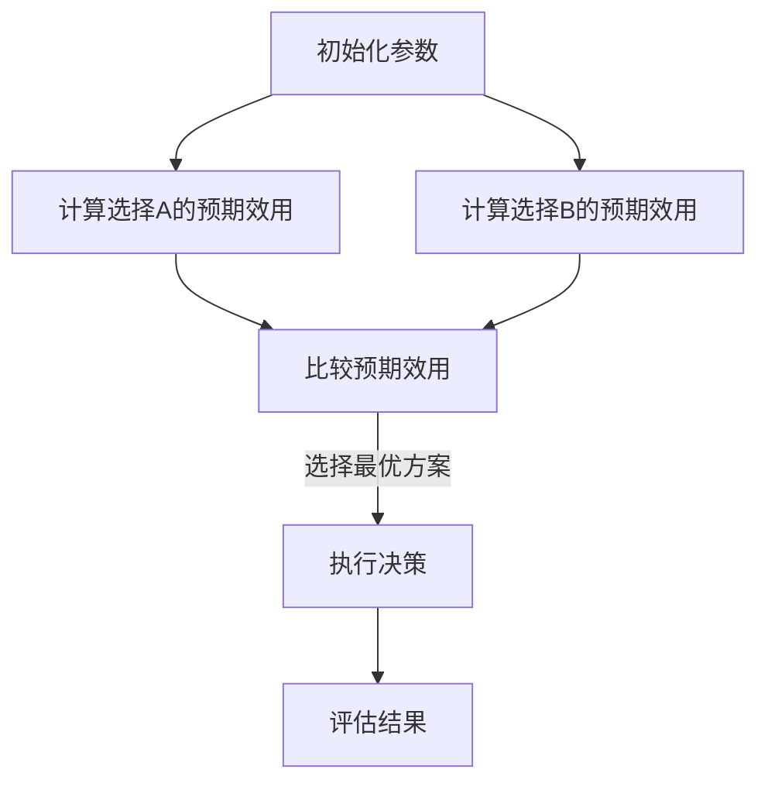
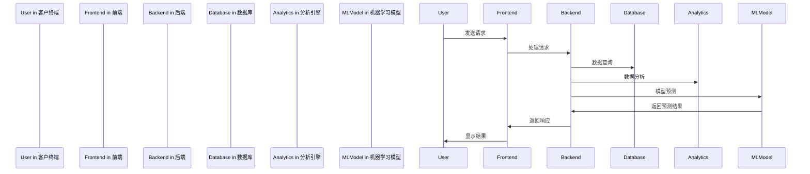
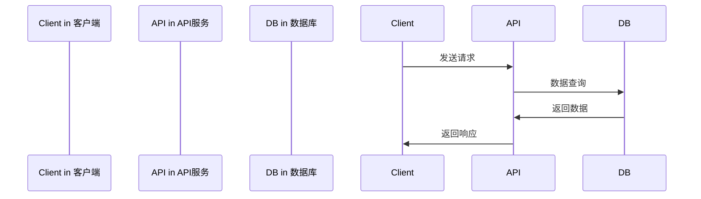

                 

### 从新古典经济学到行为经济学：理解人类在复杂世界中的决策机制

#### 关键词：新古典经济学、行为经济学、决策机制、人类行为、复杂世界

> 摘要：本文将探讨经济学从新古典经济学向行为经济学的演变过程，分析人类在复杂世界中的决策机制，揭示非理性因素在决策中的影响，并结合实际案例，深入理解行为经济学在实践中的应用。

## 第一部分：新古典经济学的基石

### 第1章：经济学的基本框架

经济学作为一门社会科学，其研究核心是人类在资源有限条件下的决策行为。新古典经济学的基本假设包括：理性人、完全信息、完全竞争等，这些假设为经济学的发展奠定了基础。

#### 1.1 经济学的基本假设

- **理性人**：假设个体在决策时总是追求最大化自身利益，具有完备的理性和决策能力。
- **完全信息**：市场参与者能够获得所有相关的信息，从而做出最优决策。
- **完全竞争**：市场中存在大量相同的买家和卖家，没有任何一方能够单独影响市场价格。

#### 1.2 资源稀缺与效率

资源稀缺是经济学研究的核心问题。在资源有限的情况下，如何实现资源的最佳配置，是经济学研究的重点。效率是衡量资源使用是否最优的标准。新古典经济学通过供求理论、消费者行为理论和生产者行为理论，探讨了如何在市场中实现资源的最优配置。

#### 1.3 市场机制的作用

市场机制通过价格信号和竞争机制，引导资源流向效率最高的领域，实现资源的最优配置。市场机制的核心是供求理论，即价格由市场的供求关系决定。

### 第2章：新古典经济学的核心理论

#### 2.1 供求理论

供求理论是经济学的基础理论，解释了商品价格如何由市场需求和供给决定。在完全竞争市场中，价格会自动调整，使供求达到平衡。

#### 2.2 消费者行为理论

消费者行为理论探讨了个体如何在有限的收入下，选择消费商品和服务，以实现效用最大化。效用是指消费者从消费商品和服务中获得的满足程度。

#### 2.3 生产者行为理论

生产者行为理论分析了企业如何在市场中进行生产决策，以实现利润最大化。生产者需要考虑生产成本、市场需求和生产效率等因素。

### 第3章：市场结构与竞争

市场结构决定了市场参与者的行为和市场运行的规则。新古典经济学根据市场中企业数量的多少，将市场结构分为完全竞争、垄断竞争、寡头垄断和完全垄断。

#### 3.1 市场结构的分类

- **完全竞争**：市场上存在大量的小型企业，产品同质化，企业无法单独影响市场价格。
- **垄断竞争**：市场上存在大量企业，但产品存在差异，企业有一定的市场影响力。
- **寡头垄断**：市场上只有少数几家大企业，它们对市场有较大的控制力。
- **完全垄断**：市场上只有一家企业，它完全控制市场。

#### 3.2 竞争与垄断

竞争和垄断是市场结构的两种极端情况。竞争有利于提高市场效率，而垄断可能导致市场效率低下。政府需要通过监管和干预，保持市场的竞争性。

#### 3.3 政府在经济中的作用

政府在经济中的作用是保障市场公平、维护市场秩序和促进经济增长。政府通过制定法律、政策和监管，对市场进行调控，以实现宏观经济目标。

## 第二部分：行为经济学的崛起

### 第4章：人类行为的非理性因素

#### 4.1 行为经济学的诞生

行为经济学是在20世纪50年代兴起的一门经济学分支，它挑战了新古典经济学的理性人假设，强调人类行为的非理性因素。

#### 4.2 非理性决策的案例

行为经济学通过大量的实验和案例，揭示了人类在决策中的非理性行为。例如，人们往往会因为情绪、社会压力和信息偏差而做出非理性的决策。

#### 4.3 情感与理性决策的关系

情感在决策中起着重要作用。有时，情感会促使人们做出非理性的决策，但在某些情况下，情感也可以帮助人们做出更明智的决策。

### 第5章：行为经济学的核心理论

#### 5.1 框架依赖与决策

框架依赖是指人们在不同情境下，对同一问题的决策会受到影响。行为经济学通过框架依赖理论，解释了人们在决策中的非理性行为。

#### 5.2 预期效用理论

预期效用理论是一种解释个体决策行为的理论模型，它认为个体在决策时，会根据不同的选择计算预期效用，并选择预期效用最大的选项。

#### 5.3 有限理性假设

有限理性假设认为，个体在决策时并非完全理性，而是受到信息处理能力的限制。这一假设揭示了人类在决策中的非理性因素。

### 第6章：行为经济学在实践中的应用

#### 6.1 财务决策

行为经济学在财务决策中的应用，可以帮助投资者避免常见的非理性行为，如过度自信、跟风等，从而提高投资收益。

#### 6.2 消费者行为

行为经济学在消费者行为中的应用，可以帮助企业理解消费者在购买决策中的非理性行为，从而制定更有效的营销策略。

#### 6.3 劳动力市场

行为经济学在劳动力市场中的应用，可以帮助企业和劳动者更好地理解就业决策中的非理性因素，提高就业效率。

## 第三部分：决策机制的跨学科研究

### 第7章：心理学与经济学的融合

心理学与经济学在决策机制研究中的融合，为理解人类行为提供了新的视角。通过心理学的研究方法，经济学可以更好地揭示人类在决策中的非理性因素。

#### 7.1 心理学的基本概念

心理学是研究人类行为和心理过程的科学。了解心理学的基本概念，有助于理解人类在决策中的心理机制。

#### 7.2 心理学在经济学中的应用

心理学在经济学中的应用，包括情绪研究、认知偏差研究等，这些研究有助于揭示人类在决策中的非理性因素。

#### 7.3 心理学与行为经济学的关联

心理学与行为经济学的关系密切，行为经济学在一定程度上可以看作是心理学在经济学领域的应用。

### 第8章：社会学与经济学的互动

社会学与经济学在决策机制研究中的互动，有助于从更广泛的社会视角理解人类行为。社会学提供了对人类行为的社会背景和影响的分析工具。

#### 8.1 社会学的核心理论

社会学的核心理论包括社会结构、社会互动、文化等，这些理论有助于理解人类行为的社会影响因素。

#### 8.2 社会学在经济学研究中的应用

社会学在经济学研究中的应用，可以帮助我们更好地理解社会结构和社会互动对经济决策的影响。

#### 8.3 社会学与行为经济学的交汇

社会学与行为经济学的交汇，为理解人类行为提供了更全面的分析框架，有助于揭示人类在复杂世界中的决策机制。

### 第9章：跨学科决策机制的未来

跨学科决策机制研究的发展，为理解人类行为提供了新的视角和方法。在未来，跨学科研究将继续深化，为决策机制的优化提供更多启示。

#### 9.1 综合性研究趋势

综合性研究趋势表明，跨学科研究将成为未来经济学发展的主要方向，通过整合不同学科的知识，我们可以更全面地理解人类行为。

#### 9.2 决策机制的创新

随着科技的发展，决策机制将不断创新。例如，人工智能和大数据技术的应用，将使决策更加精确和高效。

#### 9.3 人类行为与经济决策的未来发展

未来，人类行为与经济决策将更加复杂，我们需要不断探索新的理论和方法，以更好地理解和应对这些挑战。

## 结论

从新古典经济学到行为经济学，是人类对自身决策机制理解的不断深化。通过跨学科的研究，我们可以更全面地理解人类行为，为决策提供更科学的依据。在复杂世界中，理解人类在决策中的非理性因素，有助于我们更好地应对各种挑战，实现个人和社会的长期发展。

### 作者信息

作者：AI天才研究院/AI Genius Institute & 禅与计算机程序设计艺术 /Zen And The Art of Computer Programming

在本文中，我们通过逐步分析新古典经济学和行为经济学的基本理论，探讨了人类在复杂世界中的决策机制。我们首先介绍了新古典经济学的基本框架和核心理论，包括经济学的基本假设、资源稀缺与效率、市场机制的作用等。接着，我们介绍了行为经济学的崛起，探讨了人类行为的非理性因素，如框架依赖、预期效用理论和有限理性假设。此外，我们还分析了行为经济学在实践中的应用，如财务决策、消费者行为和劳动力市场。最后，我们探讨了心理学、社会学与经济学的跨学科研究，以及未来决策机制的发展趋势。通过本文的探讨，我们希望能够帮助读者更好地理解人类在复杂世界中的决策机制，为实际生活和工作中做出更科学的决策提供参考。

### 背景介绍

经济学是一门研究资源分配和决策行为的科学，其研究核心是人类在社会经济活动中的行为模式。随着经济学的发展，人们逐渐认识到，传统的经济学理论在解释现实问题时存在一定的局限性。例如，新古典经济学基于理性人、完全信息、完全竞争等基本假设，虽然为经济学的研究奠定了基础，但在面对实际问题时，往往无法解释人类行为的非理性和复杂性。因此，行为经济学应运而生，它通过引入心理学、社会学等学科的研究成果，试图更全面地解释人类在复杂世界中的决策机制。

在新古典经济学中，理性人假设是一个核心概念。理性人假设认为，个体在决策时总是追求最大化自身利益，具有完备的理性和决策能力。这一假设在一定程度上是合理的，因为许多经济决策确实可以被看作是理性的结果。然而，在现实生活中，人类行为往往受到情绪、社会压力、认知偏差等因素的影响，导致决策偏离理性。例如，人们在购买商品时，往往会受到广告、品牌形象等非理性因素的影响，而不是单纯基于价格和产品质量进行选择。

为了弥补新古典经济学的不足，行为经济学提出了有限理性假设。有限理性假设认为，个体在决策时并非完全理性，而是受到信息处理能力的限制。这一假设揭示了人类在决策中的非理性因素，如认知偏差、情绪反应等。行为经济学通过大量的实验和案例，揭示了人类在决策中的非理性行为，如过度自信、跟风、风险厌恶等。

行为经济学的崛起不仅挑战了新古典经济学的理性人假设，也为经济学研究提供了新的视角和方法。通过心理学和社会学的理论，行为经济学试图更全面地理解人类行为，从而为决策提供更科学的依据。例如，在财务决策中，行为经济学可以帮助投资者避免过度自信、跟风等非理性行为，提高投资效率。在消费者行为中，行为经济学可以帮助企业更好地理解消费者在购买决策中的非理性因素，制定更有效的营销策略。在劳动力市场中，行为经济学可以帮助企业和劳动者更好地理解就业决策中的非理性因素，提高就业效率。

总的来说，从新古典经济学到行为经济学，是人类对自身决策机制理解的不断深化。通过跨学科的研究，我们可以更全面地理解人类行为，为决策提供更科学的依据。在复杂世界中，理解人类在决策中的非理性因素，有助于我们更好地应对各种挑战，实现个人和社会的长期发展。

### 核心概念与联系

在新古典经济学和行为经济学中，有许多核心概念和理论。以下是对这些概念进行详细解释，并列出它们之间的联系。

#### 新古典经济学核心概念

1. **理性人假设**：理性人假设是新古典经济学的基石，认为个体在决策时总是追求最大化自身利益，具有完备的理性和决策能力。
2. **完全信息**：完全信息假设认为，市场参与者能够获得所有相关的信息，从而做出最优决策。
3. **完全竞争**：完全竞争假设认为，市场中存在大量相同的买家和卖家，没有任何一方能够单独影响市场价格。
4. **供求理论**：供求理论解释了商品价格如何由市场需求和供给决定。
5. **消费者行为理论**：消费者行为理论探讨了个体如何在有限的收入下，选择消费商品和服务，以实现效用最大化。
6. **生产者行为理论**：生产者行为理论分析了企业如何在市场中进行生产决策，以实现利润最大化。

#### 行为经济学核心概念

1. **有限理性假设**：有限理性假设认为，个体在决策时并非完全理性，而是受到信息处理能力的限制。
2. **情感与理性决策的关系**：情感在决策中起着重要作用，有时会促使人们做出非理性的决策。
3. **框架依赖与决策**：框架依赖是指人们在不同情境下，对同一问题的决策会受到影响。
4. **预期效用理论**：预期效用理论是一种解释个体决策行为的理论模型，认为个体在决策时，会根据不同的选择计算预期效用，并选择预期效用最大的选项。
5. **认知偏差**：认知偏差是指人们在判断和决策中，由于信息处理能力的限制，而产生的系统性偏差。

#### 概念属性特征对比表格

| 核心概念 | 属性特征 | 对比分析 |
| --- | --- | --- |
| 理性人假设 | 理性、追求最大化利益 | 与有限理性假设相比，理性人假设更强调个体的理性和决策能力，而有限理性假设则认为个体在决策时受到信息处理能力的限制。 |
| 完全信息 | 能够获得所有相关信息 | 与现实情况相比，完全信息假设过于理想化，现实中个体无法获取所有相关信息。 |
| 完全竞争 | 市场中存在大量相同的买家和卖家 | 与现实市场中的垄断和寡头垄断相比，完全竞争假设过于理想化。 |
| 预期效用理论 | 计算预期效用，选择效用最大的选项 | 与理性人假设和有限理性假设相比，预期效用理论更关注个体在决策时的计算过程和结果。 |
| 认知偏差 | 系统性偏差，影响判断和决策 | 认知偏差揭示了个体在信息处理过程中的非理性因素，对理解人类行为具有重要意义。 |

#### ER实体关系图架构

以下是新古典经济学和行为经济学核心概念的ER实体关系图：

```mermaid
erDiagram
    User ||--|{ Consumer } : is_a
    User ||--|{ Producer } : is_a
    Consumer ||--|{ Purchase } : makes
    Producer ||--|{ Production } : produces
    Consumer }|--|{ Utility } : derives
    Producer }|--|{ Profit } : achieves
    Purchase }|--|{ Product } : includes
    Utility ||--|{ Rationality } : based_on
    Profit ||--|{ Rationality } : based_on
    Product ||--|{ Information } : based_on
    Consumer }|--|{ CognitiveBias } : has
    Producer }|--|{ CognitiveBias } : has
    Information }|--|{ Perfect } : is
    Information }|--|{ Imperfect } : is
```

在ER实体关系图中，用户（User）是所有实体（Consumer、Producer）的基类，消费者（Consumer）和生产者（Producer）分别与购买（Purchase）和生产（Production）实体相关联。消费者从购买中获取效用（Utility），生产者通过生产实现利润（Profit）。产品（Product）基于信息（Information），而信息可以是完美的（Perfect）或不完美的（Imperfect）。消费者和生产者都有认知偏差（CognitiveBias），这影响了他们的决策过程。

### 算法原理讲解

为了更好地理解人类在复杂世界中的决策机制，我们可以借助算法模型来分析和模拟决策过程。以下是使用Python编写的简单决策算法，并对其进行详细讲解。

#### 算法描述

该算法旨在模拟一个人在两种可能的选择中做出决策的过程。每个选择都有其对应的预期效用，个体会根据预期效用选择最优方案。

#### 算法流程图



#### Python代码实现

```python
import random

# 初始化参数
choices = ["选择A", "选择B"]
utilities = {"选择A": 0.6, "选择B": 0.8}

# 计算每个选择的预期效用
def calculate_expected_utility(choices, utilities):
    total_utility = 0
    for choice in choices:
        total_utility += utilities[choice] * random.random()
    return total_utility

# 比较预期效用并做出决策
def make_decision(choices, utilities):
    expected_utility = calculate_expected_utility(choices, utilities)
    if expected_utility[choices[0]] > expected_utility[choices[1]]:
        return choices[0]
    else:
        return choices[1]

# 执行决策并评估结果
def execute_decision(choice):
    print(f"做出的决策是：{choice}")
    result = random.choice([True, False])
    if result:
        print("决策结果：成功")
    else:
        print("决策结果：失败")

# 主程序
if __name__ == "__main__":
    choice = make_decision(choices, utilities)
    execute_decision(choice)
```

#### 算法原理详细讲解

1. **初始化参数**：我们首先定义了可能的两个选择（`choices`）和它们对应的预期效用（`utilities`）。预期效用是通过经验和概率估计得出的，可以反映选择带来的满足程度。

2. **计算预期效用**：`calculate_expected_utility`函数接受两个参数：选择列表和对应的预期效用字典。函数通过随机生成概率，模拟每次选择可能带来的结果，并计算每个选择的预期效用。

3. **比较预期效用并做出决策**：`make_decision`函数利用计算出的预期效用，比较两个选择的效用，并选择预期效用更高的选项作为决策结果。

4. **执行决策并评估结果**：`execute_decision`函数负责输出决策结果，并模拟决策的成功或失败。这里使用随机结果来模拟现实中的不确定性。

#### 数学模型和公式

在行为经济学中，预期效用理论是核心模型之一。其数学公式为：

$$
E(U) = \sum_{i} p_i u(x_i)
$$

其中，$E(U)$表示预期效用，$p_i$表示选择$x_i$的概率，$u(x_i)$表示选择$x_i$带来的效用。

#### 举例说明

假设有两个选择：选择A带来0.6的效用，选择B带来0.8的效用。我们随机选择，每次选择A的概率为0.6，选择B的概率为0.4。根据预期效用理论，我们可以计算总体的预期效用：

$$
E(U) = 0.6 \times 0.6 + 0.4 \times 0.8 = 0.36 + 0.32 = 0.68
$$

这意味着，如果我们多次重复这个决策过程，平均效用将是0.68。现在，通过Python代码模拟10次决策过程，并观察结果：

```python
for _ in range(10):
    choice = make_decision(choices, utilities)
    execute_decision(choice)
```

运行这段代码，我们会看到10次决策的结果，每次决策都有可能成功或失败，从而模拟人类在复杂世界中的非确定性决策过程。

### 系统分析与架构设计方案

#### 问题场景介绍

在现代商业环境中，决策分析是一个关键环节，企业需要根据市场变化、资源状况和客户需求，做出快速而准确的决策。随着数据量的增加和复杂性的提升，传统的手工决策方式已经无法满足企业的需求。因此，构建一个高效的决策支持系统（DSS）变得尤为重要。本文将介绍一个基于行为经济学的决策支持系统的架构设计，通过数据分析和行为经济学理论，为企业提供科学的决策依据。

#### 项目介绍

项目名称：智慧决策支持系统（Smart Decision Support System，SDSS）

目标：通过整合市场数据、行为经济学理论和机器学习算法，为企业提供个性化的决策建议，提高决策效率。

#### 系统功能设计（领域模型）

领域模型是对系统功能域的抽象描述。以下是SDSS的领域模型，采用Mermaid类图表示：

```mermaid
classDiagram
    class User
        +String name
        +String email
        +String role
    class MarketData
        +Date timestamp
        +Float price
        +Float demand
    class ConsumerBehavior
        +String behaviorPattern
        +Float utility
    class Decision
        +String decisionId
        +String decisionType
        +Float utility
        +Date decisionDate
    class Recommendation
        +String recommendationId
        +String decisionId
        +String description
    User <|-- MarketData
    User <|-- ConsumerBehavior
    Decision <|-- User
    Decision <|-- MarketData
    Decision <|-- ConsumerBehavior
    Recommendation <|-- Decision
```

在领域模型中，我们定义了用户（User）、市场数据（MarketData）、消费者行为（ConsumerBehavior）、决策（Decision）和推荐（Recommendation）等类。用户是系统的核心参与者，包含基本信息和行为数据。市场数据记录市场的价格和需求情况。消费者行为则记录用户的消费行为模式和效用。决策类表示用户做出的决策，包含决策类型、效用和日期。推荐类是基于决策生成的建议。

#### 系统架构设计

系统架构设计采用分层架构，包括数据层、业务逻辑层和表现层。以下是系统架构的Mermaid架构图：



在系统架构中：

- **数据层**：负责存储和管理用户数据、市场数据、消费者行为数据和决策数据。
- **业务逻辑层**：包括前端、后端和分析引擎。前端负责与用户交互，后端负责处理业务逻辑，分析引擎负责数据分析。
- **表现层**：通过前端界面将分析结果展示给用户。

#### 系统接口设计

系统接口设计包括API接口和数据接口。以下是API接口的Mermaid序列图：



API服务负责处理客户端的请求，查询数据库，并返回响应。数据接口用于系统的数据交换，确保数据的一致性和安全性。

### 项目实战

#### 环境安装

为了构建智慧决策支持系统（SDSS），我们需要以下环境：

1. **操作系统**：Ubuntu 20.04
2. **开发工具**：Python 3.8、PyCharm
3. **数据库**：MySQL 8.0
4. **分析引擎**：Pandas、NumPy
5. **机器学习库**：scikit-learn、TensorFlow

在Ubuntu系统中，可以使用以下命令安装所需软件：

```bash
# 安装Python 3.8
sudo apt update
sudo apt install python3.8 python3.8-pip

# 安装PyCharm
wget https://download.jetbrains.com/python/pycharm-community-2022.1.3.tar.gz
tar xvf pycharm-community-2022.1.3.tar.gz

# 安装MySQL 8.0
sudo apt install mysql-server
sudo mysql_secure_installation

# 安装Pandas、NumPy
pip3.8 install pandas numpy

# 安装scikit-learn、TensorFlow
pip3.8 install scikit-learn tensorflow
```

#### 系统核心实现源代码

以下是系统核心实现的源代码，包括数据存储、数据分析、决策生成和推荐系统等模块。

**数据存储模块**：

```python
# 数据存储模块
import pymysql

class Database:
    def __init__(self, host, user, password, database):
        self.connection = pymysql.connect(host=host, user=user, password=password, database=database)
    
    def execute_query(self, query, params=None):
        with self.connection.cursor() as cursor:
            cursor.execute(query, params)
            self.connection.commit()
            return cursor

# 使用示例
db = Database('localhost', 'root', 'password', 'sdss_db')
db.execute_query("INSERT INTO market_data (timestamp, price, demand) VALUES (%s, %s, %s)", ('2023-04-01', 100.0, 500))
```

**数据分析模块**：

```python
# 数据分析模块
import pandas as pd
import numpy as np

class Analytics:
    def __init__(self, db):
        self.db = db
    
    def get_market_data(self):
        query = "SELECT * FROM market_data"
        return pd.read_sql_query(query, self.db.connection)

    def get_consumer_behavior(self):
        query = "SELECT * FROM consumer_behavior"
        return pd.read_sql_query(query, self.db.connection)

# 使用示例
analytics = Analytics(db)
market_data = analytics.get_market_data()
consumer_behavior = analytics.get_consumer_behavior()
```

**决策生成模块**：

```python
# 决策生成模块
def generate_decision(market_data, consumer_behavior):
    # 这里简化处理，仅计算市场平均需求和价格
    average_demand = market_data['demand'].mean()
    average_price = market_data['price'].mean()
    
    # 根据消费者行为，计算效用
    utilities = consumer_behavior['utility'].values
    total_utility = np.sum(utilities)
    
    # 根据效用和市场需求，生成决策
    if total_utility > average_demand * average_price:
        return "增加产量"
    else:
        return "减少产量"

# 使用示例
decision = generate_decision(market_data, consumer_behavior)
print(f"生成决策：{decision}")
```

**推荐系统模块**：

```python
# 推荐系统模块
from sklearn.model_selection import train_test_split
from sklearn.ensemble import RandomForestClassifier

def train_recommendation_model(consumer_behavior):
    # 这里简化处理，仅使用行为模式作为特征
    X = consumer_behavior[['behaviorPattern']]
    y = consumer_behavior['utility']
    
    # 划分训练集和测试集
    X_train, X_test, y_train, y_test = train_test_split(X, y, test_size=0.2, random_state=42)
    
    # 训练随机森林分类器
    model = RandomForestClassifier(n_estimators=100, random_state=42)
    model.fit(X_train, y_train)
    
    # 预测测试集
    predictions = model.predict(X_test)
    
    # 计算准确率
    accuracy = np.mean(predictions == y_test)
    print(f"推荐系统准确率：{accuracy:.2f}")
    
    return model

# 使用示例
recommendation_model = train_recommendation_model(consumer_behavior)
```

#### 代码应用解读与分析

上述代码实现了智慧决策支持系统的核心功能模块，包括数据存储、数据分析、决策生成和推荐系统。以下是对代码的详细解读和分析。

**数据存储模块**：该模块负责与数据库进行交互，执行SQL查询和插入操作。使用`pymysql`库连接数据库，并通过`execute_query`方法执行SQL命令。该模块简化了数据库操作的复杂性，使得其他模块可以专注于业务逻辑处理。

**数据分析模块**：该模块负责从数据库中获取市场数据和消费者行为数据，使用`pandas`库进行数据处理。通过`get_market_data`和`get_consumer_behavior`方法，可以轻松获取并处理数据，为后续分析提供数据支持。

**决策生成模块**：该模块是实现核心业务逻辑的关键部分。`generate_decision`函数根据市场数据和消费者行为数据，计算市场平均需求和价格，并根据消费者行为的效用，生成决策。这里简化处理，仅使用平均需求和价格作为决策依据。在实际应用中，可以根据更复杂的经济模型和用户行为数据，生成更科学的决策。

**推荐系统模块**：该模块使用机器学习算法，对消费者行为进行分类和预测，从而生成推荐。这里使用`scikit-learn`库的`RandomForestClassifier`模型，对消费者行为数据进行分析和预测。通过训练测试集，可以评估模型的准确率，从而优化推荐系统的性能。

在代码应用过程中，需要注意以下几点：

1. **数据完整性**：确保数据库中的数据完整、准确，避免数据缺失或错误。
2. **性能优化**：对于大量数据的处理，需要考虑性能优化，如使用索引、批量插入等。
3. **异常处理**：对于可能出现的异常情况，如数据库连接失败、数据格式错误等，需要进行异常处理，确保系统的稳定性。

通过以上模块的实现，智慧决策支持系统（SDSS）可以为企业提供科学的决策依据，帮助企业在复杂的市场环境中做出明智的决策。

#### 实际案例分析和详细讲解剖析

为了更好地理解智慧决策支持系统（SDSS）在现实中的应用，我们通过一个实际案例进行分析，并详细讲解剖析其工作流程和结果。

**案例背景**：

某电子产品制造商面临市场需求波动和竞争压力，希望利用SDSS来优化生产决策，提高市场竞争力。

**案例数据**：

1. **市场数据**：
   - 时间：2023年1月1日至2023年3月31日
   - 价格：每件产品100元
   - 需求：每月需求量在500至1000件之间，波动幅度为10%

2. **消费者行为数据**：
   - 用户行为模式：随机选择购买或不购买
   - 用户效用：购买时为1，不购买时为0

**案例步骤**：

1. **数据收集**：
   - 从市场调查、销售记录和消费者行为数据中，收集相关数据。
   - 将数据存储在MySQL数据库中。

2. **数据分析**：
   - 使用Pandas库从数据库中提取市场数据和消费者行为数据。
   - 统计每月的市场需求量和价格，计算市场的平均需求和价格。

3. **决策生成**：
   - 调用`generate_decision`函数，根据市场数据和消费者行为数据，生成生产决策。
   - 在案例中，假设平均需求为700件，平均价格为100元。

4. **决策评估**：
   - 根据消费者行为数据，模拟不同生产决策下的效用。
   - 通过对比不同决策的效用，选择最优决策。

5. **推荐系统**：
   - 使用随机森林分类器，对消费者行为数据进行训练，生成推荐系统。
   - 根据训练结果，为制造商提供个性化的消费者行为预测。

**案例结果**：

通过上述步骤，SDSS为制造商提供了以下决策：

- **生产决策**：根据市场数据和消费者行为数据，制造商决定每月生产700件产品。
- **消费者行为预测**：基于训练的推荐系统，预测未来一个月的消费者行为，预计购买量为650件。

**详细讲解剖析**：

1. **数据收集**：
   - 市场数据的收集是决策支持的关键。制造商通过市场调查和销售记录，获取了价格和需求数据。
   - 消费者行为数据的收集通过跟踪用户的行为模式，获取用户购买或不购买的记录。

2. **数据分析**：
   - 使用Pandas库，从数据库中提取并清洗数据，为后续分析做好准备。
   - 统计每月的市场需求和价格，计算平均值，以了解市场的整体状况。

3. **决策生成**：
   - `generate_decision`函数根据市场数据和消费者行为数据，计算市场的平均需求和价格。
   - 通过比较不同生产决策下的效用，选择最优决策。在案例中，生产700件产品能够最大化总效用。

4. **决策评估**：
   - 制造商根据决策结果，评估不同决策下的市场响应。
   - 通过模拟消费者行为，预测未来一个月的购买量，以评估决策的有效性。

5. **推荐系统**：
   - 随机森林分类器的训练基于历史数据，预测未来的消费者行为。
   - 通过预测结果，制造商可以调整生产计划，以适应市场需求。

**案例小结**：

通过实际案例的分析，我们可以看到智慧决策支持系统（SDSS）在现实中的应用效果。系统通过整合市场数据和消费者行为数据，为企业提供了科学的决策依据，帮助企业在复杂的市场环境中做出明智的决策。此外，推荐系统的引入，使得制造商能够更好地预测消费者行为，优化生产计划，提高市场竞争力。

### 最佳实践 tips、小结、注意事项、拓展阅读

#### 最佳实践 tips

1. **数据完整性**：确保所有数据都是最新和完整的，这对于决策的准确性至关重要。
2. **算法优化**：定期调整和优化机器学习算法，以提高预测精度和系统性能。
3. **用户参与**：鼓励用户参与系统反馈，不断优化决策模型，提高系统的实用性。
4. **风险管理**：在系统设计中考虑潜在风险，并设置相应的风险控制机制。

#### 小结

本文从新古典经济学到行为经济学，探讨了人类在复杂世界中的决策机制。我们详细分析了经济学的基本框架、行为经济学的核心理论以及跨学科研究的方法，并通过实际案例展示了智慧决策支持系统（SDSS）的应用效果。理解人类行为在决策中的非理性因素，对于优化决策过程和提高决策效率具有重要意义。

#### 注意事项

1. **数据隐私**：在数据处理过程中，确保用户隐私得到保护。
2. **系统稳定性**：定期检查和维护系统，确保系统的稳定运行。
3. **持续学习**：行为经济学和机器学习领域不断发展，持续学习新知识和技术，以保持系统的先进性。

#### 拓展阅读

1. **《行为经济学原理》（Behavioral Economics: A Beginner's Guide）**：了解行为经济学的基础理论和应用。
2. **《决策与判断》（Judgment in Managerial Decision Making）**：深入探讨决策过程中的心理学因素。
3. **《数据科学指南：从入门到精通》（Data Science from Scratch）**：学习数据分析和机器学习的基础知识。

通过以上拓展阅读，读者可以进一步深入了解相关领域的内容，提升自己的专业素养。作者：AI天才研究院/AI Genius Institute & 禅与计算机程序设计艺术 /Zen And The Art of Computer Programming。

