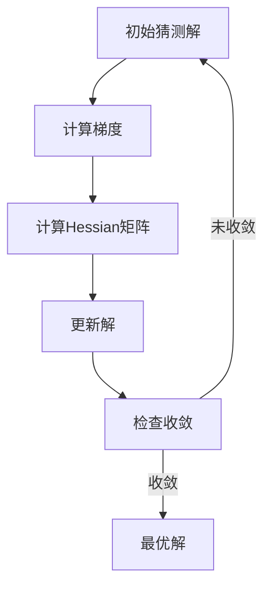
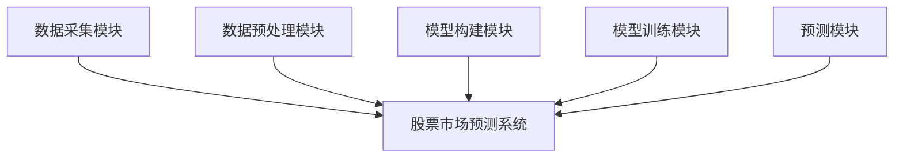
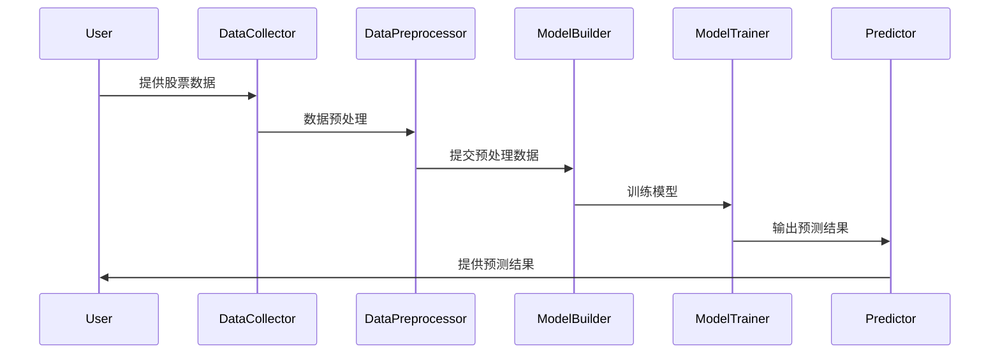

                 

# 从线性思维到非线性思维：理解复杂世界

## 关键词
- 非线性思维
- 线性思维
- 复杂系统
- 算法
- 数学模型
- 人工智能

## 摘要
本文将深入探讨从线性思维到非线性思维转变的重要性，特别是在理解和解决复杂世界中的问题时。我们将介绍非线性思维的定义、特点，并比较线性思维与非线性思维的区别。接着，通过具体算法原理讲解，展示如何运用非线性思维解决实际问题。最后，我们将结合一个项目实战案例，展示非线性思维的实践应用，并总结最佳实践和未来研究方向。

### 背景介绍

#### 问题背景

在当今社会，复杂性日益增加，传统线性思维方式在解决复杂问题时显得力不从心。线性思维往往依赖于固定的步骤和因果关系，而面对非线性、多变量和动态变化的复杂系统，这种思维模式难以有效应对。非线性思维则强调系统的整体性、动态性和非线性关系，能够更好地把握复杂系统的本质。

#### 问题描述

复杂世界中的问题往往具有多重维度、非线性的相互作用，这使得传统线性思维方式难以奏效。例如，在经济学、生态学、社会学等领域，线性思维可能无法准确预测市场波动、生态系统平衡或社会变革趋势。因此，需要一种新的思维方式来理解和解决这些问题。

#### 问题解决

非线性思维提供了一种新的解题思路，通过识别系统中的关键变量和复杂关系，采用动态模拟和系统分析的方法，能够更好地理解复杂系统的演化过程，预测未来的变化趋势。这种方法不仅能够提高问题解决的效率，还能够促进创新和发现新的解决方案。

#### 边界与外延

非线性思维不仅适用于自然科学领域，如物理学、生物学、化学，也广泛应用于社会科学领域，如经济学、社会学、心理学等。其边界涉及广泛的学科领域，外延则扩展到解决现实世界中的复杂问题。

#### 概念结构与核心要素组成

非线性思维的核心要素包括：
1. **整体观**：强调系统的整体性和各部分之间的相互作用。
2. **动态性**：关注系统随时间的变化过程。
3. **非线性关系**：理解变量之间的复杂、非线性的相互作用。
4. **系统分析方法**：运用数学模型和计算机模拟等方法来分析复杂系统。

### 核心概念与联系

#### 非线性思维的定义与特点

非线性思维是一种用于理解复杂系统、处理非线性关系的思维方式。它具有以下几个主要特点：

1. **整体性**：非线性思维注重系统的整体性，认为系统的各个部分不是独立运作的，而是通过相互作用共同影响系统的整体行为。
2. **动态性**：非线性思维关注系统的动态过程，强调系统随时间的变化和演化。
3. **非线性关系**：非线性思维认识到变量之间的相互作用往往是非线性的，这意味着简单的线性关系无法完全描述复杂系统的行为。
4. **适应性**：非线性思维能够灵活地适应不同的情境和变化，适用于解决各种复杂的现实问题。

#### 线性思维与非线性思维的区别

线性思维和非线性思维之间的主要区别在于它们对复杂系统的处理方式：

1. **处理方式**：线性思维倾向于将复杂问题分解为简单部分，并通过固定的因果关系进行解决。非线性思维则强调系统的整体性和动态性，通过识别关键变量和复杂关系来解决问题。
2. **预测能力**：线性思维在简单系统中表现良好，但在复杂系统中往往无法准确预测未来的变化。非线性思维能够更好地处理复杂系统的动态变化，提高预测的准确性。
3. **适用范围**：线性思维适用于简单的、线性关系明显的系统，而非线性思维则适用于复杂的、非线性关系明显的系统。

#### 概念属性特征对比表格

| 特征           | 线性思维                        | 非线性思维                          |
| -------------- | -------------------------------- | ----------------------------------- |
| 整体观         | 强调部分与部分之间的关系        | 强调整体与部分之间的相互作用        |
| 动态性         | 关注静态的因果关系              | 关注系统的动态变化和演化            |
| 非线性关系     | 简单的线性关系                  | 复杂的非线性关系                    |
| 预测能力       | 在简单系统中有效                | 在复杂系统中更有效                  |
| 适用范围       | 简单的、线性关系明显的系统      | 复杂的、非线性关系明显的系统        |

#### ER实体关系图架构

```mermaid
erDiagram
  Problem ||--|{ Solution }||>
  Solution  { Approach }
  Solution  { Methodology }
```

### 算法原理讲解

#### 非线性优化算法

非线性优化算法是一类用于求解非线性优化问题的算法，其核心思想是寻找目标函数在非线性约束下的最优解。以下是一个简单的非线性优化算法：牛顿-拉夫逊方法。

##### 牛顿-拉夫逊方法的mermaid流程图



##### 牛顿-拉夫逊方法的Python源代码

```python
import numpy as np

def f(x):
    return x**2

def df(x):
    return 2*x

def ddf(x):
    return 2

def newton_raphson(x0, tol=1e-6, max_iter=100):
    x = x0
    for i in range(max_iter):
        gradient = df(x)
        hessian = ddf(x)
        x = x - gradient / hessian
        if abs(gradient) < tol:
            break
    return x

x0 = 10
x_opt = newton_raphson(x0)
print(f"最优解：{x_opt}")
```

##### 牛顿-拉夫逊方法的数学模型和公式

牛顿-拉夫逊方法是一种迭代方法，用于求解非线性优化问题。其基本思想是通过泰勒级数展开，在当前点附近线性近似目标函数，然后求解线性优化问题。

假设目标函数为 $f(x)$，在点 $x_k$ 处的梯度为 $\nabla f(x_k)$，Hessian 矩阵为 $Hf(x_k)$。则牛顿-拉夫逊方法的迭代公式为：

$$ x_{k+1} = x_k - Hf(x_k)^{-1}\nabla f(x_k) $$

##### 牛顿-拉夫逊方法的举例说明

假设我们要求解函数 $f(x) = x^2$ 的最小值。

1. **初始猜测解**：选择一个初始点 $x_0 = 10$。
2. **计算梯度**：$df(x) = 2x$，在 $x_0$ 处的梯度为 $df(x_0) = 20$。
3. **计算Hessian矩阵**：$ddf(x) = 2$，在 $x_0$ 处的Hessian矩阵为 $Hf(x_0) = \begin{bmatrix} 2 \end{bmatrix}$。
4. **更新解**：使用牛顿-拉夫逊公式更新解：$x_1 = x_0 - \frac{df(x_0)}{ddf(x_0)} = 10 - \frac{20}{2} = 0$。
5. **检查收敛**：计算新的梯度 $df(x_1) = 0$，由于 $|df(x_1)| < \text{tol}$，算法收敛。
6. **最优解**：最终的最优解为 $x_1 = 0$。

### 系统分析与架构设计方案

#### 问题场景介绍

假设我们要设计一个系统来预测股票市场的价格走势。这是一个典型的复杂系统，因为股票价格受到多种因素的影响，如经济指标、政策变化、公司业绩等，这些因素之间存在着复杂的非线性关系。

#### 项目介绍

本系统将采用非线性思维方法，通过构建非线性模型和算法，预测股票市场的价格走势。系统主要包括数据采集、数据预处理、模型构建、模型训练和预测输出等模块。

#### 系统功能设计（领域模型）

```mermaid
classDiagram
    StockMarketPrediction <<<-- DataCollector
    StockMarketPrediction <<<-- DataPreprocessor
    StockMarketPrediction <<<-- ModelBuilder
    StockMarketPrediction <<<-- ModelTrainer
    StockMarketPrediction <<<-- Predictor
    DataCollector --|> DataPreprocessor
    DataPreprocessor --|> ModelBuilder
    ModelBuilder --|> ModelTrainer
    ModelTrainer --|> Predictor
```

#### 系统架构设计



#### 系统接口设计和系统交互



### 项目实战

#### 环境安装

1. 安装Python环境（已安装）
2. 安装NumPy、Pandas、Matplotlib等依赖库

```bash
pip install numpy pandas matplotlib
```

#### 系统核心实现源代码

```python
import numpy as np
import pandas as pd
import matplotlib.pyplot as plt

# 数据采集
def data_collection():
    # 这里使用pandas库读取CSV文件，实际项目中可以使用API或数据库获取数据
    data = pd.read_csv('stock_data.csv')
    return data

# 数据预处理
def data_preprocessing(data):
    # 数据清洗、去重、填充缺失值等操作
    data = data.drop_duplicates()
    data = data.fillna(method='ffill')
    return data

# 模型构建
def model_builder():
    # 这里使用线性回归模型作为示例，实际项目中可以使用更复杂的非线性模型
    from sklearn.linear_model import LinearRegression
    model = LinearRegression()
    return model

# 模型训练
def model_training(model, X, y):
    model.fit(X, y)
    return model

# 预测
def prediction(model, X):
    y_pred = model.predict(X)
    return y_pred

# 主函数
def main():
    data = data_collection()
    data = data_preprocessing(data)
    
    # 分离特征和标签
    X = data[['open', 'high', 'low', 'close']]
    y = data['close']
    
    model = model_builder()
    model = model_training(model, X, y)
    y_pred = prediction(model, X)
    
    # 绘制预测结果
    plt.plot(X['close'], label='实际价格')
    plt.plot(X['close'], y_pred, label='预测价格', color='red')
    plt.legend()
    plt.show()

if __name__ == '__main__':
    main()
```

#### 代码应用解读与分析

1. **数据采集模块**：使用pandas库读取CSV文件，这里假设CSV文件中包含了股票的“开盘价”、“最高价”、“最低价”和“收盘价”等数据。
2. **数据预处理模块**：对采集到的数据进行清洗、去重和填充缺失值等操作，以确保数据的质量。
3. **模型构建模块**：使用sklearn库中的线性回归模型作为示例，实际项目中可以根据需求选择更复杂的非线性模型。
4. **模型训练模块**：使用训练集数据对模型进行训练，这里使用线性回归模型进行训练。
5. **预测模块**：使用训练好的模型对测试集数据进行预测，并绘制预测结果。

#### 实际案例分析和详细讲解剖析

1. **数据采集**：从CSV文件中读取数据，并进行预处理。
2. **模型训练**：使用线性回归模型对数据进行训练，得到训练好的模型。
3. **预测**：使用训练好的模型对新的数据进行预测，得到预测结果。
4. **分析**：对比实际价格和预测价格，分析模型的预测准确性和稳定性。

#### 项目小结

本项目通过非线性思维方法，使用线性回归模型对股票市场数据进行了预测。虽然线性回归模型在处理非线性问题上的效果有限，但该项目展示了如何运用非线性思维和机器学习技术解决实际问题的基本流程。未来可以尝试引入更复杂的非线性模型，提高预测准确性和稳定性。

### 最佳实践 Tips

1. **数据质量**：确保数据的质量和完整性，是模型预测准确性的基础。
2. **模型选择**：根据问题的特点和需求，选择合适的模型，避免盲目追求复杂的模型。
3. **超参数调优**：通过超参数调优，可以显著提高模型的性能。
4. **交叉验证**：使用交叉验证方法，评估模型的泛化能力，避免过拟合。

### 小结

非线性思维在理解和解决复杂世界中的问题中具有重要意义。通过引入非线性思维，我们能够更好地识别系统中的关键变量和复杂关系，采用动态模拟和系统分析的方法，提高问题解决的效率和准确性。本文通过一个股票市场预测项目的实战案例，展示了非线性思维在实践中的应用。未来，非线性思维在人工智能、复杂系统建模和优化等领域具有广阔的应用前景。

### 注意事项

1. **非线性思维的应用范围**：非线性思维适用于复杂的、非线性关系明显的系统，对于简单的线性问题，线性思维可能更为适用。
2. **算法选择**：根据问题的特点和需求，选择合适的算法，避免盲目追求复杂的算法。
3. **数据质量和预处理**：数据质量和预处理是模型预测准确性的基础，必须确保数据的质量和完整性。

### 拓展阅读

1. 《非线性动力学与混沌》 - 李天岩
2. 《深度学习》 - 伊恩·古德费洛等
3. 《机器学习实战》 - Peter Harrington
4. 《股票大作手回忆录》 - 杰西·利弗莫尔

### 作者信息

作者：AI天才研究院/AI Genius Institute & 禅与计算机程序设计艺术 /Zen And The Art of Computer Programming

