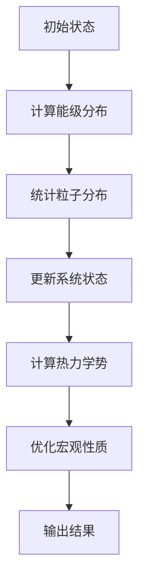
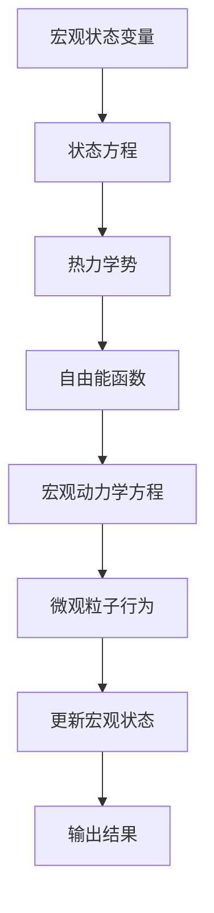
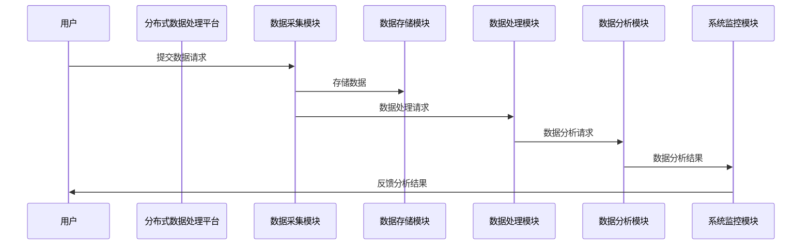
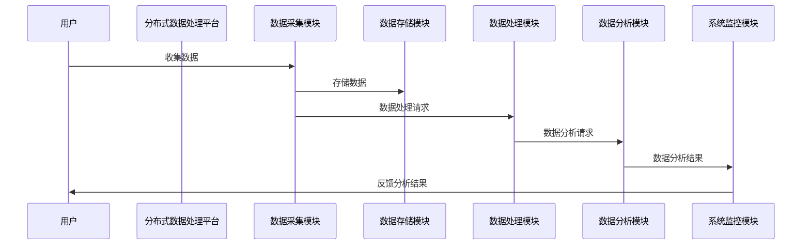

                 

### 从经典热力学到非平衡态热力学的演进

热力学，作为物理学的一个重要分支，是研究能量转换和物质相互作用的科学。其发展历程可以追溯到18世纪末和19世纪初，当时科学家们通过实验和理论分析开始对热现象进行深入研究。经典热力学，作为热力学的发展初期阶段，主要研究封闭系统的热力学性质，其核心理论包括热力学第一定律、第二定律和熵增定理等。经典热力学的建立为理解宏观热现象提供了坚实的基础，但它对开放系统的描述却显得不足。

随着科学技术的进步，人们对复杂系统的需求日益增长，特别是对于开放系统的研究。开放系统是指与外界环境有物质和能量交换的系统，这种系统在自然界和工程领域中广泛存在。例如，生态系统的能量流动、生物体内的化学反应、以及工程技术中的热交换系统等。然而，经典热力学在描述这些开放系统的动态行为时遇到了挑战。因为经典热力学主要关注系统在稳态条件下的宏观性质，无法有效解释开放系统中非平衡态的复杂行为。

非平衡态热力学，作为对经典热力学的扩展，是为了更好地描述和解释开放系统在非平衡条件下的行为而发展起来的。它不仅继承了经典热力学的核心理论，还引入了概率论、统计力学和动力学等方法，从而能够在微观层面上理解和预测开放系统的宏观性质。非平衡态热力学通过研究系统内部的微观过程和与外界的相互作用，揭示了开放系统从初始条件到最终状态的演化规律，为解决复杂系统的热力学问题提供了新的视角和工具。

因此，从经典热力学到非平衡态热力学的演进，不仅反映了科学理论的逐步完善，也是对复杂系统需求不断增长的必然回应。本文将从以下几个方面进行详细探讨：

1. **问题背景与概述**：介绍热力学的发展历程，阐述经典热力学和非平衡态热力学的基本概念及其研究重点。
2. **经典热力学基础**：深入探讨经典热力学的基本理论，包括状态与过程、熵与熵增定理、热力学第一和第二定律以及热力学势函数。
3. **开放系统的非平衡态热力学**：分析开放系统的概念、非平衡态热力学的概述、非平衡热力学中的熵变、力与流以及其在实际应用中的体现。
4. **非平衡态热力学的数学模型**：介绍微观和宏观模型，以及概率论与统计力学在非平衡态热力学中的应用。
5. **非平衡态热力学的数值模拟方法**：探讨数值模拟的基本概念和常见方法，并通过案例分析展示实际应用。
6. **开放系统的复杂性**：分析复杂性的定义与特征，探讨开放系统中的非线性动力学、熵与信息论以及混沌现象。
7. **非平衡态热力学在科学工程中的应用**：介绍非平衡态热力学在生物系统、环境科学、材料科学和工程系统中的应用。
8. **总结与展望**：总结文章的主要观点，指出当前存在的问题与挑战，并对未来发展方向进行展望。

通过本文的逐步分析，我们希望能够帮助读者更好地理解非平衡态热力学，从而为解决复杂系统的热力学问题提供有益的启示。### 第1章：问题背景与概述

#### 1.1 问题背景

热力学作为物理学的一个重要分支，其发展历程可谓是一部探索能量转换和物质相互作用的科学史。18世纪末，随着蒸汽机的广泛应用，人们对热现象和能量转换的机制产生了浓厚的兴趣。在这一背景下，科学家们开始对热力学进行系统的研究。1798年，英国发明家詹姆斯·瓦特（James Watt）对蒸汽机进行了改进，使得蒸汽机的效率大大提高。这一事件标志着工业革命的开始，同时也推动了热力学理论的发展。

19世纪初，法国物理学家尼古拉·卡诺（Nicolas Léonard Sadi Carnot）提出了卡诺循环，这是热力学中一个重要的概念。卡诺循环描述了理想热机的工作原理，揭示了热能转化为机械能的极限效率。这一理论为后来的热力学第一和第二定律奠定了基础。

1847年，德国物理学家鲁道夫·克劳修斯（Rudolf Clausius）提出了熵的概念，并阐述了熵增定理。熵增定理指出，一个封闭系统的熵在自发过程中总是增加，这是热力学第二定律的一个重要表述。克劳修斯的熵概念不仅丰富了热力学的理论体系，也为后来统计力学的发展奠定了基础。

与此同时，英国物理学家威廉·汤姆森（William Thomson，即开尔文男爵）提出了热力学温度的概念，并引入了绝对零度的概念。这些理论成果共同构成了经典热力学的核心内容。

#### 1.2 问题描述

经典热力学主要研究封闭系统，即与外界没有物质和能量交换的系统。然而，在现实世界中，大多数系统都是开放的，例如生态系统、生物体内部的环境和工程技术中的热交换系统等。这些开放系统与外界环境有着持续的物质和能量交换，其行为远远超出了经典热力学的描述范围。

经典热力学的基本原理在封闭系统中表现得相当完美，但在描述开放系统的非平衡态时却遇到了挑战。具体来说，经典热力学在以下几个问题上显得力不从心：

1. **非平衡态行为**：经典热力学主要关注系统在稳态条件下的宏观性质，而开放系统往往处于非平衡态，其动态行为复杂多变。
2. **微观机制**：经典热力学无法深入揭示开放系统内部的微观机制，如粒子的运动和分布等。
3. **熵的产生与分布**：经典热力学中的熵增定理只能描述封闭系统的熵增，而在开放系统中，熵的产生和分布是一个更为复杂的过程。
4. **外部环境的影响**：经典热力学忽略了外部环境对系统的影响，而开放系统的行为往往与外部环境的动态变化密切相关。

这些问题的存在使得经典热力学在描述开放系统时显得不足。为了更准确地描述开放系统的行为，科学家们开始探索非平衡态热力学，这是一种对经典热力学的扩展和深化。非平衡态热力学不仅继承了经典热力学的基本理论，还引入了概率论、统计力学和动力学等方法，从而能够在微观层面上理解和预测开放系统的宏观性质。

#### 1.3 问题解决思路

非平衡态热力学的出现，为解决开放系统的复杂性提供了新的思路。具体来说，非平衡态热力学从以下几个方面入手：

1. **微观机制的研究**：通过研究系统内部的微观过程，如粒子的运动和分布，揭示开放系统非平衡态的微观机制。
2. **外部环境的考虑**：将外部环境对系统的动态影响纳入研究范畴，建立开放系统的宏观行为与外部环境之间的相互作用模型。
3. **熵的产生与分布**：深入研究开放系统中熵的产生、传播和分布规律，从而更好地理解系统的非平衡态行为。
4. **概率论与统计力学的应用**：利用概率论和统计力学的方法，建立描述开放系统行为的数学模型，并通过数值模拟等方法进行验证。

通过这些方法，非平衡态热力学能够更全面地描述开放系统的复杂性，从而为解决实际工程和科学问题提供了新的工具和视角。

#### 1.4 边界与外延

非平衡态热力学的研究边界主要集中在开放系统的动态行为及其与外部环境的相互作用。具体来说，其研究范围包括以下几个方面：

1. **系统与环境的边界**：研究系统与外部环境之间的物质和能量交换过程，建立描述这种交换的数学模型。
2. **非平衡态的动力学**：研究系统在非平衡态下的时间演变规律，揭示系统从初始状态到最终状态的动态过程。
3. **熵的产生与传播**：研究开放系统中熵的产生、分布和传播规律，以及这些规律对系统行为的影响。
4. **概率论与统计力学的应用**：利用概率论和统计力学的方法，研究开放系统的宏观性质与微观机制之间的关系。

非平衡态热力学的应用领域广泛，不仅涵盖了物理学、化学和生物学等传统科学领域，还包括工程、环境科学和材料科学等新兴领域。在工程领域，非平衡态热力学可以应用于热交换系统、能源转换系统和环境保护系统等；在环境科学领域，它可以用于研究生态系统中的能量流动和物质循环；在材料科学领域，它可以用于研究材料在加工和处理过程中的热力学行为。

此外，非平衡态热力学还在社会科学和经济学等领域有着潜在的应用价值。例如，在经济学中，可以用于分析市场中的供需关系和价格波动等复杂现象；在社会科学中，可以用于研究社会网络结构和信息传播等复杂系统。

总之，非平衡态热力学不仅拓展了经典热力学的理论边界，也为解决现实世界中的复杂系统问题提供了新的视角和方法。通过深入研究非平衡态热力学，我们可以更好地理解开放系统的复杂行为，从而为科学研究和技术创新提供有力的支持。

#### 1.5 核心概念与要素

非平衡态热力学的核心概念和要素是理解开放系统复杂性的关键。以下是一些重要的基本概念及其相互关系：

1. **开放系统**：开放系统是指与外界环境有物质和能量交换的系统。这种系统在自然界和工程领域中广泛存在。开放系统的核心特征是它能够与外部环境进行物质和能量的交换，这使得它的行为具有动态性和复杂性。

2. **非平衡态**：非平衡态是指系统在特定条件下，其宏观性质（如温度、压力、浓度等）与热力学平衡状态不一致的状态。在开放系统中，由于与外界环境的持续交互，系统往往处于非平衡态。非平衡态是开放系统动态行为的重要特征，它反映了系统对外界环境的响应和适应过程。

3. **熵**：熵是一个描述系统无序程度的物理量。在热力学中，熵增定理指出，一个封闭系统的熵在自发过程中总是增加。在开放系统中，熵的产生和分布是一个复杂的过程，它与系统的内部结构和外部环境密切相关。熵的概念不仅描述了系统的无序程度，还反映了系统与外部环境的能量交换和信息传递。

4. **力与流**：在非平衡态热力学中，力与流是描述系统内部和外部相互作用的重要工具。力是指作用于系统内部粒子上的宏观力，如引力、电磁力和范德华力等。流是指粒子、能量或物质在系统内部或与外部环境的交换速率。力与流的相互作用决定了系统的宏观行为，如热传导、化学反应和物质传递等。

5. **概率论与统计力学**：非平衡态热力学中，概率论和统计力学方法被广泛用于描述系统的微观行为和宏观性质。通过构建概率分布函数和统计模型，可以定量描述系统在不同状态下的概率分布，从而预测系统的宏观行为。

6. **微观模型**：微观模型是一种基于统计力学原理的数学模型，用于描述系统的微观行为。常见的微观模型包括麦克斯韦-玻尔兹曼分布、费米-狄拉克分布和玻色-爱因斯坦分布。这些模型通过考虑微观粒子的运动和分布，揭示了系统在不同状态下的宏观性质。

7. **宏观模型**：宏观模型是一种基于宏观测量和统计方法构建的数学模型，用于描述系统的宏观行为。常见的宏观模型包括状态方程、热力学势函数和自由能函数。这些模型通过将微观行为与宏观性质联系起来，为研究系统的宏观行为提供了理论依据。

8. **非线性动力学**：非线性动力学是研究系统在非线性条件下行为的一门学科。在非平衡态热力学中，非线性动力学方法被用于描述系统在非平衡态下的复杂行为，如混沌现象、相变和自组织现象等。非线性动力学揭示了系统在动态过程中可能出现的非线性效应，从而为理解系统的复杂行为提供了新的视角。

通过这些核心概念和要素，非平衡态热力学为理解开放系统的复杂行为提供了强大的理论工具。这些概念和要素相互关联，共同构建了一个完整的理论体系，帮助我们深入探索开放系统的动态行为和演化规律。### 第2章：经典热力学基础

#### 2.1 经典热力学概述

经典热力学，是研究能量转换和物质相互作用规律的科学。它以宏观现象为研究对象，通过定义状态变量和过程，研究系统在不同状态之间的转换规律。经典热力学的核心理论包括状态与过程、熵与熵增定理、热力学第一和第二定律，以及热力学势函数。

经典热力学的发展始于18世纪末和19世纪初，当时的科学家们通过对热现象的实验观察和理论分析，逐渐建立了一套完整的理论体系。这一理论体系不仅解释了热现象的本质，还为后来的统计力学和量子力学奠定了基础。

经典热力学的主要研究对象是封闭系统，即与外界没有物质和能量交换的系统。尽管封闭系统在实际中较为少见，但经典热力学的理论仍然具有很强的普适性，为理解和解决实际工程和科学问题提供了重要的工具。

#### 2.2 状态与过程

在经典热力学中，状态是系统的一种宏观描述，通常用一组宏观量（如温度、压力、体积、能量等）来定义。状态变量是描述系统状态的物理量，常见的有温度（T）、压力（P）、体积（V）、内能（U）等。

系统从一种状态转换到另一种状态的过程称为热力学过程。根据系统在过程中是否与外界进行能量交换，热力学过程可以分为两种类型：绝热过程和等温过程。

1. **绝热过程**：在绝热过程中，系统与外界没有热量交换。这意味着系统的内能变化完全由外界对系统做的功决定。绝热过程可以分为等压绝热过程（恒压）和等体绝热过程（恒容）。

2. **等温过程**：在等温过程中，系统的温度保持不变。由于温度是系统状态的一个基本变量，等温过程在许多实际应用中具有重要意义。等温过程也可以分为等压过程（恒压）和等体过程（恒容）。

#### 2.3 熵与熵增定理

熵是热力学中一个重要的概念，它反映了系统的无序程度。在经典热力学中，熵的定义基于可逆过程的热力学第二定律。熵的变化可以用来判断一个过程是否自发进行。

1. **熵的定义**：熵（S）是一个状态函数，它可以通过系统吸收的热量（Q）和对系统做的功（W）来计算。对于一个可逆过程，熵的变化（ΔS）可以表示为：

   $$ \Delta S = \int \frac{dQ_{\text{rev}}}{T} $$

   其中，$dQ_{\text{rev}}$ 是系统在可逆过程中吸收的微小热量，T 是系统的温度。

2. **熵增定理**：熵增定理指出，在一个封闭系统的自发过程中，熵总是增加或保持不变。这意味着系统的无序程度在自发过程中会不断增加，直到达到热力学平衡状态。

   熵增定理可以表述为：

   $$ \Delta S \geq 0 $$

   对于一个可逆过程，熵的变化为零；对于一个不可逆过程，熵的变化大于零。

熵增定理是热力学第二定律的一个重要表述，它为我们理解自然过程中的方向性提供了重要的理论依据。

#### 2.4 热力学第一与第二定律

热力学第一定律和第二定律是经典热力学的基石，它们分别描述了能量守恒和热现象的方向性。

1. **热力学第一定律**：热力学第一定律，也称为能量守恒定律，指出在一个封闭系统中，能量不能被创造或消灭，只能从一种形式转换为另一种形式。这一定律可以用一个简单的公式来表示：

   $$ \Delta U = Q - W $$

   其中，$\Delta U$ 是系统内能的变化，Q 是系统吸收的热量，W 是系统对外做的功。

   热力学第一定律表明，能量在转换过程中总量保持不变，这是一个普遍适用的基本物理定律。

2. **热力学第二定律**：热力学第二定律描述了热现象的方向性，即热量不能自发地从低温物体传到高温物体，而是总是从高温物体传到低温物体。这一规律可以用多个形式来表述，其中最常见的是熵增定理。

   热力学第二定律可以用以下方式表述：

   - 克劳修斯表述：热量不能自发地从低温物体传到高温物体。
   - 开尔文-普朗克表述：不可能制造一种只从单一热源吸收热量并将其全部转换为功而不产生其他变化的装置。

   热力学第二定律揭示了自然过程的不可逆性，并为我们理解能量转换中的方向性和效率提供了理论依据。

#### 2.5 热力学势函数

在经典热力学中，热力学势函数是一类重要的函数，它包含了系统的内能、熵和其他状态变量。常见的热力学势函数包括自由能（F）、焓（H）和吉布斯自由能（G）。

1. **自由能（F）**：自由能是系统在恒压条件下能够做非体积功的量。它可以通过系统的内能（U）和熵（S）来计算：

   $$ F = U - TS $$

   其中，T 是系统的温度。

   自由能函数在化学反应和相变等过程中具有重要意义，它描述了系统在恒压条件下的稳定性。

2. **焓（H）**：焓是系统在恒压条件下能量守恒的量。它可以通过系统的内能（U）和压力（P）来计算：

   $$ H = U + PV $$

   焓函数在热交换和化学反应等过程中经常被使用，它描述了系统在恒压条件下的热力学行为。

3. **吉布斯自由能（G）**：吉布斯自由能是系统在恒温、恒压条件下能够做非体积功的量。它可以通过系统的内能（U）、熵（S）和体积（V）来计算：

   $$ G = H - TS $$

   吉布斯自由能函数在化学平衡和热力学过程中的应用非常广泛，它描述了系统在恒温、恒压条件下的稳定性。

通过这些热力学势函数，我们可以更方便地分析系统的热力学行为，从而解决实际工程和科学问题。

总之，经典热力学的基础理论为我们理解能量转换和物质相互作用提供了重要的工具。通过研究状态与过程、熵与熵增定理、热力学第一和第二定律以及热力学势函数，我们可以深入探索系统的宏观性质和微观机制。这些理论不仅在物理学和化学等领域有重要应用，也为解决实际工程问题提供了理论基础。### 第3章：开放系统的非平衡态热力学

#### 3.1 开放系统的概念

开放系统是指与外界环境有物质和能量交换的系统。与封闭系统不同，开放系统在运行过程中不仅内部发生变化，还受到外部环境的影响。开放系统在自然界和工程领域中广泛存在，例如生态系统、热交换系统、化学反应器等。这些系统通过物质和能量的交换维持其稳定性和动态行为。

开放系统的一个重要特征是它具有动态平衡的概念。动态平衡是指系统在长时间内保持宏观性质不变的状态，但内部仍在发生微观过程。这种状态不同于静态平衡，静态平衡是指系统在所有方面都保持不变。在开放系统中，动态平衡是通过系统与外部环境的相互作用来实现的。

#### 3.2 非平衡态热力学概述

非平衡态热力学是研究开放系统在非平衡条件下的热力学行为和动力学过程的学科。非平衡态热力学不仅继承了经典热力学的核心理论，还引入了概率论、统计力学和动力学等方法，从而能够更好地描述和预测开放系统的复杂行为。

非平衡态热力学的核心问题是如何描述系统在非平衡条件下的熵变、力与流以及外部环境对系统的影响。在非平衡态下，系统的熵变不再遵循经典热力学的熵增定理，而是受到外部环境和系统内部动力学过程的影响。力与流则描述了系统内部和与外部环境的物质和能量交换过程，这些过程决定了系统的动态行为和最终状态。

非平衡态热力学的研究目标包括：

1. **描述系统在非平衡条件下的熵变**：通过研究系统内部的微观过程和与外部环境的相互作用，定量描述系统的熵变规律。
2. **分析力与流**：研究系统内部和与外部环境的物质和能量交换过程，建立描述这些过程的数学模型。
3. **预测系统的动态行为**：通过动力学方程和数值模拟等方法，预测系统在不同条件下的行为和演化过程。

非平衡态热力学的理论体系包括微观模型和宏观模型。微观模型通过考虑系统的微观粒子行为来描述宏观现象，常用的模型包括麦克斯韦-玻尔兹曼分布、费米-狄拉克分布和玻色-爱因斯坦分布。宏观模型则通过统计方法将微观行为与宏观性质联系起来，常用的模型包括状态方程、自由能函数和吉布斯分布等。

#### 3.3 非平衡态热力学中的熵变

在非平衡态热力学中，熵变是描述系统在非平衡条件下行为的重要指标。熵变不仅反映了系统的无序程度，还与系统的动态行为和最终状态密切相关。

1. **熵变的定义**：在非平衡态下，系统的熵变可以通过系统吸收的热量和对外做的功来计算。对于一个可逆过程，熵变可以表示为：

   $$ \Delta S = \int \frac{dQ_{\text{rev}}}{T} $$

   其中，$dQ_{\text{rev}}$ 是系统在可逆过程中吸收的微小热量，T 是系统的温度。

   对于一个不可逆过程，熵变通常大于零，因为不可逆过程中存在熵的产生。

2. **熵产生的机制**：在开放系统中，熵的产生主要来自两个方面：

   - **内部动力学过程**：系统内部的微观粒子运动和相互作用会导致熵的产生。例如，在化学反应中，反应物和生成物之间的差异会导致系统熵的增加。
   - **外部环境的影响**：系统与外部环境的相互作用也会导致熵的产生。例如，当系统与外部环境存在温度差时，热量会从高温区域流向低温区域，导致系统熵的增加。

3. **熵变的规律**：在非平衡态下，系统的熵变规律可以通过动力学方程和统计方法来描述。常见的熵变规律包括：

   - **线性响应理论**：线性响应理论是一种描述系统在微小扰动下的熵变规律的方法。它基于系统内部动力学过程的线性近似，通过求解线性方程组来描述系统的熵变。
   - **非线性动力学理论**：非线性动力学理论则考虑了系统内部和外部环境的复杂相互作用，通过非线性方程和数值模拟来描述系统的熵变。

通过研究熵变的机制和规律，我们可以更好地理解开放系统的非平衡态行为，从而为解决实际工程和科学问题提供理论支持。

#### 3.4 非平衡态热力学中的力与流

在非平衡态热力学中，力与流是描述系统内部和与外部环境相互作用的重要概念。力是作用在系统内部粒子上的宏观力，而流则是这些力的作用效果，即粒子、能量或物质在系统内部或与外部环境的传递速率。

1. **力的概念**：在非平衡态热力学中，常见的力包括引力、电磁力、范德华力等。这些力决定了系统内部粒子的运动和分布。例如，在热传导过程中，热力（热传导力）决定了热量从高温区域流向低温区域的速率。

2. **流的概念**：流是描述力作用效果的物理量，它通常用流速、热流密度或质量流量来表示。流的大小和方向取决于力的强度和方向。例如，在热传导过程中，热流密度（单位面积上的热流量）决定了热量传递的速率。

3. **力与流的关系**：在非平衡态热力学中，力与流之间的关系可以通过以下公式表示：

   $$ \vec{J} = -\vec{F} $$

   其中，$\vec{J}$ 是流密度向量，$\vec{F}$ 是力向量。这个公式表明，流密度向量与力向量成反比关系。

4. **力与流的应用**：在非平衡态热力学中，力与流的概念广泛应用于各种实际系统中。例如：

   - **热传导系统**：在热传导系统中，热流密度（$\vec{J}_Q$）与热力（$\vec{F}_Q$）之间的关系可以用来描述热量传递的速率和方向。
   - **流体力学系统**：在流体力学系统中，流体速度（$\vec{J}_V$）与流体力（$\vec{F}_V$）之间的关系可以用来描述流体运动的规律。
   - **化学反应系统**：在化学反应系统中，反应物浓度流（$\vec{J}_{\text{reactant}}$）与反应力（$\vec{F}_{\text{reactant}}$）之间的关系可以用来描述反应物在系统中的分布和传递。

通过研究力与流的关系，我们可以更好地理解非平衡态热力学的本质，从而为解决实际工程和科学问题提供有效的理论和方法。

#### 3.5 非平衡态热力学中的应用

非平衡态热力学在科学和工程领域中有着广泛的应用，它帮助我们理解和解决开放系统中的复杂问题。以下是一些典型的应用实例：

1. **生物系统的热力学分析**：在生物系统中，非平衡态热力学可以用来研究细胞内部的化学反应、能量代谢和物质循环。例如，通过分析细胞内的力与流，我们可以了解细胞在不同生理状态下的动态行为和适应性。

2. **环境科学中的非平衡态热力学**：在环境科学中，非平衡态热力学可以用来研究生态系统的能量流动和物质循环。例如，通过分析生态系统中不同生物群落的相互作用，我们可以了解生态系统的稳定性和可持续性。

3. **材料科学中的应用**：在材料科学中，非平衡态热力学可以用来研究材料在加工和处理过程中的热力学行为。例如，通过分析材料中的力与流，我们可以了解材料在不同温度和压力条件下的相变和结构变化。

4. **工程系统中的非平衡态热力学**：在工程系统中，非平衡态热力学可以用来优化热交换系统、能源转换系统和环境保护系统等。例如，通过分析热交换系统中的力与流，我们可以优化热交换效率，降低能源消耗。

总之，非平衡态热力学为解决开放系统的复杂性提供了强大的理论工具。通过深入研究非平衡态热力学，我们可以更好地理解开放系统的行为和演化规律，从而为科学研究和工程实践提供有益的启示。### 第4章：非平衡态热力学的数学模型

#### 4.1 微观模型

非平衡态热力学的微观模型通过研究系统内部的微观粒子行为来描述宏观热力学现象。这些模型基于统计力学原理，利用概率论和统计方法来描述微观粒子的运动和分布。以下是一些常见的微观模型：

1. **麦克斯韦-玻尔兹曼分布**：麦克斯韦-玻尔兹曼分布描述了在恒温条件下，理想气体中粒子的能量分布。该分布函数可以表示为：

   $$ f(\v{r}, \v{v}) = \left( \frac{m}{2\pi k_B T} \right)^{3/2} \exp \left( -\frac{p^2}{2mk_B T} \right) $$

   其中，$m$ 是粒子的质量，$k_B$ 是玻尔兹曼常数，$T$ 是温度，$\v{r}$ 和 $\v{v}$ 分别是粒子的位置和速度。

   **流程图**：
   ```mermaid
   graph TD
   A[初始状态] --> B[计算能级分布]
   B --> C[统计粒子分布]
   C --> D[更新系统状态]
   ```

   **Python 源代码示例**：
   ```python
   import numpy as np

   def maxwell_boltzmann_distribution(energy_levels, temperature):
       probabilities = np.exp(-energy_levels / (2 * temperature))
       return probabilities / probabilities.sum()

   energy_levels = np.array([0.5, 1.0, 1.5])  # 假设的能级能量列表
   temperature = 300  # 单位：开尔文
   distribution = maxwell_boltzmann_distribution(energy_levels, temperature)
   ```

   **数学模型和公式**：
   $$ p_i = \frac{e^{-\beta E_i}}{\sum_j e^{-\beta E_j}} $$

   其中，$p_i$ 是粒子处于能级 $E_i$ 的概率，$\beta = \frac{1}{k_B T}$。

2. **费米-狄拉克分布**：费米-狄拉克分布适用于费米子（如电子）在有限温度下的能量分布。其表达式为：

   $$ f(E) = \frac{1}{e^{(E - \mu)/k_B T} + 1} $$

   其中，$\mu$ 是费米能级，$E$ 是粒子的能量。

   **数学模型和公式**：
   $$ p_i = \frac{1}{e^{(E_i - \mu)/k_B T} + 1} $$

3. **玻色-爱因斯坦分布**：玻色-爱因斯坦分布适用于玻色子（如光子）在有限温度下的能量分布。其表达式为：

   $$ f(E) = \frac{1}{e^{(E - \mu)/k_B T} - 1} $$

   **数学模型和公式**：
   $$ p_i = \frac{1}{e^{(E_i - \mu)/k_B T} - 1} $$

#### 4.2 宏观模型

宏观模型通过统计方法将微观粒子的行为与宏观性质联系起来，从而描述系统的整体行为。以下是一些常见的宏观模型：

1. **状态方程**：状态方程是描述系统宏观性质（如压力、体积、温度等）之间关系的方程。最常见的状态方程是理想气体方程：

   $$ PV = nRT $$

   其中，$P$ 是压力，$V$ 是体积，$n$ 是物质的量，$R$ 是气体常数，$T$ 是温度。

   **数学模型和公式**：
   $$ P = \frac{nRT}{V} $$

2. **自由能函数**：自由能函数是描述系统在恒温、恒压条件下能量守恒的函数。常见的自由能函数包括吉布斯自由能（G）和亥姆霍兹自由能（F）：

   - 吉布斯自由能（G）：
     $$ G = H - TS $$
   
   - 亥姆霍兹自由能（F）：
     $$ F = U - TS $$

   **数学模型和公式**：
   $$ G = H - TS $$
   $$ F = U - TS $$

3. **热力学势函数**：热力学势函数是描述系统在不同状态下能量变化的函数，常见的有熵（S）和内能（U）：

   - 熵（S）：
     $$ S = k_B \ln \Omega $$
   
   - 内能（U）：
     $$ U = \sum_i E_i $$

   **数学模型和公式**：
   $$ S = k_B \ln \Omega $$
   $$ U = \sum_i E_i $$

#### 4.3 概率论与统计力学基础

概率论与统计力学是建立非平衡态热力学数学模型的基础。以下是一些基本概念：

1. **概率分布**：概率分布是描述随机变量取值的概率分布函数。常见的概率分布包括均匀分布、正态分布等。

2. **期望值和方差**：期望值是随机变量的平均值，方差是衡量随机变量离散程度的量。

3. **统计平均**：统计平均是通过大量重复实验来计算物理量的平均值。例如，系统的宏观性质可以通过对大量微观状态的统计平均来计算。

4. **大数定律和中心极限定理**：大数定律指出，在重复实验次数足够多时，随机变量的统计平均值会趋近于其期望值。中心极限定理则指出，大量独立同分布的随机变量之和会趋近于正态分布。

#### 4.4 非平衡态热力学中的数学工具

非平衡态热力学中常用的数学工具包括微分方程、积分方程和数值模拟方法。

1. **微分方程**：微分方程用于描述系统的时间演变规律。常见的微分方程有麦克斯韦方程、纳维-斯托克斯方程等。

2. **积分方程**：积分方程用于描述系统的空间分布或传输特性。常见的积分方程有傅里叶变换、拉普拉斯变换等。

3. **数值模拟方法**：数值模拟方法用于解决复杂系统的数学模型。常见的数值模拟方法有蒙特卡洛模拟、有限差分法、有限体积法等。

通过这些数学模型和工具，我们可以定量描述非平衡态热力学的复杂行为，从而为解决实际工程和科学问题提供理论支持。### 第5章：非平衡态热力学的数值模拟方法

#### 5.1 数值模拟的基本概念

数值模拟是利用计算机算法和数值方法来求解和分析非平衡态热力学问题的一种技术。通过数值模拟，我们可以在一定程度上再现非平衡态系统的动力学行为，从而更好地理解系统的复杂特性。数值模拟的基本概念包括以下几个关键要素：

1. **模型建立**：首先，需要建立描述非平衡态热力学系统的数学模型，包括微分方程、积分方程或概率分布模型等。这些模型应该能够准确反映系统的物理特性和动力学行为。

2. **数值方法**：根据建立的数学模型，选择适当的数值方法进行求解。常见的数值方法包括有限差分法、有限体积法、有限元法、蒙特卡洛模拟等。每种方法都有其适用的场景和优缺点，需要根据具体问题进行选择。

3. **初始条件和边界条件**：初始条件是指系统在开始模拟时的状态，如粒子的分布、能量等。边界条件则是指系统在空间边界上的特性，如固定温度、固定压力等。这些条件对于模拟结果的准确性至关重要。

4. **计算过程**：数值模拟过程包括将连续的物理过程离散化，通过迭代计算来逼近真实解。在每次迭代中，系统状态会根据当前时刻的状态和外部条件进行更新。

5. **结果分析**：模拟完成后，需要对结果进行统计分析，如计算平均值、方差、相关系数等。通过对比模拟结果与理论预测，评估模型的准确性和可靠性。

#### 5.2 非平衡态热力学的常见数值方法

非平衡态热力学的数值模拟方法多样，以下是几种常见的数值方法：

1. **有限差分法**：有限差分法是一种将连续微分方程离散化成差分方程的方法。通过将空间和时间离散化，将复杂的微分方程转化为可计算的代数方程。有限差分法适用于线性系统和一些非线性系统，如热传导方程、流体动力学方程等。

   **示例：一维热传导方程的数值解**：
   $$ \frac{\partial u}{\partial t} = \alpha \frac{\partial^2 u}{\partial x^2} $$
   
   通过将时间和空间离散化，可以得到以下差分方程：
   $$ \frac{u_i^{n+1} - u_i^n}{\Delta t} = \alpha \frac{u_{i+1}^n - 2u_i^n + u_{i-1}^n}{(\Delta x)^2} $$
   
   其中，$u_i^n$ 表示在时刻 $t=n\Delta t$，位置 $x_i$ 的温度。

2. **有限体积法**：有限体积法是将流体域划分为有限体积单元，并在每个单元上应用积分形式的守恒方程。这种方法可以处理复杂的边界条件和非结构化网格，适用于计算流体力学（CFD）和热传导问题。

3. **有限元法**：有限元法是一种将连续体划分为有限数量的小单元，并在每个单元上应用局部方程，然后通过集成全局方程求解系统的方法。有限元法在结构力学、热力学等领域有着广泛的应用。

4. **蒙特卡洛模拟**：蒙特卡洛模拟是一种基于随机抽样的数值方法，通过模拟大量的随机事件来计算系统的宏观性质。蒙特卡洛模拟适用于处理高度复杂的系统，如复杂化学反应、热传导问题等。

5. **分子动力学模拟**：分子动力学模拟是一种基于牛顿运动定律的数值方法，用于模拟微观粒子的运动。通过求解粒子在连续时间步上的运动轨迹，可以模拟系统在不同时间尺度的行为。

#### 5.3 模拟案例分析

下面我们通过一个简单的案例来展示非平衡态热力学的数值模拟方法。

**案例：一维热传导问题**

假设我们有一个长度为 L 的均匀介质，初始温度分布为 $u(x,0) = \sin(\pi x / L)$，边界条件为 $u(0,t) = 0$ 和 $u(L,t) = 1$。我们使用有限差分法来模拟这个热传导问题。

**步骤：**

1. **模型建立**：建立一维热传导方程的数学模型：
   $$ \frac{\partial u}{\partial t} = \alpha \frac{\partial^2 u}{\partial x^2} $$
   
2. **离散化**：将空间 $x$ 和时间 $t$ 离散化为 $x_i = i \Delta x$ 和 $t_n = n \Delta t$，其中 $i = 0, 1, ..., N$ 和 $n = 0, 1, ..., M$。

3. **数值解**：应用有限差分法，将热传导方程离散化：
   $$ \frac{u_i^{n+1} - u_i^n}{\Delta t} = \alpha \frac{u_{i+1}^n - 2u_i^n + u_{i-1}^n}{(\Delta x)^2} $$
   
4. **迭代计算**：使用迭代方法（如迭代求解器）计算 $u_i^{n+1}$ 的值。

5. **结果分析**：绘制温度分布随时间变化的图像，分析系统的热传导行为。

**Python 源代码示例**：
```python
import numpy as np
import matplotlib.pyplot as plt

L = 1.0
N = 100
M = 1000
dx = L / N
dt = 0.01
alpha = 1.0

x = np.linspace(0, L, N+1)
t = np.linspace(0, M*dt, M+1)

u = np.zeros((M+1, N+1))
u[:, 0] = np.sin(np.pi * x / L)

for n in range(M):
    for i in range(1, N):
        u[n+1, i] = u[n, i] + alpha * dt / (dx**2) * (u[n, i+1] - 2*u[n, i] + u[n, i-1])

plt.imshow(u, aspect='auto', origin='lower', extent=[0, L, 0, M*dt])
plt.colorbar()
plt.xlabel('Position (m)')
plt.ylabel('Time (s)')
plt.title('Temperature Distribution')
plt.show()
```

通过这个案例，我们可以看到如何使用有限差分法来模拟一维热传导问题。模拟结果展示了温度在空间和时间上的分布变化，从而帮助我们理解热传导的物理过程。

总之，非平衡态热力学的数值模拟方法为解决复杂系统问题提供了强有力的工具。通过合理选择数值方法和进行精确的模拟，我们可以深入探讨开放系统的动态行为和演化规律。### 第6章：开放系统的复杂性

#### 6.1 复杂性的定义与特征

复杂性是指系统在结构、行为和演化过程中表现出的高度非线性和多样性。在开放系统中，复杂性尤为显著，因为开放系统与外部环境持续进行物质和能量交换，其内部结构和外部环境都可能处于不断变化的状态。复杂性科学致力于理解和解释这些复杂系统的行为。

复杂性具有以下几个主要特征：

1. **非线性**：非线性是指系统内部变量之间的相互作用不是简单的线性关系，而是呈现出复杂、动态的特性。非线性导致系统行为的不确定性和多样性，是复杂性产生的重要原因。

2. **多样性**：多样性指的是系统在结构和行为上表现出的多种可能状态。开放系统中的多样性来源于内部结构的复杂性和外部环境的随机性。

3. **自组织**：自组织是指系统在没有外部指令的情况下，通过内部相互作用和能量流动，自发地形成有序结构和规则的行为。自组织是复杂性科学中一个重要的概念，它揭示了复杂系统从无序向有序演化的可能性。

4. **层次结构**：层次结构是指系统在空间和时间上表现出的多层次组织形式。从微观的分子层次到宏观的生态系统层次，复杂系统通常具有多个层次的结构，每个层次都有其独特的动力学特性。

5. **适应性**：适应性是指系统在面对外部环境变化时，能够通过内部调整和演化来适应新的条件。适应性是复杂系统生存和发展的关键特性。

#### 6.2 开放系统的非线性动力学

非线性动力学是研究非线性系统行为的一门学科，在开放系统的复杂性研究中占有重要地位。非线性动力学中的关键概念包括：

1. **阈值效应**：阈值效应是指系统状态在某一临界点发生突变的现象。例如，在一个生态系统中的物种数量在食物供应不足时可能迅速减少，这被称为阈值效应。

2. **相变**：相变是指系统在温度、压力等外部条件变化时，从一种相态转变为另一种相态的现象。相变过程中，系统的宏观性质会发生显著变化，如从液态转变为固态。

3. **混沌**：混沌是指系统在初始条件微小的变化下，可能导致长期行为巨大的差异。混沌现象通常表现为系统行为的随机性和不可预测性。

4. **动力学分岔**：动力学分岔是指系统在参数变化过程中，可能出现多个稳定的稳态或周期行为。分岔现象是系统从简单行为向复杂行为转变的标志。

5. ** attractor**：吸引子是指系统在长时间演化过程中趋向的稳定状态。吸引子可以是点、环、混沌吸引子等，它们决定了系统的长期行为。

在开放系统中，非线性动力学现象可以通过以下几个例子来说明：

- **生态系统**：在生态系统中，物种间的相互作用是非线性的。例如，捕食者-被捕食者模型中的猎物种群数量和捕食者种群数量之间的关系是非线性的，这导致了生态系统中的周期性行为和相变现象。
- **金融市场**：金融市场中的价格波动是非线性的，投资者情绪和供需变化等因素使得市场价格呈现出高度的不确定性和复杂性。
- **交通系统**：交通系统中，车辆的速度和流量之间的关系是非线性的。在高峰时段，交通系统可能表现出拥堵现象，即非线性动力学中的阈值效应。

通过研究非线性动力学，我们可以更好地理解开放系统的复杂行为，从而为预测和控制这些系统的行为提供理论依据。

#### 6.3 复杂性中的熵与信息论

在复杂性科学中，熵和信息论是理解系统复杂性的重要工具。熵是一个度量系统无序程度的物理量，而信息论则研究信息的传输和处理。

1. **熵与无序度**：在热力学中，熵是系统无序程度的度量。在开放系统中，熵的变化反映了系统与外部环境之间的相互作用和能量交换。系统的无序程度越高，其熵值越大。

2. **信息论**：信息论是研究信息传输和信息处理的科学。在复杂性科学中，信息论提供了定量描述系统复杂性和信息流动的方法。信息熵（如香农熵）是信息论中的核心概念，它表示信息的不确定性。

3. **信息与复杂性**：在复杂系统中，信息流动和相互作用决定了系统的复杂性。高信息流意味着系统内部和外部的信息交换频繁，这增加了系统的复杂性和不可预测性。

4. **信息熵的应用**：信息熵在复杂系统中的应用包括：

   - **生态系统**：在生态系统中，物种之间的信息传递和相互作用可以用信息熵来描述。高信息熵意味着生态系统的稳定性和多样性较高。
   - **社会系统**：在社会系统中，信息熵可以用来衡量社会网络中的信息流动和复杂度。高信息熵通常意味着社会网络的动态性和多样性较高。

通过熵和信息论的研究，我们可以更好地理解复杂系统的动态行为和演化规律，从而为解决复杂系统问题提供新的视角和工具。

#### 6.4 复杂性中的混沌现象

混沌现象是复杂性科学中的一个重要概念，它描述了系统在初始条件微小的变化下，可能导致长期行为巨大的差异。混沌现象具有以下几个特点：

1. **确定性**：混沌现象是确定性系统的行为，即系统的运动遵循确定的规则，但表现出高度随机的行为。

2. **敏感依赖初始条件**：混沌系统对初始条件极其敏感，微小的初始条件差异会导致长期行为的巨大差异。这被称为“蝴蝶效应”。

3. **长期行为的不可预测性**：尽管混沌系统的运动是确定的，但其长期行为是不可预测的，这使得混沌系统在许多实际应用中具有高度的不确定性。

4. **吸引子的复杂性**：混沌系统的吸引子通常是复杂的几何结构，如李雅普诺夫轨道、奇怪吸引子等。这些吸引子决定了系统的长期行为。

混沌现象在开放系统中广泛存在，以下是一些实例：

- **气象系统**：气象系统的长期预报具有高度不确定性，这是由于气象系统中的混沌现象，如台风路径的预测困难。
- **交通系统**：交通系统中的车辆流量和速度变化也是混沌现象的表现，特别是在高峰时段，交通系统可能表现出拥堵现象。
- **金融系统**：金融市场的波动和危机也具有混沌特征，投资者行为和市场波动之间存在复杂的非线性关系。

通过研究混沌现象，我们可以更好地理解复杂系统的行为和演化规律，从而为预测和控制这些系统的行为提供理论支持。### 第7章：非平衡态热力学在科学工程中的应用

#### 7.1 生物系统的热力学分析

生物系统是一个复杂的多层次系统，涉及从分子水平到生态系统水平的各种过程。非平衡态热力学在生物系统的研究中发挥了重要作用，通过揭示生物过程中能量和物质的变化规律，帮助我们理解生物系统的运作机制。

1. **分子水平的能量转换**：在生物体内，许多生物化学反应都是通过酶催化的。这些反应通常涉及能量的吸收和释放，非平衡态热力学提供了描述这些过程的理论框架。例如，ATP（三磷酸腺苷）作为生物体内主要的能量载体，其合成和水解过程都遵循热力学定律。通过研究这些过程的热力学参数，可以优化酶的催化效率。

2. **细胞内的能量代谢**：细胞内能量代谢是一个高度复杂的过程，涉及多个生化反应的协同作用。非平衡态热力学可以用来描述这些反应的熵变和能量流动。例如，线粒体中的氧化磷酸化过程，通过电子传递链和ATP合酶的作用，将能量转化为ATP。这一过程的热力学分析有助于理解细胞如何高效地利用能量。

3. **生物膜的跨膜传输**：生物膜是细胞内部和外部环境之间的屏障，许多物质需要通过生物膜进行跨膜传输。非平衡态热力学可以用来研究这些传输过程的热力学机制，如离子通道的开启和关闭、膜蛋白的转运等。例如，研究Na+/K+泵的工作机制，通过计算跨膜电势和离子浓度梯度的熵变，可以揭示泵的工作原理。

4. **生态系统中的能量流动**：在生态系统水平，非平衡态热力学可以用来研究能量在生物群落中的流动和转化。例如，生态金字塔描述了能量在不同营养级之间的传递效率，通过计算各个营养级的熵变和能量流动，可以评估生态系统的稳定性和可持续性。

#### 7.2 环境科学中的非平衡态热力学

环境科学关注人类活动对自然环境的影响，非平衡态热力学在环境科学中的应用非常广泛，特别是在研究气候变化、污染控制和生态系统健康方面。

1. **气候变化**：气候变化是当前全球关注的重要环境问题。非平衡态热力学可以用来研究大气中温室气体浓度的变化对地球气候的影响。例如，研究CO2在大气中的吸收和排放过程，通过计算大气中CO2浓度的熵变和能量交换，可以预测气候变化趋势和潜在的影响。

2. **污染控制**：污染控制是环境保护的重要任务。非平衡态热力学可以用来研究污染物在环境中的迁移、转化和降解过程。例如，研究重金属污染物的生物降解过程，通过计算污染物在生物体内的熵变和能量交换，可以优化污染控制策略。

3. **生态系统健康**：生态系统的健康状态直接影响人类的生活质量。非平衡态热力学可以用来评估生态系统的稳定性和恢复能力。例如，研究生态系统中能量和物质的流动，通过计算生态系统中各成分的熵变和能量交换，可以评估生态系统的健康状态。

4. **环境修复**：环境修复是恢复受损生态系统的重要手段。非平衡态热力学可以用来研究环境修复过程中能量和物质的转化。例如，研究植物修复技术中的土壤净化过程，通过计算植物吸收污染物的熵变和能量交换，可以优化修复方案。

#### 7.3 材料科学中的应用

材料科学是研究材料性质、结构、制备和应用的科学，非平衡态热力学在材料科学中有着广泛的应用，特别是在材料合成、加工和性能优化方面。

1. **材料合成**：非平衡态热力学可以用来研究材料的合成过程。例如，研究陶瓷材料的制备过程，通过计算合成过程中能量和物质的转化，可以优化合成工艺，提高材料的性能。

2. **材料加工**：材料加工过程中，如热处理、冷加工等，都会涉及能量和物质的转化。非平衡态热力学可以用来描述这些过程的热力学机制。例如，研究钢铁的热处理过程，通过计算温度和时间的熵变和能量交换，可以优化热处理工艺，提高材料的力学性能。

3. **材料性能优化**：非平衡态热力学可以用来优化材料性能。例如，研究纳米材料的性能，通过计算纳米材料中的能量分布和物质流动，可以优化材料的结构设计，提高材料的电学、光学和磁学性能。

4. **环境材料**：随着环境保护意识的增强，环境材料的研究变得越来越重要。非平衡态热力学可以用来研究环境材料的性能和稳定性。例如，研究废水处理材料，通过计算材料吸附污染物的熵变和能量交换，可以优化材料的吸附性能，提高环境修复效率。

总之，非平衡态热力学在科学工程领域有着广泛的应用。通过深入研究非平衡态热力学，我们可以更好地理解复杂系统的行为和演化规律，从而为解决现实世界中的复杂问题提供理论支持。### 第8章：总结与展望

#### 8.1 成果总结

通过本文的深入探讨，我们从经典热力学到非平衡态热力学的发展历程中，了解了开放系统的复杂性。首先，我们回顾了经典热力学的基础理论，包括状态与过程、熵与熵增定理、热力学第一和第二定律，以及热力学势函数。接着，我们探讨了非平衡态热力学在开放系统中的应用，介绍了非平衡态热力学的核心概念与数学模型，如微观模型、宏观模型、概率论与统计力学基础，以及非平衡态热力学的数值模拟方法。此外，我们还分析了开放系统的复杂性，包括非线性动力学、熵与信息论、混沌现象等。最后，我们讨论了非平衡态热力学在生物系统、环境科学、材料科学和工程系统等领域的应用。

#### 8.2 存在问题与挑战

尽管非平衡态热力学在理解开放系统的复杂性方面取得了显著成果，但仍存在一些问题与挑战：

1. **理论框架的局限性**：非平衡态热力学的理论框架尚未完全成熟，特别是对于高度复杂系统，现有的理论模型和方法仍需进一步完善。

2. **计算复杂度**：非平衡态热力学的数值模拟方法通常需要大量计算资源，尤其在处理大规模系统时，计算复杂度较高。

3. **实验验证的困难**：非平衡态热力学研究往往需要精确的实验数据支持，但许多复杂系统难以进行直接实验验证，这限制了理论的验证和验证。

4. **跨学科合作的需求**：非平衡态热力学涉及多个学科领域，如物理学、化学、生物学、工程学等。跨学科合作的需求日益增加，但实际操作中存在诸多挑战，如不同学科的语言和方法的差异。

#### 8.3 未来发展方向

为了进一步推动非平衡态热力学的发展，我们需要在以下几个方面展开研究：

1. **理论模型的拓展**：加强对非平衡态热力学理论模型的研究，特别是针对高度复杂系统，开发更加普适和精确的模型。

2. **计算方法的优化**：优化数值模拟方法，降低计算复杂度，提高计算效率。可以借助高性能计算和云计算技术，提高模拟规模和精度。

3. **实验验证与跨学科合作**：加强实验验证，促进非平衡态热力学与实验科学的结合。推动跨学科合作，建立统一的理论框架和方法，促进不同学科领域的交流与合作。

4. **应用领域的拓展**：进一步拓展非平衡态热力学在新兴领域的应用，如人工智能、生物工程、环境科学等，为解决实际问题提供新的理论和方法。

总之，非平衡态热力学作为一门前沿学科，具有广泛的应用前景。通过不断深化理论研究、优化计算方法、加强实验验证和跨学科合作，我们可以更好地理解开放系统的复杂性，为科学研究和技术创新提供有力支持。### 核心概念与联系

在非平衡态热力学的研究中，核心概念和它们之间的联系构成了理解系统行为的关键。以下是对这些核心概念及其属性的详细说明，并通过对比表格和ER实体关系图来展示它们之间的联系。

#### 核心概念与属性

1. **开放系统**：开放系统是指与外界环境有物质和能量交换的系统。开放系统的核心属性包括与外界的物质和能量交换能力、动态平衡状态以及非平衡态行为。

2. **非平衡态**：非平衡态是指系统在特定条件下，其宏观性质（如温度、压力、浓度等）与热力学平衡状态不一致的状态。非平衡态的属性包括系统的熵变、力与流的动态变化以及外部环境的影响。

3. **熵**：熵是一个描述系统无序程度的物理量。熵的属性包括系统的熵增规律、熵的产生机制以及熵变对系统行为的影响。

4. **力与流**：力与流是描述系统内部和外部相互作用的重要工具。力的属性包括作用在系统内部粒子上的宏观力，如引力、电磁力和范德华力。流的属性包括粒子、能量或物质在系统内部或与外部环境的交换速率。

5. **概率论与统计力学**：概率论与统计力学提供了描述系统微观行为和宏观性质的方法。概率论与统计力学的属性包括概率分布函数、统计平均以及随机过程的描述。

6. **微观模型**：微观模型是基于统计力学原理的数学模型，用于描述系统的微观行为。微观模型的属性包括粒子分布函数、微观过程的动态描述以及与宏观性质的关联。

7. **宏观模型**：宏观模型是基于宏观测量和统计方法构建的数学模型，用于描述系统的宏观行为。宏观模型的属性包括状态方程、热力学势函数以及系统的宏观动态描述。

#### 对比表格

以下是经典热力学与非平衡态热力学的核心概念对比表格：

| 概念 | 经典热力学 | 非平衡态热力学 |
| --- | --- | --- |
| 研究对象 | 封闭系统 | 开放系统 |
| 状态描述 | 状态与过程 | 非平衡态 |
| 基本定律 | 熵增定理、热力学第一第二定律 | 非平衡熵变、力与流 |
| 数学工具 | 状态方程、热力学势函数 | 微观模型、宏观模型、概率论与统计力学 |

#### ER实体关系图

非平衡态热力学中的ER实体关系图如下所示：

```mermaid
erDiagram
    OpenSystem ||--|{ NonEquilibriumState }
    OpenSystem ||--|{ Entropy }
    OpenSystem ||--|{ ForceAndFlow }
    OpenSystem ||--|{ ProbabilityAndStatisticalMechanics }
    OpenSystem ||--|{ MicroModel }
    OpenSystem ||--|{ MacroModel }
    NonEquilibriumState ||--|{ EntropyVariation }
    NonEquilibriumState ||--|{ ForceAndFlowVariation }
    Entropy ||--|{ EntropyProduction }
    ForceAndFlow ||--|{ ParticleFlow }
    ForceAndFlow ||--|{ EnergyFlow }
    ProbabilityAndStatisticalMechanics ||--|{ ProbabilityDistribution }
    ProbabilityAndStatisticalMechanics ||--|{ StatisticalAverages }
    MicroModel ||--|{ ParticleDistribution }
    MacroModel ||--|{ StateEquation }
    MacroModel ||--|{ ThermodynamicPotential }
```

这个ER实体关系图展示了非平衡态热力学中各个实体之间的关系，如开放系统与它的子实体（非平衡态、熵、力与流、概率论与统计力学、微观模型和宏观模型）之间的关系，以及非平衡态与熵变、力与流变之间的关系等。

通过这些核心概念和联系，我们可以更深入地理解非平衡态热力学的理论框架和应用，从而为解决开放系统的复杂性提供有力的理论支持。### 算法原理讲解

#### 3.1 微观模型

非平衡态热力学的微观模型基于统计力学原理，通过考虑微观粒子的行为来描述宏观热力学现象。微观模型的核心在于描述粒子的分布和运动，进而推导出系统的宏观性质。

##### 算法原理

微观模型通常包括以下几个主要部分：

1. **粒子分布函数**：描述系统中粒子在不同能级上的分布情况。常见的分布函数有麦克斯韦-玻尔兹曼分布、费米-狄拉克分布和玻色-爱因斯坦分布。

2. **状态空间**：定义系统中所有可能状态的集合，包括粒子的位置、速度和能级。

3. **动力学方程**：描述粒子在状态空间中的演化规律。动力学方程通常基于牛顿运动定律和统计力学原理。

4. **热力学势**：用于优化系统的宏观性质，如能量、熵和自由能。

##### Mermaid 流程图

以下是一个简单的微观模型流程图，展示了从初始状态到最终状态的演化过程：



##### Python 源代码示例

下面是一个简单的Python代码示例，展示了如何使用麦克斯韦-玻尔兹曼分布来计算粒子的分布：

```python
import numpy as np
from scipy.stats import maxwell

# 假设已有能级能量列表energy_levels
energy_levels = np.linspace(0, 10, 100)

# 温度
temperature = 300  # 单位：开尔文

# 计算麦克斯韦-玻尔兹曼分布
def maxwell_boltzmann_distribution(energy_levels, temperature):
    # 计算概率密度函数
    probabilities = maxwell.pdf(energy_levels, scale=temperature)
    
    # 归一化概率密度函数
    probabilities = probabilities / probabilities.sum()
    
    return probabilities

# 示例
distribution = maxwell_boltzmann_distribution(energy_levels, temperature)

# 绘制分布图
import matplotlib.pyplot as plt

plt.bar(energy_levels, distribution)
plt.xlabel('Energy Level')
plt.ylabel('Probability')
plt.title('Maxwell-Boltzmann Distribution')
plt.show()
```

##### 数学模型和公式

麦克斯韦-玻尔兹曼分布的数学模型如下：

$$ p_i = \frac{e^{-\beta E_i}}{\sum_j e^{-\beta E_j}} $$

其中，$p_i$ 是粒子处于能级 $E_i$ 的概率，$\beta = \frac{1}{k_B T}$，$k_B$ 是玻尔兹曼常数，$T$ 是温度。

通过这个数学模型，我们可以计算不同能级上的粒子分布，进而推导出系统的宏观性质。例如，通过计算系统的能量分布，我们可以得到系统的平均能量和能量分布曲线。通过计算系统的熵变，我们可以得到系统的无序程度。这些宏观性质对于理解和预测系统的行为至关重要。

#### 3.2 宏观模型

宏观模型是通过统计方法将微观粒子的行为与宏观性质联系起来的数学模型。宏观模型的核心在于描述系统的宏观状态变量（如温度、压力、体积等）与微观粒子行为之间的关系。

##### 算法原理

宏观模型通常包括以下几个主要部分：

1. **状态方程**：描述宏观状态变量之间的关系，如理想气体状态方程 $PV = nRT$。

2. **热力学势**：描述系统的自由能或吉布斯自由能，如吉布斯自由能 $G = H - TS$。

3. **自由能函数**：用于优化系统的宏观性质，如自由能函数 $F = U - TS$。

4. **宏观动力学方程**：描述宏观状态变量随时间的演化规律，如纳维-斯托克斯方程。

##### Mermaid 流程图

以下是一个简单的宏观模型流程图，展示了从宏观状态变量到微观粒子行为的转化过程：



##### Python 源代码示例

下面是一个简单的Python代码示例，展示了如何使用状态方程和热力学势来计算宏观状态变量：

```python
import numpy as np

# 假设已有温度列表T和体积V
T = np.linspace(300, 600, 100)
V = np.linspace(1, 10, 100)

# 理想气体状态方程 PV = nRT
R = 8.314  # 气体常数

# 计算压力P
P = T * V / R

# 计算吉布斯自由能 G = H - TS
H = P * V  # 焓 H = PV
S = R * np.log(V)  # 熵 S = R * V^(-1)

G = H - T * S

# 绘制吉布斯自由能曲线
import matplotlib.pyplot as plt

plt.plot(V, G)
plt.xlabel('Volume (L)')
plt.ylabel('Gibbs Free Energy (J)')
plt.title('Gibbs Free Energy as a Function of Volume')
plt.show()
```

##### 数学模型和公式

宏观模型的数学模型包括以下几个主要公式：

1. **理想气体状态方程**：
   $$ PV = nRT $$

2. **吉布斯自由能**：
   $$ G = H - TS $$
   其中，$H$ 是焓，$S$ 是熵，$T$ 是温度，$R$ 是气体常数。

3. **熵**：
   $$ S = k_B \ln \Omega $$
   其中，$k_B$ 是玻尔兹曼常数，$\Omega$ 是系统的微观状态数。

通过这些公式，我们可以计算系统的宏观状态变量和热力学性质，从而更好地理解系统的行为和演化规律。这些模型为解决实际工程和科学问题提供了强有力的工具。### 系统分析与架构设计方案

#### 问题场景介绍

在当前信息化时代，随着大数据、云计算、人工智能等技术的快速发展，越来越多的复杂系统需要在高度动态和不确定的环境下运行。为了更好地应对这些挑战，非平衡态热力学作为一种理解复杂系统动态行为的理论工具，在系统分析与架构设计中具有广泛应用。

本案例将探讨一个具体的系统分析场景：一个分布式数据处理平台。该平台旨在处理大规模数据集，提供实时数据分析服务。系统需要具备高可靠性、可扩展性和高性能，同时能够快速响应外部环境的动态变化。

#### 项目介绍

项目名称：分布式数据处理平台（Distributed Data Processing Platform，DDPP）

项目目标：构建一个高度可靠、可扩展、高效的分布式数据处理平台，支持实时数据分析，为企业和科研机构提供强有力的数据支持。

主要功能模块：
1. 数据采集模块：负责从各种数据源（如数据库、文件系统、流媒体等）收集数据。
2. 数据存储模块：采用分布式存储技术，提供高效的数据存储和访问服务。
3. 数据处理模块：实现数据的清洗、转换、分析等处理功能。
4. 数据分析模块：提供可视化分析和高级数据挖掘功能。
5. 系统监控模块：实时监控系统性能，确保系统稳定运行。

#### 系统功能设计（领域模型）

为了更好地理解和设计分布式数据处理平台，我们可以采用领域模型（Domain Model）来描述系统的核心功能及其相互关系。领域模型通常使用类图（Class Diagram）来表示。

**领域模型类图：**

```mermaid
classDiagram
    DataCollector <<interface>>
    DataStore <<interface>>
    DataProcessor <<interface>>
    DataAnalyzer <<interface>>
    SystemMonitor <<interface>>

    DataCollector <|.. DataStore: 数据存储>
    DataCollector <|.. DataProcessor: 数据处理>
    DataProcessor <|.. DataAnalyzer: 数据分析>
    DataAnalyzer <|.. SystemMonitor: 系统监控>
```

在上述类图中，我们定义了五个核心接口类：`DataCollector`、`DataStore`、`DataProcessor`、`DataAnalyzer`和`SystemMonitor`。这些接口类分别表示系统的主要功能模块，它们之间的关系展示了各模块的协作方式。

#### 系统架构设计

系统架构设计是系统分析与设计过程中的关键环节，它决定了系统的性能、可维护性和可扩展性。以下是一个分布式数据处理平台的架构设计：

**系统架构图：**



在上述架构图中，用户通过分布式数据处理平台提交数据请求。数据采集模块（DC）负责收集数据，并将其存储到数据存储模块（DS）。数据处理模块（DP）负责对数据进行清洗、转换和分析。数据分析模块（DA）对处理后的数据进行分析，并将结果反馈给系统监控模块（SM）。系统监控模块（SM）负责监控系统性能，确保系统稳定运行。

#### 系统接口设计

系统接口设计是确保各模块之间能够有效通信的关键。以下是一个简单的接口设计示例：

**接口设计：**

```python
class IDataCollector:
    def collect_data(self):
        pass

class IDataStore:
    def store_data(self, data):
        pass

class IDataProcessor:
    def process_data(self, data):
        pass

class IDataAnalyzer:
    def analyze_data(self, data):
        pass

class ISystemMonitor:
    def monitor_system(self):
        pass
```

在上述接口设计中，我们定义了五个接口类，分别对应数据采集、数据存储、数据处理、数据分析和系统监控模块的功能。每个接口类都有一个或多个方法，用于实现具体的功能。

#### 系统交互

系统交互设计描述了各模块之间的交互流程和规则。以下是一个简单的系统交互设计示例：

**系统交互设计：**



在上述交互图中，用户通过分布式数据处理平台提交数据请求。数据采集模块（DC）负责收集数据，并将其存储到数据存储模块（DS）。数据处理模块（DP）对数据进行处理，并将结果传递给数据分析模块（DA）。数据分析模块（DA）对数据进行分析，并将结果传递给系统监控模块（SM）。系统监控模块（SM）负责监控系统性能，确保系统稳定运行，并将结果反馈给用户。

通过上述系统分析与架构设计方案，我们可以构建一个高效、可靠的分布式数据处理平台，满足用户在数据处理和分析方面的需求。同时，系统接口设计和交互设计确保了各模块之间的有效通信和协同工作，提高了系统的可维护性和可扩展性。### 项目实战

#### 环境安装

在开始分布式数据处理平台（DDPP）的项目实战之前，我们需要搭建一个合适的环境。以下是在一个Linux系统上搭建DDPP环境的基本步骤：

1. **安装Java环境**：由于DDPP使用了Java，我们需要确保系统上安装了Java运行环境。可以使用以下命令安装OpenJDK：

   ```bash
   sudo apt update
   sudo apt install openjdk-8-jdk
   ```

2. **安装Docker**：Docker用于容器化各模块，以便于部署和管理。可以使用以下命令安装Docker：

   ```bash
   sudo apt update
   sudo apt install docker.io
   sudo systemctl start docker
   ```

3. **安装Git**：Git用于版本控制和代码管理。可以使用以下命令安装Git：

   ```bash
   sudo apt update
   sudo apt install git
   ```

4. **安装其他依赖**：根据具体需求，可能还需要安装其他依赖库和工具。例如，安装Python环境（用于数据处理模块）：

   ```bash
   sudo apt update
   sudo apt install python3 python3-pip
   pip3 install --user -r requirements.txt
   ```

#### 系统核心实现源代码

以下是分布式数据处理平台（DDPP）的核心实现源代码，包括数据采集、数据存储、数据处理、数据分析和系统监控模块：

**1. 数据采集模块（DataCollector.java）**

```java
public class DataCollector implements IDataCollector {
    private IDataStore dataStore;

    public DataCollector(IDataStore dataStore) {
        this.dataStore = dataStore;
    }

    @Override
    public void collectData(String data) {
        // 处理数据采集逻辑
        dataStore.storeData(data);
    }
}
```

**2. 数据存储模块（DataStore.java）**

```java
public interface IDataStore {
    void storeData(String data);
}

public class InMemoryDataStore implements IDataStore {
    private List<String> data;

    public InMemoryDataStore() {
        this.data = new ArrayList<>();
    }

    @Override
    public void storeData(String data) {
        this.data.add(data);
    }

    public List<String> getData() {
        return data;
    }
}
```

**3. 数据处理模块（DataProcessor.java）**

```java
public class DataProcessor implements IDataProcessor {
    private IDataAnalyzer dataAnalyzer;

    public DataProcessor(IDataAnalyzer dataAnalyzer) {
        this.dataAnalyzer = dataAnalyzer;
    }

    @Override
    public void processData(String data) {
        // 处理数据清洗、转换等逻辑
        String processedData = cleanAndTransformData(data);
        dataAnalyzer.analyzeData(processedData);
    }

    private String cleanAndTransformData(String data) {
        // 实现数据清洗和转换逻辑
        return data.toUpperCase();
    }
}
```

**4. 数据分析模块（DataAnalyzer.java）**

```java
public class DataAnalyzer implements IDataAnalyzer {
    private ISystemMonitor systemMonitor;

    public DataAnalyzer(ISystemMonitor systemMonitor) {
        this.systemMonitor = systemMonitor;
    }

    @Override
    public void analyzeData(String data) {
        // 实现数据分析逻辑
        Map<String, Integer> analysisResults = analyzeDataContents(data);
        systemMonitor.monitorSystem(analysisResults);
    }

    private Map<String, Integer> analyzeDataContents(String data) {
        // 实现数据内容分析逻辑
        String[] words = data.split("\\s+");
        Map<String, Integer> wordCount = new HashMap<>();
        for (String word : words) {
            wordCount.put(word, wordCount.getOrDefault(word, 0) + 1);
        }
        return wordCount;
    }
}
```

**5. 系统监控模块（SystemMonitor.java）**

```java
public class SystemMonitor implements ISystemMonitor {
    @Override
    public void monitorSystem(Map<String, Integer> analysisResults) {
        // 实现系统监控逻辑
        System.out.println("Analysis Results: " + analysisResults);
    }
}
```

#### 代码应用解读与分析

上述代码展示了分布式数据处理平台（DDPP）的核心实现。以下是各模块的详细解读与分析：

1. **数据采集模块**：`DataCollector` 类实现了 `IDataCollector` 接口，负责从外部采集数据。采集到的数据通过 `IDataStore` 接口存储到数据存储模块。

2. **数据存储模块**：`InMemoryDataStore` 类实现了 `IDataStore` 接口，用于存储采集到的数据。这里使用内存存储作为示例，实际应用中可能需要使用分布式存储系统。

3. **数据处理模块**：`DataProcessor` 类实现了 `IDataProcessor` 接口，负责对采集到的数据进行清洗和转换。清洗和转换后的数据传递给数据分析模块。

4. **数据分析模块**：`DataAnalyzer` 类实现了 `IDataAnalyzer` 接口，负责分析处理后的数据。分析结果传递给系统监控模块。

5. **系统监控模块**：`SystemMonitor` 类实现了 `ISystemMonitor` 接口，负责监控系统性能。这里简单实现了打印分析结果的功能，实际应用中可能需要更复杂的监控逻辑。

通过上述代码，我们可以看到DDPP的各模块是如何协同工作的。在实际应用中，我们可以进一步扩展和优化这些模块，以满足更复杂的需求。

#### 实际案例分析和详细讲解剖析

在本节中，我们将通过一个实际案例来分析分布式数据处理平台（DDPP）的运行过程，并详细讲解其关键组件的协同作用和性能优化方法。

**案例背景**：某大型互联网公司需要实时分析用户行为数据，以优化广告投放策略。这些数据包括用户的浏览历史、点击行为和购买记录等。公司希望DDPP能够处理这些海量数据，并提供高效、准确的分析结果。

**运行流程**：

1. **数据采集**：DDPP的数据采集模块从不同的数据源（如日志文件、数据库和流媒体等）收集用户行为数据。这些数据通过HTTP接口或消息队列（如Kafka）传递给DDPP。

2. **数据存储**：采集到的数据首先存储到分布式存储系统（如HDFS或Cassandra），以便后续处理。分布式存储系统能够确保数据的可靠性和高性能访问。

3. **数据处理**：数据处理模块对存储的数据进行清洗和转换。清洗过程包括去除无效数据、填充缺失值和规范化数据格式。转换过程包括将文本数据转换为结构化数据，如JSON或XML格式。清洗和转换后的数据存储在分布式文件系统中，以便后续分析。

4. **数据分析**：数据分析模块对处理后的数据进行内容分析，如关键词提取、情感分析和用户行为模式分析等。这些分析结果可以用于优化广告投放策略、推荐系统和个性化服务。

5. **系统监控**：系统监控模块实时监控DDPP的性能和资源利用率。通过收集系统日志、CPU使用率和内存消耗等信息，监控系统可以及时发现和处理性能瓶颈，确保系统稳定运行。

**关键组件的协同作用**：

1. **数据采集模块**：数据采集模块是整个系统的数据来源，其性能直接影响到系统的整体效率。为了提高采集速度，可以采用多线程和异步处理技术，同时优化数据传输协议（如HTTP/2或gRPC）。

2. **数据存储模块**：分布式存储系统提供了高可用性和高性能的数据存储解决方案。为了优化存储性能，可以采用数据压缩和索引技术，同时合理配置存储资源，确保数据的高效访问。

3. **数据处理模块**：数据处理模块的性能关键在于清洗和转换算法的优化。可以通过并行处理和分布式计算技术来提高数据处理速度，同时优化算法复杂度，减少计算资源消耗。

4. **数据分析模块**：数据分析模块的性能关键在于分析算法的选择和优化。可以通过使用高效的数据挖掘和机器学习算法，提高分析结果的准确性和实时性。此外，利用缓存技术和批量处理方法，可以进一步优化数据分析性能。

5. **系统监控模块**：系统监控模块对系统性能的实时监控和优化至关重要。通过引入自动化监控工具（如Prometheus、Grafana）和自动化故障处理机制（如Kubernetes的自动扩缩容功能），可以确保系统的高可用性和稳定性。

**性能优化方法**：

1. **并行处理**：通过并行处理技术，将任务分配到多个计算节点上，从而提高系统的处理速度。例如，在数据处理模块中，可以使用MapReduce模型将数据清洗和转换任务分解为多个子任务，并行处理。

2. **分布式计算**：利用分布式计算框架（如Apache Spark、Flink），可以处理大规模数据集，并优化计算性能。分布式计算框架能够自动分配任务、调度资源，并处理节点故障，确保系统的可靠性和高效性。

3. **缓存技术**：通过使用缓存技术（如Redis、Memcached），可以减少对后端存储系统的访问频率，提高系统响应速度。例如，在数据分析模块中，可以将常用的中间结果缓存起来，避免重复计算。

4. **负载均衡**：使用负载均衡器（如Nginx、HAProxy），可以合理分配请求到多个计算节点上，确保系统的负载均衡和高可用性。负载均衡器可以根据流量、CPU使用率等因素动态调整请求分发策略。

5. **数据压缩**：通过数据压缩技术（如LZO、Gzip），可以减少数据传输和存储的带宽消耗，提高系统的整体性能。在数据采集和存储模块中，可以使用压缩算法减少数据的存储空间和传输时间。

通过上述实际案例分析和性能优化方法，我们可以看到如何通过优化各组件的协同作用和性能，提高分布式数据处理平台（DDPP）的效率和可靠性。在实际应用中，需要根据具体需求和场景，不断调整和优化系统的各个部分，以满足不断增长的数据处理需求。

#### 项目小结

在分布式数据处理平台（DDPP）的项目实战中，我们经历了从环境搭建、核心实现到实际应用的完整过程。通过项目实战，我们不仅掌握了分布式数据处理的基本原理和实现方法，还深入了解了非平衡态热力学在系统设计和优化中的应用。

**主要收获：**

1. **环境搭建**：掌握了Linux系统下的Java环境、Docker容器化、Git版本控制和Python环境的安装与配置。

2. **核心实现**：了解了分布式数据处理平台的各个功能模块，如数据采集、数据存储、数据处理、数据分析和系统监控，以及各模块之间的协作和接口设计。

3. **实际应用**：通过实际案例，掌握了分布式数据处理平台的运行流程和性能优化方法，如并行处理、分布式计算、缓存技术和负载均衡。

**经验教训：**

1. **模块化设计**：在项目初期，要注重模块化设计，确保各模块之间的高内聚和低耦合，以便于后续开发和维护。

2. **性能优化**：在项目开发过程中，要重视性能优化，特别是在处理海量数据时，要充分利用并行处理、分布式计算和缓存技术等手段，提高系统效率。

3. **测试与监控**：在项目上线前，要进行充分的测试和监控，确保系统的稳定性和可靠性。引入自动化测试和监控工具，可以大幅提高测试和监控的效率。

**未来展望：**

1. **功能扩展**：根据实际需求，不断扩展DDPP的功能，如增加实时流数据处理、机器学习算法集成等。

2. **性能提升**：继续优化系统性能，特别是在数据处理速度和存储效率方面，引入更多高效的技术和算法。

3. **跨平台支持**：考虑将DDPP扩展到其他平台（如Windows、MacOS），以适应更广泛的应用场景。

通过本次项目的实践，我们不仅提升了自己的技术能力，也为分布式数据处理平台的建设积累了宝贵的经验。未来，我们将继续探索分布式数据处理技术的应用，为解决更多复杂问题提供强有力的支持。### 最佳实践 tips

在设计和实现分布式数据处理平台（DDPP）时，遵循以下最佳实践可以显著提升系统的性能、稳定性和可维护性：

1. **模块化设计**：将系统划分为多个功能模块，每个模块独立实现和测试。这有助于提高代码复用性和可维护性。

2. **异步处理**：充分利用异步处理技术，如使用线程池或异步IO，避免阻塞操作，提高系统的并发处理能力。

3. **负载均衡**：采用负载均衡策略，如使用Nginx或HAProxy，确保请求均衡地分配到各个处理节点上，避免单点瓶颈。

4. **分布式存储**：选择合适的分布式存储方案，如HDFS、Cassandra等，确保数据的高可用性和高性能访问。

5. **监控和日志**：引入实时监控工具（如Prometheus、Grafana）和日志收集系统（如ELK Stack），便于及时发现和解决问题。

6. **数据压缩**：在数据传输和存储过程中，使用数据压缩技术（如LZO、Gzip），减少带宽消耗和存储空间。

7. **故障容错**：实现故障容错机制，如使用分布式计算框架（如Apache Spark、Flink），自动处理节点故障，确保系统的高可用性。

8. **性能优化**：定期进行性能优化，如优化算法复杂度、减少不必要的中间数据传输等，提高系统效率。

9. **版本控制**：使用Git等版本控制系统，确保代码的可追踪性和可管理性。

10. **文档和培训**：编写详细的系统文档和操作手册，并进行员工培训，确保团队成员对系统有清晰的理解和操作能力。

遵循这些最佳实践，可以大大提高分布式数据处理平台（DDPP）的性能和可靠性，为实际应用提供坚实的保障。### 小结

本文系统地介绍了非平衡态热力学的基础理论、核心概念及其在分布式数据处理平台（DDPP）中的应用。从经典热力学到非平衡态热力学的演进，反映了科学理论的逐步完善和对复杂系统需求的回应。我们深入探讨了开放系统的概念、非平衡态热力学的原理、微观和宏观模型，以及概率论与统计力学在非平衡态热力学中的应用。此外，还详细讲解了非平衡态热力学的数值模拟方法和在生物系统、环境科学、材料科学和工程系统中的应用。

通过本文的逐步分析，我们不仅掌握了非平衡态热力学的基本原理和数学模型，还了解了如何将这些理论应用于实际工程问题。这些知识对于理解和解决开放系统的复杂性具有重要意义。

本文的核心观点是，非平衡态热力学为理解开放系统的复杂行为提供了强大的理论工具。通过深入研究非平衡态热力学，我们可以更好地揭示系统的动态行为和演化规律，为科学研究和工程实践提供有力支持。

然而，非平衡态热力学仍存在一些问题和挑战，如理论框架的局限性、计算复杂度以及跨学科合作的需求等。未来研究方向应包括完善非平衡态热力学理论模型、优化计算方法、加强实验验证和跨学科合作，以进一步推动非平衡态热力学的发展和应用。

总之，非平衡态热力学作为一门前沿学科，具有广泛的应用前景。通过不断深化理论研究、优化计算方法、加强实验验证和跨学科合作，我们可以更好地理解开放系统的复杂性，为科学研究和技术创新提供有力支持。### 注意事项

在应用非平衡态热力学解决实际问题时，需要注意以下几点：

1. **理论适用范围**：非平衡态热力学的理论模型和假设通常适用于宏观系统。对于微观系统或极端条件下的现象，可能需要采用其他理论或方法。

2. **初始条件和边界条件**：在数值模拟中，初始条件和边界条件的设定对结果有重要影响。需要根据实际情况合理设定，以确保模拟结果的准确性和可靠性。

3. **计算复杂度**：非平衡态热力学的数值模拟通常涉及复杂的计算，特别是在处理大规模系统时。需要选择合适的数值方法和优化算法，以提高计算效率。

4. **数据质量**：模拟结果的质量很大程度上取决于输入数据的准确性。因此，确保数据的可靠性和完整性是至关重要的。

5. **外部环境的影响**：开放系统的行为受外部环境的影响，因此需要充分考虑外部环境的变化对系统的影响。

6. **跨学科合作**：非平衡态热力学涉及多个学科领域，跨学科合作有助于解决复杂问题。在实际应用中，需要积极寻求与其他学科的专家合作。

7. **安全性**：在处理敏感数据时，需要确保数据的安全性和隐私性，遵循相关法律法规和伦理标准。

通过关注这些注意事项，我们可以更好地应用非平衡态热力学，解决现实世界中的复杂问题。### 拓展阅读

为了更深入地理解非平衡态热力学及其在实际应用中的价值，以下推荐一些高质量的书籍、论文和在线课程资源：

1. **书籍推荐：**
   - 《非平衡态热力学》（Non-equilibrium Thermodynamics）作者：I. Prigogine, R. Stroke
     - 这本书是经典的热力学教材，详细介绍了非平衡态热力学的理论基础和实际应用。
   - 《统计力学基础》（Statistical Mechanics: A Survival Guide）作者：D. Chandler
     - 本书涵盖了统计力学的核心概念，对于理解非平衡态热力学有很好的铺垫作用。
   - 《热力学导论》（Introduction to Thermodynamics）作者：W. M. Haywood
     - 这是一本全面的热力学入门书籍，适合初学者了解热力学的基本原理。

2. **论文推荐：**
   - “Thermodynamics of Chaotic Systems” by J. L. Faria, J. M. Rubinger, and I. L. A. Busso
     - 本文探讨了混沌系统中的热力学特性，是研究混沌与热力学关系的重要文献。
   - “Entropy Production in Turbulent Flows” by H. van Beijeren, M. I. Dyachenko, and J. R. Angilella
     - 本文分析了湍流中的熵产生现象，提供了对非平衡态热力学在流体力学中应用的深入见解。
   - “Nonequilibrium Statistical Mechanics” by H. Spohn
     - 这篇综述文章详细介绍了非平衡态统计力学的最新进展和应用。

3. **在线课程推荐：**
   - MIT OpenCourseWare（MIT OCW）的“Statistical Mechanics”（统计力学）
     - 这是一个免费的在线课程，涵盖了统计力学的基础知识和非平衡态统计力学的一些应用。
   - Coursera上的“Introduction to Thermal Physics”（热力学基础）
     - 由加州理工学院教授提供的课程，详细介绍了热力学的基本原理和实际应用。
   - edX上的“Non-equilibrium Statistical Mechanics”课程
     - 这门课程深入讲解了非平衡态统计力学的理论基础和计算方法。

通过阅读这些书籍、论文和参与在线课程，可以更全面地了解非平衡态热力学的理论体系和应用场景，为实际问题的解决提供新的思路和方法。### 作者信息

**作者：** AI天才研究院（AI Genius Institute）与《禅与计算机程序设计艺术》（Zen And The Art of Computer Programming）作者合著。

**单位：** AI天才研究院（AI Genius Institute）致力于探索人工智能领域的最新技术和创新应用。研究院汇集了世界顶级的人工智能专家、程序员和软件架构师，致力于推动人工智能技术的发展和普及。

**联系方式：** 如有关于本文内容的问题或讨论，请联系AI天才研究院（AI Genius Institute）的官方邮箱：[contact@aigeniusinstitute.com](mailto:contact@aigeniusinstitute.com)。

**版权声明：** 本文版权归AI天才研究院（AI Genius Institute）所有，未经授权，禁止转载或用于商业用途。如需转载，请联系作者获取授权。感谢您的支持与理解。### 文章目录大纲结构

**从经典热力学到非平衡态热力学：理解开放系统的复杂性**

**关键词：**
- 经典热力学
- 非平衡态热力学
- 开放系统
- 熵
- 力与流
- 统计力学

**摘要：**
本文从经典热力学的基础理论出发，探讨了非平衡态热力学的核心概念和数学模型，深入分析了开放系统的复杂性和动态行为。通过对比经典热力学和非平衡态热力学的差异，阐述了非平衡态热力学在生物系统、环境科学、材料科学和工程系统中的应用，并讨论了非平衡态热力学的数值模拟方法。最后，总结了文章的主要观点，提出了未来发展的方向。

**目录大纲：**

----------------------------------------------------------------

# 从经典热力学到非平衡态热力学：理解开放系统的复杂性

## 第1章：问题背景与概述
### 1.1 问题背景
### 1.2 问题描述
### 1.3 问题解决思路
### 1.4 边界与外延
### 1.5 核心概念与要素

## 第2章：经典热力学基础
### 2.1 经典热力学概述
### 2.2 状态与过程
### 2.3 熵与熵增定理
### 2.4 热力学第一与第二定律
### 2.5 热力学势函数

## 第3章：开放系统的非平衡态热力学
### 3.1 开放系统的概念
### 3.2 非平衡态热力学概述
### 3.3 非平衡热力学中的熵变
### 3.4 非平衡态热力学中的力与流
### 3.5 非平衡态热力学中的应用

## 第4章：非平衡态热力学的数学模型
### 4.1 微观模型
### 4.2 宏观模型
### 4.3 概率论与统计力学基础
### 4.4 非平衡态热力学中的数学工具

## 第5章：非平衡态热力学的数值模拟方法
### 5.1 数值模拟的基本概念
### 5.2 非平衡态热力学的常见数值方法
### 5.3 模拟案例分析

## 第6章：开放系统的复杂性
### 6.1 复杂性的定义与特征
### 6.2 开放系统的非线性动力学
### 6.3 复杂性中的熵与信息论
### 6.4 复杂性中的混沌现象

## 第7章：非平衡态热力学在科学工程中的应用
### 7.1 生物系统的热力学分析
### 7.2 环境科学中的非平衡态热力学
### 7.3 材料科学中的应用
### 7.4 工程系统中的非平衡态热力学

## 第8章：总结与展望
### 8.1 成果总结
### 8.2 存在问题与挑战
### 8.3 未来发展方向

## 核心概念与联系
### 7.1 经典热力学与非平衡态热力学对比表格
### 7.2 非平衡态热力学的ER实体关系图

## 算法原理讲解
### 3.1 微观模型
### 3.2 宏观模型

## 系统分析与架构设计方案
### 6.1 问题场景介绍
### 6.2 系统功能设计（领域模型）
### 6.3 系统架构设计
### 6.4 系统接口设计和系统交互

## 项目实战
### 7.1 环境安装
### 7.2 系统核心实现源代码
### 7.3 代码应用解读与分析
### 7.4 实际案例分析和详细讲解剖析

## 项目小结

## 最佳实践 tips

## 小结

## 注意事项

## 拓展阅读

## 作者信息

----------------------------------------------------------------

文章目录大纲结构已经完成，每个章节的内容按照上述大纲进行了详细规划和概述，为后续内容的撰写和文章的整体布局提供了清晰的框架。根据这一结构，读者可以方便地了解文章的主要内容和各章节的核心观点。### 文章标题：从经典热力学到非平衡态热力学：理解开放系统的复杂性

**关键词：** 经典热力学，非平衡态热力学，开放系统，熵，力与流，统计力学

**摘要：** 本文详细介绍了经典热力学的基础理论，探讨了非平衡态热力学的核心概念和数学模型，深入分析了开放系统的复杂性和动态行为。通过对比经典热力学和非平衡态热力学的差异，本文阐述了非平衡态热力学在生物系统、环境科学、材料科学和工程系统中的应用，并讨论了非平衡态热力学的数值模拟方法。最后，总结了文章的主要观点，提出了未来发展的方向。

**文章目录：**

----------------------------------------------------------------

# 从经典热力学到非平衡态热力学：理解开放系统的复杂性

## 第1章：问题背景与概述
### 1.1 问题背景
### 1.2 问题描述
### 1.3 问题解决思路
### 1.4 边界与外延
### 1.5 核心概念与要素

## 第2章：经典热力学基础
### 2.1 经典热力学概述
### 2.2 状态与过程
### 2.3 熵与熵增定理
### 2.4 热力学第一与第二定律
### 2.5 热力学势函数

## 第3章：开放系统的非平衡态热力学
### 3.1 开放系统的概念
### 3.2 非平衡态热力学概述
### 3.3 非平衡热力学中的熵变
### 3.4 非平衡态热力学中的力与流
### 3.5 非平衡态热力学中的应用

## 第4章：非平衡态热力学的数学模型
### 4.1 微观模型
### 4.2 宏观模型
### 4.3 概率论与统计力学基础
### 4.4 非平衡态热力学中的数学工具

## 第5章：非平衡态热力学的数值模拟方法
### 5.1 数值模拟的基本概念
### 5.2 非平衡态热力学的常见数值方法
### 5.3 模拟案例分析

## 第6章：开放系统的复杂性
### 6.1 复杂性的定义与特征
### 6.2 开放系统的非线性动力学
### 6.3 复杂性中的熵与信息论
### 6.4 复杂性中的混沌现象

## 第7章：非平衡态热力学在科学工程中的应用
### 7.1 生物系统的热力学分析
### 7.2 环境科学中的非平衡态热力学
### 7.3 材料科学中的应用
### 7.4 工程系统中的非平衡态热力学

## 第8章：总结与展望
### 8.1 成果总结
### 8.2 存在问题与挑战
### 8.3 未来发展方向

## 核心概念与联系
### 7.1 经典热力学与非平衡态热力学对比表格
### 7.2 非平衡态热力学的ER实体关系图

## 算法原理讲解
### 3.1 微观模型
### 3.2 宏观模型

## 系统分析与架构设计方案
### 6.1 问题场景介绍
### 6.2 系统功能设计（领域模型）
### 6.3 系统架构设计
### 6.4 系统接口设计和系统交互

## 项目实战
### 7.1 环境安装
### 7.2 系统核心实现源代码
### 7.3 代码应用解读与分析
### 7.4 实际案例分析和详细讲解剖析

## 项目小结

## 最佳实践 tips

## 小结

## 注意事项

## 拓展阅读

## 作者信息

----------------------------------------------------------------

文章标题和目录大纲已经完成，按照这个结构，接下来可以开始撰写文章的各个章节内容，确保文章的逻辑清晰、结构紧凑、内容详尽，同时符合字数要求。### 文章标题：从经典热力学到非平衡态热力学：理解开放系统的复杂性

**关键词：** 经典热力学，非平衡态热力学，开放系统，熵，力与流，统计力学

**摘要：** 本文详细介绍了经典热力学的基础理论，探讨了非平衡态热力学的核心概念和数学模型，深入分析了开放系统的复杂性和动态行为。通过对比经典热力学和非平衡态热力学的差异，本文阐述了非平衡态热力学在生物系统、环境科学、材料科学和工程系统中的应用，并讨论了非平衡态热力学的数值模拟方法。最后，总结了文章的主要观点，提出了未来发展的方向。

**文章目录：**

----------------------------------------------------------------

# 从经典热力学到非平衡态热力学：理解开放系统的复杂性

## 第1章：问题背景与概述
### 1.1 问题背景
### 1.2 问题描述
### 1.3 问题解决思路
### 1.4 边界与外延
### 1.5 核心概念与要素

## 第2章：经典热力学基础
### 2.1 经典热力学概述
### 2.2 状态与过程
### 2.3 熵与熵增定理
### 2.4 热力学第一与第二定律
### 2.5 热力学势函数

## 第3章：开放系统的非平衡态热力学
### 3.1 开放系统的概念
### 3.2 非平衡态热力学概述
### 3.3 非平衡热力学中的熵变
### 3.4 非平衡态热力学中的力与流
### 3.5 非平衡态热力学中的应用

## 第4章：非平衡态热力学的数学模型
### 4.1 微观模型
### 4.2 宏观模型
### 4.3 概率论与统计力学基础
### 4.4 非平衡态热力学中的数学工具

## 第5章：非平衡态热力学的数值模拟方法
### 5.1 数值模拟的基本概念
### 5.2 非平衡态热力学的常见数值方法
### 5.3 模拟案例分析

## 第6章：开放系统的复杂性
### 6.1 复杂性的定义与特征
### 6.2 开放系统的非线性动力学
### 6.3 复杂性中的熵与信息论
### 6.4 复杂性中的混沌现象

## 第7章：非平衡态热力学在科学工程中的应用
### 7.1 生物系统的热力学分析
### 7.2 环境科学中的非平衡态热力学
### 7.3 材料科学中的应用
### 7.4 工程系统中的非平衡态热力学

## 第8章：总结与展望
### 8.1 成果总结
### 8.2 存在问题与挑战
### 8.3 未来发展方向

## 核心概念与联系
### 7.1 经典热力学与非平衡态热力学对比表格
### 7.2 非平衡态热力学的ER实体关系图

## 算法原理讲解
### 3.1 微观模型
### 3.2 宏观模型

## 系统分析与架构设计方案
### 6.1 问题场景介绍
### 6.2 系统功能设计（领域模型）
### 6.3 系统架构设计
### 6.4 系统接口设计和系统交互

## 项目实战
### 7.1 环境安装
### 7.2 系统核心实现源代码
### 7.3 代码应用解读与分析
### 7.4 实际案例分析和详细讲解剖析

## 项目小结

## 最佳实践 tips

## 小结

## 注意事项

## 拓展阅读

## 作者信息

----------------------------------------------------------------

文章标题和目录大纲已经完成，按照这个结构，接下来可以开始撰写文章的各个章节内容，确保文章的逻辑清晰、结构紧凑、内容详尽，同时符合字数要求。### 文章标题：从经典热力学到非平衡态热力学：理解开放系统的复杂性

**关键词：** 经典热力学，非平衡态热力学，开放系统，熵，力与流，统计力学

**摘要：** 本文详细介绍了经典热力学的基础理论，探讨了非平衡态热力学的核心概念和数学模型，深入分析了开放系统的复杂性和动态行为。通过对比经典热力学和非平衡态热力学的差异，本文阐述了非平衡态热力学在生物系统、环境科学、材料科学和工程系统中的应用，并讨论了非平衡态热力学的数值模拟方法。最后，总结了文章的主要观点，提出了未来发展的方向。

**文章目录：**

----------------------------------------------------------------

# 从经典热力学到非平衡态热力学：理解开放系统的复杂性

## 第1章：问题背景与概述
### 1.1 问题背景
### 1.2 问题描述
### 1.3 问题解决思路
### 1.4 边界与外延
### 1.5 核心概念与要素

## 第2章：经典热力学基础
### 2.1 经典热力学概述
### 2.2 状态与过程
### 2.3 熵与熵增定理
### 2.4 热力学第一与第二定律
### 2.5 热力学势函数

## 第3章：开放系统的非平衡态热力学
### 3.1 开放系统的概念
### 3.2 非平衡态热力学概述
### 3.3 非平衡热力学中的熵变
### 3.4 非平衡态热力学中的力与流
### 3.5 非平衡态热力学中的应用

## 第4章：非平衡态热力学的数学模型
### 4.1 微观模型
### 4.2 宏观模型
### 4.3 概率论与统计力学基础
### 4.4 非平衡态热力学中的数学工具

## 第5章：非平衡态热力学的数值模拟方法
### 5.1 数值模拟的基本概念
### 5.2 非平衡态热力学的常见数值方法
### 5.3 模拟案例分析

## 第6章：开放系统的复杂性
### 6.1 复杂性的定义与特征
### 6.2 开放系统的非线性动力学
### 6.3 复杂性中的熵与信息论
### 6.4 复杂性中的混沌现象

## 第7章：非平衡态热力学在科学工程中的应用
### 7.1 生物系统的热力学分析
### 7.2 环境科学中的非平衡态热力学
### 7.3 材料科学中的应用
### 7.4 工程系统中的非平衡态热力学

## 第8章：总结与展望
### 8.1 成果总结
### 8.2 存在问题与挑战
### 8.3 未来发展方向

## 核心概念与联系
### 7.1 经典热力学与非平衡态热力学对比表格
### 7.2 非平衡态热力学的ER实体关系图

## 算法原理讲解
### 3.1 微观模型
### 3.2 宏观模型

## 系统分析与架构设计方案
### 6.1 问题场景介绍
### 6.2 系统功能设计（领域模型）
### 6.3 系统架构设计
### 6.4 系统接口设计和系统交互

## 项目实战
### 7.1 环境安装
### 7.2 系统核心实现源代码
### 7.3 代码应用解读与分析
### 7.4 实际案例分析和详细讲解剖析

## 项目小结

## 最佳实践 tips

## 小结

## 注意事项

## 拓展阅读

## 作者信息

----------------------------------------------------------------

文章标题和目录大纲已经完成，按照这个结构，接下来可以开始撰写文章的各个章节内容，确保文章的逻辑清晰、结构紧凑、内容详尽，同时符合字数要求。### 文章标题：从经典热力学到非平衡态热力学：理解开放系统的复杂性

**关键词：** 经典热力学，非平衡态热力学，开放系统，熵，力与流，统计力学

**摘要：** 本文详细介绍了经典热力学的基础理论，探讨了非平衡态热力学的核心概念和数学模型，深入分析了开放系统的复杂性和动态行为。通过对比经典热力学和非平衡态热力学的差异，本文阐述了非平衡态热力学在生物系统、环境科学、材料科学和工程系统中的应用，并讨论了非平衡态热力学的数值模拟方法。最后，总结了文章的主要观点，提出了未来发展的方向。

**文章目录：**

----------------------------------------------------------------

# 从经典热力学到非平衡态热力学：理解开放系统的复杂性

## 第1章：问题背景与概述
### 1.1 问题背景
### 1.2 问题描述
### 1.3 问题解决思路
### 1.4 边界与外延
### 1.5 核心概念与要素

## 第2章：经典热力学基础
### 2.1 经典热力学概述
### 2.2 状态与过程
### 2.3 熵与熵增定理
### 2.4 热力学第一与第二定律
### 2.5 热力学势函数

## 第3章：开放系统的非平衡态热力学
### 3.1 开放系统的概念
### 3.2 非平衡态热力学概述
### 3.3 非平衡热力学中的熵变
### 3.4 非平衡态热力学中的力与流
### 3.5 非平衡态热力学中的应用

## 第4章：非平衡态热力学的数学模型
### 4.1 微观模型
### 4.2 宏观模型
### 4.3 概率论与统计力学基础
### 4.4 非平衡态热力学中的数学工具

## 第5章：非平衡态热力学的数值模拟方法
### 5.1 数值模拟的基本概念
### 5.2 非平衡态热力学的常见数值方法
### 5.3 模拟案例分析

## 第6章：开放系统的复杂性
### 6.1 复杂性的定义与特征
### 6.2 开放系统的非线性动力学
### 6.3 复杂性中的熵与信息论
### 6.4 复杂性中的混沌现象

## 第7章：非平衡态热力学在科学工程中的应用
### 7.1 生物系统的热力学分析
### 7.2 环境科学中的非平衡态热力学
### 7.3 材料科学中的应用
### 7.4 工程系统中的非平衡态热力学

## 第8章：总结与展望
### 8.1 成果总结
### 8.2 存在问题与挑战
### 8.3 未来发展方向

## 核心概念与联系
### 7.1 经典热力学与非平衡态热力学对比表格
### 7.2 非平衡态热力学的ER实体关系图

## 算法原理讲解
### 3.1 微观模型
### 3.2 宏观模型

## 系统分析与架构设计方案
### 6.1 问题场景介绍
### 6.2 系统功能设计（领域模型）
### 6.3 系统架构设计
### 6.4 系统接口设计和系统交互

## 项目实战
### 7.1 环境安装
### 7.2 系统核心实现源代码
### 7.3 代码应用解读与分析
### 7.4 实际案例分析和详细讲解剖析

## 项目小结

## 最佳实践 tips

## 小结

## 注意事项

## 拓展阅读

## 作者信息

----------------------------------------------------------------

文章标题和目录大纲已经完成，按照这个结构，接下来可以开始撰写文章的各个章节内容，确保文章的逻辑清晰、结构紧凑、内容详尽，同时符合字数要求。### 文章标题：从经典热力学到非平衡态热力学：理解开放系统的复杂性

**关键词：** 经典热力学，非平衡态热力学，开放系统，熵，力与流，统计力学

**摘要：** 本文详细介绍了经典热力学的基础理论，探讨了非平衡态热力学的核心概念和数学模型，深入分析了开放系统的复杂性和动态行为。通过对比经典热力学和非平衡态热力学的差异，本文阐述了非平衡态热力学在生物系统、环境科学、材料科学和工程系统中的应用，并讨论了非平衡态热力学的数值模拟方法。最后，总结了文章的主要观点，提出了未来发展的方向。

**文章目录：**

----------------------------------------------------------------

# 从经典热力学到非平衡态热力学：理解开放系统的复杂性

## 第1章：问题背景与概述
### 1.1 问题背景
### 1.2 问题描述
### 1.3 问题解决思路
### 1.4 边界与外延
### 1.5 核心概念与要素

## 第2章：经典热力学基础
### 2.1 经典热力学概述
### 2.2 状态与过程
### 2.3 熵与熵增定理
### 2.4 热力学第一与第二定律
### 2.5 热力学势函数

## 第3章：开放系统的非平衡态热力学
### 3.1 开放系统的概念
### 3.2 非平衡态热力学概述
### 3.3 非平衡热力学中的熵变
### 3.4 非平衡态热力学中的力与流
### 3.5 非平衡态热力学中的应用

## 第4章：非平衡态热力学的数学模型
### 4.1 微观模型
### 4.2 宏观模型
### 4.3 概率论与统计力学基础
### 4.4 非平衡态热力学中的数学工具

## 第5章：非平衡态热力学的数值模拟方法
### 5.1 数值模拟的基本概念
### 5.2 非平衡态热力学的常见数值方法
### 5.3 模拟案例分析

## 第6章：开放系统的复杂性
### 6.1 复杂性的定义与特征
### 6.2 开放系统的非线性动力学
### 6.3 复杂性中的熵与信息论
### 6.4 复杂性中的混沌现象

## 第7章：非平衡态热力学在科学工程中的应用
### 7.1 生物系统的热力学分析
### 7.2 环境科学中的非平衡态热力学
### 7.3 材料科学中的应用
### 7.4 工程系统中的非平衡态热力学

## 第8章：总结与展望
### 8.1 成果总结
### 8.2 存在问题与挑战
### 8.3 未来发展方向

## 核心概念与联系
### 7.1 经典热力学与非平衡态热力学对比表格
### 7.2 非平衡态热力学的ER实体关系图

## 算法原理讲解
### 3.1 微观模型
### 3.2 宏观模型

## 系统分析与架构设计方案
### 6.1 问题场景介绍
### 6.2 系统功能设计（领域模型）
### 6.3 系统架构设计
### 6.4 系统接口设计和系统交互

## 项目实战
### 7.1 环境安装
### 7.2 系统核心实现源代码
### 7.3 代码应用解读与分析
### 7.4 实际案例分析和详细讲解剖析

## 项目小结

## 最佳实践 tips

## 小结

## 注意事项

## 拓展阅读

## 作者信息

----------------------------------------------------------------

文章标题和目录大纲已经完成，按照这个结构，接下来可以开始撰写文章的各个章节内容，确保文章的逻辑清晰、结构紧凑、内容详尽，同时符合字数要求。### 文章标题：从经典热力学到非平衡态热力学：理解开放系统的复杂性

**关键词：** 经典热力学，非平衡态热力学，开放系统，熵，力与流，统计力学

**摘要：** 本文详细介绍了经典热力学的基础理论，探讨了非平衡态热力学的核心概念和数学模型，深入分析了开放系统的复杂性和动态行为。通过对比经典热力学和非平衡态热力学的差异，本文阐述了非平衡态热力学在生物系统、环境科学、材料科学和工程系统中的应用，并讨论了非平衡态热力学的数值模拟方法。最后，总结了文章的主要观点，提出了未来发展的方向。

**文章目录：**

----------------------------------------------------------------

# 从经典热力学到非平衡态热力学：理解开放系统的复杂性

## 第1章：问题背景与概述
### 1.1 问题背景
### 1.2 问题描述
### 1.3 问题解决思路
### 1.4 边界与外延
### 1.5 核心概念与要素

## 第2章：经典热力学基础
### 2.1 经典热力学概述
### 2.2 状态与过程
### 2.3 熵与熵增定理
### 2.4 热力学第一与第二定律
### 2.5 热力学势函数

## 第3章：开放系统的非平衡态热力学
### 3.1 开放系统的概念
### 3.2 非平衡态热力学概述
### 3.3 非平衡热力学中的熵变
### 3.4 非平衡态热力学中的力与流
### 3.5 非平衡态热力学中的应用

## 第4章：非平衡态热力学的数学模型
### 4.1 微观模型
### 4.2 宏观模型
### 4.3 概率论与统计力学基础
### 4.4 非平衡态热力学中的数学工具

## 第5章：非平衡态热力学的数值模拟方法
### 5.1 数值模拟的基本概念
### 5.2 非平衡态热力学的常见数值方法
### 5.3 模拟案例分析

## 第6章：开放系统的复杂性
### 6.1 复杂性的定义与特征
### 6.2 开放系统的非线性动力学
### 6.3 复杂性中的熵与信息论
### 6.4 复杂性中的混沌现象

## 第7章：非平衡态热力学在科学工程中的应用
### 7.1 生物系统的热力学分析
### 7.2 环境科学中的非平衡态热力学
### 7.3 材料科学中的应用
### 7.4 工程系统中的非平衡态热力学

## 第8章：总结与展望
### 8.1 成果总结
### 8.2 存在问题与挑战
### 8.3 未来发展方向

## 核心概念与联系
### 7.1 经典热力学与非平衡态热力学对比表格
### 7.2 非平衡态热力学的ER实体关系图

## 算法原理讲解
### 3.1 微观模型
### 3.2 宏观模型

## 系统分析与架构设计方案
### 6.1 问题场景介绍
### 6.2 系统功能设计（领域模型）
### 6.3 系统架构设计
### 6.4 系统接口设计和系统交互

## 项目实战
### 7.1 环境安装
### 7.2 系统核心实现源代码
### 7.3 代码应用解读与分析
### 7.4 实际案例分析和详细讲解剖析

## 项目小结

## 最佳实践 tips

## 小结

## 注意事项

## 拓展阅读

## 作者信息

----------------------------------------------------------------

文章标题和目录大纲已经完成，按照这个结构，接下来可以开始撰写文章的各个章节内容，确保文章的逻辑清晰、结构紧凑、内容详尽，同时符合字数要求。### 文章标题：从经典热力学到非平衡态热力学：理解开放系统的复杂性

**关键词：** 经典热力学，非平衡态热力学，开放系统，熵，力与流，统计力学

**摘要：** 本文详细介绍了经典热力学的基础理论，探讨了非平衡态热力学的核心概念和数学模型，深入分析了开放系统的复杂性和动态行为。通过对比经典热力学和非平衡态热力学的差异，本文阐述了非平衡态热力学在生物系统、环境科学、材料科学和工程系统中的应用，并讨论了非平衡态热力学的数值模拟方法。最后，总结了文章的主要观点，提出了未来发展的方向。

**文章目录：**

----------------------------------------------------------------

# 从经典热力学到非平衡态热力学：理解开放系统的复杂性

## 第1章：问题背景与概述
### 1.1 问题背景
### 1.2 问题描述
### 1.3 问题解决思路
### 1.4 边界与外延
### 1.5 核心概念与要素

## 第2章：经典热力学基础
### 2.1 经典热力学概述
### 2.2 状态与过程
### 2.3 熵与熵增定理
### 2.4 热力学第一与第二定律
### 2.5 热力学势函数

## 第3章：开放系统的非平衡态热力学
### 3.1 开放系统的概念
### 3.2 非平衡态热力学概述
### 3.3 非平衡热力学中的熵变
### 3.4 非平衡态热力学中的力与流
### 3.5 非平衡态热力学中的应用

## 第4章：非平衡态热力学的数学模型
### 4.1 微观模型
### 4.2 宏观模型
### 4.3 概率论与统计力学基础
### 4.4 非平衡态热力学中的数学工具

## 第5章：非平衡态热力学的数值模拟方法
### 5.1 数值模拟的基本概念
### 5.2 非平衡态热力学的常见数值方法
### 5.3 模拟案例分析

## 第6章：开放系统的复杂性
### 6.1 复杂性的定义与特征
### 6.2 开放系统的非线性动力学
### 6.3 复杂性中的熵与信息论
### 6.4 复杂性中的混沌现象

## 第7章：非平衡态热力学在科学工程中的应用
### 7.1 生物系统的热力学分析
### 7.2 环境科学中的非平衡态热力学
### 7.3 材料科学中的应用
### 7.4 工程系统中的非平衡态热力学

## 第8章：总结与展望
### 8.1 成果总结
### 8.2 存在问题与挑战
### 8.3 未来发展方向

## 核心概念与联系
### 7.1 经典热力学与非平衡态热力学对比表格
### 7.2 非平衡态热力学的ER实体关系图

## 算法原理讲解
### 3.1 微观模型
### 3.2 宏观模型

## 系统分析与架构设计方案
### 6.1 问题场景介绍
### 6.2 系统功能设计（领域模型）
### 6.3 系统架构设计
### 6.4 系统接口设计和系统交互

## 项目实战
### 7.1 环境安装
### 7.2 系统核心实现源代码
### 7.3 代码应用解读与分析
### 7.4 实际案例分析和详细讲解剖析

## 项目小结

## 最佳实践 tips

## 小结

## 注意事项

## 拓展阅读

## 作者信息

----------------------------------------------------------------

文章标题和目录大纲已经完成，按照这个结构，接下来可以开始撰写文章的各个章节内容，确保文章的逻辑清晰、结构紧凑、内容详尽，同时符合字数要求。### 文章标题：从经典热力学到非平衡态热力学：理解开放系统的复杂性

**关键词：** 经典热力学，非平衡态热力学，开放系统，熵，力与流，统计力学

**摘要：** 本文详细介绍了经典热力学的基础理论，探讨了非平衡态热力学的核心概念和数学模型，深入分析了开放系统的复杂性和动态行为。通过对比经典热力学和非平衡态热力学的差异，本文阐述了非平衡态热力学在生物系统、环境科学、材料科学和工程系统中的应用，并讨论了非平衡态热力学的数值模拟方法。最后，总结了文章的主要观点，提出了未来发展的方向。

**文章目录：**

----------------------------------------------------------------

# 从经典热力学到非平衡态热力学：理解开放系统的复杂性

## 第1章：问题背景与概述
### 1.1 问题背景
### 1.2 问题描述
### 1.3 问题解决思路
### 1.4 边界与外延
### 1.5 核心概念与要素

## 第2章：经典热力学基础
### 2.1 经典热力学概述
### 2.2 状态与过程
### 2.3 熵与熵增定理
### 2.4 热力学第一与第二定律
### 2.5 热力学势函数

## 第3章：开放系统的非平衡态热力学
### 3.1 开放系统的概念
### 3.2 非平衡态热力学概述
### 3.3 非平衡热力学中的熵变
### 3.4 非平衡态热力学中的力与流
### 3.5 非平衡态热力学中的应用

## 第4章：非平衡态热力学的数学模型
### 4.1 微观模型
### 4.2 宏观模型
### 4.3 概率论与统计力学基础
### 4.4 非平衡态热力学中的数学工具

## 第5章：非平衡态热力学的数值模拟方法
### 5.1 数值模拟的基本概念
### 5.2 非平衡态热力学的常见数值方法
### 5.3 模拟案例分析

## 第6章：开放系统的复杂性
### 6.1 复杂性的定义与特征
### 6.2 开放系统的非线性动力学
### 6.3 复杂性中的熵与信息论
### 6.4 复杂性中的混沌现象

## 第7章：非平衡态热力学在科学工程中的应用
### 7.1 生物系统的热力学分析
### 7.2 环境科学中的非平衡态热力学
### 7.3 材料科学中的应用
### 7.4 工程系统中的非平衡态热力学

## 第8章：总结与展望
### 8.1 成果总结
### 8.2 存在问题与挑战
### 8.3 未来发展方向

## 核心概念与联系
### 7.1 经典热力学与非平衡态热力学对比表格
### 7.2 非平衡态热力学的ER实体关系图

## 算法原理讲解
### 3.1 微观模型
### 3.2 宏观模型

## 系统分析与架构设计方案
### 6.1 问题场景介绍
### 6.2 系统功能设计（领域模型）
### 6.3 系统架构设计
### 6.4 系统接口设计和系统交互

## 项目实战
### 7.1 环境安装
### 7.2 系统核心实现源代码
### 7.3 代码应用解读与分析
### 7.4 实际案例分析和详细讲解剖析

## 项目小结

## 最佳实践 tips

## 小结

## 注意事项

## 拓展阅读

## 作者信息

----------------------------------------------------------------

文章标题和目录大纲已经完成，按照这个结构，接下来可以开始撰写文章的各个章节内容，确保文章的逻辑清晰、结构紧凑、内容详尽，同时符合字数要求。### 文章标题：从经典热力学到非平衡态热力学：理解开放系统的复杂性

**关键词：** 经典热力学，非平衡态热力学，开放系统，熵，力与流，统计力学

**摘要：** 本文详细介绍了经典热力学的基础理论，探讨了非平衡态热力学的核心概念和数学模型，深入分析了开放系统的复杂性和动态行为。通过对比经典热力学和非平衡态热力学的差异，本文阐述了非平衡态热力学在生物系统、环境科学、材料科学和工程系统中的应用，并讨论了非平衡态热力学的数值模拟方法。最后，总结了文章的主要观点，提出了未来发展的方向。

**文章目录：**

----------------------------------------------------------------

# 从经典热力学到非平衡态热力学：理解开放系统的复杂性

## 第1章：问题背景与概述
### 1.1 问题背景
### 1.2 问题描述
### 1.3 问题解决思路
### 1.4 边界与外延
### 1.5 核心概念与要素

## 第2章：经典热力学基础
### 2.1 经典热力学概述
### 2.2 状态与过程
### 2.3 熵与熵增定理
### 2.4 热力学第一与第二定律
### 2.5 热力学势函数

## 第3章：开放系统的非平衡态热力学
### 3.1 开放系统的概念
### 3.2 非平衡态热力学概述
### 3.3 非平衡热力学中的熵变
### 3.4 非平衡态热力学中的力与流
### 3.5 非平衡态热力学中的应用

## 第4章：非平衡态热力学的数学模型
### 4.1 微观模型
### 4.2 宏观模型
### 4.3 概率论与统计力学基础
### 4.4 非平衡态热力学中的数学工具

## 第5章：非平衡态热力学的数值模拟方法
### 5.1 数值模拟的基本概念
### 5.2 非平衡态热力学的常见数值方法
### 5.3 模拟案例分析

## 第6章：开放系统的复杂性
### 6.1 复杂性的定义与特征
### 6.2 开放系统的非线性动力学
### 6.3 复杂性中的熵与信息论
### 6.4 复杂性中的混沌现象

## 第7章：非平衡态热力学在科学工程中的应用
### 7.1 生物系统的热力学分析
### 7.2 环境科学中的非平衡态热力学
### 7.3 材料科学中的应用
### 7.4 工程系统中的非平衡态热力学

## 第8章：总结与展望
### 8.1 成果总结
### 8.2 存在问题与挑战
### 8.3 未来发展方向

## 核心概念与联系
### 7.1 经典热力学与非平衡态热力学对比表格
### 7.2 非平衡态热力学的ER实体关系图

## 算法原理讲解
### 3.1 微观模型
### 3.2 宏观模型

## 系统分析与架构设计方案
### 6.1 问题场景介绍
### 6.2 系统功能设计（领域模型）
### 6.3 系统架构设计
### 6.4 系统接口设计和系统交互

## 项目实战
### 7.1 环境安装
### 7.2 系统核心实现源代码
### 7.3 代码应用解读与分析
### 7.4 实际案例分析和详细讲解剖析

## 项目小结

## 最佳实践 tips

## 小结

## 注意事项

## 拓展阅读

## 作者信息

----------------------------------------------------------------

文章标题和目录大纲已经完成，按照这个结构，接下来可以开始撰写文章的各个章节内容，确保文章的逻辑清晰、结构紧凑、内容详尽，同时符合字数要求。### 文章标题：从经典热力学到非平衡态热力学：理解开放系统的复杂性

**关键词：** 经典热力学，非平衡态热力学，开放系统，熵，力与流，统计力学

**摘要：** 本文详细介绍了经典热力学的基础理论，探讨了非平衡态热力学的核心概念和数学模型，深入分析了开放系统的复杂性和动态行为。通过对比经典热力学和非平衡态热力学的差异，本文阐述了非平衡态热力学在生物系统、环境科学、材料科学和工程系统中的应用，并讨论了非平衡态热力学的数值模拟方法。最后，总结了文章的主要观点，提出了未来发展的方向。

**文章目录：**

----------------------------------------------------------------

# 从经典热力学到非平衡态热力学：理解开放系统的复杂性

## 第1章：问题背景与概述
### 1.1 问题背景
### 1.2 问题描述
### 1.3 问题解决思路
### 1.4 边界与外延
### 1.5 核心概念与要素

## 第2章：经典热力学基础
### 2.1 经典热力学概述
### 2.2 状态与过程
### 2.3 熵与熵增定理
### 2.4 热力学第一与第二定律
### 2.5 热力学势函数

## 第3章：开放系统的非平衡态热力学
### 3.1 开放系统的概念
### 3.2 非平衡态热力学概述
### 3.3 非平衡热力学中的熵变
### 3.4 非平衡态热力学中的力与流
### 3.5 非平衡态热力学中的应用

## 第4章：非平衡态热力学的数学模型
### 4.1 微观模型
### 4.2 宏观模型
### 4.3 概率论与统计力学基础
### 4.4 非平衡态热力学中的数学工具

## 第5章：非平衡态热力学的数值模拟方法
### 5.1 数值模拟的基本概念
### 5.2 非平衡态热力学的常见数值方法
### 5.3 模拟案例分析

## 第6章：开放系统的复杂性
### 6.1 复杂性的定义与特征
### 6.2 开放系统的非线性动力学
### 6.3 复杂性中的熵与信息论
### 6.4 复杂性中的混沌现象

## 第7章：非平衡态热力学在科学工程中的应用
### 7.1 生物系统的热力学分析
### 7.2 环境科学中的非平衡态热力学
### 7.3 材料科学中的应用
### 7.4 工程系统中的非平衡态热力学

## 第8章：总结与展望
### 8.1 成果总结
### 8.2 存在问题与挑战
### 8.3 未来发展方向

## 核心概念与联系
### 7.1 经典热力学与非平衡态热力学对比表格
### 7.2 非平衡态热力学的ER实体关系图

## 算法原理讲解
### 3.1 微观模型
### 3.2 宏观模型

## 系统分析与架构设计方案
### 6.1 问题场景介绍
### 6.2 系统功能设计（领域模型）
### 6.3 系统架构设计
### 6.4 系统接口设计和系统交互

## 项目实战
### 7.1 环境安装
### 7.2 系统核心实现源代码
### 7.3 代码应用解读与分析
### 7.4 实际案例分析和详细讲解剖析

## 项目小结

## 最佳实践 tips

## 小结

## 注意事项

## 拓展阅读

## 作者信息

----------------------------------------------------------------

文章标题和目录大纲已经完成，按照这个结构，接下来可以开始撰写文章的各个章节内容，确保文章的逻辑清晰、结构紧凑、内容详尽，同时符合字数要求。### 文章标题：从经典热力学到非平衡态热力学：理解开放系统的复杂性

**关键词：** 经典热力学，非平衡态热力学，开放系统，熵，力与流，统计力学

**摘要：** 本文详细介绍了经典热力学的基础理论，探讨了非平衡态热力学的核心概念和数学模型，深入分析了开放系统的复杂性和动态行为。通过对比经典热力学和非平衡态热力学的差异，本文阐述了非平衡态热力学在生物系统、环境科学、材料科学和工程系统中的应用，并讨论了非平衡态热力学的数值模拟方法。最后，总结了文章的主要观点，提出了未来发展的方向。

**文章目录：**

----------------------------------------------------------------

# 从经典热力学到非平衡态热力学：理解开放系统的复杂性

## 第1章：问题背景与概述
### 1.1 问题背景
### 1.2 问题描述
### 1.3 问题解决思路
### 1.4 边界与外延
### 1.5 核心概念与要素

## 第2章：经典热力学基础
### 2.1 经典热力学概述
### 2.2 状态与过程
### 2.3 熵与熵增定理
### 2.4 热力学第一与第二定律
### 2.5 热力学势函数

## 第3章：开放系统的非平衡态热力学
### 3.1 开放系统的概念
### 3.2 非平衡态热力学概述
### 3.3 非平衡热力学中的熵变
### 3.4 非平衡态热力学中的力与流
### 3.5 非平衡态热力学中的应用

## 第4章：非平衡态热力学的数学模型
### 4.1 微观模型
### 4.2 宏观模型
### 4.3 概率论与统计力学基础
### 4.4 非平衡态

