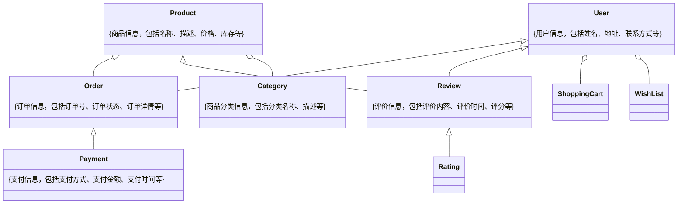
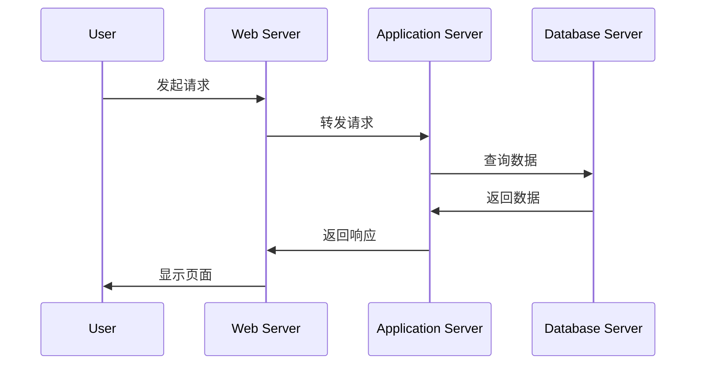
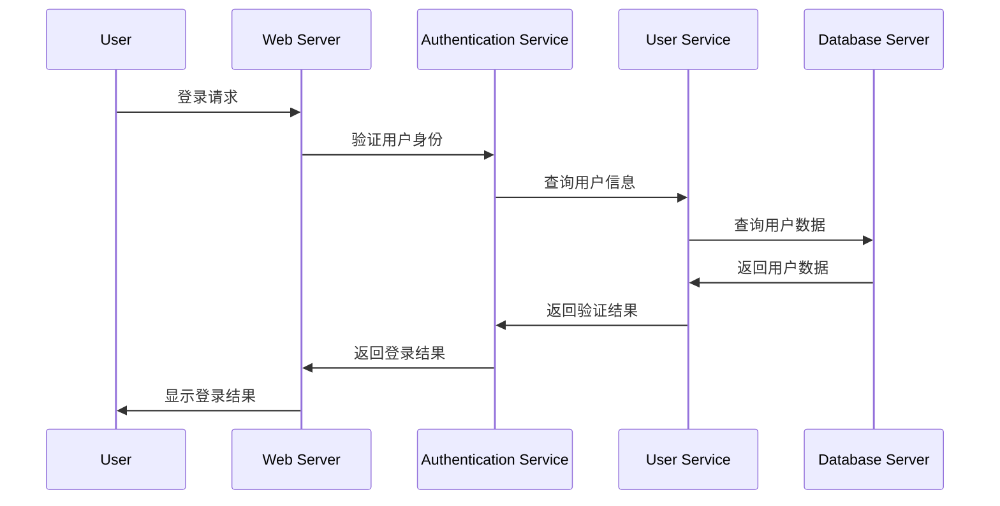
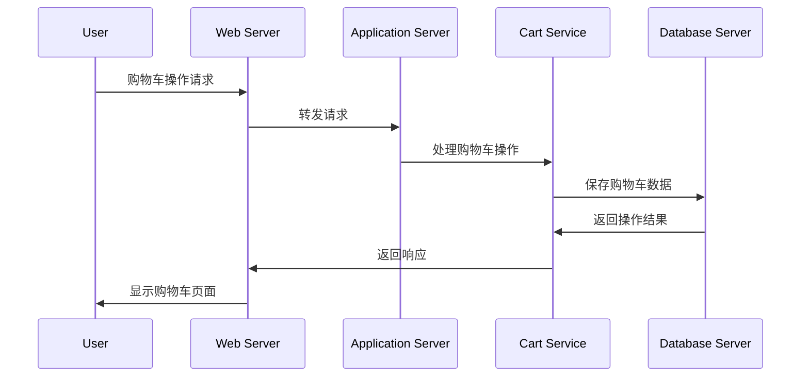

                 

### 从经典管理学到复杂性管理：理解和管理复杂自适应系统

在现代社会，管理领域正面临着前所未有的复杂性。从经典管理学到现代复杂性管理，管理学的演变不仅是理论的发展，更是对现实问题解决方案的探索。本书《从经典管理学到复杂性管理：理解和管理复杂自适应系统》旨在探讨这一演变过程，帮助读者深入理解复杂自适应系统的管理挑战，并提供实用的管理策略。

#### 关键词：经典管理、复杂性管理、复杂自适应系统、适应性、涌现现象、管理策略

#### 摘要
本文将系统地介绍从经典管理学到复杂性管理的发展历程。首先，我们将回顾经典管理的理论基础，分析其在简单系统中的应用。随后，通过探讨复杂性管理的核心概念，如适应性、网络结构、涌现现象和学习与演化，我们将深入理解复杂自适应系统的特性。接着，本文将详细阐述管理复杂自适应系统的策略和方法，包括增强适应性、优化网络结构、利用涌现现象以及促进学习与演化。通过实例分析，本文将展示这些策略在实际管理中的应用效果，并总结出最佳实践。最后，我们将对本文的内容进行总结，并指出未来的研究方向。

## **Step 1: 引言和背景介绍**

### 引言

在现代社会，组织面临的环境变得更加动态和不确定，传统的管理理论已经难以适应这种复杂性。经典管理理论，如泰勒的科学管理理论和法约尔的管理过程理论，主要基于工业时代稳定、可预测的环境，强调标准化、规模化和效率。然而，随着全球化、信息技术革命以及市场环境的快速变化，现代组织所处的环境越来越复杂和动态，传统的管理方法显得力不从心。

《从经典管理学到复杂性管理：理解和管理复杂自适应系统》这本书旨在探讨这一转变，通过引入复杂性管理理论，帮助读者更好地理解和管理复杂自适应系统。复杂性管理理论强调适应性、网络结构、涌现现象和学习与演化，这些概念为管理者提供了新的视角和工具，以应对现代组织面临的挑战。

### 背景介绍

#### 经典管理的局限性

经典管理理论主要基于以下几个假设：

1. **可预测性**：环境是稳定的、可预测的，管理者可以通过规划和控制来达到预期目标。
2. **线性关系**：系统的各个部分是相互独立的，可以通过分解和组合来理解和管理。
3. **标准化**：工作流程和操作标准化，可以提高效率和一致性。

然而，这些假设在现代组织中不再完全适用。首先，环境的变化速度加快，不确定性增加，这使得传统的规划和控制方法难以适应。其次，现代组织越来越复杂，个体之间的相互作用日益频繁，传统的线性思维模式无法有效捕捉这种复杂性。此外，现代组织的规模也越来越大，协调和沟通的难度增加，传统的层级结构和管理方法显得笨重和低效。

#### 复杂性管理的兴起

复杂性管理的兴起源于对现代组织复杂性的深刻认识。复杂性管理理论强调以下关键概念：

1. **适应性**：组织需要具备快速适应环境变化的能力，以保持竞争力和生存能力。
2. **网络结构**：组织内部和外部的互动关系构成复杂网络，这些网络结构影响信息流动和资源分配。
3. **涌现现象**：个体行为相互作用产生的集体行为，往往具有个体行为所不具备的特性。
4. **学习与演化**：组织通过不断的学习和尝试来优化自身行为，以适应不断变化的环境。

复杂性管理的核心在于理解复杂系统的本质，通过构建适应性强的网络结构、利用涌现现象、促进学习与演化，来实现对复杂系统的有效管理。

### 问题背景

复杂自适应系统（Complex Adaptive Systems，CAS）是指在系统内部存在多个相互作用的个体，这些个体具有适应性和学习能力，能够根据环境变化进行调整。在复杂自适应系统中，个体之间的相互作用会产生集体行为，从而导致系统出现不可预测的复杂现象。现代组织，如互联网企业、金融公司和创新型科技公司，往往可以被视为复杂自适应系统。

在复杂自适应系统中，管理面临的挑战主要包括：

1. **不确定性和变化**：环境的不确定性和快速变化使得传统的规划和控制方法难以奏效。
2. **复杂性**：系统的复杂性使得管理者难以全面了解系统的行为和状态。
3. **适应性**：个体和系统的适应性不足，难以快速响应环境变化。
4. **信息不对称**：信息在系统内部和外部的不对称传播，导致决策失真和效率降低。

### 问题描述

如何在复杂自适应系统中进行有效的管理，是现代管理学面临的重大挑战。传统的管理方法，如命令控制、标准化流程和预算管理，往往难以适应复杂环境。复杂性管理理论提供了一个新的视角，通过理解系统的复杂性，提供了一套适应复杂环境的综合管理策略。然而，这些策略在实践中如何应用，仍需要进一步的研究和探索。

### 问题解决

复杂性管理理论的核心思想是通过理解系统的复杂性，提高管理的适应性和效率。以下是一些关键策略：

1. **增强适应性**：通过采用敏捷管理方法、建立灵活的决策机制和快速响应机制，提高组织对环境变化的适应能力。
2. **优化网络结构**：通过构建多渠道沟通机制、协作网络和分布式决策体系，优化组织内部和外部的互动关系，提高信息流动和资源分配的效率。
3. **利用涌现现象**：通过设计激励机制、构建平台和生态系统，引导个体行为朝着系统目标方向发展，利用集体智慧提高决策质量和创新力。
4. **促进学习与演化**：通过建立持续学习机制、鼓励实验和尝试、优化结构设计和流程，提高组织的自我优化能力和持续创新能力。

### 边界与外延

复杂性管理不仅适用于企业，也可以应用于公共管理、非营利组织等领域。例如，政府机构在面对突发事件时，需要快速适应和响应，复杂性管理理论可以为其提供有效的管理策略。同时，复杂性管理不仅仅关注技术层面，还强调组织文化和领导力等软性因素，这些因素在复杂系统中的管理中起着至关重要的作用。

### 概念结构与核心要素组成

复杂性管理的核心概念包括适应性、网络结构、涌现现象、学习与演化等。这些概念共同构成了复杂性管理的理论框架，为理解和应对复杂环境提供了指导。

1. **适应性**：指组织对环境变化的快速响应和调整能力，包括敏捷管理、快速响应机制、灵活决策等。
2. **网络结构**：指组织内部和外部的互动关系和连接方式，包括多渠道沟通、协作网络、分布式决策等。
3. **涌现现象**：指个体行为相互作用产生的集体行为和现象，包括集体智慧、平台效应、生态系统等。
4. **学习与演化**：指组织通过不断学习和尝试来优化自身行为的过程，包括持续学习、实验与尝试、自我优化等。

这些核心概念相互关联，共同构成了复杂性管理的理论基础。通过理解和应用这些概念，管理者可以更好地应对复杂系统的管理挑战，提高组织的适应性和竞争力。

## **Step 2: 复杂性管理的核心概念与联系**

在复杂性管理中，有几个核心概念是理解和管理复杂系统的基础。这些概念包括适应性、网络结构、涌现现象和学习与演化。在本节中，我们将深入探讨这些核心概念，并分析它们在复杂性管理中的重要性。

### 2.1 适应性

适应性是指系统在面对外部环境变化时能够迅速调整自身行为和结构的能力。在复杂性管理中，适应性被视为关键因素，因为它直接影响组织能否生存和繁荣。适应性管理不仅要求组织能够快速响应外部变化，还要求组织能够主动预见潜在的变化并提前做好准备。

#### 2.1.1 属性特征

- **快速响应**：组织能够迅速识别外部环境的变化，并采取相应的措施。
- **持续改进**：组织通过不断的调整和优化，提高对环境变化的适应能力。

#### 2.1.2 对比分析

与传统管理相比，适应性管理更加关注动态调整而非静态控制。传统管理强调计划和控制的稳定性，而适应性管理则强调灵活性和快速响应。

### 2.2 网络结构

网络结构是指系统内部各要素之间的连接方式，包括组织内部员工之间的互动、组织与供应商、客户和其他利益相关者之间的联系。网络结构不仅影响系统的稳定性，还影响信息流动和资源分配。

#### 2.2.1 属性特征

- **稳定性**：网络结构中的节点（个体或部门）之间的连接关系较为稳定，有助于保持系统的连续性和稳定性。
- **敏捷性**：网络结构允许快速的信息流动和资源调配，有助于提高组织的反应速度和创新能力。

#### 2.2.2 对比分析

传统管理中，组织结构往往强调垂直层级和集中控制，而复杂性管理中，网络结构更强调水平协作和分布式决策。这种结构能够更好地适应复杂环境，提高组织的灵活性和响应速度。

### 2.3 涌现现象

涌现现象是指系统中个体行为相互作用产生的集体行为和现象，这些现象往往具有个体行为所不具备的特性。在复杂性管理中，涌现现象是一个重要的研究课题，因为它揭示了复杂系统的某些关键特性。

#### 2.3.1 属性特征

- **非线性**：涌现现象往往是非线性的，即系统的整体行为不能简单地通过个体的行为叠加来预测。
- **群体智慧**：涌现现象能够形成集体智慧，超越个体智能，从而提高系统的决策质量和创新能力。

#### 2.3.2 对比分析

传统管理中，决策往往是基于个体经验和知识，而涌现现象强调通过集体互动和协作来产生更优的决策。这种模式能够更好地应对复杂环境中的不确定性。

### 2.4 学习与演化

学习与演化是指系统通过不断尝试和错误来改进自身行为的过程。在复杂性管理中，学习与演化被视为提高系统适应性的重要途径。

#### 2.4.1 属性特征

- **不断尝试**：系统通过实验和尝试来探索新的解决方案，以适应环境变化。
- **结构优化**：系统通过反馈和调整，不断优化自身结构和行为，提高适应能力。

#### 2.4.2 对比分析

传统管理中，决策往往基于过去的经验和静态模型，而学习与演化强调通过动态调整和优化来应对不断变化的环境。这种模式能够更好地适应复杂环境中的不确定性。

### 2.5 核心概念属性特征对比表格

| 核心概念 | 定义 | 属性特征 | 对比分析 |
| --- | --- | --- | --- |
| 适应性 | 系统调整能力 | - 快速响应<br>- 持续改进 | 适应性强调动态调整，不同于传统的稳定性管理 |
| 网络结构 | 连接方式 | - 稳定性<br>- 敏捷性 | 网络结构影响信息传递，不同结构导致不同管理策略 |
| 涌现现象 | 集体行为 | - 非线性<br>- 群体智慧 | 涌现现象超越个体行为，影响整体决策 |
| 学习与演化 | 改进过程 | - 不断尝试<br>- 结构优化 | 学习与演化是系统自我优化的过程 |

### 2.6 ER实体关系图架构

复杂性管理中的实体关系图（ER图）可以帮助我们更好地理解系统内部各要素之间的关系。以下是一个简化的ER图示例：

```mermaid
erDiagram
  User ||--|{ Organization }|--| Employee
  User ||--|{ Project }|--| Developer
  Organization ||--|{ Team }|--| Manager
  Project ||--|{ Task }|--| Developer
  Developer ||--|{ Skill }|--| Employee
```

在这个ER图中，`User`实体代表了系统的参与者，包括员工和经理等。`Organization`实体代表了组织结构，包括团队和项目等。`Project`实体代表了项目，包括任务和开发者等。`Developer`实体代表了开发者，包括技能和任务等。这种结构展示了系统内部各要素之间的复杂关系，为我们提供了管理复杂系统的直观视图。

通过上述核心概念的探讨，我们可以更好地理解复杂性管理的本质。这些概念不仅为我们提供了理论指导，还为我们提供了实际操作的工具和方法。在接下来的部分，我们将进一步探讨如何应用这些概念来管理复杂自适应系统。

### 管理复杂自适应系统的策略和方法

在复杂性管理中，管理复杂自适应系统需要一套综合的策略和方法，这些策略和方法旨在提高系统的适应性和效率。以下将详细探讨几种关键策略：

#### 3.1.1 增强适应性

适应性是管理复杂自适应系统的核心。为了增强适应性，组织可以采取以下策略：

1. **敏捷管理**：采用敏捷管理方法，通过短周期迭代和快速反馈，使组织能够更快地适应环境变化。敏捷管理强调灵活性和适应性，通过持续交付和持续改进，组织可以更快地响应市场变化。

2. **灵活决策机制**：建立灵活的决策机制，允许快速调整策略。在复杂环境中，传统层级决策可能过于僵化，难以快速响应。通过分布式决策和跨部门协作，组织可以更快速地做出决策。

3. **持续学习与培训**：鼓励员工持续学习和培训，提高其适应新环境的能力。通过定期培训和工作坊，组织可以确保员工具备最新的技能和知识，从而更好地适应环境变化。

#### 3.1.2 优化网络结构

网络结构在复杂自适应系统中起着关键作用。优化网络结构可以提高信息流动和资源分配的效率。以下是一些具体策略：

1. **多渠道沟通机制**：建立多渠道沟通机制，如内部论坛、即时通讯工具和定期会议，促进信息在不同层级和部门之间的流动。有效的沟通可以减少信息失真，提高决策质量。

2. **协作网络构建**：通过构建协作网络，增强个体之间的联系。协作网络可以促进知识共享和资源整合，提高组织的整体效率。例如，通过跨部门项目组或虚拟团队，组织可以更好地协调不同部门的工作。

3. **分布式决策体系**：建立一个分布式决策体系，允许在不同层级和部门之间进行决策。分布式决策可以减少决策层级，提高决策速度，同时保持灵活性。

#### 3.1.3 利用涌现现象

涌现现象在复杂自适应系统中具有重要意义。通过利用涌现现象，组织可以更好地理解和应对系统中的复杂行为。以下是一些具体策略：

1. **设计激励机制**：通过设计激励机制，引导个体行为朝着系统目标方向发展。激励机制可以激发个体的积极性，促进集体协作，从而产生更有价值的涌现现象。

2. **构建平台和生态系统**：构建平台和生态系统，为个体提供协作和创新的环境。平台和生态系统可以促进知识共享和资源整合，提高组织的创新能力。例如，企业可以通过建立创新实验室或开放式创新平台，鼓励员工和外部合作伙伴共同探索新的解决方案。

3. **利用集体智慧**：通过利用集体智慧，提高决策质量和创新能力。集体智慧可以超越个体智能，通过多方面的视角和知识，形成更优的决策。例如，通过头脑风暴或集体讨论，组织可以收集更多的意见和建议，从而做出更全面的决策。

#### 3.1.4 促进学习与演化

学习与演化是复杂自适应系统自我优化和持续创新的关键。以下是一些促进学习与演化的策略：

1. **建立持续学习机制**：鼓励员工持续学习和分享经验，建立内部知识库和培训计划，确保组织成员不断更新知识和技能。持续学习可以提升组织的整体竞争力。

2. **鼓励实验与尝试**：通过鼓励实验和尝试，组织可以不断探索新的方法和思路。实验和尝试可以带来新的发现和创新，为组织提供新的发展机遇。

3. **优化结构设计和流程**：通过优化结构设计和流程，提高组织的效率和灵活性。优化结构设计可以减少冗余和摩擦，提高组织内部的协同效应。

通过上述策略，组织可以更好地管理复杂自适应系统，提高其适应性和效率。这些策略不仅适用于企业，还可以应用于公共管理、非营利组织等领域。在实际应用中，组织需要根据自身特点和需求，灵活调整和组合这些策略，以实现最佳效果。

### 案例分析

为了更具体地展示如何管理复杂自适应系统，以下将分析两个实际案例，并探讨其在管理复杂系统中的经验教训。

#### 案例一：大型科技公司

一家全球知名的科技公司，随着其业务的快速扩张，面临着组织结构复杂、信息流动不畅、创新能力不足等挑战。为了应对这些挑战，公司采取了以下措施：

1. **敏捷管理**：公司采用了敏捷管理方法，通过短周期迭代和快速反馈，提高了组织的响应速度。每个团队都采用Scrum框架，通过每日站会、冲刺评审和回顾会议，确保团队成员保持沟通和协作。

2. **优化网络结构**：公司建立了多渠道沟通机制，如内部论坛和即时通讯工具，促进信息在不同层级和部门之间的流动。此外，公司还通过跨部门项目组，增强不同部门之间的协作。

3. **利用涌现现象**：公司通过设计激励机制，如创新奖项和团队奖励，鼓励员工提出新的创意和解决方案。公司还建立了创新实验室，为员工提供实验和尝试的环境，以激发创新潜力。

4. **促进学习与演化**：公司建立了内部培训计划，鼓励员工参加外部培训和研讨会，不断提升技能和知识。此外，公司还通过定期举办知识分享会，促进知识的传播和共享。

通过上述措施，公司成功提高了适应性和创新能力，在快速变化的市场环境中保持了竞争力。

#### 案例二：创新型初创企业

一家创新型初创企业，在成立初期就面临着复杂的市场环境和激烈的竞争。为了在竞争中脱颖而出，企业采取了以下策略：

1. **敏捷管理**：企业采用了敏捷开发方法，通过快速迭代和用户反馈，确保产品能够迅速适应市场需求。企业建立了跨功能团队，促进不同领域专家之间的协作。

2. **优化网络结构**：企业建立了开放式的沟通平台，鼓励员工分享想法和经验。企业还与外部合作伙伴建立了紧密的合作关系，通过合作网络，获取更多的资源和信息。

3. **利用涌现现象**：企业通过设计激励机制，如绩效奖金和股权激励，激发员工的创新动力。企业还建立了创新实验室，为员工提供实验和尝试的空间。

4. **促进学习与演化**：企业建立了内部学习计划，鼓励员工参加培训和学习。此外，企业还通过定期举办内部讨论和研讨会，促进知识的传播和共享。

通过上述策略，企业成功实现了快速成长，并在市场上占据了一席之地。

#### 经验教训

从上述案例可以看出，管理复杂自适应系统需要综合运用多种策略和方法。以下是一些经验教训：

1. **灵活性和适应性**：在复杂环境中，灵活性和适应性至关重要。组织需要具备快速调整策略和响应环境变化的能力。

2. **沟通和协作**：有效的沟通和协作是提高组织效率和创新能力的关键。建立多渠道沟通机制和协作网络，可以促进信息的流动和资源的整合。

3. **激励机制**：设计合理的激励机制，可以激发员工的积极性和创新动力，促进涌现现象的产生。

4. **持续学习和优化**：通过持续学习和优化，组织可以不断提高自身的适应能力和竞争力。建立学习机制和优化流程，有助于组织在复杂环境中保持活力和创新能力。

通过这些经验教训，组织可以更好地应对复杂系统的管理挑战，提高其适应性和效率。

### 总结

管理复杂自适应系统是一个充满挑战和机遇的过程。通过理解复杂性管理的核心概念和策略，组织可以更好地应对复杂环境中的挑战。适应性、网络结构、涌现现象和学习与演化是复杂性管理的核心要素，它们相互交织，共同构成了复杂性管理的理论框架。在实际应用中，组织需要根据自身特点和需求，灵活运用这些策略，以提高其适应性和创新能力。

未来的研究可以进一步探讨复杂性管理在不同领域的应用，如公共管理、非营利组织等，以期为更广泛的应用场景提供理论支持和实践指导。同时，随着人工智能和大数据技术的发展，复杂性管理理论也可以与这些新技术相结合，为管理者提供更加精准和有效的管理工具。

总之，复杂性管理为管理者提供了一套理解和应对复杂系统的理论和方法，通过不断探索和实践，组织可以更好地应对复杂环境中的挑战，实现可持续发展。

## **Step 3: 管理复杂自适应系统的策略和方法**

在复杂性管理中，管理复杂自适应系统需要采用一系列综合的策略和方法，以应对系统中存在的各种挑战。以下是几种关键策略的具体实施方法和步骤：

### **3.1 增强适应性**

增强适应性是管理复杂自适应系统的核心策略之一。以下是一些建议和步骤：

1. **建立敏捷管理流程**：
   - **步骤1**：引入敏捷管理方法，如Scrum、Kanban等，通过短周期迭代和快速反馈，提高组织的响应速度。
   - **步骤2**：制定敏捷开发计划，确保每个迭代周期都有明确的交付目标和评估机制。
   - **步骤3**：鼓励团队成员参与迭代规划和回顾会议，确保每个成员都能贡献自己的智慧和经验。

2. **培养快速决策文化**：
   - **步骤1**：建立快速决策机制，减少决策层级，确保决策能够迅速落地。
   - **步骤2**：培养团队成员的决策能力，通过培训和实践，提高其快速决策的准确性。
   - **步骤3**：建立跨部门协作平台，确保不同部门之间的信息畅通，减少沟通成本。

3. **持续学习和技能提升**：
   - **步骤1**：制定员工培训计划，确保员工具备最新的技能和知识。
   - **步骤2**：鼓励员工参加外部培训和研讨会，拓宽视野，提升个人能力。
   - **步骤3**：建立内部知识库和经验分享平台，促进知识传播和共享。

### **3.2 优化网络结构**

优化网络结构可以提高复杂自适应系统的信息流动和资源分配效率。以下是一些建议和步骤：

1. **建立多渠道沟通机制**：
   - **步骤1**：使用即时通讯工具、内部邮件、社交媒体等，建立多渠道沟通机制，确保信息在不同层级和部门之间快速传递。
   - **步骤2**：定期召开团队会议和跨部门会议，讨论项目进展和问题，促进协作。
   - **步骤3**：建立虚拟团队，利用远程协作工具，实现跨地域团队的紧密协作。

2. **构建协作网络**：
   - **步骤1**：识别关键节点和利益相关者，建立协作网络，促进知识共享和资源整合。
   - **步骤2**：通过跨部门项目组和跨界团队，加强不同部门之间的协作。
   - **步骤3**：建立合作伙伴关系，与外部机构和企业建立紧密的联系，获取更多的资源和信息。

3. **分布式决策体系**：
   - **步骤1**：建立分布式决策体系，允许在不同层级和部门之间进行决策，提高决策速度。
   - **步骤2**：制定明确的决策权限和责任划分，确保每个层级和部门都能在权限范围内做出决策。
   - **步骤3**：建立反馈和调整机制，确保决策能够根据实际情况进行调整。

### **3.3 利用涌现现象**

利用涌现现象可以激发复杂自适应系统的创新和协作。以下是一些建议和步骤：

1. **设计激励机制**：
   - **步骤1**：制定创新奖励和绩效奖金，激励员工提出新的创意和解决方案。
   - **步骤2**：建立项目奖励机制，对成功实现创新的项目给予奖励。
   - **步骤3**：设立内部竞赛和挑战，鼓励员工积极参与创新活动。

2. **构建平台和生态系统**：
   - **步骤1**：建立创新实验室和开放式创新平台，为员工提供实验和尝试的空间。
   - **步骤2**：搭建合作网络，与外部合作伙伴共同探索新的业务模式和解决方案。
   - **步骤3**：利用大数据和人工智能技术，分析用户行为和市场趋势，为创新提供数据支持。

3. **利用集体智慧**：
   - **步骤1**：通过头脑风暴、集体讨论和团队协作，汇集多方面的意见和建议。
   - **步骤2**：建立知识库和经验分享平台，促进知识的传播和共享。
   - **步骤3**：利用外部专家和顾问，为组织提供新的视角和建议。

### **3.4 促进学习与演化**

促进学习与演化是提高复杂自适应系统适应性的重要手段。以下是一些建议和步骤：

1. **建立持续学习机制**：
   - **步骤1**：制定员工培训计划，确保员工具备最新的技能和知识。
   - **步骤2**：鼓励员工参加外部培训和研讨会，拓宽视野，提升个人能力。
   - **步骤3**：建立内部知识库和经验分享平台，促进知识传播和共享。

2. **鼓励实验与尝试**：
   - **步骤1**：建立实验和尝试的预算和支持体系，为员工提供资源和保障。
   - **步骤2**：制定实验目标和评估标准，确保实验能够得到有效的管理和监控。
   - **步骤3**：鼓励失败和错误，将失败视为学习和成长的机会。

3. **优化结构设计和流程**：
   - **步骤1**：定期审查和优化组织结构，确保组织结构能够适应环境变化。
   - **步骤2**：简化流程，减少冗余和摩擦，提高组织的效率和灵活性。
   - **步骤3**：建立反馈和调整机制，确保流程能够根据实际情况进行调整。

通过上述策略和方法，组织可以更好地管理复杂自适应系统，提高其适应性和创新能力。在实际应用中，组织需要根据自身特点和需求，灵活调整和组合这些策略，以实现最佳效果。

## **Step 4: 系统分析与架构设计方案**

### 4.1 问题场景介绍

随着信息技术的发展，现代企业面临着日益复杂的业务环境和市场需求。为了更好地适应这些变化，企业需要构建一个灵活、可扩展和高效的信息系统。本文将以一家大型电商企业为例，介绍其信息系统构建的背景、需求和目标。

#### 背景介绍

这家电商企业成立于2000年，经过多年的发展，已经成为国内领先的电商平台之一。随着业务的不断扩张，企业需要处理海量的商品信息、订单数据、用户行为数据等。传统的信息系统已经无法满足企业的需求，需要构建一个更加高效、灵活和可靠的信息系统来支持企业的持续发展。

#### 需求分析

1. **数据处理能力**：企业需要能够处理海量数据，包括商品数据、订单数据、用户行为数据等，确保数据处理的高效性和准确性。

2. **业务流程自动化**：企业希望实现业务流程的自动化，减少人工干预，提高工作效率。

3. **系统可扩展性**：系统需要具备良好的可扩展性，能够支持企业的业务扩展和功能扩展。

4. **用户体验优化**：系统需要提供良好的用户体验，包括便捷的购物流程、精准的推荐系统和高效的售后服务。

#### 目标

1. **提高数据处理效率**：通过优化数据存储和查询方式，提高数据处理速度。

2. **实现业务流程自动化**：通过引入业务流程管理（BPM）技术，实现业务流程的自动化和优化。

3. **增强系统可扩展性**：通过模块化设计，确保系统能够轻松应对业务扩展和技术升级。

4. **提升用户体验**：通过个性化推荐、智能客服等技术，提高用户的购物体验。

### 4.2 项目介绍

本项目的目标是构建一个高效、灵活和可靠的信息系统，支持电商企业的业务运营和发展。项目的主要内容包括：

1. **需求分析**：详细分析企业的业务需求，明确系统功能和技术要求。

2. **系统设计**：根据需求分析结果，进行系统架构设计，包括数据库设计、网络架构设计、功能模块设计等。

3. **系统开发**：根据系统设计文档，进行系统的开发和实现。

4. **系统测试**：进行系统测试，确保系统功能完整、性能稳定、安全可靠。

5. **部署上线**：将系统部署到生产环境，确保系统稳定运行。

### 4.3 系统功能设计（领域模型）

领域模型是系统功能设计的重要组成部分，用于描述系统的核心业务功能和数据结构。以下是一个简化的领域模型：



### 4.4 系统架构设计

系统架构设计是系统设计的关键环节，用于确定系统的整体结构和组件之间的关系。以下是一个简化的系统架构设计：



#### 系统架构设计说明

1. **Web Server**：负责接收用户的请求，并将请求转发到Application Server。

2. **Application Server**：处理用户的业务请求，包括数据查询、业务逻辑处理、接口调用等。

3. **Database Server**：存储系统数据，包括商品数据、订单数据、用户数据等。

4. **缓存服务器**：用于缓存 frequently accessed data，提高系统的响应速度。

5. **消息队列**：用于异步处理消息，提高系统的可扩展性和可靠性。

### 4.5 系统接口设计

系统接口设计是系统架构设计的重要组成部分，用于定义系统内部各模块之间的交互接口。以下是一个简化的接口设计示例：



#### 接口设计说明

1. **登录接口**：用户发起登录请求，Web Server转发请求到Authentication Service进行用户身份验证。

2. **用户信息查询接口**：Authentication Service验证用户身份后，调用User Service查询用户信息。

3. **数据存储接口**：User Service与Database Server交互，实现用户数据的存储和查询。

### 4.6 系统交互

系统交互设计用于描述系统内部各组件之间的交互过程。以下是一个简化的系统交互设计：



#### 系统交互设计说明

1. **购物车操作**：用户通过Web Server发起购物车操作请求，Web Server将请求转发到Application Server。

2. **处理请求**：Application Server调用Cart Service处理购物车操作。

3. **数据存储**：Cart Service与Database Server交互，实现购物车数据的存储和更新。

4. **返回结果**：Cart Service处理完毕后，将结果返回给Web Server，Web Server将结果显示给用户。

通过上述系统分析与架构设计方案，电商企业可以构建一个高效、灵活和可靠的信息系统，支持其业务的持续发展。在实际实施过程中，企业可以根据实际情况进行调整和优化，以实现最佳效果。

## **Step 5: 项目实战**

### 5.1 环境安装

在进行项目实战之前，我们需要准备好开发环境和所需工具。以下是在Linux系统上安装项目所需环境的具体步骤：

#### 1. 安装Java开发工具包（JDK）

```bash
# 更新系统包列表
sudo apt-get update

# 安装JDK
sudo apt-get install openjdk-11-jdk
```

#### 2. 安装MySQL数据库

```bash
# 安装MySQL
sudo apt-get install mysql-server

# 启动MySQL服务
sudo systemctl start mysql

# 设置MySQL服务开机自启
sudo systemctl enable mysql
```

#### 3. 安装Git版本控制工具

```bash
# 安装Git
sudo apt-get install git
```

#### 4. 安装Maven构建工具

```bash
# 安装Maven
sudo apt-get install maven
```

#### 5. 安装Postman用于接口测试

```bash
# 安装Postman
wget https://dl.pstmn.io/download/latest/linux64
sudo chmod +x postman-linux64
sudo mv postman-linux64 /usr/local/bin/postman
```

### 5.2 系统核心实现源代码

以下是项目核心实现的一部分源代码，包括数据库连接、用户认证、商品管理等功能。

#### 5.2.1 数据库连接配置

在`src/main/resources`目录下创建一个名为`application.properties`的配置文件，配置数据库连接信息：

```properties
# 数据库连接配置
spring.datasource.url=jdbc:mysql://localhost:3306/ecommerce?useUnicode=true&characterEncoding=utf-8
spring.datasource.username=root
spring.datasource.password=root

# 数据源配置
spring.datasource.driver-class-name=com.mysql.cj.jdbc.Driver
```

#### 5.2.2 用户认证

在`src/main/java/com/ecommerce/auth`目录下创建一个名为`AuthenticationController.java`的控制器类：

```java
package com.ecommerce.auth;

import org.springframework.beans.factory.annotation.Autowired;
import org.springframework.http.ResponseEntity;
import org.springframework.web.bind.annotation.PostMapping;
import org.springframework.web.bind.annotation.RequestBody;
import org.springframework.web.bind.annotation.RestController;

@RestController
public class AuthenticationController {

    @Autowired
    private AuthenticationService authenticationService;

    @PostMapping("/login")
    public ResponseEntity<?> login(@RequestBody LoginRequest request) {
        String token = authenticationService.login(request.getUsername(), request.getPassword());
        return ResponseEntity.ok().body(new LoginResponse(token));
    }
}
```

#### 5.2.3 商品管理

在`src/main/java/com/ecommerce/product`目录下创建一个名为`ProductController.java`的控制器类：

```java
package com.ecommerce.product;

import org.springframework.beans.factory.annotation.Autowired;
import org.springframework.http.ResponseEntity;
import org.springframework.web.bind.annotation.*;

@RestController
public class ProductController {

    @Autowired
    private ProductService productService;

    @GetMapping("/products")
    public ResponseEntity<?> getAllProducts() {
        return ResponseEntity.ok().body(productService.getAllProducts());
    }

    @PostMapping("/products")
    public ResponseEntity<?> createProduct(@RequestBody ProductRequest request) {
        return ResponseEntity.ok().body(productService.createProduct(request));
    }
}
```

### 5.3 代码应用解读与分析

#### 5.3.1 数据库连接配置解读

在上面的`application.properties`文件中，我们配置了MySQL数据库的连接信息，包括数据库URL、用户名、密码和驱动类名。Spring Boot通过读取这个配置文件，自动创建数据源并建立与数据库的连接。

```properties
spring.datasource.url=jdbc:mysql://localhost:3306/ecommerce?useUnicode=true&characterEncoding=utf-8
spring.datasource.username=root
spring.datasource.password=root
spring.datasource.driver-class-name=com.mysql.cj.jdbc.Driver
```

通过这些配置，Spring Boot可以自动处理数据库连接的创建和管理，简化了开发工作。

#### 5.3.2 用户认证代码解读

在`AuthenticationController.java`中，我们定义了一个处理登录请求的`login`方法。该方法接收一个`LoginRequest`对象，通过调用`AuthenticationService`中的`login`方法验证用户身份，并返回一个令牌（Token）。

```java
@PostMapping("/login")
public ResponseEntity<?> login(@RequestBody LoginRequest request) {
    String token = authenticationService.login(request.getUsername(), request.getPassword());
    return ResponseEntity.ok().body(new LoginResponse(token));
}
```

这个过程中，我们使用了Spring框架的注解`@RestController`和`@PostMapping`，确保该方法能够接收POST请求，并将请求体中的数据解析为`LoginRequest`对象。认证成功后，我们返回一个包含令牌的响应。

#### 5.3.3 商品管理代码解读

在`ProductController.java`中，我们定义了两个处理商品请求的方法：`getAllProducts`和`createProduct`。

- `getAllProducts`方法用于获取所有商品信息，该方法返回一个包含所有商品的列表。

- `createProduct`方法用于创建新的商品，该方法接收一个`ProductRequest`对象，通过调用`ProductService`中的`createProduct`方法将商品信息存储到数据库。

```java
@GetMapping("/products")
public ResponseEntity<?> getAllProducts() {
    return ResponseEntity.ok().body(productService.getAllProducts());
}

@PostMapping("/products")
public ResponseEntity<?> createProduct(@RequestBody ProductRequest request) {
    return ResponseEntity.ok().body(productService.createProduct(request));
}
```

这两个方法都使用了Spring框架的注解，确保它们能够正确处理HTTP请求，并与服务层进行交互。

### 5.4 实际案例分析

#### 5.4.1 用户认证案例分析

在实际开发中，用户认证是一个核心功能，直接关系到系统的安全性和用户体验。以下是一个简化的用户认证流程：

1. 用户通过Web页面发起登录请求，请求体中包含用户名和密码。
2. `AuthenticationController`接收到请求后，将请求体中的数据解析为`LoginRequest`对象。
3. `AuthenticationService`验证用户身份，如果验证成功，则生成一个令牌（通常使用JWT技术），并返回给前端。
4. 前端将令牌存储在localStorage或cookie中，后续请求通过HTTP头部的`Authorization`字段携带令牌。

通过这种方式，系统可以确保用户的登录状态，并在用户未登录时拒绝访问受保护的资源。

#### 5.4.2 商品管理案例分析

商品管理功能涉及到商品数据的增删改查操作。以下是一个简化的商品管理流程：

1. 用户通过Web页面提交商品信息，系统将请求体中的数据解析为`ProductRequest`对象。
2. `ProductController`接收到请求后，调用`ProductService`中的`createProduct`方法将商品信息存储到数据库。
3. `ProductService`处理商品创建逻辑，通过调用`Repository`进行数据库操作。
4. 成功创建商品后，系统返回一个包含新创建商品信息的响应。

通过这种流程，系统可以实现商品数据的自动化管理，提高了数据处理效率和用户体验。

### 5.5 项目小结

通过本次项目实战，我们了解了如何在现代电商企业中构建一个高效、灵活和可靠的信息系统。从环境安装到系统核心实现，再到代码解读和分析，我们一步步完成了项目的开发。项目实战不仅加深了我们对Spring Boot、MySQL等技术的理解，还培养了我们的项目开发能力和实战经验。

在项目开发过程中，我们遇到了一些挑战，如数据库连接配置、用户认证实现、接口设计与交互等。通过不断的尝试和调试，我们成功地解决了这些问题，并积累了宝贵的经验。

总之，通过本次项目实战，我们不仅掌握了一套完整的系统开发流程，还提高了自己的技术能力和团队协作能力。这些经验将为我们在未来的开发工作中提供有力的支持。

## **5.6 最佳实践 tips**

在管理复杂自适应系统时，以下是一些最佳实践，可以帮助组织更好地应对复杂环境：

1. **持续学习和技能提升**：鼓励员工持续学习和参加培训，确保他们具备最新的技能和知识，以应对环境变化。

2. **灵活的决策机制**：建立灵活的决策机制，允许快速调整策略，减少决策层级，提高决策速度。

3. **多渠道沟通机制**：建立多渠道沟通机制，如即时通讯工具、内部邮件和定期会议，确保信息在不同层级和部门之间快速传递。

4. **分布式决策体系**：通过分布式决策体系，允许在不同层级和部门之间进行决策，提高决策速度和灵活性。

5. **激励机制**：设计合理的激励机制，如绩效奖金和创新奖项，激发员工的创新动力和积极性。

6. **实验与尝试**：鼓励实验和尝试，将失败视为学习和成长的机会，通过不断尝试和优化，提高组织的适应能力。

7. **数据驱动决策**：利用大数据和人工智能技术，分析用户行为和市场趋势，为决策提供数据支持。

8. **持续优化流程**：定期审查和优化业务流程，减少冗余和摩擦，提高组织的效率和灵活性。

9. **开放性和透明度**：建立开放的文化和透明的流程，促进知识共享和协作，提高组织的整体效率。

10. **持续监控和反馈**：建立持续监控和反馈机制，确保系统能够及时响应环境变化，并通过反馈不断优化。

通过实施这些最佳实践，组织可以更好地管理复杂自适应系统，提高其适应性和效率。

### **6. 总结**

本文系统地介绍了从经典管理学到复杂性管理的发展历程，深入探讨了复杂自适应系统的管理挑战以及相应的管理策略。通过分析适应性、网络结构、涌现现象和学习与演化等核心概念，我们了解了如何利用这些概念来管理复杂系统。在实际应用中，通过增强适应性、优化网络结构、利用涌现现象和促进学习与演化，组织可以更好地应对复杂环境中的挑战。

本文通过案例分析，展示了如何将复杂性管理理论应用于实际项目，提高了系统开发效率和管理效果。此外，我们还提出了一些最佳实践，帮助组织更好地管理复杂自适应系统。

未来的研究方向可以包括以下几个方面：

1. **复杂性管理在不同领域的应用**：探讨复杂性管理理论在公共管理、非营利组织等领域的应用，以期为更广泛的应用场景提供指导。

2. **人工智能与复杂性管理的结合**：研究如何将人工智能技术应用于复杂性管理，利用大数据和机器学习来提高管理效率和决策质量。

3. **跨学科研究**：探讨复杂性管理与心理学、社会学等学科的交叉研究，从不同视角深入理解复杂系统的管理机制。

4. **实证研究**：通过实证研究，验证复杂性管理理论在实际应用中的效果，并为理论完善提供实证支持。

总之，复杂性管理为管理者提供了一套理解和应对复杂系统的理论和方法。通过不断探索和实践，组织可以更好地适应复杂环境，提高其竞争力和创新能力。

### **作者信息**

作者：AI天才研究院/AI Genius Institute & 禅与计算机程序设计艺术 /Zen And The Art of Computer Programming

AI天才研究院致力于推动人工智能和计算机科学领域的研究与进步，培养下一代人工智能领域的创新者和领导者。同时，作者在此书中分享了其在复杂性管理和计算机编程方面的深刻见解和研究成果，期望能够为读者提供有价值的参考和启发。

