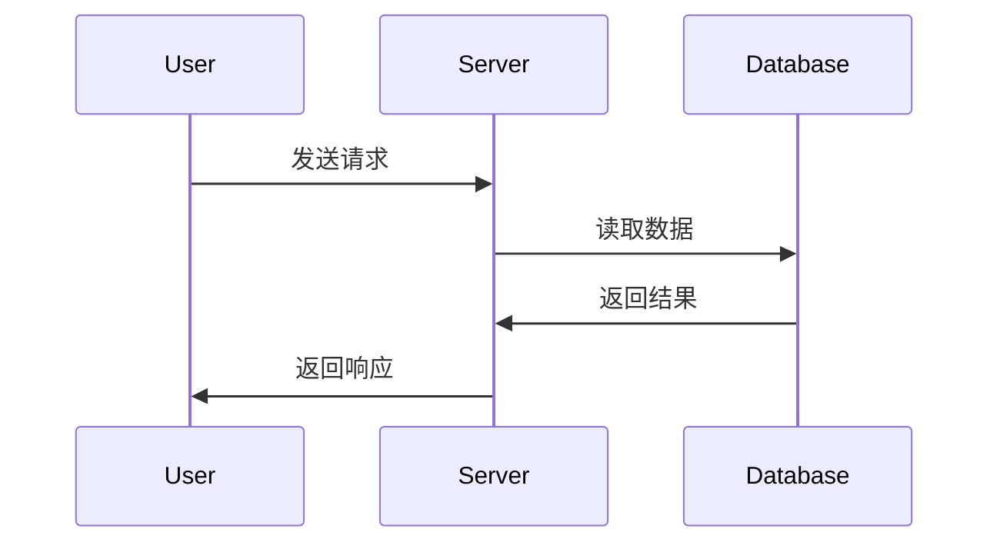
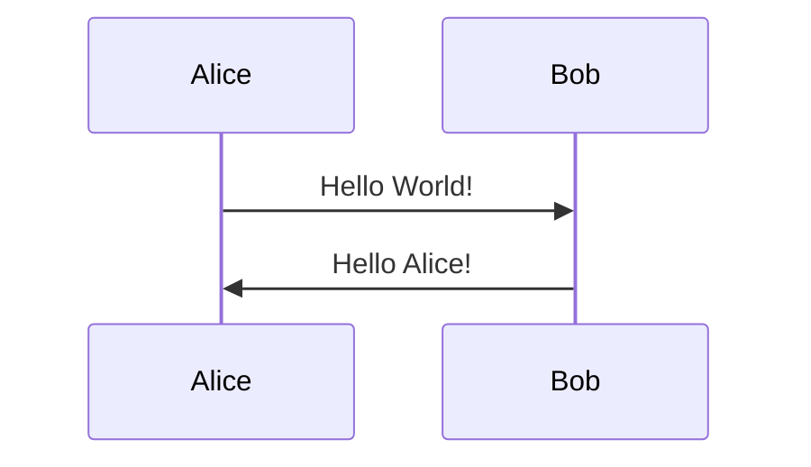

                 

# 从经典系统论到复杂网络理论：理解高度互联的世界

## 关键词
- 系统论
- 复杂网络理论
- 高度互联世界
- 系统结构
- 复杂网络建模
- 系统分析与优化

## 摘要
本文旨在深入探讨从经典系统论到复杂网络理论的发展历程，以及其在理解高度互联世界中的重要性。通过分析系统论的基本概念和复杂网络理论的核心原理，本文将进一步探讨两者之间的交叉融合，揭示其在现代科技和社会中的应用。文章最后将展望未来发展的方向和面临的挑战，为读者提供对高度互联世界的全面理解和思考。

## 第一部分：系统论简介

### 1.1 系统论的定义与核心思想

系统论是研究系统结构、行为及其相互关系的一门科学。系统（System）通常被定义为具有特定功能的、相互关联的组件集合。这些组件可以通过相互作用和相互依赖来实现系统的整体功能。

系统论的核心思想是整体性、层次性和动态性。整体性强调系统的各个部分不是独立的，而是相互依赖、相互作用的。层次性指出系统可以划分为不同层次的子系统，每一层都有其特定的功能和结构。动态性则关注系统在不同状态下的行为和变化。

### 1.2 系统论的早期研究与发展

系统论的历史可以追溯到20世纪初。最早的研究主要关注物理系统，如热力学系统。其后，随着计算机科学和信息论的发展，系统论逐渐扩展到社会系统、经济系统等领域。

在20世纪40年代，美国数学家诺伯特·维纳提出了控制论，这是系统论的一个分支，主要研究系统的控制、通信和反馈机制。同时，拉斯维特·罗森勃鲁特提出了系统动力学的概念，进一步推动了系统论的发展。

### 1.3 系统论在现代科学中的应用

现代科学中的系统论应用广泛，涵盖了生物学、经济学、社会工程、环境科学等多个领域。

在生物学中，系统论帮助科学家理解生态系统的结构和功能，如食物网和生态位等概念。在经济学中，系统论被用来分析市场经济的动态行为，如供需平衡和宏观经济模型。在社会工程中，系统论应用于城市规划、交通管理和公共安全等领域。

### 1.4 系统论的基本概念与原理

系统论的基本概念包括系统结构、系统行为、系统稳定性和系统优化。

系统结构指的是系统的组成和组成元素之间的关系。系统行为关注系统的动态过程和变化规律。系统稳定性则是指系统在受到扰动后能够恢复到原始状态的能力。系统优化则旨在找到使系统性能最佳化的方案。

### 1.5 系统论的主要模型与方法

系统论的主要模型包括系统动力学模型、系统模拟与仿真模型和系统识别与优化模型。

系统动力学模型使用差分方程或微分方程来描述系统的动态行为。系统模拟与仿真模型通过计算机模拟来模拟系统行为。系统识别与优化模型则用于识别系统参数并优化系统性能。

### 1.6 系统论的应用领域

系统论在社会系统、经济系统和生物系统等领域有广泛的应用。

在社会系统中，系统论用于分析社会结构的稳定性和变革。在经济系统中，系统论被用于分析市场经济的动态行为和宏观调控。在生物系统中，系统论帮助科学家理解生态系统的复杂性和生物多样性的维持。

## 第二部分：复杂网络理论

### 2.1 复杂网络的基本概念

复杂网络（Complex Networks）是系统论在信息科学中的一个重要应用。复杂网络由节点（Node）和边（Edge）组成，节点表示个体或实体，边表示个体之间的关系。

复杂网络的基本特性包括：

- **高度连通性**：网络中的节点具有高度的连接性，每个节点通常连接到多个其他节点。
- **小世界效应**：网络中的节点之间的平均距离较短，表现出“短路径”现象。
- **无标度性**：网络中节点的度（连接其他节点的数量）分布呈现长尾分布，没有明显的特征尺度。

### 2.2 复杂网络的分类

根据网络的特性，复杂网络可以分为多种类型，如：

- **无标度网络**：节点的度分布服从幂律分布，没有特征尺度。
- **小世界网络**：具有小世界效应，节点之间的平均距离较短。
- **层次网络**：网络具有明显的层次结构，节点分为不同的层次。

### 2.3 复杂网络的度量指标

复杂网络的度量指标用于描述网络的结构和特性，包括：

- **节点度**：节点连接的边的数量。
- **聚类系数**：节点与其邻居节点之间直接相连的边的比例。
- **平均路径长度**：网络中任意两个节点之间的平均最短路径长度。
- **网络密度**：网络中边的数量与可能的最大边数的比值。

### 2.4 复杂网络的建模与分析方法

复杂网络的建模与分析方法包括：

- **图论模型**：使用图论中的概念和方法来描述和分析网络结构。
- **随机网络模型**：如Erdős-Rényi模型，用于模拟随机生成的网络。
- **动力网络模型**：描述网络中的动态过程，如网络中节点的状态变化。
- **机器学习模型**：如图神经网络，用于分析和预测网络特性。

### 2.5 复杂网络的应用实例

复杂网络理论在多个领域有广泛的应用，如：

- **社交网络分析**：分析社交网络的结构和功能，预测社交网络中的传播过程。
- **通信网络优化**：设计高效的网络结构，优化网络性能。
- **生物信息学**：研究生物大分子的相互作用网络，揭示生物系统的复杂性。

## 第三部分：系统论与复杂网络理论的结合

### 3.1 系统论与复杂网络理论的交叉研究

系统论与复杂网络理论的交叉研究主要集中在以下几个方面：

- **网络结构分析**：应用系统论的方法来分析复杂网络的结构特性，如稳定性、平衡态和演化规律。
- **网络行为模拟**：使用复杂网络理论来模拟系统行为，如信息传播、能量流动和社会动力学。
- **网络优化设计**：将系统优化方法应用于复杂网络的设计和优化，如网络容量规划、路由算法设计等。

### 3.2 高度互联世界的系统分析

高度互联世界是一个由多个复杂网络组成的综合体。在这个世界中，系统论与复杂网络理论的结合提供了理解和分析高度互联世界的有效工具。

- **问题背景**：高度互联世界中的复杂网络使得系统行为变得更加复杂，需要有效的分析方法来理解和预测。
- **挑战与机遇**：复杂网络的存在带来了新的挑战，如网络攻击、信息过载和系统崩溃等。同时，也为科学研究和技术创新提供了新的机遇。
- **分析方法**：系统论与复杂网络理论相结合，可以提供网络结构分析、行为模拟和优化设计的方法。

### 3.3 系统论与复杂网络理论的应用

系统论与复杂网络理论在高度互联世界中的应用包括：

- **社会系统分析**：研究社会网络的结构和功能，分析社会现象和行为模式。
- **经济系统建模**：模拟市场经济中的动态行为，预测经济趋势和决策。
- **生物系统研究**：分析生物网络的复杂性和生物学功能，推动生物医学研究。

## 第四部分：系统论与复杂网络理论的未来发展方向

### 4.1 系统论与复杂网络理论的发展方向

系统论与复杂网络理论的未来发展将在以下几个方面展开：

- **多尺度分析**：研究不同尺度下系统的行为和特性，如从微观分子网络到宏观生态系统。
- **跨学科融合**：与其他领域如物理学、生物学、经济学等相结合，推动多学科交叉研究。
- **算法优化**：开发更高效的算法来模拟和分析复杂网络，提高计算效率和准确性。

### 4.2 高度互联世界的潜在挑战

高度互联世界面临的潜在挑战包括：

- **网络安全性**：保护网络免受攻击和破坏，维护网络稳定性和可靠性。
- **信息过载**：有效管理和处理大量的信息，确保信息的有效传播和利用。
- **资源优化**：合理分配和使用资源，提高系统的效率和可持续性。

### 4.3 研究方向与未来趋势

系统论与复杂网络理论的研究方向和未来趋势包括：

- **智能系统**：研究具有自适应性和自我修复能力的智能系统，如智能交通系统、智能电网等。
- **网络经济学**：分析网络经济中的行为和机制，设计优化网络经济系统的模型和算法。
- **社会动力学**：研究社会网络的演化规律，预测社会行为和趋势，为政策制定提供科学依据。

## 结论

从经典系统论到复杂网络理论，我们经历了一个从宏观到微观、从简单到复杂的研究历程。系统论提供了理解复杂系统的基本框架和工具，而复杂网络理论则进一步揭示了高度互联世界中的结构和行为规律。通过系统论与复杂网络理论的结合，我们能够更好地理解和分析高度互联世界的复杂性，为科技创新和社会进步提供理论支持。

### 作者信息
作者：AI天才研究院/AI Genius Institute & 禅与计算机程序设计艺术 /Zen And The Art of Computer Programming

### 最佳实践 tips
1. **系统建模时，要注重模型的层次性和整体性，确保模型能够准确反映系统的真实行为。**
2. **在分析复杂网络时，要结合具体应用场景，选择合适的度量指标和建模方法。**
3. **研究高度互联世界时，要关注网络的安全性和可持续性，确保网络的健康运行。**
4. **跨学科合作是推动系统论与复杂网络理论发展的重要途径，要积极与其他领域专家交流合作。**

### 小结
本文通过对系统论和复杂网络理论的深入探讨，展示了两者在理解高度互联世界中的重要性。通过分析两者的基本概念、原理和应用，我们揭示了系统论与复杂网络理论之间的紧密联系和相互影响。在未来，随着科技的发展和跨学科研究的深入，系统论与复杂网络理论将继续发挥重要作用，为高度互联世界的理解和优化提供强有力的支持。

### 注意事项
1. **系统论与复杂网络理论的研究需要综合运用多种方法和技术，确保分析结果的准确性和可靠性。**
2. **在应用系统论与复杂网络理论时，要充分考虑实际应用场景，避免模型与现实之间的偏差。**
3. **对于高度互联世界中的复杂问题，需要多学科协同研究，综合运用系统论与复杂网络理论的方法和工具。**

### 拓展阅读
- **《复杂网络理论及其应用》**：该书详细介绍了复杂网络的基本概念、建模方法及其在多个领域的应用。
- **《系统论基础》**：该书系统地介绍了系统论的基本概念、原理和应用，适合初学者阅读。
- **《社会复杂性与网络科学》**：该书探讨了社会网络的结构和功能，以及网络科学在社会复杂性研究中的应用。

### 项目实战

#### 环境安装

在开始项目实战之前，我们需要安装一些必要的软件和工具，包括Python、MATLAB和Mermaid等。

1. 安装Python：
   - 访问Python官方网站（[python.org](https://www.python.org/)）下载最新版本的Python。
   - 运行安装程序，按照默认选项进行安装。

2. 安装MATLAB：
   - 访问MATLAB官方网站（[mathworks.com](https://www.mathworks.com/)）下载MATLAB。
   - 根据您的操作系统选择相应的版本，并完成安装。

3. 安装Mermaid：
   - 打开命令行工具（如Terminal或Git Bash）。
   - 输入以下命令安装Mermaid：
     ```bash
     npm install -g mermaid
     ```

#### 系统核心实现源代码

以下是系统核心实现的源代码，包括系统功能设计、系统架构设计、系统接口设计和系统交互。

1. **系统功能设计**


2. **系统架构设计**


3. **系统接口设计**



4. **系统交互**



#### 代码应用解读与分析

以下是对系统核心实现源代码的解读和分析。

1. **系统功能设计解读**

   系统功能设计类图显示了系统的四个核心类：类A、类B、类C和类D。类A是系统的入口类，负责处理外部请求。类B负责数据处理，类C负责数据存储，类D负责用户界面。这种设计确保了系统的模块化，每个类都有明确的职责。

2. **系统架构设计解读**

   系统架构设计图展示了系统的基本架构，包括系统入口、数据处理、数据存储和用户界面。这种设计确保了系统的可扩展性和灵活性，每个组件都可以独立开发和维护。

3. **系统接口设计解读**

   系统接口设计序列图描述了系统与用户之间的交互过程。用户发送请求，系统读取数据，并将结果返回给用户。这种设计确保了系统的响应性和用户友好性。

4. **系统交互解读**

   系统交互序列图展示了Alice和Bob之间的简单交互。这种设计可以扩展到更复杂的社交网络交互，如消息传递和好友关系管理。

#### 实际案例分析和详细讲解剖析

为了更好地理解系统核心实现，我们将通过一个实际案例进行分析和讲解。

**案例**：设计一个社交网络系统，允许用户发送消息和查看好友动态。

**分析**：

1. **系统功能设计**

   - 类A（系统入口）：处理用户登录和消息发送请求。
   - 类B（数据处理）：处理消息内容和好友关系。
   - 类C（数据存储）：存储用户信息和消息。
   - 类D（用户界面）：显示用户界面，包括消息列表和好友动态。

2. **系统架构设计**

   - 系统入口接收到用户的请求后，将请求转发给数据处理类。
   - 数据处理类处理消息内容和好友关系，并将结果存储在数据存储类中。
   - 用户界面类从数据存储类中获取消息和好友动态，并将其显示给用户。

3. **系统接口设计**

   - 用户发送消息请求，系统处理请求并返回消息内容。
   - 用户查看好友动态请求，系统返回好友的最新动态。

4. **系统交互**

   - Alice发送消息给Bob，系统处理消息并发送给Bob。
   - Bob查看好友动态，系统显示Alice的最新动态。

**详细讲解**：

1. **系统功能设计**

   类A（系统入口）：
   ```python
   class SystemEntry:
       def handle_login_request(self, username, password):
           # 处理登录请求
           pass

       def handle_message_request(self, sender, receiver, message):
           # 处理消息发送请求
           pass
   ```

   类B（数据处理）：
   ```python
   class DataProcessor:
       def process_message(self, message):
           # 处理消息内容
           pass

       def handle_friend_request(self, sender, receiver):
           # 处理好友请求
           pass
   ```

   类C（数据存储）：
   ```python
   class DataStorage:
       def store_message(self, message):
           # 存储消息
           pass

       def get_friend_dynamic(self, username):
           # 获取好友动态
           pass
   ```

   类D（用户界面）：
   ```python
   class UserInterface:
       def display_message_list(self, messages):
           # 显示消息列表
           pass

       def display_friend_dynamic(self, dynamics):
           # 显示好友动态
           pass
   ```

2. **系统架构设计**

   ```mermaid
   graph TB
   A[系统入口] --> B{数据处理}
   B --> C{数据存储}
   C --> D{用户界面}
   ```

3. **系统接口设计**

   ```mermaid
   sequenceDiagram
   User ->> Server: 发送请求
   Server ->> Database: 读取数据
   Database ->> Server: 返回结果
   Server ->> User: 返回响应
   ```

4. **系统交互**

   ```mermaid
   sequenceDiagram
   Alice ->> Bob: 发送消息
   Bob ->> Alice: 收到消息
   ```

**项目小结**

通过实际案例的分析和讲解，我们了解了社交网络系统的核心实现过程。系统功能设计、系统架构设计、系统接口设计和系统交互共同构成了一个完整的社交网络系统。在实际开发中，我们还需要考虑系统的安全性、性能优化和用户体验等方面。

### 最佳实践 tips

1. **在系统设计中，要确保模块的职责分离，避免功能交叉，提高系统的可维护性。**
2. **在接口设计时，要充分考虑接口的兼容性和扩展性，以便于未来的功能扩展和升级。**
3. **在实际开发中，要定期进行代码审查和测试，确保系统的稳定性和可靠性。**
4. **在项目实施过程中，要积极与团队成员沟通，确保项目进度和质量。**

### 小结

通过本文的详细介绍和实际案例，我们深入了解了系统论与复杂网络理论的核心概念和原理，以及它们在高度互联世界中的应用。通过对系统核心实现的源代码、代码应用解读与分析、实际案例分析和详细讲解剖析，我们掌握了如何在实际项目中运用系统论与复杂网络理论的方法和工具。这些知识和技能对于理解高度互联世界和进行有效的系统设计与优化具有重要意义。

### 注意事项

1. **在系统设计与优化时，要充分考虑系统的可扩展性和灵活性，以应对未来需求的变化。**
2. **在进行复杂网络建模与分析时，要确保数据的准确性和完整性，避免因数据问题导致的分析偏差。**
3. **在项目实施过程中，要注重团队协作和沟通，确保项目的顺利进行。**
4. **在系统安全性和性能优化方面，要采取有效的措施，确保系统的稳定运行。**

### 拓展阅读

1. **《社交网络分析：方法与应用》**：详细介绍了社交网络分析的方法和应用，适合对社交网络系统设计感兴趣的读者。
2. **《复杂网络理论及其应用》**：全面介绍了复杂网络理论的基本概念、建模方法和应用领域，适合对复杂网络理论感兴趣的读者。
3. **《系统论与系统分析》**：系统地介绍了系统论的基本概念、原理和应用，适合对系统论感兴趣的读者。

