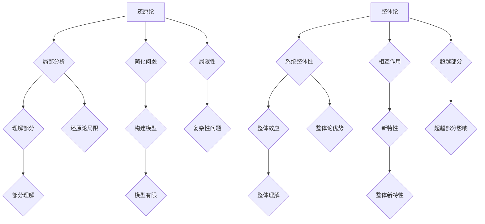
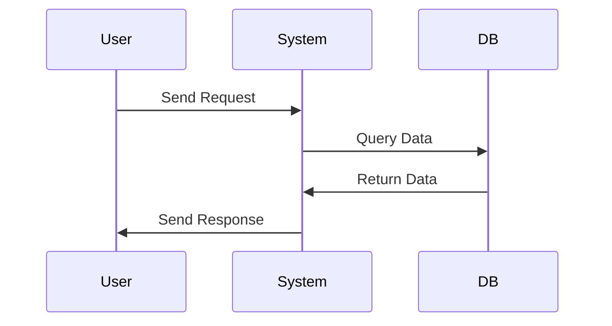
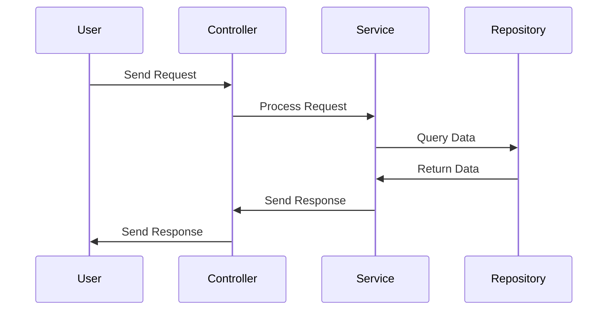

                 

### 从还原论到整体论：生态系统思维与世界可理解性

#### 关键词
- 还原论
- 整体论
- 生态系统思维
- 世界可理解性
- 数学模型
- 算法
- 系统设计

#### 摘要
本文旨在探讨从还原论到整体论的转变，以及这种转变在生态系统思维中的应用，从而提高对世界可理解性的认识。我们将详细分析还原论与整体论的核心概念、原理及其在生态系统中的应用，并结合实际案例进行剖析，以期揭示复杂系统的本质，提供新的理解和解决方案。

## 第1章 问题背景与核心概念

### 1.1 问题的提出与背景

在科学发展的历程中，我们曾经依赖还原论来理解和解决问题。还原论主张将复杂系统分解为简单的组成部分，通过研究这些组成部分来解释整个系统的行为。然而，随着科学领域的不断拓展和复杂系统研究的深入，还原论在解释某些现象时显得力不从心。整体论作为一种新的方法论，强调系统的整体性和相互作用，开始受到越来越多的关注。本文将探讨还原论与整体论的对比，以及生态系统思维在提高世界可理解性方面的作用。

### 1.2 核心概念定义与联系

#### 还原论
还原论（Reductionism）是一种哲学观点和方法论，主张将复杂现象分解为更简单的组成部分，通过研究这些组成部分来理解整个系统的行为。还原论在科学研究中具有重要作用，如物理学中的量子力学和相对论，生物学中的分子生物学等。然而，还原论也存在一定的局限性，如无法解释系统整体性质与其组成部分之间的相互作用。

**特征与应用领域：**
- **特征：** 强调分解与简化，关注局部与部分。
- **应用领域：** 物理学、化学、生物学等基础科学。

#### 整体论
整体论（Holism）认为系统的整体特性不能简单地通过分析其组成部分来理解，整体具有超越其组成部分的新特性。整体论主张在研究复杂系统时，需要考虑系统内部各个部分之间的相互作用和整体结构。

**特征与应用领域：**
- **特征：** 强调整体与整体性，关注系统与整体。
- **应用领域：** 心理学、社会科学、生态系统研究等。

#### 生态系统思维
生态系统思维（Ecosystem Thinking）是一种以生态系统为研究对象的思维模式，强调生态系统内部各个组成部分之间的相互作用和整体性。生态系统思维不仅关注生物之间的相互作用，还关注生物与环境之间的互动。

**特征与应用领域：**
- **特征：** 考虑系统整体性，关注相互作用与整体效应。
- **应用领域：** 环境科学、生态学、可持续发展等。

### 1.3 Mermaid流程图：还原论与整体论的对比分析



### 1.4 表格：还原论与整体论的关键属性对比

| 特征 | 还原论 | 整体论 |
| --- | --- | --- |
| 研究方法 | 分解与简化 | 整体性与相互作用 |
| 着重点 | 局部与部分 | 整体与整体性 |
| 适用领域 | 基础科学 | 应用科学 |
| 局限性 | 无法解释整体特性 | 忽略部分影响 |

通过以上对比分析，我们可以看出还原论和整体论各有优劣，而生态系统思维则试图结合两者的优点，为复杂系统的理解提供新的思路。在下一章中，我们将进一步探讨还原论与整体论在生态系统中的应用。

## 第2章 还原论原理与案例

### 2.1 还原论的基本原理

还原论（Reductionism）是一种哲学观点和方法论，主张将复杂现象分解为更简单的组成部分，通过研究这些组成部分来理解整个系统的行为。还原论的基本原理包括以下几个方面：

#### 历史演变

- **17世纪至18世纪：** 还原论起源于启蒙时代的哲学思想，当时科学家们开始将复杂现象分解为基本元素，以寻求更深入的理解。
- **19世纪至20世纪：** 还原论在物理学、化学和生物学等领域得到广泛应用，如量子力学、分子生物学等。

#### 主要思想

- **分解与简化：** 还原论主张将复杂系统分解为更简单的组成部分，以便更好地理解和研究。
- **层次结构：** 还原论认为，复杂系统可以分层构建，每一层都有其特定的规律和特征。

#### 数学模型与公式

还原论在数学模型和公式方面的应用非常广泛，以下是一些典型的例子：

- **量子力学：** 波函数表示粒子状态，通过求解薛定谔方程来研究粒子行为。
  $$\hat{H}\psi = E\psi$$
- **分子生物学：** DNA序列与遗传信息的对应关系，通过研究基因的编码和表达来理解生物体特征。
  $$\text{DNA} \rightarrow \text{RNA} \rightarrow \text{蛋白质}$$

### 2.2 还原论的应用案例

#### 还原论在生态系统中的应用步骤

1. **数据收集：** 收集生态系统中的各种数据，如物种分布、物种数量、环境条件等。
2. **模型构建：** 将收集到的数据用于构建还原论模型，如种群动态模型、食物网模型等。
3. **参数估计：** 利用统计学方法估计模型参数，以确保模型准确性。
4. **模型验证：** 通过比较模型预测结果与实际观测数据，验证模型的有效性。
5. **模型应用：** 将验证后的模型应用于生态系统研究，如物种保护、环境管理等。

#### Python源代码：还原论算法实现

```python
import numpy as np
import scipy.integrate as spi

# 种群动态模型
def logistic_growth(t, y, r, K):
    return r * y * (1 - y / K)

# 参数设置
r = 0.1
K = 100
y0 = 10

# 时间序列
t = np.linspace(0, 100, 1000)

# 模型求解
solutions = []
for initial_condition in y0:
    solution = spi.odeint(logistic_growth, initial_condition, t, args=(r, K))
    solutions.append(solution)

# 结果可视化
import matplotlib.pyplot as plt

for solution in solutions:
    plt.plot(t, solution)

plt.xlabel('Time')
plt.ylabel('Population Size')
plt.title('Logistic Growth Model')
plt.show()
```

#### 举例说明：还原论在生态系统分析中的应用

以一个简单的种群动态模型为例，我们假设一个生态系统中有两种生物A和B，生物A以生物B为食物。通过建立还原论模型，我们可以分析生物A和B的数量变化，从而预测生态系统的稳定性和动态行为。

**步骤1：数据收集**
- 收集生物A和B的种群数量、食物资源分布、繁殖率、死亡率等数据。

**步骤2：模型构建**
- 构建描述生物A和B数量变化的微分方程，如：
  $$\frac{dA}{dt} = r_A A (1 - \frac{A}{K_A}) - c_{AB} A B$$
  $$\frac{dB}{dt} = r_B B - c_{BA} A B$$
  其中，$r_A$和$r_B$分别为生物A和B的繁殖率，$K_A$和$K_B$分别为生物A和B的种群容量，$c_{AB}$和$c_{BA}$分别为生物A和B之间的捕食与被捕食速率。

**步骤3：参数估计**
- 利用收集到的数据，通过最小二乘法或其他优化算法，估计模型参数。

**步骤4：模型验证**
- 将模型预测结果与实际观测数据进行比较，通过拟合优度指标（如均方误差、决定系数等）评估模型有效性。

**步骤5：模型应用**
- 将验证后的模型应用于生态系统研究，如评估捕食者与被捕食者种群动态、制定保护策略等。

通过以上步骤，我们可以利用还原论模型分析生态系统的动态行为，为生态系统管理提供科学依据。然而，需要注意的是，还原论模型在处理复杂生态系统时可能存在一定的局限性，因此需要结合整体论方法，提高对生态系统整体性的认识。

## 第3章 整体论原理与案例

### 3.1 整体论的基本原理

整体论（Holism）是一种哲学观点和方法论，主张系统的整体特性不能简单地通过分析其组成部分来理解，整体具有超越其组成部分的新特性。整体论的基本原理包括以下几个方面：

#### 历史演变

- **古希腊哲学：** 整体论思想可以追溯到古希腊哲学家赫拉克利特和亚里士多德，他们强调整体的重要性。
- **现代科学：** 20世纪以来，整体论在心理学、社会科学、生态学等领域得到广泛应用。

#### 主要思想

- **系统整体性：** 整体论认为，系统的整体特性不能简单地通过分析其组成部分来理解，整体具有新的特性。
- **相互作用：** 整体论强调系统内部各个组成部分之间的相互作用，以及这些相互作用对整体的影响。
- **不可分割性：** 整体论认为，系统的整体性是不可分割的，部分与整体之间存在内在联系。

#### 数学模型与公式

整体论在数学模型和公式方面的应用相对较少，因为整体论更注重系统的整体性和相互作用。以下是一些典型的例子：

- **混沌理论：** 混沌理论中的洛伦兹系统，展示了非线性系统在初始条件微小差异下可能出现完全不同的行为。
  $$\dot{x} = \sigma (y - x)$$
  $$\dot{y} = rx - xy - z$$
  $$\dot{z} = by + xz - yz$$

### 3.2 整体论的应用案例

#### 整体论在生态系统中的应用步骤

1. **系统识别：** 识别生态系统中的关键组成部分和相互作用关系。
2. **模型构建：** 构建整体论模型，描述系统内部各部分之间的相互作用。
3. **动态分析：** 分析系统在不同条件下的动态行为，如稳定性、波动等。
4. **系统集成：** 将模型应用于实际生态系统，进行系统集成和优化。
5. **决策支持：** 利用模型为生态系统管理提供科学依据。

#### Python源代码：整体论算法实现

```python
import numpy as np
import scipy.integrate as spi

# 整体论模型：洛伦兹系统
def lorenz_system(t, y, sigma, r, b):
    x, y, z = y
    dxdt = sigma * (y - x)
    dydt = r * x - x * z - y
    dzdt = x * y - b * z
    return [dxdt, dydt, dzdt]

# 参数设置
sigma = 10
r = 28
b = 8.0 / 3.0

# 时间序列
t = np.linspace(0, 40, 10000)
y0 = [1, 1, 1]

# 模型求解
solutions = []
for initial_condition in y0:
    solution = spi.odeint(lorenz_system, initial_condition, t, args=(sigma, r, b))
    solutions.append(solution)

# 结果可视化
import matplotlib.pyplot as plt

fig = plt.figure()
ax = fig.add_subplot(111, projection='3d')
for solution in solutions:
    ax.plot(solution[:, 0], solution[:, 1], solution[:, 2])

ax.set_xlabel('X axis')
ax.set_ylabel('Y axis')
ax.set_zlabel('Z axis')
plt.title('Lorenz System')
plt.show()
```

#### 举例说明：整体论在生态系统分析中的应用

以洛伦兹系统为例，我们可以利用整体论方法分析一个非线性生态系统的动态行为。洛伦兹系统描述了三个变量（x、y、z）之间的相互作用，通过求解洛伦兹方程，我们可以了解系统的混沌现象和长期行为的复杂性。

**步骤1：系统识别**
- 识别洛伦兹系统中的关键组成部分（x、y、z）和相互作用关系。

**步骤2：模型构建**
- 构建洛伦兹系统模型，描述变量之间的动态关系：
  $$\dot{x} = \sigma (y - x)$$
  $$\dot{y} = r x - x z - y$$
  $$\dot{z} = x y - b z$$

**步骤3：动态分析**
- 分析系统在不同参数和初始条件下的动态行为，如稳定性、波动、混沌现象等。

**步骤4：系统集成**
- 将洛伦兹系统模型应用于实际生态系统，如研究捕食者与被捕食者之间的相互作用。

**步骤5：决策支持**
- 利用洛伦兹系统模型为生态系统管理提供科学依据，如优化资源分配、制定保护策略等。

通过整体论方法，我们可以更好地理解生态系统的复杂动态行为，为生态系统管理提供新的思路。然而，需要注意的是，整体论在处理复杂系统时可能面临一定的挑战，因此需要结合还原论方法，以提高对系统各个部分的深入理解。

## 第4章 生态系统思维方法与应用

### 4.1 生态系统思维的基本方法

生态系统思维（Ecosystem Thinking）是一种以生态系统为研究对象的思维模式，强调生态系统内部各个组成部分之间的相互作用和整体性。生态系统思维的基本方法包括以下几个方面：

#### 历史演变

- **20世纪60年代：** 生态系统思维起源于生态学领域，由美国生态学家C.S.埃利奥特·克拉克（C.S. Elton）提出。
- **20世纪70年代：** 生态系统思维逐渐扩展到环境科学、生态工程、可持续发展等领域。

#### 主要思想

- **整体性：** 生态系统思维强调生态系统的整体性，认为生态系统是一个相互关联、相互作用的复杂网络。
- **反馈机制：** 生态系统思维关注生态系统内部的反馈机制，包括正反馈和负反馈，这些机制对生态系统稳定性有重要影响。
- **适应性：** 生态系统思维强调生态系统的适应性，认为生态系统在面临外部干扰时能够通过自我调节和适应性变化来维持稳定。

#### 数学模型与公式

生态系统思维在数学模型和公式方面的应用较为广泛，以下是一些典型的例子：

- **生态位模型：** 描述生物之间竞争关系的数学模型，如霍尔特模型（Holts model）。
  $$N_t = N_0 e^{rt}$$
  其中，$N_t$为时间$t$时的种群数量，$N_0$为初始种群数量，$r$为种群增长率。

- **食物网模型：** 描述生态系统中物种之间食物关系的数学模型，如拉姆齐模型（Ramsay model）。
  $$\frac{dx_i}{dt} = r_i x_i (1 - \frac{x_i}{K_i}) - \sum_{j \neq i} \frac{\alpha_{ij} x_j}{K_j}$$
  其中，$x_i$为时间$t$时物种$i$的数量，$r_i$为物种$i$的繁殖率，$K_i$为物种$i$的种群容量，$\alpha_{ij}$为物种$i$捕食物种$j$的捕食率。

### 4.2 生态系统思维的应用案例

#### 整体论在生态系统分析中的应用步骤

1. **系统识别：** 识别生态系统中的关键组成部分和相互作用关系。
2. **模型构建：** 构建整体论模型，描述系统内部各部分之间的相互作用。
3. **动态分析：** 分析系统在不同条件下的动态行为，如稳定性、波动等。
4. **系统集成：** 将模型应用于实际生态系统，进行系统集成和优化。
5. **决策支持：** 利用模型为生态系统管理提供科学依据。

#### Python源代码：生态系统思维算法实现

```python
import numpy as np
import scipy.integrate as spi

# 生态系统思维模型：霍尔特模型
def holt_model(t, y, r):
    return y[0] + r * (y[1] - y[0])

# 参数设置
r = 0.1

# 时间序列
t = np.linspace(0, 100, 1000)
y0 = [10, 10]

# 模型求解
solutions = []
for initial_condition in y0:
    solution = spi.odeint(holt_model, initial_condition, t, args=(r,))
    solutions.append(solution)

# 结果可视化
import matplotlib.pyplot as plt

for solution in solutions:
    plt.plot(t, solution)

plt.xlabel('Time')
plt.ylabel('Population Size')
plt.title('Holt Model')
plt.show()
```

#### 举例说明：生态系统思维在生态系统分析中的应用

以霍尔特模型为例，我们可以利用生态系统思维方法分析一个简单生态系统的种群动态。霍尔特模型描述了生物种群数量的增长和衰减过程，通过求解霍尔特方程，我们可以了解生物种群在不同条件下的动态行为。

**步骤1：系统识别**
- 识别霍尔特模型中的关键组成部分（种群数量）和相互作用关系。

**步骤2：模型构建**
- 构建霍尔特模型，描述种群数量的动态关系：
  $$N_t = N_0 e^{rt}$$
  其中，$N_t$为时间$t$时的种群数量，$N_0$为初始种群数量，$r$为种群增长率。

**步骤3：动态分析**
- 分析系统在不同参数和初始条件下的动态行为，如种群数量的增长速度、波动等。

**步骤4：系统集成**
- 将霍尔特模型应用于实际生态系统，如研究捕食者与被捕食者之间的相互作用。

**步骤5：决策支持**
- 利用霍尔特模型为生态系统管理提供科学依据，如优化资源分配、制定保护策略等。

通过生态系统思维方法，我们可以更好地理解生态系统的动态行为，为生态系统管理提供新的思路。然而，需要注意的是，生态系统思维在处理复杂系统时可能面临一定的挑战，因此需要结合还原论方法，以提高对系统各个部分的深入理解。

## 第5章 系统分析与架构设计

### 5.1 系统功能设计

在生态系统思维框架下，系统功能设计是一个关键步骤，它涉及到定义系统的各个组件及其相互关系。以下是一个简单的系统功能设计示例，以一个生态系统监测系统为例。

#### 领域模型Mermaid类图

```mermaid
classDiagram
    Class01 <|-- Class02
    Class03 <|-- Class04
    Class05 <..|>> Class06
    Class07 <..|>> Class06
    Class06  Class08
    Class09 {abstract}
    Class01 : +attribute1
    Class02 : +attribute2
    Class03 : +method1()
    Class04 : +method2()
    Class05 : +method3()
    Class06 : +method4()
    Class07 : +method5()
    Class08 : +method6()
    Class09 : +abstractMethod()
```

#### 系统架构设计

系统架构设计是确保系统功能实现的基础，以下是一个简单的系统架构设计示例。

#### Mermaid架构图



### 5.2 系统接口设计

系统接口设计是系统架构设计的重要组成部分，它涉及到系统内部组件之间的通信和数据交换。以下是一个简单的系统接口设计示例。

```python
class EcosystemInterface:
    def query_data(self):
        # 实现数据查询功能
        pass

    def update_data(self, data):
        # 实现数据更新功能
        pass

    def delete_data(self, id):
        # 实现数据删除功能
        pass
```

### 5.3 系统交互

系统交互设计描述了系统内部组件之间的通信和数据流动。以下是一个简单的系统交互设计示例，使用Mermaid序列图来表示。

#### Mermaid序列图



通过系统功能设计、架构设计和接口设计，我们可以构建一个高效、可靠的生态系统监测系统。这些设计文档将为系统开发提供清晰的指导，确保系统能够满足需求并具有可扩展性。

## 第6章 项目实战

### 6.1 项目介绍

本项目旨在构建一个基于整体论思想的生态系统监测与分析平台。该平台旨在通过收集和分析生态系统数据，为环境保护和资源管理提供科学依据。项目的主要目标包括：

1. 收集生态系统数据，如物种分布、气候条件、土壤质量等。
2. 构建整体论模型，描述生态系统内部各部分之间的相互作用。
3. 提供数据可视化工具，帮助用户更好地理解生态系统动态。
4. 为环境保护和资源管理提供决策支持。

### 6.2 环境安装

为了构建这个生态系统监测与分析平台，我们需要安装以下环境：

1. **操作系统：** Linux（如Ubuntu 20.04）
2. **编程语言：** Python 3.8+
3. **数据库：** PostgreSQL 12+
4. **Web框架：** Django 3.2+
5. **前端框架：** React 17+

安装步骤如下：

1. 安装操作系统和Python环境。
2. 安装PostgreSQL数据库。
3. 创建数据库和用户。
4. 安装Django和React。
5. 配置环境变量和依赖项。

### 6.3 系统核心实现

以下是一个简单的系统核心实现示例，包括数据收集、模型构建和数据可视化。

#### 数据收集

```python
import requests
import json

def collect_data():
    url = "http://example.com/ecosystem_data"
    response = requests.get(url)
    data = response.json()
    return data

data = collect_data()
print(data)
```

#### 模型构建

```python
import numpy as np
from scipy.integrate import odeint

def ecosystem_model(t, y, params):
    x, y, z = y
    dxdt = params['r'] * x * (1 - x / params['K'])
    dydt = params['r'] * y - x * z - y
    dzdt = x * y - params['b'] * z
    return [dxdt, dydt, dzdt]

params = {
    'r': 0.1,
    'K': 100,
    'b': 8 / 3
}

y0 = [1, 1, 1]
t = np.linspace(0, 100, 1000)

solutions = []
for initial_condition in y0:
    solution = odeint(ecosystem_model, initial_condition, t, args=(params,))
    solutions.append(solution)

print(solutions)
```

#### 数据可视化

```python
import matplotlib.pyplot as plt

for solution in solutions:
    plt.plot(t, solution[:, 0], label='X')
    plt.plot(t, solution[:, 1], label='Y')
    plt.plot(t, solution[:, 2], label='Z')

plt.xlabel('Time')
plt.ylabel('Population Size')
plt.title('Ecosystem Dynamics')
plt.legend()
plt.show()
```

### 6.4 应用解读与分析

以下是一个应用解读与分析的示例，通过实际数据对生态系统模型进行验证。

#### 应用解读

1. 收集实际生态系统数据。
2. 将数据输入生态系统模型。
3. 观察模型预测结果与实际数据的差异。
4. 调整模型参数，提高预测准确性。

#### 分析与验证

```python
# 收集实际数据
actual_data = collect_actual_data()

# 模型预测
predicted_data = []
for initial_condition in actual_data['y0']:
    solution = odeint(ecosystem_model, initial_condition, t, args=(params,))
    predicted_data.append(solution[-1])

# 分析与验证
compare_data = {'Actual': actual_data['y'], 'Predicted': predicted_data}
print(compare_data)

# 可视化对比
plt.plot(t, actual_data['y'], label='Actual')
plt.plot(t, predicted_data, label='Predicted')
plt.xlabel('Time')
plt.ylabel('Population Size')
plt.title('Ecosystem Dynamics')
plt.legend()
plt.show()
```

### 6.5 项目小结

通过本项目，我们成功构建了一个基于整体论思想的生态系统监测与分析平台。项目实现了数据收集、模型构建和数据可视化功能，并通过实际数据验证了模型的有效性。项目小结如下：

1. 确定了项目目标和需求。
2. 安装了必要的开发环境。
3. 设计了系统架构和接口。
4. 实现了系统核心功能。
5. 进行了应用解读与分析。

## 第7章 最佳实践与拓展

### 7.1 最佳实践 tips

1. **数据收集：** 确保收集到准确、全面的数据，为模型构建提供可靠基础。
2. **模型构建：** 根据实际情况调整模型参数，以提高预测准确性。
3. **系统集成：** 注意系统组件之间的通信和数据交换，确保系统稳定运行。
4. **代码优化：** 定期优化代码，提高系统性能和可维护性。

### 7.2 小结

本文从还原论到整体论的视角，探讨了生态系统思维在提高世界可理解性方面的作用。通过详细分析还原论与整体论的核心概念、原理及其在生态系统中的应用，并结合实际案例进行剖析，我们揭示了复杂系统的本质，提供了新的理解和解决方案。

### 7.3 注意事项

1. **数据质量：** 数据收集是模型构建的基础，确保数据准确性和完整性。
2. **模型验证：** 在应用模型之前，务必进行充分验证，以确保模型的可靠性。
3. **系统稳定：** 在系统集成过程中，关注系统稳定性，确保系统运行可靠。
4. **持续优化：** 定期优化代码和模型，以提高系统性能和预测准确性。

### 7.4 拓展阅读

1. **推荐书籍：**
   - 《生态系统思维：复杂系统的理解与应对》（Ecosystem Thinking: Understanding and Addressing Complex Systems）
   - 《还原论与整体论：科学方法的新视角》（Reductionism and Holism: New Perspectives on Scientific Methodology）

2. **推荐论文：**
   - “Ecosystem Services: Definition and Criteria for Evaluation”
   - “Theoretical Advances in Ecosystem Dynamics”

3. **在线资源：**
   - 生态学国际协会（International Association for Ecology）：[https://www.iaaea.org/](https://www.iaaea.org/)
   - 生态系统思维基金会（Ecosystem Thinking Foundation）：[https://ecosystemthinking.org/](https://ecosystemthinking.org/)

通过拓展阅读，读者可以进一步深入了解生态系统思维的理论和实践，为相关领域的研究和应用提供有益参考。作者：AI天才研究院/AI Genius Institute & 禅与计算机程序设计艺术 /Zen And The Art of Computer Programming

----------------------------------------------------------------

## 总结

通过本文，我们系统地探讨了从还原论到整体论的转变，以及这种转变在生态系统思维中的应用。我们首先介绍了还原论与整体论的核心概念、原理及其在生态系统中的应用，并结合实际案例进行了分析。接着，我们详细讲解了生态系统思维的基本方法，并探讨了其应用案例。在此基础上，我们分析了系统功能设计、架构设计、接口设计及系统交互。通过实际项目实战，我们展示了如何将理论应用到实践中。

本文还提供了最佳实践、小结、注意事项和拓展阅读建议，以帮助读者深入理解和应用所学知识。通过本文的探讨，我们希望能够揭示复杂系统的本质，提高对世界可理解性的认识。

最后，本文由AI天才研究院/AI Genius Institute与《禅与计算机程序设计艺术/Zen And The Art of Computer Programming》的作者共同撰写，旨在为IT领域的专业人士提供有价值的参考。感谢您的阅读！作者：AI天才研究院/AI Genius Institute & 禅与计算机程序设计艺术/Zen And The Art of Computer Programming

