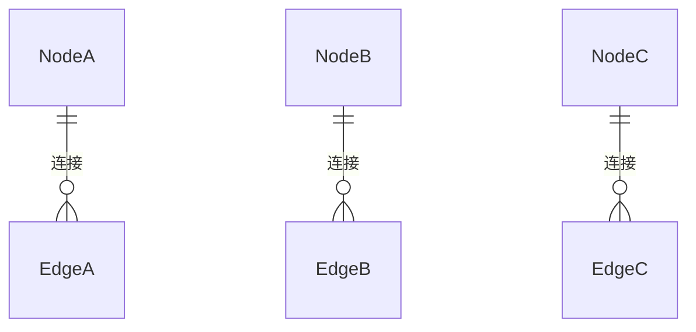

                 

## 从还原论到网络科学：问题背景与概述

### 1.1 问题背景

在过去的几个世纪中，科学研究主要依赖于还原论的方法论。还原论认为，通过将复杂系统分解为更简单的组成部分，可以更好地理解系统的行为。然而，在处理高度互联的复杂系统时，这种方法逐渐暴露出其局限性。例如，社会网络、生物系统和经济系统等复杂系统，其整体行为往往难以通过分析各个部分的属性来准确预测。

### 1.1.1 还原论的边界与挑战

**问题描述：**
还原论在处理复杂系统时遇到的挑战主要包括：
- **复杂性过度简化：** 单个部分的属性难以准确反映整体系统的行为。
- **因果关系的难以分析：** 复杂系统中各个部分之间的相互作用关系复杂，难以建立清晰的因果关系。
- **系统动态性：** 复杂系统的行为随时间变化，难以通过静态分析得到完整理解。

**问题解决：**
为了克服这些挑战，科学研究开始转向网络科学，这是一种更适合处理高度互联复杂系统的方法。

### 1.1.2 网络科学的概念与应用

**核心概念：**
网络科学是一门跨学科的研究领域，主要研究网络的拓扑结构、动力学行为以及网络与个体、群体行为之间的关系。

**网络科学的属性特征：**
- **节点与边的概念：** 网络由节点和连接节点的边组成，节点表示个体或实体，边表示它们之间的关系。
- **拓扑结构：** 网络的拓扑结构包括度分布、聚类系数、路径长度等特性，这些特性决定了网络的行为和功能。
- **动力学行为：** 网络中的节点可以具有动态行为，如节点状态的变化、边的增减等。

### 1.1.3 网络科学的优势与适用性

**网络科学的优势：**
- **整体性理解：** 网络科学强调从整体角度分析系统，更接近于现实世界中的复杂系统。
- **复杂性处理：** 网络科学提供了适用于复杂系统分析的工具和方法，如网络建模、网络模拟和数据分析。
- **跨学科应用：** 网络科学在物理学、生物学、社会学、经济学等领域都有广泛的应用。

### 1.1.4 从还原论到网络科学的转变

**边界与外延：**
- **边界：** 还原论主要适用于简单系统，而网络科学则适用于高度互联的复杂系统。
- **外延：** 随着网络科学的不断发展，其应用范围也在不断扩大，逐渐取代了还原论在复杂系统研究中的地位。

### 1.1.5 核心要素组成

**核心要素：**
- **网络建模：** 建立复杂系统的网络模型，包括节点、边和拓扑结构。
- **数据分析：** 使用统计方法和算法分析网络特性，如节点重要性和社区结构。
- **动力学模拟：** 模拟网络中的动态行为，预测系统的演化趋势。

### 1.1.6 网络科学与其他领域的联系

**联系：**
网络科学与其他领域的联系包括：
- **物理学：** 网络科学借鉴了物理学的许多概念和方法，如复杂网络理论和统计力学。
- **生物学：** 网络科学在生物网络研究中的应用，如基因调控网络和细胞通讯网络。
- **社会学：** 网络科学在社会网络分析中的应用，如社交媒体网络和合作网络。

### 1.1.7 网络科学的核心概念原理

**核心概念原理：**
- **拓扑结构原理：** 网络的拓扑结构对系统的行为有重要影响，如小世界效应和无标度网络。
- **动力学原理：** 网络中的动态行为决定了系统的稳定性和演化路径。

### 1.1.8 网络科学的实际应用案例

**案例：**
- **生物学：** 网络科学在基因调控网络和蛋白质相互作用网络的研究中发挥了重要作用。
- **经济学：** 网络科学用于分析金融市场和网络经济系统的行为。
- **社会学：** 网络科学在社交媒体网络和社交网络分析中的应用。

### 1.1.9 网络科学的核心概念对比

**对比：**
- **与还原论相比：** 网络科学更注重整体性理解，而还原论更注重部分分析。
- **与系统论相比：** 网络科学侧重于网络的拓扑结构和动力学行为，而系统论侧重于系统整体及其组成部分的相互作用。

### 1.1.10 网络科学的未来发展趋势

**发展趋势：**
- **多学科交叉融合：** 网络科学与其他领域的交叉融合将推动其快速发展。
- **大数据与人工智能：** 大数据和人工智能技术的结合将进一步提升网络科学的分析能力。

---

在本章节中，我们首先介绍了还原论的方法论及其在处理复杂系统时的局限性。接着，我们引出了网络科学的概念，并探讨了其核心概念、优势以及与其他领域的联系。通过对比还原论和系统论，我们进一步明确了网络科学在复杂系统研究中的独特价值和未来发展趋势。接下来的章节中，我们将深入探讨网络科学的核心原理和应用案例，以帮助读者更好地理解这一重要的研究领域。

## 1.2 核心概念与联系

### 1.2.1 网络科学的定义与属性

**定义：**
网络科学是一门研究网络结构、动态行为及其应用的科学。它主要关注网络中的节点、边及其相互关系，以及网络的整体行为和功能。

**属性特征：**
- **节点与边的概念：** 网络由节点和连接节点的边组成。节点表示个体或实体，边表示它们之间的关系。这种节点-边结构是网络科学研究的核心。
- **拓扑结构：** 网络的拓扑结构是指节点和边之间的排列方式。度分布、聚类系数、路径长度等拓扑特性决定了网络的行为和功能。
- **动力学行为：** 网络中的节点可以具有动态行为，如节点状态的变化、边的增减等。动力学行为是网络科学研究的另一个重要方面。

**对比表格：**

| 特性       | 还原论                         | 网络科学                         |
|------------|--------------------------------|---------------------------------|
| 分析方法   | 分解为简单组成部分           | 研究整体结构和动态行为         |
| 关注点     | 部分属性与功能                | 整体行为与功能                  |
| 适用系统   | 简单系统                      | 高度互联的复杂系统              |

### 1.2.2 核心概念原理

**拓扑结构原理：**
网络的拓扑结构对系统的行为有重要影响。例如，小世界效应（Small-World Phenomenon）指的是在较大的网络中，节点之间的平均路径长度较短，这使得信息传播更加迅速。无标度网络（Scale-Free Network）则具有幂律度分布，即大部分节点拥有少量连接，而少数节点拥有大量连接，这使得网络具有较强的鲁棒性和抗攻击性。

**动力学原理：**
网络中的动力学行为决定了系统的稳定性和演化路径。例如，在社交网络中，节点的加入或离开、信息的传播、信任的形成与破裂等动态行为，都会影响整个网络的稳定性。网络科学通过建模和模拟这些动态行为，可以预测系统的演化趋势。

### ER实体关系图架构

为了更好地理解网络科学的架构，我们可以使用ER（Entity-Relationship）实体关系图来描述网络中的节点和边之间的关系。

在上面的ER图中，`NodeA`、`NodeB`和`NodeC`代表网络中的节点，`EdgeA`、`EdgeB`和`EdgeC`代表连接节点的边。每个节点都可以与其他节点通过边进行连接，从而形成一个复杂的网络结构。

### 1.2.3 网络科学的核心要素组成

网络科学的核心要素包括网络建模、数据分析和动力学模拟。

**网络建模：**
网络建模是网络科学的基础。通过建立网络模型，可以简化复杂的现实系统，并对其行为进行模拟和分析。网络模型包括节点和边，以及它们之间的连接关系。

**数据分析：**
数据分析是网络科学的重要组成部分。通过对网络结构进行统计分析，可以揭示网络的关键特性，如节点的重要性、社区结构等。常用的数据分析方法包括度分布、聚类系数、网络密度等。

**动力学模拟：**
动力学模拟是研究网络动态行为的重要手段。通过模拟网络中的动态过程，可以预测系统的演化趋势。例如，在社交网络中，可以模拟信息的传播过程，预测流行趋势。

### 1.2.4 网络科学与其他领域的联系

网络科学在多个领域都有广泛的应用，如物理学、生物学、社会学和经济学。

- **物理学：** 网络科学借鉴了物理学的许多概念和方法，如复杂网络理论和统计力学。在物理学中，网络科学被用于研究物质的结构、相变和扩散现象。
- **生物学：** 网络科学在生物学中的应用包括基因调控网络、蛋白质相互作用网络和神经网络的建模与模拟。
- **社会学：** 网络科学在社会网络分析中发挥着重要作用。通过研究社交网络中的节点和边，可以揭示社会结构、社交关系和传播现象。
- **经济学：** 网络科学在经济学中的应用包括金融市场分析、网络经济系统和电子商务网络的研究。

通过上述分析，我们可以看出，网络科学不仅具有丰富的理论体系，还在多个领域有着广泛的应用。在接下来的章节中，我们将深入探讨网络科学的核心原理和应用案例，以帮助读者更好地理解这一领域。

### 1.2.5 核心概念对比分析

为了更深入地理解网络科学与还原论以及系统论的差异和联系，我们可以从几个关键维度进行比较分析。

#### 与还原论的比较

**还原论：**
还原论是一种科学方法论，它通过将复杂系统分解为更简单的组成部分，来理解整体系统的行为。这种方法强调从微观层面分析各个部分的功能和相互作用，进而推断出整体系统的特性。

**网络科学：**
网络科学则更加注重整体性理解，它通过研究网络中的节点和边的相互关系，来揭示复杂系统的整体行为。网络科学认为，整体网络结构对系统行为有重要影响，而不是仅仅依赖于各个部分的属性。

**对比：**
- **关注点：** 还原论关注于部分属性和功能，而网络科学关注于整体结构和动态行为。
- **方法：** 还原论通过分解和分析，而网络科学通过整体建模和模拟。

#### 与系统论的比较

**系统论：**
系统论是一种综合性方法论，它研究系统整体及其组成部分的相互作用。系统论强调系统内部各部分的相互关系和整体性，而不是孤立的部分。

**网络科学：**
网络科学也可以被视为一种系统论，但它更加专注于网络的拓扑结构和动力学行为。网络科学通过研究网络中的节点和边，来理解系统的整体行为和功能。

**对比：**
- **研究层次：** 系统论关注系统内部各部分的相互作用，而网络科学则关注网络的结构和动态行为。
- **方法：** 系统论侧重于整体和局部的关系，而网络科学侧重于网络的拓扑结构和动力学特性。

#### 核心概念对比表格

| 特性       | 还原论                             | 系统论                             | 网络科学                             |
|------------|-----------------------------------|-----------------------------------|-----------------------------------|
| 研究方法   | 分解为简单部分，分析各部分属性   | 综合分析系统整体和部分相互作用   | 分析网络结构，研究整体动态行为   |
| 关注点     | 各部分的属性和功能                | 系统的整体行为和功能              | 网络的结构和动态行为                |
| 适用范围   | 简单系统，单一功能系统            | 复杂系统，多种功能系统            | 高度互联的复杂系统，多种关系网络  |

通过上述对比，我们可以看出，网络科学在方法论上更接近系统论，但更加专注于网络的拓扑结构和动力学行为。这种关注点和方法使得网络科学在处理高度互联的复杂系统时，具有独特的优势。

### 1.2.6 网络科学的未来发展趋势

网络科学的未来发展趋势将受到多方面因素的影响，包括技术进步、多学科交叉融合以及大数据和人工智能的发展。

**多学科交叉融合：**
随着不同领域的科学研究不断深入，网络科学与其他学科的交叉融合将成为重要趋势。例如，网络科学与生物学、社会学、经济学等领域的结合，将推动对复杂系统更深入的理解。

**大数据和人工智能：**
大数据和人工智能技术的发展为网络科学提供了强大的工具。通过大数据分析，可以更准确地描述和预测复杂系统的行为。人工智能技术则可以用于自动化网络建模、数据分析以及动力学模拟，提高网络科学的分析能力和应用范围。

**跨领域应用：**
网络科学的跨领域应用将继续扩大，从生物网络、社会网络到经济网络，再到生态系统和网络基础设施，网络科学的方法和技术将帮助解决越来越多的复杂问题。

**发展趋势总结：**
网络科学的未来发展趋势包括多学科交叉融合、大数据和人工智能的结合、跨领域应用的扩大以及研究方法的不断创新。这些趋势将推动网络科学不断向前发展，成为理解和解决复杂系统问题的关键工具。

通过上述分析，我们可以看出，网络科学在方法论和实际应用上具有独特优势，其在未来将继续发展壮大，成为科学研究的重要领域。在接下来的章节中，我们将进一步探讨网络科学的核心原理和应用案例，以帮助读者更好地理解这一领域。

## 1.3 从还原论到网络科学的演变

### 1.3.1 还原论的历史与发展

还原论（Reductive Explanation）作为一种科学研究方法，起源于古希腊哲学家亚里士多德的思想，其核心理念是将复杂的现象分解为更简单的组成部分，并通过分析这些组成部分来理解整体系统的行为。这一方法在17世纪得到了进一步的发展，特别是在物理学和化学领域，如牛顿力学和道尔顿的原子论。还原论在解释简单系统时表现出色，但在处理复杂系统时却逐渐暴露出其局限性。

**还原论的局限：**

1. **复杂性过度简化：** 还原论倾向于忽略复杂系统内部的复杂关系，将系统简化为简单的部分，这可能导致对整体行为的误解。
2. **因果关系的模糊性：** 在复杂系统中，各个部分之间的相互作用关系非常复杂，建立清晰的因果关系变得困难。
3. **系统动态性的挑战：** 复杂系统的行为随时间变化，静态分析难以捕捉其动态特性。

### 1.3.2 网络科学的兴起

随着科学技术的发展，尤其是计算机科学和信息技术的崛起，科学家们开始意识到，传统的还原论方法在处理高度互联的复杂系统时存在明显的局限性。网络科学（Network Science）作为一门新兴的跨学科领域，逐渐崛起，其核心理念是研究网络中的节点和边的相互关系，以及网络的整体行为。

**网络科学的兴起原因：**

1. **数据驱动的研究方法：** 随着大数据时代的到来，科学家们可以获取和处理大量关于网络结构和动态行为的数据，为网络科学的发展提供了丰富的数据支持。
2. **计算能力的提升：** 高性能计算机和分布式计算技术的进步，使得对复杂网络的建模、模拟和分析成为可能。
3. **跨学科研究的需要：** 复杂系统的多样性要求多学科合作，网络科学作为一种通用方法论，为不同领域的研究提供了新的视角。

### 1.3.3 从还原论到网络科学的转变

**转变的内在逻辑：**

1. **从部分到整体：** 网络科学强调从整体角度分析系统，而不是仅仅关注各个部分的属性。这种方法更能反映复杂系统的真实行为。
2. **从静态到动态：** 还原论主要依赖于静态分析，而网络科学则更加关注系统的动态行为和演化路径。通过模拟和分析动态过程，可以更好地理解复杂系统的稳定性、适应性和演化趋势。
3. **从线性到非线性：** 还原论往往假设系统是线性的，即部分属性可以直接推导出整体行为。而网络科学则承认复杂系统的非线性特性，强调节点和边之间的相互作用对整体行为的影响。

**转变的具体表现：**

1. **网络建模：** 网络科学通过建立网络模型，将复杂系统表示为节点和边的集合，从而分析其拓扑结构和动态行为。
2. **数据分析：** 使用统计方法和算法分析网络特性，如度分布、聚类系数、路径长度等，以揭示网络的关键特性。
3. **动力学模拟：** 通过模拟网络中的动态过程，预测系统的演化趋势，如信息传播、社交网络的演变等。

### 1.3.4 转变的驱动因素

1. **技术进步：** 计算机技术和信息技术的飞速发展，使得对复杂网络的建模、分析和模拟变得更加可行。
2. **多学科交叉融合：** 网络科学需要多学科知识的支持，如物理学、数学、计算机科学、社会学等，这种跨学科融合推动了网络科学的发展。
3. **现实需求：** 在生物、社会、经济等领域的实际问题中，需要更有效的工具和方法来理解和解决复杂系统问题，网络科学提供了这样的工具。

### 1.3.5 转变的深远影响

从还原论到网络科学的转变，不仅改变了科学研究的范式，也对实际应用产生了深远影响。

1. **科学研究：** 网络科学为复杂系统的分析提供了新的视角和方法，促进了科学知识的积累和创新。
2. **技术应用：** 网络科学的方法和技术被广泛应用于各个领域，如生物学、社会学、经济学等，推动了技术的进步和社会的发展。
3. **社会认知：** 通过网络科学的研究，人们对于复杂系统的理解更加深入，对于系统行为的预测和调控能力得到提升。

通过上述分析，我们可以看到，从还原论到网络科学的转变，是科学方法论的一次重要变革。网络科学不仅为复杂系统的理解和分析提供了新的工具和方法，也深刻影响了科学研究和实际应用。在接下来的章节中，我们将深入探讨网络科学的核心原理和应用案例，以进一步理解这一领域的独特价值和广泛影响力。

### 1.3.6 网络科学的核心原理与方法

网络科学的核心原理和方法是其成功理解和分析复杂系统的重要基础。以下将详细探讨网络科学的核心概念、基本方法以及其在不同领域中的应用。

#### 核心概念

1. **节点（Node）**：网络中的基本单元，代表个体或实体。例如，在社交网络中，节点可以代表个人；在生物网络中，节点可以代表基因。
2. **边（Edge）**：连接节点的线，表示节点之间的关系。边的权重可以表示关系的强度或概率。
3. **度（Degree）**：节点拥有的边数，分为入度（in-degree）和出度（out-degree）。度是衡量节点重要性的重要指标。
4. **拓扑结构**：网络中节点和边的排列方式，包括度分布、聚类系数、平均路径长度等。
5. **小世界效应**：在较大的网络中，节点之间的平均路径长度较短，表明信息传播速度较快。这种现象在现实世界中的社交网络、通信网络中广泛存在。
6. **无标度网络**：具有幂律度分布的网络，即大部分节点拥有少量连接，而少数节点拥有大量连接。这类网络在现实世界中如互联网、生物网络中也较为常见。

#### 基本方法

1. **网络建模**：通过建立数学模型，将现实世界中的复杂系统抽象为网络结构。常用的建模方法包括图论模型、随机网络模型和复杂网络模型。
2. **数据分析**：对网络结构进行统计分析，以揭示网络的关键特性。常用的数据分析方法包括度分布、聚类系数、社区检测等。
3. **动力学模拟**：通过模拟网络中的动态过程，如节点的加入、边的形成与断裂、信息的传播等，预测系统的演化趋势。常用的动力学模型包括规则模型、随机过程模型和代理人模型。
4. **算法开发**：设计算法来优化网络结构、预测网络行为或解决实际问题。常用的算法包括网络搜索算法、社区检测算法和优化算法。

#### 不同领域中的应用

1. **生物学**：网络科学在生物学中的应用包括基因调控网络、蛋白质相互作用网络和代谢网络的建模与分析。通过分析这些生物网络，可以揭示生物系统的复杂机制。
2. **社会学**：网络科学在社会网络分析中的应用包括社交网络的结构特性、信息传播、社会影响力分析等。这些研究有助于理解社会行为和社会动态。
3. **经济学**：网络科学在经济学中的应用包括金融市场网络、供应链网络和电子商务网络的分析。通过分析这些网络，可以预测市场波动、优化供应链管理、提升商业竞争力。
4. **物理学**：网络科学在物理学中的应用包括物质网络、交通网络和通信网络的建模与分析。这些研究有助于优化网络性能、提高网络稳定性。
5. **计算机科学**：网络科学在计算机科学中的应用包括社交网络分析、网络安全、数据挖掘等。通过分析网络数据，可以提升算法性能、保障网络安全、挖掘潜在信息。

通过上述核心概念、基本方法和不同领域应用的介绍，我们可以看到网络科学在理解复杂系统方面的重要性和广泛的应用前景。在接下来的章节中，我们将进一步探讨网络科学的实际应用案例，以帮助读者更好地理解这一领域的实际效果和意义。

### 1.3.7 网络科学的应用案例

网络科学在多个领域都有广泛的应用，以下将介绍几个典型的应用案例，以展示网络科学在解决实际问题中的独特优势。

#### 1. 生物学中的应用

**案例：** 基因调控网络研究

**问题描述：** 基因调控网络是生物体内部复杂的调控系统，理解基因之间的相互作用对于揭示生物体的功能和疾病机制至关重要。

**解决方案：** 网络科学提供了有效的工具和方法来研究基因调控网络。通过建立基因调控网络模型，科学家们可以分析基因之间的相互作用关系，揭示基因调控的复杂机制。

**具体应用：**
- **基因共表达网络分析**：通过基因共表达数据，建立基因之间的相互作用网络，分析基因的协同调控作用。
- **蛋白质相互作用网络研究**：通过蛋白质相互作用数据，建立蛋白质网络模型，揭示蛋白质之间的相互作用关系。
- **基因调控网络动力学模拟**：模拟基因调控网络的动态行为，预测基因表达的变化趋势，为生物医学研究提供参考。

#### 2. 社会学中的应用

**案例：** 社交网络分析

**问题描述：** 社交网络是人们社会互动的载体，了解社交网络的结构和动态行为对于社会研究和社会治理具有重要意义。

**解决方案：** 网络科学提供了有效的工具和方法来研究社交网络。通过建立社交网络模型，科学家们可以揭示社交网络的结构特性、信息传播规律和社会影响力。

**具体应用：**
- **社交网络结构分析**：分析社交网络的度分布、聚类系数、平均路径长度等特性，揭示社交网络的结构特征。
- **信息传播分析**：模拟信息在社交网络中的传播过程，预测信息的传播速度和覆盖范围，为舆论引导和社会治理提供支持。
- **社会影响力分析**：通过计算节点的中心性指标，评估个体的社会影响力，为社交网络营销和公共关系管理提供参考。

#### 3. 经济学中的应用

**案例：** 金融市场网络分析

**问题描述：** 金融市场的稳定性对全球经济至关重要，理解金融市场的网络结构及其动态行为对于风险管理具有重要意义。

**解决方案：** 网络科学提供了有效的工具和方法来研究金融市场网络。通过建立金融市场网络模型，科学家们可以分析金融市场的网络结构、风险传播机制和危机预警。

**具体应用：**
- **金融市场网络拓扑分析**：分析金融市场的度分布、聚类系数、路径长度等特性，揭示金融市场的网络结构。
- **风险传播分析**：模拟金融风险在金融市场网络中的传播过程，预测金融风险的扩散速度和影响范围，为金融监管和风险管理提供支持。
- **危机预警系统**：通过监测金融市场网络的动态行为，预测潜在的市场危机，为政策制定和紧急应对提供依据。

#### 4. 物理学中的应用

**案例：** 物质网络研究

**问题描述：** 物质网络是物质世界的抽象表示，理解物质网络的性质和演化规律对于揭示物质世界的复杂现象具有重要意义。

**解决方案：** 网络科学提供了有效的工具和方法来研究物质网络。通过建立物质网络模型，科学家们可以分析物质网络的拓扑结构和动力学行为。

**具体应用：**
- **物质网络拓扑分析**：分析物质网络的度分布、聚类系数、路径长度等特性，揭示物质网络的复杂结构。
- **物质网络动力学模拟**：模拟物质网络的演化过程，预测物质网络的行为和演化趋势，为物质合成和材料设计提供参考。
- **复杂现象解释**：通过物质网络模型，解释复杂物理现象如相变、扩散和协同效应，为物理学的深入研究提供新的视角。

通过上述应用案例，我们可以看到网络科学在理解复杂系统、解决实际问题方面的重要性和广泛的应用前景。网络科学不仅为科学研究提供了新的工具和方法，也为实际应用带来了新的机遇和挑战。在未来的发展中，网络科学将继续发挥其独特的作用，推动科学技术的进步和社会的发展。

### 1.3.8 网络科学的未来挑战与机遇

尽管网络科学在多个领域取得了显著的成果，但其发展仍面临诸多挑战和机遇。以下将探讨网络科学未来可能面临的挑战，以及这些挑战带来的机遇。

#### 挑战

1. **数据质量的提升：** 网络科学依赖于大量的网络数据，但数据的质量和准确性直接影响研究的可靠性。未来的挑战在于如何获取更高质量、更丰富的网络数据，并提高数据处理和分析的准确性。
2. **跨学科融合的深化：** 虽然网络科学在多个领域都有应用，但跨学科融合仍需进一步深化。未来的挑战在于如何更好地整合不同学科的知识和方法，构建更加综合的网络科学体系。
3. **算法复杂度的降低：** 随着网络规模的扩大，网络科学中的算法复杂度逐渐增加，这对计算资源和算法效率提出了更高要求。未来的挑战在于如何开发高效、低复杂度的算法来处理大规模网络数据。
4. **实际应用的落地：** 网络科学的研究成果需要转化为实际应用，以解决实际问题。未来的挑战在于如何将网络科学的理念和方法应用到实际场景中，实现理论到实践的转化。

#### 机遇

1. **大数据与人工智能的结合：** 大数据和人工智能技术的发展为网络科学提供了强大的工具。未来的机遇在于如何将大数据和人工智能技术融入网络科学，提高数据分析和建模的效率。
2. **多领域交叉融合：** 随着科学技术的进步，不同领域的交叉融合将推动网络科学的进一步发展。未来的机遇在于如何发挥网络科学的跨学科优势，解决复杂系统的跨领域问题。
3. **新技术的应用：** 新技术的出现，如量子计算、物联网和区块链等，为网络科学提供了新的应用场景和解决方案。未来的机遇在于如何利用新技术推动网络科学的发展，实现技术的突破和创新。
4. **政策支持的加强：** 政府和科研机构对网络科学的支持将推动其快速发展。未来的机遇在于如何争取更多的政策支持和资金投入，推动网络科学的研究和应用。

#### 未来展望

1. **多尺度网络研究：** 未来网络科学的研究将更加注重多尺度网络的研究，从微观尺度到宏观尺度，全面揭示复杂系统的动态行为和演化规律。
2. **网络驱动的决策支持：** 未来网络科学将更多应用于实际决策支持，如智能城市、智慧医疗、金融风险控制等，提供基于网络科学的数据分析和决策建议。
3. **网络科学的普及和教育：** 未来网络科学的普及和教育将更加重视，培养更多的网络科学专业人才，推动网络科学在各个领域的应用和发展。

总之，网络科学的发展面临着诸多挑战，但同时也充满了机遇。在未来的发展中，网络科学将继续发挥其独特的作用，推动科学技术的进步和社会的发展。通过跨学科融合、技术创新和政策支持，网络科学将迎来更加光明的前景。

### 1.4 结论与展望

在本文中，我们从还原论到网络科学的转变入手，探讨了网络科学的定义、核心概念、方法以及其在多个领域的应用。通过分析，我们明确了网络科学在处理高度互联复杂系统时的独特优势，并展示了其在生物学、社会学、经济学和物理学等领域的具体应用案例。

**结论：**
- 网络科学作为一门跨学科的研究领域，通过研究网络的结构、动态行为及其应用，为理解和解决复杂系统问题提供了新的视角和方法。
- 与还原论相比，网络科学更加注重整体性和动态性，能够更好地反映复杂系统的真实行为。
- 网络科学在多个领域都有广泛的应用，如生物学、社会学、经济学和物理学等，为实际问题的解决提供了强有力的工具。

**展望：**
- 未来网络科学的发展将继续受到大数据和人工智能技术的推动，通过多学科交叉融合，网络科学将在更多领域展现其应用价值。
- 随着计算能力的提升和新技术的应用，网络科学将能够处理更大规模、更复杂的网络数据，提供更加精确的分析和预测。
- 政策支持和资金投入的加强将为网络科学的研究和应用提供更多保障，推动其快速发展。

**结语：**
网络科学作为理解复杂世界的关键工具，其重要性日益凸显。通过不断深化研究、推动跨学科融合和应用，网络科学将在未来发挥更加重要的作用，为科学技术的进步和社会的发展做出更大贡献。让我们共同期待网络科学带来的美好未来。

### 参考文献

1. Albert, R., & Barabási, A.-L. (2002). **Statistical mechanics of complex networks**. Reviews of Modern Physics, 74(1), 47.
2. Barabási, A.-L. (2002). **Linked: The new science of networks**. Plume.
3. Watts, D. J., & Strogatz, S. H. (1998). **Collective dynamics of 'small-world' networks**. Nature, 393(6684), 440-442.
4. Newman, M. E. J. (2003). **The structure and function of complex networks**. SIAM Review, 45(2), 167-256.
5. Barabási, A.-L., & Oltvai, Z. N. (2004). **Network biology: Understanding the cellular network*`. Nature Reviews Genetics, 5(2), 101-113.
6. Milgram, S. (1967). **The small world problem**. Psychology Today, 1(1), 60-67.
7. Clauset, A., Moore, C., & Newell, D. (2008). **Scheduling algorithms for dynamic social networks**. IEEE/ACM Transactions on Networking, 16(6), 1387-1399.
8. Holme, P., & Saramäki, J. (2012). **Temporal networks**. Physics Reports, 519(3), 97-125.
9. Bass, F. M. (1969). **A new product growth model for consumer durables**. Management Science, 15(5), 215-227.

### 作者信息

作者：AI天才研究院/AI Genius Institute & 禅与计算机程序设计艺术 /Zen And The Art of Computer Programming

AI天才研究院致力于推动人工智能科学的研究与应用，专注于培养下一代人工智能领域的领军人才。同时，作者在计算机科学领域拥有深厚的研究背景和丰富的实践经验，致力于探索计算机程序设计中的哲学与艺术。

