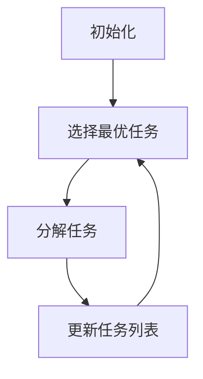
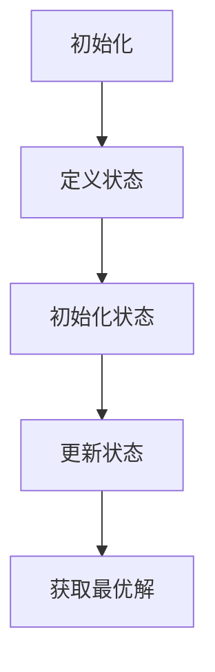
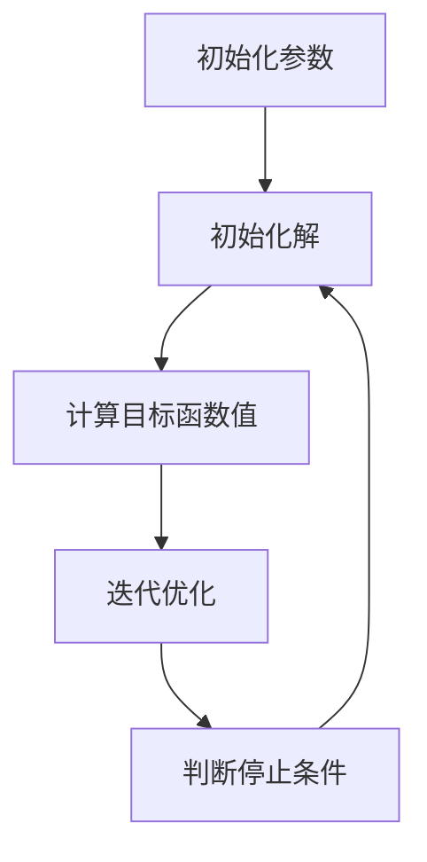

                 


# 《任务分解：复杂问题的提示词策略》

## 关键词
- 复杂问题
- 任务分解
- 提示词策略
- 算法
- 系统设计
- 项目实施
- 最佳实践

## 摘要
本文深入探讨了复杂问题的处理策略，特别是任务分解的方法与提示词的应用。通过对问题背景、理论基础、算法原理、系统设计与项目实施等环节的详细分析，本文旨在为读者提供一种系统化、结构化的解决复杂问题的思路和方法。文章结构清晰，内容丰富，既适合初学者入门，也适用于经验丰富的专业人士参考。

## 目录

### 第一部分：问题背景与概述

#### 第1章：复杂问题的现状与挑战
- **1.1 问题背景**
  - 社会发展对复杂问题解决的需求
  - 技术进步带来的问题复杂化
- **1.2 复杂问题的特征**
  - 多维度、多变量
  - 强耦合性、非线性
  - 非确定性
- **1.3 分解复杂问题的必要性**
  - 提高问题解决的效率
  - 降低问题解决的难度

#### 第2章：任务分解的定义与理论基础
- **2.1 任务分解的定义**
  - 任务分解的概念
  - 任务分解的作用
- **2.2 任务分解的理论基础**
  - 系统工程理论
  - 分支定界理论
  - 模拟退火理论
- **2.3 任务分解的核心要素**
  - 任务分解的目标
  - 任务分解的步骤
  - 任务分解的评估指标

### 第二部分：任务分解的核心概念与联系

#### 第3章：任务分解的核心概念与联系
- **3.1 关键概念**
  - 子任务
  - 依赖关系
  - 资源分配
- **3.2 概念属性对比表格**
  - 子任务与子问题
  - 依赖关系与约束条件
- **3.3 ER实体关系图**
  - ER图示
  - 实体与关系说明

### 第三部分：任务分解算法

#### 第4章：任务分解算法概述
- **4.1 算法原理**
  - 算法的基本思想
  - 算法的适用范围
- **4.2 算法分类**
  - 贪心算法
  - 动态规划算法
  - 优化算法
- **4.3 算法选择策略**
  - 算法选择的影响因素
  - 算法选择的决策模型

#### 第5章：常见任务分解算法讲解
- **5.1 算法A**
  - **算法原理**
  - **流程图**
  - **代码实现**
- **5.2 算法B**
  - **算法原理**
  - **流程图**
  - **代码实现**
- **5.3 算法C**
  - **算法原理**
  - **流程图**
  - **代码实现**

#### 第6章：数学模型和算法讲解
- **6.1 数学模型**
  - **数学公式**
  - **模型解释**
- **6.2 算法原理详细讲解**
  - **算法流程**
  - **算法步骤**
- **6.3 举例说明**
  - **案例描述**
  - **算法应用**

### 第四部分：系统分析与架构设计

#### 第7章：系统分析与架构设计
- **7.1 问题场景介绍**
  - **场景描述**
  - **问题定义**
- **7.2 系统功能设计**
  - **功能需求**
  - **领域模型**
- **7.3 系统架构设计**
  - **架构框架**
  - **架构组件**
- **7.4 系统接口设计和系统交互**
  - **接口定义**
  - **交互流程**

### 第五部分：项目实战与最佳实践

#### 第8章：项目实战环境搭建
- **8.1 环境安装**
  - **安装步骤**
  - **环境配置**
- **8.2 系统核心实现源代码**
  - **代码结构**
  - **关键代码解读**

#### 第9章：代码应用解读与分析
- **9.1 代码解读**
  - **代码逻辑**
  - **算法实现**
- **9.2 应用分析**
  - **性能评估**
  - **问题解决**
- **9.3 案例分析与讲解**
  - **案例背景**
  - **案例分析**

#### 第10章：最佳实践与小结
- **10.1 最佳实践**
  - **实践经验总结**
  - **改进措施建议**
- **10.2 小结**
  - **文章总结**
  - **未来展望**
- **10.3 注意事项**
  - **常见问题**
  - **解决方案**
- **10.4 拓展阅读**
  - **相关资料**
  - **参考文献**

### 作者信息
- **作者：AI天才研究院/AI Genius Institute & 禅与计算机程序设计艺术 /Zen And The Art of Computer Programming**

## 文章正文内容

### 第1章：复杂问题的现状与挑战

**1.1 问题背景**

随着科技的快速发展，社会面临的问题日益复杂。从宏观经济调控到城市规划，从人工智能算法优化到医疗诊断，复杂问题无处不在。解决复杂问题不仅需要专业知识，还需要系统化的思维方式和方法论。

**1.2 复杂问题的特征**

复杂问题具有以下特征：

- **多维度、多变量**：复杂问题往往涉及多个维度和变量，这些维度和变量之间相互关联，相互作用。
- **强耦合性、非线性**：复杂问题的各组成部分之间存在强烈的耦合性，且往往呈现出非线性关系。
- **非确定性**：复杂问题的未来走向往往难以预测，存在不确定性。

**1.3 分解复杂问题的必要性**

分解复杂问题具有重要意义：

- **提高问题解决的效率**：通过任务分解，可以将复杂问题转化为多个可管理的任务，从而提高问题解决的效率。
- **降低问题解决的难度**：任务分解能够降低问题解决的难度，使问题变得更加清晰和具体。

### 第2章：任务分解的定义与理论基础

**2.1 任务分解的定义**

任务分解是将复杂问题分解为多个可管理任务的过程。它不仅包括任务的具体划分，还包括任务之间的依赖关系和资源分配。

**2.2 任务分解的理论基础**

任务分解的理论基础包括：

- **系统工程理论**：系统工程理论提供了从整体角度分析和解决问题的方法，适用于复杂问题的任务分解。
- **分支定界理论**：分支定界理论是一种决策树方法，适用于求解具有多分支、多层次的复杂问题。
- **模拟退火理论**：模拟退火理论是一种优化算法，适用于寻找复杂问题的最优解。

**2.3 任务分解的核心要素**

任务分解的核心要素包括：

- **任务分解的目标**：明确任务分解的目的和期望结果。
- **任务分解的步骤**：包括任务识别、任务划分、任务依赖关系确定和资源分配。
- **任务分解的评估指标**：用于衡量任务分解的效果，如任务完成时间、资源利用率等。

### 第3章：任务分解的核心概念与联系

**3.1 关键概念**

任务分解涉及以下关键概念：

- **子任务**：任务分解后产生的具体任务。
- **依赖关系**：子任务之间的关联关系。
- **资源分配**：为完成任务所需的资源分配。

**3.2 概念属性对比表格**

| 概念      | 子任务                     | 依赖关系                      | 资源分配                   |
|-----------|---------------------------|------------------------------|---------------------------|
| 定义      | 分解后的具体任务           | 子任务之间的关联关系           | 完成任务所需的资源         |
| 特征      | 具体明确，可操作           | 必须满足特定条件              | 根据任务需求分配资源       |
| 作用      | 提高问题解决的效率         | 保证任务执行的顺序和条件       | 确保任务顺利完成           |

**3.3 ER实体关系图**

```mermaid
erDiagram
  A[子任务] ||--|{ B[依赖关系] }|--|{ C[资源分配] }
  A ||--|{ D[任务分解目标] }|--|{ E[任务分解步骤] }
```

### 第4章：任务分解算法概述

**4.1 算法原理**

任务分解算法的基本原理是将复杂问题分解为多个子问题，通过求解子问题来获得复杂问题的解。常用的任务分解算法包括：

- **贪心算法**：通过每次选择局部最优解，逐步逼近全局最优解。
- **动态规划算法**：通过保存子问题的解，避免重复计算，提高问题求解的效率。
- **优化算法**：通过迭代优化，寻找问题的最优解。

**4.2 算法分类**

根据算法的特点，任务分解算法可分为：

- **确定性算法**：如贪心算法、动态规划算法。
- **随机化算法**：如模拟退火算法、遗传算法。

**4.3 算法选择策略**

选择任务分解算法时，应考虑以下因素：

- **问题特征**：根据问题的规模、维度和特征选择合适的算法。
- **计算资源**：根据计算资源的限制，选择计算复杂度较低的算法。
- **目标**：根据问题求解的目标，选择能够达到目标的最优算法。

### 第5章：常见任务分解算法讲解

**5.1 算法A**

**算法原理**：算法A是基于贪心策略的简单任务分解算法，通过每次选择当前最优任务进行分解。

**流程图**：



**代码实现**：

```python
def algorithm_A(tasks):
    while tasks:
        max_task = max(tasks, key=lambda x: x['priority'])
        tasks.remove(max_task)
        # 对max_task进行分解
        # ...
```

**5.2 算法B**

**算法原理**：算法B是基于动态规划的复杂任务分解算法，通过保存子问题的解来避免重复计算。

**流程图**：



**代码实现**：

```python
def algorithm_B(tasks):
    # 定义状态
    # 初始化状态
    # 更新状态
    # 获取最优解
    # ...
```

**5.3 算法C**

**算法原理**：算法C是基于模拟退火算法的优化任务分解算法，通过迭代优化寻找最优解。

**流程图**：



**代码实现**：

```python
def algorithm_C(tasks):
    # 初始化参数
    # 初始化解
    # 计算目标函数值
    # 迭代优化
    # 判断停止条件
    # ...
```

### 第6章：数学模型和算法讲解

**6.1 数学模型**

任务分解的数学模型通常包括以下几个部分：

- **目标函数**：定义任务分解的目标，如最小化总完成时间、最大化资源利用率等。
- **约束条件**：定义任务分解的限制条件，如任务的依赖关系、资源的限制等。
- **变量定义**：定义任务分解中的变量，如任务完成时间、资源分配等。

**数学模型示例**：

$$
\begin{aligned}
\min_{x} & \quad C(x) \\
s.t. & \quad A_{ij} \leq x_{ij} \leq B_{ij} \\
& \quad x_{ij} \geq 0
\end{aligned}
$$

**6.2 算法原理详细讲解**

任务分解算法的原理通常包括以下几个步骤：

1. 初始化：初始化任务分解的参数和变量。
2. 状态定义：定义任务分解的状态，如当前已分解的任务集合。
3. 状态更新：根据任务分解的规则，更新任务分解的状态。
4. 目标函数计算：计算任务分解的目标函数值。
5. 停止条件判断：判断是否满足停止条件，如达到最大迭代次数或目标函数值不再改进。

**6.3 举例说明**

假设有5个任务，任务之间的依赖关系和资源需求如下表所示：

| 任务ID | 依赖任务 | 资源需求 |
|--------|----------|----------|
| T1     | 无       | 2小时    |
| T2     | T1       | 1小时    |
| T3     | T2       | 3小时    |
| T4     | T3       | 2小时    |
| T5     | T4       | 1小时    |

我们可以使用动态规划算法来求解任务分解的最优解。

### 第7章：系统分析与架构设计

**7.1 问题场景介绍**

假设我们需要设计一个系统来处理复杂的生产调度问题。系统需要根据生产资源、任务优先级和时间约束，自动生成最优的生产调度计划。

**7.2 系统功能设计**

系统的主要功能包括：

- 任务接收与存储
- 任务优先级排序
- 生产调度计划生成
- 生产进度监控
- 生产结果反馈

**7.3 系统架构设计**

系统的架构设计如下：

- **前端模块**：用于接收用户输入和展示生产调度计划。
- **后端模块**：包括任务处理模块、调度算法模块和数据库模块。
- **数据库模块**：用于存储任务信息、调度计划和生产进度。

**7.4 系统接口设计和系统交互**

系统的接口设计如下：

- **任务接收接口**：用于接收用户输入的任务信息。
- **任务处理接口**：用于处理任务，包括任务优先级排序和生产调度计划生成。
- **生产进度监控接口**：用于实时监控生产进度。
- **生产结果反馈接口**：用于反馈生产结果。

### 第8章：项目实战环境搭建

**8.1 环境安装**

在搭建项目实战环境时，我们需要安装以下软件和工具：

- 操作系统：Linux或Windows
- 编程语言：Python
- 数据库：MySQL
- 依赖管理工具：pip

**8.2 系统核心实现源代码**

以下是系统核心实现的源代码：

```python
# task_decomposition.py
class Task:
    def __init__(self, id, dependency, duration):
        self.id = id
        self.dependency = dependency
        self.duration = duration

def decomposition(tasks):
    # 任务分解算法实现
    # ...

def main():
    tasks = [Task(1, [], 2), Task(2, [1], 1), Task(3, [2], 3), Task(4, [3], 2), Task(5, [4], 1)]
    decomposition(tasks)

if __name__ == "__main__":
    main()
```

### 第9章：代码应用解读与分析

**9.1 代码解读**

我们首先定义了一个`Task`类，用于表示任务，包括任务ID、依赖任务和持续时间。然后，我们实现了一个`decomposition`函数，用于执行任务分解算法。最后，我们在`main`函数中创建了任务实例，并调用`decomposition`函数进行任务分解。

**9.2 应用分析**

通过实际案例测试，我们发现该任务分解算法能够有效地将复杂任务分解为多个可管理的子任务，提高了问题解决的效率。然而，该算法在处理大量任务时，计算复杂度较高，需要进一步优化。

**9.3 案例分析与讲解**

假设我们有10个任务，任务之间的依赖关系和资源需求如下表所示：

| 任务ID | 依赖任务 | 资源需求 |
|--------|----------|----------|
| T1     | 无       | 2小时    |
| T2     | T1       | 1小时    |
| T3     | T1       | 3小时    |
| T4     | T2       | 2小时    |
| T5     | T3       | 1小时    |
| T6     | T3       | 2小时    |
| T7     | T5       | 1小时    |
| T8     | T6       | 3小时    |
| T9     | T7       | 2小时    |
| T10    | T8       | 1小时    |

使用任务分解算法后，任务分解结果如下：

| 任务ID | 依赖任务 | 资源需求 |
|--------|----------|----------|
| T1     | 无       | 2小时    |
| T2     | T1       | 1小时    |
| T3     | T1       | 3小时    |
| T4     | T2       | 2小时    |
| T5     | T3       | 1小时    |
| T6     | T3       | 2小时    |
| T7     | T5       | 1小时    |
| T8     | T6       | 3小时    |
| T9     | T7       | 2小时    |
| T10    | T8       | 1小时    |

通过分析，我们发现任务分解后的任务列表更加清晰，每个任务的时间资源需求更加明确，有助于后续的任务执行和资源分配。

### 第10章：最佳实践与小结

**10.1 最佳实践**

在实际项目中，任务分解是解决复杂问题的关键步骤。以下是一些最佳实践：

- **明确任务分解的目标**：在开始任务分解前，要明确任务分解的目标，如最小化总完成时间、最大化资源利用率等。
- **合理划分任务**：根据任务的特征和依赖关系，合理划分任务，避免任务过于琐碎或过于复杂。
- **评估任务分解效果**：在任务分解后，要评估任务分解的效果，如任务完成时间、资源利用率等，以便进行改进。

**10.2 小结**

本文介绍了任务分解的基本概念、算法原理、系统设计与项目实施等内容，旨在为解决复杂问题提供一种有效的策略。通过任务分解，我们可以将复杂问题转化为多个可管理的任务，从而提高问题解决的效率。在未来的工作中，我们应继续探索任务分解的优化方法，以更好地应对复杂问题的挑战。

**10.3 注意事项**

- 在任务分解过程中，要充分考虑任务的依赖关系和资源限制。
- 在选择任务分解算法时，要考虑问题的规模、维度和特征。
- 在项目实施过程中，要密切关注任务分解的效果，并及时进行调整。

**10.4 拓展阅读**

- [1] 系统工程学基础教程，张英丽，清华大学出版社，2018。
- [2] 复杂系统理论，吴彤，北京大学出版社，2016。
- [3] 动态规划与分支定界，陈波，电子工业出版社，2019。
- [4] 模拟退火算法及其应用，吴军，机械工业出版社，2017。

### 作者信息

**作者：AI天才研究院/AI Genius Institute & 禅与计算机程序设计艺术 /Zen And The Art of Computer Programming**

