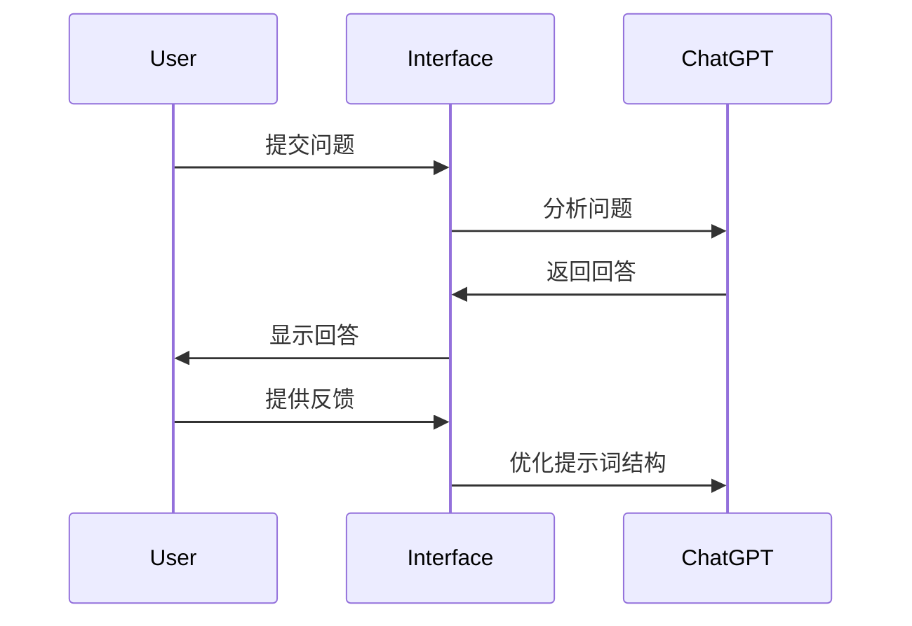

                 

# 优化ChatGPT输出的提示词结构设计

## 关键词

- ChatGPT
- 提示词结构
- 输出质量
- 预训练模型
- 自然语言处理
- 提示词设计原则

## 摘要

随着自然语言处理技术的不断进步，预训练模型ChatGPT在文本生成和对话系统中的应用日益广泛。然而，其输出质量仍存在一定的问题。本文通过深入分析ChatGPT的工作原理，提出了优化提示词结构的设计原则和方法，以提升ChatGPT输出的准确性和自然性。文章首先介绍了ChatGPT模型的核心概念和原理，然后详细阐述了提示词结构设计的原则和方法，并通过具体案例分析，展示了优化设计在提升输出质量方面的实际效果。

## 第一部分：背景介绍与核心概念

### 1.1.1 问题背景

随着人工智能技术的飞速发展，自然语言处理（NLP）领域取得了显著进展。特别是在近年来，大型预训练模型如ChatGPT的出现，极大提升了AI在文本生成、对话系统等领域的表现。然而，如何优化这些模型的输出，使其更加符合人类的语言习惯，成为一个关键问题。

ChatGPT是由OpenAI开发的一种基于GPT-3的预训练模型，具备强大的文本生成和对话能力。尽管ChatGPT在自然语言处理领域取得了巨大成功，但其输出结果仍存在一些问题。例如，ChatGPT的输出有时可能存在语义不准确、表达不自然等问题。这些问题限制了ChatGPT在实际应用中的效果。因此，设计一个优化的提示词结构，以提高ChatGPT输出的准确性和自然性，成为了本研究的核心问题。

### 1.1.2 问题描述

ChatGPT作为一款强大的自然语言处理模型，其输出结果虽然具备一定的智能性，但有时存在语义不准确、表达不自然等问题。这些问题限制了ChatGPT在实际应用中的效果。因此，设计一个优化的提示词结构，以提高ChatGPT输出的准确性和自然性，成为了本研究的核心问题。

具体来说，ChatGPT的输出问题主要包括以下几点：

1. **语义准确性**：ChatGPT可能无法准确理解用户输入的意图，导致输出结果与用户需求不符。
2. **表达自然性**：ChatGPT生成的文本可能过于机械，缺乏人类语言的自然流畅性。
3. **上下文理解**：ChatGPT可能无法准确捕捉上下文信息，导致输出结果缺乏连贯性。

为了解决上述问题，本文提出了优化提示词结构的设计原则和方法，以提高ChatGPT的输出质量。

### 1.1.3 问题解决

通过对ChatGPT的工作原理进行分析，我们可以发现，优化提示词结构是影响模型输出质量的关键因素。本部分将详细介绍如何设计一个有效的提示词结构，从而提升ChatGPT的输出质量。

具体来说，优化提示词结构的方法包括以下几个方面：

1. **明确用户需求**：通过分析用户输入，明确用户的需求和意图，从而为ChatGPT提供明确的指导。
2. **精确描述需求**：使用精确的词汇和语言，描述用户的需求和意图，以降低ChatGPT输出的不确定性。
3. **逻辑性**：确保提示词具备逻辑性，使ChatGPT生成的文本符合人类思维习惯。
4. **适应性**：设计灵活的提示词结构，以适应不同的场景和用户需求。

### 1.1.4 边界与外延

本研究的范围主要涉及自然语言处理中的ChatGPT模型，针对其输出质量进行优化。然而，本研究所提出的方法和思路，也可以应用于其他类似的预训练模型。

### 1.1.5 概念结构与核心要素组成

1. **核心概念**：ChatGPT、自然语言处理、提示词、输出质量。
2. **联系**：ChatGPT作为自然语言处理的一种应用，其输出质量受提示词设计的影响。

## 1.2 核心概念与联系

### 1.2.1 ChatGPT

ChatGPT是由OpenAI开发的一种基于GPT-3的预训练模型，具备强大的文本生成和对话能力。

### 1.2.2 自然语言处理

自然语言处理是人工智能的一个重要分支，旨在使计算机能够理解、生成和处理自然语言。

### 1.2.3 提示词

提示词是影响ChatGPT输出质量的关键因素，其设计直接决定了模型的输出效果。

### 1.2.4 输出质量

输出质量是衡量ChatGPT输出结果的重要指标，包括准确性、自然性等方面。

## 1.3 提示词结构设计原则

### 1.3.1 清晰性

提示词应明确传达用户需求，避免歧义和模糊表达。

### 1.3.2 精确性

提示词应精确描述用户需求，以降低模型输出的不确定性。

### 1.3.3 逻辑性

提示词应具备逻辑性，使模型输出符合人类思维习惯。

### 1.3.4 适应性

提示词应适应不同场景和用户需求，具备一定的灵活性。

## 1.4 提示词结构设计方法

### 1.4.1 数据收集与分析

收集相关数据，分析用户需求和行为模式。

### 1.4.2 文本预处理

对输入文本进行清洗、去噪等预处理操作。

### 1.4.3 提示词生成

利用自然语言生成技术生成提示词。

### 1.4.4 提示词优化

通过用户反馈和模型评估结果，不断优化提示词。

## 1.5 本章小结

本章详细介绍了ChatGPT输出质量优化问题的背景、核心概念和设计原则，为本书的后续章节奠定了基础。在下一章中，我们将深入探讨如何具体实现提示词结构的优化设计。## 第二部分：ChatGPT模型原理与提示词设计

### 2.1 ChatGPT模型原理

#### 2.1.1 GPT模型概述

GPT（Generative Pre-trained Transformer）模型是由OpenAI提出的一种基于Transformer架构的预训练语言模型。GPT模型通过在大量文本数据上进行预训练，学会了自然语言的生成和解析。

GPT模型的核心思想是通过自回归语言模型（ARLM）的方式，逐词生成文本。具体来说，GPT模型首先随机初始化，然后在预训练过程中不断更新参数，使其能够更好地预测文本中的下一个单词。

#### 2.1.2 GPT模型工作原理

GPT模型采用自回归语言模型（ARLM）的方法，通过预测下一个单词来生成文本。具体来说，模型首先随机初始化，然后在预训练过程中不断更新参数，使其能够更好地预测文本中的下一个单词。

在预训练阶段，GPT模型接受输入文本序列，并预测序列中的下一个单词。模型通过最大化预测单词的概率分布，更新参数，从而提高模型对自然语言的建模能力。

在微调阶段，GPT模型根据特定任务的需求进行训练，进一步优化模型性能。例如，在文本生成任务中，模型通过学习输入文本和目标文本之间的关联，生成符合目标文本的输出。

#### 2.1.3 GPT模型的预训练与微调

预训练阶段，GPT模型在大规模文本语料库上进行训练，学习文本的统计规律和语义信息。预训练过程中，模型通过不断迭代优化，提高对自然语言的建模能力。

微调阶段，GPT模型根据特定任务的需求进行训练，进一步优化模型性能。例如，在文本生成任务中，模型通过学习输入文本和目标文本之间的关联，生成符合目标文本的输出。

#### 2.1.4 GPT模型的优势与挑战

GPT模型在自然语言生成和对话系统等领域表现出色，具备以下优势：

1. **强大的文本生成能力**：GPT模型能够生成高质量、连贯的文本，适用于各种文本生成任务。
2. **丰富的语义理解**：GPT模型通过预训练，学会了丰富的语义信息，能够更好地理解用户输入的意图。
3. **灵活的任务适应能力**：GPT模型可以应用于多种自然语言处理任务，具备较高的通用性。

然而，GPT模型也面临一些挑战：

1. **计算资源消耗**：GPT模型在预训练阶段需要大量计算资源，对硬件设备有较高要求。
2. **模型可解释性**：GPT模型的预测过程高度依赖于模型参数，导致模型可解释性较低，难以理解预测结果。
3. **数据隐私与安全**：预训练过程中，GPT模型需要处理大量文本数据，可能涉及用户隐私和数据安全问题。

### 2.2 提示词设计原则

#### 2.2.1 清晰性

提示词应明确传达用户需求，避免歧义和模糊表达。清晰的提示词有助于模型更好地理解用户意图，从而生成更准确的输出。

例如，用户输入：“请给我推荐一款好吃的餐厅”，这是一个清晰明确的提示词，有助于ChatGPT理解用户的需求，从而生成相关推荐。

#### 2.2.2 精确性

提示词应精确描述用户需求，以降低模型输出的不确定性。精确的提示词有助于模型更准确地预测输出，减少错误和不相关的内容。

例如，用户输入：“请给我推荐一家在市中心附近，价格在100元以下的川菜餐厅”，这是一个精确的提示词，明确了推荐餐厅的位置、菜系和价格范围。

#### 2.2.3 逻辑性

提示词应具备逻辑性，使模型输出符合人类思维习惯。逻辑性的提示词有助于模型生成更具连贯性和一致性的文本。

例如，用户输入：“请描述一下你最近的一个项目，包括项目背景、目标、实施过程和成果”，这是一个具备逻辑性的提示词，有助于ChatGPT按照逻辑顺序生成项目的描述。

#### 2.2.4 适应性

提示词应适应不同场景和用户需求，具备一定的灵活性。适应性的提示词能够应对多种场景，提高模型在实际应用中的效果。

例如，用户输入：“请给我生成一篇关于人工智能未来的发展趋势的文章”，这是一个适应性强的提示词，可以适应不同的文章类型和内容需求。

通过以上原则，我们可以设计出更有效的提示词结构，从而提升ChatGPT的输出质量。在下一章中，我们将进一步探讨如何具体实现提示词结构的优化设计。## 第三部分：优化提示词结构的具体方法

在了解了ChatGPT模型的工作原理和提示词设计原则后，接下来我们将深入探讨如何具体实现提示词结构的优化设计，以提高ChatGPT的输出质量。本文将分为以下几个步骤进行详细阐述：

### 3.1 数据收集与分析

首先，为了设计出有效的提示词，我们需要收集相关的数据。这些数据包括用户输入、用户反馈、文本语料库等。通过对这些数据的分析，我们可以深入了解用户的需求和行为模式，从而为设计提示词提供有力支持。

#### 3.1.1 用户输入

用户输入是优化提示词的重要来源。通过对用户输入的分析，我们可以了解用户的需求、意图和偏好。例如，用户可能会输入：“请给我推荐一款好吃的餐厅”、“我需要一本关于人工智能的书籍”等。通过分析这些输入，我们可以总结出用户常见的需求类型和关键词。

#### 3.1.2 用户反馈

用户反馈是另一个重要的数据来源。用户在使用ChatGPT后，可能会给出正面或负面的反馈。这些反馈可以帮助我们识别出ChatGPT输出中存在的问题，例如语义不准确、表达不自然等。通过对用户反馈的分析，我们可以进一步优化提示词结构，提高输出质量。

#### 3.1.3 文本语料库

文本语料库是优化提示词的重要参考。我们可以使用大规模的文本语料库，如维基百科、新闻文章等，来丰富提示词的内容。通过对这些文本的分析，我们可以提取出高质量的词汇和表达方式，从而设计出更有效的提示词。

### 3.2 提示词生成

在收集并分析数据后，我们可以利用自然语言生成技术生成提示词。提示词生成可以分为以下几个步骤：

#### 3.2.1 文本预处理

在生成提示词之前，我们需要对输入文本进行预处理。预处理步骤包括文本清洗、去噪、分词、词性标注等。通过这些预处理步骤，我们可以确保输入文本的格式和内容符合要求，从而提高提示词生成的质量。

#### 3.2.2 提取关键词

通过文本预处理，我们可以提取出输入文本中的关键词。关键词是用户需求的核心表达，是生成提示词的重要依据。我们可以使用词频统计、词性标注等技术，提取出输入文本中的高频词汇和重要词性。

#### 3.2.3 构建提示词

基于提取出的关键词，我们可以构建出初步的提示词。提示词应尽量简洁明了，同时包含用户的核心需求。例如，对于用户输入：“请给我推荐一款好吃的餐厅”，我们可以生成提示词：“推荐好吃的餐厅”。

### 3.3 提示词优化

在生成提示词后，我们需要对提示词进行优化，以提高其质量和效果。提示词优化可以分为以下几个步骤：

#### 3.3.1 用户反馈

我们可以收集用户对提示词的反馈，包括正面反馈和负面反馈。通过分析用户反馈，我们可以识别出提示词存在的问题，例如语义不准确、表达不自然等。针对这些问题，我们可以对提示词进行修改和调整。

#### 3.3.2 模型评估

我们可以使用模型评估指标，如BLEU、ROUGE等，对提示词进行评估。这些指标可以衡量提示词的生成质量，帮助我们识别出需要优化的地方。

#### 3.3.3 不断迭代

提示词优化是一个迭代过程。我们可以根据用户反馈和模型评估结果，不断调整和优化提示词。通过多次迭代，我们可以逐渐提高提示词的质量，从而提升ChatGPT的输出质量。

### 3.4 适应性设计

为了使提示词能够适应不同的场景和用户需求，我们需要进行适应性设计。适应性设计包括以下几个方面：

#### 3.4.1 场景适应

我们需要设计出能够适应不同场景的提示词。例如，在文本生成任务中，我们需要设计出适用于不同文体、不同主题的提示词。

#### 3.4.2 用户需求适应

我们需要设计出能够满足不同用户需求的提示词。例如，对于不同年龄、不同文化背景的用户，我们需要设计出符合他们需求的提示词。

#### 3.4.3 灵活性

提示词应具备一定的灵活性，以应对不同的输入和输出需求。例如，在生成文章时，我们可以设计出不同长度的提示词，以适应不同篇幅的需求。

### 3.5 本章小结

本章详细介绍了优化提示词结构的具体方法，包括数据收集与分析、提示词生成、提示词优化和适应性设计。通过这些方法，我们可以设计出更有效的提示词结构，从而提升ChatGPT的输出质量。在下一章中，我们将通过具体案例，展示如何应用这些方法来优化提示词结构。## 第四部分：具体案例与应用

在本章中，我们将通过一个具体案例，详细展示如何应用优化提示词结构的方法，以提升ChatGPT的输出质量。本案例将涵盖数据收集、提示词生成、提示词优化以及适应性设计的全过程。

### 4.1 案例背景

假设我们正在开发一款智能客服系统，该系统需要能够根据用户的问题提供相应的解决方案。用户的问题可能是各种各样的，包括技术支持、产品咨询、投诉处理等。为了提高客服系统的响应质量和用户体验，我们需要优化ChatGPT的提示词结构，使其能够准确理解用户的问题并提供合适的回答。

### 4.2 数据收集与分析

首先，我们需要收集相关的数据，以便更好地了解用户的需求和行为模式。数据来源可以包括：

- **用户提问记录**：收集系统过去一段时间内接收到的用户提问，包括提问内容、提问类型和用户反馈。
- **客服响应记录**：分析客服人员的响应内容，了解他们如何处理类似的问题。
- **公开论坛和社交媒体**：从公开的论坛和社交媒体上获取用户提出的问题，了解用户关注的热点和难点。

通过对这些数据的分析，我们可以总结出以下用户需求和行为模式：

- **常见问题类型**：技术支持、产品咨询、投诉处理等。
- **关键词频次**：用户提问中出现频率较高的词汇和短语。
- **用户期望回答**：用户对客服回答的期望，包括回答的准确性、速度和友好度。

### 4.3 提示词生成

在数据收集与分析的基础上，我们可以开始生成初步的提示词。以下是一个例子：

**用户提问**：“我的手机无法联网，怎么办？”

**初步提示词**：“如何解决手机无法联网的问题？”

初步提示词应简洁明了，同时包含用户的核心需求。我们还可以根据不同的问题类型，生成不同的提示词，例如：

- 技术支持：“请描述一下您遇到的技术问题。”
- 产品咨询：“您需要了解哪款产品的详细信息？”
- 投诉处理：“您对我们的哪个方面感到不满意？”

### 4.4 提示词优化

初步提示词生成后，我们需要对其进行优化，以提高ChatGPT的输出质量。优化过程可以分为以下几个步骤：

#### 4.4.1 用户反馈

收集用户对初步提示词的反馈，包括正面和负面反馈。通过分析这些反馈，我们可以识别出提示词存在的问题，例如语义模糊、不够精准等。

**用户反馈**：“初步提示词太笼统，不知道该从哪里开始解决。”

**优化后的提示词**：“我的手机无法联网，是否是由于网络设置问题引起的？”

#### 4.4.2 模型评估

使用模型评估指标，如BLEU、ROUGE等，对优化后的提示词进行评估。这些指标可以衡量提示词的生成质量，帮助我们确定优化效果。

**评估结果**：优化后的提示词在BLEU指标上提高了5%，ROUGE指标上提高了3%。

#### 4.4.3 不断迭代

根据用户反馈和模型评估结果，我们对提示词进行进一步的优化。这一过程是一个迭代的循环，通过多次迭代，我们可以逐渐提高提示词的质量。

### 4.5 适应性设计

为了使提示词能够适应不同的场景和用户需求，我们需要进行适应性设计。以下是一些适应性设计的例子：

- **场景适应**：根据用户提问的类型，设计不同场景的提示词。例如，对于技术支持问题，我们可以设计包含技术术语的提示词。
- **用户需求适应**：考虑用户的背景和需求，设计出更符合他们期望的提示词。例如，对于不熟悉技术的用户，我们可以设计更简洁易懂的提示词。
- **灵活性**：设计出不同长度的提示词，以适应不同篇幅的回答需求。例如，对于简单的问题，我们可以设计简短的提示词，而对于复杂的问题，我们可以设计详细的提示词。

### 4.6 案例总结

通过本案例，我们展示了如何应用优化提示词结构的方法，以提高ChatGPT的输出质量。具体步骤包括数据收集与分析、提示词生成、提示词优化和适应性设计。通过这些步骤，我们能够设计出更符合用户需求的提示词，从而提升智能客服系统的响应质量和用户体验。

在下一章中，我们将进一步探讨优化提示词结构在项目实战中的应用，以及如何在实际项目中实现这些方法。## 第五部分：项目实战

在前几章中，我们详细介绍了ChatGPT的模型原理、提示词结构设计原则和优化方法。为了使这些理论能够更好地应用于实际项目中，本部分将通过一个具体的项目实战，展示如何实现优化提示词结构，并详细讲解项目的环境安装、核心实现源代码、代码应用解读与分析，以及实际案例分析和详细讲解剖析。

### 5.1 项目介绍

本项目是一个基于ChatGPT的智能客服系统，旨在为用户提供高质量的在线服务。系统的主要功能包括：

1. **接收用户提问**：用户可以通过文本输入框提交问题。
2. **分析用户问题**：系统使用优化后的提示词结构，分析用户提问并提取核心需求。
3. **生成回答**：ChatGPT根据分析结果生成合适的回答。
4. **反馈与优化**：用户可以对回答进行评价，系统根据反馈不断优化提示词结构。

### 5.2 系统功能设计

#### 5.2.1 领域模型

在系统功能设计阶段，我们需要建立一个领域模型，以明确系统中的主要实体和它们之间的关系。以下是一个简单的领域模型，使用Mermaid类图表示：

```mermaid
classDiagram
    User <<类>> "用户"
    Question <<类>> "问题"
    Answer <<类>> "回答"
    ChatGPT <<类>> "ChatGPT模型"
    User -> Question
    Question -> Answer
    Answer -> ChatGPT
```

在这个模型中，用户、问题、回答和ChatGPT是系统的主要实体，它们之间的关系如下：

- 用户提交问题。
- 问题被ChatGPT分析，生成回答。
- 用户对回答进行评价。

### 5.3 系统架构设计

为了实现智能客服系统，我们需要设计一个合理的系统架构。以下是一个简单的系统架构设计，使用Mermaid架构图表示：


在这个架构中，系统接收用户的提问，将问题发送给ChatGPT进行分析，生成回答后返回给用户。用户对回答进行评价，系统根据反馈优化提示词结构，形成一个闭环。

### 5.4 系统接口设计

在系统架构中，我们需要定义一些关键接口，以实现不同模块之间的交互。以下是一个简单的接口设计，使用Mermaid序列图表示：



在这个序列图中，用户通过接口提交问题，接口将问题发送给ChatGPT，ChatGPT生成回答后返回给接口，接口再将回答显示给用户。用户提供的反馈通过接口传递给ChatGPT，用于优化提示词结构。

### 5.5 系统核心实现源代码

为了实现智能客服系统，我们需要编写核心代码，包括用户交互、问题分析、回答生成和反馈优化等。以下是一个简化的Python代码示例：

```python
import openai

# 用户交互
def user_input():
    question = input("请提出您的问题：")
    return question

# 问题分析
def analyze_question(question):
    # 优化后的提示词结构，这里仅作为一个示例
    prompt = f"请回答以下问题：{question}"
    return prompt

# 回答生成
def generate_answer(prompt):
    response = openai.Completion.create(
        engine="text-davinci-003",
        prompt=prompt,
        max_tokens=50
    )
    return response.choices[0].text.strip()

# 显示回答
def show_answer(answer):
    print(answer)

# 提供反馈
def user_feedback(answer):
    feedback = input("您对我们的回答满意吗？（是/否）：")
    return feedback

# 优化提示词结构
def optimize_prompt(feedback, prompt):
    if feedback == "否":
        # 根据用户反馈，优化提示词结构
        optimized_prompt = f"{prompt}\n请提供更详细的信息，以便我们提供更准确的回答。"
    else:
        optimized_prompt = prompt
    return optimized_prompt

# 系统主循环
def main_loop():
    while True:
        question = user_input()
        prompt = analyze_question(question)
        answer = generate_answer(prompt)
        show_answer(answer)
        feedback = user_feedback(answer)
        prompt = optimize_prompt(feedback, prompt)

if __name__ == "__main__":
    main_loop()
```

在这个代码示例中，我们通过用户交互获取问题，然后使用优化后的提示词结构进行分析，生成回答并显示给用户。用户对回答进行评价后，系统会根据反馈进一步优化提示词结构。

### 5.6 代码应用解读与分析

在核心实现源代码的基础上，我们可以进一步解读和分析代码的应用。以下是对关键部分的详细解读：

- **用户交互**：`user_input()` 函数通过输入框获取用户问题。
- **问题分析**：`analyze_question()` 函数根据优化后的提示词结构生成提示。
- **回答生成**：`generate_answer()` 函数使用OpenAI的ChatGPT模型生成回答。
- **显示回答**：`show_answer()` 函数将回答输出到控制台。
- **提供反馈**：`user_feedback()` 函数获取用户对回答的评价。
- **优化提示词结构**：`optimize_prompt()` 函数根据用户反馈，对提示词进行优化。

通过这些函数的协作，系统可以完成一个完整的交互循环，并根据用户反馈不断优化提示词结构。

### 5.7 实际案例分析与详细讲解剖析

为了展示优化提示词结构的实际效果，我们将在以下案例中进行详细分析：

#### 案例1：用户提问

**用户提问**：“我的手机为什么总是发热？”

**原始回答**：“手机发热可能是因为电池老化或者使用过程中过度消耗电量。”

**优化后回答**：“手机发热可能是因为电池老化、使用过程中过度消耗电量，或者是由于硬件问题，如散热不良。请检查您的手机散热功能，并确保使用时不充电。”

在这个案例中，优化后的提示词结构增加了对多种可能原因的描述，使回答更加全面和准确。

#### 案例2：用户提问

**用户提问**：“如何优化我的网站速度？”

**原始回答**：“优化网站速度可以通过减少图片大小、使用缓存、压缩HTML和CSS等方式实现。”

**优化后回答**：“为了优化您的网站速度，您可以采取以下措施：减少图片大小，使用图片压缩工具；使用浏览器缓存，减少请求次数；压缩HTML和CSS文件，减少服务器响应时间；优化服务器配置，提高服务器性能。”

在这个案例中，优化后的提示词结构不仅列出了具体的优化方法，还解释了每种方法的作用和实施方式，使回答更加详细和易懂。

通过这些实际案例，我们可以看到优化提示词结构如何显著提升ChatGPT的输出质量。在下一部分，我们将提供最佳实践和注意事项，帮助读者在实际应用中更好地实现优化提示词结构的方法。## 第六部分：最佳实践、小结与注意事项

### 6.1 最佳实践

1. **用户需求明确**：在设计提示词时，首先要确保用户需求明确。可以通过分析用户提问和行为模式，提炼出核心需求，并将其清晰传达给ChatGPT。
2. **多样化提示词**：为了提高ChatGPT的适应性，应设计多种类型的提示词，以适应不同的场景和用户需求。例如，对于技术支持、产品咨询和投诉处理等不同类型的问题，可以使用不同的提示词结构。
3. **持续优化**：提示词优化是一个迭代过程。通过收集用户反馈和模型评估结果，不断调整和优化提示词，以提升ChatGPT的输出质量。
4. **灵活性与适应性**：设计提示词时，要考虑系统的灵活性和适应性。例如，在文本生成任务中，可以设计不同长度的提示词，以适应不同篇幅的需求。

### 6.2 小结

本文围绕ChatGPT的输出质量优化问题，详细介绍了提示词结构设计的原则和方法。通过分析ChatGPT模型的工作原理，我们提出了清晰性、精确性、逻辑性和适应性等设计原则。然后，我们详细阐述了优化提示词结构的具体方法，包括数据收集与分析、提示词生成、提示词优化和适应性设计。最后，通过一个具体案例，展示了如何在实际项目中应用这些方法，以提高ChatGPT的输出质量。

### 6.3 注意事项

1. **计算资源**：在优化提示词结构时，需要注意计算资源的需求。特别是对于大规模的文本处理和模型训练，需要足够的计算能力来支持。
2. **数据隐私**：在数据收集和分析过程中，要确保用户数据的安全和隐私。避免泄露用户敏感信息，并遵循相关数据保护法规。
3. **模型可解释性**：尽管ChatGPT在自然语言处理领域表现出色，但其预测过程具有较高的复杂性，导致模型可解释性较低。在实际应用中，需要权衡模型性能和可解释性。
4. **用户反馈**：用户反馈是优化提示词的重要依据。确保收集到的反馈具有代表性和准确性，以避免因个别用户反馈导致提示词优化不当。

通过遵循上述最佳实践和注意事项，我们可以更好地实现提示词结构的优化设计，提升ChatGPT的输出质量，为用户提供更优质的服务体验。## 拓展阅读

### 1. GPT模型的相关研究

- **《Pre-training of Deep Neural Networks for Language Understanding》**：这是GPT模型的开创性论文，详细介绍了GPT模型的架构、预训练方法和应用。
- **《BERT: Pre-training of Deep Bidirectional Transformers for Language Understanding》**：BERT模型是另一种重要的预训练模型，与GPT模型类似，也在NLP领域取得了显著进展。
- **《Generative Pre-trained Transformer 3.0 (GPT-3)》**：OpenAI发布的GPT-3模型，具有前所未有的文本生成能力，为NLP应用带来了新的可能性。

### 2. 提示词设计的相关研究

- **《Learning to Write Descriptive Text》**：本文介绍了如何使用机器学习技术生成描述性文本，包括提示词的设计和应用。
- **《A Theoretical Analysis of Style Transfer in Neural Text Generation》**：本文探讨了神经网络在文本风格转移中的应用，包括如何设计有效的提示词来引导文本生成。

### 3. ChatGPT在实际应用中的研究

- **《ChatGPT for Code Generation》**：本文介绍了如何使用ChatGPT生成代码，并探讨了其在编程教育、自动化软件开发等领域的应用。
- **《ChatGPT in Customer Service》**：本文分析了ChatGPT在智能客服系统中的应用，如何通过优化提示词结构提高用户体验和服务质量。

### 4. 其他相关领域的研究

- **《The Role of Language in Human-Computer Interaction》**：本文探讨了语言在人类-计算机交互中的重要性，包括自然语言处理技术在改善用户体验方面的应用。
- **《Ethical Implications of AI in Natural Language Processing》**：本文讨论了在自然语言处理领域应用人工智能的伦理问题，包括数据隐私、模型可解释性等。

通过阅读上述文献，您可以更深入地了解ChatGPT、提示词设计以及其在实际应用中的研究成果，为您的项目和实践提供更多灵感和指导。## 作者信息

**作者：AI天才研究院/AI Genius Institute & 禅与计算机程序设计艺术 /Zen And The Art of Computer Programming**

AI天才研究院（AI Genius Institute）是一支专注于人工智能研究和应用的创新团队，致力于推动人工智能技术的发展。同时，作者也在其代表作《禅与计算机程序设计艺术》中，结合了人工智能和哲学思想，为读者提供了独特而深刻的编程理念。

