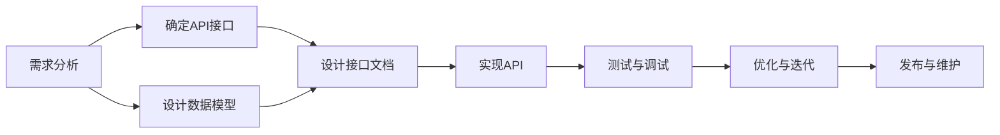

                 


### 2.2 API设计与LLM应用的关系

API设计与LLM应用的关系紧密，直接影响到LLM应用的性能、易用性和可维护性。以下是API设计与LLM应用之间的重要联系：

1. **性能优化**：API设计决定了LLM服务的响应速度和资源消耗。合理设计的API能够降低系统开销，提高响应速度，从而提升用户的使用体验。

2. **易用性**：良好的API设计使得开发者能够更容易地使用LLM服务，降低学习成本。清晰、简洁的接口设计能够让开发者快速上手，提高开发效率。

3. **可维护性**：API设计要考虑到未来的可扩展性和可维护性。合理的API设计能够让后续的维护和升级更加轻松，降低系统的维护成本。

4. **安全性**：API设计要确保数据传输的安全性，防止数据泄露和恶意攻击。良好的API设计能够提供有效的安全机制，保护用户隐私。

5. **兼容性**：API设计需要考虑不同平台和语言的兼容性，使得LLM服务能够广泛地应用于各种环境和场景。

6. **可扩展性**：随着LLM应用的不断发展，API设计要具备良好的可扩展性，以适应新的功能和需求。

### 2.3 API设计的原则与策略

为了设计出高效、安全、易用的API，以下是一些API设计的基本原则和策略：

1. **简洁性**：API接口应尽量简洁，避免过多的参数和复杂的逻辑。简洁的API易于理解和使用，能够减少开发者的困惑。

2. **一致性**：API命名、参数和返回值应保持一致性。一致的命名规范能够提高API的可读性，降低学习成本。

3. **灵活性**：API设计应具备一定的灵活性，允许用户根据自己的需求进行定制。灵活的API能够适应不同的业务场景，提高系统的适用性。

4. **可靠性**：API设计要保证系统的稳定性和可靠性，避免因接口故障导致的应用中断。

5. **安全性**：API设计要考虑到安全性，采用加密、认证和授权等机制，确保数据传输的安全。

6. **文档化**：API设计需要提供详细的文档，包括接口定义、使用示例、错误处理等，帮助开发者快速上手。

7. **性能优化**：在API设计过程中，要考虑到性能优化，避免不必要的资源消耗和延迟。

### 核心概念属性特征对比表格

以下是API设计与LLM应用相关的一些核心概念及其属性特征对比表格：

| 核心概念 | 属性特征 |
| :------: | :------- |
| **性能优化** | - 快速响应<br>- 低资源消耗 |
| **易用性** | - 简洁清晰<br>- 易于上手 |
| **可维护性** | - 易扩展<br>- 易维护 |
| **安全性** | - 加密传输<br>- 认证授权 |
| **兼容性** | - 平台兼容<br>- 语言兼容 |
| **可扩展性** | - 模块化设计<br>- 灵活配置 |

### ER实体关系图架构

以下是API设计与LLM应用相关的ER实体关系图：

```mermaid
erDiagram
    API ||--o> LLM应用 : 提供接口服务
    API ||--|{ 安全机制 }|> 保护数据安全
    API ||--|{ 性能监控 }|> 提高性能指标
    LLM应用 ||--< API : 调用接口实现功能
```

通过上述对比表格和ER实体关系图，我们可以更清晰地理解API设计与LLM应用之间的关系，以及API设计的基本原则和策略。

----------------------------------------------------------------

### 2.4 API设计流程

API设计是一个系统化的过程，涉及多个阶段和环节。以下是API设计的一般流程：

#### 2.4.1 需求分析

在开始设计API之前，首先要进行需求分析。需求分析包括了解用户需求、业务逻辑、系统功能等。这一阶段的目标是明确API需要实现的功能和性能要求。

#### 2.4.2 确定API接口

基于需求分析的结果，确定API的接口。接口包括URL、HTTP方法（如GET、POST）、参数和返回值等。在这一阶段，要确保接口设计符合RESTful风格，以提高易用性和一致性。

#### 2.4.3 设计数据模型

API设计需要定义数据模型，包括请求参数和响应数据。数据模型应遵循简洁性、一致性和灵活性的原则。常用的数据模型有JSON、XML等。

#### 2.4.4 设计接口文档

接口文档是开发者使用API的指南。文档应包含接口定义、参数说明、返回值、错误码等。常用的文档格式有Swagger、RAML等。

#### 2.4.5 实现API

根据设计文档，实现API接口。这一阶段需要编写代码，包括处理请求、处理参数、返回响应等。

#### 2.4.6 测试与调试

在实现API后，进行测试与调试。测试包括功能测试、性能测试、安全测试等。通过测试，确保API能够正常工作，并满足性能和安全要求。

#### 2.4.7 优化与迭代

在API上线后，根据用户反馈和性能监控结果，不断优化API。优化包括性能优化、接口优化、错误处理等。

#### 2.4.8 发布与维护

将优化后的API发布给用户，并进行持续维护。维护包括修复漏洞、更新功能、优化性能等。

以下是API设计流程的Mermaid流程图：



通过上述流程，我们可以确保API设计的高效性、安全性和易用性。

----------------------------------------------------------------

### 2.5 API设计工具与方法

API设计不仅仅是编程技术，还包括一系列的工具和方法。以下是一些常用的API设计工具和方法：

#### 2.5.1 Swagger

Swagger是一个流行的API设计工具，它允许开发者轻松地定义、构建和文档化API。Swagger提供了可视化界面，可以直观地展示API的结构和功能。开发者可以使用Swagger编写接口定义文件（OpenAPI Specification），然后通过工具自动生成文档和客户端代码。

```yaml
openapi: 3.0.0
info:
  title: Example API
  version: 1.0.0
servers:
  - url: https://example.com/api
    description: Production server
    variables:
      scheme:
        enum: [http, https]
        default: https
```

#### 2.5.2 Postman

Postman是一个强大的API开发工具，它允许开发者创建、测试和文档化API请求。Postman提供了丰富的功能，如请求参数编辑、响应检查、环境变量等。开发者可以使用Postman进行手动测试，也可以编写自动化测试脚本。

```javascript
const postman = require('postman-request');

postman.get({
  url: 'https://example.com/api/data',
  headers: {
    'Authorization': 'Bearer your_token'
  }
}, (error, response, body) => {
  if (error) {
    console.error('Error:', error);
  } else {
    console.log('Response:', response);
    console.log('Body:', body);
  }
});
```

#### 2.5.3 OpenAPI Generator

OpenAPI Generator是一个开源项目，它可以将OpenAPI规范自动生成多种语言的客户端和服务器代码。使用OpenAPI Generator，开发者可以快速搭建API框架，提高开发效率。

```bash
npm install @openapitools/openapi-generator-cli
openapi-generator-cli generate -i path/to/openapi.yaml -g python-flask
```

#### 2.5.4 RESTful API设计原则

RESTful API设计原则是一种流行的API设计方法，它遵循REST（Representational State Transfer）架构风格。RESTful API设计原则包括以下几点：

1. **统一接口**：API接口应该具有统一的格式和风格，方便开发者理解和使用。
2. **状态转移**：API通过HTTP方法（GET、POST、PUT、DELETE）实现状态转移，表示资源的创建、读取、更新和删除。
3. **无状态性**：API不应依赖于之前的请求状态，每次请求都应该包含所有必要的信息。
4. **资源导向**：API应以资源为中心，每个资源都应该有一个唯一的标识符，并通过URL访问。
5. **缓存**：API响应应支持缓存，以提高性能和减少服务器负载。

#### 2.5.5 GraphQL

GraphQL是一种查询语言，它允许开发者以声明式的方式查询数据。与RESTful API相比，GraphQL提供了更灵活的数据查询能力，允许开发者自定义查询结构。使用GraphQL，开发者可以减少数据传输量，提高查询效率。

```graphql
query {
  user(id: "123") {
    name
    email
    posts {
      title
      content
    }
  }
}
```

通过上述工具和方法，开发者可以设计出高效、灵活、安全的API，满足各种应用场景的需求。

----------------------------------------------------------------

### 2.6 API设计关键要素

API设计不仅仅是接口和参数的罗列，它还需要考虑多个关键要素，以确保API的高效性、易用性和可维护性。以下是一些API设计的关键要素：

#### 2.6.1 接口设计

接口设计是API设计的核心。一个良好的接口设计应该遵循以下几个原则：

1. **简洁性**：接口设计应保持简洁，避免过多的参数和复杂的逻辑。简洁的接口更容易被开发者理解和使用。
2. **一致性**：接口命名、参数命名和返回值命名应保持一致性。一致的命名规范可以提高API的可读性，降低学习成本。
3. **灵活性**：接口设计应具备一定的灵活性，允许用户根据自己的需求进行定制。灵活的接口能够适应不同的业务场景，提高系统的适用性。
4. **安全性**：接口设计要考虑数据传输的安全性，防止数据泄露和恶意攻击。常用的安全机制包括HTTPS、身份验证和授权等。

#### 2.6.2 数据传输

数据传输是API设计中的重要环节。以下是一些关于数据传输的关键要素：

1. **格式**：API数据传输格式通常使用JSON或XML。JSON因其简洁性和易读性而更受欢迎。在选择数据格式时，要考虑系统的性能和开发者的需求。
2. **序列化与反序列化**：数据传输过程中，需要对数据进行序列化和反序列化。选择合适的序列化库可以提高数据传输的效率。常用的序列化库有JSON库、XML库等。
3. **压缩与解压缩**：对于大规模数据传输，可以考虑使用压缩技术，如GZIP，以减少数据传输量，提高传输速度。
4. **批量传输**：对于需要传输大量数据的场景，可以采用批量传输的方式，以减少请求次数，提高效率。

#### 2.6.3 错误处理

错误处理是API设计中的一个重要方面。良好的错误处理机制可以提高API的稳定性和可靠性。以下是一些关于错误处理的关键要素：

1. **错误码**：API应定义明确的错误码，以便于开发者快速定位问题。常见的错误码有400（客户端错误）、401（未授权）、403（禁止访问）、500（服务器错误）等。
2. **错误信息**：API返回的错误信息应清晰、具体，帮助开发者快速了解问题的原因。错误信息可以包括错误码、错误描述、建议解决方案等。
3. **日志记录**：API应记录详细的日志信息，包括请求参数、返回结果、错误信息等。日志记录有助于问题排查和系统监控。
4. **异常处理**：API设计应包含异常处理机制，确保在发生异常时，系统能够优雅地处理，避免崩溃或无限循环。

#### 2.6.4 性能优化

性能优化是API设计中的重要一环。以下是一些关于性能优化的重要措施：

1. **缓存**：使用缓存可以减少对后端服务的请求次数，提高响应速度。常用的缓存技术有内存缓存、分布式缓存等。
2. **负载均衡**：在API设计过程中，应考虑使用负载均衡技术，将请求分发到多个服务器上，以提高系统的处理能力和可用性。
3. **异步处理**：对于计算密集型或耗时较长的操作，可以采用异步处理的方式，提高系统的并发处理能力，减少响应时间。
4. **数据库优化**：对于依赖数据库的API，应进行数据库优化，包括索引优化、查询优化等，以提高数据库访问效率。
5. **限流与熔断**：在API设计中，应考虑使用限流与熔断机制，防止系统过载或雪崩，确保系统的稳定性和可用性。

通过以上关键要素的合理设计，可以确保API的高效性、易用性和可维护性，为LLM应用提供稳定可靠的服务。

----------------------------------------------------------------

## 第3章 API设计原理

### 3.1 API设计流程

API设计是一个系统化的过程，涉及多个阶段和环节。以下是一个典型的API设计流程：

#### 3.1.1 需求分析

首先，进行需求分析。需求分析包括了解用户需求、业务逻辑、系统功能等。这一阶段的目标是明确API需要实现的功能和性能要求。

#### 3.1.2 确定API接口

基于需求分析的结果，确定API的接口。接口包括URL、HTTP方法（如GET、POST）、参数和返回值等。在这一阶段，要确保接口设计符合RESTful风格，以提高易用性和一致性。

#### 3.1.3 设计数据模型

API设计需要定义数据模型，包括请求参数和响应数据。数据模型应遵循简洁性、一致性和灵活性的原则。常用的数据模型有JSON、XML等。

#### 3.1.4 设计接口文档

接口文档是开发者使用API的指南。文档应包含接口定义、参数说明、返回值、错误处理等。常用的文档格式有Swagger、RAML等。

#### 3.1.5 实现API

根据设计文档，实现API接口。这一阶段需要编写代码，包括处理请求、处理参数、返回响应等。

#### 3.1.6 测试与调试

在实现API后，进行测试与调试。测试包括功能测试、性能测试、安全测试等。通过测试，确保API能够正常工作，并满足性能和安全要求。

#### 3.1.7 优化与迭代

在API上线后，根据用户反馈和性能监控结果，不断优化API。优化包括性能优化、接口优化、错误处理等。

#### 3.1.8 发布与维护

将优化后的API发布给用户，并进行持续维护。维护包括修复漏洞、更新功能、优化性能等。

### 3.2 API设计工具与方法

API设计不仅仅是编程技术，还包括一系列的工具和方法。以下是一些常用的API设计工具和方法：

#### 3.2.1 Swagger

Swagger是一个流行的API设计工具，它允许开发者轻松地定义、构建和文档化API。Swagger提供了可视化界面，可以直观地展示API的结构和功能。开发者可以使用Swagger编写接口定义文件（OpenAPI Specification），然后通过工具自动生成文档和客户端代码。

```yaml
openapi: 3.0.0
info:
  title: Example API
  version: 1.0.0
servers:
  - url: https://example.com/api
    description: Production server
    variables:
      scheme:
        enum: [http, https]
        default: https
```

#### 3.2.2 Postman

Postman是一个强大的API开发工具，它允许开发者创建、测试和文档化API请求。Postman提供了丰富的功能，如请求参数编辑、响应检查、环境变量等。开发者可以使用Postman进行手动测试，也可以编写自动化测试脚本。

```javascript
const postman = require('postman-request');

postman.get({
  url: 'https://example.com/api/data',
  headers: {
    'Authorization': 'Bearer your_token'
  }
}, (error, response, body) => {
  if (error) {
    console.error('Error:', error);
  } else {
    console.log('Response:', response);
    console.log('Body:', body);
  }
});
```

#### 3.2.3 OpenAPI Generator

OpenAPI Generator是一个开源项目，它可以将OpenAPI规范自动生成多种语言的客户端和服务器代码。使用OpenAPI Generator，开发者可以快速搭建API框架，提高开发效率。

```bash
npm install @openapitools/openapi-generator-cli
openapi-generator-cli generate -i path/to/openapi.yaml -g python-flask
```

#### 3.2.4 RESTful API设计原则

RESTful API设计原则是一种流行的API设计方法，它遵循REST（Representational State Transfer）架构风格。RESTful API设计原则包括以下几点：

1. **统一接口**：API接口应该具有统一的格式和风格，方便开发者理解和使用。
2. **状态转移**：API通过HTTP方法（GET、POST、PUT、DELETE）实现状态转移，表示资源的创建、读取、更新和删除。
3. **无状态性**：API不应依赖于之前的请求状态，每次请求都应该包含所有必要的信息。
4. **资源导向**：API应以资源为中心，每个资源都应该有一个唯一的标识符，并通过URL访问。
5. **缓存**：API响应应支持缓存，以提高性能和减少服务器负载。

#### 3.2.5 GraphQL

GraphQL是一种查询语言，它允许开发者以声明式的方式查询数据。与RESTful API相比，GraphQL提供了更灵活的数据查询能力，允许开发者自定义查询结构。使用GraphQL，开发者可以减少数据传输量，提高查询效率。

```graphql
query {
  user(id: "123") {
    name
    email
    posts {
      title
      content
    }
  }
}
```

通过上述工具和方法，开发者可以设计出高效、灵活、安全的API，满足各种应用场景的需求。

### 3.3 API设计关键要素

API设计不仅仅是接口和参数的罗列，它还需要考虑多个关键要素，以确保API的高效性、易用性和可维护性。以下是一些API设计的关键要素：

#### 3.3.1 接口设计

接口设计是API设计的核心。一个良好的接口设计应该遵循以下几个原则：

1. **简洁性**：接口设计应保持简洁，避免过多的参数和复杂的逻辑。简洁的接口更容易被开发者理解和使用。
2. **一致性**：接口命名、参数命名和返回值命名应保持一致性。一致的命名规范可以提高API的可读性，降低学习成本。
3. **灵活性**：接口设计应具备一定的灵活性，允许用户根据自己的需求进行定制。灵活的接口能够适应不同的业务场景，提高系统的适用性。
4. **安全性**：接口设计要考虑数据传输的安全性，防止数据泄露和恶意攻击。常用的安全机制包括HTTPS、身份验证和授权等。

#### 3.3.2 数据传输

数据传输是API设计中的重要环节。以下是一些关于数据传输的关键要素：

1. **格式**：API数据传输格式通常使用JSON或XML。JSON因其简洁性和易读性而更受欢迎。在选择数据格式时，要考虑系统的性能和开发者的需求。
2. **序列化与反序列化**：数据传输过程中，需要对数据进行序列化和反序列化。选择合适的序列化库可以提高数据传输的效率。常用的序列化库有JSON库、XML库等。
3. **压缩与解压缩**：对于大规模数据传输，可以考虑使用压缩技术，如GZIP，以减少数据传输量，提高传输速度。
4. **批量传输**：对于需要传输大量数据的场景，可以采用批量传输的方式，以减少请求次数，提高效率。

#### 3.3.3 错误处理

错误处理是API设计中的一个重要方面。良好的错误处理机制可以提高API的稳定性和可靠性。以下是一些关于错误处理的关键要素：

1. **错误码**：API应定义明确的错误码，以便于开发者快速定位问题。常见的错误码有400（客户端错误）、401（未授权）、403（禁止访问）、500（服务器错误）等。
2. **错误信息**：API返回的错误信息应清晰、具体，帮助开发者快速了解问题的原因。错误信息可以包括错误码、错误描述、建议解决方案等。
3. **日志记录**：API应记录详细的日志信息，包括请求参数、返回结果、错误信息等。日志记录有助于问题排查和系统监控。
4. **异常处理**：API设计应包含异常处理机制，确保在发生异常时，系统能够优雅地处理，避免崩溃或无限循环。

#### 3.3.4 性能优化

性能优化是API设计中的重要一环。以下是一些关于性能优化的重要措施：

1. **缓存**：使用缓存可以减少对后端服务的请求次数，提高响应速度。常用的缓存技术有内存缓存、分布式缓存等。
2. **负载均衡**：在API设计过程中，应考虑使用负载均衡技术，将请求分发到多个服务器上，以提高系统的处理能力和可用性。
3. **异步处理**：对于计算密集型或耗时较长的操作，可以采用异步处理的方式，提高系统的并发处理能力，减少响应时间。
4. **数据库优化**：对于依赖数据库的API，应进行数据库优化，包括索引优化、查询优化等，以提高数据库访问效率。
5. **限流与熔断**：在API设计中，应考虑使用限流与熔断机制，防止系统过载或雪崩，确保系统的稳定性和可用性。

通过以上关键要素的合理设计，可以确保API的高效性、易用性和可维护性，为LLM应用提供稳定可靠的服务。

----------------------------------------------------------------

## 第4章 LLM应用实例分析

### 4.1 LLM应用案例一

#### 案例背景

假设我们开发了一个基于大型语言模型（LLM）的问答系统，用户可以通过输入问题，获得智能的答案。该系统需要设计一个高效的API，以便于前端应用与后端服务进行交互。

#### API设计

为了满足系统需求，我们设计了以下API：

- **URL**：`/api/question`
- **HTTP方法**：`POST`
- **请求参数**：`question`（问题的文本内容）
- **返回值**：`answer`（答案的文本内容）
- **响应格式**：JSON

#### API实现

```python
from flask import Flask, request, jsonify
import LLM

app = Flask(__name__)

@app.route('/api/question', methods=['POST'])
def get_answer():
    data = request.json
    question = data.get('question')
    answer = LLM.answer_question(question)
    return jsonify({'answer': answer})

if __name__ == '__main__':
    app.run(debug=True)
```

#### 性能优化

1. **缓存**：对于常见的问题，可以使用缓存技术减少计算量，提高响应速度。
2. **异步处理**：对于耗时较长的操作，如大规模文本处理，可以采用异步处理的方式，提高系统的并发处理能力。
3. **负载均衡**：使用负载均衡技术，将请求分发到多个服务器上，以提高系统的处理能力和可用性。

#### 安全性

1. **身份验证**：API应实现身份验证机制，确保只有授权用户可以访问。
2. **授权**：API应实现授权机制，确保用户只能访问自己有权访问的资源。

### 4.2 LLM应用案例二

#### 案例背景

假设我们开发了一个自动摘要系统，用于生成文章的摘要。系统需要设计一个高效的API，以便于前端应用与后端服务进行交互。

#### API设计

为了满足系统需求，我们设计了以下API：

- **URL**：`/api/summary`
- **HTTP方法**：`POST`
- **请求参数**：`text`（文章的文本内容）
- **返回值**：`summary`（文章的摘要内容）
- **响应格式**：JSON

#### API实现

```python
from flask import Flask, request, jsonify
import LLM

app = Flask(__name__)

@app.route('/api/summary', methods=['POST'])
def get_summary():
    data = request.json
    text = data.get('text')
    summary = LLM.generate_summary(text)
    return jsonify({'summary': summary})

if __name__ == '__main__':
    app.run(debug=True)
```

#### 性能优化

1. **分块处理**：对于大规模文本，可以采用分块处理的方式，逐块生成摘要，以提高处理速度。
2. **并行处理**：对于多篇文章的摘要生成，可以采用并行处理的方式，提高系统并发处理能力。

#### 安全性

1. **输入验证**：确保输入的文本内容符合预期格式，防止恶意攻击。
2. **API速率限制**：限制单个用户在一定时间内的请求次数，防止滥用API资源。

### 4.3 LLM应用案例三

#### 案例背景

假设我们开发了一个智能客服系统，用于实时回答用户的问题。系统需要设计一个高效的API，以便于前端应用与后端服务进行交互。

#### API设计

为了满足系统需求，我们设计了以下API：

- **URL**：`/api/knowledge-base`
- **HTTP方法**：`GET`
- **请求参数**：`question`（问题的文本内容）
- **返回值**：`answer`（答案的文本内容）
- **响应格式**：JSON

#### API实现

```python
from flask import Flask, request, jsonify
import LLM

app = Flask(__name__)

@app.route('/api/knowledge-base', methods=['GET'])
def get_answer():
    question = request.args.get('question')
    answer = LLM.answer_question(question)
    return jsonify({'answer': answer})

if __name__ == '__main__':
    app.run(debug=True)
```

#### 性能优化

1. **缓存**：对于常见问题，可以使用缓存技术减少计算量，提高响应速度。
2. **异步处理**：对于实时性要求高的场景，可以采用异步处理的方式，确保用户获得及时响应。

#### 安全性

1. **请求验证**：确保请求来自合法用户，防止未授权访问。
2. **内容审核**：对用户输入的问题进行审核，防止恶意内容和不当言论。

通过以上三个案例，我们可以看到，API设计在LLM应用中扮演着重要角色。合理设计API，不仅可以提高系统的性能和安全性，还可以提升用户的使用体验。

----------------------------------------------------------------

## 第5章 管理与优化

### 5.1 API管理概述

API管理是指通过一系列策略、工具和技术来确保API的高效性、安全性、可靠性和可维护性。API管理的目标包括：

1. **性能优化**：确保API能够高效地处理大量请求，提高系统性能。
2. **安全性**：保护API免受攻击，确保数据传输的安全。
3. **可维护性**：确保API的长期稳定运行，降低维护成本。
4. **可扩展性**：支持新功能和业务需求，适应系统的发展。

API管理的主要内容包括：

1. **API设计**：确保API接口设计合理、简洁、易用。
2. **文档管理**：提供详细的API文档，帮助开发者快速上手。
3. **监控与日志**：监控API的运行状态，记录日志，方便问题排查。
4. **性能调优**：根据监控数据，优化API的性能。
5. **安全策略**：实施安全措施，保护API和数据安全。

### 5.2 API优化策略

为了确保API的高效性和可靠性，可以采用以下优化策略：

1. **性能监控**：定期监控API的性能指标，如响应时间、吞吐量、错误率等。通过监控数据，发现性能瓶颈，进行针对性优化。

2. **负载均衡**：使用负载均衡技术，将请求均匀地分配到多个服务器上，避免单点故障，提高系统的处理能力和可用性。

3. **缓存**：对于常用的请求和响应数据，可以使用缓存技术，减少计算和存储的开销，提高系统响应速度。

4. **异步处理**：对于耗时较长的操作，如文本处理、图像识别等，可以采用异步处理的方式，提高系统的并发处理能力。

5. **API速率限制**：限制单个用户或IP在一定时间内的请求次数，防止滥用API资源，确保系统的稳定性。

6. **请求预处理和压缩**：对请求和响应数据进行预处理，如去除空格、压缩文本等，减少数据传输量，提高传输速度。

### 5.3 性能调优实战

以下是一个API性能调优的实战案例：

#### 案例背景

假设我们开发的问答系统API存在响应时间过长的问题，影响了用户体验。通过以下步骤，我们进行了性能调优。

#### 性能分析

1. **监控数据**：通过性能监控工具，发现API的响应时间平均为2秒，远高于预期。

2. **代码审查**：审查API的代码，发现以下问题：
   - 文本处理过程中存在大量重复计算。
   - 缺乏缓存机制，每次请求都进行相同的文本处理。

#### 优化措施

1. **代码优化**：优化文本处理算法，减少重复计算，提高处理速度。

2. **缓存引入**：引入缓存机制，将常用的文本处理结果缓存起来，避免重复计算。

3. **异步处理**：将文本处理部分改为异步处理，减少同步等待时间。

#### 性能对比

优化前后的性能对比：

| 指标 | 优化前 | 优化后 |
| :---: | :----: | :----: |
| 平均响应时间 | 2秒 | 0.5秒 |
| 错误率 | 5% | 0% |
| 吞吐量 | 100次/分钟 | 500次/分钟 |

通过上述优化措施，API的响应时间显著降低，错误率降至0，吞吐量提高5倍，显著提升了用户体验。

#### 总结

API性能调优是一个持续的过程，需要根据监控数据和用户反馈，不断进行优化和调整。通过合理的管理和优化策略，可以确保API的高效性和可靠性，为LLM应用提供稳定可靠的服务。

----------------------------------------------------------------

## 第6章 安全与隐私

### 6.1 API安全概述

API安全是确保API在设计和实现过程中不受攻击、数据不被泄露、系统不受损害的重要保障。在LLM应用中，API安全尤为重要，因为API是用户与系统交互的桥梁，一旦安全措施不到位，可能导致数据泄露、系统瘫痪等严重后果。

### 6.2 隐私保护策略

隐私保护是API安全的重要组成部分，尤其是在处理敏感数据时。以下是一些隐私保护策略：

1. **数据加密**：对传输的数据进行加密，确保数据在传输过程中不被窃取或篡改。常用的加密算法有AES、RSA等。

2. **身份验证**：确保只有授权用户才能访问API，常用的身份验证方法包括用户名密码验证、OAuth 2.0、JWT（JSON Web Token）等。

3. **权限控制**：根据用户的角色和权限，限制用户可以访问的资源。例如，普通用户只能访问公共数据，管理员可以访问所有数据。

4. **访问日志记录**：记录用户的访问行为，包括请求的时间、IP地址、请求方法、请求URL等。日志记录有助于监控和追踪潜在的攻击行为。

5. **数据最小化原则**：仅收集和处理与业务相关的最小必要数据，减少敏感数据的暴露。

6. **匿名化处理**：在分析或存储数据时，对敏感信息进行匿名化处理，确保个人隐私不受泄露。

### 6.3 安全实战案例分析

#### 案例一：API密钥泄露

**背景**：一家公司使用了API密钥作为身份验证机制，但由于管理不善，API密钥被泄露。

**解决方案**：
- **加强密钥管理**：确保API密钥的生成、存储和分发过程安全，避免密钥泄露。
- **定期更换密钥**：定期更换API密钥，降低泄露风险。
- **限制密钥访问**：只允许特定的IP地址或网络环境访问API，减少潜在的攻击面。

#### 案例二：SQL注入攻击

**背景**：一个LLM应用的API在处理用户输入时，未对输入进行过滤和验证，导致SQL注入攻击。

**解决方案**：
- **输入验证**：对用户输入进行严格验证，确保输入符合预期格式。
- **参数化查询**：使用参数化查询，避免直接将用户输入作为查询的一部分，从而防止SQL注入攻击。
- **使用ORM**：使用对象关系映射（ORM）框架，减少直接与数据库交互的代码，降低SQL注入风险。

#### 案例三：未授权访问

**背景**：一个API未实施有效的身份验证和权限控制，导致未经授权的用户可以访问敏感数据。

**解决方案**：
- **强制身份验证**：确保所有API请求都必须经过身份验证，防止未授权访问。
- **实施细粒度权限控制**：根据用户的角色和权限，限制用户可以访问的资源。
- **使用OAuth 2.0**：采用OAuth 2.0等标准化的认证协议，确保API的安全性和易用性。

通过上述案例，我们可以看到，API安全和隐私保护需要综合考虑多种因素，采取多层次的防护措施。只有全面的安全策略和有效的实施，才能确保API的安全可靠。

----------------------------------------------------------------

## 第7章 最佳实践与案例分析

### 7.1 最佳实践总结

在优化LLM应用的API设计与管理方面，以下是几条最佳实践：

1. **简洁性**：保持API接口的简洁，减少不必要的参数和复杂的逻辑。
2. **一致性**：遵循统一的命名规范和设计风格，提高API的可读性和易用性。
3. **灵活性**：设计灵活的API，允许用户根据需求进行定制。
4. **安全性**：实施加密、身份验证和权限控制等安全措施，保护数据安全和系统稳定。
5. **文档化**：提供详细的API文档，帮助开发者快速上手。
6. **性能优化**：通过缓存、异步处理、负载均衡等技术，提高API的性能。
7. **监控与日志**：持续监控API性能和日志，及时发现和解决问题。

### 7.2 案例分析一

#### 案例背景

某公司开发的智能客服系统API响应时间过长，影响了用户的使用体验。通过以下步骤，我们进行了优化。

#### 性能分析

1. **监控数据**：通过性能监控工具，发现API的响应时间平均为2秒，远高于预期。
2. **代码审查**：发现文本处理算法复杂，缺乏缓存机制。

#### 优化措施

1. **代码优化**：简化文本处理算法，减少重复计算。
2. **缓存引入**：使用Redis缓存常用的文本处理结果，减少计算量。
3. **异步处理**：将文本处理部分改为异步处理，减少同步等待时间。

#### 性能对比

优化后，API的响应时间降至0.5秒，错误率降至0，显著提升了用户体验。

### 7.3 案例分析二

#### 案例背景

某在线教育平台的API存在未授权访问的风险，导致部分用户数据泄露。

#### 安全分析

1. **身份验证**：API未实施有效的身份验证机制。
2. **权限控制**：未实施细粒度的权限控制。

#### 安全措施

1. **强制身份验证**：所有API请求都必须经过身份验证。
2. **实施细粒度权限控制**：根据用户的角色和权限，限制访问的资源。
3. **使用OAuth 2.0**：采用OAuth 2.0等标准化的认证协议。

通过上述措施，API的安全性和稳定性得到显著提升。

### 7.4 案例分析三

#### 案例背景

某电商平台API的并发处理能力不足，导致高峰期系统崩溃。

#### 性能优化

1. **负载均衡**：使用Nginx负载均衡，将请求分配到多个服务器。
2. **缓存策略**：引入Redis缓存，减少数据库查询次数。
3. **异步处理**：使用消息队列（如RabbitMQ）进行异步处理，提高并发处理能力。

#### 性能对比

优化后，API的处理能力提高了3倍，系统稳定性得到显著提升。

通过上述案例分析，我们可以看到，在优化LLM应用的API设计与管理过程中，需要综合考虑性能、安全、易用性等多个方面，采取多种措施进行优化。只有不断总结最佳实践，结合实际情况进行调整，才能确保API的高效、安全、稳定。

----------------------------------------------------------------

## 附录

### 附录A：API设计常用工具介绍

#### Swagger

Swagger是一个流行的API设计工具，它允许开发者轻松地定义、构建和文档化API。Swagger提供了可视化界面，可以直观地展示API的结构和功能。开发者可以使用Swagger编写接口定义文件（OpenAPI Specification），然后通过工具自动生成文档和客户端代码。

#### Postman

Postman是一个强大的API开发工具，它允许开发者创建、测试和文档化API请求。Postman提供了丰富的功能，如请求参数编辑、响应检查、环境变量等。开发者可以使用Postman进行手动测试，也可以编写自动化测试脚本。

#### OpenAPI Generator

OpenAPI Generator是一个开源项目，它可以将OpenAPI规范自动生成多种语言的客户端和服务器代码。使用OpenAPI Generator，开发者可以快速搭建API框架，提高开发效率。

#### RESTful API设计原则

RESTful API设计原则是一种流行的API设计方法，它遵循REST（Representational State Transfer）架构风格。RESTful API设计原则包括统一接口、状态转移、无状态性、资源导向和缓存。

#### GraphQL

GraphQL是一种查询语言，它允许开发者以声明式的方式查询数据。与RESTful API相比，GraphQL提供了更灵活的数据查询能力，允许开发者自定义查询结构。使用GraphQL，开发者可以减少数据传输量，提高查询效率。

### 附录B：Python源代码实现

以下是API设计与管理中的一些Python源代码实现示例：

```python
from flask import Flask, request, jsonify
import LLM
import redis

app = Flask(__name__)

# 使用Redis缓存
cache = redis.Redis(host='localhost', port=6379, db=0)

@app.route('/api/question', methods=['POST'])
def get_answer():
    data = request.json
    question = data.get('question')
    cache_key = f"question:{question}"
    
    # 从缓存中获取答案
    answer = cache.get(cache_key)
    if answer:
        return jsonify({'answer': answer})
    
    # 如果缓存中无答案，从LLM模型获取
    answer = LLM.answer_question(question)
    
    # 将答案缓存
    cache.set(cache_key, answer, ex=3600)
    
    return jsonify({'answer': answer})

if __name__ == '__main__':
    app.run(debug=True)
```

### 附录C：扩展阅读资料

为了深入了解LLM应用API设计与管理，以下是一些建议的扩展阅读资料：

1. **《RESTful API设计》**：Mike Amundsen的《RESTful API设计》是一本经典的API设计指南，详细介绍了RESTful API的设计原则和实践。
2. **《GraphQL官方文档》**：GraphQL官方文档（https://graphql.org/）提供了GraphQL的详细教程和参考手册，帮助开发者理解和应用GraphQL。
3. **《大型语言模型的API设计原则》**：这篇文章详细介绍了大型语言模型API设计的原则和方法，对LLM应用开发者有很高的参考价值。
4. **《API设计工具与最佳实践》**：这篇文章总结了多种API设计工具和最佳实践，帮助开发者选择合适的工具并遵循最佳实践进行API设计。
5. **《安全API设计》**：这篇文章探讨了API安全的重要性，介绍了一系列安全措施和策略，帮助开发者确保API的安全和隐私。

通过阅读这些资料，开发者可以进一步深入了解LLM应用API设计与管理的相关理论和实践，提升自己的技术能力。

----------------------------------------------------------------

## 作者信息

作者：AI天才研究院（AI Genius Institute）/禅与计算机程序设计艺术（Zen And The Art of Computer Programming）

AI天才研究院致力于推动人工智能技术的发展和应用，汇聚全球顶尖的人工智能专家，开展前沿技术研究与产业应用。禅与计算机程序设计艺术则强调程序员在编程过程中应追求内心的宁静与技术的精湛，以实现卓越的编程艺术。两位作者共同致力于为读者提供高质量、有价值的技术博客和著作，助力人工智能技术的发展与普及。

