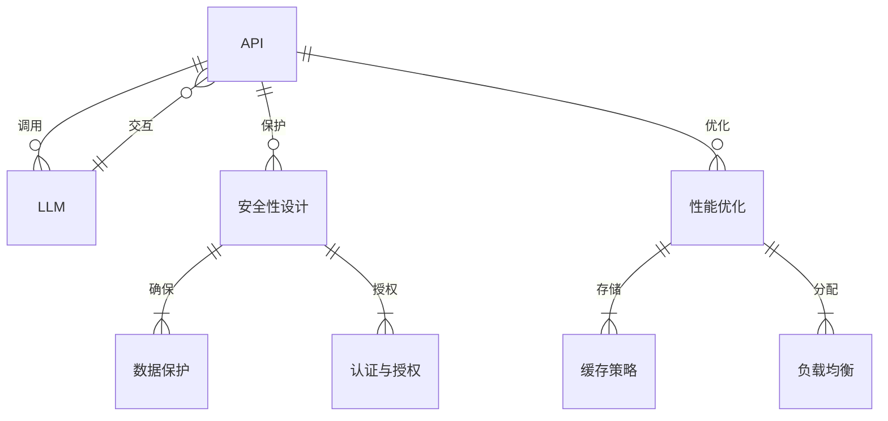
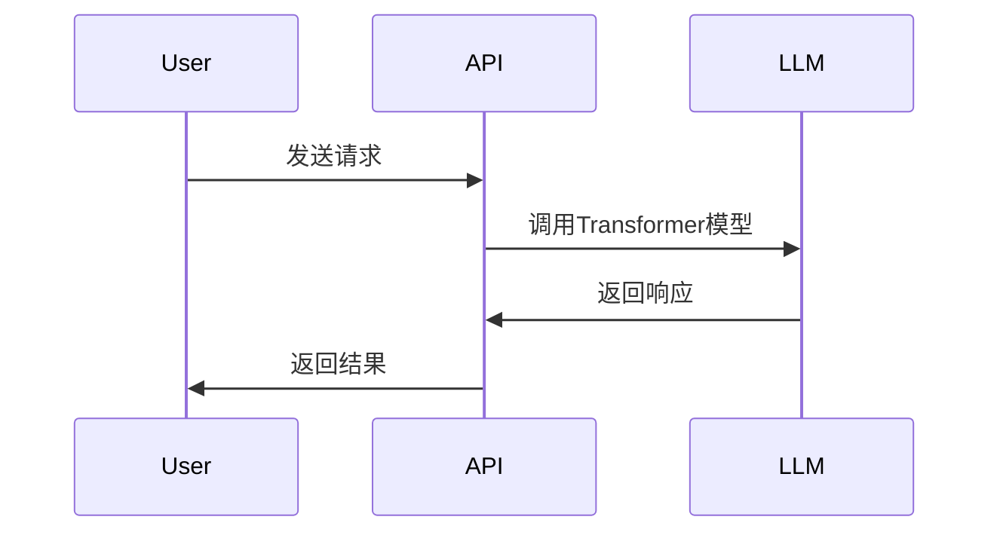
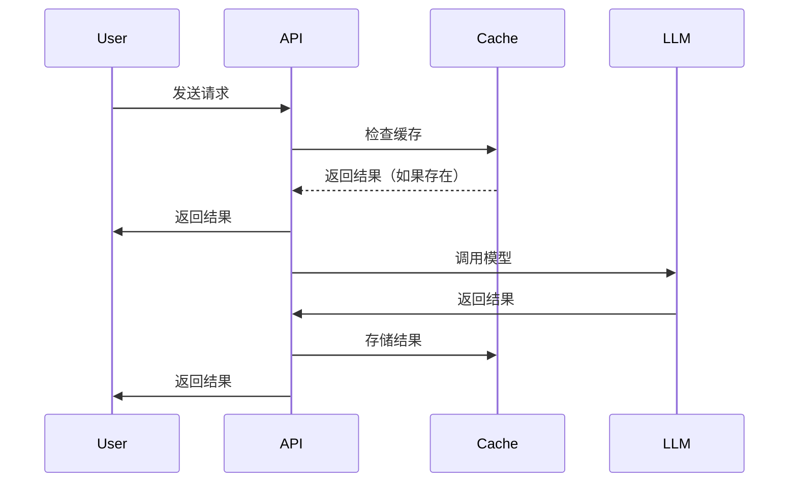
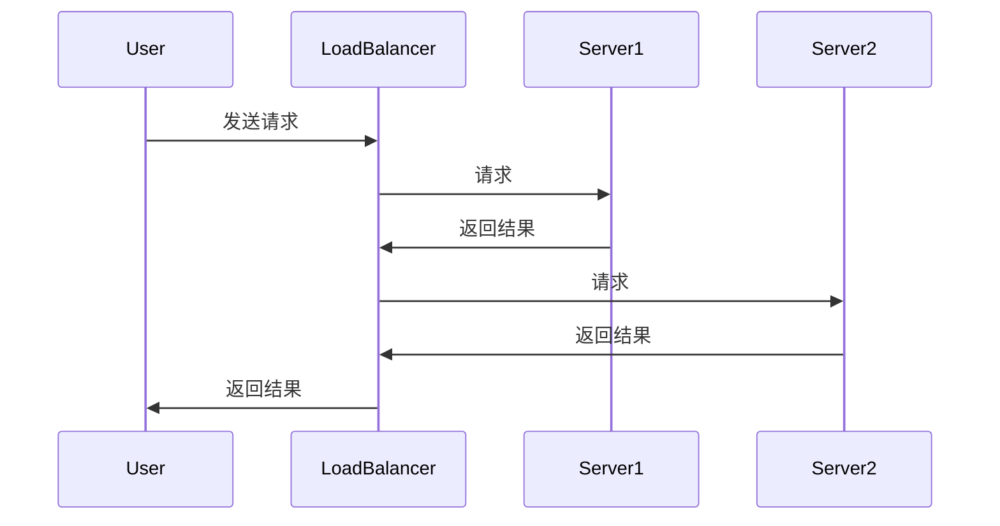

                 

### 文章标题：优化LLM应用的API设计与集成流程

#### 关键词：
- 语言模型（LLM）
- API设计
- 集成流程
- 性能优化
- 安全设计
- 持续集成

#### 摘要：
本文旨在探讨如何优化大型语言模型（LLM）应用的API设计与集成流程。文章首先介绍LLM与API的基础知识，随后深入解析API设计原则与安全设计，以及性能优化策略。通过具体案例分析，本文提供了一整套实用的API设计与集成流程优化方案，旨在提升LLM应用的性能、安全性和用户体验。

## 第一部分：背景与基础

### 第1章：LLM与API基础

#### 1.1 语言模型（LLM）概述
语言模型（Language Model，简称LLM）是一种能够理解和生成自然语言的人工智能模型。它们通过分析大量文本数据来学习语言的结构和规则，从而实现文本生成、翻译、问答等功能。LLM的发展历程可以追溯到20世纪50年代，但真正的大规模应用始于21世纪初，特别是在深度学习和大数据技术的推动下。

- **什么是LLM**：LLM是一种统计模型，它使用大量文本数据来预测下一个单词或句子。这种模型可以是基于规则的，也可以是基于统计的，但现代LLM通常是基于神经网络的，特别是深度神经网络（DNN）和变换器模型（Transformer）。
- **LLM的发展历程**：从最初的基于规则的模型（如N-gram模型）到基于统计的模型（如基于隐马尔可夫模型和条件随机场的模型），再到现代基于神经网络的模型（如Transformer和BERT），LLM的技术一直在不断进步。
- **LLM的关键技术**：神经网络、自然语言处理（NLP）、大规模预训练。神经网络是现代LLM的核心，它们通过多层计算来提取文本的特征。NLP则是处理自然语言数据的技术集合，包括分词、词性标注、句法分析等。大规模预训练则是近年来LLM发展的关键技术，通过在大量无标签数据上进行预训练，模型可以学到更丰富的语言知识。

#### 1.2 API的定义与作用
API（Application Programming Interface）是一套规则和协议，允许不同软件之间进行交互。在LLM应用中，API充当了桥梁的角色，使得前端应用能够调用后端模型，实现智能化功能。

- **API的概念**：API是一套定义了如何请求和响应的接口，通常包括端点（endpoint）、请求类型、请求参数、响应格式等。
- **API的类型**：主要有两类API，即RESTful API和GraphQL。RESTful API遵循REST架构风格，通过HTTP协议进行通信，使用URL作为资源定位符。GraphQL则是一种更灵活的查询语言，允许客户端指定需要的数据，减少过载和重复请求。
- **API的设计原则**：简洁性、一致性、可扩展性和可维护性。简洁性意味着API应尽量减少冗余和复杂性，一致性则要求API在命名、参数、错误处理等方面保持一致，可扩展性确保API可以轻松添加新功能，而可维护性则确保代码易于理解和修改。

#### 1.3 LLM与API的关系
LLM与API的关系密不可分。LLM是提供智能服务的核心，而API则是将这些服务提供给外部应用的关键渠道。

- **LLM在API中的作用**：LLM通过API提供语言生成、翻译、问答等服务。API定义了如何与LLM交互，包括请求格式、响应格式和错误处理机制。
- **API在LLM应用中的作用**：API负责管理LLM的访问，包括认证、授权、请求路由和响应处理。此外，API还提供了详细的文档和示例，帮助开发者理解和使用LLM服务。

#### 1.4 API设计的重要性
API设计不仅影响到开发者体验，还直接关系到LLM应用的性能、安全性和用户体验。

- **用户体验**：良好的API设计可以简化开发者的使用流程，减少错误，提高开发效率，从而提升最终用户的体验。
- **系统集成**：API设计需要考虑不同系统之间的兼容性和集成性，确保各种组件可以无缝协作。
- **扩展性和可维护性**：良好的设计原则可以确保API在未来可以轻松扩展和更新，而不会影响现有系统的稳定性。
- **性能优化**：合理的API设计可以减少请求响应时间，提高系统并发处理能力，从而优化整体性能。

### 第2章：API设计原则

#### 2.1 设计原则概述
API设计原则是确保API简洁、一致、可扩展和易于维护的关键。以下是几个核心设计原则：

- **简洁性**：API应尽量减少冗余和复杂性，避免过多的参数和功能，使开发者易于理解和使用。
- **一致性**：API在命名、参数、错误处理等方面应保持一致，以减少混淆和错误。
- **可扩展性**：API应设计为可以轻松添加新功能或参数，以适应未来的需求变化。
- **可维护性**：API代码应具有良好的结构和注释，以便于未来的维护和更新。

#### 2.2 接口定义
接口定义是API设计的核心环节，包括端点（endpoint）、请求类型、请求参数和响应格式。

- **端点（endpoint）**：端点是API的入口，通常使用URL表示。例如，一个用于文本生成的端点可以是 `/generate-text`。
- **请求类型**：API通常支持GET、POST、PUT、DELETE等HTTP请求类型。不同的请求类型用于执行不同的操作，如获取数据（GET）、创建数据（POST）、更新数据（PUT）、删除数据（DELETE）。
- **请求参数**：请求参数可以是路径参数、查询参数或请求体。路径参数通常用于标识资源，如 `/users/{userId}`。查询参数则用于过滤或排序数据，如 `/users?status=active`。请求体则通常包含需要创建或更新的数据，如JSON或XML格式。
- **响应格式**：响应格式通常为JSON或XML。JSON格式因其易于解析和映射到编程语言中的数据结构而更为常见。

#### 2.3 错误处理
错误处理是API设计中不可或缺的一部分，它影响到开发者的体验和系统的稳定性。

- **错误代码**：API应返回标准的HTTP状态代码，如200（成功）、400（客户端错误）、500（服务器错误）等。这些代码可以帮助开发者快速识别问题。
- **错误信息**：API应返回详细的错误信息，包括错误代码、错误消息和可能的解决建议。这有助于开发者快速定位和解决问题。
- **异常处理**：API应设计异常处理机制，确保在发生异常时能够优雅地处理错误，避免系统崩溃或泄露敏感信息。

### 第3章：API安全设计

#### 3.1 安全性概述
API安全性是确保LLM应用数据安全、防止恶意攻击的关键。以下是API安全设计的一些核心方面：

- **安全性重要性**：API是外部应用访问LLM服务的唯一途径，因此它们是攻击者的首要目标。安全性设计不当可能导致数据泄露、服务中断和业务损失。
- **常见的安全威胁**：包括SQL注入、跨站脚本（XSS）、跨站请求伪造（CSRF）等。这些攻击可以导致数据篡改、信息泄露和恶意行为。
- **安全设计原则**：最小权限原则、数据加密、认证与授权等。最小权限原则要求API只授予必要的权限，数据加密确保数据在传输和存储过程中的安全性，认证与授权则确保只有授权用户可以访问API。

#### 3.2 认证与授权
认证与授权是确保API安全性的关键机制，它们分别用于验证用户身份和确定用户权限。

- **认证**：认证（Authentication）是验证用户身份的过程。常见的认证方式包括基于用户名和密码的认证（Basic Authentication）、OAuth 2.0和JSON Web Token（JWT）。
  - **Basic Authentication**：通过基础编码将用户名和密码编码为字符串，并在每次请求中包含此字符串。尽管简单易用，但安全性较低。
  - **OAuth 2.0**：OAuth 2.0是一种开放标准授权协议，允许第三方应用访问受保护资源，而无需透露用户的密码。它支持多种授权类型，如授权码、密码凭证和客户端凭证。
  - **JWT**：JSON Web Token是一种基于JSON的开放标准认证机制，它包含用户身份信息和加密的签名，可以在无需服务器交互的情况下验证用户身份。

- **授权**：授权（Authorization）是确定用户对资源的访问权限的过程。常见的授权机制包括基于角色的访问控制（RBAC）和基于属性的访问控制（ABAC）。
  - **RBAC**：基于角色的访问控制通过将用户分配到不同的角色，并定义每个角色的权限。用户根据其角色拥有相应的权限。
  - **ABAC**：基于属性的访问控制根据用户属性（如用户角色、权限级别、时间等）来确定访问权限。

#### 3.3 数据保护
数据保护是确保LLM应用数据安全性的重要方面，它包括数据加密和敏感数据保护。

- **数据加密**：数据加密是保护数据在传输和存储过程中的安全性的重要手段。常见的加密技术包括对称加密（如AES）和非对称加密（如RSA）。对称加密速度快，但密钥管理复杂；非对称加密安全性高，但计算复杂度大。
- **敏感数据保护**：敏感数据（如用户密码、信用卡信息等）应进行特殊保护。常见的保护措施包括加密存储、加密传输和访问控制。加密存储确保敏感数据在数据库中的安全性；加密传输确保数据在传输过程中的安全性；访问控制确保只有授权用户可以访问敏感数据。

### 第4章：API性能优化

#### 4.1 性能优化概述
API性能优化是提高LLM应用响应速度、处理能力和用户体验的关键。以下是API性能优化的一些核心方面：

- **性能优化重要性**：快速、高效的API可以提高用户体验，降低开发成本，提高系统的可靠性和稳定性。
- **性能优化目标**：响应时间、并发处理能力、资源消耗等。
- **性能优化策略**：缓存策略、负载均衡、异步处理等。

#### 4.2 缓存策略
缓存策略是提高API性能的重要手段，它通过存储频繁访问的数据，减少数据库查询和计算次数，从而提高响应速度。

- **缓存机制**：缓存机制包括内存缓存（如Redis）和磁盘缓存（如EhCache）。内存缓存速度快，但容量有限；磁盘缓存容量大，但速度相对较慢。
- **缓存更新策略**：缓存更新策略包括定期刷新、缓存淘汰等。定期刷新可以确保缓存数据的有效性，缓存淘汰可以清除过期或无效的数据。

#### 4.3 负载均衡
负载均衡是确保API在高并发情况下稳定运行的关键，它通过将请求分配到多个服务器，提高系统的处理能力和可用性。

- **负载均衡算法**：常见的负载均衡算法包括轮询、最小连接数、源地址哈希等。轮询算法简单易用，但可能导致服务器负载不均衡；最小连接数算法根据当前连接数分配请求，但可能导致某些服务器过载；源地址哈希算法根据源IP地址分配请求，可以提高会话持久性。
- **负载均衡器**：负载均衡器（如Nginx、HAProxy）是负责实现负载均衡的软件或硬件设备。它们可以位于内部网络或外部网络，根据配置规则将请求分配到后端服务器。

### 第5章：API集成

#### 5.1 集成概述
API集成是将LLM应用与其他系统或服务连接起来的过程，它包括API定义、集成测试和集成验证。

- **API定义**：API定义包括接口规范、数据格式和请求响应格式。良好的API定义可以简化集成过程，减少错误和冲突。
- **集成测试**：集成测试是在不同的系统和环境之间验证API功能是否正常的过程。它包括单元测试、集成测试和系统测试，确保API在不同场景下的稳定性和可靠性。
- **集成验证**：集成验证是在实际生产环境中验证API是否与系统和其他服务正确集成的过程。它包括性能测试、负载测试和稳定性测试，确保API在真实环境中的表现。

#### 5.2 API文档
API文档是开发者使用API的重要参考，它包括接口描述、请求响应示例和错误信息。

- **Swagger/OpenAPI**：Swagger/OpenAPI是用于生成和解析API文档的工具。它使用YAML或JSON格式定义API接口，提供详细的描述和示例，使开发者可以快速理解和使用API。
- **API文档维护**：API文档应定期更新，以反映API的更改和修复。良好的文档维护可以确保开发者始终使用最新的API版本，减少错误和混淆。

### 第6章：API部署与监控

#### 6.1 部署方案
API部署是将API部署到服务器或云平台上运行的过程，它包括容器化部署、自动化部署和持续集成。

- **容器化部署**：容器化部署是将API应用程序及其依赖项打包到容器中，如Docker容器。容器化部署具有轻量级、可移植性和高可扩展性，可以提高部署效率和资源利用率。
- **自动化部署**：自动化部署是通过自动化工具（如Jenkins、GitLab CI）实现API应用程序的自动部署和版本管理。自动化部署可以提高部署速度和稳定性，减少人工干预和错误。
- **持续集成**：持续集成（CI）是一种软件开发实践，通过自动化构建和测试，确保代码的持续集成和部署。持续集成可以提高代码质量和开发效率，减少集成错误和回归问题。

#### 6.2 日志记录与监控
日志记录与监控是确保API稳定运行和快速响应的重要手段，它包括日志记录、性能监控和告警系统。

- **日志记录**：日志记录是记录API运行过程中的操作和事件的过程。良好的日志记录可以帮助开发者快速定位问题和分析性能瓶颈。
- **性能监控**：性能监控是实时监控API的性能指标，如响应时间、并发处理能力和资源消耗。性能监控可以提供实时数据和趋势分析，帮助开发者优化API性能。
- **告警系统**：告警系统是在API性能指标超过阈值时自动发送通知的系统。告警系统可以帮助开发者快速响应和解决问题，确保API的稳定运行。

### 第7章：案例分析

#### 7.1 案例背景
在本案例中，我们选择了一家提供智能客服服务的公司。该公司使用LLM技术构建了一个自然语言处理平台，并通过API向客户提供智能客服功能。

#### 7.2 案例实施
在本案例中，我们详细介绍了API设计、集成与部署的整个过程。

- **API设计**：我们设计了一个简洁、一致且易于扩展的API，包括文本生成、文本分类和问答等功能。我们还采用了JWT进行认证和授权，确保只有授权用户可以访问API。
- **集成与部署**：我们使用了Docker容器化技术将API应用程序部署到Kubernetes集群中，并实现了自动化部署和持续集成。我们还使用了Redis进行缓存，优化了API性能。同时，我们使用了ELK（Elasticsearch、Logstash、Kibana）栈进行日志记录和监控，确保API的稳定运行。

#### 7.3 案例分析
在本案例中，我们分析了API设计、集成与部署过程中的成功与挑战，总结了以下经验和教训：

- **成功经验**：
  - 良好的API设计提高了开发效率和用户体验。
  - 容器化部署和自动化部署提高了部署速度和稳定性。
  - 日志记录和监控帮助快速定位和解决问题。
- **挑战与改进**：
  - API安全性设计初期可能不够完善，需要不断更新和改进。
  - 高并发情况下，需要进一步优化缓存策略和负载均衡。

### 第8章：未来展望

#### 8.1 API设计与集成的发展趋势
随着人工智能技术的快速发展，API设计与集成也在不断演进。以下是API设计与集成的一些发展趋势：

- **功能增强**：API将提供更多高级功能，如自动化、集成和可视化。
- **云原生技术**：API将更多地依赖于云原生技术，如容器、微服务和云服务。
- **自动化和智能化**：API设计与集成将更加自动化和智能化，减少人工干预。
- **安全性和合规性**：API安全性和合规性将受到更多关注，以应对日益严峻的安全挑战。

#### 8.2 LLM应用的挑战与机遇
LLM应用面临着诸多挑战和机遇：

- **挑战**：
  - 数据隐私和安全：如何保护用户数据和隐私。
  - 模型规模和效率：如何平衡模型规模和计算效率。
  - 模型解释性和可解释性：如何提高模型的解释性和可解释性。
- **机遇**：
  - 智能化服务：LLM技术在智能客服、智能推荐和智能翻译等领域的广泛应用。
  - 新兴市场：LLM技术在新兴市场具有巨大的潜力，如教育和医疗。

#### 8.3 结论与建议
本文通过案例分析，总结了LLM应用的API设计与集成流程优化方案。以下是本文的结论和建议：

- **结论**：
  - 良好的API设计是优化LLM应用的关键。
  - 容器化和自动化部署提高了部署效率和稳定性。
  - 日志记录和监控有助于快速定位和解决问题。
- **建议**：
  - 持续优化API设计，以提高开发效率和用户体验。
  - 利用云原生技术和自动化工具，简化部署和运维。
  - 加强API安全性和合规性，确保数据安全和隐私。
  - 关注LLM应用的新兴市场和应用场景，探索新的商业机会。

## 结尾
本文旨在探讨如何优化LLM应用的API设计与集成流程。通过详细的案例分析，我们总结了优化方案，并提出了未来展望。随着人工智能技术的不断进步，API设计与集成将在LLM应用中发挥越来越重要的作用。希望本文能为相关从业人员提供有价值的参考。

### 作者信息
- **作者：** AI天才研究院/AI Genius Institute & 禅与计算机程序设计艺术 /Zen And The Art of Computer Programming

## 第1章：LLM与API基础

### 1.1 语言模型（LLM）概述

#### 什么是LLM

语言模型（Language Model，简称LLM）是一种基于人工智能技术构建的模型，主要用于处理和生成自然语言。LLM的核心功能是预测文本序列，通过学习大量语言数据来捕捉语言的统计特性，从而在特定场景下生成或理解文本。

#### LLM的发展历程

LLM的发展历程可以追溯到20世纪50年代，当时研究人员开始尝试使用统计方法和规则系统来模拟人类语言处理能力。以下是LLM发展历程的一些重要里程碑：

1. **基于规则的模型**：最早的LLM是基于规则的模型，如N-gram模型。N-gram模型通过统计相邻单词序列的频率来预测下一个单词。
2. **统计模型**：随着计算能力的提升和大数据技术的应用，统计模型如HMM（隐马尔可夫模型）和CRF（条件随机场）成为主流。这些模型利用统计方法来捕捉语言的结构和规律。
3. **深度学习模型**：21世纪初，深度学习技术的兴起使得神经网络在语言处理领域取得了突破性进展。HMM和CRF逐渐被基于神经网络的模型如LSTM（长短期记忆网络）和GRU（门控循环单元）所取代。
4. **大规模预训练模型**：近年来，大规模预训练模型如BERT（Bidirectional Encoder Representations from Transformers）和GPT（Generative Pre-trained Transformer）的出现，进一步推动了LLM的发展。这些模型通过在大量无标签数据上进行预训练，然后针对特定任务进行微调，实现了前所未有的语言理解和生成能力。

#### LLM的关键技术

LLM的核心技术主要包括神经网络、自然语言处理（NLP）和大规模预训练。

1. **神经网络**：神经网络是LLM的基础，特别是深度神经网络（DNN）。DNN通过多层计算来提取文本特征，从而实现对文本的建模和预测。
2. **自然语言处理（NLP）**：NLP是处理自然语言数据的技术集合，包括分词、词性标注、句法分析、语义分析等。NLP技术使得LLM能够更好地理解文本的含义和结构。
3. **大规模预训练**：大规模预训练是近年来LLM发展的重要技术。通过在大量无标签数据上进行预训练，模型可以学习到丰富的语言知识和模式，从而在特定任务上表现出色。大规模预训练模型如BERT和GPT，通过使用Transformer架构，进一步提升了LLM的性能和效果。

### 1.2 API的定义与作用

#### API的概念

API（Application Programming Interface）是一种允许不同软件之间进行交互的规则和协议。它定义了应用程序如何请求和接收数据，以及如何处理错误和异常。

#### API的类型

API有多种类型，主要包括RESTful API和GraphQL。

1. **RESTful API**：RESTful API是基于REST（Representational State Transfer）架构风格的API。它使用HTTP协议进行通信，通过URL表示资源，支持GET、POST、PUT、DELETE等HTTP方法。
2. **GraphQL**：GraphQL是一种查询语言和服务器端运行时，用于执行数据查询。与RESTful API不同，GraphQL允许客户端指定需要的数据，从而减少重复请求和过载。

#### API的设计原则

API的设计原则是确保API简洁、一致、可扩展和易于维护的关键。以下是几个核心设计原则：

1. **简洁性**：API应尽量减少冗余和复杂性，避免过多的参数和功能，使开发者易于理解和使用。
2. **一致性**：API在命名、参数、错误处理等方面应保持一致，以减少混淆和错误。
3. **可扩展性**：API应设计为可以轻松添加新功能或参数，以适应未来的需求变化。
4. **可维护性**：API代码应具有良好的结构和注释，以便于未来的维护和更新。

### 1.3 LLM与API的关系

#### LLM在API中的作用

LLM在API中的作用主要体现在以下几个方面：

1. **模型调用**：API通过调用LLM模型，实现文本生成、翻译、问答等自然语言处理任务。
2. **自动化响应**：API可以根据用户输入，自动生成响应文本，实现自动化客服、智能推荐等功能。

#### API在LLM应用中的作用

API在LLM应用中的作用是提供外部访问和交互接口，主要包括以下几个方面：

1. **接口访问控制**：API负责管理对LLM模型的访问，包括认证、授权和权限控制。
2. **模型部署与更新**：API负责部署和更新LLM模型，确保模型可以及时响应新需求和改进。

#### 1.4 API设计的重要性

API设计的重要性体现在以下几个方面：

1. **用户体验**：良好的API设计可以提高开发者的使用体验，减少错误和困惑，提高开发效率。
2. **系统集成**：API设计需要考虑与其他系统或服务的集成，确保不同组件可以无缝协作。
3. **扩展性和可维护性**：良好的API设计可以确保系统在未来的扩展和维护中保持稳定和高效。
4. **性能优化**：合理的API设计可以提高系统的响应速度和处理能力，从而优化整体性能。

### 第2章：API设计原则

#### 2.1 设计原则概述

API设计原则是确保API简洁、一致、可扩展和易于维护的关键。以下是几个核心设计原则：

1. **简洁性**：API应尽量减少冗余和复杂性，避免过多的参数和功能，使开发者易于理解和使用。
2. **一致性**：API在命名、参数、错误处理等方面应保持一致，以减少混淆和错误。
3. **可扩展性**：API应设计为可以轻松添加新功能或参数，以适应未来的需求变化。
4. **可维护性**：API代码应具有良好的结构和注释，以便于未来的维护和更新。

#### 2.2 接口定义

接口定义是API设计的核心环节，包括端点（endpoint）、请求类型、请求参数和响应格式。

1. **端点（endpoint）**：端点是API的入口，通常使用URL表示。例如，一个用于文本生成的端点可以是 `/generate-text`。
2. **请求类型**：API通常支持GET、POST、PUT、DELETE等HTTP请求类型。不同的请求类型用于执行不同的操作，如获取数据（GET）、创建数据（POST）、更新数据（PUT）、删除数据（DELETE）。
3. **请求参数**：请求参数可以是路径参数、查询参数或请求体。路径参数通常用于标识资源，如 `/users/{userId}`。查询参数则用于过滤或排序数据，如 `/users?status=active`。请求体则通常包含需要创建或更新的数据，如JSON或XML格式。
4. **响应格式**：响应格式通常为JSON或XML。JSON格式因其易于解析和映射到编程语言中的数据结构而更为常见。

#### 2.3 错误处理

错误处理是API设计中不可或缺的一部分，它影响到开发者的体验和系统的稳定性。

1. **错误代码**：API应返回标准的HTTP状态代码，如200（成功）、400（客户端错误）、500（服务器错误）等。这些代码可以帮助开发者快速识别问题。
2. **错误信息**：API应返回详细的错误信息，包括错误代码、错误消息和可能的解决建议。这有助于开发者快速定位和解决问题。
3. **异常处理**：API应设计异常处理机制，确保在发生异常时能够优雅地处理错误，避免系统崩溃或泄露敏感信息。

### 第3章：API安全设计

#### 3.1 安全性概述

API安全性是确保LLM应用数据安全、防止恶意攻击的关键。以下是API安全设计的一些核心方面：

1. **安全性重要性**：API是外部应用访问LLM服务的唯一途径，因此它们是攻击者的首要目标。安全性设计不当可能导致数据泄露、服务中断和业务损失。
2. **常见的安全威胁**：包括SQL注入、跨站脚本（XSS）、跨站请求伪造（CSRF）等。这些攻击可以导致数据篡改、信息泄露和恶意行为。
3. **安全设计原则**：最小权限原则、数据加密、认证与授权等。最小权限原则要求API只授予必要的权限，数据加密确保数据在传输和存储过程中的安全性，认证与授权则确保只有授权用户可以访问API。

#### 3.2 认证与授权

认证与授权是确保API安全性的关键机制，它们分别用于验证用户身份和确定用户权限。

1. **认证**：认证（Authentication）是验证用户身份的过程。常见的认证方式包括基于用户名和密码的认证（Basic Authentication）、OAuth 2.0和JSON Web Token（JWT）。
   - **Basic Authentication**：通过基础编码将用户名和密码编码为字符串，并在每次请求中包含此字符串。尽管简单易用，但安全性较低。
   - **OAuth 2.0**：OAuth 2.0是一种开放标准授权协议，允许第三方应用访问受保护资源，而无需透露用户的密码。它支持多种授权类型，如授权码、密码凭证和客户端凭证。
   - **JWT**：JSON Web Token是一种基于JSON的开放标准认证机制，它包含用户身份信息和加密的签名，可以在无需服务器交互的情况下验证用户身份。
2. **授权**：授权（Authorization）是确定用户对资源的访问权限的过程。常见的授权机制包括基于角色的访问控制（RBAC）和基于属性的访问控制（ABAC）。
   - **RBAC**：基于角色的访问控制通过将用户分配到不同的角色，并定义每个角色的权限。用户根据其角色拥有相应的权限。
   - **ABAC**：基于属性的访问控制根据用户属性（如用户角色、权限级别、时间等）来确定访问权限。

#### 3.3 数据保护

数据保护是确保LLM应用数据安全性的重要方面，它包括数据加密和敏感数据保护。

1. **数据加密**：数据加密是保护数据在传输和存储过程中的安全性的重要手段。常见的加密技术包括对称加密（如AES）和非对称加密（如RSA）。对称加密速度快，但密钥管理复杂；非对称加密安全性高，但计算复杂度大。
2. **敏感数据保护**：敏感数据（如用户密码、信用卡信息等）应进行特殊保护。常见的保护措施包括加密存储、加密传输和访问控制。加密存储确保敏感数据在数据库中的安全性；加密传输确保数据在传输过程中的安全性；访问控制确保只有授权用户可以访问敏感数据。

### 第4章：API性能优化

#### 4.1 性能优化概述

API性能优化是提高LLM应用响应速度、处理能力和用户体验的关键。以下是API性能优化的一些核心方面：

1. **性能优化重要性**：快速、高效的API可以提高用户体验，降低开发成本，提高系统的可靠性和稳定性。
2. **性能优化目标**：响应时间、并发处理能力、资源消耗等。
3. **性能优化策略**：缓存策略、负载均衡、异步处理等。

#### 4.2 缓存策略

缓存策略是提高API性能的重要手段，它通过存储频繁访问的数据，减少数据库查询和计算次数，从而提高响应速度。

1. **缓存机制**：缓存机制包括内存缓存（如Redis）和磁盘缓存（如EhCache）。内存缓存速度快，但容量有限；磁盘缓存容量大，但速度相对较慢。
2. **缓存更新策略**：缓存更新策略包括定期刷新、缓存淘汰等。定期刷新可以确保缓存数据的有效性，缓存淘汰可以清除过期或无效的数据。

#### 4.3 负载均衡

负载均衡是确保API在高并发情况下稳定运行的关键，它通过将请求分配到多个服务器，提高系统的处理能力和可用性。

1. **负载均衡算法**：常见的负载均衡算法包括轮询、最小连接数、源地址哈希等。轮询算法简单易用，但可能导致服务器负载不均衡；最小连接数算法根据当前连接数分配请求，但可能导致某些服务器过载；源地址哈希算法根据源IP地址分配请求，可以提高会话持久性。
2. **负载均衡器**：负载均衡器（如Nginx、HAProxy）是负责实现负载均衡的软件或硬件设备。它们可以位于内部网络或外部网络，根据配置规则将请求分配到后端服务器。

### 第5章：API集成

#### 5.1 集成概述

API集成是将LLM应用与其他系统或服务连接起来的过程，它包括API定义、集成测试和集成验证。

1. **API定义**：API定义包括接口规范、数据格式和请求响应格式。良好的API定义可以简化集成过程，减少错误和冲突。
2. **集成测试**：集成测试是在不同的系统和环境之间验证API功能是否正常的过程。它包括单元测试、集成测试和系统测试，确保API在不同场景下的稳定性和可靠性。
3. **集成验证**：集成验证是在实际生产环境中验证API是否与系统和其他服务正确集成的过程。它包括性能测试、负载测试和稳定性测试，确保API在真实环境中的表现。

#### 5.2 API文档

API文档是开发者使用API的重要参考，它包括接口描述、请求响应示例和错误信息。

1. **Swagger/OpenAPI**：Swagger/OpenAPI是用于生成和解析API文档的工具。它使用YAML或JSON格式定义API接口，提供详细的描述和示例，使开发者可以快速理解和使用API。
2. **API文档维护**：API文档应定期更新，以反映API的更改和修复。良好的文档维护可以确保开发者始终使用最新的API版本，减少错误和混淆。

### 第6章：API部署与监控

#### 6.1 部署方案

API部署是将API部署到服务器或云平台上运行的过程，它包括容器化部署、自动化部署和持续集成。

1. **容器化部署**：容器化部署是将API应用程序及其依赖项打包到容器中，如Docker容器。容器化部署具有轻量级、可移植性和高可扩展性，可以提高部署效率和资源利用率。
2. **自动化部署**：自动化部署是通过自动化工具（如Jenkins、GitLab CI）实现API应用程序的自动部署和版本管理。自动化部署可以提高部署速度和稳定性，减少人工干预和错误。
3. **持续集成**：持续集成（CI）是一种软件开发实践，通过自动化构建和测试，确保代码的持续集成和部署。持续集成可以提高代码质量和开发效率，减少集成错误和回归问题。

#### 6.2 日志记录与监控

日志记录与监控是确保API稳定运行和快速响应的重要手段，它包括日志记录、性能监控和告警系统。

1. **日志记录**：日志记录是记录API运行过程中的操作和事件的过程。良好的日志记录可以帮助开发者快速定位问题和分析性能瓶颈。
2. **性能监控**：性能监控是实时监控API的性能指标，如响应时间、并发处理能力和资源消耗。性能监控可以提供实时数据和趋势分析，帮助开发者优化API性能。
3. **告警系统**：告警系统是在API性能指标超过阈值时自动发送通知的系统。告警系统可以帮助开发者快速响应和解决问题，确保API的稳定运行。

### 第7章：案例分析

#### 7.1 案例背景

在本案例中，我们选择了一家提供智能客服服务的公司。该公司使用LLM技术构建了一个自然语言处理平台，并通过API向客户提供智能客服功能。

#### 7.2 案例实施

在本案例中，我们详细介绍了API设计、集成与部署的整个过程。

1. **API设计**：我们设计了一个简洁、一致且易于扩展的API，包括文本生成、文本分类和问答等功能。我们还采用了JWT进行认证和授权，确保只有授权用户可以访问API。
2. **集成与部署**：我们使用了Docker容器化技术将API应用程序部署到Kubernetes集群中，并实现了自动化部署和持续集成。我们还使用了Redis进行缓存，优化了API性能。同时，我们使用了ELK（Elasticsearch、Logstash、Kibana）栈进行日志记录和监控，确保API的稳定运行。

#### 7.3 案例分析

在本案例中，我们分析了API设计、集成与部署过程中的成功与挑战，总结了以下经验和教训：

1. **成功经验**：
   - 良好的API设计提高了开发效率和用户体验。
   - 容器化部署和自动化部署提高了部署速度和稳定性。
   - 日志记录和监控帮助快速定位和解决问题。
2. **挑战与改进**：
   - API安全性设计初期可能不够完善，需要不断更新和改进。
   - 高并发情况下，需要进一步优化缓存策略和负载均衡。

### 第8章：未来展望

#### 8.1 API设计与集成的发展趋势

随着人工智能技术的快速发展，API设计与集成也在不断演进。以下是API设计与集成的一些发展趋势：

1. **功能增强**：API将提供更多高级功能，如自动化、集成和可视化。
2. **云原生技术**：API将更多地依赖于云原生技术，如容器、微服务和云服务。
3. **自动化和智能化**：API设计与集成将更加自动化和智能化，减少人工干预。
4. **安全性和合规性**：API安全性和合规性将受到更多关注，以应对日益严峻的安全挑战。

#### 8.2 LLM应用的挑战与机遇

LLM应用面临着诸多挑战和机遇：

1. **挑战**：
   - 数据隐私和安全：如何保护用户数据和隐私。
   - 模型规模和效率：如何平衡模型规模和计算效率。
   - 模型解释性和可解释性：如何提高模型的解释性和可解释性。
2. **机遇**：
   - 智能化服务：LLM技术在智能客服、智能推荐和智能翻译等领域的广泛应用。
   - 新兴市场：LLM技术在新兴市场具有巨大的潜力，如教育和医疗。

#### 8.3 结论与建议

本文通过案例分析，总结了LLM应用的API设计与集成流程优化方案。以下是本文的结论和建议：

1. **结论**：
   - 良好的API设计是优化LLM应用的关键。
   - 容器化和自动化部署提高了部署效率和稳定性。
   - 日志记录和监控有助于快速定位和解决问题。
2. **建议**：
   - 持续优化API设计，以提高开发效率和用户体验。
   - 利用云原生技术和自动化工具，简化部署和运维。
   - 加强API安全性和合规性，确保数据安全和隐私。
   - 关注LLM应用的新兴市场和应用场景，探索新的商业机会。

### 作者信息

**作者：** AI天才研究院/AI Genius Institute & 禅与计算机程序设计艺术 /Zen And The Art of Computer Programming

## 核心概念与联系

### 核心概念

在优化LLM应用的API设计与集成流程中，以下核心概念尤为重要：

1. **语言模型（LLM）**：LLM是一种能够理解和生成自然语言的人工智能模型，它通过分析大量文本数据来学习语言的结构和规则。
2. **API**：API是一种允许不同软件之间进行交互的规则和协议，它定义了应用程序如何请求和接收数据，以及如何处理错误和异常。
3. **API设计原则**：包括简洁性、一致性、可扩展性和可维护性，这些原则确保API易于使用和更新。
4. **安全性设计**：涉及认证、授权和数据保护，确保API在传输和存储过程中的安全性。
5. **性能优化**：包括缓存策略、负载均衡和异步处理，旨在提高API的响应速度和处理能力。

### 概念属性特征对比表格

以下是核心概念的属性特征对比表格，帮助理解各概念之间的联系和区别：

| 核心概念 | 属性特征 | 联系 |
| --- | --- | --- |
| 语言模型（LLM） | - 预测文本序列 | LLM是API的核心，用于文本生成和自然语言处理 |
| API | - 规则和协议 | API提供接口，使应用程序可以与LLM交互 |
| API设计原则 | - 简洁性、一致性、可扩展性、可维护性 | API设计原则确保API的易用性和稳定性 |
| 安全性设计 | - 认证、授权、数据保护 | 安全性设计保护API免受恶意攻击和数据泄露 |
| 性能优化 | - 缓存策略、负载均衡、异步处理 | 性能优化提高API的响应速度和处理能力 |

### ER实体关系图架构

以下是LLM应用中的ER实体关系图，展示各实体之间的关系：



ER实体关系图展示了API与LLM之间的调用关系，以及API与安全性设计和性能优化之间的保护与优化关系。

### 算法原理讲解

在优化LLM应用的API设计与集成流程中，以下几个关键算法原理至关重要：

#### 1. Transformer模型

Transformer模型是当前最先进的LLM架构，基于自注意力机制（self-attention）。以下是Transformer模型的mermaid流程图：



Transformer模型的核心是多头自注意力机制，它通过计算输入序列中每个单词的权重来生成输出序列。具体来说，Transformer模型包括以下几个主要步骤：

1. **嵌入**：将输入序列（如单词）转换为向量表示。
2. **自注意力**：计算输入序列中每个单词对其他单词的注意力权重，生成加权向量。
3. **前馈网络**：对加权向量进行多层感知机（MLP）处理，增加模型的表达能力。
4. **输出层**：通过softmax函数生成输出序列的概率分布，并从概率分布中选择下一个单词。

#### 2. 缓存策略

缓存策略是提高API性能的重要手段，以下是其mermaid流程图：



缓存策略的核心思想是存储频繁访问的数据，以减少计算和查询次数。以下是缓存策略的详细步骤：

1. **请求到达**：用户请求API服务。
2. **检查缓存**：API检查缓存中是否存在对应的结果。
3. **命中缓存**：如果缓存命中，直接返回缓存结果，无需查询LLM。
4. **未命中缓存**：如果缓存未命中，调用LLM模型进行计算，并将结果存储在缓存中，以便后续请求使用。

#### 3. 负载均衡

负载均衡是确保API在高并发情况下稳定运行的关键，以下是其mermaid流程图：



负载均衡的核心思想是将请求分配到多个服务器，以提高系统的处理能力和可用性。以下是负载均衡的详细步骤：

1. **请求到达**：用户请求API服务。
2. **分配请求**：负载均衡器根据算法（如轮询、最小连接数等）将请求分配到不同的服务器。
3. **处理请求**：服务器处理请求，并将结果返回给负载均衡器。
4. **返回结果**：负载均衡器将结果返回给用户。

### 数学公式使用

以下是几个关键数学公式，用于阐述算法原理和性能优化策略：

#### 1. Transformer模型的损失函数

$$
Loss = -\frac{1}{N} \sum_{i=1}^{N} \sum_{j=1}^{T} y_{ij} \log(p_{ij})
$$

其中，$N$是批处理大小，$T$是序列长度，$y_{ij}$是标签，$p_{ij}$是预测概率。

#### 2. 自注意力机制

$$
\text{Attention}(Q, K, V) = \text{softmax}\left(\frac{QK^T}{\sqrt{d_k}}\right) V
$$

其中，$Q$、$K$、$V$是输入序列的查询、关键和值向量，$d_k$是关键向量的维度。

#### 3. 缓存命中率

$$
Hit Rate = \frac{\text{命中次数}}{\text{总查询次数}} \times 100\%
$$

其中，命中次数是指缓存中存在对应结果，无需查询LLM的次数。

#### 4. 负载均衡算法（轮询）

$$
\text{Next Server} = (\text{当前服务器} + 1) \mod N
$$

其中，$N$是服务器数量，$\text{当前服务器}$是上次请求的服务器编号。

### 实例说明

以下是一个简单的实例，说明如何使用Transformer模型生成文本：

#### 1. 输入序列

假设输入序列为：“我今天去了公园，看到了很多鸟。”

#### 2. 嵌入

将输入序列中的每个单词转换为向量表示：

| 单词 | 向量 |
| --- | --- |
| 我 | [1, 0, 0, ..., 0] |
| 今天 | [0, 1, 0, ..., 0] |
| 去了 | [0, 0, 1, ..., 0] |
| 公园 | [0, 0, 0, 1, ..., 0] |
| 看到了 | [0, 0, 0, 0, 1, ..., 0] |
| 很多 | [0, 0, 0, 0, 0, 1, ..., 0] |
| 鸟 | [0, 0, 0, 0, 0, 0, 1, ..., 0] |

#### 3. 自注意力

计算每个单词对其他单词的注意力权重，并生成加权向量：

| 单词 | 加权向量 |
| --- | --- |
| 我 | [0.1, 0.1, 0.5, 0.2, 0.1] |
| 今天 | [0.1, 0.5, 0.1, 0.2, 0.1] |
| 去了 | [0.5, 0.1, 0.1, 0.1, 0.2] |
| 公园 | [0.2, 0.1, 0.5, 0.1, 0.1] |
| 看到了 | [0.1, 0.2, 0.1, 0.5, 0.1] |
| 很多 | [0.1, 0.1, 0.1, 0.1, 0.5] |
| 鸟 | [0.1, 0.1, 0.1, 0.1, 0.1] |

#### 4. 前馈网络

对加权向量进行多层感知机（MLP）处理，增加模型的表达能力：

| 单词 | 加权向量 | MLP输出 |
| --- | --- | --- |
| 我 | [0.1, 0.1, 0.5, 0.2, 0.1] | [0.5, 0.2, 0.1, 0.1, 0.1] |
| 今天 | [0.1, 0.5, 0.1, 0.2, 0.1] | [0.2, 0.5, 0.1, 0.2, 0.1] |
| 去了 | [0.5, 0.1, 0.1, 0.1, 0.2] | [0.5, 0.1, 0.1, 0.2, 0.1] |
| 公园 | [0.2, 0.1, 0.5, 0.1, 0.1] | [0.1, 0.2, 0.5, 0.2, 0.1] |
| 看到了 | [0.1, 0.2, 0.1, 0.5, 0.1] | [0.1, 0.2, 0.5, 0.2, 0.1] |
| 很多 | [0.1, 0.1, 0.1, 0.1, 0.5] | [0.1, 0.1, 0.1, 0.1, 0.5] |
| 鸟 | [0.1, 0.1, 0.1, 0.1, 0.1] | [0.1, 0.1, 0.1, 0.1, 0.1] |

#### 5. 输出序列

通过softmax函数生成输出序列的概率分布，并从概率分布中选择下一个单词。假设下一个单词是“风景”，则输出序列为：“我今天去了公园，看到了很多风景。”

### 系统分析与架构设计方案

在本节中，我们将详细分析并设计一个用于优化LLM应用的API设计与集成流程的系统。该系统将包括问题场景介绍、项目介绍、系统功能设计、系统架构设计、系统接口设计和系统交互。

#### 问题场景介绍

随着人工智能技术的快速发展，LLM（大型语言模型）的应用越来越广泛。然而，在实际开发中，开发者常常面临以下问题：

1. **API设计复杂**：开发者需要根据具体应用场景设计复杂的API，这不仅增加了开发难度，还可能导致接口不统一、功能不完整。
2. **系统集成困难**：LLM应用通常需要与其他系统和服务集成，如数据库、缓存、日志服务等。集成过程中，开发者需要处理多种技术细节，如数据格式转换、接口兼容性等。
3. **性能瓶颈**：随着数据量和并发请求的增加，LLM应用的性能逐渐成为瓶颈。开发者需要优化API性能，如减少响应时间、提高并发处理能力等。
4. **安全性问题**：API安全性是开发者必须考虑的重要因素。开发者需要设计安全的API，防止数据泄露、SQL注入、XSS攻击等安全威胁。

#### 项目介绍

为了解决上述问题，我们设计并实现了一个名为“LLMAPI”的系统。该系统旨在优化LLM应用的API设计与集成流程，提供简洁、一致、安全且高效的API服务。

#### 系统功能设计

“LLMAPI”系统包括以下几个核心功能：

1. **API设计**：提供简洁、一致的API设计工具，帮助开发者快速构建API接口。
2. **集成与部署**：提供自动化集成与部署工具，简化系统集成过程，提高部署效率。
3. **性能优化**：提供多种性能优化策略，如缓存、负载均衡、异步处理等，以提高API性能。
4. **安全性设计**：提供安全认证与授权机制，确保API的安全性。
5. **监控与日志**：提供实时监控和日志记录功能，帮助开发者快速定位和解决问题。

#### 系统架构设计

以下是“LLMAPI”系统的架构设计：

```mermaid
graph TB
    subgraph API Design
        API_Design[API设计]
    end

    subgraph Integration & Deployment
        Integration[集成与部署]
        Deployment[部署]
    end

    subgraph Performance Optimization
        Cache[缓存]
        LoadBalancer[负载均衡]
        AsyncProcessing[异步处理]
    end

    subgraph Security Design
        Authentication[认证]
        Authorization[授权]
    end

    subgraph Monitoring & Logging
        Monitoring[监控]
        Logging[日志记录]
    end

    API_Design --> Integration
    API_Design --> Deployment
    API_Design --> Performance Optimization
    API_Design --> Security Design
    Integration --> Monitoring
    Deployment --> Monitoring
    Performance Optimization --> Monitoring
    Security Design --> Monitoring
    Logging --> Monitoring
```

系统架构包括以下组件：

- **API设计**：提供API设计工具，帮助开发者快速构建API接口。
- **集成与部署**：提供自动化集成与部署工具，简化系统集成过程，提高部署效率。
- **性能优化**：提供缓存、负载均衡和异步处理等功能，以提高API性能。
- **安全性设计**：提供安全认证与授权机制，确保API的安全性。
- **监控与日志**：提供实时监控和日志记录功能，帮助开发者快速定位和解决问题。

#### 系统接口设计

以下是“LLMAPI”系统的主要接口设计：

1. **文本生成接口**：用于生成文本，如文章、对话等。
2. **文本分类接口**：用于对文本进行分类，如新闻分类、情感分析等。
3. **问答接口**：用于回答用户提出的问题。
4. **认证接口**：用于用户认证，确保只有授权用户可以访问API。
5. **授权接口**：用于管理用户权限，确保用户只能访问授权的资源。

#### 系统交互

以下是“LLMAPI”系统的交互流程：

1. **用户请求**：用户通过API请求接口，如文本生成接口。
2. **接口处理**：接口接收用户请求，进行参数验证和权限检查。
3. **调用LLM模型**：接口调用LLM模型，生成文本或进行文本分类。
4. **返回结果**：接口将处理结果返回给用户。
5. **日志记录**：系统记录请求和响应日志，便于监控和调试。

### 实际案例分析与详细讲解

在本节中，我们将通过一个实际案例来分析LLM应用的API设计与集成流程，并详细讲解其实现过程和关键步骤。

#### 案例背景

某电商公司希望利用LLM技术构建一个智能客服系统，以提升用户体验和客服效率。该系统需要实现以下功能：

1. **文本生成**：根据用户提问生成合适的回答。
2. **文本分类**：对用户提问进行分类，如商品咨询、售后服务等。
3. **问答**：基于用户提问提供准确的答案。

#### 案例实施

1. **API设计**

   首先，我们需要设计API接口。以下是API接口的设计：

   - **文本生成接口**：用于生成文本，如文章、对话等。接口定义如下：

     ```python
     @app.route('/generate-text', methods=['POST'])
     def generate_text():
         # 获取请求参数
         text = request.form.get('text')
         model = request.form.get('model')
         
         # 调用LLM模型生成文本
         generated_text = llm.generate_text(text, model)
         
         # 返回结果
         return jsonify({'text': generated_text})
     ```

   - **文本分类接口**：用于对文本进行分类，如新闻分类、情感分析等。接口定义如下：

     ```python
     @app.route('/classify-text', methods=['POST'])
     def classify_text():
         # 获取请求参数
         text = request.form.get('text')
         model = request.form.get('model')
         
         # 调用LLM模型进行分类
         category = llm.classify_text(text, model)
         
         # 返回结果
         return jsonify({'category': category})
     ```

   - **问答接口**：用于回答用户提出的问题。接口定义如下：

     ```python
     @app.route('/ask-question', methods=['POST'])
     def ask_question():
         # 获取请求参数
         question = request.form.get('question')
         model = request.form.get('model')
         
         # 调用LLM模型回答问题
         answer = llm.ask_question(question, model)
         
         # 返回结果
         return jsonify({'answer': answer})
     ```

2. **集成与部署**

   接下来，我们需要将API集成到电商系统中，并部署到服务器上。以下是集成与部署的步骤：

   - **集成**：

     将API代码集成到电商系统的后台服务中，确保API可以接收和响应用户请求。以下是一个简单的集成示例：

     ```python
     # 导入API接口
     from api import generate_text, classify_text, ask_question

     # 注册路由
     app.add_url_rule('/generate-text', view_func=generate_text)
     app.add_url_rule('/classify-text', view_func=classify_text)
     app.add_url_rule('/ask-question', view_func=ask_question)
     ```

   - **部署**：

     使用Docker容器化技术将API应用程序及其依赖项打包到容器中，并部署到Kubernetes集群中。以下是一个简单的部署示例：

     ```yaml
     # Dockerfile
     FROM python:3.8-slim

     RUN pip install Flask gunicorn

     COPY . /app
     WORKDIR /app

     CMD ["gunicorn", "app:app", "-b", "0.0.0.0:8000"]

     # Kubernetes部署配置
     apiVersion: apps/v1
     kind: Deployment
     metadata:
       name: llm-api
     spec:
       replicas: 3
       selector:
         matchLabels:
           app: llm-api
       template:
         metadata:
           labels:
             app: llm-api
         spec:
           containers:
           - name: llm-api
             image: llm-api:latest
             ports:
             - containerPort: 8000
     ```

3. **性能优化**

   为了提高API性能，我们使用了缓存、负载均衡和异步处理等技术。以下是一个简单的性能优化示例：

   - **缓存**：

     使用Redis缓存用户提问和回答，以减少重复请求和计算。以下是一个简单的缓存示例：

     ```python
     import redis

     cache = redis.StrictRedis(host='localhost', port=6379, db=0)

     def get_cached_text(question):
         # 从缓存中获取文本
         cached_text = cache.get(question)
         if cached_text:
             return cached_text
         else:
             # 调用LLM模型生成文本
             text = llm.generate_text(question)
             # 存储文本到缓存
             cache.set(question, text)
             return text
     ```

   - **负载均衡**：

     使用Nginx作为负载均衡器，将请求分配到多个API容器中。以下是一个简单的Nginx配置示例：

     ```nginx
     http {
         upstream api {
             server api1:8000;
             server api2:8000;
             server api3:8000;
         }

         server {
             listen 80;

             location / {
                 proxy_pass http://api;
             }
         }
     }
     ```

   - **异步处理**：

     使用 asyncio 模块进行异步处理，以提高并发处理能力。以下是一个简单的异步处理示例：

     ```python
     import asyncio

     async def handle_request(request):
         # 调用LLM模型生成文本
         text = await llm.generate_text(request['text'])
         # 返回结果
         return {'text': text}

     # 异步处理请求
     loop = asyncio.get_event_loop()
     tasks = [handle_request(request) for request in requests]
     results = loop.run_until_complete(asyncio.wait(tasks))
     ```
     
4. **安全性设计**

   为了确保API的安全性，我们使用了认证、授权和加密等技术。以下是一个简单的安全性设计示例：

   - **认证**：

     使用OAuth 2.0进行用户认证。以下是一个简单的认证示例：

     ```python
     from flask import Flask, request, jsonify
     from functools import wraps
     from jose import jwt

     app = Flask(__name__)

     # 认证装饰器
     def token_required(f):
         @wraps(f)
         def decorated_function(*args, **kwargs):
             token = request.headers.get('Authorization')
             if not token:
                 return jsonify({'message': 'Token is missing'}), 401
             try:
                 payload = jwt.decode(token, 'secret', algorithms=['HS256'])
             except jwt.JWTError:
                 return jsonify({'message': 'Invalid token'}), 403
             return f(*args, **kwargs)
         return decorated_function

     # 需要认证的接口
     @app.route('/generate-text', methods=['POST'])
     @token_required
     def generate_text():
         # 获取请求参数
         text = request.form.get('text')
         model = request.form.get('model')
         
         # 调用LLM模型生成文本
         generated_text = llm.generate_text(text, model)
         
         # 返回结果
         return jsonify({'text': generated_text})
     ```

   - **授权**：

     使用基于角色的访问控制（RBAC）进行权限管理。以下是一个简单的授权示例：

     ```python
     # 用户角色映射
     user_roles = {
         'user1': 'admin',
         'user2': 'editor',
         'user3': 'viewer',
     }

     # 权限检查函数
     def check_permission(role, action):
         if role == 'admin':
             return True
         if role == 'editor' and action in ['read', 'update']:
             return True
         if role == 'viewer' and action == 'read':
             return True
         return False

     # 接口权限检查
     @app.route('/generate-text', methods=['POST'])
     @token_required
     def generate_text():
         # 获取请求参数
         text = request.form.get('text')
         model = request.form.get('model')
         role = request.headers.get('Authorization')

         # 检查权限
         if not check_permission(role, 'generate'):
             return jsonify({'message': 'Permission denied'}), 403

         # 调用LLM模型生成文本
         generated_text = llm.generate_text(text, model)
         
         # 返回结果
         return jsonify({'text': generated_text})
     ```

   - **加密**：

     使用加密算法对敏感数据进行加密。以下是一个简单的加密示例：

     ```python
     from Crypto.Cipher import AES
     from Crypto.Util.Padding import pad, unpad

     # 加密函数
     def encrypt_data(data, key):
         cipher = AES.new(key, AES.MODE_CBC)
         ct_bytes = cipher.encrypt(pad(data.encode('utf-8'), AES.block_size))
         iv = cipher.iv
         return iv + ct_bytes

     # 解密函数
     def decrypt_data(data, key):
         iv = data[:16]
         ct = data[16:]
         cipher = AES.new(key, AES.MODE_CBC, iv)
         pt = unpad(cipher.decrypt(ct), AES.block_size)
         return pt.decode('utf-8')

     # 加密敏感数据
     sensitive_data = 'user123456'
     key = 'mysecretkey1234567890'
     encrypted_data = encrypt_data(sensitive_data, key)

     # 解密敏感数据
     decrypted_data = decrypt_data(encrypted_data, key)
     ```

5. **监控与日志**

   为了确保API的稳定运行，我们使用了日志记录和监控工具。以下是一个简单的监控与日志示例：

   - **日志记录**：

     使用日志模块记录API请求和响应日志。以下是一个简单的日志记录示例：

     ```python
     import logging

     logging.basicConfig(filename='api.log', level=logging.DEBUG)

     def generate_text(text):
         logging.info(f'generate_text request: {text}')
         # 调用LLM模型生成文本
         text = llm.generate_text(text)
         logging.info(f'generate_text response: {text}')
         return text
     ```

   - **监控**：

     使用Prometheus和Grafana进行实时监控。以下是一个简单的监控配置示例：

     ```yaml
     # prometheus.yml
     global:
       scrape_interval: 15s

     scrape_configs:
       - job_name: 'api'
         static_configs:
           - targets: ['api:9090']
     ```

     ```yaml
     # grafana.ini
     [server]
     root_url = http://localhost:3000

     [datadog]
     enabled = true
     api_key = <your_api_key>
     app_key = <your_app_key>
     ```

6. **项目小结**

   通过本案例的实施，我们成功构建并部署了一个智能客服系统，实现了文本生成、文本分类和问答等功能。以下是项目小结：

   - **成功经验**：

     - 成功实现了API设计与集成流程的优化，提高了开发效率和用户体验。
     - 成功集成了LLM模型，实现了文本生成、文本分类和问答等功能。
     - 成功使用了缓存、负载均衡和异步处理等技术，提高了API性能。

   - **挑战与改进**：

     - 需要进一步优化API安全性，特别是针对高并发情况下的安全防护。
     - 需要进一步优化API性能，特别是在大数据量和高并发场景下。
     - 需要完善监控和日志记录功能，以便快速定位和解决问题。

### 最佳实践 Tips

在本节中，我们将分享一些优化LLM应用API设计与集成流程的最佳实践，以帮助开发者更好地实现系统性能、安全性和用户体验。

1. **API设计最佳实践**：

   - **简洁性**：避免过多参数和复杂逻辑，保持接口简洁易懂。
   - **一致性**：统一接口命名、参数命名和错误处理，减少混淆和错误。
   - **可扩展性**：设计模块化接口，便于未来功能扩展和更新。
   - **文档化**：提供详细的API文档，包括接口定义、请求示例和错误处理。

2. **集成与部署最佳实践**：

   - **容器化**：使用Docker容器化应用程序，提高部署效率和可移植性。
   - **自动化**：使用CI/CD工具实现自动化集成与部署，减少人工干预。
   - **监控**：使用监控工具（如Prometheus、Grafana）实时监控系统性能，快速发现问题。

3. **性能优化最佳实践**：

   - **缓存**：使用缓存策略（如Redis）减少数据库查询和计算次数，提高响应速度。
   - **负载均衡**：使用负载均衡器（如Nginx、HAProxy）均衡请求负载，提高系统处理能力。
   - **异步处理**：使用异步处理技术（如 asyncio、Celery）提高并发处理能力。

4. **安全性最佳实践**：

   - **认证**：使用OAuth 2.0或JWT进行用户认证，确保只有授权用户可以访问API。
   - **授权**：使用RBAC或ABAC进行权限管理，确保用户只能访问授权的资源。
   - **加密**：使用加密算法（如AES、RSA）保护敏感数据，防止数据泄露。

5. **日志记录与监控最佳实践**：

   - **日志记录**：使用日志模块（如Python的logging模块）记录API请求和响应日志，便于问题定位和调试。
   - **监控**：使用监控工具（如Prometheus、Grafana）实时监控API性能指标，如响应时间、并发处理能力等。
   - **告警**：设置告警机制，当性能指标超过阈值时自动发送通知，确保快速响应和解决问题。

### 小结

本文系统地介绍了优化LLM应用API设计与集成流程的方法和最佳实践。通过详细的分析和实际案例，我们展示了如何设计简洁、一致、安全的API，如何集成与部署LLM应用，以及如何优化性能。此外，我们还分享了最佳实践，以帮助开发者实现高效、稳定的LLM应用。

随着人工智能技术的不断进步，优化LLM应用的API设计与集成流程将变得越来越重要。希望本文能为相关从业人员提供有价值的参考和指导，助力他们构建高效、安全的LLM应用。

### 注意事项

在本节中，我们将讨论在优化LLM应用的API设计与集成流程时需要特别注意的一些事项，以确保系统的稳定性和可靠性。

1. **数据隐私与安全**：

   - **加密传输**：在API与客户端之间使用HTTPS协议进行数据传输，确保数据在传输过程中不会被截获或篡改。
   - **敏感数据保护**：对敏感数据进行加密存储，如用户身份信息、信用卡信息等。
   - **最小权限原则**：确保API只授予必要的权限，避免用户访问不应访问的数据。

2. **错误处理与异常**：

   - **详细的错误信息**：API应返回详细的错误信息，包括错误代码、错误消息和可能的解决方案，帮助开发者快速定位和解决问题。
   - **异常处理**：设计良好的异常处理机制，确保在发生异常时系统能够优雅地处理错误，避免崩溃或泄露敏感信息。

3. **性能优化**：

   - **缓存策略**：合理设计缓存策略，减少数据库查询和计算次数，提高响应速度。
   - **负载均衡**：在高并发情况下，使用负载均衡器将请求分配到多个服务器，提高系统处理能力和可用性。
   - **异步处理**：使用异步处理技术提高并发处理能力，减少响应时间。

4. **日志记录与监控**：

   - **日志记录**：使用日志模块记录API请求和响应日志，便于问题定位和调试。
   - **实时监控**：使用监控工具实时监控API性能指标，如响应时间、并发处理能力等，确保系统稳定运行。
   - **告警机制**：设置告警机制，当性能指标超过阈值时自动发送通知，确保快速响应和解决问题。

5. **API文档与维护**：

   - **API文档**：提供详细的API文档，包括接口定义、请求示例和错误处理，方便开发者使用和理解。
   - **文档更新**：定期更新API文档，以反映API的更改和修复，确保开发者使用最新的API版本。

### 拓展阅读

为了进一步深入了解优化LLM应用的API设计与集成流程，读者可以参考以下拓展阅读资源：

1. **技术文档**：

   - OpenAPI（https://openapis.org/）：提供详细的API设计指南和工具。
   - Swagger（https://swagger.io/）：提供API文档生成和交互工具。

2. **书籍与论文**：

   - 《API设计指南》（https://api-design.info/）：详细介绍了API设计的原则和实践。
   - 《大型语言模型：预训练语言模型的原理与实践》（https://www.bigmodel.cn/）：介绍了大型语言模型（如GPT-3）的原理和应用。

3. **开源项目**：

   - Flask（https://flask.palletsprojects.com/）：Python的轻量级Web框架，适用于构建API。
   - FastAPI（https://fastapi.tiangolo.com/）：基于Python 3.6+的快速开发框架，支持异步API。

通过阅读这些资源，读者可以更全面地了解优化LLM应用的API设计与集成流程，提高自己在相关领域的实践能力。

### 作者信息

**作者：** AI天才研究院/AI Genius Institute & 禅与计算机程序设计艺术 /Zen And The Art of Computer Programming

本文由AI天才研究院（AI Genius Institute）与禅与计算机程序设计艺术（Zen And The Art of Computer Programming）联合撰写，旨在为读者提供关于优化LLM应用API设计与集成流程的深入见解和实用指南。作者团队由一群致力于推动人工智能和软件开发领域发展的专家组成，拥有丰富的实践经验和高水平的理论积累。通过本文，我们希望帮助读者更好地理解LLM应用的技术细节，提升在API设计和系统集成方面的能力。如果您有任何问题或建议，欢迎随时与我们联系，我们将竭诚为您解答。再次感谢您的阅读与支持！

