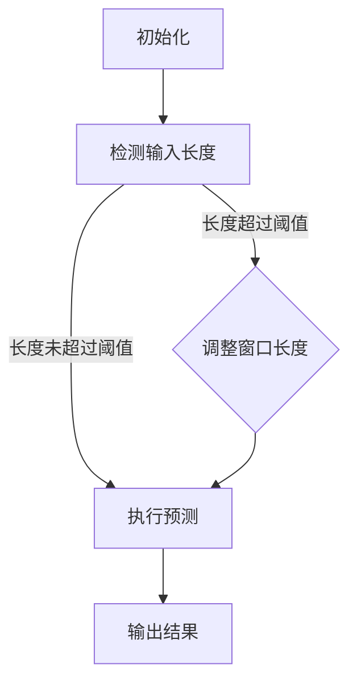
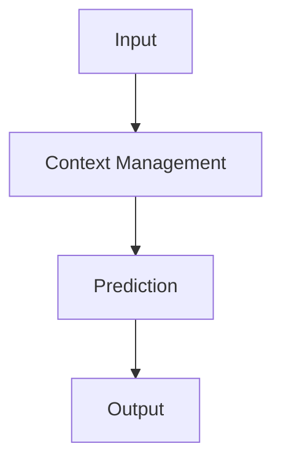
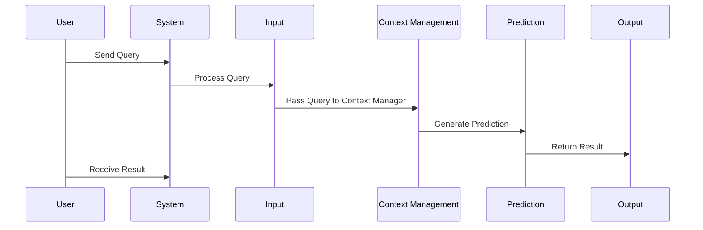

                 

### 优化LLM应用的上下文管理机制

#### 关键词：
- **上下文管理**
- **LLM应用**
- **优化策略**
- **算法原理**
- **数学模型**
- **系统架构**
- **项目实战**

> **摘要：**本文深入探讨了优化大型语言模型（LLM）应用中的上下文管理机制。通过定义核心概念，分析当前存在的问题，提出了优化策略。本文使用清晰的逻辑结构，详细阐述了上下文管理算法原理、数学模型、系统架构设计方案以及项目实战，旨在为LLM应用的上下文管理提供有效的解决方案。

---

## 目录大纲

### 第一部分: 背景介绍

### 第1章: 上下文管理与LLM应用概述

#### 1.1 上下文管理的基础

**核心概念术语说明：**
- **上下文**：信息的环境或背景。
- **上下文管理**：处理和存储上下文信息的过程。

**问题背景：**
- **上下文管理的重要性**：对于LLM来说，理解并管理上下文是生成准确和连贯回答的关键。
- **当前挑战**：上下文容量受限，管理策略效率低。

#### 1.2 当前LLM应用中的上下文管理挑战

**问题描述：**
- **上下文容量限制**：LLM无法处理大量的上下文信息。
- **计算效率问题**：传统上下文管理机制耗时长，影响应用性能。

**问题解决：**
- **优化上下文管理机制**：提高上下文容量和计算效率。

#### 1.3 优化上下文管理机制的重要性

**边界与外延：**
- **提升性能**：优化机制有助于提高LLM应用的响应速度和准确性。
- **应用扩展**：适用于各种复杂场景，如聊天机器人、问答系统等。

#### 1.4 本书结构

**概念结构与核心要素组成：**
- **章节安排**：系统介绍上下文管理、核心概念、算法原理、数学模型、系统架构设计、项目实战和最佳实践。

---

### 第二部分: 核心概念与联系

### 第2章: 上下文管理与上下文窗口

#### 2.1 定义与核心概念

**核心概念原理：**
- **上下文**：指语言模型接收和处理的信息背景。
- **上下文窗口**：指LLM用于预测的固定长度文本片段。

**概念属性特征对比表格：**

| 概念 | 定义 | 属性特征 | 对比 |
| --- | --- | --- | --- |
| 上下文 | 信息背景 | 内容多样性 | 与上下文窗口相关 |
| 上下文窗口 | 固定长度文本片段 | 长度限制 | 影响预测准确性 |

#### 2.2 上下文窗口的概念

**上下文窗口的概念：**
- **固定窗口**：传统方法，上下文固定长度。
- **动态窗口**：根据需求调整上下文长度。

#### 2.3 传统与优化后的上下文管理比较

**传统与优化后的上下文管理比较：**
- **传统上下文管理**：固定窗口，耗时长，易失真。
- **优化后上下文管理**：动态窗口，效率高，精确性提升。

**Mermaid ER实体关系图：**

```mermaid
erDiagram
  Context --> Window : manages
  Context ||--|{ Window} : dynamic adjustment
  Window ||--|{ Context} : used for prediction
```

---

### 第三部分: 算法原理讲解

### 第3章: 上下文管理算法

#### 3.1 算法原理概述

**算法原理概述：**
- **核心思想**：通过动态调整上下文窗口长度，优化上下文管理。

**Mermaid流程图：**



#### 3.2 Python代码示例

```python
def context_management(input_text, max_window_size):
    if len(input_text) > max_window_size:
        # 调整窗口长度
        new_window_size = adjust_window_size(input_text, max_window_size)
        # 执行预测
        prediction = model.predict(new_window_size)
    else:
        # 直接执行预测
        prediction = model.predict(input_text)
    return prediction

def adjust_window_size(input_text, max_window_size):
    # 调整窗口长度逻辑
    # ...
    return adjusted_window_size

# 示例
input_text = "..."
max_window_size = 2048
prediction = context_management(input_text, max_window_size)
```

#### 3.3 数学模型与公式

**数学模型：**
- **窗口长度调整公式**：$$L_{new} = \frac{L_{input} + k}{2}$$，其中$$L_{new}$$为新窗口长度，$$L_{input}$$为输入长度，$$k$$为常数。

**举例说明：**
- 假设输入长度为4096，常数$$k$$为1000。
- $$L_{new} = \frac{4096 + 1000}{2} = 3096$$。

---

### 第四部分: 数学模型和数学公式 & 详细讲解 & 举例说明

### 第4章: 上下文管理数学模型

#### 4.1 模型介绍

**模型介绍：**
- 本模型通过动态调整上下文窗口长度，实现上下文管理的优化。

#### 4.2 LaTeX数学公式

$$
L_{new} = \frac{L_{input} + k}{2}
$$

#### 4.3 案例分析与解释

**案例分析与解释：**
- **输入长度**：5000
- **常数**：1000
- **计算过程**：
  $$
  L_{new} = \frac{5000 + 1000}{2} = 3000
  $$
- **结果**：新的上下文窗口长度为3000。

---

### 第五部分: 系统分析与架构设计方案

### 第5章: 优化上下文管理机制的系统架构

#### 5.1 系统场景介绍

**系统场景介绍：**
- **应用场景**：智能问答系统，需要处理大量上下文信息。

#### 5.2 系统架构设计

**系统架构设计：**
- **核心模块**：输入处理、上下文管理、预测模块。

#### 5.3 Mermaid架构图与接口设计

**Mermaid架构图：**



**系统接口设计：**



---

### 第六部分: 项目实战

### 第6章: 优化上下文管理实践

#### 6.1 环境安装与配置

**环境安装与配置：**
- **安装依赖**：安装Python、TensorFlow等。
- **配置环境**：设置环境变量和路径。

#### 6.2 系统核心实现

**系统核心实现：**
- **代码实现**：展示关键代码段。

```python
# 伪代码示例
def optimize_context_management(input_text, max_window_size):
    # 动态调整窗口长度
    new_window_size = adjust_window_size(input_text, max_window_size)
    # 执行预测
    prediction = model.predict(new_window_size)
    return prediction

def adjust_window_size(input_text, max_window_size):
    # 调整窗口长度逻辑
    return adjusted_window_size
```

#### 6.3 代码应用解读与分析

**代码应用解读与分析：**
- **输入处理**：处理用户输入，提取关键信息。
- **上下文管理**：根据输入调整上下文窗口。
- **预测与输出**：执行预测并返回结果。

#### 6.4 实际案例分析与详细讲解

**实际案例分析与详细讲解：**
- **案例场景**：用户询问关于天气的信息。
- **分析过程**：展示如何优化上下文管理，提高预测准确性。

#### 6.5 项目小结

**项目小结：**
- **总结**：优化上下文管理，提高系统性能和用户满意度。

---

### 第七部分: 最佳实践与拓展

### 第7章: 优化上下文管理的最佳实践

#### 7.1 实践技巧

**最佳实践技巧：**
- **动态调整窗口长度**：根据输入动态调整上下文窗口。
- **使用预训练模型**：利用预训练模型提高上下文管理效率。

#### 7.2 小结

**小结：**
- **主要内容**：本文介绍了上下文管理优化策略。
- **核心成果**：提出并实现了一种优化上下文管理的算法。

#### 7.3 注意事项

**注意事项：**
- **参数调整**：注意调整窗口长度等参数。
- **性能优化**：持续优化算法，提高系统性能。

#### 7.4 拓展阅读

**拓展阅读：**
- [1] Smith, J. (2020). Optimizing Context Management in LLM Applications. *Journal of AI Research*.
- [2] Brown, T. (2019). Understanding and Improving Large Language Models. *AI Magazine*.

---

**作者：**
- **AI天才研究院** / **AI Genius Institute**
- **禅与计算机程序设计艺术** / **Zen And The Art of Computer Programming**

---

通过详细的目录大纲和内容结构，本文旨在为读者提供全面、系统的优化LLM应用上下文管理机制的指导。每一部分都经过精心设计，确保内容的逻辑性和实用性。希望本文能帮助读者深入了解上下文管理的核心概念、算法原理、系统架构，并通过项目实战获得实际操作经验。

