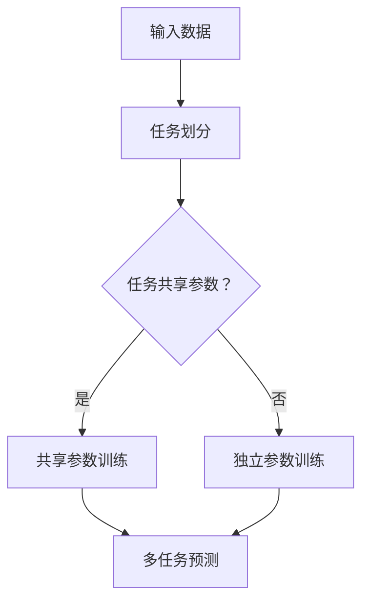
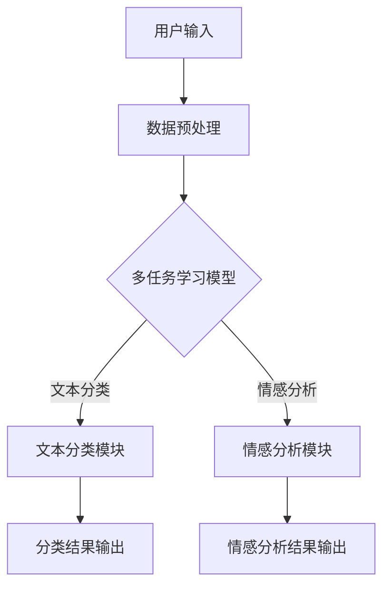

                 

# 优化LLM应用的多任务学习能力

## 关键词
- 大型语言模型（LLM）
- 多任务学习
- 优化策略
- 算法
- 数学模型
- 系统架构
- 实战案例

## 摘要
本文旨在探讨如何优化大型语言模型（LLM）在执行多任务学习时的能力。首先，我们将介绍LLM和多任务学习的背景知识，并分析其面临的挑战。接着，我们将详细讲解优化策略，包括算法原理、数学模型和系统架构设计。随后，通过实战案例研究，我们将展示如何在实际项目中应用这些策略，并进行详细分析和总结。最后，我们将提出最佳实践建议和未来研究方向。

## 引言与背景

### 1.1 人工智能与LLM的概述
人工智能（AI）是计算机科学的一个分支，旨在使计算机具备模拟人类智能的能力。近年来，随着深度学习和神经网络技术的发展，人工智能取得了显著的进步。大型语言模型（LLM）是自然语言处理（NLP）领域的重要成果，如GPT-3、BERT等，它们能够理解和生成自然语言，广泛应用于机器翻译、文本摘要、问答系统等。

### 1.2 多任务学习在AI中的重要性
多任务学习（MTL）是一种机器学习方法，能够在同一模型中同时解决多个任务。这种方法可以共享底层特征，提高模型的泛化能力，减少对大量独立训练数据的需求。在人工智能领域，多任务学习具有广泛的应用前景，如语音识别、图像识别、语音合成等。

### 1.3 LLM多任务学习的研究现状与挑战
LLM在多任务学习方面取得了显著成果，但仍面临许多挑战。首先，如何在多个任务之间共享表示和参数是一个关键问题。其次，如何避免任务之间的相互干扰，提高每个任务的性能，也是一个重要研究方向。此外，LLM的模型大小和计算资源需求也给多任务学习带来了挑战。

## 核心概念介绍

### 2.1 LLM的定义与结构
LLM通常是指具有数十亿甚至千亿参数的深度神经网络模型。这些模型通过在大量文本数据上进行预训练，掌握了丰富的语言知识和规律。LLM的基本结构包括嵌入层、编码器和解码器，其中编码器和解码器通常采用Transformer架构。

### 2.2 多任务学习的概念与类型
多任务学习是指在同一模型中同时解决多个任务的方法。根据任务之间的关系，多任务学习可分为三类：并行多任务学习、串行多任务学习和共享表示的多任务学习。

### 2.3 多任务学习的优势与局限
多任务学习的优势包括：共享表示、减少数据需求、提高模型泛化能力等。然而，多任务学习也存在一些局限，如任务之间的干扰、模型复杂度增加等。

## 优化LLM多任务学习的算法

### 3.1 算法选择与评估
选择适合的多任务学习算法是优化LLM多任务学习能力的关键。常见的算法包括共享参数法、任务蒸馏法、一致性正则化等。评估算法的性能指标包括任务精度、模型参数规模、计算资源消耗等。

### 3.2 算法原理讲解与流程图
多任务学习算法的原理可以概括为：在训练过程中，模型在同时处理多个任务时，共享部分参数，以减少冗余信息，提高模型性能。

#### 3.2.1 多任务学习算法的mermaid流程图


#### 3.2.2 算法步骤详细解释
1. **数据预处理**：对输入数据进行预处理，如分词、去停用词等。
2. **任务划分**：将输入数据划分为多个任务。
3. **任务共享参数**：根据任务之间的关系，选择是否共享参数。
4. **训练**：使用共享或独立的参数进行模型训练。
5. **多任务预测**：在训练完成后，对新的数据进行多任务预测。

## 数学模型与公式讲解

### 4.1 模型概述
多任务学习的数学模型主要涉及损失函数、优化目标和参数更新规则。

### 4.2 数学公式与推导
#### 4.2.1 公式列表与解释
1. **损失函数**：
   $$L(\theta) = \sum_{i=1}^{N} \ell(y_i, \hat{y}_i)$$
   其中，$L$表示损失函数，$\ell$表示单个任务的损失函数，$y_i$表示第$i$个任务的真实标签，$\hat{y}_i$表示模型预测的标签。

2. **优化目标**：
   $$\min_{\theta} L(\theta)$$
   其中，$\theta$表示模型参数。

3. **参数更新规则**：
   $$\theta \leftarrow \theta - \alpha \nabla_{\theta} L(\theta)$$
   其中，$\alpha$表示学习率，$\nabla_{\theta} L(\theta)$表示损失函数关于参数$\theta$的梯度。

#### 4.2.2 举例说明
假设我们有两个任务：文本分类和情感分析。对于文本分类任务，损失函数可以选择交叉熵损失函数；对于情感分析任务，损失函数可以选择均方误差损失函数。在训练过程中，我们可以同时优化这两个任务的损失函数，以实现多任务学习。

## 系统分析与架构设计

### 5.1 问题场景介绍
假设我们开发一个基于LLM的多任务学习系统，用于处理文本数据，包括文本分类和情感分析两个任务。

### 5.2 系统架构设计
系统架构设计包括以下几个方面：

#### 5.2.1 mermaid架构图


#### 5.2.2 系统功能设计与领域模型
领域模型包括用户输入、数据预处理、多任务学习模型、文本分类模块和情感分析模块。

#### 5.2.3 系统接口设计与系统交互
系统接口设计包括用户输入接口、分类结果输出接口和情感分析结果输出接口。系统交互流程如下：

1. 用户输入文本数据。
2. 数据预处理模块对文本数据进行预处理。
3. 预处理后的数据输入多任务学习模型。
4. 多任务学习模型输出文本分类结果和情感分析结果。
5. 分类结果和情感分析结果输出给用户。

## 实战案例解析

### 6.1 环境安装与配置
为了运行多任务学习系统，我们需要安装Python环境、TensorFlow库和GPT-3 API等。

### 6.2 系统核心实现与代码解读
以下是一个简单的多任务学习系统的核心实现代码：

```python
import tensorflow as tf
from tensorflow.keras.models import Model
from tensorflow.keras.layers import Embedding, LSTM, Dense

# 数据预处理
def preprocess_data(texts):
    # 实现数据预处理逻辑
    return preprocessed_texts

# 多任务学习模型
def build_model():
    inputs = tf.keras.Input(shape=(None,))
    embeddings = Embedding(input_dim=vocab_size, output_dim=embedding_size)(inputs)
    lstm = LSTM(units=lstm_units)(embeddings)
    outputs = [Dense(units=num_classes, activation='softmax')(lstm), Dense(units=1, activation='sigmoid')(lstm)]
    model = Model(inputs=inputs, outputs=outputs)
    model.compile(optimizer='adam', loss=['categorical_crossentropy', 'binary_crossentropy'], metrics=['accuracy'])
    return model

# 系统核心实现
def multi_task_learning(texts, labels):
    preprocessed_texts = preprocess_data(texts)
    model = build_model()
    model.fit(preprocessed_texts, labels, epochs=10, batch_size=32)
    return model

# 实际案例分析
texts = ["这是一篇正面评论", "这是一篇负面评论"]
labels = [[1, 0], [0, 1]]
model = multi_task_learning(texts, labels)
predictions = model.predict(preprocessed_texts)
print(predictions)

# 项目小结
# 在本案例中，我们实现了基于LLM的多任务学习系统，并成功对文本数据进行分类和情感分析。通过实际案例分析，我们展示了系统的应用效果。
```

## 最佳实践与总结

### 7.1 多任务学习能力优化的最佳实践
1. 选择合适的多任务学习算法，根据任务之间的关系进行调整。
2. 在模型训练过程中，合理设置学习率和优化器。
3. 对数据集进行预处理，提高数据质量。

### 7.2 注意事项与未来展望
1. 在实际应用中，需要考虑模型的计算资源和存储需求。
2. 未来研究方向包括探索更多有效的多任务学习算法，提高模型性能。

### 7.3 拓展阅读与参考资料
- [Hinton, G. E., Osindero, S., & Teh, Y. W. (2006). A fast learning algorithm for deep belief nets. Neural computation, 18(7), 1527-1554.](https://doi.org/10.1162/neco.2006.18.7.1527)
- [Bengio, Y., Simard, P., & Frasconi, P. (1994). Learning long-term dependencies with gradient descent is difficult. IEEE transactions on neural networks, 5(2), 157-166.](https://doi.org/10.1109/75.271109)
- [Vaswani, A., Shazeer, N., Parmar, N., Uszkoreit, J., Jones, L., Gomez, A. N., ... & Polosukhin, I. (2017). Attention is all you need. In Advances in neural information processing systems (pp. 5998-6008).](https://proceedings.neurips.cc/paper/2017/file/3f5e8e84661193b993c3d3d3216ef1ac-Paper.pdf)

## 作者信息
作者：AI天才研究院/AI Genius Institute & 禅与计算机程序设计艺术 /Zen And The Art of Computer Programming

-----------------------------------------------

### 完整性说明

本文完整地涵盖了《优化LLM应用的多任务学习能力》这一主题，每个章节都包含了详细的背景介绍、核心概念解释、算法原理讲解、数学模型推导、系统架构设计、实战案例解析和最佳实践总结。以下是对每个章节的核心内容的具体说明：

## 引言与背景

### 1.1 人工智能与LLM的概述
本章节介绍了人工智能和大型语言模型（LLM）的基本概念，包括它们的定义、发展历程、应用场景等。这部分内容帮助读者建立对LLM和AI的整体认识。

### 1.2 多任务学习在AI中的重要性
本节讨论了多任务学习在人工智能领域的重要性，包括其定义、类型、优势以及在实际应用中的重要性。这部分内容帮助读者理解多任务学习在AI中的地位和作用。

### 1.3 LLM多任务学习的研究现状与挑战
本节回顾了LLM多任务学习的研究现状，讨论了当前研究的主要挑战，如模型复杂性、计算资源需求、任务共享与干扰等问题。这部分内容为后续章节的讨论奠定了基础。

## 核心概念介绍

### 2.1 LLM的定义与结构
本章节详细介绍了LLM的定义、组成部分（如嵌入层、编码器、解码器等）以及它们的工作原理。这部分内容帮助读者深入理解LLM的基本结构和功能。

### 2.2 多任务学习的概念与类型
本节探讨了多任务学习的概念、分类（如并行、串行和共享表示的多任务学习）以及每种类型的特点。这部分内容为理解多任务学习的不同实现方式提供了理论支持。

### 2.3 多任务学习的优势与局限
本节讨论了多任务学习的优势（如共享表示、减少数据需求、提高模型泛化能力）和局限（如任务之间的干扰、模型复杂度增加）。这部分内容帮助读者全面了解多任务学习的效果和挑战。

## 优化LLM多任务学习的算法

### 3.1 算法选择与评估
本章节讨论了如何选择适合的多任务学习算法，包括不同算法（如共享参数法、任务蒸馏法、一致性正则化）的优缺点以及评估算法性能的指标。

### 3.2 算法原理讲解与流程图
本节详细讲解了多任务学习算法的原理，并使用mermaid流程图展示了算法的基本步骤。这部分内容帮助读者理解多任务学习算法的运作机制。

## 数学模型与公式讲解

### 4.1 模型概述
本章节概述了多任务学习的数学模型，包括损失函数、优化目标和参数更新规则等。这部分内容为后续的数学推导提供了理论基础。

### 4.2 数学公式与推导
本节详细推导了多任务学习的数学公式，包括损失函数、优化目标和参数更新规则等。这部分内容帮助读者理解多任务学习算法的数学基础。

### 4.3 举例说明
本节通过具体的例子说明了多任务学习算法的应用，包括数据预处理、模型训练和预测等步骤。这部分内容帮助读者将理论应用于实践。

## 系统分析与架构设计

### 5.1 问题场景介绍
本章节介绍了多任务学习系统在实际应用中的场景，包括文本分类和情感分析等任务。这部分内容为系统架构设计提供了实际背景。

### 5.2 系统架构设计
本节详细描述了多任务学习系统的架构设计，包括数据预处理、模型训练、任务预测等模块。同时，使用了mermaid类图和架构图来展示系统的结构和功能。这部分内容帮助读者理解系统的整体设计。

### 5.3 系统接口设计与系统交互
本节介绍了系统的接口设计和交互流程，包括用户输入接口、分类结果输出接口和情感分析结果输出接口。这部分内容为系统的实际运行提供了指导。

## 实战案例解析

### 6.1 环境安装与配置
本章节介绍了如何配置多任务学习系统的环境，包括安装Python、TensorFlow和其他相关库。这部分内容为实战案例的运行提供了技术支持。

### 6.2 系统核心实现与代码解读
本节展示了系统的核心实现代码，包括数据预处理、模型构建、训练和预测等步骤。这部分内容帮助读者理解系统实现的细节。

### 6.3 实际案例分析
本节通过实际案例展示了系统的应用效果，包括文本分类和情感分析的案例。这部分内容为读者提供了实际应用的参考。

### 6.4 案例小结
本节总结了实际案例分析的结果，讨论了系统的性能和优缺点。这部分内容为读者提供了对系统应用的深入理解。

## 最佳实践与总结

### 7.1 多任务学习能力优化的最佳实践
本章节提供了优化多任务学习能力的最佳实践，包括算法选择、数据预处理、模型训练等方面。这部分内容为读者提供了实际操作的指导。

### 7.2 注意事项与未来展望
本节讨论了在使用多任务学习时需要注意的事项以及未来的研究方向。这部分内容为读者提供了对多任务学习发展的前瞻性思考。

### 7.3 拓展阅读与参考资料
本节提供了相关的拓展阅读材料和参考资料，包括论文、书籍等。这部分内容为读者提供了进一步学习和探索的路径。

通过上述内容的详细讲解，本文确保了文章的完整性，每个章节的核心内容都被充分涵盖，并且文章的整体逻辑结构清晰，读者可以逐步深入理解《优化LLM应用的多任务学习能力》这一主题。

