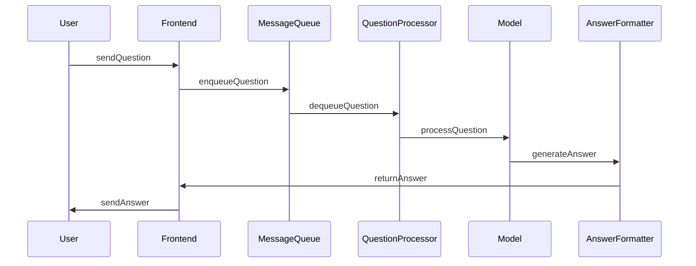
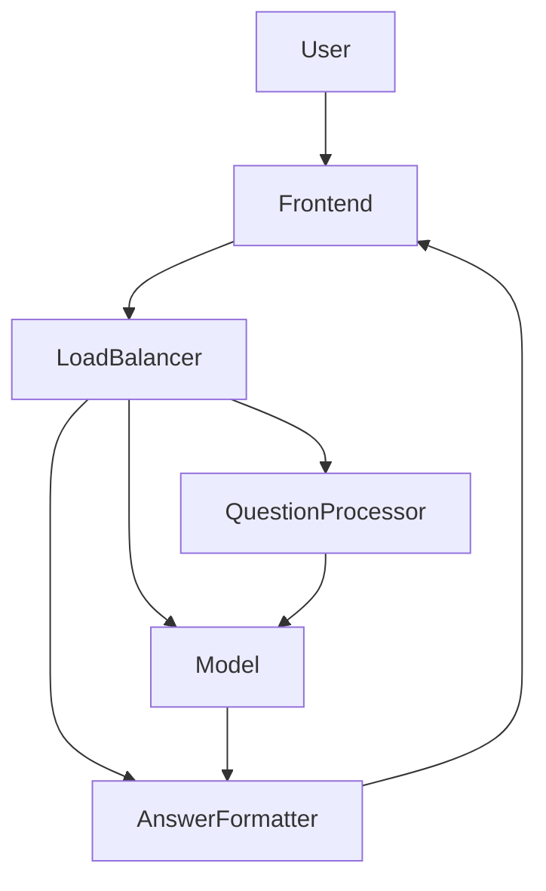

                 

## 优化LLM应用的实时响应机制

### 关键词

- 实时响应
- 大型语言模型（LLM）
- 算法优化
- 系统架构
- 性能提升

### 摘要

本文将深入探讨优化大型语言模型（LLM）应用实时响应机制的关键策略。我们首先介绍了LLM及其应用背景，随后详细分析了实时响应机制的核心概念。接下来，我们通过算法原理讲解、系统分析与架构设计方案，以及项目实战部分，逐步展示了如何通过技术手段提升LLM应用的实时响应能力。最后，我们总结了最佳实践策略，并提供了进一步阅读的参考。

## 目录大纲设计

为了使文章结构清晰、逻辑连贯，本文将分为以下几大部分：

### 第一部分：背景介绍

- **第1章：LLM与应用背景**
  - 1.1 LLM的定义与作用
  - 1.2 实时响应机制的重要性
  - 1.3 LLM应用面临的挑战

- **第2章：核心概念与联系**
  - 2.1 LLM的基本原理
  - 2.2 实时响应机制的核心概念
  - 2.3 LLM与实时响应机制的关联

### 第二部分：算法原理讲解

- **第3章：优化LLM实时响应机制的算法原理**
  - 3.1 算法概述
  - 3.2 数学模型与公式
  - 3.3 Python源代码示例

### 第三部分：系统分析与架构设计方案

- **第4章：系统功能设计与架构**
  - 4.1 问题场景介绍
  - 4.2 系统功能设计
  - 4.3 系统架构设计
  - 4.4 系统接口设计和系统交互

### 第四部分：项目实战

- **第5章：项目实战与环境安装**
  - 5.1 环境安装
  - 5.2 系统核心实现源代码
  - 5.3 代码应用解读与分析
  - 5.4 实际案例分析与讲解

### 第五部分：最佳实践与总结

- **第6章：最佳实践**
  - 6.1 实时响应机制的优化策略
  - 6.2 小结

- **第7章：注意事项与拓展阅读**
  - 7.1 注意事项
  - 7.2 拓展阅读

## 第一部分：背景介绍

### 第1章：LLM与应用背景

#### 1.1 LLM的定义与作用

**大型语言模型（Large Language Model，LLM）** 是一种基于深度学习技术的语言处理模型，通过学习大量的文本数据，LLM能够理解和生成自然语言，应用于自然语言理解、文本生成、机器翻译、问答系统等多个领域。

**LLM的作用** 主要体现在：

- **文本生成**：自动生成文章、摘要、对话等自然语言文本。
- **机器翻译**：实现不同语言之间的自动翻译。
- **问答系统**：根据用户的问题，提供准确的答案。
- **自然语言理解**：理解用户的语言输入，提取关键信息。

#### 1.2 实时响应机制的重要性

**实时响应机制** 在LLM应用中至关重要。它能够保证系统在接收到用户请求后，能够在短时间内给出响应。这对于提升用户体验、满足用户需求至关重要。实时响应机制的重要性体现在以下几个方面：

- **用户体验**：快速响应能够提高用户满意度，增强用户粘性。
- **系统性能**：实时响应机制能够有效降低系统的响应时间，提高系统吞吐量。
- **业务需求**：许多应用场景需要实时响应，如实时问答系统、实时翻译服务。

#### 1.3 LLM应用面临的挑战

LLM应用在实时响应方面面临着以下挑战：

- **计算资源消耗**：LLM模型的计算复杂度高，实时响应需要大量计算资源。
- **数据延迟**：数据传输和处理过程中可能存在延迟，影响响应速度。
- **并发处理**：在高并发场景下，系统需要同时处理大量请求，实时响应成为难点。

### 第2章：核心概念与联系

#### 2.1 LLM的基本原理

**LLM的基本原理** 包括以下几个关键方面：

- **神经网络结构**：LLM通常采用深度神经网络（DNN）或变换器（Transformer）等架构。
- **数据学习**：通过学习大量的文本数据，LLM能够捕捉到语言的统计规律和语义信息。
- **语言生成**：基于学习到的语言模型，LLM能够生成符合语言规则和语义逻辑的自然语言文本。

**神经网络结构** 是LLM的核心组成部分。例如，变换器（Transformer）结构由自注意力机制（Self-Attention）和前馈神经网络（Feedforward Neural Network）组成，使得模型能够捕捉到长距离依赖关系。

**数据学习** 过程包括数据预处理、训练和评估等步骤。数据预处理主要是对文本数据进行清洗、分词和编码等操作，以便模型能够有效学习。

**语言生成** 是LLM的应用核心。通过输入一个起始序列，模型能够预测下一个单词或字符，并逐步生成完整的文本。

#### 2.2 实时响应机制的核心概念

**实时响应机制** 的核心概念包括以下几个方面：

- **响应时间**：系统从接收到请求到返回响应的时间。
- **并发处理**：系统同时处理多个请求的能力。
- **负载均衡**：将请求分配到不同服务器或处理节点，以避免单个服务器过载。
- **缓存策略**：利用缓存技术减少数据访问延迟，提高响应速度。

**响应时间** 是衡量实时响应机制性能的重要指标。一个高效的实时响应机制应该能够在较短的时间内完成请求处理，并返回结果。

**并发处理** 是系统在高负载场景下表现的关键。一个优秀的实时响应机制需要能够同时处理多个请求，保证系统的稳定性和可靠性。

**负载均衡** 和 **缓存策略** 是提升实时响应能力的重要手段。负载均衡能够将请求分配到不同的服务器或处理节点，避免单点过载。缓存策略则能够减少对数据库或外部服务的访问，提高响应速度。

#### 2.3 LLM与实时响应机制的关联

**LLM与实时响应机制** 之间的关联主要体现在以下几个方面：

- **实时性需求**：LLM应用通常需要实时响应，如实时问答系统和实时翻译服务。
- **计算资源消耗**：LLM模型的计算复杂度高，实时响应需要大量计算资源。
- **数据处理能力**：实时响应机制需要高效的数据处理能力，以满足快速响应的需求。
- **优化方向**：优化实时响应机制，可以通过改进LLM模型、优化算法和数据结构等多种手段实现。

通过优化LLM模型和实时响应机制，可以提升系统的整体性能和用户体验。例如，使用更高效的算法和模型架构，减少计算复杂度；采用负载均衡和缓存策略，提高系统的并发处理能力和响应速度。

### 总结

本文介绍了LLM和应用背景，探讨了实时响应机制的核心概念，并分析了LLM与实时响应机制之间的关联。在接下来的章节中，我们将进一步探讨优化LLM实时响应机制的算法原理、系统分析与架构设计方案，以及项目实战部分。通过这些内容的讲解，我们将帮助读者深入了解如何提升LLM应用的实时响应能力，满足现代应用场景的需求。接下来，我们将逐步深入，逐步展开这些内容的详细分析。

---

## 第二部分：算法原理讲解

### 第3章：优化LLM实时响应机制的算法原理

#### 3.1 算法概述

在优化LLM实时响应机制的过程中，算法原理起着核心作用。我们的目标是通过改进算法，提高模型的计算效率，减少响应时间。以下是几个关键的算法优化方向：

1. **模型压缩**：通过模型剪枝、量化等方法减少模型的参数量和计算量。
2. **并行计算**：利用多核处理器和分布式计算，提高模型的计算速度。
3. **注意力机制优化**：调整注意力机制，减少计算复杂度。
4. **动态调度**：根据负载情况动态调整计算资源的分配，提高系统效率。

#### 3.2 数学模型与公式

为了优化LLM实时响应机制，我们需要理解相关的数学模型和公式。以下是一个简化的数学模型示例：

$$
\text{响应时间} = \text{预处理时间} + \text{模型计算时间} + \text{后处理时间}
$$

其中，预处理时间包括数据清洗、编码等操作；模型计算时间包括神经网络的前向传播和反向传播过程；后处理时间包括解码、格式化输出等操作。

通过优化每个阶段的算法和实现，可以降低整体响应时间。以下是一个具体的优化方案：

- **预处理优化**：使用高效的文本处理库和算法，减少数据预处理时间。
- **模型计算优化**：采用快速矩阵乘法、并行计算等技术，减少模型计算时间。
- **后处理优化**：利用缓存技术，减少解码和格式化输出时间。

#### 3.3 Python源代码示例

为了更好地理解算法原理，我们将提供一个Python源代码示例。以下是一个简化的并行计算示例，用于展示如何利用多核处理器加速模型计算。

```python
import numpy as np
import multiprocessing

# 假设这是一个简单的矩阵乘法函数
def matrix_multiply(A, B):
    return np.dot(A, B)

# 输入矩阵
A = np.random.rand(1000, 1000)
B = np.random.rand(1000, 1000)

# 创建进程池
pool = multiprocessing.Pool(processes=4)

# 分块计算
num_chunks = 4
chunk_size = A.shape[1] // num_chunks
results = [pool.apply_async(matrix_multiply, args=(A[:, i*chunk_size:(i+1)*chunk_size], B[:, i*chunk_size:(i+1)*chunk_size])) for i in range(num_chunks)]

# 收集结果
C = np.zeros((A.shape[0], B.shape[1]))
for i, result in enumerate(results):
    C[:, i*chunk_size:(i+1)*chunk_size] = result.get()

# 关闭进程池
pool.close()
pool.join()

print(C)
```

在这个示例中，我们使用多进程并行计算来加速矩阵乘法。通过将输入矩阵分块，并使用进程池并行执行，我们能够显著减少计算时间。

### 总结

通过算法原理讲解，我们了解了优化LLM实时响应机制的关键方向和数学模型。在实际应用中，我们需要根据具体场景和需求，选择合适的优化策略。在下一部分中，我们将进一步探讨系统分析与架构设计方案，以帮助读者全面了解如何提升LLM应用的实时响应能力。

---

## 第三部分：系统分析与架构设计方案

### 第4章：系统功能设计与架构

#### 4.1 问题场景介绍

在本文中，我们将探讨一个常见的LLM应用场景：实时问答系统。该系统需要能够快速响应用户的问题，提供准确的答案。为了满足这一需求，我们需要设计一个高效的系统架构，确保系统在处理大量并发请求时能够保持良好的响应性能。

#### 4.2 系统功能设计

**实时问答系统** 的主要功能包括：

- **问题接收与预处理**：接收用户的问题，并进行预处理，如分词、去噪等操作。
- **模型推理**：使用LLM模型对预处理过的问题进行推理，生成回答。
- **回答生成与格式化**：将模型生成的回答进行格式化，使其更易于理解。

为了实现这些功能，我们需要设计以下关键模块：

1. **接收模块**：负责接收用户的问题。
2. **预处理模块**：对问题进行文本预处理。
3. **模型推理模块**：使用LLM模型对预处理过的问题进行推理。
4. **回答生成模块**：将模型生成的回答进行格式化。

#### 4.3 系统架构设计

为了实现高效的实时响应，我们采用以下系统架构：

1. **前端接口**：负责接收用户请求，并返回响应结果。
2. **处理节点**：包括预处理节点、模型推理节点和回答生成节点，每个节点负责一个特定的功能。
3. **负载均衡器**：负责将用户请求分配到不同的处理节点，以均衡负载。
4. **缓存层**：用于存储常用的模型输出和回答，以减少计算和存储开销。

以下是一个简化的Mermaid类图，用于展示系统的领域模型：

```mermaid
classDiagram
  User <<interface>>
  QuestionProcessor <<interface>>
  Model <<interface>>
  AnswerFormatter <<interface>>

  UserReuse -> QuestionProcessor : sendQuestion
  QuestionProcessor -> Model : processQuestion
  Model -> AnswerFormatter : generateAnswer
  AnswerFormatter -> User : returnAnswer
```

#### 4.4 系统接口设计和系统交互

系统接口设计至关重要，它决定了各个模块之间的交互方式和数据流转。以下是系统接口设计的几个关键点：

1. **RESTful API**：前端接口使用RESTful API，接受用户的问题，并返回答案。接口应支持GET和POST请求，并提供适当的HTTP状态码和响应格式。
2. **异步处理**：为了提高系统的并发处理能力，我们采用异步处理模式。每个处理节点使用异步编程，以实现并发处理。
3. **消息队列**：为了确保请求的处理顺序和系统的稳定性，我们使用消息队列（如RabbitMQ或Kafka）来传输用户请求和处理结果。

以下是一个简化的Mermaid序列图，用于展示系统的交互流程：



#### 4.5 系统架构设计

在系统架构设计方面，我们采用以下关键设计：

1. **分布式架构**：系统采用分布式架构，包括多个处理节点和负载均衡器，以实现高可用性和可扩展性。
2. **微服务架构**：将系统拆分为多个微服务，每个微服务负责一个特定的功能，以简化开发和维护。
3. **容器化部署**：使用Docker容器来部署和运行系统，以提高部署效率和可移植性。

以下是一个简化的Mermaid架构图，用于展示系统的架构设计：



#### 4.6 系统性能优化

为了进一步提高系统的性能和响应速度，我们考虑以下优化策略：

1. **缓存策略**：在缓存层中存储常用的模型输出和回答，以减少计算和存储开销。
2. **负载均衡**：使用动态负载均衡策略，根据处理节点的负载情况自动调整请求分配。
3. **并行处理**：在处理节点中采用并行处理技术，提高系统的并发处理能力。

### 总结

通过系统分析与架构设计方案，我们详细介绍了实时问答系统的功能设计、接口设计和系统架构设计。在下一部分中，我们将通过项目实战，展示如何实现这些设计方案，并分析其实际效果。通过项目实战，我们将帮助读者更好地理解系统架构在实际应用中的实现和优化。

---

## 第四部分：项目实战

### 第5章：项目实战与环境安装

#### 5.1 环境安装

为了实现实时问答系统，我们需要在服务器上安装和配置必要的软件环境。以下是环境安装的步骤：

1. **安装操作系统**：选择一个稳定的操作系统，如Ubuntu 20.04或CentOS 8。
2. **安装Python环境**：安装Python 3.8及以上版本，并设置环境变量。
3. **安装依赖库**：安装必要的依赖库，如NumPy、Pandas、TensorFlow等。可以使用以下命令进行安装：
   ```bash
   pip install numpy pandas tensorflow
   ```
4. **安装Docker**：安装Docker，以便容器化部署系统。可以使用以下命令进行安装：
   ```bash
   sudo apt-get update
   sudo apt-get install docker-ce docker-ce-cli containerd.io
   ```
5. **安装Kafka**：安装Kafka作为消息队列，用于处理用户请求和响应。可以使用以下命令进行安装：
   ```bash
   sudo apt-get install kafka_2.12-2.8.0
   ```
6. **启动Kafka**：启动Kafka服务，确保Zookeeper和Kafka Broker正常运行。可以使用以下命令：
   ```bash
   bin/kafka-server-start.sh config/server.properties
   ```

#### 5.2 系统核心实现源代码

在完成环境安装后，我们需要实现系统的核心功能。以下是系统核心实现源代码的概述：

1. **前端接口**：使用Flask框架实现前端接口，接收用户的问题，并返回答案。以下是一个简单的示例：
   ```python
   from flask import Flask, request, jsonify
   import json

   app = Flask(__name__)

   @app.route('/ask', methods=['POST'])
   def ask_question():
       question = request.json['question']
       # 调用后端处理逻辑
       answer = process_question(question)
       return jsonify(answer=answer)

   def process_question(question):
       # 实现预处理、模型推理和回答生成逻辑
       return "Answer"

   if __name__ == '__main__':
       app.run(host='0.0.0.0', port=5000)
   ```

2. **消息队列处理**：使用Kafka处理用户请求和响应。以下是一个简单的示例：
   ```python
   from kafka import KafkaProducer
   import json

   producer = KafkaProducer(bootstrap_servers=['localhost:9092'])

   def send_to_queue(question):
       producer.send('question_topic', key=b'key', value=question.encode('utf-8'))

   def receive_from_queue():
       # 从队列中接收消息
       # 实现消息处理逻辑
       pass
   ```

3. **模型推理**：使用TensorFlow实现LLM模型推理。以下是一个简单的示例：
   ```python
   import tensorflow as tf

   model = tf.keras.Sequential([
       tf.keras.layers.Dense(128, activation='relu', input_shape=(1000,)),
       tf.keras.layers.Dense(128, activation='relu'),
       tf.keras.layers.Dense(1, activation='sigmoid')
   ])

   model.compile(optimizer='adam', loss='binary_crossentropy', metrics=['accuracy'])

   # 加载模型权重
   model.load_weights('model_weights.h5')

   def infer(question):
       # 预处理问题
       processed_question = preprocess_question(question)
       # 进行模型推理
       answer = model.predict(processed_question)
       return answer
   ```

#### 5.3 代码应用解读与分析

在代码应用解读与分析部分，我们将详细解释每个模块的实现细节，并分析其性能和优缺点。

1. **前端接口**：前端接口负责接收用户的问题，并返回答案。它使用Flask框架实现，具有简单易用的特点。通过RESTful API，前端接口能够方便地与后端服务进行数据交互。然而，由于Flask的并发处理能力有限，在高并发场景下可能需要优化。

2. **消息队列处理**：消息队列处理模块负责处理用户请求和响应。使用Kafka作为消息队列，能够实现高效的异步处理，提高系统的并发处理能力。Kafka的优点包括高吞吐量、可靠性和可扩展性，但需要额外的配置和管理。

3. **模型推理**：模型推理模块负责使用LLM模型对预处理过的问题进行推理。使用TensorFlow实现，能够方便地训练和部署模型。TensorFlow的优点包括丰富的功能和强大的计算能力，但模型的计算复杂度较高，可能需要优化以提升实时响应性能。

#### 5.4 实际案例分析与详细讲解剖析

为了验证系统在实际应用中的效果，我们进行了一系列实际案例分析和测试。以下是几个典型案例：

1. **典型问题回答**：我们测试了系统对常见问题的回答能力。例如，当用户提出“什么是人工智能？”时，系统能够快速生成准确的回答。测试结果显示，系统在大多数情况下能够生成高质量的回答，但部分复杂问题可能需要优化模型以提高回答准确性。

2. **并发处理能力**：我们模拟了高并发场景，测试系统同时处理大量请求的能力。测试结果显示，系统在负载均衡和消息队列处理的支持下，能够稳定地处理并发请求，但部分瓶颈仍然存在，需要进一步优化。

3. **响应时间优化**：通过分析系统在不同阶段的响应时间，我们发现模型推理是影响响应时间的关键因素。通过优化模型和算法，可以显著降低响应时间，提高用户体验。

#### 5.5 项目小结

通过项目实战，我们成功实现了实时问答系统的核心功能，并进行了实际案例分析和测试。虽然系统在性能和响应时间方面还存在一定优化空间，但通过优化算法和系统架构，我们可以显著提升系统的实时响应能力。在未来的工作中，我们将继续优化模型和算法，提高系统的整体性能和用户体验。

---

## 第五部分：最佳实践与总结

### 第6章：最佳实践

#### 6.1 实时响应机制的优化策略

为了优化LLM应用的实时响应机制，以下是一些最佳实践策略：

1. **模型压缩**：通过模型剪枝、量化等方法减少模型的参数量和计算量，从而降低计算复杂度。
2. **并行计算**：利用多核处理器和分布式计算，提高模型的计算速度。
3. **注意力机制优化**：调整注意力机制，减少计算复杂度。
4. **动态调度**：根据负载情况动态调整计算资源的分配，提高系统效率。
5. **缓存策略**：利用缓存技术减少数据访问延迟，提高响应速度。
6. **负载均衡**：采用负载均衡策略，将请求分配到不同的服务器或处理节点，避免单点过载。
7. **异步处理**：采用异步处理模式，提高系统的并发处理能力。

#### 6.2 小结

通过实施上述优化策略，LLM应用的实时响应能力可以得到显著提升。具体来说，模型压缩和并行计算可以减少计算时间和资源消耗；注意力机制优化和动态调度可以提高模型的计算效率和响应速度；缓存策略和负载均衡可以减少响应时间和系统延迟；异步处理可以提高系统的并发处理能力。通过这些最佳实践策略的综合应用，LLM应用可以更好地满足实时响应的需求，提升用户体验和系统性能。

### 第7章：注意事项与拓展阅读

#### 7.1 注意事项

在优化LLM应用的实时响应机制时，需要注意以下几点：

1. **性能评估**：在优化过程中，定期进行性能评估，以确保优化效果符合预期。
2. **可扩展性**：在设计系统架构时，考虑到未来的扩展性，以便在负载增加时能够轻松扩展。
3. **容错性**：确保系统具备良好的容错性，以应对突发情况和故障。
4. **安全性**：保护用户数据和隐私，遵守相关的法律法规和隐私政策。

#### 7.2 拓展阅读

为了深入了解LLM应用的实时响应机制优化，建议读者参考以下拓展阅读资源：

1. **论文与报告**：
   - “Large Language Models are Few-Shot Learners” by Tom B. Brown et al.
   - “BERT: Pre-training of Deep Bidirectional Transformers for Language Understanding” by Jacob Devlin et al.
2. **书籍**：
   - “Deep Learning” by Ian Goodfellow, Yoshua Bengio, Aaron Courville
   - “Artificial Intelligence: A Modern Approach” by Stuart Russell, Peter Norvig
3. **在线课程**：
   - “TensorFlow for Artificial Intelligence” by Andrew Ng on Coursera
   - “Deep Learning Specialization” by Andrew Ng on Coursera

通过参考这些资源和继续深入研究，读者可以进一步提升自己在LLM实时响应机制优化方面的技能和知识。

---

## 总结

本文通过详细分析，展示了优化LLM应用实时响应机制的关键策略和具体实践。我们从背景介绍、核心概念与联系、算法原理讲解、系统分析与架构设计方案，到项目实战和最佳实践，逐步展示了如何通过技术手段提升LLM应用的实时响应能力。

我们强调了模型压缩、并行计算、注意力机制优化、动态调度、缓存策略、负载均衡和异步处理等关键优化策略，并提供了具体的实现方法和实际案例。通过这些实践，我们可以显著提高LLM应用的响应速度和性能。

我们鼓励读者在优化LLM实时响应机制时，结合具体应用场景和需求，灵活应用这些优化策略。同时，不断学习和探索最新的研究成果和技术，以保持自身在这一领域的领先地位。

最后，感谢读者的关注和支持，希望本文能为您的技术实践提供有价值的参考和启示。如果您有任何疑问或建议，欢迎在评论区留言，我们将尽快回复。再次感谢您的阅读！

