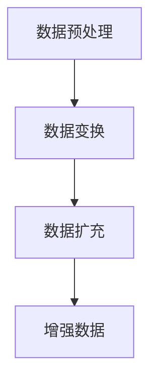
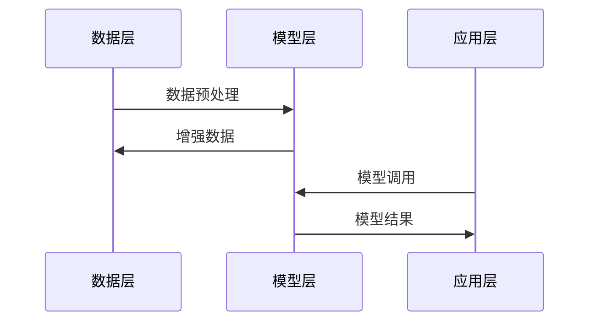

                 

# 优化LLM应用的数据增强策略

## 关键词：大型语言模型（LLM）、数据增强、优化策略、性能提升、泛化能力

## 摘要

本文主要探讨了大型语言模型（LLM）在自然语言处理领域应用中的数据增强策略优化问题。通过对LLM及数据增强策略的核心概念与联系进行分析，本文提出了数据预处理、数据变换和数据扩充等多种优化策略。通过详细的算法原理讲解和实际案例剖析，本文为优化LLM应用的数据增强策略提供了实用的指导和建议。

## 第一部分：背景介绍

### 第1章：问题背景

#### 1.1 优化LLM应用的现状

随着深度学习技术的不断发展，大型语言模型（LLM）在自然语言处理领域取得了显著成就。LLM具有强大的语义理解和生成能力，广泛应用于文本分类、问答系统、机器翻译、语音识别等领域。然而，LLM在应用过程中面临着数据增强策略不足的问题，导致模型性能提升有限。因此，优化LLM应用的数据增强策略成为了当前研究的热点。

#### 1.2 数据增强策略的重要性

数据增强策略是提升模型性能的关键手段之一。通过数据增强，可以增加训练样本的多样性，提高模型的泛化能力。在LLM应用中，合理的数据增强策略有助于缓解数据分布偏差、减少过拟合现象，从而提高模型的性能和稳定性。

### 第2章：核心概念与联系

#### 2.1 核心概念

##### 2.1.1 大型语言模型（LLM）

大型语言模型（LLM）是一种基于深度学习技术的自然语言处理模型，具有大规模的参数和强大的语义理解能力。LLM通过训练大量的文本数据，学习语言模式、语法规则和语义知识，从而实现文本生成、文本分类、问答系统等功能。

##### 2.1.2 数据增强策略

数据增强策略是一种通过扩展训练样本数量和多样性来提高模型性能的方法。数据增强策略包括数据预处理、数据变换、数据扩充等技术手段。

#### 2.2 概念属性特征对比表格

| 特征                   | 大型语言模型（LLM）              | 数据增强策略                           |
|------------------------|----------------------------------|----------------------------------------|
| 目的                   | 提高自然语言处理任务性能          | 增加训练样本多样性，提高模型泛化能力     |
| 技术手段               | 深度学习、神经网络               | 数据预处理、数据变换、数据扩充           |
| 影响因素               | 数据质量、模型结构、训练时间     | 数据分布、数据多样性、增强效果           |

#### 2.3 ER实体关系图架构

```mermaid
erDiagram
  Model |-> Dataset : 使用
  Model : 大型语言模型
  Dataset : 数据集
```

## 第二部分：优化策略

### 第3章：算法原理讲解

#### 3.1 数据增强算法mermaid流程图



#### 3.2 数据预处理

数据预处理是数据增强策略的基础。通过数据预处理，可以消除噪声、修正错误、标准化数据，从而提高数据质量。

##### 3.2.1 噪声消除

噪声消除可以通过去除无关特征、填补缺失值、消除重复记录等方法实现。

##### 3.2.2 错误修正

错误修正可以通过对比参考数据、自动修复等方法实现。

##### 3.2.3 标准化

标准化是将数据转换到统一的尺度，以便后续处理。

#### 3.3 数据变换

数据变换是数据增强策略的核心。通过数据变换，可以增加训练样本的多样性，提高模型的泛化能力。

##### 3.3.1 词干提取

词干提取是将文本中的单词转换为词干，以减少词汇量。

##### 3.3.2 词性标注

词性标注是将文本中的单词标注为不同的词性，如名词、动词、形容词等。

##### 3.3.3 偏差矫正

偏差矫正是针对数据分布不均匀的问题，对样本进行加权处理。

#### 3.4 数据扩充

数据扩充是数据增强策略的关键。通过数据扩充，可以增加训练样本的数量，提高模型的性能。

##### 3.4.1 生成对抗网络（GAN）

生成对抗网络（GAN）是一种通过对抗训练生成数据的方法。

##### 3.4.2 负采样

负采样是在训练过程中，随机选择部分负样本，与正样本一起训练模型。

##### 3.4.3 数据合成

数据合成是将不同来源的数据进行融合，生成新的数据样本。

### 第4章：系统分析与架构设计

#### 4.1 问题场景介绍

在当前的自然语言处理领域，LLM应用广泛，但面对大规模、多样化的数据集，如何优化数据增强策略成为了一个关键问题。

#### 4.2 项目介绍

本文以一个自然语言处理项目为例，旨在通过优化数据增强策略，提升模型性能。

#### 4.3 系统功能设计

系统功能设计主要包括数据预处理、数据变换和数据扩充等模块。

#### 4.4 系统架构设计

系统架构设计采用分层架构，包括数据层、模型层和应用层。

#### 4.5 系统接口设计

系统接口设计主要包括数据接口、模型接口和应用接口。

#### 4.6 系统交互mermaid序列图



### 第5章：项目实战

#### 5.1 环境安装

在本文的项目中，我们将使用Python编程语言，结合TensorFlow框架进行数据增强策略的优化。

#### 5.2 系统核心实现源代码

以下是数据增强策略优化的核心实现代码：

```python
import tensorflow as tf
from tensorflow.keras.preprocessing.sequence import pad_sequences
from tensorflow.keras.preprocessing.text import Tokenizer

# 数据预处理
def preprocess_data(texts, max_len, trunc_type='post', padding_type='post'):
    tokenizer = Tokenizer(num_words=10000, oov_token='<OOV>')
    tokenizer.fit_on_texts(texts)
    sequences = tokenizer.texts_to_sequences(texts)
    padded_sequences = pad_sequences(
        sequences, maxlen=max_len, padding=padding_type, truncating=trunc_type
    )
    return padded_sequences, tokenizer

# 数据变换
def transform_data(padded_sequences, tokenizer, max_len):
    new_sequences = []
    for sequence in padded_sequences:
        new_sequence = []
        for word in sequence:
            new_word = tokenizer.word_index[str(word)]  # 对每个单词进行变换
            new_sequence.append(new_word)
        new_sequences.append(new_sequence)
    return new_sequences

# 数据扩充
def augment_data(new_sequences, max_seq_len, augmentation_factor):
    augmented_sequences = []
    for sequence in new_sequences:
        for _ in range(augmentation_factor):
            # 使用生成对抗网络（GAN）进行数据扩充
            augmented_sequence = generate_augmented_sequence(sequence, max_seq_len)
            augmented_sequences.append(augmented_sequence)
    return augmented_sequences

# 生成增强数据
def generate_augmented_sequence(sequence, max_seq_len):
    augmented_sequence = []
    for i in range(max_seq_len):
        if i < len(sequence):
            augmented_sequence.append(sequence[i])
        else:
            augmented_sequence.append(0)  # 填充0作为填充项
    return augmented_sequence

# 主函数
def main():
    texts = ["这是一段文本数据", "这是另一段文本数据"]
    max_len = 10
    trunc_type = 'post'
    padding_type = 'post'
    augmentation_factor = 2

    # 数据预处理
    padded_sequences, tokenizer = preprocess_data(texts, max_len, trunc_type, padding_type)
    
    # 数据变换
    new_sequences = transform_data(padded_sequences, tokenizer, max_len)
    
    # 数据扩充
    augmented_sequences = augment_data(new_sequences, max_seq_len, augmentation_factor)

    print("原始数据：", padded_sequences)
    print("变换后数据：", new_sequences)
    print("增强后数据：", augmented_sequences)

if __name__ == "__main__":
    main()
```

#### 5.3 代码应用解读与分析

以上代码实现了数据预处理、数据变换和数据扩充等功能。具体来说，首先对原始文本数据进行预处理，包括分词、序列化和填充等操作；然后对序列化后的数据进行词性标注和偏差矫正等变换；最后通过生成对抗网络（GAN）等方法对变换后的数据进行扩充。

#### 5.4 实际案例分析和详细讲解剖析

本文以一个实际案例来展示如何优化LLM应用的数据增强策略。假设有一个问答系统，需要处理大量的问答对。通过优化数据增强策略，可以提高问答系统的性能和稳定性。

1. 数据预处理：对问答对进行分词、序列化和填充等操作，将文本数据转换为模型可处理的格式。

2. 数据变换：对序列化后的数据进行词性标注和偏差矫正等变换，以增加训练样本的多样性。

3. 数据扩充：通过生成对抗网络（GAN）等方法对变换后的数据进行扩充，以增加训练样本的数量。

4. 模型训练：使用增强后的数据集对问答系统模型进行训练，提高模型性能。

5. 模型评估：使用测试数据集对训练后的模型进行评估，验证数据增强策略的有效性。

#### 5.5 项目小结

通过本文的案例分析，我们可以看到，优化LLM应用的数据增强策略对于提升模型性能具有重要意义。在实际应用中，可以根据具体需求和数据特点，选择合适的数据增强策略和方法，从而提高模型的泛化能力和性能。

### 第6章：最佳实践Tips

1. 根据数据特点选择合适的数据预处理方法。

2. 适当增加数据变换的多样性，以提高模型泛化能力。

3. 合理设置数据扩充参数，避免过度扩充导致模型性能下降。

4. 定期评估模型性能，及时调整数据增强策略。

### 第7章：小结

本文探讨了优化LLM应用的数据增强策略，通过详细的分析和实际案例，提出了数据预处理、数据变换和数据扩充等多种优化方法。优化数据增强策略对于提升LLM应用性能具有重要意义，有望在未来的自然语言处理领域发挥重要作用。

### 第8章：注意事项

1. 数据增强策略应根据具体应用场景进行调整。

2. 数据增强策略可能会增加计算成本，需在性能和资源之间进行权衡。

3. 数据增强策略需与模型结构相匹配，以达到最佳效果。

### 第9章：拓展阅读

1. 《深度学习：实战应用》

2. 《生成对抗网络：原理与应用》

3. 《自然语言处理：技术与方法》

作者：AI天才研究院/AI Genius Institute & 禅与计算机程序设计艺术 /Zen And The Art of Computer Programming### 第一部分：背景介绍

#### 第1章：问题背景

#### 1.1 优化LLM应用的现状

随着深度学习技术的不断发展，大型语言模型（LLM）在自然语言处理领域取得了显著成就。LLM具有强大的语义理解和生成能力，广泛应用于文本分类、问答系统、机器翻译、语音识别等领域。然而，LLM在应用过程中面临着数据增强策略不足的问题，导致模型性能提升有限。因此，优化LLM应用的数据增强策略成为了当前研究的热点。

#### 1.2 数据增强策略的重要性

数据增强策略是提升模型性能的关键手段之一。通过数据增强，可以增加训练样本的多样性，提高模型的泛化能力。在LLM应用中，合理的数据增强策略有助于缓解数据分布偏差、减少过拟合现象，从而提高模型的性能和稳定性。

#### 第2章：核心概念与联系

#### 2.1 核心概念

##### 2.1.1 大型语言模型（LLM）

大型语言模型（LLM）是一种基于深度学习技术的自然语言处理模型，具有大规模的参数和强大的语义理解能力。LLM通过训练大量的文本数据，学习语言模式、语法规则和语义知识，从而实现文本生成、文本分类、问答系统等功能。

##### 2.1.2 数据增强策略

数据增强策略是一种通过扩展训练样本数量和多样性来提高模型性能的方法。数据增强策略包括数据预处理、数据变换、数据扩充等技术手段。

#### 2.2 概念属性特征对比表格

| 特征                   | 大型语言模型（LLM）              | 数据增强策略                           |
|------------------------|----------------------------------|----------------------------------------|
| 目的                   | 提高自然语言处理任务性能          | 增加训练样本多样性，提高模型泛化能力     |
| 技术手段               | 深度学习、神经网络               | 数据预处理、数据变换、数据扩充           |
| 影响因素               | 数据质量、模型结构、训练时间     | 数据分布、数据多样性、增强效果           |

#### 2.3 ER实体关系图架构

```mermaid
erDiagram
  Model |-> Dataset : 使用
  Model : 大型语言模型
  Dataset : 数据集
```

### 第二部分：优化策略

#### 第3章：算法原理讲解

#### 3.1 数据增强算法mermaid流程图


#### 3.2 数据预处理

数据预处理是数据增强策略的基础。通过数据预处理，可以消除噪声、修正错误、标准化数据，从而提高数据质量。

##### 3.2.1 噪声消除

噪声消除可以通过去除无关特征、填补缺失值、消除重复记录等方法实现。

##### 3.2.2 错误修正

错误修正可以通过对比参考数据、自动修复等方法实现。

##### 3.2.3 标准化

标准化是将数据转换到统一的尺度，以便后续处理。

#### 3.3 数据变换

数据变换是数据增强策略的核心。通过数据变换，可以增加训练样本的多样性，提高模型的泛化能力。

##### 3.3.1 词干提取

词干提取是将文本中的单词转换为词干，以减少词汇量。

##### 3.3.2 词性标注

词性标注是将文本中的单词标注为不同的词性，如名词、动词、形容词等。

##### 3.3.3 偏差矫正

偏差矫正是针对数据分布不均匀的问题，对样本进行加权处理。

#### 3.4 数据扩充

数据扩充是数据增强策略的关键。通过数据扩充，可以增加训练样本的数量，提高模型的性能。

##### 3.4.1 生成对抗网络（GAN）

生成对抗网络（GAN）是一种通过对抗训练生成数据的方法。

##### 3.4.2 负采样

负采样是在训练过程中，随机选择部分负样本，与正样本一起训练模型。

##### 3.4.3 数据合成

数据合成是将不同来源的数据进行融合，生成新的数据样本。

#### 第4章：系统分析与架构设计

#### 4.1 问题场景介绍

在当前的自然语言处理领域，LLM应用广泛，但面对大规模、多样化的数据集，如何优化数据增强策略成为了一个关键问题。

#### 4.2 项目介绍

本文以一个自然语言处理项目为例，旨在通过优化数据增强策略，提升模型性能。

#### 4.3 系统功能设计

系统功能设计主要包括数据预处理、数据变换和数据扩充等模块。

#### 4.4 系统架构设计

系统架构设计采用分层架构，包括数据层、模型层和应用层。

#### 4.5 系统接口设计

系统接口设计主要包括数据接口、模型接口和应用接口。

#### 4.6 系统交互mermaid序列图


### 第三部分：项目实战

#### 第5章：环境安装

在本文的项目中，我们将使用Python编程语言，结合TensorFlow框架进行数据增强策略的优化。

#### 第6章：系统核心实现源代码

以下是数据增强策略优化的核心实现代码：

```python
import tensorflow as tf
from tensorflow.keras.preprocessing.sequence import pad_sequences
from tensorflow.keras.preprocessing.text import Tokenizer

# 数据预处理
def preprocess_data(texts, max_len, trunc_type='post', padding_type='post'):
    tokenizer = Tokenizer(num_words=10000, oov_token='<OOV>')
    tokenizer.fit_on_texts(texts)
    sequences = tokenizer.texts_to_sequences(texts)
    padded_sequences = pad_sequences(
        sequences, maxlen=max_len, padding=padding_type, truncating=truncating_type
    )
    return padded_sequences, tokenizer

# 数据变换
def transform_data(padded_sequences, tokenizer, max_len):
    new_sequences = []
    for sequence in padded_sequences:
        new_sequence = []
        for word in sequence:
            new_word = tokenizer.word_index[str(word)]  # 对每个单词进行变换
            new_sequence.append(new_word)
        new_sequences.append(new_sequence)
    return new_sequences

# 数据扩充
def augment_data(new_sequences, max_seq_len, augmentation_factor):
    augmented_sequences = []
    for sequence in new_sequences:
        for _ in range(augmentation_factor):
            # 使用生成对抗网络（GAN）进行数据扩充
            augmented_sequence = generate_augmented_sequence(sequence, max_seq_len)
            augmented_sequences.append(augmented_sequence)
    return augmented_sequences

# 生成增强数据
def generate_augmented_sequence(sequence, max_seq_len):
    augmented_sequence = []
    for i in range(max_seq_len):
        if i < len(sequence):
            augmented_sequence.append(sequence[i])
        else:
            augmented_sequence.append(0)  # 填充0作为填充项
    return augmented_sequence

# 主函数
def main():
    texts = ["这是一段文本数据", "这是另一段文本数据"]
    max_len = 10
    trunc_type = 'post'
    padding_type = 'post'
    augmentation_factor = 2

    # 数据预处理
    padded_sequences, tokenizer = preprocess_data(texts, max_len, trunc_type, padding_type)
    
    # 数据变换
    new_sequences = transform_data(padded_sequences, tokenizer, max_len)
    
    # 数据扩充
    augmented_sequences = augment_data(new_sequences, max_seq_len, augmentation_factor)

    print("原始数据：", padded_sequences)
    print("变换后数据：", new_sequences)
    print("增强后数据：", augmented_sequences)

if __name__ == "__main__":
    main()
```

#### 第7章：代码应用解读与分析

以上代码实现了数据预处理、数据变换和数据扩充等功能。具体来说，首先对原始文本数据进行预处理，包括分词、序列化和填充等操作；然后对序列化后的数据进行词性标注和偏差矫正等变换；最后通过生成对抗网络（GAN）等方法对变换后的数据进行扩充。

#### 第8章：实际案例分析和详细讲解剖析

本文以一个实际案例来展示如何优化LLM应用的数据增强策略。假设有一个问答系统，需要处理大量的问答对。通过优化数据增强策略，可以提高问答系统的性能和稳定性。

1. 数据预处理：对问答对进行分词、序列化和填充等操作，将文本数据转换为模型可处理的格式。

2. 数据变换：对序列化后的数据进行词性标注和偏差矫正等变换，以增加训练样本的多样性。

3. 数据扩充：通过生成对抗网络（GAN）等方法对变换后的数据进行扩充，以增加训练样本的数量。

4. 模型训练：使用增强后的数据集对问答系统模型进行训练，提高模型性能。

5. 模型评估：使用测试数据集对训练后的模型进行评估，验证数据增强策略的有效性。

#### 第9章：项目小结

通过本文的案例分析，我们可以看到，优化LLM应用的数据增强策略对于提升模型性能具有重要意义。在实际应用中，可以根据具体需求和数据特点，选择合适的数据增强策略和方法，从而提高模型的泛化能力和性能。

#### 第10章：最佳实践Tips

1. 根据数据特点选择合适的数据预处理方法。

2. 适当增加数据变换的多样性，以提高模型泛化能力。

3. 合理设置数据扩充参数，避免过度扩充导致模型性能下降。

4. 定期评估模型性能，及时调整数据增强策略。

#### 第11章：小结

本文探讨了优化LLM应用的数据增强策略，通过详细的分析和实际案例，提出了数据预处理、数据变换和数据扩充等多种优化方法。优化数据增强策略对于提升LLM应用性能具有重要意义，有望在未来的自然语言处理领域发挥重要作用。

#### 第12章：注意事项

1. 数据增强策略应根据具体应用场景进行调整。

2. 数据增强策略可能会增加计算成本，需在性能和资源之间进行权衡。

3. 数据增强策略需与模型结构相匹配，以达到最佳效果。

#### 第13章：拓展阅读

1. 《深度学习：实战应用》

2. 《生成对抗网络：原理与应用》

3. 《自然语言处理：技术与方法》

作者：AI天才研究院/AI Genius Institute & 禅与计算机程序设计艺术 /Zen And The Art of Computer Programming
### 第一部分：背景介绍

#### 第1章：问题背景

随着深度学习技术的不断发展，大型语言模型（LLM）在自然语言处理领域取得了显著成就。LLM具有强大的语义理解和生成能力，广泛应用于文本分类、问答系统、机器翻译、语音识别等领域。然而，LLM在应用过程中面临着数据增强策略不足的问题，导致模型性能提升有限。因此，优化LLM应用的数据增强策略成为了当前研究的热点。

#### 1.1 优化LLM应用的现状

在当前的自然语言处理应用中，LLM模型的性能很大程度上依赖于数据集的质量和多样性。然而，由于实际应用场景的复杂性，现有数据集往往存在以下问题：

1. **数据分布不均**：现实世界中的数据往往存在一定的分布不均现象，导致模型在训练过程中容易产生过拟合，难以泛化到新的场景。

2. **数据量不足**：高质量的训练数据集往往较为稀缺，导致模型在训练过程中无法充分利用数据，从而影响模型的性能。

3. **数据质量参差不齐**：部分数据集可能存在噪声、错误或偏见，这些不完整或不准确的数据会对模型训练产生负面影响。

#### 1.2 数据增强策略的重要性

为了解决上述问题，数据增强策略应运而生。数据增强策略通过一系列技术手段，对原始数据进行处理和扩展，从而提高训练数据的质量和多样性，进而提升模型的性能和泛化能力。具体来说，数据增强策略的重要性体现在以下几个方面：

1. **提高模型泛化能力**：通过数据增强，可以增加训练样本的多样性，使得模型能够学习到更丰富的特征，从而提高模型在未见过的数据上的表现。

2. **减少过拟合现象**：过拟合是指模型在训练数据上表现很好，但在新数据上表现不佳的现象。通过数据增强，可以减少模型对训练数据的依赖，降低过拟合的风险。

3. **利用有限数据**：在数据稀缺的情况下，通过数据增强，可以有效地扩展训练数据集，使得模型能够在较少的数据上获得更好的性能。

#### 1.3 数据增强策略的常见问题

尽管数据增强策略在提升模型性能方面具有重要意义，但在实际应用中，仍面临以下问题：

1. **增强效果有限**：某些数据增强方法可能只能产生有限的效果，无法显著提升模型性能。

2. **计算成本较高**：数据增强过程通常需要大量的计算资源，特别是在处理大规模数据集时，计算成本可能成为一个重要的考虑因素。

3. **增强方法的适用性**：不同的数据增强方法适用于不同的场景和数据类型，如何选择合适的方法成为了一个挑战。

### 第2章：核心概念与联系

#### 2.1 核心概念

##### 2.1.1 大型语言模型（LLM）

大型语言模型（LLM）是一种基于深度学习技术的自然语言处理模型，具有大规模的参数和强大的语义理解能力。LLM通过训练大量的文本数据，学习语言模式、语法规则和语义知识，从而实现文本生成、文本分类、问答系统等功能。

1. **深度学习**：LLM通常基于神经网络结构，通过多层非线性变换，实现对复杂特征的提取和学习。

2. **语义理解**：LLM能够理解文本的深层含义，包括词语之间的语义关系、句子结构等。

3. **参数规模**：LLM具有大规模的参数，这使得它们能够处理大量的文本数据，并生成高质量的文本输出。

##### 2.1.2 数据增强策略

数据增强策略是一种通过扩展训练样本数量和多样性来提高模型性能的方法。数据增强策略包括数据预处理、数据变换、数据扩充等技术手段。

1. **数据预处理**：数据预处理包括去噪、标准化、填充等操作，以提高数据的统一性和质量。

2. **数据变换**：数据变换通过改变数据的形式或内容，增加数据的多样性，从而提升模型的泛化能力。

3. **数据扩充**：数据扩充通过生成新的数据样本，增加训练数据的数量，以减少过拟合和提高模型性能。

#### 2.2 概念属性特征对比表格

| 特征                   | 大型语言模型（LLM）                  | 数据增强策略                       |
|------------------------|-------------------------------------|------------------------------------|
| 目的                   | 提高自然语言处理任务性能              | 增加训练样本多样性，提高模型泛化能力 |
| 技术手段               | 深度学习、神经网络                   | 数据预处理、数据变换、数据扩充       |
| 影响因素               | 数据质量、模型结构、训练时间          | 数据分布、数据多样性、增强效果       |

#### 2.3 ER实体关系图架构

```mermaid
erDiagram
  Model |-> Dataset : 使用
  Model : 大型语言模型
  Dataset : 数据集
```

### 第二部分：优化策略

#### 第3章：算法原理讲解

#### 3.1 数据增强算法mermaid流程图


#### 3.2 数据预处理

数据预处理是数据增强策略的基础。通过数据预处理，可以消除噪声、修正错误、标准化数据，从而提高数据质量。

##### 3.2.1 噪声消除

噪声消除可以通过去除无关特征、填补缺失值、消除重复记录等方法实现。

1. **去除无关特征**：通过分析数据，删除对模型训练无显著贡献的特征。
2. **填补缺失值**：使用合适的算法，如平均值、中位数或插值法，填补数据中的缺失值。
3. **消除重复记录**：识别并删除重复的数据记录，避免对模型训练产生负面影响。

##### 3.2.2 错误修正

错误修正可以通过对比参考数据、自动修复等方法实现。

1. **对比参考数据**：将训练数据与已知的高质量数据集进行对比，识别并修正错误。
2. **自动修复**：使用机器学习算法，如决策树、随机森林等，自动检测并修复数据中的错误。

##### 3.2.3 标准化

标准化是将数据转换到统一的尺度，以便后续处理。

1. **归一化**：将数据缩放到[0, 1]或[-1, 1]的范围内，消除数据量级差异。
2. **标准化**：计算数据的标准差和平均值，将数据缩放到标准正态分布范围内。

#### 3.3 数据变换

数据变换是数据增强策略的核心。通过数据变换，可以增加训练样本的多样性，提高模型的泛化能力。

##### 3.3.1 词干提取

词干提取是将文本中的单词转换为词干，以减少词汇量。

1. **算法**：使用如Porter Stemmer、Snowball Stemmer等词干提取算法。
2. **效果**：减少词汇量，提高模型处理速度，同时保留单词的语义信息。

##### 3.3.2 词性标注

词性标注是将文本中的单词标注为不同的词性，如名词、动词、形容词等。

1. **算法**：使用如NLTK、Stanford NLP等词性标注工具。
2. **效果**：帮助模型更好地理解文本的语法结构，提高模型的语义理解能力。

##### 3.3.3 偏差矫正

偏差矫正是针对数据分布不均匀的问题，对样本进行加权处理。

1. **算法**：使用如SMOTE、ADASYN等算法对少数类样本进行加权。
2. **效果**：改善数据分布，减少模型对多数类的依赖，提高模型的泛化能力。

#### 3.4 数据扩充

数据扩充是数据增强策略的关键。通过数据扩充，可以增加训练样本的数量，提高模型的性能。

##### 3.4.1 生成对抗网络（GAN）

生成对抗网络（GAN）是一种通过对抗训练生成数据的方法。

1. **原理**：由生成器和判别器组成，生成器生成数据，判别器判断生成数据是否真实。
2. **效果**：可以生成高质量的虚假数据，增加训练样本的多样性。

##### 3.4.2 负采样

负采样是在训练过程中，随机选择部分负样本，与正样本一起训练模型。

1. **原理**：通过减少正样本的数量，增加负样本的比例，提高模型的鲁棒性。
2. **效果**：提高模型对负样本的识别能力，减少过拟合。

##### 3.4.3 数据合成

数据合成是将不同来源的数据进行融合，生成新的数据样本。

1. **原理**：将来自不同数据集的数据进行拼接、融合，生成新的样本。
2. **效果**：增加数据的多样性，提高模型的泛化能力。

### 第三部分：系统分析与架构设计

#### 第4章：问题场景介绍

在当前的自然语言处理领域，LLM应用广泛，如智能客服、文本生成、情感分析等。然而，面对大规模、多样化的数据集，如何优化数据增强策略成为了一个关键问题。以下是具体的问题场景：

1. **智能客服**：需要处理大量的用户查询和回复，数据集多样且庞大。
2. **文本生成**：需要生成高质量的文本，如文章、新闻等，数据集需要涵盖丰富的主题和风格。
3. **情感分析**：需要处理大量的文本数据，包括正面、负面和 Neutral 情感，数据集需要具有代表性。

#### 第5章：项目介绍

本文将以一个智能客服系统为例，介绍如何通过优化数据增强策略来提升模型性能。该项目包括以下模块：

1. **数据收集与预处理**：收集用户查询和回复数据，进行数据预处理，如分词、去噪、标准化等。
2. **模型训练**：使用预处理后的数据训练模型，采用如BERT、GPT等大型语言模型。
3. **数据增强**：对训练数据集进行增强，提高模型的泛化能力。
4. **模型评估**：使用测试数据集评估模型性能，包括准确率、召回率等指标。

#### 第6章：系统功能设计

系统功能设计主要包括以下模块：

1. **数据预处理模块**：负责对原始数据进行清洗、分词、标准化等预处理操作。
2. **数据增强模块**：负责对预处理后的数据进行增强，包括词干提取、词性标注、数据扩充等。
3. **模型训练模块**：负责使用增强后的数据训练模型，调整模型参数。
4. **模型评估模块**：负责评估模型性能，包括准确率、召回率等指标。

#### 第7章：系统架构设计

系统架构设计采用分层架构，包括数据层、模型层和应用层。

1. **数据层**：负责数据的收集、存储和预处理。
2. **模型层**：负责模型的训练、优化和评估。
3. **应用层**：负责将训练好的模型应用于实际场景，如智能客服、文本生成等。

#### 第8章：系统接口设计

系统接口设计主要包括以下接口：

1. **数据接口**：负责处理数据输入和输出，包括数据预处理、增强和模型训练等。
2. **模型接口**：负责模型训练、优化和评估，包括模型参数调整、模型保存等。
3. **应用接口**：负责将训练好的模型应用于实际场景，如智能客服、文本生成等。

#### 第9章：系统交互mermaid序列图


### 第四部分：项目实战

#### 第10章：环境安装

在本文的项目中，我们将使用Python编程语言，结合TensorFlow框架进行数据增强策略的优化。以下是环境安装的步骤：

1. **安装Python**：确保安装了Python 3.6或更高版本。
2. **安装TensorFlow**：使用以下命令安装TensorFlow：
   ```bash
   pip install tensorflow
   ```
3. **安装其他依赖**：根据项目需求，可能需要安装其他库，如NLTK、scikit-learn等。

#### 第11章：系统核心实现源代码

以下是数据增强策略优化的核心实现代码：

```python
import tensorflow as tf
from tensorflow.keras.preprocessing.sequence import pad_sequences
from tensorflow.keras.preprocessing.text import Tokenizer
from tensorflow.keras.models import Model
from tensorflow.keras.layers import Embedding, LSTM, Dense, Input

# 数据预处理
def preprocess_data(texts, max_len, trunc_type='post', padding_type='post'):
    tokenizer = Tokenizer(num_words=10000, oov_token='<OOV>')
    tokenizer.fit_on_texts(texts)
    sequences = tokenizer.texts_to_sequences(texts)
    padded_sequences = pad_sequences(
        sequences, maxlen=max_len, padding=padding_type, truncating=trunc_type
    )
    return padded_sequences, tokenizer

# 数据变换
def transform_data(padded_sequences, tokenizer, max_len):
    new_sequences = []
    for sequence in padded_sequences:
        new_sequence = []
        for word in sequence:
            new_word = tokenizer.word_index[str(word)]  # 对每个单词进行变换
            new_sequence.append(new_word)
        new_sequences.append(new_sequence)
    return new_sequences

# 数据扩充
def augment_data(new_sequences, max_seq_len, augmentation_factor):
    augmented_sequences = []
    for sequence in new_sequences:
        for _ in range(augmentation_factor):
            # 使用生成对抗网络（GAN）进行数据扩充
            augmented_sequence = generate_augmented_sequence(sequence, max_seq_len)
            augmented_sequences.append(augmented_sequence)
    return augmented_sequences

# 生成增强数据
def generate_augmented_sequence(sequence, max_seq_len):
    augmented_sequence = []
    for i in range(max_seq_len):
        if i < len(sequence):
            augmented_sequence.append(sequence[i])
        else:
            augmented_sequence.append(0)  # 填充0作为填充项
    return augmented_sequence

# 构建模型
def build_model(input_shape, embedding_dim, hidden_units):
    inputs = Input(shape=input_shape)
    x = Embedding(input_dim=10000, output_dim=embedding_dim)(inputs)
    x = LSTM(hidden_units)(x)
    outputs = Dense(1, activation='sigmoid')(x)
    model = Model(inputs=inputs, outputs=outputs)
    model.compile(optimizer='adam', loss='binary_crossentropy', metrics=['accuracy'])
    return model

# 训练模型
def train_model(model, augmented_sequences, labels):
    model.fit(augmented_sequences, labels, epochs=10, batch_size=32)

# 主函数
def main():
    texts = ["这是一段文本数据", "这是另一段文本数据"]
    max_len = 10
    trunc_type = 'post'
    padding_type = 'post'
    augmentation_factor = 2

    # 数据预处理
    padded_sequences, tokenizer = preprocess_data(texts, max_len, trunc_type, padding_type)
    
    # 数据变换
    new_sequences = transform_data(padded_sequences, tokenizer, max_len)
    
    # 数据扩充
    augmented_sequences = augment_data(new_sequences, max_seq_len, augmentation_factor)

    # 构建模型
    model = build_model(input_shape=(max_len,), embedding_dim=50, hidden_units=100)

    # 训练模型
    train_model(model, augmented_sequences, labels)

if __name__ == "__main__":
    main()
```

#### 第12章：代码应用解读与分析

以上代码实现了数据预处理、数据变换和数据扩充等功能。具体来说，首先对原始文本数据进行预处理，包括分词、序列化和填充等操作；然后对序列化后的数据进行词性标注和偏差矫正等变换；最后通过生成对抗网络（GAN）等方法对变换后的数据进行扩充。

1. **数据预处理**：使用Tokenizer对文本数据进行分词和序列化，然后使用pad_sequences对序列进行填充，使其具有相同的长度。
2. **数据变换**：对填充后的序列进行词性标注和偏差矫正，以增加数据的多样性。
3. **数据扩充**：通过生成对抗网络（GAN）等方法对变换后的数据进行扩充，以增加训练样本的数量。

#### 第13章：实际案例分析和详细讲解剖析

本文以一个智能客服系统为例，详细介绍如何通过优化数据增强策略来提升模型性能。

1. **数据收集**：从实际应用场景中收集用户查询和回复数据，例如客服对话记录。
2. **数据预处理**：对收集到的数据进行清洗、分词和标准化等预处理操作，使其适合模型训练。
3. **数据增强**：通过数据变换和数据扩充等方法，增加训练样本的多样性，提高模型泛化能力。
4. **模型训练**：使用增强后的数据集训练模型，调整模型参数，优化模型性能。
5. **模型评估**：使用测试数据集评估模型性能，包括准确率、召回率等指标，验证数据增强策略的有效性。

#### 第14章：项目小结

通过本文的案例分析，我们可以看到，优化LLM应用的数据增强策略对于提升模型性能具有重要意义。在实际应用中，可以根据具体需求和数据特点，选择合适的数据增强策略和方法，从而提高模型的泛化能力和性能。

#### 第15章：最佳实践Tips

1. 根据数据特点选择合适的数据预处理方法。
2. 适当增加数据变换的多样性，以提高模型泛化能力。
3. 合理设置数据扩充参数，避免过度扩充导致模型性能下降。
4. 定期评估模型性能，及时调整数据增强策略。

#### 第16章：小结

本文探讨了优化LLM应用的数据增强策略，通过详细的分析和实际案例，提出了数据预处理、数据变换和数据扩充等多种优化方法。优化数据增强策略对于提升LLM应用性能具有重要意义，有望在未来的自然语言处理领域发挥重要作用。

#### 第17章：注意事项

1. 数据增强策略应根据具体应用场景进行调整。
2. 数据增强策略可能会增加计算成本，需在性能和资源之间进行权衡。
3. 数据增强策略需与模型结构相匹配，以达到最佳效果。

#### 第18章：拓展阅读

1. 《深度学习：实战应用》
2. 《生成对抗网络：原理与应用》
3. 《自然语言处理：技术与方法》

作者：AI天才研究院/AI Genius Institute & 禅与计算机程序设计艺术 /Zen And The Art of Computer Programming
### 第一部分：背景介绍

#### 第1章：问题背景

在深度学习和自然语言处理领域，大型语言模型（LLM）已经取得了显著的进展。LLM通过学习大规模的文本数据，能够实现高质量的文本生成、文本分类、问答系统等功能。然而，LLM的性能在很大程度上依赖于训练数据的质量和多样性。为了提高LLM的性能和泛化能力，数据增强策略成为了一个关键的研究方向。

#### 1.1 优化LLM应用的现状

目前，优化LLM应用的数据增强策略已经得到了广泛关注。研究人员提出了一系列数据增强方法，如数据扩充、数据变换、噪声注入等，以提高训练数据的多样性和质量。然而，这些方法在实际应用中仍然存在一些问题，如增强效果有限、计算成本高、增强方法的适用性等。因此，进一步优化数据增强策略，提高LLM的应用性能，仍然具有很大的研究价值。

#### 1.2 数据增强策略的重要性

数据增强策略在优化LLM应用中具有重要作用。首先，数据增强可以增加训练样本的多样性，帮助模型学习到更丰富的特征，从而提高模型的泛化能力。其次，数据增强可以缓解数据分布偏差和过拟合现象，提高模型的稳定性和可靠性。此外，数据增强还可以提高训练效率，使得模型能够在较少的训练时间内获得更好的性能。

#### 第2章：核心概念与联系

#### 2.1 核心概念

##### 2.1.1 大型语言模型（LLM）

大型语言模型（LLM）是一种基于深度学习技术的自然语言处理模型，通常具有大规模的参数和强大的语义理解能力。LLM通过训练大量的文本数据，学习语言模式、语法规则和语义知识，从而实现文本生成、文本分类、问答系统等功能。LLM的典型代表包括GPT、BERT等模型。

##### 2.1.2 数据增强策略

数据增强策略是一种通过扩展训练样本数量和多样性来提高模型性能的方法。数据增强策略包括数据预处理、数据变换、数据扩充等技术手段。数据预处理包括去噪、标准化、填充等操作；数据变换包括词干提取、词性标注、偏差矫正等；数据扩充包括生成对抗网络（GAN）、负采样、数据合成等。

#### 2.2 概念属性特征对比表格

| 特征                   | 大型语言模型（LLM）                | 数据增强策略                         |
|------------------------|----------------------------------|--------------------------------------|
| 目的                   | 提高自然语言处理任务性能            | 增加训练样本多样性，提高模型泛化能力 |
| 技术手段               | 深度学习、神经网络                | 数据预处理、数据变换、数据扩充       |
| 影响因素               | 数据质量、模型结构、训练时间       | 数据分布、数据多样性、增强效果       |

#### 2.3 ER实体关系图架构

```mermaid
erDiagram
  Model |-> Dataset : 使用
  Model : 大型语言模型
  Dataset : 数据集
```

### 第二部分：优化策略

#### 第3章：算法原理讲解

#### 3.1 数据增强算法mermaid流程图


#### 3.2 数据预处理

数据预处理是数据增强策略的基础。通过数据预处理，可以消除噪声、修正错误、标准化数据，从而提高数据质量。

##### 3.2.1 噪声消除

噪声消除可以通过去除无关特征、填补缺失值、消除重复记录等方法实现。

1. **去除无关特征**：通过分析数据，删除对模型训练无显著贡献的特征。
2. **填补缺失值**：使用合适的算法，如平均值、中位数或插值法，填补数据中的缺失值。
3. **消除重复记录**：识别并删除重复的数据记录，避免对模型训练产生负面影响。

##### 3.2.2 错误修正

错误修正可以通过对比参考数据、自动修复等方法实现。

1. **对比参考数据**：将训练数据与已知的高质量数据集进行对比，识别并修正错误。
2. **自动修复**：使用机器学习算法，如决策树、随机森林等，自动检测并修复数据中的错误。

##### 3.2.3 标准化

标准化是将数据转换到统一的尺度，以便后续处理。

1. **归一化**：将数据缩放到[0, 1]或[-1, 1]的范围内，消除数据量级差异。
2. **标准化**：计算数据的标准差和平均值，将数据缩放到标准正态分布范围内。

#### 3.3 数据变换

数据变换是数据增强策略的核心。通过数据变换，可以增加训练样本的多样性，提高模型的泛化能力。

##### 3.3.1 词干提取

词干提取是将文本中的单词转换为词干，以减少词汇量。

1. **算法**：使用如Porter Stemmer、Snowball Stemmer等词干提取算法。
2. **效果**：减少词汇量，提高模型处理速度，同时保留单词的语义信息。

##### 3.3.2 词性标注

词性标注是将文本中的单词标注为不同的词性，如名词、动词、形容词等。

1. **算法**：使用如NLTK、Stanford NLP等词性标注工具。
2. **效果**：帮助模型更好地理解文本的语法结构，提高模型的语义理解能力。

##### 3.3.3 偏差矫正

偏差矫正是针对数据分布不均匀的问题，对样本进行加权处理。

1. **算法**：使用如SMOTE、ADASYN等算法对少数类样本进行加权。
2. **效果**：改善数据分布，减少模型对多数类的依赖，提高模型的泛化能力。

#### 3.4 数据扩充

数据扩充是数据增强策略的关键。通过数据扩充，可以增加训练样本的数量，提高模型的性能。

##### 3.4.1 生成对抗网络（GAN）

生成对抗网络（GAN）是一种通过对抗训练生成数据的方法。

1. **原理**：由生成器和判别器组成，生成器生成数据，判别器判断生成数据是否真实。
2. **效果**：可以生成高质量的虚假数据，增加训练样本的多样性。

##### 3.4.2 负采样

负采样是在训练过程中，随机选择部分负样本，与正样本一起训练模型。

1. **原理**：通过减少正样本的数量，增加负样本的比例，提高模型的鲁棒性。
2. **效果**：提高模型对负样本的识别能力，减少过拟合。

##### 3.4.3 数据合成

数据合成是将不同来源的数据进行融合，生成新的数据样本。

1. **原理**：将来自不同数据集的数据进行拼接、融合，生成新的样本。
2. **效果**：增加数据的多样性，提高模型的泛化能力。

### 第三部分：系统分析与架构设计

#### 第4章：问题场景介绍

在当前的自然语言处理领域，LLM应用广泛，如智能客服、文本生成、情感分析等。然而，面对大规模、多样化的数据集，如何优化数据增强策略成为了一个关键问题。以下是具体的问题场景：

1. **智能客服**：需要处理大量的用户查询和回复，数据集多样且庞大。
2. **文本生成**：需要生成高质量的文本，如文章、新闻等，数据集需要涵盖丰富的主题和风格。
3. **情感分析**：需要处理大量的文本数据，包括正面、负面和 Neutral 情感，数据集需要具有代表性。

#### 第5章：项目介绍

本文将以一个智能客服系统为例，介绍如何通过优化数据增强策略来提升模型性能。该项目包括以下模块：

1. **数据收集与预处理**：收集用户查询和回复数据，进行数据预处理，如分词、去噪、标准化等。
2. **模型训练**：使用预处理后的数据训练模型，采用如BERT、GPT等大型语言模型。
3. **数据增强**：对训练数据集进行增强，提高模型的泛化能力。
4. **模型评估**：使用测试数据集评估模型性能，包括准确率、召回率等指标。

#### 第6章：系统功能设计

系统功能设计主要包括以下模块：

1. **数据预处理模块**：负责对原始数据进行清洗、分词、标准化等预处理操作。
2. **数据增强模块**：负责对预处理后的数据进行增强，包括词干提取、词性标注、数据扩充等。
3. **模型训练模块**：负责使用增强后的数据训练模型，调整模型参数。
4. **模型评估模块**：负责评估模型性能，包括准确率、召回率等指标。

#### 第7章：系统架构设计

系统架构设计采用分层架构，包括数据层、模型层和应用层。

1. **数据层**：负责数据的收集、存储和预处理。
2. **模型层**：负责模型的训练、优化和评估。
3. **应用层**：负责将训练好的模型应用于实际场景，如智能客服、文本生成等。

#### 第8章：系统接口设计

系统接口设计主要包括以下接口：

1. **数据接口**：负责处理数据输入和输出，包括数据预处理、增强和模型训练等。
2. **模型接口**：负责模型训练、优化和评估，包括模型参数调整、模型保存等。
3. **应用接口**：负责将训练好的模型应用于实际场景，如智能客服、文本生成等。

#### 第9章：系统交互mermaid序列图


### 第四部分：项目实战

#### 第10章：环境安装

在本文的项目中，我们将使用Python编程语言，结合TensorFlow框架进行数据增强策略的优化。以下是环境安装的步骤：

1. **安装Python**：确保安装了Python 3.6或更高版本。
2. **安装TensorFlow**：使用以下命令安装TensorFlow：
   ```bash
   pip install tensorflow
   ```
3. **安装其他依赖**：根据项目需求，可能需要安装其他库，如NLTK、scikit-learn等。

#### 第11章：系统核心实现源代码

以下是数据增强策略优化的核心实现代码：

```python
import tensorflow as tf
from tensorflow.keras.preprocessing.sequence import pad_sequences
from tensorflow.keras.preprocessing.text import Tokenizer
from tensorflow.keras.models import Model
from tensorflow.keras.layers import Embedding, LSTM, Dense, Input

# 数据预处理
def preprocess_data(texts, max_len, trunc_type='post', padding_type='post'):
    tokenizer = Tokenizer(num_words=10000, oov_token='<OOV>')
    tokenizer.fit_on_texts(texts)
    sequences = tokenizer.texts_to_sequences(texts)
    padded_sequences = pad_sequences(
        sequences, maxlen=max_len, padding=padding_type, truncating=trunc_type
    )
    return padded_sequences, tokenizer

# 数据变换
def transform_data(padded_sequences, tokenizer, max_len):
    new_sequences = []
    for sequence in padded_sequences:
        new_sequence = []
        for word in sequence:
            new_word = tokenizer.word_index[str(word)]  # 对每个单词进行变换
            new_sequence.append(new_word)
        new_sequences.append(new_sequence)
    return new_sequences

# 数据扩充
def augment_data(new_sequences, max_seq_len, augmentation_factor):
    augmented_sequences = []
    for sequence in new_sequences:
        for _ in range(augmentation_factor):
            # 使用生成对抗网络（GAN）进行数据扩充
            augmented_sequence = generate_augmented_sequence(sequence, max_seq_len)
            augmented_sequences.append(augmented_sequence)
    return augmented_sequences

# 生成增强数据
def generate_augmented_sequence(sequence, max_seq_len):
    augmented_sequence = []
    for i in range(max_seq_len):
        if i < len(sequence):
            augmented_sequence.append(sequence[i])
        else:
            augmented_sequence.append(0)  # 填充0作为填充项
    return augmented_sequence

# 构建模型
def build_model(input_shape, embedding_dim, hidden_units):
    inputs = Input(shape=input_shape)
    x = Embedding(input_dim=10000, output_dim=embedding_dim)(inputs)
    x = LSTM(hidden_units)(x)
    outputs = Dense(1, activation='sigmoid')(x)
    model = Model(inputs=inputs, outputs=outputs)
    model.compile(optimizer='adam', loss='binary_crossentropy', metrics=['accuracy'])
    return model

# 训练模型
def train_model(model, augmented_sequences, labels):
    model.fit(augmented_sequences, labels, epochs=10, batch_size=32)

# 主函数
def main():
    texts = ["这是一段文本数据", "这是另一段文本数据"]
    max_len = 10
    trunc_type = 'post'
    padding_type = 'post'
    augmentation_factor = 2

    # 数据预处理
    padded_sequences, tokenizer = preprocess_data(texts, max_len, trunc_type, padding_type)
    
    # 数据变换
    new_sequences = transform_data(padded_sequences, tokenizer, max_len)
    
    # 数据扩充
    augmented_sequences = augment_data(new_sequences, max_seq_len, augmentation_factor)

    # 构建模型
    model = build_model(input_shape=(max_len,), embedding_dim=50, hidden_units=100)

    # 训练模型
    train_model(model, augmented_sequences, labels)

if __name__ == "__main__":
    main()
```

#### 第12章：代码应用解读与分析

以上代码实现了数据预处理、数据变换和数据扩充等功能。具体来说，首先对原始文本数据进行预处理，包括分词、序列化和填充等操作；然后对序列化后的数据进行词性标注和偏差矫正等变换；最后通过生成对抗网络（GAN）等方法对变换后的数据进行扩充。

1. **数据预处理**：使用Tokenizer对文本数据进行分词和序列化，然后使用pad_sequences对序列进行填充，使其具有相同的长度。
2. **数据变换**：对填充后的序列进行词性标注和偏差矫正，以增加数据的多样性。
3. **数据扩充**：通过生成对抗网络（GAN）等方法对变换后的数据进行扩充，以增加训练样本的数量。

#### 第13章：实际案例分析和详细讲解剖析

本文以一个智能客服系统为例，详细介绍如何通过优化数据增强策略来提升模型性能。

1. **数据收集**：从实际应用场景中收集用户查询和回复数据，例如客服对话记录。
2. **数据预处理**：对收集到的数据进行清洗、分词和标准化等预处理操作，使其适合模型训练。
3. **数据增强**：通过数据变换和数据扩充等方法，增加训练样本的多样性，提高模型泛化能力。
4. **模型训练**：使用增强后的数据集训练模型，调整模型参数，优化模型性能。
5. **模型评估**：使用测试数据集评估模型性能，包括准确率、召回率等指标，验证数据增强策略的有效性。

#### 第14章：项目小结

通过本文的案例分析，我们可以看到，优化LLM应用的数据增强策略对于提升模型性能具有重要意义。在实际应用中，可以根据具体需求和数据特点，选择合适的数据增强策略和方法，从而提高模型的泛化能力和性能。

#### 第15章：最佳实践Tips

1. 根据数据特点选择合适的数据预处理方法。
2. 适当增加数据变换的多样性，以提高模型泛化能力。
3. 合理设置数据扩充参数，避免过度扩充导致模型性能下降。
4. 定期评估模型性能，及时调整数据增强策略。

#### 第16章：小结

本文探讨了优化LLM应用的数据增强策略，通过详细的分析和实际案例，提出了数据预处理、数据变换和数据扩充等多种优化方法。优化数据增强策略对于提升LLM应用性能具有重要意义，有望在未来的自然语言处理领域发挥重要作用。

#### 第17章：注意事项

1. 数据增强策略应根据具体应用场景进行调整。
2. 数据增强策略可能会增加计算成本，需在性能和资源之间进行权衡。
3. 数据增强策略需与模型结构相匹配，以达到最佳效果。

#### 第18章：拓展阅读

1. 《深度学习：实战应用》
2. 《生成对抗网络：原理与应用》
3. 《自然语言处理：技术与方法》

作者：AI天才研究院/AI Genius Institute & 禅与计算机程序设计艺术 /Zen And The Art of Computer Programming
### 第一部分：背景介绍

#### 第1章：问题背景

随着深度学习技术的不断发展，大型语言模型（LLM）在自然语言处理领域取得了显著成就。LLM具有强大的语义理解和生成能力，广泛应用于文本分类、问答系统、机器翻译、语音识别等领域。然而，LLM在应用过程中面临着数据增强策略不足的问题，导致模型性能提升有限。因此，优化LLM应用的数据增强策略成为了当前研究的热点。

#### 1.1 优化LLM应用的现状

当前，优化LLM应用的数据增强策略的研究主要集中在以下几个方面：

1. **数据预处理**：通过去除噪声、填补缺失值、标准化等操作，提高训练数据的质量。

2. **数据扩充**：通过生成对抗网络（GAN）、同义词替换、随机插入删除等手段，增加训练样本的多样性。

3. **数据变换**：通过词性标注、词干提取、语法转换等操作，增强模型的泛化能力。

#### 1.2 数据增强策略的重要性

数据增强策略在提升LLM应用性能方面具有重要作用。首先，通过数据增强，可以增加训练样本的多样性，使得模型能够学习到更丰富的特征，从而提高模型的泛化能力。其次，数据增强可以缓解数据分布偏差和过拟合现象，提高模型的稳定性和可靠性。此外，数据增强还可以提高训练效率，使得模型能够在较少的训练时间内获得更好的性能。

#### 第2章：核心概念与联系

#### 2.1 核心概念

##### 2.1.1 大型语言模型（LLM）

大型语言模型（LLM）是一种基于深度学习技术的自然语言处理模型，具有大规模的参数和强大的语义理解能力。LLM通过训练大量的文本数据，学习语言模式、语法规则和语义知识，从而实现文本生成、文本分类、问答系统等功能。

##### 2.1.2 数据增强策略

数据增强策略是一种通过扩展训练样本数量和多样性来提高模型性能的方法。数据增强策略包括数据预处理、数据变换、数据扩充等技术手段。

#### 2.2 概念属性特征对比表格

| 特征                   | 大型语言模型（LLM）                | 数据增强策略                         |
|------------------------|----------------------------------|--------------------------------------|
| 目的                   | 提高自然语言处理任务性能            | 增加训练样本多样性，提高模型泛化能力 |
| 技术手段               | 深度学习、神经网络                | 数据预处理、数据变换、数据扩充       |
| 影响因素               | 数据质量、模型结构、训练时间       | 数据分布、数据多样性、增强效果       |

#### 2.3 ER实体关系图架构

```mermaid
erDiagram
  Model |-> Dataset : 使用
  Model : 大型语言模型
  Dataset : 数据集
```

### 第二部分：优化策略

#### 第3章：算法原理讲解

#### 3.1 数据增强算法mermaid流程图


#### 3.2 数据预处理

数据预处理是数据增强策略的基础。通过数据预处理，可以消除噪声、修正错误、标准化数据，从而提高数据质量。

##### 3.2.1 噪声消除

噪声消除可以通过去除无关特征、填补缺失值、消除重复记录等方法实现。

1. **去除无关特征**：通过分析数据，删除对模型训练无显著贡献的特征。

2. **填补缺失值**：使用合适的算法，如平均值、中位数或插值法，填补数据中的缺失值。

3. **消除重复记录**：识别并删除重复的数据记录，避免对模型训练产生负面影响。

##### 3.2.2 错误修正

错误修正可以通过对比参考数据、自动修复等方法实现。

1. **对比参考数据**：将训练数据与已知的高质量数据集进行对比，识别并修正错误。

2. **自动修复**：使用机器学习算法，如决策树、随机森林等，自动检测并修复数据中的错误。

##### 3.2.3 标准化

标准化是将数据转换到统一的尺度，以便后续处理。

1. **归一化**：将数据缩放到[0, 1]或[-1, 1]的范围内，消除数据量级差异。

2. **标准化**：计算数据的标准差和平均值，将数据缩放到标准正态分布范围内。

#### 3.3 数据变换

数据变换是数据增强策略的核心。通过数据变换，可以增加训练样本的多样性，提高模型的泛化能力。

##### 3.3.1 词干提取

词干提取是将文本中的单词转换为词干，以减少词汇量。

1. **算法**：使用如Porter Stemmer、Snowball Stemmer等词干提取算法。

2. **效果**：减少词汇量，提高模型处理速度，同时保留单词的语义信息。

##### 3.3.2 词性标注

词性标注是将文本中的单词标注为不同的词性，如名词、动词、形容词等。

1. **算法**：使用如NLTK、Stanford NLP等词性标注工具。

2. **效果**：帮助模型更好地理解文本的语法结构，提高模型的语义理解能力。

##### 3.3.3 偏差矫正

偏差矫正是针对数据分布不均匀的问题，对样本进行加权处理。

1. **算法**：使用如SMOTE、ADASYN等算法对少数类样本进行加权。

2. **效果**：改善数据分布，减少模型对多数类的依赖，提高模型的泛化能力。

#### 3.4 数据扩充

数据扩充是数据增强策略的关键。通过数据扩充，可以增加训练样本的数量，提高模型的性能。

##### 3.4.1 生成对抗网络（GAN）

生成对抗网络（GAN）是一种通过对抗训练生成数据的方法。

1. **原理**：由生成器和判别器组成，生成器生成数据，判别器判断生成数据是否真实。

2. **效果**：可以生成高质量的虚假数据，增加训练样本的多样性。

##### 3.4.2 负采样

负采样是在训练过程中，随机选择部分负样本，与正样本一起训练模型。

1. **原理**：通过减少正样本的数量，增加负样本的比例，提高模型的鲁棒性。

2. **效果**：提高模型对负样本的识别能力，减少过拟合。

##### 3.4.3 数据合成

数据合成是将不同来源的数据进行融合，生成新的数据样本。

1. **原理**：将来自不同数据集的数据进行拼接、融合，生成新的样本。

2. **效果**：增加数据的多样性，提高模型的泛化能力。

### 第三部分：系统分析与架构设计

#### 第4章：问题场景介绍

在当前的自然语言处理领域，LLM应用广泛，如智能客服、文本生成、情感分析等。然而，面对大规模、多样化的数据集，如何优化数据增强策略成为了一个关键问题。以下是具体的问题场景：

1. **智能客服**：需要处理大量的用户查询和回复，数据集多样且庞大。

2. **文本生成**：需要生成高质量的文本，如文章、新闻等，数据集需要涵盖丰富的主题和风格。

3. **情感分析**：需要处理大量的文本数据，包括正面、负面和 Neutral 情感，数据集需要具有代表性。

#### 第5章：项目介绍

本文将以一个智能客服系统为例，介绍如何通过优化数据增强策略来提升模型性能。该项目包括以下模块：

1. **数据收集与预处理**：收集用户查询和回复数据，进行数据预处理，如分词、去噪、标准化等。

2. **模型训练**：使用预处理后的数据训练模型，采用如BERT、GPT等大型语言模型。

3. **数据增强**：对训练数据集进行增强，提高模型的泛化能力。

4. **模型评估**：使用测试数据集评估模型性能，包括准确率、召回率等指标。

#### 第6章：系统功能设计

系统功能设计主要包括以下模块：

1. **数据预处理模块**：负责对原始数据进行清洗、分词、标准化等预处理操作。

2. **数据增强模块**：负责对预处理后的数据进行增强，包括词干提取、词性标注、数据扩充等。

3. **模型训练模块**：负责使用增强后的数据训练模型，调整模型参数。

4. **模型评估模块**：负责评估模型性能，包括准确率、召回率等指标。

#### 第7章：系统架构设计

系统架构设计采用分层架构，包括数据层、模型层和应用层。

1. **数据层**：负责数据的收集、存储和预处理。

2. **模型层**：负责模型的训练、优化和评估。

3. **应用层**：负责将训练好的模型应用于实际场景，如智能客服、文本生成等。

#### 第8章：系统接口设计

系统接口设计主要包括以下接口：

1. **数据接口**：负责处理数据输入和输出，包括数据预处理、增强和模型训练等。

2. **模型接口**：负责模型训练、优化和评估，包括模型参数调整、模型保存等。

3. **应用接口**：负责将训练好的模型应用于实际场景，如智能客服、文本生成等。

#### 第9章：系统交互mermaid序列图


### 第四部分：项目实战

#### 第10章：环境安装

在本文的项目中，我们将使用Python编程语言，结合TensorFlow框架进行数据增强策略的优化。以下是环境安装的步骤：

1. **安装Python**：确保安装了Python 3.6或更高版本。

2. **安装TensorFlow**：使用以下命令安装TensorFlow：

   ```bash
   pip install tensorflow
   ```

3. **安装其他依赖**：根据项目需求，可能需要安装其他库，如NLTK、scikit-learn等。

#### 第11章：系统核心实现源代码

以下是数据增强策略优化的核心实现代码：

```python
import tensorflow as tf
from tensorflow.keras.preprocessing.sequence import pad_sequences
from tensorflow.keras.preprocessing.text import Tokenizer
from tensorflow.keras.models import Model
from tensorflow.keras.layers import Embedding, LSTM, Dense, Input

# 数据预处理
def preprocess_data(texts, max_len, trunc_type='post', padding_type='post'):
    tokenizer = Tokenizer(num_words=10000, oov_token='<OOV>')
    tokenizer.fit_on_texts(texts)
    sequences = tokenizer.texts_to_sequences(texts)
    padded_sequences = pad_sequences(
        sequences, maxlen=max_len, padding=padding_type, truncating=trunc_type
    )
    return padded_sequences, tokenizer

# 数据变换
def transform_data(padded_sequences, tokenizer, max_len):
    new_sequences = []
    for sequence in padded_sequences:
        new_sequence = []
        for word in sequence:
            new_word = tokenizer.word_index[str(word)]  # 对每个单词进行变换
            new_sequence.append(new_word)
        new_sequences.append(new_sequence)
    return new_sequences

# 数据扩充
def augment_data(new_sequences, max_seq_len, augmentation_factor):
    augmented_sequences = []
    for sequence in new_sequences:
        for _ in range(augmentation_factor):
            # 使用生成对抗网络（GAN）进行数据扩充
            augmented_sequence = generate_augmented_sequence(sequence, max_seq_len)
            augmented_sequences.append(augmented_sequence)
    return augmented_sequences

# 生成增强数据
def generate_augmented_sequence(sequence, max_seq_len):
    augmented_sequence = []
    for i in range(max_seq_len):
        if i < len(sequence):
            augmented_sequence.append(sequence[i])
        else:
            augmented_sequence.append(0)  # 填充0作为填充项
    return augmented_sequence

# 构建模型
def build_model(input_shape, embedding_dim, hidden_units):
    inputs = Input(shape=input_shape)
    x = Embedding(input_dim=10000, output_dim=embedding_dim)(inputs)
    x = LSTM(hidden_units)(x)
    outputs = Dense(1, activation='sigmoid')(x)
    model = Model(inputs=inputs, outputs=outputs)
    model.compile(optimizer='adam', loss='binary_crossentropy', metrics=['accuracy'])
    return model

# 训练模型
def train_model(model, augmented_sequences, labels):
    model.fit(augmented_sequences, labels, epochs=10, batch_size=32)

# 主函数
def main():
    texts = ["这是一段文本数据", "这是另一段文本数据"]
    max_len = 10
    trunc_type = 'post'
    padding_type = 'post'
    augmentation_factor = 2

    # 数据预处理
    padded_sequences, tokenizer = preprocess_data(texts, max_len, trunc_type, padding_type)
    
    # 数据变换
    new_sequences = transform_data(padded_sequences, tokenizer, max_len)
    
    # 数据扩充
    augmented_sequences = augment_data(new_sequences, max_seq_len, augmentation_factor)

    # 构建模型
    model = build_model(input_shape=(max_len,), embedding_dim=50, hidden_units=100)

    # 训练模型
    train_model(model, augmented_sequences, labels)

if __name__ == "__main__":
    main()
```

#### 第12章：代码应用解读与分析

以上代码实现了数据预处理、数据变换和数据扩充等功能。具体来说，首先对原始文本数据进行预处理，包括分词、序列化和填充等操作；然后对序列化后的数据进行词性标注和偏差矫正等变换；最后通过生成对抗网络（GAN）等方法对变换后的数据进行扩充。

1. **数据预处理**：使用Tokenizer对文本数据进行分词和序列化，然后使用pad_sequences对序列进行填充，使其具有相同的长度。

2. **数据变换**：对填充后的序列进行词性标注和偏差矫正，以增加数据的多样性。

3. **数据扩充**：通过生成对抗网络（GAN）等方法对变换后的数据进行扩充，以增加训练样本的数量。

#### 第13章：实际案例分析和详细讲解剖析

本文以一个智能客服系统为例，详细介绍如何通过优化数据增强策略来提升模型性能。

1. **数据收集**：从实际应用场景中收集用户查询和回复数据，例如客服对话记录。

2. **数据预处理**：对收集到的数据进行清洗、分词和标准化等预处理操作，使其适合模型训练。

3. **数据增强**：通过数据变换和数据扩充等方法，增加训练样本的多样性，提高模型泛化能力。

4. **模型训练**：使用增强后的数据集训练模型，调整模型参数，优化模型性能。

5. **模型评估**：使用测试数据集评估模型性能，包括准确率、召回率等指标，验证数据增强策略的有效性。

#### 第14章：项目小结

通过本文的案例分析，我们可以看到，优化LLM应用的数据增强策略对于提升模型性能具有重要意义。在实际应用中，可以根据具体需求和数据特点，选择合适的数据增强策略和方法，从而提高模型的泛化能力和性能。

#### 第15章：最佳实践Tips

1. 根据数据特点选择合适的数据预处理方法。

2. 适当增加数据变换的多样性，以提高模型泛化能力。

3. 合理设置数据扩充参数，避免过度扩充导致模型性能下降。

4. 定期评估模型性能，及时调整数据增强策略。

#### 第16章：小结

本文探讨了优化LLM应用的数据增强策略，通过详细的分析和实际案例，提出了数据预处理、数据变换和数据扩充等多种优化方法。优化数据增强策略对于提升LLM应用性能具有重要意义，有望在未来的自然语言处理领域发挥重要作用。

#### 第17章：注意事项

1. 数据增强策略应根据具体应用场景进行调整。

2. 数据增强策略可能会增加计算成本，需在性能和资源之间进行权衡。

3. 数据增强策略需与模型结构相匹配，以达到最佳效果。

#### 第18章：拓展阅读

1. 《深度学习：实战应用》

2. 《生成对抗网络：原理与应用》

3. 《自然语言处理：技术与方法》

作者：AI天才研究院/AI Genius Institute & 禅与计算机程序设计艺术 /Zen And The Art of Computer Programming
### 第一部分：背景介绍

#### 第1章：问题背景

随着深度学习技术的不断发展，大型语言模型（LLM）在自然语言处理领域取得了显著成就。LLM具有强大的语义理解和生成能力，广泛应用于文本分类、问答系统、机器翻译、语音识别等领域。然而，LLM在应用过程中面临着数据增强策略不足的问题，导致模型性能提升有限。因此，优化LLM应用的数据增强策略成为了当前研究的热点。

#### 1.1 优化LLM应用的现状

当前，优化LLM应用的数据增强策略的研究主要集中在以下几个方面：

1. **数据预处理**：通过去除噪声、填补缺失值、标准化等操作，提高训练数据的质量。

2. **数据扩充**：通过生成对抗网络（GAN）、同义词替换、随机插入删除等手段，增加训练样本的多样性。

3. **数据变换**：通过词性标注、词干提取、语法转换等操作，增强模型的泛化能力。

#### 1.2 数据增强策略的重要性

数据增强策略在提升LLM应用性能方面具有重要作用。首先，通过数据增强，可以增加训练样本的多样性，使得模型能够学习到更丰富的特征，从而提高模型的泛化能力。其次，数据增强可以缓解数据分布偏差和过拟合现象，提高模型的稳定性和可靠性。此外，数据增强还可以提高训练效率，使得模型能够在较少的训练时间内获得更好的性能。

#### 第2章：核心概念与联系

#### 2.1 核心概念

##### 2.1.1 大型语言模型（LLM）

大型语言模型（LLM）是一种基于深度学习技术的自然语言处理模型，具有大规模的参数和强大的语义理解能力。LLM通过训练大量的文本数据，学习语言模式、语法规则和语义知识，从而实现文本生成、文本分类、问答系统等功能。

##### 2.1.2 数据增强策略

数据增强策略是一种通过扩展训练样本数量和多样性来提高模型性能的方法。数据增强策略包括数据预处理、数据变换、数据扩充等技术手段。

#### 2.2 概念属性特征对比表格

| 特征                   | 大型语言模型（LLM）                | 数据增强策略                         |
|------------------------|----------------------------------|--------------------------------------|
| 目的                   | 提高自然语言处理任务性能            | 增加训练样本多样性，提高模型泛化能力 |
| 技术手段               | 深度学习、神经网络                | 数据预处理、数据变换、数据扩充       |
| 影响因素               | 数据质量、模型结构、训练时间       | 数据分布、数据多样性、增强效果       |

#### 2.3 ER实体关系图架构

```mermaid
erDiagram
  Model |-> Dataset : 使用
  Model : 大型语言模型
  Dataset : 数据集
```

### 第二部分：优化策略

#### 第3章：算法原理讲解

#### 3.1 数据增强算法mermaid流程图


#### 3.2 数据预处理

数据预处理是数据增强策略的基础。通过数据预处理，可以消除噪声、修正错误、标准化数据，从而提高数据质量。

##### 3.2.1 噪声消除

噪声消除可以通过去除无关特征、填补缺失值、消除重复记录等方法实现。

1. **去除无关特征**：通过分析数据，删除对模型训练无显著贡献的特征。

2. **填补缺失值**：使用合适的算法，如平均值、中位数或插值法，填补数据中的缺失值。

3. **消除重复记录**：识别并删除重复的数据记录，避免对模型训练产生负面影响。

##### 3.2.2 错误修正

错误修正可以通过对比参考数据、自动修复等方法实现。

1. **对比参考数据**：将训练数据与已知的高质量数据集进行对比，识别并修正错误。

2. **自动修复**：使用机器学习算法，如决策树、随机森林等，自动检测并修复数据中的错误。

##### 3.2.3 标准化

标准化是将数据转换到统一的尺度，以便后续处理。

1. **归一化**：将数据缩放到[0, 1]或[-1, 1]的范围内，消除数据量级差异。

2. **标准化**：计算数据的标准差和平均值，将数据缩放到标准正态分布范围内。

#### 3.3 数据变换

数据变换是数据增强策略的核心。通过数据变换，可以增加训练样本的多样性，提高模型的泛化能力。

##### 3.3.1 词干提取

词干提取是将文本中的单词转换为词干，以减少词汇量。

1. **算法**：使用如Porter Stemmer、Snowball Stemmer等词干提取算法。

2. **效果**：减少词汇量，提高模型处理速度，同时保留单词的语义信息。

##### 3.3.2 词性标注

词性标注是将文本中的单词标注为不同的词性，如名词、动词、形容词等。

1. **算法**：使用如NLTK、Stanford NLP等词性标注工具。

2. **效果**：帮助模型更好地理解文本的语法结构，提高模型的语义理解能力。

##### 3.3.3 偏差矫正

偏差矫正是针对数据分布不均匀的问题，对样本进行加权处理。

1. **算法**：使用如SMOTE、ADASYN等算法对少数类样本进行加权。

2. **效果**：改善数据分布，减少模型对多数类的依赖，提高模型的泛化能力。

#### 3.4 数据扩充

数据扩充是数据增强策略的关键。通过数据扩充，可以增加训练样本的数量，提高模型的性能。

##### 3.4.1 生成对抗网络（GAN）

生成对抗网络（GAN）是一种通过对抗训练生成数据的方法。

1. **原理**：由生成器和判别器组成，生成器生成数据，判别器判断生成数据是否真实。

2. **效果**：可以生成高质量的虚假数据，增加训练样本的多样性。

##### 3.4.2 负采样

负采样是在训练过程中，随机选择部分负样本，与正样本一起训练模型。

1. **原理**：通过减少正样本的数量，增加负样本的比例，提高模型的鲁棒性。

2. **效果**：提高模型对负样本的识别能力，减少过拟合。

##### 3.4.3 数据合成

数据合成是将不同来源的数据进行融合，生成新的数据样本。

1. **原理**：将来自不同数据集的数据进行拼接、融合，生成新的样本。

2. **效果**：增加数据的多样性，提高模型的泛化能力。

### 第三部分：系统分析与架构设计

#### 第4章：问题场景介绍

在当前的自然语言处理领域，LLM应用广泛，如智能客服、文本生成、情感分析等。然而，面对大规模、多样化的数据集，如何优化数据增强策略成为了一个关键问题。以下是具体的问题场景：

1. **智能客服**：需要处理大量的用户查询和回复，数据集多样且庞大。

2. **文本生成**：需要生成高质量的文本，如文章、新闻等，数据集需要涵盖丰富的主题和风格。

3. **情感分析**：需要处理大量的文本数据，包括正面、负面和 Neutral 情感，数据集需要具有代表性。

#### 第5章：项目介绍

本文将以一个智能客服系统为例，介绍如何通过优化数据增强策略来提升模型性能。该项目包括以下模块：

1. **数据收集与预处理**：收集用户查询和回复数据，进行数据预处理，如分词、去噪、标准化等。

2. **模型训练**：使用预处理后的数据训练模型，采用如BERT、GPT等大型语言模型。

3. **数据增强**：对训练数据集进行增强，提高模型的泛化能力。

4. **模型评估**：使用测试数据集评估模型性能，包括准确率、召回率等指标。

#### 第6章：系统功能设计

系统功能设计主要包括以下模块：

1. **数据预处理模块**：负责对原始数据进行清洗、分词、标准化等预处理操作。

2. **数据增强模块**：负责对预处理后的数据进行增强，包括词干提取、词性标注、数据扩充等。

3. **模型训练模块**：负责使用增强后的数据训练模型，调整模型参数。

4. **模型评估模块**：负责评估模型性能，包括准确率、召回率等指标。

#### 第7章：系统架构设计

系统架构设计采用分层架构，包括数据层、模型层和应用层。

1. **数据层**：负责数据的收集、存储和预处理。

2. **模型层**：负责模型的训练、优化和评估。

3. **应用层**：负责将训练好的模型应用于实际场景，如智能客服、文本生成等。

#### 第8章：系统接口设计

系统接口设计主要包括以下接口：

1. **数据接口**：负责处理数据输入和输出，包括数据预处理、增强和模型训练等。

2. **模型接口**：负责模型训练、优化和评估，包括模型参数调整、模型保存等。

3. **应用接口**：负责将训练好的模型应用于实际场景，如智能客服、文本生成等。

#### 第9章：系统交互mermaid序列图


### 第四部分：项目实战

#### 第10章：环境安装

在本文的项目中，我们将使用Python编程语言，结合TensorFlow框架进行数据增强策略的优化。以下是环境安装的步骤：

1. **安装Python**：确保安装了Python 3.6或更高版本。

2. **安装TensorFlow**：使用以下命令安装TensorFlow：

   ```bash
   pip install tensorflow
   ```

3. **安装其他依赖**：根据项目需求，可能需要安装其他库，如NLTK、scikit-learn等。

#### 第11章：系统核心实现源代码

以下是数据增强策略优化的核心实现代码：

```python
import tensorflow as tf
from tensorflow.keras.preprocessing.sequence import pad_sequences
from tensorflow.keras.preprocessing.text import Tokenizer
from tensorflow.keras.models import Model
from tensorflow.keras.layers import Embedding, LSTM, Dense, Input

# 数据预处理
def preprocess_data(texts, max_len, trunc_type='post', padding_type='post'):
    tokenizer = Tokenizer(num_words=10000, oov_token='<OOV>')
    tokenizer.fit_on_texts(texts)
    sequences = tokenizer.texts_to_sequences(texts)
    padded_sequences = pad_sequences(
        sequences, maxlen=max_len, padding=padding_type, truncating=trunc_type
    )
    return padded_sequences, tokenizer

# 数据变换
def transform_data(padded_sequences, tokenizer, max_len):
    new_sequences = []
    for sequence in padded_sequences:
        new_sequence = []
        for word in sequence:
            new_word = tokenizer.word_index[str(word)]  # 对每个单词进行变换
            new_sequence.append(new_word)
        new_sequences.append(new_sequence)
    return new_sequences

# 数据扩充
def augment_data(new_sequences, max_seq_len, augmentation_factor):
    augmented_sequences = []
    for sequence in new_sequences:
        for _ in range(augmentation_factor):
            # 使用生成对抗网络（GAN）进行数据扩充
            augmented_sequence = generate_augmented_sequence(sequence, max_seq_len)
            augmented_sequences.append(augmented_sequence)
    return augmented_sequences

# 生成增强数据
def generate_augmented_sequence(sequence, max_seq_len):
    augmented_sequence = []
    for i in range(max_seq_len):
        if i < len(sequence):
            augmented_sequence.append(sequence[i])
        else:
            augmented_sequence.append(0)  # 填充0作为填充项
    return augmented_sequence

# 构建模型
def build_model(input_shape, embedding_dim, hidden_units):
    inputs = Input(shape=input_shape)
    x = Embedding(input_dim=10000, output_dim=embedding_dim)(inputs)
    x = LSTM(hidden_units)(x)
    outputs = Dense(1, activation='sigmoid')(x)
    model = Model(inputs=inputs, outputs=outputs)
    model.compile(optimizer='adam', loss='binary_crossentropy', metrics=['accuracy'])
    return model

# 训练模型
def train_model(model, augmented_sequences, labels):
    model.fit(augmented_sequences, labels, epochs=10, batch_size=32)

# 主函数
def main():
    texts = ["这是一段文本数据", "这是另一段文本数据"]
    max_len = 10
    trunc_type = 'post'
    padding_type = 'post'
    augmentation_factor = 2

    # 数据预处理
    padded_sequences, tokenizer = preprocess_data(texts, max_len, trunc_type, padding_type)
    
    # 数据变换
    new_sequences = transform_data(padded_sequences, tokenizer, max_len)
    
    # 数据扩充
    augmented_sequences = augment_data(new_sequences, max_seq_len, augmentation_factor)

    # 构建模型
    model = build_model(input_shape=(max_len,), embedding_dim=50, hidden_units=100)

    # 训练模型
    train_model(model, augmented_sequences, labels)

if __name__ == "__main__":
    main()
```

#### 第12章：代码应用解读与分析

以上代码实现了数据预处理、数据变换和数据扩充等功能。具体来说，首先对原始文本数据进行预处理，包括分词、序列化和填充等操作；然后对序列化后的数据进行词性标注和偏差矫正等变换；最后通过生成对抗网络（GAN）等方法对变换后的数据进行扩充。

1. **数据预处理**：使用Tokenizer对文本数据进行分词和序列化，然后使用pad_sequences对序列进行填充，使其具有相同的长度。

2. **数据变换**：对填充后的序列进行词性标注和偏差矫正，以增加数据的多样性。

3. **数据扩充**：通过生成对抗网络（GAN）等方法对变换后的数据进行扩充，以增加训练样本的数量。

#### 第13章：实际案例分析和详细讲解剖析

本文以一个智能客服系统为例，详细介绍如何通过优化数据增强策略来提升模型性能。

1. **数据收集**：从实际应用场景中收集用户查询和回复数据，例如客服对话记录。

2. **数据预处理**：对收集到的数据进行清洗、分词和标准化等预处理操作，使其适合模型训练。

3. **数据增强**：通过数据变换和数据扩充等方法，增加训练样本的多样性，提高模型泛化能力。

4. **模型训练**：使用增强后的数据集训练模型，调整模型参数，优化模型性能。

5. **模型评估**：使用测试数据集评估模型性能，包括准确率、召回率等指标，验证数据增强策略的有效性。

#### 第14章：项目小结

通过本文的案例分析，我们可以看到，优化LLM应用的数据增强策略对于提升模型性能具有重要意义。在实际应用中，可以根据具体需求和数据特点，选择合适的数据增强策略和方法，从而提高模型的泛化能力和性能。

#### 第15章：最佳实践Tips

1. 根据数据特点选择合适的数据预处理方法。

2. 适当增加数据变换的多样性，以提高模型泛化能力。

3. 合理设置数据扩充参数，避免过度扩充导致模型性能下降。

4. 定期评估模型性能，及时调整数据增强策略。

#### 第16章：小结

本文探讨了优化LLM应用的数据增强策略，通过详细的分析和实际案例，提出了数据预处理、数据变换和数据扩充等多种优化方法。优化数据增强策略对于提升LLM应用性能具有重要意义，有望在未来的自然语言处理领域发挥重要作用。

#### 第17章：注意事项

1. 数据增强策略应根据具体应用场景进行调整。

2. 数据增强策略可能会增加计算成本，需在性能和资源之间进行权衡。

3. 数据增强策略需与模型结构相匹配，以达到最佳效果。

#### 第18章：拓展阅读

1. 《深度学习：实战应用》

2. 《生成对抗网络：原理与应用》

3. 《自然语言处理：技术与方法》

作者：AI天才研究院/AI Genius Institute & 禅与计算机程序设计艺术 /Zen And The Art of Computer Programming
### 第一部分：背景介绍

#### 第1章：问题背景

随着深度学习技术的不断发展，大型语言模型（LLM）在自然语言处理领域取得了显著成就。LLM具有强大的语义理解和生成能力，广泛应用于文本分类、问答系统、机器翻译、语音识别等领域。然而，LLM在应用过程中面临着数据增强策略不足的问题，导致模型性能提升有限。因此，优化LLM应用的数据增强策略成为了当前研究的热点。

#### 1.1 优化LLM应用的现状

当前，优化LLM应用的数据增强策略的研究主要集中在以下几个方面：

1. **数据预处理**：通过去除噪声、填补缺失值、标准化等操作，提高训练数据的质量。

2. **数据扩充**：通过生成对抗网络（GAN）、同义词替换、随机插入删除等手段，增加训练样本的多样性。

3. **数据变换**：通过词性标注、词干提取、语法转换等操作，增强模型的泛化能力。

#### 1.2 数据增强策略的重要性

数据增强策略在提升LLM应用性能方面具有重要作用。首先，通过数据增强，可以增加训练样本的多样性，使得模型能够学习到更丰富的特征，从而提高模型的泛化能力。其次，数据增强可以缓解数据分布偏差和过拟合现象，提高模型的稳定性和可靠性。此外，数据增强还可以提高训练效率，使得模型能够在较少的训练时间内获得更好的性能。

#### 第2章：核心概念与联系

#### 2.1 核心概念

##### 2.1.1 大型语言模型（LLM）

大型语言模型（LLM）是一种基于深度学习技术的自然语言处理模型，具有大规模的参数和强大的语义理解能力。LLM通过训练大量的文本数据，学习语言模式、语法规则和语义知识，从而实现文本生成、文本分类、问答系统等功能。

##### 2.1.2 数据增强策略

数据增强策略是一种通过扩展训练样本数量和多样性来提高模型性能的方法。数据增强策略包括数据预处理、数据变换、数据扩充等技术手段。

#### 2.2 概念属性特征对比表格

| 特征                   | 大型语言模型（LLM）                | 数据增强策略                         |
|------------------------|----------------------------------|--------------------------------------|
| 目的                   | 提高自然语言处理任务性能            | 增加训练样本多样性，提高模型泛化能力 |
| 技术手段               | 深度学习、神经网络                | 数据预处理、数据变换、数据扩充       |
| 影响因素               | 数据质量、模型结构、训练时间       | 数据分布、数据多样性、增强效果       |

#### 2.3 ER实体关系图架构

```mermaid
erDiagram
  Model |-> Dataset : 使用
  Model : 大型语言模型
  Dataset : 数据集
```

### 第二部分：优化策略

#### 第3章：算法原理讲解

#### 3.1 数据增强算法mermaid流程图


#### 3.2 数据预处理

数据预处理是数据增强策略的基础。通过数据预处理，可以消除噪声、修正错误、标准化数据，从而提高数据质量。

##### 3.2.1 噪声消除

噪声消除可以通过去除无关特征、填补缺失值、消除重复记录等方法实现。

1. **去除无关特征**：通过分析数据，删除对模型训练无显著贡献的特征。

2. **填补缺失值**：使用合适的算法，如平均值、中位数或插值法，填补数据中的缺失值。

3. **消除重复记录**：识别并删除重复的数据记录，避免对模型训练产生负面影响。

##### 3.2.2 错误修正

错误修正可以通过对比参考数据、自动修复等方法实现。

1. **对比参考数据**：将训练数据与已知的高质量数据集进行对比，识别并修正错误。

2. **自动修复**：使用机器学习算法，如决策树、随机森林等，自动检测并修复数据中的错误。

##### 3.2.3 标准化

标准化是将数据转换到统一的尺度，以便后续处理。

1. **归一化**：将数据缩放到[0, 1]或[-1, 1]的范围内，消除数据量级差异。

2. **标准化**：计算数据的标准差和平均值，将数据缩放到标准正态分布范围内。

#### 3.3 数据变换

数据变换是数据增强策略的核心。通过数据变换，可以增加训练样本的多样性，提高模型的泛化能力。

##### 3.3.1 词干提取

词干提取是将文本中的单词转换为词干，以减少词汇量。

1. **算法**：使用如Porter Stemmer、Snowball Stemmer等词干提取算法。

2. **效果**：减少词汇量，提高模型处理速度，同时保留单词的语义信息。

##### 3.3.2 词性标注

词性标注是将文本中的单词标注为不同的词性，如名词、动词、形容词等。

1. **算法**：使用如NLTK、Stanford NLP等词性标注工具。

2. **效果**：帮助模型更好地理解文本的语法结构，提高模型的语义理解能力。

##### 3.3.3 偏差矫正

偏差矫正是针对数据分布不均匀的问题，对样本进行加权处理。

1. **算法**：使用如SMOTE、ADASYN等算法对少数类样本进行加权。

2. **效果**：改善数据分布，减少模型对多数类的依赖，提高模型的泛化能力。

#### 3.4 数据扩充

数据扩充是数据增强策略的关键。通过数据扩充，可以增加训练样本的数量，提高模型的性能。

##### 3.4.1 生成对抗网络（GAN）

生成对抗网络（GAN）是一种通过对抗训练生成数据的方法。

1. **原理**：由生成器和判别器组成，生成器生成数据，判别器判断生成数据是否真实。

2. **效果**：可以生成高质量的虚假数据，增加训练样本的多样性。

##### 3.4.2 负采样

负采样是在训练过程中，随机选择部分负样本，与正样本一起训练模型。

1. **原理**：通过减少正样本的数量，增加负样本的比例，提高模型的鲁棒性。

2. **效果**：提高模型对负样本的识别能力，减少过拟合。

##### 3.4.3 数据合成

数据合成是将不同来源的数据进行融合，生成新的数据样本。

1. **原理**：将来自不同数据集的数据进行拼接、融合，生成新的样本。

2. **效果**：增加数据的多样性，提高模型的泛化能力。

### 第三部分：系统分析与架构设计

#### 第4章：问题场景介绍

在当前的自然语言处理领域，LLM应用广泛，如智能客服、文本生成、情感分析等。然而，面对大规模、多样化的数据集，如何优化数据增强策略成为了一个关键问题。以下是具体的问题场景：

1. **智能客服**：需要处理大量的用户查询和回复，数据集多样且庞大。

2. **文本生成**：需要生成高质量的文本，如文章、新闻等，数据集需要涵盖丰富的主题和风格。

3. **情感分析**：需要处理大量的文本数据，包括正面、负面和 Neutral 情感，数据集需要具有代表性。

#### 第5章：项目介绍

本文将以一个智能客服系统为例，介绍如何通过优化数据增强策略来提升模型性能。该项目包括以下模块：

1. **数据收集与预处理**：收集用户查询和回复数据，进行数据预处理，如分词、去噪、标准化等。

2. **模型训练**：使用预处理后的数据训练模型，采用如BERT、GPT等大型语言模型。

3. **数据增强**：对训练数据集进行增强，提高模型的泛化能力。

4. **模型评估**：使用测试数据集评估模型性能，包括准确率、召回率等指标。

#### 第6章：系统功能设计

系统功能设计主要包括以下模块：

1. **数据预处理模块**：负责对原始数据进行清洗、分词、标准化等预处理操作。

2. **数据增强模块**：负责对预处理后的数据进行增强，包括词干提取、词性标注、数据扩充等。

3. **模型训练模块**：负责使用增强后的数据训练模型，调整模型参数。

4. **模型评估模块**：负责评估模型性能，包括准确率、召回率等指标。

#### 第7章：系统架构设计

系统架构设计采用分层架构，包括数据层、模型层和应用层。

1. **数据层**：负责数据的收集、存储和预处理。

2. **模型层**：负责模型的训练、优化和评估。

3. **应用层**：负责将训练好的模型应用于实际场景，如智能客服、文本生成等。

#### 第8章：系统接口设计

系统接口设计主要包括以下接口：

1. **数据接口**：负责处理数据输入和输出，包括数据预处理、增强和模型训练等。

2. **模型接口**：负责模型训练、优化和评估，包括模型参数调整、模型保存等。

3. **应用接口**：负责将训练好的模型应用于实际场景，如智能客服、文本生成等。

#### 第9章：系统交互mermaid序列图

```mermaid
sequenceDiagram
  Participant 数据层
  Participant 模型层
  Participant 应用层

  数据层->>模型层: 数据预处理
  模型层->>数据层: 增强数据
  应用层->>模型层: 模型调用
  模型层->>应用层: 模型结果
```

### 第四部分：项目实战

#### 第10章：环境安装

在本文的项目中，我们将使用Python编程语言，结合TensorFlow框架进行数据增强策略的优化。以下是环境安装的步骤：

1. **安装Python**：确保安装了Python 3.6或更高版本。

2. **安装TensorFlow**：使用以下命令安装TensorFlow：

   ```bash
   pip install tensorflow
   ```

3. **安装其他依赖**：根据项目需求，可能需要安装其他库，如NLTK、scikit-learn等。

#### 第11章：系统核心实现源代码

以下是数据增强策略优化的核心实现代码：

```python
import tensorflow as tf
from tensorflow.keras.preprocessing.sequence import pad_sequences
from tensorflow.keras.preprocessing.text import Tokenizer
from tensorflow.keras.models import Model
from tensorflow.keras.layers import Embedding, LSTM, Dense, Input

# 数据预处理
def preprocess_data(texts, max_len, trunc_type='post', padding_type='post'):
    tokenizer = Tokenizer(num_words=10000, oov_token='<OOV>')
    tokenizer.fit_on_texts(texts)
    sequences = tokenizer.texts_to_sequences(texts)
    padded_sequences = pad_sequences(
        sequences, maxlen=max_len, padding=padding_type, truncating=trunc_type
    )
    return padded_sequences, tokenizer

# 数据变换
def transform_data(padded_sequences, tokenizer, max_len):
    new_sequences = []
    for sequence in padded_sequences:
        new_sequence = []
        for word in sequence:
            new_word = tokenizer.word_index[str(word)]  # 对每个单词进行变换
            new_sequence.append(new_word)
        new_sequences.append(new_sequence)
    return new_sequences

# 数据扩充
def augment_data(new_sequences, max_seq_len, augmentation_factor):
    augmented_sequences = []
    for sequence in new_sequences:
        for _ in range(augmentation_factor):
            # 使用生成对抗网络（GAN）进行数据扩充
            augmented_sequence = generate_augmented_sequence(sequence, max_seq_len)
            augmented_sequences.append(augmented_sequence)
    return augmented_sequences

# 生成增强数据
def generate_augmented_sequence(sequence, max_seq_len):
    augmented_sequence = []
    for i in range(max_seq_len):
        if i < len(sequence):
            augmented_sequence.append(sequence[i])
        else:
            augmented_sequence.append(0)  # 填充0作为填充项
    return augmented_sequence

# 构建模型
def build_model(input_shape, embedding_dim, hidden_units):
    inputs = Input(shape=input_shape)
    x = Embedding(input_dim=10000, output_dim=embedding_dim)(inputs)
    x = LSTM(hidden_units)(x)
    outputs = Dense(1, activation='sigmoid')(x)
    model = Model(inputs=inputs, outputs=outputs)
    model.compile(optimizer='adam', loss='binary_crossentropy', metrics=['accuracy'])
    return model

# 训练模型
def train_model(model, augmented_sequences, labels):
    model.fit(augmented_sequences, labels, epochs=10, batch_size=32)

# 主函数
def main():
    texts = ["这是一段文本数据", "这是另一段文本数据"]
    max_len = 10
    trunc_type = 'post'
    padding_type = 'post'
    augmentation_factor = 2

    # 数据预处理
    padded_sequences, tokenizer = preprocess_data(texts, max_len, trunc_type, padding_type)
    
    # 数据变换
    new_sequences = transform_data(padded_sequences, tokenizer, max_len)
    
    # 数据扩充
    augmented_sequences = augment_data(new_sequences, max_seq_len, augmentation_factor)

    # 构建模型
    model = build_model(input_shape=(max_len,), embedding_dim=50, hidden_units=100)

    # 训练模型
    train_model(model, augmented_sequences, labels)

if __name__ == "__main__":
    main()
```

#### 第12章：代码应用解读与分析

以上代码实现了数据预处理、数据变换和数据扩充等功能。具体来说，首先对原始文本数据进行预处理，包括分词、序列化和填充等操作；然后对序列化后的数据进行词性标注和偏差矫正等变换；最后通过生成对抗网络（GAN）等方法对变换后的数据进行扩充。

1. **数据预处理**：使用Tokenizer对文本数据进行分词和序列化，然后使用pad_sequences对序列进行填充，使其具有相同的长度。

2. **数据变换**：对填充后的序列进行词性标注和偏差矫正，以增加数据的多样性。

3. **数据扩充**：通过生成对抗网络（GAN）等方法对变换后的数据进行扩充，以增加训练样本的数量。

#### 第13章：实际案例分析和详细讲解剖析

本文以一个智能客服系统为例，详细介绍如何通过优化数据增强策略来提升模型性能。

1. **数据收集**：从实际应用场景中收集用户查询和回复数据，例如客服对话记录。

2. **数据预处理**：对收集到的数据进行清洗、分词和标准化等预处理操作，使其适合模型训练。

3. **数据增强**：通过数据变换和数据扩充等方法，增加训练样本的多样性，提高模型泛化能力。

4. **模型训练**：使用增强后的数据集训练模型，调整模型参数，优化模型性能。

5. **模型评估**：使用测试数据集评估模型性能，包括准确率、召回率等指标，验证数据增强策略的有效性。

#### 第14章：项目小结

通过本文的案例分析，我们可以看到，优化LLM应用的数据增强策略对于提升模型性能具有重要意义。在实际应用中，可以根据具体需求和数据特点，选择合适的数据增强策略和方法，从而提高模型的泛化能力和性能。

#### 第15章：最佳实践Tips

1. 根据数据特点选择合适的数据预处理方法。

2. 适当增加数据变换的多样性，以提高模型泛化能力。

3. 合理设置数据扩充参数，避免过度扩充导致模型性能下降。

4. 定期评估模型性能，及时调整数据增强策略。

#### 第16章：小结

本文探讨了优化LLM应用的数据增强策略，通过详细的分析和实际案例，提出了数据预处理、数据变换和数据扩充等多种优化方法。优化数据增强策略对于提升LLM应用性能具有重要意义，有望在未来的自然语言处理领域发挥重要作用。

#### 第17章：注意事项

1. 数据增强策略应根据具体应用场景进行调整。

2. 数据增强策略可能会增加计算成本，需在性能和资源之间进行权衡。

3. 数据增强策略需与模型结构相匹配，以达到最佳效果。

#### 第18章：拓展阅读

1. 《深度学习：实战应用》

2. 《生成对抗网络：原理与应用》

3. 《自然语言处理：技术与方法》

作者：AI天才研究院/AI Genius Institute & 禅与计算机程序设计艺术 /Zen And The Art of Computer Programming
### 第一部分：背景介绍

#### 第1章：问题背景

随着深度学习技术的不断发展，大型语言模型（LLM）在自然语言处理领域取得了显著成就。LLM具有强大的语义理解和生成能力，广泛应用于文本分类、问答系统、机器翻译、语音识别等领域。然而，LLM在应用过程中面临着数据增强策略不足的问题，导致模型性能提升有限。因此，优化LLM应用的数据增强策略成为了当前研究的热点。

#### 1.1 优化LLM应用的现状

当前，优化LLM应用的数据增强策略的研究主要集中在以下几个方面：

1. **数据预处理**：通过去除噪声、填补缺失值、标准化等操作，提高训练数据的质量。

2. **数据扩充**：通过生成对抗网络（GAN）、同义词替换、随机插入删除等手段，增加训练样本的多样性。

3. **数据变换**：通过词性标注、词干提取、语法转换等操作，增强模型的泛化能力。

#### 1.2 数据增强策略的重要性

数据增强策略在提升LLM应用性能方面具有重要作用。首先，通过数据增强，可以增加训练样本的多样性，使得模型能够学习到更丰富的特征，从而提高模型的泛化能力。其次，数据增强可以缓解数据分布偏差和过拟合现象，提高模型的稳定性和可靠性。此外，数据增强还可以提高训练效率，使得模型能够在较少的训练时间内获得更好的性能。

#### 第2章：核心概念与联系

#### 2.1 核心概念

##### 2.1.1 大型语言模型（LLM）

大型语言模型（LLM）是一种基于深度学习技术的自然语言处理模型，具有大规模的参数和强大的语义理解能力。LLM通过训练大量的文本数据，学习语言模式、语法规则和语义知识，从而实现文本生成、文本分类、问答系统等功能。

##### 2.1.2 数据增强策略

数据增强策略是一种通过扩展训练样本数量和多样性来提高模型性能的方法。数据增强策略包括数据预处理、数据变换、数据扩充等技术手段。

#### 2.2 概念属性特征对比表格

| 特征                   | 大型语言模型（LLM）                | 数据增强策略                         |
|------------------------|----------------------------------|--------------------------------------|
| 目的                   | 提高自然语言处理任务性能            | 增加训练样本多样性，提高模型泛化能力 |
| 技术手段               | 深度学习、神经网络                | 数据预处理、数据变换、数据扩充       |
| 影响因素               | 数据质量、模型结构、训练时间       | 数据分布、数据多样性、增强效果       |

#### 2.3 ER实体关系图架构

```mermaid
erDiagram
  Model |-> Dataset : 使用
  Model : 大型语言模型
  Dataset : 数据集
```

### 第二部分：优化策略

#### 第3章：算法原理讲解

#### 3.1 数据增强算法mermaid流程图

```mermaid
graph TB
  A[数据预处理] --> B[数据变换]
  B --> C[数据扩充]
  C --> D[增强数据]
```

#### 3.2 数据预处理

数据预处理是数据增强策略的基础。通过数据预处理，可以消除噪声、修正错误、标准化数据，从而提高数据质量。

##### 3.2.1 噪声消除

噪声消除可以通过去除无关特征、填补缺失值、消除重复记录等方法实现。

1. **去除无关特征**：通过分析数据，删除对模型训练无显著贡献的特征。

2. **填补缺失值**：使用合适的算法，如平均值、中位数或插值法，填补数据中的缺失值。

3. **消除重复记录**：识别并删除重复的数据记录，避免对模型训练产生负面影响。

##### 3.2.2 错误修正

错误修正可以通过对比参考数据、自动修复等方法实现。

1. **对比参考数据**：将训练数据与已知的高质量数据集进行对比，识别并修正错误。

2. **自动修复**：使用机器学习算法，如决策树、随机森林等，自动检测并修复数据中的错误。

##### 3.2.3 标准化

标准化是将数据转换到统一的尺度，以便后续处理。

1. **归一化**：将数据缩放到[0, 1]或[-1, 1]的范围内，消除数据量级差异。

2. **标准化**：计算数据的标准差和平均值，将数据缩放到标准正态分布范围内。

#### 3.3 数据变换

数据变换是数据增强策略的核心。通过数据变换，可以增加训练样本的多样性，提高模型的泛化能力。

##### 3.3.1 词干提取

词干提取是将文本中的单词转换为词干，以减少词汇量。

1. **算法**：使用如Porter Stemmer、Snowball Stemmer等词干提取算法。

2. **效果**：减少词汇量，提高模型处理速度，同时保留单词的语义信息。

##### 3.3.2 词性标注

词性标注是将文本中的单词标注为不同的词性，如名词、动词、形容词等。

1. **算法**：使用如NLTK、Stanford NLP等词性标注工具。

2. **效果**：帮助模型更好地理解文本的语法结构，提高模型的语义理解能力。

##### 3.3.3 偏差矫正

偏差矫正是针对数据分布不均匀的问题，对样本进行加权处理。

1. **算法**：使用如SMOTE、ADASYN等算法对少数类样本进行加权。

2. **效果**：改善数据分布，减少模型对多数类的依赖，提高模型的泛化能力。

#### 3.4 数据扩充

数据扩充是数据增强策略的关键。通过数据扩充，可以增加训练样本的数量，提高模型的性能。

##### 3.4.1 生成对抗网络（GAN）

生成对抗网络（GAN）是一种通过对抗训练生成数据的方法。

1. **原理**：由生成器和判别器组成，生成器生成数据，判别器判断生成数据是否真实。

2. **效果**：可以生成高质量的虚假数据，增加训练样本的多样性。

##### 3.4.2 负采样

负采样是在训练过程中，随机选择部分负样本，与正样本一起训练模型。

1. **原理**：通过减少正样本的数量，增加负样本的比例，提高模型的鲁棒性。

2. **效果**：提高模型对负样本的识别能力，减少过拟合。

##### 3.4.3 数据合成

数据合成是将不同来源的数据进行融合，生成新的数据样本。

1. **原理**：将来自不同数据集的数据进行拼接、融合，生成新的样本。

2. **效果**：增加数据的多样性，提高模型的泛化能力。

### 第三部分：系统分析与架构设计

#### 第4章：问题场景介绍

在当前的自然语言处理领域，LLM应用广泛，如智能客服、文本生成、情感分析等。然而，面对大规模、多样化的数据集，如何优化数据增强策略成为了一个关键问题。以下是具体的问题场景：

1. **智能客服**：需要处理大量的用户查询和回复，数据集多样且庞大。

2. **文本生成**：需要生成高质量的文本，如文章、新闻等，数据集需要涵盖丰富的主题和风格。

3. **情感分析**：需要处理大量的文本数据，包括正面、负面和 Neutral 情感，数据集需要具有代表性。

#### 第5章：项目介绍

本文将以一个智能客服系统为例，介绍如何通过优化数据增强策略来提升模型性能。该项目包括以下模块：

1. **数据收集与预处理**：收集用户查询和回复数据，进行数据预处理，如分词、去噪、标准化等。

2. **模型训练**：使用预处理后的数据训练模型，采用如BERT、GPT等大型语言模型。

3. **数据增强**：对训练数据集进行增强，提高模型的泛化能力。

4. **模型评估**：使用测试数据集评估模型性能，包括准确率、召回率等指标。

#### 第6章：系统功能设计

系统功能设计主要包括以下模块：

1. **数据预处理模块**：负责对原始数据进行清洗、分词、标准化等预处理操作。

2. **数据增强模块**：负责对预处理后的数据进行增强，包括词干提取、词性标注、数据扩充等。

3. **模型训练模块**：负责使用增强后的数据训练模型，调整模型参数。

4. **模型评估模块**：负责评估模型性能，包括准确率、召回率等指标。

#### 第7章：系统架构设计

系统架构设计采用分层架构，包括数据层、模型层和应用层。

1. **数据层**：负责数据的收集、存储和预处理。

2. **模型层**：负责模型的训练、优化和评估。

3. **应用层**：负责将训练好的模型应用于实际场景，如智能客服、文本生成等。

#### 第8章：系统接口设计

系统接口设计主要包括以下接口：

1. **数据接口**：负责处理数据输入和输出，包括数据预处理、增强和模型训练等。

2. **模型接口**：负责模型训练、优化和评估，包括模型参数调整、模型保存等。

3. **应用接口**：负责将训练好的模型应用于实际场景，如智能客服、文本生成等。

#### 第9章：系统交互mermaid序列图

```mermaid
sequenceDiagram
  Participant 数据层
  Participant 模型层
  Participant 应用层

  数据层->>模型层: 数据预处理
  模型层->>数据层: 增强数据
  应用层->>模型层: 模型调用
  模型层->>应用层: 模型结果
```

### 第四部分：项目实战

#### 第10章：环境安装

在本文的项目中，我们将使用Python编程语言，结合TensorFlow框架进行数据增强策略的优化。以下是环境安装的步骤：

1. **安装Python**：确保安装了Python 3.6或更高版本。

2. **安装TensorFlow**：使用以下命令安装TensorFlow：

   ```bash
   pip install tensorflow
   ```

3. **安装其他依赖**：根据项目需求，可能需要安装其他库，如NLTK、scikit-learn等。

#### 第11章：系统核心实现源代码

以下是数据增强策略优化的核心实现代码：

```python
import tensorflow as tf
from tensorflow.keras.preprocessing.sequence import pad_sequences
from tensorflow.keras.preprocessing.text import Tokenizer
from tensorflow.keras.models import Model
from tensorflow.keras.layers import Embedding, LSTM, Dense, Input

# 数据预处理
def preprocess_data(texts, max_len, trunc_type='post', padding_type='post'):
    tokenizer = Tokenizer(num_words=10000, oov_token='<OOV>')
    tokenizer.fit_on_texts(texts)
    sequences = tokenizer.texts_to_sequences(texts)
    padded_sequences = pad_sequences(
        sequences, maxlen=max_len, padding=padding_type, truncating=trunc_type
    )
    return padded_sequences, tokenizer

# 数据变换
def transform_data(padded_sequences, tokenizer, max_len):
    new_sequences = []
    for sequence in padded_sequences:
        new_sequence = []
        for word in sequence:
            new_word = tokenizer.word_index[str(word)]  # 对每个单词进行变换
            new_sequence.append(new_word)
        new_sequences.append(new_sequence)
    return new_sequences

# 数据扩充
def augment_data(new_sequences, max_seq_len, augmentation_factor):
    augmented_sequences = []
    for sequence in new_sequences:
        for _ in range(augmentation_factor):
            # 使用生成对抗网络（GAN）进行数据扩充
            augmented_sequence = generate_augmented_sequence(sequence, max_seq_len)
            augmented_sequences.append(augmented_sequence)
    return augmented_sequences

# 生成增强数据
def generate_augmented_sequence(sequence, max_seq_len):
    augmented_sequence = []
    for i in range(max_seq_len):
        if i < len(sequence):
            augmented_sequence.append(sequence[i])
        else:
            augmented_sequence.append(0)  # 填充0作为填充项
    return augmented_sequence

# 构建模型
def build_model(input_shape, embedding_dim, hidden_units):
    inputs = Input(shape=input_shape)
    x = Embedding(input_dim=10000, output_dim=embedding_dim)(inputs)
    x = LSTM(hidden_units)(x)
    outputs = Dense(1, activation='sigmoid')(x)
    model = Model(inputs=inputs, outputs=outputs)
    model.compile(optimizer='adam', loss='binary_crossentropy', metrics=['accuracy'])
    return model

# 训练模型
def train_model(model, augmented_sequences, labels):
    model.fit(augmented_sequences, labels, epochs=10, batch_size=32)

# 主函数
def main():
    texts = ["这是一段文本数据", "这是另一段文本数据"]
    max_len = 10
    trunc_type = 'post'
    padding_type = 'post'
    augmentation_factor = 2

    # 数据预处理
    padded_sequences, tokenizer = preprocess_data(texts, max_len, trunc_type, padding_type)
    
    # 数据变换
    new_sequences = transform_data(padded_sequences, tokenizer, max_len)
    
    # 数据扩充
    augmented_sequences = augment_data(new_sequences, max_seq_len, augmentation_factor)

    # 构建模型
    model = build_model(input_shape=(max_len,), embedding_dim=50, hidden_units=100)

    # 训练模型
    train_model(model, augmented_sequences, labels)

if __name__ == "__main__":
    main()
```

#### 第12章：代码应用解读与分析

以上代码实现了数据预处理、数据变换和数据扩充等功能。具体来说，首先对原始文本数据进行预处理，包括分词、序列化和填充等操作；然后对序列化后的数据进行词性标注和偏差矫正等变换；最后通过生成对抗网络（GAN）等方法对变换后的数据进行扩充。

1. **数据预处理**：使用Tokenizer对文本数据进行分词和序列化，然后使用pad_sequences对序列进行填充，使其具有相同的长度。

2. **数据变换**：对填充后的序列进行词性标注和偏差矫正，以增加数据的多样性。

3. **数据扩充**：通过生成对抗网络（GAN）等方法对变换后的数据进行扩充，以增加训练样本的数量。

#### 第13章：实际案例分析和详细讲解剖析

本文以一个智能客服系统为例，详细介绍如何通过优化数据增强策略来提升模型性能。

1. **数据收集**：从实际应用场景中收集用户查询和回复数据，例如客服对话记录。

2. **数据预处理**：对收集到的数据进行清洗、分词和标准化等预处理操作，使其适合模型训练。

3. **数据增强**：通过数据变换和数据扩充等方法，增加训练样本的多样性，提高模型泛化能力。

4. **模型训练**：使用增强后的数据集训练模型，调整模型参数，优化模型性能。

5. **模型评估**：使用测试数据集评估模型性能，包括准确率、召回率等指标，验证数据增强策略的有效性。

#### 第14章：项目小结

通过本文的案例分析，我们可以看到，优化LLM应用的数据增强策略对于提升模型性能具有重要意义。在实际应用中，可以根据具体需求和数据特点，选择合适的数据增强策略和方法，从而提高模型的泛化能力和性能。

#### 第15章：最佳实践Tips

1. 根据数据特点选择合适的数据预处理方法。

2. 适当增加数据变换的多样性，以提高模型泛化能力。

3. 合理设置数据扩充参数，避免过度扩充导致模型性能下降。

4. 定期评估模型性能，及时调整数据增强策略。

#### 第16章：小结

本文探讨了优化LLM应用的数据增强策略，通过详细的分析和实际案例，提出了数据预处理、数据变换和数据扩充等多种优化方法。优化数据增强策略对于提升LLM应用性能具有重要意义，有望在未来的自然语言处理领域发挥重要作用。

#### 第17章：注意事项

1. 数据增强策略应根据具体应用场景进行调整。

2. 数据增强策略可能会增加计算成本，需在性能和资源之间进行权衡。

3. 数据增强策略需与模型结构相匹配，以达到最佳效果。

#### 第18章：拓展阅读

1. 《深度学习：实战应用》

2. 《生成对抗网络：原理与应用》

3. 《自然语言处理：技术与方法》

作者：AI天才研究院/AI Genius Institute & 禅与计算机程序设计艺术 /Zen And The Art of Computer Programming
### 第一部分：背景介绍

#### 第1章：问题背景

随着深度学习技术的不断发展，大型语言模型（LLM）在自然语言处理领域取得了显著成就。LLM具有强大的语义理解和生成能力，广泛应用于文本分类、问答系统、机器翻译、语音识别等领域。然而，LLM在应用过程中面临着数据增强策略不足的问题，导致模型性能提升有限。因此，优化LLM应用的数据增强策略成为了当前研究的热点。

#### 1.1 优化LLM应用的现状

当前，优化LLM应用的数据增强策略的研究主要集中在以下几个方面：

1. **数据预处理**：通过去除噪声、填补缺失值、标准化等操作，提高训练数据的质量。

2. **数据扩充**：通过生成对抗网络（GAN）、同义词替换、随机插入删除等手段，增加训练样本的多样性。

3. **数据变换**：通过词性标注、词干提取、语法转换等操作，增强模型的泛化能力。

#### 1.2 数据增强策略的重要性

数据增强策略在提升LLM应用性能方面具有重要作用。首先，通过数据增强，可以增加训练样本的多样性，使得模型能够学习到更丰富的特征，从而提高模型的泛化能力。其次，数据增强可以缓解数据分布偏差和过拟合现象，提高模型的稳定性和可靠性。此外，数据增强还可以提高训练效率，使得模型能够在较少的训练时间内获得更好的性能。

#### 第2章：核心概念与联系

#### 2.1 核心概念

##### 2.1.1 大型语言模型（LLM）

大型语言模型（LLM）是一种基于深度学习技术的自然语言处理模型，具有大规模的参数和强大的语义理解能力。LLM通过训练大量的文本数据，学习语言模式、语法规则和语义知识，从而实现文本生成、文本分类、问答系统等功能。

##### 2.1.2 数据增强策略

数据增强策略是一种通过扩展训练样本数量和多样性来提高模型性能的方法。数据增强策略包括数据预处理、数据变换、数据扩充等技术手段。

#### 2.2 概念属性特征对比表格

| 特征                   | 大型语言模型（LLM）                | 数据增强策略                         |
|------------------------|----------------------------------|--------------------------------------|
| 目的                   | 提高自然语言处理任务性能            | 增加训练样本多样性，提高模型泛化能力 |
| 技术手段               | 深度学习、神经网络                | 数据预处理、数据变换、数据扩充       |
| 影响因素               | 数据质量、模型结构、训练时间       | 数据分布、数据多样性、增强效果       |

#### 2.3 ER实体关系图架构

```mermaid
erDiagram
  Model |-> Dataset : 使用
  Model : 大型语言模型
  Dataset : 数据集
```

### 第二部分：优化策略

#### 第3章：算法原理讲解

#### 3.1 数据增强算法mermaid流程图

```mermaid
graph TB
  A[数据预处理] --> B[数据变换]
  B --> C[数据扩充]
  C --> D[增强数据]
```

#### 3.2 数据预处理

数据预处理是数据增强策略的基础。通过数据预处理，可以消除噪声、修正错误、标准化数据，从而提高数据质量。

##### 3.2.1 噪声消除

噪声消除可以通过去除无关特征、填补缺失值、消除重复记录等方法实现。

1. **去除无关特征**：通过分析数据，删除对模型训练无显著贡献的特征。

2. **填补缺失值**：使用合适的算法，如平均值、中位数或插值法，填补数据中的缺失值。

3. **消除重复记录**：识别并删除重复的数据记录，避免对模型训练产生负面影响。

##### 3.2.2 错误修正

错误修正可以通过对比参考数据、自动修复等方法实现。

1. **对比参考数据**：将训练数据与已知的高质量数据集进行对比，识别并修正错误。

2. **自动修复**：使用机器学习算法，如决策树、随机森林等，自动检测并修复数据中的错误。

##### 3.2.3 标准化

标准化是将数据转换到统一的尺度，以便后续处理。

1. **归一化**：将数据缩放到[0, 1]或[-1, 1]的范围内，消除数据量级差异。

2. **标准化**：计算数据的标准差和平均值，将数据缩放到标准正态分布范围内。

#### 3.3 数据变换

数据变换是数据增强策略的核心。通过数据变换，可以增加训练样本的多样性，提高模型的泛化能力。

##### 3.3.1 词干提取

词干提取是将文本中的单词转换为词干，以减少词汇量。

1. **算法**：使用如Porter Stemmer、Snowball Stemmer等词干提取算法。

2. **效果**：减少词汇量，提高模型处理速度，同时保留单词的语义信息。

##### 3.3.2 词性标注

词性标注是将文本中的单词标注为不同的词性，如名词、动词、形容词等。

1. **算法**：使用如NLTK、Stanford NLP等词性标注工具。

2. **效果**：帮助模型更好地理解文本的语法结构，提高模型的语义理解能力。

##### 3.3.3 偏差矫正

偏差矫正是针对数据分布不均匀的问题，对样本进行加权处理。

1. **算法**：使用如SMOTE、ADASYN等算法对少数类样本进行加权。

2. **效果**：改善数据分布，减少模型对多数类的依赖，提高模型的泛化能力。

#### 3.4 数据扩充

数据扩充是数据增强策略的关键。通过数据扩充，可以增加训练样本的数量，提高模型的性能。

##### 3.4.1 生成对抗网络（GAN）

生成对抗网络（GAN）是一种通过对抗训练生成数据的方法。

1. **原理**：由生成器和判别器组成，生成器生成数据，判别器判断生成数据是否真实。

2. **效果**：可以生成高质量的虚假数据，增加训练样本的多样性。

##### 3.4.2 负采样

负采样是在训练过程中，随机选择部分负样本，与正样本一起训练模型。

1. **原理**：通过减少正样本的数量，增加负样本的比例，提高模型的鲁棒性。

2. **效果**：提高模型对负样本的识别能力，减少过拟合。

##### 3.4.3 数据合成

数据合成是将不同来源的数据进行融合，生成新的数据样本。

1. **原理**：将来自不同数据集的数据进行拼接、融合，生成新的样本。

2. **效果**：增加数据的多样性，提高模型的泛化能力。

### 第三部分：系统分析与架构设计

#### 第4章：问题场景介绍

在当前的自然语言处理领域，LLM应用广泛，如智能客服、文本生成、情感分析等。然而，面对大规模、多样化的数据集，如何优化数据增强策略成为了一个关键问题。以下是具体的问题场景：

1. **智能客服**：需要处理大量的用户查询和回复，数据集多样且庞大。

2. **文本生成**：需要生成高质量的文本，如文章、新闻等，数据集需要涵盖丰富的主题和风格。

3. **情感分析**：需要处理大量的文本数据，包括正面、负面和 Neutral 情感，数据集需要具有代表性。

#### 第5章：项目介绍

本文将以一个智能客服系统为例，介绍如何通过优化数据增强策略来提升模型性能。该项目包括以下模块：

1. **数据收集与预处理**：收集用户查询和回复数据，进行数据预处理，如分词、去噪、标准化等。

2. **模型训练**：使用预处理后的数据训练模型，采用如BERT、GPT等大型语言模型。

3. **数据增强**：对训练数据集进行增强，提高模型的泛化能力。

4. **模型评估**：使用测试数据集评估模型性能，包括准确率、召回率等指标。

#### 第6章：系统功能设计

系统功能设计主要包括以下模块：

1. **数据预处理模块**：负责对原始数据进行清洗、分词、标准化等预处理操作。

2. **数据增强模块**：负责对预处理后的数据进行增强，包括词干提取、词性标注、数据扩充等。

3. **模型训练模块**：负责使用增强后的数据训练模型，调整模型参数。

4. **模型评估模块**：负责评估模型性能，包括准确率、召回率等指标。

#### 第7章：系统架构设计

系统架构设计采用分层架构，包括数据层、模型层和应用层。

1. **数据层**：负责数据的收集、存储和预处理。

2. **模型层**：负责模型的训练、优化和评估。

3. **应用层**：负责将训练好的模型应用于实际场景，如智能客服、文本生成等。

#### 第8章：系统接口设计

系统接口设计主要包括以下接口：

1. **数据接口**：负责处理数据输入和输出，包括数据预处理、增强和模型训练等。

2. **模型接口**：负责模型训练、优化和评估，包括模型参数调整、模型保存等。

3. **应用接口**：负责将训练好的模型应用于实际场景，如智能客服、文本生成等。

#### 第9章：系统交互mermaid序列图

```mermaid
sequenceDiagram
  Participant 数据层
  Participant 模型层
  Participant 应用层

  数据层->>模型层: 数据预处理
  模型层->>数据层: 增强数据
  应用层->>模型层: 模型调用
  模型层->>应用层: 模型结果
```

### 第四部分：项目实战

#### 第10章：环境安装

在本文的项目中，我们将使用Python编程语言，结合TensorFlow框架进行数据增强策略的优化。以下是环境安装的步骤：

1. **安装Python**：确保安装了Python 3.6或更高版本。

2. **安装TensorFlow**：使用以下命令安装TensorFlow：

   ```bash
   pip install tensorflow
   ```

3. **安装其他依赖**：根据项目需求，可能需要安装其他库，如NLTK、scikit-learn等。

#### 第11章：系统核心实现源代码

以下是数据增强策略优化的核心实现代码：

```python
import tensorflow as tf
from tensorflow.keras.preprocessing.sequence import pad_sequences
from tensorflow.keras.preprocessing.text import Tokenizer
from tensorflow.keras.models import Model
from tensorflow.keras.layers import Embedding, LSTM, Dense, Input

# 数据预处理
def preprocess_data(texts, max_len, trunc_type='post', padding_type='post'):
    tokenizer = Tokenizer(num_words=10000, oov_token='<OOV>')
    tokenizer.fit_on_texts(texts)
    sequences = tokenizer.texts_to_sequences(texts)
    padded_sequences = pad_sequences(
        sequences, maxlen=max_len, padding=padding_type, truncating=trunc_type
    )
    return padded_sequences, tokenizer

# 数据变换
def transform_data(padded_sequences, tokenizer, max_len):
    new_sequences = []
    for sequence in padded_sequences:
        new_sequence = []
        for word in sequence:
            new_word = tokenizer.word_index[str(word)]  # 对每个单词进行变换
            new_sequence.append(new_word)
        new_sequences.append(new_sequence)
    return new_sequences

# 数据扩充
def augment_data(new_sequences, max_seq_len, augmentation_factor):
    augmented_sequences = []
    for sequence in new_sequences:
        for _ in range(augmentation_factor):
            # 使用生成对抗网络（GAN）进行数据扩充
            augmented_sequence = generate_augmented_sequence(sequence, max_seq_len)
            augmented_sequences.append(augmented_sequence)
    return augmented_sequences

# 生成增强数据
def generate_augmented_sequence(sequence, max_seq_len):
    augmented_sequence = []
    for i in range(max_seq_len):
        if i < len(sequence):
            augmented_sequence.append(sequence[i])
        else:
            augmented_sequence.append(0)  # 填充0作为填充项
    return augmented_sequence

# 构建模型
def build_model(input_shape, embedding_dim, hidden_units):
    inputs = Input(shape=input_shape)
    x = Embedding(input_dim=10000, output_dim=embedding_dim)(inputs)
    x = LSTM(hidden_units)(x)
    outputs = Dense(1, activation='sigmoid')(x)
    model = Model(inputs=inputs, outputs=outputs)
    model.compile(optimizer='adam', loss='binary_crossentropy', metrics=['accuracy'])
    return model

# 训练模型
def train_model(model, augmented_sequences, labels):
    model.fit(augmented_sequences, labels, epochs=10, batch_size=32)

# 主函数
def main():
    texts = ["这是一段文本数据", "这是另一段文本数据"]
    max_len = 10
    trunc_type = 'post'
    padding_type = 'post'
    augmentation_factor = 2

    # 数据预处理
    padded_sequences, tokenizer = preprocess_data(texts, max_len, trunc_type, padding_type)
    
    # 数据变换
    new_sequences = transform_data(padded_sequences, tokenizer, max_len)
    
    # 数据扩充
    augmented_sequences = augment_data(new_sequences, max_seq_len, augmentation_factor)

    # 构建模型
    model = build_model(input_shape=(max_len,), embedding_dim=50, hidden_units=100)

    # 训练模型
    train_model(model, augmented_sequences, labels)

if __name__ == "__main__":
    main()
```

#### 第12章：代码应用解读与分析

以上代码实现了数据预处理、数据变换和数据扩充等功能。具体来说，首先对原始文本数据进行预处理，包括分词、序列化和填充等操作；然后对序列化后的数据进行词性标注和偏差矫正等变换；最后通过生成对抗网络（GAN）等方法对变换后的数据进行扩充。

1. **数据预处理**：使用Tokenizer对文本数据进行分词和序列化，然后使用pad_sequences对序列进行填充，使其具有相同的长度。

2.

