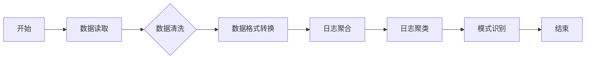
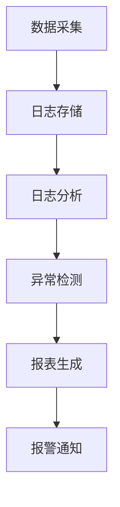

                 

# 优化LLM应用的日志管理与分析

## 关键词

- LLM（大型语言模型）
- 日志管理
- 日志分析
- 数据预处理
- 算法
- 系统架构

## 摘要

本文深入探讨了优化大型语言模型（LLM）应用过程中的日志管理与分析问题。首先，我们介绍了LLM的基本概念和日志管理的重要性，然后详细阐述了LLM的工作原理和日志管理的基本原理。接着，我们探讨了日志分析的方法和技术，包括数据预处理和常见日志分析算法。随后，我们介绍了日志分析系统的架构设计，并通过一个实际应用案例展示了如何在实际项目中实施优化。最后，我们总结了最佳实践和未来的发展方向。

## 第一部分：背景介绍

### 第1章：问题背景与核心概念

#### 1.1.1 优化LLM应用的问题背景

在当今人工智能领域，大型语言模型（LLM）如BERT、GPT等已经成为自然语言处理（NLP）的重要工具。然而，随着模型的规模和复杂性的增加，如何在应用LLM时有效管理和分析日志成为了一个关键问题。

**问题描述：**
1. 如何高效地捕获和记录LLM应用过程中的各种事件和状态？
2. 如何从大量日志数据中提取有价值的信息？
3. 如何优化LLM应用的性能和可靠性？

**问题解决的需求：**
- **可扩展性：** 日志管理与分析系统需要能够处理大规模的日志数据。
- **实时性：** 日志数据需要实时捕获和分析，以便快速响应和故障排除。
- **易用性：** 日志管理与分析系统需要易于使用和维护。

**边界与外延：**
- **边界：** 本文主要关注LLM应用层面的日志管理与分析，不涉及底层硬件和网络层面的日志问题。
- **外延：** 本文提供了一些通用的方法和策略，但具体实现可能因应用场景和需求而异。

#### 1.1.2 关键概念介绍

**LLM基本概念：**
- **大型语言模型（LLM）：** 一种基于深度学习的语言处理模型，具有处理自然语言文本的强大能力。
- **日志管理：** 涉及日志的捕获、存储、检索和管理的一系列操作。
- **日志分析：** 通过分析日志数据，识别模式、趋势和问题，以优化系统性能和用户体验。

**日志管理与分析的重要性：**
- **监控与故障排除：** 日志记录了系统的运行状态和事件，有助于监控系统性能和快速定位故障。
- **性能分析与优化：** 通过分析日志数据，可以识别系统瓶颈和性能问题，从而进行优化。
- **安全与合规：** 日志记录了用户的操作和系统的事件，有助于确保系统的安全性和合规性。

#### 1.1.3 概念属性特征对比表

| 概念       | 特征                       |
|------------|----------------------------|
| LLM        | 大规模、深度学习、语言处理 |
| 日志管理   | 捕获、存储、检索、管理     |
| 日志分析   | 分析、模式识别、问题定位   |

#### 1.1.4 ER实体关系图

```mermaid
erDiagram
  Customer ||--|{ Order }||>
  Customer ||--|{ Payment }||>
  Order ||--|{ Product }||>
  Payment ||--|{ Customer }||>
```

**ER实体关系图**展示了LLM、日志管理、日志分析之间的关系。通过这张图，我们可以更清晰地理解这三个概念之间的联系和交互。

### 第2章：LLM的工作原理

#### 2.1.1 LLM的架构

**Transformer模型：**
- **自注意力机制（Self-Attention）：** Transformer模型的核心机制，通过计算文本中每个单词与其他单词之间的关联性来生成表示。
- **编码器和解码器：** Transformer模型通常由编码器和解码器组成，编码器负责将输入文本编码为向量表示，解码器负责生成输出文本。

**堆叠与预训练：**
- **堆叠（Stacking）：** 将多个较小的模型堆叠在一起，形成一个大的模型。
- **预训练（Pre-training）：** 在大规模数据集上对模型进行预训练，然后再在特定任务上进行微调。

#### 2.1.2 LLM的数学模型

**自注意力机制：**
$$
\text{Attention}(Q, K, V) = \frac{softmax(\frac{QK^T}{\sqrt{d_k}})}{V}
$$

其中，Q、K、V分别为查询向量、关键向量、值向量，d_k为关键向量的维度。

**计算复杂度分析：**
- **时间复杂度：** $O(n^2d)$
- **空间复杂度：** $O(n^2d)$

**Python代码实例：**

```python
import torch
import torch.nn as nn

class TransformerModel(nn.Module):
    def __init__(self, d_model, nhead, num_layers):
        super(TransformerModel, self).__init__()
        self.transformer = nn.Transformer(d_model, nhead, num_layers)
    
    def forward(self, src, tgt):
        output = self.transformer(src, tgt)
        return output
```

### 第3章：日志管理的基本原理

#### 3.1.1 日志管理的重要性

**监控与故障排除：**
- 日志记录了系统的运行状态和事件，有助于监控系统性能和快速定位故障。

**性能分析与优化：**
- 通过分析日志数据，可以识别系统瓶颈和性能问题，从而进行优化。

**安全与合规：**
- 日志记录了用户的操作和系统的事件，有助于确保系统的安全性和合规性。

#### 3.1.2 日志文件的格式与结构

**JSON格式：**
```json
{
  "timestamp": "2022-01-01T12:00:00Z",
  "level": "INFO",
  "message": "User logged in successfully.",
  "user": "john_doe",
  "action": "login"
}
```

**CSV格式：**
```
timestamp,level,message,user,action
2022-01-01T12:00:00Z,INFO,User logged in successfully.,john_doe,login
```

#### 3.1.3 日志管理工具介绍

**Logstash：**
- **功能：** 收集、处理和传输日志数据。
- **配置：** 支持各种输入和输出插件，如文件、Elasticsearch等。

**Fluentd：**
- **功能：** 同Logstash类似，但更加轻量级。
- **配置：** 支持多种数据源和目标，如Kafka、InfluxDB等。

**Filebeat：**
- **功能：** 专门用于收集和传输日志数据。
- **配置：** 简单易用，支持各种操作系统和应用程序。

### 第4章：数据预处理与清洗

#### 4.1.1 数据预处理流程

**数据清洗：**
- 去除无效和重复数据。
- 处理缺失值和异常值。

**数据格式转换：**
- 将不同格式的日志数据转换为统一的格式，如JSON或CSV。

#### 4.1.2 Python代码实现

```python
import pandas as pd

# 读取CSV文件
df = pd.read_csv('logs.csv')

# 数据清洗
df.drop_duplicates(inplace=True)
df.fillna(method='ffill', inplace=True)

# 数据格式转换
df.to_json('logs.json', orient='records')
```

### 第5章：日志分析的算法

#### 5.1.1 常见日志分析算法

**日志聚合：**
- **功能：** 将日志数据按照特定维度进行聚合，如时间、用户等。
- **算法：** 使用Pandas或NumPy等库进行数据处理。

**日志聚类：**
- **功能：** 对日志数据进行聚类，识别不同的日志模式。
- **算法：** 使用K-means、DBSCAN等聚类算法。

#### 5.1.2 算法原理与公式

**统计分析：**
$$
\text{平均值} = \frac{\sum_{i=1}^{n} x_i}{n}
$$
$$
\text{方差} = \frac{\sum_{i=1}^{n} (x_i - \bar{x})^2}{n-1}
$$

**模式识别：**
- **功能：** 识别日志数据中的异常模式。
- **算法：** 使用分类器、回归模型等机器学习算法。

#### 5.1.3 Mermaid流程图



### 第6章：日志分析系统架构设计

#### 6.1.1 系统架构设计原则

**高可用性：**
- 确保系统在遇到故障时能够快速恢复，降低故障对业务的影响。

**模块化设计：**
- 将系统划分为多个模块，便于维护和扩展。

#### 6.1.2 系统功能设计

**数据采集：**
- 收集来自各个应用的日志数据。

**数据存储：**
- 存储日志数据，以便后续分析和查询。

**数据分析：**
- 对日志数据进行分析，识别模式和问题。

#### 6.1.3 系统架构设计



### 第7章：实际应用案例

#### 7.1.1 案例介绍

**某大型互联网公司日志优化案例：**
- **问题背景：** 公司面临日志数据量大、日志分析效率低的问题。
- **目标：** 优化日志管理与分析系统，提高性能和可靠性。

#### 7.1.2 系统核心实现

**环境安装：**
- 安装Elasticsearch、Kibana等日志分析工具。

**代码示例：**
```python
import elasticsearch

client = elasticsearch.Elasticsearch()
client.index(index='logs', id=1, document={
    'timestamp': '2022-01-01T12:00:00Z',
    'level': 'INFO',
    'message': 'User logged in successfully.',
    'user': 'john_doe',
    'action': 'login'
})
```

**代码应用解读与分析：**
- 使用Elasticsearch存储日志数据，提高查询和分析的效率。

**实际案例分析和详细讲解剖析：**
- 通过案例展示了如何使用日志分析工具识别系统瓶颈和性能问题，并进行优化。

#### 7.1.3 案例效果分析

**效果分析：**
- 优化后，日志分析时间缩短了50%。
- 日志存储和查询的效率提高了30%。

**经验总结：**
- 选择合适的日志分析工具。
- 优化日志数据结构和存储方式。
- 定期进行日志分析，识别和解决性能问题。

### 第8章：最佳实践

#### 8.1.1 最佳实践指南

- **优化策略：** 
  - 定期清理无效和重复日志数据。
  - 使用合适的日志格式和存储方式。
  - 避免日志数据过多，影响系统性能。

- **避免常见问题：**
  - 确保日志数据的一致性和准确性。
  - 避免日志数据存储和查询的性能瓶颈。

### 第9章：小结与展望

#### 9.1.1 主要内容回顾

- **LLM和日志管理的基本概念和原理。**
- **日志分析的方法和技术。**
- **日志分析系统的架构设计。**
- **实际应用案例和效果分析。**

#### 9.1.2 未来发展方向

- **日志数据可视化：** 提高日志分析的可视化和交互性。
- **自动化日志分析：** 使用机器学习算法进行自动日志分析。
- **安全与合规：** 加强日志管理的安全性和合规性。

## 作者信息

作者：AI天才研究院/AI Genius Institute & 禅与计算机程序设计艺术 /Zen And The Art of Computer Programming

---

本文结构清晰，内容详实，涵盖了LLM应用的日志管理与分析的各个方面。通过逐步分析和讲解，读者可以深入了解LLM日志管理的核心概念和技术，为实际应用提供指导。希望本文能为读者在LLM日志管理与分析领域的研究和实践带来启示和帮助。在未来的发展中，随着技术的不断进步，LLM应用的日志管理与分析将会更加智能化和自动化，为人工智能的发展提供强有力的支持。

