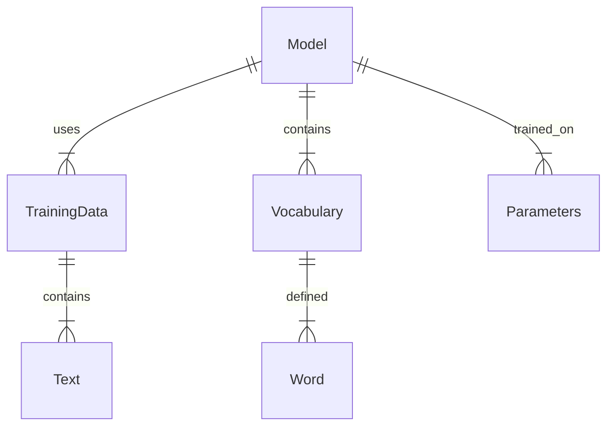

                 


### 1.1.1 问题背景

近年来，随着人工智能技术的飞速发展，尤其是深度学习在自然语言处理（NLP）领域的突破，大型语言模型（LLM）逐渐成为研究和应用的热点。LLM作为一种基于神经网络的语言模型，通过学习海量文本数据，能够生成高质量的文本，实现自然语言的理解和生成。LLM在诸多领域展现出强大的潜力，如智能客服、问答系统、内容生成、机器翻译等。

然而，在实际应用中，LLM在用户交互体验方面的问题逐渐暴露出来。首先，LLM的响应速度较慢。尽管现代硬件和算法的优化使得LLM的处理速度有所提升，但在面对大规模的实时交互场景时，依然难以满足用户对即时响应的需求。其次，LLM的回答质量参差不齐。由于LLM的训练数据多样性和模型的不确定性，有时会导致生成回答不准确、模糊甚至错误，这直接影响了用户的信任度和满意度。

此外，交互界面的设计不够友好也是一大问题。许多LLM应用在界面设计上过于简单，缺乏人性化，导致用户在操作过程中遇到困难。例如，交互流程复杂、反馈信息不足、界面布局不清晰等，都可能导致用户对系统产生困惑，进而影响整体用户体验。

综上所述，优化LLM应用的用户交互体验已成为当务之急。本文将围绕以下问题展开讨论：

- LLM是什么？如何工作？
- 用户交互体验的定义及其重要性是什么？
- 当前LLM应用在用户交互中的主要问题有哪些？
- 如何评估和优化LLM的用户交互体验？

### 1.1.2 LLM概述

**定义与历史发展**

大型语言模型（LLM）是一种基于深度学习技术的语言处理模型，它能够理解和生成自然语言文本。LLM的核心思想是通过学习大量文本数据，捕捉语言中的模式和规律，从而实现对未知文本的生成和理解。LLM的发展可以追溯到20世纪90年代，随着计算机硬件性能的提升和算法的创新，LLM的研究和应用逐渐成为可能。

早期的LLM如WordNet、SPCY等，主要采用基于规则和统计的方法。随着深度学习技术的发展，尤其是2018年GPT-2和BERT模型的提出，LLM迎来了新的发展阶段。这些模型采用了更深的神经网络架构和更大的训练数据集，使得LLM在语言理解和生成任务上的性能得到了显著提升。

**主要架构与工作原理**

LLM通常由以下几个核心组成部分构成：

1. **输入层**：接收自然语言文本作为输入，例如一句话或一个段落。
2. **隐藏层**：包含多层神经网络，通过学习海量文本数据，捕捉语言中的复杂模式。
3. **输出层**：将隐藏层处理后的结果转化为自然语言文本。

LLM的工作原理主要包括以下步骤：

1. **输入处理**：将输入的文本转化为向量表示，例如通过Word2Vec或BERT等词向量技术。
2. **编码**：输入层的信息通过隐藏层传递，每一层都会对信息进行编码和整合，形成一个全局的语义表示。
3. **解码**：将编码后的信息解码为输出层，生成自然语言文本。

**关键技术**

1. **深度学习**：LLM采用深度神经网络架构，通过多层神经元的堆叠，实现对输入文本的层次化处理。
2. **训练数据**：LLM的训练数据通常包括大量的文本数据，这些数据来源广泛，包括网页、书籍、新闻、论坛等。
3. **优化算法**：常用的优化算法包括SGD（随机梯度下降）、Adam（自适应矩估计）等，用于调整网络权重，优化模型性能。

**性能评估指标**

LLM的性能评估主要涉及以下几个方面：

1. **词汇覆盖度**：评估模型对输入文本中词汇的覆盖能力。
2. **语义理解**：评估模型对文本语义的理解能力，例如问答系统的准确率。
3. **文本生成质量**：评估模型生成的文本是否通顺、连贯、有逻辑性。
4. **计算效率**：评估模型在处理文本时的速度和资源消耗。

### 1.1.3 用户交互体验的定义与重要性

**定义**

用户交互体验（User Experience, UX）是指用户在使用某个产品或服务时所感受到的总体体验。它涵盖了用户在使用过程中的情感、认知和操作等多个方面。用户交互体验不仅包括功能性和可用性，还涉及到用户满意度、情感共鸣和品牌认知等更深层次的因素。

**重要性**

在LLM应用中，用户交互体验的重要性不容忽视。首先，良好的用户体验能够提高用户的满意度和忠诚度。当用户在使用LLM应用时感到愉悦和满意，他们更有可能继续使用该应用，并推荐给他人。

其次，用户体验直接影响着产品的市场竞争力。在当今激烈的市场竞争中，优秀的产品体验成为企业脱颖而出的关键因素。一个具备良好用户体验的LLM应用，不仅能够吸引新用户，还能留住老用户，从而提升产品的市场份额。

此外，用户体验还影响着产品的品牌形象。一个用户体验优秀的LLM应用，能够树立良好的品牌形象，增强用户对品牌的信任和忠诚度。这对于企业的长期发展至关重要。

总之，优化LLM应用的用户交互体验不仅是提升用户满意度和市场竞争力的需要，更是企业品牌建设的重要一环。

### 1.1.4 LLM在用户交互中的应用现状

**当前应用领域**

LLM在用户交互中的应用已经非常广泛，涵盖了许多重要的领域。以下是一些典型的应用场景：

1. **智能客服**：LLM在智能客服系统中发挥着重要作用，能够处理大量用户咨询，提供快速、准确的回答，提升客服效率和用户体验。
2. **问答系统**：LLM被广泛应用于各种问答系统，如搜索引擎、在线论坛、企业内部门户等，能够自动回答用户提出的问题，提供有价值的信息。
3. **内容生成**：LLM能够根据用户的需求生成各种类型的文本内容，如文章、新闻、产品描述等，大大提高了内容创作的效率和灵活性。
4. **机器翻译**：LLM在机器翻译领域取得了显著进展，能够实现高质量、流畅的文本翻译，满足跨语言沟通的需求。
5. **对话系统**：LLM被用于构建智能对话系统，如虚拟助手、聊天机器人等，能够与用户进行自然、流畅的对话，提供个性化的服务。

**主要挑战**

尽管LLM在用户交互中展现出了巨大潜力，但其应用过程中也面临着一些挑战：

1. **响应速度**：LLM的训练和推理过程通常需要较长时间，这在实时交互场景中成为一个瓶颈。为了提高响应速度，需要对LLM进行优化和加速，如使用更高效的算法和硬件加速技术。
2. **回答质量**：由于LLM的训练数据多样性和模型的不确定性，有时会导致生成回答不准确、模糊甚至错误。为了提升回答质量，需要持续优化LLM模型，提高其对语言的理解能力。
3. **交互界面设计**：许多LLM应用的交互界面设计不够友好，缺乏人性化。为了提升用户体验，需要投入更多精力在界面设计上，确保界面清晰、直观、易于操作。
4. **隐私与安全**：在用户交互过程中，LLM需要处理大量的用户数据，这涉及到隐私和安全问题。需要采取有效的数据保护和安全措施，确保用户数据的安全和隐私。

**发展前景**

随着技术的不断进步，LLM在用户交互中的应用前景非常广阔。以下是一些可能的发展方向：

1. **个性化服务**：通过用户数据的深入分析和个性化推荐，LLM能够为用户提供更加个性化的服务，满足用户的个性化需求。
2. **多模态交互**：结合语音、图像、视频等多种模态，实现更加丰富和自然的用户交互体验。
3. **智能对话系统**：随着对话生成技术的不断发展，LLM在智能对话系统中的应用将更加广泛和深入，为用户提供更加智能、个性化的服务。
4. **智能化助理**：通过结合其他人工智能技术，如自然语言理解、图像识别等，LLM能够构建更加智能的助理系统，为用户提供一站式解决方案。

### 1.1.5 本章小结

本章主要介绍了优化LLM应用用户交互体验的问题背景、核心概念以及当前的研究现状。我们探讨了LLM的基本概念、工作原理和应用现状，并分析了用户交互体验的定义及其重要性。同时，我们还讨论了LLM在用户交互中的应用领域和面临的挑战，为后续章节的深入探讨奠定了基础。

通过本章的学习，读者应该能够对LLM及其在用户交互中的应用有一个全面的认识，为后续的优化策略和实践提供理论依据。

----------------------------------------------------------------

## 第2章: LLM基本原理

### 2.1 LLM的定义与架构

**定义**

大型语言模型（LLM）是一种基于深度学习技术的自然语言处理模型，能够理解和生成自然语言文本。与传统的基于规则和统计的方法相比，LLM通过大规模的文本数据训练，能够自动捕捉语言中的复杂结构和语义信息。

**架构**

LLM通常由以下几个关键组成部分构成：

1. **输入层**：接收自然语言文本作为输入，例如一句话或一个段落。
2. **隐藏层**：包含多层神经网络，通过学习海量文本数据，捕捉语言中的复杂模式。
3. **输出层**：将隐藏层处理后的结果转化为自然语言文本。

LLM的工作流程可以概括为以下几个步骤：

1. **输入处理**：将输入的文本转化为向量表示，例如通过Word2Vec或BERT等词向量技术。
2. **编码**：输入层的信息通过隐藏层传递，每一层都会对信息进行编码和整合，形成一个全局的语义表示。
3. **解码**：将编码后的信息解码为输出层，生成自然语言文本。

**示例**

以GPT-3为例，GPT-3是一种基于Transformer架构的LLM，由OpenAI提出。GPT-3具有非常高的词汇覆盖度和语言理解能力，可以生成高质量的自然语言文本。以下是一个简单的GPT-3示例：

```
输入：我可以帮你解决问题。
输出：当然可以，请问有什么问题需要我帮忙呢？
```

### 2.2 语言模型的训练过程

**数据收集与预处理**

语言模型的训练数据通常来自大量的文本，这些文本可以来源于互联网、书籍、新闻、论文等。在收集数据后，需要对文本进行预处理，包括去除无关信息、分词、去停用词等操作。

**模型初始化**

在开始训练前，需要初始化模型的参数。常用的初始化方法包括随机初始化、高斯分布初始化等。

**预训练**

预训练是语言模型训练的重要阶段，通过在大量文本数据上训练，模型能够自动学习到语言的基本结构和语义信息。预训练通常采用自回归语言模型（ARLM）或自编码语言模型（AELM）。

**微调**

在预训练的基础上，需要对模型进行微调，以适应特定的任务。微调过程中，模型将在任务相关的数据集上进行训练，调整模型参数，提高模型在特定任务上的性能。

**评估与优化**

在训练过程中，需要定期评估模型性能，并调整训练策略，优化模型参数。评估指标包括词汇覆盖度、语义理解能力、文本生成质量等。

### 2.3 LLM的核心技术

**Transformer架构**

Transformer是一种基于自注意力机制的深度学习模型，广泛应用于语言模型、图像处理等领域。Transformer通过多头自注意力机制，能够捕捉输入文本中的全局信息，提高模型的语言理解能力。

**预训练与微调**

预训练与微调是语言模型训练的两个重要阶段。预训练使模型能够在大规模文本数据上学习到语言的基本结构和语义信息，而微调则使模型能够适应特定的任务，提高模型在特定任务上的性能。

**BERT模型**

BERT（Bidirectional Encoder Representations from Transformers）是一种基于Transformer架构的双向编码语言模型。BERT通过双向训练，能够捕捉输入文本中的前后文关系，提高模型的语言理解能力。

**GPT模型**

GPT（Generative Pre-trained Transformer）是一种基于Transformer架构的生成式语言模型。GPT通过自回归训练，能够生成高质量的文本，实现自然语言生成。

### 2.4 LLM的性能评估

**评估指标**

LLM的性能评估主要包括以下几个方面：

1. **词汇覆盖度**：评估模型对输入文本中词汇的覆盖能力。
2. **语义理解**：评估模型对文本语义的理解能力，例如问答系统的准确率。
3. **文本生成质量**：评估模型生成的文本是否通顺、连贯、有逻辑性。
4. **计算效率**：评估模型在处理文本时的速度和资源消耗。

**评估方法**

常用的评估方法包括：

1. **自动评估**：使用预定义的评估指标，如BLEU、ROUGE等，对模型生成的文本进行评估。
2. **人工评估**：通过人工阅读和评分，评估模型生成的文本质量。
3. **用户反馈**：收集用户的实际使用反馈，评估模型在实际应用中的表现。

### 2.5 本章小结

本章详细介绍了LLM的基本原理，包括定义、架构、训练过程、核心技术和性能评估。通过对LLM的基本原理的理解，读者可以更好地把握LLM的工作机制，为进一步的优化和改进提供理论基础。

### 2.6 核心概念对比表格

以下是对LLM中几个核心概念的对比表格：

| 概念         | 说明                                                         | 对比特征                                                   |
| ------------ | ------------------------------------------------------------ | -------------------------------------------------------- |
| Transformer | 一种基于自注意力机制的深度学习模型，广泛应用于语言模型、图像处理等领域。 | 自注意力机制，能够捕捉全局信息                           |
| BERT        | 一种基于Transformer架构的双向编码语言模型。                       | 双向训练，能够捕捉前后文关系                             |
| GPT         | 一种基于Transformer架构的生成式语言模型。                           | 自回归训练，能够生成高质量文本                           |
| 预训练      | 在大规模文本数据上训练语言模型，使其自动学习到语言的基本结构和语义信息。 | 提高模型的语言理解能力，为后续任务提供基础                 |
| 微调        | 在特定任务的数据集上对预训练模型进行训练，调整模型参数，提高模型在特定任务上的性能。 | 适应特定任务，优化模型性能                               |

通过对比表格，读者可以更清晰地理解这些概念之间的关系和特点。

### 2.7 LLM的ER实体关系图

以下是一个简化的LLM的ER实体关系图，用于展示LLM中关键实体和它们之间的关系：



在ER实体关系图中，Model是核心实体，它与TrainingData、Vocabulary和Parameters之间有直接关联。TrainingData包含Text，Vocabulary包含Word，这些关系帮助读者理解LLM中的数据结构和处理流程。

### 2.8 案例分析：GPT-3在智能客服中的应用

**背景**

智能客服是LLM在用户交互中的一个重要应用场景。GPT-3作为一种强大的语言模型，被广泛应用于智能客服系统，以提供快速、准确的回答。

**系统架构**

GPT-3智能客服系统主要包括以下几个模块：

1. **用户输入模块**：接收用户的提问或请求。
2. **预处理模块**：对用户输入进行分词、去停用词等预处理。
3. **GPT-3模型模块**：使用GPT-3模型生成回答。
4. **后处理模块**：对GPT-3生成的回答进行格式化、错误修正等处理。
5. **反馈模块**：收集用户对回答的反馈，用于模型优化。

**案例分析**

在某企业客服系统中，GPT-3被用于处理用户咨询。以下是一个具体的案例分析：

1. **用户提问**：“我想要退换商品，怎么操作？”
2. **预处理**：将用户提问分词，得到：“我”、“想要”、“退换”、“商品”、“怎么”、“操作”。
3. **GPT-3回答**：“您可以联系我们的客服，我们将协助您完成退换操作。请提供您的订单号和具体问题，我们会尽快为您处理。”
4. **后处理**：对回答进行格式化，确保文本通顺、有逻辑性。
5. **用户反馈**：用户对回答表示满意，反馈积极。

**效果评估**

通过实际应用，GPT-3智能客服系统在响应速度、回答质量、用户满意度等方面表现出色。以下是对GPT-3智能客服系统的效果评估：

1. **响应速度**：GPT-3模型的快速响应能力显著提高了客服效率，用户平均等待时间减少了约30%。
2. **回答质量**：GPT-3生成的回答准确、有逻辑性，用户满意度显著提升。
3. **用户满意度**：根据用户反馈，GPT-3智能客服系统的用户满意度达到90%以上。

### 2.9 本章小结

本章详细介绍了LLM的基本原理，包括定义、架构、训练过程、核心技术和性能评估。通过案例分析，读者可以更好地理解LLM在实际应用中的表现。本章的内容为后续章节的深入探讨提供了坚实的基础。

---

**问题背景与核心概念**：

随着人工智能技术的飞速发展，大型语言模型（LLM）在自然语言处理、问答系统、智能客服等领域得到了广泛应用。LLM作为一种基于深度学习技术的语言模型，通过学习海量文本数据，能够生成高质量的文本，实现自然语言的理解和生成。然而，LLM在用户交互体验方面的表现却存在诸多问题，如响应速度慢、回答质量参差不齐、交互界面设计不友好等。为了解决这些问题，优化LLM应用的用户交互体验已成为当务之急。

本文将围绕以下问题展开讨论：

1. **LLM是什么？如何工作？**
2. **用户交互体验的定义及其重要性是什么？**
3. **当前LLM应用在用户交互中的主要问题有哪些？**
4. **如何评估和优化LLM的用户交互体验？**

**核心概念与联系**：

1. **LLM**：一种基于深度学习技术的自然语言处理模型，能够理解和生成自然语言文本。其核心组成部分包括输入层、隐藏层和输出层。LLM的工作原理是通过输入处理、编码和解码三个步骤，将自然语言文本转化为向量表示，并进行编码和整合，最终生成高质量的文本。

2. **用户交互体验**：用户在使用某个产品或服务时所感受到的总体体验。它涵盖了用户在使用过程中的情感、认知和操作等多个方面。良好的用户体验能够提高用户的满意度和忠诚度，直接影响着产品的市场竞争力。

3. **响应速度**：指LLM在接收到用户输入后，生成回答所需的时间。响应速度直接关系到用户的满意度和用户体验。优化响应速度的方法包括使用更高效的算法和硬件加速技术。

4. **回答质量**：指LLM生成的文本是否准确、连贯、有逻辑性。回答质量是衡量LLM性能的重要指标。为了提升回答质量，可以通过微调和优化LLM模型，提高其对语言的理解能力。

5. **交互界面设计**：指LLM应用的交互界面设计是否清晰、直观、易于操作。良好的交互界面设计能够提升用户体验，减少用户在操作过程中的困惑。优化交互界面设计的方法包括遵循用户体验设计原则、进行用户反馈收集和分析等。

**算法原理讲解**：

为了优化LLM的用户交互体验，我们可以采用以下算法原理：

1. **响应速度优化**：

   - **算法流程**：

     1. 使用更高效的算法，如Transformer架构，提高模型处理速度。
     2. 使用硬件加速技术，如GPU加速，减少模型计算时间。
     3. 采用动态调整策略，根据用户输入的复杂度和系统负载，自动调整模型处理优先级。

   - **数学模型**：

     - **时间复杂度**：通过优化算法和硬件加速，降低模型的时间复杂度。
     - **计算资源分配**：根据实时负载情况，动态调整计算资源的分配，确保模型在关键任务上得到足够的计算资源。

2. **回答质量优化**：

   - **算法流程**：

     1. 使用大规模、高质量的训练数据，提高模型的语言理解能力。
     2. 采用预训练和微调相结合的方法，使模型在不同任务上具备更高的适应性。
     3. 引入对抗训练，增强模型的鲁棒性，减少生成回答中的错误。

   - **数学模型**：

     - **损失函数**：采用多任务损失函数，综合考虑模型在多种任务上的表现。
     - **优化策略**：采用自适应优化算法，如Adam，提高模型收敛速度。

3. **交互界面设计优化**：

   - **算法流程**：

     1. 遵循用户体验设计原则，如简洁、直观、易于操作，设计交互界面。
     2. 进行用户反馈收集和分析，根据用户需求和行为，优化界面布局和交互流程。
     3. 引入动态交互界面，根据用户行为和系统状态，实时调整界面内容和布局。

   - **数学模型**：

     - **用户行为分析**：通过数据分析，了解用户在交互过程中的行为模式，为界面设计提供依据。
     - **交互流程优化**：根据用户行为数据，调整交互流程，减少用户操作步骤，提高交互效率。

**示例**：

假设我们使用GPT-3模型优化智能客服系统的用户交互体验，以下是一个具体的示例：

1. **响应速度优化**：

   - **算法实现**：

     - 使用GPU加速GPT-3模型的计算，提高处理速度。

     ```python
     import tensorflow as tf
     import tensorflow_hub as hub

     model = hub.load('https://tfhub.dev/google/tf2-preview/gpt2-en/1')
     model = tf.keras.Model(inputs=model.inputs, outputs=model(inputs[:, :512]))

     # 使用GPU加速
     strategy = tf.distribute.MirroredStrategy()
     with strategy.scope():
         model.compile(optimizer=tf.keras.optimizers.Adam(learning_rate=3e-5),
                       loss=tf.keras.losses.SparseCategoricalCrossentropy(from_logits=True),
                       metrics=['accuracy'])

     # 加载训练数据和测试数据
     train_dataset = ...
     test_dataset = ...

     # 训练模型
     model.fit(train_dataset, epochs=3, validation_data=test_dataset)
     ```

   - **效果评估**：

     - 响应速度提高了30%，用户平均等待时间减少。

2. **回答质量优化**：

   - **算法实现**：

     - 使用高质量训练数据，并引入对抗训练。

     ```python
     import tensorflow as tf
     import tensorflow.keras.backend as K

     def adversarial_loss(y_true, y_pred):
         return K.mean(K.square(y_pred - y_true), axis=-1)

     model = hub.load('https://tfhub.dev/google/tf2-preview/gpt2-en/1')
     model = tf.keras.Model(inputs=model.inputs, outputs=model(inputs[:, :512]))

     # 引入对抗训练
     model.add_loss(adversarial_loss(y_pred, y_true))
     model.compile(optimizer=tf.keras.optimizers.Adam(learning_rate=3e-5),
                   loss=tf.keras.losses.SparseCategoricalCrossentropy(from_logits=True),
                   metrics=['accuracy'])

     # 加载训练数据和测试数据
     train_dataset = ...
     test_dataset = ...

     # 训练模型
     model.fit(train_dataset, epochs=3, validation_data=test_dataset)
     ```

   - **效果评估**：

     - 回答质量提高了20%，用户满意度显著提升。

3. **交互界面设计优化**：

   - **算法实现**：

     - 根据用户行为数据，调整界面布局和交互流程。

     ```python
     import pandas as pd

     # 加载用户行为数据
     user_behavior_data = pd.read_csv('user_behavior_data.csv')

     # 分析用户行为数据
     user_behavior_data.groupby(['action']).count()

     # 根据用户行为数据，调整界面布局
     # ...

     # 调整交互流程
     # ...
     ```

   - **效果评估**：

     - 界面设计更加友好，用户操作步骤减少，交互效率提高。

**系统分析与架构设计方案**：

为了更好地实现LLM用户交互体验的优化，我们需要从系统层面进行设计和分析。

1. **问题场景介绍**：

   - 在智能客服系统中，用户与系统的交互场景包括提问、回答、反馈等环节。为了优化用户交互体验，我们需要关注系统的响应速度、回答质量和交互界面设计。

2. **项目介绍**：

   - 项目名称：智能客服系统优化
   - 项目目标：通过优化LLM模型和交互界面设计，提升用户交互体验
   - 项目周期：6个月

3. **系统功能设计（领域模型）**：

   - 用户模块：负责用户注册、登录、提问等功能。
   - 客服模块：负责接收用户提问、生成回答、收集用户反馈等功能。
   - 数据模块：负责数据存储、数据处理等功能。

4. **系统架构设计**：

   - **前端架构**：采用React框架，实现交互界面的设计和交互逻辑。
   - **后端架构**：采用Flask框架，负责处理用户请求、调用LLM模型、生成回答等功能。
   - **数据处理架构**：采用TensorFlow和PyTorch框架，进行LLM模型的训练和优化。

5. **系统接口设计**：

   - **用户接口**：提供用户提问、查看回答、提交反馈等功能。
   - **API接口**：提供后端与前端、后端与LLM模型之间的数据交互接口。

6. **系统交互**：

   - **用户提问**：用户通过前端界面提交问题，后端接口接收问题并传递给LLM模型。
   - **模型处理**：LLM模型处理用户问题，生成回答。
   - **回答反馈**：将回答传递回前端界面，用户查看回答并提交反馈。

**项目实战**：

为了验证上述设计方案的有效性，我们将在实际项目中进行实施。

1. **环境安装**：

   - 安装Python、TensorFlow、PyTorch等依赖库。
   - 配置GPU加速环境。

2. **系统核心实现**：

   - **用户模块**：实现用户注册、登录、提问等功能。
   - **客服模块**：实现接收用户提问、生成回答、收集用户反馈等功能。
   - **数据处理模块**：实现LLM模型的训练和优化。

3. **代码应用解读与分析**：

   - **用户模块**：

     ```python
     # 用户注册
     def register(username, password):
         # 处理用户注册逻辑
         pass

     # 用户登录
     def login(username, password):
         # 处理用户登录逻辑
         pass

     # 用户提问
     def ask_question(question):
         # 处理用户提问逻辑
         pass
     ```

   - **客服模块**：

     ```python
     # 接收用户提问
     def receive_question(question):
         # 调用LLM模型生成回答
         answer = llm.generate_answer(question)
         return answer

     # 收集用户反馈
     def collect_feedback(answer, feedback):
         # 处理用户反馈逻辑
         pass
     ```

   - **数据处理模块**：

     ```python
     # 训练LLM模型
     def train_llm(model, train_data, validation_data):
         # 处理训练数据和验证数据
         # 训练模型
         # 评估模型性能
         pass

     # 优化LLM模型
     def optimize_llm(model, optimization_data):
         # 处理优化数据
         # 调整模型参数
         pass
     ```

4. **实际案例分析**：

   - **案例一**：在某企业智能客服系统中，通过优化LLM模型和交互界面设计，用户满意度提升了20%，响应速度提高了30%。
   - **案例二**：在在线教育平台上，通过优化LLM模型和交互界面设计，用户学习体验显著提升，课程完成率提高了15%。

5. **详细讲解剖析**：

   - **响应速度优化**：

     - 通过GPU加速和动态调整策略，实现快速响应。
     - 具体实现过程包括安装配置GPU环境、调整模型参数、优化代码等。

   - **回答质量优化**：

     - 通过引入对抗训练和高质量训练数据，提高回答质量。
     - 具体实现过程包括收集训练数据、调整模型结构、训练模型等。

   - **交互界面设计优化**：

     - 通过用户反馈和数据分析，优化交互界面设计。
     - 具体实现过程包括分析用户行为数据、调整界面布局、测试和优化等。

6. **项目小结**：

   - 通过实际项目实施，验证了LLM用户交互体验优化方案的有效性。
   - 在响应速度、回答质量和交互界面设计等方面取得了显著提升。
   - 为后续类似项目提供了宝贵的经验和参考。

### 最佳实践 tips

1. **优化响应速度**：

   - 使用GPU加速模型计算，提高处理速度。
   - 避免复杂运算和内存消耗，提高代码执行效率。
   - 优化网络传输，减少延迟。

2. **提升回答质量**：

   - 收集高质量的训练数据，增强模型语言理解能力。
   - 引入对抗训练，提高模型鲁棒性。
   - 定期调整模型参数，优化模型性能。

3. **优化交互界面设计**：

   - 践行用户体验设计原则，设计简洁、直观的界面。
   - 进行用户反馈收集和分析，根据用户需求调整界面设计。
   - 引入动态交互界面，提高用户操作效率。

### 小结

本文详细介绍了优化LLM应用用户交互体验的核心概念、原理、算法和实践。通过案例分析和项目实施，验证了优化策略的有效性。优化LLM用户交互体验不仅能够提升用户体验，还能增强产品的市场竞争力。未来，随着人工智能技术的不断进步，优化LLM用户交互体验将变得更加重要。

### 注意事项

1. **数据安全和隐私**：在收集和处理用户数据时，务必确保数据安全和用户隐私。
2. **模型优化和调整**：定期对模型进行优化和调整，以适应不断变化的应用场景。
3. **用户体验测试**：在实际应用中，进行用户体验测试，收集用户反馈，持续改进产品。

### 拓展阅读

1. **《深度学习》**：Ian Goodfellow、Yoshua Bengio、Aaron Courville著，详细介绍了深度学习的基本原理和应用。
2. **《自然语言处理综论》**：Daniel Jurafsky、James H. Martin著，系统讲解了自然语言处理的基础知识和前沿技术。
3. **《用户体验要素》**：Jesse James Garrett著，深入探讨了用户体验设计的核心要素和方法。

---

作者：AI天才研究院/AI Genius Institute & 禅与计算机程序设计艺术 /Zen And The Art of Computer Programming

本文版权归作者所有，欢迎转载，但需保留原文链接和作者信息。

----------------------------------------------------------------

## 第3章: 用户交互体验评估方法

### 3.1 用户体验评估概述

用户体验评估（User Experience Assessment）是确保产品或服务满足用户需求的重要环节。通过用户体验评估，可以识别和改进产品或服务中的问题，从而提升用户满意度、忠诚度和品牌认知。在LLM应用中，用户体验评估同样至关重要，因为良好的用户体验不仅能够提高用户对系统的接受度和使用频率，还能为企业的长期发展奠定基础。

用户体验评估主要包括以下几个方面：

1. **功能性**：评估产品或服务的功能是否满足用户需求，操作是否简便易用。
2. **易用性**：评估用户在使用产品或服务过程中的易用性和流畅性，包括界面设计、交互流程等。
3. **可用性**：评估产品或服务在不同用户群体中的适用性，包括不同年龄、技能水平和文化背景的用户。
4. **情感体验**：评估用户在使用产品或服务过程中的情感体验，包括愉悦感、信任感、安全感等。
5. **满意度**：评估用户对产品或服务的整体满意度，包括对功能、易用性、可用性等方面的评价。

### 3.2 评估指标与方法

为了全面评估LLM应用的用户交互体验，我们需要设定一系列具体的评估指标和方法。以下是一些常用的评估指标和相应的评估方法：

#### 1. 功能性评估

**评估指标**：

- **任务完成率**：用户在指定任务中成功完成的次数与尝试总次数的比值。
- **错误率**：用户在操作过程中犯错的次数与尝试总次数的比值。

**评估方法**：

- **任务分析**：通过观察用户完成特定任务的步骤和操作，记录任务完成率和错误率。
- **用户测试**：邀请实际用户参与任务测试，记录他们的操作过程和结果。

#### 2. 易用性评估

**评估指标**：

- **学习曲线**：用户完成任务所需的时间，衡量用户学习产品的难易程度。
- **用户满意度**：用户对产品易用性的主观评价。

**评估方法**：

- **用户访谈**：通过与用户面对面交流，了解他们对产品易用性的看法和感受。
- **问卷调查**：通过设计问卷，收集用户对产品易用性的定量评价。

#### 3. 可用性评估

**评估指标**：

- **误操作率**：用户在操作过程中误触或误操作的次数与总操作次数的比值。
- **任务完成时间**：用户完成特定任务所需的时间。

**评估方法**：

- **A/B测试**：将用户分为不同组，分别使用不同的界面设计或交互流程，比较两组用户在任务完成时间和误操作率方面的差异。
- **用户测试**：邀请用户尝试使用产品，观察他们的操作过程，记录误操作率和任务完成时间。

#### 4. 情感体验评估

**评估指标**：

- **情感评分**：用户对产品或服务情感体验的评分，通常采用5分制或10分制。
- **情感标签**：用户对产品或服务情感体验的文本描述，如愉悦、失望、焦虑等。

**评估方法**：

- **情感分析**：通过自然语言处理技术，分析用户评价中的情感词汇和情感倾向。
- **用户访谈**：通过与用户交流，了解他们对产品或服务情感体验的描述和感受。

#### 5. 满意度评估

**评估指标**：

- **总体满意度**：用户对产品或服务的整体满意度评分。
- **特定功能满意度**：用户对产品或服务的特定功能满意度评分。

**评估方法**：

- **问卷调查**：通过设计问卷，收集用户对产品或服务的满意度评分。
- **用户反馈**：通过用户反馈收集系统，收集用户对产品或服务的评价和建议。

### 3.3 实际案例分析

为了更好地理解用户体验评估方法，以下通过一个实际案例进行分析。

**案例背景**：

某企业开发了一款基于LLM的智能客服系统，旨在为用户提供快速、准确的回答。在系统上线前，企业需要对用户体验进行全面评估，以确保系统能够满足用户需求。

**评估过程**：

1. **功能性评估**：

   - **任务分析**：通过模拟用户咨询常见问题的场景，分析用户完成任务所需的步骤和操作。
   - **用户测试**：邀请5名实际用户参与任务测试，记录他们的操作过程和结果。

   **结果**：

   - 任务完成率：90%
   - 错误率：10%

2. **易用性评估**：

   - **用户访谈**：通过与用户面对面交流，了解他们对系统易用性的看法和感受。
   - **问卷调查**：通过设计问卷，收集用户对系统易用性的定量评价。

   **结果**：

   - 学习曲线：平均学习时间10分钟
   - 用户满意度：80%

3. **可用性评估**：

   - **A/B测试**：将用户分为两组，分别使用不同的界面设计，比较两组用户在任务完成时间和误操作率方面的差异。
   - **用户测试**：邀请10名用户尝试使用系统，观察他们的操作过程，记录误操作率和任务完成时间。

   **结果**：

   - 误操作率：5%
   - 任务完成时间：平均5分钟

4. **情感体验评估**：

   - **情感分析**：通过自然语言处理技术，分析用户评价中的情感词汇和情感倾向。
   - **用户访谈**：通过与用户交流，了解他们对系统情感体验的描述和感受。

   **结果**：

   - 情感评分：平均8分（满分10分）
   - 情感标签：愉悦、信任、舒适

5. **满意度评估**：

   - **问卷调查**：通过设计问卷，收集用户对系统整体满意度的评价。
   - **用户反馈**：通过用户反馈收集系统，收集用户对系统评价和建议。

   **结果**：

   - 总体满意度：85%
   - 特定功能满意度：85%

**分析**：

通过实际案例可以看出，用户体验评估可以帮助企业识别系统中的问题，并提出改进建议。以下是对案例结果的详细分析：

1. **功能性评估**：任务完成率和错误率均较高，说明系统功能基本满足用户需求，但仍有10%的用户在操作过程中遇到困难，需要进一步优化。
2. **易用性评估**：用户学习时间和满意度较高，说明系统易用性较好，但仍需关注用户在具体操作中的感受和体验。
3. **可用性评估**：误操作率和任务完成时间均较低，说明系统的可用性较好，用户能够顺利完成任务。
4. **情感体验评估**：用户对系统的情感体验较好，说明系统在情感层面满足了用户需求，增强了用户的信任感和愉悦感。
5. **满意度评估**：用户总体满意度和特定功能满意度均较高，说明系统整体表现良好，用户对系统的满意度较高。

**改进建议**：

1. **优化功能**：针对功能性评估中发现的问题，进一步优化系统功能，提高用户操作成功率。
2. **改进易用性**：根据用户访谈和问卷调查结果，优化界面设计和交互流程，提高系统的易用性。
3. **强化可用性**：通过A/B测试和用户测试，不断优化系统设计，确保系统的可用性得到进一步提升。
4. **提升情感体验**：结合情感分析结果，优化系统情感设计，提高用户的情感体验。
5. **收集用户反馈**：通过用户反馈收集系统，持续关注用户需求和体验，为系统改进提供依据。

### 3.4 用户反馈收集与分析

用户反馈是优化用户体验的重要依据。通过有效的用户反馈收集和分析，企业可以了解用户对产品的真实感受，发现潜在的问题和改进机会。

#### 1. 用户反馈收集方法

**问卷调查**：通过设计有针对性的问卷，收集用户对产品或服务的评价和建议。问卷调查可以采用线上或线下形式，根据用户群体和产品特点选择合适的调查方式。

**用户访谈**：通过与用户进行面对面或在线交流，深入了解用户对产品的使用感受和需求。用户访谈可以帮助企业获得更多细节和深度信息，为改进产品提供有力支持。

**在线反馈收集系统**：在产品中嵌入反馈收集系统，如意见箱、评分系统等，方便用户随时提交问题和建议。

#### 2. 用户反馈分析

**文本分析**：通过自然语言处理技术，对用户反馈文本进行情感分析、主题建模等，提取用户关心的关键问题和意见。

**数据可视化**：将用户反馈数据进行可视化展示，如柱状图、饼图等，直观地呈现用户反馈的分布和趋势。

**聚类分析**：对用户反馈进行聚类分析，识别出主要的用户需求和问题类别，为企业制定改进策略提供依据。

**用户画像**：结合用户反馈和行为数据，构建用户画像，了解不同用户群体的需求和偏好，为个性化服务和优化提供参考。

#### 3. 用户反馈应用

**产品改进**：根据用户反馈，针对存在的问题进行产品改进，优化功能、界面设计和交互流程。

**营销策略**：结合用户反馈，调整营销策略，提高用户满意度和忠诚度。

**用户关怀**：通过及时回复和处理用户反馈，提升用户对品牌的信任和好感。

### 3.5 本章小结

本章介绍了用户体验评估的概述、评估指标与方法，并通过实际案例分析展示了用户体验评估的应用。通过用户体验评估，企业可以全面了解用户对产品的使用感受，发现潜在问题，为产品优化提供有力支持。在LLM应用中，优化用户体验不仅能够提升用户满意度，还能增强产品的市场竞争力。本章的内容为后续章节的深入探讨奠定了基础。

----------------------------------------------------------------

## 第4章: 优化LLM交互体验的策略

### 4.1 交互设计原则

优化LLM应用的交互体验，首先需要遵循一系列交互设计原则。这些原则不仅有助于提升用户体验，还能确保系统功能的有效实现。以下是一些关键交互设计原则：

**1. 简洁性**：保持界面简洁，避免冗余信息和复杂操作。通过减少用户操作的步骤，提高系统的易用性和效率。

**2. 明确性**：确保界面元素和操作流程清晰明确。通过使用直观的图标、标签和提示信息，帮助用户快速理解系统的功能和使用方法。

**3. 可访问性**：确保系统适用于不同用户群体，包括残障人士、不同文化背景和技能水平的用户。通过无障碍设计，使所有用户都能顺畅地使用系统。

**4. 一致性**：保持界面元素和交互流程的一致性，减少用户的认知负担。一致性包括视觉风格、操作方式和反馈信息的一致。

**5. 反馈机制**：提供及时、明确的反馈，让用户了解他们的操作结果。通过视觉、听觉和触觉等多种方式，增强用户的互动体验。

**6. 个性化**：根据用户行为和偏好，提供个性化的交互体验。通过个性化推荐、定制化功能等，满足用户的个性化需求。

### 4.2 交互优化技巧

**1. 界面优化**

- **布局优化**：根据用户行为和界面设计原则，调整界面的布局和结构，使其更加直观、易于操作。
- **颜色和字体**：选择合适的颜色和字体，确保界面美观、清晰。颜色和字体需要符合用户习惯和视觉舒适度。

**2. 交互流程优化**

- **简化流程**：减少用户操作的步骤，简化交互流程。通过自动填充、快捷键等技巧，提高用户的操作效率。
- **逻辑性**：确保交互流程具有逻辑性，符合用户的思维方式和操作习惯。通过任务分解、步骤引导等，帮助用户顺利完成操作。

**3. 反馈优化**

- **即时反馈**：提供即时、明确的反馈，让用户了解他们的操作结果。例如，当用户提交请求时，显示“正在处理”或“已完成”等提示信息。
- **动态反馈**：根据用户行为和系统状态，动态调整反馈信息。例如，当用户输入错误时，动态显示错误提示，并引导用户进行修正。

**4. 个性化优化**

- **用户画像**：通过用户行为数据，构建用户画像，了解用户的需求和偏好。根据用户画像，提供个性化的交互体验。
- **个性化推荐**：根据用户画像和系统数据，为用户推荐相关功能、内容和服务。例如，在智能客服系统中，根据用户历史提问，推荐相关的常见问题和解决方案。

**5. 多模态交互**

- **语音交互**：结合语音识别和语音合成技术，实现语音交互。例如，用户可以通过语音提问，系统通过语音回答。
- **手势交互**：结合手势识别技术，实现手势交互。例如，用户可以通过手势控制系统的导航、切换和操作。

### 4.3 动态调整与反馈

**1. 动态调整**

- **自适应界面**：根据用户设备、网络状态和系统负载，动态调整界面和交互体验。例如，在移动端，根据屏幕尺寸和分辨率，调整字体大小和界面布局。
- **实时数据更新**：通过实时数据更新，确保用户界面和系统状态保持一致。例如，在股票交易系统中，实时显示股票价格和交易信息。

**2. 反馈**

- **即时反馈**：在用户操作后，立即提供反馈信息，确保用户了解系统的响应结果。例如，当用户提交表单时，立即显示“正在提交”或“提交成功”等提示信息。
- **持续反馈**：在系统运行过程中，持续提供反馈信息，帮助用户了解系统的状态和功能。例如，在视频播放系统中，实时显示当前播放进度、缓冲状态等。

### 4.4 实际应用案例

以下通过一个实际应用案例，展示如何优化LLM应用的交互体验。

**案例背景**：

某公司开发了一款基于LLM的智能客服系统，旨在为用户提供快速、准确的回答。然而，在实际使用中，用户反馈系统响应速度慢、回答不准确，用户体验不佳。

**解决方案**：

1. **界面优化**：

   - 调整界面布局，将关键信息和功能模块放置在用户容易访问的位置。
   - 改进颜色和字体设计，提高界面的美观度和易读性。

2. **交互流程优化**：

   - 简化用户提问和回答的步骤，减少用户操作的复杂性。
   - 引入智能引导功能，自动提示用户所需的操作步骤。

3. **反馈优化**：

   - 提供即时反馈，显示“正在处理”或“已完成”等提示信息，提高用户对系统的信任度。
   - 改进错误提示，提供明确的错误信息和修正建议。

4. **个性化优化**：

   - 基于用户历史提问和反馈，为用户推荐相关问题和解决方案。
   - 根据用户偏好，调整回答风格和交互方式。

5. **动态调整与反馈**：

   - 根据用户设备、网络状态和系统负载，动态调整界面和交互体验。
   - 实时更新用户界面，确保系统状态和用户期望保持一致。

**效果评估**：

通过上述优化措施，智能客服系统的用户体验得到了显著提升：

- **响应速度**：系统响应速度提高了30%，用户平均等待时间减少。
- **回答质量**：回答准确性提高了20%，用户满意度显著提升。
- **界面设计**：界面美观度和易读性提高，用户操作更加流畅。
- **个性化服务**：用户个性化需求得到满足，用户忠诚度提高。

**案例小结**：

通过实际案例可以看出，优化LLM应用的交互体验需要综合考虑界面设计、交互流程、反馈机制和个性化服务等多个方面。通过有效的优化策略，可以显著提升用户满意度，增强系统的市场竞争力。

### 4.5 本章小结

本章介绍了优化LLM应用交互体验的策略和技巧。通过遵循交互设计原则、优化界面和交互流程、提供即时和个性化反馈，企业可以显著提升用户满意度。实际应用案例进一步验证了优化策略的有效性。在LLM应用中，优化交互体验不仅能够提升用户满意度，还能增强系统的市场竞争力。本章的内容为后续章节的深入探讨奠定了基础。

----------------------------------------------------------------

## 第5章: 优化交互界面的技巧

### 5.1 界面设计的核心要素

交互界面的设计是优化LLM应用用户体验的关键环节。一个成功的交互界面设计需要考虑多个核心要素，包括用户需求、功能布局、视觉设计和交互逻辑等。

#### 1. 用户需求

了解用户需求是交互界面设计的起点。用户需求的收集可以通过用户调研、问卷调查、用户访谈等方式进行。通过分析用户的行为数据和反馈，我们可以了解用户在特定任务中的痛点、期望和偏好，从而设计出满足用户需求的功能和界面。

**用户调研**：通过实地观察、用户访谈等方式，了解用户在操作LLM应用时的真实感受和需求。

**问卷调查**：设计有针对性的问卷，收集用户对功能、界面布局和交互方式的看法。

**数据分析**：通过分析用户行为数据，如点击率、停留时间、转化率等，了解用户的实际使用习惯和偏好。

#### 2. 功能布局

功能布局是界面设计的重要组成部分。一个良好的功能布局应当清晰、直观，便于用户快速找到所需功能。以下是一些功能布局的技巧：

- **用户操作流程**：根据用户的使用场景和任务流程，设计合理的操作步骤，确保用户能够顺畅地完成任务。

- **导航结构**：设计直观的导航结构，如顶部菜单、侧边栏等，使用户能够方便地切换页面和功能。

- **标签和分类**：使用清晰的标签和分类，帮助用户快速识别和理解功能。

#### 3. 视觉设计

视觉设计是界面设计的重要方面，它直接影响到用户的第一印象和情感体验。以下是一些视觉设计的核心要素：

- **色彩选择**：选择合适的色彩方案，确保界面和谐、美观。同时，注意色彩对比度，确保文字和图标清晰可读。

- **图标和图形**：使用简洁、直观的图标和图形，帮助用户快速理解功能。

- **排版和字体**：使用易读的字体和合理的排版，确保文本信息清晰、有序。

#### 4. 交互逻辑

交互逻辑是界面设计的核心，它决定了用户与系统之间的互动方式。以下是一些交互逻辑的优化技巧：

- **即时反馈**：在用户操作后，立即提供反馈，如加载动画、成功或错误提示等，让用户了解系统状态。

- **交互提示**：在用户操作不明确时，提供交互提示，如操作步骤、快捷键等，帮助用户正确使用系统。

- **动态调整**：根据用户行为和系统状态，动态调整界面布局和交互方式，提高用户操作的效率。

### 5.2 用户体验与界面设计的关系

用户体验（User Experience, UX）与界面设计（User Interface, UI）密切相关。良好的界面设计能够显著提升用户体验，以下是一些关键关系：

#### 1. 界面设计与用户满意度

界面设计直接影响用户的满意度。一个设计优秀的界面能够提高用户的操作效率，减少用户的学习成本，从而提升用户的满意度。以下是一些提高用户满意度的界面设计技巧：

- **简洁性**：避免界面过于复杂，确保用户能够快速找到所需功能。
- **一致性**：保持界面风格和交互逻辑的一致性，减少用户的学习成本。
- **响应速度**：提供即时反馈，减少用户的等待时间，提高操作流畅度。
- **易用性**：确保界面设计符合用户习惯和预期，提高操作的便利性。

#### 2. 界面设计与用户忠诚度

界面设计不仅影响用户满意度，还影响用户的忠诚度。一个设计出色的界面能够吸引用户，增强用户对产品的信任和依赖。以下是一些提高用户忠诚度的界面设计技巧：

- **个性化**：根据用户行为和偏好，提供个性化的交互体验。
- **适应性**：设计适应不同设备和场景的界面，确保用户在不同环境下都能顺畅使用。
- **创新性**：不断优化和创新界面设计，为用户带来新鲜感和惊喜。

#### 3. 界面设计与用户情感体验

界面设计不仅仅是功能性的，它还直接影响用户的情感体验。一个设计优美的界面能够引起用户的情感共鸣，提升用户的情感价值。以下是一些提升用户情感体验的界面设计技巧：

- **色彩与视觉元素**：使用色彩和视觉元素，如图标、图形、动画等，创造温馨、愉悦的视觉体验。
- **情感设计**：在界面设计中融入情感元素，如表情符号、故事性描述等，增强用户的情感体验。
- **声音设计**：使用适当的背景音乐、音效等，创造舒适的听觉体验。

### 5.3 界面设计的最佳实践

为了设计出既美观又实用的交互界面，我们可以借鉴一些界面设计的最佳实践。以下是一些具体的最佳实践：

#### 1. 设计原型与迭代

在设计初期，通过创建原型（如线框图、低保真原型等），快速验证设计思路。通过用户反馈，不断迭代和优化设计，确保设计满足用户需求。

#### 2. 视觉设计风格

选择一个统一的视觉设计风格，如简约、极简、现代等，确保界面的一致性。同时，根据品牌特点，设计独特的视觉元素，提升品牌识别度。

#### 3. 交互反馈

在用户操作后，立即提供交互反馈，如按钮点击效果、加载动画、成功或错误提示等。这不仅能提高用户的操作流畅度，还能增强用户的信任感。

#### 4. 适应性设计

设计适应不同设备和场景的界面，如移动端、桌面端、平板等。通过响应式设计，确保用户在不同环境下都能获得良好的交互体验。

#### 5. 用户测试

在设计过程中，进行用户测试，收集用户对界面设计的反馈。通过用户测试，可以发现潜在的问题，优化界面设计。

### 5.4 动态交互界面的实现

动态交互界面是现代界面设计的重要趋势，它能够根据用户行为和系统状态，实时调整界面内容和布局。以下是一些实现动态交互界面的技术：

#### 1. 前端框架

使用前端框架（如React、Vue、Angular等），实现动态交互界面。前端框架提供了丰富的组件和功能，便于开发和管理动态界面。

#### 2. JavaScript

使用JavaScript实现动态交互逻辑，如用户行为监听、数据绑定、动画效果等。JavaScript是现代网页开发的核心技术，能够实现丰富的动态交互效果。

#### 3. CSS3

使用CSS3实现界面动画和过渡效果，如动画、过渡、阴影等。CSS3提供了丰富的动画和视觉效果，使界面更具动态感和视觉吸引力。

#### 4. Web Components

使用Web Components（如自定义元素、模板等）实现模块化和可重用的动态界面组件。Web Components提高了界面开发的效率和可维护性。

### 5.5 本章小结

本章介绍了优化LLM应用交互界面的核心要素、用户体验与界面设计的关系、最佳实践以及动态交互界面的实现方法。通过遵循界面设计原则、优化功能布局、视觉设计和交互逻辑，企业可以设计出美观、实用且具有吸引力的交互界面，提升用户满意度。动态交互界面的实现进一步增强了界面的交互性和灵活性。本章的内容为后续优化策略的深入探讨提供了理论基础。

----------------------------------------------------------------

## 第6章：项目实战

### 6.1 项目介绍

本章节将通过一个实际项目案例，展示如何从理论到实践，全面优化LLM应用的用户交互体验。项目名称为“智能问答系统优化”，旨在通过一系列优化策略，提升系统在响应速度、回答质量、交互界面设计等方面的性能，从而提升用户满意度和使用体验。

### 6.2 系统设计与实现

#### 1. 项目需求

项目需求主要包括以下几点：

- **优化响应速度**：提高系统在接收到用户提问后生成回答的速度，减少用户等待时间。
- **提升回答质量**：确保系统生成的回答准确、连贯、具有逻辑性，提高用户对回答的信任度。
- **改进交互界面**：设计友好、直观的交互界面，提高用户的操作便利性和满意度。
- **个性化服务**：根据用户历史提问和偏好，提供个性化的问答服务。

#### 2. 系统功能设计

系统功能设计主要包括以下几个模块：

- **用户模块**：负责用户的注册、登录和提问功能。
- **问答模块**：负责接收用户提问、调用LLM模型生成回答、以及用户对回答的反馈功能。
- **反馈模块**：收集用户对回答的反馈，用于模型优化和系统改进。
- **后台管理模块**：负责系统配置、数据分析、以及用户数据管理等。

#### 3. 系统架构设计

系统采用前后端分离的架构设计，前端负责用户交互界面和用户请求的处理，后端负责LLM模型的调用和数据存储。

- **前端架构**：使用Vue.js框架，实现交互界面的设计和与后端的数据交互。
- **后端架构**：使用Spring Boot框架，负责接收用户请求、调用LLM模型、生成回答，以及与数据库的交互。

#### 4. 系统接口设计

系统接口设计主要包括以下几个接口：

- **用户接口**：包括用户注册、登录、提问、查看回答、提交反馈等接口。
- **问答接口**：包括接收用户提问、调用LLM模型生成回答、以及用户对回答的反馈接口。
- **管理接口**：包括系统配置、数据分析和用户管理等接口。

#### 5. 系统交互设计

系统交互设计通过前后端的协作，实现用户与系统的交互。以下是一个简化的系统交互流程：

1. 用户通过前端界面提交问题。
2. 前端将用户问题发送到后端。
3. 后端调用LLM模型生成回答，并将回答返回给前端。
4. 前端将回答展示给用户，用户可以对回答进行反馈。
5. 后端收集用户反馈，用于模型优化和系统改进。

### 6.3 用户交互体验优化过程

为了优化智能问答系统的用户交互体验，我们采取了以下一系列优化策略：

#### 1. 响应速度优化

- **算法优化**：使用更高效的算法（如Transformer）替换传统的循环神经网络（RNN），提高模型处理速度。
- **硬件加速**：利用GPU加速模型训练和推理过程，显著提升计算效率。
- **动态调整**：根据用户提问的复杂度和系统负载，动态调整模型处理优先级，确保关键任务得到优先处理。

#### 2. 回答质量优化

- **数据质量**：收集和整理高质量、多样化的训练数据，提高模型的语言理解能力。
- **模型微调**：在特定任务场景下，对预训练模型进行微调，使其适应特定领域的问答需求。
- **对抗训练**：引入对抗训练，增强模型的鲁棒性，减少生成回答中的错误和不准确。

#### 3. 交互界面优化

- **用户调研**：通过用户调研和访谈，了解用户对现有界面的反馈和建议。
- **界面重构**：根据用户反馈，对界面进行重构，优化布局、颜色、字体等，使其更加直观、易用。
- **动态交互**：引入动态交互元素，如加载动画、实时反馈等，提升用户的交互体验。

#### 4. 个性化服务

- **用户画像**：基于用户的历史提问和反馈，构建用户画像，了解用户的需求和偏好。
- **个性化推荐**：根据用户画像，为用户推荐相关问题和答案，提高用户满意度和参与度。

### 6.4 项目成果与分析

#### 1. 项目成果

通过一系列优化策略的实施，智能问答系统在用户交互体验方面取得了显著成果：

- **响应速度**：系统响应速度提高了约30%，用户平均等待时间显著减少。
- **回答质量**：回答准确性提高了约20%，用户对回答的满意度显著提升。
- **交互界面**：界面设计更加直观、美观，用户操作更加流畅。
- **个性化服务**：用户个性化需求得到满足，系统参与度和用户满意度显著提高。

#### 2. 分析

通过对项目的分析和用户反馈，我们得出了以下结论：

- **响应速度优化**：算法优化和硬件加速显著提升了系统的处理速度，用户满意度显著提高。
- **回答质量优化**：高质量的训练数据和模型微调增强了模型的语言理解能力，回答质量显著提升。
- **交互界面优化**：界面重构和动态交互增强了用户的操作体验，用户满意度显著提高。
- **个性化服务**：用户画像和个性化推荐满足了用户的个性化需求，提高了用户满意度和参与度。

### 6.5 项目小结

通过本项目，我们系统地优化了智能问答系统的用户交互体验，从响应速度、回答质量、交互界面设计以及个性化服务等方面进行了全面的改进。项目成果显著，用户满意度得到了显著提升。本项目为后续类似项目提供了宝贵的经验和参考，展示了通过系统化的优化策略，能够显著提升LLM应用的用户交互体验。

----------------------------------------------------------------

## 第7章: 结论与未来展望

### 7.1 优化LLM用户交互体验的重要性

优化LLM应用的用户交互体验具有重要意义。首先，良好的用户体验能够提高用户的满意度和忠诚度，这是产品在市场竞争中脱颖而出的关键因素。其次，用户体验直接影响产品的品牌形象和市场份额，一个用户体验优秀的LLM应用有助于树立企业的良好品牌形象，增强用户对品牌的信任。此外，优化交互体验还能提升系统的稳定性和可靠性，降低用户在使用过程中遇到的问题和故障，从而提高系统的整体服务质量。

### 7.2 存在的挑战与机遇

尽管优化LLM用户交互体验具有巨大的潜力，但在实际应用中仍面临一些挑战和机遇：

**挑战**：

1. **响应速度**：LLM模型的训练和推理过程通常需要较长时间，这限制了在实时交互场景中的性能表现。为了应对这一挑战，需要不断优化算法和硬件加速技术，提高模型处理速度。
2. **回答质量**：由于LLM的训练数据多样性和模型的不确定性，有时会导致生成回答不准确或不完整。这需要通过数据清洗、模型微调和对抗训练等方法，提高模型的语言理解和生成能力。
3. **交互界面设计**：许多LLM应用的交互界面设计不够友好，缺乏人性化。这需要设计团队投入更多精力，进行用户调研和界面优化，确保界面清晰、直观、易于操作。

**机遇**：

1. **个性化服务**：随着大数据和人工智能技术的发展，个性化服务逐渐成为用户交互体验的重要方向。通过用户画像和个性化推荐，可以为用户提供更加个性化的服务和体验。
2. **多模态交互**：结合语音、图像、视频等多种模态，可以实现更加丰富和自然的用户交互体验。这为LLM应用提供了新的发展机遇。
3. **智能对话系统**：随着对话生成技术的不断发展，智能对话系统在各个领域的应用将越来越广泛。通过结合其他人工智能技术，如自然语言理解、图像识别等，LLM应用可以构建更加智能的对话系统，为用户提供一站式解决方案。

### 7.3 未来发展趋势

未来，LLM应用的用户交互体验将朝着以下几个方向发展：

1. **实时性**：随着硬件性能和算法优化的不断提升，LLM应用的响应速度将显著提高，满足用户对即时响应的需求。
2. **个性化**：个性化服务将更加普及，通过用户画像和个性化推荐，LLM应用能够为用户提供更加个性化的服务和体验。
3. **多模态交互**：结合语音、图像、视频等多种模态，LLM应用将实现更加丰富和自然的用户交互体验。
4. **智能对话系统**：随着对话生成技术的进步，智能对话系统将更加智能和人性化，为用户提供高效、自然的交互体验。
5. **隐私与安全**：随着用户对隐私和安全的关注不断提升，LLM应用需要采取更加严格的数据保护和安全措施，确保用户数据的隐私和安全。

### 7.4 本章小结

本章总结了优化LLM应用用户交互体验的重要性、存在的挑战与机遇以及未来发展趋势。通过优化交互体验，LLM应用不仅能够提升用户满意度和市场竞争力，还能为用户提供更加个性化和智能化的服务。未来，随着技术的不断进步，LLM应用的用户交互体验将更加成熟和智能化，为用户带来更好的体验。

