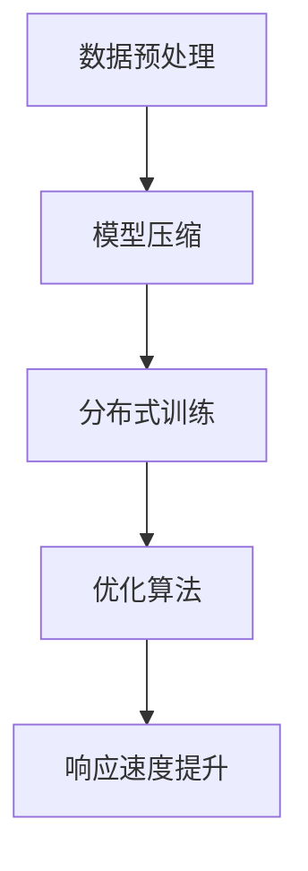
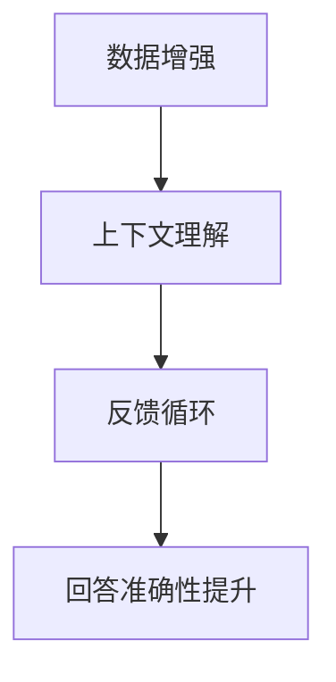
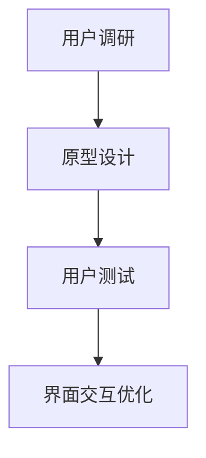
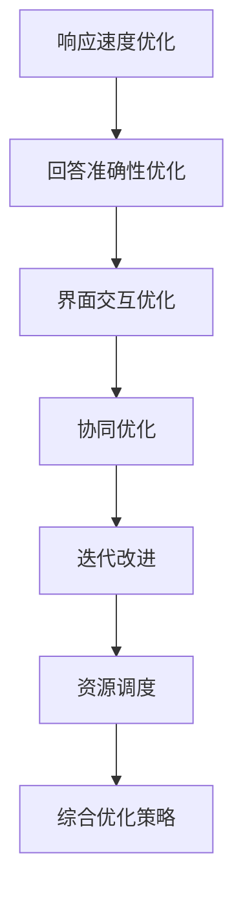

                 


# 优化LLM应用的用户体验设计流程

## 第1章 引言

### 1.1 问题背景
大规模语言模型（LLM）在近年来取得了显著的进展，已经在诸多领域得到了广泛应用，如聊天机器人、智能客服、内容生成等。然而，尽管LLM的应用前景广阔，但用户体验方面仍存在一些问题，如响应速度慢、回答不准确、界面交互不友好等。

### 1.2 问题描述
首先，让我们思考一下用户在使用LLM应用时最关心的问题。首先，用户通常期望得到快速的响应。然而，由于模型复杂度与数据处理量较大，响应速度往往不尽如人意。其次，LLM生成的回答可能因为模型训练数据、上下文理解等问题，出现不准确或者不合理的情况。最后，用户界面设计不够友好，可能导致用户难以理解和使用应用。

### 1.3 问题解决
为了提升LLM应用的用户体验，我们需要优化设计流程。这包括以下几个方面：
1. **响应速度优化**：通过使用模型压缩技术、分布式训练和优化算法，降低模型复杂度，提高响应速度。
2. **回答准确性优化**：通过改进模型训练数据、增强上下文理解能力，提升回答准确性。
3. **界面交互优化**：通过改进用户界面设计，提升用户交互体验。

### 1.4 边界与外延
本文讨论的优化设计流程适用于所有使用LLM技术的应用场景，目标用户包括开发者、产品经理和用户体验设计师。

### 1.5 概念结构与核心要素组成
为了更好地理解用户体验设计流程，我们首先需要明确几个核心概念：
1. **用户体验（UX）**：用户体验是指用户在使用产品或服务时所感受到的满意度、愉悦度和参与度。
2. **用户体验设计（UX Design）**：用户体验设计是一种设计方法，旨在提升用户在使用产品或服务时的体验。
3. **大规模语言模型（LLM）**：大规模语言模型是一种能够理解和生成自然语言的大规模神经网络模型。

核心要素包括：
- **响应速度**：用户在使用LLM应用时，期望得到快速响应。
- **回答准确性**：用户期望LLM生成的回答准确、合理。
- **界面交互**：用户界面设计要友好、易于使用。

### 1.6 本章小结
本章节介绍了LLM应用在用户体验方面的问题，并提出了优化设计流程的必要性。在接下来的章节中，我们将深入探讨优化流程的具体方法和技术。

## 第2章 核心概念与联系

### 2.1 用户体验（UX）

用户体验（User eXperience，简称UX）是指用户在使用产品或服务时所感受到的满意度、愉悦度和参与度。用户体验是一个多维度的概念，包括情感体验、功能性体验、美学体验等方面。以下是用户体验的一些属性特征对比表格：

| 特征 | 满意度 | 愉悦度 | 参与度 |
| --- | --- | --- | --- |
| 重要性 | 高 | 高 | 高 |

用户体验设计的目标是提升用户在使用产品或服务时的满意度、愉悦度和参与度。为了实现这一目标，设计师需要从用户的角度出发，深入理解用户的需求、行为和心理。

### 2.2 用户体验设计（UX Design）

用户体验设计（User eXperience Design，简称UX Design）是一种设计方法，旨在提升用户在使用产品或服务时的体验。用户体验设计包括以下方法：

1. **用户调研**：通过访谈、问卷调查、用户观察等方式，收集用户的需求、行为和反馈。
2. **交互设计**：设计用户与产品或服务之间的交互流程，包括界面布局、导航结构、操作逻辑等。
3. **界面设计**：设计用户界面，包括视觉元素、色彩搭配、图标设计等。

用户体验设计的关键在于将用户需求与产品功能相结合，通过合理的设计方法，提升用户的满意度、愉悦度和参与度。

### 2.3 大规模语言模型（LLM）

大规模语言模型（Large Language Model，简称LLM）是一种能够理解和生成自然语言的大规模神经网络模型。LLM在自然语言处理领域取得了显著的进展，能够对文本进行理解、生成和推理。

LLM的特点包括：

1. **参数量巨大**：LLM的参数量通常达到数十亿甚至数万亿级别，使其能够捕捉到大量的语言特征。
2. **训练数据丰富**：LLM的训练数据来源于大量的互联网文本，包括新闻、文章、社交媒体等。
3. **生成能力强大**：LLM能够生成高质量的文本，包括文章、对话、摘要等。

### 2.4 概念属性特征对比表格

为了更好地理解用户体验、用户体验设计和大规模语言模型之间的关系，我们可以通过一个对比表格来展示它们的属性特征：

| 特征 | UX | UX Design | LLM |
| --- | --- | --- | --- |
| 目标 | 提升用户满意度 | 提升用户满意度 | 生成和理解自然语言 |
| 方法 | 研究用户需求 | 设计产品和服务 | 训练神经网络 |

### 2.5 ER实体关系图架构

为了更好地展示用户体验、用户体验设计和大规模语言模型之间的关系，我们可以使用ER（Entity-Relationship）实体关系图来描述它们之间的联系：

```mermaid
erDiagram
  User ||--|{ UX }|| Designer
  User ||--|{ UX }|| Product
  UX ||--|{ UX Design }|| Method
  UX Design ||--|{ LLM }|| Feature
```

在上述ER图中，User表示用户，UX表示用户体验，UX Design表示用户体验设计，LLM表示大规模语言模型。通过图中的关系，我们可以清晰地看到用户体验、用户体验设计和大规模语言模型之间的联系。

### 2.6 本章小结

本章节介绍了用户体验、用户体验设计和大规模语言模型的概念，并展示了它们之间的联系。在接下来的章节中，我们将深入探讨如何通过优化设计流程，提升LLM应用的用户体验。

## 第3章 算法原理讲解

### 3.1 响应速度优化

在优化LLM应用的响应速度时，我们首先需要了解影响响应速度的关键因素。通常，响应速度受以下几个因素影响：

1. **模型复杂度**：模型的参数量和计算量越大，处理速度越慢。
2. **数据处理量**：输入数据的规模和复杂度越高，处理速度越慢。
3. **硬件性能**：计算资源的性能，如CPU、GPU等。

为了提升响应速度，我们可以从以下几个方面进行优化：

1. **模型压缩**：通过模型压缩技术，减小模型的参数量和计算量。常见的模型压缩方法包括剪枝（Pruning）、量化（Quantization）和蒸馏（Distillation）等。
2. **分布式训练**：通过分布式训练，将模型和数据分布在多个计算节点上，实现并行计算，提高处理速度。
3. **优化算法**：通过优化算法，如梯度下降（Gradient Descent）和Adam（Adaptive Moment Estimation）等，加速模型训练和推理过程。

#### Mermaid流程图

以下是优化响应速度的Mermaid流程图：



#### Python源代码

下面是一个简化的Python代码示例，用于展示模型压缩、分布式训练和优化算法的基本实现：

```python
# 数据预处理
def preprocess_data(data):
    # ...处理数据...
    return processed_data

# 模型压缩
def compress_model(model):
    # ...压缩模型...
    return compressed_model

# 分布式训练
def distributed_training(model, data):
    # ...分布式训练...
    return trained_model

# 优化算法
def optimize_algorithm(model):
    # ...优化算法...
    return optimized_model
```

### 3.2 回答准确性优化

在提升LLM应用回答准确性的过程中，我们需要关注以下几个关键因素：

1. **模型训练数据**：模型的训练数据质量和数量直接影响回答的准确性。我们需要确保训练数据具有代表性、多样性和质量。
2. **上下文理解能力**：LLM需要能够理解输入的上下文，以生成相关、合理的回答。我们需要提升模型的上下文理解能力。
3. **反馈循环**：通过用户反馈，我们可以不断改进模型的训练数据和模型参数，提升回答的准确性。

为了优化回答准确性，我们可以采取以下策略：

1. **数据增强**：通过数据增强方法，如数据扩充、数据变换等，增加训练数据的多样性和质量。
2. **上下文理解**：通过改进模型架构，如引入注意力机制（Attention Mechanism）、长短期记忆（Long Short-Term Memory，LSTM）等，提升模型对上下文的理解能力。
3. **反馈循环**：通过用户反馈，建立反馈循环，不断调整模型参数和训练数据，提高回答的准确性。

#### Mermaid流程图

以下是优化回答准确性的Mermaid流程图：



#### Python源代码

下面是一个简化的Python代码示例，用于展示数据增强、上下文理解和反馈循环的基本实现：

```python
# 数据增强
def augment_data(data):
    # ...数据增强...
    return augmented_data

# 上下文理解
def understand_context(context):
    # ...上下文理解...
    return context_understood

# 反馈循环
def feedback_loop(model, user_feedback):
    # ...反馈循环...
    return updated_model
```

### 3.3 界面交互优化

在优化LLM应用的界面交互时，我们需要关注以下几个方面：

1. **用户交互流程**：设计简洁、直观的用户交互流程，减少用户的操作步骤，提高使用效率。
2. **界面设计**：设计美观、易用的界面，提高用户的使用体验。
3. **反馈机制**：提供即时、明确的反馈，帮助用户理解应用状态和操作结果。

为了优化界面交互，我们可以采取以下策略：

1. **用户调研**：通过用户调研，了解用户的需求、行为和痛点，为界面设计提供依据。
2. **原型设计**：通过原型设计，模拟用户与界面交互的过程，验证设计的合理性。
3. **用户测试**：通过用户测试，收集用户的反馈，不断优化界面设计。

#### Mermaid流程图

以下是优化界面交互的Mermaid流程图：



#### Python源代码

下面是一个简化的Python代码示例，用于展示用户调研、原型设计和用户测试的基本实现：

```python
# 用户调研
def user_research():
    # ...用户调研...
    return user_insights

# 原型设计
def prototype_design():
    # ...原型设计...
    return design Prototype

# 用户测试
def user_testing():
    # ...用户测试...
    return user_feedback
```

### 3.4 综合优化策略

在实际应用中，响应速度、回答准确性和界面交互往往相互影响。为了实现综合优化，我们可以采取以下策略：

1. **协同优化**：在设计和优化过程中，综合考虑响应速度、回答准确性和界面交互，实现三者的平衡。
2. **迭代改进**：通过持续的用户调研和反馈，不断优化设计，提升用户体验。
3. **资源调度**：根据实际需求，合理分配计算资源，提高系统的整体性能。

#### Mermaid流程图

以下是综合优化策略的Mermaid流程图：



#### Python源代码

下面是一个简化的Python代码示例，用于展示协同优化、迭代改进和资源调度的基本实现：

```python
# 协同优化
def collaborative_optimization():
    # ...协同优化...
    return optimized_solution

# 迭代改进
def iterative_improvement():
    # ...迭代改进...
    return improved_solution

# 资源调度
def resource_scheduling():
    # ...资源调度...
    return scheduled_resources
```

### 3.5 本章小结

在本章节中，我们介绍了优化LLM应用响应速度、回答准确性和界面交互的算法原理。通过模型压缩、分布式训练、优化算法、数据增强、上下文理解、反馈循环、用户调研、原型设计和用户测试等策略，我们可以有效提升LLM应用的用户体验。在接下来的章节中，我们将进一步探讨具体的优化方法和实践案例。

