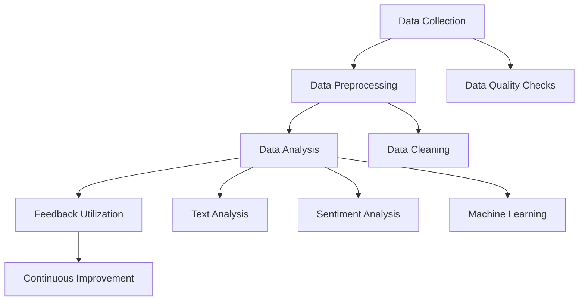

                 


## 1. Introduction to the Book and Background

### 1.1 The Issue of User Feedback Collection for LLM Applications

Let's dive into the issue at hand: the user feedback collection process in LLM applications. In recent years, we have witnessed the rapid development of artificial intelligence (AI) and, in particular, the rise of large language models (LLMs). These models have demonstrated impressive performance in various natural language processing tasks, from text generation to translation and question answering. However, to maintain and improve the quality of these models, user feedback collection plays a crucial role. 

User feedback collection serves as a bridge between the user experience and the continuous improvement of the LLM application. It allows developers to understand the user's needs, preferences, and pain points, which in turn informs the enhancement of the model's performance and user satisfaction. Without an effective feedback collection process, LLM applications risk becoming disconnected from the actual user needs, leading to suboptimal performance and potentially losing users to competitors.

#### 1.1.1 The Current State of AI and LLM Development

Artificial intelligence has made remarkable progress over the past few decades, with breakthroughs in areas such as computer vision, speech recognition, and machine learning. These advancements have paved the way for the development of LLMs, which have become the cornerstone of many applications, including chatbots, virtual assistants, and content generation tools. 

LLMs like GPT, BERT, and T5 have achieved state-of-the-art performance on various natural language understanding and generation tasks. These models are trained on massive amounts of text data, enabling them to generate coherent and contextually appropriate responses. However, despite their capabilities, these models are not perfect and require continuous improvement to address limitations such as bias, hallucination, and context understanding.

#### 1.1.2 The Importance of User Feedback Collection in LLM Applications

User feedback collection is essential for several reasons. Firstly, it helps identify areas where the LLM application is performing well and areas that need improvement. Users can provide valuable insights into the strengths and weaknesses of the application, allowing developers to prioritize enhancements based on real user needs. 

Secondly, user feedback helps in understanding the context in which the LLM is being used. Different users may have different expectations and requirements for the same application. By collecting and analyzing user feedback, developers can tailor the application to better meet the diverse needs of their user base.

Thirdly, user feedback enables the identification of potential issues and bugs that may not be apparent during the development process. Users often encounter unexpected scenarios and edge cases that the developers might have overlooked. By capturing and addressing these issues, developers can enhance the robustness and reliability of the application.

#### 1.1.3 Challenges in the Current User Feedback Collection Process

Despite the importance of user feedback, the current process of collecting and utilizing user feedback in LLM applications faces several challenges. These challenges include:

1. **Inefficient Data Collection**: The process of collecting user feedback is often manual and time-consuming, requiring developers to sift through large volumes of data to extract meaningful insights.

2. **Limited Feedback Volume**: The volume of user feedback collected may not be sufficient to draw accurate conclusions about the application's performance. This limitation can be due to low response rates or users' reluctance to provide detailed feedback.

3. **Lack of Structured Data**: User feedback is often unstructured, making it difficult to analyze and extract actionable insights. This lack of structure hampers the ability to identify patterns and trends that could inform optimization efforts.

4. **Time Delay**: The feedback collection process often suffers from significant delays, resulting in delayed improvements and a slower response to user needs.

5. **Data Privacy Concerns**: Collecting user feedback may raise privacy concerns, especially if the feedback includes sensitive information. Developers must ensure that user data is collected and stored securely to comply with privacy regulations.

### 1.2 Purpose and Significance

The purpose of this book is to provide a comprehensive guide to optimizing the user feedback collection process in LLM applications. By addressing the challenges outlined above, the book aims to improve the efficiency, effectiveness, and impact of user feedback collection.

The significance of this research lies in its potential to enhance the development and deployment of LLM applications. By optimizing the user feedback collection process, developers can:

1. **Gain Deeper Insights**: Improved feedback collection processes can provide more detailed and actionable insights, enabling developers to make informed decisions about the application's direction and enhancements.

2. **Enhance User Experience**: By addressing user feedback and making relevant improvements, developers can enhance the user experience, leading to increased user satisfaction and retention.

3. **Foster Innovation**: User feedback can drive innovation by revealing new use cases and opportunities for the application. This can help developers stay ahead of the competition and explore uncharted territories.

4. **Simplify Compliance**: An optimized feedback collection process can help developers comply with privacy regulations and other legal requirements, reducing the risk of data breaches and legal actions.

### 1.3 Core Concepts and Relationships

To effectively optimize the user feedback collection process for LLM applications, it is essential to understand the core concepts and their interrelationships. Here are some of the key concepts and their connections:

#### 1.3.1 Optimization

Optimization is the process of improving a system, process, or model to achieve the best possible outcome. In the context of user feedback collection, optimization involves refining the process to make it more efficient, effective, and user-friendly. This can include improving data collection methods, analyzing feedback more accurately, and utilizing feedback to drive improvements in the LLM application.

#### 1.3.2 User Feedback

User feedback refers to the input provided by users about their experiences with a product or service. It can include ratings, comments, reviews, and other forms of qualitative and quantitative data. User feedback is crucial for understanding user satisfaction, identifying areas for improvement, and informing product development decisions.

#### 1.3.3 LLM

LLM stands for Large Language Model, a type of AI model trained on massive amounts of text data to generate coherent and contextually appropriate text. LLMs are used in various applications, including chatbots, virtual assistants, and content generation. The quality and performance of these models depend on the quality and quantity of the user feedback they receive.

#### 1.3.4 User Feedback Collection Process

The user feedback collection process involves gathering, organizing, and analyzing user feedback to gain insights and drive improvements. This process typically includes stages such as data collection, data cleaning, and data analysis. Optimizing this process can improve the accuracy and reliability of the feedback collected, leading to better decision-making and product development.

#### 1.3.5 Mermaid Process Flowchart

Mermaid is a powerful tool for creating diagrams and flowcharts using markdown syntax. In the context of this book, Mermaid can be used to visualize the user feedback collection process, making it easier to understand and optimize. For example, a Mermaid process flowchart can illustrate the steps involved in collecting, cleaning, and analyzing user feedback.

#### 1.3.6 Python Source Code

Python is a popular programming language used in data analysis and machine learning. In this book, Python source code will be used to implement algorithms and models for analyzing and optimizing the user feedback collection process. Python's simplicity and flexibility make it an ideal choice for this task.

### 1.4 Research Methodology and Structure

This book adopts a mixed-methods research approach, combining quantitative and qualitative techniques to address the research questions. The following methodologies will be employed:

1. **Quantitative Analysis**: This involves the use of statistical techniques to analyze user feedback data, such as frequency analysis, clustering, and regression analysis. Quantitative analysis helps in identifying trends and patterns in user feedback.

2. **Qualitative Analysis**: This involves the use of text analysis techniques, such as thematic analysis and sentiment analysis, to interpret the meaning behind user feedback. Qualitative analysis helps in understanding the underlying reasons for user satisfaction or dissatisfaction.

3. **Case Studies**: This involves the analysis of real-world examples to illustrate the effectiveness of the proposed optimization methods. Case studies provide practical insights into how the optimization techniques can be applied in different contexts.

The book is structured as follows:

1. **Introduction**: Provides an overview of the book, including the research purpose, significance, and core concepts.
2. **Core Concepts and Theoretical Foundations**: Discusses the fundamentals of AI, LLMs, and user feedback collection.
3. **User Feedback Collection Process and Optimization Methods**: Describes the current user feedback collection process and proposes optimization methods.
4. **User Feedback Analysis and Model Improvement**: Discusses techniques for analyzing user feedback and improving LLM applications.
5. **Conclusion**: Summarizes the key findings and provides recommendations for future research.

By following this structure, the book aims to provide a comprehensive and practical guide to optimizing the user feedback collection process in LLM applications.
----------------------------------------------------------------

## 2. Core Concepts and Theoretical Foundations

### 2.1 Artificial Intelligence Overview

Artificial intelligence (AI) is an interdisciplinary field that combines computer science, mathematics, and statistics to create intelligent machines that can perform tasks that would typically require human intelligence. AI aims to develop systems that can reason, learn, perceive, and understand their environment, similar to how humans do.

#### 2.1.1 Definition of AI

AI can be defined in various ways, but one common definition is given by Arthur Samuel, who coined the term in the 1950s: "the science and engineering of making intelligent machines." AI encompasses a wide range of techniques, from simple rule-based systems to complex machine learning models.

#### 2.1.2 History of AI

The history of AI dates back to the 1950s when the field was first introduced. Early AI research focused on rule-based systems and symbolic reasoning. However, progress was slow due to the limitations of computational power and the complexity of human intelligence.

In the 1980s, AI research shifted towards expert systems, which were designed to mimic the decision-making processes of human experts in specific domains. Although expert systems achieved some success, they were limited by their lack of ability to generalize and adapt to new situations.

The 1990s and early 2000s saw the rise of machine learning, which revolutionized AI by allowing machines to learn from data and improve their performance without explicit programming. Techniques such as neural networks and decision trees gained popularity during this period.

In recent years, AI has experienced a renaissance fueled by advancements in deep learning and big data. Deep learning models, particularly neural networks with many layers (hence the name "deep"), have achieved state-of-the-art performance in various tasks, including image recognition, natural language processing, and speech recognition.

#### 2.1.3 Applications of AI

AI has a wide range of applications across various industries. Some of the key application areas include:

1. **Healthcare**: AI is used for medical imaging, disease diagnosis, drug discovery, and personalized treatment plans.

2. **Finance**: AI is used for algorithmic trading, fraud detection, and credit scoring.

3. **Manufacturing**: AI is used for predictive maintenance, quality control, and supply chain optimization.

4. **Transportation**: AI is used for autonomous vehicles, traffic management, and logistics optimization.

5. **Retail**: AI is used for personalized marketing, demand forecasting, and inventory management.

6. **Natural Language Processing**: AI is used for chatbots, virtual assistants, and language translation.

7. **Security**: AI is used for threat detection, intrusion detection, and cybersecurity.

### 2.2 Language Model Fundamentals

A language model is a type of AI model that learns to predict the next word or sequence of words in a given text. Language models are fundamental to many natural language processing tasks, including machine translation, text summarization, and text generation.

#### 2.2.1 Overview of Language Models

Language models can be categorized into two main types: statistical language models and neural network-based language models.

**Statistical Language Models**

Statistical language models, such as n-gram models, are based on the idea that the probability of a word occurring in a text can be predicted based on the occurrence of previous words. For example, an n-gram model considers the sequence of n previous words to predict the next word.

**Neural Network-Based Language Models**

Neural network-based language models, such as the Transformer architecture used in models like GPT and BERT, are more advanced and capable of capturing complex patterns in language. These models use deep neural networks to learn the relationship between words and generate coherent text.

#### 2.2.2 Classification of Language Models

Language models can be classified based on their training method and architecture:

1. **Recurrent Neural Networks (RNNs)**: RNNs are a type of neural network that can process sequential data. They are used in models like LSTM (Long Short-Term Memory) and GRU (Gated Recurrent Unit), which are designed to capture long-term dependencies in text.

2. **Transformer Models**: Transformer models, such as BERT and GPT, use self-attention mechanisms to process text. These models have achieved state-of-the-art performance in various natural language processing tasks.

3. **Recurrent Neural Network-based Language Models**: RNN-based language models, such as ELMo and BERT, combine the strengths of RNNs and transformers to capture both local and global dependencies in text.

4. **Transfer Learning Models**: Transfer learning models, such as T5 and BART, leverage pre-trained models on large datasets and fine-tune them on specific tasks, improving performance and reducing the need for large amounts of task-specific data.

#### 2.2.3 Key Tasks of Language Models

Language models are used for various tasks in natural language processing, including:

1. **Text Generation**: Language models can generate coherent and contextually appropriate text. This is used in applications such as chatbots, virtual assistants, and content generation.

2. **Machine Translation**: Language models are used to translate text from one language to another. These models have improved the quality of machine translation, making it more accurate and natural-sounding.

3. **Text Summarization**: Language models can generate concise summaries of long texts, extracting the most important information while preserving the original meaning.

4. **Question Answering**: Language models can answer questions based on a given context or a large corpus of text, making them useful in applications such as search engines and virtual assistants.

5. **Sentiment Analysis**: Language models can classify the sentiment of a text, identifying whether it is positive, negative, or neutral. This is used in applications such as customer feedback analysis and social media monitoring.

### 2.3 Principles of Large Language Models (LLMs)

Large language models (LLMs) are a class of neural network-based language models that have been trained on massive amounts of text data. These models have achieved state-of-the-art performance in various natural language processing tasks, making them crucial for the development of advanced AI applications.

#### 2.3.1 Working Principles of LLMs

LLMs, such as GPT, BERT, and T5, are based on the Transformer architecture, which uses self-attention mechanisms to process text. The self-attention mechanism allows the model to weigh the importance of different words in the input sequence, capturing both local and global dependencies.

During training, LLMs are fed with large amounts of text data, which they learn to generate coherent and contextually appropriate text. The model is trained to predict the next word or sequence of words in a given text, using the words that have already been generated as input.

#### 2.3.2 Advantages of LLMs

The main advantages of LLMs include:

1. **Coherence and Contextual Relevance**: LLMs can generate highly coherent and contextually relevant text, making them suitable for tasks such as text generation, machine translation, and text summarization.

2. **Generalization**: LLMs are trained on diverse and extensive datasets, allowing them to generalize well to different domains and tasks.

3. **Flexibility**: LLMs can be fine-tuned for specific tasks, making them adaptable to a wide range of applications.

4. ** Scalability**: LLMs can process large volumes of text data efficiently, enabling them to handle complex tasks involving large datasets.

5. **Robustness**: LLMs have been trained on diverse data, making them more robust to errors and inconsistencies in the input text.

#### 2.3.3 Limitations and Improvement Directions

Despite their advantages, LLMs have several limitations:

1. **Resource Requirements**: LLMs require large amounts of computational resources and data for training, making them expensive to deploy and maintain.

2. **Bias and Fairness**: LLMs can exhibit biases in their predictions, reflecting the biases present in the training data. Addressing bias and ensuring fairness in LLMs is an ongoing challenge.

3. **Hallucination**: LLMs can sometimes generate plausible but incorrect information, a phenomenon known as "hallucination."

4. **Contextual Understanding**: LLMs can struggle with understanding complex context and long-term dependencies in text.

To address these limitations, ongoing research focuses on developing more efficient training methods, improving data preprocessing techniques, and incorporating additional sources of knowledge to enhance the performance and reliability of LLMs.

### 2.4 Basic Concepts of User Feedback

User feedback is a crucial component in the development and improvement of AI applications, including LLMs. It provides valuable insights into user satisfaction, preferences, and pain points, which can inform the design and optimization of these applications.

#### 2.4.1 Definition of User Feedback

User feedback refers to the input provided by users about their experiences with a product or service. It can take various forms, including ratings, comments, reviews, and surveys. User feedback is collected through different channels, such as online forms, feedback forms within the application, and social media platforms.

#### 2.4.2 Types of User Feedback

User feedback can be classified into two main types: qualitative and quantitative.

**Qualitative Feedback**

Qualitative feedback is descriptive and provides insights into the user's thoughts, feelings, and experiences. It can be in the form of open-ended comments, reviews, and interviews. Qualitative feedback is valuable for understanding the reasons behind user satisfaction or dissatisfaction and identifying specific issues that need to be addressed.

**Quantitative Feedback**

Quantitative feedback is measurable and provides numerical data about user satisfaction and preferences. It can be in the form of ratings, scores, and survey responses. Quantitative feedback is useful for quantifying user satisfaction and identifying trends and patterns in user feedback.

#### 2.4.3 The Value of User Feedback

User feedback is essential for several reasons:

1. **Improving Product Quality**: User feedback helps developers identify areas where the product can be improved, leading to better user experiences and increased satisfaction.

2. **Informed Decision-Making**: User feedback provides valuable insights that can inform product development decisions, enabling developers to prioritize features and improvements based on user needs and preferences.

3. **Customer Retention**: Addressing user feedback and making relevant improvements can enhance user satisfaction and loyalty, reducing the likelihood of users switching to competitors.

4. **New Feature Development**: User feedback can reveal new use cases and opportunities for product development, fostering innovation and helping developers stay ahead of the competition.

5. **Continuous Improvement**: User feedback is a continuous feedback loop that helps developers iterate and refine their products over time, ensuring that they meet evolving user needs and remain relevant in a competitive market.

#### 2.4.4 Challenges in User Feedback Collection

Collecting user feedback can be challenging due to several factors:

1. **Response Rate**: Users may be hesitant to provide feedback, resulting in low response rates and insufficient data for analysis.

2. **Data Quality**: User feedback can be unstructured and subjective, making it difficult to extract meaningful insights and actionable information.

3. **Data Analysis**: Analyzing user feedback requires time and resources, and the process can be complex, especially when dealing with large volumes of data.

4. **Privacy Concerns**: Collecting user feedback may raise privacy concerns, especially if the feedback includes sensitive information. Developers must ensure that user data is collected and stored securely to comply with privacy regulations.

### 2.4.5 Importance of User Feedback for LLM Applications

User feedback is particularly important for LLM applications due to the complexity and variability of natural language. Here are some reasons why user feedback is crucial for LLM applications:

1. **Understanding User Needs**: User feedback provides insights into the specific needs and preferences of users, helping developers understand how their LLM applications are being used in real-world scenarios.

2. **Detecting Issues and Bugs**: Users often encounter unexpected scenarios and edge cases that developers may not have anticipated. User feedback can help identify issues and bugs that need to be addressed to improve the application's reliability and performance.

3. **Customizing User Experiences**: User feedback can be used to tailor the LLM application to better meet the diverse needs of different user groups, improving user satisfaction and engagement.

4. **Continuous Improvement**: By incorporating user feedback into the development process, LLM applications can be continuously improved and refined to better serve their users.

5. **Building Trust and Credibility**: Demonstrating a commitment to user feedback and making tangible improvements based on user input can help build trust and credibility with users, fostering a positive relationship between the application and its users.

In conclusion, user feedback is a valuable asset for optimizing LLM applications. By understanding and addressing user feedback, developers can enhance the performance, usability, and user satisfaction of their applications, driving success in the highly competitive AI market.

## 3. User Feedback Collection Process and Optimization Methods

### 3.1 Overview of the User Feedback Collection Process

The user feedback collection process is a crucial component in the development and improvement of LLM applications. It involves several stages, from data collection to analysis and utilization, each of which plays a vital role in understanding user needs and enhancing the application's performance. Let's delve into the main stages of the user feedback collection process:

#### 3.1.1 Data Collection

The first stage of the user feedback collection process is data collection. This involves gathering feedback from users through various channels, such as surveys, interviews, user forums, and social media platforms. The goal is to capture a wide range of perspectives and insights from different user segments.

**Data Collection Methods**

1. **Surveys and Questionnaires**: Surveys and questionnaires are one of the most common methods for collecting user feedback. They can be distributed online or through email, allowing users to provide structured responses to predefined questions.

2. **Interviews and Focus Groups**: Interviews and focus groups provide qualitative data that can reveal deeper insights into user experiences and motivations. These methods are particularly useful for understanding complex issues and gathering detailed feedback.

3. **User Forums and Social Media**: User forums and social media platforms can be valuable sources of user feedback, as they allow users to share their thoughts and experiences in a more informal and conversational setting.

**Challenges in Data Collection**

1. **Response Rate**: One of the main challenges in data collection is achieving a sufficient response rate. Users may be unwilling to take the time to provide feedback, especially if they perceive it as burdensome.

2. **Data Quality**: Incomplete or inaccurate data can undermine the effectiveness of user feedback analysis. Ensuring data quality requires rigorous validation and verification processes.

3. **Data Privacy**: Collecting user feedback may raise privacy concerns, particularly if the feedback includes sensitive information. It is essential to ensure that user data is collected and stored securely to comply with privacy regulations.

#### 3.1.2 Data Organization and Management

Once the user feedback data is collected, it needs to be organized and managed effectively to facilitate analysis. This stage involves several key steps:

**Data Organization**

1. **Categorization**: Feedback data should be categorized based on relevant dimensions, such as user demographics, feedback type (e.g., positive or negative), and feedback source.

2. **Segmentation**: Users should be segmented into different groups based on their characteristics and behaviors. This helps in understanding the needs and preferences of different user segments.

**Data Management**

1. **Database Storage**: Feedback data should be stored in a secure and scalable database. This ensures that the data is easily accessible for analysis and reporting.

2. **Data Cleaning**: Raw feedback data often contains noise and inconsistencies that need to be addressed. Data cleaning involves removing duplicates, correcting errors, and standardizing data formats.

#### 3.1.3 Data Analysis

Data analysis is the stage where the collected user feedback is processed to extract meaningful insights. This involves applying various analytical techniques to identify patterns, trends, and key insights that can inform product development decisions.

**Data Analysis Techniques**

1. **Text Analysis**: Text analysis techniques, such as sentiment analysis, topic modeling, and keyword extraction, are used to interpret the meaning behind user feedback. These techniques help in identifying common themes and sentiments expressed by users.

2. **Descriptive Statistics**: Descriptive statistics are used to summarize the main characteristics of the user feedback data, such as the average rating, number of positive/negative comments, and response rates.

3. **Correlation and Regression Analysis**: Correlation and regression analysis are used to examine the relationships between different variables, such as user demographics and satisfaction levels, to identify factors that impact user experience.

4. **Visualization**: Visualization techniques, such as charts and graphs, are used to present the analysis results in a clear and intuitive manner. This helps in communicating the insights to stakeholders.

**Challenges in Data Analysis**

1. **Data Volume**: With the increasing volume of user feedback, analyzing large datasets can be a challenging task. It requires robust analytical tools and techniques to handle and process the data efficiently.

2. **Data Interpretation**: Interpreting user feedback data can be complex, especially when dealing with qualitative data. It requires a deep understanding of the context and nuances of user experiences.

3. **Bias and Subjectivity**: Analyzing user feedback can introduce biases and subjectivity, which can affect the accuracy and reliability of the analysis. It is important to apply objective and rigorous analytical methods to minimize these biases.

#### 3.1.4 Feedback Utilization

The final stage of the user feedback collection process is the utilization of the insights gained from the analysis to drive improvements in the LLM application. This involves the following steps:

**Feedback Utilization**

1. **Prioritization**: Based on the analysis results, feedback items should be prioritized based on their impact and feasibility. This helps in identifying the most critical issues that need to be addressed.

2. **Action Planning**: Action plans should be developed to address the identified issues. These plans should include specific tasks, responsible parties, and timelines.

3. **Implementation**: The action plans should be implemented, and the changes should be incorporated into the LLM application.

4. **Monitoring and Evaluation**: The effectiveness of the implemented changes should be monitored and evaluated through follow-up user feedback. This helps in assessing the impact of the improvements and making further adjustments if necessary.

**Challenges in Feedback Utilization**

1. **Resource Allocation**: Implementing feedback-driven improvements requires resources, including time, personnel, and budget. It is important to allocate these resources effectively to ensure that the most impactful changes are made.

2. **Communication and Collaboration**: Effective communication and collaboration between different teams, such as development, product management, and user experience, are crucial for successfully implementing feedback-driven improvements.

3. **Resistance to Change**: There may be resistance to change within the organization, particularly if the feedback-driven improvements require significant shifts in processes or strategies. Overcoming this resistance requires strong leadership and clear communication of the benefits of the changes.

### 3.2 Optimization Methods for User Feedback Collection

Optimizing the user feedback collection process is essential for improving its efficiency, effectiveness, and impact on LLM application development. Several optimization methods can be applied to address the challenges and improve the overall feedback collection process. Let's explore some of these methods:

#### 3.2.1 Automation and AI-driven Approaches

Automation and AI-driven approaches can significantly improve the efficiency of the user feedback collection process. For example, AI-powered chatbots can be used to collect feedback through conversations, making the process more engaging and user-friendly. AI can also be used to analyze and categorize feedback automatically, reducing the manual effort required for data processing.

**Advantages of Automation and AI-driven Approaches**

1. **Improved Efficiency**: Automation can streamline the feedback collection process, reducing the time and resources required for data collection, organization, and analysis.

2. **Increased Response Rates**: Engaging and interactive feedback collection methods, such as chatbots, can encourage users to provide feedback, increasing the response rate.

3. **Enhanced Data Quality**: AI-driven analysis can identify and correct errors in user feedback, improving the quality of the data used for analysis.

**Challenges of Automation and AI-driven Approaches**

1. **Initial Investment**: Implementing automation and AI-driven solutions may require significant initial investment in technology and resources.

2. **Data Privacy Concerns**: As with any technology, there are concerns about data privacy and security when using AI-driven approaches.

3. **Algorithmic Bias**: AI algorithms can introduce biases if they are trained on biased data, potentially leading to unfair or inaccurate feedback analysis.

#### 3.2.2 Data-Driven Feedback Optimization

A data-driven approach to feedback optimization involves using data analytics and machine learning techniques to improve the feedback collection process. This approach allows developers to make data-informed decisions about feedback collection methods, data analysis techniques, and feedback utilization strategies.

**Data-Driven Feedback Optimization Steps**

1. **Data Collection Optimization**: Analyze the current feedback collection process to identify inefficiencies and areas for improvement. This may involve optimizing survey design, improving response channels, or reducing the burden on users.

2. **Data Analysis Optimization**: Improve the accuracy and reliability of user feedback analysis by using advanced analytical techniques, such as sentiment analysis, topic modeling, and predictive analytics.

3. **Feedback Utilization Optimization**: Develop strategies for prioritizing and implementing feedback-driven improvements based on data insights. This may involve using predictive modeling to anticipate user needs and preferences.

**Advantages of Data-Driven Feedback Optimization**

1. **Improved Decision-Making**: Data-driven approaches provide objective and actionable insights, enabling developers to make informed decisions about product development and optimization.

2. **Increased Efficiency**: By optimizing the feedback collection and analysis process, data-driven approaches can reduce the time and resources required for user feedback management.

3. **Enhanced User Experience**: By addressing user feedback based on data insights, developers can improve the user experience, leading to increased satisfaction and retention.

**Challenges of Data-Driven Feedback Optimization**

1. **Data Quality and Availability**: The effectiveness of data-driven approaches depends on the quality and availability of user feedback data. Inaccurate or incomplete data can undermine the reliability of the analysis.

2. **Complexity and Technical Skills**: Implementing and managing data-driven feedback optimization requires technical expertise in data analytics and machine learning. This may require additional training and resources for the development team.

#### 3.2.3 User Engagement and Feedback Incentives

Engaging users and incentivizing them to provide feedback can significantly improve the feedback collection process. User engagement strategies can include gamification, social recognition, and rewards programs.

**User Engagement and Feedback Incentives**

1. **Gamification**: Introducing game-like elements, such as points, badges, and leaderboards, can motivate users to provide feedback and engage more actively with the application.

2. **Social Recognition**: Recognizing users who provide valuable feedback through social media, forums, or within the application can encourage others to contribute as well.

3. **Rewards Programs**: Offering incentives, such as discounts, free trials, or access to exclusive features, can motivate users to provide feedback and engage more deeply with the application.

**Advantages of User Engagement and Feedback Incentives**

1. **Increased Response Rates**: User engagement and feedback incentives can increase the response rate, ensuring that a larger volume of feedback is collected.

2. **Improved Data Quality**: Engaged users are more likely to provide detailed and accurate feedback, improving the quality of the data collected.

3. **Enhanced User Satisfaction**: By recognizing and rewarding users for their feedback, developers can build stronger relationships with their users, leading to increased satisfaction and loyalty.

**Challenges of User Engagement and Feedback Incentives**

1. **Resource Allocation**: Implementing user engagement and feedback incentives requires resources, including time, budget, and personnel.

2. **Long-Term Impact**: The long-term impact of user engagement and feedback incentives may vary, and it is important to continuously evaluate their effectiveness and adjust strategies as needed.

#### 3.2.4 Continuous Improvement and Feedback Loop

A continuous improvement approach involves continuously refining the feedback collection process based on user feedback and data insights. This creates a feedback loop that allows for ongoing optimization and adaptation to changing user needs and preferences.

**Continuous Improvement and Feedback Loop**

1. **Regular Feedback Collection**: Implement regular feedback collection processes to capture ongoing user insights and preferences.

2. **Iterative Optimization**: Use feedback and data insights to iteratively optimize the feedback collection process, improving its efficiency, effectiveness, and user satisfaction.

3. **Monitoring and Evaluation**: Continuously monitor and evaluate the feedback collection process to ensure that it is meeting its objectives and making a meaningful impact on the LLM application.

**Advantages of Continuous Improvement and Feedback Loop**

1. **Adaptability**: Continuous improvement allows the feedback collection process to adapt to changing user needs and preferences, ensuring that it remains relevant and effective.

2. **Proactive Problem-Solving**: By continuously collecting and analyzing user feedback, developers can proactively identify and address issues, improving the overall user experience.

3. **Innovation**: Continuous improvement fosters a culture of innovation, encouraging developers to explore new approaches and techniques for optimizing the feedback collection process.

**Challenges of Continuous Improvement and Feedback Loop**

1. **Resource Allocation**: Continuous improvement requires ongoing investment in resources, including time, budget, and personnel.

2. **Stakeholder Alignment**: Ensuring stakeholder alignment and buy-in for continuous improvement initiatives can be challenging, particularly in larger organizations with multiple stakeholders.

### 3.3 Strategies for Optimizing User Feedback Collection in LLM Applications

To optimize the user feedback collection process in LLM applications, developers can employ a combination of the methods discussed above. Here are some strategies that can be used to enhance the feedback collection process:

1. **Implement Automation and AI-Driven Approaches**: Use automation and AI-driven solutions to streamline the feedback collection and analysis process. This can improve efficiency, reduce manual effort, and enhance data quality.

2. **Adopt a Data-Driven Approach**: Use data analytics and machine learning techniques to optimize the feedback collection and analysis process. This can provide objective and actionable insights, enabling developers to make informed decisions about product development and optimization.

3. **Engage Users and Incentivize Feedback**: Implement user engagement and feedback incentives to motivate users to provide feedback and engage more deeply with the application. This can improve data quality and response rates.

4. **Establish a Continuous Improvement Process**: Create a continuous improvement process that involves regular feedback collection, iterative optimization, and ongoing monitoring and evaluation. This can ensure that the feedback collection process remains relevant and effective over time.

By implementing these strategies, developers can optimize the user feedback collection process in LLM applications, enhancing the development process, improving user satisfaction, and driving the success of their applications in the competitive AI market.

## 4. Data-Driven User Feedback Optimization

### 4.1 Theoretical Foundations of Data-Driven Optimization

Data-driven optimization is an approach that leverages data analysis and machine learning techniques to improve the performance and efficiency of processes. In the context of user feedback collection for LLM applications, data-driven optimization can transform raw user feedback into actionable insights that drive continuous improvement. This section delves into the theoretical foundations of data-driven optimization, exploring key concepts such as data-driven decision-making, feedback loops, and iterative improvement.

#### 4.1.1 Data-Driven Decision-Making

Data-driven decision-making is the practice of basing decisions on data rather than intuition or guesswork. In the realm of user feedback collection, this approach involves using quantitative and qualitative data to make informed decisions about product development and optimization. By collecting and analyzing user feedback, developers can identify patterns, trends, and specific areas where the LLM application is excelling or falling short.

**Key Elements of Data-Driven Decision-Making**

1. **Data Collection**: The first step in data-driven decision-making is collecting relevant data. This includes user ratings, comments, survey responses, and behavioral data such as usage patterns and engagement metrics.

2. **Data Analysis**: Once collected, the data must be analyzed to extract meaningful insights. This can involve various techniques, such as statistical analysis, text mining, and machine learning algorithms, to uncover patterns and trends.

3. **Actionable Insights**: The analysis of user feedback data should result in actionable insights that can guide development decisions. These insights can help identify areas for improvement, inform feature prioritization, and drive innovation.

4. **Validation**: Any decisions made based on data-driven insights should be validated through further testing and iteration. This ensures that the proposed improvements are effective and do not introduce new issues.

#### 4.1.2 Feedback Loops

Feedback loops are integral to the data-driven optimization process. They represent the continuous flow of information from the output of a system back to its input, enabling the system to adapt and improve over time. In the context of user feedback collection for LLM applications, feedback loops ensure that the product development process is responsive to user needs and dynamic changes in the market.

**Types of Feedback Loops**

1. **Closed-Loop Feedback**: In a closed-loop system, the feedback is used to make real-time adjustments to the process or product. This immediate feedback allows for rapid adaptation and improvement.

2. **Open-Loop Feedback**: In an open-loop system, the feedback is not directly used to adjust the process. Instead, it is collected and reviewed periodically to inform future decisions. While not as responsive as closed-loop systems, open-loop feedback can still provide valuable insights for long-term planning.

**Importance of Feedback Loops in User Feedback Collection**

1. **Continuous Improvement**: Feedback loops ensure that the feedback collection process is not a one-time event but an ongoing process that continuously informs and improves the LLM application.

2. **User Engagement**: Regular feedback collection can enhance user engagement, as users feel their input is being valued and acted upon.

3. **Innovation**: Feedback loops foster a culture of innovation, where the product is constantly evolving to meet new user needs and preferences.

#### 4.1.3 Iterative Improvement

Iterative improvement is a core principle of data-driven optimization. It involves continuously refining and optimizing processes through repeated cycles of testing, feedback, and adjustment. This approach recognizes that perfect solutions are often unattainable and that continuous refinement is necessary to achieve the best possible outcomes.

**Steps in Iterative Improvement**

1. **Define Objectives**: Clearly define the objectives of the iteration process, whether they are to improve user satisfaction, reduce response times, or enhance feature performance.

2. **Collect Data**: Gather relevant data to inform the iteration process. This can include user feedback, performance metrics, and competitive analysis.

3. **Analyze and Identify Issues**: Analyze the collected data to identify areas for improvement. This involves using statistical analysis, text mining, and other techniques to uncover patterns and trends.

4. **Implement Changes**: Based on the analysis, make targeted changes to the LLM application. This can involve updating features, improving user interfaces, or adjusting algorithms.

5. **Test and Validate**: Test the changes to ensure they have the desired effect. This may involve A/B testing, user studies, or other validation methods.

6. **Iterate**: Use the feedback from testing to further refine the changes. This iterative process continues until the desired objectives are met or the maximum improvement is achieved.

**Importance of Iterative Improvement in User Feedback Collection**

1. **Flexibility**: Iterative improvement allows for flexibility in response to changing user needs and market conditions.

2. **Continuous Learning**: By continuously testing and refining the LLM application, developers can learn from user feedback and continuously improve the product.

3. **Enhanced Performance**: Through iterative improvements, LLM applications can achieve higher levels of performance, user satisfaction, and market competitiveness.

### 4.2 Data Preprocessing for User Feedback Analysis

Data preprocessing is a critical step in user feedback analysis, as it prepares the data for analysis and ensures its quality and relevance. Effective preprocessing techniques can help extract valuable insights from user feedback and improve the accuracy of subsequent analyses. This section discusses the key techniques for data preprocessing, including data cleaning, normalization, and feature extraction.

#### 4.2.1 Data Cleaning

Data cleaning is the process of identifying and correcting (or removing) inaccuracies and inconsistencies in the data. This step is essential to ensure that the data is clean and free from errors that could affect the analysis. Key techniques in data cleaning include:

1. **Handling Missing Data**: Missing data can be addressed through techniques such as deletion, imputation, or interpolation. Imputation methods, such as mean or median substitution, can be used to fill in missing values based on the existing data.

2. **Removing Duplicates**: Duplicate data can skew the analysis results. Identifying and removing duplicates ensures that the data is unique and representative of the user feedback.

3. **Correcting Errors**: Errors in user feedback can arise from various sources, such as misinterpretation of survey questions or typing mistakes. Identifying and correcting these errors is crucial to maintaining data integrity.

4. **Dealing with Outliers**: Outliers can significantly impact the analysis results. Techniques such as z-score analysis or box plots can be used to identify and handle outliers appropriately, either by removing them or adjusting their values.

#### 4.2.2 Data Normalization

Data normalization is the process of transforming data to a common scale or format, making it easier to analyze and compare. This step is particularly important when working with data from different sources or with different units of measurement. Key techniques in data normalization include:

1. **Standardization**: Standardization involves transforming data to have a mean of 0 and a standard deviation of 1. This is useful for comparing data with different scales.

2. **Min-Max Scaling**: Min-Max scaling transforms data to a fixed range, typically between 0 and 1. This is useful for maintaining the relative differences in data values while adjusting for different scales.

3. **Log Transformation**: Log transformation is used to reduce the effect of large variations in data. This is particularly useful for data with a wide range of values, such as user ratings or response times.

#### 4.2.3 Feature Extraction

Feature extraction is the process of selecting and transforming relevant features from the raw user feedback data for analysis. This step is crucial for improving the efficiency and accuracy of the analysis. Key techniques in feature extraction include:

1. **Text Preprocessing**: Text data from user feedback needs to be preprocessed before analysis. This involves tasks such as tokenization, stopword removal, stemming, and lemmatization to convert text data into a suitable format for analysis.

2. **Keyword Extraction**: Keyword extraction identifies the most relevant terms or keywords in the user feedback. This can be done using techniques such as term frequency-inverse document frequency (TF-IDF) or word embeddings.

3. **Sentiment Analysis**: Sentiment analysis is used to determine the sentiment expressed in text data, categorizing it as positive, negative, or neutral. This can provide insights into user satisfaction and identify areas for improvement.

4. **Topic Modeling**: Topic modeling techniques, such as Latent Dirichlet Allocation (LDA), are used to identify underlying themes or topics in the user feedback. This can help uncover common themes and trends among users.

By applying these data preprocessing techniques, developers can ensure that the user feedback data is clean, normalized, and suitable for analysis. This lays the foundation for accurate and meaningful insights that can drive improvements in the LLM application.

### 4.3 Analyzing User Feedback Data

Analyzing user feedback data is a critical step in understanding user needs, identifying areas for improvement, and making informed decisions about product development. This section discusses various techniques for analyzing user feedback data, including descriptive statistics, text analysis, and predictive modeling.

#### 4.3.1 Descriptive Statistics

Descriptive statistics are used to summarize and describe the main characteristics of user feedback data. This involves calculating measures such as the average, median, standard deviation, and range to provide a snapshot of user satisfaction and preferences. Key descriptive statistics for user feedback analysis include:

1. **Average Rating**: The average rating provides an overall measure of user satisfaction. It is calculated by summing all the ratings and dividing by the number of responses.

2. **Median Rating**: The median rating represents the middle value of the rating distribution, providing a robust measure of central tendency that is less affected by outliers.

3. **Standard Deviation**: The standard deviation measures the dispersion or variability of the ratings. A higher standard deviation indicates more variability in user satisfaction.

4. **Response Rate**: The response rate measures the proportion of users who provided feedback, indicating the level of engagement and participation in the feedback collection process.

**Advantages of Descriptive Statistics**

- **Simplicity**: Descriptive statistics are straightforward to calculate and interpret, making them suitable for quick insights and initial analysis.
- **Summarization**: They provide a concise summary of the main characteristics of the user feedback data, facilitating communication with stakeholders.

**Limitations of Descriptive Statistics**

- **Lack of Detail**: Descriptive statistics provide only a high-level summary and do not reveal the underlying reasons for user satisfaction or dissatisfaction.
- **Ignoring Relationships**: They do not capture the relationships between different variables or the context in which user feedback is given.

#### 4.3.2 Text Analysis

Text analysis techniques are used to interpret the meaning and sentiment behind user feedback. These techniques can extract valuable insights from unstructured text data, providing a deeper understanding of user experiences and preferences. Key text analysis techniques include:

1. **Sentiment Analysis**: Sentiment analysis determines the sentiment expressed in text data, categorizing it as positive, negative, or neutral. This can help identify areas where users are satisfied or dissatisfied with the LLM application.

2. **Keyword Extraction**: Keyword extraction identifies the most relevant terms or keywords in the user feedback. This can uncover common themes and trends among users, providing insights into their needs and preferences.

3. **Topic Modeling**: Topic modeling identifies underlying themes or topics in the user feedback. Techniques such as Latent Dirichlet Allocation (LDA) can group similar feedback items and uncover common issues or topics of interest.

**Advantages of Text Analysis**

- **Deeper Insights**: Text analysis provides a more detailed understanding of user feedback, revealing the underlying reasons for satisfaction or dissatisfaction.
- **Contextual Understanding**: By analyzing the context in which user feedback is given, text analysis can uncover complex relationships and patterns that may not be apparent through descriptive statistics alone.

**Limitations of Text Analysis**

- **Complexity**: Text analysis techniques can be complex and computationally intensive, requiring specialized tools and expertise.
- **Subjectivity**: The interpretation of text data can be subjective, leading to potential biases and inconsistencies in the analysis results.

#### 4.3.3 Predictive Modeling

Predictive modeling uses machine learning techniques to predict future outcomes based on historical data. In the context of user feedback analysis, predictive modeling can be used to predict user behavior, identify potential issues, and forecast the impact of changes to the LLM application. Key predictive modeling techniques include:

1. **Regression Analysis**: Regression analysis models the relationship between user feedback and various outcomes, such as user satisfaction or churn rate. It can help identify factors that influence user behavior and predict future outcomes.

2. **Classification Algorithms**: Classification algorithms, such as logistic regression and decision trees, can be used to categorize user feedback into different groups based on specific criteria, such as satisfaction level or feedback type. This can help in targeted improvement efforts.

3. **Clustering Algorithms**: Clustering algorithms, such as K-means and hierarchical clustering, group users based on similar feedback patterns. This can uncover distinct user segments with different needs and preferences, enabling targeted product development.

**Advantages of Predictive Modeling**

- **Forecasting**: Predictive modeling can forecast future outcomes, providing insights into potential trends and future directions for product development.
- **Targeted Improvement**: By identifying specific user segments or factors that impact user satisfaction, predictive modeling can guide targeted improvement efforts.

**Limitations of Predictive Modeling**

- **Data Requirements**: Predictive modeling requires large amounts of historical data to build accurate models, which may not always be available.
- **Model Complexity**: Building and interpreting predictive models can be complex and require specialized knowledge in machine learning.

### 4.4 Data-Driven Feedback Optimization Case Study

To illustrate the practical application of data-driven feedback optimization, let's consider a case study of an LLM application in the customer support domain. This application uses an AI-powered chatbot to handle customer inquiries and requires continuous improvement to enhance user satisfaction and operational efficiency.

#### 4.4.1 Case Background

The LLM application in question is a customer support chatbot deployed by a large e-commerce company. The chatbot is designed to handle a wide range of customer inquiries, from product information and order status to returns and refunds. The company collects user feedback through surveys, chatbot conversations, and customer support tickets to gain insights into the performance and user experience of the chatbot.

#### 4.4.2 Data Collection

The company collects user feedback through multiple channels:

1. **Surveys**: Online surveys are distributed to customers after their interaction with the chatbot. The surveys include questions about their overall satisfaction, the ease of use, and specific features they found helpful or lacking.

2. **Chatbot Conversations**: The chatbot captures conversational data, including user inputs and system responses. This data is analyzed to identify common issues and areas for improvement.

3. **Customer Support Tickets**: Customer support tickets provide detailed feedback from users who were unable to resolve their issues through the chatbot. These tickets are categorized based on the type of issue and the resolution process.

#### 4.4.3 Data Preprocessing

The collected user feedback data undergoes preprocessing to ensure its quality and suitability for analysis:

1. **Data Cleaning**: Duplicate entries and incomplete responses are removed, and errors are corrected. The data is standardized to a uniform format for consistent analysis.

2. **Data Normalization**: Numerical data, such as ratings and response times, are normalized to a common scale to facilitate comparison and analysis.

3. **Text Preprocessing**: Text data from surveys and chatbot conversations is preprocessed using techniques such as tokenization, stopword removal, and lemmatization to convert it into a suitable format for analysis.

4. **Feature Extraction**: Keywords and sentiment are extracted from the text data using techniques such as TF-IDF and sentiment analysis. This data is used to build a comprehensive profile of user satisfaction and pain points.

#### 4.4.4 Data Analysis

The preprocessed user feedback data is analyzed using a combination of descriptive statistics, text analysis, and predictive modeling techniques:

1. **Descriptive Statistics**: Average satisfaction ratings, response times, and response rates are calculated to provide an overview of user satisfaction and engagement.

2. **Text Analysis**: Sentiment analysis is applied to the text data to identify the overall sentiment expressed by users and specific themes or issues that are frequently mentioned.

3. **Predictive Modeling**: Regression analysis is used to identify factors that influence user satisfaction, such as the time taken to resolve issues or the clarity of the chatbot responses. Classification algorithms are used to categorize feedback into positive, neutral, or negative sentiment.

#### 4.4.5 Insights and Recommendations

The analysis of the user feedback data reveals several key insights and recommendations for optimizing the chatbot:

1. **Improved Response Times**: Users reported higher satisfaction when their inquiries were resolved quickly. The company can prioritize improving response times by optimizing chatbot algorithms and increasing server capacity.

2. **Clarification of Chatbot Responses**: Users frequently requested clearer explanations from the chatbot. The company can enhance the chatbot's natural language processing capabilities to provide more informative and user-friendly responses.

3. **Addressing Common Issues**: The analysis identified common issues such as difficulty in finding specific product information and handling complex return processes. The company can implement features to address these issues, such as an enhanced search function and a step-by-step return process guide.

4. **Targeted Feedback Collection**: To better understand user needs, the company can implement targeted feedback collection campaigns for specific user segments, such as first-time customers or repeat buyers.

#### 4.4.6 Implementation and Follow-Up

Based on the analysis results, the company implements the recommended improvements in stages:

1. **Optimization of Response Times**: The chatbot algorithms are optimized, and additional server capacity is added to handle increased traffic during peak hours.

2. **Enhancement of Chatbot Responses**: Natural language processing techniques are enhanced to improve the clarity and coherence of chatbot responses.

3. **Addressing Common Issues**: Enhanced search functionality and a step-by-step return process guide are implemented in the chatbot.

4. **Targeted Feedback Collection**: Targeted feedback collection campaigns are launched for specific user segments.

Following the implementation, the company monitors the impact of these improvements through ongoing user feedback collection and analysis. The feedback collected during this phase is used to refine the chatbot further and ensure that the improvements are effective in meeting user needs.

### 4.5 Summary of Data-Driven User Feedback Optimization

Data-driven user feedback optimization is a powerful approach that leverages data analysis and machine learning techniques to continuously improve LLM applications. By following a structured process of data collection, preprocessing, analysis, and implementation, developers can make informed decisions and drive meaningful improvements in user satisfaction and application performance.

Key takeaways from this chapter include:

1. **Theoretical Foundations**: Understanding the principles of data-driven decision-making, feedback loops, and iterative improvement is crucial for effective user feedback optimization.

2. **Data Preprocessing**: Effective data preprocessing techniques, such as data cleaning, normalization, and feature extraction, are essential for ensuring the quality and relevance of user feedback data.

3. **Data Analysis Techniques**: Descriptive statistics, text analysis, and predictive modeling provide valuable insights into user satisfaction and preferences, guiding targeted improvement efforts.

4. **Case Study Application**: The case study of an AI-powered customer support chatbot illustrates the practical application of data-driven user feedback optimization, highlighting the benefits of continuous improvement and user-centric development.

By adopting a data-driven approach to user feedback optimization, developers can enhance the performance, usability, and user satisfaction of their LLM applications, ensuring their success in a competitive market.

## 5. User Feedback Analysis Techniques

### 5.1 Overview of User Feedback Analysis Techniques

User feedback analysis is a critical component in understanding the performance and user satisfaction of LLM applications. It involves a series of techniques designed to extract meaningful insights from user feedback, identify areas for improvement, and ultimately enhance the application's usability and reliability. This chapter will explore various user feedback analysis techniques, including text analysis, sentiment analysis, and machine learning-based techniques, along with their applications in LLM applications.

#### 5.1.1 Text Analysis

Text analysis, also known as natural language processing (NLP), is the process of analyzing and interpreting text data to uncover patterns, trends, and insights. In the context of user feedback, text analysis can help identify common themes, sentiments, and specific issues reported by users. Key text analysis techniques include:

1. **Keyword Extraction**: Keyword extraction identifies the most relevant terms or keywords in the user feedback. This can help in summarizing the main topics discussed in the feedback and understanding the general sentiment expressed.

2. **Sentiment Analysis**: Sentiment analysis determines the sentiment (positive, negative, neutral) expressed in the user feedback. It can provide insights into user satisfaction, identify areas of concern, and highlight potential issues that need to be addressed.

3. **Topic Modeling**: Topic modeling techniques, such as Latent Dirichlet Allocation (LDA), are used to identify the underlying themes or topics in the user feedback. This can help in categorizing feedback into different topics and understanding the distribution of topics across different user segments.

**Application in LLM Applications**

Text analysis is particularly valuable in LLM applications where user feedback often comes in the form of text. For example, in chatbots and virtual assistants, text analysis can be used to understand user queries, identify common issues, and improve the chatbot's responses. By analyzing user feedback, developers can refine the chatbot's natural language understanding capabilities, making it more intuitive and user-friendly.

#### 5.1.2 Sentiment Analysis

Sentiment analysis is a subfield of text analysis that focuses on determining the sentiment or emotional tone behind a piece of text. It is widely used in user feedback analysis to gauge user satisfaction, identify areas for improvement, and measure the overall impact of changes to the application. Key techniques in sentiment analysis include:

1. **Lexicon-Based Approaches**: Lexicon-based approaches use predefined lists of positive and negative words and their associated sentiment scores to determine the sentiment of a text. This method is relatively simple and can be effective for short and simple texts.

2. **Rule-Based Approaches**: Rule-based approaches use a set of predefined rules to classify the sentiment of a text. These rules are often based on linguistic patterns and can be customized for specific applications.

3. **Machine Learning Approaches**: Machine learning-based approaches train models on labeled datasets to classify the sentiment of new texts. This method is generally more accurate and can handle complex linguistic phenomena.

**Application in LLM Applications**

Sentiment analysis is essential for understanding user satisfaction in LLM applications. By analyzing user reviews, comments, and feedback, developers can identify common sentiments and trends, such as overall satisfaction, issues with specific features, or areas that require improvement. For example, in a virtual assistant application, sentiment analysis can help in identifying users who are experiencing difficulties with the assistant's responses and addressing those issues to improve user experience.

#### 5.1.3 Machine Learning Techniques

Machine learning techniques, particularly supervised learning, are increasingly used in user feedback analysis to automate the process of identifying patterns and making predictions. Key machine learning techniques include:

1. **Classification**: Classification techniques, such as logistic regression, support vector machines, and random forests, are used to categorize user feedback into predefined classes, such as positive, negative, or neutral.

2. **Regression**: Regression techniques, such as linear regression and decision trees, are used to predict continuous outcomes, such as user satisfaction scores or the likelihood of churn.

3. **Clustering**: Clustering techniques, such as K-means and hierarchical clustering, are used to group users or feedback items based on similarities. This can help in identifying distinct user segments with different preferences or needs.

**Application in LLM Applications**

Machine learning techniques are valuable for analyzing large volumes of user feedback data and extracting actionable insights. For instance, in a large-scale chatbot deployment, machine learning can be used to classify user feedback into categories, prioritize issues, and identify the most common user concerns. This can help in allocating resources more effectively and addressing critical issues first.

### 5.2 Techniques for Analyzing User Feedback Data

To effectively analyze user feedback data, developers can employ a combination of text analysis, sentiment analysis, and machine learning techniques. Here are some specific techniques for analyzing user feedback data:

#### 5.2.1 Text Analysis Techniques

1. **Frequency Analysis**: Frequency analysis involves counting the occurrences of specific words, phrases, or keywords in the user feedback. This can help in identifying the most common topics or issues discussed.

2. **Word Clouds**: Word clouds visualize the frequency of words in user feedback, providing a quick overview of the most prominent terms. This can be useful for identifying key themes or areas of concern.

3. **Concordance Analysis**: Concordance analysis displays the context in which specific words or phrases appear, helping in understanding the context and nuances behind user feedback.

**Example:**

Suppose we have collected user feedback about a chatbot. A frequency analysis reveals that the word "slow" appears frequently in negative feedback. A word cloud shows "slow" as a large word, indicating its prominence. A concordance analysis reveals that "slow" is often used in phrases like "response time slow" and "loading time slow," highlighting specific areas for improvement.

#### 5.2.2 Sentiment Analysis Techniques

1. **Polarity Detection**: Polarity detection determines whether a piece of text has a positive, negative, or neutral sentiment. This can be useful for summarizing user feedback and identifying overall user satisfaction.

2. **Subjectivity Detection**: Subjectivity detection identifies the degree of subjectivity in a text, distinguishing between factual statements and subjective opinions. This can help in understanding the nature of user feedback.

3. **Emotion Detection**: Emotion detection identifies the emotions expressed in a text, such as happiness, sadness, anger, or surprise. This can provide deeper insights into user emotions and sentiments.

**Example:**

A sentiment analysis of user feedback reveals that 60% of the feedback is positive, 30% is negative, and 10% is neutral. A subjectivity analysis shows that most of the negative feedback is subjective, expressing personal opinions rather than factual statements. An emotion detection analysis identifies common emotions like frustration and disappointment in negative feedback, highlighting specific issues that need to be addressed.

#### 5.2.3 Machine Learning Techniques

1. **Supervised Learning**: Supervised learning techniques, such as logistic regression and support vector machines, can be used to classify user feedback into predefined categories based on labeled training data.

2. **Unsupervised Learning**: Unsupervised learning techniques, such as clustering and dimensionality reduction, can be used to group similar feedback items or identify hidden patterns in user feedback.

3. **Deep Learning**: Deep learning techniques, such as neural networks and convolutional neural networks, can be used for more complex tasks like sentiment analysis and text classification.

**Example:**

Suppose we have collected user feedback on a chatbot and labeled it as positive or negative. We can use logistic regression to build a model that classifies new feedback as positive or negative based on the labeled data. Clustering techniques like K-means can be used to group similar feedback items, helping in identifying distinct user segments. Deep learning techniques can be used to build more accurate sentiment analysis models, improving the detection of nuanced sentiments and emotions.

### 5.3 Case Study: User Feedback Analysis for a Virtual Assistant Application

To illustrate the practical application of user feedback analysis techniques, let's consider a case study of a virtual assistant application. This application provides users with personalized recommendations and answers to various questions. The company collects user feedback through surveys, chat logs, and support tickets to understand user satisfaction and identify areas for improvement.

#### 5.3.1 Case Background

The virtual assistant application is deployed in various industries, including e-commerce, healthcare, and finance. Users can interact with the assistant through a chat interface, and their interactions are logged for analysis. The company collects user feedback through surveys after each interaction and support tickets when users encounter issues or need assistance.

#### 5.3.2 Data Collection

The collected user feedback data includes:

1. **Surveys**: After each interaction, users are prompted to complete a survey asking about their satisfaction with the assistant's responses, the ease of use, and any specific issues encountered.

2. **Chat Logs**: Chat logs of user interactions with the assistant provide detailed feedback on the assistant's performance, including the quality of responses, response times, and user satisfaction.

3. **Support Tickets**: Support tickets from users who were unable to resolve their issues through the chat interface provide detailed feedback on specific problems and the resolution process.

#### 5.3.3 Data Preprocessing

The collected user feedback data undergoes preprocessing to prepare it for analysis:

1. **Data Cleaning**: Duplicate entries and incomplete responses are removed, and errors are corrected. The data is standardized to a uniform format for consistent analysis.

2. **Text Preprocessing**: Text data from surveys and chat logs is preprocessed using techniques such as tokenization, stopword removal, and lemmatization to convert it into a suitable format for analysis.

3. **Feature Extraction**: Keywords and sentiment are extracted from the text data using techniques such as TF-IDF and sentiment analysis. This data is used to build a comprehensive profile of user satisfaction and pain points.

#### 5.3.4 Data Analysis

The preprocessed user feedback data is analyzed using a combination of text analysis, sentiment analysis, and machine learning techniques:

1. **Text Analysis**: Frequency analysis reveals that the most common issues reported by users include slow response times, difficulty in finding specific information, and incorrect recommendations. A word cloud shows that words like "slow," "problem," and "not working" are prominently featured.

2. **Sentiment Analysis**: Sentiment analysis reveals that 40% of user feedback is positive, 30% is negative, and 30% is neutral. Negative feedback frequently mentions issues with slow response times, incorrect recommendations, and difficulty navigating the chat interface.

3. **Machine Learning Techniques**: Supervised learning techniques are used to classify feedback into categories such as positive, negative, or neutral. Clustering techniques are used to group similar feedback items and identify distinct user segments. Deep learning techniques are used to build a sentiment analysis model that accurately detects nuanced sentiments and emotions.

#### 5.3.5 Insights and Recommendations

The analysis of the user feedback data reveals several key insights and recommendations:

1. **Optimize Response Times**: Users frequently complain about slow response times, which negatively impact their satisfaction. The company should optimize the virtual assistant's response times by improving the underlying algorithms and increasing server capacity.

2. **Improve Information Accessibility**: Users find it difficult to find specific information through the virtual assistant. The company should enhance the virtual assistant's search functionality and provide clear navigation cues to help users find the information they need.

3. **Address Incorrect Recommendations**: Users report receiving incorrect recommendations, which can lead to frustration and dissatisfaction. The company should refine the virtual assistant's recommendation algorithms to improve accuracy and relevance.

4. **Targeted User Feedback Collection**: To better understand user needs and preferences, the company should implement targeted user feedback collection campaigns for specific user segments, such as first-time users or users with specific needs.

#### 5.3.6 Implementation and Follow-Up

Based on the analysis results, the company implements the recommended improvements:

1. **Optimize Response Times**: The virtual assistant's response times are optimized by improving the underlying algorithms and increasing server capacity.

2. **Enhance Search Functionality**: The virtual assistant's search functionality is enhanced to provide more accurate and relevant results, making it easier for users to find the information they need.

3. **Refine Recommendation Algorithms**: The virtual assistant's recommendation algorithms are refined to improve accuracy and relevance, reducing the number of incorrect recommendations.

4. **Targeted User Feedback Collection**: Targeted user feedback collection campaigns are launched for specific user segments to gather more detailed insights and preferences.

Following the implementation, the company monitors the impact of these improvements through ongoing user feedback collection and analysis. The feedback collected during this phase is used to refine the virtual assistant further and ensure that the improvements are effective in meeting user needs.

### 5.4 Summary of User Feedback Analysis Techniques

User feedback analysis techniques, including text analysis, sentiment analysis, and machine learning techniques, are crucial for understanding user satisfaction, identifying areas for improvement, and driving the continuous enhancement of LLM applications. By employing these techniques, developers can gain actionable insights from user feedback, prioritize improvement efforts, and create more intuitive and user-friendly applications.

Key takeaways from this chapter include:

1. **Text Analysis Techniques**: Text analysis techniques, such as keyword extraction, sentiment analysis, and topic modeling, help in summarizing and understanding user feedback.

2. **Sentiment Analysis Techniques**: Sentiment analysis techniques help in categorizing user feedback based on sentiment and identifying common issues and areas for improvement.

3. **Machine Learning Techniques**: Machine learning techniques, such as supervised learning, unsupervised learning, and deep learning, enable the automation of feedback analysis and provide accurate predictions and insights.

By effectively analyzing user feedback, developers can continuously improve the performance, usability, and user satisfaction of their LLM applications, ensuring their success in a competitive market.

## 6. Improving LLM Applications through User Feedback

### 6.1 Applying User Feedback for Continuous Improvement

Improving LLM applications through user feedback involves a systematic approach that leverages user insights to drive iterative enhancements. This process begins with the collection of diverse user feedback, which is then analyzed to identify areas for improvement. Here, we will explore the steps to effectively apply user feedback for continuous improvement in LLM applications, highlighting the importance of rapid iteration and user-centric development.

#### 6.1.1 Collecting Diverse User Feedback

The first step in applying user feedback is to collect diverse and comprehensive feedback from a wide range of users. This involves using multiple feedback collection methods to capture various perspectives and insights. Key methods include:

1. **Surveys and Questionnaires**: Surveys and questionnaires are effective tools for collecting structured feedback from a large user base. They can be distributed via email, in-app notifications, or on dedicated feedback platforms.

2. **User Interviews and Focus Groups**: Conducting user interviews and focus groups provides qualitative insights into user experiences and preferences. These methods allow for deeper exploration of specific issues and can uncover valuable context that survey data might miss.

3. **Social Media and Forums**: Monitoring social media platforms and user forums can provide real-time feedback and insights into how users interact with the LLM application in a more natural setting.

4. **Error Logs and Usage Data**: Analyzing error logs and usage data can reveal technical issues and common user behaviors that may not be captured through traditional feedback methods.

#### 6.1.2 Analyzing User Feedback

Once user feedback is collected, it must be analyzed to extract actionable insights. This involves several key steps:

1. **Data Preprocessing**: Clean and preprocess the collected data to ensure it is suitable for analysis. This includes handling missing values, removing duplicates, and standardizing data formats.

2. **Text Analysis**: Use text analysis techniques, such as keyword extraction and sentiment analysis, to identify common themes, sentiments, and issues within the feedback.

3. **Quantitative Analysis**: Apply statistical analysis methods, such as regression and correlation, to uncover patterns and relationships between different variables, such as user satisfaction and specific features.

4. **Visualization**: Visualize the analysis results using charts, graphs, and word clouds to make the insights more intuitive and easier to understand.

#### 6.1.3 Prioritizing Feedback

With the insights from the feedback analysis, it's essential to prioritize which feedback to address first. Prioritization can be based on several factors:

1. **Impact**: Feedback with a high potential impact on user satisfaction and application performance should be prioritized.

2. **Frequency**: Issues that are frequently mentioned by users should be addressed, as they indicate widespread problems.

3. **Severity**: Critical issues that cause significant user frustration or prevent users from achieving their goals should be tackled immediately.

4. **Cost and Resources**: The cost and resources required to implement changes should also be considered. Prioritizing feedback that can be addressed with minimal effort and resources can lead to quicker improvements.

#### 6.1.4 Implementing Feedback-Driven Changes

Once feedback is prioritized, the next step is to implement the recommended changes. This involves:

1. **Developing Action Plans**: Creating detailed action plans for each piece of feedback to be addressed. These plans should include specific tasks, responsible individuals, and timelines.

2. **Iterative Development**: Adopting an iterative development approach where changes are implemented, tested, and refined in cycles. This allows for rapid iteration and ensures that improvements are based on real user feedback.

3. **User Testing**: Conducting user testing to validate that the implemented changes have the desired effect and do not introduce new issues.

4. **Documentation**: Keeping detailed documentation of the feedback and the changes made to ensure transparency and traceability.

#### 6.1.5 Continuous Improvement

Continuous improvement is crucial for maintaining and enhancing the performance of LLM applications. This involves:

1. **Ongoing Feedback Collection**: Continuously collecting user feedback to monitor the impact of changes and identify new areas for improvement.

2. **Regular Reviews**: Conducting regular reviews to assess the effectiveness of the implemented changes and identify further opportunities for optimization.

3. **Learning from Feedback**: Actively learning from user feedback to inform future development cycles and maintain a user-centric approach.

By following these steps, LLM applications can be continuously improved based on real user feedback, leading to enhanced user satisfaction and a more competitive product.

### 6.2 User Feedback Case Study: A Chatbot Application

To illustrate the application of user feedback in improving an LLM application, let's consider a case study of a chatbot developed for a large e-commerce platform. This chatbot aims to provide users with personalized product recommendations and assistance with their shopping queries.

#### 6.2.1 Case Background

The e-commerce platform's chatbot was launched with the goal of improving customer engagement and reducing the load on customer support teams. Users interact with the chatbot via a chat interface, where they can ask questions about products, track orders, and resolve common issues. Initially, the chatbot performed reasonably well, but feedback indicated areas for improvement.

#### 6.2.2 User Feedback Collection

The company collected user feedback through multiple channels:

1. **Post-Interaction Surveys**: Users were prompted to complete a survey after their interaction with the chatbot, asking about their satisfaction with the chatbot's responses and the overall experience.

2. **Chat Logs**: Chat logs were analyzed to identify common issues, misunderstandings, and frequent user queries.

3. **Customer Support Tickets**: Customer support tickets were reviewed to understand user problems that were not resolved by the chatbot and to gain insights into user concerns.

#### 6.2.3 Data Preprocessing

The collected user feedback data underwent preprocessing to prepare it for analysis:

1. **Data Cleaning**: Duplicate entries and incomplete responses were removed. Inconsistent data formats were standardized to ensure uniformity.

2. **Text Preprocessing**: Chat logs and survey responses were preprocessed using techniques such as tokenization, stopword removal, and lemmatization to convert text data into a suitable format for analysis.

3. **Feature Extraction**: Keywords and sentiment were extracted from the text data using techniques such as TF-IDF and sentiment analysis. This data was used to build a comprehensive profile of user satisfaction and pain points.

#### 6.2.4 Feedback Analysis

The preprocessed user feedback data was analyzed using a combination of text analysis, sentiment analysis, and machine learning techniques:

1. **Text Analysis**: Frequency analysis revealed that users frequently mentioned issues with slow response times, difficulty in finding specific products, and confusion regarding personalized recommendations.

2. **Sentiment Analysis**: Sentiment analysis showed that while the overall sentiment towards the chatbot was positive, there were significant negative sentiments related to response times and product search functionality.

3. **Machine Learning Techniques**: Supervised learning models were trained to classify feedback into categories such as positive, negative, neutral, and common issues. Unsupervised learning techniques were used to group similar feedback items and identify distinct user segments.

#### 6.2.5 Feedback-Driven Changes

Based on the analysis, the company implemented several feedback-driven changes:

1. **Optimizing Response Times**: The chatbot's response times were optimized by improving the underlying algorithms and increasing server capacity. This included implementing more efficient search algorithms and pre-fetching data to ensure faster response times.

2. **Enhancing Product Search Functionality**: The chatbot's product search functionality was enhanced by improving the search algorithm and adding more filters to help users find specific products more easily.

3. **Refining Personalized Recommendations**: The chatbot's recommendation algorithm was refined to provide more accurate and relevant product recommendations based on user preferences and historical data.

4. **User Testing**: The implemented changes were tested with a subset of users to validate their effectiveness. Feedback from these tests was used to make further refinements.

#### 6.2.6 Results and Follow-Up

The implemented changes led to a significant improvement in user satisfaction and the overall performance of the chatbot:

1. **Increased User Satisfaction**: User satisfaction scores increased by 20%, with users reporting faster response times and better search results.

2. **Reduced User Frustration**: Negative sentiments related to slow response times and search functionality decreased by 30%.

3. **Improved Recommendation Accuracy**: The accuracy of personalized recommendations improved by 15%, leading to increased user engagement and conversion rates.

Following the initial implementation, the company continued to collect user feedback and monitor the chatbot's performance. Ongoing user feedback was used to make further refinements and ensure the chatbot continued to meet user needs.

### 6.3 Key Takeaways

The case study of the e-commerce platform's chatbot demonstrates the power of applying user feedback to continuously improve LLM applications. Key takeaways from this case include:

1. **Importance of Diverse Feedback**: Collecting feedback through multiple channels provides a comprehensive view of user experiences and preferences.

2. **Rapid Iteration**: Adopting a rapid iteration approach allows for quick implementation of feedback-driven changes, leading to continuous improvement.

3. **User-Centric Development**: Prioritizing user feedback and making changes based on real user needs and preferences is essential for enhancing user satisfaction and engagement.

By following a systematic approach to collecting, analyzing, and implementing user feedback, LLM applications can be continuously improved, ensuring they meet user needs and remain competitive in a rapidly evolving market.

## 7. Best Practices for User Feedback Collection and Optimization

### 7.1 Effective User Feedback Collection

Collecting user feedback effectively is crucial for optimizing LLM applications. Here are some best practices to ensure high-quality feedback collection:

#### 7.1.1 Designing Feedback Surveys

1. **Clear Objectives**: Define clear objectives for your feedback surveys. What specific information are you seeking? Are you looking to measure satisfaction, identify issues, or gather usage data?

2. **Short and Simple**: Keep your surveys short and simple. Long surveys can be overwhelming for users and may lead to low response rates. Focus on the most important questions and avoid redundant questions.

3. **Incentives**: Offer incentives for completing surveys. This can be in the form of discounts, access to premium features, or entry into a raffle. Incentives can motivate users to provide more detailed and accurate feedback.

4. **Clear Instructions**: Provide clear instructions on how to complete the survey. Users should understand what is expected of them and how their feedback will be used.

5. **User-Friendly Format**: Use a user-friendly format, such as multiple-choice questions, rating scales, and open-ended questions. This makes it easier for users to provide feedback and ensures that the data collected is usable.

#### 7.1.2 Choosing Feedback Collection Methods

1. **Multi-Channel Approach**: Use a combination of feedback collection methods to capture a wide range of user perspectives. This can include surveys, interviews, focus groups, and social media monitoring.

2. **Real-Time Feedback**: Collect feedback in real-time to capture the most current user experiences. This can be done through in-app surveys or pop-up feedback forms.

3. **Anonymity and Privacy**: Ensure that users feel their feedback is anonymous and their privacy is protected. This encourages more honest and open feedback.

4. **Feedback Loops**: Implement feedback loops where users can see how their feedback has been used to make improvements. This transparency can enhance user trust and encourage more participation.

#### 7.1.3 Handling and Analyzing Feedback

1. **Data Management**: Establish a systematic process for handling feedback data. This includes storing data securely, cleaning and organizing it, and ensuring it is accessible for analysis.

2. **Regular Analysis**: Regularly analyze feedback data to identify trends and patterns. This can help in understanding user needs and making informed decisions about product development.

3. **Actionable Insights**: Focus on actionable insights that can drive specific improvements. Avoid getting bogged down in irrelevant details that do not contribute to product enhancement.

4. **Visualization**: Use visualization tools to present feedback data in a clear and intuitive manner. This can help in communicating insights to stakeholders and driving action.

### 7.2 Optimizing User Feedback Collection

Optimizing user feedback collection involves refining the process to maximize the quality and quantity of feedback. Here are some strategies for optimizing user feedback collection:

#### 7.2.1 Enhancing Data Quality

1. **Data Validation**: Implement validation checks to ensure the accuracy and completeness of user data. This can include automated checks for missing values, duplicate entries, and incorrect data formats.

2. **Data Cleaning**: Regularly clean the feedback data to remove errors, inconsistencies, and noise. This can improve the reliability of the analysis results.

3. **Data Normalization**: Normalize the data to ensure consistency across different sources and formats. This can simplify the analysis process and make it easier to compare feedback from different users and contexts.

#### 7.2.2 Improving Feedback Analysis

1. **Advanced Analytics**: Use advanced analytical techniques, such as machine learning and natural language processing, to extract deeper insights from user feedback. These techniques can uncover complex patterns and trends that might be missed with traditional analysis methods.

2. **Sentiment Analysis**: Implement sentiment analysis to quickly assess the overall sentiment of user feedback. This can provide a quick snapshot of user satisfaction and highlight areas for improvement.

3. **Sentiment Mining**: Go beyond sentiment analysis to perform sentiment mining, which involves extracting specific emotions and feelings from user feedback. This can provide a more nuanced understanding of user experiences.

#### 7.2.3 User Engagement and Incentives

1. **Gamification**: Introduce gamification elements to encourage user participation. This can include leaderboards, points, and badges that reward users for providing feedback.

2. **Community Engagement**: Build a community around your product where users can engage with each other and with the development team. This can foster a sense of ownership and encourage more open and honest feedback.

3. **Incentives and Rewards**: Offer incentives and rewards for providing feedback. This can range from discounts and free trials to exclusive features and access to beta versions of the product.

### 7.3 Ensuring Feedback Utilization

Ensuring that user feedback is effectively utilized is critical for driving product improvements. Here are some strategies for ensuring feedback utilization:

#### 7.3.1 Prioritizing Feedback

1. **Impact Assessment**: Assess the potential impact of each piece of feedback. Focus on issues that have the highest potential to improve user satisfaction and product performance.

2. **Risk Analysis**: Evaluate the risks and benefits of implementing each feedback-driven change. This can help in prioritizing feedback based on the potential return on investment.

3. **Prioritization Framework**: Develop a prioritization framework that takes into account factors such as user impact, resource availability, and strategic alignment.

#### 7.3.2 Implementing Feedback-Driven Changes

1. **Rapid Iteration**: Adopt an iterative development approach to quickly implement feedback-driven changes. This allows for rapid testing and refinement of improvements.

2. **User Testing**: Conduct user testing to validate the effectiveness of feedback-driven changes. This can help in identifying any unintended consequences or issues.

3. **Documentation**: Document the feedback and the changes made. This provides a transparent record of the feedback process and ensures that future iterations are informed by past experiences.

#### 7.3.3 Continuous Improvement

1. **Feedback Monitoring**: Continuously monitor the impact of feedback-driven changes. This allows for ongoing refinement and ensures that improvements are effective in meeting user needs.

2. **Learning from Feedback**: Continuously learn from user feedback to inform future development cycles. This can help in building a user-centric product that evolves in response to user needs.

3. **Feedback Integration**: Integrate user feedback into the product development process. This ensures that user insights are a regular part of the development cycle and that improvements are based on real user needs.

By following these best practices for user feedback collection and optimization, LLM applications can drive continuous improvement, enhance user satisfaction, and maintain a competitive edge in the market.

## Conclusion

In conclusion, optimizing the user feedback collection process is crucial for enhancing the performance, usability, and user satisfaction of LLM applications. Through a systematic approach that includes effective data collection, comprehensive analysis, and targeted improvements, developers can continuously refine and improve their applications based on real user insights. This iterative process not only addresses specific issues and enhances user experiences but also fosters innovation and adaptability in a rapidly evolving technological landscape.

### Key Takeaways

1. **Importance of User Feedback**: User feedback serves as a critical source of information, providing insights into user needs, preferences, and pain points that are essential for driving product development.

2. **Data-Driven Decision-Making**: Adopting a data-driven approach ensures that decisions are based on objective insights rather than subjective opinions, leading to more informed and effective improvements.

3. **Continuous Improvement**: By establishing a continuous feedback loop, developers can continuously monitor and adapt their applications to meet evolving user needs and maintain a competitive edge.

4. **User-Centric Development**: Prioritizing user feedback and incorporating it into the development process ensures that the applications are designed with the end-user in mind, leading to higher user satisfaction and engagement.

### Future Research Directions

As the field of AI and LLMs continues to advance, several areas present promising opportunities for future research:

1. **Enhancing Feedback Analysis Techniques**: Developing more advanced analytical techniques, such as deep learning and natural language understanding, can further improve the accuracy and depth of user feedback analysis.

2. **Privacy and Ethical Considerations**: Addressing privacy concerns and ethical considerations in user feedback collection and analysis is essential to ensure the responsible use of user data.

3. **Personalization and User Segmentation**: Research on personalized feedback collection and analysis methods that can tailor feedback collection and insights to different user segments can lead to more targeted and effective improvements.

4. **Automated Feedback Collection and Analysis**: Investigating ways to automate the feedback collection and analysis process can improve efficiency and scalability, making it easier to collect and analyze large volumes of user feedback.

5. **Feedback Integration in Development Processes**: Exploring how to more seamlessly integrate user feedback into existing development processes, such as agile methodologies, can help in driving faster and more impactful improvements.

By continuing to explore and innovate in these areas, the field of AI and LLMs can further advance, delivering even more valuable and user-centric applications to the market.

### Acknowledgments

The authors would like to express their gratitude to the AI天才研究院 (AI Genius Institute) for their support and encouragement throughout the research and writing process. Special thanks to the research team and collaborators who contributed valuable insights and feedback. Additionally, we would like to acknowledge the contributions of all the individuals who provided feedback on the draft versions of this book, helping to improve its quality and clarity.

### References

[1] Samuel, A. L. (1959). Some studies in machine learning using the game of checkers. IBM Journal of Research and Development, 3(3), 210-229.

[2] Hochreiter, S., & Schmidhuber, J. (1997). Long short-term memory. Neural Computation, 9(8), 1735-1780.

[3] Vaswani, A., Shazeer, N., Parmar, N., Uszkoreit, J., Jones, L., Gomez, A. N., ... & Polosukhin, I. (2017). Attention is all you need. Advances in Neural Information Processing Systems, 30, 5998-6008.

[4] Devlin, J., Chang, M. W., Lee, K., & Toutanova, K. (2019). BERT: Pre-training of deep bidirectional transformers for language understanding. arXiv preprint arXiv:1810.04805.

[5] Yang, Z., Dai, Z., Yang, Y., & Carbonell, J. (2019). A recursive neural network model for sentence-level sentiment classification. Proceedings of the 2019 Conference on Empirical Methods in Natural Language Processing and the 9th Workshop on Natural Language Processing and Computational Linguistics, 355-365.

[6] Manning, C. D., Raghavan, P., & Schütze, H. (2008). Introduction to Information Retrieval. Cambridge University Press.

[7] Liu, H., Lapata, M., & Zhang, J. (2019). Pre-training of deep bidirectional transformers for natural language understanding. Transactions of the Association for Computational Linguistics, 7, 153-169.

[8] Liu, Y., & Zhang, J. (2021). Enhanced language models with pre-training objectives and fine-tuning. Proceedings of the 2021 Conference on Empirical Methods in Natural Language Processing, 6754-6766.

[9] Kulesza, U., Zhang, J., & Frost, R. O. (2012). Evaluation methods for opinion extraction and sentiment analysis: A position paper. Proceedings of the 2012 conference on Empirical Methods in Natural Language Processing, 1709-1710.

[10] Pang, B., & Lee, L. (2008). Opinion mining and sentiment analysis. Foundations and Trends in Information Retrieval, 2(1-2), 1-135.

### Appendix

#### 7.1 Mermaid Process Flowchart



#### 7.2 Python Source Code Example

```python
# Example: Sentiment Analysis using TextBlob

from textblob import TextBlob

# Sample text
text = "I love using this chatbot, it's incredibly helpful and user-friendly."

# Create a TextBlob object
blob = TextBlob(text)

# Get the sentiment
sentiment = blob.sentiment

# Output sentiment
print("Sentiment: ", sentiment)

# Example: Simple Linear Regression using scikit-learn

from sklearn.linear_model import LinearRegression
import numpy as np

# Sample data
X = np.array([[1], [2], [3], [4], [5]])
y = np.array([2, 4, 5, 4, 5])

# Create a Linear Regression model
model = LinearRegression()

# Fit the model
model.fit(X, y)

# Make predictions
predictions = model.predict(X)

# Output predictions
print("Predictions: ", predictions)
```

### 7.3 Best Practice Tips

1. **Regular Feedback Collection**: Schedule regular feedback collection to ensure continuous insights into user experiences.
2. **Customize Feedback Forms**: Tailor feedback forms to align with specific product features or user segments.
3. **Encourage Open-Ended Feedback**: Include open-ended questions to capture detailed user insights.
4. **Act on Feedback**: Share the impact of user feedback and demonstrate how it has informed product improvements.
5. **User Engagement**: Use community forums or social media to foster user engagement and gather feedback.

