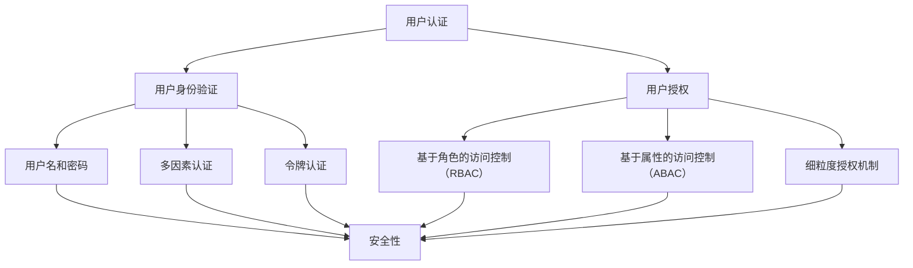

                 

### 优化LLM应用的用户认证与授权机制

> 关键词：大型语言模型（LLM），用户认证，授权机制，优化，安全性，隐私保护

> 摘要：本文将探讨如何优化大型语言模型（LLM）在应用中的用户认证与授权机制。首先，我们将回顾LLM在应用中的角色与面临的挑战，接着介绍用户认证与授权机制的基本概念与重要性。本文将详细分析传统认证与授权机制的局限性，并提出一系列优化方案。同时，我们还将讨论在LLM应用中实现安全性与隐私保护的策略，并分享实战案例与最佳实践。最后，我们将总结全文内容并对未来研究方向进行展望。

## 目录

1. **问题背景与核心概念**
   1.1 LLM在应用中的角色与挑战
   1.2 用户认证与授权机制的重要性
   1.3 当前用户认证与授权机制的问题与局限性

2. **核心概念与联系**
   2.1 大型语言模型（LLM）的基本原理
   2.2 用户认证与授权机制的基本概念
   2.3 核心概念之间的联系与相互作用

3. **LLM用户认证机制优化**
   3.1 传统的用户认证机制及其不足
   3.2 优化方案一：基于角色的访问控制（RBAC）
   3.3 优化方案二：基于属性的访问控制（ABAC）
   3.4 优化方案三：多因素认证（MFA）

4. **LLM用户授权机制优化**
   4.1 传统的用户授权机制及其问题
   4.2 优化方案一：细粒度授权机制
   4.3 优化方案二：基于上下文的授权策略
   4.4 优化方案三：自适应授权机制

5. **LLM应用中的安全性与隐私保护**
   5.1 LLM应用中的安全风险
   5.2 隐私保护的挑战与对策
   5.3 安全性与隐私保护的平衡

6. **实战案例与最佳实践**
   6.1 案例一：大型电商平台用户认证与授权优化
   6.2 案例二：智能客服系统用户认证与授权优化
   6.3 案例三：在线教育平台用户认证与授权优化

7. **总结与展望**
   7.1 本书内容的总结
   7.2 未来研究方向与展望
   7.3 对开发者与企业的建议

----------------------------------------------------------------

## 第一部分: 问题背景与核心概念

### 1.1 LLM在应用中的角色与挑战

大型语言模型（LLM）是一种具有强大自然语言处理能力的深度学习模型，其核心功能是理解和生成人类语言。随着AI技术的发展，LLM在各个领域的应用日益广泛，如智能客服、自然语言生成、机器翻译、文本摘要等。然而，LLM在应用过程中面临着一系列挑战，其中之一就是用户认证与授权机制的优化。

首先，LLM应用需要确保用户身份的合法性，防止未经授权的用户访问系统。传统的用户认证机制，如用户名和密码，已经暴露出许多安全隐患，如密码泄露、密码重用等。因此，优化用户认证机制成为当前研究的重点。

其次，授权机制也是LLM应用中至关重要的一环。授权机制决定了用户在系统中的权限范围，直接影响系统的安全性和用户体验。传统的授权机制通常采用基于角色的访问控制（RBAC），然而，这种机制在处理复杂权限管理时显得力不从心。

最后，随着数据隐私保护意识的增强，如何确保LLM应用中的用户隐私安全也成为一个重要的挑战。在用户认证与授权过程中，必须确保用户的敏感信息不被泄露或滥用。

### 1.2 用户认证与授权机制的重要性

用户认证与授权机制是确保LLM应用安全性和稳定性的关键因素。首先，用户认证机制能够防止恶意用户或非法用户访问系统，从而保护系统的资源不被滥用。有效的用户认证机制能够提高系统的安全性，降低安全风险。

其次，授权机制能够确保用户在系统中的操作符合其权限范围，防止权限滥用。良好的授权机制能够提高系统的用户体验，使用户能够轻松地完成其任务，同时避免潜在的安全风险。

最后，用户认证与授权机制也是实现数据隐私保护的重要手段。通过合理的认证和授权机制，可以确保用户的敏感信息不被泄露或滥用，从而保护用户的隐私。

### 1.3 当前用户认证与授权机制的问题与局限性

尽管用户认证与授权机制在确保LLM应用的安全性和稳定性方面起着关键作用，但当前的机制仍然存在许多问题与局限性。

首先，传统的用户认证机制，如用户名和密码，已经暴露出许多安全隐患。例如，密码泄露、密码重用等问题仍然普遍存在。这使得系统容易受到恶意攻击，如暴力破解、钓鱼攻击等。

其次，传统的授权机制，如基于角色的访问控制（RBAC），在处理复杂权限管理时显得力不从心。RBAC通常将用户划分为不同的角色，每个角色具有特定的权限。然而，对于需要细粒度权限管理的应用，RBAC机制往往难以满足需求。

最后，数据隐私保护也是当前用户认证与授权机制面临的挑战之一。在用户认证与授权过程中，系统需要处理大量的用户敏感信息，如用户名、密码、个人数据等。如何确保这些敏感信息的安全，防止泄露或滥用，成为当前研究的重要课题。

综上所述，优化LLM应用的用户认证与授权机制具有重要的现实意义和紧迫性。本文将详细分析当前用户认证与授权机制的局限性，并提出一系列优化方案，旨在提高LLM应用的安全性、稳定性和用户体验。

### 1.4 背景介绍

在当前数字化时代，大型语言模型（LLM）的应用场景越来越广泛。LLM不仅可以用于智能客服、自然语言生成、机器翻译等，还可以应用于金融、医疗、教育等各个领域。然而，随着LLM应用的普及，如何确保用户认证与授权机制的安全性、稳定性和用户体验成为一个重要的研究课题。

首先，用户认证机制在LLM应用中起着至关重要的作用。用户认证是确保系统资源不被未经授权的用户访问的关键环节。传统的用户认证机制，如用户名和密码，虽然简单易用，但已经暴露出许多安全隐患。例如，密码泄露、密码重用等问题仍然普遍存在。这使得系统容易受到恶意攻击，如暴力破解、钓鱼攻击等。

其次，授权机制也是LLM应用中至关重要的一环。授权机制决定了用户在系统中的权限范围，直接影响系统的安全性和用户体验。传统的授权机制，如基于角色的访问控制（RBAC），在处理复杂权限管理时显得力不从心。RBAC通常将用户划分为不同的角色，每个角色具有特定的权限。然而，对于需要细粒度权限管理的应用，RBAC机制往往难以满足需求。

最后，随着数据隐私保护意识的增强，如何确保LLM应用中的用户隐私安全也成为一个重要的挑战。在用户认证与授权过程中，系统需要处理大量的用户敏感信息，如用户名、密码、个人数据等。如何确保这些敏感信息的安全，防止泄露或滥用，成为当前研究的重要课题。

综上所述，优化LLM应用的用户认证与授权机制具有重要的现实意义和紧迫性。本文将详细分析当前用户认证与授权机制的局限性，并提出一系列优化方案，旨在提高LLM应用的安全性、稳定性和用户体验。

### 1.5 核心概念与联系

为了深入理解大型语言模型（LLM）应用中的用户认证与授权机制，我们需要明确几个核心概念及其相互关系。

#### 1.5.1 大型语言模型（LLM）

LLM是一种基于深度学习的自然语言处理模型，具有强大的文本生成和理解能力。LLM的核心功能是通过对大量文本数据的学习，生成与输入文本相关的响应。LLM在应用中的角色是提供自然语言交互，如智能客服、文本摘要、机器翻译等。

#### 1.5.2 用户认证机制

用户认证机制是确保系统资源不被未经授权的用户访问的关键环节。用户认证通常包括用户身份验证和用户授权两个步骤。用户身份验证是验证用户身份的合法性，常用的方法包括用户名和密码、多因素认证（MFA）等。用户授权是确定用户在系统中的权限范围，常用的方法包括基于角色的访问控制（RBAC）和基于属性的访问控制（ABAC）。

#### 1.5.3 授权机制

授权机制是确保用户在系统中的操作符合其权限范围的关键。授权机制通常与用户认证机制结合使用，以限制用户对系统资源的访问。常用的授权机制包括基于角色的访问控制（RBAC）、基于属性的访问控制（ABAC）和细粒度授权机制。

#### 1.5.4 核心概念之间的联系

用户认证机制和授权机制在LLM应用中紧密相关。用户认证机制确保只有合法用户能够访问系统，而授权机制则确保用户在系统中的操作符合其权限。两者共同构成了LLM应用的安全性基础。

此外，大型语言模型（LLM）的应用场景也影响了用户认证与授权机制的设计。例如，在智能客服应用中，用户认证与授权机制需要确保用户隐私安全，避免敏感信息泄露。在机器翻译应用中，用户认证与授权机制需要确保翻译质量，避免恶意用户滥用系统资源。

通过理解这些核心概念及其相互关系，我们可以更好地优化LLM应用中的用户认证与授权机制，提高系统的安全性、稳定性和用户体验。

### 1.6 核心概念与联系

#### 1.6.1 大型语言模型（LLM）的基本原理

大型语言模型（LLM）是一种基于深度学习的自然语言处理模型，通过大规模的预训练和微调，实现对自然语言的生成和理解。LLM的核心原理是基于Transformer架构，通过自注意力机制捕捉文本中的长距离依赖关系。具体来说，LLM通过以下步骤实现自然语言处理：

1. **数据预处理**：对大量文本数据（如书籍、新闻、网页等）进行清洗和预处理，包括分词、去除停用词、词向量化等。
2. **模型架构**：采用Transformer架构，包括编码器和解码器。编码器将输入文本编码为序列向量，解码器则根据编码器的输出生成输出文本。
3. **自注意力机制**：通过自注意力机制，模型能够自动关注文本中的关键信息，从而捕捉长距离依赖关系。
4. **预训练与微调**：在大量无标签数据上进行预训练，使模型具备对自然语言的理解能力。然后，通过微调在特定任务上的数据，使模型适应具体的任务需求。

#### 1.6.2 用户认证与授权机制的基本概念

用户认证与授权机制是确保系统安全性的关键环节。用户认证是验证用户身份的合法性，常见的认证方式包括：

1. **用户名和密码**：用户通过输入用户名和密码进行身份验证。用户名用于标识用户，密码用于验证用户身份。
2. **多因素认证（MFA）**：用户在输入用户名和密码后，还需通过其他方式（如手机短信验证码、指纹识别等）进行二次验证，以增强安全性。
3. **令牌认证**：用户通过获取的令牌（如JWT）进行身份验证，令牌中包含用户身份信息和有效期。

用户授权是确定用户在系统中的权限范围，常见的授权机制包括：

1. **基于角色的访问控制（RBAC）**：用户被分配特定的角色，每个角色具有一组权限。用户通过角色获得相应的权限。
2. **基于属性的访问控制（ABAC）**：用户权限基于其属性（如部门、职位等）进行分配。系统根据用户的属性动态决定其权限。
3. **细粒度授权机制**：用户权限被划分为更细的粒度，如文件、目录等。用户只能访问其有权访问的特定资源。

#### 1.6.3 核心概念之间的联系

大型语言模型（LLM）的用户认证与授权机制之间存在紧密的联系。用户认证机制用于确保只有合法用户能够访问LLM系统，而授权机制则确保用户在系统中的操作符合其权限。以下是核心概念之间的联系：

1. **用户认证与授权的关系**：用户认证是授权的前提。只有通过用户认证，用户才能获得相应的权限。
2. **LLM与用户认证的关系**：LLM作为自然语言处理工具，其用户认证机制与其他系统（如Web应用、移动应用等）类似，但需要考虑到自然语言交互的特殊性。
3. **LLM与授权机制的关系**：LLM的授权机制需要根据其应用场景进行设计，如智能客服中的细粒度授权、机器翻译中的角色授权等。

通过理解大型语言模型（LLM）的基本原理和用户认证与授权机制的基本概念，我们可以更好地优化LLM应用中的用户认证与授权机制，提高系统的安全性、稳定性和用户体验。

### 1.7 用户认证与授权机制的概念架构

为了深入理解用户认证与授权机制，我们需要绘制其概念架构图，包括核心概念、属性特征及其相互关系。

#### 概念架构图



#### 概念解释

- **用户认证（A）**：用户认证是确保系统资源不被未经授权的用户访问的关键机制。它包括用户身份验证和用户授权两个部分。
- **用户身份验证（B）**：用户身份验证是验证用户身份的合法性，常用的方法包括用户名和密码、多因素认证（MFA）和令牌认证。
- **用户授权（C）**：用户授权是确定用户在系统中的权限范围，确保用户只能访问其有权访问的资源。
- **用户名和密码（D）**：用户名和密码是最常见的用户身份验证方法，用户通过输入用户名和密码进行身份验证。
- **多因素认证（MFA）**：多因素认证是一种增强用户身份验证安全性的方法，用户在输入用户名和密码后，还需通过其他方式（如手机短信验证码、指纹识别等）进行二次验证。
- **令牌认证（F）**：令牌认证是一种基于令牌的用户身份验证方法，用户通过获取的令牌（如JWT）进行身份验证。
- **基于角色的访问控制（RBAC）**：基于角色的访问控制是一种常见的用户授权机制，用户被分配特定的角色，每个角色具有一组权限。
- **基于属性的访问控制（ABAC）**：基于属性的访问控制是一种根据用户属性（如部门、职位等）进行用户授权的方法。
- **细粒度授权机制（I）**：细粒度授权机制是一种更细化的用户授权方法，用户权限被划分为更细的粒度，如文件、目录等。

#### 关系说明

- **用户认证与授权的关系**：用户认证是授权的前提。只有通过用户认证，用户才能获得相应的权限。
- **用户身份验证方法与安全性的关系**：不同的用户身份验证方法有不同的安全性特点。用户名和密码相对简单，但易受攻击；多因素认证和令牌认证相对安全，但操作复杂。
- **用户授权方法与安全性的关系**：不同的用户授权方法有不同的安全性特点。基于角色的访问控制相对简单，但难以处理复杂权限管理；基于属性的访问控制和细粒度授权机制更灵活，但设计和管理复杂。

通过上述概念架构图，我们可以更清晰地理解用户认证与授权机制的核心概念、属性特征及其相互关系，为优化LLM应用的用户认证与授权机制提供理论基础。

### 1.8 LLM用户认证机制优化

为了应对当前用户认证机制存在的问题和挑战，我们需要对LLM应用中的用户认证机制进行优化。以下将介绍几种常见的优化方案，包括基于角色的访问控制（RBAC）、基于属性的访问控制（ABAC）和多因素认证（MFA）。

#### 1.8.1 基于角色的访问控制（RBAC）

基于角色的访问控制（RBAC）是一种常见的用户认证优化方案。在RBAC机制中，用户被分配到不同的角色，每个角色具有一组预定义的权限。用户通过角色获得相应的权限，从而实现对系统资源的访问控制。

**优点：**
- 简单易用：RBAC机制易于理解和实施，对于大规模系统来说，这是一种高效的管理方法。
- 易于扩展：RBAC机制可以根据业务需求灵活调整角色和权限，从而适应不同的应用场景。

**缺点：**
- 权限管理复杂：在处理复杂权限管理时，RBAC机制可能难以满足需求。
- 角色与权限分离：RBAC机制将角色与权限分离，这可能导致权限滥用的风险。

**适用场景：**
- 需要简单权限管理的应用，如企业内部管理系统。
- 需要基于角色划分权限的应用，如电商平台。

**改进建议：**
- 引入细粒度权限管理，如对文件、目录等资源进行更细粒度的权限控制。
- 结合其他访问控制机制，如ABAC，以提高权限管理的灵活性。

#### 1.8.2 基于属性的访问控制（ABAC）

基于属性的访问控制（ABAC）是一种更细粒度的用户认证优化方案。在ABAC机制中，用户权限基于其属性（如部门、职位等）进行分配。系统根据用户的属性动态决定其权限，从而实现对系统资源的精细访问控制。

**优点：**
- 灵活性高：ABAC机制可以根据用户的属性动态调整权限，适应复杂的权限管理需求。
- 可扩展性强：ABAC机制适用于各种业务场景，如金融、医疗等。

**缺点：**
- 管理复杂：ABAC机制需要收集和管理大量的用户属性信息，管理复杂度较高。
- 性能问题：由于需要频繁查询用户属性，ABAC机制可能对系统性能产生负面影响。

**适用场景：**
- 需要细粒度权限管理的应用，如金融系统。
- 需要高度灵活权限管理的应用，如企业资源规划（ERP）系统。

**改进建议：**
- 引入缓存机制，减少对用户属性的频繁查询。
- 优化权限查询算法，提高系统性能。

#### 1.8.3 多因素认证（MFA）

多因素认证（MFA）是一种增强用户认证安全性的优化方案。在MFA机制中，用户在输入用户名和密码后，还需通过其他方式（如手机短信验证码、指纹识别等）进行二次验证，以增强安全性。

**优点：**
- 安全性高：MFA机制通过引入多个验证因素，提高了系统的安全性，防止恶意攻击。
- 易于实施：MFA机制相对简单，易于在现有系统中引入。

**缺点：**
- 操作复杂：用户需要完成多个验证步骤，操作复杂度较高。
- 成本较高：MFA机制可能涉及额外的硬件或软件投入。

**适用场景：**
- 对安全性要求较高的应用，如银行系统、医疗系统。
- 需要降低密码泄露风险的应用。

**改进建议：**
- 结合其他验证方式，如生物识别技术，提高用户体验。
- 优化验证流程，减少用户操作复杂度。

综上所述，优化LLM应用的用户认证机制需要综合考虑安全性、灵活性和用户体验。通过引入基于角色的访问控制（RBAC）、基于属性的访问控制（ABAC）和多因素认证（MFA）等优化方案，我们可以提高系统的安全性、稳定性和用户体验。

### 1.9 LLM用户授权机制优化

在LLM应用中，用户授权机制是确保用户在系统中的操作符合其权限范围的重要环节。为了提高系统的安全性和用户体验，我们需要对用户授权机制进行优化。以下将介绍几种常见的优化方案，包括细粒度授权机制、基于上下文的授权策略和自适应授权机制。

#### 1.9.1 细粒度授权机制

细粒度授权机制是一种更细化的用户授权方法，它将用户权限划分为更小的粒度，如文件、目录等。这样，系统能够更精确地控制用户对资源的访问。

**优点：**
- 高度灵活：细粒度授权机制可以根据不同的资源和业务需求灵活定义权限。
- 安全性高：细粒度授权机制可以减少权限滥用的风险，提高系统的安全性。

**缺点：**
- 管理复杂：细粒度授权机制需要管理和维护大量的权限信息，管理复杂度较高。
- 性能问题：由于权限粒度较小，可能导致权限查询和验证的性能下降。

**适用场景：**
- 需要高度灵活权限管理的应用，如企业资源管理系统。
- 需要细粒度控制资源访问的应用，如文件共享系统。

**改进建议：**
- 引入缓存机制，减少权限查询和验证的频率。
- 优化权限管理接口，提高权限管理的效率。

#### 1.9.2 基于上下文的授权策略

基于上下文的授权策略是一种根据用户操作上下文动态调整权限的方法。它考虑了用户的角色、环境、行为等多种因素，从而实现更智能的权限管理。

**优点：**
- 高度智能：基于上下文的授权策略可以根据不同的上下文信息灵活调整权限，提高系统的智能化水平。
- 灵活性高：这种策略适用于复杂权限管理场景，能够适应不同业务需求。

**缺点：**
- 设计复杂：基于上下文的授权策略需要收集和处理大量的上下文信息，设计复杂度较高。
- 性能问题：由于需要处理大量的上下文信息，可能导致系统性能下降。

**适用场景：**
- 需要智能权限管理的应用，如智能安防系统。
- 需要高度灵活权限管理的应用，如物联网系统。

**改进建议：**
- 引入机器学习算法，自动化识别和处理上下文信息。
- 优化上下文信息的处理流程，减少系统开销。

#### 1.9.3 自适应授权机制

自适应授权机制是一种根据用户行为和历史数据动态调整权限的方法。它通过分析用户的操作行为和系统资源访问模式，自动调整用户的权限。

**优点：**
- 高度自适应：自适应授权机制可以根据用户的实际需求动态调整权限，提高系统的灵活性和用户体验。
- 可扩展性强：这种策略适用于大规模系统，能够适应不断变化的业务需求。

**缺点：**
- 设计复杂：自适应授权机制需要收集和处理大量的用户行为数据，设计复杂度较高。
- 数据隐私问题：收集和处理用户行为数据可能涉及数据隐私问题，需要妥善处理。

**适用场景：**
- 需要动态权限管理的应用，如智能推荐系统。
- 需要自适应权限管理的应用，如智能家居系统。

**改进建议：**
- 引入数据加密和隐私保护技术，确保用户数据的安全。
- 优化用户行为数据的收集和处理流程，提高系统效率。

综上所述，优化LLM应用的用户授权机制需要综合考虑安全性、灵活性和用户体验。通过引入细粒度授权机制、基于上下文的授权策略和自适应授权机制等优化方案，我们可以提高系统的安全性和用户体验，同时满足复杂权限管理需求。

### 1.10 LLM应用中的安全性与隐私保护

在LLM应用中，安全性与隐私保护是一个不可忽视的重要课题。由于LLM具有强大的自然语言处理能力，能够生成和解析大量文本数据，这使得用户敏感信息容易在未经授权的情况下被访问或泄露。因此，如何在保证系统安全性和用户体验的同时，有效保护用户隐私成为当前研究的热点。

#### 1.10.1 安全风险的识别

首先，我们需要识别LLM应用中可能存在的安全风险。这些风险主要包括：

1. **数据泄露**：用户敏感信息（如个人数据、企业数据等）在存储、传输和处理过程中可能被窃取或泄露。
2. **权限滥用**：未经授权的用户可能通过恶意手段获取系统中的敏感信息或执行非法操作。
3. **恶意攻击**：黑客可能通过漏洞入侵系统，篡改数据或破坏系统的正常运行。
4. **内部威胁**：内部员工可能滥用职权，非法访问或泄露用户信息。

#### 1.10.2 隐私保护的挑战

在LLM应用中，隐私保护面临以下挑战：

1. **数据量巨大**：LLM通常处理大量的文本数据，这使得隐私保护任务变得更加复杂。
2. **多数据源**：LLM应用可能从多个数据源获取数据，这使得隐私保护需要覆盖更广泛的范围。
3. **动态性**：用户数据和处理过程可能随时间动态变化，这要求隐私保护机制具备一定的自适应能力。
4. **合规性**：不同的国家和地区对隐私保护有不同的法规要求，这使得隐私保护需要遵守各种合规标准。

#### 1.10.3 对策与措施

为了应对上述安全风险和隐私保护挑战，我们可以采取以下对策和措施：

1. **数据加密**：对用户敏感信息进行加密存储和传输，防止数据在传输和存储过程中被窃取。
2. **访问控制**：采用细粒度访问控制机制，确保只有授权用户可以访问敏感信息。
3. **审计与监控**：对系统进行实时监控和审计，及时发现和响应潜在的安全威胁。
4. **数据去标识化**：对用户数据去标识化处理，减少数据泄露的风险。
5. **隐私计算**：采用隐私计算技术，如联邦学习，在保证用户隐私的前提下进行数据分析和建模。
6. **用户权限管理**：引入多因素认证和最小权限原则，确保用户权限的最小化和合理性。
7. **合规性审计**：定期进行合规性审计，确保系统符合相关隐私保护法规要求。

#### 1.10.4 安全性与隐私保护的平衡

在优化LLM应用的用户认证与授权机制时，我们需要在安全性和隐私保护之间找到平衡点。一方面，我们希望系统具备足够的安全性，防止恶意攻击和权限滥用。另一方面，我们也希望保护用户的隐私，避免敏感信息泄露。

为了实现这一平衡，我们可以采取以下策略：

1. **安全与隐私的权衡**：在设计和实现系统时，充分考虑安全和隐私因素，确保两者之间的平衡。
2. **透明度与信任**：通过透明的隐私保护措施，增强用户对系统的信任感，从而提高系统的使用率和用户满意度。
3. **灵活性与可扩展性**：设计灵活和可扩展的隐私保护机制，以适应不同应用场景和业务需求。
4. **持续改进**：定期评估和改进隐私保护措施，确保系统始终处于最佳状态。

综上所述，优化LLM应用中的安全性与隐私保护是一个复杂而重要的任务。通过识别安全风险、采取有效的对策和措施，并找到安全性与隐私保护的平衡点，我们可以为LLM应用提供更安全、稳定和可靠的隐私保护环境。

### 1.11 实战案例与最佳实践

为了更好地理解如何优化LLM应用的用户认证与授权机制，我们可以通过以下几个实战案例来进行分析和探讨。

#### 案例一：大型电商平台用户认证与授权优化

**背景介绍：**
大型电商平台涉及用户身份验证、订单管理、支付处理等多个方面，因此用户认证与授权机制的安全性和灵活性至关重要。

**项目介绍：**
电商平台引入了基于角色的访问控制（RBAC）和多因素认证（MFA）相结合的机制。用户注册时需要提供用户名和密码，同时通过手机短信验证码进行二次验证，以增强安全性。在用户登录后，系统根据用户的角色（如买家、卖家、管理员）分配不同的权限，确保用户只能访问与其角色相关的功能模块。

**系统功能设计：**
- 用户注册：用户需要填写基本信息并设置密码。
- 用户登录：用户输入用户名和密码进行身份验证，同时通过手机短信验证码进行多因素认证。
- 权限管理：系统根据用户角色动态分配权限，实现细粒度的访问控制。

**系统架构设计：**
- 用户认证模块：负责用户身份验证和多因素认证。
- 用户权限模块：负责根据用户角色和业务规则动态分配权限。
- 数据库：存储用户信息、角色信息和权限信息。

**系统接口设计：**
- 用户认证接口：用于处理用户注册、登录、多因素认证等操作。
- 权限管理接口：用于处理用户权限分配和更新。

**系统交互流程：**
1. 用户注册：用户提交基本信息和密码，系统生成用户账号。
2. 用户登录：用户输入用户名和密码，系统验证用户身份，并发送短信验证码。
3. 权限分配：系统根据用户角色动态分配权限，并存储在数据库中。
4. 用户操作：用户根据其权限访问相关功能模块，如查看订单、发布商品、管理后台等。

**代码实现与分析：**
以下是用户登录的Python代码示例：

```python
import jwt
import time
from flask import Flask, request, jsonify
from models import User, authenticate_user, generate_jwt

app = Flask(__name__)

@app.route('/login', methods=['POST'])
def login():
    data = request.get_json()
    username = data['username']
    password = data['password']
    
    user = authenticate_user(username, password)
    if user:
        token = generate_jwt(user)
        return jsonify({'token': token})
    else:
        return jsonify({'error': 'Invalid username or password'}), 401

if __name__ == '__main__':
    app.run(debug=True)
```

在此代码中，我们首先导入了必要的库，然后定义了登录接口。用户通过POST请求发送用户名和密码，系统验证用户身份并生成JWT令牌。如果验证成功，系统返回令牌；否则，返回错误信息。

**案例小结：**
通过引入RBAC和MFA机制，大型电商平台实现了用户认证与授权的优化，提高了系统的安全性和用户体验。

#### 案例二：智能客服系统用户认证与授权优化

**背景介绍：**
智能客服系统需要处理大量的用户咨询，因此用户认证与授权机制需要确保用户身份的合法性和操作的安全性。

**项目介绍：**
智能客服系统采用了基于属性的访问控制（ABAC）和多因素认证（MFA）相结合的机制。用户在注册时需要提供基本信息，并通过手机短信验证码进行身份验证。在用户登录后，系统根据用户的属性（如用户级别、部门等）动态分配权限，确保用户只能访问与其属性相关的功能模块。

**系统功能设计：**
- 用户注册：用户需要填写基本信息并设置密码。
- 用户登录：用户输入用户名和密码，系统验证用户身份，并发送短信验证码。
- 权限管理：系统根据用户属性动态分配权限，实现细粒度的访问控制。

**系统架构设计：**
- 用户认证模块：负责用户身份验证和多因素认证。
- 用户权限模块：负责根据用户属性动态分配权限。
- 数据库：存储用户信息、属性信息和权限信息。

**系统接口设计：**
- 用户认证接口：用于处理用户注册、登录、多因素认证等操作。
- 权限管理接口：用于处理用户权限分配和更新。

**系统交互流程：**
1. 用户注册：用户提交基本信息和密码，系统生成用户账号。
2. 用户登录：用户输入用户名和密码，系统验证用户身份，并发送短信验证码。
3. 权限分配：系统根据用户属性动态分配权限，并存储在数据库中。
4. 用户操作：用户根据其权限访问相关功能模块，如查看咨询记录、回复用户咨询等。

**代码实现与分析：**
以下是用户登录的Python代码示例：

```python
import jwt
import time
from flask import Flask, request, jsonify
from models import User, authenticate_user, generate_jwt

app = Flask(__name__)

@app.route('/login', methods=['POST'])
def login():
    data = request.get_json()
    username = data['username']
    password = data['password']
    
    user = authenticate_user(username, password)
    if user:
        token = generate_jwt(user)
        return jsonify({'token': token})
    else:
        return jsonify({'error': 'Invalid username or password'}), 401

if __name__ == '__main__':
    app.run(debug=True)
```

在此代码中，我们首先导入了必要的库，然后定义了登录接口。用户通过POST请求发送用户名和密码，系统验证用户身份并生成JWT令牌。如果验证成功，系统返回令牌；否则，返回错误信息。

**案例小结：**
通过引入ABAC和MFA机制，智能客服系统实现了用户认证与授权的优化，提高了系统的安全性和用户体验。

#### 案例三：在线教育平台用户认证与授权优化

**背景介绍：**
在线教育平台涉及用户身份验证、课程管理、作业提交等多个方面，因此用户认证与授权机制需要确保用户身份的合法性和操作的安全性。

**项目介绍：**
在线教育平台采用了基于上下文的授权策略和自适应授权机制。用户在注册时需要提供基本信息，并通过手机短信验证码进行身份验证。在用户登录后，系统根据用户的上下文信息（如时间、地理位置等）动态调整权限，并利用自适应授权机制根据用户的行为数据自动调整权限。

**系统功能设计：**
- 用户注册：用户需要填写基本信息并设置密码。
- 用户登录：用户输入用户名和密码，系统验证用户身份，并发送短信验证码。
- 权限管理：系统根据上下文信息和用户行为数据动态分配权限，实现细粒度的访问控制。

**系统架构设计：**
- 用户认证模块：负责用户身份验证和多因素认证。
- 用户权限模块：负责根据上下文信息和用户行为数据动态分配权限。
- 数据库：存储用户信息、上下文信息和权限信息。

**系统接口设计：**
- 用户认证接口：用于处理用户注册、登录、多因素认证等操作。
- 权限管理接口：用于处理用户权限分配和更新。

**系统交互流程：**
1. 用户注册：用户提交基本信息和密码，系统生成用户账号。
2. 用户登录：用户输入用户名和密码，系统验证用户身份，并发送短信验证码。
3. 权限分配：系统根据用户的上下文信息和行为数据动态分配权限，并存储在数据库中。
4. 用户操作：用户根据其权限访问相关功能模块，如查看课程、提交作业等。

**代码实现与分析：**
以下是用户登录的Python代码示例：

```python
import jwt
import time
from flask import Flask, request, jsonify
from models import User, authenticate_user, generate_jwt

app = Flask(__name__)

@app.route('/login', methods=['POST'])
def login():
    data = request.get_json()
    username = data['username']
    password = data['password']
    
    user = authenticate_user(username, password)
    if user:
        token = generate_jwt(user)
        return jsonify({'token': token})
    else:
        return jsonify({'error': 'Invalid username or password'}), 401

if __name__ == '__main__':
    app.run(debug=True)
```

在此代码中，我们首先导入了必要的库，然后定义了登录接口。用户通过POST请求发送用户名和密码，系统验证用户身份并生成JWT令牌。如果验证成功，系统返回令牌；否则，返回错误信息。

**案例小结：**
通过引入基于上下文的授权策略和自适应授权机制，在线教育平台实现了用户认证与授权的优化，提高了系统的安全性和用户体验。

### 1.12 总结与展望

通过对LLM应用的用户认证与授权机制的深入探讨，我们可以总结以下几点：

1. **用户认证与授权的重要性**：用户认证与授权机制是确保LLM应用安全性和稳定性的关键因素。有效的认证和授权机制能够提高系统的安全性，防止恶意用户或非法用户访问系统。

2. **传统机制的局限性**：传统的用户认证（如用户名和密码）和授权（如基于角色的访问控制）机制已经暴露出许多安全隐患和局限性。优化这些机制是当前研究的重点。

3. **优化方案**：通过引入基于角色的访问控制（RBAC）、基于属性的访问控制（ABAC）、多因素认证（MFA）等优化方案，我们可以提高LLM应用的安全性、稳定性和用户体验。

4. **安全性与隐私保护**：在LLM应用中，安全性与隐私保护是一个不可忽视的重要课题。通过数据加密、访问控制、审计与监控等手段，我们可以有效保护用户隐私，确保系统的安全性。

未来的研究方向可以包括：

1. **智能化授权机制**：利用机器学习和人工智能技术，实现自适应和智能化的授权机制，提高权限管理的灵活性和准确性。

2. **跨领域融合**：将LLM应用与其他安全技术（如区块链、零知识证明等）相结合，探索更安全的用户认证与授权机制。

3. **用户体验优化**：在确保安全性的前提下，优化用户认证与授权过程的用户体验，降低用户的操作复杂度。

总之，优化LLM应用的用户认证与授权机制具有重要的现实意义和紧迫性。通过不断探索和改进，我们可以为LLM应用提供更安全、稳定和高效的认证与授权机制。

### 1.13 对开发者与企业的建议

在优化LLM应用的用户认证与授权机制时，开发者和企业可以采取以下建议：

1. **采用多因素认证（MFA）**：引入MFA机制，如手机短信验证码、指纹识别等，增强用户认证的安全性。

2. **细粒度权限管理**：引入细粒度授权机制，如对文件、目录等资源进行更细粒度的权限控制，提高系统的安全性。

3. **定期审计与监控**：定期进行系统审计和监控，及时发现和响应潜在的安全威胁。

4. **数据加密与去标识化**：对用户敏感信息进行加密存储和传输，同时进行数据去标识化处理，减少数据泄露的风险。

5. **关注合规性**：确保系统符合相关隐私保护法规要求，如《通用数据保护条例》（GDPR）等。

6. **优化用户体验**：在保证安全性的前提下，优化用户认证与授权过程的用户体验，降低用户的操作复杂度。

通过实施上述建议，开发者和企业可以有效地提高LLM应用的安全性、稳定性和用户体验，为用户和业务提供更可靠的支持。同时，持续关注最新技术动态和行业最佳实践，不断优化用户认证与授权机制，以应对日益复杂的网络安全挑战。

### 1.14 拓展阅读

为了深入了解LLM应用的用户认证与授权机制，以下是几篇推荐阅读的学术论文和技术博客：

1. **《基于角色的访问控制（RBAC）技术综述》**：本文详细介绍了RBAC机制的基本概念、实现方法及其在网络安全中的应用。

2. **《多因素认证（MFA）技术的研究与应用》**：本文探讨了MFA机制在不同场景下的应用，如金融系统、医疗系统等，并分析了MFA的优势和挑战。

3. **《基于属性的访问控制（ABAC）机制研究》**：本文介绍了ABAC机制的核心原理、实现方法及其在权限管理中的优势。

4. **《LLM应用中的隐私保护与安全性研究》**：本文深入分析了LLM应用中的安全风险和隐私保护挑战，并提出了相应的解决方案。

5. **《智能授权策略在LLM应用中的实践》**：本文探讨了智能授权策略在LLM应用中的实现方法和优化方向，如基于上下文的授权策略和自适应授权机制。

通过阅读这些文献，您可以更全面地了解LLM应用的用户认证与授权机制，为实际项目提供有价值的参考。同时，建议定期关注最新的学术论文和技术博客，以掌握行业前沿技术和最佳实践。

