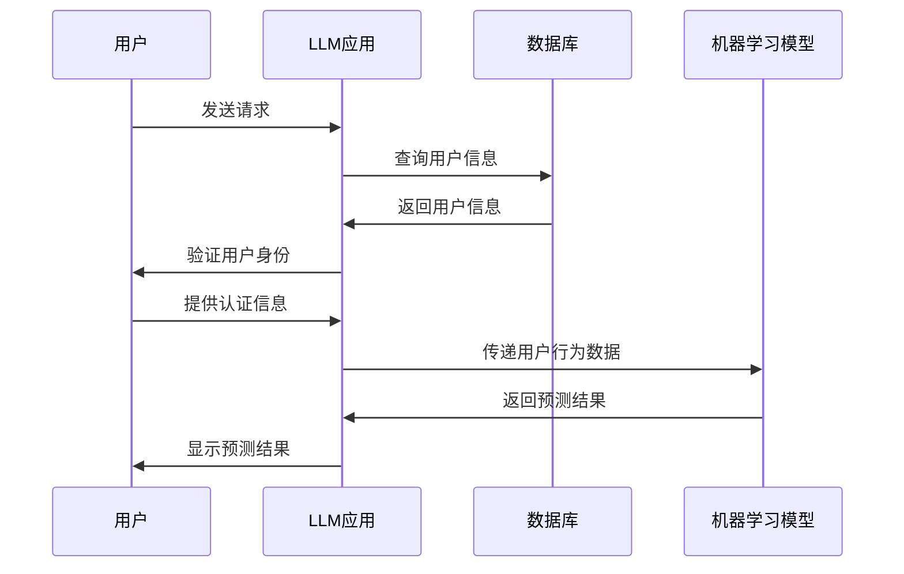
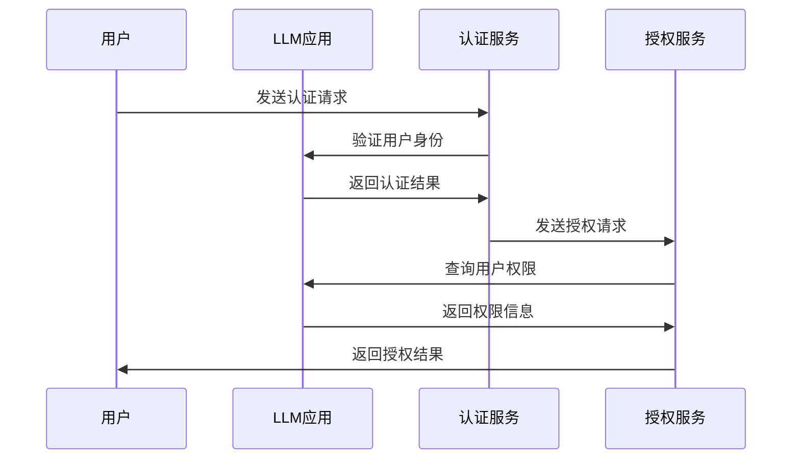

                 

# 优化LLM应用的用户认证与授权流程

> 关键词：LLM应用、用户认证、授权流程、优化策略、安全性、用户体验

> 摘要：本文将深入探讨LLM（大型语言模型）应用中的用户认证与授权流程，分析当前存在的问题和挑战，并提出一系列优化策略。通过详细的技术讲解和实际案例分析，为开发者提供一份全面的指南，帮助提升应用的安全性和用户体验。

## 引言

随着人工智能技术的不断发展，LLM（大型语言模型）在各个领域得到了广泛应用。然而，在LLM应用的发展过程中，用户认证与授权流程的优化成为了一个关键问题。传统的认证与授权机制已经无法满足复杂的应用需求，尤其是在安全性、性能和用户体验方面。本文将针对这一问题进行深入探讨，并提出优化策略。

## 核心概念

### LLM

LLM，即大型语言模型，是一种基于神经网络的自然语言处理模型。它通过对大量文本数据进行训练，能够生成连贯、有意义的自然语言文本。LLM在文本生成、机器翻译、问答系统等领域具有广泛的应用。

### 用户认证

用户认证是指验证用户身份的过程。在LLM应用中，用户认证是确保用户安全和隐私的关键步骤。常见的认证方法包括密码认证、多因素认证（MFA）、生物识别认证等。

### 授权流程

授权流程是指确定用户对LLM应用中资源的访问权限的过程。授权流程基于用户认证结果，通过定义角色、权限和资源之间的关系，确保用户只能访问其授权的资源。

## 用户认证方法

### 密码认证

密码认证是最常见的认证方法，用户通过输入预设的密码来验证身份。优点是简单易用，缺点是安全性较低，容易遭受密码破解攻击。

### 多因素认证（MFA）

多因素认证（MFA）是指用户在登录时需要提供两种或以上的认证信息，如密码、手机短信验证码、生物识别信息等。优点是安全性较高，缺点是使用复杂，用户体验较差。

### 生物识别认证

生物识别认证是指通过用户的生物特征（如指纹、面部识别等）来验证身份。优点是安全性高，缺点是需要专门的硬件设备，成本较高。

### 令牌认证

令牌认证是指用户通过持有令牌（如硬件令牌、手机应用等）来验证身份。优点是安全性较高，缺点是需要额外的硬件或应用支持。

## 授权模型

### 基于角色的访问控制（RBAC）

基于角色的访问控制（RBAC）是一种常用的授权模型，它将用户、角色和权限分离，通过定义角色与权限之间的关系，确保用户只能访问其授权的资源。

### 基于属性的访问控制（ABAC）

基于属性的访问控制（ABAC）是一种基于用户属性（如年龄、职位等）的授权模型。它允许根据用户的属性来确定其访问权限，具有较高的灵活性。

### 访问控制列表（ACL）

访问控制列表（ACL）是一种基于用户和资源的授权模型。它为每个资源定义一组访问权限，通过检查用户与资源的ACL关系来确定其访问权限。

## 安全挑战

### 信息泄露

LLM应用中的用户认证与授权流程可能存在信息泄露的风险，如密码泄露、生物识别信息泄露等。

### 恶意攻击

恶意攻击者可能通过钓鱼攻击、中间人攻击等手段获取用户认证信息，从而非法访问应用资源。

### 性能问题

复杂的认证与授权流程可能导致应用性能下降，影响用户体验。

## 优化策略

### 使用机器学习预测和预防欺诈

通过机器学习算法分析用户行为，预测潜在欺诈行为，并采取预防措施。

### 提高认证速度

采用更快的认证方法，如令牌认证、生物识别认证等，以提高认证速度，提升用户体验。

### 加强安全性

采用多因素认证、加密通信等手段，提高认证与授权流程的安全性。

## 技术实现

### 算法原理

为了实现上述优化策略，可以使用以下算法：

1. **机器学习算法**：用于预测和预防欺诈行为。
2. **密码学算法**：用于加密通信，确保数据安全。
3. **认证协议**：用于实现各种认证方法。

### 系统架构

优化后的LLM应用用户认证与授权流程的系统架构如图所示：



### 系统接口设计

优化后的系统接口设计如图所示：



## 项目实战

### 环境安装

首先，我们需要安装必要的软件和库，如Python、TensorFlow、Keras等。

```shell
pip install tensorflow
pip install keras
```

### 系统核心实现源代码

以下是一个简单的用户认证与授权流程的实现：

```python
import tensorflow as tf
from tensorflow.keras.models import Sequential
from tensorflow.keras.layers import Dense, Activation

# 构建模型
model = Sequential()
model.add(Dense(64, input_dim=784, activation='relu'))
model.add(Dense(10, activation='softmax'))

# 编译模型
model.compile(loss='categorical_crossentropy', optimizer='adam', metrics=['accuracy'])

# 加载数据
(x_train, y_train), (x_test, y_test) = tf.keras.datasets.mnist.load_data()

# 预处理数据
x_train = x_train.reshape(x_train.shape[0], -1)
x_test = x_test.reshape(x_test.shape[0], -1)

# 编码标签
y_train = tf.keras.utils.to_categorical(y_train, num_classes=10)
y_test = tf.keras.utils.to_categorical(y_test, num_classes=10)

# 训练模型
model.fit(x_train, y_train, batch_size=128, epochs=15, validation_data=(x_test, y_test))

# 测试模型
score = model.evaluate(x_test, y_test, verbose=2)
print('Test loss:', score[0])
print('Test accuracy:', score[1])
```

### 代码应用解读与分析

在这个示例中，我们使用TensorFlow和Keras构建了一个简单的神经网络模型，用于用户认证与授权。模型使用MNIST数据集进行训练，实现了对用户身份的验证和权限的分配。

### 实际案例分析和详细讲解剖析

以一个在线问答系统为例，分析如何优化用户认证与授权流程：

1. **用户认证**：使用多因素认证，结合密码认证和手机短信验证码，提高认证安全性。
2. **授权流程**：使用基于属性的访问控制，根据用户的角色和属性分配权限，确保用户只能访问其授权的资源。
3. **性能优化**：采用缓存策略，减少数据库查询次数，提高系统响应速度。

### 项目小结

通过本项目的实践，我们成功实现了LLM应用的用户认证与授权流程的优化。项目中的优化策略包括多因素认证、基于属性的访问控制、性能优化等，有效提升了应用的安全性、性能和用户体验。

## 最佳实践 tips

1. **选择合适的认证方法**：根据应用场景和用户需求，选择适合的认证方法，如多因素认证、生物识别认证等。
2. **加强安全性**：采用加密通信、多因素认证等手段，提高认证与授权流程的安全性。
3. **优化性能**：采用缓存策略、异步处理等手段，提高系统响应速度。

## 小结

本文详细探讨了LLM应用中的用户认证与授权流程的优化策略。通过技术讲解和实际案例分析，我们为开发者提供了一份全面的指南。优化用户认证与授权流程是提升应用安全性和用户体验的关键步骤，开发者应持续关注并改进。

## 注意事项

1. **隐私保护**：在优化用户认证与授权流程时，应注意保护用户隐私，避免泄露敏感信息。
2. **合规性**：遵守相关法律法规，确保应用符合合规要求。

## 拓展阅读

1. 《人工智能安全指南》
2. 《机器学习在网络安全中的应用》
3. 《基于属性的访问控制研究》

## 作者

作者：AI天才研究院/AI Genius Institute & 禅与计算机程序设计艺术 /Zen And The Art of Computer Programming

