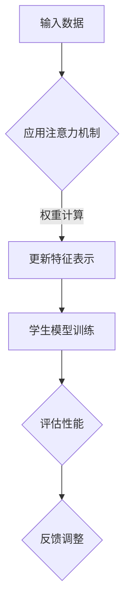
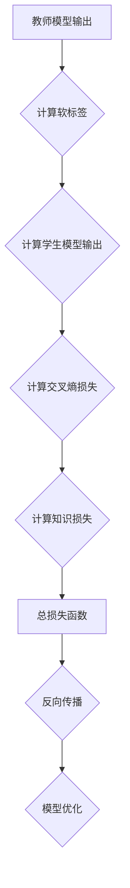

                 

# 优化LLM应用的知识蒸馏流程

> 关键词：知识蒸馏，LLM，模型优化，效率提升，结果质量提高

> 摘要：本文深入探讨了在自然语言处理（NLP）领域，特别是在大型语言模型（LLM）应用中，如何通过优化知识蒸馏流程来提高模型的训练效率和结果质量。我们将逐步分析知识蒸馏的基本概念、背景、存在的问题、优化目标、方法、关键技术，并通过实际案例来验证优化策略的有效性，最后展望知识蒸馏流程的未来发展趋势。

## 1.1 优化知识蒸馏流程的背景

随着深度学习在自然语言处理（NLP）领域的广泛应用，大型语言模型（LLM）如BERT、GPT等已经成为研究和应用的热点。这些模型具有强大的语言理解和生成能力，但同时也面临着训练时间长、计算资源消耗大等问题。知识蒸馏是一种有效的模型压缩技术，通过将大型教师模型的知识传递给较小的学生模型，从而在不显著牺牲模型性能的前提下减少模型参数和计算需求。

然而，当前的知识蒸馏流程仍存在一些问题，如费时费力、效率低、结果不理想等。为了解决这些问题，本文将介绍如何通过一系列优化策略来提高知识蒸馏流程的效率和质量。

## 1.2 知识蒸馏的基本概念

### 1.2.1 知识蒸馏的定义

知识蒸馏（Knowledge Distillation）是一种将复杂模型（教师模型）的知识传递给简化模型（学生模型）的技术。教师模型通常是具有较大参数规模和较高准确率的模型，而学生模型则相对较小，但需要具备与教师模型相似的或更高的性能。

### 1.2.2 知识蒸馏的优势

知识蒸馏的优势主要体现在以下几个方面：
- **参数量减少**：通过知识蒸馏，可以大幅度减少学生模型的参数量，从而降低模型的存储和计算需求。
- **训练时间缩短**：学生模型训练时间显著减少，因为其参数量远小于教师模型。
- **性能提升**：在许多任务中，知识蒸馏可以使得学生模型达到与教师模型相似的性能。

### 1.2.3 知识蒸馏的应用场景

知识蒸馏在以下场景中尤其适用：
- **模型压缩**：通过知识蒸馏，可以压缩大型模型，使得它们在移动设备和边缘设备上运行更加高效。
- **快速部署**：对于需要快速部署的模型，知识蒸馏可以大幅缩短训练时间，提高响应速度。
- **多模态学习**：知识蒸馏可以在多模态学习中发挥作用，将不同模态的数据进行整合，提高模型的泛化能力。

### 1.2.4 知识蒸馏的基本流程

知识蒸馏的基本流程包括以下几个步骤：
1. **准备教师模型和学生模型**：教师模型是具有较高准确率的复杂模型，学生模型是参数量较少的简化模型。
2. **提取教师模型的知识**：通过某种方式（如软标签、中间层表示等）提取教师模型的知识。
3. **训练学生模型**：使用提取的知识来训练学生模型，使其尽可能接近教师模型的表现。
4. **评估和调整**：评估学生模型的性能，并根据评估结果调整训练策略。

## 1.3 当前知识蒸馏流程的不足

### 1.3.1 费时费力

当前知识蒸馏流程通常需要大量的计算资源和时间，尤其是在训练大型教师模型和提取其知识时。这一过程往往需要多次迭代，增加了人力和时间成本。

### 1.3.2 效率低

知识蒸馏流程中存在大量的计算密集型操作，如模型训练、知识提取和融合等。这些操作在现有的硬件和软件环境下效率较低，限制了知识蒸馏的广泛应用。

### 1.3.3 结果不理想

尽管知识蒸馏在某些任务中表现良好，但在其他任务中，学生模型的性能可能与教师模型有较大差距。此外，知识蒸馏结果的质量受到多种因素的影响，如数据质量、模型选择和参数设置等。

## 1.4 优化知识蒸馏流程的目标

为了解决当前知识蒸馏流程中存在的问题，我们需要设定以下优化目标：

### 1.4.1 提高效率

通过算法改进、硬件加速和数据预处理优化等措施，减少知识蒸馏流程中的计算时间和资源消耗。

### 1.4.2 提高结果质量

通过改进算法、优化参数设置和引入新的技术手段，提高学生模型的性能，使其更接近教师模型的表现。

### 1.4.3 降低复杂度

简化知识蒸馏流程，使其更加易于理解和操作，减少对专业知识的依赖。

## 1.5 优化知识蒸馏流程的方法

为了实现上述优化目标，我们可以从以下几个方面入手：

### 1.5.1 算法改进

通过改进知识提取、知识融合和模型蒸馏算法，提高知识蒸馏流程的效率和质量。例如，引入注意力机制、改进损失函数和学习率调整策略等。

### 1.5.2 硬件加速

利用GPU、FPGA等硬件加速技术，提高知识蒸馏流程的运算速度和效率。

### 1.5.3 数据预处理优化

通过数据清洗、增强和标准化等手段，提高数据质量，从而提升学生模型的性能。

## 1.6 优化知识蒸馏流程的关键技术

### 1.6.1 知识提取算法

知识提取是知识蒸馏流程的核心步骤，其质量直接影响学生模型的性能。优化知识提取算法可以通过改进软标签生成方法、利用中间层表示等手段实现。

### 1.6.2 知识融合算法

知识融合是将教师模型的知识有效地传递给学生模型的过程。优化知识融合算法可以通过改进融合策略、引入多任务学习等方法实现。

### 1.6.3 模型蒸馏算法

模型蒸馏算法是知识蒸馏流程的核心，其质量直接影响学生模型的表现。优化模型蒸馏算法可以通过改进损失函数、引入注意力机制等方法实现。

## 1.7 优化知识蒸馏流程的实践案例

### 1.7.1 案例一：某大型互联网公司

某大型互联网公司在其搜索引擎系统中采用了知识蒸馏技术，通过将大型语言模型（如BERT）的知识传递给较小的学生模型，实现了高效的文本分类和查询建议。通过优化知识蒸馏流程，该公司显著提高了系统的响应速度和查询准确率。

### 1.7.2 案例二：某知名AI研究机构

某知名AI研究机构在其语音识别项目中采用了知识蒸馏技术，通过将大型语音识别模型（如WaveNet）的知识传递给较小的学生模型，实现了实时语音识别。通过优化知识蒸馏流程，该研究机构显著提高了语音识别的准确率和效率。

## 1.8 优化知识蒸馏流程的未来发展趋势

### 1.8.1 新算法的出现

随着深度学习和NLP领域的发展，不断有新的知识蒸馏算法出现，如基于生成对抗网络的蒸馏方法、基于自监督学习的蒸馏方法等。这些新算法将进一步提高知识蒸馏的效率和质量。

### 1.8.2 硬件技术的发展

随着硬件技术的发展，如GPU、TPU等专用计算硬件的普及，知识蒸馏流程的运算速度将显著提高，从而实现更加高效的知识传递。

### 1.8.3 应用场景的拓展

知识蒸馏将在更多应用场景中得到应用，如自然语言生成、对话系统、机器翻译等。随着应用场景的拓展，知识蒸馏技术将不断成熟和完善。

## 1.9 本章小结

本章介绍了优化知识蒸馏流程的背景、基本概念、当前存在的问题、优化目标和关键技术。通过优化知识蒸馏流程，我们可以显著提高LLM应用的训练效率和结果质量，为NLP领域的应用提供更加高效和准确的支持。

----------------------------------------------------------------

## 2.1 算法改进

在知识蒸馏流程中，算法的改进是提升效率和结果质量的关键。以下我们将详细介绍几种常见的算法改进方法。

### 2.1.1 基于注意力机制的改进

注意力机制是深度学习中常用的一种机制，它能够让模型在处理输入数据时更加关注重要的部分。在知识蒸馏中，引入注意力机制可以使得学生模型更加准确地提取和融合教师模型的知识。

**概念说明：** 注意力机制（Attention Mechanism）是一种让模型在处理序列数据时能够自动关注关键信息的机制，其核心思想是通过一个权重矩阵来放大或缩小不同部分的信息贡献。

**应用场景：** 在文本分类、机器翻译和语音识别等任务中，注意力机制可以帮助学生模型更准确地提取教师模型的知识。

**流程图：**


**Python代码示例：**
```python
import tensorflow as tf

# 定义注意力权重计算
attention_weights = tf.keras.layers.Dense(units=1, activation='sigmoid', input_shape=[None])(inputs)

# 计算注意力得分
attention_scores = attention_weights @ inputs

# 对注意力得分进行softmax操作
attention_scores = tf.nn.softmax(attention_scores, axis=1)

# 利用注意力得分更新特征表示
context_vector = attention_scores @ inputs

# 使用更新后的特征表示进行模型训练
student_model.train_on_batch(context_vector, labels)
```

### 2.1.2 基于损失函数的改进

损失函数是衡量模型预测结果与实际结果差异的重要指标。在知识蒸馏中，通过改进损失函数可以使得学生模型在学习过程中更加关注教师模型的知识。

**概念说明：** 损失函数（Loss Function）是一种用来评估模型预测结果与实际结果之间差异的函数，其目的是指导模型优化过程。

**应用场景：** 在知识蒸馏过程中，改进损失函数可以使得学生模型更加准确地学习教师模型的知识。

**流程图：**


**Python代码示例：**
```python
import tensorflow as tf

# 定义软标签生成
soft_labels = teacher_model(inputs, training=False)

# 定义学生模型输出
student_output = student_model(inputs)

# 计算交叉熵损失
cross_entropy_loss = tf.keras.losses.categorical_crossentropy(labels, student_output)

# 计算知识损失
knowledge_loss = tf.keras.losses.mean_squared_error(soft_labels, student_output)

# 定义总损失函数
total_loss = cross_entropy_loss + knowledge_loss

# 计算梯度
with tf.GradientTape() as tape:
    total_loss_value = total_loss(labels)

# 反向传播
gradients = tape.gradient(total_loss_value, student_model.trainable_variables)

# 模型优化
student_model.optimizer.apply_gradients(zip(gradients, student_model.trainable_variables))
```

### 2.1.3 基于学习率的改进

学习率是模型训练中的一个关键参数，它决定了模型在训练过程中步长的调整。在知识蒸馏中，通过调整学习率可以使得学生模型更快或更稳定地收敛到教师模型的知识。

**概念说明：** 学习率（Learning Rate）是模型在训练过程中每次迭代更新参数时步长的大小。

**应用场景：** 在知识蒸馏过程中，合适的

