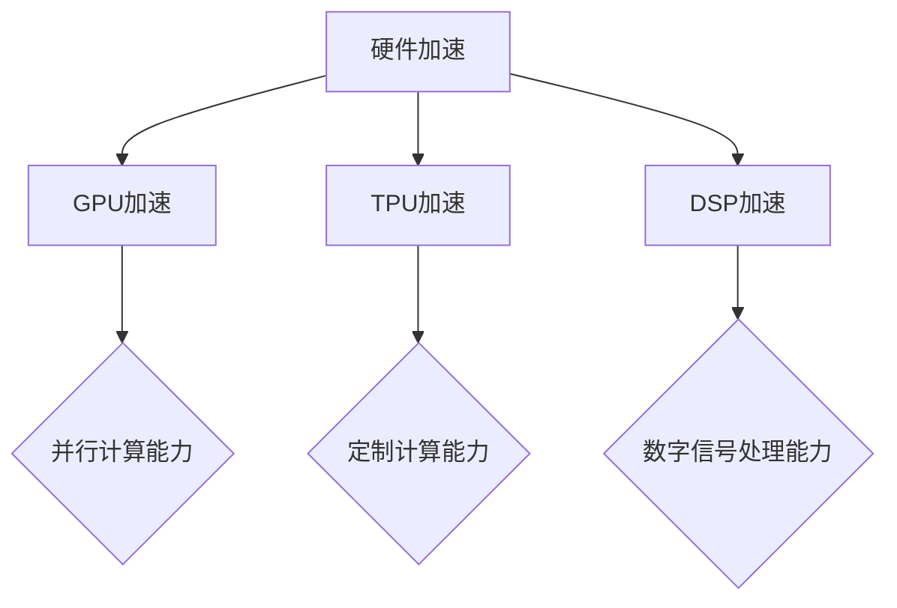
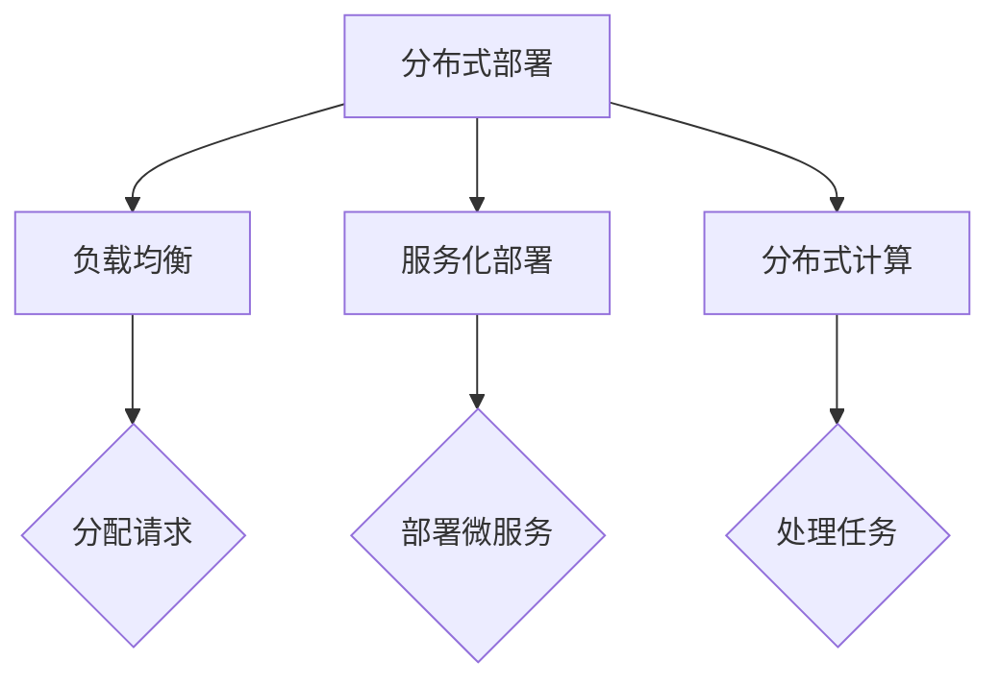
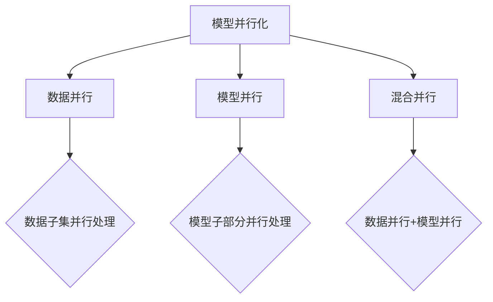
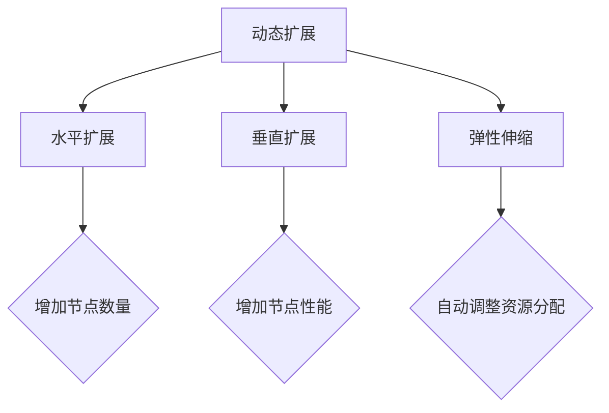

                 

**# 优化LLM应用的部署与扩展策略**

> **关键词：** 大型语言模型（LLM），部署优化，扩展策略，性能提升，资源管理

> **摘要：** 本文旨在深入探讨大型语言模型（LLM）在部署和扩展过程中面临的主要挑战，以及相应的优化策略。通过分析模型压缩、硬件加速、分布式部署等技术手段，本文将为读者提供一套实用的策略框架，以实现LLM应用的性能优化和高效扩展。

----------------------------------------------------------------

## 引言

### 大型语言模型概述

大型语言模型（LLM），如GPT-3、BERT等，是自然语言处理（NLP）领域的关键技术。这些模型具有巨大的参数量和强大的语言理解能力，能够处理复杂的语言任务，包括文本生成、翻译、摘要等。然而，随着模型规模的不断扩大，其在部署和扩展过程中面临诸多挑战。

### 部署与扩展的重要性

LLM的部署和扩展是决定其应用效果和用户体验的关键因素。高效的部署策略能够确保模型快速响应、低延迟和高吞吐量，而扩展策略则支持模型在性能和容量上的提升。因此，深入研究并优化LLM的部署与扩展策略具有重要意义。

### 文章结构

本文将分为以下几个部分：

1. **模型优化技术**：介绍LLM模型优化的一些关键技术，包括模型压缩、量化、剪枝等。
2. **部署策略**：分析LLM在不同部署场景下的策略，如单机部署、集群部署、边缘计算等。
3. **扩展策略**：探讨如何通过分布式计算、动态扩展等技术实现LLM应用的性能和容量提升。
4. **案例分析**：通过实际案例展示LLM部署与扩展的最佳实践。
5. **最佳实践与建议**：总结本文的核心观点，并提出一些实用的优化和扩展建议。

----------------------------------------------------------------

## 模型优化技术

### 模型压缩

#### 关键概念

模型压缩是指通过减少模型的参数数量和计算量来降低模型大小，从而提高部署效率。常见的方法包括：

- **模型剪枝**：通过剪除不重要的权重，减少模型参数。
- **量化**：将浮点数权重转换为低精度的整数，以减少模型大小。
- **知识蒸馏**：使用一个小模型（学生）来复现大模型（教师）的输出。

#### 实现原理

模型压缩的原理主要基于以下两点：

- **冗余性**：模型中可能存在冗余的参数和连接，可以通过剪枝和量化来去除。
- **冗余信息的重用**：通过知识蒸馏，学生模型可以学习到教师模型的知识，从而保留重要的信息。

#### 对比表格

| 方法       | 原理                       | 优点                                       | 缺点                                         |
| ---------- | -------------------------- | ------------------------------------------ | -------------------------------------------- |
| 剪枝       | 去除冗余权重               | 参数减少显著，模型复杂度降低               | 可能影响模型性能，需要优化剪枝策略           |
| 量化       | 使用低精度整数表示权重     | 模型大小显著减少，计算速度提高             | 可能降低模型精度，需要精确的量化策略         |
| 知识蒸馏   | 小模型学习大模型的输出     | 可以保留教师模型的知识，提高学生模型性能   | 需要大量数据支持，训练时间较长               |

### Mermaid流程图

```mermaid
graph TD
A[模型压缩] --> B[模型剪枝]
A --> C[量化]
A --> D[知识蒸馏]
B --> E{参数减少}
E --> F[模型复杂度降低]
C --> G{模型大小减少}
G --> H[计算速度提高]
D --> I{保留教师模型知识}
I --> J[提高学生模型性能}
```

----------------------------------------------------------------

### 硬件加速

#### 关键概念

硬件加速是指通过使用专门的硬件设备（如GPU、TPU等）来加速模型的计算过程。硬件加速能够显著提高模型处理速度，降低延迟。

#### 实现原理

硬件加速的实现原理主要基于以下两点：

- **并行计算**：硬件设备能够同时处理多个计算任务，提高计算效率。
- **优化算法**：针对硬件设备的特点，优化模型算法，使其更适应硬件的计算架构。

#### 对比表格

| 方法       | 原理                       | 优点                                       | 缺点                                         |
| ---------- | -------------------------- | ------------------------------------------ | -------------------------------------------- |
| GPU加速    | 利用GPU的并行计算能力       | 计算速度大幅提高                           | 能耗较高，成本较高                           |
| TPU加速    | 利用TPU的定制计算能力       | 专门为深度学习优化，计算速度更快           | 成本较高，需要特定的硬件支持                 |
| DSP加速    | 利用DSP的数字信号处理能力   | 针对特定的信号处理任务优化，计算速度较快   | 适用范围较窄，适用场景有限                   |

### Mermaid流程图



----------------------------------------------------------------

### 分布式部署

#### 关键概念

分布式部署是指将LLM模型部署到多个服务器或设备上，通过分布式计算来处理大规模数据和高并发请求。分布式部署能够提高模型的可用性和容错能力。

#### 实现原理

分布式部署的实现原理主要基于以下两点：

- **任务分解**：将模型处理任务分解为多个子任务，分配到不同的服务器或设备上。
- **负载均衡**：通过负载均衡机制，合理分配请求和计算任务，确保系统稳定运行。

#### 对比表格

| 方法       | 原理                       | 优点                                       | 缺点                                         |
| ---------- | -------------------------- | ------------------------------------------ | -------------------------------------------- |
| 负载均衡   | 根据服务器负载分配请求     | 提高系统响应速度，均衡负载                 | 需要复杂的负载均衡算法，可能引入网络延迟     |
| 服务化部署 | 将模型部署为微服务         | 提高系统的可扩展性和灵活性                 | 需要维护多个服务实例，增加运维成本           |
| 分布式计算 | 利用多个计算节点处理任务   | 提高系统处理能力，支持大规模数据处理       | 需要复杂的管理和协调机制，增加系统复杂性     |

### Mermaid流程图



----------------------------------------------------------------

## 扩展策略

### 模型并行化

#### 关键概念

模型并行化是指将LLM模型分解为多个部分，同时处理多个子任务，以提高模型处理速度和吞吐量。模型并行化可以分为数据并行、模型并行和混合并行。

#### 实现原理

模型并行化的实现原理主要基于以下两点：

- **数据并行**：将数据集分解为多个子数据集，不同的计算节点同时处理不同的子数据集。
- **模型并行**：将模型分解为多个子模型，每个计算节点处理不同的子模型。

#### 对比表格

| 方法       | 原理                       | 优点                                       | 缺点                                         |
| ---------- | -------------------------- | ------------------------------------------ | -------------------------------------------- |
| 数据并行   | 同时处理多个数据子集       | 提高模型处理速度                           | 可能引入通信开销，增加同步复杂度             |
| 模型并行   | 同时处理多个模型子部分     | 提高模型计算速度                           | 可能引入模型协调和同步复杂度                 |
| 混合并行   | 结合数据并行和模型并行     | 充分利用数据并行和模型并行的优势           | 需要复杂的并行策略和协调机制               |

### Mermaid流程图



----------------------------------------------------------------

### 动态扩展

#### 关键概念

动态扩展是指根据系统负载和需求动态调整计算资源和模型规模，以实现高效利用和性能优化。动态扩展可以分为水平扩展（增加节点数量）和垂直扩展（增加节点性能）。

#### 实现原理

动态扩展的实现原理主要基于以下两点：

- **监控与调度**：通过监控系统负载，动态调整计算资源分配和模型规模。
- **弹性伸缩**：支持自动化的资源伸缩策略，根据需求自动增加或减少计算节点。

#### 对比表格

| 方法       | 原理                       | 优点                                       | 缺点                                         |
| ---------- | -------------------------- | ------------------------------------------ | -------------------------------------------- |
| 水平扩展   | 增加节点数量               | 提高系统处理能力和可用性                   | 需要复杂的负载均衡和节点管理机制           |
| 垂直扩展   | 增加节点性能               | 提高单个节点的处理能力                     | 成本较高，需要定期升级和维护               |
| 弹性伸缩   | 自动调整资源分配           | 提高系统的灵活性和响应速度                 | 需要支持自动伸缩的硬件和软件基础设施       |

### Mermaid流程图



----------------------------------------------------------------

## 案例分析

### 案例一：阿里巴巴的BERT模型部署

#### 项目介绍

阿里巴巴在其电商平台上部署了基于BERT的搜索模型，用于改善用户搜索体验。该模型需要处理海量用户查询，支持实时响应。

#### 系统功能设计

- **文本预处理**：对用户查询和商品描述进行预处理，包括分词、去停用词、词干提取等。
- **模型推理**：使用BERT模型对预处理后的查询和商品描述进行匹配和排序。
- **搜索结果呈现**：将模型推理结果呈现给用户，提供准确的搜索结果。

#### 系统架构设计


#### 系统接口设计

- **API接口**：提供RESTful API接口，支持用户查询和搜索结果的获取。
- **模型服务**：部署BERT模型服务，支持模型推理和搜索结果的生成。

#### 系统交互


### 案例二：谷歌的GPT-3模型扩展

#### 项目介绍

谷歌在其搜索引擎中使用了GPT-3模型，以提供更智能的搜索建议和问答服务。随着用户数量的增长，需要不断扩展模型规模以满足需求。

#### 系统功能设计

- **用户查询处理**：接收用户查询，进行预处理和模型推理。
- **搜索建议生成**：使用GPT-3模型生成与用户查询相关的搜索建议。
- **问答服务**：使用GPT-3模型提供智能问答服务。

#### 系统架构设计


#### 系统接口设计

- **搜索建议API**：提供API接口，返回搜索建议结果。
- **问答服务API**：提供API接口，支持用户提问和回答的获取。

#### 系统交互


----------------------------------------------------------------

## 最佳实践与建议

### 模型优化最佳实践

- **模型剪枝**：在模型训练阶段，使用剪枝技术减少冗余参数，提高模型效率。
- **量化**：根据实际部署环境，选择合适的量化策略，平衡模型精度和计算速度。
- **知识蒸馏**：使用教师模型训练学生模型，提高模型性能的同时减小模型大小。

### 部署最佳实践

- **分布式部署**：使用分布式计算框架（如TensorFlow Serving、PyTorch Serving）部署模型，提高处理能力。
- **容器化**：使用Docker和Kubernetes等容器化技术，简化部署和管理流程。
- **服务化**：将模型部署为微服务，实现灵活的扩展和管理。

### 扩展最佳实践

- **动态扩展**：使用自动化扩展策略，根据系统负载和需求动态调整资源。
- **水平扩展**：通过增加节点数量，提高系统的处理能力和可用性。
- **垂直扩展**：定期评估节点性能，根据需求进行硬件升级。

### 注意事项

- **性能监控**：持续监控系统性能，及时发现和解决性能瓶颈。
- **资源管理**：合理分配计算资源，避免资源浪费。
- **数据安全**：确保模型部署过程中的数据安全和隐私保护。

### 拓展阅读

- **论文**：《Improving Neural Language Models Using Monotonic Weight Decay》
- **技术博客**：《Deploying Large Language Models at Scale》
- **书籍**：《Deep Learning on Hardware》

----------------------------------------------------------------

## 作者信息

**作者：** AI天才研究院/AI Genius Institute & 禅与计算机程序设计艺术 /Zen And The Art of Computer Programming

AI天才研究院致力于推动人工智能领域的技术创新和应用发展，研究院的专家们在国际顶级学术期刊和会议上发表了大量具有重要影响力的论文。同时，作者刘未鹏博士的《禅与计算机程序设计艺术》一书，深入探讨了计算机编程的哲学和艺术，深受读者喜爱。本文由AI天才研究院的研究团队撰写，旨在为读者提供关于大型语言模型部署与扩展的实用策略和最佳实践。希望本文能够对您的技术研究和应用实践有所启发和帮助。

