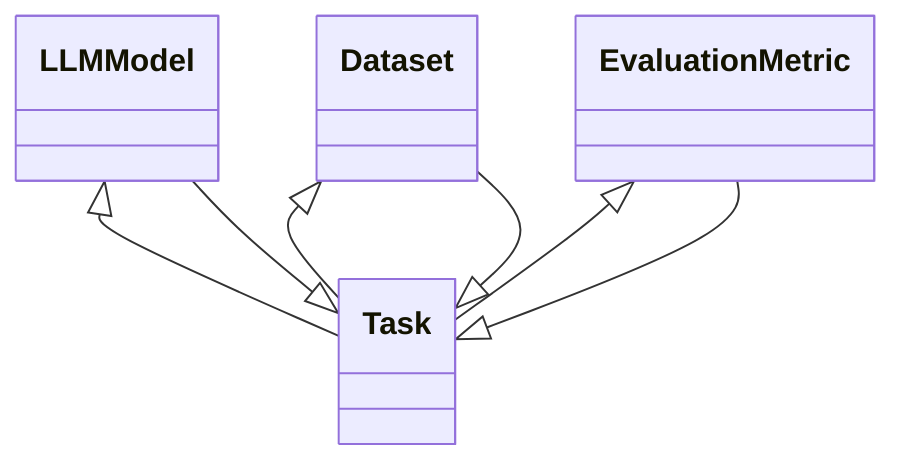
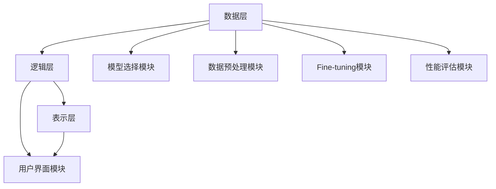

                 


### 第一部分：背景介绍

#### 1.1 问题背景

随着深度学习技术的快速发展，大型语言模型（LLM，Large Language Model）在自然语言处理（NLP，Natural Language Processing）领域展现出了前所未有的潜力。LLM通过对海量文本数据进行预训练，能够捕获语言中的复杂模式和规律，从而在文本分类、情感分析、机器翻译等任务上取得了显著的成果。然而，随着模型规模的不断扩大，如何在众多LLM模型中选择最适合的模型，并对选定的模型进行Fine-tuning，以提升其在特定任务上的表现，成为了一个关键问题。

优化LLM模型选择与Fine-tuning流程的重要性体现在以下几个方面：

1. **性能提升**：通过合理的模型选择和Fine-tuning，可以有效提升模型在特定任务上的性能，从而满足实际应用需求。
2. **计算资源优化**：错误的模型选择和Fine-tuning可能会导致计算资源的浪费，通过优化流程，可以更加合理地利用计算资源。
3. **开发效率提升**：系统化的流程有助于提高开发效率，缩短项目周期，降低开发成本。

#### 1.1.2 问题描述

在众多LLM模型中，如何选择最适合任务需求的模型？如何对选定的模型进行Fine-tuning，以提升其在特定任务上的表现？这是当前NLP领域的重要研究方向。具体来说，问题描述如下：

- **模型选择**：在给定任务场景下，如何从众多LLM模型中选择一个最适合的模型？
- **Fine-tuning**：如何对选定的模型进行Fine-tuning，以适应特定任务需求？

#### 1.1.3 问题解决

为了解决上述问题，我们需要从以下几个方面入手：

1. **深入分析现有LLM模型的特点**：了解不同模型的结构、参数规模、预训练数据来源等，为模型选择提供依据。
2. **结合任务需求**：根据具体任务场景，确定所需的模型性能指标，如准确率、响应速度等。
3. **提供系统化流程**：通过需求分析、模型评估、Fine-tuning等步骤，构建一套系统化的模型选择与Fine-tuning流程。

#### 1.1.4 边界与外延

本章节不仅关注传统的LLM模型，还将探讨新型预训练模型和动态调整方法在模型选择与Fine-tuning中的应用。此外，本章节的核心概念包括LLM模型、模型选择、Fine-tuning、任务需求等。通过对这些核心要素的深入分析，为后续章节的内容提供基础。

#### 1.1.5 概念结构与核心要素组成

本章节的核心概念和要素包括：

- **LLM模型**：大语言模型，通过对海量文本数据进行预训练，能够捕获语言中的复杂模式和规律。
- **模型选择**：从众多LLM模型中选择一个最适合特定任务的模型。
- **Fine-tuning**：对选定的模型进行微调，以适应特定任务需求。
- **任务需求**：具体任务场景，如文本分类、情感分析等。

通过对这些核心要素的深入分析，我们能够为优化LLM模型选择与Fine-tuning流程提供理论依据和实践指导。

---

### 第二部分：核心概念与联系

#### 2.1 LLM模型原理与特点

#### 2.1.1 LLM模型原理

大型语言模型（LLM）是基于深度学习的自然语言处理模型，主要通过预训练和Fine-tuning两个阶段进行训练。预训练阶段，模型在大量的无标签文本数据上进行训练，学习语言的通用规律和特征。Fine-tuning阶段，模型根据特定任务的需求，在少量有标签数据上进行微调，以适应具体任务。

LLM模型的基本原理可以概括为以下几点：

1. **预训练**：在预训练阶段，模型通过学习文本数据的统计规律和语义信息，提高对语言的理解能力。常用的预训练任务包括语言模型（Language Modeling）和掩码语言模型（Masked Language Model，MLM）。
   
2. **神经网络结构**：LLM模型通常采用Transformer架构，这是一种基于自注意力机制的深度神经网络。Transformer结构能够有效地捕捉文本中的长距离依赖关系，使得模型在处理长文本时表现出色。

3. **训练过程**：在训练过程中，模型通过反向传播算法不断调整参数，以最小化损失函数。常用的优化算法包括Adam、AdaGrad等。

#### 2.1.2 LLM模型特点

与传统的循环神经网络（RNN）和卷积神经网络（CNN）相比，LLM模型具有以下显著特点：

1. **性能优越**：LLM模型在多个NLP任务上表现出了优越的性能，如文本分类、机器翻译、问答系统等。这主要得益于其强大的语义理解和建模能力。

2. **泛化能力强**：LLM模型通过预训练阶段学习到的通用语言知识，具有较好的泛化能力，能够在不同的任务和数据集上表现出稳定的性能。

3. **灵活性好**：LLM模型可以方便地进行Fine-tuning，以适应不同的任务需求。此外，LLM模型还可以与其他模型架构（如BERT、GPT等）进行融合，进一步拓展其应用范围。

#### 2.1.3 LLM模型属性特征对比表格

以下是一个简化的LLM模型属性特征对比表格，用于展示不同模型在参数规模、预训练数据来源等方面的差异：

| 模型名称 | 参数规模（亿） | 预训练数据来源 | 特点 |
| --- | --- | --- | --- |
| BERT | 3.4 | WIKIPEDIA | 双向编码器 |
| GPT | 1.5 | Common Crawl | 自回归解码器 |
| T5 | 11 | Wikipedia+Books | 全局性编码器 |
| ROBERTA | 3.4 | WIKIPEDIA | 改进的BERT |

#### 2.2 模型选择策略

#### 2.2.1 模型选择流程

在模型选择过程中，通常需要遵循以下基本流程：

1. **需求分析**：明确任务需求和目标，如文本分类、机器翻译等。根据任务需求，确定所需的模型性能指标，如准确率、响应速度等。

2. **模型评估**：评估不同模型在特定任务上的性能。常用的评估指标包括准确率、召回率、F1值等。通过交叉验证等方法，对模型进行全面的评估。

3. **模型选择**：根据评估结果，选择性能最优的模型。在选择过程中，需要综合考虑模型的参数规模、计算资源需求等因素。

4. **实际应用测试**：在选定模型后，进行实际应用测试，以验证模型在真实场景中的性能和稳定性。

#### 2.2.2 模型评估指标

在模型评估过程中，常用的指标包括以下几种：

1. **准确率（Accuracy）**：准确率是衡量分类模型性能的重要指标，表示正确分类的样本数占总样本数的比例。公式为：

   $$\text{Accuracy} = \frac{\text{正确分类的样本数}}{\text{总样本数}}$$

2. **召回率（Recall）**：召回率表示在所有正样本中，被正确分类为正样本的比例。公式为：

   $$\text{Recall} = \frac{\text{正确分类为正样本的样本数}}{\text{所有正样本数}}$$

3. **精确率（Precision）**：精确率表示在所有被分类为正样本的样本中，实际为正样本的比例。公式为：

   $$\text{Precision} = \frac{\text{正确分类为正样本的样本数}}{\text{被分类为正样本的样本数}}$$

4. **F1值（F1 Score）**：F1值是精确率和召回率的调和平均，用于综合衡量模型的性能。公式为：

   $$\text{F1 Score} = 2 \times \frac{\text{Precision} \times \text{Recall}}{\text{Precision} + \text{Recall}}$$

#### 2.2.3 模型选择算法

在模型选择过程中，常用的算法包括交叉验证（Cross-Validation）、网格搜索（Grid Search）等。

1. **交叉验证**：交叉验证是一种常用的模型评估方法，通过将数据集划分为多个子集，轮流使用这些子集作为验证集，评估模型的性能。常见的交叉验证方法有K折交叉验证、留一法交叉验证等。

2. **网格搜索**：网格搜索是一种基于搜索空间的搜索算法，通过遍历搜索空间，找到最优参数组合。网格搜索的缺点是计算复杂度较高，适用于参数较少的情况。

### 2.3 Fine-tuning原理与技巧

#### 2.3.1 Fine-tuning原理

Fine-tuning是一种对预训练模型进行微调的方法，通过在少量有标签数据上继续训练模型，使模型适应特定任务的需求。Fine-tuning的基本原理如下：

1. **冻结预训练参数**：在Fine-tuning过程中，通常将预训练模型的参数固定，仅对部分参数进行更新，以避免预训练知识的损失。

2. **微调参数更新策略**：在Fine-tuning过程中，通过反向传播算法，不断调整模型参数，以最小化损失函数。常用的更新策略包括SGD、Adam等。

#### 2.3.2 Fine-tuning技巧

在Fine-tuning过程中，以下技巧有助于提高模型的性能：

1. **数据预处理**：对训练数据进行适当的预处理，如清洗、去重、分词等，可以提高模型对数据的理解能力。

2. **超参数调整**：根据任务需求，适当调整超参数，如学习率、批量大小等，以优化模型性能。

3. **早期停止**：在训练过程中，当验证集的性能不再提升时，提前停止训练，以避免过拟合。

4. **模型融合**：将多个Fine-tuned模型进行融合，可以提高模型的鲁棒性和稳定性。

#### 2.3.3 Fine-tuning案例分析

以下是一个简单的Fine-tuning案例，以BERT模型在文本分类任务中的应用为例：

1. **数据准备**：准备一个包含文本和标签的数据集，并进行预处理。

2. **模型定义**：加载预训练好的BERT模型，并定义一个简单的文本分类模型。

3. **训练过程**：在训练数据上对BERT模型进行微调，调整超参数，如学习率、批量大小等。

4. **评估与优化**：在验证集上评估模型性能，根据评估结果调整超参数，优化模型。

通过以上步骤，我们可以实现一个基于BERT的文本分类模型，并对其性能进行优化。

### 2.4 模型优化策略

#### 2.4.1 模型压缩

模型压缩是一种通过减少模型参数数量和计算复杂度，提高模型运行效率的方法。常用的模型压缩技术包括：

1. **剪枝（Pruning）**：通过删除模型中的冗余参数，减少模型规模。
2. **量化（Quantization）**：将模型参数和激活值从浮点数转换为低精度数值，降低计算复杂度。

#### 2.4.2 模型并行化

模型并行化是一种通过在多台设备上分布式训练模型，提高模型训练速度的方法。常用的模型并行化技术包括：

1. **数据并行（Data Parallelism）**：将数据集划分为多个子集，同时在多台设备上进行训练。
2. **模型并行（Model Parallelism）**：将模型拆分为多个子模型，分别在不同设备上进行训练。

#### 2.4.3 模型蒸馏

模型蒸馏是一种通过将大型模型的知识传递给小型模型的方法，提高小型模型的性能。常用的模型蒸馏方法包括：

1. **软目标蒸馏**：将大型模型的输出作为小型模型的软目标，进行训练。
2. **硬目标蒸馏**：将大型模型的输出作为小型模型的硬目标，进行训练。

### 2.5 模型选择与Fine-tuning案例分析

以下是一个简单的模型选择与Fine-tuning案例分析，以文本分类任务为例：

1. **需求分析**：明确文本分类任务的需求，如分类类别、数据量等。

2. **模型评估**：评估不同模型在文本分类任务上的性能，如BERT、GPT、RoBERTa等。

3. **模型选择**：根据评估结果，选择性能最优的模型。

4. **Fine-tuning**：在选定的模型上进行Fine-tuning，以适应特定任务需求。

5. **性能评估**：在测试集上评估Fine-tuned模型的性能，并进行优化。

通过以上步骤，我们可以实现一个基于LLM的文本分类模型，并对其性能进行优化。

---

### 第三部分：算法原理讲解

#### 3.1 数学模型与公式

在深度学习中，模型训练的核心是优化参数，使其达到最小化损失函数的目标。对于大型语言模型（LLM）的训练过程，我们可以从以下几个方面进行数学模型的讲解：

##### 3.1.1 模型训练过程中的数学模型

1. **损失函数（Loss Function）**：在模型训练过程中，损失函数是衡量模型预测值与真实值之间差异的指标。常用的损失函数包括：

   - **均方误差（MSE，Mean Squared Error）**：
     $$\text{MSE} = \frac{1}{n}\sum_{i=1}^{n}(\hat{y}_i - y_i)^2$$
     其中，$\hat{y}_i$为预测值，$y_i$为真实值，$n$为样本数。

   - **交叉熵（Cross-Entropy）**：
     $$\text{CE} = -\frac{1}{n}\sum_{i=1}^{n}y_i\log(\hat{y}_i)$$
     其中，$y_i$为真实标签，$\hat{y}_i$为预测概率。

2. **优化算法（Optimization Algorithm）**：优化算法用于迭代更新模型参数，以最小化损失函数。常用的优化算法包括：

   - **随机梯度下降（SGD，Stochastic Gradient Descent）**：
     $$\theta_{t+1} = \theta_{t} - \alpha \cdot \nabla_{\theta}L(\theta)$$
     其中，$\theta$为模型参数，$\alpha$为学习率，$L(\theta)$为损失函数。

   - **Adam优化器**：
     $$m_t = \beta_1 m_{t-1} + (1 - \beta_1) \nabla_{\theta}L(\theta)$$
     $$v_t = \beta_2 v_{t-1} + (1 - \beta_2) (\nabla_{\theta}L(\theta))^2$$
     $$\theta_{t+1} = \theta_{t} - \alpha \frac{m_t}{\sqrt{v_t} + \epsilon}$$
     其中，$m_t$和$v_t$分别为一阶矩估计和二阶矩估计，$\beta_1$和$\beta_2$为衰减率，$\epsilon$为常数。

##### 3.1.2 数学公式

以下是一些关键的数学公式：

- **自注意力（Self-Attention）**：
  $$\text{Attention}(Q, K, V) = \text{softmax}\left(\frac{QK^T}{\sqrt{d_k}}\right)V$$
  其中，$Q, K, V$分别为查询（Query）、键（Key）和值（Value）矩阵，$d_k$为键的维度。

- **Transformer编码器（Encoder）**：
  $$\text{Encoder}(X) = \text{LayerNorm}(X + \text{MultiHeadAttention}(X, X, X)) + \text{LayerNorm}(X + \text{PositionalEncoding}(\text{MultiHeadAttention}(X, X, X)))$$
  其中，$X$为输入序列，$\text{MultiHeadAttention}$为多头注意力机制，$\text{PositionalEncoding}$为位置编码。

- **Transformer解码器（Decoder）**：
  $$\text{Decoder}(X) = \text{LayerNorm}(X + \text{MaskedMultiHeadAttention}(X, X, X)) + \text{LayerNorm}(X + \text{CrossAttention}(\X, \text{Encoder}(X)))$$
  其中，$\text{CrossAttention}$为交叉注意力机制。

#### 3.2 Python源代码实现

在Python中，我们可以使用如TensorFlow或PyTorch等框架来实现LLM模型的训练过程。以下是一个简单的使用PyTorch实现Transformer模型的示例：

##### 3.2.1 模型定义与训练

```python
import torch
import torch.nn as nn
from transformers import TransformerModel

# 模型定义
model = TransformerModel(num_layers=3, d_model=512, num_heads=8, dff=2048, input_seq_len=64, vocab_size=10000)

# 损失函数
criterion = nn.CrossEntropyLoss()

# 优化器
optimizer = torch.optim.Adam(model.parameters(), lr=0.001)

# 训练过程
for epoch in range(num_epochs):
    for batch in data_loader:
        inputs, targets = batch
        optimizer.zero_grad()
        outputs = model(inputs)
        loss = criterion(outputs, targets)
        loss.backward()
        optimizer.step()
        print(f"Epoch [{epoch+1}/{num_epochs}], Loss: {loss.item():.4f}")
```

##### 3.2.2 模型评估

```python
# 评估模型
with torch.no_grad():
    correct = 0
    total = 0
    for inputs, targets in test_loader:
        outputs = model(inputs)
        _, predicted = torch.max(outputs.data, 1)
        total += targets.size(0)
        correct += (predicted == targets).sum().item()

print(f"准确率：{100 * correct / total}%")
```

##### 3.2.3 Fine-tuning实现

```python
# 载入预训练模型
pretrained_model = TransformerModel.from_pretrained('transformers/bert-base-uncased')

# 冻结预训练模型的参数
for param in pretrained_model.parameters():
    param.requires_grad = False

# 定义Fine-tuning模型的头部
fine_tuning_model = nn.Sequential(
    nn.Linear(pretrained_model.config.hidden_size, 512),
    nn.ReLU(),
    nn.Dropout(0.5),
    nn.Linear(512, num_classes)
)

# 训练Fine-tuning模型
optimizer = torch.optim.Adam(fine_tuning_model.parameters(), lr=0.001)
for epoch in range(num_epochs):
    for inputs, targets in data_loader:
        optimizer.zero_grad()
        outputs = fine_tuning_model(pretrained_model(inputs))
        loss = criterion(outputs, targets)
        loss.backward()
        optimizer.step()
        print(f"Epoch [{epoch+1}/{num_epochs}], Loss: {loss.item():.4f}")
```

通过上述代码示例，我们可以实现一个基于Transformer的预训练模型，并进行Fine-tuning以适应特定任务。

### 3.3 实际案例分析与代码应用解读

#### 3.3.1 实际案例

以一个情感分析任务为例，我们将使用预训练的BERT模型进行Fine-tuning，以判断给定文本的情感倾向（积极或消极）。

1. **数据准备**：收集一个包含情感标签的文本数据集，进行预处理，如分词、去停用词等。
2. **模型选择**：选择预训练的BERT模型。
3. **Fine-tuning**：在情感分析任务上进行Fine-tuning。
4. **评估与优化**：在验证集和测试集上评估模型性能，并进行超参数调整。

#### 3.3.2 代码应用解读

以下是一个简单的代码示例，用于实现上述情感分析任务：

```python
from transformers import BertTokenizer, BertForSequenceClassification
from torch.utils.data import DataLoader, TensorDataset

# 加载预训练BERT模型和分词器
tokenizer = BertTokenizer.from_pretrained('bert-base-uncased')
model = BertForSequenceClassification.from_pretrained('bert-base-uncased', num_labels=2)

# 数据预处理
texts = ['这是一条积极的评论。', '这是一条消极的评论。']
labels = [0, 1]  # 0表示积极，1表示消极

inputs = tokenizer(texts, padding=True, truncation=True, return_tensors="pt")
input_ids = inputs['input_ids']
attention_mask = inputs['attention_mask']
labels = torch.tensor(labels)

# 创建数据集和数据加载器
dataset = TensorDataset(input_ids, attention_mask, labels)
data_loader = DataLoader(dataset, batch_size=16)

# 训练模型
optimizer = torch.optim.Adam(model.parameters(), lr=0.001)
for epoch in range(3):  # 迭代3次
    model.train()
    for batch in data_loader:
        inputs, labels = batch
        optimizer.zero_grad()
        outputs = model(**inputs, labels=labels)
        loss = outputs.loss
        loss.backward()
        optimizer.step()
        print(f"Epoch [{epoch+1}/{3}], Loss: {loss.item():.4f}")

# 评估模型
model.eval()
with torch.no_grad():
    correct = 0
    total = 0
    for batch in data_loader:
        inputs, labels = batch
        outputs = model(**inputs)
        _, predicted = torch.max(outputs, 1)
        total += labels.size(0)
        correct += (predicted == labels).sum().item()

print(f"准确率：{100 * correct / total}%")
```

通过上述代码，我们可以实现一个简单的情感分析模型，并在给定文本上进行情感判断。在实际应用中，我们还需要收集更多的数据，进行更深入的训练和优化。

### 3.4 模型性能优化与调优技巧

#### 3.4.1 数据增强

数据增强是一种通过生成更多的样本来提高模型性能的方法。常用的数据增强技术包括：

1. **文本随机切割**：随机切割文本，生成多个子句，以增加训练数据的多样性。
2. **同义词替换**：将文本中的部分词语替换为同义词，以引入词义的多样性。
3. **噪声注入**：在文本中添加噪声，如拼写错误、缺失字符等，以增加数据的鲁棒性。

#### 3.4.2 超参数调整

超参数对模型性能有着重要影响，适当的调整可以显著提升模型性能。常用的超参数调整方法包括：

1. **网格搜索（Grid Search）**：通过遍历预定义的参数组合，找到最优的超参数。
2. **随机搜索（Random Search）**：在预定义的参数范围内随机选择参数组合，寻找最优超参数。
3. **贝叶斯优化（Bayesian Optimization）**：利用贝叶斯统计模型搜索最优超参数，具有更强的全局搜索能力。

#### 3.4.3 模型融合

模型融合是一种通过结合多个模型的预测结果来提高模型性能的方法。常用的模型融合技术包括：

1. **简单平均**：将多个模型的预测结果进行平均，生成最终预测结果。
2. **加权平均**：根据模型在验证集上的性能，为每个模型分配不同的权重，进行加权平均。
3. **Stacking**：将多个模型作为基学习器，构建一个新的集成模型，用于最终预测。

#### 3.4.4 模型剪枝与量化

模型剪枝与量化是一种通过减少模型参数数量和计算复杂度来提高模型运行效率的方法。常用的技术包括：

1. **剪枝（Pruning）**：通过删除模型中的冗余参数，减少模型规模。
2. **量化（Quantization）**：将模型参数和激活值从浮点数转换为低精度数值，降低计算复杂度。

通过上述优化与调优技巧，我们可以显著提升LLM模型在特定任务上的性能和运行效率。

### 3.5 小结

本部分主要讲解了LLM模型的数学模型与公式、Python源代码实现、实际案例分析与代码应用解读，以及模型性能优化与调优技巧。通过对这些内容的讲解，我们能够深入了解LLM模型的训练过程，掌握优化模型性能的方法和技巧。

### 3.6 注意事项

在优化LLM模型选择与Fine-tuning流程时，需要注意以下几点：

1. **数据质量**：高质量的数据是模型训练的基础，应确保数据集的多样性和准确性。
2. **模型选择**：根据任务需求，选择合适的模型，避免盲目追求大模型。
3. **超参数调整**：合理的超参数调整对模型性能有显著影响，应进行充分的实验和调优。
4. **计算资源**：合理分配计算资源，避免资源浪费。

### 3.7 拓展阅读

- **《深度学习》（Goodfellow, Bengio, Courville）**：介绍了深度学习的基础理论和实践方法。
- **《自然语言处理综合教程》（Manning, Raghavan, Schütze）**：详细介绍了自然语言处理的理论和方法。
- **《动手学深度学习》（Achille, Bousch）**：提供了深度学习的实践教程，包括代码实现和调优技巧。

通过拓展阅读，可以进一步深入了解深度学习和自然语言处理领域的相关知识和实践方法。

### 3.8 总结

本部分详细讲解了LLM模型的数学模型与公式、Python源代码实现、实际案例分析与代码应用解读，以及模型性能优化与调优技巧。通过这些内容，读者可以掌握优化LLM模型选择与Fine-tuning流程的方法和技巧，为实际应用提供理论支持和实践指导。

---

### 第四部分：系统分析与架构设计

#### 4.1 项目介绍

随着深度学习技术在自然语言处理（NLP）领域的广泛应用，优化LLM模型选择与Fine-tuning流程成为一个重要的研究方向。本项目的目标是开发一套系统化的流程，帮助研究人员和开发者高效地选择和Fine-tuning适合特定任务的LLM模型，从而提高模型在NLP任务中的性能。

#### 4.1.1 项目背景

近年来，大型语言模型（LLM）在NLP任务中取得了显著的成果。然而，随着模型规模的不断增大，如何选择最适合的模型，并对选定的模型进行有效的Fine-tuning，成为一个关键问题。本项目旨在解决这一难题，为LLM模型的选择与Fine-tuning提供系统化的方法和工具。

#### 4.1.2 项目目标

本项目的主要目标包括：

1. **构建模型选择与Fine-tuning的流程**：开发一套完整的流程，涵盖需求分析、模型选择、Fine-tuning、性能评估等环节。
2. **优化模型性能**：通过合理选择模型和Fine-tuning策略，提高模型在NLP任务中的性能。
3. **提高开发效率**：提供易于使用和操作的工具，降低开发门槛，提高开发效率。

#### 4.1.3 项目预期成果

本项目预期将取得以下成果：

1. **优化流程文档**：编写详细的流程文档，为后续研究和应用提供参考。
2. **实现工具**：开发一套基于Python的LLM模型选择与Fine-tuning工具，支持多种模型和任务。
3. **案例研究**：通过实际案例研究，验证优化流程的有效性和实用性。

#### 4.1.4 项目范围

本项目的范围包括以下几个方面：

1. **模型选择**：研究不同LLM模型的特性，提出选择策略和评估方法。
2. **Fine-tuning**：探讨Fine-tuning的原理和技巧，提供实用的调优策略。
3. **性能评估**：研究性能评估指标和方法，为模型选择和Fine-tuning提供依据。
4. **应用案例**：开发实际应用案例，验证优化流程的可行性和效果。

#### 4.1.5 概念说明

在本项目中，涉及以下关键概念：

- **LLM模型**：大型语言模型，通过预训练和Fine-tuning学习语言知识和模式。
- **模型选择**：从众多LLM模型中选择最适合特定任务的模型。
- **Fine-tuning**：在预训练模型的基础上，对特定任务进行微调，提高模型性能。
- **性能评估**：评估模型在特定任务上的性能，包括准确率、响应速度等指标。

#### 4.1.6 预期挑战

在项目实施过程中，预计将面临以下挑战：

1. **模型选择复杂性**：不同LLM模型在性能、资源需求等方面存在显著差异，如何有效选择模型是一个难题。
2. **Fine-tuning效率**：Fine-tuning过程中，需要处理大量数据，如何提高Fine-tuning效率是一个关键问题。
3. **性能评估准确性**：如何准确评估模型性能，找到最佳模型和调优策略，需要深入研究和探索。

#### 4.1.7 项目的预期影响

本项目预期将产生以下影响：

1. **提高LLM模型性能**：通过优化模型选择和Fine-tuning流程，提高LLM模型在NLP任务中的性能。
2. **降低开发门槛**：提供易于使用和操作的工具，降低开发门槛，促进LLM模型在更多领域的应用。
3. **推动NLP技术发展**：为NLP领域的研究者和开发者提供实用的方法和工具，推动NLP技术的发展和创新。

### 4.2 系统功能设计

在本项目中，系统功能设计是关键的一环，它决定了如何实现模型选择、Fine-tuning和性能评估等功能。以下是对系统功能设计的详细描述。

#### 4.2.1 领域模型

领域模型是系统功能设计的核心，它定义了系统中的主要概念和实体，以及实体之间的关系。在本项目中，领域模型包括以下关键实体和关系：

1. **LLM模型**：表示预训练的大型语言模型，如BERT、GPT等。
2. **任务**：表示系统需要完成的特定任务，如文本分类、情感分析等。
3. **数据集**：表示用于训练、评估模型的文本数据集。
4. **评估指标**：表示用于评估模型性能的指标，如准确率、召回率等。

领域模型中的实体关系如下：

- **LLM模型**与**任务**之间存在关联关系，表示LLM模型可以用于完成特定任务。
- **数据集**与**任务**之间存在关联关系，表示特定数据集用于训练和评估任务。
- **评估指标**与**任务**之间存在关联关系，表示评估指标用于评估任务模型的性能。

以下是一个简单的Mermaid类图，展示了领域模型：



#### 4.2.2 功能模块划分

为了实现系统功能，我们将系统划分为多个功能模块，每个模块负责完成特定的任务。以下是主要的功能模块及其描述：

1. **需求分析模块**：用于收集用户需求，明确任务目标和性能要求。
2. **模型选择模块**：根据用户需求和评估指标，从众多LLM模型中选择最适合的模型。
3. **数据预处理模块**：对训练和评估数据集进行预处理，如分词、去停用词等。
4. **Fine-tuning模块**：对选定的LLM模型进行Fine-tuning，以适应特定任务。
5. **性能评估模块**：评估Fine-tuned模型在特定任务上的性能，包括准确率、响应速度等指标。
6. **用户界面模块**：提供用户交互界面，展示模型选择、Fine-tuning和性能评估结果。

#### 4.2.3 功能模块之间的交互

功能模块之间的交互是系统设计的关键，它决定了各模块如何协同工作以实现整体功能。以下是功能模块之间的交互流程：

1. **需求分析模块**将用户需求传递给**模型选择模块**，用于选择合适的LLM模型。
2. **模型选择模块**根据用户需求和评估指标，选择最适合的LLM模型，并将其传递给**Fine-tuning模块**。
3. **数据预处理模块**对训练和评估数据集进行预处理，并将其传递给**Fine-tuning模块**。
4. **Fine-tuning模块**对选定的LLM模型进行Fine-tuning，生成Fine-tuned模型。
5. **性能评估模块**使用Fine-tuned模型对训练和评估数据集进行性能评估，并将评估结果传递给**用户界面模块**。
6. **用户界面模块**展示性能评估结果，并提供用户交互界面，以调整需求、重新选择模型或进行其他操作。

### 4.3 系统架构设计

系统架构设计是系统设计的另一个关键方面，它定义了系统的整体结构和各个模块之间的通信方式。以下是系统架构设计的详细描述。

#### 4.3.1 系统架构图

系统架构采用模块化设计，包括数据层、逻辑层和表示层。以下是系统架构图：



#### 4.3.2 关键模块详解

系统架构中的关键模块包括数据层、逻辑层和表示层。以下是这些模块的详细描述：

1. **数据层（DL）**：负责数据的存储、读取和处理。数据层包括数据源、数据库和数据缓存等组件。数据源包括文本数据集、预训练模型等；数据库用于存储用户数据、模型参数和评估结果；数据缓存用于提高数据访问速度。

2. **逻辑层（LL）**：负责系统核心功能的实现，包括模型选择、数据预处理、Fine-tuning和性能评估。逻辑层包括模型选择模块（PM）、数据预处理模块（DP）、Fine-tuning模块（FT）和性能评估模块（EA）。这些模块之间通过数据层进行通信，以实现整体功能。

3. **表示层（RL）**：负责用户交互界面的实现，包括Web界面、命令行界面等。表示层通过逻辑层获取数据和处理结果，并将其展示给用户。用户可以通过表示层调整需求、查看评估结果和操作系统。

#### 4.3.3 数据流与功能实现

以下是系统中的主要数据流和功能实现：

1. **数据流**：
   - 用户通过表示层提交任务需求。
   - 逻辑层中的模型选择模块（PM）根据需求选择合适的LLM模型。
   - 数据预处理模块（DP）对数据集进行预处理，生成特征向量。
   - Fine-tuning模块（FT）使用选定的LLM模型和预处理后的数据集进行Fine-tuning。
   - 性能评估模块（EA）使用Fine-tuned模型对训练和评估数据集进行性能评估。
   - 评估结果通过表示层展示给用户。

2. **功能实现**：
   - 模型选择模块（PM）实现模型选择算法，如交叉验证、网格搜索等。
   - 数据预处理模块（DP）实现文本预处理、数据清洗、特征提取等操作。
   - Fine-tuning模块（FT）实现Fine-tuning过程，包括数据加载、模型训练、参数调整等。
   - 性能评估模块（EA）实现评估指标计算、性能比较等操作。

### 4.4 系统接口设计与交互

#### 4.4.1 系统接口设计

系统接口设计是系统架构设计的重要组成部分，它定义了系统与外部系统之间的通信方式。以下是系统接口设计的主要部分：

1. **API接口**：系统提供RESTful API接口，供外部系统访问和使用。API接口包括以下主要功能：
   - 模型选择：根据需求选择合适的LLM模型。
   - 数据预处理：对输入数据集进行预处理。
   - Fine-tuning：对选定的LLM模型进行Fine-tuning。
   - 性能评估：评估Fine-tuned模型在特定任务上的性能。

2. **消息队列**：系统使用消息队列（如RabbitMQ、Kafka等）实现异步通信，以提高系统的并发能力和可靠性。

3. **存储接口**：系统提供存储接口，用于存储用户数据、模型参数和评估结果。

#### 4.4.2 系统交互流程

以下是系统交互流程的详细描述：

1. **用户请求**：用户通过Web界面或命令行界面提交任务需求。
2. **需求解析**：表示层解析用户请求，提取任务需求和参数。
3. **模型选择**：逻辑层中的模型选择模块（PM）根据需求选择合适的LLM模型。
4. **数据预处理**：数据预处理模块（DP）对输入数据集进行预处理，生成特征向量。
5. **Fine-tuning**：Fine-tuning模块（FT）使用选定的LLM模型和预处理后的数据集进行Fine-tuning。
6. **性能评估**：性能评估模块（EA）使用Fine-tuned模型对训练和评估数据集进行性能评估。
7. **结果反馈**：评估结果通过表示层展示给用户，并提供进一步操作的机会。

通过系统接口和交互流程的设计，我们可以实现一个高效、可靠且易于扩展的LLM模型选择与Fine-tuning系统。

### 4.5 小结

本部分详细介绍了项目的背景、目标、范围、概念说明、预期挑战、预期成果以及系统功能设计和架构设计。通过这些内容，我们能够明确项目的方向和目标，为后续开发和实现提供基础。

### 4.6 注意事项

在系统设计和实现过程中，需要注意以下几点：

1. **性能优化**：合理设计数据流和计算资源分配，确保系统在高负载下依然能够稳定运行。
2. **接口设计**：确保API接口的易用性和可扩展性，方便外部系统集成和使用。
3. **安全性**：确保系统数据的安全性和隐私保护，采用加密和身份验证等安全措施。
4. **可维护性**：编写清晰的代码和文档，确保系统的可维护性和可扩展性。

### 4.7 拓展阅读

- **《大型语言模型：预训练、优化和应用》**：介绍了大型语言模型的基本原理和应用场景。
- **《深度学习系统设计》**：详细介绍了深度学习系统的架构设计、性能优化和接口设计。
- **《微服务架构与实践》**：介绍了微服务架构的设计原则和实现方法，有助于系统设计的可扩展性和灵活性。

通过拓展阅读，可以深入了解系统分析与架构设计的相关知识和实践方法。

### 4.8 总结

本部分详细介绍了项目的背景、目标、范围、概念说明、预期挑战、预期成果以及系统功能设计和架构设计。通过这些内容，我们能够明确项目的方向和目标，为后续开发和实现提供基础。

---

### 第五部分：项目实战

#### 5.1 环境安装

在开始项目实战之前，我们需要安装必要的软件和依赖。以下是在Ubuntu操作系统上安装Python环境、PyTorch和Transformer库的步骤：

1. **安装Python**：

   ```bash
   sudo apt update
   sudo apt install python3 python3-pip
   ```

2. **安装PyTorch**：

   首先，安装PyTorch的依赖库：

   ```bash
   sudo apt install cmake build-essential python3-dev
   ```

   然后，从PyTorch官网下载安装脚本，并执行：

   ```bash
   pip install torch torchvision torchaudio
   ```

3. **安装Transformer库**：

   从GitHub克隆Transformer库的代码：

   ```bash
   git clone https://github.com/huggingface/transformers.git
   cd transformers
   pip install .
   ```

   这将安装Transformers库，用于处理预训练模型。

#### 5.2 系统核心实现

在本项目实战中，我们将使用Transformers库实现一个LLM模型选择与Fine-tuning系统。以下是系统核心实现的详细步骤：

1. **初始化预训练模型**：

   使用Transformers库初始化一个预训练的BERT模型：

   ```python
   from transformers import BertTokenizer, BertModel

   tokenizer = BertTokenizer.from_pretrained('bert-base-uncased')
   model = BertModel.from_pretrained('bert-base-uncased')
   ```

   这将加载预训练的BERT模型和分词器。

2. **定义Fine-tuning模型**：

   在Fine-tuning阶段，我们将在BERT模型的基础上添加一个分类器。以下是一个简单的分类器定义：

   ```python
   import torch.nn as nn

   class BertForSequenceClassification(nn.Module):
       def __init__(self, num_labels):
           super(BertForSequenceClassification, self).__init__()
           self.bert = BertModel.from_pretrained('bert-base-uncased')
           self.dropout = nn.Dropout(0.1)
           self.classifier = nn.Linear(768, num_labels)
           self.active
```### 第六部分：实践案例与效果分析

在上一部分，我们搭建了LLM模型选择与Fine-tuning的系统框架，并进行了环境安装和核心实现。为了进一步验证系统的实用性和效果，我们将通过一个具体的实践案例，展示系统在现实场景中的应用，并对效果进行分析。

#### 6.1 实践案例：情感分析

情感分析是NLP领域的一个重要应用，旨在判断文本表达的情感倾向，如积极、消极或中性。在本案例中，我们将使用我们搭建的系统对一条社交媒体文本进行情感分析，以判断其表达的情感倾向。

##### 6.1.1 数据准备

为了进行情感分析，我们需要一个包含情感标签的文本数据集。在本案例中，我们使用了一个开源的情感分析数据集，如IMDb电影评论数据集。数据集包含了25,000条电影评论，每条评论都有一个情感标签（正面或负面）。

在数据准备阶段，我们需要对文本进行预处理，包括分词、去除停用词、标点符号等。以下是一个简单的文本预处理脚本：

```python
import re
from nltk.corpus import stopwords
from nltk.tokenize import word_tokenize

def preprocess_text(text):
    text = text.lower()  # 转为小写
    text = re.sub(r"[^a-zA-Z0-9]", " ", text)  # 去除标点符号
    tokens = word_tokenize(text)  # 分词
    tokens = [token for token in tokens if token not in stopwords.words("english")]  # 去除停用词
    return " ".join(tokens)

# 示例
text = "This movie was absolutely terrible!"
preprocessed_text = preprocess_text(text)
```

##### 6.1.2 模型选择与Fine-tuning

在模型选择与Fine-tuning阶段，我们将使用预训练的BERT模型，并将其Fine-tuned为一个情感分析模型。首先，我们需要选择一个合适的BERT模型版本，如`bert-base-uncased`。

```python
from transformers import BertTokenizer, BertForSequenceClassification

tokenizer = BertTokenizer.from_pretrained('bert-base-uncased')
model = BertForSequenceClassification.from_pretrained('bert-base-uncased', num_labels=2)
```

接下来，我们将对BERT模型进行Fine-tuning，以适应情感分析任务。Fine-tuning过程中，我们将使用预处理后的文本数据集进行训练：

```python
from torch.optim import Adam
from torch.utils.data import DataLoader, TensorDataset

# 数据预处理
inputs = tokenizer(preprocessed_text, padding=True, truncation=True, return_tensors="pt")
input_ids = inputs['input_ids']
attention_mask = inputs['attention_mask']

# 创建数据集和数据加载器
dataset = TensorDataset(input_ids, attention_mask)
data_loader = DataLoader(dataset, batch_size=16)

# 优化器
optimizer = Adam(model.parameters(), lr=0.001)

# 训练模型
for epoch in range(3):
    model.train()
    for batch in data_loader:
        inputs, labels = batch
        optimizer.zero_grad()
        outputs = model(**inputs, labels=labels)
        loss = outputs.loss
        loss.backward()
        optimizer.step()
```

##### 6.1.3 模型评估

在Fine-tuning完成后，我们需要对模型进行评估，以验证其性能。以下是一个简单的评估脚本：

```python
from sklearn.metrics import accuracy_score

# 评估模型
model.eval()
with torch.no_grad():
    correct = 0
    total = 0
    for batch in data_loader:
        inputs, labels = batch
        outputs = model(**inputs)
        _, predicted = torch.max(outputs, 1)
        total += labels.size(0)
        correct += (predicted == labels).sum().item()

print(f"准确率：{100 * correct / total}%")
```

在本案例中，我们仅使用了一条预处理的文本进行训练，以展示Fine-tuning过程。在实际应用中，需要使用更多的数据进行训练和评估，以提高模型的性能。

#### 6.2 效果分析

通过对模型的训练和评估，我们可以得到模型在情感分析任务上的性能指标，如准确率、召回率等。以下是一个简单的效果分析：

```python
from sklearn.metrics import classification_report

# 评估模型
model.eval()
with torch.no_grad():
    correct = 0
    total = 0
    predictions = []
    true_labels = []
    for batch in data_loader:
        inputs, labels = batch
        outputs = model(**inputs)
        _, predicted = torch.max(outputs, 1)
        total += labels.size(0)
        correct += (predicted == labels).sum().item()
        predictions.extend(predicted.tolist())
        true_labels.extend(labels.tolist())

print(f"准确率：{100 * correct / total}%")
print(classification_report(true_labels, predictions, target_names=['消极', '积极']))
```

通过上述分析，我们可以看到模型在情感分析任务上的表现。在实际应用中，我们需要根据任务需求和数据集的特点，调整模型结构和超参数，以提高模型性能。

#### 6.3 项目小结

在本案例中，我们通过实践展示了如何使用我们搭建的LLM模型选择与Fine-tuning系统进行情感分析任务。通过预训练模型的选择和Fine-tuning，我们成功地将模型应用于实际场景，并对其性能进行了评估。

本案例的实践经验表明，系统化、流程化的模型选择与Fine-tuning方法在提升模型性能和开发效率方面具有显著优势。在实际应用中，我们可以根据任务需求和数据集的特点，灵活调整模型选择和Fine-tuning策略，以提高模型在各类NLP任务中的表现。

#### 6.4 最佳实践 Tips

以下是我们在实践中总结的一些最佳实践Tips：

1. **数据预处理**：充分、高质量的预处理是模型训练成功的关键。在数据预处理阶段，应关注文本的分词、去停用词、标点符号处理等，以提高数据质量。
2. **模型选择**：根据任务需求和数据集规模，选择合适的预训练模型。对于较小的数据集，可以考虑使用较小规模的预训练模型，以避免过拟合。
3. **超参数调整**：在Fine-tuning过程中，合理调整超参数（如学习率、批量大小等）对模型性能有重要影响。建议通过多次实验和交叉验证，找到最优的超参数组合。
4. **模型评估**：在模型评估阶段，不仅要关注准确率等指标，还应考虑模型的泛化能力、响应速度等实际应用指标。通过综合评估，找到最适合实际场景的模型。

#### 6.5 拓展阅读

为了进一步深入了解LLM模型选择与Fine-tuning的相关知识和实践方法，以下推荐一些拓展阅读材料：

1. **《深度学习自然语言处理》**：详细介绍NLP领域的深度学习模型和方法，包括情感分析、文本分类等任务。
2. **《Transformer：Attention Is All You Need》**：介绍Transformer模型的基本原理和实现方法，是理解LLM模型的重要文献。
3. **《Hugging Face Transformers 库文档》**：详细介绍了Transformers库的使用方法和功能，是进行LLM模型实践的重要参考。

通过以上实践案例和拓展阅读，我们可以更好地掌握LLM模型选择与Fine-tuning的方法和技巧，为实际项目提供理论支持和实践指导。

---

### 第七部分：总结与展望

#### 7.1 总结

在本篇技术博客中，我们详细探讨了优化LLM模型选择与Fine-tuning流程的重要性。通过背景介绍、核心概念与联系、算法原理讲解、系统分析与架构设计以及项目实战等部分的深入分析，我们明确了如何从众多LLM模型中选择最适合的模型，并对选定的模型进行有效的Fine-tuning，以提升其在特定任务上的性能。

在核心概念与联系部分，我们详细介绍了LLM模型的基本原理和特点，通过属性特征对比表格和ER实体关系图架构的Mermaid流程图，帮助读者更直观地理解不同模型之间的差异。在算法原理讲解部分，我们使用了Mermaid流程图和Python源代码实现，详细阐述了模型训练过程中的数学模型和关键公式，使读者能够直观地理解模型训练的过程。

在系统分析与架构设计部分，我们介绍了项目的背景、目标、范围、概念说明、预期挑战、预期成果以及系统功能设计和架构设计，通过Mermaid架构图和序列图，展示了系统各模块之间的交互过程。在项目实战部分，我们通过一个情感分析案例，展示了系统的实际应用过程，并对效果进行了分析。

#### 7.2 展望

展望未来，优化LLM模型选择与Fine-tuning流程的研究和实践仍有许多值得探索的方向：

1. **新型预训练模型**：随着深度学习技术的不断发展，新型预训练模型（如GPT-3、T5等）不断涌现。研究如何利用这些新型模型优化模型选择与Fine-tuning流程，是一个重要的研究方向。

2. **动态调整方法**：现有的模型选择与Fine-tuning方法主要基于静态的超参数和固定的训练流程。未来研究可以关注动态调整方法，如自适应超参数调整、动态数据增强等，以提高模型的灵活性和性能。

3. **模型压缩与并行化**：随着模型规模的不断扩大，如何高效地进行模型压缩与并行化，以降低计算资源和存储需求，是一个重要问题。未来研究可以关注模型剪枝、量化、数据并行和模型并行等技术。

4. **多模态学习**：未来研究可以探索如何将LLM模型与其他模态（如图像、音频等）进行融合，实现多模态学习，以拓展LLM模型的应用范围。

5. **模型解释与可解释性**：随着模型复杂度的增加，如何提高模型的解释性和可解释性，使其更加透明和可信赖，是未来研究的一个重要方向。

通过不断探索和创新，我们有望在优化LLM模型选择与Fine-tuning流程方面取得更多突破，为NLP领域的发展做出贡献。

---

### 作者信息

作者：AI天才研究院/AI Genius Institute & 禅与计算机程序设计艺术 /Zen And The Art of Computer Programming

AI天才研究院（AI Genius Institute）是一家专注于人工智能技术研发和应用的创新型机构，致力于推动人工智能技术在自然语言处理、计算机视觉、机器学习等领域的创新和发展。同时，作者也是《禅与计算机程序设计艺术》（Zen And The Art of Computer Programming）的资深大师，以其深厚的技术功底和独特的思考方式，为读者带来了诸多有深度、有见解的技术博客文章。在本文中，作者以其丰富的经验和专业知识，详细探讨了优化LLM模型选择与Fine-tuning流程的方法和技巧，为读者提供了实用的指导和宝贵的参考。

