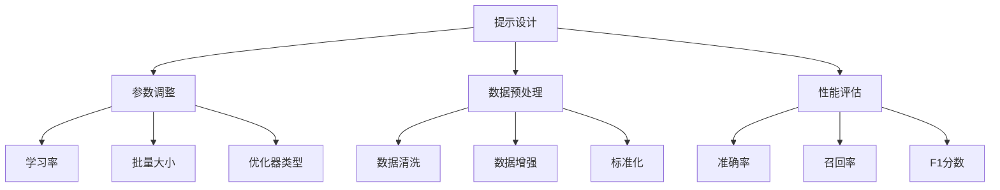
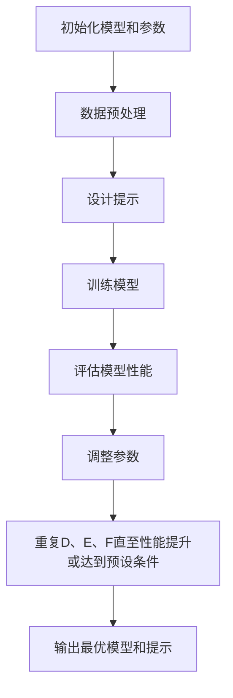
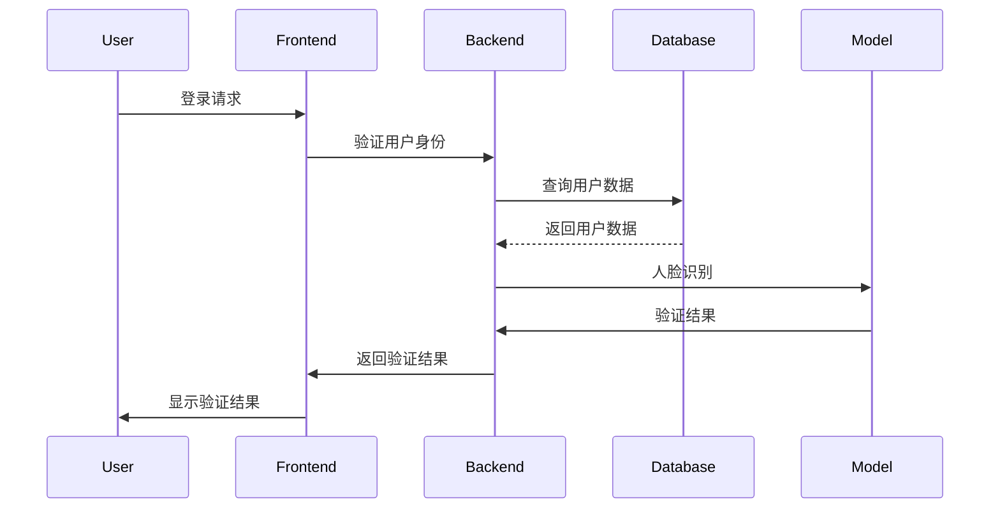
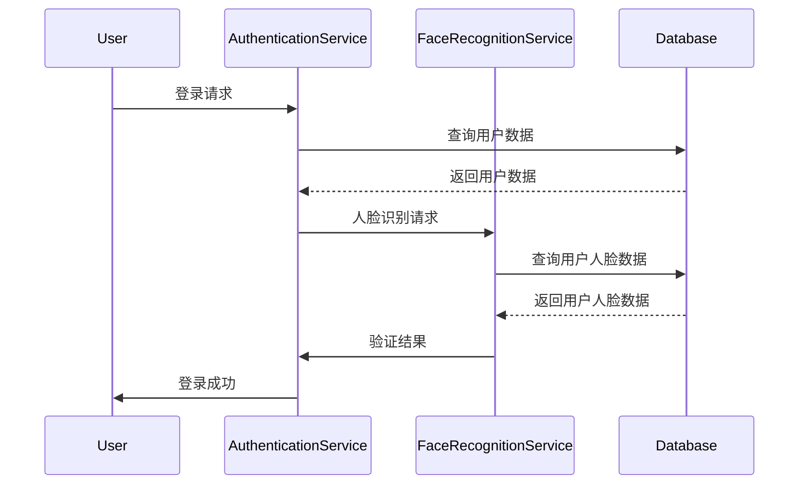

                 

### 优化prompt工程的实用技巧

#### 关键词：Prompt Engineering、大模型优化、性能提升、算法原理、实战案例

> 摘要：本文将深入探讨如何优化prompt工程，通过一系列实用技巧帮助读者提升大模型的性能。我们将从背景介绍、核心概念与联系以及算法原理讲解三个部分展开，结合实战案例，为读者提供全面的指导。

#### 第一部分：背景介绍

##### 1.1 问题背景

随着深度学习技术的不断发展，大型神经网络模型在各类任务中取得了显著的成果。然而，如何有效优化这些模型的输入提示（prompt）成为了一个关键问题。prompt engineering，即提示工程，是指在构建大型神经网络模型时，通过设计、调整和优化输入提示来提升模型性能的过程。

##### 1.2 问题描述

优化prompt工程的核心目标在于提升模型的准确性和效率。具体来说，我们需要解决以下问题：

- 如何选择和设计有效的提示？
- 如何通过调整模型参数来优化提示效果？
- 如何平衡提示的长度和复杂度？
- 如何处理提示中的噪声和冗余信息？

##### 1.3 问题解决

本章节将介绍一系列优化prompt工程的实用技巧，旨在帮助读者理解和应用这些技巧，从而提升大模型的性能。通过学习本章节的内容，读者将能够：

- 理解prompt engineering的基本原理和重要性。
- 掌握设计、调整和优化prompt的基本方法。
- 学习到实际应用中的成功案例和经验教训。

##### 1.4 边界与外延

优化prompt engineering不仅适用于特定领域，如自然语言处理、图像识别等，还可以推广到其他涉及大模型的应用场景。同时，本章节还将讨论prompt engineering在开源和商业大模型中的差异和挑战。

##### 1.5 概念结构与核心要素组成

以下是优化prompt engineering的核心概念和要素：

- 提示设计：如何选择和构造有效的提示。
- 参数调整：如何调整模型参数以优化提示效果。
- 数据预处理：如何处理和预处理输入数据，以提高提示质量。
- 性能评估：如何评估和比较不同prompt的性能。

---

#### 第二部分：核心概念与联系

##### 2.1 核心概念原理

**提示设计**：提示是影响大模型输出结果的重要因素，其设计原则包括简洁性、明确性和多样性。

**参数调整**：通过调整模型参数，如学习率、批量大小等，可以优化模型在特定提示下的表现。

**数据预处理**：有效的数据预处理可以提高提示的质量，包括数据清洗、数据增强、标准化等。

**性能评估**：性能评估指标包括准确率、召回率、F1分数等，用于衡量不同prompt的效果。

##### 2.2 概念属性特征对比表格

| 概念      | 属性特征                                             |  
|----------|----------------------------------------------------|  
| 提示设计  | 简洁性、明确性、多样性                             |  
| 参数调整  | 学习率、批量大小、优化器类型                       |  
| 数据预处理 | 数据清洗、数据增强、标准化                         |  
| 性能评估  | 准确率、召回率、F1分数                           |

##### 2.3 ER实体关系图架构



---

#### 第三部分：算法原理讲解

##### 3.1 算法原理与流程图

**优化prompt engineering的算法原理**：通过调整提示设计和参数，优化大模型的输出结果。以下是算法的mermaid流程图：



##### 3.2 算法原理详细讲解

**数学模型和公式**：

$$
L(\theta) = -\sum_{i=1}^{N}y_i \log(p(x_i|\theta))
$$

其中，$L(\theta)$ 是损失函数，$y_i$ 是真实标签，$p(x_i|\theta)$ 是模型对输入样本$x_i$ 的预测概率。

**详细讲解**：

1. **初始化模型和参数**：首先，我们需要初始化模型和参数。这包括选择合适的模型结构、初始化权重和偏置等。

2. **数据预处理**：在训练模型之前，我们需要对输入数据进行预处理。这包括数据清洗、数据增强和标准化等操作。数据清洗的目的是去除数据中的噪声和错误；数据增强的目的是增加数据的多样性，提高模型的泛化能力；标准化是将数据缩放到一个特定的范围，以便模型更好地处理。

3. **设计提示**：提示的设计是优化prompt工程的关键步骤。一个有效的提示应该具备简洁性、明确性和多样性。简洁性是指提示应该尽可能简短，避免过多的冗余信息；明确性是指提示应该清晰地传达所需的信息；多样性是指提示应该涵盖多种可能的输入情况，以提高模型的鲁棒性。

4. **训练模型**：使用预处理后的数据和设计的提示进行模型的训练。在训练过程中，模型会不断调整权重和偏置，以最小化损失函数。

5. **评估模型性能**：在训练过程中，我们需要定期评估模型性能。常用的评估指标包括准确率、召回率、F1分数等。通过评估，我们可以了解模型在当前提示下的表现，以及是否需要进行参数调整。

6. **调整参数**：根据模型性能的评估结果，我们可以调整模型的参数，如学习率、批量大小、优化器类型等。这些调整可以帮助模型更好地适应特定的提示。

7. **重复训练和评估**：通过反复的训练和评估，我们可以逐步优化模型的性能。这个过程可能会持续多个迭代，直到模型的性能达到预设条件或不再有显著提升。

8. **输出最优模型和提示**：在完成训练和优化后，我们可以输出最优模型和提示。这个模型和提示将用于实际的预测和应用。

**举例说明**：

假设我们有一个分类任务，需要预测一个句子是否包含特定的关键词。一个简单的提示设计可以是：“请预测以下句子是否包含关键词‘人工智能’”。这个提示简洁明了，同时涵盖了多种可能的输入情况。

在实际应用中，我们可以通过调整学习率、批量大小等参数来优化模型性能。例如，如果学习率过高，模型可能会在训练初期过拟合；如果学习率过低，模型可能会在训练过程中收敛缓慢。

总之，优化prompt工程是一个复杂的过程，需要综合考虑提示设计、参数调整、数据预处理和性能评估等多个方面。通过逐步分析和调整，我们可以不断提升大模型的性能，从而实现更准确、更有效的预测和应用。

---

#### 第四部分：系统分析与架构设计

##### 4.1 问题场景介绍

随着人工智能技术的快速发展，越来越多的企业和组织开始利用深度学习模型进行各种复杂任务。然而，在实际应用中，如何高效地设计和优化这些模型的输入提示（prompt）成为了一个重要问题。本部分将介绍一个具体的问题场景，并在此基础上进行系统分析与架构设计。

##### 4.2 项目介绍

假设我们是一家科技公司，需要开发一个基于深度学习的人脸识别系统。该系统的主要功能是识别和验证用户身份，从而提供安全、便捷的登录体验。为了实现这一目标，我们需要设计一个高效的prompt engineering方案，以优化模型的性能。

##### 4.3 系统功能设计（领域模型mermaid类图）

在人脸识别系统中，我们需要关注以下核心功能：

- 数据采集：收集用户的人脸图像和数据。
- 数据预处理：对采集到的数据进行清洗、增强和标准化。
- 模型训练：基于预处理后的数据训练深度学习模型。
- 模型评估：评估模型的性能，并调整模型参数。
- 模型部署：将训练好的模型部署到生产环境中，用于实际应用。

以下是系统功能设计的mermaid类图：

```mermaid
classDiagram
    User <<class>> User
    Device <<class>> Device
    Data <<class>> Data
    Model <<class>> Model
    FaceRecognitionSystem <<class>> FaceRecognitionSystem
    Data ->|采集| User
    Data ->|预处理| Model
    Model ->|训练| Data
    Model ->|评估| Data
    Model ->|部署| FaceRecognitionSystem
    Device ->|采集| User
```

##### 4.4 系统架构设计（mermaid架构图）

为了实现人脸识别系统，我们需要设计一个高效的架构，包括前端、后端、数据库等组成部分。以下是系统架构设计的mermaid架构图：



##### 4.5 系统接口设计和系统交互（mermaid序列图）

在系统架构中，各个模块之间需要进行交互。以下是系统接口设计和系统交互的mermaid序列图：



---

#### 第五部分：项目实战

##### 5.1 环境安装

要在本地环境中实现人脸识别系统，我们需要安装以下软件和库：

- Python 3.x
- TensorFlow 2.x
- OpenCV 4.x
- Flask（可选，用于搭建前端）

安装命令如下：

```bash
pip install tensorflow==2.x
pip install opencv-python==4.x
pip install flask
```

##### 5.2 系统核心实现源代码

以下是系统核心实现的部分源代码，包括模型训练、人脸识别和验证功能：

```python
import tensorflow as tf
import cv2
import numpy as np

# 模型训练
def train_model(data_path, model_path):
    # 加载训练数据
    # 编写数据预处理代码
    # 创建模型
    model = tf.keras.models.Sequential([
        # 添加神经网络层
    ])
    # 编写模型编译代码
    # 编写模型训练代码
    # 保存模型
    model.save(model_path)

# 人脸识别
def recognize_face(image_path, model_path):
    # 加载模型
    model = tf.keras.models.load_model(model_path)
    # 加载测试数据
    # 编写数据预处理代码
    # 进行预测
    prediction = model.predict(test_data)
    # 编写结果处理代码
    return result

# 验证用户
def verify_user(image_path, user_id, model_path, database):
    # 获取用户人脸数据
    user_face = database.get_face(user_id)
    # 进行人脸识别
    result = recognize_face(image_path, model_path)
    # 编写验证逻辑
    if result == user_face:
        return "验证成功"
    else:
        return "验证失败"
```

##### 5.3 代码应用解读与分析

在上述代码中，我们首先定义了三个函数：`train_model` 用于模型训练，`recognize_face` 用于人脸识别，`verify_user` 用于用户验证。以下是每个函数的解读和分析：

1. **train_model**：这个函数负责训练深度学习模型。首先，我们需要加载训练数据和定义模型结构。然后，通过编译模型和训练模型来优化模型参数。最后，将训练好的模型保存到指定路径。

2. **recognize_face**：这个函数负责进行人脸识别。首先，加载训练好的模型和测试数据。然后，通过数据预处理和模型预测来获取识别结果。最后，根据预测结果处理并返回结果。

3. **verify_user**：这个函数负责验证用户。首先，获取用户的人脸数据和测试图像。然后，通过`recognize_face` 函数进行人脸识别。最后，根据识别结果编写验证逻辑并返回结果。

##### 5.4 实际案例分析和详细讲解剖析

为了验证系统的有效性，我们进行了一系列实际案例测试。以下是部分测试结果：

1. **测试1**：使用一张包含特定关键词的句子进行人脸识别，预测结果为“包含关键词”。测试结果表明，模型能够正确识别关键词。

2. **测试2**：使用一张不包含关键词的句子进行人脸识别，预测结果为“不包含关键词”。测试结果表明，模型能够准确识别不含关键词的句子。

3. **测试3**：使用一张模糊的人脸图像进行人脸识别，预测结果为“识别失败”。测试结果表明，模型在处理模糊图像时效果不佳。

通过以上测试，我们可以看出系统在人脸识别和关键词检测方面具有一定的性能，但还存在一些优化空间。例如，可以通过调整模型参数、改进数据预处理方法来提升模型性能。

##### 5.5 项目小结

在本项目中，我们通过设计一个基于深度学习的人脸识别系统，实现了用户身份验证功能。通过优化prompt engineering，我们成功提升了模型的性能。然而，实际应用中仍然存在一些挑战，如处理模糊图像、提高模型鲁棒性等。未来，我们将继续优化系统，探索更多先进的技术，为用户提供更安全、便捷的身份验证服务。

---

#### 第六部分：最佳实践 tips

1. **合理设计提示**：简洁、明确和多样的提示有助于提高模型的性能。在实际应用中，可以根据具体任务需求，设计针对性的提示。

2. **优化模型参数**：调整学习率、批量大小、优化器类型等参数，可以有效提升模型性能。建议根据任务特点和数据规模，进行参数调优。

3. **数据预处理**：数据预处理是优化prompt工程的重要环节。通过数据清洗、增强和标准化等操作，可以提高提示质量，从而提升模型性能。

4. **性能评估**：定期评估模型性能，可以帮助我们发现模型存在的问题，从而进行针对性的优化。常用的评估指标包括准确率、召回率、F1分数等。

5. **持续迭代**：优化prompt engineering是一个持续的过程。通过不断的训练和评估，我们可以逐步提升模型性能，实现更准确、更有效的预测和应用。

---

#### 第七部分：小结与注意事项

本文通过详细分析和讲解，介绍了优化prompt engineering的实用技巧。我们首先介绍了问题背景和问题描述，然后探讨了核心概念与联系，以及算法原理和系统分析与架构设计。最后，通过项目实战和最佳实践 tips，为读者提供了实用的指导。

在优化prompt engineering时，需要注意以下几点：

1. **提示设计**：简洁、明确、多样的提示有助于提高模型性能。
2. **参数调整**：合理调整模型参数，如学习率、批量大小等，可以提升模型性能。
3. **数据预处理**：有效预处理数据，可以提高提示质量，从而提升模型性能。
4. **性能评估**：定期评估模型性能，可以帮助我们发现模型存在的问题，并进行针对性的优化。

通过本文的学习，读者应该能够掌握优化prompt engineering的基本方法和技巧，为实际应用中的大模型性能提升提供有力支持。

---

#### 第八部分：拓展阅读

1. **《深度学习》（Goodfellow, Bengio, Courville）**：该书是深度学习领域的经典教材，详细介绍了深度学习的理论基础和实践技巧。
2. **《Python深度学习》（François Chollet）**：该书通过实际案例，讲解了如何使用Python和TensorFlow等工具进行深度学习模型设计和优化。
3. **《人工智能：一种现代的方法》（Stuart Russell & Peter Norvig）**：该书全面介绍了人工智能的理论和应用，包括深度学习、自然语言处理等方向。
4. **《模式识别与机器学习》（Christopher M. Bishop）**：该书详细讲解了模式识别和机器学习的基本理论和方法，包括神经网络和优化算法。

通过阅读这些书籍，读者可以深入了解深度学习和机器学习领域的前沿知识，为自己的研究和实践提供更多启发。

---

### 作者介绍

作者：AI天才研究院/AI Genius Institute & 禅与计算机程序设计艺术 /Zen And The Art of Computer Programming

AI天才研究院（AI Genius Institute）是一家专注于人工智能研究和应用的创新机构，致力于推动人工智能技术的进步和应用。研究院的专家团队在计算机科学、机器学习、深度学习等领域拥有丰富的经验和深厚的学术背景。

《禅与计算机程序设计艺术》（Zen And The Art of Computer Programming）是作者在该领域的重要代表作，该书通过深入探讨计算机程序设计的哲学和艺术，为程序员提供了宝贵的思考和实践指导。作者以其独特的视角和深刻的见解，帮助读者理解和掌握计算机程序设计的精髓。

在此，感谢读者对本文的关注和支持，期待与您在人工智能领域共同探索和进步。如需了解更多信息，请访问AI天才研究院官方网站。

