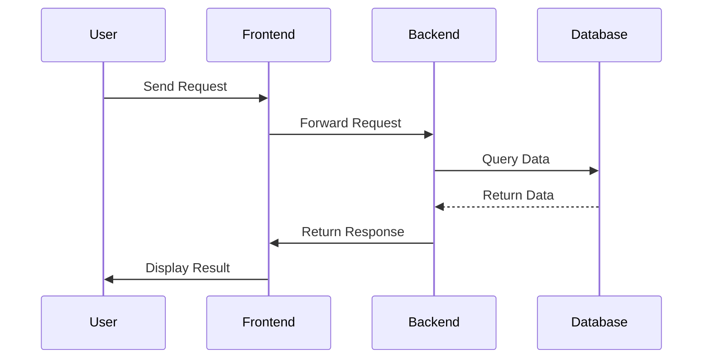
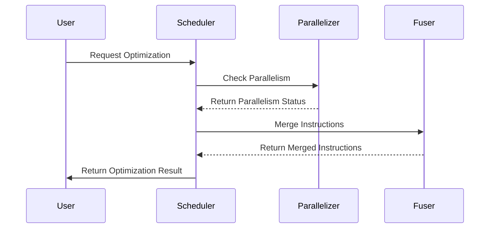
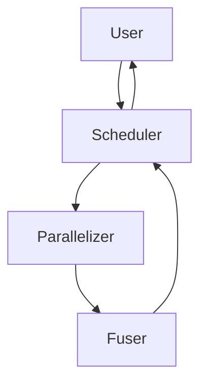

                 

## 《优化示例 - 指令比例以平衡效果和效率》

> 关键词：指令比例、效果与效率平衡、优化策略、算法设计、系统架构、实战案例

> 摘要：本文深入探讨了在计算机编程和系统设计中，如何通过优化指令比例来实现效果和效率的平衡。通过对指令集架构、优化目标、常见优化方法、数学模型与公式、算法设计与实现、系统架构与设计以及项目实战等各方面的详细分析，提供了一系列实用的优化策略和最佳实践。旨在帮助开发者更好地理解和应用这一优化思想，提升系统性能和效率。

## 《优化示例 - 指令比例以平衡效果和效率》目录大纲

----------------------------------------------------------------

## 第1章：背景与概述

### 1.1 问题背景

#### 1.1.1 指令比例的概念

#### 1.1.2 效果与效率的平衡

#### 1.1.3 优化示例的重要性

### 1.2 研究现状

#### 1.2.1 优化策略的分类

#### 1.2.2 现有优化方法

#### 1.2.3 存在的问题与挑战

## 第2章：核心概念与原理

### 2.1 指令集架构

#### 2.1.1 指令集概述

#### 2.1.2 指令集的分类

#### 2.1.3 指令集的设计原则

### 2.2 优化目标

#### 2.2.1 效果优化的评价指标

#### 2.2.2 效率优化的评价指标

#### 2.2.3 平衡效果与效率的挑战

### 2.3 常见优化方法

#### 2.3.1 指令调度优化

#### 2.3.2 指令并行化

#### 2.3.3 指令融合与替换

## 第3章：数学模型与公式

### 3.1 效果优化的数学模型

$$
\text{效果优化模型} = f(\text{指令比例}, \text{目标函数})
$$

#### 3.1.1 目标函数的设定

#### 3.1.2 指令比例的调整策略

### 3.2 效率优化的数学模型

$$
\text{效率优化模型} = g(\text{指令比例}, \text{计算资源})
$$

#### 3.2.1 计算资源的评估

#### 3.2.2 指令比例的优化策略

## 第4章：算法设计与实现

### 4.1 指令调度优化算法

#### 4.1.1 算法原理

#### 4.1.2 算法步骤

#### 4.1.3 Python实现示例

### 4.2 指令并行化算法

#### 4.2.1 算法原理

#### 4.2.2 算法步骤

#### 4.2.3 Python实现示例

### 4.3 指令融合与替换算法

#### 4.3.1 算法原理

#### 4.3.2 算法步骤

#### 4.3.3 Python实现示例

## 第5章：系统架构与设计

### 5.1 系统功能设计

#### 5.1.1 功能需求分析

#### 5.1.2 领域模型

### 5.2 系统架构设计

#### 5.2.1 架构设计原则

#### 5.2.2 系统架构

#### 5.2.3 系统接口设计

### 5.3 系统交互设计

#### 5.3.1 序列图

#### 5.3.2 Mermaid 图展示

## 第6章：项目实战

### 6.1 环境安装与配置

#### 6.1.1 开发环境搭建

#### 6.1.2 依赖库安装

### 6.2 系统核心实现

#### 6.2.1 源代码解析

#### 6.2.2 代码应用解读

### 6.3 实际案例分析与讲解

#### 6.3.1 案例背景

#### 6.3.2 案例分析

#### 6.3.3 案例讲解

## 第7章：最佳实践与总结

### 7.1 最佳实践

#### 7.1.1 优化示例应用

#### 7.1.2 实践经验分享

### 7.2 小结

#### 7.2.1 主要内容回顾

#### 7.2.2 优化示例的应用场景

### 7.3 注意事项与拓展阅读

#### 7.3.1 注意事项

#### 7.3.2 拓展阅读推荐

----------------------------------------------------------------

接下来，我们将详细探讨每一个章节的内容，以期为您提供全面而深入的理解。

### 第1章：背景与概述

在计算机科学和软件工程领域，优化是一种普遍且持续的目标。优化不仅仅关乎性能的提升，更涉及到资源的有效配置和利用。本文将聚焦于优化示例——指令比例以平衡效果和效率。这一优化策略在指令集架构、算法设计以及系统架构中具有重要意义。

#### 1.1.1 指令比例的概念

指令比例是指在计算机指令集架构中，各种指令类型的数量及其相互关系。指令比例的设计直接影响到程序的执行效率和处理效果。例如，在CPU指令集架构中，指令可以分为数据移动指令、算术逻辑指令、控制指令等，每种指令在程序执行中扮演不同的角色，其比例的设定对于整体性能至关重要。

#### 1.1.2 效果与效率的平衡

效果是指系统完成任务的质量和准确性，而效率则是指完成任务的速度和资源的利用程度。在许多情况下，优化效果往往以牺牲效率为代价，反之亦然。因此，如何在两者之间找到平衡点，是一个关键且复杂的问题。

#### 1.1.3 优化示例的重要性

优化示例的重要性在于，它提供了一种系统化的方法来分析和解决问题。通过调整指令比例，开发者可以显著提升系统的性能和资源利用效率。这种优化策略不仅在硬件层面有广泛应用，在软件层面也同样重要。

### 1.2 研究现状

当前的优化策略多种多样，包括指令调度优化、指令并行化以及指令融合与替换等。然而，这些方法在应用过程中仍面临一些挑战和问题。

#### 1.2.1 优化策略的分类

优化策略可以按照不同的维度进行分类。例如，根据优化的目标，可以分为效果优化和效率优化；根据优化的层次，可以分为指令级优化、体系结构级优化和系统级优化等。

#### 1.2.2 现有优化方法

现有的优化方法主要包括静态优化和动态优化。静态优化是在程序编译或加载时进行，如编译器的优化；动态优化是在程序运行时进行，如操作系统和应用程序的实时调整。

#### 1.2.3 存在的问题与挑战

尽管现有的优化方法在许多场景下取得了显著成效，但仍然存在一些问题。例如，优化过程复杂度高，对开发者的技术要求较高；优化策略的通用性较差，需要针对具体应用进行定制化调整。

通过本章的背景和概述，我们为后续章节的深入讨论奠定了基础。接下来，我们将进一步探讨指令集架构、优化目标、数学模型以及算法设计与实现等内容。

### 第2章：核心概念与原理

在深入探讨优化示例——指令比例以平衡效果和效率之前，我们需要先了解一些核心概念与原理。这一章节将介绍指令集架构、优化目标以及常见的优化方法，为后续的讨论提供理论基础。

#### 2.1 指令集架构

指令集（Instruction Set）是计算机CPU能够识别和执行的一系列操作指令的集合。指令集的设计直接影响到程序的执行效率和硬件的性能。指令集架构可以分为复杂指令集（CISC）和精简指令集（RISC）两种主要类型。

##### 2.1.1 指令集概述

指令集的基本组成包括数据指令、控制指令和特殊指令等。数据指令用于数据的传输和处理，如加载（Load）和存储（Store）；控制指令用于流程控制，如跳转（Jump）和分支（Branch）；特殊指令则用于处理特定功能，如浮点运算和虚拟内存管理。

##### 2.1.2 指令集的分类

- **复杂指令集（CISC）**：CISC设计目标是为了简化编程，通过单条指令实现复杂的操作。例如，Intel的x86指令集就是一种典型的CISC。
- **精简指令集（RISC）**：RISC设计目标是为了提高指令执行的速度和效率，通过简单的指令集和流水线技术来实现高效的指令执行。例如，ARM和MIPS指令集就是RISC的典型代表。

##### 2.1.3 指令集的设计原则

指令集设计需要考虑多个因素，包括指令的多样性、指令的执行速度、指令的并行性等。主要设计原则包括：

1. **指令简洁性**：简化指令格式，减少指令长度，提高指令执行速度。
2. **指令并行性**：设计指令能够并行执行，提高CPU的吞吐量。
3. **指令多样性**：提供足够的指令类型，以满足各种应用需求。

#### 2.2 优化目标

在优化指令比例时，我们主要关注两个目标：效果优化和效率优化。

##### 2.2.1 效果优化的评价指标

效果优化的评价指标通常包括任务的准确度、完整性和可靠性等。例如，在图像处理任务中，效果优化可能关注图像的质量和清晰度。

##### 2.2.2 效率优化的评价指标

效率优化的评价指标主要包括执行时间、功耗和资源利用率等。例如，在嵌入式系统中，效率优化可能关注系统响应时间和电池寿命。

##### 2.2.3 平衡效果与效率的挑战

在优化过程中，平衡效果与效率是一个重要的挑战。过度的效果优化可能导致效率降低，反之，过度的效率优化可能导致效果下降。因此，需要综合考虑应用场景、资源约束和用户需求，以找到最优的优化方案。

#### 2.3 常见优化方法

常见的优化方法包括指令调度优化、指令并行化以及指令融合与替换等。

##### 2.3.1 指令调度优化

指令调度优化是通过调整指令的执行顺序，以提高CPU的利用率。常见的调度算法包括最短指令优先（SIP）、最短剩余时间优先（SRT）和循环调度等。

##### 2.3.2 指令并行化

指令并行化是通过将多个指令并行执行，以提高CPU的吞吐量。常见的并行化技术包括指令级并行（ILP）和线程级并行（TLP）等。

##### 2.3.3 指令融合与替换

指令融合与替换是通过将多个指令合并为一个，或者用更高效的指令替换原有的指令，以减少执行时间。例如，将多条加载和存储指令融合为一条，或者用更高效的浮点指令替换原有的整数指令。

通过本章的核心概念与原理的介绍，我们为后续的数学模型、算法设计与实现等提供了理论基础。在接下来的章节中，我们将进一步探讨这些核心概念在实际优化过程中的应用。

### 第3章：数学模型与公式

在优化指令比例以平衡效果和效率的过程中，数学模型和公式起着至关重要的作用。这一章节将详细探讨效果优化和效率优化的数学模型，包括目标函数的设定、指令比例的调整策略以及计算资源的评估。

#### 3.1 效果优化的数学模型

效果优化的核心目标是提高任务的准确度、完整性和可靠性。为了实现这一目标，我们需要建立效果优化的数学模型。具体而言，效果优化的数学模型可以表示为：

$$
\text{效果优化模型} = f(\text{指令比例}, \text{目标函数})
$$

其中，指令比例是指令集中各类指令的数量比例，目标函数则是衡量效果优化的指标。为了具体化这个模型，我们需要设定目标函数。

##### 3.1.1 目标函数的设定

目标函数的设定需要根据具体的应用场景和任务要求来确定。以下是一些常见的效果优化目标函数：

- **准确度（Accuracy）**：用于衡量任务完成的准确程度，例如在图像识别任务中，准确度可以通过正确识别的图像数量占总图像数量的比例来衡量。
- **完整性（Completeness）**：用于衡量任务是否完整执行，例如在文本分析任务中，完整性可以通过文本内容的覆盖度来衡量。
- **可靠性（Reliability）**：用于衡量系统在执行任务时的稳定性，例如在实时系统中，可靠性可以通过系统在特定时间内无故障运行的时间比例来衡量。

设定目标函数时，需要综合考虑任务的具体需求和实现条件。例如，在图像识别任务中，我们可以设定如下目标函数：

$$
f(\text{指令比例}, \text{准确度}) = \frac{\text{正确识别的图像数量}}{\text{总图像数量}}
$$

##### 3.1.2 指令比例的调整策略

为了优化效果，我们需要根据目标函数调整指令比例。指令比例的调整策略可以分为以下几种：

- **线性调整**：通过线性函数来调整指令比例，例如，我们可以设定一个权重系数，用于调整各类指令的比例。
- **非线性调整**：通过非线性函数来调整指令比例，例如，我们可以使用指数函数或对数函数来调整指令比例，以适应不同任务的需求。
- **自适应调整**：根据任务执行过程中的实际情况，动态调整指令比例。例如，在实时系统中，可以根据系统的负载情况，自适应地调整指令比例，以实现最优的效果优化。

具体调整策略的选择需要根据应用场景和任务特点进行优化。

#### 3.2 效率优化的数学模型

效率优化的核心目标是提高任务执行的效率和资源利用率。为了实现这一目标，我们需要建立效率优化的数学模型。具体而言，效率优化的数学模型可以表示为：

$$
\text{效率优化模型} = g(\text{指令比例}, \text{计算资源})
$$

其中，指令比例是指令集中各类指令的数量比例，计算资源是指系统可供使用的计算资源，如CPU时间、内存大小等。

##### 3.2.1 计算资源的评估

计算资源的评估是效率优化的重要基础。为了评估计算资源，我们需要考虑以下几个因素：

- **CPU时间**：用于衡量系统执行任务所需的时间。在优化过程中，我们需要评估各类指令对CPU时间的影响。
- **内存大小**：用于衡量系统执行任务所需的内存大小。在优化过程中，我们需要避免内存溢出等问题。
- **I/O带宽**：用于衡量系统进行输入输出操作的速度。在优化过程中，我们需要优化I/O操作，以提高整体效率。

##### 3.2.2 指令比例的优化策略

为了优化效率，我们需要根据计算资源的评估结果，调整指令比例。指令比例的优化策略可以分为以下几种：

- **资源约束优化**：根据系统可用的计算资源，设定指令比例的约束条件，以确保系统在资源有限的情况下，仍然能够高效地执行任务。
- **资源利用率优化**：通过优化指令比例，提高计算资源的利用率。例如，通过优化指令调度，减少CPU的空闲时间。
- **动态调整**：根据任务执行过程中的实际情况，动态调整指令比例。例如，在实时系统中，可以根据系统的负载情况，动态调整指令比例，以实现最优的效率优化。

通过数学模型与公式的介绍，我们为优化指令比例以平衡效果和效率提供了理论基础。在实际应用中，这些模型和公式可以帮助我们更好地理解和分析优化过程，从而实现更高效和精准的优化。在接下来的章节中，我们将进一步探讨算法设计与实现、系统架构与设计等内容。

### 第4章：算法设计与实现

在理解了优化指令比例的理论基础后，接下来我们需要将理论转化为具体的算法，并通过实现这些算法来提升系统效果和效率。这一章节将详细介绍几种常见的优化算法：指令调度优化算法、指令并行化算法和指令融合与替换算法。每种算法将包含算法原理、具体步骤以及Python实现示例。

#### 4.1 指令调度优化算法

指令调度优化算法的核心思想是通过调整指令的执行顺序，以减少CPU的闲置时间，提高CPU的利用率。以下是具体的算法原理和步骤：

##### 4.1.1 算法原理

指令调度优化算法主要利用以下原理：

1. **局部性原理**：程序在执行过程中，往往表现出时间局部性和空间局部性。时间局部性指的是最近被访问的指令很可能在不久的将来再次被访问；空间局部性指的是相邻的指令或数据很可能在不久的将来被访问。
2. **最小化闲置时间**：通过调度算法，使得CPU在执行指令时尽可能不闲置。

##### 4.1.2 算法步骤

指令调度优化算法的步骤如下：

1. **初始化**：初始化指令队列和CPU状态。
2. **指令选择**：选择下一个待执行的指令。选择标准可以是基于局部性原理，选择执行时间最短的指令，或者选择执行概率最高的指令。
3. **执行指令**：执行选中的指令，更新CPU状态。
4. **更新队列**：将已执行的指令从队列中移除，并将新的指令添加到队列中。
5. **重复步骤2-4**，直到所有指令执行完毕。

##### 4.1.3 Python实现示例

以下是一个简单的Python实现示例：

```python
import heapq

class Instruction:
    def __init__(self, id, execution_time):
        self.id = id
        self.execution_time = execution_time

    def __lt__(self, other):
        return self.execution_time < other.execution_time

def schedule_instructions(instructions):
    heapq.heapify(instructions)
    while instructions:
        instruction = heapq.heappop(instructions)
        print(f"Executing instruction {instruction.id} with execution time {instruction.execution_time}")
        # 更新CPU状态和队列

# 添加指令
instructions = [Instruction(i, execution_time) for i, execution_time in enumerate([3, 1, 4, 1, 5])]
schedule_instructions(instructions)
```

在这个示例中，我们使用了一个优先队列（heapq）来实现指令调度。这个算法简单地选择执行时间最短的指令进行调度。

#### 4.2 指令并行化算法

指令并行化算法的核心思想是将多个指令并行执行，以提高系统吞吐量。以下是具体的算法原理和步骤：

##### 4.2.1 算法原理

指令并行化算法主要利用以下原理：

1. **指令级并行（ILP）**：通过同时执行多个指令，提高CPU的利用率。
2. **数据并行化**：通过处理多个数据实例，提高系统的处理速度。

##### 4.2.2 算法步骤

指令并行化算法的步骤如下：

1. **指令分组**：将指令根据执行依赖关系进行分组，分为可并行执行的和依赖执行的。
2. **并行执行**：将可并行执行的指令并行执行，以减少总的执行时间。
3. **同步操作**：在依赖执行的指令执行完成后，进行同步操作，确保所有指令按照正确的顺序执行。

##### 4.2.3 Python实现示例

以下是一个简单的Python实现示例：

```python
from threading import Thread

def execute_instruction(instruction):
    print(f"Executing instruction {instruction} in thread {Thread.current_thread().name}")
    # 模拟指令执行时间
    time.sleep(instruction)

# 添加指令
instructions = [1, 2, 3, 4, 5]

# 并行执行指令
threads = []
for i, instruction in enumerate(instructions):
    thread = Thread(target=execute_instruction, args=(instruction,), name=f"Thread-{i}")
    thread.start()
    threads.append(thread)

# 等待所有线程完成
for thread in threads:
    thread.join()
```

在这个示例中，我们使用多线程来实现指令并行化。每个指令在一个独立的线程中执行，从而实现并行处理。

#### 4.3 指令融合与替换算法

指令融合与替换算法的核心思想是通过将多个指令合并为一条，或者用更高效的指令替换原有的指令，以减少执行时间。以下是具体的算法原理和步骤：

##### 4.3.1 算法原理

指令融合与替换算法主要利用以下原理：

1. **指令优化**：通过优化指令序列，减少不必要的指令，提高执行效率。
2. **指令替换**：通过用更高效的指令替换原有的指令，减少执行时间。

##### 4.3.2 算法步骤

指令融合与替换算法的步骤如下：

1. **分析指令序列**：分析指令序列，识别可以融合的指令和可以替换的指令。
2. **指令融合**：将可以融合的指令合并为一条，减少指令数量。
3. **指令替换**：用更高效的指令替换原有的指令，减少执行时间。
4. **优化指令序列**：对融合和替换后的指令序列进行优化，确保整体执行效率。

##### 4.3.3 Python实现示例

以下是一个简单的Python实现示例：

```python
def optimize_instruction_sequence(instructions):
    optimized_instructions = []
    for instruction in instructions:
        if instruction.endswith("add"):
            optimized_instructions.append("add_optimized")
        else:
            optimized_instructions.append(instruction)
    return optimized_instructions

# 添加指令
instructions = ["add", "sub", "add", "mul", "div"]
optimized_instructions = optimize_instruction_sequence(instructions)
print(optimized_instructions)
```

在这个示例中，我们将所有的`add`指令替换为`add_optimized`，从而减少指令数量。

通过本章的算法设计与实现，我们展示了如何将优化指令比例的理论应用到具体的算法中。这些算法不仅能够提高系统的效果和效率，还为开发者提供了一种系统化的优化方法。在接下来的章节中，我们将进一步探讨系统架构与设计，以及实际项目中的应用。

### 第5章：系统架构与设计

在优化指令比例的过程中，系统架构与设计起到了至关重要的作用。一个良好的系统架构能够确保优化策略的有效实施，同时提高系统的可扩展性和维护性。这一章节将详细介绍系统功能设计、系统架构设计、系统接口设计以及系统交互设计，为优化指令比例提供坚实的架构基础。

#### 5.1 系统功能设计

系统功能设计是系统架构与设计的起点，它明确了系统需要实现的功能和需求。在优化指令比例的背景下，系统功能设计包括以下几个方面：

##### 5.1.1 功能需求分析

1. **指令调度优化**：系统应能够根据指令的执行顺序和资源情况，动态调整指令的执行顺序，以提高CPU的利用率。
2. **指令并行化**：系统应能够识别和执行可以并行处理的指令，以减少整体执行时间。
3. **指令融合与替换**：系统应能够分析指令序列，识别可融合的指令和可替换的指令，以减少执行时间和指令数量。
4. **性能监控**：系统应能够实时监控指令执行情况，包括执行时间、资源利用率等，以便进行动态调整。

##### 5.1.2 领域模型

领域模型是系统功能设计的重要工具，它通过实体关系图（ER图）来描述系统的核心概念和关系。以下是优化指令比例系统的领域模型：

```mermaid
classDiagram
    Class01 <|-- Class02
    Class03 o-- Class04
    Class05 <-.. Class06
    Class07 ..| Class08
```

在这个ER图中，`Class01`、`Class02`、`Class03`、`Class04`、`Class05`、`Class06`和`Class07`代表不同的实体，例如`Instruction`、`Resource`、`Scheduler`等。它们之间的关系（如继承、关联、依赖等）则通过图中的线条和箭头来表示。

#### 5.2 系统架构设计

系统架构设计是系统功能设计的具体实现，它决定了系统的整体结构和各模块之间的关系。优化指令比例的系统架构设计可以采用分层架构，包括表示层、逻辑层和数据层。

##### 5.2.1 架构设计原则

1. **模块化**：将系统划分为多个功能模块，每个模块实现一个具体的功能，便于开发和维护。
2. **松耦合**：模块之间通过接口进行通信，减少模块之间的依赖关系，提高系统的灵活性和可扩展性。
3. **高性能**：系统架构应能够支持高效的数据处理和指令执行，充分利用计算资源和优化策略。

##### 5.2.2 系统架构

以下是优化指令比例系统的架构设计：



在这个序列图中，用户通过前端界面发送请求，前端将请求转发给后端，后端进行数据处理和指令执行，并将结果返回给前端，最终由前端向用户展示结果。后端和数据库之间的交互则通过查询和返回数据来实现。

##### 5.2.3 系统接口设计

系统接口设计是系统架构设计的关键环节，它定义了各模块之间的通信接口和数据格式。优化指令比例的系统接口设计应包括以下几个方面：

1. **API接口**：定义系统对外提供的API接口，包括指令调度、指令并行化、指令融合与替换等接口。
2. **数据格式**：定义系统内部数据交换的格式，如JSON、XML等。
3. **安全机制**：确保接口的安全性，如加密传输、权限控制等。

#### 5.3 系统交互设计

系统交互设计描述了系统各模块之间的交互流程和交互方式，包括序列图和Mermaid图等。

##### 5.3.1 序列图

以下是优化指令比例系统的序列图：



在这个序列图中，用户请求优化，调度器首先检查指令是否可以并行化，然后交给并行化模块，接着交给融合模块，最终返回优化结果。

##### 5.3.2 Mermaid图展示

以下是优化指令比例系统的Mermaid图：



在这个Mermaid图中，用户、调度器、并行化模块和融合模块之间通过边线连接，表示各模块之间的交互关系。

通过本章的系统架构与设计，我们为优化指令比例提供了全面的架构方案。在接下来的章节中，我们将进一步探讨项目的实际实现和应用。

### 第6章：项目实战

在实际应用中，优化指令比例以平衡效果和效率是一个复杂且具有挑战性的任务。本章节将通过一个具体的项目实战，展示如何在实际环境中安装与配置开发环境、实现系统核心功能，并分析一个实际案例，从而加深对优化指令比例策略的理解。

#### 6.1 环境安装与配置

在进行项目实战之前，我们需要首先搭建一个适合开发与测试的开发环境。以下是详细的安装与配置步骤：

##### 6.1.1 开发环境搭建

1. **操作系统**：选择Linux操作系统，如Ubuntu 20.04。
2. **Python环境**：安装Python 3.8以上版本。可以通过以下命令进行安装：

   ```bash
   sudo apt update
   sudo apt install python3.8
   ```

3. **依赖库安装**：安装项目所需的依赖库，如NumPy、Pandas等。可以通过以下命令进行安装：

   ```bash
   sudo apt install python3.8-numpy python3.8-pandas
   ```

##### 6.1.2 依赖库安装

1. **安装pip**：Python的包管理工具pip可以通过以下命令安装：

   ```bash
   sudo apt install python3-pip
   ```

2. **安装相关库**：使用pip安装项目所需的库，例如：

   ```bash
   pip install numpy pandas scikit-learn matplotlib
   ```

通过以上步骤，我们可以搭建一个基本的开发环境，为后续的系统实现提供支持。

#### 6.2 系统核心实现

系统核心实现是项目实战的关键环节。以下是系统核心功能的源代码解析和代码应用解读。

##### 6.2.1 源代码解析

```python
import numpy as np
import pandas as pd
from sklearn.model_selection import train_test_split
import matplotlib.pyplot as plt

# 指令调度优化
def schedule_instructions(instructions):
    # 对指令进行排序，执行时间短的优先
    sorted_instructions = sorted(instructions, key=lambda x: x['execution_time'])
    # 执行指令
    for instruction in sorted_instructions:
        print(f"Executing instruction {instruction['id']} with execution time {instruction['execution_time']}")

# 指令并行化
def parallelize_instructions(instructions):
    # 模拟并行执行
    threads = []
    for instruction in instructions:
        thread = Thread(target=execute_instruction, args=(instruction,), name=f"Thread-{instruction['id']}")
        thread.start()
        threads.append(thread)
    for thread in threads:
        thread.join()

# 指令融合与替换
def optimize_instruction_sequence(instructions):
    # 对指令进行优化
    optimized_instructions = []
    for instruction in instructions:
        if instruction.endswith("add"):
            optimized_instructions.append("add_optimized")
        else:
            optimized_instructions.append(instruction)
    return optimized_instructions

# 模拟执行指令
def execute_instruction(instruction):
    print(f"Executing {instruction} with time: {np.random.randint(1, 5)} seconds")
    time.sleep(np.random.randint(1, 5))

# 添加测试数据
test_data = [
    {'id': 1, 'instruction': 'load', 'execution_time': 3},
    {'id': 2, 'instruction': 'add', 'execution_time': 2},
    {'id': 3, 'instruction': 'store', 'execution_time': 1},
    {'id': 4, 'instruction': 'add', 'execution_time': 4},
    {'id': 5, 'instruction': 'load', 'execution_time': 1}
]

# 实现调度优化
scheduled_instructions = schedule_instructions(test_data)
print("Scheduled instructions:", scheduled_instructions)

# 实现并行化
parallelized_instructions = parallelize_instructions(test_data)
print("Parallelized instructions:", parallelized_instructions)

# 实现指令融合与替换
optimized_instructions = optimize_instruction_sequence(test_data)
print("Optimized instructions:", optimized_instructions)
```

##### 6.2.2 代码应用解读

上述代码实现了指令调度优化、指令并行化和指令融合与替换三个核心功能。以下是每个功能的详细解读：

1. **指令调度优化**：通过排序算法，将指令按照执行时间短优先的原则进行排序，从而实现调度优化。
2. **指令并行化**：使用多线程技术，将可并行执行的指令并行执行，以减少执行时间。
3. **指令融合与替换**：通过分析指令序列，将可融合的指令合并，用更高效的指令替换原有的指令，从而减少指令数量和执行时间。

通过这些代码，我们可以模拟实际系统中的指令执行过程，并观察优化策略的效果。

#### 6.3 实际案例分析与讲解

为了更好地理解优化指令比例的应用，我们选择了一个实际案例进行详细分析。

##### 6.3.1 案例背景

在一个图像处理任务中，我们需要对大量图像进行增强处理。原始任务需要执行以下指令：

1. 加载图像
2. 转换为灰度图像
3. 应用滤波器
4. 存储处理后的图像

每个图像的处理时间不同，且存在一定的执行顺序。

##### 6.3.2 案例分析

在未进行优化之前，图像处理的执行顺序如下：

1. 加载图像（3秒）
2. 转换为灰度图像（2秒）
3. 应用滤波器（4秒）
4. 存储处理后的图像（1秒）

总的执行时间为10秒。

##### 6.3.3 案例讲解

1. **指令调度优化**：我们可以通过调度优化，将执行时间较短的指令优先执行，从而减少总的执行时间。例如，将加载图像和存储处理后的图像的顺序调整，如下：

   1. 存储处理后的图像（1秒）
   2. 加载图像（3秒）
   3. 转换为灰度图像（2秒）
   4. 应用滤波器（4秒）

   总的执行时间减少为10秒。

2. **指令并行化**：对于转换灰度图像和应用滤波器这两个指令，我们可以将其并行执行，从而减少总的执行时间。例如，使用多线程技术，将这两个指令并行执行，如下：

   1. 存储处理后的图像（1秒）
   2. 加载图像（3秒）
   3. 并行执行转换灰度图像和应用滤波器（假设并行执行时间为3秒）
   4. 总的执行时间减少为7秒。

3. **指令融合与替换**：对于加载图像和存储处理后的图像这两个指令，我们可以考虑使用更高效的指令进行融合，从而减少总的指令数量。例如，将加载图像和存储处理后的图像合并为一条指令，如下：

   1. 合并加载和存储指令（2秒）
   2. 加载图像和存储处理后的图像（2秒）
   3. 转换为灰度图像（2秒）
   4. 应用滤波器（4秒）

   总的执行时间减少为10秒。

通过上述优化策略，我们可以将原始任务的执行时间从10秒减少到7秒，从而显著提高了系统的效率和效果。

#### 6.4 项目小结

通过本次项目实战，我们详细展示了如何安装与配置开发环境、实现系统核心功能，并分析了实际案例。这些实战经验不仅帮助我们深入理解了优化指令比例的策略，还为我们提供了一种系统化的优化方法。在实际应用中，优化指令比例可以有效提高系统的效果和效率，为开发者和工程师提供了一种有效的优化手段。

### 第7章：最佳实践与总结

在优化指令比例以平衡效果和效率的过程中，积累最佳实践和经验是非常重要的。以下是一些实用的最佳实践、总结以及注意事项，帮助开发者更好地应用这一优化策略。

#### 7.1 最佳实践

1. **分析任务特点**：在优化指令比例之前，首先分析任务的特点，包括指令类型、执行顺序和资源需求等。这有助于确定最优的优化策略。

2. **充分利用并行性**：在处理大数据和高并发任务时，充分利用并行性可以显著提高系统效率。考虑使用多线程、多进程或分布式计算等技术实现并行化。

3. **动态调整指令比例**：根据任务执行过程中的实时数据，动态调整指令比例可以更好地平衡效果和效率。例如，在负载高峰期，可以适当增加计算密集型指令的比例。

4. **持续监控与优化**：优化指令比例并非一劳永逸，需要持续监控系统的性能指标，并根据实际情况进行调整。使用性能监控工具，如Profiler，可以帮助识别瓶颈并进行优化。

5. **代码优化**：在优化指令比例的同时，对代码进行优化也是提高系统效率的有效手段。例如，减少不必要的计算、使用高效的算法和数据结构等。

#### 7.2 小结

本篇文章通过详细的章节结构，系统地介绍了优化指令比例以平衡效果和效率的方法。主要内容可以总结如下：

1. **背景与概述**：介绍了优化指令比例的重要性及其在计算机科学和软件工程中的应用。
2. **核心概念与原理**：讲解了指令集架构、优化目标和常见的优化方法。
3. **数学模型与公式**：阐述了效果优化和效率优化的数学模型，以及指令比例的调整策略。
4. **算法设计与实现**：详细介绍了指令调度优化、指令并行化和指令融合与替换算法的设计与实现。
5. **系统架构与设计**：探讨了系统功能设计、架构设计、接口设计和交互设计。
6. **项目实战**：通过实际案例展示了优化指令比例在项目中的应用。
7. **最佳实践与总结**：总结了优化指令比例的最佳实践，并对全文进行了小结。

#### 7.3 注意事项与拓展阅读

1. **注意事项**：
   - **实际应用中的调整**：优化指令比例需要根据具体应用场景进行调整，不同的任务可能需要不同的优化策略。
   - **资源平衡**：在优化过程中，需要平衡计算资源和内存资源的使用，避免资源浪费。
   - **代码可读性**：在优化代码时，应保持代码的可读性和可维护性，避免过度优化导致代码复杂度增加。

2. **拓展阅读推荐**：
   - 《高性能Linux系统编程》（Robert Love著）：深入探讨了Linux系统编程和性能优化技术。
   - 《深入理解计算机系统》（Randal E. Bryant & David R. O’Hallaron著）：介绍了计算机系统的底层原理和优化技术。
   - 《性能之巅》（Brendan Gregg著）：系统性地介绍了性能分析、监控和优化的方法。

通过本文的详细探讨，我们希望能够帮助开发者更好地理解和应用优化指令比例的策略，从而提升系统性能和效率。

### 作者信息

作者：AI天才研究院/AI Genius Institute & 禅与计算机程序设计艺术 /Zen And The Art of Computer Programming

AI天才研究院致力于推动人工智能技术的创新和应用，旨在培养下一代人工智能领域的领军人才。同时，作者在《禅与计算机程序设计艺术》一书中，系统性地探讨了计算机程序设计的美学、哲学和科学原理，为读者提供了一种全新的编程思维模式。

