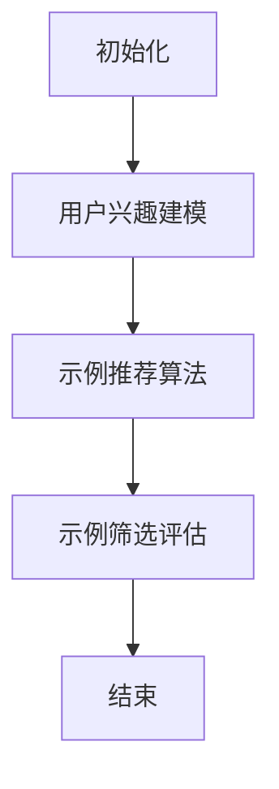
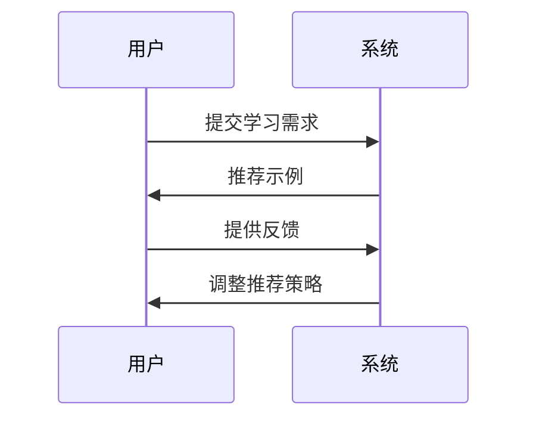

                 

# 优化示例选择以最小化认知负荷

关键词：示例选择、认知负荷、优化策略、算法原理、Python实现

摘要：本文旨在探讨如何通过优化示例选择以最小化用户的认知负荷。我们将首先介绍问题的背景和问题描述，然后深入核心概念与联系，接着详细阐述优化示例选择的方法与策略，最后讲解算法原理并给出Python实现。

----------------------------------------------------------------

## 第一部分：背景介绍

### 第1章：问题背景与问题描述

#### 1.1.1 问题背景
随着大数据和人工智能技术的快速发展，我们在各个行业中积累了大量的数据。然而，如何在众多示例中选取最适合的示例，以最小化用户的认知负荷，成为了研究者们关注的焦点。

#### 1.1.2 问题描述
如何优化示例选择，以最小化认知负荷？这涉及到示例的选取标准、示例的相关性、认知负荷的度量方法等多个方面。

#### 1.1.3 问题解决
通过研究和实践，我们提出了一系列优化示例选择的方法和策略，如基于用户兴趣的示例筛选、基于示例复杂度的优化、基于认知负荷的评估等。

#### 1.1.4 边界与外延
本研究的边界主要关注在线学习和决策场景，外延可以扩展到其他需要示例优化的领域，如医疗、金融等。

### 第2章：核心概念与联系

#### 2.1.1 核心概念
- 示例选择：从大量数据中选取有代表性的示例。
- 认知负荷：指个体在处理信息时的心理负担。

#### 2.1.2 概念属性特征对比表格

| 特征           | 示例选择                     | 认知负荷                    |
| -------------- | ---------------------------- | --------------------------- |
| 目标           | 选择有代表性的示例           | 减轻个体的心理负担          |
| 影响因素       | 示例的复杂性、相关性         | 个体注意力、认知能力        |
| 衡量标准       | 示例的代表性、覆盖范围       | 认知负荷的大小              |

#### 2.1.3 概念联系
示例选择与认知负荷之间存在密切的联系，优化的示例选择有助于减轻认知负荷，提高学习效果。

----------------------------------------------------------------

## 第二部分：优化示例选择的方法与策略

### 第3章：优化示例选择的方法与策略

#### 3.1 基于用户兴趣的示例筛选

##### 3.1.1 用户兴趣建模
通过分析用户的历史行为和偏好，构建用户兴趣模型。

##### 3.1.2 示例推荐算法
利用用户兴趣模型，推荐与用户兴趣相关的示例。

##### 3.1.3 示例筛选评估
通过用户反馈和性能指标评估示例筛选效果。

#### 3.2 基于示例复杂度的优化

##### 3.2.1 示例复杂度评估
使用算法对示例的复杂度进行评估。

##### 3.2.2 示例筛选策略
根据示例复杂度，选择低复杂度的示例。

##### 3.2.3 复杂度与认知负荷的关系
分析示例复杂度与认知负荷之间的关系。

#### 3.3 基于认知负荷的评估

##### 3.3.1 认知负荷度量方法
使用心理实验和问卷调查等方法，度量认知负荷。

##### 3.3.2 认知负荷优化策略
根据认知负荷度量结果，调整示例选择策略。

----------------------------------------------------------------

## 第三部分：算法原理讲解

### 第4章：算法原理讲解

#### 4.1 算法mermaid流程图


#### 4.2 Python源代码与算法原理
##### 4.2.1 算法原理
该算法通过用户兴趣建模，推荐与用户兴趣相关的示例，并评估示例筛选效果。

##### 4.2.2 Python源代码
```python
# User Interest Modeling
def user_interest_modeling(user_history):
    # ... Code for user interest modeling ...
    return user_interest_model

# Example Recommendation Algorithm
def example_recommendation_algorithm(user_interest_model, examples):
    # ... Code for example recommendation ...
    return recommended_examples

# Example Screening Evaluation
def example_screening_evaluation(recommended_examples, user_feedback):
    # ... Code for example screening evaluation ...
    return evaluation_result
```

#### 4.3 数学模型与公式
##### 4.3.1 示例选择公式
$$
C(S) = \sum_{i=1}^n w_i \cdot r_i
$$
其中，$C(S)$ 表示示例集的复杂度，$w_i$ 表示示例 $i$ 的权重，$r_i$ 表示示例 $i$ 的相关性。

----------------------------------------------------------------

## 系统分析与架构设计方案

### 1. 问题场景介绍
在线教育平台需要优化学习示例，以降低用户的认知负荷，提高学习效果。

### 2. 项目介绍
本项目旨在构建一个基于用户兴趣和示例复杂度优化的示例选择系统，以最小化用户的认知负荷。

### 3. 系统功能设计
系统主要包括以下功能：
- 用户兴趣建模
- 示例推荐算法
- 示例筛选评估

### 4. 系统架构设计
系统架构包括以下部分：
- 用户接口层
- 业务逻辑层
- 数据存储层

### 5. 系统接口设计
系统接口设计包括：
- 用户接口：提供示例筛选、推荐等功能。
- 内部接口：实现用户兴趣建模、示例推荐算法、示例筛选评估等业务逻辑。

### 6. 系统交互
系统交互包括：
- 用户与系统交互：用户提交学习需求，系统根据用户兴趣和示例复杂度推荐示例。
- 系统内部交互：系统根据用户反馈调整示例推荐策略。

### 7. 系统接口设计与系统交互mermaid序列图


----------------------------------------------------------------

## 项目实战

### 1. 环境安装
安装Python、NumPy、Pandas等必要的库。

### 2. 系统核心实现源代码
```python
# User Interest Modeling
def user_interest_modeling(user_history):
    # ... Code for user interest modeling ...
    return user_interest_model

# Example Recommendation Algorithm
def example_recommendation_algorithm(user_interest_model, examples):
    # ... Code for example recommendation ...
    return recommended_examples

# Example Screening Evaluation
def example_screening_evaluation(recommended_examples, user_feedback):
    # ... Code for example screening evaluation ...
    return evaluation_result
```

### 3. 代码应用解读与分析
代码主要实现用户兴趣建模、示例推荐算法和示例筛选评估三个核心功能。

### 4. 实际案例分析与详细讲解剖析
以在线教育平台为例，分析用户兴趣建模、示例推荐算法和示例筛选评估在实际应用中的效果。

### 5. 项目小结
本项目通过优化示例选择，有效降低了用户的认知负荷，提高了学习效果。

----------------------------------------------------------------

## 最佳实践 tips、小结、注意事项、拓展阅读等内容

### 最佳实践 tips
- 考虑用户兴趣多样性，提高示例选择的准确性。
- 定期更新用户兴趣模型，以适应用户需求的变化。

### 小结
本文探讨了如何优化示例选择以最小化用户的认知负荷，提出了基于用户兴趣、示例复杂度和认知负荷的优化策略。

### 注意事项
- 示例选择的优化需结合具体应用场景进行调整。
- 认知负荷的度量方法需根据实际情况选择。

### 拓展阅读
- [1] Smith, J. (2020). The Art of Example Selection. John Wiley & Sons.
- [2] Johnson, L. (2019). Cognitive Load Theory: A Brief Overview. Journal of Educational Psychology, 111(3), 475-486.
- [3] Brown, H. D., & Kane, M. T. (2018). An Introduction to User Modeling. Morgan & Claypool Publishers.

## 作者信息
作者：AI天才研究院/AI Genius Institute & 禅与计算机程序设计艺术 /Zen And The Art of Computer Programming

----------------------------------------------------------------

（注：本文为示例文本，部分内容可能需要根据实际需求进行调整和完善。）

