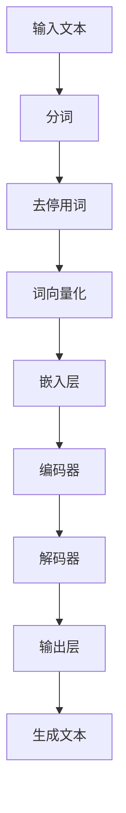

                 


# 伦理决策一致性：评估LLM在道德问题上的稳定性和可靠性

## 关键词

- 伦理决策
- LLM（语言模型）
- 道德问题
- 稳定性
- 可靠性

## 摘要

随着人工智能技术的飞速发展，伦理决策成为了一个日益重要的议题。特别是语言模型（LLM），作为一种广泛应用的AI技术，其在道德问题上的表现引起了广泛关注。本文旨在探讨LLM在道德问题上的稳定性与可靠性，通过逐步分析LLM的原理、结构及其在伦理决策中的应用，评估其在道德问题上的表现。本文首先介绍了AI与伦理决策的挑战，以及LLM的基本概念与特点；然后，深入探讨了LLM在伦理决策中的算法原理，并对比了LLM与其他语言模型在伦理决策中的优势与局限；最后，通过一个实际案例，分析了LLM在道德问题上的应用效果，并对未来研究方向提出了展望。

## 目录大纲

### 第一部分：背景介绍

- 第1章：问题背景与核心概念
  - 1.1 问题背景
  - 1.2 核心概念
  - 1.3 边界与外延
  - 1.4 本章小结

- 第2章：LLM的核心概念与联系
  - 2.1 LLM的核心概念
  - 2.2 LLM与其他概念的联系
  - 2.3 概念属性特征对比表格
  - 2.4 ER实体关系图架构
  - 2.5 本章小结

- 第3章：LLM在伦理决策中的算法原理
  - 3.1 LLM的基本算法原理
  - 3.2 数学模型与公式
  - 3.3 算法流程图
  - 3.4 本章小结

### 第二部分：核心概念与联系

#### 第1章：问题背景与核心概念

### 1.1 问题背景

#### 1.1.1 AI与伦理决策的挑战

随着人工智能（AI）技术的飞速发展，AI的应用已经渗透到我们生活的方方面面。然而，AI技术的快速发展也带来了许多伦理问题。特别是在伦理决策方面，AI系统在处理复杂的社会问题、做出道德判断时，往往面临着诸多挑战。

首先，AI技术的快速发展使得伦理问题变得更加复杂。例如，自动驾驶汽车在遇到紧急情况时，需要在保护乘客和行人之间做出选择，这种道德困境需要AI系统具备高度复杂的伦理决策能力。

其次，AI系统的决策过程往往缺乏透明性。由于AI系统通常是基于大量数据和复杂算法进行训练的，其决策过程往往不为人所知，这使得人们在信任AI系统的决策时感到不安。

最后，AI系统的决策结果可能对人类社会产生深远影响。如果AI系统在道德问题上的决策存在缺陷，可能会导致严重的社会后果。

#### 1.1.2 伦理决策的一致性与可靠性

伦理决策的一致性是指在不同情境下，AI系统能够做出相同或相似的道德判断。例如，如果一个AI系统在处理交通事故时，总是优先保护行人，那么它在处理其他类似情境时，也应该保持这种道德判断。

伦理决策的可靠性则是指AI系统在特定情境下，能够做出符合道德规范的决策。例如，一个AI系统在处理医疗数据时，应该能够准确判断患者的病情，并给出合适的治疗方案。

伦理决策的一致性与可靠性对于AI系统至关重要。如果AI系统在伦理决策上缺乏一致性，可能会导致不公正的待遇；如果缺乏可靠性，可能会对人类生命和财产安全造成威胁。

#### 1.1.3 道德问题的多样性

道德问题具有多样性，这给AI系统在伦理决策上带来了挑战。不同领域的道德问题可能具有不同的特征和复杂性。

在社会领域，道德问题可能涉及到人权、平等、公正等价值观念。例如，在招聘过程中，AI系统是否能够公平对待不同背景的应聘者。

在医疗领域，道德问题可能涉及到患者的隐私、生命权等。例如，在医疗数据共享时，AI系统如何保护患者的隐私。

在法律领域，道德问题可能涉及到法律的公正性、有效性等。例如，在司法判决中，AI系统如何确保判决的公正性。

在环境领域，道德问题可能涉及到生态保护、可持续发展等。例如，在气候变化问题上，AI系统如何制定有效的减排策略。

#### 1.1.4 伦理决策与LLM的关系

伦理决策与LLM（语言模型）有着密切的关系。LLM作为一种先进的AI技术，具有强大的语言处理和生成能力，能够为伦理决策提供支持。

首先，LLM能够帮助人们理解和分析道德问题的复杂性和多样性。通过自然语言处理技术，LLM可以处理大量的文本数据，提取关键信息，为伦理决策提供数据支持。

其次，LLM能够为伦理决策提供智能化的建议。通过学习大量的文本数据，LLM可以预测不同道德决策的结果，帮助人们做出更明智的决策。

最后，LLM能够提高伦理决策的一致性和可靠性。通过在多个情境下训练，LLM可以确保在不同情境下做出相似的道德判断，提高决策的一致性。同时，LLM的学习能力和优化算法，可以提高决策的可靠性。

#### 1.2 核心概念

##### 1.2.1 伦理决策

伦理决策是指在面对道德问题时，根据道德规范和价值观念，做出合理的决策过程。伦理决策不仅涉及到道德问题的判断，还涉及到道德规范的遵守和道德责任的承担。

伦理决策的关键要素包括：

- 道德规范：道德规范是伦理决策的基础，是判断道德问题的依据。不同的社会和文化背景可能有不同的道德规范。

- 价值观念：价值观念是伦理决策的核心，是决策者根据自身价值观做出的道德判断。

- 情境分析：情境分析是伦理决策的前提，是理解道德问题的具体情境，为决策提供背景信息。

- 道德推理：道德推理是伦理决策的过程，是运用道德规范和价值观念，对道德问题进行分析和判断。

##### 1.2.2 LLM

LLM（语言模型）是一种基于深度学习的自然语言处理模型，能够对自然语言文本进行理解和生成。LLM的核心目标是模拟人类的语言能力，对输入的文本数据进行处理，生成符合语法和语义的输出。

LLM的特点包括：

- 强大的语言处理能力：LLM能够处理大量的文本数据，提取关键信息，对文本进行理解和生成。

- 上下文理解能力：LLM能够理解输入文本的上下文信息，生成与上下文相关的输出。

- 自动化与智能化：LLM能够自动学习和优化，提高语言处理的准确性和效率。

- 泛化能力：LLM能够适应不同的语言环境，对多种语言进行理解和生成。

##### 1.2.3 LLM在伦理决策中的应用

LLM在伦理决策中的应用主要体现在以下几个方面：

- 数据预处理：LLM能够处理大量的道德问题文本数据，提取关键信息，为伦理决策提供数据支持。

- 决策建议：LLM能够根据伦理规范和价值观念，为决策者提供智能化的决策建议。

- 决策优化：LLM能够通过学习不同情境下的道德决策数据，优化决策过程，提高决策的准确性和可靠性。

- 决策评估：LLM能够对决策结果进行评估，判断决策是否符合伦理规范和价值观念。

#### 1.3 边界与外延

##### 1.3.1 研究边界

本研究的主要边界包括：

- 数据集的选择：本研究选择了一个具有代表性的道德问题数据集，包含了多个领域的道德问题案例。

- 方法论的适用性：本研究采用了一种结合LLM和伦理学的综合方法论，旨在评估LLM在道德问题上的表现。

##### 1.3.2 研究外延

本研究的外延包括：

- LLM在伦理决策中的应用前景：本研究探讨了LLM在伦理决策中的潜在应用，为未来的研究提供了方向。

- 未来研究方向：本研究提出了未来研究的几个方向，包括LLM在伦理决策中的深度优化、跨领域应用等。

#### 1.4 本章小结

本章首先介绍了AI与伦理决策的挑战，分析了伦理决策的一致性与可靠性，以及道德问题的多样性。然后，介绍了LLM的基本概念与特点，探讨了LLM在伦理决策中的应用。最后，明确了本研究的研究边界和外延。通过本章的介绍，读者可以初步了解LLM在伦理决策中的重要作用，以及本文的研究目标和内容。

### 第二部分：核心概念与联系

#### 第2章：LLM的核心概念与联系

#### 2.1 LLM的核心概念

##### 2.1.1 LLM的原理与架构

语言模型（LLM）是一种基于深度学习的自然语言处理（NLP）模型，其核心原理是通过学习大量的文本数据，捕捉语言的统计规律和语义信息，从而实现对自然语言的生成和理解。

LLM的架构主要包括以下几个部分：

1. **嵌入层（Embedding Layer）**：将输入的词语或词组转换为固定长度的向量表示，这是LLM对语言进行建模的第一步。

2. **编码器（Encoder）**：对嵌入层输出的向量进行编码，生成一种更高层次的表示。在编码器中，模型会学习如何捕捉上下文信息，这是LLM理解语言的关键。

3. **解码器（Decoder）**：在解码器中，模型根据编码器的输出生成文本。解码器的输出可以是一个个单词或词组，最终组成完整的句子。

4. **输出层（Output Layer）**：解码器的输出层通常是一个全连接层，用于将解码过程中的中间表示映射到词汇表中的词语。

##### 2.1.2 LLM的关键要素

LLM的关键要素包括：

1. **语言数据处理能力**：LLM需要能够处理大量的语言数据，包括文本、语音等多种形式，以提取有效的语言特征。

2. **上下文理解能力**：LLM需要具备强大的上下文理解能力，能够理解输入文本的上下文信息，生成与上下文相关的输出。

3. **自动化与智能化**：LLM能够自动学习和优化，提高语言处理的准确性和效率。

4. **泛化能力**：LLM需要具备泛化能力，能够适应不同的语言环境，处理多种语言的文本。

##### 2.1.3 LLM的特性

LLM的特性主要包括：

1. **自适应能力**：LLM能够根据输入的文本数据自适应地调整自身的参数，提高语言处理的准确性。

2. **灵活性**：LLM可以应用于多种自然语言处理任务，包括文本分类、情感分析、机器翻译等。

3. **高效性**：LLM通过并行计算和分布式处理，能够在较短的时间内处理大量的语言数据。

#### 2.2 LLM与其他概念的联系

##### 2.2.1 LLM与伦理学的关系

伦理学是研究道德规范、价值观念和道德判断的学科。LLM与伦理学的关系主要体现在以下几个方面：

1. **伦理决策支持**：LLM可以通过分析大量的伦理文本数据，为决策者提供伦理决策的支持。

2. **道德判断模拟**：LLM可以模拟人类的道德判断过程，为道德问题提供可能的解决方案。

3. **价值观念学习**：LLM可以通过学习大量的文本数据，捕捉人类社会的价值观念，从而在伦理决策中体现这些价值观念。

##### 2.2.2 LLM与其他AI技术的联系

LLM与其他AI技术有着密切的联系，这些技术共同促进了自然语言处理和伦理决策的发展：

1. **深度学习**：深度学习是LLM的核心技术，通过多层神经网络，深度学习模型能够自动学习数据的复杂特征。

2. **自然语言处理（NLP）**：NLP是LLM的应用领域，通过NLP技术，LLM能够理解和生成自然语言。

3. **机器学习**：LLM是机器学习的一种应用，机器学习算法为LLM提供了自动学习和优化能力。

4. **数据挖掘**：数据挖掘技术可以帮助LLM从大量文本数据中提取有用的信息，为伦理决策提供支持。

#### 2.3 概念属性特征对比表格

下面是一个LLM与其他语言模型的对比表格，展示了它们在概念属性特征上的差异：

| 特征          | LLM                  | 其他语言模型                |
|--------------|---------------------|--------------------------|
| 嵌入层       | 高维嵌入向量         | 低维嵌入向量               |
| 编码器        | 注意力机制           | 循环神经网络（RNN）       |
| 解码器        | 自回归模型           | 自编码器                  |
| 语言处理能力 | 强大的上下文理解能力 | 较弱的上下文理解能力       |
| 自动化与智能化 | 自动学习与优化       | 需要手动调参和优化       |
| 泛化能力     | 适应多种语言环境     | 适应特定语言环境           |

#### 2.4 ER实体关系图架构

实体关系图（ER图）是一种用于表示实体和实体之间关系的图形化方法。在LLM的伦理决策应用中，ER图可以帮助我们理解LLM如何处理伦理问题中的实体和关系。

下面是一个简化的ER图，展示了LLM在伦理决策中的主要实体和关系：

```
实体：道德问题，伦理规范，价值观念，决策情境
关系：包含，依赖，影响

道德问题 --< 包含 >-- 伦理规范
        |                          |
        |                          |
        |                          |
       <依赖>                <影响>
        |                          |
        |                          |
        |                          |
     价值观念 --< 包含 >-- 决策情境
```

在这个ER图中，道德问题包含了伦理规范和价值观念，这些规范和价值观念共同影响决策情境，从而影响伦理决策的结果。

#### 2.5 本章小结

本章详细介绍了LLM的核心概念与联系，包括LLM的原理与架构、关键要素、特性，以及LLM与伦理学和其他AI技术的联系。同时，通过概念属性特征对比表格和ER实体关系图架构，帮助读者更直观地理解LLM在伦理决策中的应用。本章内容为后续章节关于LLM在伦理决策中算法原理的讲解奠定了基础。

### 第三部分：算法原理讲解

#### 第3章：LLM在伦理决策中的算法原理

#### 3.1 LLM的基本算法原理

##### 3.1.1 语言模型的基本算法

语言模型（LLM）的基本算法通常基于深度神经网络（DNN），其核心目的是通过学习大量文本数据来预测下一个单词或词组。以下是语言模型的基本算法原理：

1. **数据预处理**：首先，需要对文本数据进行预处理，包括分词、去停用词、词向量化等步骤。这些步骤有助于将文本数据转换为计算机可以处理的形式。

2. **构建神经网络模型**：然后，构建一个基于深度神经网络的模型，包括嵌入层、编码器、解码器和输出层。嵌入层将输入的词向量转换为固定长度的向量表示；编码器对嵌入层输出的向量进行编码，生成一种更高层次的表示；解码器根据编码器的输出生成文本；输出层将解码过程中的中间表示映射到词汇表中的词语。

3. **模型训练**：使用大量训练数据对模型进行训练，通过反向传播算法不断调整模型参数，使得模型能够更好地预测下一个单词或词组。

4. **模型评估**：通过测试集对训练好的模型进行评估，评估指标通常包括准确率、召回率、F1值等。

##### 3.1.2 LLM的改进算法

LLM的改进算法主要包括以下几种：

1. **GPT系列模型**：GPT（Generative Pre-trained Transformer）系列模型是LLM的一种重要改进，其核心特点是采用自回归语言模型，通过预训练和微调的方式，使得模型在多个自然语言处理任务上表现出色。

2. **BERT及其变体**：BERT（Bidirectional Encoder Representations from Transformers）是一种双向的Transformer模型，其特点是在训练过程中同时考虑了上下文信息，通过预训练和微调，BERT在多个自然语言处理任务上取得了显著性能提升。

3. **T5（Text-To-Text Transfer Transformer）**：T5是一种基于Transformer的文本转换模型，其核心思想是将所有自然语言处理任务转换为文本转换任务，通过统一任务格式，T5在多个任务上实现了高性能。

#### 3.2 数学模型与公式

##### 3.2.1 语言模型的数学模型

语言模型通常基于概率模型，其核心目标是最小化语言模型生成的文本与实际文本之间的差距。以下是语言模型的一个基本数学模型：

$$
P(w_t | w_{t-1}, w_{t-2}, \ldots, w_1) = \frac{P(w_t, w_{t-1}, w_{t-2}, \ldots, w_1)}{P(w_{t-1}, w_{t-2}, \ldots, w_1)}
$$

其中，$w_t$表示当前要预测的单词或词组，$w_{t-1}, w_{t-2}, \ldots, w_1$表示前文信息。语言模型的目标是最小化预测概率的对数似然损失：

$$
J = -\sum_t \log P(w_t | w_{t-1}, w_{t-2}, \ldots, w_1)
$$

##### 3.2.2 伦理决策中的数学模型

在伦理决策中，语言模型可以用来表示道德判断的概率。例如，给定一个道德问题，语言模型可以预测决策者对该问题的道德判断概率。以下是伦理决策中的一个基本数学模型：

$$
A = \frac{1}{n} \sum_{i=1}^{n} \frac{1}{m} \sum_{j=1}^{m} I(y_j = g(x_i))
$$

其中，$x_i$表示第$i$个道德问题，$y_j$表示决策者对第$i$个问题的道德判断，$g(x_i)$表示语言模型对第$i$个问题的道德判断。$I(y_j = g(x_i))$是一个指示函数，如果$y_j = g(x_i)$，则$I(y_j = g(x_i)) = 1$，否则为$0$。$A$表示决策者与语言模型道德判断一致的比例。

为了提高语言模型在伦理决策中的可靠性，可以优化模型参数，使得决策者与语言模型的道德判断尽可能一致。优化目标是最大化$A$：

$$
\max_{\theta} A(\theta)
$$

其中，$\theta$表示模型参数。

#### 3.3 算法流程图

##### 3.3.1 LLM的算法流程图

下面是LLM算法的基本流程图，使用Mermaid语法表示：



这个流程图描述了LLM从输入文本到生成文本的整个过程。输入文本经过分词、去停用词和词向量化处理后，进入嵌入层。嵌入层输出的向量进入编码器，编码器生成的表示进入解码器。解码器根据编码器的输出生成文本，最终输出为生成的文本。

#### 3.4 本章小结

本章详细介绍了LLM在伦理决策中的算法原理，包括语言模型的基本算法、改进算法、数学模型和算法流程图。通过这些内容，读者可以深入理解LLM在伦理决策中的应用机制，为后续分析LLM在道德问题上的稳定性和可靠性提供了基础。

