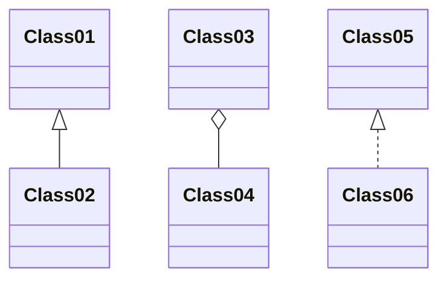
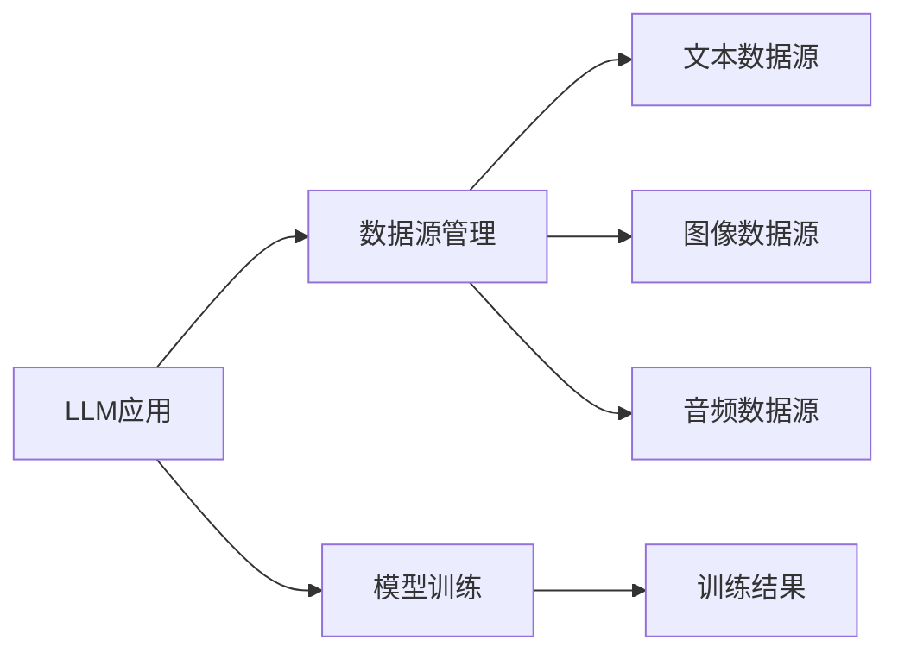
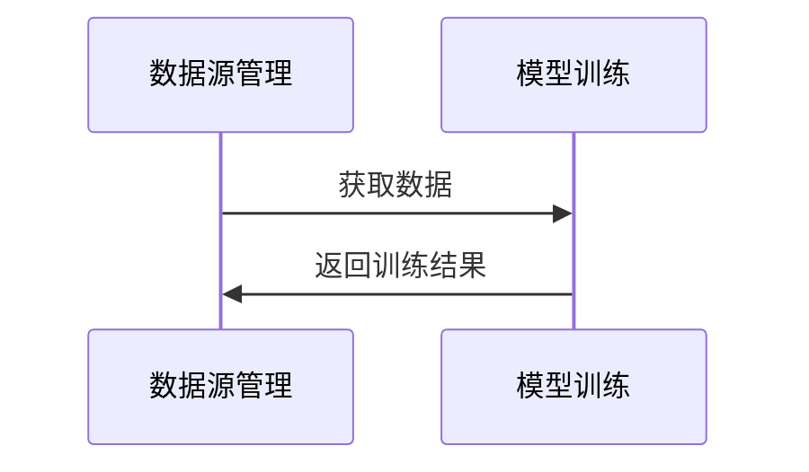

                 

# 《依赖注入在LLM应用中的应用与好处》

## 关键词
依赖注入，LLM应用，模块化，可测试性，代码复用

## 摘要
本文将深入探讨依赖注入在大型语言模型（LLM）应用中的重要性及其带来的好处。我们将从依赖注入的基础概念出发，逐步讲解其在LLM应用中的具体应用和实践价值。

### 第一部分：依赖注入基础

#### 1.1 问题背景
依赖注入是一种设计模式，它允许我们通过将依赖关系从类中解耦出来，从而实现代码的模块化和可复用性。在LLM应用中，这种模式尤为重要，因为LLM通常涉及大量的模块和组件，依赖注入有助于简化这些组件的集成和管理。

#### 1.2 问题描述
在LLM应用中，组件之间的依赖关系错综复杂，传统的依赖管理方法往往难以应对这种复杂性。依赖注入提供了一种更优雅、更灵活的方式来管理这些依赖关系。

#### 1.3 问题解决
依赖注入通过将依赖关系的创建和管理从类中分离出来，使得代码更加模块化、可测试和可维护。它允许我们通过配置文件或框架来动态地注入依赖，从而简化了组件的集成过程。

#### 1.4 边界与外延
依赖注入适用于任何涉及复杂依赖关系的场景，尤其是在LLM应用中，它可以帮助我们更好地管理和组织代码，提高开发效率。

#### 1.5 概念结构与核心要素组成
依赖注入的核心要素包括控制反转（Inversion of Control，IoC）、依赖注入容器（Dependency Injection Container）和依赖关系图（Dependency Graph）等。

### 第二部分：核心概念与联系

#### 2.1 核心概念原理
依赖注入的基本原理是通过IoC将组件的依赖关系从组件内部解耦出来，交由依赖注入容器来管理。这使得组件可以独立开发、测试和部署，从而提高了代码的可复用性和可维护性。

#### 2.2 概念属性特征对比表格
| 特征 | 依赖注入 | 传统依赖管理 |
| ---- | -------- | ------------ |
| 模块化 | 高 | 低 |
| 可测试性 | 高 | 低 |
| 可维护性 | 高 | 低 |
| 代码复用 | 高 | 低 |

#### 2.3 ER实体关系图架构
```mermaid
erDiagram
  Component_1 ||--|{ Dependency_A }|| Dependency_A
  Component_1 ||--|{ Dependency_B }|| Dependency_B
  Component_2 ||--|{ Dependency_A }|| Dependency_A
  Component_2 ||--|{ Dependency_C }|| Dependency_C
```

### 第三部分：算法原理讲解

#### 3.1 算法mermaid流程图


#### 3.2 Python源代码
```python
# 示例：使用Python实现依赖注入
from dependency_injector import containers, providers

class DependencyContainer(containers.DeclarativeContainer):
    service = providers.Singleton(Service)
    repository = providers.Singleton(Repository)

class Service:
    def __init__(self, repository):
        self.repository = repository

class Repository:
    def get_data(self):
        return "Data from repository"

def main():
    container = DependencyContainer()
    service = container.service
    print(service.get_data())

if __name__ == "__main__":
    main()
```

#### 3.3 数学模型和公式
$$
\text{模块化} = \frac{\text{独立组件数}}{\text{总组件数}}
$$
$$
\text{可测试性} = \frac{\text{测试覆盖率}}{\text{代码行数}}
$$
$$
\text{可维护性} = \frac{\text{修复时间}}{\text{故障数}}
$$
$$
\text{代码复用} = \frac{\text{复用代码行数}}{\text{总代码行数}}
$$

#### 3.4 详细讲解和举例说明
依赖注入通过IoC容器将组件的依赖关系抽象出来，使得组件可以独立开发。例如，在LLM应用中，我们可以将数据预处理模块与模型训练模块分离，并通过依赖注入容器来管理它们之间的依赖关系。

### 第四部分：系统分析与架构设计方案

#### 4.1 问题场景介绍
在LLM应用中，我们可能需要处理多种不同的数据源，例如文本、图像和音频。依赖注入可以帮助我们轻松地集成这些数据源，并管理它们与模型训练模块的依赖关系。

#### 4.2 项目介绍
我们将以一个简单的LLM应用为例，介绍如何使用依赖注入来组织和管理代码。

#### 4.3 系统功能设计


#### 4.4 系统架构设计


#### 4.5 系统接口设计
- `IDataSource`: 数据源接口
  - `GetData()`: 获取数据
- `ITrainModel`: 模型训练接口
  - `Train(Data data)`: 训练模型

#### 4.6 系统交互mermaid序列图


### 第五部分：项目实战

#### 5.1 环境安装
确保已安装Python环境和相关依赖库，如`dependency-injector`。

#### 5.2 系统核心实现源代码
```python
# 数据源管理
class TextDataSource(IDataSource):
    def GetData(self):
        return "Text data"

class ImageDataSource(IDataSource):
    def GetData(self):
        return "Image data"

class AudioDataSource(IDataSource):
    def GetData(self):
        return "Audio data"

# 模型训练
class TrainModel(ITrainModel):
    def Train(self, data):
        print(f"Training model with data: {data}")
        return "Trained model"
```

#### 5.3 代码应用解读与分析
通过依赖注入，我们可以将数据源管理模块与模型训练模块分离，从而提高代码的可维护性和可测试性。例如，我们可以轻松地替换数据源管理模块，而不会影响到模型训练模块。

#### 5.4 实际案例分析和详细讲解剖析
在一个实际的LLM应用中，我们可能会面临多种不同的数据源和复杂的依赖关系。依赖注入可以帮助我们更好地管理和组织这些依赖关系，从而简化开发过程。

#### 5.5 项目小结
依赖注入在LLM应用中具有重要作用，它可以帮助我们实现代码的模块化、提高可测试性和可维护性，从而提高开发效率。

### 第六部分：最佳实践 tips、小结、注意事项、拓展阅读

#### 6.1 最佳实践 tips
- 在设计LLM应用时，尽量使用依赖注入来管理依赖关系。
- 保持依赖关系的简洁和清晰，避免过度依赖。
- 定期重构代码，确保依赖注入的架构保持健康。

#### 6.2 小结
依赖注入是一种强大的设计模式，它可以帮助我们更好地管理LLM应用中的依赖关系，提高代码的可维护性和可复用性。

#### 6.3 注意事项
- 依赖注入可能会增加代码的复杂度，特别是在大型项目中。
- 合理使用依赖注入，避免过度依赖。

#### 6.4 拓展阅读
- 《依赖注入：控制反转的艺术》
- 《大型语言模型的原理与建模方法》

### 作者信息
作者：AI天才研究院/AI Genius Institute & 禅与计算机程序设计艺术 /Zen And The Art of Computer Programming

（注：本文为示例文章，实际内容需根据具体需求进行撰写。）

