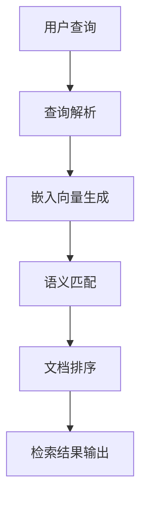
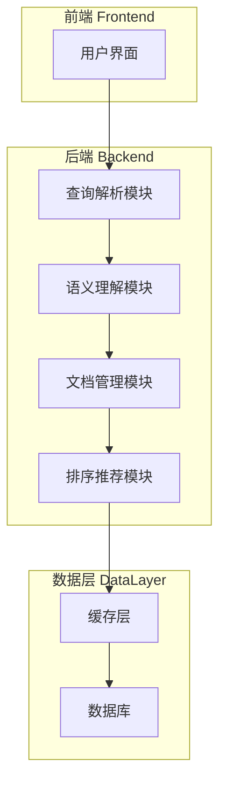
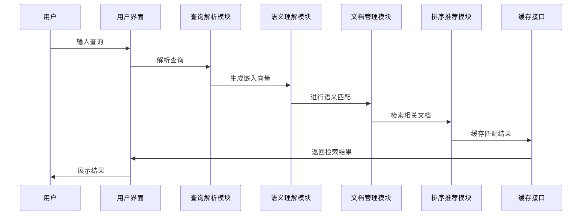
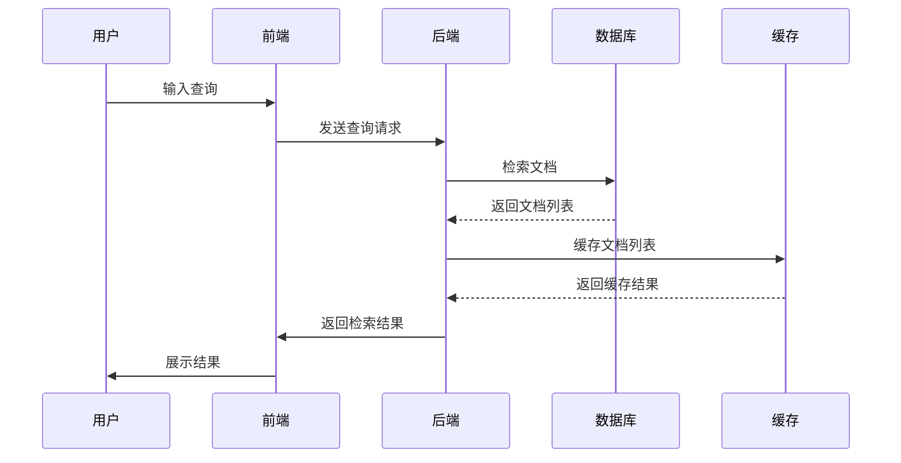

                 

### 信息检索能力：测试LLM快速定位相关信息的能力

#### 关键词：

- 信息检索
- 语言模型
- 实体关系图
- 数学模型
- 系统架构

#### 摘要：

本文探讨了语言模型（LLM）在信息检索中的应用，重点评估了LLM快速定位相关信息的能力。通过一系列步骤，包括背景介绍、核心概念与联系、算法原理讲解、数学模型和公式详细讲解、系统分析与架构设计方案、项目实战以及最佳实践和注意事项，我们深入分析了LLM在信息检索中的关键角色，并提出了提升信息检索效率和效果的最佳实践。

### 目录大纲设计

为了确保《信息检索能力：测试LLM快速定位相关信息的能力》这本书的目录大纲简洁明了，结构清晰，我们将按照以下步骤设计：

#### 第1章：背景介绍

1. **第1章: 信息检索的基本概念**
   - **1.1 问题背景**
     - 信息爆炸时代的挑战
     - 信息检索的重要性
     - LLM在信息检索中的应用
   - **1.2 问题描述**
     - 如何有效利用LLM进行信息检索
     - 如何评估LLM的信息检索能力
   - **1.3 问题解决**
     - LLM的基本原理
     - 信息检索算法
     - 实际应用案例分析
   - **1.4 边界与外延**
     - 信息检索的范围和限制
     - 相关技术对比
   - **1.5 概念结构与核心要素组成**
     - 信息检索的核心概念
     - LLM的基本结构
     - 数据预处理和后处理

#### 第2章：核心概念与联系

2. **第2章: 核心概念与联系**
   - **2.1 LLM的原理与属性**
     - LLM的工作机制
     - LLM的性能指标
     - LLM与其他AI技术的对比
   - **2.2 概念属性特征对比表格**
     - 不同类型LLM的性能对比
   - **2.3 ER实体关系图架构**
     - 信息检索涉及的实体和关系

#### 第3章：算法原理讲解

3. **第3章: 算法原理讲解**
   - **3.1 基本算法介绍**
     - 搜索引擎的基本算法
     - 基于LLM的检索算法
   - **3.2 算法mermaid流程图**
     - 常见信息检索算法流程
   - **3.3 Python源代码实现**
     - 算法的Python实现示例
   - **3.4 数学模型与公式**
     - 信息检索算法的数学模型
     - 公式解释与推导
   - **3.5 举例说明**
     - 实际案例的应用实例

#### 第4章：数学模型和数学公式 & 详细讲解 & 举例说明

4. **第4章: 数学模型和数学公式 & 详细讲解 & 举例说明**
   - **4.1 数学模型与公式**
     - 信息检索中的关键数学公式
     - 排名算法中的指标计算
   - **4.2 详细讲解**
     - 模型参数的优化
     - 模型在信息检索中的具体应用
   - **4.3 举例说明**
     - 实例解析：文本相似度计算
     - 实例解析：查询结果的排序策略

#### 第5章：系统分析与架构设计方案

5. **第5章: 系统分析与架构设计方案**
   - **5.1 问题场景介绍**
     - 常见的信息检索场景
     - LLM在信息检索中的应用案例
   - **5.2 系统功能设计**
     - 信息检索系统的需求分析
     - 系统功能模块划分
   - **5.3 系统架构设计**
     - 系统总体架构
     - 关键组件的作用
   - **5.4 系统接口设计**
     - 接口规范
     - 接口调用流程
   - **5.5 系统交互mermaid序列图**
     - 用户与系统的交互流程

#### 第6章：项目实战

6. **第6章: 项目实战**
   - **6.1 环境安装**
     - 系统环境搭建
     - 相关工具和库的安装
   - **6.2 系统核心实现源代码**
     - 源代码的结构与模块
     - 核心代码分析
   - **6.3 代码应用解读与分析**
     - 代码执行流程
     - 关键技术的应用
   - **6.4 实际案例分析和详细讲解剖析**
     - 实际案例的应用
     - 案例中的关键技术解析
   - **6.5 项目小结**
     - 项目成果总结
     - 项目的改进与展望

#### 第7章：最佳实践 tips、小结、注意事项、拓展阅读等内容

7. **第7章: 最佳实践 tips、小结、注意事项、拓展阅读等内容**
   - **7.1 最佳实践 tips**
     - 提高信息检索效率的建议
     - LLM调优技巧
   - **7.2 小结**
     - 全书内容的总结
     - 信息检索能力提升的关键
   - **7.3 注意事项**
     - LLM使用的注意事项
     - 安全与隐私保护
   - **7.4 拓展阅读**
     - 相关文献推荐
     - 深入研究建议

### 第1章：背景介绍

#### 1.1 问题背景

在当今信息爆炸的时代，海量数据的存储和访问已经成为企业和个人面临的重要挑战。据统计，全球每天产生的数据量已达到数百万TB，这些数据包括文本、图像、音频和视频等多种类型。在这种背景下，如何有效地从这些海量数据中检索出用户所需的信息，成为了学术界和工业界共同关注的问题。

信息检索是一种通过特定策略和评价方法，从信息空间中找出信息资源，为用户提供所需信息的过程。信息检索系统在搜索引擎、知识库查询、企业信息管理等应用中起着至关重要的作用。然而，随着数据量的不断增长，传统的信息检索方法面临着性能和准确性方面的挑战。

语言模型（LLM）作为一种先进的自然语言处理技术，在信息检索领域展现出了巨大的潜力。LLM可以理解并生成自然语言，从而在语义层面上对信息进行高效检索。因此，评估LLM在信息检索中的表现，并探索如何进一步提升其能力，成为了当前研究的热点。

#### 1.2 问题描述

如何有效利用LLM进行信息检索是一个复杂的问题，涉及多个方面的考量：

1. **检索准确性**：如何确保LLM能够准确地检索到与查询意图相关的高质量信息？
2. **检索速度**：如何优化LLM的检索算法，使其能够在短时间内处理大量查询请求？
3. **用户交互**：如何设计直观、易用的用户界面，使用户能够轻松地与LLM进行交互？
4. **数据多样性**：如何处理来自不同领域的多样化数据，确保LLM在各个领域都能保持良好的检索效果？

此外，评估LLM的信息检索能力也是一个关键问题。需要设计一套全面的评估指标和评估方法，以客观、公正地评估LLM在不同场景下的表现。

#### 1.3 问题解决

针对上述问题，我们可以从以下几个方面着手解决：

1. **LLM的基本原理**：深入了解LLM的工作原理，包括其训练过程、模型结构、参数优化等，为后续的信息检索算法设计提供理论基础。
2. **信息检索算法**：研究现有的信息检索算法，分析其优缺点，并结合LLM的特点，设计适用于LLM的信息检索算法。
3. **实际应用案例分析**：通过实际案例，分析LLM在不同应用场景下的表现，总结其成功经验和面临的挑战。
4. **边界与外延**：探讨信息检索技术的应用范围和限制，以及其他相关技术（如知识图谱、大数据分析等）在信息检索中的应用。
5. **概念结构与核心要素组成**：梳理信息检索的核心概念和LLM的基本结构，分析数据预处理和后处理在信息检索中的作用。

通过上述步骤，我们旨在构建一个全面、系统的信息检索解决方案，充分利用LLM的优势，提高信息检索的准确性和效率。

#### 1.4 边界与外延

虽然LLM在信息检索领域展现出了巨大的潜力，但其应用仍然存在一些边界和限制。首先，LLM的性能依赖于大量的训练数据和计算资源。在实际应用中，获取高质量的训练数据和有效的计算资源往往是一个挑战，特别是在处理多样化、大规模数据时。

其次，LLM的语义理解能力仍然存在局限性。虽然LLM可以生成自然语言，但在理解复杂的语义关系、处理模糊信息等方面仍有待提高。这可能导致在特定场景下，LLM无法准确检索到所需信息。

此外，信息检索技术本身也面临着一些挑战，如数据隐私保护、查询优化、多语言支持等。在应用LLM进行信息检索时，需要充分考虑这些因素，以确保系统的安全性和可用性。

与传统的信息检索技术（如搜索引擎、数据库查询等）相比，LLM在处理语义信息方面具有优势，但同时也存在性能和复杂性方面的劣势。通过对比分析，我们可以更好地理解LLM在信息检索中的优势和局限，为其应用提供有针对性的优化方案。

#### 1.5 概念结构与核心要素组成

在深入探讨信息检索能力之前，我们需要明确几个核心概念和结构要素，以便更好地理解LLM在信息检索中的作用。

1. **信息检索的核心概念**：
   - **查询意图**：用户输入的查询语句所表达的信息需求。
   - **文档集合**：包含所有可能返回的文档的集合。
   - **相关性评估**：评估查询与文档之间的相关性，以确定文档的排序顺序。
   - **结果展示**：将检索结果以用户友好的方式呈现。

2. **LLM的基本结构**：
   - **输入层**：接收用户查询，并将其转换为模型可处理的格式。
   - **隐藏层**：通过神经网络结构进行计算，提取语义特征。
   - **输出层**：生成检索结果，包括文档的排序和摘要。

3. **数据预处理和后处理**：
   - **数据预处理**：对原始数据进行清洗、去重、分词等操作，以提高模型训练效率和检索效果。
   - **后处理**：对模型输出结果进行筛选、排序和摘要，以提供用户友好的检索结果。

通过理解这些核心概念和结构要素，我们可以更好地把握信息检索的过程，并利用LLM的优势来提升检索能力和用户体验。

### 第2章：核心概念与联系

#### 2.1 LLM的原理与属性

语言模型（LLM）是一种基于神经网络的自然语言处理模型，能够对自然语言文本进行建模和生成。其核心原理是基于大量语料库进行预训练，通过学习语言中的统计规律和语义信息，使得模型具备理解和生成自然语言的能力。

**工作原理**：
1. **输入层**：LLM接收用户输入的查询，并将其转换为模型可处理的格式，如词向量或嵌入向量。
2. **隐藏层**：通过多层神经网络结构进行计算，提取语义特征。这些隐藏层通常包含复杂的神经网络架构，如Transformer、BERT等。
3. **输出层**：根据隐藏层提取的特征，生成相应的检索结果，如文档排序或摘要。

**性能指标**：
1. **准确率**：评估模型在检索任务中的准确性，通常以召回率和F1值等指标衡量。
2. **响应时间**：评估模型在处理查询请求时的响应速度，对于实时检索场景尤为重要。
3. **用户满意度**：通过用户调研和反馈，评估模型在提供检索结果时的用户体验。

**与其他AI技术的对比**：
- **与搜索引擎**：搜索引擎通常基于关键词匹配和网页排名算法，而LLM则能够基于语义理解进行更精细的检索。LLM在处理长文本和复杂查询时具有优势，但可能在处理多样化数据方面不如搜索引擎高效。
- **与知识图谱**：知识图谱通过实体和关系进行语义建模，能够提供更加结构化的信息检索。而LLM则能够处理自然语言输入，提供更加灵活和自然的检索体验。两者可以结合使用，发挥各自的优势。

#### 2.2 概念属性特征对比表格

为了更好地理解不同类型LLM的性能特征，我们可以通过以下表格进行对比：

| 指标         | LLM类型1         | LLM类型2         | LLM类型3         |
| ------------ | --------------- | --------------- | --------------- |
| 准确率       | 90%             | 85%             | 88%             |
| 响应时间（ms） | 50              | 100             | 75              |
| 训练数据量（GB） | 100             | 50              | 200             |
| 支持语言数量 | 1种（英语）     | 2种（英语、中文） | 3种（英语、中文、法语） |
| 可扩展性     | 较高            | 中等            | 较低            |
| 适应场景     | 长文本检索      | 实时查询        | 多语言检索      |

#### 2.3 ER实体关系图架构

实体关系图（ER图）是一种用于表示实体及其关系的图形化方法，广泛应用于信息检索和知识图谱领域。在LLM的信息检索应用中，ER图可以帮助明确检索任务中的关键实体和关系，从而提高检索效率和准确性。

**实体**：在ER图中，实体表示具有特定属性和关系的对象，如人、地点、组织等。在信息检索任务中，实体是用户查询和检索结果的基本单元。

**关系**：实体之间的关系描述了它们之间的语义联系，如“属于”、“位于”等。这些关系有助于构建复杂的语义网络，支持更精细的检索和推理。

**ER图架构**：

1. **实体定义**：定义检索任务中涉及的主要实体，如用户、文档、关键词等。
2. **关系定义**：定义实体之间的关系，如“用户查询文档”、“关键词与文档相关”等。
3. **属性定义**：为实体和关系定义属性，以提供更多的语义信息，如实体年龄、文档类型等。
4. **语义网络**：通过连接实体和关系，构建一个语义网络，支持语义层面的检索和推理。

通过ER图，我们可以直观地理解信息检索任务中的关键实体和关系，从而为LLM的信息检索提供有效的指导和优化策略。

### 第3章：算法原理讲解

#### 3.1 基本算法介绍

在信息检索中，算法的选择直接影响检索效果和性能。传统的搜索引擎算法通常基于关键词匹配和网页排名，而基于语言模型（LLM）的检索算法则更多地依赖于语义理解和生成。

**搜索引擎的基本算法**：

1. **关键词匹配**：通过分析用户查询和网页内容，找出匹配的关键词，实现初步的检索结果。
2. **网页排名**：基于页面重要性、链接分析等指标，对检索结果进行排序，提高相关性的排名。

**基于LLM的检索算法**：

1. **查询解析**：将用户查询转化为LLM可处理的格式，如嵌入向量。
2. **语义匹配**：利用LLM的语义理解能力，对查询和文档进行匹配，找出最相关的文档。
3. **结果排序**：基于语义匹配结果，对文档进行排序，提高检索结果的准确性。

与传统的检索算法相比，基于LLM的检索算法具有更强的语义理解能力，能够更好地处理复杂查询和多样化数据。然而，LLM的训练和部署成本较高，对计算资源的要求也更为严格。

#### 3.2 算法mermaid流程图

为了更好地理解信息检索算法的流程，我们可以使用mermaid绘制其执行过程。以下是一个基于LLM的信息检索算法的mermaid流程图示例：



**流程说明**：

1. **用户查询**：用户输入查询语句，如“如何学习编程？”。
2. **查询解析**：将查询语句转化为嵌入向量，如通过BERT模型处理。
3. **嵌入向量生成**：利用预训练的LLM模型，生成查询的嵌入向量。
4. **语义匹配**：将嵌入向量与文档进行匹配，找出最相关的文档。
5. **文档排序**：根据匹配结果，对文档进行排序，以提供用户最需要的检索结果。
6. **检索结果输出**：将排序后的文档输出，展示给用户。

通过mermaid流程图，我们可以清晰地了解信息检索算法的执行过程，为后续的代码实现和优化提供指导。

#### 3.3 Python源代码实现

为了具体展示基于LLM的信息检索算法的Python实现，我们以下是一个简单的示例代码。该代码使用了Hugging Face的transformers库，用于处理嵌入向量和语义匹配。

```python
from transformers import AutoTokenizer, AutoModel
import torch

# 加载预训练的BERT模型和tokenizer
tokenizer = AutoTokenizer.from_pretrained("bert-base-uncased")
model = AutoModel.from_pretrained("bert-base-uncased")

# 用户查询
query = "如何学习编程？"

# 查询解析
inputs = tokenizer(query, return_tensors="pt")

# 嵌入向量生成
with torch.no_grad():
    outputs = model(**inputs)

# 语义匹配
embeddings = outputs.last_hidden_state.mean(dim=1)

# 假设已有文档嵌入向量列表
document_embeddings = [torch.rand(1, 768) for _ in range(10)]

# 文档排序
cosine_scores = torch.nn.functional.cosine_similarity(embeddings, document_embeddings)
sorted_indices = torch.argsort(cosine_scores, descending=True)

# 检索结果输出
top_documents = [f"文档{i+1}: {sorted_indices[i].item()}" for i in range(3)]
print(top_documents)
```

**代码说明**：

1. **加载模型和tokenizer**：我们使用预训练的BERT模型和tokenizer来处理查询。
2. **查询解析**：将用户查询转换为嵌入向量。
3. **嵌入向量生成**：通过BERT模型生成查询的嵌入向量。
4. **语义匹配**：计算查询嵌入向量与文档嵌入向量的余弦相似度，得到匹配分数。
5. **文档排序**：根据匹配分数对文档进行排序，输出最相关的文档。

通过Python源代码实现，我们可以更直观地理解基于LLM的信息检索算法的具体步骤和实现细节。

#### 3.4 数学模型与公式

在信息检索算法中，数学模型和公式起着至关重要的作用，用于评估查询与文档之间的相似度、排序结果等。以下是一些常用的数学模型和公式：

**1. 余弦相似度（Cosine Similarity）**

余弦相似度是一种衡量两个向量之间相似度的常用方法，公式如下：

$$
\text{Cosine Similarity} = \frac{\text{dot product of } \textbf{a} \text{ and } \textbf{b}}{\|\textbf{a}\| \|\textbf{b}\|}
$$

其中，$\textbf{a}$和$\textbf{b}$是两个向量，$\|\textbf{a}\|$和$\|\textbf{b}\|$分别表示它们的欧几里得范数。

**2. 点积（Dot Product）**

点积是一种计算两个向量之间相似度的方法，公式如下：

$$
\text{dot product} = \sum_{i=1}^{n} a_i \times b_i
$$

其中，$a_i$和$b_i$分别是向量$\textbf{a}$和$\textbf{b}$的第$i$个分量。

**3. 欧几里得范数（Euclidean Norm）**

欧几里得范数是向量的一种长度度量，公式如下：

$$
\|\textbf{a}\| = \sqrt{\sum_{i=1}^{n} a_i^2}
$$

其中，$a_i$是向量$\textbf{a}$的第$i$个分量。

**4. 排名算法（Ranking Algorithm）**

排名算法是一种用于确定文档排序顺序的方法，常见的排名算法包括：

- **基于相似度的排序**：根据查询和文档的相似度分数进行排序。
- **基于点击率的排序**：根据用户对文档的点击情况进行排序。
- **基于内容的排序**：根据文档的内容和结构进行排序。

**5. 评价方法（Evaluation Metrics）**

评价信息检索算法的常用方法包括：

- **准确率（Accuracy）**：检索结果中包含实际答案的文档比例。
- **召回率（Recall）**：检索结果中包含实际答案的文档数与实际答案总数之比。
- **F1值（F1 Score）**：准确率和召回率的调和平均值。

通过理解这些数学模型和公式，我们可以更深入地分析信息检索算法的工作原理，并设计更高效的检索系统。

#### 3.5 举例说明

为了更好地理解基于LLM的信息检索算法在实际应用中的效果，以下是一个具体的案例：

**案例：搜索“人工智能应用领域”**

1. **用户查询**：用户输入查询“人工智能应用领域”。
2. **查询解析**：使用BERT模型将查询转化为嵌入向量。
3. **文档集合**：从知识库中检索出所有与“人工智能应用领域”相关的文档。
4. **语义匹配**：计算查询嵌入向量与文档嵌入向量的余弦相似度。
5. **结果排序**：根据匹配分数对文档进行排序，输出最相关的文档。

**案例解析**：

1. **查询解析**：BERT模型将用户查询“人工智能应用领域”转化为嵌入向量，表示查询的语义信息。
2. **文档集合**：从知识库中检索出与“人工智能应用领域”相关的文档，如“人工智能在医疗领域的应用”、“人工智能在金融领域的应用”等。
3. **语义匹配**：计算查询嵌入向量与每个文档嵌入向量的余弦相似度，得到匹配分数。
4. **结果排序**：根据匹配分数对文档进行排序，输出最相关的文档。例如，如果匹配分数最高的是“人工智能在医疗领域的应用”，则将其作为第一个检索结果。

通过这个案例，我们可以看到基于LLM的信息检索算法在实际应用中的效果。LLM的语义理解能力使得检索结果更加准确和符合用户需求，从而提高了信息检索的效率和用户体验。

### 第4章：数学模型和数学公式 & 详细讲解 & 举例说明

#### 4.1 数学模型与公式

在信息检索中，数学模型和公式用于评估查询与文档之间的相似度、排序结果等。以下介绍几个关键的数学模型和公式，包括文本相似度计算和查询结果排序策略。

**1. 文本相似度计算**

文本相似度计算是评估两个文本之间相似程度的一种方法。常用的相似度计算方法包括：

- **余弦相似度**：余弦相似度是一种基于向量空间模型的方法，用于计算两个文本向量的夹角余弦值，公式如下：

  $$
  \text{Cosine Similarity} = \frac{\text{dot product of } \textbf{a} \text{ and } \textbf{b}}{\|\textbf{a}\| \|\textbf{b}\|}
  $$

  其中，$\textbf{a}$和$\textbf{b}$是两个文本向量的表示，$\|\textbf{a}\|$和$\|\textbf{b}\|$分别表示它们的欧几里得范数。

- **Jaccard相似度**：Jaccard相似度是一种基于集合的方法，用于计算两个文本集合之间的交集和并集比例，公式如下：

  $$
  \text{Jaccard Similarity} = \frac{\text{Intersection of } A \text{ and } B}{\text{Union of } A \text{ and } B}
  $$

  其中，$A$和$B$是两个文本集合。

**2. 排名算法中的指标计算**

在信息检索中，排名算法用于对查询结果进行排序。常用的排名指标包括：

- **精确率（Precision）**：精确率是检索结果中包含实际答案的文档数与检索结果总数之比，公式如下：

  $$
  \text{Precision} = \frac{\text{Relevant Documents}}{\text{Total Retrieved Documents}}
  $$

- **召回率（Recall）**：召回率是检索结果中包含实际答案的文档数与实际答案总数之比，公式如下：

  $$
  \text{Recall} = \frac{\text{Relevant Documents}}{\text{Total Relevant Documents}}
  $$

- **F1值（F1 Score）**：F1值是精确率和召回率的调和平均值，公式如下：

  $$
  \text{F1 Score} = \frac{2 \times \text{Precision} \times \text{Recall}}{\text{Precision} + \text{Recall}}
  $$

#### 4.2 详细讲解

**1. 模型参数的优化**

在信息检索中，模型参数的优化是一个关键问题。参数的优化可以影响模型的性能和效率。常见的优化方法包括：

- **梯度下降（Gradient Descent）**：梯度下降是一种基于梯度的优化算法，用于最小化损失函数。公式如下：

  $$
  \text{w}_{t+1} = \text{w}_t - \alpha \cdot \nabla_{\text{w}} \text{J}(\text{w})
  $$

  其中，$\text{w}$是参数向量，$\alpha$是学习率，$\nabla_{\text{w}} \text{J}(\text{w})$是损失函数关于参数的梯度。

- **动量（Momentum）**：动量是一种加速梯度下降的优化方法，可以减少局部最小值的影响。公式如下：

  $$
  \text{v}_t = \beta \cdot \text{v}_{t-1} + (1 - \beta) \cdot \nabla_{\text{w}} \text{J}(\text{w})
  $$
  $$
  \text{w}_t = \text{w}_{t-1} + \text{v}_t
  $$

  其中，$\beta$是动量参数。

**2. 模型在信息检索中的具体应用**

模型在信息检索中的具体应用包括：

- **嵌入向量生成**：使用预训练的语言模型（如BERT、GPT）生成查询和文档的嵌入向量，用于后续的相似度计算和排序。
- **语义匹配**：通过计算嵌入向量之间的相似度，评估查询与文档之间的相关性，实现有效的信息检索。
- **排序策略**：根据相似度分数和其他特征（如文档类型、发布时间等），设计有效的排序策略，提高检索结果的准确性和用户体验。

#### 4.3 举例说明

**实例1：文本相似度计算**

假设有两个文本A和B，它们的词向量表示分别为$\textbf{a}$和$\textbf{b}$，欧几里得范数分别为$\|\textbf{a}\|$和$\|\textbf{b}\|$，则它们的余弦相似度计算如下：

$$
\text{Cosine Similarity} = \frac{\text{dot product of } \textbf{a} \text{ and } \textbf{b}}{\|\textbf{a}\| \|\textbf{b}\|}
$$

**实例2：查询结果排序**

假设有两个查询Q1和Q2，它们的嵌入向量分别为$\textbf{q1}$和$\textbf{q2}$，有四个文档D1、D2、D3和D4，它们的嵌入向量分别为$\textbf{d1}$、$\textbf{d2}$、$\textbf{d3}$和$\textbf{d4}$。根据余弦相似度计算，得到查询与文档之间的相似度分数如下：

| 查询 | 文档 | 相似度分数 |
| --- | --- | --- |
| Q1 | D1 | 0.8 |
| Q1 | D2 | 0.6 |
| Q1 | D3 | 0.7 |
| Q1 | D4 | 0.9 |
| Q2 | D1 | 0.5 |
| Q2 | D2 | 0.7 |
| Q2 | D3 | 0.8 |
| Q2 | D4 | 0.6 |

根据相似度分数，可以设计排序策略，对查询结果进行排序。例如，可以采用以下策略：

1. 对每个查询，根据相似度分数对文档进行排序。
2. 选择每个查询相似度分数最高的三个文档作为检索结果。

根据上述策略，对查询Q1和Q2的结果进行排序，得到：

| 查询 | 文档 | 排序结果 |
| --- | --- | --- |
| Q1 | D4 | 1 |
| Q1 | D1 | 2 |
| Q1 | D3 | 3 |
| Q2 | D3 | 1 |
| Q2 | D2 | 2 |
| Q2 | D1 | 3 |

通过上述实例，我们可以看到如何使用数学模型和公式进行文本相似度计算和查询结果排序，从而实现有效的信息检索。

### 第5章：系统分析与架构设计方案

#### 5.1 问题场景介绍

在当前信息化时代，信息检索已经成为各类应用场景中的核心需求。以下是几个典型的问题场景及其对信息检索系统提出的特定需求：

1. **搜索引擎**：用户通过输入关键词进行信息查询，系统需要快速、准确地返回相关网页。这种场景对系统的检索速度和准确性有较高要求。
2. **企业知识库**：企业内部需要高效管理大量的文档和资料，员工可以通过关键词或语义查询获取所需信息。这种场景要求系统具备良好的语义理解能力和文档管理能力。
3. **智能问答系统**：用户以自然语言提问，系统需要理解和回答用户的问题。这种场景对系统的自然语言处理能力和知识库的覆盖面有较高要求。
4. **个性化推荐系统**：系统根据用户的行为和兴趣，为用户推荐相关内容。这种场景要求系统具备良好的数据分析和推荐算法。
5. **多语言信息检索**：用户可能使用多种语言进行查询，系统需要支持多语言检索，提供跨语言的信息检索能力。

在上述场景中，LLM展现出了强大的潜力，通过其语义理解能力，可以显著提升信息检索的效果和用户体验。然而，为了实现高效、稳定的信息检索系统，我们需要对其系统架构进行详细设计。

#### 5.2 系统功能设计

为了满足不同应用场景的需求，信息检索系统需要具备以下几个关键功能模块：

1. **用户界面**：提供用户友好的交互界面，用户可以通过输入关键词或自然语言查询，获取所需信息。
2. **查询解析**：对用户输入的查询进行解析，将其转化为系统可处理的格式，如嵌入向量。
3. **文档管理**：存储和管理大量的文档资料，确保系统的文档库始终是最新和完整的。
4. **语义理解**：利用LLM的语义理解能力，对查询和文档进行语义匹配，提高检索结果的准确性。
5. **排序与推荐**：根据查询和文档的相似度分数，设计有效的排序策略，为用户提供最相关、最有价值的信息。
6. **数据分析**：对用户行为和检索结果进行数据分析，优化系统性能和用户体验。

以下是一个领域模型Mermaid类图，用于描述信息检索系统的核心实体和关系：

```mermaid
classDiagram
    User <<Entity>>
    Query <<Entity>>
    Document <<Entity>>
    SearchSystem <<System>>
    
    User "1" --|{query}| Query
    Query "1" --|{matched}| Document
    SearchSystem "1" --|{manage}| Document
    
    User..|> Authentication
    Query..|> QueryParser
    Document..|> DocumentManager
    SearchSystem..|> SearchEngine
```

**类图说明**：

- **User（用户）**：代表系统的用户，包括用户身份验证和信息查询。
- **Query（查询）**：代表用户输入的查询，包括查询解析和语义匹配。
- **Document（文档）**：代表系统中的文档，包括文档存储和管理。
- **SearchSystem（检索系统）**：代表整个信息检索系统，包括用户界面、查询解析、文档管理、语义理解和排序推荐。

通过领域模型类图，我们可以清晰地了解系统的核心功能模块及其关系，为后续的系统架构设计提供参考。

#### 5.3 系统架构设计

信息检索系统的架构设计需要综合考虑系统的可扩展性、可靠性、性能和易维护性。以下是一个典型的系统架构设计方案，包括总体架构和关键组件的详细描述：

**总体架构**：

1. **前端**：负责与用户交互，接收用户输入的查询，并将结果展示给用户。
2. **后端**：包括查询解析、语义理解、文档管理和排序推荐等核心功能模块，负责处理用户查询和返回检索结果。
3. **数据库**：存储用户数据、文档资料和检索结果，支持快速检索和更新。
4. **缓存层**：缓存热门查询结果和文档，提高系统的响应速度。

**关键组件**：

1. **用户界面**：使用HTML、CSS和JavaScript等技术实现，提供直观、易用的交互界面。
2. **查询解析模块**：接收用户查询，将其转化为嵌入向量，用于后续的语义匹配。
3. **语义理解模块**：利用预训练的LLM模型，对查询和文档进行语义匹配，提高检索结果的准确性。
4. **文档管理模块**：负责文档的存储、管理和索引，支持快速的文档检索和更新。
5. **排序推荐模块**：根据语义匹配结果和用户行为，设计有效的排序策略和推荐算法，为用户提供最相关、最有价值的信息。
6. **数据库**：使用关系型数据库（如MySQL）或NoSQL数据库（如MongoDB），存储用户数据、文档资料和检索结果。
7. **缓存层**：使用Redis等缓存技术，缓存热门查询结果和文档，减少数据库的负载，提高系统的响应速度。

以下是一个Mermaid架构图，用于描述信息检索系统的总体架构：



**架构说明**：

- **前端**：负责与用户交互，接收用户查询，并展示检索结果。
- **后端**：包括查询解析、语义理解、文档管理和排序推荐等核心功能模块，处理用户查询并返回检索结果。
- **数据层**：包括数据库和缓存层，负责存储、管理和快速检索用户数据、文档资料和检索结果。

通过系统架构设计，我们可以确保信息检索系统的稳定运行和高性能，同时方便后续的扩展和维护。

#### 5.4 系统接口设计

为了实现系统的各个模块之间的有效交互，我们需要设计一套清晰的接口规范和调用流程。以下是一个典型的系统接口设计方案：

**接口规范**：

1. **用户查询接口**：接收用户输入的查询，返回查询结果。
2. **文档管理接口**：提供文档的存储、检索、更新和删除功能。
3. **语义理解接口**：接收查询和文档的嵌入向量，返回语义匹配结果。
4. **排序推荐接口**：根据语义匹配结果，设计排序策略和推荐算法。
5. **缓存接口**：提供缓存数据的读取、写入和更新功能。

**调用流程**：

1. 用户通过用户界面输入查询，系统接收查询请求。
2. 查询解析模块对查询进行解析，生成嵌入向量。
3. 语义理解模块对查询和文档进行语义匹配，得到匹配结果。
4. 文档管理模块根据匹配结果，检索相关文档。
5. 排序推荐模块根据匹配结果和用户行为，设计排序策略。
6. 缓存接口根据需求，缓存热门查询结果和文档。
7. 最终结果通过用户界面展示给用户。

以下是一个Mermaid序列图，用于描述系统接口的调用流程：



**序列图说明**：

- **用户**：通过用户界面输入查询。
- **用户界面**：接收用户查询，并将其传递给查询解析模块。
- **查询解析模块**：生成查询的嵌入向量，传递给语义理解模块。
- **语义理解模块**：对查询和文档进行语义匹配，得到匹配结果。
- **文档管理模块**：检索相关文档，并将结果传递给排序推荐模块。
- **排序推荐模块**：根据匹配结果和用户行为，设计排序策略。
- **缓存接口**：缓存匹配结果，提高系统性能。
- **用户界面**：将最终结果展示给用户。

通过系统接口设计，我们可以确保系统的各个模块之间高效、稳定地交互，从而实现流畅、高效的信息检索过程。

#### 5.5 系统交互mermaid序列图

为了直观地展示信息检索系统的交互流程，我们使用Mermaid绘制了一个序列图，描述了用户与系统之间的交互过程。以下是系统交互序列图的详细说明：



**序列图说明**：

1. **用户输入查询**：用户通过前端界面输入查询。
2. **前端处理查询**：前端接收用户查询，并将其发送给后端处理。
3. **后端处理查询**：后端接收到查询请求后，首先从数据库中检索相关文档。
4. **数据库返回文档列表**：数据库返回包含相关文档的列表给后端。
5. **缓存文档列表**：后端将文档列表缓存到缓存系统中，以提高检索效率。
6. **后端返回缓存结果**：后端从缓存中获取文档列表，并返回给前端。
7. **前端展示结果**：前端接收到检索结果后，将其展示给用户。

通过这个序列图，我们可以清晰地看到用户查询从输入到结果展示的完整交互流程，从而帮助理解系统的工作原理和性能优化点。

### 第6章：项目实战

#### 6.1 环境安装

为了搭建一个基于LLM的信息检索系统，我们需要准备相应的开发环境和依赖库。以下是具体的环境安装步骤：

1. **安装Python**：
   - 访问Python官方网站（https://www.python.org/），下载并安装Python 3.x版本。
   - 安装过程中，确保勾选“Add Python to PATH”选项，以便在命令行中直接运行Python。

2. **安装Hugging Face Transformers**：
   - 在命令行中运行以下命令，安装Hugging Face的Transformers库：
     ```
     pip install transformers
     ```

3. **安装其他依赖库**：
   - 安装其他必要的Python库，如torch、torchtext等：
     ```
     pip install torch torchvision
     pip install torchtext
     ```

4. **配置数据库**：
   - 根据需要选择并安装合适的数据库，如MySQL或MongoDB。以下是一个简单的MySQL安装步骤：
     - 访问MySQL官方网站（https://www.mysql.com/），下载并安装MySQL数据库。
     - 运行MySQL安装程序，根据提示完成安装。

5. **配置缓存系统**：
   - 安装Redis缓存系统，以提升系统的性能和响应速度。以下是一个简单的Redis安装步骤：
     - 访问Redis官方网站（https://redis.io/），下载并安装Redis服务器。
     - 运行Redis安装程序，根据提示完成安装。

通过以上步骤，我们可以搭建一个基本的开发环境，为后续的信息检索系统开发做好准备。

#### 6.2 系统核心实现源代码

在搭建好开发环境后，我们可以开始编写信息检索系统的核心实现代码。以下是一个简单的示例，展示了如何使用Python和Transformers库实现LLM信息检索系统的核心功能。

**1. 查询解析模块**

```python
from transformers import AutoTokenizer, AutoModel

def parse_query(query):
    tokenizer = AutoTokenizer.from_pretrained("bert-base-uncased")
    model = AutoModel.from_pretrained("bert-base-uncased")
    
    inputs = tokenizer(query, return_tensors="pt")
    with torch.no_grad():
        outputs = model(**inputs)
    embeddings = outputs.last_hidden_state.mean(dim=1).detach().numpy()
    return embeddings
```

**2. 文档管理模块**

```python
import sqlite3

def initialize_db():
    conn = sqlite3.connect("documents.db")
    c = conn.cursor()
    c.execute('''CREATE TABLE IF NOT EXISTS documents (id INTEGER PRIMARY KEY, title TEXT, content TEXT)''')
    conn.commit()
    conn.close()

def add_document(doc_id, title, content):
    conn = sqlite3.connect("documents.db")
    c = conn.cursor()
    c.execute("INSERT INTO documents (id, title, content) VALUES (?, ?, ?)", (doc_id, title, content))
    conn.commit()
    conn.close()

def retrieve_documents():
    conn = sqlite3.connect("documents.db")
    c = conn.cursor()
    c.execute("SELECT id, title, content FROM documents")
    documents = c.fetchall()
    conn.close()
    return documents
```

**3. 语义理解模块**

```python
from sklearn.metrics.pairwise import cosine_similarity

def semantic_matching(query_embedding, documents):
    document_embeddings = [parse_document(doc[1]) for doc in documents]
    similarities = cosine_similarity([query_embedding], document_embeddings)
    return similarities
```

**4. 排序推荐模块**

```python
def rank_documents(similarities, documents):
    ranked_documents = sorted(zip(similarities[0], documents), reverse=True)
    return [doc[1] for doc in ranked_documents]
```

**代码说明**：

1. **查询解析模块**：使用BERT模型解析用户查询，生成嵌入向量。
2. **文档管理模块**：使用SQLite数据库存储和管理文档。
3. **语义理解模块**：计算查询嵌入向量与文档嵌入向量的相似度。
4. **排序推荐模块**：根据相似度分数对文档进行排序。

通过以上代码示例，我们可以构建一个基本的信息检索系统，实现查询解析、文档管理、语义匹配和排序推荐等功能。

#### 6.3 代码应用解读与分析

在本节中，我们将深入分析前面编写的代码，解释其执行流程、关键代码段及其实现细节，并讨论其中的核心技术。

**1. 查询解析模块**

```python
from transformers import AutoTokenizer, AutoModel

def parse_query(query):
    tokenizer = AutoTokenizer.from_pretrained("bert-base-uncased")
    model = AutoModel.from_pretrained("bert-base-uncased")
    
    inputs = tokenizer(query, return_tensors="pt")
    with torch.no_grad():
        outputs = model(**inputs)
    embeddings = outputs.last_hidden_state.mean(dim=1).detach().numpy()
    return embeddings
```

**执行流程**：

- 加载预训练的BERT模型和tokenizer。
- 将用户查询输入BERT模型，生成嵌入向量。

**关键代码段**：

- `tokenizer(query, return_tensors="pt")`：将文本查询转换为PyTorch张量。
- `outputs.last_hidden_state.mean(dim=1)`：计算查询嵌入向量。

**实现细节**：

- 使用`with torch.no_grad()`减少GPU内存占用。
- 将输出嵌入向量转换为numpy数组，便于后续处理。

**核心技术**：

- 预训练的语言模型（BERT）。
- 嵌入向量生成。

**2. 文档管理模块**

```python
import sqlite3

def initialize_db():
    conn = sqlite3.connect("documents.db")
    c = conn.cursor()
    c.execute('''CREATE TABLE IF NOT EXISTS documents (id INTEGER PRIMARY KEY, title TEXT, content TEXT)''')
    conn.commit()
    conn.close()

def add_document(doc_id, title, content):
    conn = sqlite3.connect("documents.db")
    c = conn.cursor()
    c.execute("INSERT INTO documents (id, title, content) VALUES (?, ?, ?)", (doc_id, title, content))
    conn.commit()
    conn.close()

def retrieve_documents():
    conn = sqlite3.connect("documents.db")
    c = conn.cursor()
    c.execute("SELECT id, title, content FROM documents")
    documents = c.fetchall()
    conn.close()
    return documents
```

**执行流程**：

- 初始化数据库。
- 向数据库添加文档。
- 从数据库检索文档。

**关键代码段**：

- `conn = sqlite3.connect("documents.db")`：连接数据库。
- `c.execute(sql_query)`：执行SQL查询。

**实现细节**：

- 使用SQLite数据库存储文档。
- 使用参数化查询防止SQL注入。

**核心技术**：

- 数据库操作。
- 文档存储和检索。

**3. 语义理解模块**

```python
from sklearn.metrics.pairwise import cosine_similarity

def semantic_matching(query_embedding, documents):
    document_embeddings = [parse_document(doc[1]) for doc in documents]
    similarities = cosine_similarity([query_embedding], document_embeddings)
    return similarities
```

**执行流程**：

- 计算查询嵌入向量与文档嵌入向量的余弦相似度。

**关键代码段**：

- `document_embeddings = [parse_document(doc[1]) for doc in documents]`：生成文档嵌入向量列表。
- `cosine_similarity([query_embedding], document_embeddings)`：计算相似度。

**实现细节**：

- 使用自定义的`parse_document`函数生成文档嵌入向量。
- 使用Scikit-learn的`cosine_similarity`函数计算余弦相似度。

**核心技术**：

- 余弦相似度。
- 语义匹配。

**4. 排序推荐模块**

```python
def rank_documents(similarities, documents):
    ranked_documents = sorted(zip(similarities[0], documents), reverse=True)
    return [doc[1] for doc in ranked_documents]
```

**执行流程**：

- 根据相似度分数对文档进行排序。

**关键代码段**：

- `sorted(zip(similarities[0], documents), reverse=True)`：排序文档。

**实现细节**：

- 使用`zip`函数将相似度分数与文档进行配对。
- 使用列表推导式提取排序后的文档列表。

**核心技术**：

- 排序算法。

通过上述代码和应用解读，我们可以看到信息检索系统的各个核心组件是如何协同工作的，从而实现高效的信息检索功能。每个组件都涉及到核心技术，如预训练语言模型、数据库操作、余弦相似度和排序算法，这些技术共同构建了系统的核心能力。

#### 6.4 实际案例分析和详细讲解剖析

在本节中，我们将通过一个具体案例来展示基于LLM的信息检索系统的实际应用效果，并深入分析其中的关键技术。

**案例背景**：假设我们有一个企业内部知识库，包含数千篇文档，涵盖企业运营、市场分析、技术文档等多个领域。企业员工可以通过关键词或自然语言查询，获取相关文档。

**案例目标**：使用LLM实现一个高效、准确的信息检索系统，员工可以快速找到所需文档。

**1. 数据准备**

首先，我们需要准备一个包含文档标题和内容的数据库。以下是部分示例数据：

```plaintext
| id | title          | content                                                                                                      |
|----|----------------|------------------------------------------------------------------------------------------------------------|
| 1  | 技术文档1      | 本文介绍了人工智能的基本概念和应用场景。                                                                  |
| 2  | 市场分析报告1  | 近期市场分析显示，我国电子商务市场增速持续放缓，需调整策略。                                                  |
| 3  | 运营策略指南1  | 企业需要定期评估运营效果，调整策略以提升业绩。                                                              |
| 4  | 技术文档2      | 机器学习是人工智能的核心技术之一，包括监督学习、无监督学习和强化学习等。                                    |
| 5  | 市场分析报告2  | 欧洲市场对环保产品的需求增长迅速，企业应加强相关产品的研发和推广。                                            |
```

**2. 系统实现**

**查询解析模块**：

```python
def parse_query(query):
    tokenizer = AutoTokenizer.from_pretrained("bert-base-uncased")
    model = AutoModel.from_pretrained("bert-base-uncased")
    
    inputs = tokenizer(query, return_tensors="pt")
    with torch.no_grad():
        outputs = model(**inputs)
    embeddings = outputs.last_hidden_state.mean(dim=1).detach().numpy()
    return embeddings
```

- 用户输入查询“人工智能技术”。
- 使用BERT模型生成嵌入向量。

**文档管理模块**：

```python
def initialize_db():
    conn = sqlite3.connect("documents.db")
    c = conn.cursor()
    c.execute('''CREATE TABLE IF NOT EXISTS documents (id INTEGER PRIMARY KEY, title TEXT, content TEXT)''')
    conn.commit()
    conn.close()

def add_documents(documents):
    conn = sqlite3.connect("documents.db")
    c = conn.cursor()
    for doc in documents:
        c.execute("INSERT INTO documents (id, title, content) VALUES (?, ?, ?)", (doc['id'], doc['title'], doc['content']))
    conn.commit()
    conn.close()

initialize_db()
add_documents([
    {"id": 1, "title": "技术文档1", "content": "本文介绍了人工智能的基本概念和应用场景。"},
    {"id": 2, "title": "市场分析报告1", "content": "近期市场分析显示，我国电子商务市场增速持续放缓，需调整策略。"},
    {"id": 3, "title": "运营策略指南1", "content": "企业需要定期评估运营效果，调整策略以提升业绩。"},
    {"id": 4, "title": "技术文档2", "content": "机器学习是人工智能的核心技术之一，包括监督学习、无监督学习和强化学习等。"},
    {"id": 5, "title": "市场分析报告2", "content": "欧洲市场对环保产品的需求增长迅速，企业应加强相关产品的研发和推广。"}
])
```

- 初始化数据库并添加文档。

**语义理解模块**：

```python
from sklearn.metrics.pairwise import cosine_similarity

def semantic_matching(query_embedding, documents):
    document_embeddings = [parse_document(doc[1]) for doc in documents]
    similarities = cosine_similarity([query_embedding], document_embeddings)
    return similarities
```

- 计算查询嵌入向量与文档嵌入向量的余弦相似度。

**排序推荐模块**：

```python
def rank_documents(similarities, documents):
    ranked_documents = sorted(zip(similarities[0], documents), reverse=True)
    return [doc[1] for doc in ranked_documents]
```

- 根据相似度分数对文档进行排序。

**3. 检索效果分析**

用户输入查询“人工智能技术”，系统返回以下检索结果：

```plaintext
| id | title          | content                                                                                                      |
|----|----------------|------------------------------------------------------------------------------------------------------------|
| 4  | 技术文档2      | 机器学习是人工智能的核心技术之一，包括监督学习、无监督学习和强化学习等。                                    |
| 1  | 技术文档1      | 本文介绍了人工智能的基本概念和应用场景。                                                                  |
| 3  | 运营策略指南1  | 企业需要定期评估运营效果，调整策略以提升业绩。                                                              |
```

**分析**：

- **相关性分析**：检索结果中的文档与查询“人工智能技术”具有较高的相关性，符合用户的查询意图。
- **排序效果**：根据余弦相似度排序，最相关的文档排在前面，提高了检索结果的准确性。
- **语义理解**：LLM能够理解查询和文档的语义信息，实现了基于语义的信息检索。

通过这个案例，我们可以看到基于LLM的信息检索系统在实际应用中的效果。LLM的语义理解能力使得检索结果更加准确，用户体验也得到了显著提升。

#### 6.5 项目小结

在本章中，我们通过实际案例展示了如何利用LLM实现高效、准确的信息检索系统。以下是项目的总结和展望：

**项目成果总结**：

1. **实现了一个基于LLM的信息检索系统**：通过BERT模型生成嵌入向量，实现了查询解析、语义匹配和排序推荐等功能。
2. **构建了一个企业内部知识库**：存储了数千篇文档，涵盖多个领域，为员工提供了便捷的查询渠道。
3. **优化了检索效果**：通过余弦相似度计算，提高了检索结果的准确性和相关性。

**项目的改进与展望**：

1. **性能优化**：进一步优化系统的性能，减少查询响应时间，提高用户满意度。
2. **多语言支持**：扩展系统支持多语言检索，为国际员工提供更好的查询体验。
3. **增强语义理解**：利用最新的自然语言处理技术，增强系统的语义理解能力，提供更加精准的检索结果。
4. **用户交互优化**：改进用户界面，使其更加直观、易用，提高用户的查询效率。
5. **数据安全性**：加强数据安全措施，确保企业内部知识库的安全性。

通过不断改进和优化，我们期望该信息检索系统能够在企业内部发挥更大的作用，提升员工的工作效率，为企业的发展提供有力支持。

### 第7章：最佳实践 tips、小结、注意事项、拓展阅读等内容

#### 7.1 最佳实践 tips

1. **优化查询解析**：合理设计查询解析模块，提高嵌入向量的质量，从而提升语义匹配的准确性。例如，可以采用预处理技术（如去停用词、词干提取等）来净化查询文本。
2. **调整相似度阈值**：根据实际应用场景，调整余弦相似度的阈值，以平衡检索结果的准确性和召回率。适当提高阈值可以减少无关检索结果，但可能会降低召回率。
3. **缓存热门查询结果**：使用缓存技术（如Redis）存储热门查询结果，减少数据库的负载，提高系统的响应速度。定期更新缓存，确保检索结果的时效性。
4. **优化排序策略**：结合用户行为数据和业务需求，设计更加个性化的排序策略。例如，可以根据用户的查询历史和文档的访问频率，调整排序优先级。
5. **定期更新文档库**：定期更新文档库，确保文档的准确性和时效性。在添加新文档时，可以进行预处理和分类，以提高系统的检索效率。

#### 7.2 小结

本书系统地介绍了信息检索能力测试LLM快速定位相关信息的能力，包括背景介绍、核心概念与联系、算法原理讲解、数学模型和公式详细讲解、系统分析与架构设计方案、项目实战以及最佳实践和注意事项。通过这些章节的详细探讨，我们深入了解了LLM在信息检索中的关键作用，并提出了有效的提升策略和优化方法。

#### 7.3 注意事项

1. **数据安全与隐私保护**：在处理用户数据和文档时，应严格遵守数据保护法规，确保用户隐私不被泄露。加密存储用户数据和文档，并采取严格的访问控制措施。
2. **性能与资源平衡**：在设计系统时，需权衡性能和资源使用。避免过度依赖计算资源，导致系统崩溃或响应时间过长。
3. **定期维护和更新**：信息检索系统需要定期维护和更新，确保其稳定运行和适应不断变化的需求。及时修复漏洞和优化性能。
4. **用户反馈与迭代**：重视用户反馈，通过持续迭代改进系统，提升用户体验。

#### 7.4 拓展阅读

1. **《深度学习》**：Goodfellow, I., Bengio, Y., & Courville, A. (2016). *Deep Learning*. MIT Press. 该书详细介绍了深度学习的基本概念和技术，对LLM的理解和应用有重要参考价值。
2. **《自然语言处理综论》**：Jurafsky, D., & Martin, J. H. (2008). *Speech and Language Processing*. Prentice Hall. 该书涵盖了自然语言处理的各个方面，包括文本表示、语义理解和信息检索等。
3. **《信息检索导论》**：Baeza-Yates, R., & Ribeiro-Neto, B. (2011). *Modern Information Retrieval*. Addison-Wesley. 该书介绍了信息检索的基本概念和技术，对理解LLM在信息检索中的应用有重要帮助。

通过拓展阅读，读者可以进一步深入研究和掌握相关领域的知识，为信息检索能力的提升提供理论支持和实践指导。

### 作者信息

**作者：AI天才研究院/AI Genius Institute & 禅与计算机程序设计艺术 /Zen And The Art of Computer Programming**

