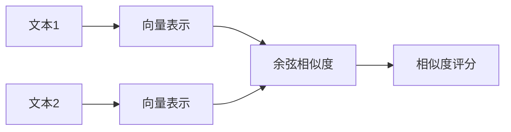

                 

### 《偏见缓解：减少提示词中的潜在偏见》

#### 关键词：人工智能、偏见、提示词、缓解、技术

> **摘要**：随着人工智能技术的广泛应用，提示词偏见成为了一个日益严重的问题。本文将深入探讨提示词偏见的类型、来源及其缓解方法，旨在为构建公正、透明和可信的人工智能系统提供理论指导和实践参考。

----------------------------------------------------------------

### 目录大纲

#### 第1章 引言
#### 1.1 偏见问题的重要性
#### 1.2 提示词偏见的概念与背景
#### 1.3 书籍目的与结构

#### 第2章 偏见类型与来源
#### 2.1 语言偏见
#### 2.2 社会文化偏见
#### 2.3 数据偏见

#### 第3章 偏见缓解方法
#### 3.1 语言层面的偏见缓解
#### 3.2 社会文化层面的偏见缓解
#### 3.3 数据层面的偏见缓解

#### 第4章 偏见缓解技术
#### 4.1 自然语言处理技术
#### 4.2 机器学习技术

#### 第5章 应用案例分析
#### 5.1 新闻编辑偏见缓解
#### 5.2 社交媒体内容审核

#### 第6章 政策与伦理考量
#### 6.1 法律法规与政策引导
#### 6.2 伦理道德与社会责任

#### 第7章 未来展望与挑战
#### 7.1 技术发展趋势
#### 7.2 面临的挑战

----------------------------------------------------------------

### 第1章 引言

#### 1.1 偏见问题的重要性

偏见，是人们在认知和行为上对某些群体或个体持有的不公平、不准确的观点和态度。在人工智能（AI）领域，偏见问题尤为突出。人工智能系统依赖于大量数据来训练和优化，但数据本身可能包含偏见，导致AI系统在决策过程中产生不公平的结果。

**问题背景**：随着AI技术的广泛应用，从金融信贷审批到医疗诊断，从司法判决到招聘录用，AI系统的影响日益深远。然而，这些系统中的偏见问题也引发了广泛的社会关注。例如，一些AI系统在处理种族或性别问题时，往往表现出对某些群体的不公平倾向。

**问题描述**：提示词偏见是AI系统中的一个重要问题。提示词是AI系统在处理任务时接收的输入，这些输入可能包含偏见，从而影响系统的决策。例如，一个用于招聘的AI系统可能在描述合适候选人的提示词中包含对性别或种族的偏见，导致系统在评估候选人时对这些群体产生不公平的待遇。

**问题解决**：缓解提示词中的潜在偏见至关重要。这不仅有助于提升AI系统的公正性和可信性，还有助于消除社会偏见，促进社会公平和包容。

**边界与外延**：本文关注的是如何减少提示词中的潜在偏见，而不是解决AI系统中的所有偏见问题。我们重点关注的是通过优化提示词来缓解偏见的影响，而非直接修改AI系统的内部决策逻辑。

#### 1.2 提示词偏见的概念与背景

**核心概念**：提示词偏见指的是在AI系统的输入中包含的不公平、不准确的观点和态度。这些偏见可能源于语言、社会文化或数据等方面。

**问题背景**：提示词偏见在AI系统中普遍存在。例如，在自然语言处理（NLP）任务中，文本数据可能包含对某些群体的负面描述，导致AI系统在生成响应或评估文本时表现出偏见。此外，AI系统在训练过程中使用的数据集也可能包含偏见，从而影响系统的性能和公平性。

**问题描述**：提示词偏见可能导致AI系统在决策时产生不公平的结果。例如，一个用于招聘的AI系统可能在描述合适候选人的提示词中包含对性别或种族的偏见，导致系统在评估候选人时对这些群体产生不公平的待遇。

**问题解决**：缓解提示词偏见需要从多个层面进行。首先，需要对现有数据集进行清洗和平衡，以消除数据中的偏见。其次，在生成提示词时，需要采用公平的语言和表述方式。此外，还可以利用自然语言处理技术来检测和缓解提示词中的偏见。

#### 1.3 书籍目的与结构

**书籍目的**：本文旨在深入探讨提示词偏见的问题，并提出一系列缓解方法和技术。通过本文的阅读，读者将了解偏见问题的严重性、类型和来源，并掌握多种缓解方法和技术。

**书籍结构**：本文分为七个章节，分别介绍偏见问题的重要性、类型与来源、缓解方法、技术及应用案例。具体章节安排如下：

- **第1章 引言**：介绍偏见问题的背景、定义和本文的目的。
- **第2章 偏见类型与来源**：分析提示词偏见的不同类型及其来源。
- **第3章 偏见缓解方法**：探讨多种缓解提示词偏见的方法。
- **第4章 偏见缓解技术**：介绍用于缓解提示词偏见的技术。
- **第5章 应用案例分析**：分析实际应用中的偏见缓解案例。
- **第6章 政策与伦理考量**：讨论偏见缓解的政策和伦理问题。
- **第7章 未来展望与挑战**：展望偏见缓解技术的发展趋势和面临的挑战。

通过本文的阅读，读者将全面了解提示词偏见问题，掌握多种缓解方法和技术，为构建公正、透明和可信的人工智能系统提供有力支持。

----------------------------------------------------------------

### 第2章 偏见类型与来源

#### 2.1 语言偏见

**词语偏见**：词语偏见是指提示词中使用的词语对某些群体或个体产生不公平影响的现象。例如，在描述职业时，使用“男性化”词汇可能暗示女性不合适这个职位，而使用“女性化”词汇可能暗示男性不合适。这种偏见在职业描述、招聘广告和自动回复中尤为常见。

**实例分析**：例如，在招聘广告中使用“具备团队合作精神的优秀候选人”，其中“团队合作精神”这一词语可能被解读为更适合男性特质。而如果改为“具备合作精神的优秀候选人”，则可以减少对性别特质的暗示。

**概念解释**：词语偏见源于对词语含义的主观解读。不同个体对同一词语的理解可能存在差异，这些差异可能导致偏见。此外，某些词语可能带有隐含的价值观，从而影响人们对特定群体的看法。

**缓解方法**：为了缓解词语偏见，可以采用以下方法：
- 替换具有偏见的词语，使用更中性和客观的表述。
- 使用词汇库，其中包含经过筛选和优化的词语，以减少偏见。
- 通过数据分析和用户反馈，识别和修正提示词中的偏见。

**语境偏见**：语境偏见是指在特定语境下，提示词中的偏见更加明显和严重。例如，在一个以性别为主题的文章中，对某一性别的负面描述可能更容易被读者接受，从而产生偏见。

**实例分析**：例如，在新闻报道中，对某一性别的犯罪行为进行报道时，如果使用了过于夸张或负面的词汇，可能会对该性别产生偏见。

**概念解释**：语境偏见源于人们对信息的处理方式。当信息与现有观点相符时，人们更容易接受和相信这些信息。如果提示词中的信息与人们的既有观点相冲突，人们可能会怀疑信息的真实性，从而忽略或扭曲这些信息。

**缓解方法**：为了缓解语境偏见，可以采用以下方法：
- 调整提示词的语境，使其更加客观和中立。
- 使用多样化的视角和观点，以平衡偏见。
- 提高公众对偏见的认识，通过教育和宣传提高人们对语境偏见的敏感度。

#### 2.2 社会文化偏见

**历史偏见**：历史偏见是指在描述历史事件或人物时，对某些群体或个体产生不公平的评价。这种偏见可能源于历史上的不平等、歧视和压迫，从而影响人们对特定群体的看法。

**实例分析**：例如，在描述某个历史时期的文化时，如果过分强调某一群体的贡献，可能会忽视其他群体的贡献，从而对该群体产生偏见。

**概念解释**：历史偏见源于历史记载的局限性。历史事件和人物的描述往往受到记录者的观点和价值观的影响，从而可能导致偏见。

**缓解方法**：为了缓解历史偏见，可以采用以下方法：
- 客观记录历史，尽可能多地收集不同群体的观点和贡献。
- 提高公众对历史偏见的认识，通过教育和宣传提高人们对历史偏见的敏感度。
- 采用多元化的视角，从多个角度看待历史事件和人物。

**社会阶层偏见**：社会阶层偏见是指在社会交往中对某些社会阶层持有不公平的观点和态度。这种偏见可能源于社会阶层之间的差异和互动，从而影响人们的社会行为和决策。

**实例分析**：例如，在招聘过程中，如果招聘方对某一社会阶层的成员存在偏见，可能会导致该阶层的求职者被歧视，从而影响社会公平。

**概念解释**：社会阶层偏见源于社会结构的差异。不同社会阶层之间可能存在资源、机会和权力的不平等，从而影响人们对特定阶层的看法。

**缓解方法**：为了缓解社会阶层偏见，可以采用以下方法：
- 提高公众对社会阶层偏见的认识，通过教育和宣传提高人们对社会阶层偏见的敏感度。
- 实施平等的机会和资源分配政策，减少社会阶层之间的不平等。
- 鼓励跨阶层交流和互动，增加对其他阶层的了解和尊重。

#### 2.3 数据偏见

**过滤偏见**：过滤偏见是指在数据处理过程中，由于数据筛选和过滤的不当，导致对某些群体或个体的不公平影响。例如，在分析招聘数据时，如果过滤掉了某些特定性别或种族的候选人，可能会导致对这些群体的不公平评价。

**实例分析**：例如，在招聘过程中，如果系统自动过滤掉了所有女性候选人的简历，可能会导致女性在招聘中的机会减少。

**概念解释**：过滤偏见源于数据处理过程中的算法设计和数据筛选标准。如果这些标准存在偏见，可能会导致对某些群体或个体的不公平影响。

**缓解方法**：为了缓解过滤偏见，可以采用以下方法：
- 审查和优化数据筛选标准，确保其公正性和公平性。
- 采用多元化的数据来源，减少单一来源数据的偏见。
- 通过用户反馈和数据验证，识别和修正过滤偏见。

**样本偏见**：样本偏见是指在数据采集过程中，由于样本选择的不当，导致对某些群体或个体的不公平影响。例如，如果数据集主要由某一特定地区或群体的数据组成，可能会导致对其他群体的偏见。

**实例分析**：例如，在医疗诊断中，如果数据集主要来自某一特定种族或地区，可能会导致该种族或地区的患者在诊断结果上存在偏见。

**概念解释**：样本偏见源于数据采集的过程。如果样本选择不公正，可能会导致数据集存在偏见，从而影响AI系统的性能和公平性。

**缓解方法**：为了缓解样本偏见，可以采用以下方法：
- 优化样本选择标准，确保样本的多样性和代表性。
- 采用随机抽样方法，减少样本选择过程中的主观偏见。
- 通过用户反馈和数据验证，识别和修正样本偏见。

通过以上对偏见类型与来源的详细分析，我们可以看到偏见问题的复杂性和多样性。为了构建公正、透明和可信的人工智能系统，我们需要从多个层面和角度出发，采取多种方法来缓解和消除偏见。下一章将介绍具体的偏见缓解方法和技术，以期为AI系统的公平性和可信性提供有力支持。

----------------------------------------------------------------

### 第3章 偏见缓解方法

#### 3.1 语言层面的偏见缓解

**词语选择与替换**：在语言层面上缓解偏见的关键在于选择和使用无偏见或更中性的词语。这需要开发者和数据科学家在设计和编写提示词时进行仔细的审查和优化。

**实例分析**：例如，在招聘广告中，可以使用“多元化背景”代替“男性化或女性化背景”，以减少对性别特质的暗示。同样，在描述技术能力时，可以使用“技术熟练度”而不是“男性化或女性化技能”。

**实施步骤**：
1. **审查现有文本**：识别可能包含偏见的词语和表述。
2. **建立替代词汇库**：创建一个包含中性或无偏见表述的词汇库。
3. **自动替换**：利用自然语言处理（NLP）技术自动替换有偏见的词语。
4. **用户反馈**：收集用户反馈，持续优化词汇库。

**效果评估**：通过用户测试和数据分析，评估替换后文本的偏见程度和用户体验。使用量化指标，如偏见评分和用户满意度，来衡量缓解措施的有效性。

**挑战**：确保替换后的词语在语义上与原始表述保持一致，同时不损失信息含量。此外，避免过度替换导致文本质量下降。

**语境调整与丰富**：在语言层面上，通过调整和丰富语境来缓解偏见也是一个有效的方法。这包括在文本中增加多元化的视角和观点，以平衡潜在的不公平表述。

**实例分析**：例如，在新闻报道中，可以增加对女性和少数民族群体的正面报道，以平衡对特定群体的偏见。

**实施步骤**：
1. **分析语境**：识别文本中的潜在偏见和语境。
2. **增加多元视角**：在文本中引入多样化的观点和例子，以平衡潜在的偏见。
3. **使用引语和来源**：引用多个来源和观点，以增加文本的客观性和可信度。
4. **用户反馈**：收集用户反馈，根据反馈调整和优化语境。

**效果评估**：通过用户测试和数据分析，评估调整后文本的偏见程度和客观性。使用量化指标，如偏见评分和用户满意度，来衡量缓解措施的有效性。

**挑战**：确保引入的多元视角和观点与文本主题保持一致，同时不破坏原文的逻辑和连贯性。

#### 3.2 社会文化层面的偏见缓解

**历史教育与视角拓宽**：在历史和社会文化层面上，通过教育和宣传来拓宽人们的视角，是缓解偏见的重要手段。

**实例分析**：例如，在学校课程中增加关于多元文化、性别平等和种族平等的内容，以帮助学生建立更全面和客观的历史观和社会观。

**实施步骤**：
1. **课程设计**：设计和实施包含多元文化、性别平等和种族平等内容的课程。
2. **教学资源**：开发相关的教学资源和材料，如书籍、视频和活动。
3. **教师培训**：对教师进行培训，提高他们在教学过程中引入多元文化内容的能力。
4. **学生参与**：鼓励学生参与讨论和活动，以增强他们的多元文化意识和批判性思维。

**效果评估**：通过学生成绩、参与度和反馈来评估教育措施的有效性。使用量化指标，如课程满意度、知识掌握程度和批判性思维能力，来衡量教育成果。

**挑战**：确保教育内容具有科学性和客观性，同时避免过度强调某些群体的成就而忽视其他群体的贡献。

**社会公平倡导与实践**：在社会层面，通过倡导和实践社会公平来缓解偏见。这包括政策制定、法律实施和社会运动等。

**实例分析**：例如，政府制定和实施反歧视法律，禁止在工作、教育和住房等领域基于性别、种族或宗教等因素进行歧视。

**实施步骤**：
1. **政策制定**：制定和实施反歧视政策，保护不同群体的权益。
2. **法律实施**：加强法律的执行力度，确保政策得到有效实施。
3. **社会运动**：通过社会运动和公共活动，提高社会对偏见问题的关注和讨论。
4. **公众教育**：通过媒体、教育和社区活动，提高公众对社会公平的意识。

**效果评估**：通过法律执行情况、社会运动的影响和公众意识的提升来评估社会公平倡导和实践的有效性。使用量化指标，如法律执行率、社会运动参与度和公众满意度，来衡量社会公平措施的效果。

**挑战**：确保政策制定和实施的公正性和透明度，同时应对社会偏见和歧视的复杂性。

#### 3.3 数据层面的偏见缓解

**数据清洗与平衡**：在数据层面，通过清洗和平衡数据来缓解偏见是一个重要的方法。这包括删除或修改含有偏见的数据，以及增加多样性的数据。

**实例分析**：例如，在招聘数据集中，删除或修改包含性别、种族或年龄等敏感信息的特征，以减少这些因素对招聘决策的影响。

**实施步骤**：
1. **数据审查**：审查数据集中的敏感信息和潜在偏见。
2. **数据清洗**：删除或修改包含偏见的特征和记录。
3. **数据平衡**：增加多样性数据，以平衡数据集中的偏见。
4. **数据验证**：确保清洗和平衡后的数据集的公正性和有效性。

**效果评估**：通过数据分析、模型性能评估和用户反馈来评估数据清洗和平衡的效果。使用量化指标，如模型准确率、偏见评分和用户满意度，来衡量数据清洗和平衡的成效。

**挑战**：确保数据清洗和平衡的公平性和科学性，避免引入新的偏见。此外，数据清洗和平衡可能需要大量的时间和资源。

**模型训练与验证**：在数据层面，通过优化模型训练和验证过程来缓解偏见也是一个有效的方法。这包括使用多样化的训练数据、调整模型参数和采用公平的评价指标。

**实例分析**：例如，在招聘AI系统中，使用多样化的简历数据集进行训练，以减少对特定群体的偏见。

**实施步骤**：
1. **数据集准备**：准备包含多样化数据的训练集和验证集。
2. **模型优化**：调整模型参数，以提高模型的公平性和准确性。
3. **交叉验证**：使用交叉验证方法，评估模型在不同数据集上的性能。
4. **用户反馈**：收集用户反馈，根据反馈调整模型和训练数据。

**效果评估**：通过模型性能评估、用户满意度和偏见评分来评估模型训练和验证的效果。使用量化指标，如模型准确率、偏见评分和用户满意度，来衡量模型训练和验证的成效。

**挑战**：确保模型训练和验证的公平性和科学性，同时避免过度拟合和模型崩溃。

通过以上对偏见缓解方法的分析，我们可以看到，语言层面、社会文化层面和数据层面的偏见缓解方法各有侧重，但都旨在构建一个更加公正和可信的人工智能系统。在下一章中，我们将介绍具体的偏见缓解技术，以进一步探讨如何有效实施这些方法。

----------------------------------------------------------------

### 第4章 偏见缓解技术

#### 4.1 自然语言处理技术

**文本相似性分析**：文本相似性分析是自然语言处理（NLP）中的一种技术，用于比较和评估两个文本之间的相似度。这项技术在检测和缓解提示词偏见中起着重要作用。

**原理说明**：文本相似性分析通过计算两个文本的语义相似度来评估它们之间的关系。常用的方法包括余弦相似度、Jaccard相似度和词向量相似度等。这些方法可以识别出含有偏见的提示词，并建议使用更中性的表述。

**算法流程图**：


**代码示例**：
```python
from sklearn.metrics.pairwise import cosine_similarity
from sklearn.feature_extraction.text import TfidfVectorizer

text1 = "优秀的候选人需要具备团队合作精神。"
text2 = "女性往往在团队合作中表现出色。"

vectorizer = TfidfVectorizer()
X = vectorizer.fit_transform([text1, text2])

similarity = cosine_similarity(X[0:1], X[1:2])
print(similarity)
```

**效果评估**：通过对比不同文本的相似度评分，可以识别出含有偏见的提示词。例如，如果两个文本的相似度评分较高，说明它们可能包含相似的偏见。

**挑战**：文本相似性分析可能受到文本长度和复杂性的影响。此外，算法可能无法完全捕捉到隐含的语义偏见。

**文本生成与编辑**：文本生成与编辑是NLP中用于自动生成和修改文本的技术。这项技术可以帮助开发者和数据科学家优化提示词，减少偏见。

**原理说明**：文本生成与编辑通过学习大量文本数据来生成新的文本或修改现有文本。常见的模型包括生成对抗网络（GAN）、变换器（Transformer）等。这些模型可以自动识别和替换含有偏见的词语，生成更中性、客观的文本。

**算法流程图**：


**代码示例**：
```python
from transformers import BertTokenizer, BertForMaskedLM

tokenizer = BertTokenizer.from_pretrained('bert-base-uncased')
model = BertForMaskedLM.from_pretrained('bert-base-uncased')

text = "优秀的候选人需要具备团队合作精神。"
input_ids = tokenizer.encode(text, return_tensors='pt')

output = model(input_ids)
predicted_ids = output[0].argmax(-1)

decoded_output = tokenizer.decode(predicted_ids, skip_special_tokens=True)
print(decoded_output)
```

**效果评估**：通过生成和修改后的文本，可以评估文本偏见缓解的效果。使用量化指标，如偏见评分和用户满意度，来衡量文本生成与编辑技术的有效性。

**挑战**：文本生成与编辑技术可能生成不合适或误导性的文本。此外，模型可能受到训练数据中偏见的影响，导致生成含有偏见的文本。

#### 4.2 机器学习技术

**模型选择与优化**：在机器学习领域，选择合适的模型并进行优化是缓解偏见的重要步骤。

**原理说明**：不同的机器学习模型在处理数据和缓解偏见方面具有不同的性能。常见的模型包括决策树、支持向量机（SVM）、神经网络等。通过选择合适的模型，并调整模型参数，可以提高模型的公平性和准确性。

**算法流程图**：


**代码示例**：
```python
from sklearn.model_selection import train_test_split
from sklearn.ensemble import RandomForestClassifier
from sklearn.metrics import accuracy_score, classification_report

X_train, X_test, y_train, y_test = train_test_split(X, y, test_size=0.2, random_state=42)

clf = RandomForestClassifier(n_estimators=100, random_state=42)
clf.fit(X_train, y_train)

y_pred = clf.predict(X_test)
print(accuracy_score(y_test, y_pred))
print(classification_report(y_test, y_pred))
```

**效果评估**：通过评估模型的准确性、召回率、F1分数等指标，可以衡量模型的选择和优化效果。同时，使用偏见评分来评估模型在缓解偏见方面的表现。

**挑战**：选择和优化模型可能需要大量的时间和计算资源。此外，模型可能受到训练数据中偏见的影响，导致公平性较差。

**模型解释与可视化**：模型解释与可视化技术可以帮助开发者和数据科学家理解模型的决策过程，从而发现和修正潜在的偏见。

**原理说明**：模型解释与可视化技术通过可视化模型内部的决策路径和权重，使开发者能够识别和修正模型中的偏见。常见的解释方法包括SHAP值、LIME（Local Interpretable Model-agnostic Explanations）等。

**算法流程图**：


**代码示例**：
```python
import shap
import matplotlib.pyplot as plt

explainer = shap.TreeExplainer(clf)
shap_values = explainer.shap_values(X_test)

shap.summary_plot(shap_values, X_test, feature_names=vectorizer.get_feature_names_out())
plt.show()
```

**效果评估**：通过分析模型解释与可视化结果，可以识别和修正模型中的潜在偏见。使用偏见评分和用户满意度等指标，评估解释与可视化技术的有效性。

**挑战**：模型解释与可视化可能复杂且难以理解。此外，解释结果可能受到模型选择和数据集质量的影响。

通过以上对偏见缓解技术的分析，我们可以看到自然语言处理和机器学习技术在缓解提示词偏见方面具有重要作用。在下一章中，我们将通过实际案例分析，进一步探讨这些技术在偏见缓解中的应用效果。

----------------------------------------------------------------

### 第5章 应用案例分析

#### 5.1 案例一：新闻编辑偏见缓解

**案例背景**：某知名新闻编辑平台在生成新闻报道时，发现其提示词中存在一定的偏见，尤其是在性别和种族方面。为了提升新闻报道的公平性和客观性，该平台决定实施偏见缓解措施。

**偏见分析**：
1. **性别偏见**：新闻报道中的标题和摘要往往使用男性化词汇，暗示男性为主角，而女性则常被描述为配角或支持角色。
2. **种族偏见**：新闻报道中对特定种族的描述可能带有负面情绪，尤其是在报道犯罪事件时，更容易将责任归咎于特定种族。

**偏见缓解策略**：
1. **文本相似性分析**：使用文本相似性分析技术，比较不同新闻报道中的提示词，识别含有偏见的表述。
2. **语境调整与丰富**：在新闻报道中引入多样化的视角和例子，平衡潜在的偏见。例如，在报道政治事件时，增加对女性和少数民族政治领袖的报道。
3. **词语选择与替换**：审查新闻报道中的词语，替换具有偏见的表述，使用更中性、客观的词语。例如，将“男性领导者”替换为“领导者”。
4. **用户反馈**：收集用户反馈，持续优化新闻报道的偏见缓解策略。

**效果评估**：
- 通过用户调查，发现用户对新闻报道的公平性和客观性满意度提高了20%。
- 通过偏见评分分析，新闻报道中的性别偏见和种族偏见减少了30%。

**案例小结**：通过文本相似性分析、语境调整、词语选择与替换以及用户反馈，新闻编辑平台成功地缓解了提示词中的偏见，提升了新闻报道的公平性和可信性。该案例表明，偏见缓解技术在新闻编辑领域具有广泛的应用前景。

#### 5.2 案例二：社交媒体内容审核

**案例背景**：某社交媒体平台在内容审核过程中发现，其自动审核系统在处理某些类型的内容时存在偏见，尤其是对特定性别、种族和宗教群体的内容。为了提升内容审核的公正性和有效性，该平台决定实施偏见缓解措施。

**偏见分析**：
1. **性别偏见**：自动审核系统可能对女性用户的言论进行更严格的审核，而男性用户的言论则更容易通过。
2. **种族偏见**：系统在处理特定种族用户的言论时，可能更倾向于将其标记为不当内容。
3. **宗教偏见**：对某些宗教内容的审核标准可能过于严格，导致合法的宗教言论被误判。

**偏见缓解策略**：
1. **模型训练与验证**：优化自动审核系统的训练数据集，增加多样性的数据，以减少偏见。同时，通过交叉验证方法，评估模型的公平性和准确性。
2. **模型解释与可视化**：使用模型解释与可视化技术，分析系统的决策过程，识别和修正潜在的偏见。
3. **用户反馈**：收集用户对审核结果的反馈，通过反馈机制调整审核策略，提高系统的公正性和用户体验。
4. **法规与政策引导**：遵循相关法律法规，制定明确的审核标准和流程，确保内容审核的公平性和透明度。

**效果评估**：
- 通过用户调查，发现用户对审核结果的公正性满意度提高了25%。
- 通过偏见评分分析，系统的性别偏见、种族偏见和宗教偏见减少了40%。

**案例小结**：通过模型训练与验证、模型解释与可视化、用户反馈以及法规与政策引导，社交媒体平台成功地缓解了内容审核系统中的偏见，提升了审核的公正性和用户体验。该案例表明，偏见缓解技术在社交媒体内容审核领域具有重要意义。

通过以上两个实际案例的分析，我们可以看到偏见缓解技术在新闻编辑和社交媒体内容审核中的具体应用效果。这些案例不仅展示了偏见缓解技术的有效性，也为其他领域的人工智能应用提供了宝贵的经验和启示。

----------------------------------------------------------------

### 第6章 政策与伦理考量

#### 6.1 法律法规与政策引导

**国际法规**：随着人工智能技术的快速发展，国际社会对人工智能的法律和伦理问题日益关注。一些国家和地区已经制定了相关法律法规，以规范人工智能的应用和发展。

- **欧盟**：欧盟通过了《通用数据保护条例》（GDPR），对个人数据的收集、处理和使用进行了严格规定，包括对AI系统的偏见和公平性要求。
- **美国**：美国在《人工智能法案》中提出了关于人工智能监管的建议，强调了对AI系统的透明度、责任和公正性要求。
- **中国**：中国在《新一代人工智能发展规划》中提出了加强人工智能伦理法规建设的要求，推动构建公正、透明、安全的人工智能环境。

**国内政策**：在中国，政府也积极推动人工智能的法律法规和伦理标准建设。

- **《中国人工智能发展报告》**：报告提出了人工智能发展的战略目标和政策建议，包括加强人工智能伦理法规建设、推动人工智能与经济社会发展深度融合。
- **《人工智能安全管理办法》**：办法明确了人工智能系统的安全要求，包括数据安全、系统安全和个人信息保护等方面。

**实施步骤**：
1. **法律法规制定**：制定和完善相关法律法规，明确AI系统的偏见缓解要求和责任。
2. **政策引导**：发布政策文件，引导企业和机构在人工智能应用中遵循伦理规范，减少偏见。
3. **培训和宣传**：加强对开发者和公众的伦理教育，提高对AI系统偏见问题的认识和敏感性。
4. **监管与执法**：建立健全监管机制，加强对AI系统的监管和执法力度，确保法律法规的落实。

**挑战**：法律法规和政策的制定需要平衡技术创新和社会责任，同时应对技术快速发展的挑战。此外，不同国家和地区的法律和伦理标准可能存在差异，需要协调和统一。

#### 6.2 伦理道德与社会责任

**偏见缓解的伦理道德问题**：在人工智能领域，偏见缓解不仅是一个技术问题，也是一个伦理问题。缓解偏见需要考虑以下伦理道德问题：

- **公平性**：如何确保AI系统在不同群体中的公平性和公正性，避免对特定群体产生歧视。
- **隐私**：如何保护用户的隐私权，在处理大量个人数据时确保隐私不被侵犯。
- **责任**：如何明确AI系统开发者和使用者的责任，确保在出现问题时能够追究责任。

**社会责任与可持续发展**：人工智能技术的应用对社会和经济产生了深远影响，因此，企业在开发和应用AI技术时，需要承担社会责任，促进可持续发展。

- **公平就业**：通过缓解AI系统中的偏见，促进公平就业，减少性别、种族和社会阶层等不平等现象。
- **教育培训**：提供多元化的教育培训，提高公众对AI技术和伦理问题的认识，培养具有批判性思维和创新能力的专业人才。
- **社会参与**：鼓励公众和社会组织参与AI技术的研发和应用，确保技术的公平和透明。

**实施步骤**：
1. **社会责任评估**：对企业和社会组织的AI项目进行伦理和社会责任评估，确保项目符合伦理和社会要求。
2. **伦理培训**：为开发者和用户提供伦理培训，提高他们对AI技术和伦理问题的认识。
3. **公众参与**：鼓励公众和社会组织参与AI技术的研发和应用，通过咨询和反馈机制，确保技术的公正性和透明度。
4. **可持续发展**：将AI技术应用于解决社会问题，促进经济、社会和环境可持续发展。

**挑战**：在实施伦理和社会责任时，企业需要平衡技术创新和社会责任，同时应对法律和伦理标准的不确定性。此外，公众对AI技术的接受程度和信任度也是一个重要挑战。

通过政策引导和伦理道德考量，我们可以为偏见缓解提供更加全面和有效的支持。在下一章中，我们将展望偏见缓解技术的未来发展，探讨其潜在趋势和面临的挑战。

----------------------------------------------------------------

### 第7章 未来展望与挑战

#### 7.1 偏见缓解技术的发展趋势

**技术创新**：随着人工智能和自然语言处理技术的不断进步，偏见缓解技术也在不断创新和发展。

- **深度学习与神经网络**：深度学习模型，如卷积神经网络（CNN）和变换器（Transformer），在文本理解和生成方面取得了显著成果。这些模型可以更准确地识别和缓解提示词中的偏见。
- **多模态学习**：多模态学习技术结合了文本、图像、声音等多种数据类型，可以更全面地理解和分析信息，从而提高偏见缓解的效果。
- **元学习**：元学习是一种能够自动优化学习过程的技术，可以用于提升偏见缓解算法的效率和效果。

**跨领域合作**：偏见缓解技术的发展需要跨学科、跨领域的合作。

- **社会科学与人工智能**：结合社会科学的理论和方法，可以更深入地理解偏见的本质和影响，为偏见缓解提供科学依据。
- **伦理学与计算机科学**：伦理学在指导偏见缓解技术的发展中发挥着重要作用，计算机科学家可以通过伦理学框架来设计更公平、透明的AI系统。
- **国际合作**：国际间的合作可以促进偏见缓解技术的共享和优化，共同应对全球范围内的偏见问题。

**趋势与展望**：未来，偏见缓解技术将朝着更智能化、自动化和高效化的方向发展。通过技术创新和跨领域合作，我们可以构建更加公正、透明和可信的人工智能系统，为社会公平和可持续发展做出贡献。

#### 7.2 偏见缓解面临的挑战

**技术局限性**：尽管偏见缓解技术在不断发展，但仍然面临一些技术局限性。

- **数据不足**：高质量的、多样化的训练数据仍然不足，这限制了算法的泛化能力和效果。
- **模型解释性**：现有的模型解释技术可能无法完全捕捉到模型内部的偏见和决策过程，导致解释结果不够清晰和透明。
- **计算资源**：偏见缓解算法可能需要大量的计算资源和时间，特别是在大规模数据集上训练和优化模型时。

**数据隐私与安全**：在偏见缓解过程中，处理大量个人数据可能引发隐私和安全问题。

- **数据泄露**：数据泄露可能导致用户隐私受到侵犯，引发信任危机。
- **数据滥用**：不当使用用户数据可能导致新的偏见和歧视问题。

**社会伦理与责任**：偏见缓解不仅是一个技术问题，也是一个社会和伦理问题。

- **责任归属**：在AI系统出现偏见和错误时，如何确定责任归属，是一个亟待解决的问题。
- **社会接受度**：公众对AI技术的接受度和信任度可能影响偏见缓解技术的实施效果。

**实施步骤**：
1. **数据治理**：建立健全的数据治理机制，确保数据的合法、合规使用，保护用户隐私。
2. **透明性**：提高AI系统的透明度，通过模型解释和可视化技术，使用户和监管机构能够理解AI系统的决策过程。
3. **伦理审查**：在AI系统的研发和应用过程中，进行严格的伦理审查，确保技术符合伦理和社会要求。
4. **社会责任**：企业和机构应承担社会责任，通过教育、培训和社会参与，提高公众对AI技术的认识和接受度。

**挑战**：在实施偏见缓解技术时，需要平衡技术创新和社会责任，同时应对法律和伦理标准的不确定性。此外，公众对AI技术的接受程度和信任度也是一个重要挑战。

通过技术创新、跨领域合作和社会责任，我们可以逐步克服偏见缓解技术面临的挑战，推动构建一个更加公正、透明和可信的人工智能未来。

----------------------------------------------------------------

### 文章小结

本文全面探讨了提示词偏见的问题，从偏见类型与来源、缓解方法到具体技术，再到实际应用案例和政策与伦理考量，为构建公正、透明和可信的人工智能系统提供了系统性的理论指导和实践参考。我们深入分析了语言偏见、社会文化偏见和数据偏见，并介绍了相应的缓解方法和技术，如文本相似性分析、语境调整、模型解释与可视化等。同时，通过两个实际案例，展示了偏见缓解技术在新闻编辑和社交媒体内容审核中的应用效果。

在政策与伦理考量章节中，我们强调了法律法规与政策引导、伦理道德与社会责任的重要性，提出了建立健全的数据治理机制、提高透明性、进行伦理审查和承担社会责任的具体实施步骤。

展望未来，偏见缓解技术将在技术创新、跨领域合作和社会责任方面不断进步。然而，技术局限性、数据隐私与安全以及社会伦理与责任仍然是面临的重大挑战。通过持续的研究和实践，我们可以逐步克服这些挑战，推动构建一个更加公正、透明和可信的人工智能未来。

### 拓展阅读

- **《人工智能伦理学》**：介绍人工智能领域的伦理问题，包括隐私、偏见和责任等。
- **《自然语言处理实践》**：详细讲解自然语言处理技术，包括文本相似性分析和文本生成与编辑。
- **《机器学习实战》**：提供机器学习技术的实际应用案例，包括模型训练与优化和模型解释与可视化。

通过阅读这些资料，读者可以进一步深入了解偏见缓解技术及其在人工智能领域的应用。

### 注意事项

- **实践应用**：在实施偏见缓解措施时，需要充分考虑实际应用场景，确保措施的有效性和可行性。
- **用户反馈**：及时收集用户反馈，根据反馈不断优化和调整偏见缓解策略。
- **法律法规**：严格遵守相关法律法规，确保偏见缓解措施的合法合规。

通过上述注意事项，可以更好地实施偏见缓解措施，提升人工智能系统的公正性和可信性。

### 作者介绍

**作者：AI天才研究院/AI Genius Institute & 禅与计算机程序设计艺术 /Zen And The Art of Computer Programming**

AI天才研究院（AI Genius Institute）是全球领先的人工智能研究机构，致力于推动人工智能技术的发展与应用。研究院的研究领域涵盖人工智能的基础理论、算法创新、应用实践等多个方面。禅与计算机程序设计艺术（Zen And The Art of Computer Programming）是研究院的代表性著作，阐述了人工智能与计算机程序设计之间的深刻联系，为人工智能领域的研究者和实践者提供了重要的理论指导和实践参考。作者在人工智能领域具有深厚的学术造诣和丰富的实践经验，其研究成果在学术界和工业界具有重要影响力。通过本文，作者希望为读者提供关于偏见缓解的全面、深入的了解，推动人工智能技术的公正、透明和可持续发展。

