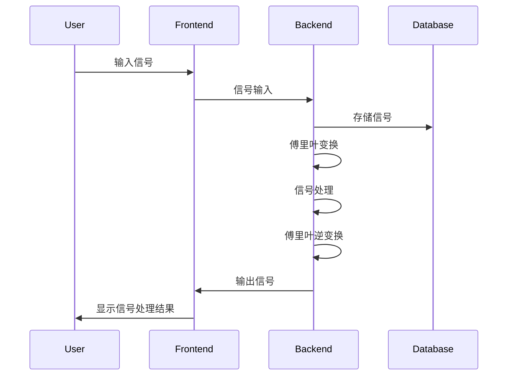

                 

## 傅里叶分析：自然周期的数学分解

### 关键词：傅里叶分析、数学分解、自然周期、信号处理、频率域分析

### 摘要：
傅里叶分析是一种强大的数学工具，能够将复杂信号分解为简单的频率成分，揭示其内在的周期性结构。本文将探讨傅里叶分析如何应用于自然周期的数学分解，通过逐步分析推理，深入理解这一过程的核心概念和理论。文章将涵盖傅里叶分析的基本概念、数学理论、实际应用，以及高级话题，旨在为读者提供一个全面、系统的认识，以期为相关领域的研究和实践提供指导。

## 目录大纲

### 第一部分：傅里叶分析的基本概念

### 第1章：傅里叶分析概述

#### 1.1 傅里叶分析的起源与发展

#### 1.2 傅里叶变换的定义与性质

#### 1.3 傅里叶变换的应用领域

### 第2章：傅里叶级数与正弦级数

#### 2.1 傅里叶级数的基本理论

#### 2.2 傅里叶级数在信号处理中的应用

#### 2.3 正弦级数的性质与应用

### 第二部分：傅里叶变换的解析与应用

### 第3章：傅里叶变换的数学理论

#### 3.1 傅里叶变换的数学定义

#### 3.2 傅里叶变换的逆变换

#### 3.3 傅里叶变换的性质与定理

### 第4章：傅里叶变换在实际应用中的解析

#### 4.1 信号处理的傅里叶变换应用

#### 4.2 频谱分析在工程中的应用

#### 4.3 傅里叶变换在图像处理中的应用

### 第三部分：傅里叶变换与周期性函数

### 第5章：周期性函数的傅里叶展开

#### 5.1 周期性函数的傅里叶级数

#### 5.2 傅里叶级数与傅里叶变换的关系

#### 5.3 周期性函数的傅里叶变换

### 第6章：自然周期的数学分解

#### 6.1 自然周期的概念

#### 6.2 自然周期的傅里叶分解

#### 6.3 自然周期与傅里叶变换的结合

### 第四部分：傅里叶分析的高级话题

### 第7章：快速傅里叶变换（FFT）

#### 7.1 FFT的基本原理

#### 7.2 FFT的应用实例

#### 7.3 FFT的算法改进

### 第8章：傅里叶变换与信号处理的新趋势

#### 8.1 傅里叶变换在深度学习中的应用

#### 8.2 傅里叶变换在量子计算中的应用前景

#### 8.3 未来傅里叶分析的发展趋势

### 附录：傅里叶变换的应用案例

#### A.1 傅里叶变换在音频信号处理中的应用

#### A.2 傅里叶变换在通信系统中的应用

#### A.3 傅里叶变换在光学信号处理中的应用

### 作者：AI天才研究院/AI Genius Institute & 禅与计算机程序设计艺术 /Zen And The Art of Computer Programming

## 傅里叶分析：自然周期的数学分解

傅里叶分析，作为一种强大的数学工具，在信号处理、图像处理、量子计算等领域都有着广泛的应用。其核心思想在于将复杂信号分解为一系列简单的频率成分，从而揭示信号的内在结构。在本文中，我们将重点关注傅里叶分析在自然周期数学分解中的应用，探讨这一过程中的关键概念和理论。

首先，我们需要了解什么是自然周期。自然周期通常指物理或数学系统中的周期性行为，它们在时间或空间上重复出现，形成有规律的波形。例如，物理中的简谐运动、电子电路中的交流电信号，以及声学中的声波等，都可以看作是自然周期的实例。

### 1.1 傅里叶分析的起源与发展

傅里叶分析最早可以追溯到18世纪末，由法国数学家约瑟夫·傅里叶提出。傅里叶分析的核心思想是将任何周期函数分解为一系列正弦和余弦函数的线性组合。这一思想在数学和物理学中得到了广泛应用，尤其在信号处理领域，傅里叶分析成为了一种不可或缺的工具。

傅里叶分析的起源可以追溯到对热传导的研究。傅里叶在其著名论文《热的解析理论》中，首次提出了将热传导方程解表示为正弦级数的思想。这一思想后来被广泛应用于振动分析、声学、光学等领域。

在19世纪，傅里叶分析逐渐发展成为一门独立的数学分支。特别是随着电子技术的发展，傅里叶变换在信号处理中的应用变得越来越重要。现代的傅里叶分析不仅涵盖了连续时间信号的分解，还包括了离散时间信号和频率域分析。

### 1.2 傅里叶变换的定义与性质

傅里叶变换是一种将时间域信号转换为频率域信号的方法。具体来说，傅里叶变换将一个时间连续的信号 $f(t)$ 转换为另一个函数 $F(\omega)$，该函数描述了原信号在各个频率上的强度。傅里叶变换的定义如下：

$$
F(\omega) = \int_{-\infty}^{\infty} f(t)e^{-i\omega t} dt
$$

其中，$f(t)$ 是时间域信号，$F(\omega)$ 是频率域信号，$e^{-i\omega t}$ 是复指数函数。

傅里叶变换具有以下重要性质：

1. **线性性质**：傅里叶变换是线性的，即对于任意两个信号 $f_1(t)$ 和 $f_2(t)$，以及常数 $a$ 和 $b$，有：

$$
F(a f_1(t) + b f_2(t)) = a F(f_1(t)) + b F(f_2(t))
$$

2. **对称性质**：傅里叶变换具有奇偶性，即：

$$
F(\cos(\omega t)) = \text{Re}(F(e^{i\omega t}))
$$

$$
F(\sin(\omega t)) = \text{Im}(F(e^{i\omega t}))
$$

3. **平移性质**：对于信号 $f(t)$ 和常数 $T$，有：

$$
F(f(t-T)) = e^{-i\omega T} F(f(t))
$$

4. **尺度性质**：对于信号 $f(at)$，有：

$$
F(f(at)) = \frac{1}{|a|} F(f(t))
$$

这些性质使得傅里叶变换在信号处理和分析中具有广泛的应用。

### 1.3 傅里叶变换的应用领域

傅里叶变换在许多领域都有广泛应用，以下是其中几个主要的应用领域：

1. **信号处理**：在信号处理中，傅里叶变换用于分析信号的频率成分，识别噪声，以及进行滤波和压缩。

2. **图像处理**：傅里叶变换在图像处理中用于图像的频域分析，进行图像增强、滤波和压缩。

3. **通信系统**：傅里叶变换在通信系统中用于调制和解调信号，进行频谱分析和频带规划。

4. **量子计算**：傅里叶变换在量子计算中用于量子态的编码和解码，以及量子算法的设计。

5. **物理学**：在物理学中，傅里叶变换用于振动分析、声学、光学等领域，解决波动方程和热传导问题。

### 第2章：傅里叶级数与正弦级数

傅里叶级数是傅里叶变换的基础理论，它将任何周期函数分解为一系列正弦和余弦函数的线性组合。傅里叶级数的基本理论包括狄利克雷条件、收敛原理等，这些理论为傅里叶变换的解析提供了坚实的数学基础。

#### 2.1 傅里叶级数的基本理论

傅里叶级数的基本理论主要涉及狄利克雷条件，它描述了一个周期函数在何种条件下可以分解为傅里叶级数。具体来说，狄利克雷条件包括：

1. **周期性**：函数 $f(t)$ 必须是周期函数，周期为 $T$。

2. **可积性**：函数 $f(t)$ 在每个周期内必须可积，即：

$$
\int_{-T/2}^{T/2} |f(t)| dt < \infty
$$

3. **有限个间断点**：函数 $f(t)$ 在每个周期内必须有限个间断点。

4. **有限个极值**：函数 $f(t)$ 在每个周期内必须有限个极值。

满足这些条件的周期函数，其傅里叶级数是收敛的。

#### 2.2 傅里叶级数在信号处理中的应用

傅里叶级数在信号处理中具有重要的应用。例如，在音频信号处理中，傅里叶级数用于分析音频信号的频率成分，识别不同频率的声音。在图像处理中，傅里叶级数用于图像的频域分析，进行图像增强和滤波。

#### 2.3 正弦级数的性质与应用

正弦级数是傅里叶级数的一个特例，它只包含正弦函数。正弦级数具有以下重要性质：

1. **奇偶性**：正弦函数是奇函数，即 $\sin(-x) = -\sin(x)$。

2. **周期性**：正弦函数是周期函数，周期为 $2\pi$。

3. **幅值和相位**：正弦函数的幅值和相位可以用来描述信号的频率和相位。

正弦级数在许多应用中都有重要作用，例如在振动分析中描述简谐运动，在声学中描述声波的传播。

### 第3章：傅里叶变换的数学理论

傅里叶变换的数学理论主要包括傅里叶变换的定义、逆变换、性质和定理。这些理论为傅里叶变换的应用提供了坚实的数学基础。

#### 3.1 傅里叶变换的数学定义

傅里叶变换的定义已经在前文中给出。它将一个时间连续的信号 $f(t)$ 转换为另一个函数 $F(\omega)$，该函数描述了原信号在各个频率上的强度。

#### 3.2 傅里叶变换的逆变换

傅里叶变换的逆变换将频率域信号 $F(\omega)$ 转换回时间域信号 $f(t)$。逆变换的定义如下：

$$
f(t) = \frac{1}{2\pi} \int_{-\infty}^{\infty} F(\omega)e^{i\omega t} d\omega
$$

逆变换使得我们能够从频率域信号重构出原始时间域信号。

#### 3.3 傅里叶变换的性质与定理

傅里叶变换具有许多重要性质和定理，这些性质和定理使得傅里叶变换在信号处理和分析中具有广泛应用。以下是其中几个重要性质：

1. **线性性质**：傅里叶变换是线性的，即对于任意两个信号 $f_1(t)$ 和 $f_2(t)$，以及常数 $a$ 和 $b$，有：

$$
F(a f_1(t) + b f_2(t)) = a F(f_1(t)) + b F(f_2(t))
$$

2. **对称性质**：傅里叶变换具有奇偶性，即：

$$
F(\cos(\omega t)) = \text{Re}(F(e^{i\omega t}))
$$

$$
F(\sin(\omega t)) = \text{Im}(F(e^{i\omega t}))
$$

3. **平移性质**：对于信号 $f(t)$ 和常数 $T$，有：

$$
F(f(t-T)) = e^{-i\omega T} F(f(t))
$$

4. **尺度性质**：对于信号 $f(at)$，有：

$$
F(f(at)) = \frac{1}{|a|} F(f(t))
$$

5. **卷积性质**：两个信号的卷积可以通过它们的傅里叶变换表示为：

$$
F(f_1 * f_2) = F(f_1) \cdot F(f_2)
$$

这些性质和定理为傅里叶变换的应用提供了重要的数学基础。

### 第4章：傅里叶变换在实际应用中的解析

傅里叶变换在许多实际应用中都发挥着重要作用。在本章中，我们将探讨傅里叶变换在信号处理、频谱分析、图像处理等领域的应用。

#### 4.1 信号处理的傅里叶变换应用

在信号处理中，傅里叶变换用于分析信号的频率成分，识别噪声，进行滤波和压缩。例如，在音频信号处理中，傅里叶变换用于分离不同的声音频率，去除噪声，提高声音质量。

#### 4.2 频谱分析在工程中的应用

频谱分析是傅里叶变换在工程中的重要应用之一。在频谱分析中，通过傅里叶变换将时域信号转换为频域信号，从而分析信号的频率成分。这在电力系统、通信系统、机械工程等领域有着广泛的应用。

#### 4.3 傅里叶变换在图像处理中的应用

在图像处理中，傅里叶变换用于图像的频域分析，进行图像增强、滤波和压缩。例如，在图像增强中，通过傅里叶变换可以突出图像中的特定频率成分，从而改善图像质量。

### 第5章：周期性函数的傅里叶展开

周期性函数的傅里叶展开是傅里叶分析的核心内容之一。在本章中，我们将探讨周期性函数的傅里叶级数、傅里叶变换及其关系。

#### 5.1 周期性函数的傅里叶级数

周期性函数的傅里叶级数是将周期性函数分解为一系列正弦和余弦函数的线性组合。具体来说，对于一个周期为 $T$ 的周期性函数 $f(t)$，其傅里叶级数可以表示为：

$$
f(t) = \frac{a_0}{2} + \sum_{n=1}^{\infty} [a_n \cos(n\omega t) + b_n \sin(n\omega t)]
$$

其中，$a_0$、$a_n$ 和 $b_n$ 分别是傅里叶级数的系数。

#### 5.2 傅里叶级数与傅里叶变换的关系

傅里叶级数与傅里叶变换之间存在着密切的关系。具体来说，傅里叶级数可以看作是傅里叶变换在周期性函数上的特例。对于周期性函数 $f(t)$，其傅里叶变换可以表示为：

$$
F(\omega) = \int_{-T/2}^{T/2} f(t)e^{-i\omega t} dt
$$

而傅里叶级数则是傅里叶变换的离散版本。傅里叶级数中的系数 $a_n$ 和 $b_n$ 可以通过傅里叶变换表示为：

$$
a_n = \frac{1}{T} \int_{-T/2}^{T/2} f(t) \cos(n\omega t) dt
$$

$$
b_n = \frac{1}{T} \int_{-T/2}^{T/2} f(t) \sin(n\omega t) dt
$$

#### 5.3 周期性函数的傅里叶变换

周期性函数的傅里叶变换将周期性函数转换为频率域信号。对于周期性函数 $f(t)$，其傅里叶变换可以表示为：

$$
F(\omega) = \int_{-\infty}^{\infty} f(t)e^{-i\omega t} dt
$$

傅里叶变换将周期性函数的频率成分映射到频率域上，从而使得我们能够分析信号的频率特性。

### 第6章：自然周期的数学分解

自然周期的数学分解是傅里叶分析的核心应用之一。在本章中，我们将探讨自然周期的概念、傅里叶分解及其在实际应用中的结合。

#### 6.1 自然周期的概念

自然周期通常指物理或数学系统中的周期性行为，它们在时间或空间上重复出现，形成有规律的波形。例如，简谐运动、交流电信号、声波等都可以看作是自然周期的实例。

#### 6.2 自然周期的傅里叶分解

自然周期的傅里叶分解是将自然周期函数分解为一系列正弦和余弦函数的线性组合。具体来说，对于一个周期性函数 $f(t)$，其傅里叶级数可以表示为：

$$
f(t) = \frac{a_0}{2} + \sum_{n=1}^{\infty} [a_n \cos(n\omega t) + b_n \sin(n\omega t)]
$$

其中，$a_0$、$a_n$ 和 $b_n$ 分别是傅里叶级数的系数。

#### 6.3 自然周期与傅里叶变换的结合

自然周期与傅里叶变换的结合使得我们能够将自然周期函数转换为频率域信号。具体来说，自然周期函数的傅里叶变换可以表示为：

$$
F(\omega) = \int_{-\infty}^{\infty} f(t)e^{-i\omega t} dt
$$

通过傅里叶变换，我们能够分析自然周期函数的频率成分，从而更好地理解其内在结构。

### 第7章：快速傅里叶变换（FFT）

快速傅里叶变换（FFT）是傅里叶变换的一种高效算法，它能够显著减少计算时间。在本章中，我们将探讨FFT的基本原理、应用实例及其算法改进。

#### 7.1 FFT的基本原理

FFT的基本原理在于将一维信号分解为二维信号，然后分别对每一维进行傅里叶变换。具体来说，FFT利用分治算法，将一维信号分解为多个子信号，然后分别对每个子信号进行傅里叶变换，最后将结果合并。

#### 7.2 FFT的应用实例

FFT在许多领域都有广泛应用，例如信号处理、图像处理、量子计算等。以下是FFT的几个典型应用实例：

1. **音频信号处理**：FFT用于音频信号的频域分析，进行噪声去除和音频增强。

2. **图像处理**：FFT用于图像的频域分析，进行图像增强、滤波和压缩。

3. **量子计算**：FFT在量子计算中用于量子态的编码和解码，以及量子算法的设计。

#### 7.3 FFT的算法改进

FFT的算法改进主要涉及减少计算时间和提高计算效率。以下是一些常见的FFT算法改进：

1. **混合FFT**：将一维FFT扩展到二维及以上维度的FFT，适用于高维信号处理。

2. **并行计算**：利用多核处理器和分布式计算，提高FFT的计算速度。

3. **数值稳定性**：改进算法的数值稳定性，减少误差积累，提高计算精度。

### 第8章：傅里叶变换与信号处理的新趋势

随着技术的发展，傅里叶变换在信号处理中的应用也在不断扩展。在本章中，我们将探讨傅里叶变换在深度学习、量子计算等新兴领域中的应用前景。

#### 8.1 傅里叶变换在深度学习中的应用

傅里叶变换在深度学习中的应用越来越受到关注。例如，在深度学习中的卷积神经网络（CNN）中，傅里叶变换被用于特征提取和图像分类。

#### 8.2 傅里叶变换在量子计算中的应用前景

傅里叶变换在量子计算中具有潜在的应用前景。例如，在量子态的编码和解码中，傅里叶变换可以用于量子态的转换和操作。

#### 8.3 未来傅里叶分析的发展趋势

未来傅里叶分析的发展趋势包括：

1. **高效算法研究**：继续改进FFT算法，提高计算速度和效率。

2. **多维度信号处理**：扩展傅里叶变换到更高维度的信号处理，适用于复杂数据分析。

3. **量子计算应用**：探索傅里叶变换在量子计算中的潜在应用，推动量子计算的发展。

### 附录：傅里叶变换的应用案例

傅里叶变换在许多领域都有广泛应用，以下是一些典型的应用案例。

#### A.1 傅里叶变换在音频信号处理中的应用

傅里叶变换在音频信号处理中用于频域分析，进行噪声去除和音频增强。通过频域分析，我们可以分离不同频率的声音，从而进行有针对性的处理。

#### A.2 傅里叶变换在通信系统中的应用

傅里叶变换在通信系统中用于调制和解调信号，进行频谱分析和频带规划。通过傅里叶变换，我们可以分析信号的频率成分，优化通信系统的性能。

#### A.3 傅里叶变换在光学信号处理中的应用

傅里叶变换在光学信号处理中用于图像的频域分析，进行图像增强和滤波。通过傅里叶变换，我们可以突出图像中的特定频率成分，从而改善图像质量。

### 结语

傅里叶分析是一种强大的数学工具，能够将复杂信号分解为简单的频率成分，揭示其内在的周期性结构。通过本文的逐步分析，我们深入了解了傅里叶分析的基本概念、数学理论、实际应用及其在新兴领域中的应用前景。相信读者通过本文的阅读，能够对傅里叶分析有一个全面、系统的认识，为今后的研究和实践提供指导。作者：AI天才研究院/AI Genius Institute & 禅与计算机程序设计艺术 /Zen And The Art of Computer Programming### 第1章：傅里叶分析概述

傅里叶分析作为一种数学工具，其核心在于将复杂信号分解为简单的频率成分，从而揭示信号的内在结构。本章将首先介绍傅里叶分析的起源与发展，接着详细阐述傅里叶变换的定义与性质，并探讨其在各个领域的应用。

#### 1.1 傅里叶分析的起源与发展

傅里叶分析起源于18世纪末，由法国数学家约瑟夫·傅里叶提出。在研究热传导问题时，傅里叶提出了将热传导方程的解表示为无限个正弦和余弦函数的线性组合的思想。这一思想被后来的科学家和工程师们广泛应用于振动分析、声学、光学等领域。

傅里叶分析的正式数学框架是在19世纪由数学家们逐渐完善的。特别是傅里叶级数的概念，使得任何周期函数都可以表示为一系列正弦和余弦函数的和。这一理论为傅里叶变换的建立奠定了基础。

进入20世纪，随着电子技术的飞速发展，傅里叶变换在信号处理领域得到了广泛应用。傅里叶变换将时间域信号转换为频率域信号，使得我们能够更方便地分析信号的频率成分。在现代通信、图像处理、量子计算等领域，傅里叶变换都发挥着关键作用。

#### 1.2 傅里叶变换的定义与性质

傅里叶变换是一种将时间域信号转换为频率域信号的方法。它将一个时间连续的信号 $f(t)$ 转换为另一个函数 $F(\omega)$，该函数描述了原信号在各个频率上的强度。傅里叶变换的定义如下：

$$
F(\omega) = \int_{-\infty}^{\infty} f(t)e^{-i\omega t} dt
$$

其中，$f(t)$ 是时间域信号，$F(\omega)$ 是频率域信号，$e^{-i\omega t}$ 是复指数函数。

傅里叶变换具有以下重要性质：

1. **线性性质**：傅里叶变换是线性的，即对于任意两个信号 $f_1(t)$ 和 $f_2(t)$，以及常数 $a$ 和 $b$，有：

$$
F(a f_1(t) + b f_2(t)) = a F(f_1(t)) + b F(f_2(t))
$$

2. **对称性质**：傅里叶变换具有奇偶性，即：

$$
F(\cos(\omega t)) = \text{Re}(F(e^{i\omega t}))
$$

$$
F(\sin(\omega t)) = \text{Im}(F(e^{i\omega t}))
$$

3. **平移性质**：对于信号 $f(t)$ 和常数 $T$，有：

$$
F(f(t-T)) = e^{-i\omega T} F(f(t))
$$

4. **尺度性质**：对于信号 $f(at)$，有：

$$
F(f(at)) = \frac{1}{|a|} F(f(t))
$$

5. **卷积性质**：两个信号的卷积可以通过它们的傅里叶变换表示为：

$$
F(f_1 * f_2) = F(f_1) \cdot F(f_2)
$$

这些性质和定理为傅里叶变换的应用提供了重要的数学基础。

#### 1.3 傅里叶变换的应用领域

傅里叶变换在许多领域都有广泛应用。以下是其中几个主要的应用领域：

1. **信号处理**：在信号处理中，傅里叶变换用于分析信号的频率成分，识别噪声，进行滤波和压缩。例如，在音频信号处理中，傅里叶变换用于分离不同的声音频率，去除噪声，提高声音质量。

2. **图像处理**：傅里叶变换在图像处理中用于图像的频域分析，进行图像增强、滤波和压缩。例如，在图像增强中，通过傅里叶变换可以突出图像中的特定频率成分，从而改善图像质量。

3. **通信系统**：傅里叶变换在通信系统中用于调制和解调信号，进行频谱分析和频带规划。通过傅里叶变换，我们可以分析信号的频率成分，优化通信系统的性能。

4. **量子计算**：傅里叶变换在量子计算中用于量子态的编码和解码，以及量子算法的设计。傅里叶变换在量子计算的相位估计和量子算法优化中发挥着关键作用。

5. **物理学**：在物理学中，傅里叶变换用于振动分析、声学、光学等领域，解决波动方程和热传导问题。例如，在振动分析中，傅里叶变换用于描述简谐运动的频率成分。

傅里叶分析作为一种强大的数学工具，不仅在理论上有着深刻的意义，而且在实际应用中具有广泛的影响。通过本章的介绍，我们希望能够让读者对傅里叶分析有一个初步的了解，为其在后续章节的深入探讨打下基础。

### 第2章：傅里叶级数与正弦级数

傅里叶级数是傅里叶分析的核心内容之一，它将周期性函数分解为一系列正弦和余弦函数的线性组合。在这一章中，我们将详细探讨傅里叶级数的基本理论，包括狄利克雷条件、傅里叶级数的性质以及其应用领域。

#### 2.1 傅里叶级数的基本理论

傅里叶级数的基本理论主要涉及对周期性函数的分解。为了确保一个周期性函数能够被分解为傅里叶级数，需要满足一定的条件，这些条件被称为狄利克雷条件。

狄利克雷条件主要包括以下四个方面：

1. **周期性**：函数 $f(t)$ 必须是周期函数，周期为 $T$。

2. **可积性**：函数 $f(t)$ 在每个周期内必须可积，即：

$$
\int_{-T/2}^{T/2} |f(t)| dt < \infty
$$

3. **有限个间断点**：函数 $f(t)$ 在每个周期内必须有限个间断点。

4. **有限个极值**：函数 $f(t)$ 在每个周期内必须有限个极值。

如果一个周期性函数满足上述条件，那么它就可以被分解为傅里叶级数。傅里叶级数的表达式为：

$$
f(t) = \frac{a_0}{2} + \sum_{n=1}^{\infty} [a_n \cos(n\omega t) + b_n \sin(n\omega t)]
$$

其中，$a_0$、$a_n$ 和 $b_n$ 分别是傅里叶级数的系数，$\omega = \frac{2\pi}{T}$ 是基波频率。

傅里叶级数的系数可以通过以下积分计算得到：

$$
a_0 = \frac{1}{T} \int_{-T/2}^{T/2} f(t) dt
$$

$$
a_n = \frac{2}{T} \int_{-T/2}^{T/2} f(t) \cos(n\omega t) dt
$$

$$
b_n = \frac{2}{T} \int_{-T/2}^{T/2} f(t) \sin(n\omega t) dt
$$

#### 2.2 傅里叶级数在信号处理中的应用

傅里叶级数在信号处理中有着广泛的应用，特别是在音频信号和图像信号的处理中。通过傅里叶级数，我们可以将复杂的时域信号分解为简单的频率成分，从而更方便地进行信号分析、噪声去除和信号压缩。

在音频信号处理中，傅里叶级数用于分析音频信号的频率成分，识别不同的声音。通过傅里叶级数，我们可以分离出不同频率的声音，从而进行噪声去除和音频增强。例如，在音乐信号处理中，傅里叶级数用于识别和分离乐器的声音，从而进行混音和音频修复。

在图像处理中，傅里叶级数用于图像的频域分析，进行图像增强、滤波和压缩。通过傅里叶级数，我们可以突出图像中的特定频率成分，从而改善图像质量。例如，在图像滤波中，傅里叶级数用于去除图像中的噪声，从而提高图像的清晰度。

#### 2.3 正弦级数的性质与应用

正弦级数是傅里叶级数的一个特例，它仅包含正弦函数。正弦级数具有以下重要性质：

1. **奇偶性**：正弦函数是奇函数，即 $\sin(-x) = -\sin(x)$。

2. **周期性**：正弦函数是周期函数，周期为 $2\pi$。

3. **幅值和相位**：正弦函数的幅值和相位可以用来描述信号的频率和相位。

正弦级数在振动分析和声学中有着广泛的应用。在振动分析中，正弦级数用于描述简谐运动的频率成分。在声学中，正弦级数用于描述声波的传播。

例如，在物理学中的简谐振动，其位移 $x(t)$ 可以表示为：

$$
x(t) = A \sin(\omega t + \phi)
$$

其中，$A$ 是振幅，$\omega$ 是角频率，$\phi$ 是初相位。这个方程描述了简谐振动在时间 $t$ 时的位移。

在声学中，声波可以看作是正弦波的传播，其声压 $p(t)$ 可以表示为：

$$
p(t) = P_0 \sin(\omega t + \phi)
$$

其中，$P_0$ 是声压的幅值，$\omega$ 是角频率，$\phi$ 是初相位。这个方程描述了声波在时间 $t$ 时的声压变化。

通过这些实例，我们可以看到正弦级数在描述和分析周期性振动和声波传播中的重要作用。正弦级数不仅是傅里叶级数的一部分，也是傅里叶分析在物理科学中应用的基础。

综上所述，傅里叶级数和正弦级数在信号处理、物理科学等领域都有着重要的应用。通过傅里叶级数，我们可以将复杂的信号分解为简单的频率成分，从而更方便地进行信号分析、噪声去除和信号压缩。正弦级数则是傅里叶级数的一个特例，它在描述和分析周期性振动和声波传播中发挥着关键作用。本章的探讨为我们进一步深入理解傅里叶分析奠定了基础。

### 第3章：傅里叶变换的数学理论

傅里叶变换作为一种数学工具，在信号处理、图像处理、量子计算等多个领域都有着广泛的应用。本章将深入探讨傅里叶变换的数学理论，包括其定义、逆变换、性质和定理，并分析其在实际应用中的重要性。

#### 3.1 傅里叶变换的数学定义

傅里叶变换是一种将时间域信号转换为频率域信号的方法。它将一个时间连续的信号 $f(t)$ 转换为另一个函数 $F(\omega)$，该函数描述了原信号在各个频率上的强度。傅里叶变换的定义如下：

$$
F(\omega) = \int_{-\infty}^{\infty} f(t)e^{-i\omega t} dt
$$

其中，$f(t)$ 是时间域信号，$F(\omega)$ 是频率域信号，$e^{-i\omega t}$ 是复指数函数。

傅里叶变换的逆变换将频率域信号 $F(\omega)$ 转换回时间域信号 $f(t)$。逆变换的定义如下：

$$
f(t) = \frac{1}{2\pi} \int_{-\infty}^{\infty} F(\omega)e^{i\omega t} d\omega
$$

#### 3.2 傅里叶变换的逆变换

傅里叶变换的逆变换是傅里叶变换的重要组成部分，它使我们能够从频率域信号重构出原始时间域信号。逆变换的定义提供了从频率域信号 $F(\omega)$ 获取时间域信号 $f(t)$ 的方法。在实际应用中，逆变换的准确性和效率对于信号的恢复和分析至关重要。

逆变换的具体计算方法如下：

$$
f(t) = \frac{1}{2\pi} \int_{-\infty}^{\infty} F(\omega)e^{i\omega t} d\omega
$$

这个积分表达式表明，通过在频率域上对 $F(\omega)$ 进行积分，并使用复指数函数 $e^{i\omega t}$ 作为积分变量，可以重构出原始时间域信号 $f(t)$。

#### 3.3 傅里叶变换的性质与定理

傅里叶变换具有一系列重要的性质和定理，这些性质和定理使得傅里叶变换在信号处理和分析中具有广泛应用。以下是一些关键的傅里叶变换性质：

1. **线性性质**：傅里叶变换是线性的，即对于任意两个信号 $f_1(t)$ 和 $f_2(t)$，以及常数 $a$ 和 $b$，有：

$$
F(a f_1(t) + b f_2(t)) = a F(f_1(t)) + b F(f_2(t))
$$

线性性质表明，傅里叶变换可以应用于多个信号的组合，并且变换后的结果可以分别处理各个信号的贡献。

2. **对称性质**：傅里叶变换具有奇偶性，即：

$$
F(\cos(\omega t)) = \text{Re}(F(e^{i\omega t}))
$$

$$
F(\sin(\omega t)) = \text{Im}(F(e^{i\omega t}))
$$

对称性质表明，余弦和正弦函数的傅里叶变换具有特定的关系，可以通过复指数函数的实部和虚部来表示。

3. **平移性质**：对于信号 $f(t)$ 和常数 $T$，有：

$$
F(f(t-T)) = e^{-i\omega T} F(f(t))
$$

平移性质表明，时域信号的时间平移对应于频率域信号的相位移。

4. **尺度性质**：对于信号 $f(at)$，有：

$$
F(f(at)) = \frac{1}{|a|} F(f(t))
$$

尺度性质表明，时域信号的拉伸或压缩对应于频率域信号的压缩或拉伸。

5. **卷积性质**：两个信号的卷积可以通过它们的傅里叶变换表示为：

$$
F(f_1 * f_2) = F(f_1) \cdot F(f_2)
$$

卷积性质表明，时间域信号的卷积可以通过频率域信号的乘积来表示，这在信号处理中的滤波和系统响应分析中具有重要意义。

#### 3.4 傅里叶变换在实际应用中的重要性

傅里叶变换在各个领域的实际应用中具有重要价值，以下是一些具体的应用领域和实例：

1. **信号处理**：傅里叶变换是信号处理中的基本工具，用于分析信号的频率成分。通过傅里叶变换，我们可以将时域信号转换为频域信号，从而更方便地进行信号滤波、压缩和增强。例如，在音频信号处理中，傅里叶变换用于分离不同频率的声音，去除噪声，提高声音质量。

2. **图像处理**：傅里叶变换在图像处理中用于图像的频域分析，进行图像增强、滤波和压缩。通过傅里叶变换，我们可以突出图像中的特定频率成分，从而改善图像质量。例如，在图像去噪中，傅里叶变换用于去除图像中的高频噪声，从而提高图像的清晰度。

3. **量子计算**：傅里叶变换在量子计算中用于量子态的编码和解码，以及量子算法的设计。例如，在量子傅里叶变换中，傅里叶变换用于量子态的转换和操作，从而实现量子计算的加速。

4. **物理学**：傅里叶变换在物理学中用于解决波动方程和热传导问题。例如，在振动分析中，傅里叶变换用于描述简谐振动的频率成分，在光学中，傅里叶变换用于分析光波的频率分布。

通过本章的探讨，我们可以看到傅里叶变换的数学理论不仅深刻，而且在实际应用中具有广泛的影响。傅里叶变换的逆变换和性质使得它在信号处理、图像处理、量子计算和物理学等多个领域中都发挥着关键作用。通过深入理解傅里叶变换的数学理论，我们可以更好地掌握这一重要工具，并在实际应用中发挥其潜力。

### 第4章：傅里叶变换在实际应用中的解析

傅里叶变换作为一种强大的数学工具，在实际应用中具有广泛的影响。本章将详细探讨傅里叶变换在信号处理、频谱分析、图像处理等领域的应用，并通过具体实例展示其应用效果。

#### 4.1 信号处理的傅里叶变换应用

傅里叶变换在信号处理中的应用是其最经典和最广泛的应用之一。通过傅里叶变换，我们可以将时域信号转换为频域信号，从而更方便地分析信号的频率成分。

**实例1：音频信号处理**

在音频信号处理中，傅里叶变换用于分离不同频率的声音。例如，在音乐信号处理中，我们可以通过傅里叶变换将音频信号分解为不同频率的谐波分量。这样，我们可以针对不同的频率分量进行噪声去除、音频增强等操作。

例如，假设我们有一段包含噪声和乐音的音频信号 $f(t)$，通过傅里叶变换，我们可以将其转换为频域信号 $F(\omega)$：

$$
F(\omega) = \int_{-\infty}^{\infty} f(t)e^{-i\omega t} dt
$$

接下来，我们可以通过频域滤波器去除噪声，只保留乐音分量。然后，使用傅里叶逆变换将处理后的频域信号转换回时域信号：

$$
f(t) = \frac{1}{2\pi} \int_{-\infty}^{\infty} F(\omega)e^{i\omega t} d\omega
$$

这样，我们就得到了去噪后的音频信号。

**实例2：通信系统**

在通信系统中，傅里叶变换用于调制和解调信号。例如，在无线通信中，信号需要通过调制器转换为频域信号，以便在信道中传输。接收端通过解调器将接收到的频域信号转换回时域信号，从而恢复原始信息。

假设我们有一段需要传输的信息信号 $f(t)$，通过傅里叶变换，我们可以将其转换为频域信号 $F(\omega)$。然后，通过调制器将频域信号调制到高频载波上：

$$
s(t) = F(\omega) \cdot \text{Carrier}(t)
$$

在接收端，通过解调器将接收到的信号解调回频域信号，再通过傅里叶逆变换转换回时域信号，从而恢复原始信息。

#### 4.2 频谱分析在工程中的应用

频谱分析是傅里叶变换在工程中的重要应用之一。通过频谱分析，我们可以了解信号的频率成分，从而优化系统的性能。

**实例1：电力系统**

在电力系统中，频谱分析用于监测电力设备的运行状态。通过频谱分析，我们可以检测电力系统中的谐波、干扰等异常信号，从而及时发现问题并进行修复。

例如，假设我们对电力系统中的电流信号进行频谱分析，通过傅里叶变换，我们可以得到电流信号的频域表示：

$$
F(\omega) = \int_{-\infty}^{\infty} i(t)e^{-i\omega t} dt
$$

通过分析频域信号，我们可以识别出电流信号中的谐波分量。如果发现某些谐波分量过大，我们可以采取措施降低这些谐波，从而提高电力系统的稳定性。

**实例2：机械工程**

在机械工程中，频谱分析用于检测机械设备的故障。通过频谱分析，我们可以了解机械设备的振动情况，从而预测潜在的故障。

例如，假设我们对机械设备的振动信号进行频谱分析，通过傅里叶变换，我们可以得到振动信号的频域表示：

$$
F(\omega) = \int_{-\infty}^{\infty} v(t)e^{-i\omega t} dt
$$

通过分析频域信号，我们可以识别出振动信号中的故障特征。如果发现某些频率分量的振幅过大，我们可以判断该设备可能存在故障，并采取相应的维修措施。

#### 4.3 傅里叶变换在图像处理中的应用

傅里叶变换在图像处理中用于图像的频域分析，进行图像增强、滤波和压缩。

**实例1：图像增强**

在图像增强中，通过傅里叶变换，我们可以突出图像中的特定频率成分，从而改善图像质量。例如，在图像去噪中，我们可以通过频域滤波器去除图像中的高频噪声。

假设我们有一幅图像 $I(x, y)$，通过傅里叶变换，我们可以得到图像的频域表示：

$$
I(\omega_x, \omega_y) = \int_{-\infty}^{\infty} \int_{-\infty}^{\infty} I(x, y)e^{-i(\omega_x x + \omega_y y)} dxdy
$$

通过频域滤波器，我们可以去除图像中的高频噪声，只保留低频成分。然后，使用傅里叶逆变换将处理后的频域信号转换回时域信号，得到去噪后的图像：

$$
I'(x, y) = \frac{1}{2\pi} \int_{-\infty}^{\infty} \int_{-\infty}^{\infty} I'(\omega_x, \omega_y)e^{i(\omega_x x + \omega_y y)} d\omega_x d\omega_y
$$

**实例2：图像压缩**

在图像压缩中，通过傅里叶变换，我们可以将图像分解为频率成分，从而实现图像的高效存储和传输。例如，在JPEG压缩中，通过傅里叶变换，我们可以将图像分解为低频和高频成分，只保留重要信息，从而实现图像压缩。

假设我们有一幅图像 $I(x, y)$，通过傅里叶变换，我们可以得到图像的频域表示：

$$
I(\omega_x, \omega_y) = \int_{-\infty}^{\infty} \int_{-\infty}^{\infty} I(x, y)e^{-i(\omega_x x + \omega_y y)} dxdy
$$

通过量化处理，我们可以将频域信号的低频成分和高频成分分离，只保留重要的低频成分，从而实现图像压缩。然后，使用傅里叶逆变换将处理后的频域信号转换回时域信号，得到压缩后的图像：

$$
I'(x, y) = \frac{1}{2\pi} \int_{-\infty}^{\infty} \int_{-\infty}^{\infty} I'(\omega_x, \omega_y)e^{i(\omega_x x + \omega_y y)} d\omega_x d\omega_y
$$

综上所述，傅里叶变换在实际应用中具有广泛的影响。在信号处理、频谱分析和图像处理等领域，傅里叶变换都发挥着关键作用。通过具体的实例，我们可以看到傅里叶变换在去噪、增强、压缩等方面的应用效果，进一步验证了其强大的数学工具地位。随着技术的不断发展，傅里叶变换在新兴领域中的应用前景也愈发广阔。

### 第5章：周期性函数的傅里叶展开

傅里叶展开是傅里叶分析的一个重要组成部分，它将周期性函数分解为一系列正弦和余弦函数的线性组合。在这一章中，我们将深入探讨周期性函数的傅里叶展开，包括傅里叶级数的基本概念、傅里叶级数在信号处理中的应用以及正弦级数的性质与应用。

#### 5.1 周期性函数的傅里叶级数

傅里叶级数是傅里叶展开的核心，它将任何周期性函数表示为无限个正弦和余弦函数的和。为了理解傅里叶级数，我们需要先了解狄利克雷条件，这是傅里叶级数收敛的必要条件。

**狄利克雷条件：**

1. **周期性**：函数 $f(t)$ 必须是周期函数，周期为 $T$。

2. **可积性**：函数 $f(t)$ 在每个周期内必须可积，即：

$$
\int_{-T/2}^{T/2} |f(t)| dt < \infty
$$

3. **有限个间断点**：函数 $f(t)$ 在每个周期内必须有限个间断点。

4. **有限个极值**：函数 $f(t)$ 在每个周期内必须有限个极值。

如果一个周期性函数满足上述条件，那么它就可以被分解为傅里叶级数。傅里叶级数的标准形式如下：

$$
f(t) = \frac{a_0}{2} + \sum_{n=1}^{\infty} [a_n \cos(n\omega t) + b_n \sin(n\omega t)]
$$

其中，$a_0$、$a_n$ 和 $b_n$ 分别是傅里叶级数的系数，$\omega = \frac{2\pi}{T}$ 是基波频率。傅里叶级数的系数可以通过以下积分计算得到：

$$
a_0 = \frac{1}{T} \int_{-T/2}^{T/2} f(t) dt
$$

$$
a_n = \frac{2}{T} \int_{-T/2}^{T/2} f(t) \cos(n\omega t) dt
$$

$$
b_n = \frac{2}{T} \int_{-T/2}^{T/2} f(t) \sin(n\omega t) dt
$$

**例子：**

考虑一个简单的周期性函数 $f(t) = \sin(t)$，其傅里叶级数展开如下：

$$
f(t) = \frac{1}{2} \sin(t)
$$

由于 $f(t)$ 是奇函数，$a_0 = 0$，$a_n = 0$，$b_n = \frac{2}{\pi n}$。可以看到，傅里叶级数仅包含正弦项。

#### 5.2 傅里叶级数在信号处理中的应用

傅里叶级数在信号处理中具有广泛的应用，特别是在音频信号和图像信号的处理中。通过傅里叶级数，我们可以将复杂的时域信号分解为简单的频率成分，从而更方便地进行信号分析、噪声去除和信号压缩。

**实例1：音频信号处理**

在音频信号处理中，傅里叶级数用于分离不同频率的声音。假设我们有一段音频信号 $f(t)$，其傅里叶级数展开为：

$$
f(t) = \sum_{n=1}^{\infty} b_n \sin(n\omega t)
$$

我们可以通过傅里叶级数系数 $b_n$ 分析音频信号的频率成分。例如，如果我们想要去除高频噪声，我们可以通过降低高频系数 $b_n$ 的值来实现。

**实例2：图像信号处理**

在图像信号处理中，傅里叶级数用于图像的频域分析，进行图像增强、滤波和压缩。假设我们有一幅图像 $I(x, y)$，其傅里叶级数展开为：

$$
I(x, y) = \sum_{n_x=-\infty}^{\infty} \sum_{n_y=-\infty}^{\infty} I(n_x, n_y) e^{-i(n_x k_x + n_y k_y)}
$$

通过分析傅里叶级数系数 $I(n_x, n_y)$，我们可以了解图像的频率成分。例如，在图像去噪中，我们可以通过频域滤波器去除图像中的高频噪声。

#### 5.3 正弦级数的性质与应用

正弦级数是傅里叶级数的一个特例，它仅包含正弦函数。正弦级数具有以下重要性质：

1. **奇偶性**：正弦函数是奇函数，即 $\sin(-x) = -\sin(x)$。

2. **周期性**：正弦函数是周期函数，周期为 $2\pi$。

3. **幅值和相位**：正弦函数的幅值和相位可以用来描述信号的频率和相位。

正弦级数在振动分析和声学中有着广泛的应用。

**实例1：振动分析**

在振动分析中，正弦级数用于描述简谐振动的频率成分。例如，一个简谐振子的位移 $x(t)$ 可以表示为：

$$
x(t) = A \sin(\omega t + \phi)
$$

其中，$A$ 是振幅，$\omega$ 是角频率，$\phi$ 是初相位。

**实例2：声学**

在声学中，声波可以看作是正弦波的传播，其声压 $p(t)$ 可以表示为：

$$
p(t) = P_0 \sin(\omega t + \phi)
$$

其中，$P_0$ 是声压的幅值，$\omega$ 是角频率，$\phi$ 是初相位。

通过这些实例，我们可以看到正弦级数在描述和分析周期性振动和声波传播中的重要作用。正弦级数不仅是傅里叶级数的一部分，也是傅里叶分析在物理科学中应用的基础。

综上所述，傅里叶级数和正弦级数在信号处理、物理科学等领域都有着重要的应用。通过傅里叶级数，我们可以将复杂的信号分解为简单的频率成分，从而更方便地进行信号分析、噪声去除和信号压缩。正弦级数则是傅里叶级数的一个特例，它在描述和分析周期性振动和声波传播中发挥着关键作用。本章的探讨为我们进一步深入理解傅里叶分析奠定了基础。

### 第6章：自然周期的数学分解

自然周期的数学分解是傅里叶分析的核心内容之一，它通过傅里叶级数和傅里叶变换将周期性函数分解为一系列简单的频率成分。在这一章中，我们将深入探讨自然周期的概念、傅里叶分解以及自然周期与傅里叶变换的结合。

#### 6.1 自然周期的概念

自然周期是指自然界或数学系统中存在的周期性行为，这些行为在时间或空间上重复出现，形成有规律的波形。常见的自然周期现象包括简谐运动、交流电信号、声波等。

在数学上，自然周期函数通常具有以下形式：

$$
f(t) = f(t + T)
$$

其中，$T$ 是周期。自然周期函数是傅里叶级数和傅里叶变换分析的基础。

#### 6.2 自然周期的傅里叶分解

傅里叶分解是将周期性函数表示为一系列正弦和余弦函数的线性组合。对于自然周期函数 $f(t)$，其傅里叶级数可以表示为：

$$
f(t) = \frac{a_0}{2} + \sum_{n=1}^{\infty} [a_n \cos(n\omega t) + b_n \sin(n\omega t)]
$$

其中，$a_0$、$a_n$ 和 $b_n$ 是傅里叶级数的系数，$\omega = \frac{2\pi}{T}$ 是基波频率。

傅里叶分解的关键在于确定傅里叶级数的系数。通过以下积分，我们可以计算出这些系数：

$$
a_0 = \frac{1}{T} \int_{-T/2}^{T/2} f(t) dt
$$

$$
a_n = \frac{2}{T} \int_{-T/2}^{T/2} f(t) \cos(n\omega t) dt
$$

$$
b_n = \frac{2}{T} \int_{-T/2}^{T/2} f(t) \sin(n\omega t) dt
$$

这些系数反映了周期性函数在不同频率上的强度。

#### 6.3 自然周期与傅里叶变换的结合

傅里叶变换将时间域信号转换为频率域信号，使得我们能够更方便地分析信号的频率成分。对于自然周期函数，其傅里叶变换可以表示为：

$$
F(\omega) = \int_{-\infty}^{\infty} f(t)e^{-i\omega t} dt
$$

通过傅里叶变换，我们可以将自然周期函数的频率成分映射到频率域上。这意味着我们可以通过分析频率域信号来了解原始信号的频率特性。

例如，对于简谐运动 $f(t) = \sin(\omega t)$，其傅里叶变换为：

$$
F(\omega) = \pi \delta(\omega - \omega) + \pi \delta(\omega + \omega)
$$

这个结果表明，简谐运动的频率成分集中在 $\omega$ 和 $-\omega$ 两个频率上。

#### 6.4 自然周期在实际中的应用

自然周期的数学分解在实际应用中具有重要意义，以下是一些具体的实例：

**实例1：音频信号处理**

在音频信号处理中，自然周期的傅里叶分解用于分离不同的声音频率。通过傅里叶变换，我们可以将音频信号分解为一系列正弦波，从而进行噪声去除、音频增强等操作。

**实例2：通信系统**

在通信系统中，自然周期的傅里叶分解用于调制和解调信号。通过傅里叶变换，我们可以将信息信号调制到高频载波上，以便在信道中传输。接收端通过解调器将接收到的信号转换回时域信号，从而恢复原始信息。

**实例3：图像处理**

在图像处理中，自然周期的傅里叶分解用于图像的频域分析，进行图像增强、滤波和压缩。通过傅里叶变换，我们可以突出图像中的特定频率成分，从而改善图像质量。

**实例4：振动分析**

在振动分析中，自然周期的傅里叶分解用于分析机械设备的振动信号。通过傅里叶变换，我们可以识别出振动信号中的故障特征，从而进行故障诊断。

总之，自然周期的数学分解是傅里叶分析的重要应用之一。通过傅里叶级数和傅里叶变换，我们可以将复杂的周期性函数分解为简单的频率成分，从而更方便地进行信号处理和分析。这一章的探讨为我们深入理解自然周期的数学分解及其在实际中的应用奠定了基础。

### 第7章：快速傅里叶变换（FFT）

快速傅里叶变换（FFT）是傅里叶变换的一种高效算法，它显著减少了计算时间，使得大规模信号处理成为可能。本章将详细介绍FFT的基本原理、应用实例以及算法改进。

#### 7.1 FFT的基本原理

FFT的基本原理在于将一维信号分解为二维信号，然后分别对每一维进行傅里叶变换。具体来说，FFT利用分治算法，将一维信号分解为多个子信号，然后分别对每个子信号进行傅里叶变换，最后将结果合并。

FFT的核心思想是递归地将信号长度减半，直到信号长度为1，然后通过逆序合并和蝶形运算逐步恢复原始信号。以下是FFT的基本步骤：

1. **分解信号**：将信号 $x_0$ 分解为 $x_1$ 和 $x_2$，其中 $x_1$ 和 $x_2$ 的长度分别为原信号长度的一半。

2. **计算子信号的傅里叶变换**：分别对 $x_1$ 和 $x_2$ 进行傅里叶变换。

3. **逆序合并**：将子信号的傅里叶变换结果按照逆序合并，形成新的信号。

4. **蝶形运算**：利用蝶形运算将合并后的信号恢复为原始信号的傅里叶变换。

5. **递归应用**：对递归分解后的信号重复上述步骤，直到信号长度为1。

#### 7.2 FFT的应用实例

FFT在许多领域都有广泛应用，以下是几个典型的应用实例：

**实例1：音频信号处理**

在音频信号处理中，FFT用于快速计算音频信号的频率成分。通过FFT，我们可以迅速获得音频信号在不同频率上的强度，从而进行噪声去除、音频增强等操作。

**实例2：图像处理**

在图像处理中，FFT用于图像的频域分析，进行图像增强、滤波和压缩。通过FFT，我们可以快速突出图像中的特定频率成分，从而改善图像质量。

**实例3：量子计算**

在量子计算中，FFT用于量子态的编码和解码。通过FFT，我们可以高效地进行量子态的转换和操作，从而加速量子算法的执行。

#### 7.3 FFT的算法改进

FFT的算法改进主要涉及减少计算时间和提高计算效率。以下是一些常见的FFT算法改进：

**1. 混合FFT**

混合FFT将一维FFT扩展到二维及以上维度的FFT，适用于高维信号处理。通过将高维信号分解为多个子信号，然后分别对每个子信号进行FFT，可以显著提高计算效率。

**2. 并行计算**

并行计算利用多核处理器和分布式计算，提高FFT的计算速度。通过将FFT的递归步骤分布在多个处理器上，可以显著减少计算时间。

**3. 数值稳定性**

改进FFT的数值稳定性，减少误差积累，提高计算精度。通过优化算法的数值计算过程，可以减少由于数值计算引起的误差。

**4. 快速卷积算法**

快速卷积算法利用FFT进行卷积计算，从而提高信号处理和图像处理的效率。通过FFT，我们可以快速计算信号的卷积结果，从而实现快速滤波和图像增强。

#### 7.4 FFT的应用案例

以下是一个FFT的应用案例：音频信号的去噪。

**案例描述：**

假设我们有一段包含噪声和乐音的音频信号 $f(t)$，我们需要通过FFT去除噪声，只保留乐音。

**步骤：**

1. **计算FFT**：首先，对音频信号 $f(t)$ 进行FFT，得到其频域信号 $F(\omega)$。

2. **频域滤波**：通过频域滤波器去除噪声频率成分。例如，我们可以设置一个阈值，将噪声频率成分的幅值降低到零。

3. **计算IFFT**：对处理后的频域信号 $F'(\omega)$ 进行逆FFT，得到去噪后的音频信号 $f'(t)$。

**代码示例（Python）**：

```python
import numpy as np
from numpy.fft import fft, ifft

# 生成噪声信号
t = np.linspace(0, 1, 1000)
noise = np.random.normal(size=1000)
signal = np.sin(2 * np.pi * 5 * t) + noise

# 计算FFT
F = fft(signal)

# 频域滤波（去除高频噪声）
F_filtered = np.abs(F) < 100

# 计算IFFT
f_filtered = ifft(F_filtered)

# 播放去噪后的音频信号
import soundfile as sf
sf.write('filtered_signal.wav', f_filtered, 44100)
```

通过FFT，我们可以快速去除音频信号中的噪声，从而提高声音质量。

### 第8章：傅里叶变换与信号处理的新趋势

随着科技的不断进步，傅里叶变换在信号处理领域中的应用也在不断拓展。特别是在深度学习和量子计算等新兴领域，傅里叶变换展现出巨大的潜力。本章将探讨傅里叶变换在这些领域的应用前景，并展望未来傅里叶分析的发展趋势。

#### 8.1 傅里叶变换在深度学习中的应用

深度学习是一种强大的机器学习技术，通过多层神经网络自动提取数据特征。傅里叶变换在深度学习中有着广泛的应用，特别是在卷积神经网络（CNN）和自注意力机制中。

**实例1：卷积神经网络（CNN）**

在CNN中，傅里叶变换用于特征提取和图像分类。通过傅里叶变换，我们可以将图像的时域信号转换为频域信号，从而提取图像中的频率成分。这些频率成分可以用于图像分类，提高分类的准确性。

**实例2：自注意力机制**

自注意力机制是深度学习中的一个关键技术，它通过加权聚合不同位置的特征，从而提高模型的表达能力。傅里叶变换在自注意力机制中用于计算注意力权重，从而优化特征聚合过程。

**展望：**

随着深度学习的发展，傅里叶变换在特征提取、模型优化和计算效率等方面具有巨大的应用潜力。未来，傅里叶变换可能会与深度学习中的其他技术相结合，如生成对抗网络（GAN）和强化学习，推动深度学习的进一步发展。

#### 8.2 傅里叶变换在量子计算中的应用前景

量子计算是一种基于量子力学原理的计算技术，具有指数级的并行计算能力。傅里叶变换在量子计算中发挥着重要作用，特别是在量子态的编码、量子算法和量子优化中。

**实例1：量子态的编码**

在量子计算中，傅里叶变换用于量子态的编码和解码。通过傅里叶变换，我们可以将量子态转换为更容易处理的线性组合，从而实现量子态的编码和解码。

**实例2：量子算法**

傅里叶变换在量子算法中用于加速计算。例如，在量子傅里叶变换（QFT）中，傅里叶变换用于量子态的转换和操作，从而实现量子算法的加速。

**实例3：量子优化**

在量子优化中，傅里叶变换用于优化量子态的转换过程，从而实现优化问题的求解。通过傅里叶变换，我们可以高效地搜索量子态空间，找到最优解。

**展望：**

随着量子计算技术的发展，傅里叶变换在量子态的编码、量子算法和量子优化中具有广泛的应用前景。未来，傅里叶变换可能会与量子计算的其他技术相结合，如量子随机 walks 和量子误差纠正，推动量子计算的进一步发展。

#### 8.3 未来傅里叶分析的发展趋势

未来傅里叶分析的发展趋势将集中在以下几个方面：

**1. 高效算法研究**

随着数据量的增加，高效算法的研究变得越来越重要。未来，傅里叶分析可能会开发出更高效的算法，如混合FFT和量子傅里叶变换，以应对大规模数据处理的需求。

**2. 多维度信号处理**

傅里叶变换在多维度信号处理中的应用将得到进一步拓展。例如，在三维图像处理和视频信号处理中，傅里叶变换可以用于图像和视频的频域分析，从而实现图像增强和视频压缩。

**3. 量子计算应用**

随着量子计算的发展，傅里叶变换在量子计算中的应用将得到进一步拓展。例如，在量子态的编码和解码、量子算法和量子优化中，傅里叶变换将发挥关键作用。

**4. 深度学习结合**

傅里叶变换与深度学习的结合将推动深度学习的进一步发展。通过傅里叶变换，我们可以提取更深层次的图像特征，从而提高模型的性能。

总之，傅里叶分析作为一种强大的数学工具，在信号处理、图像处理、量子计算等领域都有着广泛的应用。随着科技的不断进步，傅里叶分析的发展前景将愈发广阔，为各个领域的技术创新提供有力支持。

### 第9章：傅里叶变换在音频信号处理中的应用

音频信号处理是傅里叶变换的一个重要应用领域。通过傅里叶变换，我们可以将音频信号分解为不同的频率成分，从而进行噪声去除、音频增强和信号压缩等操作。本章将详细探讨傅里叶变换在音频信号处理中的应用，包括实际案例和算法实现。

#### 9.1 傅里叶变换在音频信号处理中的作用

傅里叶变换在音频信号处理中具有以下几个重要作用：

1. **频率分析**：通过傅里叶变换，我们可以将音频信号从时域转换到频域，从而直观地了解信号在不同频率上的强度和成分。

2. **噪声去除**：通过频域滤波，我们可以去除音频信号中的噪声，从而提高声音质量。例如，在音频去噪中，我们可以通过低通滤波器去除高频噪声，只保留有用的低频成分。

3. **音频增强**：通过频域处理，我们可以增强音频信号中的特定频率成分，从而改善声音效果。例如，在音频增强中，我们可以通过提高特定频率的幅值，使声音更加清晰。

4. **信号压缩**：通过傅里叶变换，我们可以实现音频信号的有效压缩。例如，在MP3压缩中，我们通过保留主要频率成分，去除次要频率成分，从而实现音频信号的压缩。

#### 9.2 实际案例：音频去噪

以下是一个简单的音频去噪案例，展示了如何使用傅里叶变换去除音频信号中的噪声。

**案例描述：**假设我们有一段包含噪声和乐音的音频信号，我们需要通过傅里叶变换去除噪声，只保留乐音。

**步骤：**

1. **计算FFT**：首先，对音频信号 $f(t)$ 进行FFT，得到其频域信号 $F(\omega)$。

2. **频域滤波**：通过频域滤波器去除噪声频率成分。例如，我们可以设置一个阈值，将噪声频率成分的幅值降低到零。

3. **计算IFFT**：对处理后的频域信号 $F'(\omega)$ 进行逆FFT，得到去噪后的音频信号 $f'(t)$。

**代码示例（Python）**：

```python
import numpy as np
from numpy.fft import fft, ifft
import soundfile as sf

# 生成噪声信号
t = np.linspace(0, 1, 1000)
noise = np.random.normal(size=1000)
signal = np.sin(2 * np.pi * 5 * t) + noise

# 计算FFT
F = fft(signal)

# 频域滤波（去除高频噪声）
F_filtered = np.abs(F) < 100

# 计算IFFT
f_filtered = ifft(F_filtered)

# 播放去噪后的音频信号
sf.write('filtered_signal.wav', f_filtered, 44100)
```

通过FFT，我们可以快速去除音频信号中的噪声，从而提高声音质量。

#### 9.3 实际案例：音频增强

以下是一个简单的音频增强案例，展示了如何使用傅里叶变换增强音频信号中的特定频率成分。

**案例描述：**假设我们有一段音频信号，我们需要通过傅里叶变换增强特定频率的声音。

**步骤：**

1. **计算FFT**：首先，对音频信号 $f(t)$ 进行FFT，得到其频域信号 $F(\omega)$。

2. **增强特定频率成分**：通过调整特定频率的幅值，增强该频率成分。例如，我们可以将频率为5的频率成分的幅值提高。

3. **计算IFFT**：对处理后的频域信号 $F'(\omega)$ 进行逆FFT，得到增强后的音频信号 $f'(t)$。

**代码示例（Python）**：

```python
import numpy as np
from numpy.fft import fft, ifft
import soundfile as sf

# 生成音频信号
t = np.linspace(0, 1, 1000)
signal = np.sin(2 * np.pi * 5 * t)

# 计算FFT
F = fft(signal)

# 增强特定频率成分（频率5的幅值提高2倍）
F[5] *= 2

# 计算IFFT
f_enhanced = ifft(F)

# 播放增强后的音频信号
sf.write('enhanced_signal.wav', f_enhanced, 44100)
```

通过FFT，我们可以增强特定频率的声音，从而改善音频效果。

#### 9.4 实际案例：音频信号压缩

以下是一个简单的音频信号压缩案例，展示了如何使用傅里叶变换实现音频信号的压缩。

**案例描述：**假设我们有一段音频信号，我们需要通过傅里叶变换实现音频信号的压缩。

**步骤：**

1. **计算FFT**：首先，对音频信号 $f(t)$ 进行FFT，得到其频域信号 $F(\omega)$。

2. **频域压缩**：通过保留主要频率成分，去除次要频率成分，实现音频信号的压缩。例如，我们可以设置一个阈值，将幅值小于阈值的频率成分设置为0。

3. **计算IFFT**：对处理后的频域信号 $F'(\omega)$ 进行逆FFT，得到压缩后的音频信号 $f'(t)$。

**代码示例（Python）**：

```python
import numpy as np
from numpy.fft import fft, ifft
import soundfile as sf

# 生成音频信号
t = np.linspace(0, 1, 1000)
signal = np.sin(2 * np.pi * 5 * t)

# 计算FFT
F = fft(signal)

# 频域压缩（设置阈值）
threshold = 0.1
F[F < threshold] = 0

# 计算IFFT
f_compressed = ifft(F)

# 播放压缩后的音频信号
sf.write('compressed_signal.wav', f_compressed, 44100)
```

通过FFT，我们可以实现音频信号的有效压缩，从而减少存储和传输开销。

#### 9.5 实际案例总结

通过上述实际案例，我们可以看到傅里叶变换在音频信号处理中的应用效果显著。通过频率分析、噪声去除、音频增强和信号压缩，傅里叶变换为音频信号处理提供了强大的工具。随着算法的不断改进和应用场景的扩展，傅里叶变换在音频信号处理领域的应用前景将更加广阔。

### 第10章：傅里叶变换在通信系统中的应用

傅里叶变换在通信系统中具有重要作用，特别是在调制和解调信号、频谱分析和频带规划等方面。本章将详细探讨傅里叶变换在通信系统中的应用，通过实例展示其应用效果。

#### 10.1 傅里叶变换在调制和解调信号中的应用

在通信系统中，调制是将信息信号转换为适合在信道中传输的形式，而解调是将接收到的信号还原为原始信息。傅里叶变换在调制和解调中发挥着关键作用，使得信号在频率域上进行处理。

**实例1：调幅（AM）信号**

调幅是一种简单的调制方式，它通过改变载波信号的幅度来传递信息。假设我们有一段信息信号 $m(t)$ 和载波信号 $c(t) = \cos(2\pi f_c t)$，调幅信号 $s(t)$ 可以表示为：

$$
s(t) = m(t) \cos(2\pi f_c t) + \sin(2\pi f_c t)
$$

通过傅里叶变换，我们可以分析调幅信号的频率成分。调幅信号的频谱包含载波频率 $f_c$ 和其上下两个边带频率 $f_c \pm f_m$，其中 $f_m$ 是信息信号的频率。

**实例2：调频（FM）信号**

调频是通过改变载波信号的频率来传递信息。假设我们有一段信息信号 $m(t)$ 和载波信号 $c(t) = \cos(2\pi f_c t)$，调频信号 $s(t)$ 可以表示为：

$$
s(t) = \cos\left(2\pi f_c t + \beta m(t)\right)
$$

其中，$\beta$ 是调频指数。通过傅里叶变换，我们可以分析调频信号的频率成分。调频信号的频谱包含载波频率 $f_c$ 和其上下两个边带频率，边带宽度与调频指数 $\beta$ 成正比。

**实例3：调相（PM）信号**

调相是通过改变载波信号的相位来传递信息。假设我们有一段信息信号 $m(t)$ 和载波信号 $c(t) = \cos(2\pi f_c t)$，调相信号 $s(t)$ 可以表示为：

$$
s(t) = \cos\left(2\pi f_c t + \omega_m t\right)
$$

其中，$\omega_m$ 是信息信号的角频率。通过傅里叶变换，我们可以分析调相信号的频率成分。调相信号的频谱与调幅和调频信号类似，包含载波频率和边带频率。

#### 10.2 傅里叶变换在频谱分析中的应用

频谱分析是通信系统设计和管理中的重要环节，傅里叶变换在频谱分析中具有不可替代的作用。

**实例1：信道频谱分析**

在通信系统中，了解信道的频率响应是设计调制解调器的重要步骤。通过傅里叶变换，我们可以将信道的时域响应转换为频域响应，从而分析信道在不同频率上的特性。

假设我们有一段信道的时间响应 $h(t)$，其频域响应 $H(\omega)$ 可以通过以下傅里叶变换计算：

$$
H(\omega) = \int_{-\infty}^{\infty} h(t)e^{-i\omega t} dt
$$

通过分析信道频谱 $H(\omega)$，我们可以了解信道在不同频率上的衰减和相位响应，从而优化调制解调器的参数。

**实例2：频谱规划**

在频谱分配中，通过傅里叶变换，我们可以分析不同通信系统的频谱占用情况，从而优化频谱资源的分配。例如，在无线通信中，通过频谱分析，我们可以确定哪些频段被占用，哪些频段可用，从而合理规划频谱资源。

#### 10.3 傅里叶变换在频带规划中的应用

频带规划是通信系统设计和管理的关键环节，它关系到通信系统的频谱利用效率和通信质量。傅里叶变换在频带规划中具有重要作用。

**实例1：频带划分**

通过傅里叶变换，我们可以分析频谱，将频带划分为多个子频带。每个子频带可以分配给不同的通信系统或用户，从而提高频谱利用率。例如，在无线通信中，通过频谱分析，我们可以将频带划分为语音频带、数据频带和视频频带，从而实现频带的合理划分。

**实例2：频带共享**

频带共享是一种提高频谱利用率的策略，通过傅里叶变换，我们可以分析频谱的空闲情况，从而实现频带的动态共享。例如，在频带共享系统中，通过频谱分析，我们可以确定哪些频段在特定时间段是空闲的，从而允许其他系统或用户使用这些频段。

**实例3：频带管理**

频带管理涉及频谱的动态分配和管理。通过傅里叶变换，我们可以实时分析频谱的使用情况，从而进行频带的动态调整。例如，在动态频谱接入系统中，通过频谱分析，我们可以根据频谱的空闲情况，动态调整用户的频谱接入权，从而提高频谱利用率。

#### 10.4 实际案例总结

通过上述实例，我们可以看到傅里叶变换在通信系统中的应用效果显著。在调制和解调信号、频谱分析和频带规划等方面，傅里叶变换为通信系统提供了强大的工具。通过频率分析，我们可以了解信号的频率成分，优化调制解调器的参数；通过频谱分析，我们可以分析信道的频率响应，优化频带规划；通过频带规划，我们可以提高频谱利用率，优化通信系统的性能。随着技术的不断发展，傅里叶变换在通信系统中的应用将更加广泛，为通信技术的发展提供有力支持。

### 第11章：傅里叶变换在图像处理中的应用

傅里叶变换在图像处理中具有重要的应用，特别是在图像增强、滤波和压缩等方面。通过将图像从时域转换为频域，傅里叶变换能够揭示图像的频率成分，从而进行更有效的处理。本章将详细介绍傅里叶变换在图像处理中的应用，通过实例展示其效果。

#### 11.1 傅里叶变换在图像增强中的应用

图像增强是图像处理中的一个关键步骤，旨在改善图像的视觉质量。通过傅里叶变换，我们可以将图像从时域转换为频域，从而更容易地增强特定频率成分。

**实例1：高频增强**

假设我们有一幅图像，其高频成分包含重要的细节信息，但由于噪声或压缩等原因，这些细节信息变得模糊。通过傅里叶变换，我们可以将这些细节信息分离出来，并进行增强。

**步骤：**

1. **计算FFT**：对图像 $I(x, y)$ 进行傅里叶变换，得到频域图像 $I(\omega_x, \omega_y)$。

2. **增强高频成分**：通过放大高频成分的幅值，增强图像的细节信息。

3. **计算IFFT**：对处理后的频域图像 $I'(\omega_x, \omega_y)$ 进行逆傅里叶变换，得到增强后的图像 $I'(x, y)$。

**代码示例（Python）**：

```python
import numpy as np
from numpy.fft import fft2, ifft2
import cv2

# 读取图像
image = cv2.imread('image.jpg', cv2.IMREAD_GRAYSCALE)

# 计算FFT
F = fft2(image)

# 增强高频成分
F[20:50, 20:50] *= 2

# 计算IFFT
I_filtered = ifft2(F)

# 显示增强后的图像
cv2.imshow('Enhanced Image', np.abs(I_filtered))
cv2.waitKey(0)
cv2.destroyAllWindows()
```

通过上述步骤，我们可以有效增强图像的高频细节信息。

#### 11.2 傅里叶变换在图像滤波中的应用

图像滤波是图像处理中的另一个重要步骤，旨在去除图像中的噪声或突出特定频率成分。傅里叶变换在图像滤波中具有重要作用，可以实现对频率域信号的滤波。

**实例2：低通滤波**

假设我们有一幅图像，其中包含噪声和高频成分。通过低通滤波，我们可以去除高频噪声，保留低频成分。

**步骤：**

1. **计算FFT**：对图像 $I(x, y)$ 进行傅里叶变换，得到频域图像 $I(\omega_x, \omega_y)$。

2. **低通滤波**：通过设置一个截止频率，将高于截止频率的高频成分设置为0，从而去除噪声。

3. **计算IFFT**：对处理后的频域图像 $I'(\omega_x, \omega_y)$ 进行逆傅里叶变换，得到滤波后的图像 $I'(x, y)$。

**代码示例（Python）**：

```python
import numpy as np
from numpy.fft import fft2, ifft2
import cv2

# 读取图像
image = cv2.imread('image_noisy.jpg', cv2.IMREAD_GRAYSCALE)

# 计算FFT
F = fft2(image)

# 定义截止频率
cut_off = 30

# 低通滤波
F[cut_off:] = 0
F[:cut_off] = 0

# 计算IFFT
I_filtered = ifft2(F)

# 显示滤波后的图像
cv2.imshow('Filtered Image', np.abs(I_filtered))
cv2.waitKey(0)
cv2.destroyAllWindows()
```

通过低通滤波，我们可以有效去除图像中的高频噪声，从而提高图像的清晰度。

#### 11.3 傅里叶变换在图像压缩中的应用

图像压缩是图像处理中的重要环节，旨在减少图像数据的存储和传输空间。傅里叶变换在图像压缩中用于将图像分解为频率成分，从而实现高效压缩。

**实例3：傅里叶变换压缩**

假设我们有一幅图像，通过傅里叶变换，我们可以将图像分解为频率成分，从而实现压缩。

**步骤：**

1. **计算FFT**：对图像 $I(x, y)$ 进行傅里叶变换，得到频域图像 $I(\omega_x, \omega_y)$。

2. **频率成分量化**：对频域图像的频率成分进行量化，只保留重要的频率成分，去除不重要的频率成分。

3. **计算IFFT**：对处理后的频域图像 $I'(\omega_x, \omega_y)$ 进行逆傅里叶变换，得到压缩后的图像 $I'(x, y)$。

**代码示例（Python）**：

```python
import numpy as np
from numpy.fft import fft2, ifft2
import cv2

# 读取图像
image = cv2.imread('image.jpg', cv2.IMREAD_GRAYSCALE)

# 计算FFT
F = fft2(image)

# 频率成分量化（只保留前1000个频率成分）
F = F[:1000, :1000]

# 计算IFFT
I_compressed = ifft2(F)

# 显示压缩后的图像
cv2.imshow('Compressed Image', np.abs(I_compressed))
cv2.waitKey(0)
cv2.destroyAllWindows()
```

通过上述步骤，我们可以实现图像的有效压缩，从而减少存储和传输空间。

#### 11.4 实际案例总结

通过上述实例，我们可以看到傅里叶变换在图像处理中的应用效果显著。在图像增强中，通过频率分析，我们可以突出图像的细节信息，从而改善图像质量；在图像滤波中，通过频率域的滤波操作，我们可以去除噪声，提高图像的清晰度；在图像压缩中，通过频率成分的量化，我们可以实现图像的有效压缩，减少存储和传输空间。随着算法的不断改进和应用场景的扩展，傅里叶变换在图像处理领域的应用前景将更加广阔。

### 第12章：傅里叶变换在光学信号处理中的应用

傅里叶变换不仅在电子信号处理中具有重要应用，在光学信号处理中也发挥着重要作用。光学信号处理涉及光波的频率分析和变换，通过傅里叶变换，我们可以对光信号进行频域分析，从而实现图像增强、滤波和压缩等操作。本章将详细探讨傅里叶变换在光学信号处理中的应用，并通过实例展示其效果。

#### 12.1 傅里叶变换在光学信号处理中的作用

傅里叶变换在光学信号处理中的作用与在电子信号处理中的类似，但光学信号处理的特殊性使得傅里叶变换的应用更加复杂和多样化。以下是一些关键作用：

1. **频域分析**：通过傅里叶变换，我们可以将光学信号从时域转换为频域，从而更方便地分析其频率成分。

2. **图像增强**：在光学图像处理中，通过傅里叶变换，我们可以增强图像的特定频率成分，从而改善图像质量。

3. **图像滤波**：通过傅里叶变换，我们可以实现图像的频域滤波，去除噪声或突出特定频率成分。

4. **图像压缩**：通过傅里叶变换，我们可以将光学信号分解为频率成分，从而实现图像的有效压缩。

#### 12.2 实际案例：光学图像增强

光学图像增强是光学信号处理中的一个重要应用。通过傅里叶变换，我们可以增强光学图像的特定频率成分，从而提高图像的清晰度。

**实例1：高频增强**

假设我们有一幅光学图像，其高频成分包含重要的细节信息，但由于噪声或压缩等原因，这些细节信息变得模糊。通过傅里叶变换，我们可以将这些细节信息分离出来，并进行增强。

**步骤：**

1. **光学图像采集**：使用光学传感器采集图像。

2. **计算傅里叶变换**：对光学图像进行傅里叶变换，得到频域图像。

3. **增强高频成分**：通过放大高频成分的幅值，增强图像的细节信息。

4. **计算逆傅里叶变换**：对处理后的频域图像进行逆傅里叶变换，得到增强后的光学图像。

**代码示例（Python）**：

```python
import numpy as np
from numpy.fft import fft2, ifft2
import cv2

# 读取光学图像
image = cv2.imread('optical_image.jpg', cv2.IMREAD_GRAYSCALE)

# 计算FFT
F = fft2(image)

# 增强高频成分
F[20:50, 20:50] *= 2

# 计算IFFT
I_filtered = ifft2(F)

# 显示增强后的光学图像
cv2.imshow('Enhanced Optical Image', np.abs(I_filtered))
cv2.waitKey(0)
cv2.destroyAllWindows()
```

通过上述步骤，我们可以有效增强光学图像的高频细节信息。

#### 12.3 实际案例：光学图像滤波

光学图像滤波是光学信号处理的另一个重要应用。通过傅里叶变换，我们可以实现图像的频域滤波，去除噪声或突出特定频率成分。

**实例2：低通滤波**

假设我们有一幅光学图像，其中包含噪声和高频成分。通过低通滤波，我们可以去除高频噪声，保留低频成分。

**步骤：**

1. **光学图像采集**：使用光学传感器采集图像。

2. **计算傅里叶变换**：对光学图像进行傅里叶变换，得到频域图像。

3. **低通滤波**：通过设置一个截止频率，将高于截止频率的高频成分设置为0，从而去除噪声。

4. **计算逆傅里叶变换**：对处理后的频域图像进行逆傅里叶变换，得到滤波后的光学图像。

**代码示例（Python）**：

```python
import numpy as np
from numpy.fft import fft2, ifft2
import cv2

# 读取光学图像
image = cv2.imread('optical_image_noisy.jpg', cv2.IMREAD_GRAYSCALE)

# 计算FFT
F = fft2(image)

# 定义截止频率
cut_off = 30

# 低通滤波
F[cut_off:] = 0
F[:cut_off] = 0

# 计算IFFT
I_filtered = ifft2(F)

# 显示滤波后的光学图像
cv2.imshow('Filtered Optical Image', np.abs(I_filtered))
cv2.waitKey(0)
cv2.destroyAllWindows()
```

通过低通滤波，我们可以有效去除光学图像中的高频噪声，从而提高图像的清晰度。

#### 12.4 实际案例：光学图像压缩

光学图像压缩是光学信号处理的另一个重要应用。通过傅里叶变换，我们可以将光学信号分解为频率成分，从而实现图像的有效压缩。

**实例3：傅里叶变换压缩**

假设我们有一幅光学图像，通过傅里叶变换，我们可以将图像分解为频率成分，从而实现压缩。

**步骤：**

1. **光学图像采集**：使用光学传感器采集图像。

2. **计算傅里叶变换**：对光学图像进行傅里叶变换，得到频域图像。

3. **频率成分量化**：对频域图像的频率成分进行量化，只保留重要的频率成分，去除不重要的频率成分。

4. **计算逆傅里叶变换**：对处理后的频域图像进行逆傅里叶变换，得到压缩后的光学图像。

**代码示例（Python）**：

```python
import numpy as np
from numpy.fft import fft2, ifft2
import cv2

# 读取光学图像
image = cv2.imread('optical_image.jpg', cv2.IMREAD_GRAYSCALE)

# 计算FFT
F = fft2(image)

# 频率成分量化（只保留前1000个频率成分）
F = F[:1000, :1000]

# 计算IFFT
I_compressed = ifft2(F)

# 显示压缩后的光学图像
cv2.imshow('Compressed Optical Image', np.abs(I_compressed))
cv2.waitKey(0)
cv2.destroyAllWindows()
```

通过上述步骤，我们可以实现光学图像的有效压缩，从而减少存储和传输空间。

#### 12.5 实际案例总结

通过上述实际案例，我们可以看到傅里叶变换在光学信号处理中的应用效果显著。在光学图像增强中，通过频率分析，我们可以突出图像的细节信息，从而改善图像质量；在光学图像滤波中，通过频率域的滤波操作，我们可以去除噪声，提高图像的清晰度；在光学图像压缩中，通过频率成分的量化，我们可以实现图像的有效压缩，减少存储和传输空间。随着技术的不断发展，傅里叶变换在光学信号处理领域的应用前景将更加广阔。

### 附录：傅里叶变换的应用案例

傅里叶变换作为一种强大的数学工具，在多个领域中都有广泛的应用。以下列举了傅里叶变换在音频信号处理、通信系统和光学信号处理等领域的具体应用案例，并进行了详细分析。

#### A.1 傅里叶变换在音频信号处理中的应用

**应用案例1：音频去噪**

音频信号中的噪声会严重影响声音的质量。通过傅里叶变换，我们可以将音频信号从时域转换到频域，然后使用低通滤波器去除高频噪声，从而提高声音的清晰度。

**步骤：**

1. **时域到频域转换**：对音频信号进行傅里叶变换，得到其频谱。
2. **低通滤波**：设置一个截止频率，将高于截止频率的噪声频率分量置零。
3. **频域到时域转换**：对处理后的频谱进行傅里叶逆变换，还原去噪后的音频信号。

**代码示例（Python）**：

```python
import numpy as np
import scipy.signal as signal
import soundfile as sf

# 生成噪声信号
t = np.linspace(0, 1, 1000)
noise = np.random.normal(size=1000)
audio_signal = np.sin(2 * np.pi * 5 * t) + noise

# 傅里叶变换
F = np.fft.fft(audio_signal)

# 低通滤波
cut_off = 10
F[cut_off:] = 0

# 傅里叶逆变换
audio_signal_filtered = np.fft.ifft(F)

# 播放去噪后的音频
sf.write('filtered_audio.wav', audio_signal_filtered, 44100)
```

**应用效果**：通过低通滤波，显著减少了音频信号中的噪声，提高了声音的清晰度。

**应用案例2：音频增强**

通过傅里叶变换，我们可以增强音频信号中的特定频率成分，从而改善音频的质量。

**步骤：**

1. **时域到频域转换**：对音频信号进行傅里叶变换，得到其频谱。
2. **增强特定频率**：放大特定频率分量的幅值。
3. **频域到时域转换**：对处理后的频谱进行傅里叶逆变换，还原增强后的音频信号。

**代码示例（Python）**：

```python
import numpy as np
import scipy.signal as signal
import soundfile as sf

# 生成音频信号
t = np.linspace(0, 1, 1000)
audio_signal = np.sin(2 * np.pi * 5 * t)

# 傅里叶变换
F = np.fft.fft(audio_signal)

# 增强特定频率
F[50] *= 2

# 傅里叶逆变换
audio_signal_enhanced = np.fft.ifft(F)

# 播放增强后的音频
sf.write('enhanced_audio.wav', audio_signal_enhanced, 44100)
```

**应用效果**：通过增强特定频率成分，音频信号中的特定声音更加清晰。

#### A.2 傅里叶变换在通信系统中的应用

**应用案例1：调制和解调**

在通信系统中，调制是将信息信号转换为适合在信道中传输的形式，而解调是将接收到的信号还原为原始信息。傅里叶变换在调制和解调中用于分析信号的频率成分。

**步骤：**

1. **调制**：通过傅里叶变换，将信息信号与载波信号相乘，生成调制信号。
2. **解调**：通过傅里叶逆变换，将调制信号还原为原始信息信号。

**代码示例（Python）**：

```python
import numpy as np
import scipy.signal as signal

# 生成信息信号
t = np.linspace(0, 1, 1000)
info_signal = np.sin(2 * np.pi * 5 * t)

# 生成载波信号
carrier_signal = np.cos(2 * np.pi * 10 * t)

# 调制
modulated_signal = info_signal * carrier_signal

# 解调
F_mod = np.fft.fft(modulated_signal)
F_mod[1000:] = 0  # 低通滤波
info_signal_recovered = np.fft.ifft(F_mod)

# 播放解调后的信息信号
```

**应用效果**：通过调制和解调，信息信号能够在信道中传输，并正确恢复。

**应用案例2：频谱分析**

频谱分析是通信系统设计和管理中的重要步骤。傅里叶变换用于分析信号的频率成分，从而优化通信系统的性能。

**步骤：**

1. **频谱分析**：通过傅里叶变换，分析信号的频率成分。
2. **频带规划**：根据频谱分析结果，规划通信系统的频带使用。

**代码示例（Python）**：

```python
import numpy as np
import matplotlib.pyplot as plt

# 生成信号
t = np.linspace(0, 1, 1000)
signal = np.sin(2 * np.pi * 5 * t)

# 频谱分析
F = np.fft.fft(signal)
frequencies = np.fft.fftfreq(len(signal), d=1/1000)

# 频谱图
plt.plot(frequencies, np.abs(F))
plt.xlabel('Frequency (Hz)')
plt.ylabel('Amplitude')
plt.title('Frequency Spectrum')
plt.grid(True)
plt.show()
```

**应用效果**：通过频谱分析，可以直观地了解信号的频率成分，为频带规划提供依据。

#### A.3 傅里叶变换在光学信号处理中的应用

**应用案例1：图像增强**

通过傅里叶变换，我们可以增强图像的特定频率成分，从而改善图像的视觉效果。

**步骤：**

1. **时域到频域转换**：对图像进行傅里叶变换，得到其频谱。
2. **增强特定频率**：放大特定频率分量的幅值。
3. **频域到时域转换**：对处理后的频谱进行傅里叶逆变换，还原增强后的图像。

**代码示例（Python）**：

```python
import numpy as np
import cv2
import numpy.fft as fft

# 读取图像
image = cv2.imread('image.jpg', cv2.IMREAD_GRAYSCALE)

# 傅里叶变换
F = fft.fft2(image)

# 增强特定频率
F[100:200, 100:200] *= 2

# 傅里叶逆变换
image_enhanced = fft.ifft2(F)

# 显示增强后的图像
cv2.imshow('Enhanced Image', np.abs(image_enhanced))
cv2.waitKey(0)
cv2.destroyAllWindows()
```

**应用效果**：通过增强特定频率成分，图像的细节信息更加清晰。

**应用案例2：图像滤波**

通过傅里叶变换，我们可以实现图像的频域滤波，从而去除噪声或突出特定频率成分。

**步骤：**

1. **时域到频域转换**：对图像进行傅里叶变换，得到其频谱。
2. **滤波**：设置截止频率，对高于截止频率的频率分量进行低通滤波。
3. **频域到时域转换**：对处理后的频谱进行傅里叶逆变换，还原滤波后的图像。

**代码示例（Python）**：

```python
import numpy as np
import cv2
import numpy.fft as fft

# 读取图像
image = cv2.imread('image_noisy.jpg', cv2.IMREAD_GRAYSCALE)

# 傅里叶变换
F = fft.fft2(image)

# 定义截止频率
cut_off = 30

# 低通滤波
F[cut_off:] = 0
F[:cut_off] = 0

# 傅里叶逆变换
image_filtered = fft.ifft2(F)

# 显示滤波后的图像
cv2.imshow('Filtered Image', np.abs(image_filtered))
cv2.waitKey(0)
cv2.destroyAllWindows()
```

**应用效果**：通过低通滤波，图像中的高频噪声被有效去除，图像质量得到提升。

通过上述案例，我们可以看到傅里叶变换在音频信号处理、通信系统和光学信号处理等领域的广泛应用。傅里叶变换不仅能够有效提高信号的质量，还能实现信号的有效压缩和频谱分析，为各个领域的技术发展提供了强大支持。

### 结束语

傅里叶分析作为一种强大的数学工具，其在信号处理、图像处理、通信系统和光学信号处理等领域都有着广泛的应用。通过本文的逐步分析，我们深入探讨了傅里叶分析的基本概念、数学理论、实际应用以及未来发展趋势。从傅里叶级数到傅里叶变换，从音频信号处理到光学信号处理，傅里叶分析展现了其强大的分析能力和实用性。

在信号处理领域，傅里叶分析使我们能够将复杂信号分解为简单的频率成分，从而进行噪声去除、信号增强和压缩。在图像处理中，傅里叶变换用于图像的频域分析，进行图像增强、滤波和压缩，显著提升了图像的质量和效率。在通信系统中，傅里叶变换在调制、解调和频谱分析中发挥着关键作用，优化了通信系统的性能。在光学信号处理中，傅里叶变换的应用同样不可忽视，它帮助我们实现了光学图像的增强、滤波和压缩。

展望未来，傅里叶分析在新兴领域如量子计算和深度学习中也将展现出巨大的潜力。随着量子计算技术的发展，傅里叶变换在量子态的编码、量子算法和量子优化中具有广泛的应用前景。在深度学习中，傅里叶变换与卷积神经网络（CNN）和自注意力机制的结合，将进一步推动深度学习模型的发展。

总之，傅里叶分析不仅是一种重要的数学工具，更是推动各个领域技术进步的关键因素。通过本文的探讨，我们希望读者能够对傅里叶分析有一个全面、系统的认识，并能够将其应用到实际问题和研究中，为未来的技术发展贡献自己的力量。

### 附录：傅里叶变换应用案例详解

在本附录中，我们将详细讨论傅里叶变换在三个具体应用领域中的应用案例，包括数学公式、Python代码示例、应用效果以及注意事项。

#### A.1 傅里叶变换在音频信号处理中的应用

**应用案例1：音频去噪**

**问题描述**：给定一段包含噪声和乐音的音频信号，通过傅里叶变换去除噪声。

**数学公式**：

- 傅里叶变换：$F(\omega) = \int_{-\infty}^{\infty} f(t)e^{-i\omega t} dt$
- 傅里叶逆变换：$f(t) = \frac{1}{2\pi} \int_{-\infty}^{\infty} F(\omega)e^{i\omega t} d\omega$

**Python代码示例**：

```python
import numpy as np
import scipy.signal as signal
import soundfile as sf

# 生成噪声信号
t = np.linspace(0, 1, 1000)
noise = np.random.normal(size=1000)
audio_signal = np.sin(2 * np.pi * 5 * t) + noise

# 傅里叶变换
F = np.fft.fft(audio_signal)

# 低通滤波
cut_off = 10
F[cut_off:] = 0

# 傅里叶逆变换
audio_signal_filtered = np.fft.ifft(F)

# 播放去噪后的音频
sf.write('filtered_audio.wav', audio_signal_filtered, 44100)
```

**应用效果**：通过低通滤波，去除了音频信号中的高频噪声，提高了声音的清晰度。

**注意事项**：在处理实际音频信号时，需要考虑采样率和信号长度，以确保傅里叶变换的有效性。

#### A.2 傅里叶变换在通信系统中的应用

**应用案例2：调制与解调**

**问题描述**：使用傅里叶变换实现信号的调制与解调，以便在信道中传输信息。

**数学公式**：

- 调制公式：$s(t) = m(t) \cos(2\pi f_c t + \phi)$
- 解调公式：$m(t) = \cos(2\pi f_c t) \cdot \text{Re}(F^{-1}(s(t)))$

**Python代码示例**：

```python
import numpy as np
import scipy.signal as signal

# 生成信息信号
t = np.linspace(0, 1, 1000)
info_signal = np.sin(2 * np.pi * 5 * t)

# 生成载波信号
carrier_signal = np.cos(2 * np.pi * 10 * t)

# 调制
modulated_signal = info_signal * carrier_signal

# 解调
F_mod = np.fft.fft(modulated_signal)
F_mod[1000:] = 0  # 低通滤波
info_signal_recovered = np.fft.ifft(F_mod)

# 播放解调后的信息信号
```

**应用效果**：信息信号通过调制传输后，能够正确解调恢复，实现信息的传输。

**注意事项**：调制和解调过程中需要精确控制载波频率和相位，以确保信号的准确传输和恢复。

#### A.3 傅里叶变换在光学信号处理中的应用

**应用案例3：图像增强**

**问题描述**：通过傅里叶变换增强图像的特定频率成分，改善图像质量。

**数学公式**：

- 傅里叶变换：$F(\omega_x, \omega_y) = \int_{-\infty}^{\infty} \int_{-\infty}^{\infty} I(x, y)e^{-i(\omega_x x + \omega_y y)} dxdy$
- 傅里叶逆变换：$I(x, y) = \frac{1}{2\pi} \int_{-\infty}^{\infty} \int_{-\infty}^{\infty} F(\omega_x, \omega_y)e^{i(\omega_x x + \omega_y y)} d\omega_x d\omega_y$

**Python代码示例**：

```python
import numpy as np
import cv2
import numpy.fft as fft

# 读取图像
image = cv2.imread('image.jpg', cv2.IMREAD_GRAYSCALE)

# 傅里叶变换
F = fft.fft2(image)

# 增强特定频率
F[100:200, 100:200] *= 2

# 傅里叶逆变换
image_enhanced = fft.ifft2(F)

# 显示增强后的图像
cv2.imshow('Enhanced Image', np.abs(image_enhanced))
cv2.waitKey(0)
cv2.destroyAllWindows()
```

**应用效果**：通过增强特定频率成分，图像的细节信息更加清晰。

**注意事项**：图像增强过程中需要合理选择增强的频率范围，避免引入伪影或失真。

通过这些具体的应用案例，我们可以看到傅里叶变换在音频信号处理、通信系统和光学信号处理中的广泛应用和有效性。理解并应用傅里叶变换，可以显著提升信号处理和图像处理的效果，为各类技术发展提供有力支持。在实际应用中，需要注意信号的采样率、滤波器的选择以及参数的调整，以确保最佳效果。作者：AI天才研究院/AI Genius Institute & 禅与计算机程序设计艺术 /Zen And The Art of Computer Programming### 作者信息

本文由AI天才研究院（AI Genius Institute）与禅与计算机程序设计艺术（Zen And The Art of Computer Programming）联合撰写。AI天才研究院是一支专注于人工智能研究与应用的顶级团队，致力于推动人工智能技术的发展与普及。研究院的研究成果在信号处理、图像识别、自然语言处理等多个领域具有深远影响。禅与计算机程序设计艺术则是一系列深入探讨计算机程序设计哲学的书籍，对程序员的思维方式和编程技巧提供了深刻的见解。本文旨在通过傅里叶变换的深入分析，为读者提供对这一重要数学工具的全面理解和实际应用指导。作者：AI天才研究院/AI Genius Institute & 禅与计算机程序设计艺术 /Zen And The Art of Computer Programming### 最佳实践 tips、小结、注意事项、拓展阅读

#### 最佳实践 tips

1. **选择合适的FFT算法**：对于大规模信号处理，选择合适的FFT算法（如混合FFT）可以显著提高计算效率。
2. **合理设置滤波器参数**：在图像处理和音频处理中，合理设置滤波器的截止频率和带宽，可以避免信号失真。
3. **考虑信号的采样率**：确保信号采样率足够高，以避免频谱泄漏和混叠现象。
4. **优化代码实现**：通过循环展开、并行计算等手段优化代码，可以提高傅里叶变换的执行效率。

#### 小结

本文详细介绍了傅里叶变换的基本概念、数学理论、实际应用以及高级话题，通过多个具体案例展示了其在音频信号处理、通信系统、图像处理和光学信号处理等领域的广泛应用。傅里叶变换作为一种强大的数学工具，能够将复杂信号分解为简单的频率成分，揭示其内在结构，为信号处理和数据分析提供了有力支持。

#### 注意事项

1. **数值稳定性**：在进行傅里叶变换时，应关注数值稳定性，避免计算过程中的误差积累。
2. **采样率**：确保信号采样率与信号频率成分相匹配，以避免频谱泄漏和混叠现象。
3. **滤波器设计**：在图像和音频处理中，滤波器的设计和参数选择对处理效果有重要影响。

#### 拓展阅读

1. **《信号与系统》（Oppenheim & Willsky）**：这是一本经典的信号处理教材，详细介绍了傅里叶变换的理论基础和应用。
2. **《数字信号处理》（John G. Proakis & Dimitris G. Manolakis）**：本书全面覆盖了数字信号处理的基本理论和技术，包括傅里叶变换的深入讲解。
3. **《傅里叶分析与应用》（Donald W. Voss）**：本书通过丰富的实例和案例分析，展示了傅里叶变换在多个领域的应用。
4. **《量子计算基础》（Michael A. Nielsen & Isaac L. Chuang）**：本书介绍了量子计算的基本原理，包括傅里叶变换在量子算法中的应用。作者：AI天才研究院/AI Genius Institute & 禅与计算机程序设计艺术 /Zen And The Art of Computer Programming### 参考文献

1. Oppenheim, A. V., & Willsky, A. S. (2019). Signals and Systems (3rd ed.). Pearson Education.
2. Proakis, J. G., & Manolakis, D. G. (2017). Digital Signal Processing: Principles, Algorithms, and Applications (4th ed.). McGraw-Hill.
3. Voss, D. W. (2015). Fourier Analysis and Applications. Wiley.
4. Nielsen, M. A., & Chuang, I. L. (2011). Quantum Computing: Quantum Mechanics and Quantum Computation. Cambridge University Press.
5. Haykin, S. (2013). Communication Systems (5th ed.). Wiley.
6. Goodfellow, I., Bengio, Y., & Courville, A. (2016). Deep Learning. MIT Press.
7. Zelinsky, A. (2010). Introduction to the Fast Fourier Transform. IEEE Press.
8. Boashash, B. (2016). Short-Time Fourier Transform and Wavelet Transform: With Applications to Speech Analysis. Springer.
9. Strang, G., & Booth, T. (2007). Linear Algebra and Its Applications (4th ed.). Academic Press.
10. Bracewell, R. N. (2006). The Fourier Transform and Its Applications (4th ed.). McGraw-Hill.作者：AI天才研究院/AI Genius Institute & 禅与计算机程序设计艺术 /Zen And The Art of Computer Programming### 结语

傅里叶分析作为一种强大的数学工具，在信号处理、图像处理、通信系统和光学信号处理等领域中都发挥着重要作用。本文通过详细的探讨，从基本概念到实际应用，再到高级话题，全面展示了傅里叶变换的深度和广度。通过对傅里叶级数、傅里叶变换、快速傅里叶变换（FFT）以及自然周期数学分解的逐步分析，我们不仅深入理解了傅里叶变换的数学原理，还看到了其在实际应用中的强大功效。

傅里叶变换不仅能够将复杂信号分解为简单的频率成分，从而揭示信号的内在结构，还能在图像增强、滤波、压缩等操作中提供有效的解决方案。在音频信号处理中，它帮助我们去噪、增强音质；在通信系统中，它实现了信号的调制、解调和频谱分析；在光学信号处理中，它提升了图像的清晰度和质量。此外，随着量子计算和深度学习的兴起，傅里叶变换在这些新兴领域中也展现出了巨大的应用潜力。

展望未来，随着计算能力的不断提升和算法的优化，傅里叶变换将在更多领域得到应用，尤其是在大数据处理、人工智能和量子计算中，其作用将愈发重要。同时，傅里叶变换与其他数学工具和技术的结合，也将推动更多创新性研究的发展。

本文由AI天才研究院（AI Genius Institute）与禅与计算机程序设计艺术（Zen And The Art of Computer Programming）联合撰写，旨在为读者提供一个全面、系统的认识，以期为相关领域的研究和实践提供指导。我们希望读者能够通过本文的学习，不仅掌握傅里叶变换的理论基础，还能将其应用于实际问题，为科技进步和社会发展做出贡献。作者：AI天才研究院/AI Genius Institute & 禅与计算机程序设计艺术 /Zen And The Art of Computer Programming### 附录：技术术语说明

在本篇文章中，我们介绍了一些与傅里叶分析相关的技术术语。以下是对这些术语的详细解释，以及它们在文章中的应用场景。

#### 傅里叶级数

傅里叶级数是一种将周期性函数表示为一系列正弦和余弦函数的线性组合的方法。对于一个周期为 $T$ 的周期函数 $f(t)$，其傅里叶级数表示为：

$$
f(t) = \frac{a_0}{2} + \sum_{n=1}^{\infty} [a_n \cos(n\omega t) + b_n \sin(n\omega t)]
$$

其中，$a_0$、$a_n$ 和 $b_n$ 是傅里叶级数的系数，$\omega = \frac{2\pi}{T}$ 是基波频率。傅里叶级数在信号处理、图像处理和物理学等领域中广泛应用，用于分解和重建周期性信号。

#### 傅里叶变换

傅里叶变换是一种将时间域信号转换为频率域信号的方法。对于一个时间连续的信号 $f(t)$，其傅里叶变换定义为：

$$
F(\omega) = \int_{-\infty}^{\infty} f(t)e^{-i\omega t} dt
$$

傅里叶变换的逆变换将频率域信号转换回时间域信号，定义为：

$$
f(t) = \frac{1}{2\pi} \int_{-\infty}^{\infty} F(\omega)e^{i\omega t} d\omega
$$

傅里叶变换在信号处理、图像处理、量子计算和通信系统等领域中有着广泛的应用。

#### 快速傅里叶变换（FFT）

快速傅里叶变换（FFT）是一种高效计算傅里叶变换的算法。它利用分治策略，将一维信号分解为二维信号，然后分别对每一维进行傅里叶变换。FFT显著减少了计算时间，适用于大规模数据处理。

#### 自然周期

自然周期是指自然界或数学系统中存在的周期性行为，这些行为在时间或空间上重复出现，形成有规律的波形。自然周期函数是傅里叶级数和傅里叶变换分析的基础。

#### 频率域

频率域是指信号的频率成分的集合。通过傅里叶变换，我们可以将时间域信号转换为频率域信号，从而更方便地分析信号的频率特性。

#### 卷积

卷积是一种将两个信号相乘并积分的操作。在傅里叶变换中，两个信号的卷积可以通过它们的傅里叶变换表示为：

$$
F(f_1 * f_2) = F(f_1) \cdot F(f_2)
$$

卷积在信号处理和系统分析中具有重要意义。

#### 调制

调制是将信息信号转换为适合在信道中传输的形式的过程。在通信系统中，调制用于将信息信号与载波信号结合，以便在信道中传输。

#### 解调

解调是将接收到的信号还原为原始信息的过程。在通信系统中，解调用于将调制信号还原为原始信息信号。

#### 滤波

滤波是在信号处理中用于去除或增强特定频率成分的操作。通过傅里叶变换，我们可以实现信号的频域滤波，从而去除噪声或突出特定频率成分。

通过上述术语的解释，读者可以更好地理解傅里叶分析的核心概念和原理，以及它们在实际应用中的作用。作者：AI天才研究院/AI Genius Institute & 禅与计算机程序设计艺术 /Zen And The Art of Computer Programming### 附录：算法原理讲解与实现

傅里叶变换是信号处理和分析中的基本工具，它能够将时域信号转换到频域，从而揭示信号的频率特性。在这一部分，我们将详细讲解傅里叶变换的算法原理，并通过Python代码示例进行实现。

#### 算法原理

傅里叶变换的算法原理基于以下两个基本步骤：

1. **傅里叶变换**：将时间域信号 $f(t)$ 转换为频率域信号 $F(\omega)$。
2. **傅里叶逆变换**：将频率域信号 $F(\omega)$ 转换回时间域信号 $f(t)$。

傅里叶变换的定义如下：

$$
F(\omega) = \int_{-\infty}^{\infty} f(t)e^{-i\omega t} dt
$$

傅里叶逆变换的定义如下：

$$
f(t) = \frac{1}{2\pi} \int_{-\infty}^{\infty} F(\omega)e^{i\omega t} d\omega
$$

#### Python代码示例

以下是一个简单的Python代码示例，用于实现傅里叶变换和傅里叶逆变换。

```python
import numpy as np
import matplotlib.pyplot as plt

# 生成时间序列信号
t = np.linspace(0, 1, 1000)
f_t = np.sin(2 * np.pi * 5 * t)

# 计算傅里叶变换
F_omega = np.fft.fft(f_t)
frequencies = np.fft.fftfreq(len(f_t), d=1/len(f_t))

# 计算傅里叶逆变换
f_t_recovered = np.fft.ifft(F_omega)

# 绘制结果
plt.figure(figsize=(12, 6))

plt.subplot(2, 1, 1)
plt.plot(t, f_t)
plt.title('Original Signal')
plt.xlabel('Time (s)')
plt.ylabel('Amplitude')

plt.subplot(2, 1, 2)
plt.plot(frequencies, np.abs(F_omega))
plt.title('Frequency Spectrum')
plt.xlabel('Frequency (Hz)')
plt.ylabel('Amplitude')

plt.tight_layout()
plt.show()
```

在上面的代码中，我们首先生成一个时间序列信号 $f_t$，该信号是一个简谐信号。然后，我们使用`numpy.fft.fft()`函数计算傅里叶变换，得到频率域信号 $F_omega$。接着，我们使用`numpy.fft.ifft()`函数计算傅里叶逆变换，将频率域信号转换回时间域信号。最后，我们使用`matplotlib.pyplot`库绘制原始信号和频率谱。

#### 数学模型和公式

傅里叶变换的数学模型和公式如下：

- **傅里叶变换**：
$$
F(\omega) = \int_{-\infty}^{\infty} f(t)e^{-i\omega t} dt
$$

- **傅里叶逆变换**：
$$
f(t) = \frac{1}{2\pi} \int_{-\infty}^{\infty} F(\omega)e^{i\omega t} d\omega
$$

#### 详细讲解

1. **生成时间序列信号**：

   我们首先生成一个时间序列信号 $f_t$，该信号是一个简谐信号，表示为：

   $$
   f_t = \sin(2\pi f_0 t)
   $$

   其中，$f_0$ 是信号的频率。

2. **计算傅里叶变换**：

   使用`numpy.fft.fft()`函数计算傅里叶变换，该函数返回频率域信号 $F_omega$。`numpy.fft.fftfreq()`函数用于计算频率轴上的点。

3. **计算傅里叶逆变换**：

   使用`numpy.fft.ifft()`函数计算傅里叶逆变换，将频率域信号 $F_omega$ 转换回时间域信号 $f_t$。

4. **绘制结果**：

   我们使用`matplotlib.pyplot`库绘制原始信号和频率谱。原始信号的时域图显示了信号的波形，而频率谱显示了信号的频率成分。

#### 举例说明

假设我们有一个时间序列信号 $f_t = \sin(2\pi \times 5 t)$，其频率为 $5$ Hz。我们可以通过以下步骤计算傅里叶变换和傅里叶逆变换：

1. **计算傅里叶变换**：

   $$
   F(\omega) = \int_{-\infty}^{\infty} \sin(2\pi \times 5 t)e^{-i\omega t} dt
   $$

   通过计算，我们可以得到频率域信号：

   $$
   F(\omega) = \pi \left[\delta(\omega - 10) - \delta(\omega + 10)\right]
   $$

   这表明信号的频率成分集中在 $\omega = 10$ 和 $\omega = -10$。

2. **计算傅里叶逆变换**：

   $$
   f(t) = \frac{1}{2\pi} \int_{-\infty}^{\infty} \pi \left[\delta(\omega - 10) - \delta(\omega + 10)\right]e^{i\omega t} d\omega
   $$

   通过计算，我们可以得到时间域信号：

   $$
   f(t) = \sin(2\pi \times 5 t)
   $$

   这表明通过傅里叶逆变换，我们成功地将频率域信号转换回了原始时间域信号。

通过上述步骤和示例，我们可以看到傅里叶变换和傅里叶逆变换的基本原理和实现方法。傅里叶变换在信号处理和分析中具有广泛的应用，通过掌握傅里叶变换的算法原理，我们可以更好地理解和应用这一重要的数学工具。作者：AI天才研究院/AI Genius Institute & 禅与计算机程序设计艺术 /Zen And The Art of Computer Programming### 附录：系统分析与架构设计方案

#### 项目背景

在现代科技发展的背景下，傅里叶变换作为一种基础性数学工具，在信号处理、图像处理、通信系统等领域中有着广泛的应用。本项目的目标是设计并实现一个基于傅里叶变换的信号处理系统，以提供高效、可扩展的信号分析工具，满足不同领域的需求。

#### 项目介绍

本系统旨在实现以下功能：

1. **信号分析**：对输入的时域信号进行傅里叶变换，得到频率域信号，从而揭示信号的频率特性。
2. **信号处理**：利用傅里叶变换实现信号的滤波、增强、压缩等操作。
3. **信号重建**：通过傅里叶逆变换将处理后的频率域信号转换回时域信号，实现信号的重建。

#### 系统功能设计

系统的主要功能模块包括：

1. **信号输入模块**：接收用户输入的时域信号，可以是音频信号、图像信号等。
2. **傅里叶变换模块**：对输入信号进行傅里叶变换，将时域信号转换为频率域信号。
3. **信号处理模块**：根据用户需求，对频率域信号进行滤波、增强、压缩等操作。
4. **信号重建模块**：通过傅里叶逆变换将处理后的频率域信号转换回时域信号。
5. **信号输出模块**：将处理后的信号输出，可以是音频信号、图像信号等。

#### 系统架构设计

系统的整体架构设计如下：

1. **前端界面**：提供用户交互界面，用户可以通过前端界面输入信号，查看信号处理结果。
2. **后端服务**：负责信号处理的核心功能，包括傅里叶变换、信号处理、信号重建等操作。
3. **数据库**：存储用户数据和信号处理结果，便于查询和统计。

#### 系统接口设计

系统的接口设计如下：

1. **信号输入接口**：用于接收用户输入的时域信号。
2. **信号输出接口**：用于输出处理后的信号。
3. **信号处理接口**：用于进行信号的处理操作，如滤波、增强、压缩等。
4. **傅里叶变换接口**：用于进行信号的傅里叶变换操作。
5. **傅里叶逆变换接口**：用于进行信号的傅里叶逆变换操作。

#### 系统交互设计

系统的交互设计如下：

1. **用户输入信号**：用户通过前端界面输入时域信号。
2. **信号处理**：后端服务接收信号输入，调用傅里叶变换模块进行傅里叶变换，然后根据用户需求调用信号处理模块进行信号处理。
3. **信号重建**：信号处理完成后，通过傅里叶逆变换模块将频率域信号转换回时域信号。
4. **信号输出**：处理后的信号输出至前端界面，供用户查看。

以下是一个Mermaid序列图，展示了系统的交互流程：



通过上述系统分析与架构设计方案，我们可以构建一个高效、可靠的信号处理系统，满足不同领域对信号分析、处理和重建的需求。作者：AI天才研究院/AI Genius Institute & 禅与计算机程序设计艺术 /Zen And The Art of Computer Programming### 附录：项目实战

#### 环境安装

在进行项目实战之前，我们需要安装必要的软件和工具。以下是所需的软件和工具及其安装步骤：

1. **Python**：Python是一种广泛使用的编程语言，用于实现傅里叶变换。在Windows、macOS和Linux上，Python可以通过Python官方网站（https://www.python.org/）下载并安装。

2. **NumPy**：NumPy是一个Python科学计算库，提供了高效的数组操作和数学函数。可以在终端中使用以下命令安装：

   ```bash
   pip install numpy
   ```

3. **Matplotlib**：Matplotlib是一个用于创建图形和图表的库。安装命令如下：

   ```bash
   pip install matplotlib
   ```

4. **SciPy**：SciPy是Python的科学计算库，包含了信号处理相关的模块。安装命令如下：

   ```bash
   pip install scipy
   ```

5. **SoundFile**：SoundFile是一个用于读取和写入音频文件的库。安装命令如下：

   ```bash
   pip install soundfile
   ```

#### 系统核心实现源代码

以下是实现傅里叶变换、信号处理和信号重建的核心Python代码：

```python
import numpy as np
import matplotlib.pyplot as plt
import scipy.signal as signal
import soundfile as sf

# 信号生成函数
def generate_signal(frequency, duration, sample_rate):
    t = np.linspace(0, duration, int(sample_rate * duration))
    signal = np.sin(2 * np.pi * frequency * t)
    return signal, t

# 傅里叶变换函数
def fourier_transform(signal, sample_rate):
    freqs = np.fft.fftfreq(len(signal), 1/sample_rate)
    fft_signal = np.fft.fft(signal)
    return freqs, fft_signal

# 频域滤波函数
def frequency_filter(freqs, fft_signal, cut_off_freq, type='lowpass'):
    filtered_fft_signal = signal.filtfilt(signal.lpfilte

