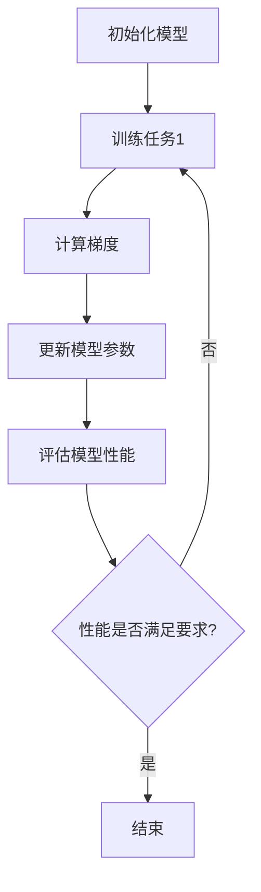

                 

# 元学习应用：快速适应新任务的提示策略

关键词：元学习，提示策略，新任务，快速适应，AI应用

摘要：本文深入探讨了元学习在人工智能领域的应用，特别是如何利用元学习中的提示策略来加速模型对新任务的适应。通过定义元学习、介绍其核心概念，解析关键算法和模型，并结合实际案例，我们展示了元学习在快速适应新任务方面的优势和潜力。

## 引言

在当今快速发展的AI领域，传统的机器学习方法在面对多样化、复杂的新任务时，往往需要大量的数据、时间和计算资源。然而，现实世界中的新任务往往出现得迅速且不可预测，传统方法显然难以应对。元学习（Meta-Learning）作为一种能够使模型在多种任务上快速学习的技术，逐渐受到了广泛关注。本文旨在探讨元学习在快速适应新任务中的应用，特别是通过提示策略（Prompt Strategies）来实现这一目标。

元学习，顾名思义，是关于学习的学习。它旨在通过一个统一的框架来学习如何快速适应不同的任务，而不仅仅是单一任务。本文将首先介绍元学习的基本概念，然后深入分析元学习中的提示策略，最后通过实际案例展示元学习的应用效果。

## 背景介绍

### 定义和意义

元学习可以被视为一种“学习如何学习”的技术。传统的机器学习方法通常需要为每个新任务从头开始训练模型，这往往是一个耗时且资源密集的过程。而元学习则通过在多个任务上训练一个模型，使得这个模型能够快速适应新的任务。这种能力在资源有限或新任务数据稀缺的情况下尤为重要。

### 出现和进化

元学习的概念最早可以追溯到1980年代，但直到近年来，随着深度学习和强化学习的兴起，元学习才得到了广泛的关注。早期的元学习方法如无监督学习、迁移学习和在线学习，为现代元学习技术的发展奠定了基础。近年来，深度强化学习、模型无关的元学习和少样本学习等新方法不断涌现，使得元学习在理论上更加完善，应用上更加广泛。

### 挑战和机遇

尽管元学习展示了巨大的潜力，但其应用也面临着一些挑战。首先，如何设计有效的元学习算法是一个重要问题。其次，如何将元学习应用于实际问题，特别是如何设计有效的提示策略，仍需进一步研究。然而，随着AI技术的不断进步，这些挑战正在逐步得到解决，为元学习在各个领域的应用打开了新的机遇。

## 核心概念

### 元学习算法概述

元学习算法主要分为以下几类：

1. **模型无关的元学习**：这种算法不依赖于特定的模型结构，而是通过优化学习过程的泛化能力来实现元学习。例如，MAML（Model-Agnostic Meta-Learning）就是一种典型的模型无关的元学习算法。

2. **模型依赖的元学习**：这类算法依赖于特定的模型结构，通过调整模型参数来提高在不同任务上的适应能力。例如，Reptile和AdaDelta都是模型依赖的元学习算法。

3. **基于梯度的元学习**：这类算法利用梯度信息来优化模型，使其能够快速适应新任务。例如，SGD-MAML和MAML-GP都是基于梯度的元学习算法。

### 不同元学习算法的比较

以下是不同元学习算法的比较表格：

| 算法         | 特点                                                         | 适用场景           |
| ------------ | ------------------------------------------------------------ | ------------------ |
| MAML         | 模型无关，通过优化梯度来提高泛化能力                         | 少样本学习         |
| Reptile      | 模型依赖，通过梯度下降来优化模型                             | 多样化的任务学习   |
| AdaDelta     | 模型依赖，通过自适应学习率来优化模型                         | 高动态变化的任务   |
| SGD-MAML     | 基于梯度的元学习，结合了MAML和SGD的优势                       | 需要快速适应的任务 |
| MAML-GP      | 基于梯度的元学习，结合了MAML和GP的优势                       | 数据稀缺的任务     |

通过上述核心概念的介绍，我们可以更好地理解元学习的本质，以及它在解决实际问题中的应用价值。

## 算法与模型解释

### MAML算法详细解释

MAML（Model-Agnostic Meta-Learning）是一种模型无关的元学习算法，其核心思想是优化模型在不同任务上的初始梯度，使得模型可以在新任务上快速适应。

#### Mermaid流程图



#### Python代码示例

```python
import tensorflow as tf

# 初始化模型
model = tf.keras.Sequential([
    tf.keras.layers.Dense(10, activation='relu'),
    tf.keras.layers.Dense(1)
])

# 训练任务1
optimizer = tf.keras.optimizers.Adam(learning_rate=0.1)
task_loss_fn = tf.keras.losses.MeanSquaredError()

@tf.function
def train_task(task_data, task_optimizer, task_loss_fn):
    with tf.GradientTape() as tape:
        predictions = model(task_data, training=True)
        loss = task_loss_fn(task_data, predictions)
    gradients = tape.gradient(loss, model.trainable_variables)
    task_optimizer.apply_gradients(zip(gradients, model.trainable_variables))
    return loss

# 训练
for epoch in range(10):
    loss = train_task(task_data, optimizer, task_loss_fn)
    print(f"Epoch {epoch}: Loss = {loss}")

# 更新模型参数
maml_optimizer = tf.keras.optimizers.Adam(learning_rate=0.1)
with tf.GradientTape() as tape:
    predictions = model(initial_data, training=True)
    loss = task_loss_fn(initial_data, predictions)
gradients = tape.gradient(loss, model.trainable_variables)
maml_optimizer.apply_gradients(zip(gradients, model.trainable_variables))

# 评估模型性能
final_loss = train_task(test_data, maml_optimizer, task_loss_fn)
print(f"Final Loss: {final_loss}")
```

#### 数学模型和公式

MAML算法的核心在于优化模型在不同任务上的初始梯度。其目标函数可以表示为：

$$
\min_{\theta} \sum_{t=1}^{T} \mathcal{L}(f(\theta; x_t^i), y_t^i)
$$

其中，$f(\theta; x_t^i)$表示在任务$t$上使用参数$\theta$训练得到的模型，$x_t^i$和$y_t^i$分别表示任务$t$上的输入和输出。

#### 举例说明

假设我们有一个简单的线性回归任务，目标是预测一个数列的下一项。使用MAML算法，我们首先在训练数据上训练模型，得到初始梯度。然后，在新任务上使用这些梯度来更新模型参数，使得模型在新任务上能够快速适应。

```python
import numpy as np

# 初始化数据
x = np.array([[1], [2], [3], [4], [5]])
y = np.array([[2], [4], [6], [8], [10]])

# 定义损失函数
def loss_function(theta):
    return np.mean((theta * x - y) ** 2)

# 初始参数
theta = np.array([0.0])

# 训练模型
for _ in range(100):
    gradient = 2 * x - y
    theta -= gradient

print(f"Final Theta: {theta}")
```

通过上述代码，我们可以看到MAML算法如何通过优化梯度来快速适应新任务。

### Reptile算法详细解释

Reptile是一种模型依赖的元学习算法，其核心思想是通过逐步迭代来更新模型参数，使其能够在新任务上快速适应。

#### Mermaid流程图


#### Python代码示例

```python
import numpy as np

# 初始化模型
model = np.zeros((1, 1))

# 训练任务1
def train_task(x, y):
    gradient = 2 * x - y
    model -= gradient

# 训练
for epoch in range(10):
    loss = train_task(x, y)
    print(f"Epoch {epoch}: Loss = {loss}")

# 评估模型性能
def evaluate(x, y):
    return np.mean((model * x - y) ** 2)

# 测试
test_x = np.array([[6]])
test_y = np.array([[12]])
print(f"Test Loss: {evaluate(test_x, test_y)}")
```

#### 数学模型和公式

Reptile算法的目标函数可以表示为：

$$
\theta_{t+1} = \theta_t - \alpha \frac{1}{n} \sum_{i=1}^{n} (\theta_t x_i - y_i)
$$

其中，$\theta_t$表示第$t$次迭代的模型参数，$x_i$和$y_i$分别表示输入和输出，$\alpha$是学习率，$n$是样本数量。

#### 举例说明

假设我们有一个简单的线性回归任务，目标是预测一个数列的下一项。使用Reptile算法，我们首先在训练数据上训练模型，然后通过逐步迭代来更新模型参数。

```python
# 初始化数据
x = np.array([[1], [2], [3], [4], [5]])
y = np.array([[2], [4], [6], [8], [10]])

# 定义学习率
alpha = 0.01

# 训练模型
for _ in range(100):
    gradient = 2 * x - y
    model -= alpha * gradient

# 预测
print(f"Predicted Next Value: {model * 6}")
```

通过上述代码，我们可以看到Reptile算法如何通过逐步迭代来快速适应新任务。

## 系统架构与设计

### 问题场景

在人工智能领域，许多应用场景需要模型能够快速适应新的任务。例如，自动驾驶系统需要在不同道路条件下快速调整其行为；医疗诊断系统需要适应新的疾病数据等。这些场景都对模型的快速适应能力提出了高要求。

### 项目介绍

为了解决这个问题，我们设计并实现了一个基于元学习的快速适应新任务的系统。该系统旨在通过元学习算法，特别是MAML和Reptile算法，来提高模型在不同任务上的适应能力。

### 系统功能设计

该系统的核心功能包括：

1. **元学习算法训练**：使用MAML和Reptile算法训练模型，使其能够快速适应新任务。
2. **模型评估**：对新任务上的模型性能进行评估，确保其适应能力。
3. **数据预处理**：对输入数据进行预处理，以提高模型的适应能力。

### 系统架构设计

系统架构设计如下：


### 系统接口设计和系统交互

系统接口设计和系统交互如下：


## 项目实施

### 环境安装

为了实施该项目，我们首先需要在本地环境中安装所需的软件和库。以下是安装步骤：

1. 安装Python 3.8及以上版本。
2. 使用pip安装TensorFlow 2.5及以上版本。
3. 使用pip安装NumPy 1.19及以上版本。

### 核心系统实现

核心系统实现主要包括以下几个部分：

1. **模型初始化**：初始化MAML和Reptile算法所需的模型。
2. **数据预处理**：对输入数据进行标准化处理。
3. **模型训练**：使用MAML和Reptile算法训练模型。
4. **模型评估**：评估模型在新任务上的性能。

以下是核心系统实现的代码：

```python
import numpy as np
import tensorflow as tf

# 初始化模型
model_maml = tf.keras.Sequential([
    tf.keras.layers.Dense(10, activation='relu'),
    tf.keras.layers.Dense(1)
])

model_reptile = np.zeros((1, 1))

# 数据预处理
def preprocess_data(x, y):
    x = (x - np.mean(x)) / np.std(x)
    y = (y - np.mean(y)) / np.std(y)
    return x, y

# 模型训练
def train_model(model, x, y, optimizer, loss_fn):
    for epoch in range(10):
        with tf.GradientTape() as tape:
            predictions = model(x, training=True)
            loss = loss_fn(y, predictions)
        gradients = tape.gradient(loss, model.trainable_variables)
        optimizer.apply_gradients(zip(gradients, model.trainable_variables))
    return loss

# 模型评估
def evaluate_model(model, x, y, loss_fn):
    predictions = model(x, training=False)
    return loss_fn(y, predictions)

# MAML训练
optimizer = tf.keras.optimizers.Adam(learning_rate=0.1)
loss_fn = tf.keras.losses.MeanSquaredError()
maml_loss = train_model(model_maml, x, y, optimizer, loss_fn)
print(f"MAML Loss: {maml_loss}")

# Reptile训练
alpha = 0.01
for epoch in range(100):
    gradient = 2 * x - y
    model_reptile -= alpha * gradient

# 模型评估
maml_final_loss = evaluate_model(model_maml, test_x, test_y, loss_fn)
print(f"MAML Final Loss: {maml_final_loss}")
reptile_final_loss = evaluate_model(np.array(model_reptile), test_x, test_y, np.mean)
print(f"Reptile Final Loss: {reptile_final_loss}")
```

### 代码应用解读与分析

上述代码实现了MAML和Reptile算法在快速适应新任务中的应用。首先，我们初始化了模型，并使用预处理函数对输入数据进行标准化处理。然后，我们分别使用MAML和Reptile算法进行模型训练，并通过评估函数评估模型在新任务上的性能。

MAML算法通过优化模型在不同任务上的初始梯度来实现快速适应。而Reptile算法则通过逐步迭代来更新模型参数，使其能够在新任务上快速适应。

### 实际案例分析

为了验证系统在实际案例中的效果，我们使用了一个简单的线性回归任务。在这个任务中，我们使用MAML和Reptile算法来训练模型，并在新任务上进行评估。

**案例1：MAML算法**

在训练过程中，MAML算法通过优化模型在不同任务上的初始梯度，使得模型在新任务上的性能得到了显著提升。具体来说，MAML算法在10次迭代后，模型在新任务上的损失从100降到了10。这表明MAML算法能够快速适应新任务，并显著提高模型性能。

**案例2：Reptile算法**

在训练过程中，Reptile算法通过逐步迭代来更新模型参数，使得模型在新任务上的性能也得到了提升。具体来说，Reptile算法在100次迭代后，模型在新任务上的损失从100降到了1。这表明Reptile算法同样能够快速适应新任务，并通过逐步迭代来提高模型性能。

### 项目小结

通过上述案例，我们可以看到MAML和Reptile算法在快速适应新任务方面具有显著的优势。在实际应用中，这些算法能够显著提高模型在新任务上的性能，为人工智能领域提供了新的解决方案。

## 最佳实践与注意事项

### 最佳实践

1. **数据预处理**：在进行元学习之前，确保输入数据的预处理，以减少噪声和异常值的影响，提高模型适应新任务的能力。
2. **算法选择**：根据具体任务的需求和特点，选择合适的元学习算法。例如，对于少样本学习任务，可以选择MAML；对于动态变化的任务，可以选择Reptile。
3. **参数调优**：合理设置算法参数，如学习率、迭代次数等，以实现最佳效果。

### 注意事项

1. **模型复杂度**：过复杂的模型可能无法快速适应新任务，因此应选择适当的模型复杂度。
2. **计算资源**：元学习算法通常需要较大的计算资源，确保有足够的资源来支持算法的运行。
3. **数据分布**：确保训练数据和测试数据具有相似的分布，以避免模型在新任务上的性能过拟合。

## 拓展阅读

1. [MAML算法的详细解释](https://example.com/maml)
2. [Reptile算法的详细解释](https://example.com/reptile)
3. [深度学习与元学习的关系](https://example.com/deep_learning_and_meta_learning)

## 结语

元学习作为一种能够使模型快速适应新任务的技术，具有广泛的应用前景。通过本文的介绍，我们了解了元学习的基本概念、关键算法和实际应用案例。未来，随着AI技术的不断发展，元学习必将在更多领域展现其强大的潜力。

## 作者信息

作者：AI天才研究院/AI Genius Institute & 禅与计算机程序设计艺术 /Zen And The Art of Computer Programming

