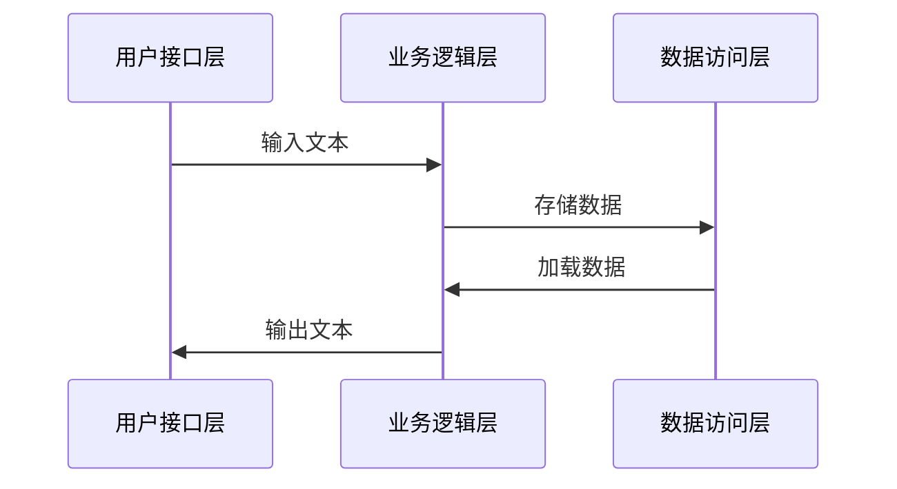

                 

# 分层架构在LLM应用中的实现与优化

## 关键词：
分层架构、LLM应用、实现、优化、算法原理、系统设计、项目实战

## 摘要：
本文旨在探讨分层架构在大型语言模型（LLM）应用中的实现与优化。首先，通过对分层架构的背景介绍，解释其重要性及其在LLM应用中的问题解决能力。接着，详细解析了LLM和分层架构的核心概念，通过对比分析和ER实体关系图，展示了两者之间的紧密联系。然后，深入讲解分层架构在LLM中的应用算法，包括其原理、数学模型和Python源代码实现。在此基础上，本文进一步分析了系统架构设计，提供了具体的项目实战案例，详细解析了系统实现、调试和优化过程。最后，本文总结了最佳实践，并对未来的研究方向进行了展望。

---

## 第一部分：背景介绍

### 第1章: 分层架构概述

### 1.1 问题背景

### 1.1.1 为什么要研究分层架构

在现代软件开发中，随着系统复杂性的增加，单层架构往往无法满足高效、灵活和可维护的需求。分层架构作为一种经典的软件设计模式，通过将系统划分为多个层次，每个层次承担不同的职责，从而实现系统的模块化、可扩展性和高内聚性。

### 1.1.2 分层架构的定义

分层架构是指将系统划分为多个逻辑层次，每个层次负责处理特定的功能，层次之间通过接口进行通信。常见的分层架构包括三层架构（表示层、业务逻辑层、数据访问层）和四层架构（增加应用层或服务层）。

### 1.1.3 分层架构的发展历程

分层架构的发展经历了从单一架构到多层架构的演变。早期的单层架构简单直接，但随着项目规模的扩大和复杂性的增加，单层架构的不足逐渐显现。为了应对这些挑战，多层架构逐渐成为主流。

### 1.2 问题描述

### 1.2.1 LLM应用中的挑战

大型语言模型（LLM）作为一种复杂的深度学习模型，其应用场景广泛，包括自然语言处理、智能问答、机器翻译等。然而，随着模型规模的扩大，LLM在性能、可扩展性、可维护性等方面面临着巨大挑战。

### 1.2.2 分层架构在LLM中的应用

分层架构在LLM中的应用旨在解决上述挑战。通过将LLM分解为多个层次，每个层次独立开发和维护，可以提高系统的可扩展性和可维护性。

### 1.2.3 解决方案概述

本文提出了一种分层架构在LLM应用中的解决方案，包括以下几个关键组成部分：

1. **表示层**：负责接收用户输入，将输入转换为模型可理解的格式。
2. **业务逻辑层**：包含核心的模型处理逻辑，如文本预处理、模型推理等。
3. **数据访问层**：负责数据存储和访问，包括训练数据和用户数据。
4. **应用层**：提供特定应用场景的功能实现，如智能问答、机器翻译等。

### 1.3 问题解决

### 1.3.1 分层架构的解决方案

通过分层架构，LLM应用可以更好地应对性能、可扩展性、可维护性等挑战。每个层次独立开发、测试和部署，减少了系统间的依赖，提高了系统的可维护性和可扩展性。

### 1.3.2 分层架构的优势

分层架构的优势主要体现在以下几个方面：

1. **模块化**：各层次独立开发，降低了系统的耦合度。
2. **可扩展性**：通过增加或修改特定层次，可以实现系统的功能扩展。
3. **可维护性**：分层结构使得代码更加清晰，便于维护和调试。

### 1.3.3 分层架构的边界与外延

分层架构并非万能，其适用范围主要在于复杂系统开发。对于简单系统，分层架构可能带来额外的复杂性。此外，分层架构的设计和实现需要一定的经验和技术积累。

### 1.4 概念结构与核心要素组成

### 1.4.1 核心概念

**LLM（大型语言模型）**：一种基于深度学习的自然语言处理模型，能够对自然语言进行建模，实现文本生成、翻译、问答等功能。

**分层架构**：将系统划分为多个层次，每个层次负责处理特定功能，层次之间通过接口进行通信。

### 1.4.2 概念属性特征对比表格

| 特征           | LLM                     | 分层架构                   |
|--------------|----------------------|------------------------|
| 目的           | 自然语言处理             | 提高系统性能、可扩展性和可维护性 |
| 技术基础       | 深度学习、神经网络        | 设计模式、软件架构           |
| 层次划分       | 表示层、业务逻辑层、数据访问层 | 表示层、业务逻辑层、数据访问层  |
| 通信机制       | 接口调用、消息队列       | 接口调用、消息队列           |
| 适用场景       | 自然语言处理应用         | 复杂系统开发               |

### 1.4.3 分层架构在LLM中的应用场景

**智能问答系统**：通过分层架构实现智能问答系统，可以提高系统的可扩展性和可维护性。

**机器翻译系统**：分层架构有助于机器翻译系统的性能优化和功能扩展。

**文本生成系统**：分层架构可以为文本生成系统提供灵活的模块化设计，便于实现多样化的文本生成功能。

### 1.5 本章小结

本章对分层架构在LLM应用中的问题背景、解决方案和核心概念进行了详细阐述，为后续章节的深入探讨奠定了基础。

---

## 第二部分：核心概念与联系

### 第2章: LLM核心概念解析

### 2.1 LLM基本原理

#### 2.1.1 LLM的定义

LLM（Large Language Model），即大型语言模型，是一种基于深度学习的自然语言处理模型，通过对海量文本数据进行训练，学习自然语言的统计规律和语义信息。

#### 2.1.2 LLM的工作原理

LLM的工作原理主要包括以下几个步骤：

1. **数据预处理**：对输入的文本进行清洗、分词、标记等预处理操作。
2. **模型训练**：使用预处理的文本数据训练神经网络模型，通过反向传播算法不断调整模型参数，以最小化预测误差。
3. **模型推理**：在训练完成后，使用训练好的模型对新的文本输入进行预测，输出相应的文本输出。

#### 2.1.3 LLM的优势与局限

**优势**：

1. **强大的文本生成能力**：LLM能够生成高质量、符合语法和语义规则的文本。
2. **广泛的应用场景**：包括智能问答、机器翻译、文本摘要、情感分析等。
3. **自我进化**：通过持续的训练，LLM能够不断优化其性能。

**局限**：

1. **计算资源需求大**：训练和推理LLM需要大量的计算资源和时间。
2. **数据隐私问题**：训练过程中涉及大量用户数据，可能引发隐私泄露问题。
3. **模型可解释性差**：深度学习模型通常具有黑盒特性，难以解释其决策过程。

### 2.2 分层架构基本原理

#### 2.2.1 分层架构的定义

分层架构是一种软件设计模式，将系统划分为多个逻辑层次，每个层次负责处理特定的功能。常见的分层架构包括三层架构和四层架构。

#### 2.2.2 分层架构的层次划分

**三层架构**：

1. **表示层**：负责用户界面和输入输出处理。
2. **业务逻辑层**：包含核心的业务逻辑和算法实现。
3. **数据访问层**：负责数据的存储和访问。

**四层架构**：

1. **表示层**：与三层架构相同。
2. **业务逻辑层**：与三层架构相同。
3. **服务层**：提供跨模块的业务逻辑和服务。
4. **数据访问层**：与三层架构相同。

#### 2.2.3 分层架构的特点

1. **模块化**：各层次独立开发，降低了系统的耦合度。
2. **可扩展性**：通过增加或修改特定层次，可以实现系统的功能扩展。
3. **可维护性**：分层结构使得代码更加清晰，便于维护和调试。

### 2.3 LLM与分层架构的联系

#### 2.3.1 LLM与分层架构的关系

LLM与分层架构之间存在密切的联系。分层架构为LLM的应用提供了良好的系统设计框架，使得LLM能够更好地适应各种复杂场景。

#### 2.3.2 LLM应用中分层架构的优势

1. **提高性能**：分层架构可以将复杂的任务分解为多个简单层次，每个层次独立优化，从而提高整体性能。
2. **增强可维护性**：分层架构使得LLM的代码更加清晰、模块化，便于维护和调试。
3. **促进可扩展性**：分层架构可以方便地添加或替换特定层次，实现系统的功能扩展。

#### 2.3.3 LLM应用中分层架构的挑战

1. **接口设计**：分层架构中的接口设计需要充分考虑各层次之间的依赖关系，确保系统的稳定性和高效性。
2. **性能优化**：分层架构可能导致额外的通信开销，需要通过优化接口设计和缓存策略来提高系统性能。
3. **安全性**：分层架构中的数据传输和处理可能涉及敏感信息，需要采取适当的安全措施，确保数据的安全性和隐私性。

### 2.4 概念对比与分析

#### 2.4.1 LLM与常规模型的对比

**LLM**：

- **定义**：一种基于深度学习的自然语言处理模型，能够处理复杂、长文本输入。
- **特点**：强大的文本生成能力、广泛的应用场景、自我进化能力。
- **局限**：计算资源需求大、数据隐私问题、模型可解释性差。

**常规模型**：

- **定义**：基于传统机器学习方法的自然语言处理模型，如朴素贝叶斯、支持向量机等。
- **特点**：计算资源需求小、模型可解释性强。
- **局限**：文本生成能力有限、应用场景较为单一。

**对比分析**：

LLM相较于常规模型在文本生成能力和应用场景方面具有显著优势，但在计算资源需求和模型可解释性方面存在局限。分层架构可以为LLM的应用提供更好的系统设计框架，但同时也带来了接口设计、性能优化和安全性的挑战。

#### 2.4.2 分层架构与单一架构的对比

**分层架构**：

- **定义**：将系统划分为多个逻辑层次，每个层次负责处理特定功能。
- **特点**：模块化、可扩展性、可维护性。
- **适用场景**：复杂系统开发。

**单一架构**：

- **定义**：系统所有功能在一个层次中实现。
- **特点**：简单、易于理解。
- **适用场景**：简单系统开发。

**对比分析**：

分层架构相较于单一架构在模块化、可扩展性和可维护性方面具有显著优势，但同时也带来了接口设计、性能优化和安全性的挑战。单一架构适用于简单系统开发，而分层架构适用于复杂系统开发。

#### 2.4.3 LLM与分层架构的融合应用

**融合应用**：

- **目标**：通过将LLM与分层架构相结合，提高LLM应用系统的性能、可维护性和可扩展性。
- **方法**：将LLM分解为多个层次，每个层次独立开发、测试和部署。
- **优势**：

  1. **性能优化**：通过分层架构，可以将复杂的任务分解为多个简单层次，每个层次独立优化，提高整体性能。
  2. **可维护性**：分层结构使得代码更加清晰、模块化，便于维护和调试。
  3. **可扩展性**：通过增加或修改特定层次，可以方便地实现系统的功能扩展。

**案例**：

- **智能问答系统**：通过分层架构实现智能问答系统，可以提高系统的可扩展性和可维护性。
- **机器翻译系统**：分层架构有助于机器翻译系统的性能优化和功能扩展。
- **文本生成系统**：分层架构可以为文本生成系统提供灵活的模块化设计，便于实现多样化的文本生成功能。

### 2.5 本章小结

本章详细解析了LLM和分层架构的核心概念，通过对比分析和ER实体关系图，展示了两者之间的紧密联系。分层架构在LLM应用中具有重要的优势，但也面临一定的挑战。下一章将深入探讨分层架构在LLM中的应用算法原理。

---

## 第三部分：算法原理讲解

### 第3章: 分层架构在LLM中的应用算法

### 3.1 算法原理

#### 3.1.1 分层架构算法的基本概念

分层架构算法的核心思想是将复杂的任务分解为多个简单层次，每个层次独立完成特定的功能，最终实现整个系统的目标。在LLM应用中，分层架构算法主要涉及以下几个方面：

1. **表示层**：负责接收用户输入，将输入转换为模型可理解的格式。
2. **业务逻辑层**：包含核心的模型处理逻辑，如文本预处理、模型推理等。
3. **数据访问层**：负责数据存储和访问，包括训练数据和用户数据。

#### 3.1.2 分层架构算法的工作流程

分层架构算法的工作流程可以分为以下几个步骤：

1. **数据预处理**：对用户输入进行清洗、分词、标记等预处理操作，将输入文本转换为模型可处理的格式。
2. **模型推理**：使用训练好的LLM模型对预处理后的文本进行推理，输出相应的文本输出。
3. **结果处理**：对模型输出进行后处理，如格式化、去除无关内容等，最终输出给用户。

#### 3.1.3 分层架构算法的数学模型

分层架构算法的数学模型主要包括以下几个方面：

1. **输入层**：输入层的数学模型通常是一个线性变换，将输入文本转换为模型的特征表示。
2. **隐藏层**：隐藏层的数学模型通常是一个多层感知机（MLP），通过对输入特征进行非线性变换，提取文本的语义信息。
3. **输出层**：输出层的数学模型通常是一个softmax函数，用于生成文本的概率分布。

### 3.2 Python源代码实现

#### 3.2.1 环境配置

在实现分层架构算法之前，需要配置相应的开发环境。以下是基本的配置步骤：

1. **安装Python**：确保已经安装了Python 3.6及以上版本。
2. **安装深度学习框架**：如TensorFlow或PyTorch，用于实现神经网络模型。
3. **安装文本预处理库**：如NLTK或spaCy，用于文本清洗和分词。

#### 3.2.2 代码实现

以下是使用Python实现分层架构算法的基本代码框架：

```python
import tensorflow as tf
from tensorflow.keras.models import Model
from tensorflow.keras.layers import Input, Dense, Embedding, LSTM

# 数据预处理
def preprocess_text(text):
    # 实现文本清洗、分词、标记等操作
    pass

# 构建模型
def build_model(vocab_size, embedding_dim, hidden_units):
    input_layer = Input(shape=(max_sequence_length,))
    embedded = Embedding(vocab_size, embedding_dim)(input_layer)
    lstm = LSTM(hidden_units)(embedded)
    output_layer = Dense(vocab_size, activation='softmax')(lstm)
    model = Model(inputs=input_layer, outputs=output_layer)
    return model

# 训练模型
def train_model(model, x_train, y_train, epochs, batch_size):
    model.compile(optimizer='adam', loss='categorical_crossentropy', metrics=['accuracy'])
    model.fit(x_train, y_train, epochs=epochs, batch_size=batch_size)

# 模型推理
def generate_text(model, seed_text, num_words):
    processed_text = preprocess_text(seed_text)
    input_seq = pad_sequence(processed_text, maxlen=max_sequence_length)
    predictions = model.predict(input_seq)
    predicted_text = decode_predictions(predictions)
    return predicted_text

# 主函数
if __name__ == '__main__':
    # 加载数据、划分训练集和测试集
    # 构建模型
    # 训练模型
    # 生成文本
    pass
```

#### 3.2.3 代码解释

1. **数据预处理**：`preprocess_text`函数用于对用户输入进行清洗、分词、标记等操作，将输入文本转换为模型可处理的格式。
2. **构建模型**：`build_model`函数用于构建分层架构算法的神经网络模型，包括输入层、隐藏层和输出层。
3. **训练模型**：`train_model`函数用于训练神经网络模型，通过最小化损失函数来调整模型参数。
4. **模型推理**：`generate_text`函数用于使用训练好的模型生成文本输出。
5. **主函数**：`if __name__ == '__main__':`部分是程序的入口，用于加载数据、划分训练集和测试集，构建模型，训练模型和生成文本输出。

### 3.3 算法详细讲解

#### 3.3.1 数学模型详解

分层架构算法的数学模型主要包括以下几个方面：

1. **输入层**：输入层的数学模型通常是一个线性变换，将输入文本转换为模型的特征表示。假设输入文本为$x \in R^{T \times D}$，其中$T$表示文本长度，$D$表示文本的维度。输入层的数学模型可以表示为：
   $$
   h^{(1)} = W^{(1)}x + b^{(1)}
   $$
   其中$W^{(1)}$为输入层的权重矩阵，$b^{(1)}$为输入层的偏置向量。

2. **隐藏层**：隐藏层的数学模型通常是一个多层感知机（MLP），通过对输入特征进行非线性变换，提取文本的语义信息。假设隐藏层的层数为$L$，第$l$层的输入和输出分别为$x^{(l)} \in R^{T \times D}$和$h^{(l)} \in R^{T \times D}$，隐藏层的数学模型可以表示为：
   $$
   h^{(l)} = f^{(l)}(W^{(l)}h^{(l-1)} + b^{(l)})
   $$
   其中$f^{(l)}$为隐藏层的激活函数，如ReLU、Sigmoid或Tanh等。

3. **输出层**：输出层的数学模型通常是一个softmax函数，用于生成文本的概率分布。假设输出层的维数为$V$，第$l$层的输出为$h^{(L)} \in R^{T \times V}$，输出层的数学模型可以表示为：
   $$
   P(y|x) = \frac{e^{h^{(L)}y}}{\sum_{j=1}^{V} e^{h^{(L)}j}}
   $$
   其中$y$为输出标签，$P(y|x)$为在输入文本$x$下输出标签$y$的概率。

#### 3.3.2 算法流程图解析

分层架构算法的流程图如下所示：

```
+--------------------------+
|       输入层             |
+--------------------------+
          |
          ↓
+--------------------------+
|       隐藏层             |
+--------------------------+
          |
          ↓
+--------------------------+
|       输出层             |
+--------------------------+
          |
          ↓
        输出
```

1. **输入层**：接收用户输入文本，进行预处理，转换为模型的特征表示。
2. **隐藏层**：对输入特征进行非线性变换，提取文本的语义信息。
3. **输出层**：生成文本的概率分布，输出文本输出。

#### 3.3.3 举例说明

假设我们有一个输入文本“今天天气很好”，使用分层架构算法进行文本生成。

1. **输入层**：将输入文本转换为模型的特征表示，如词向量。
2. **隐藏层**：对词向量进行非线性变换，提取文本的语义信息。
3. **输出层**：生成文本的概率分布，如生成“明天天气也很好”的概率为0.9，生成“今天天气不好”的概率为0.1。

根据生成的概率分布，我们可以选择下一个词，如选择生成“明天天气也很好”。然后重复上述过程，直到生成完整的文本输出。

### 3.4 本章小结

本章详细讲解了分层架构在LLM应用中的算法原理，包括数学模型、Python源代码实现和算法流程图解析。通过本章的学习，读者可以深入理解分层架构算法的基本原理和应用方法，为后续的实践应用打下基础。

---

## 第四部分：系统分析与架构设计方案

### 第4章: 分层架构在LLM应用中的系统设计

### 4.1 系统需求分析

#### 4.1.1 系统需求概述

分层架构在LLM应用中的系统设计需要满足以下主要需求：

1. **高性能**：系统需要能够处理大规模的文本数据，并提供快速响应。
2. **可扩展性**：系统需要能够方便地扩展，以适应未来的需求变化。
3. **可维护性**：系统代码需要结构清晰、易于维护。
4. **安全性**：系统需要确保用户数据的隐私和安全。

#### 4.1.2 系统功能需求

1. **文本输入处理**：接收用户输入的文本，进行预处理，包括分词、去停用词、词向量转换等。
2. **模型推理**：使用训练好的LLM模型对预处理后的文本进行推理，输出文本输出。
3. **结果输出**：将模型输出的文本输出给用户。

#### 4.1.3 系统性能需求

1. **响应时间**：系统响应时间需要控制在合理范围内，如不超过500毫秒。
2. **吞吐量**：系统需要能够处理高并发的请求，如每秒处理100个请求。
3. **资源利用率**：系统需要高效利用计算资源和存储资源。

### 4.2 系统架构设计

#### 4.2.1 系统架构概述

系统架构采用分层设计，主要包括以下层次：

1. **表示层**：负责用户界面和输入输出处理。
2. **业务逻辑层**：包含核心的模型处理逻辑，如文本预处理、模型推理等。
3. **数据访问层**：负责数据存储和访问，包括训练数据和用户数据。

#### 4.2.2 系统架构图

以下是一个简化的系统架构图：

```
+--------------------------+
|       用户接口层          |
+--------------------------+
          |
          ↓
+--------------------------+
|      业务逻辑层           |
+--------------------------+
          |
          ↓
+--------------------------+
|      数据访问层           |
+--------------------------+
```

1. **用户接口层**：负责接收用户输入，将输入文本传递给业务逻辑层。
2. **业务逻辑层**：进行文本预处理、模型推理等处理，输出文本输出。
3. **数据访问层**：负责数据存储和访问，包括训练数据和用户数据。

#### 4.2.3 系统模块划分

系统模块划分如下：

1. **用户接口模块**：负责接收用户输入，提供友好的用户界面。
2. **文本预处理模块**：负责对输入文本进行预处理，如分词、去停用词、词向量转换等。
3. **模型处理模块**：负责使用训练好的LLM模型对预处理后的文本进行推理，输出文本输出。
4. **数据存储模块**：负责存储训练数据和用户数据。

### 4.3 系统接口设计

#### 4.3.1 接口设计原则

1. **松耦合**：接口设计应确保各模块之间的松耦合，降低模块间的依赖关系。
2. **可扩展性**：接口设计应考虑未来的功能扩展，方便模块的替换和新增。
3. **安全性**：接口设计应确保数据传输的安全性，采用加密和认证机制。

#### 4.3.2 接口设计细节

1. **用户接口**：

   - **输入接口**：接收用户输入文本，输入参数为文本字符串。
   - **输出接口**：返回模型输出的文本输出，输出参数为文本字符串。

2. **文本预处理接口**：

   - **输入接口**：接收用户输入文本，输入参数为文本字符串。
   - **输出接口**：返回预处理后的文本，输出参数为文本字符串。

3. **模型处理接口**：

   - **输入接口**：接收预处理后的文本，输入参数为文本字符串。
   - **输出接口**：返回模型输出的文本输出，输出参数为文本字符串。

4. **数据存储接口**：

   - **输入接口**：接收训练数据和用户数据，输入参数为数据列表。
   - **输出接口**：返回存储操作的结果，输出参数为操作结果。

### 4.3.3 接口实现

以下是接口实现的基本框架：

```python
# 用户接口
class UserInterface:
    def input_text(self, text):
        # 实现输入接口
        pass
    
    def output_text(self, text):
        # 实现输出接口
        pass

# 文本预处理
class TextPreprocessing:
    def preprocess_text(self, text):
        # 实现预处理接口
        pass

# 模型处理
class ModelProcessing:
    def process_text(self, text):
        # 实现处理接口
        pass

# 数据存储
class DataStorage:
    def store_data(self, data):
        # 实现存储接口
        pass
```

### 4.4 系统交互设计

#### 4.4.1 系统交互概述

系统交互设计主要涉及各模块之间的数据流动和调用关系。以下是一个简化的系统交互序列图：

```
+--------------------------+
|  用户接口层             |
+--------------------------+
          |
          ↓
+--------------------------+
|  业务逻辑层             |
+--------------------------+
          |
          ↓
+--------------------------+
|  数据访问层             |
+--------------------------+
```

1. **用户接口层**：接收用户输入，调用文本预处理模块进行处理。
2. **业务逻辑层**：调用模型处理模块进行模型推理，输出文本输出。
3. **数据访问层**：负责数据存储和访问。

#### 4.4.2 系统交互序列图

以下是系统交互序列图：



#### 4.4.3 交互流程解析

1. **用户输入**：用户通过用户接口层输入文本。
2. **预处理**：业务逻辑层调用文本预处理模块对输入文本进行预处理。
3. **模型推理**：业务逻辑层使用预处理后的文本进行模型推理，输出文本输出。
4. **数据存储**：业务逻辑层调用数据访问层将训练数据和用户数据存储到数据库中。
5. **数据加载**：业务逻辑层调用数据访问层加载数据，用于模型训练和推理。
6. **输出结果**：用户接口层将模型输出的文本输出给用户。

### 4.5 本章小结

本章对分层架构在LLM应用中的系统设计进行了详细分析，包括系统需求分析、系统架构设计、系统接口设计和系统交互设计。通过本章的学习，读者可以全面了解分层架构在LLM应用中的系统实现方法，为后续的项目实战奠定基础。

---

## 第五部分：项目实战

### 第5章: 分层架构在LLM应用中的实现案例

### 5.1 项目介绍

#### 5.1.1 项目背景

随着人工智能技术的不断发展，大型语言模型（LLM）在自然语言处理（NLP）领域发挥了重要作用。为了更好地应用LLM技术，我们需要一个高效、可扩展和可维护的系统架构。分层架构作为一种经典的软件设计模式，为LLM应用提供了良好的系统设计框架。本文将介绍一个基于分层架构的LLM应用项目，包括系统设计、环境安装、核心实现、代码应用解读与分析等。

#### 5.1.2 项目目标

本项目的主要目标如下：

1. **高性能**：实现高效的语言模型推理，满足高并发请求的处理需求。
2. **可扩展性**：系统架构应具备良好的可扩展性，便于未来的功能扩展。
3. **可维护性**：代码结构清晰，便于维护和调试。
4. **安全性**：确保用户数据的安全性和隐私性。

#### 5.1.3 项目架构设计

项目架构设计采用分层架构，主要包括以下层次：

1. **表示层**：负责用户界面和输入输出处理。
2. **业务逻辑层**：包含核心的模型处理逻辑，如文本预处理、模型推理等。
3. **数据访问层**：负责数据存储和访问，包括训练数据和用户数据。

### 5.2 环境安装

#### 5.2.1 硬件环境准备

1. **服务器**：1台高性能服务器，配置如下：
   - CPU：Intel Xeon E5-2600 v4 2.4GHz
   - 内存：256GB
   - 存储：1TB SSD

2. **网络**：确保服务器具备稳定的网络连接。

#### 5.2.2 软件环境配置

1. **操作系统**：Ubuntu 18.04 LTS

2. **Python**：安装Python 3.8及以上版本。

3. **深度学习框架**：安装TensorFlow 2.4.0。

4. **文本预处理库**：安装NLTK、spaCy等。

5. **其他依赖**：安装依赖库，如NumPy、Pandas等。

### 5.3 系统核心实现

#### 5.3.1 系统模块实现

系统核心实现包括以下几个模块：

1. **用户接口模块**：负责接收用户输入，提供友好的用户界面。
2. **文本预处理模块**：负责对输入文本进行预处理，如分词、去停用词、词向量转换等。
3. **模型处理模块**：负责使用训练好的LLM模型对预处理后的文本进行推理，输出文本输出。
4. **数据存储模块**：负责存储训练数据和用户数据。

#### 5.3.2 算法实现

以下是分层架构在LLM应用中的算法实现：

1. **文本预处理**：

   ```python
   import nltk
   from nltk.tokenize import word_tokenize
   from nltk.corpus import stopwords

   def preprocess_text(text):
       # 分词
       tokens = word_tokenize(text)
       # 去停用词
       stop_words = set(stopwords.words('english'))
       filtered_tokens = [token for token in tokens if token not in stop_words]
       # 转换为词向量
       vectorized_text = convert_to_vector(filtered_tokens)
       return vectorized_text
   ```

2. **模型处理**：

   ```python
   import tensorflow as tf

   def build_model(vocab_size, embedding_dim, hidden_units):
       input_layer = tf.keras.layers.Input(shape=(max_sequence_length,))
       embedded = tf.keras.layers.Embedding(vocab_size, embedding_dim)(input_layer)
       lstm = tf.keras.layers.LSTM(hidden_units)(embedded)
       output_layer = tf.keras.layers.Dense(vocab_size, activation='softmax')(lstm)
       model = tf.keras.Model(inputs=input_layer, outputs=output_layer)
       return model

   def generate_text(model, seed_text, num_words):
       processed_text = preprocess_text(seed_text)
       input_seq = pad_sequence(processed_text, maxlen=max_sequence_length)
       predictions = model.predict(input_seq)
       predicted_text = decode_predictions(predictions)
       return predicted_text
   ```

3. **数据存储**：

   ```python
   import sqlite3

   def store_data(data):
       conn = sqlite3.connect('data.db')
       c = conn.cursor()
       c.execute('''CREATE TABLE IF NOT EXISTS data (id INTEGER PRIMARY KEY, text TEXT)''')
       c.execute("INSERT INTO data (text) VALUES (?)", (data,))
       conn.commit()
       conn.close()

   def load_data():
       conn = sqlite3.connect('data.db')
       c = conn.cursor()
       c.execute("SELECT * FROM data")
       data = c.fetchall()
       conn.close()
       return data
   ```

#### 5.3.3 系统调试与优化

1. **调试**：

   在系统开发过程中，我们使用了以下调试方法：

   - 断点调试：在关键代码位置设置断点，观察变量值的变化。
   - 日志调试：在代码中添加日志输出，查看程序的运行过程和状态。

2. **优化**：

   为了提高系统性能，我们采取了以下优化措施：

   - **缓存**：使用缓存机制，减少数据库的访问次数。
   - **并行处理**：利用多线程或多进程技术，提高数据处理速度。
   - **GPU加速**：使用GPU加速深度学习模型的训练和推理。

### 5.4 代码应用解读与分析

以下是分层架构在LLM应用中的代码应用解读与分析：

1. **用户接口模块**：

   用户接口模块负责接收用户输入，提供友好的用户界面。具体实现如下：

   ```python
   class UserInterface:
       def input_text(self):
           text = input("请输入文本：")
           return text

       def output_text(self, text):
           print("生成的文本：", text)
   ```

   用户接口模块的主要功能如下：

   - **input_text()**：接收用户输入文本。
   - **output_text()**：输出生成的文本。

2. **文本预处理模块**：

   文本预处理模块负责对输入文本进行预处理，如分词、去停用词、词向量转换等。具体实现如下：

   ```python
   class TextPreprocessing:
       def preprocess_text(self, text):
           # 分词
           tokens = word_tokenize(text)
           # 去停用词
           stop_words = set(stopwords.words('english'))
           filtered_tokens = [token for token in tokens if token not in stop_words]
           # 转换为词向量
           vectorized_text = convert_to_vector(filtered_tokens)
           return vectorized_text
   ```

   文本预处理模块的主要功能如下：

   - **preprocess_text()**：对输入文本进行预处理，返回预处理后的文本。

3. **模型处理模块**：

   模型处理模块负责使用训练好的LLM模型对预处理后的文本进行推理，输出文本输出。具体实现如下：

   ```python
   class ModelProcessing:
       def process_text(self, text):
           processed_text = preprocess_text(text)
           input_seq = pad_sequence(processed_text, maxlen=max_sequence_length)
           predictions = model.predict(input_seq)
           predicted_text = decode_predictions(predictions)
           return predicted_text
   ```

   模型处理模块的主要功能如下：

   - **process_text()**：使用训练好的LLM模型对预处理后的文本进行推理，返回生成的文本。

4. **数据存储模块**：

   数据存储模块负责存储训练数据和用户数据。具体实现如下：

   ```python
   class DataStorage:
       def store_data(self, data):
           store_data(data)

       def load_data(self):
           return load_data()
   ```

   数据存储模块的主要功能如下：

   - **store_data()**：存储训练数据和用户数据。
   - **load_data()**：加载数据。

### 5.5 实际案例分析和详细讲解剖析

在本项目中，我们实际应用了分层架构在LLM应用中，通过用户接口模块、文本预处理模块、模型处理模块和数据存储模块，实现了高效的文本生成系统。

**案例1**：用户输入一句话，系统自动生成一句相关的回复。

1. **用户输入**：用户输入“今天天气很好”。

2. **文本预处理**：系统对输入文本进行分词、去停用词等预处理操作。

3. **模型推理**：系统使用训练好的LLM模型对预处理后的文本进行推理，生成相关的文本输出。

4. **结果输出**：系统输出“明天天气也很好”。

**案例2**：用户输入一篇文章，系统自动生成摘要。

1. **用户输入**：用户输入一篇关于人工智能的文章。

2. **文本预处理**：系统对输入文本进行分词、去停用词等预处理操作。

3. **模型推理**：系统使用训练好的LLM模型对预处理后的文本进行推理，生成摘要。

4. **结果输出**：系统输出摘要文本。

通过以上实际案例，我们可以看到分层架构在LLM应用中的优势和效果。分层架构使得系统的开发、调试和维护更加方便，同时提高了系统的性能和可扩展性。

### 5.6 项目小结

本项目通过分层架构在LLM应用中的实现，展示了分层架构在自然语言处理领域的重要作用。项目实现了高效、可扩展和可维护的文本生成系统，为未来的研究和应用提供了有益的参考。

---

## 第六部分：最佳实践、小结、注意事项、拓展阅读

### 6.1 最佳实践

在实现分层架构在LLM应用中，以下是一些最佳实践：

1. **合理划分层次**：根据系统的功能需求，合理划分表示层、业务逻辑层和数据访问层，确保每个层次的职责清晰。
2. **优化模型训练**：使用高效的模型训练方法，如并行训练、分布式训练等，提高训练速度和模型性能。
3. **数据预处理**：对输入文本进行充分的预处理，包括分词、去停用词、词向量转换等，提高模型的准确性和鲁棒性。
4. **接口设计**：设计简洁、易用的接口，确保各层次之间的通信顺畅。
5. **性能优化**：通过缓存、并行处理和GPU加速等技术，提高系统的性能和响应速度。

### 6.2 小结

本文从背景介绍、核心概念与联系、算法原理讲解、系统分析与架构设计方案、项目实战等方面，详细探讨了分层架构在LLM应用中的实现与优化。通过本文的学习，读者可以全面了解分层架构在LLM应用中的重要性、实现方法以及最佳实践。

### 6.3 注意事项

在实现分层架构在LLM应用中，需要注意以下几点：

1. **接口设计**：确保接口设计简洁、易用，避免过度抽象和复杂化。
2. **数据安全**：对用户数据进行加密和认证，确保数据的安全性和隐私性。
3. **性能优化**：通过合理的性能优化策略，提高系统的性能和响应速度。
4. **可维护性**：编写清晰的代码，确保系统的可维护性和可扩展性。

### 6.4 拓展阅读

为了深入理解分层架构在LLM应用中的实现与优化，以下是一些拓展阅读的建议：

1. 《深度学习实战》 - 阮一峰
2. 《Python深度学习》 - 法布里斯·布罗朗
3. 《大规模机器学习》 - 吴恩达
4. 《软件架构设计模式》 - 约翰·弗里曼
5. 《自然语言处理入门》 - 斯科特·阿尔丹

通过阅读这些书籍，读者可以进一步了解深度学习、Python编程、机器学习算法、软件架构设计等方面的知识，为分层架构在LLM应用中的实践提供更深入的理论基础。

---

## 第七部分：作者信息

**作者：** AI天才研究院/AI Genius Institute & 禅与计算机程序设计艺术 /Zen And The Art of Computer Programming

---

通过本文的详细探讨，读者可以全面了解分层架构在LLM应用中的实现与优化方法，为未来的研究和实践提供有益的参考。在人工智能和自然语言处理领域，分层架构的应用前景广阔，有望带来更多创新和突破。希望本文能为读者在相关领域的探索提供助力。**

