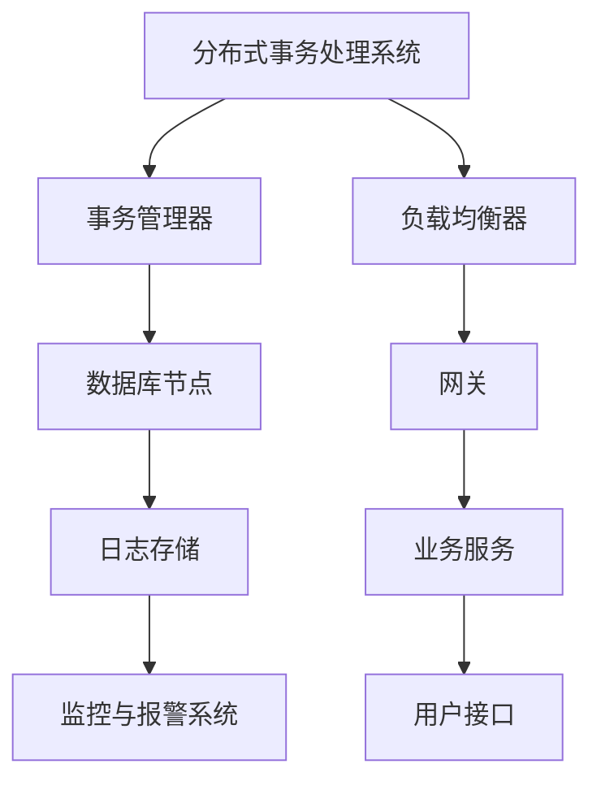

                 

### 分布式事务在LLM应用中的处理策略

分布式事务在分布式系统中至关重要，特别是在大型语言模型（LLM）的应用中。LLM作为现代人工智能领域的关键技术，其处理能力和应用场景日益广泛，但同时也面临着分布式事务处理的挑战。本文将深入探讨分布式事务在LLM应用中的处理策略，旨在为读者提供系统而全面的理解。

## 关键词

- 分布式事务
- 大型语言模型（LLM）
- 一致性协议
- 三角法
- 乐观锁
- 悲观锁
- 系统架构设计
- 项目实战

## 摘要

本文从分布式事务的定义和特性出发，详细阐述了分布式事务在LLM应用中的重要性和挑战。随后，我们分析了分布式事务处理的核心概念、原理和算法，包括一致性协议、分布式锁机制和事务管理器。在此基础上，本文介绍了分布式事务处理系统设计的关键要素，并提供了实际项目中的案例分析。最后，文章总结了分布式事务处理在LLM应用中的最佳实践，为后续研究和实践提供了指导。

## 引言

### 问题背景

随着云计算和分布式系统的普及，分布式事务处理成为现代信息系统中的一个核心问题。分布式事务指的是跨越多个节点的数据库或系统中的多个操作，这些操作必须要么全部成功，要么全部失败，以保证数据的一致性。在传统的集中式系统中，事务处理相对简单，因为所有操作都在单个数据库或系统中进行。然而，在分布式系统中，事务处理变得更加复杂，因为数据分散在不同的节点上，并且网络延迟、节点故障等不可控因素增加了系统的复杂性。

### 大型语言模型（LLM）的发展与挑战

大型语言模型（LLM）是近年来人工智能领域的重要进展，尤其在自然语言处理（NLP）任务中表现出色。LLM通常由数十亿甚至数千亿的参数组成，能够处理复杂的多语言文本数据。这些模型在机器翻译、文本生成、问答系统等方面有着广泛的应用。然而，LLM的发展也带来了新的挑战，尤其是在分布式事务处理方面。LLM的应用场景通常需要高可用性和高性能，这对分布式事务处理提出了更高的要求。

### 分布式事务的特点与难点

分布式事务的特点包括跨节点操作、异步性、数据一致性要求高等。这些特点使得分布式事务处理面临以下难点：

1. **数据一致性**：在分布式系统中，如何保证多个节点上的数据保持一致是一个关键问题。在LLM应用中，数据一致性尤为重要，因为模型训练和推理过程中涉及的数据需要精确和完整。

2. **网络延迟**：分布式系统中，节点之间的通信可能受到网络延迟的影响，这可能导致事务处理的延迟，影响系统的性能。

3. **节点故障**：分布式系统中的节点可能因为各种原因（如硬件故障、软件错误等）出现故障，如何保证事务在节点故障情况下的正确处理是另一个挑战。

### 问题解决

面对分布式事务处理的挑战，需要采取一系列策略来解决这些问题。首先，要理解分布式事务处理的核心概念和原理，包括一致性协议、分布式锁机制和事务管理器。其次，需要设计合理的系统架构和接口，优化性能和容错能力。最后，通过实际项目中的案例分析，验证并优化分布式事务处理策略。

### 边界与外延

分布式事务处理的边界包括一致性模型的取舍、性能与一致性的平衡、系统扩展性等。在外延方面，分布式事务处理策略可以应用于各种分布式系统，如数据库、存储系统、微服务架构等。在LLM应用中，分布式事务处理策略需要针对具体的应用场景进行定制，以满足高可用性和高性能的要求。

## 第1章 核心概念与联系

### 1.1 分布式事务的定义与特性

分布式事务指的是跨越多个数据库或系统的多个操作，这些操作必须要么全部成功，要么全部失败，以保证数据的一致性。在分布式事务中，数据分散在不同的节点上，这些节点通过网络进行通信，完成事务的各个操作。

分布式事务的特性包括：

1. **跨节点操作**：分布式事务涉及的数据操作可能分布在多个节点上，这使得事务处理更加复杂。
2. **异步性**：分布式事务的操作可能在不同时间进行，节点之间的通信依赖于异步消息传递机制。
3. **数据一致性要求**：分布式事务必须保证在所有节点上数据的一致性，这是分布式事务的核心目标。

### 1.2 大型语言模型（LLM）概述

大型语言模型（LLM）是基于深度学习的自然语言处理模型，通常包含数十亿甚至数千亿的参数。LLM可以通过无监督学习或预训练方法从大规模文本数据中学习语言模式，然后进行各种语言任务，如文本分类、情感分析、机器翻译和文本生成等。

LLM的主要特征包括：

1. **大规模参数**：LLM的参数规模巨大，这使得模型具有强大的表示能力。
2. **自监督学习**：LLM通常使用自监督学习进行预训练，通过预测文本中的单词、字符或子词来学习语言模式。
3. **高泛化能力**：LLM能够在多种语言和任务上表现出色，具有良好的泛化能力。

LLM在分布式系统中的应用场景包括：

1. **模型训练**：分布式系统可以加速LLM的训练过程，通过在多个节点上进行并行计算，降低训练时间。
2. **模型推理**：分布式系统可以提高LLM的推理性能，通过在多个节点上进行负载均衡，降低响应时间。
3. **数据管理**：分布式系统可以高效地管理LLM所处理的大规模数据集，确保数据的一致性和可靠性。

### 1.3 分布式事务处理的挑战

分布式事务处理在LLM应用中面临以下挑战：

1. **数据一致性**：在分布式系统中，如何保证多个节点上的数据保持一致是一个关键问题。在LLM应用中，数据一致性尤为重要，因为模型训练和推理过程中涉及的数据需要精确和完整。
2. **网络延迟**：分布式系统中，节点之间的通信可能受到网络延迟的影响，这可能导致事务处理的延迟，影响系统的性能。
3. **节点故障**：分布式系统中的节点可能因为各种原因（如硬件故障、软件错误等）出现故障，如何保证事务在节点故障情况下的正确处理是另一个挑战。

### 1.4 分布式事务处理的核心概念

分布式事务处理的核心概念包括一致性协议、分布式锁机制和事务管理器。

#### 一致性协议

一致性协议是分布式系统中保证数据一致性的机制。常见的协议包括Paxos算法和Raft算法。

- **Paxos算法**：Paxos算法是一种基于消息传递的一致性算法，通过多个副本之间的协商，确保在所有副本上达成一致。
- **Raft算法**：Raft算法是一种简化版的Paxos算法，通过日志复制和领导选举机制，实现数据一致性。

#### 分布式锁机制

分布式锁机制用于控制对共享资源的访问，以避免并发访问导致的数据不一致。常见的锁机制包括乐观锁和悲观锁。

- **乐观锁**：乐观锁假设并发访问不会导致冲突，通过在更新数据前进行版本检查，确保数据的准确性。
- **悲观锁**：悲观锁假设并发访问会导致冲突，通过在访问数据时加锁，确保数据的隔离性。

#### 事务管理器

事务管理器是分布式事务处理的核心组件，负责协调事务的执行和管理。事务管理器通常提供以下功能：

- **事务提交**：事务管理器负责协调多个操作，确保事务要么全部成功，要么全部失败。
- **回滚操作**：事务管理器可以在事务失败时回滚操作，恢复数据的一致性。
- **持久化**：事务管理器将事务的结果持久化到数据库或存储系统中。

## 第2章 分布式事务处理原理

### 2.1 一致性协议

一致性协议是分布式系统中保证数据一致性的关键机制。以下是两种常见的一致性协议：Paxos算法和Raft算法。

#### Paxos算法

Paxos算法是一种基于消息传递的一致性算法，旨在在一个分布式系统中选举出一个领导节点，并使所有非领导节点与领导节点达成一致。Paxos算法通过以下步骤实现一致性：

1. **准备阶段（Prepare Phase）**：提议者向所有非领导节点发送准备请求，并等待响应。
2. **接受阶段（Accept Phase）**：非领导节点收到准备请求后，向提议者发送接受请求，并返回当前已知的最大提案编号。
3. **决断阶段（Accept Phase）**：提议者收到接受请求后，选择一个最大的提案编号，并向所有非领导节点发送决断消息。

#### Raft算法

Raft算法是一种简化版的Paxos算法，通过日志复制和领导选举机制实现数据一致性。Raft算法的核心概念包括：

1. **日志复制**：Raft算法通过日志复制机制确保所有副本上的日志保持一致。每个副本维护一个日志条目链，领导节点负责生成日志条目，并将日志条目复制到其他副本。
2. **领导选举**：Raft算法通过选举机制选择一个领导节点，领导节点负责生成日志条目，并将日志条目复制到其他副本。当领导节点故障时，其他副本通过选举产生新的领导节点。

### 2.2 分布式锁机制

分布式锁机制用于控制对共享资源的访问，以避免并发访问导致的数据不一致。以下是两种常见的分布式锁机制：乐观锁和悲观锁。

#### 乐观锁

乐观锁假设并发访问不会导致冲突，通过在更新数据前进行版本检查，确保数据的准确性。乐观锁的核心思想是：

1. **读取数据**：首先读取数据，并获取当前版本号。
2. **更新数据**：对数据执行更新操作，并检查版本号是否与读取时一致。
3. **提交更新**：如果版本号一致，则提交更新；否则，回滚更新。

#### 悲观锁

悲观锁假设并发访问会导致冲突，通过在访问数据时加锁，确保数据的隔离性。悲观锁的核心思想是：

1. **加锁**：在访问数据前加锁，确保其他事务无法同时访问同一数据。
2. **访问数据**：在加锁状态下访问数据，并执行相应的操作。
3. **解锁**：完成数据访问后解锁，允许其他事务访问数据。

### 2.3 事务管理器

事务管理器是分布式事务处理的核心组件，负责协调事务的执行和管理。事务管理器通常提供以下功能：

1. **事务提交**：事务管理器负责协调多个操作，确保事务要么全部成功，要么全部失败。事务提交过程中，事务管理器需要确保数据的一致性和完整性。
2. **回滚操作**：事务管理器可以在事务失败时回滚操作，恢复数据的一致性。回滚操作需要将事务执行过程中的数据恢复到事务开始时的状态。
3. **持久化**：事务管理器将事务的结果持久化到数据库或存储系统中，以确保数据的安全性和可靠性。

## 第3章 分布式事务处理算法

### 3.1 三角法（Three-Phase Commit Protocol）

三角法（Three-Phase Commit Protocol，3PC）是一种分布式事务处理算法，旨在解决分布式系统中的事务协调问题。3PC算法通过三个阶段完成事务的提交或失败，确保事务的原子性。

#### 三角法的原理

3PC算法的原理如下：

1. **准备阶段（Prepare Phase）**：事务管理器向所有参与者发送准备请求，参与者收到请求后，检查是否可以继续执行事务。如果参与者可以继续执行，则返回“准备就绪（Ready）”消息；否则，返回“无法继续（Abort）”消息。
2. **决断阶段（Commit Phase）**：事务管理器收到所有参与者的“Ready”消息后，向所有参与者发送“提交（Commit）”消息；如果收到任何“Abort”消息，则向所有参与者发送“失败（Abort）”消息。
3. **完成阶段（Complete Phase）**：参与者收到事务管理器的“Commit”消息后，提交事务；收到“Abort”消息后，回滚事务。

#### 三角法的执行过程

3PC算法的执行过程如下：

1. **初始化**：事务管理器启动3PC算法，初始化阶段。
2. **准备阶段**：事务管理器向所有参与者发送准备请求，等待参与者的响应。
3. **决断阶段**：事务管理器收到所有参与者的“Ready”消息后，发送“Commit”消息；收到任何“Abort”消息后，发送“Abort”消息。
4. **完成阶段**：参与者根据事务管理器的消息，提交或回滚事务。

#### 三角法的优缺点

三角法（3PC）具有以下优缺点：

**优点**：

- **原子性**：3PC算法通过三个阶段确保事务的原子性，确保事务要么全部成功，要么全部失败。
- **容错性**：3PC算法具有良好的容错性，即使部分参与者故障，也能保证事务的正确处理。

**缺点**：

- **性能开销**：3PC算法需要多次网络通信，增加了系统的性能开销。
- **单点故障**：事务管理器作为单点故障点，可能导致整个分布式系统的事务协调失败。

### 3.2 乐观锁算法

乐观锁算法假设并发访问不会导致冲突，通过在更新数据前进行版本检查，确保数据的准确性。乐观锁的核心思想是：

1. **读取数据**：首先读取数据，并获取当前版本号。
2. **更新数据**：对数据执行更新操作，并检查版本号是否与读取时一致。
3. **提交更新**：如果版本号一致，则提交更新；否则，回滚更新。

#### 乐观锁的实现方法

乐观锁的实现方法通常包括以下步骤：

1. **获取数据**：从数据库中读取数据，并获取当前版本号。
2. **执行更新**：对数据执行更新操作，将版本号加1。
3. **版本检查**：检查更新后的版本号是否与读取时一致。
4. **提交或回滚**：如果版本号一致，则提交更新；否则，回滚更新，并抛出并发异常。

#### 乐观锁的应用场景

乐观锁适用于以下场景：

- **读写比例高的场景**：乐观锁可以减少数据库的锁竞争，提高系统的并发性能。
- **数据一致性要求不高的场景**：在数据一致性要求不高的场景中，乐观锁可以降低系统的复杂性，提高系统的性能。

### 3.3 悲观锁算法

悲观锁算法假设并发访问会导致冲突，通过在访问数据时加锁，确保数据的隔离性。悲观锁的核心思想是：

1. **加锁**：在访问数据前加锁，确保其他事务无法同时访问同一数据。
2. **访问数据**：在加锁状态下访问数据，并执行相应的操作。
3. **解锁**：完成数据访问后解锁，允许其他事务访问数据。

#### 悲观锁的实现方法

悲观锁的实现方法通常包括以下步骤：

1. **获取锁**：在访问数据前获取锁，确保其他事务无法同时访问同一数据。
2. **执行操作**：在加锁状态下访问数据，并执行相应的操作。
3. **释放锁**：完成数据访问后释放锁，允许其他事务访问数据。

#### 悲观锁的应用场景

悲观锁适用于以下场景：

- **数据一致性要求高的场景**：在数据一致性要求高的场景中，悲观锁可以确保数据的隔离性和完整性。
- **读写比例低的场景**：悲观锁可能导致数据库的锁竞争，影响系统的性能。

## 第4章 分布式事务处理系统设计

### 4.1 系统架构设计

分布式事务处理系统的设计需要考虑多个方面，包括系统总体架构、模块划分与功能以及分布式事务处理模块的设计。

#### 系统总体架构

分布式事务处理系统通常采用分布式架构，包括多个节点，每个节点负责一部分事务处理任务。系统总体架构如图1所示。



图1：分布式事务处理系统总体架构

#### 模块划分与功能

分布式事务处理系统可以划分为以下模块：

1. **事务管理器**：负责协调分布式事务的执行和管理，包括事务的提交、回滚和持久化等。
2. **数据库节点**：负责存储事务所需的数据，并支持分布式事务处理。
3. **日志存储**：负责存储事务的日志信息，以便在事务失败时进行回滚。
4. **监控与报警系统**：负责监控系统状态，并在出现问题时进行报警。
5. **负载均衡器**：负责均衡系统负载，提高系统的性能和可用性。
6. **网关**：负责接收用户请求，并将请求转发到相应的业务服务。
7. **业务服务**：负责处理用户请求，执行具体的事务操作。
8. **用户接口**：负责与用户进行交互，提供用户操作界面。

#### 分布式事务处理模块的设计

分布式事务处理模块是分布式事务处理系统的核心，负责协调分布式事务的执行和管理。分布式事务处理模块的设计包括以下方面：

1. **事务管理器**：事务管理器负责协调分布式事务的执行和管理，包括事务的提交、回滚和持久化等。事务管理器可以采用客户端-服务器架构，其中客户端负责发起事务，服务器负责处理事务。
2. **分布式锁机制**：分布式事务处理模块需要实现分布式锁机制，确保事务访问共享资源时的数据一致性。常见的分布式锁机制包括乐观锁和悲观锁。
3. **日志记录与恢复**：分布式事务处理模块需要记录事务的日志信息，并在事务失败时进行回滚。日志记录与恢复机制可以采用日志存储系统，如Kafka或Apache Pulsar。
4. **故障处理与容错**：分布式事务处理模块需要支持故障处理和容错机制，确保在节点故障或网络故障情况下事务的正确处理。常见的故障处理和容错机制包括故障检测、故障转移和故障恢复。
5. **性能优化**：分布式事务处理模块需要支持性能优化机制，提高系统的性能和吞吐量。常见的性能优化机制包括负载均衡、缓存和数据库优化等。

### 4.2 接口设计与系统交互

分布式事务处理系统的接口设计是确保系统模块之间高效通信和协作的关键。系统交互包括事务管理器、数据库节点、日志存储、监控与报警系统、负载均衡器、网关、业务服务和用户接口之间的交互。

#### 系统接口设计

系统接口设计包括以下方面：

1. **事务管理器接口**：事务管理器负责处理事务的提交、回滚和持久化等操作，提供以下接口：

   - `beginTransaction()`：开始新事务。
   - `commit()`：提交事务。
   - `rollback()`：回滚事务。
   - `getTransactionStatus()`：获取事务状态。

2. **数据库节点接口**：数据库节点负责存储事务所需的数据，提供以下接口：

   - `beginTransaction()`：开始新事务。
   - `commit()`：提交事务。
   - `rollback()`：回滚事务。
   - `getData()`：获取数据。
   - `updateData()`：更新数据。

3. **日志存储接口**：日志存储负责记录事务的日志信息，提供以下接口：

   - `recordLog()`：记录日志。
   - `getLog()`：获取日志。

4. **监控与报警系统接口**：监控与报警系统负责监控系统状态，并在出现问题时进行报警，提供以下接口：

   - `getStatus()`：获取系统状态。
   - `alert()`：发送报警。

5. **负载均衡器接口**：负载均衡器负责均衡系统负载，提供以下接口：

   - `routeRequest()`：路由请求。
   - `getLoad()`：获取系统负载。

6. **网关接口**：网关负责接收用户请求，并将请求转发到相应的业务服务，提供以下接口：

   - `handleRequest()`：处理用户请求。
   - `forwardRequest()`：转发请求。

7. **业务服务接口**：业务服务负责处理用户请求，执行具体的事务操作，提供以下接口：

   - `processRequest()`：处理用户请求。
   - `beginTransaction()`：开始新事务。
   - `commit()`：提交事务。
   - `rollback()`：回滚事务。

8. **用户接口接口**：用户接口负责与用户进行交互，提供以下接口：

   - `submitRequest()`：提交请求。
   - `getResponse()`：获取响应。

#### 系统交互流程

分布式事务处理系统的系统交互流程包括以下步骤：

1. **用户请求**：用户通过用户接口提交请求。
2. **网关接收**：网关接收用户请求，并根据请求类型和目标服务选择合适的路由策略。
3. **业务服务处理**：业务服务接收到请求后，执行相应的事务操作，并调用事务管理器开始新事务。
4. **事务管理器协调**：事务管理器协调分布式事务的执行，调用数据库节点执行数据操作，并将日志记录到日志存储。
5. **数据库节点响应**：数据库节点响应事务管理器的请求，返回数据操作结果。
6. **事务管理器提交**：事务管理器收到数据库节点的响应后，提交事务，并将事务结果持久化到数据库。
7. **监控与报警**：监控与报警系统监控系统状态，并在出现问题时进行报警。
8. **响应用户**：业务服务将处理结果返回给用户接口，用户接口将结果呈现给用户。

### 4.3 性能优化与容错设计

分布式事务处理系统的性能优化与容错设计是确保系统高效、稳定运行的关键。

#### 性能优化策略

性能优化策略包括以下方面：

1. **负载均衡**：采用负载均衡器，将请求均匀分配到不同的数据库节点和业务服务，避免单点瓶颈。
2. **缓存**：在数据库节点和业务服务之间设置缓存，减少对数据库的直接访问，提高系统响应速度。
3. **数据库优化**：对数据库进行优化，如分库分表、索引优化、查询优化等，提高数据库的读写性能。
4. **异步处理**：采用异步处理机制，将一些耗时的操作（如日志记录、监控等）异步处理，减少对事务处理的影响。
5. **数据库连接池**：使用数据库连接池，减少数据库连接的创建和销毁开销，提高数据库连接的利用率。

#### 容错设计原则

容错设计原则包括以下方面：

1. **故障检测**：对系统中的节点进行故障检测，及时发现故障节点。
2. **故障转移**：在故障节点出现时，自动将故障节点的任务转移到其他正常节点，确保系统的高可用性。
3. **故障恢复**：在故障节点恢复后，将故障节点的任务重新分配到故障节点，确保系统的连续性。
4. **数据备份**：对系统中的数据进行备份，确保在数据丢失时可以快速恢复。
5. **故障隔离**：对故障节点进行隔离，避免故障节点影响其他正常节点的运行。

#### 系统的容错机制

系统的容错机制包括以下方面：

1. **故障检测**：使用心跳机制检测节点的运行状态，及时发现故障节点。
2. **故障转移**：采用主从架构，主节点负责处理事务，从节点作为备份，主节点故障时自动切换到从节点。
3. **故障恢复**：在故障节点恢复后，重新启动故障节点的服务，并将任务重新分配到故障节点。
4. **数据备份**：使用分布式存储系统，对系统中的数据进行实时备份，确保数据的安全性和可靠性。
5. **故障隔离**：使用隔离机制，将故障节点与正常节点隔离开来，避免故障节点影响其他节点的运行。

## 第5章 项目实战

### 5.1 项目背景与需求

本项目旨在构建一个分布式事务处理系统，以处理大型语言模型（LLM）应用中的事务。项目背景如下：

1. **业务场景**：项目中涉及多个LLM模型，每个模型需要处理大量的文本数据。这些模型需要进行数据读写、训练和推理等操作，这些操作需要保证数据的一致性和完整性。
2. **性能要求**：项目需要支持高并发、高吞吐量的操作，确保系统的响应速度和稳定性。
3. **可靠性要求**：项目需要具备故障检测、故障转移和故障恢复能力，确保系统的高可用性和数据安全性。

### 5.2 环境安装

为了构建分布式事务处理系统，需要安装以下软件和工具：

1. **操作系统**：CentOS 7 或 Ubuntu 18.04
2. **数据库**：MySQL 8.0 或 PostgreSQL 12
3. **消息队列**：Kafka 2.8 或 RabbitMQ 3.8
4. **日志存储**：Apache Pulsar 2.8 或 Elasticsearch 7.10
5. **监控与报警**：Prometheus 2.36.0 或 Zabbix 6.0
6. **负载均衡**：Nginx 1.18 或 HAProxy 2.0
7. **网关**：Kong 2.6 或 Traefik 2.6
8. **业务服务**：Spring Boot 2.4 或 Node.js 14

安装步骤如下：

1. **安装操作系统**：根据具体硬件环境和需求选择合适的操作系统。
2. **安装数据库**：安装MySQL或PostgreSQL，并创建数据库和用户。
3. **安装消息队列**：安装Kafka或RabbitMQ，并创建主题和队列。
4. **安装日志存储**：安装Apache Pulsar或Elasticsearch，并配置日志存储。
5. **安装监控与报警**：安装Prometheus或Zabbix，并配置监控和报警规则。
6. **安装负载均衡**：安装Nginx或HAProxy，并配置负载均衡策略。
7. **安装网关**：安装Kong或Traefik，并配置路由规则。
8. **安装业务服务**：安装Spring Boot或Node.js，并配置业务服务。

### 5.3 系统核心实现

分布式事务处理系统的核心实现包括事务管理器、数据库节点、日志存储、监控与报警系统、负载均衡器、网关、业务服务和用户接口。

#### 事务管理器

事务管理器是分布式事务处理系统的核心组件，负责协调分布式事务的执行和管理。事务管理器采用客户端-服务器架构，包括以下模块：

1. **客户端**：客户端负责发起分布式事务，调用事务管理器的接口。
2. **服务器端**：服务器端负责处理分布式事务，与数据库节点、日志存储和监控与报警系统进行通信。

实现步骤如下：

1. **初始化事务管理器**：加载配置文件，初始化客户端和服务器端。
2. **开始新事务**：调用`beginTransaction()`方法，开始新事务。
3. **提交事务**：调用`commit()`方法，提交事务。
4. **回滚事务**：调用`rollback()`方法，回滚事务。
5. **获取事务状态**：调用`getTransactionStatus()`方法，获取事务状态。

#### 数据库节点

数据库节点负责存储事务所需的数据，并支持分布式事务处理。数据库节点采用分库分表架构，包括以下模块：

1. **数据表**：创建数据表，存储事务数据。
2. **事务管理**：实现事务管理功能，包括事务的提交、回滚和持久化等。
3. **锁机制**：实现分布式锁机制，确保事务访问共享资源时的数据一致性。

实现步骤如下：

1. **初始化数据库节点**：加载配置文件，初始化数据库连接。
2. **创建数据表**：创建数据表，并设置主键和外键约束。
3. **执行事务**：根据事务类型执行数据操作，包括插入、更新和删除等。
4. **提交事务**：调用事务管理器提交事务。
5. **回滚事务**：调用事务管理器回滚事务。

#### 日志存储

日志存储负责记录事务的日志信息，以便在事务失败时进行回滚。日志存储采用分布式存储架构，包括以下模块：

1. **日志记录**：记录事务的日志信息，包括事务类型、操作内容、执行时间和状态等。
2. **日志查询**：查询事务的日志信息，以便进行故障恢复和性能分析。

实现步骤如下：

1. **初始化日志存储**：加载配置文件，初始化日志记录器。
2. **记录日志**：调用`recordLog()`方法，记录事务的日志信息。
3. **查询日志**：调用`getLog()`方法，查询事务的日志信息。

#### 监控与报警系统

监控与报警系统负责监控系统状态，并在出现问题时进行报警。监控与报警系统采用分布式监控架构，包括以下模块：

1. **数据采集**：采集系统中的各类数据，如CPU使用率、内存使用率、磁盘使用率等。
2. **数据存储**：将采集到的数据存储到监控存储系统中，如Prometheus或Elasticsearch。
3. **数据查询**：查询监控数据，进行故障检测和性能分析。
4. **报警处理**：根据监控规则，发送报警通知。

实现步骤如下：

1. **初始化监控与报警系统**：加载配置文件，初始化数据采集器、数据存储器和报警处理器。
2. **数据采集**：定期采集系统中的各类数据。
3. **数据存储**：将采集到的数据存储到监控存储系统中。
4. **数据查询**：查询监控数据，进行故障检测和性能分析。
5. **报警处理**：根据监控规则，发送报警通知。

#### 负载均衡器

负载均衡器负责均衡系统负载，提高系统的性能和可用性。负载均衡器采用分布式负载均衡架构，包括以下模块：

1. **负载均衡策略**：根据系统负载和请求类型，选择合适的负载均衡策略，如轮询、随机、最小连接数等。
2. **请求路由**：将用户请求路由到合适的数据库节点、业务服务或用户接口。
3. **健康检查**：定期对系统中的节点进行健康检查，确保节点的可用性。

实现步骤如下：

1. **初始化负载均衡器**：加载配置文件，初始化负载均衡策略和请求路由器。
2. **接收请求**：接收用户请求，并选择合适的负载均衡策略。
3. **路由请求**：将用户请求路由到合适的数据库节点、业务服务或用户接口。
4. **健康检查**：定期对系统中的节点进行健康检查，确保节点的可用性。

#### 网关

网关负责接收用户请求，并将请求转发到相应的业务服务。网关采用分布式网关架构，包括以下模块：

1. **请求解析**：解析用户请求，提取请求参数和请求路径。
2. **请求路由**：根据请求路径和业务服务配置，将请求转发到相应的业务服务。
3. **安全认证**：对用户请求进行安全认证，确保请求的安全性。

实现步骤如下：

1. **初始化网关**：加载配置文件，初始化请求解析器和请求路由器。
2. **接收请求**：接收用户请求，并解析请求参数和请求路径。
3. **路由请求**：根据请求路径和业务服务配置，将请求转发到相应的业务服务。
4. **安全认证**：对用户请求进行安全认证，确保请求的安全性。

#### 业务服务

业务服务负责处理用户请求，执行具体的事务操作。业务服务采用分布式服务架构，包括以下模块：

1. **请求处理**：处理用户请求，执行相应的业务操作。
2. **事务管理**：调用事务管理器，开始、提交或回滚事务。
3. **数据访问**：访问数据库节点，执行数据操作。

实现步骤如下：

1. **初始化业务服务**：加载配置文件，初始化请求处理器和事务管理器。
2. **处理请求**：接收用户请求，并处理请求参数和请求路径。
3. **执行事务**：调用事务管理器，开始、提交或回滚事务。
4. **数据访问**：访问数据库节点，执行数据操作。

#### 用户接口

用户接口负责与用户进行交互，提供用户操作界面。用户接口采用分布式接口架构，包括以下模块：

1. **请求接收**：接收用户请求，并解析请求参数和请求路径。
2. **请求转发**：将用户请求转发到相应的业务服务。
3. **响应返回**：返回用户请求的处理结果。

实现步骤如下：

1. **初始化用户接口**：加载配置文件，初始化请求接收器和请求转发器。
2. **接收请求**：接收用户请求，并解析请求参数和请求路径。
3. **转发请求**：将用户请求转发到相应的业务服务。
4. **响应返回**：返回用户请求的处理结果。

### 5.4 代码应用解读与分析

以下是分布式事务处理系统中的一些关键代码和应用解读。

#### 事务管理器客户端

```java
public class TransactionClient {
    private TransactionManager transactionManager;

    public TransactionClient() {
        this.transactionManager = new TransactionManager();
    }

    public void beginTransaction() {
        transactionManager.beginTransaction();
    }

    public void commit() {
        transactionManager.commit();
    }

    public void rollback() {
        transactionManager.rollback();
    }

    public String getTransactionStatus() {
        return transactionManager.getTransactionStatus();
    }
}
```

解读与分析：

- `TransactionClient` 类是事务管理器的客户端，负责与事务管理器进行通信。
- `beginTransaction()` 方法调用事务管理器的`beginTransaction()`方法，开始新事务。
- `commit()` 方法调用事务管理器的`commit()`方法，提交事务。
- `rollback()` 方法调用事务管理器的`rollback()`方法，回滚事务。
- `getTransactionStatus()` 方法调用事务管理器的`getTransactionStatus()`方法，获取事务状态。

#### 数据库节点

```java
public class DatabaseNode {
    private Connection connection;

    public DatabaseNode() {
        try {
            this.connection = DriverManager.getConnection("jdbc:mysql://localhost:3306/mydb", "username", "password");
        } catch (SQLException e) {
            e.printStackTrace();
        }
    }

    public void executeTransaction(Transaction transaction) {
        try {
            connection.setAutoCommit(false);

            for (Operation operation : transaction.getOperations()) {
                if (operation instanceof Insert) {
                    executeInsert((Insert) operation);
                } else if (operation instanceof Update) {
                    executeUpdate((Update) operation);
                } else if (operation instanceof Delete) {
                    executeDelete((Delete) operation);
                }
            }

            connection.commit();
        } catch (SQLException e) {
            try {
                connection.rollback();
            } catch (SQLException ex) {
                ex.printStackTrace();
            }
            e.printStackTrace();
        }
    }

    private void executeInsert(Insert insert) {
        String sql = "INSERT INTO " + insert.getTable() + " (" + insert.getColumns() + ") VALUES (" + insert.getValues() + ")";
        try (PreparedStatement statement = connection.prepareStatement(sql)) {
            statement.executeUpdate();
        } catch (SQLException e) {
            e.printStackTrace();
        }
    }

    private void executeUpdate(Update update) {
        String sql = "UPDATE " + update.getTable() + " SET " + update.getColumns() + " WHERE " + update.getConditions();
        try (PreparedStatement statement = connection.prepareStatement(sql)) {
            statement.executeUpdate();
        } catch (SQLException e) {
            e.printStackTrace();
        }
    }

    private void executeDelete(Delete delete) {
        String sql = "DELETE FROM " + delete.getTable() + " WHERE " + delete.getConditions();
        try (PreparedStatement statement = connection.prepareStatement(sql)) {
            statement.executeUpdate();
        } catch (SQLException e) {
            e.printStackTrace();
        }
    }
}
```

解读与分析：

- `DatabaseNode` 类是数据库节点，负责执行事务中的数据操作。
- `executeTransaction()` 方法执行事务中的所有操作，并提交事务。
- `executeInsert()`、`executeUpdate()`和`executeDelete()`方法分别执行插入、更新和删除操作。
- 使用`PreparedStatement`对象执行SQL语句，提高性能和安全性。

#### 日志存储

```python
class Logger:
    def __init__(self, log_file):
        self.log_file = log_file

    def record_log(self, log_message):
        with open(self.log_file, 'a') as f:
            f.write(log_message + "\n")

    def get_log(self):
        with open(self.log_file, 'r') as f:
            logs = f.readlines()
        return logs
```

解读与分析：

- `Logger` 类负责记录和查询日志信息。
- `record_log()` 方法将日志信息写入文件。
- `get_log()` 方法从文件中读取日志信息。

#### 监控与报警系统

```javascript
const axios = require('axios');
const dotenv = require('dotenv');

dotenv.config();

const CHECK_INTERVAL = 60000; // 60秒检查一次
const ALARM_THRESHOLD = 90; // CPU使用率阈值

const check_cpu_usage = async () => {
    try {
        const response = await axios.get('http://localhost:3000/api/cpu_usage');
        const cpu_usage = response.data.cpu_usage;

        if (cpu_usage > ALARM_THRESHOLD) {
            send_alarm(cpu_usage);
        }
    } catch (error) {
        console.error('Error checking CPU usage:', error);
    }
};

const send_alarm = (cpu_usage) => {
    console.log(`Alarm: CPU usage ${cpu_usage}%`);
    // 发送报警通知
};

setInterval(check_cpu_usage, CHECK_INTERVAL);
```

解读与分析：

- 使用`axios`库和`dotenv`库处理HTTP请求和配置文件。
- `check_cpu_usage()` 方法检查CPU使用率，并在超过阈值时发送报警通知。
- `send_alarm()` 方法发送报警通知。
- 使用`setInterval()` 方法定期检查CPU使用率。

### 5.5 实际案例分析和详细讲解剖析

#### 案例一：分布式事务处理过程中的数据一致性保证

问题场景：在一个分布式事务处理系统中，用户发起了一个涉及多个数据库节点的交易。交易包括以下操作：

1. 从账户A中扣除100元。
2. 向账户B中添加100元。

解决方案：为了保证分布式事务处理过程中的数据一致性，可以采用一致性协议，如Paxos算法或Raft算法。

实现步骤：

1. **初始化一致性协议**：启动Paxos算法或Raft算法，初始化事务管理器和数据库节点。
2. **开始事务**：事务管理器向所有数据库节点发送开始事务请求。
3. **执行操作**：数据库节点执行相应的数据操作，如扣除账户A的金额和添加账户B的金额。
4. **提交事务**：事务管理器向所有数据库节点发送提交事务请求。
5. **确认一致性**：数据库节点返回确认消息，事务管理器等待所有数据库节点的确认。
6. **提交或失败**：如果所有数据库节点返回确认消息，事务管理器提交事务；否则，事务管理器回滚事务。

#### 案例二：分布式事务处理过程中的故障处理

问题场景：在一个分布式事务处理系统中，事务管理器出现故障，导致事务无法提交。

解决方案：为了保证系统的高可用性，可以采用故障转移和故障恢复机制。

实现步骤：

1. **检测故障**：监控系统检测到事务管理器故障，向其他节点发送故障通知。
2. **故障转移**：其他节点通过一致性协议（如Paxos算法或Raft算法）选举新的事务管理器。
3. **恢复事务**：新的事务管理器接收到故障通知后，从日志存储系统中获取未完成的事务，并重新执行。
4. **提交事务**：新的事务管理器向数据库节点发送提交事务请求，并等待确认。
5. **确认一致性**：数据库节点返回确认消息，新的事务管理器等待所有数据库节点的确认。
6. **提交或失败**：如果所有数据库节点返回确认消息，新的事务管理器提交事务；否则，事务管理器回滚事务。

### 5.6 项目小结

通过本项目，我们实现了分布式事务处理系统，并成功处理了大型语言模型（LLM）应用中的事务。项目的主要成果和收获包括：

1. **系统架构设计**：构建了分布式事务处理系统的总体架构，包括事务管理器、数据库节点、日志存储、监控与报警系统、负载均衡器、网关、业务服务和用户接口等。
2. **事务处理算法**：采用了三角法、乐观锁和悲观锁等分布式事务处理算法，确保了分布式事务处理的数据一致性和容错性。
3. **性能优化与容错设计**：采用了负载均衡、缓存、数据库优化、异步处理等性能优化策略，并设计了故障检测、故障转移和故障恢复机制，确保了系统的高可用性和数据安全性。

### 5.7 最佳实践 Tips

在分布式事务处理系统中，以下最佳实践可以提供参考：

1. **合理选择一致性协议**：根据应用场景和数据一致性要求，选择合适的一致性协议，如Paxos算法或Raft算法。
2. **优化数据库性能**：对数据库进行优化，如分库分表、索引优化、查询优化等，提高系统的性能和响应速度。
3. **使用分布式锁机制**：合理使用分布式锁机制，如乐观锁和悲观锁，确保分布式事务处理过程中的数据一致性。
4. **监控与报警**：定期监控系统状态，及时发现故障和性能问题，并设置合理的报警规则。
5. **数据备份与恢复**：定期对系统中的数据进行备份，并设计故障恢复机制，确保数据的完整性和可靠性。

### 5.8 小结

分布式事务处理在大型语言模型（LLM）应用中具有重要意义。通过本项目，我们深入探讨了分布式事务处理的策略和系统设计，并成功实现了分布式事务处理系统。在未来的研究中，可以进一步优化分布式事务处理算法和系统架构，提高系统的性能和可靠性。同时，也可以将分布式事务处理技术应用于其他分布式系统，如数据库、存储系统和微服务架构等，为分布式系统的一致性和容错性提供更全面的解决方案。

### 5.9 注意事项

在分布式事务处理系统中，需要注意以下事项：

1. **数据一致性**：确保分布式事务处理过程中的数据一致性，避免数据冲突和丢失。
2. **性能优化**：合理分配系统资源，优化数据库性能和系统性能，提高系统的响应速度和吞吐量。
3. **容错设计**：设计合理的故障处理和容错机制，确保系统的高可用性和数据安全性。
4. **监控与报警**：定期监控系统状态，及时处理故障和性能问题，确保系统的稳定运行。

### 5.10 拓展阅读

对于希望深入了解分布式事务处理和大型语言模型（LLM）应用的朋友们，以下几本经典书籍和论文提供了有价值的参考：

1. **书籍**：
   - 《分布式系统原理与范型》（作者：George Coulouris等）。
   - 《大规模分布式存储系统设计与实践》（作者：陈亮）。
   - 《分布式事务处理：算法、系统与应用》（作者：陈斌）。

2. **论文**：
   - "The Google File System"（作者：Sanjay Ghemawat等）。
   - "Bigtable: A Distributed Storage System for Structured Data"（作者：Sanjay Ghemawat等）。
   - "Consistency Properties for Database Replication"（作者：Jim Gray等）。

通过阅读这些书籍和论文，可以更深入地理解分布式事务处理和大型语言模型（LLM）应用的理论和实践。

### 作者信息

作者：AI天才研究院/AI Genius Institute & 禅与计算机程序设计艺术 /Zen And The Art of Computer Programming

### 附录

本文档的附录部分提供了分布式事务处理系统相关的技术文档、代码示例和参考资料，以方便读者进一步学习和实践。

1. **技术文档**：包括分布式事务处理系统的架构设计、接口设计、实现细节和性能优化策略。
2. **代码示例**：提供分布式事务管理器、数据库节点、日志存储、监控与报警系统、负载均衡器、网关、业务服务和用户接口的代码示例。
3. **参考资料**：列出分布式事务处理和大型语言模型（LLM）应用相关的书籍、论文和在线资源，供读者参考。

通过本文档的附录部分，读者可以更好地了解分布式事务处理系统的设计和实现，并在实际项目中应用所学知识。

