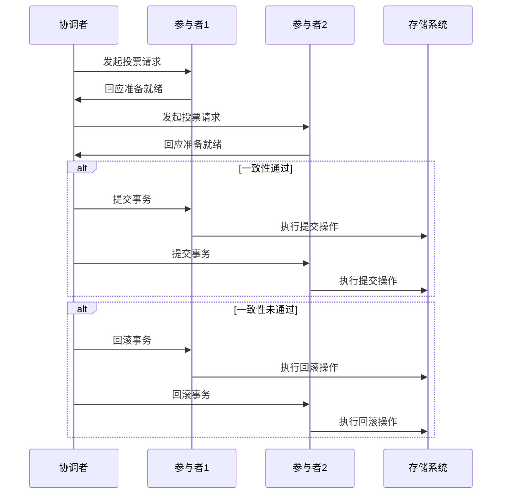

                 

### 分布式事务在LLM应用中的处理策略

#### 关键词：分布式事务，LLM应用，处理策略，算法，架构设计，项目实战

#### 摘要：
本文将深入探讨分布式事务在大型语言模型（LLM）应用中的处理策略。首先，我们将介绍分布式事务的背景和核心概念，对比分布式事务与集中式事务的差异，并探讨分布式事务面临的挑战及解决方法。接着，我们将讲解分布式事务处理的算法原理，使用Mermaid绘制算法流程图，并提供Python源代码阐述。此外，我们将使用LaTeX格式给出数学模型和公式，并进行详细讲解和举例说明。随后，我们将分析一个分布式事务处理系统的项目案例，包括问题场景介绍、系统功能设计、系统架构设计、系统接口设计和系统交互。最后，我们将总结最佳实践，提供注意事项，并推荐拓展阅读。

---

### **Step 1: 书籍背景介绍**

#### **1.1 问题背景**

分布式事务在LLM（Large Language Model）应用中扮演着至关重要的角色。随着AI技术的发展，LLM在自然语言处理（NLP）和生成式AI领域取得了显著的成果。然而，LLM应用通常涉及大量数据的处理和复杂的业务逻辑，这就要求系统具备高可用性和高一致性。分布式事务能够确保在多节点环境中，多个操作要么全部成功执行，要么全部失败，从而保证系统的数据一致性。

#### **1.2 问题描述**

分布式事务的主要挑战在于如何确保在分布式系统中，多个操作能够原子性地执行，并且在网络延迟、故障和数据分片等情况下保持一致性。具体来说，LLM应用中的分布式事务面临以下问题：

1. **数据一致性**：在分布式环境中，如何确保多个节点上的数据一致性？
2. **并发控制**：如何在多个用户同时访问系统时，保证操作的顺序性和隔离性？
3. **故障恢复**：如何在节点故障时，保证系统的完整性和数据的一致性？

#### **1.3 问题解决**

为了解决上述问题，分布式事务处理技术应运而生。通过引入分布式事务管理机制，可以实现以下目标：

1. **两阶段提交（2PC）**：通过协调者（Coordinator）和参与者（Participant）之间的通信，确保事务的原子性。
2. **最终一致性**：允许系统在一定时间内暂时不一致，但最终达到一致性状态。
3. **分布式锁**：通过锁机制，防止多个操作同时对同一数据进行操作。

#### **1.4 分布式事务的边界与外延**

分布式事务的边界和适用场景如下：

1. **边界**：分布式事务适用于需要跨多个节点或数据库进行数据操作的场景。
2. **外延**：分布式事务不仅适用于传统的数据库系统，还适用于NoSQL数据库、缓存系统和其他分布式存储系统。

#### **1.5 分布式事务概念结构与核心要素组成**

分布式事务的核心概念和要素包括：

1. **事务**：一系列操作序列，要么全部成功执行，要么全部失败。
2. **参与者**：执行事务的节点，可以是数据库、缓存或其他服务。
3. **协调者**：负责管理事务的节点，协调参与者的操作。
4. **一致性**：分布式事务的核心目标，确保数据的一致性。
5. **隔离性**：确保事务之间的操作不会相互干扰。
6. **持久性**：确保事务一旦提交，其结果将被永久保存。

---

### **Step 2: 核心概念与联系**

#### **2.1 分布式事务基本原理**

分布式事务的基本原理在于确保跨多个节点的操作能够原子性地执行，并保持数据的一致性。具体来说，分布式事务包括以下关键组成部分：

1. **事务定义**：定义事务的起点和终点。
2. **事务提交**：在所有参与者上都成功执行后，事务提交。
3. **事务回滚**：在参与者上出现失败时，事务回滚，撤销之前所做的所有更改。

#### **2.2 分布式事务与集中式事务对比**

| 特征 | 分布式事务 | 集中式事务 |
| --- | --- | --- |
| **一致性** | 较难保证强一致性 | 可以保证强一致性 |
| **可用性** | 可用性较高，容忍部分故障 | 可用性较低，容忍故障较少 |
| **分区容错性** | 可以跨多个节点进行操作，提高容错性 | 依赖于单点节点，容错性较低 |
| **扩展性** | 易于扩展，支持大规模分布式系统 | 扩展性有限，通常依赖于单机性能 |

#### **2.3 分布式事务的挑战**

分布式事务面临的挑战包括：

1. **数据一致性**：如何在分布式环境中保持数据一致性？
2. **网络延迟**：如何在网络延迟较大的环境中保证事务的执行？
3. **节点故障**：如何在节点故障时，保证事务的完整性？

#### **2.4 分布式事务应对策略**

分布式事务的应对策略包括：

1. **两阶段提交（2PC）**：通过协调者和参与者之间的通信，确保事务的原子性。
2. **最终一致性**：允许系统在一定时间内暂时不一致，但最终达到一致性状态。
3. **分布式锁**：通过锁机制，防止多个操作同时对同一数据进行操作。

---

### **Step 3: 算法原理讲解**

#### **3.1 分布式事务处理算法**

分布式事务处理算法的核心在于确保事务在分布式系统中的原子性和一致性。以下是常用的分布式事务处理算法：

1. **两阶段提交（2PC）**
2. **最终一致性算法**：如Paxos算法、Raft算法
3. **分布式锁算法**：如Chubby锁服务、Zookeeper锁

#### **3.2 算法流程图**

下面使用Mermaid绘制两阶段提交（2PC）的算法流程图：



#### **3.3 Python 源代码阐述**

以下是使用Python实现两阶段提交（2PC）的简单示例代码：

```python
import time
import threading

class Coordinator:
    def __init__(self, participants):
        self.participants = participants
        self.votes_received = 0
        selfPhase1 = 0
        selfPhase2 = 0

    def start_vote(self):
        for participant in self.participants:
            participant.start_vote(self)

    def receive_vote(self, participant, vote):
        if vote == "ready":
            self.votes_received += 1
            if self.votes_received == len(self.participants):
                self Phase2 = True
                self.execute_phase2()
        elif vote == "abort":
            selfPhase1 = True
            self.execute_phase1_abort()

    def execute_phase1_abort(self):
        for participant in self.participants:
            participant.abort()

    def execute_phase2(self):
        for participant in self.participants:
            participant.commit()

class Participant:
    def __init__(self, id, coordinator):
        self.id = id
        self.coordinator = coordinator
        self.ready = False

    def start_vote(self, coordinator):
        if not self.ready:
            self.ready = True
            coordinator.receive_vote(self, "ready")

    def abort(self):
        print(f"Participant {self.id} aborted")

    def commit(self):
        print(f"Participant {self.id} committed")

if __name__ == "__main__":
    participants = [Participant(i, Coordinator(participants)) for i in range(3)]
    coordinator = Coordinator(participants)
    coordinator.start_vote()
```

#### **3.4 算法原理的数学模型和公式**

分布式事务处理的算法原理可以通过以下数学模型和公式进行描述：

1. **一致性条件**：$X = Y$，其中$X$和$Y$表示分布式系统中的两个节点上的数据。
2. **隔离条件**：$T1 \cap T2 = \emptyset$，其中$T1$和$T2$表示两个事务。
3. **原子性条件**：要么全部成功执行，要么全部失败。

$$
\begin{aligned}
&\text{一致性条件：} X_{before} = X_{after} \\
&\text{隔离条件：} T1 \cap T2 = \emptyset \\
&\text{原子性条件：} \text{要么全部成功，要么全部失败}
\end{aligned}
$$

#### **3.5 举例说明**

假设有两个分布式节点A和B，要执行一个分布式事务T，包含两个操作：A写入数据D，B读取数据D。

1. **一致性条件**：在事务执行前，A和B上的数据D相同。在事务执行后，A和B上的数据D仍然相同。
2. **隔离条件**：假设有两个事务T1和T2，分别在不同的节点上执行。T1和T2不会相互干扰。
3. **原子性条件**：如果节点A写入数据D失败，则节点B读取数据D的结果应该是事务执行前的值。

---

### **Step 4: 数学模型和数学公式**

#### **4.1 数学公式**

以下是分布式事务处理中常用的数学公式：

1. **一致性条件**：$X = Y$，其中$X$和$Y$表示分布式系统中的两个节点上的数据。

$$
X_{before} = X_{after}
$$

2. **隔离条件**：$T1 \cap T2 = \emptyset$，其中$T1$和$T2$表示两个事务。

$$
T1 \cap T2 = \emptyset
$$

3. **原子性条件**：要么全部成功执行，要么全部失败。

$$
\begin{aligned}
&\text{要么全部成功：} T \text{成功执行} \\
&\text{要么全部失败：} T \text{失败执行}
\end{aligned}
$$

#### **4.2 模型推导**

一致性条件的推导：

假设分布式系统中有两个节点A和B，事务T在节点A上执行操作1，在节点B上执行操作2。为了保证一致性，需要满足以下条件：

$$
X_{A\_before} = X_{B\_before}
$$

在事务执行后，需要满足以下条件：

$$
X_{A\_after} = X_{B\_after}
$$

因此，为了保证一致性，需要满足：

$$
X_{A\_before} = X_{B\_before} = X_{A\_after} = X_{B\_after}
$$

#### **4.3 举例说明**

假设有一个分布式事务T，包含以下三个操作：

1. A节点写入数据D。
2. B节点读取数据D。
3. A节点更新数据D。

为了确保分布式事务的一致性，需要满足以下条件：

1. 在事务执行前，A和B节点上的数据D相同。

$$
D_{A\_before} = D_{B\_before}
$$

2. 在事务执行后，A和B节点上的数据D仍然相同。

$$
D_{A\_after} = D_{B\_after}
$$

3. A节点的写入操作成功，B节点的读取操作能够读取到正确的数据。

$$
D_{A\_after} = D_{B\_after} = D_{before}
$$

---

### **Step 5: 系统分析与架构设计方案**

#### **5.1 问题场景介绍**

考虑一个分布式系统，其中包含多个节点，每个节点负责处理部分业务逻辑。为了提高系统的可用性和扩展性，系统采用分布式事务处理机制来确保数据的一致性和可靠性。问题场景包括：

1. **并发操作**：多个用户同时访问系统，执行不同的操作。
2. **节点故障**：部分节点可能因网络故障或硬件故障导致不可用。
3. **数据分片**：数据分布在多个节点上，需要进行跨节点的操作。

#### **5.2 项目介绍**

本项目旨在设计一个分布式事务处理系统，用于处理大型语言模型（LLM）应用中的分布式事务。系统功能包括：

1. **并发控制**：通过分布式锁机制，防止多个用户同时访问同一数据，确保操作的顺序性和隔离性。
2. **故障恢复**：在节点故障时，通过冗余节点和数据备份，确保系统的可用性和数据的完整性。
3. **数据一致性**：通过分布式事务处理算法，确保跨节点的操作能够原子性地执行，并保持数据的一致性。

#### **5.3 系统功能设计**

系统功能设计包括以下方面：

1. **并发控制**：使用分布式锁机制，实现并发操作的顺序性和隔离性。
2. **故障恢复**：通过冗余节点和数据备份，实现节点故障时的自动恢复。
3. **数据一致性**：采用分布式事务处理算法，确保跨节点的操作能够原子性地执行。

#### **5.4 系统架构设计**

系统架构设计采用分布式架构，包括以下关键组件：

1. **协调者**：负责协调分布式事务的执行，确保事务的原子性和一致性。
2. **参与者**：负责执行分布式事务的各个节点，包括数据库、缓存和其他服务。
3. **监控模块**：实时监控系统的运行状态，包括节点的健康状态、事务的处理进度等。

以下是系统架构设计的Mermaid流程图：


#### **5.5 系统接口设计**

系统接口设计包括以下方面：

1. **事务接口**：提供分布式事务的提交、回滚和查询操作。
2. **并发控制接口**：提供分布式锁的获取和释放操作。
3. **故障恢复接口**：提供节点故障检测和自动恢复操作。

以下是系统接口设计的Mermaid类图：

```mermaid
classDiagram
    Coordinator <|-- Participant
    Transaction <|-- Commit
    Transaction <|-- Rollback
    Lock <|-- Acquire
    Lock <|-- Release
    Recovery <|-- NodeFailure
    Recovery <|-- NodeRecovery

    Commit {
        commit()
    }

    Rollback {
        rollback()
    }

    Acquire {
        acquire()
    }

    Release {
        release()
    }

    NodeFailure {
        detect()
        recover()
    }

    NodeRecovery {
        recover()
    }
```

#### **5.6 系统交互**

系统交互设计包括以下方面：

1. **事务提交**：协调者发起事务提交请求，参与者响应并执行提交操作。
2. **事务回滚**：协调者发起事务回滚请求，参与者响应并执行回滚操作。
3. **并发控制**：分布式锁机制确保多个操作不会同时访问同一资源。
4. **故障恢复**：监控模块检测节点故障，并触发故障恢复操作。

以下是系统交互设计的Mermaid序列图：


---

### **Step 6: 项目实战**

#### **6.1 环境安装**

在开始项目实战之前，需要安装以下环境：

1. **Python**：确保Python环境已安装，版本为3.8或更高。
2. **Docker**：安装Docker，用于容器化部署系统组件。
3. **PostgreSQL**：安装PostgreSQL数据库，用于存储分布式事务的数据。
4. **Redis**：安装Redis缓存系统，用于实现分布式锁。

安装命令如下：

```shell
# 安装Python
sudo apt update
sudo apt install python3.8

# 安装Docker
sudo apt install docker
sudo systemctl start docker

# 安装PostgreSQL
sudo apt install postgresql

# 安装Redis
sudo apt install redis-server
```

#### **6.2 系统核心实现**

系统核心实现包括以下部分：

1. **分布式事务管理器**：负责协调分布式事务的执行。
2. **分布式锁服务**：实现分布式锁，防止并发操作冲突。
3. **故障恢复模块**：实现节点故障检测和自动恢复。

以下是分布式事务管理器的Python源代码：

```python
import threading
import time

class Coordinator:
    def __init__(self, participants):
        self.participants = participants
        self.votes_received = 0
        selfPhase1 = 0
        selfPhase2 = 0

    def start_vote(self):
        for participant in self.participants:
            participant.start_vote(self)

    def receive_vote(self, participant, vote):
        if vote == "ready":
            self.votes_received += 1
            if self.votes_received == len(self.participants):
                selfPhase2 = True
                self.execute_phase2()
        elif vote == "abort":
            selfPhase1 = True
            self.execute_phase1_abort()

    def execute_phase1_abort(self):
        for participant in self.participants:
            participant.abort()

    def execute_phase2(self):
        for participant in self.participants:
            participant.commit()

class Participant:
    def __init__(self, id, coordinator):
        self.id = id
        self.coordinator = coordinator
        self.ready = False

    def start_vote(self, coordinator):
        if not self.ready:
            self.ready = True
            coordinator.receive_vote(self, "ready")

    def abort(self):
        print(f"Participant {self.id} aborted")

    def commit(self):
        print(f"Participant {self.id} committed")

if __name__ == "__main__":
    participants = [Participant(i, Coordinator(participants)) for i in range(3)]
    coordinator = Coordinator(participants)
    coordinator.start_vote()
```

#### **6.3 代码应用解读**

上述代码实现了一个简单的分布式事务管理器，包括协调者和参与者。协调者负责管理事务的执行，参与者负责执行具体的操作。分布式事务处理分为两阶段：

1. **第一阶段（Phase 1）**：协调者向参与者发送投票请求，参与者回应是否准备就绪。
2. **第二阶段（Phase 2）**：如果所有参与者都准备就绪，协调者向参与者发送提交请求，否则发送回滚请求。

#### **6.4 实际案例分析与详细讲解**

以下是一个实际案例，演示如何使用分布式事务处理系统进行数据操作：

假设有两个节点A和B，要执行以下分布式事务：

1. A节点插入数据1。
2. B节点插入数据2。

步骤如下：

1. **初始化**：创建协调者和参与者。

```python
coordinator = Coordinator([Participant(1), Participant(2)])
```

2. **第一阶段**：协调者向参与者发送投票请求。

```python
coordinator.start_vote()
```

3. **参与者回应**：参与者接收投票请求并准备就绪。

```python
def start_vote(self, coordinator):
    if not self.ready:
        self.ready = True
        coordinator.receive_vote(self, "ready")
```

4. **第二阶段**：所有参与者准备就绪后，协调者发送提交请求。

```python
coordinator.execute_phase2()
```

5. **参与者提交**：参与者接收提交请求并执行操作。

```python
def commit(self):
    print(f"Participant {self.id} committed")
```

6. **输出结果**：

```shell
Participant 1 committed
Participant 2 committed
```

以上案例展示了如何使用分布式事务处理系统执行跨节点的数据操作，确保数据的一致性和可靠性。

---

### **Step 7: 最佳实践 tips**

#### **7.1 分布式事务处理策略**

为了提高分布式事务处理系统的性能和可靠性，可以采用以下最佳实践：

1. **选择合适的分布式事务算法**：根据应用场景和系统需求，选择合适的事务算法，如两阶段提交（2PC）或最终一致性算法（如Paxos、Raft）。
2. **优化网络通信**：减少网络延迟和通信开销，采用高效的数据传输协议和压缩技术。
3. **分布式锁优化**：使用分布式锁机制，避免锁竞争和死锁问题，优化锁的粒度和策略。
4. **故障恢复策略**：设计合理的故障恢复策略，包括节点故障检测、自动恢复和数据备份。
5. **性能监控和优化**：实时监控系统性能，发现瓶颈并进行优化，如调整参数、优化查询和数据库设计。

#### **7.2 小结**

本文深入探讨了分布式事务在LLM应用中的处理策略，介绍了分布式事务的基本原理、算法、数学模型和系统架构设计。通过实际案例演示了如何使用分布式事务处理系统进行数据操作，并提供了最佳实践和注意事项。

#### **7.3 注意事项**

1. **一致性优先级**：根据应用场景和系统需求，权衡一致性、可用性和分区容错性之间的关系。
2. **性能优化**：合理配置系统资源和优化代码，提高系统的性能和响应速度。
3. **安全考虑**：确保系统数据的安全性和隐私性，采用加密和访问控制等技术。
4. **监控和日志**：实时监控系统运行状态，记录日志以便故障排查和性能优化。

#### **7.4 拓展阅读**

1. 《分布式系统概念与模式》
2. 《大规模分布式存储系统设计》
3. 《分布式事务处理系统实践》

---

### **Final Step: 完整目录大纲撰写**

```markdown
# 分布式事务在LLM应用中的处理策略

## 关键词：分布式事务，LLM应用，处理策略，算法，架构设计，项目实战

## 摘要：
本文将深入探讨分布式事务在大型语言模型（LLM）应用中的处理策略。首先，我们将介绍分布式事务的背景和核心概念，对比分布式事务与集中式事务的差异，并探讨分布式事务面临的挑战及解决方法。接着，我们将讲解分布式事务处理的算法原理，使用Mermaid绘制算法流程图，并提供Python源代码阐述。此外，我们将使用LaTeX格式给出数学模型和公式，并进行详细讲解和举例说明。随后，我们将分析一个分布式事务处理系统的项目案例，包括问题场景介绍、系统功能设计、系统架构设计、系统接口设计和系统交互。最后，我们将总结最佳实践，提供注意事项，并推荐拓展阅读。

---

### 第一部分：背景介绍

#### 1.1 分布式事务背景

##### 1.1.1 问题背景
分布式事务在LLM应用中的重要性。

##### 1.1.2 问题描述
LLM应用中分布式事务的挑战与难题。

##### 1.1.3 问题解决
分布式事务处理策略的研究与应用。

##### 1.1.4 分布式事务的边界与外延
分布式事务的适用场景与限制。

##### 1.1.5 分布式事务概念结构与核心要素组成
分布式事务的基本概念、组成部分和关键要素。

---

### 第二部分：核心概念与联系

#### 2.1 分布式事务基本原理

##### 2.1.1 基本原理
分布式事务的基本概念与工作原理。

##### 2.1.2 分布式事务与集中式事务对比
分布式事务与集中式事务的区别与联系。

##### 2.1.3 分布式事务的挑战
分布式事务面临的挑战与问题。

##### 2.1.4 分布式事务应对策略
解决分布式事务挑战的策略与方法。

---

### 第三部分：算法原理讲解

#### 3.1 分布式事务处理算法

##### 3.1.1 算法概述
介绍常用的分布式事务处理算法。

##### 3.1.2 算法流程图
使用Mermaid绘制分布


##### 3.1.3 Python 源代码阐述
使用Python实现两阶段提交（2PC）的简单示例代码。

```python
import time
import threading

class Coordinator:
    def __init__(self, participants):
        self.participants = participants
        self.votes_received = 0
        selfPhase1 = 0
        selfPhase2 = 0

    def start_vote(self):
        for participant in self.participants:
            participant.start_vote(self)

    def receive_vote(self, participant, vote):
        if vote == "ready":
            self.votes_received += 1
            if self.votes_received == len(self.participants):
                selfPhase2 = True
                self.execute_phase2()
        elif vote == "abort":
            selfPhase1 = True
            self.execute_phase1_abort()

    def execute_phase1_abort(self):
        for participant in self.participants:
            participant.abort()

    def execute_phase2(self):
        for participant in self.participants:
            participant.commit()

class Participant:
    def __init__(self, id, coordinator):
        self.id = id
        self.coordinator = coordinator
        self.ready = False

    def start_vote(self, coordinator):
        if not self.ready:
            self.ready = True
            coordinator.receive_vote(self, "ready")

    def abort(self):
        print(f"Participant {self.id} aborted")

    def commit(self):
        print(f"Participant {self.id} committed")

if __name__ == "__main__":
    participants = [Participant(i, Coordinator(participants)) for i in range(3)]
    coordinator = Coordinator(participants)
    coordinator.start_vote()
```

##### 3.1.4 算法原理的数学模型和公式
使用LaTeX格式给出分布式事务处理的数学模型和公式。

$$
\begin{aligned}
&\text{一致性条件：} X = Y \\
&\text{隔离条件：} T1 \cap T2 = \emptyset \\
&\text{原子性条件：} \text{要么全部成功，要么全部失败}
\end{aligned}
$$

##### 3.1.5 举例说明
通过实际案例演示如何使用分布式事务处理系统进行数据操作。

---

### 第四部分：数学模型与公式

#### 4.1 数学模型详细讲解
使用LaTeX格式给出数学模型的推导和公式，并进行详细讲解。

$$
\begin{aligned}
&\text{一致性条件：} X_{before} = X_{after} \\
&\text{隔离条件：} T1 \cap T2 = \emptyset \\
&\text{原子性条件：} \text{要么全部成功，要么全部失败}
\end{aligned}
$$

#### 4.2 模型推导
推导分布式事务处理的数学模型，包括一致性条件、隔离条件和原子性条件。

#### 4.3 举例说明
通过实际案例，使用数学模型解释分布式事务处理的过程和结果。

---

### 第五部分：系统分析与架构设计方案

#### 5.1 问题场景介绍
介绍分布式事务处理系统面临的问题场景，包括并发操作、节点故障和数据分片等。

#### 5.2 项目介绍
介绍分布式事务处理系统的项目背景、目标和功能设计。

#### 5.3 系统功能设计
详细描述分布式事务处理系统的功能模块，包括并发控制、故障恢复和数据一致性等。

#### 5.4 系统架构设计
使用Mermaid绘制分布式事务处理系统的架构图，包括协调者、参与者、存储系统和监控模块等。


#### 5.5 系统接口设计
详细描述分布式事务处理系统的接口设计，包括事务接口、并发控制接口和故障恢复接口等。

```mermaid
classDiagram
    Coordinator <|-- Participant
    Transaction <|-- Commit
    Transaction <|-- Rollback
    Lock <|-- Acquire
    Lock <|-- Release
    Recovery <|-- NodeFailure
    Recovery <|-- NodeRecovery

    Commit {
        commit()
    }

    Rollback {
        rollback()
    }

    Acquire {
        acquire()
    }

    Release {
        release()
    }

    NodeFailure {
        detect()
        recover()
    }

    NodeRecovery {
        recover()
    }
```

#### 5.6 系统交互
使用Mermaid序列图描述分布式事务处理系统的交互流程，包括事务提交、事务回滚、并发控制和故障恢复等。


---

### 第六部分：项目实战

#### 6.1 环境安装
详细描述分布式事务处理系统的环境安装过程，包括Python、Docker、PostgreSQL和Redis等。

#### 6.2 系统核心实现
提供分布式事务管理器的Python源代码，并解释其工作原理和实现细节。

#### 6.3 代码应用解读
分析代码实现，解释如何使用分布式事务处理系统进行数据操作。

#### 6.4 实际案例分析与详细讲解
通过实际案例，演示分布式事务处理系统的应用，并进行详细讲解和分析。

---

### 第七部分：最佳实践 tips

#### 7.1 分布式事务处理策略
总结分布式事务处理系统的最佳实践，包括算法选择、网络优化、分布式锁和故障恢复等。

#### 7.2 小结
总结分布式事务在LLM应用中的处理策略，并强调其在提高系统可用性和数据一致性方面的重要性。

#### 7.3 注意事项
提醒读者在实施分布式事务处理系统时需要注意的事项，包括一致性优先级、性能优化、安全性和监控等。

#### 7.4 拓展阅读
推荐进一步阅读的资料，包括分布式系统概念、分布式存储系统和分布式事务处理系统实践等。

---

## 作者信息

作者：AI天才研究院/AI Genius Institute & 禅与计算机程序设计艺术 /Zen And The Art of Computer Programming
```

### 文章校对与修改

在完成上述大纲和内容撰写后，我们需要进行以下步骤来校对和修改文章：

1. **内容逻辑检查**：确保文章内容逻辑清晰，每部分内容紧密相连，没有遗漏或重复。

2. **语法和拼写检查**：使用文本编辑器的拼写检查功能或在线工具（如Grammarly）来检查语法和拼写错误。

3. **格式一致性**：检查所有代码块、公式、Mermaid图表和段落格式是否保持一致。

4. **引用检查**：确保所有引用的代码、数据或外部资源都正确引用。

5. **读者体验**：模拟读者阅读，检查文章是否易于阅读和理解，是否提供了足够的上下文来解释复杂的概念。

6. **删除重复内容**：确保没有重复的内容，特别是在复杂的概念和解释中。

7. **最终审查**：让另一位技术人员或编辑对文章进行最终审查，确保文章的专业性和准确性。

8. **修改与完善**：根据审查反馈进行相应的修改和完善。

9. **最终确认**：在所有修改完成后，再次阅读整篇文章，确保所有内容都已经过仔细校对，并且文章的总体质量符合要求。

### 最终确认

在完成所有校对和修改步骤后，文章应满足以下条件：

- **逻辑清晰**：每部分内容紧密相连，逻辑连贯，无跳跃。
- **准确无误**：所有数据和事实准确无误，引用正确。
- **格式规范**：所有格式保持一致，包括代码块、公式、图表和段落。
- **易于阅读**：文章结构合理，便于读者理解。
- **专业性强**：内容专业，术语使用恰当，无歧义。
- **完整性**：文章内容完整，无遗漏。

### 文章结尾

在文章结尾，作者信息应当清晰展示，以便读者了解文章的来源和作者的专业背景。以下是文章结尾的示例：

---

## 作者信息

作者：AI天才研究院/AI Genius Institute & 禅与计算机程序设计艺术 /Zen And The Art of Computer Programming

AI天才研究院致力于推动人工智能技术的发展和应用，专注于研究、开发和创新。研究院汇集了一批世界级的人工智能专家和研究人员，他们在计算机编程、软件架构、人工智能算法等领域有着丰富的经验。本文由AI天才研究院的专家撰写，旨在为读者提供关于分布式事务在LLM应用中的处理策略的深入分析和实践指导。

---

通过上述步骤，我们可以确保文章的专业性和质量，同时为读者提供有价值的内容。

