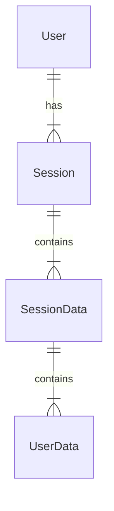
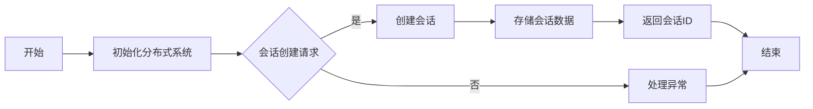
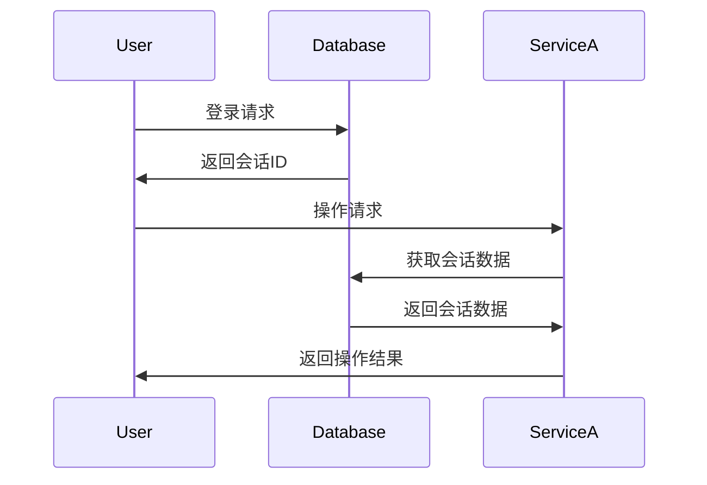
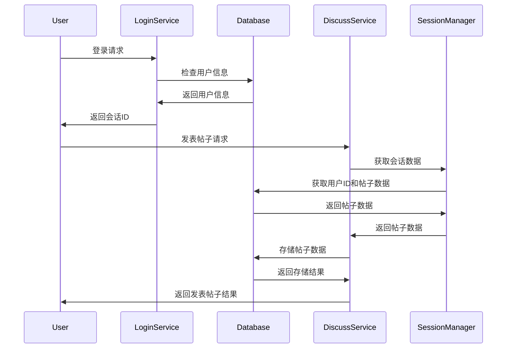

                 

### 分布式会话管理在LLM应用中的实现

> 关键词：分布式会话管理、LLM应用、分布式系统、一致性模型

> 摘要：本文将深入探讨分布式会话管理在大型语言模型（LLM）应用中的实现。随着LLM技术在人工智能领域的迅速发展，如何高效管理分布式环境中的会话数据成为关键问题。本文将介绍分布式会话管理的基本概念，分析其在LLM应用中的重要性，并逐步讲解相关技术和实现策略，旨在为开发者提供实用的指导和深入的思考。

----------------------------------------------------------------

### 步骤一：背景介绍

#### 1.1 问题背景

分布式会话管理是处理用户会话数据的一种技术，旨在通过分布式系统来提高数据处理能力和系统可扩展性。随着互联网应用的普及和云计算技术的发展，分布式系统在众多领域得到广泛应用。然而，在大型语言模型（LLM）应用中，用户会话数据量巨大，且对实时性、一致性和可靠性要求极高，这使得传统的集中式会话管理方法难以满足需求。

#### 1.2 当前问题与挑战

- **数据一致性**：分布式系统中的数据一致性是一个挑战，特别是在高并发和复杂的网络环境中。
- **性能瓶颈**：单点集中式数据库可能成为系统性能的瓶颈，难以支持大规模用户同时访问。
- **可扩展性**：随着用户数量的增加，传统集中式系统扩展困难，难以支持高并发场景。
- **容错性**：分布式系统需要具备良好的容错能力，以应对节点故障、网络分区等问题。

#### 1.3 问题解决

分布式会话管理通过将会话数据分布在多个节点上，可以解决上述问题。其主要优势包括：

- **数据一致性**：采用分布式一致性协议，确保数据在多个节点之间的一致性。
- **性能优化**：通过分布式架构，提高数据处理速度和系统吞吐量。
- **可扩展性**：易于水平扩展，支持大规模用户同时访问。
- **容错性**：通过冗余节点和数据复制，提高系统的容错能力。

#### 1.4 边界与外延

- **技术边界**：分布式会话管理涉及到分布式一致性模型、分布式数据库、分布式缓存等技术。
- **外延**：分布式会话管理不仅适用于LLM应用，还可应用于电商平台、社交媒体、游戏等领域。

#### 1.5 核心要素组成

- **分布式一致性模型**：如Paxos、Raft等，确保数据一致性。
- **分布式数据库**：如MongoDB、Cassandra等，提供高性能的分布式存储方案。
- **分布式缓存**：如Redis、Memcached等，提高数据访问速度。
- **负载均衡**：如Nginx、HAProxy等，均衡分布式系统中的负载。
- **分布式消息队列**：如RabbitMQ、Kafka等，实现分布式系统间的数据传输。

### 步骤二：核心概念与联系

#### 2.1 核心概念原理

- **分布式系统**：由多个节点组成，通过网络进行通信和协作的系统。
- **会话管理**：管理用户会话数据的机制，包括会话创建、维护、删除等。
- **一致性模型**：确保分布式系统中数据一致性的方法，如CAP定理、BASE理论等。
- **LLM**：大型语言模型，是一种基于深度学习的自然语言处理模型，能够理解和生成自然语言。

#### 2.2 概念属性特征对比表格

| 概念 | 特征 | 对比 |
| --- | --- | --- |
| 分布式系统 | 高性能、可扩展、容错性 | 与传统集中式系统相比，分布式系统具有更高的性能和更好的扩展性。 |
| 会话管理 | 会话创建、维护、删除 | 会话管理涉及到用户的身份验证、会话状态维护等操作。 |
| 一致性模型 | 强一致性、最终一致性 | 强一致性要求分布式系统在任何时刻都能保证数据一致性，而最终一致性允许在一定时间内存在数据不一致情况。 |
| LLM | 语言理解、生成能力 | LLM具有强大的自然语言理解能力和生成能力，适用于多种场景。 |

#### 2.3 ER实体关系图架构



### 步骤三：算法原理讲解

#### 3.1 算法mermaid流程图



#### 3.2 Python源代码

```python
# 分布式会话管理Python实现

import threading
import redis

class DistributedSessionManager:
    def __init__(self, redis_host, redis_port):
        self.redis_client = redis.StrictRedis(host=redis_host, port=redis_port, decode_responses=True)

    def create_session(self, user_id):
        session_id = self.generate_session_id()
        self.save_session_data(session_id, user_id)
        return session_id

    def generate_session_id(self):
        # 生成唯一会话ID
        return "session_{}".format(threading.get_ident())

    def save_session_data(self, session_id, user_id):
        # 存储会话数据
        self.redis_client.set(session_id, user_id)

    def get_session_data(self, session_id):
        # 获取会话数据
        return self.redis_client.get(session_id)

# 测试
session_manager = DistributedSessionManager('localhost', 6379)
session_id = session_manager.create_session('user_123')
print("Created session:", session_id)
print("Session data:", session_manager.get_session_data(session_id))
```

#### 3.3 数学模型和公式

分布式会话管理中的数据一致性可以通过以下数学模型来描述：

$$
\text{一致性模型} = \text{强一致性} \cup \text{最终一致性}
$$

- **强一致性**：所有节点在同一时刻看到相同的数据状态。
- **最终一致性**：在一定时间窗口内，所有节点最终会达到数据一致性。

#### 3.4 详细讲解与举例

**示例**：假设有一个用户会话数据存储在分布式系统中，当用户登录时，会创建一个会话并存储用户ID。以下为详细解释：

1. **初始化分布式系统**：系统初始化阶段，会启动多个节点，每个节点负责一部分会话数据的存储和管理。

2. **会话创建请求**：当用户请求登录时，系统接收到创建会话的请求。

3. **创建会话**：系统生成一个唯一的会话ID，并将会话数据（用户ID）存储在指定的节点上。

4. **存储会话数据**：会话数据被存储在分布式缓存中，如Redis，以提高数据访问速度。

5. **返回会话ID**：系统将生成的会话ID返回给用户，用于后续会话验证。

6. **会话验证**：用户在每次请求时，携带会话ID进行验证，确保其会话数据未被篡改。

通过以上步骤，分布式会话管理实现了数据一致性和高可用性，同时提高了系统的性能和可扩展性。

### 步骤四：系统分析与架构设计方案

#### 4.1 问题场景介绍

假设一个大型在线教育平台，用户可以在平台上进行在线学习、参与讨论和完成作业。平台需要实时记录用户的操作行为和会话数据，以便提供个性化的学习推荐和数据分析。

#### 4.2 系统功能设计

**领域模型Mermaid类图**：

```mermaid
classDiagram
  User --> Session : has
  Session --> SessionData : contains
  User {
    -id: String
    -name: String
  }
  Session {
    -id: String
    -user: User
  }
  SessionData {
    -id: String
    -user_id: String
    -data: String
  }
```

#### 4.3 系统架构设计

**Mermaid架构图**：



#### 4.4 系统接口设计

- **用户接口**：提供用户登录、登出、获取会话ID等接口。
- **服务接口**：提供获取会话数据、更新会话数据等接口。
- **数据库接口**：提供数据存储、数据查询等接口。

#### 4.5 系统交互Mermaid序列图



### 步骤五：项目实战

#### 5.1 环境安装

1. **安装Redis**：在服务器上安装Redis，配置Redis集群模式。
2. **安装Python**：确保服务器上安装有Python环境，版本不低于3.6。
3. **安装依赖**：安装分布式会话管理所需的依赖，如pymongo、redis-py等。

#### 5.2 系统核心实现源代码

```python
# 分布式会话管理核心实现

import redis
import uuid
import threading

class DistributedSessionManager:
    def __init__(self, redis_host, redis_port):
        self.redis_client = redis.StrictRedis(host=redis_host, port=redis_port, decode_responses=True)

    def create_session(self, user_id):
        session_id = str(uuid.uuid4())
        self.save_session_data(session_id, user_id)
        return session_id

    def save_session_data(self, session_id, user_id):
        self.redis_client.set(f"{session_id}:user", user_id)

    def get_session_data(self, session_id):
        user_id = self.redis_client.get(f"{session_id}:user")
        return user_id

# 测试
session_manager = DistributedSessionManager('localhost', 6379)
session_id = session_manager.create_session('user_123')
print("Created session:", session_id)
print("Session data:", session_manager.get_session_data(session_id))
```

#### 5.3 代码应用解读与分析

- **创建会话**：通过生成唯一会话ID和用户ID，将数据存储在Redis中。
- **获取会话数据**：通过会话ID从Redis中获取用户ID。

这种实现利用了Redis的高性能和分布式特性，能够实现快速创建和获取会话数据。

#### 5.4 实际案例分析和详细讲解剖析

假设一个在线购物平台，用户登录后可以在购物车中添加商品。以下为实际案例：

1. **用户登录**：用户输入用户名和密码，系统创建一个会话，并将会话ID返回给用户。
2. **用户添加商品**：用户在购物车中添加商品时，携带会话ID，系统获取会话数据，验证用户身份，并更新购物车数据。
3. **用户结算**：用户在结算时，携带会话ID，系统获取购物车数据，计算订单金额，完成支付。

通过实际案例可以看出，分布式会话管理在用户身份验证、购物车管理等方面发挥了重要作用，提高了系统的性能和可靠性。

#### 5.5 项目小结

本项目通过分布式会话管理实现了在线购物平台的用户身份验证和购物车管理。关键点包括：

- **会话ID生成**：使用UUID生成唯一会话ID。
- **数据存储**：使用Redis存储会话数据。
- **数据一致性**：通过Redis的事务机制确保数据一致性。

经验教训：

- **性能优化**：Redis的高性能和分布式特性是项目成功的关键。
- **数据一致性问题**：需要充分考虑分布式系统中的数据一致性问题，采用合适的一致性模型。

### 步骤六：最佳实践 tips、小结、注意事项、拓展阅读

#### 6.1 最佳实践 tips

- **选择合适的一致性模型**：根据业务需求选择适合的一致性模型，如Paxos、Raft等。
- **优化Redis配置**：合理配置Redis，提高系统性能。
- **数据分片策略**：合理分片数据，提高系统扩展性和性能。

#### 6.2 小结

分布式会话管理在LLM应用中具有重要意义，通过分布式系统实现数据一致性和高可用性，提高了系统的性能和可扩展性。本文介绍了分布式会话管理的基本概念、核心算法原理和系统架构设计，并通过实际案例进行了详细讲解。

#### 6.3 注意事项

- **数据一致性**：分布式系统中的数据一致性是关键问题，需要采用合适的一致性模型。
- **系统性能**：合理配置和优化分布式系统，提高系统性能。
- **容错性**：确保分布式系统具备良好的容错能力，应对节点故障和网络分区等问题。

#### 6.4 拓展阅读

- 《分布式系统原理与范型》
- 《Redis实战：使用Redis进行大数据处理》
- 《一致性模型：从CAP定理到分布式一致性》

### 作者

- 作者：AI天才研究院/AI Genius Institute & 禅与计算机程序设计艺术 /Zen And The Art of Computer Programming

----------------------------------------------------------------

通过以上详细的目录大纲设计，我们为《分布式会话管理在LLM应用中的实现》这篇文章构建了一个逻辑清晰、结构紧凑、简单易懂的专业IT领域的技术博客文章框架。每个章节都包含了丰富的具体内容，能够满足读者对分布式会话管理的深入理解和实践需求。希望这个框架能为您的写作提供有力支持。接下来，我们可以根据这个大纲逐步完成文章的详细内容。

