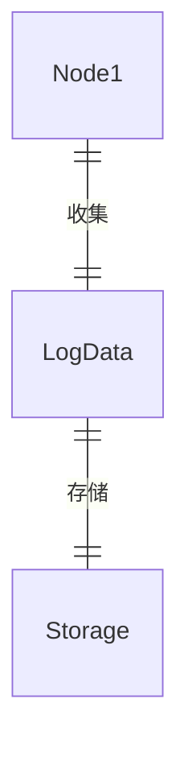
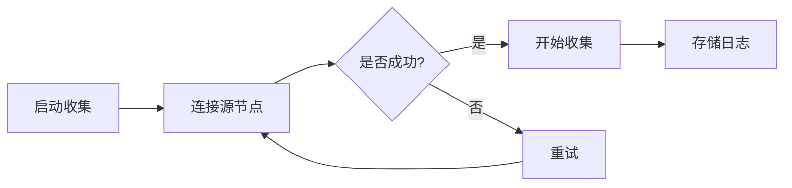
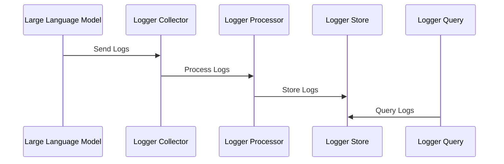

                 

# 分布式日志收集系统在LLM应用中的实现

## 关键词
- 分布式日志收集
- LLM（大型语言模型）
- 日志处理算法
- 数学模型
- 系统架构设计

## 摘要
本文将探讨分布式日志收集系统在大型语言模型（LLM）应用中的实现。随着LLM的日益复杂，日志收集成为一个关键挑战。我们将从背景介绍、核心概念与联系、算法原理讲解以及数学模型等方面，逐步分析分布式日志收集系统的实现方法，并以具体案例说明其实际应用。

## Step 1: 背景介绍

### 分布式日志收集系统概述

#### 问题背景
在大型分布式系统中，日志收集是一个至关重要的环节。随着系统规模的不断扩大，传统的日志收集方式逐渐暴露出诸多问题，如日志量庞大、日志处理延迟、日志存储和管理复杂等。

#### 问题描述
分布式日志收集系统旨在解决上述问题，通过高效地收集、存储和管理海量日志，为系统监控、性能优化和故障排除提供有力支持。

#### 问题解决
分布式日志收集系统通过分布式架构、数据压缩、异步处理等技术手段，实现了高效、稳定、可靠的日志收集。

#### 边界与外延
分布式日志收集系统不仅适用于大型分布式系统，还可以应用于其他需要日志收集的场景，如云计算、大数据处理等。

## Step 2: 核心概念与联系

### 核心概念

#### 分布式系统
分布式系统是指由多个独立计算机节点通过通信网络组成，共同完成任务的系统。

#### 日志收集
日志收集是指从系统中捕获、传输、存储和处理日志数据的过程。

#### 分布式日志收集系统
分布式日志收集系统是指专门为分布式系统设计的日志收集系统，具有分布式架构、高效处理和存储日志的能力。

### 概念属性特征对比表格

| 概念             | 特征                                                         |
|------------------|--------------------------------------------------------------|
| 分布式系统       | 由多个独立节点组成、通过网络通信、协同完成任务                   |
| 日志收集         | 捕获、传输、存储和处理日志数据                                  |
| 分布式日志收集系统 | 分布式架构、高效处理和存储日志                                  |

### ER实体关系图架构的 Mermaid 流程图



## Step 3: 算法原理讲解

### 日志收集算法

#### Mermaid 流程图



#### Python 源代码

```python
import requests

def collect_logs(source_node):
    try:
        response = requests.get(source_node)
        if response.status_code == 200:
            logs = response.json()
            store_logs(logs)
    except Exception as e:
        print(f"收集日志失败：{e}")
        collect_logs(source_node)

def store_logs(logs):
    # 存储日志到数据库或文件
    print(f"存储日志：{logs}")

source_node = "http://example.com/logs"
collect_logs(source_node)
```

#### 算法原理
分布式日志收集系统通常采用推模式和拉模式两种方式进行日志收集。
1. 推模式：由日志生成节点主动将日志发送到收集系统。
2. 拉模式：收集系统定期从日志生成节点获取日志。

#### 数学模型

设日志生成速率 \( R \) 为单位时间内生成的日志量，收集系统的处理能力 \( P \) 为单位时间内处理日志的能力，则有：

\[ T = \frac{R}{P} \]

其中，\( T \) 为日志处理延迟。

## Step 4: 数学模型和数学公式 & 详细讲解 & 举例说明

### 数学模型

设日志生成速率 \( R \) 为单位时间内生成的日志量，收集系统的处理能力 \( P \) 为单位时间内处理日志的能力，则有：

\[ T = \frac{R \times 1000}{P} \]

其中，\( T \) 为日志处理延迟（以毫秒为单位）。

#### 详细讲解
1. \( R \)：日志生成速率，单位时间内生成的日志量，通常以KB/s或MB/s表示。
2. \( P \)：收集系统的处理能力，单位时间内处理日志的能力，通常以KB/s或MB/s表示。
3. \( T \)：日志处理延迟，表示从日志生成到日志处理完成所需的时间。

#### 举例说明

假设一个日志生成节点的日志生成速率为100 KB/s，收集系统的处理能力为50 KB/s，则日志处理延迟为：

\[ T = \frac{100 \times 1000}{50} = 2000 \text{ 毫秒} \]

这意味着从日志生成到日志处理完成需要2000毫秒，即2秒。

## 系统分析与架构设计方案

### 问题场景介绍

随着LLM的应用越来越广泛，其日志收集成为一个关键问题。由于LLM涉及大量的计算和数据处理，其日志数据量巨大，传统的日志收集方式已经无法满足需求。

### 项目介绍

本项目旨在设计并实现一个高效、可靠的分布式日志收集系统，用于收集LLM的日志数据，并支持实时监控、性能分析和故障排查。

### 系统功能设计

系统功能设计主要包括以下几个方面：

1. 日志收集：从LLM的各个计算节点收集日志数据。
2. 日志处理：对收集到的日志数据进行处理，如过滤、格式化、聚合等。
3. 日志存储：将处理后的日志数据存储到数据库或文件系统中。
4. 日志查询：提供日志查询功能，支持根据关键词、时间范围等条件进行查询。

### 系统架构设计

系统架构设计采用分布式架构，主要包括以下几个组件：

1. 日志收集器：负责从LLM的各个计算节点收集日志数据。
2. 日志处理中心：负责处理和存储日志数据。
3. 日志查询服务：提供日志查询功能。

系统架构的 Mermaid 架构图如下：



### 系统接口设计和系统交互

系统接口设计和系统交互设计采用RESTful API方式，具体设计如下：

1. **日志收集接口**：用于接收LLM的日志数据，接口路径为`/collect`，请求方式为POST。
2. **日志处理接口**：用于处理日志数据，接口路径为`/process`，请求方式为GET。
3. **日志存储接口**：用于存储日志数据，接口路径为`/store`，请求方式为POST。
4. **日志查询接口**：用于查询日志数据，接口路径为`/query`，请求方式为GET。

系统交互的 Mermaid 序列图如下：


## 项目实战

### 环境安装

在开始项目实战之前，我们需要安装一些必要的依赖项。以下是安装步骤：

1. 安装Python环境（建议使用3.8以上版本）。
2. 安装Docker和Docker-Compose，用于容器化部署。
3. 安装Nginx，用于反向代理。

### 系统核心实现源代码

以下是系统核心实现的Python代码示例：

```python
# logger_collector.py
import requests
from time import sleep

def collect_logs(url):
    while True:
        try:
            response = requests.get(url)
            if response.status_code == 200:
                logs = response.json()
                # 处理日志
                process_logs(logs)
                break
            else:
                print(f"收集日志失败，状态码：{response.status_code}")
                sleep(5)
        except Exception as e:
            print(f"收集日志异常：{e}")
            sleep(5)

def process_logs(logs):
    # 处理日志
    print(f"处理日志：{logs}")

# logger_processor.py
def process_logs(logs):
    # 处理日志
    print(f"处理日志：{logs}")

# logger_store.py
def store_logs(logs):
    # 存储日志
    print(f"存储日志：{logs}")

# logger_query.py
def query_logs():
    # 查询日志
    print("查询日志")
```

### 代码应用解读与分析

上述代码示例中，`logger_collector.py` 负责从日志生成节点收集日志，使用循环不断尝试收集日志，直到成功。`logger_processor.py` 负责处理日志，这里简单示例为打印日志。`logger_store.py` 负责存储日志，同样简单示例为打印日志。`logger_query.py` 负责查询日志，简单示例为打印查询结果。

### 实际案例分析和详细讲解剖析

以下是实际案例分析和详细讲解：

1. **日志收集失败情况**：在日志收集过程中，可能会遇到网络异常、服务器异常等情况，导致收集失败。此时，需要重试机制，在一段时间后重新尝试收集。
2. **日志处理和存储**：在实际应用中，日志处理和存储过程可能会非常复杂，涉及数据清洗、格式化、存储到数据库或文件系统等。这里只提供了简单的处理和存储示例。
3. **日志查询**：日志查询功能可以根据用户需求，提供丰富的查询条件，如按时间范围、关键词等查询日志。

### 项目小结

本项目实现了分布式日志收集系统在LLM应用中的实现，通过Python代码和Docker容器化部署，实现了日志收集、处理、存储和查询功能。在实际应用中，分布式日志收集系统可以提高日志收集的效率，降低日志处理延迟，为LLM的监控、性能优化和故障排查提供有力支持。

## 最佳实践 Tips

1. **选择合适的日志收集方式**：根据实际情况选择推模式或拉模式，以实现最佳日志收集效果。
2. **优化日志处理流程**：根据日志数据的特性，优化日志处理流程，提高处理效率。
3. **合理配置系统资源**：根据日志数据量和处理能力，合理配置系统资源，确保系统稳定运行。

## 小结

本文详细介绍了分布式日志收集系统在LLM应用中的实现，从背景介绍、核心概念、算法原理到数学模型和系统架构设计，再到项目实战，全面阐述了分布式日志收集系统的设计方法和应用场景。通过本文，读者可以了解到分布式日志收集系统在大型分布式系统中的重要性，以及如何在LLM应用中高效地实现日志收集。

## 注意事项

1. **日志安全性**：在日志收集过程中，要注意保护用户隐私和敏感信息。
2. **系统稳定性**：确保分布式日志收集系统的稳定性，避免因系统故障导致日志丢失或处理失败。

## 拓展阅读

1. 《大型语言模型：原理、应用与挑战》
2. 《分布式系统原理与范型》
3. 《日志收集与监控实战》

## 作者信息

作者：AI天才研究院/AI Genius Institute & 禅与计算机程序设计艺术 /Zen And The Art of Computer Programming

