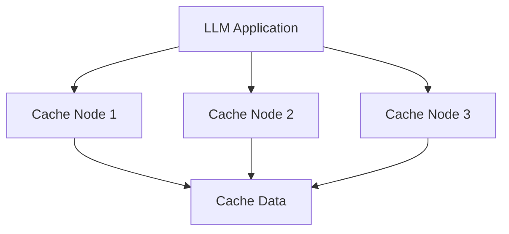

                 

### 1. Background Introduction

#### 1.1 Problem Background

Large Language Models (LLM) have become increasingly popular in various applications, such as natural language processing, chatbots, and recommendation systems. However, the efficiency of data access has become a critical factor that limits the performance of LLM applications. Traditional data access methods, like centralized databases, may suffer from performance bottlenecks due to high data volume and complex query patterns.

#### 1.1.1 Importance of Data Access Efficiency in LLM Applications

Efficient data access is crucial for LLM applications because:

- **Latency**: High latency can lead to slow response times, which are unacceptable in real-time applications like chatbots.
- **Scalability**: As data volume grows, the efficiency of data access becomes even more important to maintain system performance.
- **Concurrency**: LLM applications often need to handle multiple requests simultaneously, which can strain traditional data access methods.

#### 1.1.2 Challenges in Data Access for LLM Applications

LLM applications face several challenges in data access:

- **High Data Volume**: LLMs require access to large datasets, which can overwhelm traditional data access mechanisms.
- **Complex Queries**: LLM applications often involve complex queries that are difficult to optimize with traditional methods.
- **Data Consistency**: Ensuring data consistency across multiple data sources can be challenging, especially in distributed environments.

#### 1.1.3 The Role of Distributed Cache in Enhancing Data Access

Distributed cache plays a crucial role in overcoming the challenges of data access in LLM applications:

- **Speed**: Distributed cache can significantly reduce data access latency by storing frequently accessed data closer to the application.
- **Scalability**: Distributed cache systems can scale horizontally, allowing them to handle increasing data volumes and requests.
- **Consistency**: Modern distributed cache systems offer mechanisms to ensure data consistency across nodes.

#### 1.2 Core Concepts

##### 1.2.1 Definition of Distributed Cache

Distributed cache is a caching mechanism that stores data across multiple nodes in a distributed system. It is designed to improve data access efficiency by reducing latency and increasing throughput.

##### 1.2.2 Properties and Characteristics of Distributed Cache

Key properties and characteristics of distributed cache include:

- **Scalability**: Distributed cache can scale horizontally to handle increasing data volume and traffic.
- **Speed**: Data stored in distributed cache is typically closer to the application, reducing access latency.
- **High Availability**: Distributed cache systems are designed to be highly available, ensuring that data is always accessible.
- **Fault Tolerance**: Distributed cache systems can recover from node failures without losing data.

##### 1.2.3 Comparison of Distributed Cache with Traditional Caching Methods

| Feature | Distributed Cache | Traditional Caching |
| --- | --- | --- |
| **Scalability** | High | Limited |
| **Speed** | Fast | Slow |
| **Fault Tolerance** | High | Low |
| **Data Consistency** | Ensured by design | Can be complex |
| **High Availability** | High | Moderate |

### 1.3 Distributed Cache Architecture and Design

##### 1.3.1 Basic Architecture of Distributed Cache

The basic architecture of a distributed cache consists of multiple cache nodes, a cache manager, and a client interface.

##### 1.3.2 Key Components of Distributed Cache

Key components of a distributed cache include:

- **Cache Nodes**: Store and manage cache data.
- **Cache Manager**: Manages the cache nodes, including data distribution, replication, and eviction policies.
- **Client Interface**: Allows applications to interact with the distributed cache.

##### 1.3.3 Design Principles and Strategies for Distributed Cache

Design principles for distributed cache include:

- **Data Partitioning**:istribute data across cache nodes to ensure even load distribution.
- **Replication**: Store multiple copies of data across different nodes to improve fault tolerance and data availability.
- **Eviction Policies**: Decide how to remove data from the cache when the cache is full.
- **Consistency Models**: Define how to ensure data consistency across cache nodes.

### 1.4 Entity Relationship Diagram of LLM Applications and Distributed Cache

The ER diagram for LLM applications and distributed cache would include entities like:

- **LLM Application**: Represents the application using the distributed cache.
- **Cache Node**: Represents a node in the distributed cache.
- **Cache Data**: Represents data stored in the distributed cache.

### 1.5 Summary

Distributed cache is a powerful mechanism to improve data access efficiency in LLM applications. By reducing latency, enhancing scalability, and ensuring high availability, distributed cache addresses the challenges posed by large data volumes and complex queries. In the next section, we will delve into the algorithm principles and implementation details of distributed cache for LLM applications.

