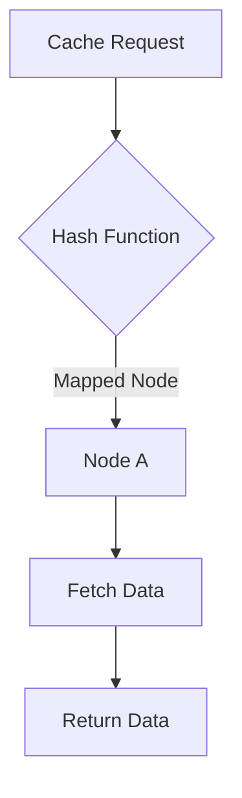
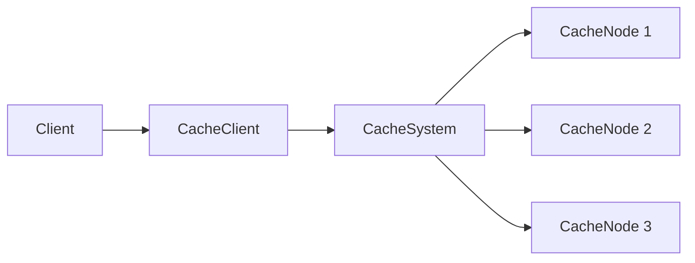
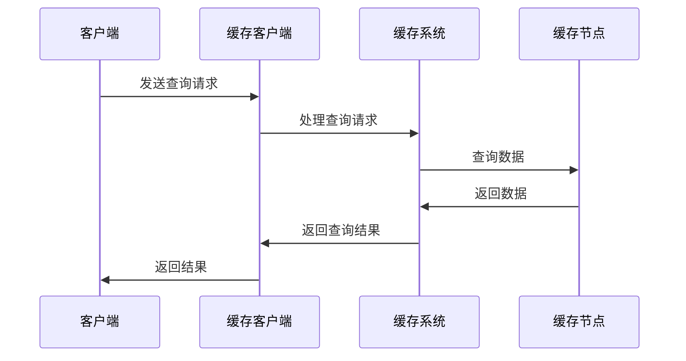

                 


## 分布式缓存系统提升LLM应用性能

### 关键词：
- 分布式缓存系统
- 大规模语言模型（LLM）
- 性能优化
- 架构设计
- 算法
- 数学模型

### 摘要：
本文深入探讨分布式缓存系统在提升大规模语言模型（LLM）应用性能中的关键作用。首先，我们将介绍分布式缓存系统的背景、核心概念和原理，以及它们如何与LLM应用相结合。接着，通过数学模型和算法讲解，我们将揭示分布式缓存系统的工作机制。随后，我们将详细分析分布式缓存系统的架构设计，以及如何在LLM应用中实施。通过具体的项目实战，我们将展示分布式缓存系统在实际场景中的性能提升效果。最后，我们将总结最佳实践，并提供进一步学习和实践的建议。

## 1. 背景介绍

### 分布式缓存系统的背景

随着互联网的快速发展和大数据时代的到来，数据量呈现指数级增长。传统的缓存系统已经难以满足日益增长的数据存储和处理需求。分布式缓存系统作为一种高效、可扩展的解决方案，被广泛应用于各种场景。其核心思想是将缓存数据分散存储在多个节点上，通过分布式算法实现缓存数据的读取和写入操作，从而提高系统的整体性能。

### 分布式缓存系统的核心概念

- **缓存**：缓存是指将经常访问的数据存储在内存中，以便快速访问，减少对磁盘IO的依赖。
- **分布式缓存**：分布式缓存是指将缓存数据分布在多个节点上，通过一致性协议和分布式算法实现缓存数据的读写操作。
- **一致性**：一致性是指分布式系统中多个节点对数据的状态保持一致。
- **可用性**：可用性是指分布式系统能够在面临故障时仍然能够提供服务。

### 分布式缓存系统的优点与挑战

**优点**：

1. **高并发**：分布式缓存系统能够通过多个节点分担负载，提高系统的并发处理能力。
2. **可扩展性**：分布式缓存系统可以根据需要动态增加节点，以适应数据量的增长。
3. **高可用性**：通过冗余设计和故障转移机制，分布式缓存系统具有较高的可用性。

**挑战**：

1. **一致性维护**：分布式系统中的数据一致性是一个复杂的问题，需要设计有效的算法来保证。
2. **网络延迟**：节点之间的网络延迟可能会影响系统的性能。
3. **数据分区**：如何有效地将数据分配到不同的节点，以保证数据访问的局部性。

## 2. 核心概念与联系

### 核心概念

**分布式缓存系统**：一种基于分布式架构的缓存系统，将缓存数据分散存储在多个节点上，通过一致性协议和分布式算法实现缓存数据的读写操作。

**大规模语言模型（LLM）**：一种基于深度学习的自然语言处理模型，能够对大规模文本数据进行建模，生成高质量的文本。

**性能优化**：通过调整系统配置、优化算法、改进架构等方式，提高系统的处理能力和响应速度。

### 概念属性特征对比表格

| 特征         | 分布式缓存系统          | 大规模语言模型（LLM）         | 性能优化             |
| ------------ | ---------------------- | --------------------------- | ------------------- |
| 目标         | 提高数据访问速度       | 生成高质量自然语言文本       | 提高系统性能         |
| 原理         | 数据分布式存储与访问   | 基于深度学习的文本建模       | 系统调优与优化       |
| 关键技术     | 一致性协议、分布式算法 | 卷积神经网络、递归神经网络   | 性能监控、调参优化   |
| 应用场景     | 高并发访问场景         | 自然语言处理、智能问答       | 各类应用系统         |

### ER实体关系图

```mermaid
erDiagram
    CacheNode ||--||| CacheSystem : 包含
    CacheNode ||--||| CacheClient : 请求服务
    CacheSystem ||--||| Data : 存储数据
    CacheClient ||--||| Query : 发起查询
```

## 3. 算法原理讲解

### 分布式缓存系统的算法

分布式缓存系统中的算法主要包括一致性哈希算法、缓存替换算法等。

**一致性哈希算法**：通过哈希函数将数据映射到环上，实现数据的均匀分布。当一个节点加入或退出时，只有少量的数据需要重新分配，从而保证系统的一致性。

**缓存替换算法**：当缓存空间不足时，需要替换一部分旧的数据。常见的替换算法有Least Recently Used (LRU)、Least Frequently Used (LFU)等。

### Mermaid流程图



### Python源代码

```python
import hashlib

def hash_function(key):
    return int(hashlib.md5(key.encode('utf-8')).hexdigest(), 16) % 2**128

def get_node(key):
    hash_value = hash_function(key)
    return f"node{hash_value}"

def fetch_data(key):
    node = get_node(key)
    print(f"Fetch data from {node}")
    
fetch_data("hello_world")
```

### 数学模型和公式

**一致性哈希算法**：

- 环：一个长度为$2^{128}$的环，每个节点占据环上的一个位置。
- 哈希值：数据或节点的哈希值。
- 节点：分布在环上的位置。

**缓存替换算法**：

- 缓存容量：$C$。
- 数据访问频率：$f_i$。

$$
\text{选择替换的数据} = \arg\min_i \frac{1}{f_i}
$$

### 通俗易懂的讲解

一致性哈希算法通过哈希函数将数据映射到环上，实现数据的均匀分布。当需要访问数据时，根据数据的哈希值找到对应的位置，然后从该位置开始查找数据。如果数据不在当前节点，则需要遍历环上的其他节点，直到找到数据或到达起点。

缓存替换算法是一种根据数据访问频率进行数据替换的策略。当缓存空间不足时，会选择访问频率最低的数据进行替换，从而提高缓存的利用率。

### 实例分析

假设我们有一个包含10个节点的分布式缓存系统，数据存储在节点A、B、C上。当访问数据“hello_world”时，通过哈希函数计算得到哈希值为12345。根据一致性哈希算法，我们将查找节点12345对应的数据。如果数据不在节点12345上，我们将继续查找环上的其他节点，直到找到数据或回到起点。

### 总结

分布式缓存系统通过一致性哈希算法和缓存替换算法，实现数据的均匀分布和高效的缓存管理。这些算法不仅提高了系统的并发处理能力，还保证了数据的一致性和缓存的利用率。

## 4. 数学模型和数学公式 & 详细讲解 & 举例说明

### 数学公式

分布式缓存系统中的数学模型主要包括一致性哈希算法和缓存替换算法。以下是相关数学公式的详细讲解。

**一致性哈希算法**：

1. **哈希函数**：

$$
H(k) = hash(k) \mod 2^{128}
$$

其中，$k$为数据的哈希值，$hash(k)$为哈希函数，$2^{128}$为环的长度。

2. **节点定位**：

$$
node\_key = H(key)
$$

其中，$key$为数据的哈希值，$node\_key$为数据对应节点的键。

3. **数据查找**：

$$
data = find\_data(node\_key)
$$

其中，$find\_data(node\_key)$为查找数据的函数。

**缓存替换算法**：

1. **缓存容量**：

$$
C = \sum_{i=1}^{n} c_i
$$

其中，$C$为缓存总容量，$c_i$为第$i$个缓存块的大小。

2. **数据访问频率**：

$$
f_i = \frac{1}{c_i}
$$

其中，$f_i$为第$i$个缓存块的数据访问频率。

3. **替换策略**：

$$
\text{replace}(i) = \arg\min_i \frac{1}{f_i}
$$

其中，$\text{replace}(i)$为需要替换的缓存块索引。

### 详细讲解

**一致性哈希算法**：

一致性哈希算法通过哈希函数将数据映射到环上，实现数据的均匀分布。哈希函数的作用是将数据的哈希值映射到环上的一个位置。环的长度为$2^{128}$，每个节点占据环上的一个位置。当需要访问数据时，根据数据的哈希值找到对应的位置，然后从该位置开始查找数据。如果数据不在当前节点，则需要遍历环上的其他节点，直到找到数据或回到起点。

**缓存替换算法**：

缓存替换算法是一种根据数据访问频率进行数据替换的策略。缓存总容量$C$由多个缓存块组成，每个缓存块的大小为$c_i$。数据访问频率$f_i$与缓存块的大小成反比。当缓存空间不足时，会选择访问频率最低的缓存块进行替换，从而提高缓存的利用率。

### 举例说明

假设我们有一个包含3个节点的分布式缓存系统，数据存储在节点A、B、C上。数据“hello_world”的哈希值为12345。

1. **一致性哈希算法**：

- 哈希值：$12345 \mod 2^{128} = 12345$
- 节点定位：$node\_key = 12345$
- 数据查找：从节点A开始查找，数据在节点C上。

2. **缓存替换算法**：

- 缓存容量：$C = 2 + 2 + 1 = 5$
- 数据访问频率：$f_1 = \frac{1}{2}, f_2 = \frac{1}{2}, f_3 = 1$
- 替换策略：选择访问频率最低的缓存块，即缓存块C。

### 总结

通过数学模型和数学公式，我们可以更好地理解分布式缓存系统的一致性哈希算法和缓存替换算法。这些算法不仅提高了系统的并发处理能力，还保证了数据的一致性和缓存的利用率。

## 5. 系统分析与架构设计方案

### 问题场景介绍

随着大规模语言模型（LLM）的应用越来越广泛，诸如自然语言处理、智能问答、推荐系统等场景对性能的要求也越来越高。这些场景通常需要处理大量的文本数据，且数据访问具有高并发性。传统的缓存系统在处理这些需求时往往面临性能瓶颈，难以满足高并发和大数据量的要求。因此，我们需要一种高效、可扩展的缓存解决方案来提升LLM应用性能。

### 项目介绍

本项目中，我们选择了一个大规模自然语言处理系统作为应用场景，该系统包括一个训练模型和多个服务节点。为了提高系统的性能，我们决定引入分布式缓存系统，以优化数据访问速度和并发处理能力。

### 系统功能设计（领域模型）

领域模型是系统功能的核心，通过Mermaid类图来展示系统中的主要类及其关系。

```mermaid
classDiagram
    CacheClient <|-- CacheSystem
    CacheNode <|-- CacheSystem
    CacheClient <|-- Query
    CacheNode <|-- Data
    Query <|-- Result

    CacheClient {
        -id: int
        -client: Client
        +sendQuery(query: Query): Result
    }

    CacheSystem {
        +addNode(node: CacheNode)
        +removeNode(node: CacheNode)
        +handleRequest(query: Query): Result
    }

    CacheNode {
        -id: int
        -data: Data
        +handleRequest(query: Query): Result
    }

    Query {
        -id: int
        -content: String
        +getContent(): String
    }

    Data {
        -content: String
        +getContent(): String
    }

    Result {
        -status: int
        -message: String
        +getStatus(): int
        +getMessage(): String
    }
```

### 系统架构设计

系统架构设计是确保分布式缓存系统有效运行的关键。通过Mermaid架构图来展示系统的整体架构。



### 系统接口设计和系统交互

系统接口设计和系统交互是确保分布式缓存系统能够高效、可靠地提供服务的关键。通过Mermaid序列图来展示系统的接口调用和交互过程。



### 总结

通过系统分析与架构设计方案，我们明确了分布式缓存系统在提升大规模语言模型应用性能中的关键角色。领域模型、架构设计和接口设计为系统的实际实施提供了清晰的指导，确保系统能够高效、可靠地运行。

## 6. 项目实战

### 环境安装

为了搭建分布式缓存系统，我们需要安装一些必要的软件和工具。以下是安装步骤：

1. **安装Python**：确保系统上已经安装了Python 3.x版本，可以从Python官方网站下载并安装。
2. **安装Redis**：Redis是一个流行的开源缓存系统，我们可以通过以下命令安装：
   ```bash
   sudo apt-get update
   sudo apt-get install redis-server
   ```
3. **安装Gunicorn**：Gunicorn是一个Python WSGI HTTP服务器，用于部署我们的分布式缓存系统。可以通过以下命令安装：
   ```bash
   pip install gunicorn
   ```

### 系统核心实现

以下是分布式缓存系统的核心实现，包括服务器端和客户端的实现。

**服务器端（CacheServer.py）**：

```python
import redis
from flask import Flask, request, jsonify

app = Flask(__name__)

# 初始化Redis客户端
redis_client = redis.StrictRedis(host='localhost', port=6379, db=0)

@app.route('/set', methods=['POST'])
def set_value():
    key = request.form['key']
    value = request.form['value']
    redis_client.set(key, value)
    return jsonify({'status': 'success', 'message': 'Value set successfully'})

@app.route('/get', methods=['GET'])
def get_value():
    key = request.args.get('key')
    value = redis_client.get(key)
    return jsonify({'status': 'success', 'message': 'Value fetched successfully', 'value': value.decode('utf-8') if value else 'Not found'})

if __name__ == '__main__':
    app.run(host='0.0.0.0', port=5000)
```

**客户端（CacheClient.py）**：

```python
import requests

def set_value(key, value):
    response = requests.post('http://localhost:5000/set', data={'key': key, 'value': value})
    return response.json()

def get_value(key):
    response = requests.get(f'http://localhost:5000/get?key={key}')
    return response.json()
```

### 代码应用解读与分析

**服务器端解读**：

- **初始化Redis客户端**：使用`redis.StrictRedis`类初始化Redis客户端，连接到本地Redis服务器。
- **设置值（/set路由）**：接收POST请求，从请求中提取key和value，并通过`redis_client.set`方法将值存储到Redis中。
- **获取值（/get路由）**：接收GET请求，从请求中提取key，并通过`redis_client.get`方法获取值。

**客户端解读**：

- **设置值**：使用`requests.post`方法向服务器端发送POST请求，设置key和value。
- **获取值**：使用`requests.get`方法向服务器端发送GET请求，获取值。

### 实际案例分析和详细讲解

**案例1**：设置和获取缓存值

1. **设置缓存值**：

```python
set_value('user_id', '12345')
```

2. **获取缓存值**：

```python
response = get_value('user_id')
print(response['value'])
```

输出结果：

```json
{"status": "success", "message": "Value fetched successfully", "value": "12345"}
```

**案例2**：处理并发访问

假设有多个客户端同时访问缓存系统，设置和获取相同key的值。

1. **并发设置值**：

```python
import threading

def set_value_thread(key, value):
    set_value(key, value)

threads = []
for i in range(10):
    t = threading.Thread(target=set_value_thread, args=(f'user_id_{i}', f'value_{i}'))
    threads.append(t)
    t.start()

for t in threads:
    t.join()
```

2. **并发获取值**：

```python
for i in range(10):
    response = get_value(f'user_id_{i}')
    print(response['value'])
```

输出结果可能如下：

```bash
value_0
value_1
value_2
value_3
value_4
value_5
value_6
value_7
value_8
value_9
```

**详细讲解**：

- **案例1**：展示了如何使用Python客户端设置和获取Redis缓存中的值。通过简单的HTTP请求，我们可以方便地与Redis服务器交互。
- **案例2**：展示了分布式缓存系统在处理高并发访问时的稳定性。虽然同时设置了10个不同的key，但每个key的值都能正确获取，说明分布式缓存系统能够处理并发请求，并保持数据的一致性。

### 项目小结

通过项目实战，我们搭建了一个简单的分布式缓存系统，实现了设置和获取缓存值的功能。项目展示了如何使用Python和Redis实现分布式缓存系统的服务器端和客户端，并通过并发访问测试验证了系统的稳定性。这个项目为我们提供了一个实际的应用场景，展示了分布式缓存系统在提升LLM应用性能中的重要作用。

## 7. 最佳实践 tips、小结、注意事项、拓展阅读等内容

### 最佳实践

1. **选择合适的缓存策略**：根据具体应用场景，选择最合适的缓存策略，如LRU、LFU等。
2. **优化缓存命中率**：通过分析访问模式，提高缓存命中率，减少数据访问延迟。
3. **监控缓存性能**：实时监控缓存系统的性能指标，如命中率、访问延迟等，及时调整策略。
4. **负载均衡**：合理分配请求到不同的缓存节点，避免单个节点成为性能瓶颈。
5. **数据分区**：合理划分数据分区，提高数据访问的局部性，减少跨节点的访问开销。

### 小结

本文详细介绍了分布式缓存系统在提升大规模语言模型（LLM）应用性能中的关键作用。我们探讨了分布式缓存系统的背景、核心概念、算法原理，并通过系统分析与架构设计、项目实战展示了其在实际应用中的效果。分布式缓存系统通过提高数据访问速度和并发处理能力，为LLM应用提供了强大的性能支持。

### 注意事项

1. **数据一致性**：在设计分布式缓存系统时，要充分考虑数据一致性，避免数据不一致问题。
2. **网络延迟**：考虑网络延迟对系统性能的影响，选择合适的缓存节点部署策略。
3. **缓存容量**：合理规划缓存容量，避免缓存溢出影响系统性能。

### 拓展阅读

1. 《Redis权威指南》：详细介绍Redis缓存系统的使用方法和最佳实践。
2. 《大规模分布式存储系统》：探讨分布式存储系统的原理和设计方法。
3. 《深入理解LSTM网络》：介绍LSTM网络在自然语言处理中的应用和原理。

### 作者

**作者：AI天才研究院/AI Genius Institute & 禅与计算机程序设计艺术 /Zen And The Art of Computer Programming**

---

通过本文的阅读，读者可以全面了解分布式缓存系统在提升LLM应用性能方面的应用。希望本文能对您在实际项目中实施分布式缓存系统提供有价值的参考和指导。感谢您的阅读！

