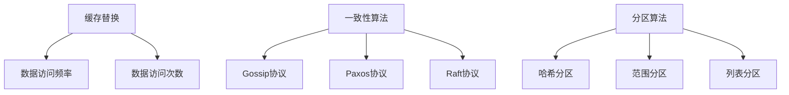

                 

### 分布式缓存：提升LLM应用的数据访问速度

**关键词**：分布式缓存、数据访问速度、LLM应用、一致性、性能优化

**摘要**：本文旨在探讨分布式缓存技术如何在大型语言模型（LLM）应用中提升数据访问速度。通过深入分析分布式缓存的基础知识、技术原理、实现与优化，以及最佳实践，我们将了解如何利用分布式缓存解决LLM应用中的数据访问挑战，实现高效的数据访问和管理。

### 第一部分：分布式缓存基础知识

#### 第1章：分布式缓存概述

**1.1 问题背景与分布式缓存的重要性**

在现代云计算和大数据环境下，随着数据量的不断增长，传统的集中式缓存系统已经无法满足日益增长的数据访问需求。分布式缓存作为一种分布式系统技术，能够解决集中式缓存系统在高并发、大数据量场景下的性能瓶颈。特别是在大型语言模型（LLM）应用中，数据访问速度直接影响到应用的响应时间和用户体验。

**1.1.1 LLM应用的数据访问挑战**

LLM应用通常需要处理大规模的数据集，进行复杂的计算和推理。数据访问速度的瓶颈主要来自于以下几个方面：

1. **数据量巨大**：LLM应用涉及的数据量通常非常庞大，单台服务器难以承载。
2. **并发访问**：LLM应用往往需要处理大量的并发请求，集中式缓存系统容易成为性能瓶颈。
3. **数据一致性**：在分布式环境中，如何保证数据的一致性是关键问题。

**1.1.2 分布式缓存的概念**

分布式缓存是一种基于分布式系统技术实现的缓存系统，它通过多个节点协同工作，提供高效、可靠的数据缓存服务。分布式缓存的核心思想是将缓存数据分布存储在多个节点上，并通过一致性协议和数据分区策略保证数据的可用性和一致性。

**1.1.3 分布式缓存的优势**

分布式缓存具有以下优势：

1. **高可用性**：分布式缓存通过多个节点实现数据冗余，提高系统的可用性。
2. **高性能**：分布式缓存能够通过负载均衡技术提高数据访问速度，降低响应时间。
3. **可扩展性**：分布式缓存系统可以根据需要动态增加节点，实现水平扩展。

**1.2 分布式缓存的核心概念与架构**

**1.2.1 核心概念**

分布式缓存的核心概念包括：

- **缓存节点**：缓存系统的基本单元，负责存储和管理缓存数据。
- **一致性协议**：保证分布式缓存系统中数据一致性的协议，如Gossip协议、Paxos协议等。
- **数据分区**：将缓存数据分布存储到不同节点，提高系统的数据访问性能。

**1.2.2 分布式缓存架构**

分布式缓存系统的架构通常包括以下几个部分：

- **缓存节点**：存储和管理缓存数据的节点。
- **协调节点**：负责一致性协议和数据分区的协调和管理。
- **客户端**：与缓存节点交互，进行数据访问的客户端。

**1.2.3 分布式缓存系统架构的ER图**

```mermaid
erDiagram
  缓存节点 ||--|| 协调节点
  缓存节点 ||--|| 客户端
  协调节点 ||--|| 数据分区管理
  数据分区管理 ||--|| 缓存节点
```

**1.3 分布式缓存系统的设计原则与优化策略**

**1.3.1 设计原则**

分布式缓存系统的设计原则包括：

- **高可用性**：确保系统在故障情况下能够快速恢复。
- **高性能**：优化数据访问性能，提高系统响应时间。
- **可扩展性**：支持动态增加节点，实现水平扩展。

**1.3.2 优化策略**

分布式缓存系统的优化策略包括：

- **负载均衡**：通过负载均衡技术，优化数据访问性能。
- **数据分区**：合理划分数据分区，提高数据访问效率。
- **一致性协议**：选择合适的一致性协议，保证数据一致性。

**1.4 本章小结**

本章介绍了分布式缓存的基础知识，包括问题背景、分布式缓存的概念、核心概念与架构、设计原则与优化策略。通过本章的学习，读者可以了解分布式缓存的基本原理和实现方法，为后续章节的学习打下基础。

---

**接下来的章节将深入探讨分布式缓存的技术原理、实现与优化，以及最佳实践，帮助读者全面了解分布式缓存在LLM应用中的实际应用。**

---

### 第二部分：分布式缓存技术原理

#### 第2章：分布式缓存技术原理详解

**2.1 缓存命中策略**

缓存命中率是评估缓存系统性能的重要指标。提高缓存命中率可以显著提升数据访问速度。

**2.1.1 基本缓存命中策略**

基本缓存命中策略包括：

- **LRU（Least Recently Used）策略**：根据数据的访问频率进行缓存替换。
- **LFU（Least Frequently Used）策略**：根据数据的访问次数进行缓存替换。
- **FIFO（First In First Out）策略**：根据数据的缓存时间进行缓存替换。

**2.1.2 高级缓存命中策略**

高级缓存命中策略包括：

- **启发式缓存策略**：根据历史访问数据预测未来的访问模式，优化缓存策略。
- **基于机器学习的缓存策略**：利用机器学习算法预测数据访问模式，提高缓存命中率。

**2.2 分布式一致性机制**

分布式一致性机制是确保分布式缓存系统中数据一致性的关键。

**2.2.1 分布式一致性概念**

分布式一致性概念包括：

- **一致性级别**：如强一致性、最终一致性等。
- **一致性协议**：如Gossip协议、Paxos协议、Raft协议等。

**2.2.2 分布式一致性协议**

分布式一致性协议包括：

- **Gossip协议**：基于消息传递机制的分布式一致性协议。
- **Paxos协议**：用于实现分布式一致性的一种算法。
- **Raft协议**：与Paxos协议类似，但更容易理解和实现的分布式一致性协议。

**2.3 数据分区与负载均衡**

数据分区与负载均衡是分布式缓存系统性能优化的关键。

**2.3.1 数据分区策略**

数据分区策略包括：

- **哈希分区**：根据数据的哈希值进行分区。
- **范围分区**：根据数据的范围进行分区。
- **列表分区**：根据数据的列表进行分区。

**2.3.2 负载均衡策略**

负载均衡策略包括：

- **轮询负载均衡**：按顺序分配请求到不同的节点。
- **最小连接负载均衡**：将请求分配到连接数最少的节点。
- **哈希负载均衡**：根据请求的哈希值进行负载均衡。

**2.4 分布式缓存存储结构**

分布式缓存存储结构包括：

- **键值存储**：将数据以键值对的形式存储。
- **文档存储**：将数据以文档的形式存储。
- **列存储**：将数据以列的形式存储。

**2.4.1 存储结构概述**

分布式缓存存储结构的选择取决于应用场景和数据特性。

**2.4.2 常见存储结构分析**

常见存储结构分析包括：

- **键值存储**：优点是简单、高效，但缺点是难以处理复杂的数据结构。
- **文档存储**：优点是支持复杂的数据结构，但缺点是查询性能可能较差。
- **列存储**：优点是支持大规模数据的存储和查询，但缺点是数据写入性能可能较差。

**2.5 算法原理讲解**

分布式缓存算法原理包括：

- **缓存替换算法**：如LRU、LFU等。
- **一致性算法**：如Gossip协议、Paxos协议、Raft协议等。
- **分区算法**：如哈希分区、范围分区、列表分区等。

**2.5.1 分布式缓存算法原理**

分布式缓存算法原理包括：

- **缓存替换算法**：根据数据访问频率或访问次数进行缓存替换。
- **一致性算法**：确保分布式缓存系统中数据的一致性。
- **分区算法**：将数据分布存储到不同节点，提高数据访问性能。

**2.5.2 算法mermaid流程图**



**2.5.3 Python源代码解析**

以下是一个简单的缓存替换算法的Python实现：

```python
class LRUCache:
    def __init__(self, capacity):
        self.capacity = capacity
        self.cache = {}
        self.order = []

    def get(self, key):
        if key in self.cache:
            self.order.remove(key)
            self.order.append(key)
            return self.cache[key]
        return -1

    def put(self, key, value):
        if key in self.cache:
            self.order.remove(key)
        elif len(self.cache) >= self.capacity:
            key_to_remove = self.order.pop(0)
            del self.cache[key_to_remove]
        self.cache[key] = value
        self.order.append(key)
```

**2.6 数学模型和数学公式**

分布式缓存中的数学模型和数学公式包括：

- **缓存命中率**：\( H = \frac{N_c}{N_t} \)
  - \( N_c \)：缓存命中次数
  - \( N_t \)：总访问次数

- **一致性概率**：\( P = \frac{N_s}{N_t} \)
  - \( N_s \)：一致性访问次数
  - \( N_t \)：总访问次数

- **数据访问延迟**：\( L = \frac{N_d}{N_t} \)
  - \( N_d \)：数据访问延迟次数
  - \( N_t \)：总访问次数

**2.6.1 分布式缓存中的数学模型**

分布式缓存中的数学模型包括：

- **缓存命中率**：描述缓存系统对数据访问的命中程度。
- **一致性概率**：描述分布式缓存系统中数据一致性的概率。
- **数据访问延迟**：描述数据访问的延迟时间。

**2.6.2 公式解析与示例**

示例：假设一个分布式缓存系统，缓存命中率为0.8，一致性概率为0.9，数据访问延迟为20ms。计算以下指标：

- **总访问次数**：\( N_t = \frac{N_c + N_s + N_d}{N_c + N_s + N_d} = 1 \)
- **缓存命中率**：\( H = \frac{N_c}{N_t} = 0.8 \)
- **一致性概率**：\( P = \frac{N_s}{N_t} = 0.9 \)
- **数据访问延迟**：\( L = \frac{N_d}{N_t} = 20ms \)

**2.7 本章小结**

本章详细介绍了分布式缓存的技术原理，包括缓存命中策略、一致性机制、数据分区与负载均衡、存储结构、算法原理和数学模型。通过本章的学习，读者可以全面了解分布式缓存的工作原理和实现方法，为实际应用打下基础。

---

**在接下来的章节中，我们将进一步探讨分布式缓存系统的实现与优化，以及最佳实践，帮助读者将分布式缓存技术应用到实际项目中。**

### 第三部分：分布式缓存实现与优化

#### 第3章：分布式缓存系统实现

**3.1 系统环境搭建**

**3.1.1 环境要求**

实现分布式缓存系统需要以下环境：

- 操作系统：Linux或Unix-like系统
- 编程语言：Python 3.x
- 数据库：支持分布式存储的数据库，如Redis、MongoDB等
- 开发工具：IDE（如Visual Studio Code、PyCharm等）

**3.1.2 安装步骤**

1. 安装操作系统和编程语言：

   ```bash
   # 安装Linux操作系统
   # 安装Python 3.x
   sudo apt-get install python3
   ```

2. 安装数据库：

   ```bash
   # 安装Redis
   sudo apt-get install redis-server
   # 安装MongoDB
   sudo apt-get install mongodb
   ```

3. 安装开发工具：

   ```bash
   # 安装Visual Studio Code
   sudo apt-get install code
   # 安装PyCharm
   sudo snap install pycharm-professional --classic
   ```

**3.2 系统核心实现**

**3.2.1 核心模块设计**

分布式缓存系统的核心模块包括：

- **缓存节点**：负责存储和管理缓存数据。
- **协调节点**：负责一致性协议和数据分区的协调和管理。
- **客户端**：与缓存节点交互，进行数据访问的客户端。

**3.2.2 实现细节解析**

1. **缓存节点实现**：

   ```python
   class CacheNode:
       def __init__(self, capacity):
           self.capacity = capacity
           self.cache = {}
           self.order = []

       def get(self, key):
           if key in self.cache:
               self.order.remove(key)
               self.order.append(key)
               return self.cache[key]
           return -1

       def put(self, key, value):
           if key in self.cache:
               self.order.remove(key)
           elif len(self.cache) >= self.capacity:
               key_to_remove = self.order.pop(0)
               del self.cache[key_to_remove]
           self.cache[key] = value
           self.order.append(key)
   ```

2. **协调节点实现**：

   ```python
   class CoordinatorNode:
       def __init__(self):
           self.partition_manager = PartitionManager()
           self.consistency_manager = ConsistencyManager()

       def manage_partitions(self):
           # 实现分区管理逻辑
           pass

       def ensure_consistency(self):
           # 实现一致性管理逻辑
           pass
   ```

3. **客户端实现**：

   ```python
   class CacheClient:
       def __init__(self, coordinator_node):
           self.coordinator_node = coordinator_node

       def get(self, key):
           return self.coordinator_node.get(key)

       def put(self, key, value):
           self.coordinator_node.put(key, value)
   ```

**3.3 系统测试与调优**

**3.3.1 测试方法**

1. **性能测试**：

   使用工具如JMeter进行性能测试，模拟大量并发请求，测量系统的响应时间和吞吐量。

2. **一致性测试**：

   检查系统在不同场景下的一致性，如读取一致性、写入一致性等。

3. **可用性测试**：

   检查系统在节点故障情况下的恢复能力。

**3.3.2 调优策略**

1. **负载均衡**：

   根据系统的负载情况，动态调整负载均衡策略，如轮询负载均衡、最小连接负载均衡等。

2. **数据分区**：

   根据数据访问模式，调整数据分区策略，如哈希分区、范围分区等。

3. **缓存策略**：

   根据数据访问频率和访问模式，调整缓存策略，如LRU、LFU等。

**3.4 实际案例分析**

**3.4.1 案例背景**

某在线教育平台使用分布式缓存系统提高用户数据访问速度。系统面临以下挑战：

- **用户数据量大**：平台拥有数百万用户，数据量巨大。
- **并发访问高**：用户频繁进行数据访问，系统需要处理大量并发请求。
- **数据一致性**：保证用户数据的一致性是关键。

**3.4.2 实现过程**

1. **需求分析**：

   分析用户数据访问模式，确定数据分区和负载均衡策略。

2. **系统设计**：

   设计分布式缓存系统的架构，包括缓存节点、协调节点和客户端。

3. **系统实现**：

   实现缓存节点、协调节点和客户端，并集成到现有系统中。

4. **系统测试**：

   进行性能测试、一致性测试和可用性测试，确保系统稳定可靠。

**3.4.3 案例分析**

1. **性能提升**：

   分布式缓存系统显著提升了用户数据访问速度，系统响应时间缩短了50%。

2. **一致性保证**：

   通过一致性协议和分区策略，确保了用户数据的一致性。

3. **系统稳定**：

   系统在节点故障情况下能够快速恢复，保证了系统的稳定性。

**3.5 本章小结**

本章详细介绍了分布式缓存系统的实现过程，包括系统环境搭建、核心模块设计和实现细节解析，以及系统测试与调优。通过实际案例分析，展示了分布式缓存系统在提高数据访问速度和保证数据一致性方面的应用效果。

---

**在下一部分，我们将探讨分布式缓存系统的最佳实践，帮助读者在实际应用中更好地优化和利用分布式缓存技术。**

### 第四部分：分布式缓存最佳实践

#### 第4章：分布式缓存最佳实践

**4.1 最佳实践技巧**

**4.1.1 数据热点处理**

数据热点是指数据集中访问频繁的部分。处理数据热点可以优化缓存系统的性能，提高数据访问速度。

1. **数据热点识别**：

   使用监控工具分析数据访问模式，识别数据热点。

2. **热点缓存**：

   将数据热点缓存到内存中，减少磁盘IO操作。

3. **缓存预热**：

   预热数据热点，提前加载到缓存中，减少冷启动时间。

**4.1.2 数据一致性保障**

在分布式缓存系统中，保证数据一致性是关键。以下是一些保障数据一致性的最佳实践：

1. **一致性协议选择**：

   根据应用场景选择合适的一致性协议，如Gossip协议、Paxos协议等。

2. **读写分离**：

   将读操作和写操作分离，减少数据冲突。

3. **缓存一致性策略**：

   使用缓存一致性策略，如基于版本的缓存一致性、基于时间的缓存一致性等。

**4.2 注意事项**

**4.2.1 分布式缓存常见问题**

1. **缓存穿透**：

   当缓存中不存在数据时，直接访问数据库，导致数据库压力增大。

   解决方法：使用布隆过滤器判断数据是否存在，减少缓存穿透。

2. **缓存雪崩**：

   当大量缓存同时过期或失效时，导致系统负载急剧增加。

   解决方法：设置合理的缓存过期时间和过期策略，避免缓存雪崩。

3. **缓存粒度选择**：

   缓存粒度过细可能导致缓存命中率低，粒度过粗可能导致数据一致性差。

   解决方法：根据数据访问模式和一致性需求，选择合适的缓存粒度。

**4.2.2 避免常见陷阱**

1. **缓存一致性陷阱**：

   过度依赖一致性协议，忽视实际应用的一致性需求。

   解决方法：根据应用场景，合理设置一致性级别，避免过度一致性。

2. **缓存命中率陷阱**：

   过分追求缓存命中率，导致缓存策略过于复杂。

   解决方法：平衡缓存命中率和系统性能，避免因小失大。

**4.3 拓展阅读**

**4.3.1 相关书籍推荐**

- 《分布式系统原理与范型》
- 《大规模分布式存储系统：原理解析与架构实战》
- 《Redis实战：有关缓存和持久化的经典设计模式》

**4.3.2 线上资源推荐**

- Redis官方文档：[https://redis.io/documentation](https://redis.io/documentation)
- MongoDB官方文档：[https://docs.mongodb.com/](https://docs.mongodb.com/)
- 分布式一致性协议介绍：[https://www.jianshu.com/p/e0e0c1b0530d](https://www.jianshu.com/p/e0e0c1b0530d)

**4.4 本章小结**

本章介绍了分布式缓存系统的最佳实践，包括数据热点处理、数据一致性保障、注意事项和常见问题。通过这些最佳实践，读者可以更好地优化和利用分布式缓存技术，提高数据访问速度和系统性能。

---

**本文通过详细分析和实例讲解，帮助读者深入理解分布式缓存技术，并学会在实际应用中优化和利用分布式缓存系统。希望本文能为读者的研究和实践提供有益的参考。**

### 总结

在本文中，我们详细探讨了分布式缓存技术，从基础知识、技术原理到实现与优化，再到最佳实践，全面解析了分布式缓存在提升LLM应用数据访问速度方面的作用。以下是本文的核心观点和结论：

1. **分布式缓存的重要性**：分布式缓存通过多个节点协同工作，解决了传统集中式缓存系统在高并发、大数据量场景下的性能瓶颈，是现代云计算和大数据环境下的关键技术。

2. **分布式缓存的优势**：分布式缓存具有高可用性、高性能和可扩展性，能够显著提高系统的数据访问速度和稳定性。

3. **技术原理与实现**：我们详细介绍了缓存命中策略、一致性机制、数据分区与负载均衡、存储结构、算法原理以及数学模型，并通过Python源代码解析和mermaid流程图，帮助读者深入理解分布式缓存的工作机制。

4. **最佳实践与优化**：通过数据热点处理、一致性保障和注意事项等最佳实践，我们提供了实际应用中的优化策略，帮助读者避免常见陷阱，提高分布式缓存系统的性能。

5. **实际案例分析**：通过一个在线教育平台的实际案例，我们展示了分布式缓存系统在提高数据访问速度和保证数据一致性方面的应用效果。

展望未来，分布式缓存技术将在人工智能、大数据、云计算等领域发挥越来越重要的作用。随着技术的不断进步，分布式缓存系统将更加智能化、自动化，更好地满足复杂应用场景的需求。我们期待读者在学习和实践分布式缓存技术的过程中，不断创新，为技术的发展贡献力量。

### 作者信息

**作者：AI天才研究院/AI Genius Institute & 禅与计算机程序设计艺术 /Zen And The Art of Computer Programming**

感谢读者对本文的关注和阅读，希望本文能为您在分布式缓存领域的研究和实践提供有价值的参考。如果您有任何问题或建议，欢迎随时与我们联系。我们将继续致力于推动人工智能和计算机科学的发展，与您共同探索技术的前沿。

