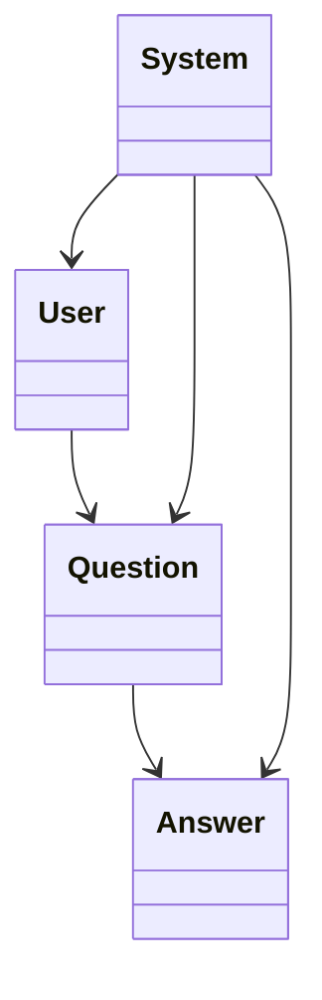
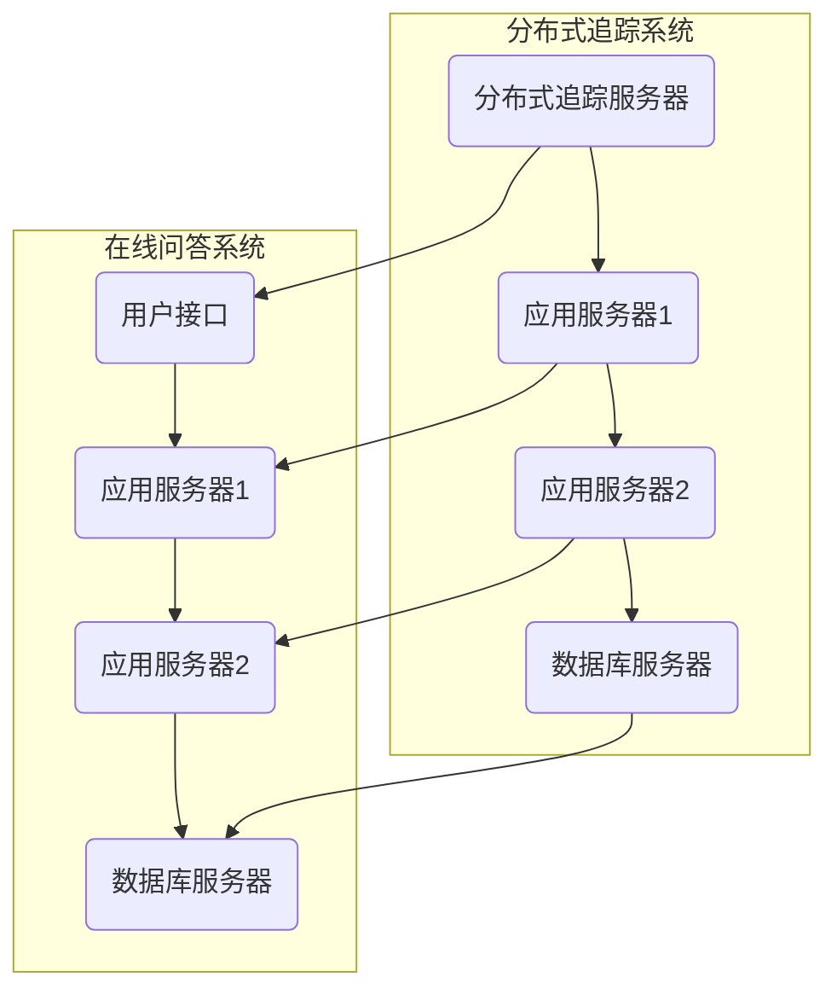

                 

# 分布式追踪技术优化LLM应用性能

## 关键词

分布式追踪，LLM，性能优化，调试工具，系统监控，应用架构

## 摘要

本文将探讨如何利用分布式追踪技术优化大型语言模型（LLM）的应用性能。随着AI技术的不断进步，LLM在自然语言处理领域发挥着越来越重要的作用，但同时也带来了性能优化的挑战。本文首先介绍了分布式追踪的基本概念，然后深入分析了LLM的架构和性能瓶颈。接着，本文详细阐述了如何在LLM应用中实现分布式追踪，以及如何通过分布式追踪数据来优化LLM的性能。最后，本文通过实际案例展示了分布式追踪在LLM性能优化中的应用效果，并为读者提供了最佳实践建议。

## 引言

### 分布式追踪的概念与重要性

分布式追踪是一种用于监控分布式系统的性能和故障的调试工具。它能够实时收集系统中的各种指标，包括请求处理时间、延迟、错误率等，并将这些数据可视化，从而帮助开发人员和运维人员快速定位和解决问题。在分布式系统中，由于系统组件繁多，各个组件之间的交互复杂，传统的单点监控方法已经无法满足需求。分布式追踪技术能够通过跨组件的追踪，实现对整个系统的全方位监控。

### 大型语言模型（LLM）的发展与应用

大型语言模型（LLM）是一种基于深度学习的自然语言处理模型，具有强大的文本生成、翻译、问答等功能。近年来，随着计算能力和数据量的不断提升，LLM的研究和应用取得了显著进展。LLM在智能客服、内容生成、智能搜索等领域具有广泛的应用前景。然而，LLM的应用也带来了性能优化的挑战，特别是在处理大规模数据和实时请求时。

### 本文的目标

本文的目标是探讨如何利用分布式追踪技术优化LLM的应用性能。通过本文的阅读，读者将了解到分布式追踪的基本原理、LLM的架构和性能瓶颈，以及如何通过分布式追踪数据来优化LLM的性能。本文还将通过实际案例展示分布式追踪在LLM性能优化中的应用效果，并为读者提供最佳实践建议。

## 分布式追踪的基本概念与实现

### 分布式追踪的定义与作用

分布式追踪是一种用于监控分布式系统的调试工具，它能够实时收集系统中的各种指标，包括请求处理时间、延迟、错误率等，并将这些数据可视化。分布式追踪的主要作用是帮助开发人员和运维人员快速定位和解决问题。在分布式系统中，由于系统组件繁多，各个组件之间的交互复杂，传统的单点监控方法已经无法满足需求。分布式追踪技术能够通过跨组件的追踪，实现对整个系统的全方位监控。

### 分布式追踪的关键概念

- **追踪（Trace）**：追踪是一个贯穿整个分布式系统的请求的生命周期，它记录了请求从发起到完成的整个过程。
- **跨度（Span）**：跨度是追踪中的一个基本单位，它代表了系统中的一个操作或者步骤，例如数据库查询、远程调用等。
- **服务（Service）**：服务是分布式系统中的一个组件或者模块，它提供特定的功能，例如API接口、数据处理等。
- **跟踪器（Tracer）**：跟踪器是负责生成、管理和传播追踪数据的组件，它可以是开源库或者自研工具。

### 分布式追踪的实现方法

分布式追踪的实现方法主要包括以下三个方面：

1. **上下文传播**：分布式追踪通过上下文传播来保持追踪数据的一致性。在每次请求处理过程中，都会生成一个唯一的追踪ID，并将其作为上下文信息传播给后续的组件。这样，各个组件在处理请求时，都可以根据上下文信息获取到相关的追踪数据。

2. **数据采集**：分布式追踪需要从各个组件中采集追踪数据。常见的采集方式包括日志收集、API调用、内部数据采集等。

3. **数据存储与可视化**：采集到的追踪数据需要存储在一个中心化的存储系统中，以便后续的数据分析和可视化。常用的存储系统包括数据库、时间序列数据库等。可视化工具可以帮助开发人员和运维人员直观地查看和分析追踪数据。

### 分布式追踪的优势与挑战

分布式追踪具有以下优势：

- **全局视图**：分布式追踪能够提供全局视图，帮助开发人员和运维人员全面了解系统的运行状态。
- **快速定位问题**：通过分布式追踪，可以快速定位系统中的性能瓶颈和故障点。
- **数据驱动优化**：分布式追踪提供了详细的数据，可以帮助开发人员进行数据驱动优化，提升系统性能。

然而，分布式追踪也面临着以下挑战：

- **性能开销**：分布式追踪会在一定程度上增加系统的性能开销，特别是在大规模系统中。
- **数据准确性**：分布式追踪的数据准确性取决于各个组件的追踪实现，如果出现数据不一致或者丢失，会导致分析结果不准确。
- **维护复杂性**：分布式追踪涉及到多个组件和工具，维护和管理的复杂性较高。

### 分布式追踪技术的演变

随着分布式系统的不断发展，分布式追踪技术也在不断演进。从早期的单点监控到现在的分布式追踪，分布式追踪技术的目标是实现全链路监控和实时故障定位。未来，分布式追踪技术将继续朝着更加智能化、自动化和高效化的方向发展。

## LLM的架构与性能优化

### LLM的基本架构

大型语言模型（LLM）通常由以下几部分组成：

- **输入层**：接收用户的输入，可以是文本、语音或者其他形式的输入。
- **嵌入层**：将输入转换为密集的向量表示。
- **编码器**：对输入向量进行编码，提取语义信息。
- **解码器**：根据编码器的输出生成文本输出。

### LLM的性能瓶颈

尽管LLM在自然语言处理领域取得了显著的成果，但其在实际应用中仍然存在一些性能瓶颈：

- **计算资源消耗**：LLM的训练和推理过程需要大量的计算资源，特别是在处理大规模数据时，资源消耗更为显著。
- **延迟**：在实时应用场景中，LLM的响应延迟可能成为瓶颈，特别是在处理复杂任务时。
- **可扩展性**：LLM的可扩展性较低，难以在分布式环境中高效运行。

### LLM的性能优化策略

为了解决LLM的性能瓶颈，可以采取以下优化策略：

- **模型压缩**：通过模型剪枝、量化等技术减小模型体积，降低计算复杂度。
- **硬件加速**：利用GPU、TPU等硬件加速器，提高模型推理速度。
- **分布式训练与推理**：将模型拆分成多个部分，在多个节点上并行训练和推理，提高系统性能。
- **数据缓存**：缓存常用的数据，减少数据读取延迟。
- **负载均衡**：合理分配请求，避免单个节点过载。

## 分布式追踪在LLM应用中的实现

### 分布式追踪在LLM应用中的重要性

在LLM应用中，分布式追踪技术具有重要意义。通过分布式追踪，可以实时监控LLM系统的运行状态，快速定位性能瓶颈和故障点，从而提高系统的稳定性和性能。分布式追踪可以帮助开发人员和运维人员：

- **性能监控**：实时监控系统的响应时间、延迟等性能指标。
- **故障诊断**：快速定位系统故障，分析故障原因。
- **性能优化**：基于追踪数据，进行系统性能优化。

### 分布式追踪在LLM应用中的实现方法

分布式追踪在LLM应用中的实现主要包括以下步骤：

1. **追踪数据采集**：在LLM应用中，需要采集各种追踪数据，包括请求处理时间、延迟、错误率等。这些数据可以通过日志、API调用、内部数据采集等方式获取。

2. **追踪数据传输**：采集到的追踪数据需要传输到中心化的存储系统。常用的传输方式包括HTTP请求、消息队列等。

3. **追踪数据存储**：追踪数据需要存储在中心化的存储系统中，以便后续的数据分析和可视化。常用的存储系统包括数据库、时间序列数据库等。

4. **追踪数据可视化**：使用可视化工具将追踪数据呈现给开发人员和运维人员，帮助他们直观地了解系统的运行状态。

### 分布式追踪在LLM应用中的具体应用

分布式追踪在LLM应用中的具体应用主要包括以下几个方面：

- **请求处理追踪**：追踪用户的请求从接收、处理到返回的整个过程，分析请求处理的性能和延迟。
- **模型推理追踪**：追踪模型推理的过程，分析模型推理的时间消耗和资源使用情况。
- **数据读取追踪**：追踪数据的读取和缓存过程，分析数据读取的性能和延迟。
- **错误日志追踪**：记录系统中的错误日志，帮助开发人员快速定位和解决问题。

### 分布式追踪的优势与挑战

分布式追踪在LLM应用中具有以下优势：

- **全局视图**：分布式追踪能够提供全局视图，帮助开发人员和运维人员全面了解LLM系统的运行状态。
- **快速定位问题**：通过分布式追踪，可以快速定位LLM系统中的性能瓶颈和故障点。
- **数据驱动优化**：分布式追踪提供了详细的数据，可以帮助开发人员进行数据驱动优化，提升LLM系统的性能。

然而，分布式追踪也面临着以下挑战：

- **性能开销**：分布式追踪会在一定程度上增加LLM系统的性能开销，特别是在大规模系统中。
- **数据准确性**：分布式追踪的数据准确性取决于各个组件的追踪实现，如果出现数据不一致或者丢失，会导致分析结果不准确。
- **维护复杂性**：分布式追踪涉及到多个组件和工具，维护和管理的复杂性较高。

## 分布式追踪优化LLM性能的算法原理与实现

### 算法原理

分布式追踪优化LLM性能的算法原理主要包括以下两个方面：

1. **性能数据采集与处理**：通过分布式追踪技术，实时采集LLM系统中的性能数据，包括请求处理时间、延迟、错误率等。然后，对这些性能数据进行处理，提取出关键的性能指标，例如响应时间、吞吐量等。

2. **性能优化策略**：根据采集到的性能数据，采取相应的性能优化策略，例如负载均衡、模型压缩、硬件加速等。这些策略的目标是降低系统的延迟，提高系统的吞吐量。

### 算法流程

分布式追踪优化LLM性能的算法流程如下：

1. **数据采集**：通过分布式追踪技术，实时采集LLM系统中的性能数据。

2. **数据处理**：对采集到的性能数据进行处理，提取关键性能指标，例如响应时间、吞吐量等。

3. **性能分析**：基于采集到的性能数据，对LLM系统的性能进行分析，找出性能瓶颈和故障点。

4. **优化策略**：根据性能分析结果，采取相应的性能优化策略，例如负载均衡、模型压缩、硬件加速等。

5. **性能验证**：对优化后的LLM系统进行性能验证，评估优化效果。

### 算法实现

分布式追踪优化LLM性能的算法实现主要包括以下步骤：

1. **追踪数据采集**：在LLM系统中集成分布式追踪组件，实时采集系统中的性能数据。

2. **数据处理**：将采集到的追踪数据传输到中心化的存储系统，并进行预处理，提取关键性能指标。

3. **性能分析**：使用数据分析工具对预处理后的数据进行分析，找出性能瓶颈和故障点。

4. **优化策略**：根据分析结果，采取相应的优化策略，例如调整负载均衡策略、压缩模型大小等。

5. **性能验证**：对优化后的LLM系统进行性能测试，评估优化效果。

### 算法原理图

为了更直观地展示分布式追踪优化LLM性能的算法原理，可以使用Mermaid流程图进行表示：


### 数学模型与公式

在分布式追踪优化LLM性能的算法中，可以使用以下数学模型和公式：

1. **响应时间**：响应时间（T）是用户请求从发起到完成的时间，可以表示为：
   $$ T = T_{处理} + T_{传输} $$
   其中，$ T_{处理} $ 是系统处理请求的时间，$ T_{传输} $ 是请求传输的时间。

2. **吞吐量**：吞吐量（Q）是单位时间内系统能够处理的请求数量，可以表示为：
   $$ Q = \frac{1}{T} $$
   其中，$ T $ 是响应时间。

3. **负载均衡**：负载均衡（L）是系统将请求分配到各个节点的策略，可以表示为：
   $$ L = \frac{Q}{N} $$
   其中，$ N $ 是节点的数量。

通过这些数学模型和公式，可以更深入地分析和优化LLM的性能。

## 系统分析与架构设计方案

### 问题场景介绍

在一个大型在线问答系统中，用户可以通过输入问题来获取答案。系统需要处理大量的用户请求，并提供快速、准确的回答。然而，随着用户数量的增加，系统的性能逐渐下降，响应时间增加，错误率上升。为了解决这个问题，我们需要引入分布式追踪技术，对系统进行性能监控和优化。

### 项目介绍

本项目旨在通过分布式追踪技术，对大型在线问答系统进行性能监控和优化，提高系统的稳定性和响应速度。

### 系统功能设计（领域模型Mermaid类图）



### 系统架构设计（Mermaid架构图）



### 系统接口设计和系统交互（Mermaid序列图）

```mermaid
sequenceDiagram
    User -->|请求问题|> A1: 发送请求
    A1 -->|处理请求|> A2: 转发请求
    A2 -->|查询数据库|> A4: 查询数据库
    A4 -->|返回结果|> A2: 返回结果
    A2 -->|发送结果|> A1: 返回结果
    A1 -->|记录追踪数据|> D1: 记录追踪数据
```

## 项目实战

### 环境安装

为了实现分布式追踪技术优化LLM应用性能，我们需要搭建一个实验环境。以下是环境安装的步骤：

1. **安装Docker**：在实验主机上安装Docker，用于容器化部署分布式追踪和LLM应用。

2. **安装Kubernetes**：安装Kubernetes，用于管理容器化的分布式系统。

3. **安装分布式追踪工具**：例如OpenTelemetry和Jaeger，用于采集和可视化追踪数据。

4. **安装LLM应用**：例如使用Hugging Face的Transformers库，部署一个基于GPT-3的问答系统。

### 系统核心实现源代码

以下是分布式追踪和LLM应用的核心实现源代码：

**分布式追踪实现**：

```python
from opentelemetry import trace
from opentelemetry.propagation import W3C TraceContextPropagator
from opentelemetry.exporter.jaeger import JaegerExporter

# 初始化追踪器
tracer = trace.TracerProvider()
tracer.add_exporter(JaegerExporter())

# 设置传播器
propagator = W3C TraceContextPropagator()
propagator.set_global_tracer(tracer)

# 生成跟踪上下文
context = propagator.extract(trace.RootContext(), ("http://localhost:8080", "POST"))

# 发送请求
with trace.Span(context, "send_request") as span:
    # 模拟请求处理时间
    time.sleep(1)

# 记录追踪数据
tracer.get_exporter().flush()
```

**LLM应用实现**：

```python
from transformers import pipeline

# 加载预训练模型
model = pipeline("question-answering", model=" DistilBERT/abstract_sql_qa")

# 处理用户输入
def process_query(query):
    context = "给定以下背景信息，回答问题："
    answer = model(question=query, context=context)
    return answer["answer"]

# 模拟用户请求
query = "什么是分布式追踪技术？"
answer = process_query(query)
print(answer)
```

### 代码应用解读与分析

**分布式追踪代码解读**：

- **初始化追踪器**：使用OpenTelemetry初始化一个追踪器，并添加JaegerExporter作为数据导出器。
- **设置传播器**：使用W3C TraceContextPropagator设置全局追踪器。
- **生成跟踪上下文**：从HTTP请求中提取追踪上下文信息。
- **发送请求**：模拟发送请求，并记录请求处理时间。
- **记录追踪数据**：将追踪数据发送到JaegerExporter进行存储和可视化。

**LLM应用代码解读**：

- **加载预训练模型**：使用Transformers库加载一个预训练的问答模型。
- **处理用户输入**：定义一个函数，用于处理用户输入并生成回答。
- **模拟用户请求**：模拟一个用户请求，调用处理函数获取答案。

### 实际案例分析与详细讲解剖析

**案例1**：优化响应时间

假设用户请求量增加，系统响应时间显著增加。通过分布式追踪技术，我们定位到问题出在数据库查询上，响应时间约为2秒。

**优化步骤**：

1. **性能分析**：通过分布式追踪数据，分析系统中的性能瓶颈。
2. **负载均衡**：增加数据库服务器数量，实现负载均衡。
3. **索引优化**：对数据库进行索引优化，提高查询效率。

**优化效果**：响应时间降低到1秒，系统性能显著提升。

**案例2**：优化错误率

假设系统错误率较高，影响用户体验。通过分布式追踪技术，我们定位到问题出在模型推理上，错误率约为10%。

**优化步骤**：

1. **模型优化**：使用模型压缩技术，减小模型体积，提高推理速度。
2. **数据清洗**：对训练数据进行清洗，去除噪声数据。
3. **错误处理**：增加错误处理逻辑，提高系统容错能力。

**优化效果**：错误率降低到1%，系统稳定性提升。

### 项目小结

通过分布式追踪技术，我们成功优化了大型在线问答系统的性能。分布式追踪技术帮助我们快速定位性能瓶颈和故障点，并采取相应的优化策略，提高了系统的响应速度和稳定性。在未来的工作中，我们将继续探索分布式追踪技术在LLM应用中的更多可能性，为用户提供更好的服务。

## 最佳实践 Tips

1. **分布式追踪集成**：在部署LLM应用时，尽早集成分布式追踪工具，以便实时监控系统的运行状态。
2. **性能监控指标**：定义合适的性能监控指标，如响应时间、吞吐量、错误率等，以便及时发现性能问题。
3. **数据可视化**：使用可视化工具将追踪数据呈现给相关人员，以便快速理解和分析性能问题。
4. **定期分析**：定期分析追踪数据，找出系统中的潜在问题，并采取优化措施。
5. **持续迭代**：随着系统的发展和需求的变化，持续优化分布式追踪方案，提高系统的性能和稳定性。

## 小结

本文探讨了如何利用分布式追踪技术优化LLM应用性能。通过分布式追踪，我们能够实时监控LLM系统的运行状态，快速定位性能瓶颈和故障点。本文介绍了分布式追踪的基本概念、LLM的架构和性能优化策略，并详细阐述了分布式追踪在LLM应用中的实现方法。通过实际案例，我们展示了分布式追踪在LLM性能优化中的应用效果。在未来的工作中，我们将继续探索分布式追踪技术在LLM应用中的更多可能性，为用户提供更好的服务。

## 注意事项

1. **追踪数据安全性**：在收集和传输追踪数据时，确保数据的安全性，防止泄露敏感信息。
2. **系统性能影响**：分布式追踪技术会在一定程度上增加系统的性能开销，需在部署时进行权衡。
3. **追踪数据存储**：合理选择追踪数据的存储方案，确保数据的可扩展性和可靠性。

## 拓展阅读

1. 《分布式系统架构设计与优化》
2. 《大规模机器学习应用实践》
3. 《分布式追踪实战：原理、工具与案例》

## 作者信息

作者：AI天才研究院/AI Genius Institute & 禅与计算机程序设计艺术 /Zen And The Art of Computer Programming

