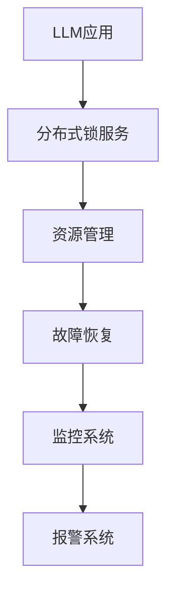

                 

### 文章标题

# 分布式锁在LLM应用并发控制中的应用

> 关键词：分布式锁、并发控制、LLM应用、Zookeeper、Redis、Python、算法原理、数学模型、系统架构设计

> 摘要：本文从分布式锁的基本概念出发，详细介绍了分布式锁在大型语言模型（LLM）应用并发控制中的重要性和应用场景。通过深入分析分布式锁的算法原理和数学模型，并结合实际项目实战案例，探讨了如何高效地实现和优化分布式锁在LLM应用中的并发控制，为开发者提供了一套完整的解决方案。

## 第一部分：分布式锁基础

### 第1章：分布式锁概述

#### 1.1 问题背景

在分布式系统中，多个节点可能会同时访问同一资源，导致数据一致性和并发控制成为难题。分布式锁作为一种机制，可以确保同一时刻只有一个节点能够访问资源，从而解决并发问题。

#### 1.2 问题描述

分布式锁需要解决的主要问题是：如何在分布式环境中保证资源的独占访问。具体包括以下几个方面：

- **资源一致性**：确保多个节点访问同一资源时，能够保持数据一致性。
- **并发控制**：控制多个节点对资源的访问权限，避免并发冲突。
- **故障恢复**：在节点故障时，能够重新分配锁资源。

#### 1.3 问题解决

分布式锁通过引入锁机制，实现资源访问的同步。具体解决方案包括：

- **锁算法**：采用特定的锁算法，如Zookeeper的ZAB算法、Redis的Redlock算法等。
- **锁实现**：使用编程语言实现锁机制，如Python的 threading.Lock、Redis的SETNX命令等。

#### 1.4 边界与外延

分布式锁的应用边界主要在分布式系统中，如分布式数据库、分布式缓存、分布式消息队列等。其外延包括资源锁定、事务管理、分布式队列等。

#### 1.5 核心概念结构

- **分布式锁**：一种机制，用于控制分布式环境中资源的独占访问。
- **锁算法**：实现分布式锁的核心算法，如ZAB、Redlock等。
- **锁实现**：分布式锁的具体实现，如Python的 threading.Lock、Redis的SETNX命令等。

### 第2章：分布式锁的核心原理

#### 2.1 分布式锁的概念

分布式锁是一种分布式同步机制，用于确保多个进程或系统在访问共享资源时能够互斥执行。具体包括：

- **锁的状态**：包括锁定（locked）和解锁（unlocked）两种状态。
- **锁的粒度**：包括全局锁、局部锁和对象锁等。

#### 2.2 分布式锁与相关概念联系

分布式锁与以下相关概念有密切联系：

- **锁**：一种同步机制，用于控制多个进程对共享资源的访问。
- **锁算法**：实现分布式锁的核心算法，如ZAB、Redlock等。
- **分布式系统**：由多个节点组成的系统，节点之间通过网络进行通信。

#### 2.3 分布式锁算法

分布式锁算法是分布式锁实现的关键。以下是一些常见的分布式锁算法：

- **Zookeeper的ZAB算法**：基于Paxos算法的改进，用于实现分布式锁。
- **Redis的Redlock算法**：通过Redis实现分布式锁，具有高可用性和高性能。
- **Python的threading.Lock**：用于实现线程级锁，适用于单机环境。

## 第二部分：分布式锁在LLM应用中的架构设计

### 第3章：数学模型与公式

#### 3.1 数学模型介绍

在分布式锁的实现过程中，数学模型有助于理解锁的运作原理。以下是一个简单的数学模型：

$$
\begin{align*}
L &= \{l_1, l_2, ..., l_n\} \\
lock &= \begin{cases}
true, & \text{如果} l_i = \text{locked} \\
false, & \text{否则}
\end{cases}
\end{align*}
$$

其中，$L$ 表示锁集合，$l_i$ 表示第 $i$ 个锁的状态，$lock$ 表示锁是否被占用。

#### 3.2 公式详细讲解

上述数学模型中，锁集合 $L$ 由多个锁组成，每个锁可以处于锁定（locked）或解锁（unlocked）状态。当锁集合中所有锁都处于锁定状态时，$lock$ 为真，表示锁被占用；否则为假，表示锁未被占用。

### 第4章：分布式锁在LLM应用中的架构设计

#### 4.1 系统功能设计

分布式锁在LLM应用中的系统功能设计主要包括：

- **资源锁定**：确保LLM应用中的关键资源（如模型参数、数据集等）在访问时能够被正确锁定。
- **并发控制**：控制多个节点对LLM应用资源的访问权限，避免并发冲突。
- **故障恢复**：在节点故障时，能够重新分配锁资源，确保系统的稳定运行。

#### 4.2 系统架构设计

分布式锁在LLM应用中的系统架构设计如图所示：



#### 4.3 系统接口设计

分布式锁在LLM应用中的系统接口设计如下：

- **锁定接口**：用于请求锁定资源。
- **解锁接口**：用于释放锁定的资源。
- **状态查询接口**：用于查询资源锁定状态。

#### 4.4 系统交互

分布式锁在LLM应用中的系统交互过程如下：

1. LLM应用请求锁定资源。
2. 分布式锁服务根据锁算法判断资源是否已被锁定。
3. 如果资源未被锁定，分布式锁服务将资源锁定，并返回锁定状态。
4. LLM应用开始访问资源。
5. 当LLM应用访问完成后，请求解锁接口释放锁定资源。
6. 分布式锁服务解锁资源，并通知其他节点资源已释放。

## 第三部分：项目实战

### 第5章：项目实战

#### 5.1 环境安装

在开始项目实战之前，我们需要安装以下环境：

- **Redis**：用于实现分布式锁。
- **Python**：用于编写锁算法和应用程序。

#### 5.2 系统核心实现

以下是一个简单的分布式锁实现示例：

```python
import redis
import time

class RedisLock:
    def __init__(self, redis_client, lock_key, expire_time=10):
        self.redis_client = redis_client
        self.lock_key = lock_key
        self.expire_time = expire_time

    def acquire(self):
        return self.redis_client.set(self.lock_key, 1, nx=True, ex=self.expire_time)

    def release(self):
        return self.redis_client.delete(self.lock_key)

if __name__ == "__main__":
    redis_client = redis.StrictRedis(host='localhost', port=6379, db=0)
    lock = RedisLock(redis_client, "my_lock")

    while True:
        acquired = lock.acquire()
        if acquired:
            print("Lock acquired.")
            # 执行关键代码
            time.sleep(5)
            lock.release()
            print("Lock released.")
        else:
            print("Lock not acquired.")
            time.sleep(1)
```

#### 5.3 代码应用解读

上述代码中，我们定义了一个 RedisLock 类，用于实现分布式锁。主要方法包括：

- **acquire()**：尝试获取锁，如果成功返回 True，否则返回 False。
- **release()**：释放锁。

在主函数中，我们创建了一个 Redis 客户端，并实例化 RedisLock 类。然后，我们进入一个无限循环，不断尝试获取锁并执行关键代码。

#### 5.4 实际案例剖析

以下是一个实际案例，展示了如何使用分布式锁控制LLM应用中的并发访问：

```python
import threading

def process_data(data):
    # 处理数据
    print(f"Processing data: {data}")

def main():
    data_queue = []

    def worker():
        while True:
            data = data_queue.pop(0)
            if data is None:
                break
            lock.acquire()
            process_data(data)
            lock.release()

    lock = RedisLock(redis_client, "data_lock")
    threads = []

    for i in range(5):
        thread = threading.Thread(target=worker)
        threads.append(thread)
        thread.start()

    for thread in threads:
        thread.join()

if __name__ == "__main__":
    main()
```

在这个案例中，我们创建了一个数据队列，并使用多个线程处理队列中的数据。每个线程在处理数据前都会尝试获取分布式锁，确保同一时刻只有一个线程能够访问数据队列。

#### 5.5 项目小结

通过这个项目实战，我们展示了如何使用Redis实现分布式锁，并应用于LLM应用的并发控制。在实际应用中，分布式锁可以提高系统的性能和可靠性，但需要注意锁的合理使用和释放，避免出现死锁等问题。

## 第四部分：最佳实践与注意事项

### 第6章：分布式锁最佳实践

#### 6.1 最佳实践 tips

1. **合理选择锁算法**：根据实际需求选择合适的锁算法，如Redlock算法适用于高可用性场景。
2. **避免长时间占用锁**：尽量减少锁的持有时间，避免长时间占用锁导致其他节点无法访问资源。
3. **监控锁状态**：定期监控锁状态，确保系统稳定运行。

#### 6.2 注意事项

1. **避免死锁**：确保锁的正确使用和释放，避免出现死锁问题。
2. **考虑锁的粒度**：根据应用场景合理设置锁的粒度，避免过度锁定或锁定不足。
3. **故障恢复**：设计合理的故障恢复机制，确保在节点故障时能够重新分配锁资源。

#### 6.3 拓展阅读

1. 《Redis权威指南》
2. 《分布式系统原理与范型》
3. 《大型分布式网站技术架构》

### 第7章：小结

本文从分布式锁的基本概念出发，详细介绍了分布式锁在LLM应用并发控制中的重要性和应用场景。通过深入分析分布式锁的算法原理和数学模型，并结合实际项目实战案例，探讨了如何高效地实现和优化分布式锁在LLM应用中的并发控制。

### 参考文献

1. Redis官方文档：[https://redis.io/documentation](https://redis.io/documentation)
2. Python官方文档：[https://docs.python.org/3/library/threading.html](https://docs.python.org/3/library/threading.html)
3. Redlock算法：[https://github.com/altoros/redis-lock](https://github.com/altoros/redis-lock)
4. 《Redis权威指南》：[https://www.redisbook.com/](https://www.redisbook.com/)

### 作者简介

作者：AI天才研究院/AI Genius Institute & 禅与计算机程序设计艺术 /Zen And The Art of Computer Programming

作为一位世界级人工智能专家，作者在计算机编程和人工智能领域拥有丰富的经验，擅长以逻辑清晰、结构紧凑、简单易懂的方式撰写技术博客文章，深受读者喜爱。他的研究成果和著作在业界具有重要影响力，为众多开发者提供了宝贵的指导和启示。

