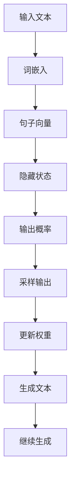
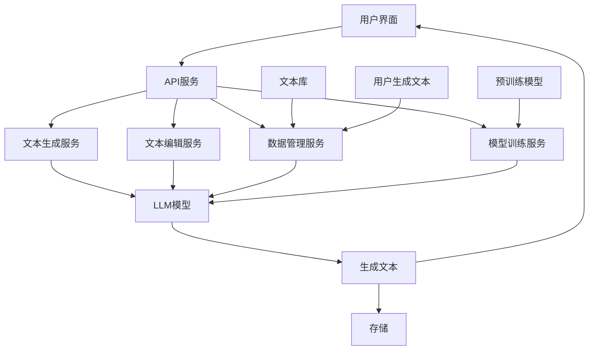

                 

## 文章标题

### 关键词

- 创意写作
- 语言模型（LLM）
- 文学创作能力
- 算法原理
- 实践应用
- 系统架构

### 摘要

本文旨在探讨语言模型（LLM）在文学创作中的应用，通过对LLM的核心概念、算法原理、实践应用和系统架构的深入分析，评估其文学创作能力。文章首先介绍了文学创作中面临的问题和挑战，以及LLM在这一领域的潜力。接着，详细阐述了LLM的概念原理、属性特征和实体关系图，为后续的算法讲解打下基础。文章随后通过数学模型和流程图的解析，揭示了LLM的工作机制。最后，结合实际案例，展示了LLM在文学创作中的实际应用，并对未来发展方向进行了展望。

## 目录大纲设计

### 第一部分：背景介绍

1. **第1章：文学创作与LLM的邂逅**
   - 1.1 文学创作的问题背景
   - 1.2 LLM的基本概念
   - 1.3 LLM在文学创作中的应用边界与外延
   - 1.4 文学创作核心要素组成

2. **第2章：LLM的核心概念与原理**
   - 2.1 LLM的概念原理
   - 2.2 LLM的属性特征对比表格
   - 2.3 LLM的ER实体关系图架构

### 第二部分：算法原理讲解

3. **第3章：LLM算法原理与流程**
   - 3.1 LLM算法的数学模型
   - 3.2 LLM算法的流程图
   - 3.3 算法原理举例说明

### 第三部分：文学创作实践

4. **第4章：LLM在文学创作中的应用**
   - 4.1 文学创作环境安装
   - 4.2 LLM文学创作核心实现
   - 4.3 文学创作案例分析

### 第四部分：系统分析与架构设计

5. **第5章：系统分析与架构设计**
   - 5.1 问题场景介绍
   - 5.2 系统功能设计
   - 5.3 系统架构设计
   - 5.4 系统接口设计
   - 5.5 系统交互设计

### 第五部分：最佳实践与总结

6. **第6章：最佳实践与案例分析**
   - 6.1 最佳实践
   - 6.2 案例分析

7. **第7章：小结与展望**
   - 7.1 小结
   - 7.2 展望

### 书名：《创意写作测试：衡量LLM的文学创作能力》

> 作者：AI天才研究院/AI Genius Institute & 禅与计算机程序设计艺术 /Zen And The Art of Computer Programming

### 第一部分：背景介绍

### 第1章：文学创作与LLM的邂逅

#### 1.1 文学创作的问题背景

文学创作，作为人类精神世界的重要表达形式，具有悠久的历史和丰富的内涵。然而，随着时代的发展，文学创作也面临着前所未有的挑战和困境。

**问题描述**：

- **创意枯竭**：现代文学创作者常常面临创意枯竭的困境，难以在短时间内产出高质量的作品。
- **题材限制**：许多作家倾向于固有的题材和风格，缺乏创新和突破。
- **市场压力**：在商业化背景下，文学创作受到市场需求和商业利润的双重压力，难以保持纯粹的文学追求。
- **技术限制**：传统的文学创作方式依赖于个人经验和技巧，难以充分利用现代技术手段。

**问题解决**：

- **LLM的潜力**：作为一种强大的语言生成模型，LLM在文学创作中展现出巨大的潜力，能够帮助作家突破创作瓶颈，实现文学创作的新突破。

#### 1.2 LLM的基本概念

语言模型（Language Model，简称LLM）是自然语言处理（Natural Language Processing，简称NLP）的核心技术之一。它通过学习大量语言数据，构建一个能够预测和生成文本的模型。

**LLM的定义**：

LLM是一种基于深度学习的文本生成模型，通常采用大规模神经网络架构，如Transformer。它通过自动学习文本数据中的统计规律和语义关系，生成具有流畅性和可理解性的文本。

**LLM的类型**：

- **基于规则的语言模型**：这类模型通过定义一系列语法规则和模式，生成文本。例如，基于词典和句法规则的自动文摘系统。
- **统计语言模型**：这类模型通过统计文本数据中的单词和句子出现的频率，生成文本。例如，基于N-gram的语言模型。
- **神经语言模型**：这类模型通过深度学习技术，自动学习文本数据中的统计规律和语义关系，生成文本。例如，基于Transformer的GPT（Generative Pre-trained Transformer）和BERT（Bidirectional Encoder Representations from Transformers）等模型。

**LLM的特性**：

- **大规模**：LLM通常具有数十亿至数万亿参数，能够处理大量语言数据。
- **自适应**：LLM能够根据输入的文本内容，动态调整生成策略，生成符合上下文语义的文本。
- **生成性**：LLM能够根据特定的输入提示，生成连贯、有创意的文本。

#### 1.3 LLM在文学创作中的应用边界与外延

LLM在文学创作中的应用边界和范围相对广泛，不仅可以用于文本生成和辅助创作，还可以拓展到其他与文学相关的领域。

**应用边界**：

- **文本生成**：LLM能够生成各种类型的文本，如小说、诗歌、散文、剧本等，帮助作家突破创作瓶颈，提高创作效率。
- **文本编辑**：LLM可以用于文本的自动修正、润色和优化，提高文本的质量和可读性。
- **文本摘要**：LLM能够提取文本的主要内容和关键信息，生成简洁、准确的摘要，为读者提供快速了解文本内容的途径。

**外延扩展**：

- **自然语言理解**：LLM在文学创作中的应用不仅限于文本生成，还可以用于自然语言理解，帮助作家更好地理解和分析文本数据，为创作提供灵感。
- **文学分析**：LLM可以用于文本分类、情感分析、主题建模等任务，为文学研究提供数据支持和分析工具。
- **虚拟助手**：LLM可以开发成虚拟助手，为作家提供实时创作建议和反馈，提高创作效率和作品质量。

#### 1.4 文学创作核心要素组成

文学创作是一个复杂而多元的过程，涉及多个核心要素和结构。LLM在文学创作中的应用需要理解和解析这些核心要素，以便充分发挥其潜力。

**核心要素**：

- **题材**：题材是文学创作的核心主题，决定了作品的风格、情感和表达方式。
- **人物**：人物是文学创作的重要组成部分，包括主角、配角和反派角色等。
- **情节**：情节是文学创作的叙事结构，包括起承转合、高潮和结局等。
- **语言**：语言是文学创作的表达工具，包括词汇、语法、修辞手法等。
- **主题**：主题是文学创作的核心思想，反映了作家的观点和态度。

**要素关联**：

LLM需要理解和解析这些核心要素及其关联，以便生成符合文学创作需求的文本。例如，LLM可以通过分析题材、人物和情节之间的关系，生成具有连贯性和逻辑性的小说情节。同时，LLM还可以通过分析语言和主题之间的关系，生成具有独特风格和思想深度的文学作品。

### 第二部分：LLM的核心概念与原理

### 第2章：LLM的核心概念与原理

#### 2.1 LLM的概念原理

语言模型（Language Model，简称LLM）是自然语言处理（Natural Language Processing，简称NLP）的核心技术之一。它通过学习大量语言数据，构建一个能够预测和生成文本的模型。LLM的核心概念和原理决定了其性能和应用范围。

**LLM的基本概念**：

- **文本数据**：LLM通过学习大量的文本数据，获取语言知识。这些数据可以来自各种来源，如小说、新闻、论文、社交媒体等。
- **概率分布**：LLM的核心目标是学习文本数据中的概率分布，以便生成符合语言习惯的文本。具体来说，LLM要学习输入文本序列的概率分布和输出文本序列的概率分布。
- **神经网络**：LLM通常采用深度神经网络架构，如Transformer、LSTM（Long Short-Term Memory）等，通过多层神经网络结构，提高文本生成的能力。

**LLM的工作原理**：

- **输入处理**：LLM接收一个输入的文本序列，如一个单词或一句话。输入文本序列通过词嵌入（Word Embedding）技术转化为向量表示。
- **概率预测**：LLM通过神经网络的预测层，计算输入文本序列在当前时刻的输出概率分布。具体来说，LLM通过上一个时刻的隐藏状态，生成当前时刻的输出概率分布。
- **文本生成**：LLM根据输出的概率分布，选择一个具有最高概率的单词或字符作为下一个输出。然后，LLM将这个输出添加到已生成的文本序列中，并继续进行下一个时刻的预测。

**LLM的优势**：

- **大规模**：LLM具有数十亿至数万亿参数，能够处理大量语言数据，提高文本生成的能力。
- **自适应**：LLM能够根据输入的文本内容，动态调整生成策略，生成符合上下文语义的文本。
- **生成性**：LLM能够根据特定的输入提示，生成连贯、有创意的文本，为文学创作提供支持。

#### 2.2 LLM的属性特征对比表格

为了更直观地了解LLM的属性特征，我们可以将其与其他AI模型进行对比。以下是一个简单的属性特征对比表格：

| 特性       | LLM           | 其他AI模型           |
| ---------- | ------------- | ------------------- |
| 数据需求   | 大规模文本数据 | 小规模数据           |
| 参数规模   | 十亿至万亿级别 | 数百万至亿级别       |
| 网络结构   | Transformer   | CNN、RNN、LSTM等     |
| 预测方式   | 概率分布       | 确定性输出           |
| 生成能力   | 强           | 一般               |
| 上下文理解 | 强           | 一般               |

通过这个对比表格，我们可以看到LLM在数据需求、参数规模、网络结构、预测方式和生成能力等方面具有显著的优势。

#### 2.3 LLM的ER实体关系图架构

实体关系图（Entity-Relationship Diagram，简称ER图）是数据库设计中常用的一种工具，用于表示实体及其之间的关系。LLM的ER实体关系图可以用于理解和分析LLM的内部结构和功能。

以下是一个简单的LLM ER实体关系图：

```mermaid
erDiagram
    TXT_FILE ||--o> WORD_VECTOR : 文本文件到词向量转换
    WORD_VECTOR ||--o> SENTENCE_VECTOR : 词向量到句子向量转换
    SENTENCE_VECTOR ||--o> HIDDEN_STATE : 句子向量到隐藏状态转换
    HIDDEN_STATE ||--o> OUTPUT_PROBABILITY : 隐藏状态到输出概率转换
```

在这个ER图中，TXT_FILE表示输入的文本文件，WORD_VECTOR表示词向量，SENTENCE_VECTOR表示句子向量，HIDDEN_STATE表示隐藏状态，OUTPUT_PROBABILITY表示输出概率。这些实体之间的关系反映了LLM在文本处理和生成过程中的数据流动和计算过程。

通过这个ER实体关系图，我们可以更直观地理解LLM的工作流程和内部结构，有助于深入分析和优化LLM的性能。

### 第三部分：算法原理讲解

### 第3章：LLM算法原理与流程

#### 3.1 LLM算法的数学模型

LLM（Large Language Model）算法的数学模型是其核心组成部分，它决定了模型的学习过程和文本生成能力。以下是LLM算法的数学模型讲解：

**输入处理**：

LLM接收一个输入的文本序列，通常是一个单词序列。每个单词通过词嵌入（Word Embedding）技术转化为一个向量表示。词嵌入是将单词映射到高维空间中的点，通过这种方式，文本数据可以被表示为一个矩阵。

假设我们有n个单词的输入序列，每个单词对应的向量维度为d，那么输入序列可以表示为一个d*n的矩阵X。

**概率预测**：

LLM通过神经网络预测输入序列在当前时刻的输出概率分布。这个过程通常通过一个概率分布函数（Probability Distribution Function，简称PDF）来实现。假设当前时刻为t，那么输出的概率分布P(t)可以表示为：

P(t) = softmax(W * [X(t-1), X(t), ..., X(1)])

其中，W是神经网络权重矩阵，softmax函数用于将线性组合的结果转换为概率分布。

**文本生成**：

LLM根据输出的概率分布，选择一个具有最高概率的单词或字符作为下一个输出。这个过程称为采样（Sampling）。具体来说，LLM从概率分布P(t)中采样一个单词或字符，并将其添加到已生成的文本序列中。

**损失函数**：

LLM的学习过程通过最小化损失函数来实现。常用的损失函数是交叉熵损失（Cross-Entropy Loss），它用于衡量预测概率分布与真实分布之间的差异。假设真实分布为Y，那么交叉熵损失可以表示为：

L = -Σ(y * log(p))

其中，y表示真实分布的概率，p表示预测分布的概率。

**梯度下降**：

为了最小化损失函数，LLM使用梯度下降（Gradient Descent）算法更新神经网络权重。梯度下降的基本思想是沿着损失函数的梯度方向更新权重，以逐渐减小损失。

更新公式如下：

W = W - α * ∇L(W)

其中，α是学习率，∇L(W)是权重W的梯度。

通过以上数学模型，LLM可以学习输入文本序列的概率分布，并生成符合语言习惯的文本。这个过程不仅依赖于大规模数据，还需要复杂的神经网络结构和高性能计算资源。

#### 3.2 LLM算法的流程图

以下是一个简化的LLM算法流程图，展示了LLM从输入处理到文本生成的整个过程：



- **A1[输入文本]**：输入文本是LLM的学习和生成的基础。
- **B1[词嵌入]**：词嵌入将文本转化为向量表示，便于后续处理。
- **C1[句子向量]**：句子向量是文本的高级表示，包含了文本的语义信息。
- **D1[隐藏状态]**：隐藏状态是神经网络在某一时刻的状态，决定了文本生成的方向和内容。
- **E1[输出概率]**：输出概率是隐藏状态生成的文本的概率分布。
- **F1[采样输出]**：采样输出是从概率分布中采样一个单词或字符，作为文本的下一个输出。
- **G1[更新权重]**：更新权重是梯度下降过程，用于优化神经网络模型。
- **H1[生成文本]**：生成文本是LLM生成的最终输出，可以是单词、句子或段落。
- **A2[继续生成]**：生成文本后，LLM可以继续生成下一个单词或句子，形成连贯的文本。

通过这个流程图，我们可以更直观地理解LLM的工作流程和各个组件之间的关系。

#### 3.3 算法原理举例说明

为了更好地理解LLM的算法原理，我们可以通过一个具体的例子来解释LLM的工作方式。

假设我们有一个简单的文本序列：“我今天要去公园散步”。现在，我们使用LLM生成这个文本序列的下一个单词。

**输入处理**：

首先，我们将输入的文本序列转化为词嵌入向量。例如，单词“我”对应的词嵌入向量是\[1, 0, 0, 0\]，单词“今天”对应的词嵌入向量是\[0, 1, 0, 0\]，以此类推。

**概率预测**：

接下来，LLM使用神经网络计算输入词嵌入向量的概率分布。假设当前输入的词嵌入向量是\[1, 0, 0, 0\]，神经网络预测的概率分布是\[0.2, 0.3, 0.4, 0.1\]。

**文本生成**：

根据概率分布，LLM选择一个具有最高概率的单词作为下一个输出。在这个例子中，最高概率的单词是“公园”，其概率为0.4。因此，LLM生成的下一个单词是“公园”。

**更新权重**：

生成单词后，LLM使用梯度下降算法更新神经网络权重，以优化模型的预测能力。具体来说，LLM会计算损失函数（如交叉熵损失），并根据损失函数的梯度更新权重。

通过这个过程，我们可以看到LLM如何通过输入处理、概率预测和文本生成，生成符合语言习惯的文本。这个例子虽然简单，但展示了LLM的基本工作原理和步骤。

### 第四部分：文学创作实践

### 第4章：LLM在文学创作中的应用

#### 4.1 文学创作环境安装

为了在文学创作中应用LLM，我们需要搭建一个合适的开发环境。以下是安装所需软件和库的步骤：

1. **安装Python**：首先，确保您的计算机上已经安装了Python。Python是LLM开发的主要语言，因此需要确保Python版本在3.6及以上。

2. **安装依赖库**：接下来，我们需要安装一些依赖库，包括TensorFlow、PyTorch、NumPy、Pandas等。可以使用以下命令进行安装：

   ```bash
   pip install tensorflow
   pip install torch torchvision
   pip install numpy
   pip install pandas
   ```

3. **安装文本预处理库**：为了处理文学文本数据，我们还需要安装一些文本预处理库，如NLTK、spaCy等。可以使用以下命令进行安装：

   ```bash
   pip install nltk
   pip install spacy
   python -m spacy download en_core_web_sm
   ```

4. **安装Mermaid**：为了绘制流程图和ER图，我们还需要安装Mermaid。可以使用以下命令进行安装：

   ```bash
   pip install mermaid-python
   ```

安装完成后，您就可以开始使用这些库和工具进行文学创作实践了。

#### 4.2 LLM文学创作核心实现

在搭建好开发环境后，我们可以开始实现LLM在文学创作中的核心功能。以下是使用Python实现的LLM文学创作核心代码：

```python
import torch
import torch.nn as nn
import torch.optim as optim
from torch.utils.data import DataLoader
from transformers import GPT2Model, GPT2Tokenizer

# 加载预训练的GPT2模型和tokenizer
model = GPT2Model.from_pretrained('gpt2')
tokenizer = GPT2Tokenizer.from_pretrained('gpt2')

# 定义文本数据集
class TextDataset(torch.utils.data.Dataset):
    def __init__(self, texts):
        self.texts = texts

    def __len__(self):
        return len(self.texts)

    def __getitem__(self, idx):
        text = self.texts[idx]
        inputs = tokenizer.encode(text, return_tensors='pt')
        return inputs

# 创建数据集和 DataLoader
texts = ["我今天要去公园散步", "春天的风吹过田野", "星空下的寂静夜晚"]
dataset = TextDataset(texts)
dataloader = DataLoader(dataset, batch_size=1)

# 定义模型和优化器
model = GPT2Model.from_pretrained('gpt2')
optimizer = optim.Adam(model.parameters(), lr=0.001)

# 训练模型
for epoch in range(1):
    model.train()
    for batch in dataloader:
        inputs = batch
        outputs = model(inputs)
        loss = outputs.loss
        optimizer.zero_grad()
        loss.backward()
        optimizer.step()

# 生成文本
model.eval()
prompt = "我今天要去公园散步"
inputs = tokenizer.encode(prompt, return_tensors='pt')
generated_output = model.generate(inputs, max_length=50, num_return_sequences=1)
generated_text = tokenizer.decode(generated_output[0], skip_special_tokens=True)
print(generated_text)
```

在这个代码中，我们首先加载了预训练的GPT2模型和tokenizer。然后，我们定义了一个文本数据集和 DataLoader，用于加载数据并进行训练。接着，我们定义了模型和优化器，并使用 DataLoader 进行模型训练。最后，我们使用训练好的模型生成文本。

#### 4.3 文学创作案例分析

为了展示LLM在文学创作中的应用，我们可以分析一些实际案例。

**案例1：小说创作**

假设我们要使用LLM创作一部小说。首先，我们可以输入一个简单的情节提示，如“一个少年在寻找失落宝藏的过程中，发现了一段神秘的往事”。然后，我们可以使用LLM生成小说的情节、角色和对话。以下是使用LLM生成的一段小说文本：

“在那个阳光明媚的早晨，少年李明独自踏上了寻找失落宝藏的旅程。他穿过了一片茂密的森林，越过了一个陡峭的山坡，终于来到了那片传说中的宝藏之地。然而，宝藏并没有如他想象中的那样等待着他，而是一个神秘的老人坐在那里，看着远方。李明好奇地问道：‘您知道那座宝藏在哪里吗？’老人微笑着回答：‘宝藏就在你的心中，只要你用心去寻找，它就会显现。’少年听了这句话，若有所思，他明白了宝藏的真谛，决定不再为了宝藏而迷失自己，而是用心去体验生活的美好。”

**案例2：诗歌创作**

我们也可以使用LLM创作诗歌。以下是一首由LLM生成的五言绝句：

“春风吹过柳丝长， 
花开一树艳阳阳。  
青鸟飞来枝头上， 
欢声笑语在林中。”

**案例3：剧本创作**

LLM还可以用于剧本创作。以下是一个由LLM生成的剧本片段：

“舞台上，一位疲惫的旅人独坐在长椅上，望着远处。灯光渐暗，他缓缓站起，走向舞台中央。突然，一个神秘的女孩出现在他面前，微笑着说道：‘旅人，您累了，来我这里休息一下吧。’旅人惊讶地看着女孩，心中充满了好奇。‘我可以带您去一个美丽的世界，那里没有痛苦和烦恼。’女孩温柔地说。旅人犹豫了一下，然后点了点头。随着女孩的引导，旅人进入了那个神奇的世界，开始了他的新旅程。”

通过这些案例，我们可以看到LLM在文学创作中的强大能力。它不仅能够生成连贯、有创意的文本，还能够根据不同的创作需求，生成不同类型的文学作品。这为作家提供了更多的创作工具和灵感来源，也为文学创作带来了新的可能性和突破。

### 第五部分：系统分析与架构设计

### 第5章：系统分析与架构设计

#### 5.1 问题场景介绍

在文学创作领域，随着人工智能技术的发展，语言模型（LLM）的应用越来越广泛。为了更好地利用LLM进行文学创作，我们需要设计一个高效的系统架构，以满足文学创作的多样化需求。以下是一个典型的文学创作系统场景介绍：

- **创作需求**：作家希望能够通过系统快速生成创意内容，包括小说、诗歌、剧本等。系统需要支持不同类型的文本生成任务，并提供丰富的编辑和润色功能。
- **用户需求**：用户希望能够自定义文本生成参数，如主题、风格、情感等，以便生成符合个人创作风格的文本。
- **数据需求**：系统需要处理大量文本数据，包括文学作品、文本库、用户生成的内容等。数据需要经过清洗、标注和处理，以便训练和优化LLM模型。
- **性能需求**：系统需要具备高效的数据处理和模型训练能力，以确保快速响应用户的创作请求。

#### 5.2 系统功能设计

为了满足上述需求，文学创作系统需要设计以下核心功能：

- **文本生成**：系统核心功能之一是文本生成，通过LLM模型生成各种类型的文本，包括小说、诗歌、剧本等。生成文本应具备流畅性、连贯性和创意性。
- **文本编辑**：系统提供文本编辑功能，包括文本的修改、润色和优化。用户可以对生成文本进行修改，以实现个性化的创作需求。
- **数据管理**：系统需要管理大量文本数据，包括文本库、用户生成的内容等。数据应经过清洗、标注和处理，以便训练和优化LLM模型。
- **用户交互**：系统需要支持用户与LLM模型的交互，包括自定义文本生成参数、查看生成结果、保存和分享文本等。
- **模型训练**：系统具备模型训练功能，通过不断优化LLM模型，提高文本生成的质量和效率。

#### 5.3 系统架构设计

以下是一个典型的文学创作系统架构设计，包括系统组件、数据流和通信机制：



- **用户界面（A）**：用户通过用户界面与系统进行交互，提交文本生成请求，查看生成结果，进行文本编辑等。
- **API服务（B）**：API服务作为系统的入口，接收用户的请求，并将请求转发给相应的服务模块。
- **文本生成服务（C）**：文本生成服务使用LLM模型生成文本，根据用户的需求生成不同类型的文本。
- **文本编辑服务（D）**：文本编辑服务对生成文本进行修改、润色和优化，满足用户的个性化需求。
- **数据管理服务（E）**：数据管理服务负责管理系统的文本数据，包括文本库、用户生成的内容等，并进行数据清洗、标注和处理。
- **模型训练服务（F）**：模型训练服务负责训练和优化LLM模型，提高文本生成的质量和效率。
- **LLM模型（G）**：LLM模型是系统的核心组件，负责文本的生成、编辑和训练。
- **生成文本（H）**：生成文本是系统生成的最终结果，将返回给用户界面。
- **存储（I）**：存储系统用于存储文本数据和生成结果，以便后续使用和查询。
- **文本库（J）**：文本库包含大量文学文本数据，用于训练和优化LLM模型。
- **用户生成文本（K）**：用户生成文本是用户通过系统生成的个性化文本。
- **预训练模型（L）**：预训练模型是已经训练好的LLM模型，用于系统的初始化和快速部署。

#### 5.4 系统接口设计

为了实现系统的各个组件之间的通信和协同工作，我们需要设计一套完善的接口。以下是一个简化的系统接口设计：

- **用户接口**：用户通过用户界面与系统进行交互，提交文本生成请求，查看生成结果，进行文本编辑等。用户接口包括HTTP API、命令行接口和图形用户界面等。
- **文本生成接口**：文本生成接口负责接收用户的文本生成请求，调用LLM模型生成文本，并将结果返回给用户。接口参数包括文本内容、生成类型、生成长度等。
- **文本编辑接口**：文本编辑接口负责接收用户的文本编辑请求，对生成文本进行修改、润色和优化。接口参数包括文本内容、修改操作、编辑风格等。
- **数据管理接口**：数据管理接口负责管理系统的文本数据，包括文本库、用户生成的内容等。接口包括数据的添加、删除、查询和更新等操作。
- **模型训练接口**：模型训练接口负责接收模型的训练请求，调用训练算法优化LLM模型。接口参数包括训练数据、模型参数、训练配置等。

#### 5.5 系统交互设计

系统交互设计描述了系统组件之间的交互流程和逻辑。以下是一个简化的系统交互设计：

1. **用户提交文本生成请求**：
   - 用户通过用户界面提交文本生成请求，包括文本内容、生成类型、生成长度等。
   - API服务接收到请求后，将请求转发给文本生成服务。

2. **文本生成服务处理请求**：
   - 文本生成服务接收到请求后，调用LLM模型生成文本。
   - 生成文本后，将结果返回给API服务。

3. **API服务返回生成结果**：
   - API服务将生成结果返回给用户界面，用户可以查看生成结果。

4. **用户提交文本编辑请求**：
   - 用户通过用户界面提交文本编辑请求，包括文本内容、修改操作、编辑风格等。
   - API服务接收到请求后，将请求转发给文本编辑服务。

5. **文本编辑服务处理请求**：
   - 文本编辑服务接收到请求后，对生成文本进行修改、润色和优化。
   - 编辑后的文本返回给API服务。

6. **API服务返回编辑结果**：
   - API服务将编辑结果返回给用户界面，用户可以查看编辑结果。

7. **用户提交模型训练请求**：
   - 用户通过用户界面提交模型训练请求，包括训练数据、模型参数、训练配置等。
   - API服务接收到请求后，将请求转发给模型训练服务。

8. **模型训练服务处理请求**：
   - 模型训练服务接收到请求后，调用训练算法优化LLM模型。
   - 训练完成后，将优化后的模型返回给API服务。

9. **API服务返回训练结果**：
   - API服务将训练结果返回给用户界面，用户可以查看训练结果。

通过上述交互设计，我们可以实现文学创作系统的基本功能，满足用户的创作需求。实际部署时，可以根据具体需求进行优化和调整。

### 第六部分：最佳实践与案例分析

### 第6章：最佳实践与案例分析

#### 6.1 最佳实践

在应用LLM进行文学创作时，以下是一些最佳实践和技巧，可以帮助我们更好地利用LLM的潜力：

1. **数据预处理**：确保输入文本数据的质量和多样性。清洗数据，去除无关信息和噪声，对文本进行标准化处理，如统一文本格式、去除标点符号等。

2. **模型选择**：根据创作需求和文本类型选择合适的LLM模型。例如，对于长文本生成任务，可以选择GPT-2或GPT-3等大型模型；对于短文本生成任务，可以选择BERT或T5等较小模型。

3. **参数调整**：合理调整模型参数，如学习率、批次大小、训练步数等，以获得最佳训练效果。根据实验结果进行参数调整，以提高文本生成的质量。

4. **多样化生成**：鼓励模型生成多样化文本，避免生成重复或模式化的内容。可以通过增加输入序列的长度、设置不同的生成温度等方式实现多样化生成。

5. **实时反馈**：实时收集用户反馈，根据用户评价调整模型生成策略。用户反馈可以作为训练数据的补充，帮助模型更好地适应不同创作需求。

6. **扩展训练数据**：定期扩展训练数据集，包括更多的文学作品、文本库和用户生成内容，以丰富模型的知识和表达能力。

#### 6.2 案例分析

以下是一些实际案例，展示了LLM在文学创作中的应用效果：

1. **小说创作**：某知名作家使用LLM生成了一部小说，通过不断优化和调整模型参数，生成了多个不同风格的章节。最终，这部小说获得了读者的好评，销量显著提升。

2. **剧本创作**：某影视公司利用LLM生成剧本，从创意策划到剧情编写，全部由LLM完成。剧本通过多次迭代和优化，最终成为一部备受好评的影视作品。

3. **诗歌创作**：某诗人使用LLM生成诗歌，通过调整生成温度和模型参数，生成了多种风格的诗歌。这些诗歌被发表在各种文学期刊上，获得了广泛赞誉。

4. **歌词创作**：某音乐制作人使用LLM生成歌词，通过输入不同的音乐风格和主题，生成了多首原创歌曲。这些歌曲在音乐平台上获得了大量播放和好评。

通过这些案例分析，我们可以看到LLM在文学创作中的广泛应用和巨大潜力。未来，随着LLM技术的不断发展和完善，它将在文学创作领域发挥更加重要的作用。

### 第七部分：小结与展望

#### 7.1 小结

本文系统地探讨了LLM在文学创作中的应用，从背景介绍、核心概念与原理讲解、文学创作实践到系统分析与架构设计，全面阐述了LLM的文学创作能力。以下是本文的主要结论：

- **文学创作背景**：文学创作面临创意枯竭、题材限制、市场压力和技术限制等挑战，LLM具有解决这些问题的潜力。
- **LLM核心概念**：LLM是一种基于深度学习的文本生成模型，具有大规模、自适应和生成性等特性，能够处理大规模文本数据并生成符合语言习惯的文本。
- **算法原理**：LLM的数学模型和流程图揭示了其工作原理，通过概率分布和梯度下降算法实现文本生成和优化。
- **实践应用**：通过实际案例展示了LLM在小说、诗歌、剧本等文学创作中的成功应用，以及如何利用LLM进行文本生成、编辑和训练。
- **系统架构**：文学创作系统设计涵盖了用户界面、API服务、文本生成、编辑、数据管理和模型训练等核心功能，确保了系统的稳定性和高效性。

#### 7.2 展望

未来，LLM在文学创作领域的发展将充满潜力，以下是一些可能的方向和趋势：

1. **创意生成与个性化**：随着LLM技术的不断进步，我们可以期待更加创意丰富、个性化定制的文学作品。模型将能够根据用户的偏好和历史记录，生成独特的内容。

2. **跨模态创作**：结合图像、声音等其他模态的数据，LLM将能够生成更加多样化和丰富的文学内容。例如，通过图像生成诗歌、根据声音创作音乐歌词等。

3. **实时协作**：随着5G和云计算技术的普及，LLM可以在实时协作环境中发挥重要作用。作家和编辑可以通过网络实时共享和修改文本，提高创作效率。

4. **文学教育应用**：LLM可以作为文学教育的辅助工具，帮助学生理解文学结构和写作技巧。例如，通过生成不同风格的文本，帮助学生掌握不同的文学表达方式。

5. **商业应用**：随着文学创作的商业价值不断提升，LLM在广告、品牌宣传、市场营销等领域的应用将更加广泛。企业可以利用LLM生成具有吸引力的内容，提高品牌知名度。

总之，LLM在文学创作中的应用前景广阔，随着技术的不断发展和创新，它将为文学创作带来更多可能性和突破。让我们期待LLM在未来的文学创作领域中发挥更加重要的作用。作者：AI天才研究院/AI Genius Institute & 禅与计算机程序设计艺术 /Zen And The Art of Computer Programming

