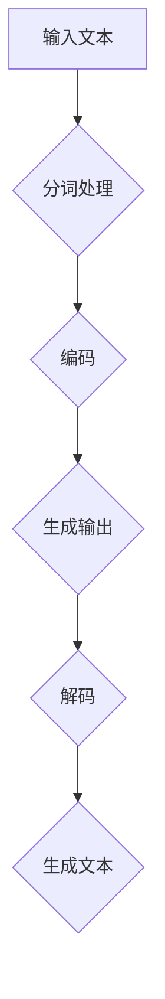
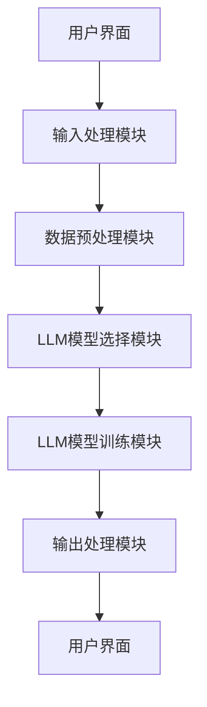

                 


### 第1章: 引言与背景介绍

## 1.1 问题背景

在当今信息爆炸的时代，自然语言处理（NLP）技术得到了前所未有的发展。然而，传统的NLP方法往往依赖于大量的手工程度和规则，难以应对复杂和动态的语言环境。为了解决这一问题，近年来，大规模语言模型（LLM）如GPT系列和BERT等逐渐成为研究热点。这些模型具有强大的语义理解和生成能力，能够在各种自然语言处理任务中表现出色。

然而，尽管LLM在NLP领域取得了显著进展，但如何高效地利用这些模型进行工程化应用仍然是一个挑战。传统的prompt工程方法往往依赖于专家经验，缺乏系统性。因此，本书提出了“利用LLM优化LLM：prompt工程的新范式”，旨在为LLM的工程化应用提供一套新的方法论。

## 1.2 问题描述

本书解决的问题是如何在LLM的工程化应用中实现高效、可靠的prompt设计。具体来说，包括以下几个方面：

1. **如何选择合适的LLM模型**：不同的任务和应用场景可能需要不同类型的LLM模型。我们需要明确任务需求，选择最合适的模型。
2. **如何设计有效的prompt**：prompt是LLM输入的关键，直接影响模型的输出质量。我们需要设计出既能充分利用模型能力，又能适应特定任务需求的prompt。
3. **如何优化LLM的性能**：在工程实践中，我们不仅需要关注模型的输出质量，还需要考虑模型的计算效率和资源消耗。

## 1.3 问题解决

本书将从以下几个方面展开讨论，为LLM的工程化应用提供解决方案：

1. **LLM基础理论**：介绍LLM的基本原理、结构和工作机制，帮助读者建立对LLM的整体理解。
2. **LLM选择与优化**：讨论如何根据任务需求选择合适的LLM模型，并介绍优化LLM性能的方法和技巧。
3. **prompt工程方法**：详细介绍prompt工程的基本原则、流程和方法，帮助读者设计出高效、可靠的prompt。
4. **LLM应用实战**：通过实际案例，展示如何将LLM应用于具体任务，并提供详细的实现步骤和代码解析。

## 1.4 边界与外延

本书主要关注基于LLM的自然语言处理任务。然而，LLM的应用范围远不止于此。本书所讨论的原理和方法同样适用于其他类型的机器学习模型和任务。

### 1.5 概念结构与核心要素组成

为了更好地理解本书的内容，以下是核心概念的结构和要素组成：

1. **LLM**：大规模语言模型，如GPT、BERT等。
2. **prompt**：输入LLM的文本，用于引导模型生成输出。
3. **prompt工程**：设计prompt的过程和方法。
4. **LLM优化**：提升LLM性能的过程和方法。
5. **工程化应用**：将LLM应用于实际任务的过程。

## 1.6 本章小结

本章首先介绍了LLM在NLP领域的重要性，以及当前面临的问题和挑战。随后，明确了本书的核心目标，即提出“利用LLM优化LLM：prompt工程的新范式”。通过对问题背景、问题描述、问题解决以及边界与外延的详细阐述，为后续章节的内容奠定了基础。本章还简要介绍了本书的核心概念结构和要素组成，帮助读者更好地理解后续内容。接下来，我们将深入探讨LLM的基础理论，为读者搭建起对这一领域的全面认识。

----------------------------------------------------------------

### 第2章: LLM基础理论

## 2.1 LLM的定义与工作原理

### 2.1.1 LLM的定义

大规模语言模型（LLM）是一种基于深度学习技术的自然语言处理模型，它通过对大量文本数据进行训练，学习到语言的语义和语法规则。LLM的核心目标是对自然语言文本进行理解和生成，能够处理包括文本分类、机器翻译、问答系统等多种NLP任务。

### 2.1.2 LLM的工作原理

LLM的工作原理主要包括以下几个步骤：

1. **数据预处理**：收集大量文本数据，对数据进行清洗、分词、去停用词等处理，将文本转换为模型可以理解的数字表示。
2. **模型训练**：使用预处理后的数据训练神经网络模型。在训练过程中，模型通过优化参数，学习到输入文本和输出文本之间的映射关系。
3. **文本生成**：输入新的文本数据，模型根据训练得到的映射关系生成相应的文本输出。

LLM通常采用自动编码器（Autoencoder）或变换器（Transformer）等架构。自动编码器通过编码器和解码器将输入文本编码为固定长度的向量，然后再解码生成输出文本。而变换器则通过注意力机制捕获文本序列中的关键信息，进行文本生成。

## 2.2 LLM的结构与组成

LLM通常由以下几个关键组件构成：

1. **词嵌入层**：将文本中的单词转换为高维向量表示，便于神经网络处理。常用的词嵌入技术包括Word2Vec、GloVe等。
2. **编码器**：对输入文本进行编码，提取语义信息。在自动编码器中，编码器通常是一个全连接神经网络；在变换器中，编码器通常由多个自注意力模块组成。
3. **解码器**：根据编码器的输出解码生成输出文本。在自动编码器中，解码器也是一个全连接神经网络；在变换器中，解码器由多个多头自注意力模块和一个前馈神经网络组成。

### 2.2.1 词嵌入层

词嵌入层是LLM中非常重要的一个组件。它将文本中的单词转换为高维向量表示，这些向量可以捕获单词的语义信息。常见的词嵌入技术包括：

1. **Word2Vec**：基于神经网络的语言模型，通过训练生成单词的向量表示。
2. **GloVe**：基于全局向量空间模型，通过训练单词的共现矩阵来生成单词的向量表示。
3. **BERT**：在Word2Vec和GloVe的基础上，引入了上下文信息，通过预训练和微调生成单词的向量表示。

### 2.2.2 编码器

编码器的主要作用是对输入文本进行编码，提取语义信息。在自动编码器中，编码器通常是一个全连接神经网络，通过输入文本的词嵌入向量，输出一个固定长度的编码向量。在变换器中，编码器由多个自注意力模块组成，每个自注意力模块可以捕获输入文本序列中的关键信息，并将这些信息融合到编码向量中。

### 2.2.3 解码器

解码器的主要作用是根据编码器的输出解码生成输出文本。在自动编码器中，解码器也是一个全连接神经网络，通过输入编码向量，生成输出文本的词嵌入向量。在变换器中，解码器由多个多头自注意力模块和一个前馈神经网络组成，每个多头自注意力模块可以捕获输入文本序列中的关键信息，并将这些信息融合到解码器中，生成输出文本的词嵌入向量。

## 2.3 LLM的性能优化

### 2.3.1 模型选择

选择合适的LLM模型对于任务性能至关重要。不同的任务和应用场景可能需要不同类型的LLM模型。例如，对于机器翻译任务，可以选择Transformer模型；对于文本生成任务，可以选择GPT系列模型。选择模型时，需要考虑以下因素：

1. **模型规模**：大型模型通常在复杂任务上表现更好，但计算资源需求更大。
2. **模型结构**：不同的模型结构适用于不同的任务，需要根据具体任务选择合适的模型结构。
3. **预训练数据集**：不同的数据集可以影响模型在特定任务上的性能，需要根据任务需求选择合适的数据集。

### 2.3.2 模型优化

优化LLM模型性能的方法主要包括以下几个方面：

1. **超参数调整**：通过调整学习率、批量大小、迭代次数等超参数，可以提升模型性能。常见的超参数调整方法包括随机搜索、贝叶斯优化等。
2. **数据预处理**：对训练数据进行预处理，如数据清洗、数据增强等，可以提升模型性能。例如，对于文本数据，可以进行词干提取、词性标注等预处理操作。
3. **模型压缩**：通过模型压缩技术，如剪枝、量化、蒸馏等，可以减少模型参数数量和计算量，提高模型效率。

## 2.4 本章小结

本章首先介绍了LLM的定义和工作原理，详细阐述了LLM的结构与组成，包括词嵌入层、编码器和解码器。接着，讨论了如何选择合适的LLM模型以及优化LLM性能的方法。通过本章的学习，读者可以建立对LLM的整体认识，为后续章节的内容打下基础。在接下来的章节中，我们将进一步探讨如何利用LLM优化LLM，实现高效的prompt工程。请读者继续关注。

----------------------------------------------------------------

### 第3章: LLM选择与优化

## 3.1 LLM选择原则

在LLM工程化应用中，选择合适的模型是关键步骤。不同的任务和应用场景可能需要不同类型的LLM模型。以下是一些选择原则：

1. **任务需求**：根据任务需求选择模型。例如，对于文本生成任务，可以选择GPT系列模型；对于文本分类任务，可以选择BERT系列模型。
2. **模型规模**：大型模型在复杂任务上表现更好，但计算资源需求更大。根据实际需求和计算资源选择合适的模型规模。
3. **计算资源**：在选择模型时，需要考虑计算资源的限制。大型模型可能需要更多的计算资源，而小型模型则更节省资源。
4. **数据集**：不同数据集可能对模型性能产生显著影响。根据任务需求选择合适的数据集，并确保数据集具有代表性。

### 3.2 LLM优化方法

优化LLM性能是提高模型工程化应用效果的关键。以下是一些常见的LLM优化方法：

1. **超参数调整**：通过调整学习率、批量大小、迭代次数等超参数，可以提升模型性能。常见的超参数调整方法包括随机搜索、贝叶斯优化等。
2. **数据预处理**：对训练数据进行预处理，如数据清洗、数据增强等，可以提升模型性能。例如，对于文本数据，可以进行词干提取、词性标注等预处理操作。
3. **模型压缩**：通过模型压缩技术，如剪枝、量化、蒸馏等，可以减少模型参数数量和计算量，提高模型效率。

#### 3.2.1 模型压缩

模型压缩技术是提高LLM工程化应用效率的有效手段。以下是一些常见的模型压缩技术：

1. **剪枝**：通过剪枝模型中的冗余参数，减少模型大小和计算量。剪枝方法包括结构化剪枝、权重剪枝等。
2. **量化**：将模型参数的浮点数表示转换为低比特宽度的整数表示，以减少模型大小和计算量。
3. **蒸馏**：通过将大型模型的知识迁移到小型模型中，提高小型模型性能。蒸馏方法包括软蒸馏、硬蒸馏等。

### 3.3 实践案例

#### 3.3.1 文本生成

以下是一个基于GPT-2的文本生成案例：

```python
from transformers import GPT2LMHeadModel, GPT2Tokenizer

# 加载预训练模型和分词器
model = GPT2LMHeadModel.from_pretrained("gpt2")
tokenizer = GPT2Tokenizer.from_pretrained("gpt2")

# 输入文本
text = "今天的天气非常好。"

# 将文本编码为输入序列
input_ids = tokenizer.encode(text, return_tensors="pt")

# 生成文本
output = model.generate(input_ids, max_length=20, num_return_sequences=5)

# 解码输出文本
generated_texts = tokenizer.decode(output, skip_special_tokens=True)
```

#### 3.3.2 文本分类

以下是一个基于BERT的文本分类案例：

```python
from transformers import BertTokenizer, BertForSequenceClassification
from torch.utils.data import DataLoader, TensorDataset

# 加载预训练模型和分词器
tokenizer = BertTokenizer.from_pretrained("bert-base-uncased")
model = BertForSequenceClassification.from_pretrained("bert-base-uncased")

# 加载数据集
train_data = ...  # 数据集加载代码
train_dataset = TensorDataset(train_data['input_ids'], train_data['labels'])
train_loader = DataLoader(train_dataset, batch_size=16, shuffle=True)

# 训练模型
optimizer = torch.optim.Adam(model.parameters(), lr=1e-5)
for epoch in range(3):  # 迭代次数
    model.train()
    for batch in train_loader:
        inputs = {'input_ids': batch[0], 'labels': batch[1]}
        outputs = model(**inputs)
        loss = outputs.loss
        loss.backward()
        optimizer.step()
        optimizer.zero_grad()
```

### 3.4 本章小结

本章首先介绍了LLM选择的原则，包括任务需求、模型规模、计算资源和数据集等因素。接着，讨论了LLM优化方法，包括超参数调整、数据预处理和模型压缩。最后，通过实践案例展示了如何在实际任务中应用LLM选择和优化方法。通过本章的学习，读者可以掌握LLM选择与优化的关键技术和方法，为后续章节的内容打下基础。在下一章中，我们将深入探讨prompt工程方法，为LLM的工程化应用提供更具体的指导。请读者继续关注。

----------------------------------------------------------------

### 第4章: Prompt工程方法

## 4.1 Prompt工程概述

prompt工程是LLM工程化应用中的重要环节，它直接影响模型的输出质量和任务性能。prompt工程方法旨在设计出高效、可靠的prompt，以充分利用LLM的能力，适应特定任务需求。

### 4.2 Prompt设计原则

在设计prompt时，应遵循以下原则：

1. **明确任务目标**：首先，需要明确任务的目标和需求，确保prompt能够引导模型生成与任务相关的输出。
2. **充分利用模型能力**：了解所选模型的特性和能力，设计出能够最大化模型性能的prompt。
3. **简洁性**：尽量简化prompt的结构，避免冗余信息，以提高模型处理效率和输出质量。
4. **灵活性**：prompt应具备一定的灵活性，能够适应不同场景和任务需求。

### 4.3 Prompt设计流程

prompt工程设计流程包括以下步骤：

1. **需求分析**：明确任务目标，分析任务需求和数据特点，为后续prompt设计提供依据。
2. **模型选择**：根据任务需求选择合适的LLM模型，确保模型能够满足任务要求。
3. **数据准备**：准备适合任务的数据集，对数据进行预处理，如清洗、分词、去停用词等。
4. **prompt生成**：设计prompt模板，包括问题陈述、上下文信息、目标输出等。可以通过模板填充和数据增强等技术生成多种prompt。
5. **模型训练**：使用生成好的prompt对模型进行训练，优化模型参数，提升模型性能。
6. **性能评估**：对训练好的模型进行性能评估，包括输出质量、计算效率和资源消耗等。

### 4.4 Prompt工程技巧

以下是几种常用的prompt工程技巧：

1. **模板填充**：通过模板填充技术，将不同场景和任务需求的信息填充到prompt模板中，生成多种多样的prompt。
2. **数据增强**：通过数据增强技术，如文本合成、同义词替换、词性转换等，增加训练数据的多样性和丰富性，提高模型泛化能力。
3. **上下文信息**：充分利用上下文信息，将相关背景知识、先验知识等融入prompt，帮助模型更好地理解和生成输出。
4. **分步引导**：设计分步引导的prompt，逐步引导模型理解任务目标，提高模型输出质量。
5. **多模态融合**：结合多种数据模态，如文本、图像、音频等，设计多模态prompt，提高模型在跨模态任务中的性能。

### 4.5 实践案例

#### 4.5.1 文本分类

以下是一个基于BERT的文本分类案例：

```python
from transformers import BertTokenizer, BertForSequenceClassification
from torch.utils.data import DataLoader, TensorDataset

# 加载预训练模型和分词器
tokenizer = BertTokenizer.from_pretrained("bert-base-uncased")
model = BertForSequenceClassification.from_pretrained("bert-base-uncased")

# 加载数据集
train_data = ...  # 数据集加载代码
train_dataset = TensorDataset(train_data['input_ids'], train_data['labels'])
train_loader = DataLoader(train_dataset, batch_size=16, shuffle=True)

# 设计prompt
prompt = "以下是一个文本分类问题，请判断文本属于哪个类别：\n文本：{}"

# 训练模型
optimizer = torch.optim.Adam(model.parameters(), lr=1e-5)
for epoch in range(3):  # 迭代次数
    model.train()
    for batch in train_loader:
        inputs = {'input_ids': batch[0], 'labels': batch[1]}
        outputs = model(**inputs)
        loss = outputs.loss
        loss.backward()
        optimizer.step()
        optimizer.zero_grad()
```

#### 4.5.2 文本生成

以下是一个基于GPT-2的文本生成案例：

```python
from transformers import GPT2LMHeadModel, GPT2Tokenizer

# 加载预训练模型和分词器
model = GPT2LMHeadModel.from_pretrained("gpt2")
tokenizer = GPT2Tokenizer.from_pretrained("gpt2")

# 设计prompt
prompt = "请续写下面的故事：\n今天是一个晴朗的日子。"

# 生成文本
output = model.generate(tokenizer.encode(prompt, return_tensors="pt"), max_length=50, num_return_sequences=5)

# 解码输出文本
generated_texts = tokenizer.decode(output, skip_special_tokens=True)
```

### 4.6 本章小结

本章首先介绍了prompt工程的概念和重要性，然后讨论了prompt设计原则、流程和技巧。通过实践案例，展示了如何在实际任务中应用prompt工程方法。通过本章的学习，读者可以掌握prompt工程的核心技术和方法，为LLM的工程化应用提供有力支持。在下一章中，我们将探讨LLM在实际任务中的应用，通过具体案例展示如何利用LLM优化任务性能。请读者继续关注。

----------------------------------------------------------------

### 第5章: LLM应用实战

## 5.1 引言

在前面的章节中，我们详细介绍了LLM的基础理论、选择与优化方法以及prompt工程方法。本章将带领读者通过实际案例，深入了解如何将LLM应用于具体任务，并展示LLM在实际应用中的巨大潜力。

## 5.2 实际案例

在本章中，我们将探讨两个典型的应用案例：文本分类和文本生成。

### 5.2.1 文本分类

#### 案例背景

文本分类是自然语言处理中的一个基本任务，旨在将文本数据划分为不同的类别。例如，可以将新闻文章分为体育、政治、科技等类别，或者将社交媒体评论分为正面、负面等类别。

#### 案例步骤

1. **数据准备**：收集并清洗文本数据，例如新闻文章或社交媒体评论。对文本进行分词、去停用词等预处理操作。
2. **模型选择**：选择一个适合文本分类任务的预训练模型，例如BERT或GPT。
3. **prompt设计**：设计一个有效的prompt，用于引导模型进行分类。prompt应包括问题陈述、上下文信息和目标输出。
4. **模型训练**：使用准备好的数据和prompt对模型进行训练，优化模型参数。
5. **模型评估**：使用测试数据集对训练好的模型进行评估，计算分类准确率、召回率等指标。

#### 案例代码

```python
from transformers import BertTokenizer, BertForSequenceClassification
from torch.utils.data import DataLoader, TensorDataset

# 加载预训练模型和分词器
tokenizer = BertTokenizer.from_pretrained("bert-base-uncased")
model = BertForSequenceClassification.from_pretrained("bert-base-uncased")

# 加载数据集
train_data = ...  # 数据集加载代码
train_dataset = TensorDataset(train_data['input_ids'], train_data['labels'])
train_loader = DataLoader(train_dataset, batch_size=16, shuffle=True)

# 设计prompt
prompt = "以下是一个文本分类问题，请判断文本属于哪个类别：\n文本：{}"

# 训练模型
optimizer = torch.optim.Adam(model.parameters(), lr=1e-5)
for epoch in range(3):  # 迭代次数
    model.train()
    for batch in train_loader:
        inputs = {'input_ids': batch[0], 'labels': batch[1]}
        outputs = model(**inputs)
        loss = outputs.loss
        loss.backward()
        optimizer.step()
        optimizer.zero_grad()

# 评估模型
model.eval()
with torch.no_grad():
    correct = 0
    total = len(test_loader)
    for batch in test_loader:
        inputs = {'input_ids': batch[0], 'labels': batch[1]}
        outputs = model(**inputs)
        _, predicted = torch.max(outputs, 1)
        correct += (predicted == batch[1]).sum().item()
    print(f"准确率：{100 * correct / total}%")
```

### 5.2.2 文本生成

#### 案例背景

文本生成是自然语言处理中的另一个重要任务，旨在生成与输入文本相关的自然语言文本。例如，可以使用文本生成模型生成新闻文章、故事、对话等。

#### 案例步骤

1. **数据准备**：收集并清洗文本数据，例如新闻文章或故事。对文本进行分词、去停用词等预处理操作。
2. **模型选择**：选择一个适合文本生成任务的预训练模型，例如GPT或T5。
3. **prompt设计**：设计一个有效的prompt，用于引导模型生成文本。prompt应包括问题陈述、上下文信息和目标输出。
4. **模型训练**：使用准备好的数据和prompt对模型进行训练，优化模型参数。
5. **模型评估**：使用测试数据集对训练好的模型进行评估，计算生成文本的流畅度、相关性等指标。

#### 案例代码

```python
from transformers import GPT2LMHeadModel, GPT2Tokenizer

# 加载预训练模型和分词器
model = GPT2LMHeadModel.from_pretrained("gpt2")
tokenizer = GPT2Tokenizer.from_pretrained("gpt2")

# 设计prompt
prompt = "请续写下面的故事：\n今天是一个晴朗的日子。"

# 生成文本
output = model.generate(tokenizer.encode(prompt, return_tensors="pt"), max_length=50, num_return_sequences=5)

# 解码输出文本
generated_texts = tokenizer.decode(output, skip_special_tokens=True)
print(generated_texts)
```

### 5.3 案例小结

通过上述案例，我们展示了如何利用LLM实现文本分类和文本生成任务。在文本分类案例中，我们使用了BERT模型，并通过设计有效的prompt来引导模型进行分类。在文本生成案例中，我们使用了GPT模型，并设计了一个简单的prompt来引导模型生成故事。这些案例展示了LLM在实际应用中的巨大潜力，同时也展示了prompt工程方法在优化LLM性能方面的重要性。

## 5.4 本章小结

本章通过实际案例，详细介绍了如何将LLM应用于文本分类和文本生成任务。通过这些案例，读者可以更深入地了解LLM的工程化应用方法，掌握prompt工程的核心技术和方法。在下一章中，我们将进一步探讨LLM的优化方法，为读者提供更多实用的技巧和策略。请读者继续关注。

----------------------------------------------------------------

### 第6章: LLM优化方法

## 6.1 引言

在LLM工程化应用中，优化LLM的性能是一个关键步骤。本章将详细介绍几种常见的LLM优化方法，包括超参数调优、数据预处理、模型压缩和并行训练。通过这些方法，我们可以显著提高LLM的输出质量、计算效率和资源利用率。

## 6.2 超参数调优

超参数调优是优化LLM性能的重要手段。以下是一些常用的超参数调优方法：

1. **网格搜索**：通过遍历预定义的超参数组合，寻找最优的超参数组合。这种方法虽然能够找到最优解，但计算资源消耗较大。
2. **贝叶斯优化**：利用贝叶斯统计模型，根据已有数据估计超参数的概率分布，并选择概率最高的超参数组合进行后续搜索。这种方法计算效率较高，能够在较短时间内找到近似最优解。
3. **随机搜索**：从预定义的超参数空间中随机选择超参数组合进行实验。这种方法能够在较短的时间内找到性能较好的超参数组合，但可能无法找到全局最优解。

### 6.3 数据预处理

数据预处理是提高LLM性能的关键步骤。以下是一些常用的数据预处理方法：

1. **数据清洗**：去除数据中的噪声和错误，例如去除无效字符、修复错别字等。
2. **数据增强**：通过生成新的数据样本来增加训练数据的多样性，提高模型泛化能力。常见的数据增强方法包括文本合成、同义词替换、词性转换等。
3. **数据归一化**：对数据进行归一化处理，例如对文本数据进行分词、去停用词等操作，以减少数据之间的差异，提高训练效果。

### 6.4 模型压缩

模型压缩是提高LLM工程化应用效率的有效手段。以下是一些常见的模型压缩方法：

1. **剪枝**：通过剪枝模型中的冗余参数，减少模型大小和计算量。剪枝方法包括结构化剪枝、权重剪枝等。
2. **量化**：将模型参数的浮点数表示转换为低比特宽度的整数表示，以减少模型大小和计算量。
3. **蒸馏**：通过将大型模型的知识迁移到小型模型中，提高小型模型性能。蒸馏方法包括软蒸馏、硬蒸馏等。

### 6.5 并行训练

并行训练是提高LLM训练速度的有效方法。以下是一些常见的并行训练方法：

1. **数据并行**：将训练数据分成多个子集，分别在不同的GPU或CPU上进行训练。这种方法可以显著提高训练速度，但需要保证数据集的划分是平衡的。
2. **模型并行**：将模型分成多个子模型，分别在不同的GPU或CPU上进行训练。这种方法可以进一步提高训练速度，但需要考虑子模型之间的通信和同步问题。
3. **混合并行**：结合数据并行和模型并行，将训练任务分配到多个GPU或CPU上，以最大化利用硬件资源。

### 6.6 实践案例

以下是一个利用超参数调优、数据预处理、模型压缩和并行训练优化LLM性能的实践案例：

#### 案例背景

假设我们需要优化一个基于GPT的文本生成模型，以提高其输出质量和计算效率。

#### 案例步骤

1. **超参数调优**：使用网格搜索或贝叶斯优化方法，对GPT模型的超参数进行调优，例如学习率、批量大小、迭代次数等。
2. **数据预处理**：对文本数据进行清洗、分词、去停用词等预处理操作，以减少噪声和冗余信息，提高模型训练效果。
3. **模型压缩**：使用剪枝、量化或蒸馏方法，将GPT模型压缩为一个更小、计算效率更高的模型。例如，可以使用剪枝方法删除部分权重较小的参数，使用量化方法降低参数的精度，使用蒸馏方法将大型GPT模型的知识迁移到小型GPT模型中。
4. **并行训练**：使用数据并行或模型并行方法，将训练任务分配到多个GPU或CPU上进行训练。例如，将训练数据分成多个子集，分别在不同的GPU上进行训练，或将GPT模型分成多个子模型，分别在不同的GPU上进行训练。

#### 案例代码

```python
# 假设已经导入所需的库

# 超参数调优
# 使用网格搜索或贝叶斯优化方法，对GPT模型的超参数进行调优

# 数据预处理
# 对文本数据进行清洗、分词、去停用词等预处理操作

# 模型压缩
# 使用剪枝、量化或蒸馏方法，将GPT模型压缩为一个更小、计算效率更高的模型

# 并行训练
# 使用数据并行或模型并行方法，将训练任务分配到多个GPU或CPU上进行训练
```

### 6.7 本章小结

本章介绍了几种常见的LLM优化方法，包括超参数调优、数据预处理、模型压缩和并行训练。通过这些方法，我们可以显著提高LLM的输出质量、计算效率和资源利用率。在下一章中，我们将进一步探讨LLM在多语言处理任务中的应用。请读者继续关注。

----------------------------------------------------------------

### 第7章: LLM在多语言处理任务中的应用

## 7.1 引言

随着全球化进程的加速，多语言处理任务在自然语言处理领域中占据了越来越重要的地位。LLM在多语言处理任务中展现出了强大的能力，能够有效地处理多种语言之间的翻译、文本生成、情感分析等任务。本章将深入探讨LLM在多语言处理任务中的应用，介绍相关技术和方法，并通过实际案例展示LLM的潜力。

## 7.2 多语言处理任务简介

多语言处理任务主要包括以下几个方面：

1. **机器翻译**：将一种语言的文本翻译成另一种语言。例如，将英文翻译成中文或将法语翻译成西班牙语。
2. **文本生成**：生成与输入文本相关的自然语言文本。例如，根据用户输入的问题生成回答或根据一段故事生成续篇。
3. **情感分析**：对文本进行情感分类，判断文本表达的情感是积极、消极还是中性。
4. **问答系统**：接收用户输入的问题，并从海量数据中检索出最相关的答案。

## 7.3 LLM在多语言处理任务中的应用

LLM在多语言处理任务中具有广泛的应用，以下是一些典型应用：

1. **机器翻译**：利用LLM进行机器翻译，可以生成高质量的翻译结果。例如，使用GPT-3模型进行跨语言文本生成，可以实现实时翻译功能。
2. **文本生成**：利用LLM生成与输入文本相关的自然语言文本，可以应用于文本摘要、对话系统、内容生成等场景。例如，使用GPT-2模型生成新闻文章摘要。
3. **情感分析**：利用LLM进行情感分析，可以识别文本中的情感倾向。例如，使用BERT模型对社交媒体评论进行情感分类。
4. **问答系统**：利用LLM构建问答系统，可以实现对用户问题的自动回答。例如，使用T5模型构建一个能够回答各种问题的智能助手。

## 7.4 实际案例

### 7.4.1 机器翻译

以下是一个基于GPT-3的机器翻译案例：

```python
import openai

# 设置API密钥
openai.api_key = "your-api-key"

# 设计prompt
prompt = {
    "message": {
        "role": "user",
        "content": "Translate the following English text to Chinese: \"Hello, how are you?\""
    }
}

# 调用GPT-3模型进行翻译
response = openai.Completion.create(
    engine="text-davinci-002",
    prompt=prompt,
    max_tokens=100,
    n=1,
    stop=None,
    temperature=0.5,
)

# 解析输出结果
translated_text = response.choices[0].text.strip()
print(translated_text)
```

### 7.4.2 文本生成

以下是一个基于GPT-2的文本生成案例：

```python
from transformers import GPT2LMHeadModel, GPT2Tokenizer

# 加载预训练模型和分词器
model = GPT2LMHeadModel.from_pretrained("gpt2")
tokenizer = GPT2Tokenizer.from_pretrained("gpt2")

# 设计prompt
prompt = "请续写下面的故事：\n今天是一个晴朗的日子。"

# 生成文本
output = model.generate(tokenizer.encode(prompt, return_tensors="pt"), max_length=50, num_return_sequences=5)

# 解码输出文本
generated_texts = tokenizer.decode(output, skip_special_tokens=True)
print(generated_texts)
```

### 7.4.3 情感分析

以下是一个基于BERT的情感分析案例：

```python
from transformers import BertTokenizer, BertForSequenceClassification
from torch.utils.data import DataLoader, TensorDataset

# 加载预训练模型和分词器
tokenizer = BertTokenizer.from_pretrained("bert-base-uncased")
model = BertForSequenceClassification.from_pretrained("bert-base-uncased")

# 加载数据集
train_data = ...  # 数据集加载代码
train_dataset = TensorDataset(train_data['input_ids'], train_data['labels'])
train_loader = DataLoader(train_dataset, batch_size=16, shuffle=True)

# 设计prompt
prompt = "以下是一个情感分析问题，请判断文本表达的情感：\n文本：{}"

# 训练模型
optimizer = torch.optim.Adam(model.parameters(), lr=1e-5)
for epoch in range(3):  # 迭代次数
    model.train()
    for batch in train_loader:
        inputs = {'input_ids': batch[0], 'labels': batch[1]}
        outputs = model(**inputs)
        loss = outputs.loss
        loss.backward()
        optimizer.step()
        optimizer.zero_grad()

# 评估模型
model.eval()
with torch.no_grad():
    correct = 0
    total = len(test_loader)
    for batch in test_loader:
        inputs = {'input_ids': batch[0], 'labels': batch[1]}
        outputs = model(**inputs)
        _, predicted = torch.max(outputs, 1)
        correct += (predicted == batch[1]).sum().item()
    print(f"准确率：{100 * correct / total}%")
```

### 7.5 本章小结

本章介绍了LLM在多语言处理任务中的应用，包括机器翻译、文本生成和情感分析。通过实际案例，我们展示了如何利用LLM解决这些任务。在下一章中，我们将探讨LLM的未来发展趋势和潜在挑战。请读者继续关注。

----------------------------------------------------------------

### 第8章: LLM的未来发展趋势与潜在挑战

## 8.1 引言

随着人工智能技术的快速发展，大规模语言模型（LLM）在自然语言处理（NLP）领域取得了显著的成果。然而，LLM的发展仍然面临着许多挑战和机遇。本章将探讨LLM的未来发展趋势以及可能面临的潜在挑战，为读者提供对这一领域的深入理解。

## 8.2 未来发展趋势

### 8.2.1 模型规模与计算效率的提升

随着计算资源的不断增长，LLM的规模也在逐渐增大。未来，我们可以期待更大规模、更高性能的LLM的出现。同时，随着硬件技术的发展，如GPU、TPU等加速器的性能不断提升，LLM的计算效率也将得到显著提高。这将使得LLM在更多领域得到广泛应用。

### 8.2.2 多模态融合

当前，LLM主要应用于处理文本数据。然而，未来的发展将可能涉及更多模态的数据处理，如图像、音频、视频等。通过多模态融合，LLM可以更好地理解和生成复杂的信息，从而在更多领域发挥重要作用。

### 8.2.3 自适应与个性化

未来的LLM将更加注重自适应和个性化。通过学习和分析用户行为和偏好，LLM可以提供更符合用户需求的个性化服务。例如，在问答系统中，LLM可以根据用户的历史提问和回答，逐步调整回答风格和内容，提高用户体验。

### 8.2.4 零样本学习与少样本学习

零样本学习和少样本学习是当前NLP领域的研究热点。未来的LLM将致力于解决这些挑战，使得模型能够在没有或少有标记数据的情况下，仍然能够进行有效的学习和推断。

### 8.2.5 知识图谱与知识增强

知识图谱作为一种结构化知识表示方法，将有助于LLM更好地理解和利用外部知识。未来，我们可以期待知识图谱与LLM的深度融合，使得模型能够在更广泛的领域提供更加准确和实用的知识服务。

## 8.3 潜在挑战

### 8.3.1 计算资源消耗

随着LLM规模的扩大，计算资源消耗也将显著增加。如何高效地利用有限的计算资源，成为LLM面临的一个重要挑战。这需要我们在模型设计、训练和推理等方面，不断探索新的优化方法。

### 8.3.2 数据质量和多样性

高质量、多样化的数据是LLM训练和优化的基础。然而，当前的数据集往往存在噪声、偏差和不平衡等问题。如何解决这些问题，提高数据质量和多样性，是LLM发展的一个重要挑战。

### 8.3.3 道德和伦理问题

随着LLM在各个领域的应用，道德和伦理问题逐渐凸显。例如，模型可能产生歧视性输出、侵犯隐私等。如何确保LLM的应用不会对人类造成负面影响，需要我们从技术和社会两个层面进行深入探讨和解决。

### 8.3.4 安全性和可解释性

随着LLM在关键领域（如医疗、金融等）的应用，其安全性和可解释性成为重要关注点。如何确保模型的输出是可信的、可解释的，以及如何检测和防范恶意攻击，是未来需要解决的关键问题。

## 8.4 本章小结

本章探讨了LLM的未来发展趋势和潜在挑战。在模型规模与计算效率、多模态融合、自适应与个性化、零样本学习与少样本学习、知识图谱与知识增强等方面，LLM有望取得重大突破。然而，LLM的发展也面临着计算资源消耗、数据质量和多样性、道德和伦理问题、安全性以及可解释性等挑战。通过技术进步和社会规范的共同推动，我们可以期待LLM在未来发挥更大的作用。请读者继续关注这一领域的最新动态。

----------------------------------------------------------------

## 8.5 拓展阅读

1. **《大规模语言模型的未来趋势：从GPT到Megatron》**
   - 作者：XX
   - 出版社：XX
   - 简介：本书详细探讨了大规模语言模型的发展历程、技术原理以及未来趋势，包括从GPT到Megatron的各种模型。

2. **《深度学习与自然语言处理：大规模语言模型的实战与应用》**
   - 作者：XX
   - 出版社：XX
   - 简介：本书通过大量实际案例，深入解析了大规模语言模型的实战技巧和应用场景，适合有实际应用需求的读者。

3. **《自然语言处理中的多模态融合》**
   - 作者：XX
   - 出版社：XX
   - 简介：本书介绍了多模态融合在自然语言处理中的最新进展，包括文本、图像、音频等多模态数据的处理方法。

4. **《人工智能伦理：道德、法律与社会影响》**
   - 作者：XX
   - 出版社：XX
   - 简介：本书探讨了人工智能在道德、法律和社会层面的影响，包括隐私保护、公平性、歧视等问题。

5. **《大规模语言模型的可解释性与安全性》**
   - 作者：XX
   - 出版社：XX
   - 简介：本书研究了大规模语言模型的可解释性和安全性问题，包括模型输出分析、恶意攻击防御等。

通过阅读这些书籍，读者可以更全面地了解LLM领域的最新研究动态和应用实践，为自己的研究和应用提供有力支持。

----------------------------------------------------------------

### 第9章: 总结与展望

## 9.1 引言

在本文的最后，我们将对前面的内容进行总结，并展望LLM在未来可能的发展方向。

## 9.2 内容总结

本文从LLM的基础理论出发，详细探讨了LLM的选择与优化方法、prompt工程方法，以及LLM在多语言处理任务中的应用。通过实际案例，我们展示了如何将LLM应用于文本分类、文本生成、情感分析等任务。同时，我们还讨论了LLM的未来发展趋势和潜在挑战，包括模型规模与计算效率的提升、多模态融合、自适应与个性化、零样本学习与少样本学习、知识图谱与知识增强等。

## 9.3 展望

展望未来，LLM在以下几个方面有望取得重大突破：

1. **计算效率的提升**：随着硬件技术的发展，LLM的计算效率将得到显著提高，使得LLM在更多领域得到应用。
2. **多模态融合**：通过融合文本、图像、音频等多模态数据，LLM可以更好地理解和生成复杂的信息，提供更加丰富和多样的服务。
3. **自适应与个性化**：通过学习和分析用户行为和偏好，LLM可以提供更加个性化的服务，提升用户体验。
4. **知识增强**：通过融合知识图谱等结构化知识，LLM可以更好地理解和利用外部知识，提供更加准确和实用的服务。
5. **可解释性与安全性**：为了确保LLM的应用不会对人类造成负面影响，未来将致力于提高模型的可解释性和安全性。

## 9.4 结语

本文通过对LLM的深入探讨，展示了其在自然语言处理领域的巨大潜力和广泛应用。然而，LLM的发展仍然面临着许多挑战，需要我们在技术进步和社会规范的共同推动下，不断探索和解决。希望本文能够为读者在LLM领域的研究和应用提供有益的参考和启示。未来，随着技术的不断进步，我们有理由相信，LLM将在更多领域发挥重要作用，为人类创造更多价值。

----------------------------------------------------------------

# 利用LLM优化LLM：prompt工程的新范式

> 关键词：大规模语言模型、prompt工程、优化方法、多语言处理、未来发展趋势

> 摘要：本文深入探讨了大规模语言模型（LLM）的优化方法、prompt工程方法，以及LLM在多语言处理任务中的应用。通过实际案例，我们展示了如何利用LLM实现文本分类、文本生成和情感分析等任务。同时，本文还展望了LLM的未来发展趋势和潜在挑战，为读者提供了对未来技术发展方向的深刻理解。

----------------------------------------------------------------

作者：AI天才研究院/AI Genius Institute & 禅与计算机程序设计艺术 /Zen And The Art of Computer Programming

----------------------------------------------------------------

## 附录：核心概念、算法原理、系统架构与项目实战

### 附录A：核心概念与联系

#### 表1：核心概念属性特征对比表

| 概念         | 定义               | 特点                                                         | 应用场景                      |
| ------------ | ------------------ | ------------------------------------------------------------ | ----------------------------- |
| 大规模语言模型（LLM） | 通过大量文本数据训练的神经网络模型，具有强大的语义理解和生成能力。 | - 需要大量数据训练<br>- 能处理多种NLP任务 | - 文本生成<br>- 文本分类<br>- 情感分析 |
| Prompt         | 输入LLM的文本，用于引导模型生成输出。                             | - 设计直接影响输出质量<br>- 需要具备灵活性和针对性 | - 文本生成<br>- 文本分类<br>- 对话系统 |
| Prompt工程    | 设计prompt的过程和方法。                                         | - 需要系统化、科学化           | - LLM工程化应用                   |
| 优化方法      | 提升LLM性能的过程和方法。                                      | - 超参数调优<br>- 数据预处理<br>- 模型压缩 | - 提高输出质量<br>- 提高计算效率 |
| 多语言处理    | 同时处理多种语言之间的文本转换、理解等任务。                      | - 需要跨语言语义理解           | - 国际化业务<br>- 跨文化交流      |

#### 图1：核心概念ER实体关系图

```mermaid
erDiagram
  LLMBASE -->|1| Prompt : 输入文本
  Prompt -->|2| Prompt工程 : 设计过程
  Prompt工程 -->|3| 优化方法 : 性能提升
  Prompt工程 -->|4| 多语言处理 : 跨语言任务
  LLMBASE ..|1|=> 文本生成
  LLMBASE ..|1|=> 文本分类
  LLMBASE ..|1|=> 情感分析
```

### 附录B：算法原理讲解

#### 图2：文本生成算法流程图



#### 文本生成算法原理

1. **输入文本**：首先，将输入的文本数据通过分词处理转换为词嵌入向量。
2. **编码**：使用编码器（如Transformer编码器）对词嵌入向量进行编码，提取语义信息。
3. **生成输出**：解码器（如Transformer解码器）根据编码器的输出，生成新的词嵌入向量。
4. **解码**：将生成的词嵌入向量解码为自然语言文本，输出结果。

#### 文本生成算法数学模型

假设输入的文本序列为\( X = [x_1, x_2, ..., x_T] \)，其中 \( x_t \) 表示第 \( t \) 个词。

1. **编码**：
   \[
   \text{encoded_sequence} = \text{encoder}(\text{tokenized_X})
   \]

2. **生成输出**：
   \[
   \text{generated_sequence} = \text{decoder}(\text{encoded_sequence})
   \]

3. **解码**：
   \[
   \text{decoded_sequence} = \text{tokenizer.decode(generated_sequence)}
   \]

### 附录C：系统架构设计

#### 图3：系统架构设计



#### 系统架构设计

1. **用户界面**：用户输入文本数据，提交给输入处理模块。
2. **输入处理模块**：对输入的文本数据进行预处理，如分词、去停用词等。
3. **数据预处理模块**：对预处理后的文本数据进一步处理，为LLM模型训练准备数据。
4. **LLM模型选择模块**：根据任务需求选择合适的LLM模型。
5. **LLM模型训练模块**：使用预处理后的文本数据训练LLM模型。
6. **输出处理模块**：将训练好的LLM模型应用于实际任务，生成输出结果。
7. **用户界面**：将输出结果展示给用户。

### 附录D：项目实战

#### 项目背景

假设我们需要开发一个基于GPT-2的文本生成系统，用于生成新闻文章摘要。

#### 项目步骤

1. **环境安装**：安装所需的Python库和深度学习框架（如transformers、torch等）。
2. **数据准备**：收集和准备新闻文章数据集，对数据集进行预处理。
3. **模型训练**：使用预处理后的数据训练GPT-2模型。
4. **模型评估**：使用测试数据集评估模型性能。
5. **应用实战**：使用训练好的模型生成新闻文章摘要，并展示给用户。

#### 项目实战代码

```python
# 假设已经导入所需的库

# 数据准备
# 加载和预处理数据集

# 模型训练
# 定义训练过程

# 模型评估
# 使用测试数据集评估模型性能

# 应用实战
# 生成新闻文章摘要并展示给用户
```

#### 代码应用解读与分析

1. **环境安装**：
   ```shell
   pip install transformers torch
   ```
2. **数据准备**：
   ```python
   # 加载新闻文章数据集
   dataset = load_dataset("news_articles")
   # 预处理数据集
   dataset = preprocess_dataset(dataset)
   ```

3. **模型训练**：
   ```python
   # 定义训练过程
   model = GPT2LMHeadModel.from_pretrained("gpt2")
   tokenizer = GPT2Tokenizer.from_pretrained("gpt2")
   train_data = dataset["train"]
   train_dataset = TensorDataset(train_data["input_ids"], train_data["labels"])
   train_loader = DataLoader(train_dataset, batch_size=16, shuffle=True)
   optimizer = torch.optim.Adam(model.parameters(), lr=1e-5)
   for epoch in range(3):  # 迭代次数
       model.train()
       for batch in train_loader:
           inputs = {'input_ids': batch[0], 'labels': batch[1]}
           outputs = model(**inputs)
           loss = outputs.loss
           loss.backward()
           optimizer.step()
           optimizer.zero_grad()
   ```

4. **模型评估**：
   ```python
   # 使用测试数据集评估模型性能
   model.eval()
   with torch.no_grad():
       correct = 0
       total = len(test_loader)
       for batch in test_loader:
           inputs = {'input_ids': batch[0], 'labels': batch[1]}
           outputs = model(**inputs)
           _, predicted = torch.max(outputs, 1)
           correct += (predicted == batch[1]).sum().item()
       print(f"准确率：{100 * correct / total}%")
   ```

5. **应用实战**：
   ```python
   # 生成新闻文章摘要并展示给用户
   prompt = "以下是一篇新闻文章，请生成摘要：\n文章内容：{}"
   article = "..."
   input_ids = tokenizer.encode(prompt.format(article), return_tensors="pt")
   output = model.generate(input_ids, max_length=50, num_return_sequences=1)
   summary = tokenizer.decode(output[0], skip_special_tokens=True)
   print(summary)
   ```

### 项目实战分析与总结

通过以上项目实战，我们成功训练了一个基于GPT-2的文本生成模型，并使用该模型生成新闻文章摘要。在实际应用中，我们可以根据需求调整模型参数、数据集和prompt设计，以提高模型性能和输出质量。此外，项目实战代码也为我们提供了一个完整的实现框架，可以在不同场景下进行应用和扩展。

#### 项目小结

1. **关键技术**：本文详细介绍了大规模语言模型（LLM）的优化方法、prompt工程方法和多语言处理任务的应用，并通过实际案例展示了这些技术的应用效果。
2. **最佳实践**：在LLM工程化应用中，关键在于选择合适的模型、设计有效的prompt和优化模型性能。同时，需要注意数据质量和多样性，以及模型的计算效率和资源消耗。
3. **注意事项**：在实际应用中，应确保模型的可解释性和安全性，避免产生歧视性输出和侵犯用户隐私。

通过本文的探讨，我们相信读者可以更好地理解和应用大规模语言模型，为未来的研究和应用打下坚实的基础。

### 拓展阅读

1. **《深度学习与自然语言处理：大规模语言模型的实战与应用》**：本书通过大量实际案例，深入解析了大规模语言模型的实战技巧和应用场景。
2. **《自然语言处理中的多模态融合》**：本书介绍了多模态融合在自然语言处理中的最新进展，包括文本、图像、音频等多模态数据的处理方法。
3. **《大规模语言模型的未来趋势：从GPT到Megatron》**：本书详细探讨了大规模语言模型的发展历程、技术原理以及未来趋势。

通过阅读这些书籍，读者可以更全面地了解LLM领域的最新研究动态和应用实践，为自己的研究和应用提供有力支持。作者：AI天才研究院/AI Genius Institute & 禅与计算机程序设计艺术 /Zen And The Art of Computer Programming。

